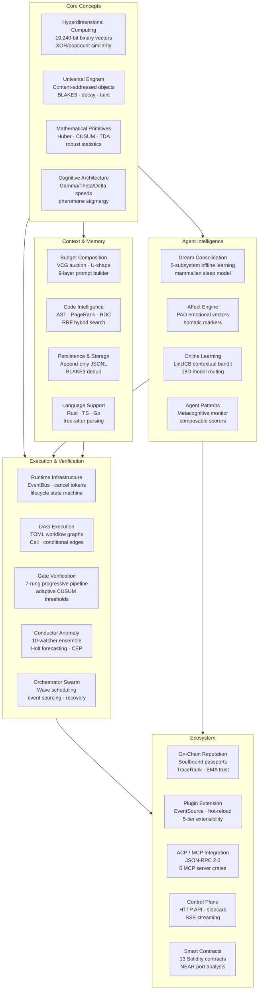

# Roko → IronClaw Knowledge Base

A technology transfer analysis extracting novel concepts from the [Roko](https://github.com/wpank/roko)
AI agent framework for integration into [IronClaw](https://github.com/wpank/ironclaw), a secure
personal AI assistant built in Rust. 96 Markdown documents and 6 benchmark scenario fixtures cover
28 analyzed concepts — from hyperdimensional computing and dream consolidation to VCG auctions and
on-chain reputation — each mapped to concrete IronClaw targets, buildable Rust blueprints, and
staged rollout runbooks. No access to the Roko source tree is required.

---

## Architecture Map



---

## Directory Structure

```
tmp/
├── README.md                             ← you are here
│
├── core-concepts/                        # Foundational building blocks
│   ├── README.md
│   ├── hyperdimensional-computing/       # HDC theory, implementation, integration
│   │   ├── README.md
│   │   ├── theory.md
│   │   ├── implementation.md
│   │   ├── applications.md
│   │   ├── benchmarking.md
│   │   ├── ironclaw-integration.md
│   │   └── references.md
│   ├── universal-engram.md
│   ├── mathematical-primitives.md
│   └── cognitive-architecture.md
│
├── agent-intelligence/                   # Learning, reasoning, self-regulation
│   ├── README.md
│   ├── dream-consolidation.md
│   ├── affect-engine.md
│   ├── online-learning.md
│   └── agent-patterns.md
│
├── execution-verification/               # DAG workflows, gates, anomaly detection
│   ├── README.md
│   ├── runtime-infrastructure.md
│   ├── dag-execution.md
│   ├── gate-verification.md
│   ├── conductor-anomaly.md
│   └── orchestrator-swarm.md
│
├── context-memory/                       # Prompt assembly, search, persistence
│   ├── README.md
│   ├── budget-composition.md
│   ├── code-intelligence.md
│   ├── persistence-storage.md
│   └── language-support.md
│
├── ecosystem/                            # On-chain, protocols, operator tooling
│   ├── README.md
│   ├── chain-reputation/                 # Soulbound passports, EMA trust, TraceRank
│   │   ├── README.md
│   │   ├── passport-system.md
│   │   ├── reputation-scoring.md
│   │   ├── bounty-marketplace.md
│   │   ├── token-economics.md
│   │   ├── near-implementation.md
│   │   ├── benchmarking.md
│   │   └── references.md
│   ├── plugin-extension.md
│   ├── mcp-editor-integration.md
│   ├── control-plane.md
│   └── smart-contracts/                  # Solidity analysis, NEAR port, EVM sim
│       ├── README.md
│       ├── solidity-contracts.md
│       ├── evm-simulator.md
│       ├── near-contracts.md
│       ├── benchmarking.md
│       ├── ironclaw-integration.md
│       └── references.md
│
├── strategy/                             # Prioritization and phased roadmap
│   ├── README.md
│   ├── integration-roadmap.md
│   ├── ux-improvements.md
│   └── priority-matrix/                  # ROI rankings and synergy analysis
│       ├── README.md
│       ├── detailed-rankings.md
│       ├── implementation-sketches.md
│       ├── quick-wins.md
│       ├── synergy-analysis.md
│       ├── benchmarking-plans.md
│       └── references.md
│
├── reference/                            # System overview, citations, cross-refs
│   ├── README.md
│   ├── architecture-overview.md
│   ├── roko-vs-ironclaw.md
│   ├── end-to-end-flow.md
│   ├── v2-depth-research.md
│   ├── plans-catalog.md
│   ├── glossary.md
│   ├── additional-papers.md
│   ├── cross-reference-map.md
│   ├── source-corpus-map.md
│   ├── terminology-glossary.md
│   ├── quality-report.md
│   ├── research-citations/               # Per-topic academic citation docs
│   │   ├── README.md
│   │   ├── hdc-and-vsa.md
│   │   ├── affect-and-cognition.md
│   │   ├── memory-and-learning.md
│   │   ├── agents-and-orchestration.md
│   │   ├── blockchain-and-economics.md
│   │   ├── context-and-search.md
│   │   ├── math-and-statistics.md
│   │   └── verification-and-safety.md
│   └── examples/                         # Scenarios, runbooks, user stories
│       ├── README.md
│       ├── real-world-use-cases.md
│       ├── 02-end-to-end-scenarios.md
│       ├── operator-debugging-runbooks.md
│       ├── failure-scenarios.md
│       └── user-stories.md
│
└── implementation/                       # IronClaw-native Rust blueprints + ops
    ├── README.md                         # Master tracker: Gantt chart, 25-concept table,
    │                                     #   per-phase checklists, definition of done
    ├── 01-rust-core-blueprints.md
    ├── 02-runtime-workflow-blueprints.md
    ├── 03-ironclaw-integration-recipes.md
    ├── 04-reputation-contract-blueprints.md
    ├── 05-per-file-action-matrix.md
    ├── 06-rollout-runbook.md
    ├── 07-implementation-readiness-contract.md
    ├── 08-caller-test-matrix.md
    ├── 09-plan-runner-readiness.md
    ├── phase-1-checklist.md
    ├── phase-2-checklist.md
    ├── phase-3-4-checklist.md
    ├── decision-log.md
    ├── benchmarking/                     # Measurement framework and playbooks
    │   ├── README.md
    │   ├── 01-measurement-framework.md
    │   ├── 02-feature-playbooks.md
    │   ├── 03-harness-code.md
    │   ├── 04-rollout-metrics.md
    │   ├── 05-runner-contract.md
    │   └── scenarios/                    # YAML benchmark fixtures
    │       ├── README.md
    │       ├── cascade-router.yaml
    │       ├── dream-consolidation.yaml
    │       ├── gate-pipeline.yaml
    │       ├── memory-dedup.yaml
    │       ├── provider-degradation.yaml
    │       └── workspace-code-search.yaml
    ├── schemas/                          # Runtime data models and migrations
    │   ├── README.md
    │   ├── 01-runtime-data-models.md
    │   ├── 02-storage-and-migrations.md
    │   ├── 03-correlation-and-ids.md
    │   └── 04-canonical-event-and-persistence-contract.md
    └── rollout/                          # Deployment runbooks and threat models
        ├── README.md
        ├── 01-feature-rollout-runbooks.md
        ├── 02-security-and-risk-register.md
        ├── 03-feature-flag-inventory.md
        └── 04-feature-threat-models.md
```

---

## Quick Start

### "Build something NOW" — Top quick wins (under 1 week each)

| # | What to build | Effort | Where to start |
|---|---------------|--------|----------------|
| 1 | **Metacognitive Monitor** — detect stuck loops beyond consecutive identical failures | ~1 day | [agent-intelligence/agent-patterns.md](agent-intelligence/agent-patterns.md) |
| 2 | **Ebbinghaus Decay** — time-based confidence decay to prevent workspace bloat | ~2 days | [core-concepts/universal-engram.md](core-concepts/universal-engram.md) |
| 3 | **BLAKE3 Content Dedup** — hash-based deduplication (dep already in Cargo.toml) | ~1 day | [core-concepts/universal-engram.md](core-concepts/universal-engram.md) |
| 4 | **Robust Statistics** — replace arithmetic mean with Huber M-estimator in `src/estimation/` | ~2 days | [core-concepts/mathematical-primitives.md](core-concepts/mathematical-primitives.md) |
| 5 | **Composable Scorers** — trait-based scoring framework replacing ad-hoc evaluation | ~2 days | [agent-intelligence/agent-patterns.md](agent-intelligence/agent-patterns.md) |

Phase 1 checklist: [implementation/phase-1-checklist.md](implementation/phase-1-checklist.md) · Blueprints: [implementation/01-rust-core-blueprints.md](implementation/01-rust-core-blueprints.md)

---

### "Understand the architecture" — Reading order for architects

1. [reference/architecture-overview.md](reference/architecture-overview.md) — 30-crate system map, data flows, IronClaw comparison table
2. [strategy/integration-roadmap.md](strategy/integration-roadmap.md) — 4-phase engineering plan with dependency graph
3. [execution-verification/dag-execution.md](execution-verification/dag-execution.md) — TOML DAG workflows, Cell registry, hot graphs
4. [execution-verification/gate-verification.md](execution-verification/gate-verification.md) — 7-rung progressive verification pipeline
5. [execution-verification/conductor-anomaly.md](execution-verification/conductor-anomaly.md) — 10-watcher ensemble anomaly detection
6. [execution-verification/orchestrator-swarm.md](execution-verification/orchestrator-swarm.md) — multi-agent coordination and wave scheduling
7. [implementation/schemas/README.md](implementation/schemas/README.md) — runtime data models and event contracts

---

### "Explore novel ideas" — Reading order for researchers

1. [core-concepts/hyperdimensional-computing/README.md](core-concepts/hyperdimensional-computing/README.md) — sub-millisecond semantic similarity via bitwise ops
2. [agent-intelligence/dream-consolidation.md](agent-intelligence/dream-consolidation.md) — mammalian sleep neuroscience as offline learning
3. [agent-intelligence/affect-engine.md](agent-intelligence/affect-engine.md) — PAD emotional vectors modulating agent behavior
4. [core-concepts/universal-engram.md](core-concepts/universal-engram.md) — 7-axis content-addressed data objects with taint propagation
5. [core-concepts/mathematical-primitives.md](core-concepts/mathematical-primitives.md) — topology, category theory, and TDA in production Rust
6. [core-concepts/cognitive-architecture.md](core-concepts/cognitive-architecture.md) — dual-process cognition, pheromones, C-factor
7. [context-memory/budget-composition.md](context-memory/budget-composition.md) — VCG auction for prompt token budgets
8. [reference/research-citations/README.md](reference/research-citations/README.md) — 200+ academic papers across 18 topic areas

---

## Concept Overview

| # | Concept | Category | Tier | ROI | Document |
|---|---------|----------|------|-----|----------|
| 01 | Hyperdimensional Computing | Core | Big Bet | 3.85 | [core-concepts/hyperdimensional-computing/README.md](core-concepts/hyperdimensional-computing/README.md) |
| 02 | Dream Consolidation | Intelligence | Long-Term | 2.80 | [agent-intelligence/dream-consolidation.md](agent-intelligence/dream-consolidation.md) |
| 03 | Affect Engine | Intelligence | Long-Term | 2.10 | [agent-intelligence/affect-engine.md](agent-intelligence/affect-engine.md) |
| 04 | DAG Execution | Execution | Nice-to-Have | 3.35 | [execution-verification/dag-execution.md](execution-verification/dag-execution.md) |
| 05 | Gate Verification | Execution | Big Bet | 3.85 | [execution-verification/gate-verification.md](execution-verification/gate-verification.md) |
| 06 | Conductor Anomaly | Execution | Nice-to-Have | 3.25 | [execution-verification/conductor-anomaly.md](execution-verification/conductor-anomaly.md) |
| 07 | Online Learning | Intelligence | Big Bet | 4.15 | [agent-intelligence/online-learning.md](agent-intelligence/online-learning.md) |
| 08 | Chain Reputation | Ecosystem | Long-Term | 2.30 | [ecosystem/chain-reputation/README.md](ecosystem/chain-reputation/README.md) |
| 09 | Budget Composition | Context | Long-Term | 2.75 | [context-memory/budget-composition.md](context-memory/budget-composition.md) |
| 10 | Universal Engram | Core | Star | 4.50 | [core-concepts/universal-engram.md](core-concepts/universal-engram.md) |
| 11 | Mathematical Primitives | Core | Star | 4.20 | [core-concepts/mathematical-primitives.md](core-concepts/mathematical-primitives.md) |
| 12 | Code Intelligence | Context | Long-Term | 2.65 | [context-memory/code-intelligence.md](context-memory/code-intelligence.md) |
| 13 | Cognitive Architecture | Core | Nice-to-Have | 3.50 | [core-concepts/cognitive-architecture.md](core-concepts/cognitive-architecture.md) |
| 14 | Runtime Infrastructure | Execution | Nice-to-Have | 3.50 | [execution-verification/runtime-infrastructure.md](execution-verification/runtime-infrastructure.md) |
| 15 | Orchestrator Swarm | Execution | — | — | [execution-verification/orchestrator-swarm.md](execution-verification/orchestrator-swarm.md) |
| 16 | Plugin Extension | Ecosystem | Nice-to-Have | 3.15 | [ecosystem/plugin-extension.md](ecosystem/plugin-extension.md) |
| 17 | Agent Patterns | Intelligence | Star | 4.55 | [agent-intelligence/agent-patterns.md](agent-intelligence/agent-patterns.md) |
| 18 | Integration Roadmap | Strategy | — | — | [strategy/integration-roadmap.md](strategy/integration-roadmap.md) |
| 19 | Priority Matrix | Strategy | — | — | [strategy/priority-matrix/README.md](strategy/priority-matrix/README.md) |
| 20 | Persistence & Storage | Context | — | — | [context-memory/persistence-storage.md](context-memory/persistence-storage.md) |
| 21 | MCP & Editor Integration | Ecosystem | — | — | [ecosystem/mcp-editor-integration.md](ecosystem/mcp-editor-integration.md) |
| 22 | Language Support | Context | — | — | [context-memory/language-support.md](context-memory/language-support.md) |
| 23 | Control Plane | Ecosystem | — | — | [ecosystem/control-plane.md](ecosystem/control-plane.md) |
| 24 | Smart Contracts | Ecosystem | Long-Term | 2.30 | [ecosystem/smart-contracts/README.md](ecosystem/smart-contracts/README.md) |
| 25 | Research Citations | Reference | — | — | [reference/research-citations/README.md](reference/research-citations/README.md) |
| 26 | Architecture Overview | Reference | — | — | [reference/architecture-overview.md](reference/architecture-overview.md) |
| 27 | v2-Depth Research | Reference | — | — | [reference/v2-depth-research.md](reference/v2-depth-research.md) |
| 28 | Plans Catalog | Reference | — | — | [reference/plans-catalog.md](reference/plans-catalog.md) |

**Priority tiers:** Star (ROI 4.20–4.55, build in days) · Big Bet (ROI 3.85–4.15, 1–4 weeks) · Nice-to-Have (ROI 3.00–3.50, fill-in) · Long-Term (ROI 1.55–2.80, research phase)

---

## Implementation Status

The [`implementation/`](implementation/README.md) folder is the master tracker. Its README contains the Gantt chart, 25-concept status table, per-phase checklists, dependency graph, and definition of done. Nine blueprint files cover algorithms, integration recipes, caller test matrices, and rollout runbooks.

| Phase | Focus | Est. effort | Key docs |
|-------|-------|-------------|----------|
| 1 — Quick Wins | Robust stats, metacognitive monitor, Ebbinghaus decay, BLAKE3 dedup | 1–2 weeks | [phase-1-checklist.md](implementation/phase-1-checklist.md) |
| 2 — Core Enhancements | LinUCB cascade router, HDC similarity, gate pipeline rungs 1–4 | 4–6 weeks | [phase-2-checklist.md](implementation/phase-2-checklist.md) |
| 3 — Architecture | Full DAG engine, conductor anomaly detection, cognitive speeds | 6–10 weeks | [phase-3-4-checklist.md](implementation/phase-3-4-checklist.md) |
| 4 — Advanced | NEAR identity, code intelligence, affect engine, VCG auction | 8–12 weeks | [phase-3-4-checklist.md](implementation/phase-3-4-checklist.md) |

Merge gate: [implementation/07-implementation-readiness-contract.md](implementation/07-implementation-readiness-contract.md) · Regression coverage: [implementation/08-caller-test-matrix.md](implementation/08-caller-test-matrix.md)

---

## Key Statistics

| Metric | Value |
|--------|-------|
| Roko crates analyzed | 30 crates + 3 apps (727K Rust LOC, 8,300+ tests) |
| Captured implementation subset | 18+ crates, ~200K LOC, 1,600+ tests |
| Markdown documents (this collection) | 115 files across 9 top-level folders |
| Benchmark scenario fixtures | 6 YAML files |
| Directories | 18 subdirectories |
| Academic citations cataloged | 200+ papers across 18 topic areas |
| v2-depth research documents cataloged | 155 depth docs + 30 support files (422 total, 8.8 MB) |
| Implementation plans cataloged | 27 TOML plans, 219 tasks total |
| Concepts ranked by composite ROI | 25 (scores 1.55–4.55) |
| Total collection size | 4.3 MB |

---

## Navigation by Role

### Backend engineer (Rust)

Start with the implementation tracker and the per-file action matrix, which maps every concept to a specific IronClaw source file and first artifact.

1. [strategy/priority-matrix/README.md](strategy/priority-matrix/README.md) — pick your starting point by ROI score
2. [implementation/05-per-file-action-matrix.md](implementation/05-per-file-action-matrix.md) — file-level IronClaw targets
3. [implementation/01-rust-core-blueprints.md](implementation/01-rust-core-blueprints.md) — algorithms ready to adapt
4. [implementation/schemas/01-runtime-data-models.md](implementation/schemas/01-runtime-data-models.md) — struct definitions and DB migrations
5. [implementation/rollout/02-security-and-risk-register.md](implementation/rollout/02-security-and-risk-register.md) — review checklist before merging

### ML / learning systems engineer

Focus on the intelligence stack and the bandit routing concept, which is the highest-ROI single feature in the collection.

1. [agent-intelligence/online-learning.md](agent-intelligence/online-learning.md) — LinUCB cascade router (projected 30–50% cost reduction)
2. [agent-intelligence/dream-consolidation.md](agent-intelligence/dream-consolidation.md) — offline replay and memory consolidation
3. [core-concepts/hyperdimensional-computing/README.md](core-concepts/hyperdimensional-computing/README.md) — sub-millisecond similarity without model inference
4. [agent-intelligence/agent-patterns.md](agent-intelligence/agent-patterns.md) — composable scorers and reward signals
5. [implementation/benchmarking/02-feature-playbooks.md](implementation/benchmarking/02-feature-playbooks.md) — measurement methodology and A/B thresholds

### Blockchain / NEAR developer

The ecosystem section covers on-chain identity, soulbound reputation, and a full NEAR port analysis of 13 Solidity contracts.

1. [ecosystem/chain-reputation/README.md](ecosystem/chain-reputation/README.md) — soulbound passports, EMA trust, TraceRank
2. [ecosystem/smart-contracts/README.md](ecosystem/smart-contracts/README.md) — 13 contracts with NEAR port analysis
3. [ecosystem/chain-reputation/passport-system.md](ecosystem/chain-reputation/passport-system.md) — ERC-8004 identity system deep dive
4. [implementation/04-reputation-contract-blueprints.md](implementation/04-reputation-contract-blueprints.md) — off-chain and NEAR registry sketches

### UX designer / product

The examples folder and user stories explain what these concepts mean in real workflows, without requiring knowledge of Rust or ML.

1. [reference/examples/user-stories.md](reference/examples/user-stories.md) — persona-based stories for each feature
2. [reference/examples/real-world-use-cases.md](reference/examples/real-world-use-cases.md) — practical workflows and what they improve
3. [reference/examples/02-end-to-end-scenarios.md](reference/examples/02-end-to-end-scenarios.md) — full multi-step user workflows
4. [reference/examples/operator-debugging-runbooks.md](reference/examples/operator-debugging-runbooks.md) — symptom-to-recovery guides

---

## About

**Roko** ([github.com/wpank/roko](https://github.com/wpank/roko)) is a Rust toolkit for building
agents that build themselves. Given a PRD, it generates an implementation plan, dispatches
LLM-powered agents to execute tasks in parallel, validates output through a 7-rung progressive
verification pipeline, persists results as content-addressed Signal objects, and feeds outcomes
back into learning subsystems. What makes Roko unusual is the research harness around the LLM:
hyperdimensional computing for sub-millisecond semantic similarity, dream consolidation for offline
memory compression modeled on mammalian sleep stages, PAD affect vectors for emotional state
modeling, and VCG auction theory for prompt token allocation.

**IronClaw** ([github.com/wpank/ironclaw](https://github.com/wpank/ironclaw)) is a secure
personal AI assistant built in Rust with multi-channel access (CLI/TUI, web, Telegram, webhooks,
WASM channels), WASM-sandboxed extensible tools, dual-backend persistence (PostgreSQL + libSQL),
and proactive background execution. This knowledge base identifies what Roko does that IronClaw
does not yet do, and provides the implementation blueprints to close those gaps.
