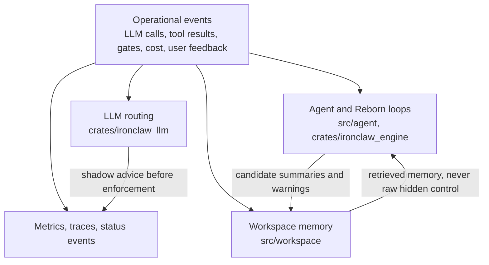

# Agent Intelligence

This directory covers optional systems that make IronClaw adapt over time. They are planning notes, not source-port instructions. Implementations must fit the current IronClaw boundaries:

- `src/agent/` owns v1 session, thread, turn, scheduler, heartbeat, and shared agentic-loop behavior.
- `crates/ironclaw_engine/`, `src/bridge/`, and Reborn composition crates own engine-v2 execution and product-workflow integration.
- `crates/ironclaw_llm/` owns provider selection, retry, failover, circuit breaking, caching, and model metadata.
- `src/workspace/` is the durable memory layer. Do not treat transcripts as disposable cache.
- Persistence changes must go through the shared DB trait and support PostgreSQL and libSQL.

## Documents

| Document | Use It For | First Ship Candidate |
| --- | --- | --- |
| [Online Learning](online-learning.md) | Adaptive model routing on top of the existing `LlmProvider` chain. | Shadow-mode routing advice. |
| [Agent Patterns](agent-patterns.md) | Small robustness patterns for loops, retry, checkpoints, scoring, and composition. | Caller-level tests around existing loop and tool call sites. |
| [Dream Consolidation](dream-consolidation.md) | Idle-time memory consolidation using heartbeat and workspace memory. | Read-only analysis that writes candidate notes to workspace. |
| [Affect Engine](affect-engine.md) | Behavioral-state control signals for routing, budget, and intervention policy. | Shadow-mode state classification from operational events. |

## Shared Rules

- Keep all features flag-gated. Use `off`, `shadow`, and `enforce` style modes for behavior that can change routing, tool execution, or user-visible responses.
- Prefer advisory outputs first: logs, metrics, workspace notes, routing hints, and dashboard state. Enforcement comes only after shadow-mode evidence.
- Do not add a second agent loop. Chat, jobs, containers, Reborn missions, subagents, tools, gates, retries, checkpointing, and completion must use their existing runner/driver/executor paths.
- Keep user-facing text grounded in task state. Internal control signals must not make the assistant claim feelings, certainty, or hidden intent.
- Test through callers when a helper gates side effects. Unit tests for scorers are useful, but regression coverage belongs at the provider factory, tool dispatcher, bridge adapter, scheduler, gateway handler, or Reborn runner boundary that actually performs the side effect.

## Integration Shape

## Suggested Adoption Order

1. Add observation fields and caller-level tests around existing boundaries.
2. Run online routing and affect classification in shadow mode.
3. Add heartbeat-driven consolidation that writes candidate workspace notes without deleting or mutating source records.
4. Promote only the narrow decisions with measured value: model selection, retry/escalation hints, and memory retrieval hints.
