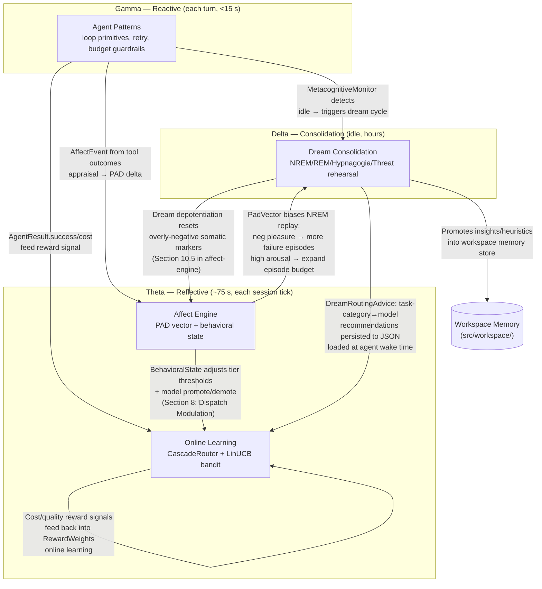

# Agent Intelligence

This category covers the systems that make an agent learn, adapt, and self-regulate over time. Where the core-concepts category defines *what* data looks like, these documents define *how* the agent improves: offline consolidation during idle periods, emotional-state modeling for decision shortcuts, online bandit-based model selection, and reusable loop patterns that compose into robust agent behavior.

## Documents

| Document | Summary | Priority |
|----------|---------|----------|
| [Dream Consolidation](dream-consolidation.md) | Biologically-inspired offline learning with five subsystems: NREM replay (utility-weighted experience replay), REM imagination (counterfactual synthesis), hypnagogic creativity (cross-domain insight), threat rehearsal (failure scenario replay), and a staging buffer that promotes knowledge through confidence tiers. Scheduled during idle periods. Direct extension of IronClaw's heartbeat system. | HIGH |
| [Affect Engine (Daimon)](affect-engine.md) | PAD (Pleasure-Arousal-Dominance) emotional vectors across three temporal layers (emotion / mood / temperament). OCC appraisal theory for event evaluation, somatic markers for decision shortcuts via k-d tree lookup, six behavioral states, and mood-congruent memory retrieval. Models agent self-regulation and user emotional context. | MEDIUM |
| [Online Learning (Cascade Router)](online-learning.md) | LinUCB contextual bandit with a 14-dimensional IronClaw context vector for LLM model selection. Three-stage cascade: static rules → confidence check → UCB selection. Cost/quality gains are rollout targets measured in shadow mode before enforcement. | HIGH |
| [Agent Patterns](agent-patterns.md) | Ten reusable design patterns for agent loops: wire-format translator, streaming event reassembly, resumable checkpoints, metacognitive monitor (stuck/contradiction/runaway detection), harness adapter, composable scorers, budget-guardrail task runner, retry with classified errors, composition operators (sequential/parallel/race/fallback), and warm session reuse. | MEDIUM |

## Intelligence Stack

The four systems operate across three cognitive speeds (defined in detail in [../core-concepts/cognitive-architecture.md](../core-concepts/cognitive-architecture.md)) and interact through well-defined data flows:

### How the layers stack in practice

- **Gamma (reactive, <15 s):** Agent Patterns fire on each turn — composable scorers, retry policy, budget guardrails. Every `AgentResult` is an observation that feeds both the Affect Engine and the Online Learning reward signal.
- **Theta (reflective, ~75 s):** The Cascade Router selects the optimal LLM provider using updated bandit weights. The Affect Engine adjusts behavioral state based on accumulated session signals and passes a `BehavioralState` tier-bias adjustment that modulates the cascade router's T0/T1/T2 thresholds.
- **Delta (consolidation, idle hours):** Dream Consolidation runs during idle periods triggered by the MetacognitiveMonitor (Resting state in Affect Engine) or the IronClaw heartbeat. It replays high-utility episodes (biased by the current PAD vector), generates counterfactuals, promotes validated insights into workspace memory, and writes `DreamRoutingAdvice` that seeds the cascade router for the next session.

### Boundary clarifications

**Affect vs Online Learning — two layers of routing:**

These are complementary, not competing:

| System | Layer | What it does | Timescale |
|--------|-------|-------------|-----------|
| Affect Engine (Section 8) | Fast behavioral override | Adjusts T0/T1/T2 prediction-error thresholds and directly promotes/demotes the model based on current behavioral state (Struggling → escalate, Coasting → demote) | Per-request (~1 s) |
| Online Learning (CascadeRouter) | Statistical learning | Learns from cumulative outcome history which model achieves the best cost/quality Pareto point for a given 14D context vector | Converges over ~200+ observations |

The Affect Engine should expose a compact behavioral-state feature to the router only after the 14D baseline is stable. Treat affect-aware routing as an extension, not a hidden extra dimension in the baseline vector.

**Agent Patterns vs Online Learning — two types of routing:**

| System | What it routes | How |
|--------|---------------|-----|
| Agent Patterns (Pattern 9: Composition Operators) | Which *agent branch* handles a given task | `SkillSelector` uses static task-category/complexity-band rules; this is workflow routing, not model selection |
| Online Learning | Which *LLM model* serves a given request | Learned from outcome history via LinUCB bandit |

These operate at different levels. A `SkillSelector` branch can itself contain a `CascadeRoutingProvider` that picks the model dynamically.

## Quick Start

Read [Online Learning](online-learning.md) first if your focus is cost and latency. The LinUCB model selection is the highest-ROI concept in this category and requires no other intelligence subsystem to ship.

Read [Agent Patterns](agent-patterns.md) if your focus is loop robustness. The metacognitive monitor and composable scorers are small, independent, and immediately usable.

Read [Dream Consolidation](dream-consolidation.md) if you are extending IronClaw's heartbeat system toward richer offline learning. Section 12 has the full IronClaw integration architecture.

Read [Affect Engine](affect-engine.md) if you want behavioral-state-aware model routing or somatic marker decision shortcuts. Start with Section 7 (Six Behavioral States) and Section 8 (Dispatch Modulation) for the highest-value, lowest-complexity components.

## Related Documents

- [../core-concepts/cognitive-architecture.md](../core-concepts/cognitive-architecture.md) — defines the Gamma/Theta/Delta cognitive speed model referenced throughout this category
- [../core-concepts/universal-engram.md](../core-concepts/universal-engram.md) — the memory primitive that dream consolidation promotes into
- [../context-memory/](../context-memory/) — workspace memory implementation that receives consolidated dream outputs
