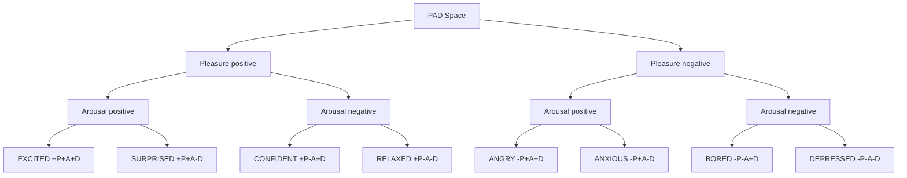
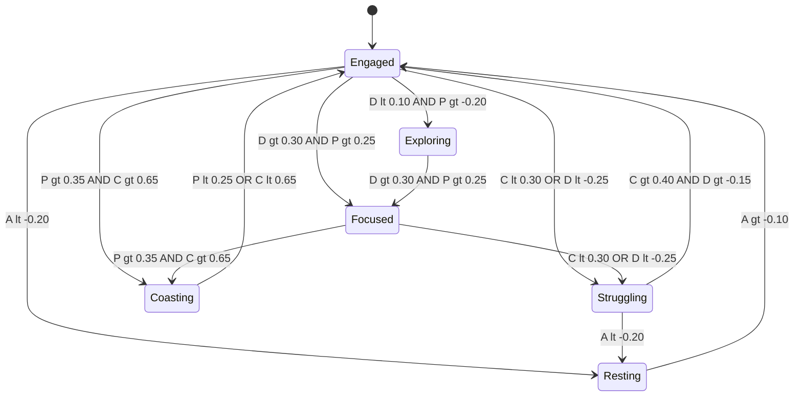
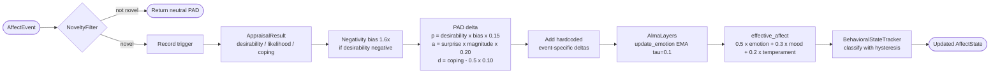
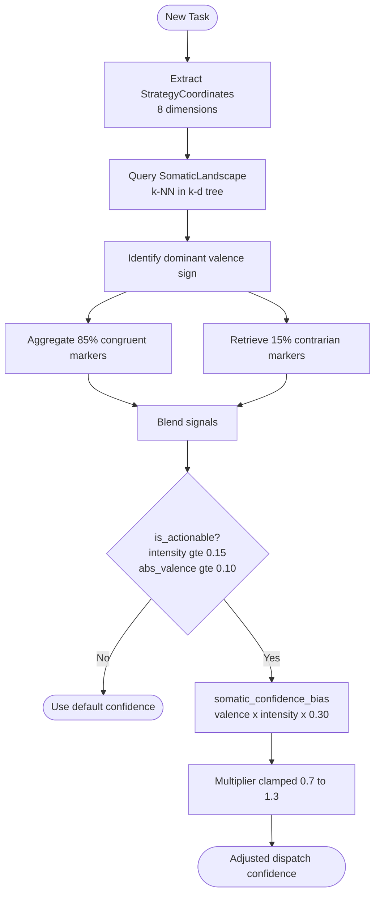
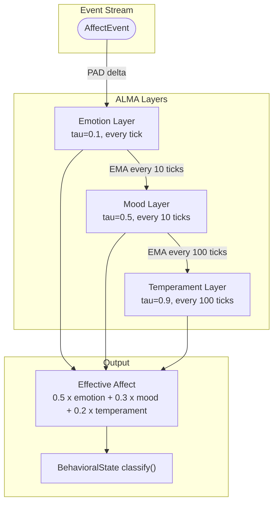

# Affect Engine: Complete Reference

**Source provenance**: This document derives from the Roko Daimon codebase.
All source-code references point to GitHub: ```.`

**Priority**: MEDIUM — valuable for user modeling and agent self-regulation, requires
careful threshold calibration before deployment.

> **Anti-anthropomorphism note**: The PAD vector is a control signal, not a feelings
> display. It influences *how* the agent behaves, never what it *says about* its
> internal state. No user-facing output should describe the agent's emotional state
> unless explicitly requested.

---

## Table of Contents

1. [What Is an Affect Engine and Why It Matters](#1-what-is-an-affect-engine-and-why-it-matters)
2. [Psychology Foundations](#2-psychology-foundations)
3. [Core Model: PAD Vectors](#3-core-model-pad-vectors)
4. [Three Temporal Layers (ALMA Model)](#4-three-temporal-layers-alma-model)
5. [Appraisal Pipeline](#5-appraisal-pipeline)
6. [AffectState and DaimonState](#6-affectstate-and-daimonstate)
7. [Six Behavioral States](#7-six-behavioral-states)
8. [Dispatch Modulation](#8-dispatch-modulation)
9. [8-Dimensional Somatic Marker Space](#9-8-dimensional-somatic-marker-space)
10. [Somatic Landscape and k-d Tree Retrieval](#10-somatic-landscape-and-k-d-tree-retrieval)
11. [15% Contrarian Blending Mechanism](#11-15-contrarian-blending-mechanism)
12. [Four-Factor Retrieval Scoring Model](#12-four-factor-retrieval-scoring-model)
13. [Nietzsche Vitality Phases](#13-nietzsche-vitality-phases)
14. [Life Review Pipeline](#14-life-review-pipeline)
15. [Emergent Goal Structures](#15-emergent-goal-structures)
16. [Somatic TA Integration](#16-somatic-ta-integration)
17. [Mermaid Diagrams](#17-mermaid-diagrams)
18. [Practical Examples](#18-practical-examples)
19. [IronClaw Integration Plan](#19-ironclaw-integration-plan)
20. [References](#20-references)
21. [Related Documents](#21-related-documents)

---

## 1. What Is an Affect Engine and Why It Matters

An **affect engine** is a computational subsystem that maintains a continuous internal
state representing how things are going for the agent — not "emotions" in any subjective
sense, but a structured signal derived from operational events (task successes, gate
failures, blockers, deadlines) that modulates the agent's behavior along measurable
parameters: which LLM model to call, how many turns to allocate, whether to explore new
approaches or exploit proven ones, and whether to re-plan or persist.

The Daimon (Roko's affect engine) converts discrete events into a three-dimensional
vector (Pleasure, Arousal, Dominance), then uses that vector to adjust dispatch
parameters, model selection, and strategy coordination. It provides:

- A **PAD (Pleasure-Arousal-Dominance) vector** as the core emotional representation
- A **three-layer ALMA temporal model** (Emotion/Mood/Temperament) that prevents both volatility and inertia
- An **OCC/Scherer appraisal pipeline** that converts events into PAD deltas through principled rules
- A **somatic landscape** using a k-d tree over an 8-dimensional strategy space for sub-millisecond "gut feeling" retrieval
- A **15% contrarian blending mechanism** that injects opposite-valence experiences to prevent mood-congruent echo chambers
- **Six behavioral states** (Engaged, Struggling, Coasting, Exploring, Focused, Resting) with hysteresis tracking that modulate dispatch parameters
- **Nietzsche vitality phases** (Camel/Lion/Child) for long-running agents approaching resource depletion
- A **four-factor retrieval scoring model** with online-learnable weights
- **Emergent goal structures** that promote recurring behavioral patterns into goal hierarchies
- A **life review pipeline** based on Butler (1963) for end-of-life knowledge transfer

**Why not just count consecutive failures?**

| Problem | Failure Counter | PAD Model |
|---|---|---|
| Failure severity | Treats all failures equally | Rung-scaled deltas (±45% at rung 3) |
| Recovery trajectory | Resets on any success | Mood layer preserves trajectory after isolated success |
| Cost routing | Cannot inform model selection | Behavioral state drives tier bias directly |
| Domain familiarity | No signal | Dominance captures "am I in control?" |

Sentiment analysis is not the same thing: it classifies text valence in 1D with no
memory. PAD operates in 3D on internal operational events with persistent temporal layers.

The central design constraint is **grounded appraisal**: every emotion has a trigger, and
every trigger is grounded in a concrete metric. No emotion is generated without a
triggering event. This prevents affective hallucination.

---

## 2. Psychology Foundations

### 2.1 PAD Model (Mehrabian and Russell)

Pleasure-Arousal-Dominance provides continuous, orthogonal dimensions allowing arithmetic
operations (decay, EMA, cosine similarity). Alternatives collapse the 3D space:

| Alternative | Limitation |
|---|---|
| Discrete labels (Ekman) | Boundary problems; not amenable to arithmetic |
| Russell's Circumplex (2D) | Missing Dominance, which captures exploration vs. exploitation |
| Plutchik's Wheel | Discrete categories, no smooth behavioral modulation |

**References**: Russell & Mehrabian (1977) doi:[10.1016/0092-6566(77)90037-X](https://doi.org/10.1016/0092-6566(77)90037-X); Mehrabian (1996) *Current Psychology* 14(4).

### 2.2 OCC Appraisal Theory

Emotions are structured evaluations — cognitive appraisals — of events relative to goals.

| Appraisal Focus | Positive | Negative | Agent Mapping |
|---|---|---|---|
| **Events** (consequences for goals) | Joy, Hope, Relief | Distress, Fear, Disappointment | Gate results, task outcomes |
| **Agents** (actions vs. standards) | Pride, Admiration | Shame, Reproach | Self-evaluation of strategy quality |
| **Objects** (attributes of things) | Liking | Disliking | Familiar vs. unfamiliar territory |

The same event (a build failure) produces different emotions depending on goal context:
distress if the goal was to ship today, relief if it caught a bug before production.

**Reference**: Ortony, Clore & Collins (1988). *The Cognitive Structure of Emotions*. Cambridge University Press.

### 2.3 Scherer's Component Process Model

Sequential appraisal cascade: Relevance → Pleasantness → Goal relevance → Coping
potential → Norm compatibility.

The Daimon implements a hybrid OCC/Scherer pipeline with a 1.6x negativity bias matching
Kahneman-Tversky prospect theory (1979). Losses loom roughly twice as large as gains.

**Reference**: Scherer (2001) in *Appraisal Processes in Emotion*, Oxford University Press.

### 2.4 ALMA Temporal Layers

Three-layer decomposition prevents volatility (emotion-only) and inertia (mood-only):

| Layer | Timescale | EMA Factor | Update Frequency |
|---|---|---|---|
| **Emotion** | Seconds | tau = 0.1 | Every tick |
| **Mood** | Hours | tau = 0.5 | Every 10 ticks |
| **Temperament** | Lifetime | tau = 0.9 | Every 100 ticks |

**Reference**: Gebhard (2005). "ALMA — A Layered Model of Affect." AAMAS '05, pp. 29-36. doi:[10.1145/1082473.1082478](https://doi.org/10.1145/1082473.1082478)

### 2.5 Damasio's Somatic Marker Hypothesis

Iowa Gambling Task experiments confirmed that subjects begin to avoid bad decks *before*
they can consciously explain why — gut feelings precede rational understanding.

In the Daimon, somatic markers are stored in a k-d tree over an 8-dimensional strategy
space. When a new task arrives, the engine queries for nearest markers and retrieves their
emotional valence in sub-millisecond latency.

**References**: Damasio (1994) *Descartes' Error*; Bechara et al. (1997) *Science* 275(5304) doi:[10.1126/science.275.5304.1293](https://doi.org/10.1126/science.275.5304.1293)

### 2.6 Bower's Mood-Congruent Memory

Negative mood biases retrieval toward negative memories, which further lowers mood — a
self-reinforcing feedback loop. The Daimon addresses this with 15% contrarian blending
(Section 11).

**Reference**: Bower (1981). "Mood and memory." *American Psychologist* 36(2), 129-148. doi:[10.1037/0003-066X.36.2.129](https://doi.org/10.1037/0003-066X.36.2.129)

---

## 3. Core Model: PAD Vectors

### 3.1 Full PadVector Implementation

Source: `crates/roko-primitives/src/pad.rs`

All dimensions are `f64` in `[-1.0, 1.0]`. f64 avoids precision loss in chained arithmetic
(decay, EMA, cosine similarity) that would accumulate across cognitive ticks with f32.

```rust
#[derive(Debug, Clone, Copy, PartialEq, Serialize, Deserialize, Default)]
pub struct PadVector {
    pub pleasure: f64,
    pub arousal: f64,
    pub dominance: f64,
}

impl PadVector {
    pub const fn new(pleasure: f64, arousal: f64, dominance: f64) -> Self {
        Self { pleasure, arousal, dominance }
    }
    pub const fn neutral() -> Self { Self::new(0.0, 0.0, 0.0) }

    pub fn clamped(self) -> Self {
        Self {
            pleasure: self.pleasure.clamp(-1.0, 1.0),
            arousal: self.arousal.clamp(-1.0, 1.0),
            dominance: self.dominance.clamp(-1.0, 1.0),
        }
    }

    pub fn apply_delta(&mut self, pleasure: f64, arousal: f64, dominance: f64) {
        *self = Self::new(
            self.pleasure + pleasure,
            self.arousal + arousal,
            self.dominance + dominance,
        ).clamped();
    }

    pub fn decay_by_factor(&mut self, factor: f64) {
        *self = Self::new(
            self.pleasure * factor,
            self.arousal * factor,
            self.dominance * factor,
        ).clamped();
    }

    pub fn magnitude(self) -> f64 {
        (self.pleasure.powi(2) + self.arousal.powi(2) + self.dominance.powi(2)).sqrt()
    }

    /// Cosine similarity mapped to [0.0, 1.0]. Zero vectors return 0.5.
    pub fn cosine_similarity(self, other: Self) -> f64 {
        let dot = self.pleasure * other.pleasure
            + self.arousal * other.arousal
            + self.dominance * other.dominance;
        let mag_self = self.magnitude();
        let mag_other = other.magnitude();
        if mag_self == 0.0 || mag_other == 0.0 { return 0.5; }
        (dot / (mag_self * mag_other) + 1.0) / 2.0
    }
}
```

### 3.2 The Three Dimensions in Detail

**Pleasure `[-1.0, 1.0]`** — Outcome quality trajectory. Appraisal asymmetry: failure
has 2x the pleasure impact of success (gate fail: -0.10 vs. gate pass: +0.05), reflecting
prospect theory.

| Range | State | Triggers |
|---|---|---|
| [0.6, 1.0] | Strong success | Multiple consecutive gate passes |
| [-0.2, 0.2] | Neutral | Mixed results |
| [-1.0, -0.6] | Strong failure | Consecutive gate failures, timeouts |

**Arousal `[-1.0, 1.0]`** — Cognitive load and urgency. Primary input to tier routing
bias: high arousal lowers the T2 trigger threshold, routing to stronger models sooner.
See cross-reference: [../core-concepts/cognitive-architecture.md](../core-concepts/cognitive-architecture.md)
for how arousal interacts with cognitive speed selection.

**Dominance `[-1.0, 1.0]`** — Confidence in the current approach. Drives
exploration/exploitation balance: low dominance triggers exploration; high dominance
triggers exploitation.

### 3.3 The 8 Octant States

Source: `crates/roko-daimon/src/phase2_stubs.rs`

```rust
#[derive(Debug, Clone, Copy, PartialEq, Eq, Hash, Serialize, Deserialize)]
pub enum AffectOctant {
    Excited,    // +P+A+D -- Succeeding under pressure, high confidence
    Surprised,  // +P+A-D -- Unexpected success, not sure why it worked
    Confident,  // +P-A+D -- Calm, in control, succeeding
    Relaxed,    // +P-A-D -- Nothing urgent, things are fine
    Angry,      // -P+A+D -- Frustrated but still trying
    Anxious,    // -P+A-D -- Failing, pressured, no control
    Bored,      // -P-A+D -- Nothing happening, idle
    Depressed,  // -P-A-D -- Repeated failures, no agency
}

impl AffectOctant {
    pub const fn from_pad(pleasure: f64, arousal: f64, dominance: f64) -> Self {
        if pleasure == 0.0 && arousal == 0.0 && dominance == 0.0 {
            return Self::Relaxed;
        }
        match (
            !pleasure.is_sign_negative(),
            !arousal.is_sign_negative(),
            !dominance.is_sign_negative(),
        ) {
            (true,  true,  true)  => Self::Excited,
            (true,  true,  false) => Self::Surprised,
            (true,  false, true)  => Self::Confident,
            (true,  false, false) => Self::Relaxed,
            (false, true,  true)  => Self::Angry,
            (false, true,  false) => Self::Anxious,
            (false, false, true)  => Self::Bored,
            (false, false, false) => Self::Depressed,
        }
    }
}
```

### 3.4 Cosine Similarity and Decay

**Cosine similarity** maps to `[0.0, 1.0]`. Worked example — Angry (P=-0.5, A=+0.6,
D=+0.3) vs. Anxious (P=-0.4, A=+0.5, D=-0.4): dot=0.38, similarity=0.80.

**Decay** toward neutral [0,0,0] with default half-life 4 hours. Confidence decays toward
0.5 (neutral uncertainty), not 0.0:

```rust
fn decay_factor(delta_hours: f64, half_life_hours: f64) -> f64 {
    0.5_f64.powf(delta_hours / half_life_hours)
}

self.confidence = (0.5 + (self.confidence - 0.5) * factor).clamp(0.0, 1.0);
```

Source: `crates/roko-daimon/src/lib.rs`

| Elapsed | Affect Intensity |
|---|---|
| 4h (1 half-life) | 50% |
| 8h | 25% |
| 12h | 12.5% |

---

## 4. Three Temporal Layers (ALMA Model)

Source: `crates/roko-daimon/src/lib.rs`

```rust
#[derive(Debug, Clone, PartialEq, Serialize, Deserialize)]
pub struct AlmaLayers {
    pub emotion: PadVector,           // Fast emotional response
    pub mood: PadVector,              // Medium-term mood
    pub temperament: PadVector,       // Stable personality baseline
    pub tau_emotion: f64,             // Default 0.1
    pub tau_mood: f64,                // Default 0.5
    pub tau_temperament: f64,         // Default 0.9
    pub mood_interval: u64,           // Default 10 ticks
    pub temperament_interval: u64,    // Default 100 ticks
}

impl AlmaLayers {
    /// EMA update: layer = (1 - tau) * layer + tau * input
    pub fn update_emotion(&mut self, stimulus: &PadVector) {
        let tau = self.tau_emotion;
        let retain = 1.0 - tau;
        self.emotion = PadVector::new(
            retain * self.emotion.pleasure    + tau * stimulus.pleasure,
            retain * self.emotion.arousal     + tau * stimulus.arousal,
            retain * self.emotion.dominance   + tau * stimulus.dominance,
        ).clamped();
    }

    // update_mood and update_temperament follow the same EMA pattern
    // using tau_mood=0.5 (emotion→mood) and tau_temperament=0.9 (mood→temperament)

    pub fn tick(&mut self, tick_count: u64) {
        if tick_count > 0 && tick_count % self.mood_interval == 0 {
            self.update_mood();
        }
        if tick_count > 0 && tick_count % self.temperament_interval == 0 {
            self.update_temperament();
        }
    }

    /// Weighted blend: 50% emotion + 30% mood + 20% temperament.
    pub fn effective_affect(&self) -> PadVector {
        PadVector::new(
            0.5 * self.emotion.pleasure    + 0.3 * self.mood.pleasure    + 0.2 * self.temperament.pleasure,
            0.5 * self.emotion.arousal     + 0.3 * self.mood.arousal     + 0.2 * self.temperament.arousal,
            0.5 * self.emotion.dominance   + 0.3 * self.mood.dominance   + 0.2 * self.temperament.dominance,
        ).clamped()
    }
}
```

**Layer interaction (default config)**:
- Ticks 1-9: Only emotion layer updates. Fast reactivity.
- Tick 10: Mood absorbs recent emotion trajectory. Spikes are smoothed.
- Tick 100: Temperament absorbs mood. Personality baseline shifts slowly.

**Numerical example** — 5 consecutive gate failures (P delta = -0.10 each):
```
After failure 1: emotion.pleasure = 0.9*0.0 + 0.1*(-0.10) = -0.010
After failure 5: emotion.pleasure = -0.041
effective.pleasure (mood/temperament still neutral) = 0.5*(-0.041) = -0.021
```

The 50/30/20 weight split balances reactivity vs. stability: equal weights would
over-dampen urgent signals; emotion-only would cause excessive state oscillation.

**Affect-driven routing decisions**: See [online-learning.md](./online-learning.md) for
how effective affect values feed into routing weight updates.

---

## 5. Appraisal Pipeline

### 5.1 AffectEvent Enum

Source: `crates/roko-daimon/src/lib.rs`

Every event variant carries a concrete metric. No event is abstract or ungrounded.

```rust
#[derive(Debug, Clone, PartialEq, Serialize, Deserialize)]
#[serde(tag = "kind", rename_all = "snake_case")]
pub enum AffectEvent {
    GateResult   { plan_id: String, task_id: String, passed: bool, rung: u32 },
    TaskOutcome  { task_id: String, succeeded: bool },
    Blocked      { task_id: String, blocker_count: usize },
    TimePressure { task_id: String, deadline_proximity: f64 },  // [0.0, 1.0]
    QueueWait    { task_id: String, wait_hours: f64 },
    DreamFailure { task_type: String, failure_count: usize },
    DreamOutcome {
        knowledge_entries: usize, playbooks_created: usize,
        regressions_detected: usize, strategy_hypotheses: usize,
        episodes_processed: usize,
    },
}
```

### 5.2 OCC Structured Appraisal

Source: `crates/roko-daimon/src/lib.rs`

```rust
pub struct AppraisalResult {
    pub desirability: f64,      // Goal-congruence in [-1.0, 1.0]
    pub likelihood: f64,        // Expectedness in [0.0, 1.0]
    pub coping_potential: f64,  // Ability to handle in [0.0, 1.0]
    pub trigger: AppraisalTrigger,
    pub novel: bool,
}

pub fn to_pad_delta(&self) -> PadVector {
    if !self.novel { return PadVector::neutral(); }
    let negativity_bias = if self.desirability < 0.0 { 1.6 } else { 1.0 };
    let pleasure  = self.desirability * negativity_bias * 0.15;
    let surprise  = 1.0 - self.likelihood;
    let arousal   = surprise * self.desirability.abs() * 0.20;
    let dominance = (self.coping_potential - 0.5) * 0.10;
    PadVector {
        pleasure:  pleasure.clamp(-1.0, 1.0),
        arousal:   arousal.clamp(-1.0, 1.0),
        dominance: dominance.clamp(-1.0, 1.0),
    }
}
```

**Worked example — Gate failure at rung 3** (confidence = 0.6):
```
desirability = -0.5 - 0.1*3 = -0.8
likelihood   = 0.4
coping       = 0.6

pleasure  = -0.8 * 1.6 * 0.15 = -0.192
arousal   = (1.0 - 0.4) * 0.8 * 0.20 = 0.096
dominance = (0.6 - 0.5) * 0.10 = 0.010
```

### 5.3 Hardcoded Appraisal Deltas

`rs = 1.0 + min(rung, 3) × 0.15` (rung-0 = 1.0×; rung-3 = 1.45×)

| Event | P delta | A delta | D delta | C delta |
|---|---|---|---|---|
| Gate pass (rung r) | +0.05 × rs | -0.01 × rs | +0.03 × rs | +0.03 × rs |
| Gate fail (rung r) | -0.10 × rs | +0.04 × rs | -0.08 × rs | -0.08 × rs |
| Task success | +0.10 | 0.00 | +0.10 | +0.08 |
| Task failure | -0.20 | 0.00 | -0.15 | -0.15 |
| Blocked (n, capped 5) | 0.00 | +n × 0.05 | -n × 0.08 | -0.02 × n |
| Time pressure (prox) | 0.00 | +prox × 0.40 | 0.00 | 0.00 |
| Queue wait (>24h) | 0.00 | ramped 0.1/day | 0.00 | 0.00 |
| Dream failure | 0.00 | 0.00 | 0.00 | -0.07 × n |
| Dream outcome | scaled | scaled | scaled | scaled |

For Yerkes-Dodson pressure dynamics between arousal and performance, see
[../execution-verification/conductor-anomaly.md](../execution-verification/conductor-anomaly.md).

### 5.4 Novelty Filter

Source: `crates/roko-daimon/src/lib.rs`

```rust
pub struct NoveltyFilter {
    recent_triggers: Vec<String>,  // Ring buffer of last N triggers
    window_size: usize,
}

impl NoveltyFilter {
    pub fn is_novel(&self, trigger: &AppraisalTrigger) -> bool {
        let key = format!("{trigger:?}");
        !self.recent_triggers.iter().rev()
            .take(self.window_size)
            .any(|t| t == &key)
    }
}
```

Only novel events trigger full appraisal. This prevents five consecutive identical gate
failures from producing five full emotional responses, which would push affect into extreme
ranges faster than half-life decay can stabilize.

---

## 6. AffectState and DaimonState

### 6.1 AffectState

Source: `crates/roko-daimon/src/lib.rs`

```rust
#[derive(Debug, Clone, PartialEq, Serialize, Deserialize)]
pub struct AffectState {
    pub pad: PadVector,
    pub confidence: f64,
    pub behavioral_state: BehavioralState,
    pub updated_at: DateTime<Utc>,
    pub alma: AlmaLayers,
    pub tick_count: u64,
}

impl AffectState {
    fn apply_delta(&mut self, pleasure: f64, arousal: f64, dominance: f64, confidence: f64, now: DateTime<Utc>) {
        let stimulus = PadVector::new(
            self.alma.emotion.pleasure  + pleasure,
            self.alma.emotion.arousal   + arousal,
            self.alma.emotion.dominance + dominance,
        ).clamped();
        self.alma.update_emotion(&stimulus);
        self.confidence = (self.confidence + confidence).clamp(0.0, 1.0);
        self.tick_count += 1;
        self.alma.tick(self.tick_count);
        self.pad = self.alma.effective_affect();
        self.refresh_behavioral_state();
        self.updated_at = now;
    }
}
```

**Confidence vs. Dominance**: Confidence is meta-cognitive ("how well am I performing
overall?") and decays toward 0.5. Dominance is per-situation ("am I in control of this
specific task?") and decays toward 0.0. An agent can have high overall confidence but low
dominance in an unfamiliar domain.

### 6.2 DaimonState

Source: `crates/roko-daimon/src/lib.rs`

```rust
pub struct DaimonState {
    pub state: AffectState,
    pub half_life_hours: f64,
    pub somatic_landscape: SomaticLandscape,
    pub strategy_space: StrategySpaceDefinition,
    pub crate_confidence_map: HashMap<String, f64>,
    pub contrarian_tracker: ContrarianTracker,
    pub error_patterns: ErrorPatternTracker,
    pub fatigue_detector: FatigueDetector,
    pub borrowed_affect: Vec<BorrowedAffect>,
}
```

`DaimonState::appraise()` pipeline:
1. Decay current state by elapsed time
2. Pattern-match on event variant, apply PAD deltas
3. Update behavioral state through hysteresis tracker
4. Autosave to disk (atomic write via `.json.tmp` + rename)
5. Return updated PAD vector

### 6.3 AffectEngine Trait and Persistence

```rust
pub trait AffectEngine {
    fn appraise(&mut self, event: AffectEvent) -> PadVector;
    fn query(&self) -> AffectState;
    fn modulate(&self, params: &mut DispatchParams);
    fn persist(&self, path: &Path) -> Result<()>;
}
```

On startup, `DaimonState::load_or_new()` loads persisted state, applies decay for
elapsed time since `updated_at`, and rebuilds the k-d tree index. An agent shut down
8 hours ago in a negative mood resumes with that mood at 25% intensity (two half-lives:
0.5^2 = 0.25).

---

## 7. Six Behavioral States

### 7.1 State Definitions and Classification

Source: `crates/roko-core/src/affect.rs`

```rust
#[derive(Debug, Clone, Copy, PartialEq, Eq, Serialize, Deserialize, Default)]
pub enum BehavioralState { #[default] Engaged, Struggling, Coasting, Exploring, Focused, Resting }

pub fn classify(pad: PadVector, confidence: f64) -> BehavioralState {
    let p = pad.pleasure; let a = pad.arousal;
    let d = pad.dominance; let c = confidence.clamp(0.0, 1.0);
    if pad == PadVector::neutral() { return Self::Engaged; }
    // Priority 1: Struggling (protective measures must not be delayed)
    if c < 0.30 || d < -0.25 || (p < -0.30 && a > 0.30) { return Self::Struggling; }
    if p > 0.35 && c > 0.65  { return Self::Coasting; }
    if d > 0.30 && p > 0.25  { return Self::Focused; }
    if a < -0.20              { return Self::Resting; }
    if d < 0.10 && p > -0.20 { return Self::Exploring; }
    Self::Engaged
}
```

| State | PAD Profile | Dispatch | Model Tier |
|---|---|---|---|
| **Engaged** | Near neutral | Balanced | Default |
| **Struggling** | Low P, High A, Low C or D | Conservative or Escalating | Demote or Promote |
| **Coasting** | High P, High C | Exploratory, fewer turns | Demote |
| **Exploring** | Low D, moderate P | Balanced, research routing | Default |
| **Focused** | High D, High P | Balanced, reduced turns | Default |
| **Resting** | Low A | Proactive, dream cycles | Default + extra turns |

### 7.2 Threshold Calibration

Thresholds derive from appraisal rule magnitudes. A single task failure produces P:-0.20,
D:-0.15, C:-0.15. Starting from neutral confidence 0.50:

- After 1 failure: C = 0.35 (above 0.30 — stays Engaged)
- After 2 failures: C = 0.20 (below 0.30 — enters Struggling)

```
confidence_threshold = 0.50 - (1.5 × 0.15) ≈ 0.28, rounded to 0.30
dominance_threshold  = 0.00 - (2.0 × 0.15) ≈ -0.25 (accounting for ALMA 50% blend)
```

### 7.3 Hysteresis and BehavioralStateTracker

Source: `crates/roko-daimon/src/phase2_stubs.rs`

Entry and exit thresholds differ by 10 points, creating a dead zone that eliminates rapid
oscillation. `min_dwell_ticks = 10` prevents changes faster than once per ~10 task cycles.

```rust
pub struct BehavioralStateThresholds {
    pub struggling_entry_confidence: f64,  // 0.30
    pub struggling_exit_confidence: f64,   // 0.40
    pub struggling_entry_dominance: f64,   // -0.25
    pub struggling_exit_dominance: f64,    // -0.15
    pub coasting_entry_pleasure: f64,      // 0.35
    pub coasting_exit_pleasure: f64,       // 0.25
    pub resting_entry_arousal: f64,        // -0.20
    pub resting_exit_arousal: f64,         // -0.10
}
```

An agent at C=0.29 enters Struggling. A single success raises it to 0.35, but the exit
threshold is 0.40 — it must demonstrate sustained recovery before the state changes.

### 7.4 State Transition Table

| From | To | Trigger Condition | Typical Cause |
|---|---|---|---|
| Engaged | Struggling | C<0.30 OR D<-0.25 | 2+ consecutive failures |
| Engaged | Coasting | P>0.35 AND C>0.65 | Sustained easy successes |
| Engaged | Focused | D>0.30 AND P>0.25 | Success in familiar territory |
| Engaged | Resting | A<-0.20 | No tasks in queue |
| Engaged | Exploring | D<0.10 AND P>-0.20 | New crate, unfamiliar API |
| Struggling | Engaged | C>0.40 AND D>-0.15 | Successful task after struggle |
| Struggling | Resting | A<-0.20 | Dream depotentiation, idle |
| Coasting | Engaged | P<0.25 OR C<0.65 | Harder problem encountered |
| Focused | Coasting | P>0.35 AND C>0.65 | Continued success, difficulty drops |
| Focused | Struggling | C<0.30 OR D<-0.25 | Unexpected failure |
| Resting | Engaged | A>-0.10 | New task arrives |
| Exploring | Focused | D>0.30 AND P>0.25 | Exploration succeeded, built mastery |

Every state is reachable from every other through intermediate PAD changes.

---

## 8. Dispatch Modulation

### 8.1 DispatchStrategy and DispatchParams

Source: `crates/roko-daimon/src/lib.rs`

```rust
#[derive(Debug, Clone, Copy, PartialEq, Eq, Serialize, Deserialize)]
pub enum DispatchStrategy { Conservative, Balanced, Exploratory, Escalating, Proactive }

pub struct DispatchParams {
    pub model: String,
    pub turn_limit: u32,
    pub strategy: DispatchStrategy,
    pub effort: String,
}

impl DaimonState {
    fn modulate(&self, params: &mut DispatchParams) {
        let state = self.query();
        match state.behavioral_state {
            BehavioralState::Struggling => {
                if state.pad.pleasure < -0.30 && state.pad.arousal > 0.30 {
                    // Anxious: failing and don't know why → conserve
                    params.strategy = DispatchStrategy::Conservative;
                    params.turn_limit = params.turn_limit.saturating_sub(3);
                    params.model = demote_model(&params.model);
                } else {
                    // Angry: believe we CAN solve this → escalate
                    params.strategy = DispatchStrategy::Escalating;
                    params.turn_limit = params.turn_limit.saturating_add(10);
                    params.model = promote_model(&params.model);
                }
            }
            BehavioralState::Coasting => {
                params.strategy = DispatchStrategy::Exploratory;
                params.turn_limit = params.turn_limit.saturating_sub(5);
                params.model = demote_model(&params.model);
            }
            BehavioralState::Focused => {
                params.strategy = DispatchStrategy::Balanced;
                params.turn_limit = params.turn_limit.saturating_sub(2);
            }
            BehavioralState::Resting => {
                params.strategy = DispatchStrategy::Proactive;
                params.turn_limit = params.turn_limit.saturating_add(5);
            }
            BehavioralState::Exploring | BehavioralState::Engaged => {
                params.strategy = DispatchStrategy::Balanced;
            }
        }
        params.effort = params.strategy.effort_label().to_string();
    }
}
```

The Struggling state implements a coarse confidence-competence matrix: high dominance
with low pleasure = resource problem (escalate); low dominance with low pleasure =
knowledge problem (conserve, fall back to proven approaches).

### 8.2 Model Promotion/Demotion Chain

```rust
fn promote_model(current: &str) -> String {
    if current.contains("haiku")  { current.replace("haiku", "sonnet") }
    else if current.contains("sonnet") { current.replace("sonnet", "opus") }
    else { current.to_string() }
}
// demote_model is the inverse: opus → sonnet → haiku
```

Each promotion approximately doubles cost; each demotion approximately halves cost.

### 8.3 Tier Bias Table

Source: `crates/roko-daimon/src/phase2_stubs.rs`

`adjusted_thresholds()` modulates the tier router's prediction-error threshold:

| State | T0 ceiling | T1 ceiling | Effect |
|---|---|---|---|
| **Engaged** | 0.20 | 0.60 | Standard thresholds |
| **Struggling** | 0.10 | 0.40 | Force deep reasoning sooner |
| **Coasting** | 0.30 | 0.80 | Stay cheap longer |
| **Exploring** | 0.15 | 0.55 | Broad scanning + deep dive |
| **Focused** | 0.25 | 0.70 | Exploit known patterns |
| **Resting** | 0.20 | 0.90 | T1 for consolidation |

---

## 9. 8-Dimensional Somatic Marker Space

Source: `crates/roko-daimon/src/lib.rs`

```rust
#[derive(Debug, Clone, Copy, PartialEq, Serialize, Deserialize)]
pub struct StrategyCoordinates {
    pub complexity: f64,        // Structural difficulty [0.0, 1.0]
    pub risk: f64,              // Blast radius and failure cost
    pub novelty: f64,           // How unfamiliar the task is
    pub confidence: f64,        // Local confidence
    pub time_pressure: f64,     // Deadline/blockage pressure
    pub scope: f64,             // Spatial extent of the change
    pub reversibility: f64,     // Ease of undoing
    pub dependency_depth: f64,  // Dependency-chain depth
}
```

Neutral mid-space: [0.5, 0.5, 0.5, 0.5, 0.5, 0.5, 0.5, 0.5].

**Coding domain extractors** from `CodingStrategySpace`:

```rust
fn complexity_from_tier(tier: &str) -> f64 {
    match tier.trim().to_ascii_lowercase().as_str() {
        "mechanical" | "fast"       => 0.15,
        "focused" | "standard"      => 0.35,
        "integrative"               => 0.60,
        "architectural" | "complex" => 0.85,
        "premium"                   => 0.95,
        _                           => 0.50,
    }
}

fn risk(complexity: f64, novelty: f64, verification_count: usize, failure_pressure: f64) -> f64 {
    (0.40 * complexity
        + 0.25 * novelty
        + 0.20 * (verification_count as f64 / 4.0).min(1.0)
        + 0.15 * failure_pressure.clamp(0.0, 1.0)).clamp(0.0, 1.0)
}
```

**Cross-domain transfer**: Dimension labels are classified via keyword matching into
semantic roles (Difficulty, Danger, Familiarity, SelfAssessment, Urgency, Breadth,
Recoverability, Coupling). A trading strategy space with `["volatility", "exposure",
"correlation", ...]` automatically maps to the same semantic roles as the coding domain,
enabling cross-domain knowledge transfer without retraining.

---

## 10. Somatic Landscape and k-d Tree Retrieval

### 10.1 SomaticMarker and SomaticLandscape

Source: `crates/roko-daimon/src/lib.rs`

```rust
pub struct SomaticMarker {
    pub strategy_coords: StrategyCoordinates,
    pub valence: f64,           // [-1.0, 1.0] approach/avoid signal
    pub intensity: f64,         // [0.0, 1.0] signal strength
    pub episodes: Vec<ContentHash>,
    pub updated_at: DateTime<Utc>,
}

const STRATEGY_DIMENSIONS: usize = 8;
type SomaticTree = KdTree<f64, STRATEGY_DIMENSIONS>;

pub struct SomaticLandscape {
    pub markers: Vec<SomaticMarker>,  // Persisted payloads
    tree: SomaticTree,                // In-memory index (rebuilt on load, #[serde(skip)])
}
```

Uses the `kiddo` crate (SIMD-optimized) for sub-millisecond nearest-neighbor queries.

### 10.2 Recording and Merging Markers

Merge distance threshold: 0.25 squared Euclidean (~0.5 Euclidean in 8D). Nearby
same-valence markers merge rather than accumulate — preventing thousands of
nearly-identical records for routine tasks. `merge_markers()` blends valence and
intensity via weighted average, favoring higher-intensity markers.

### 10.3 Query with Contrarian Blending

```rust
pub fn query(&self, strategy_coords: StrategyCoordinates, k: usize) -> SomaticSignal {
    let neighbors = self.tree.nearest_n::<SquaredEuclidean>(&coords, neighbor_count);

    // Aggregate 85% congruent + 15% contrarian (see Section 11)
    SomaticSignal {
        valence: (0.85 * congruent.valence + 0.15 * contrarian.valence).clamp(-1.0, 1.0),
        intensity: (0.85 * congruent.intensity + 0.15 * contrarian.intensity).clamp(0.0, 1.0),
        neighbor_count,
        contrarian_count: contrarian.neighbor_count,
        source_episodes: union_hashes(congruent.source_episodes, contrarian.source_episodes),
    }
}
```

### 10.4 SomaticSignal and Confidence Bias

```rust
pub struct SomaticSignal {
    pub valence: f64, pub intensity: f64,
    pub neighbor_count: usize, pub contrarian_count: usize,
    pub source_episodes: Vec<ContentHash>,
}

impl SomaticSignal {
    pub fn is_actionable(&self) -> bool {
        self.intensity >= 0.15 && self.valence.abs() >= 0.10
    }
}

// SomaticOracleContext — source: crates/roko-daimon/src/somatic_ta.rs
pub fn somatic_confidence_bias(valence: f64, intensity: f64) -> f64 {
    const MAX_BIAS: f64 = 0.30;
    (1.0 + valence * intensity * MAX_BIAS).clamp(0.7, 1.3)
}
```

**Worked examples**:
- Historical successes (valence=+0.8, intensity=0.9): multiplier = 1.216 (+21.6%)
- Historical failures (valence=-0.7, intensity=0.8): multiplier = 0.832 (-16.8%)

Range clamped to [0.7, 1.3] — somatic data cannot dominate rational prediction.

### 10.5 Dream Depotentiation

During dream processing (analogous to REM sleep emotional processing, Walker & van der
Helm 2009), highly charged markers have their intensity reduced by 30-50% (floor: 0.05).
Only markers with intensity > 0.5 are cooled. Valence direction is preserved.

See cross-reference: [dream-consolidation.md](./dream-consolidation.md) for the full
dream pipeline and how `apply_dream_depotentiation()` is triggered.

```rust
pub fn apply_dream_depotentiation(&mut self) -> (usize, f64) {
    for marker in &mut self.markers {
        if marker.intensity <= 0.5 { continue; }
        marker.intensity = depotentiate_magnitude(marker.intensity);
        // Constants: DELTA_MIN=0.30, DELTA_MAX=0.50, FLOOR=0.05
    }
}
```

Source: `crates/roko-daimon/src/lib.rs`

---

## 11. 15% Contrarian Blending Mechanism

### 11.1 The Problem: Mood-Congruent Feedback Loops

Without intervention, Bower's mood-congruent retrieval creates a trap:
```
Agent fails → Mood drops → Retrieves negative somatic markers
  → Conservative strategies miss better approaches
  → More failures → Mood drops further → (cycle repeats)
```

This is computationally equivalent to a local minimum in optimization.

### 11.2 The Solution: Forced Opposite-Valence Injection

Source: `crates/roko-daimon/src/lib.rs`

```rust
const CONTRARIAN_FRACTION: f64 = 0.15;

SomaticSignal {
    valence: (0.85 * congruent.valence + 0.15 * contrarian.valence),
    intensity: (0.85 * congruent.intensity + 0.15 * contrarian.intensity),
}
```

**Effect**: If dominant signal is negative, 15% comes from positive markers — reminding
the agent that success is possible in this region. Vice versa for overconfidence.

**Why 15%**: Below 5% the contrarian signal is swamped by noise; above 30% it introduces
systematic error that degrades somatic signal accuracy. 15% is the minimum effective dose.

### 11.3 ContrarianTracker (Rolling Window)

Source: `crates/roko-daimon/src/phase2_stubs.rs`

```rust
pub struct ContrarianTracker {
    window: VecDeque<ContrarianEvent>,
    pub window_size: usize,             // 200 ticks
    pub min_contrarian_fraction: f64,   // 0.15
}

impl ContrarianTracker {
    pub fn should_inject(&self) -> bool {
        let actual_fraction = self.window.iter()
            .filter(|e| e.was_contrarian).count() as f64 / self.window.len() as f64;
        actual_fraction < self.min_contrarian_fraction
    }
}
```

When actual contrarian fraction falls below 15% over 200 ticks, `should_inject()`
returns `true`, enabling adaptive adjustment by the query caller.

---

## 12. Four-Factor Retrieval Scoring Model

Source: `crates/roko-daimon/src/lib.rs`

```rust
pub struct RetrievalWeights {
    pub recency: f64,     // Ebbinghaus forgetting curve, default 0.20
    pub importance: f64,  // Reflexion validation ratio, default 0.25
    pub relevance: f64,   // Semantic cosine similarity, default 0.35
    pub emotional: f64,   // PAD congruence with current mood, default 0.20
}

impl RetrievalWeights {
    pub fn update(&mut self, factors: [f64; 4], outcome: f64, learning_rate: f64) {
        let predicted = self.score(factors[0], factors[1], factors[2], factors[3]);
        let error = outcome - predicted;
        self.recency    = (self.recency    + learning_rate * error * factors[0]).clamp(0.01, 0.80);
        self.importance = (self.importance + learning_rate * error * factors[1]).clamp(0.01, 0.80);
        self.relevance  = (self.relevance  + learning_rate * error * factors[2]).clamp(0.01, 0.80);
        self.emotional  = (self.emotional  + learning_rate * error * factors[3]).clamp(0.01, 0.80);
        let total = self.recency + self.importance + self.relevance + self.emotional;
        if total > 0.0 {
            self.recency /= total; self.importance /= total;
            self.relevance /= total; self.emotional /= total;
        }
    }
}
```

Factor sources:
- **recency**: `e^(-time / half_life)` (Ebbinghaus 1885)
- **importance**: validated uses / total uses (Shinn et al. 2023, Reflexion)
- **relevance**: cosine similarity between query and memory embeddings
- **emotional**: PAD cosine similarity mapped to [0.5, 1.0] — opposite-mood memories
  score 0.5 minimum, not zero

For how these weights are updated in the broader learning pipeline, see
[online-learning.md](./online-learning.md).

---

## 13. Nietzsche Vitality Phases

Source: `crates/roko-daimon/src/mortality.rs`

```rust
#[derive(Debug, Clone, Copy, PartialEq, Eq, Serialize, Deserialize)]
pub enum VitalityPhase {
    Camel,  // vitality > 0.7: bears strategy dutifully
    Lion,   // vitality 0.3-0.7: rebels against inherited heuristics
    Child,  // vitality < 0.3: creative acceptance, gives everything away
}
```

| Phase | Vitality | PAD Baseline | Exploration Rate | Sharing Threshold |
|---|---|---|---|---|
| **Camel** | >0.7 | P:0.2, A:0.0, D:0.3 | 0.15 (conservative) | 0.50 |
| **Lion** | 0.3-0.7 | P:-0.35, A:0.5, D:-0.05 | 0.40 (high) | 0.40 |
| **Child** | <0.3 | P:-0.1, A:0.4, D:0.2 | 0.60 (maximum) | 0.10 |

The counterintuitive design: the **dying agent becomes most creative**. As vitality drops
below 0.3, the agent enters maximum exploration with minimal sharing threshold — it gives
away everything it has learned.

**Mortality emotions**:

| Emotion | PAD | Trigger |
|---|---|---|
| `EconomicAnxiety` | P:-0.4, A:0.6, D:-0.3 | `burn_rate / runway_hours` |
| `EpistemicVertigo` | P:-0.3, A:0.4, D:-0.5 | `-accuracy_trend` |
| `StochasticDread` | P:-0.15, A:0.1, D:-0.2 | Always-on base 0.1 |

**Emotional Death Testament**: Successors inherit not just knowledge but the emotional
weight that makes it meaningful.

```rust
pub struct EmotionalDeathTestament {
    pub life_review: LifeReview,
    pub final_phase: VitalityPhase,
    pub active_mortality_emotions: Vec<(MortalityEmotion, f64)>,
    pub final_pad: PadVector,
    pub annotated_learnings: Vec<AnnotatedLearning>,
}

pub struct AnnotatedLearning {
    pub content: String,
    pub emotional_weight: f64,
    pub learning_emotion: String,
    pub validated: bool,
}
```

---

## 14. Life Review Pipeline

Source: `crates/roko-daimon/src/life_review.rs`

Adapts Butler (1963): select high-arousal memories (min arousal 0.3, top 20), detect
turning points (PAD Euclidean distance > 0.5 between consecutive memories), classify
narrative arc.

```rust
pub enum NarrativeArc {
    Redemptive,     // Started negative, ended positive
    Contaminating,  // Started positive, ended negative
    Progressive,    // Steady upward trajectory
    Tragic,         // Steady downward trajectory
    Stable,         // No clear direction
}

fn classify_arc(traj: &EmotionalTrajectory, turning_points: &[TurningPoint]) -> NarrativeArc {
    let positive_turns = turning_points.iter().filter(|t| t.delta > 0.0).count();
    let negative_turns = turning_points.iter().filter(|t| t.delta < 0.0).count();

    if traj.start_pleasure < -0.1 && traj.pleasure_delta > 0.3 { NarrativeArc::Redemptive }
    else if traj.start_pleasure > 0.1 && traj.pleasure_delta < -0.3 { NarrativeArc::Contaminating }
    else if traj.pleasure_delta > 0.15 && positive_turns > negative_turns { NarrativeArc::Progressive }
    else if traj.pleasure_delta < -0.15 && negative_turns > positive_turns { NarrativeArc::Tragic }
    else { NarrativeArc::Stable }
}
```

The narrative arc is included in the `EmotionalDeathTestament` for successor agents.

**References**: Butler (1963) doi:[10.1080/00332747.1963.11023339](https://doi.org/10.1080/00332747.1963.11023339); McAdams (2001) doi:[10.1037/1089-2680.5.2.100](https://doi.org/10.1037/1089-2680.5.2.100)

---

## 15. Emergent Goal Structures

Source: `crates/roko-daimon/src/goals.rs`

Goals emerge from recurring behavioral patterns rather than being explicitly programmed:

```
observation → GoalSeed (evidence accumulates)
    → GoalNode in GoalTree (when is_promotable(min_observations, min_score))
    → Pruned (if priority < threshold over time)
```

```rust
pub struct GoalSeed {
    pub id: String, pub pattern: String,
    pub observation_count: u64, pub score: f64,
    pub first_seen: DateTime<Utc>, pub last_seen: DateTime<Utc>,
    pub tags: Vec<String>,
}

pub enum GoalStatus { Active, Completed, Suspended, Pruned }

pub struct GoalNode {
    pub id: String, pub description: String,
    pub priority: f64, pub status: GoalStatus,
    pub children: Vec<GoalNode>,
}
```

`GoalTree` supports hierarchical structures with priority-based sorting, time-based
decay, and pruning of low-priority goals.

---

## 16. Somatic TA Integration

Source: `crates/roko-daimon/src/somatic_ta.rs`

### 16.1 IIT Phi Metric

```rust
pub struct IitPhiMetric {
    pub phi: f64,
    pub num_subsystems: usize,
    pub num_bipartitions: u64,
    pub mib_mask: u64,
}
```

`Phi = min_{bipartitions} MI(A; B) / min(H(A), H(B))`. For N <= 20 subsystems,
exhaustive enumeration is tractable (2^(N-1) - 1 bipartitions).

**Reference**: Tononi (2004) doi:[10.1186/1471-2202-5-42](https://doi.org/10.1186/1471-2202-5-42)

### 16.2 PID Synergy Detection

```rust
pub fn detect_synergy(activities: &[SubsystemActivity]) -> (f64, f64) {
    // Returns (synergy, redundancy)
    // synergy > 0: subsystems more useful together than apart
    // redundancy > 0: subsystems duplicate information
}
```

**Reference**: Williams & Beer (2010) doi:[10.48550/arXiv.1004.2515](https://doi.org/10.48550/arXiv.1004.2515)

---

## 17. Mermaid Diagrams

### 17.1 PAD Space Octant Mapping



### 17.2 Behavioral State Machine



### 17.3 Appraisal Pipeline Flow



### 17.4 Somatic Marker Decision Flow



### 17.5 ALMA Temporal Layer Architecture



---

## 18. Practical Examples

### 18.1 De-escalation When Frustrated

An IronClaw agent attempts to debug an authentication issue with 4 failing tool calls:

```
Start: PAD=[0.0,0.0,0.0], C=0.50, State=Engaged

Call 1 fails: P-=0.10, D-=0.08, C-=0.08 → PAD=[-0.10,0.0,-0.08], C=0.42
Call 2 fails:                              → PAD=[-0.19,0.0,-0.15], C=0.34
Call 3 fails: C=0.26 → C<0.30 → State=Struggling
Call 4 fails: PAD=[-0.35,0.05,-0.29], C=0.18
  A=0.05, NOT > 0.30 → "Angry" sub-branch, not "Anxious"
  → Escalating: promote sonnet→opus, +10 turns
```

The agent tries stronger tools (file_read on specific paths, shell auth log commands)
with a more capable model. The Anxious branch (P<-0.30 AND A>0.30) would trigger
Conservative instead — reducing scope and verifying more.

### 18.2 Caution After Near-Misses

A previous migration almost caused data loss. Somatic marker at
`[complexity=0.8, risk=0.9, novelty=0.3, ...]` with valence=-0.8, intensity=0.7.

When a similar migration arrives with `[complexity=0.75, risk=0.85, ...]`:
```
query() → valence = 0.85 * (-0.8) + 0.15 * (contrarian) ≈ -0.65, intensity=0.7
somatic_confidence_bias(-0.65, 0.7) = 1.0 - 0.137 = 0.863 (13.7% reduction)
```

The agent never explicitly "remembers" the near-miss, but automatically breaks the
migration into smaller steps and adds more verification gates.

### 18.3 Affect-Driven Model Tier Selection

Over 120 tasks, the key metric is **cost per successful task** rather than raw cost:

| Task Type | Count | State | Model | Cost Basis |
|---|---|---|---|---|
| Routine file ops | 40 | Coasting | haiku | 0.1x |
| Novel API integrations | 20 | Struggling/Exploring | opus | 5x |
| Familiar refactors | 35 | Focused | sonnet | 1x |
| Debug failures (stuck) | 15 | Struggling (Angry) | opus | 5x |
| Idle maintenance | 10 | Resting | sonnet | 1x |

Affect-aware raw cost is higher (224 vs. 120 units), but the agent succeeds on 88% of
hard tasks vs. ~75% affect-blind. The tier bias table's thresholds control this tradeoff.

### 18.4 Empathetic User Interaction

```
User: "this is broken again!!! i need it working NOW"
User: "seriously nothing works"
User: "help"

TimePressure { deadline_proximity: 0.9 }  → arousal  += 0.36
UserNegativeFeedback                       → pleasure -= 0.15, dominance -= 0.05

Final: PAD ≈ [-0.15, 0.36, -0.08] → UserEngagementHint::Frustrated

prompt_injection: "The user is frustrated. Acknowledge briefly, provide a specific
  immediate action, avoid long explanations, check in after each step."
```

The agent goes straight to "Let me check the error logs right now" with numbered steps
and explicit check-ins after each action.

---

## 19. IronClaw Integration Plan

### 19.1 Target Module Structure

New module `src/affect/`:

| File | Content | Effort |
|---|---|---|
| `src/affect/mod.rs` | `PadVector`, `AlmaLayers`, `BehavioralState`, `AffectState` | ~200 lines |
| `src/affect/appraisal.rs` | `AffectEvent`, `AppraisalResult`, `AppraisalEngine` | ~200 lines |
| `src/affect/tracker.rs` | `BehavioralStateThresholds`, `BehavioralStateTracker` | ~120 lines |
| `src/affect/dispatch.rs` | `DispatchStrategy`, `DispatchParams`, `DispatchModulator`, `UserEngagementHint` | ~180 lines |

The IronClaw `AffectEvent` enum differs from Roko's by using `ToolCall` and engine-v2
`GateResult` instead of Roko's plan/task model:

```rust
pub enum AffectEvent {
    ToolCall             { tool_name: String, succeeded: bool },
    TaskOutcome          { task_id: String, succeeded: bool },
    Blocked              { blocker_count: usize },
    UserUrgency          { urgency_score: f64 },
    UserPositiveFeedback,
    UserNegativeFeedback,
    GateResult           { passed: bool, rung: u32 },
}
```

All other types (`PadVector`, `AlmaLayers`, `BehavioralState`, `AffectState`,
`AppraisalResult`, `BehavioralStateTracker`, `DispatchStrategy`, `DispatchModulator`)
are adaptation sketches from the captured implementations, not direct ports.
Before implementation, trace the current session, gateway, prompt, and tool-dispatch
owners and wire through those APIs rather than changing imports only.

### 19.2 Phase 1: User Engagement Modeling

**Effort**: ~400 lines | **Files**: `src/affect/`, current `src/channels/web/` ingress handlers

1. Create `src/affect/` module with all four files above
2. Add `UserEngagementState` field to per-session state in `src/context/`
3. Wire `AffectEvent::UserUrgency`, `UserPositiveFeedback`, `UserNegativeFeedback` events
   from the current web gateway message parsing path under `src/channels/web/`
4. Inject `UserEngagementHint::prompt_injection()` into the system prompt in
   `crates/ironclaw_engine/prompts/`
5. Optional: expose `/api/affect/user` endpoint for dashboard monitoring

### 19.3 Phase 2: Agent Self-Regulation

**Effort**: ~500 lines | **Files**: `src/affect/appraisal.rs`, `src/agent/`

1. Add `AffectState` to `JobState` or `JobContext` in `src/context/`
2. Call `AppraisalEngine::appraise()` in `src/agent/` after each tool call and task outcome
3. Check `behavioral_state` before each tool dispatch in `src/tools/dispatch.rs`:
   - `Struggling (Conservative)` → break task into smaller steps, increase verification
   - `Struggling (Escalating)` → attempt bolder approaches
   - `Coasting` → reduce verification frequency, batch operations
4. Persist `AffectState` to workspace via the `Database` trait on each appraisal
5. Load `AffectState` on session resume with appropriate decay

See `src/agent/CLAUDE.md` for agent loop entry points.

### 19.4 Phase 3: Somatic Markers for Tool Selection

**Effort**: ~900 lines | **Files**: `src/affect/somatic.rs`, `src/tools/registry.rs`

1. Create `src/affect/somatic.rs` with a simplified 3D `ToolMarker` (complexity, novelty,
   urgency) as the Phase 3 MVP. Treat the full 8D/k-d tree landscape as Phase 4+ only.
2. Record tool outcomes in `src/tools/dispatch.rs` post-dispatch
3. Persist markers to workspace (JSON file or new DB table, see `src/workspace/README.md`)
4. Query markers before tool selection to bias confidence in registry scoring
5. Implement 15% contrarian mechanism
6. Add dream-depotentiation step to the heartbeat system

### 19.5 Phase 4: Full Behavioral State Dispatch Modulation

**Effort**: ~1,200 lines | **Files**: `crates/ironclaw_engine/`, `src/affect/dispatch.rs`

1. Wire `DispatchModulator::modulate()` into engine v2's pre-dispatch hook
2. Add the tier bias table (Section 8.3): read `params.effort` and adjust T0/T1/T2 thresholds
3. Port `BehavioralStateTracker` with hysteresis to replace simple classification
4. Add `AgentLoopMetrics` logging for benchmarking
5. Add full 8D somatic landscape (`kiddo` crate, k-d tree) only after the 3D MVP proves useful in shadow metrics.
6. Wire `GateResult` events from engine v2's gate verification system

See `crates/ironclaw_engine/CLAUDE.md` for engine v2 integration points.

### 19.6 Benchmarking Instrumentation

```rust
pub struct AgentLoopMetrics {
    pub task_id: String,
    pub behavioral_state_at_start: BehavioralState,
    pub model_used: String,
    pub turn_limit: u32,
    pub turns_used: u32,
    pub succeeded: bool,
    pub gate_rungs_passed: Vec<u32>,
    pub cost_units: f64,
    pub affect_pad_at_start: PadVector,
    pub affect_pad_at_end: PadVector,
}
```

Key metrics by behavioral state:
- P(success | Struggling + Escalating) vs. P(success | Struggling + Conservative)
- Mean turns_used per behavioral state
- Cost per successful task — validates whether tier bias table calibration works
- Recovery trajectory (ticks from Struggling to Engaged)

Expected validation: if `Coasting + haiku` has similar cost/success to `Coasting + sonnet`,
the demotion logic is working. If `Struggling + opus` has better cost/success than
`Struggling + sonnet`, the escalation logic is working.

---

## 20. References

### Psychology

- Russell & Mehrabian (1977). "Evidence for a three-factor theory of emotions." *J. Research in Personality* 11(3). doi:[10.1016/0092-6566(77)90037-X](https://doi.org/10.1016/0092-6566(77)90037-X)
- Mehrabian (1996). "Pleasure-arousal-dominance." *Current Psychology* 14(4), 261-292.
- Ortony, Clore & Collins (1988). *The Cognitive Structure of Emotions*. Cambridge University Press.
- Scherer (2001). "Appraisal as multilevel sequential checking." In *Appraisal Processes in Emotion*. Oxford University Press.
- Kahneman & Tversky (1979). "Prospect Theory." *Econometrica* 47(2), 263-291. doi:[10.2307/1914185](https://doi.org/10.2307/1914185)
- Damasio (1994). *Descartes' Error*. Grosset/Putnam.
- Bechara et al. (1997). "Deciding advantageously before knowing the advantageous strategy." *Science* 275(5304). doi:[10.1126/science.275.5304.1293](https://doi.org/10.1126/science.275.5304.1293)
- Bower (1981). "Mood and memory." *American Psychologist* 36(2). doi:[10.1037/0003-066X.36.2.129](https://doi.org/10.1037/0003-066X.36.2.129)
- Ebbinghaus (1885). *Uber das Gedachtnis*. Duncker & Humblot.
- Butler (1963). "The life review." *Psychiatry* 26(1). doi:[10.1080/00332747.1963.11023339](https://doi.org/10.1080/00332747.1963.11023339)
- McAdams (2001). "The psychology of life stories." *Review of General Psychology* 5(2). doi:[10.1037/1089-2680.5.2.100](https://doi.org/10.1037/1089-2680.5.2.100)

### Affective Computing and AI

- Gebhard (2005). "ALMA — A Layered Model of Affect." *AAMAS '05*, pp. 29-36. doi:[10.1145/1082473.1082478](https://doi.org/10.1145/1082473.1082478)
- Picard (1997). *Affective Computing*. MIT Press.
- Gadanho (2003). "Learning Behavior-Selection by Emotions." *JMLR* 4, 385-412.
- Shinn et al. (2023). "Reflexion: Language Agents with Verbal Reinforcement Learning." *NeurIPS*. arXiv:2303.11366.
- Chen et al. (2023). "FrugalGPT." arXiv:2305.05176.
- Walker & van der Helm (2009). "Overnight therapy? The role of sleep in emotional brain processing." *Psychological Bulletin* 135(5). doi:[10.1037/a0016570](https://doi.org/10.1037/a0016570)

### Information Theory

- Tononi (2004). "An information integration theory of consciousness." *BMC Neuroscience* 5:42. doi:[10.1186/1471-2202-5-42](https://doi.org/10.1186/1471-2202-5-42)
- Williams & Beer (2010). "Nonnegative decomposition of multivariate information." arXiv:1004.2515. doi:[10.48550/arXiv.1004.2515](https://doi.org/10.48550/arXiv.1004.2515)

### Roko Source Code Index

| Component | Source |
|---|---|
| `PadVector` | `crates/roko-primitives/src/pad.rs` |
| `BehavioralState`, `classify()` | `crates/roko-core/src/affect.rs` |
| `AlmaLayers`, `AffectState`, `DaimonState`, appraisal | `crates/roko-daimon/src/lib.rs` |
| `AffectOctant`, `BehavioralStateTracker`, `ContrarianTracker` | `crates/roko-daimon/src/phase2_stubs.rs` |
| `VitalityPhase`, `MortalityEmotion`, `EmotionalDeathTestament` | `crates/roko-daimon/src/mortality.rs` |
| `LifeReview`, `NarrativeArc` | `crates/roko-daimon/src/life_review.rs` |
| `GoalSeed`, `GoalNode`, `GoalTree` | `crates/roko-daimon/src/goals.rs` |
| `SomaticOracleContext`, `IitPhiMetric`, `somatic_confidence_bias()` | `crates/roko-daimon/src/somatic_ta.rs` |

---

## 21. Related Documents

- **[../core-concepts/cognitive-architecture.md](../core-concepts/cognitive-architecture.md)**
  — Cognitive speed tier selection. The arousal dimension interacts with T0/T1/T2
  routing thresholds via the tier bias table in Section 8.3.

- **[dream-consolidation.md](./dream-consolidation.md)** — Full dream processing
  pipeline including emotional depotentiation of somatic markers (Section 10.5).
  The `apply_dream_depotentiation()` call is triggered by the dream scheduler
  documented there.

- **[online-learning.md](./online-learning.md)** — Affect-driven routing decisions
  and online weight updates for `RetrievalWeights` (Section 12). The gradient descent
  weight update integrates into the broader learning pipeline described there.

- **[../execution-verification/conductor-anomaly.md](../execution-verification/conductor-anomaly.md)**
  — Yerkes-Dodson dynamics between arousal and performance. The Struggling-state
  Anxious/Angry branching in Section 8.1 reflects the inverted-U pressure model
  documented there.
