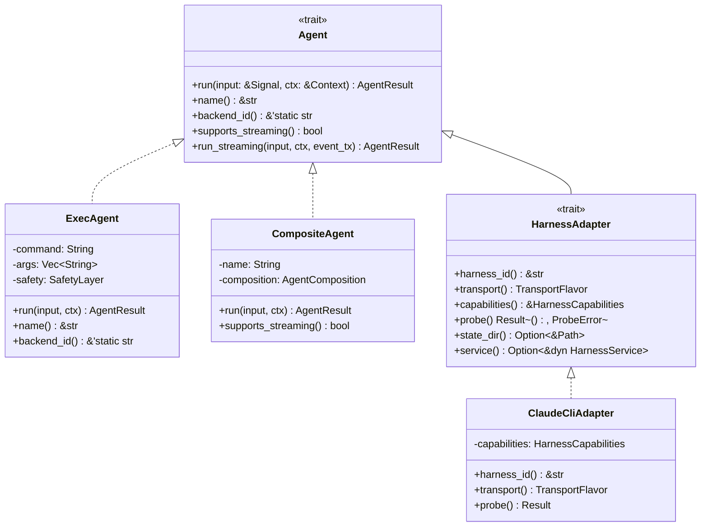
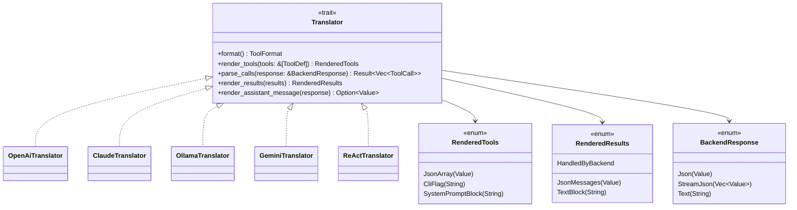
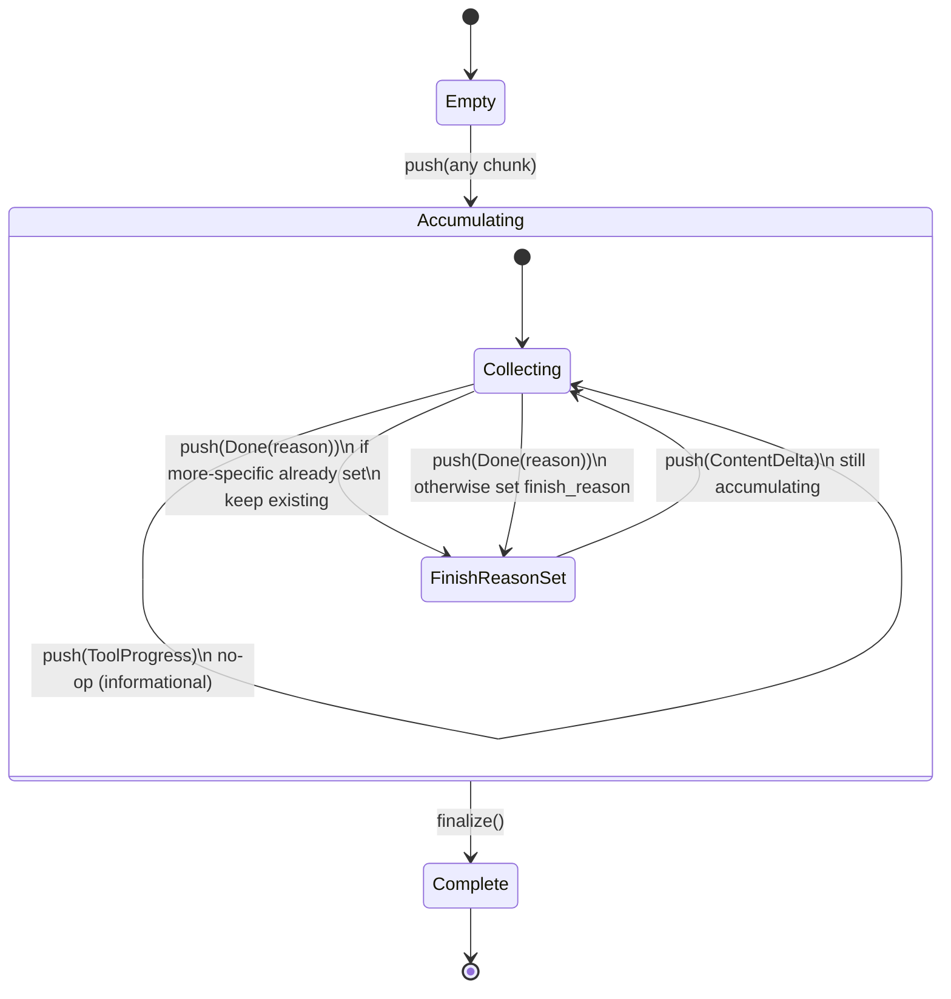
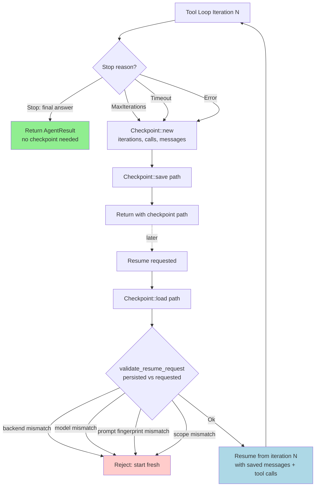
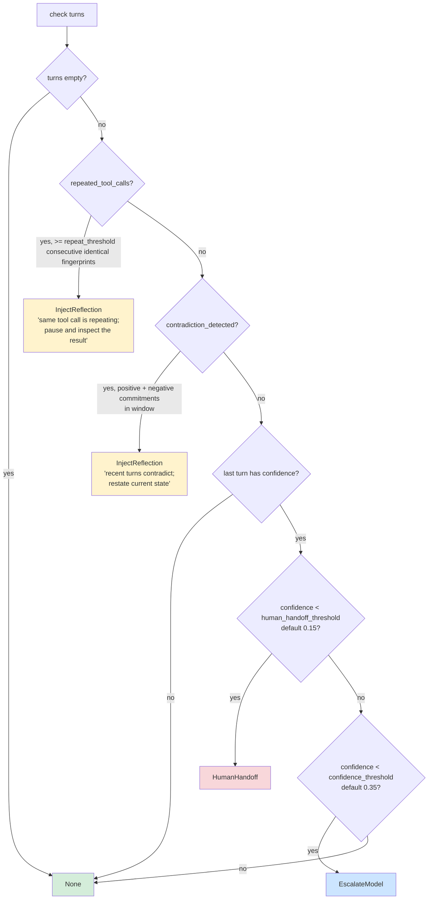
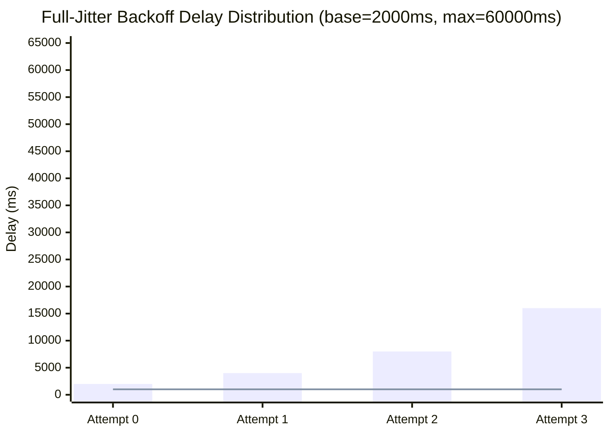

# Agent Design Patterns

**Source provenance**: `roko-agent`, `roko-std`, `roko-core`
**Priority**: HIGH -- foundational patterns for IronClaw's agent loop
**GitHub source**: https://github.com/wpank/roko/blob/main/

> **Self-contained document**: Code excerpts are taken verbatim from verified roko source
> captures. IronClaw-native build guidance references `src/agent/` directly.
> All `/Users/will/dev/nunchi/roko/...` paths have been replaced with canonical
> GitHub URLs at `https://github.com/wpank/roko/blob/main/...`.

**Cross-references:**
- [README.md](README.md) — data flow diagram and boundary table clarifying the relationship between this document's routing (Pattern 9: agent-branch selection via `SkillSelector`) and online-learning's model routing (LinUCB bandit)
- [online-learning.md](online-learning.md) — the CascadeRouter handles *model selection* within a branch; Pattern 9's `SkillSelector` handles *branch selection*. These compose: a `SkillSelector` branch can contain a `CascadeRoutingProvider`.
- [affect-engine.md Section 8](affect-engine.md#8-dispatch-modulation) — the Affect Engine modulates the `DispatchParams` fed into Pattern 7 (Task Runner and Budget Guardrails); the behavioral state is a prerequisite for the budget guardrail's graduated response
- [dream-consolidation.md Section 5.8](dream-consolidation.md#58-emotional-biasing-pad-vector) — Pattern 4 (MetacognitiveMonitor) detects the Resting state that triggers dream cycles
- [../core-concepts/cognitive-architecture.md](../core-concepts/cognitive-architecture.md) — the Gamma/Theta/Delta cognitive speed model; these patterns fire at Gamma speed (each turn)

---

## Table of Contents

1. [What This Document Covers](#1-what-this-document-covers)
2. [Why Agent Design Patterns Matter](#2-why-agent-design-patterns-matter)
3. [The Agent Trait -- Core Abstraction](#3-the-agent-trait----core-abstraction)
4. [Pattern 1: Translator (Wire Format Abstraction)](#4-pattern-1-translator-wire-format-abstraction)
5. [Pattern 2: Streaming Event Reassembly](#5-pattern-2-streaming-event-reassembly)
6. [Pattern 3: Resumable Checkpoints](#6-pattern-3-resumable-checkpoints)
7. [Pattern 4: Metacognitive Monitor](#7-pattern-4-metacognitive-monitor)
8. [Pattern 5: Harness Adapter](#8-pattern-5-harness-adapter)
9. [Pattern 6: Composable Scorers](#9-pattern-6-composable-scorers)
10. [Pattern 7: Task Runner and Budget Guardrails](#10-pattern-7-task-runner-and-budget-guardrails)
11. [Pattern 8: Retry Policy with Classified Errors](#11-pattern-8-retry-policy-with-classified-errors)
12. [Pattern 9: Agent Composition Operators](#12-pattern-9-agent-composition-operators)
13. [Pattern 10: Warm Session Reuse and Resume Validation](#13-pattern-10-warm-session-reuse-and-resume-validation)
14. [Benchmarking](#14-benchmarking)
15. [Practical Examples](#15-practical-examples)
16. [IronClaw Integration Plan](#16-ironclaw-integration-plan)
17. [Academic References](#17-academic-references)
18. [Complexity Assessment](#18-complexity-assessment)

---

## 1. What This Document Covers

This document catalogs ten reusable design patterns extracted from the roko AI agent
runtime. Each pattern addresses a specific challenge in building production-grade
LLM-powered agent systems: how to abstract over incompatible provider wire formats,
how to reassemble fragmented streaming responses into complete turn records, how to
persist and resume long-running multi-step tasks, how to detect when an agent is
stuck and intervene automatically, and how to compose smaller agent units into
larger pipelines.

Every pattern is documented with:
- Motivation: the concrete problem it solves
- Actual Rust types and function signatures verified against captured source excerpts
- Worked examples showing the pattern in action
- Mermaid diagrams illustrating state machines, hierarchies, and data flow
- Benchmarking guidance for measuring the pattern in production
- A mapping to IronClaw's existing agent architecture in `src/agent/`

### Scope

**In scope**: Patterns from `roko-agent` and `roko-std` that govern the agent
execution lifecycle -- the path from receiving a prompt to producing a final output.

**Not in scope**: Memory and indexing patterns (covered in the memory document),
orchestration and swarm coordination (covered in the orchestrator-swarm document),
provider transport mechanics (covered in the LLM integration document), and tool
definition/execution (covered in the tool system document).

### Crate topology

| Crate | Role | Key modules |
|-------|------|-------------|
| `roko-core` | Shared primitives: `Signal`, `Context`, `Task`, `ContentHash`, `ToolCall`, `ToolDef` | `signal.rs`, `context.rs`, `task.rs`, `tool/` |
| `roko-agent` | Agent runtime: trait, translators, streaming, checkpoints, introspection, harness, composition, retry, session, task runner | `agent.rs`, `translate/`, `streaming.rs`, `tool_loop/checkpoint.rs`, `introspection.rs`, `harness/`, `composition.rs`, `retry.rs`, `session.rs`, `task_runner.rs` |
| `roko-std` | Standard library of reusable components: scorers, mock agents | `scorer.rs`, `mock.rs` |

---

## 2. Why Agent Design Patterns Matter

Modern LLM agent systems face a combinatorial explosion of provider APIs, transport
protocols, streaming formats, error modes, and deployment constraints. Without
principled abstractions, each new backend or capability multiplies the codebase
linearly. These patterns reduce extension cost to a constant by factoring
cross-cutting concerns into composable traits:

| Challenge | Without patterns | With patterns |
|-----------|-----------------|---------------|
| New LLM backend | Rewrite tool calling, streaming, retry for each provider | Implement one `Translator`, inherit streaming/retry/checkpoint for free |
| Streaming display | Bespoke SSE parsing per provider | Unified `StreamAccumulator` state machine handles all variants |
| Long task recovery | Lost progress on crash or timeout | `Checkpoint` serializes tool-loop state; resume from last snapshot |
| Stuck detection | Manual monitoring, user complaints | `MetacognitiveMonitor` detects loops and contradictions automatically |
| Multi-agent workflows | Hardcoded orchestration per workflow | `AgentComposition` operators (pipeline, parallel, conditional, mixture) |

The key insight: all patterns compose through the `Agent` trait. Any `Agent` can
be wrapped in any composition operator, retried with any policy, checkpointed at
any granularity, and monitored for stuck behavior -- because they all speak the
same `Signal -> AgentResult` interface.

---

## 3. The Agent Trait -- Core Abstraction

### Problem

An AI agent system must support many backend implementations (direct LLM calls,
subprocess wrappers, HTTP proxies, composed pipelines) behind a single interface.
Each implementation is async, non-deterministic, and may produce side effects.

### Design rationale

The `Agent` trait is deliberately minimal: one required method (`run`) plus two
optional capabilities (`supports_streaming`, `run_streaming`). This mirrors the
"ports and adapters" architectural pattern [Cockburn 2005] where the trait is the
port and each implementation is an adapter. The trait's simplicity enables
composition -- any wrapper that implements `Agent` can be substituted wherever an
agent is expected.

### Agent trait hierarchy



### Source: [`roko-agent/src/agent.rs`](https://github.com/wpank/roko/blob/main/roko-agent/src/agent.rs)

```rust
/// An agent: an async executor that takes an input signal (typically a prompt)
/// and produces output signals.
#[async_trait]
pub trait Agent: Send + Sync {
    /// Run the agent against the input signal.
    async fn run(&self, input: &Signal, ctx: &Context) -> AgentResult;

    /// Human-readable name for logs/metrics.
    fn name(&self) -> &str;

    /// Stable backend identifier for audit and episode logging.
    fn backend_id(&self) -> &'static str {
        "unknown"
    }

    /// Does this agent emit a streaming trace?
    fn supports_streaming(&self) -> bool {
        false
    }

    /// Run the agent with streaming output.
    ///
    /// The default implementation falls back to `run()` and emits a single
    /// `ContentDelta` with the full output text, plus a `Usage` chunk
    /// if token counts are non-zero.
    async fn run_streaming(
        &self,
        input: &Signal,
        ctx: &Context,
        event_tx: mpsc::Sender<StreamChunk>,
    ) -> AgentResult {
        let result = self.run(input, ctx).await;
        if let Ok(text) = result.output.body.as_text() {
            if !text.is_empty() {
                let _ = event_tx
                    .send(StreamChunk::ContentDelta(text.to_string()))
                    .await;
            }
        }
        if result.usage.total_tokens() > 0 {
            let _ = event_tx.send(StreamChunk::Usage(result.usage)).await;
        }
        result
    }
}
```

### The AgentResult value type

Every agent run produces an `AgentResult` carrying four fields:

```rust
pub struct AgentResult {
    /// The primary output signal (Kind::AgentOutput).
    pub output: Signal,
    /// Intermediate signals: stream chunks, tool calls, diffs, errors.
    pub trace: Vec<Signal>,
    /// Legacy token usage + cost counters.
    pub usage: Usage,
    /// Canonical usage observation with optional provenance.
    pub usage_obs: Option<UsageObservation>,
    /// Whether the agent ran successfully.
    pub success: bool,
}
```

The `trace` field is ordered chronologically and provides full observability into
the agent's internal execution path. The `usage` and `usage_obs` fields support
both legacy per-token accounting and the newer structured observation format.

### Worked example: testing an agent

```rust
// Any Agent implementation can be tested against this interface:
let agent = ExecAgent::new("echo", vec![], SafetyLayer::with_defaults());
let prompt = Signal::builder(Kind::Prompt)
    .body(Body::text("hello"))
    .build();
let result = agent.run(&prompt, &Context::now()).await;
assert!(result.success);
assert_eq!(result.output.body.as_text().unwrap(), "hello");
```

### IronClaw mapping

IronClaw's `LoopDelegate` trait in
[`src/agent/agentic_loop.rs`](../../src/agent/agentic_loop.rs)
serves this role with more lifecycle hooks. The three concrete implementations
are `ChatDelegate` (dispatcher.rs), `JobDelegate` (worker/job.rs), and
`ContainerDelegate` (worker/container.rs). The roko `Agent` trait is narrower
but directly composable; the IronClaw equivalent has richer pre/post hooks.

---

## 4. Pattern 1: Translator (Wire Format Abstraction)

### Problem

LLM providers use incompatible wire formats for tool calling. OpenAI sends tools
as a JSON array in the request body and returns `tool_calls` objects. Anthropic's
Claude CLI accepts a `--tools=Read,Edit,Bash` flag and returns stream-json events
with `tool_use` blocks. Google Gemini uses `functionDeclarations` /
`functionCall` / `functionResponse`. Models without native function calling need
the ReAct prompt-level approach with `Action:` / `Observation:` text markers.

Without an abstraction layer, the agent's tool-call logic must branch on provider
type at every step. Each new provider multiplies this branching.

### Design rationale

The Translator pattern is a structural adapter [Gamma et al. 1995] that converts
between a canonical internal representation (`ToolDef`, `ToolCall`, `ToolResult`)
and each provider's wire format. Translators are **sync, pure functions** with no
I/O and no side effects. This separation means the async transport layer remains
independent of the serialization logic.

Tool-call format preference is model-specific, with documented accuracy differences
of 5-30 percentage points when using the wrong format [WildToolBench, Qwen3-coder
format switch measurements].

### Translator adapter pattern



### Source: [`roko-agent/src/translate/mod.rs`](https://github.com/wpank/roko/blob/main/roko-agent/src/translate/mod.rs)

```rust
/// Bidirectional bridge between canonical tools and a backend's wire format.
///
/// Implementors are sync and pure: given identical inputs they must
/// produce identical outputs, and they perform no I/O.
pub trait Translator: Send + Sync {
    /// Which wire format this translator emits/parses.
    fn format(&self) -> ToolFormat;

    /// Serialize the tool catalog into the backend's expected shape.
    fn render_tools(&self, tools: &[ToolDef]) -> RenderedTools;

    /// Parse the backend's response into canonical tool calls.
    fn parse_calls(&self, response: &BackendResponse) -> Result<Vec<ToolCall>, TranslatorError>;

    /// Serialize tool results for the next turn.
    fn render_results(&self, results: &[(ToolCall, ToolResult)]) -> RenderedResults;

    /// Extract the assistant message for conversation history injection.
    fn render_assistant_message(&self, _response: &BackendResponse) -> Option<serde_json::Value> {
        None
    }
}
```

### Payload enums

```rust
/// Backend-specific tool-spec payload.
pub enum RenderedTools {
    /// JSON array for the HTTP body (OpenAI, Ollama, compatible gateways).
    JsonArray(serde_json::Value),
    /// CLI flag payload (e.g. "Read,Edit,Bash") for Claude CLI.
    CliFlag(String),
    /// Text block inlined into the system prompt (ReAct fallback).
    SystemPromptBlock(String),
}

/// Backend-specific tool-result payload for the next turn.
pub enum RenderedResults {
    /// Array of tool-result messages (OpenAI, Ollama).
    JsonMessages(serde_json::Value),
    /// Text to splice into the prompt (ReAct).
    TextBlock(String),
    /// No-op -- backend owns its own tool-call loop (Claude CLI).
    HandledByBackend,
}

/// Raw backend response variants.
pub enum BackendResponse {
    /// Single JSON object (Ollama, OpenAI, Anthropic API non-streaming).
    Json(serde_json::Value),
    /// Sequence of stream-json events (Claude CLI).
    StreamJson(Vec<serde_json::Value>),
    /// Plain-text completion (ReAct models).
    Text(String),
}
```

### Concrete implementations

| Translator | File | Wire format | Tool delivery | Result format |
|-----------|------|-------------|---------------|---------------|
| `OpenAiTranslator` | [`translate/openai.rs`](https://github.com/wpank/roko/blob/main/roko-agent/src/translate/openai.rs) | OpenAI JSON | `JsonArray` | `JsonMessages` |
| `StrictOpenAiTranslator` | [`translate/openai.rs`](https://github.com/wpank/roko/blob/main/roko-agent/src/translate/openai.rs) | Strict-mode OpenAI JSON | `JsonArray` | `JsonMessages` |
| `ClaudeTranslator` | [`translate/claude.rs`](https://github.com/wpank/roko/blob/main/roko-agent/src/translate/claude.rs) | Claude CLI stream-json | `CliFlag` | `HandledByBackend` |
| `OllamaTranslator` | [`translate/ollama.rs`](https://github.com/wpank/roko/blob/main/roko-agent/src/translate/ollama.rs) | Ollama `/api/chat` | `JsonArray` | `JsonMessages` |
| `GeminiTranslator` | [`translate/gemini.rs`](https://github.com/wpank/roko/blob/main/roko-agent/src/translate/gemini.rs) | Gemini `functionDeclarations` | `JsonArray` | `JsonMessages` |
| `ReActTranslator` | [`translate/react.rs`](https://github.com/wpank/roko/blob/main/roko-agent/src/translate/react.rs) | Text-level ReAct markers | `SystemPromptBlock` | `TextBlock` |

### Practical example: adapting between Claude, OpenAI, and Ollama backends

This example shows how the same agent code selects different translators at
runtime, enabling backend switching without changing the tool dispatch logic:

```rust
// Automatic translator selection based on model name
// Source: roko-agent/src/translate/capability.rs
pub fn translator_for(model_name: &str) -> Box<dyn Translator> {
    match model_name {
        name if name.starts_with("claude") => Box::new(ClaudeTranslator),
        name if name.starts_with("gpt") || name.starts_with("o1") || name.starts_with("o3") => {
            Box::new(OpenAiTranslator)
        }
        name if name.contains("gemini") => Box::new(GeminiTranslator),
        // Ollama models that support function calling
        "llama3.1" | "mistral-nemo" | "qwen2.5-coder" => Box::new(OllamaTranslator),
        // Any model without native function calling falls back to ReAct
        _ => Box::new(ReActTranslator),
    }
}

// Usage in the agent loop -- single dispatch point, backend-agnostic
async fn execute_tool_loop(
    agent: &dyn Agent,
    translator: &dyn Translator,
    tools: &[ToolDef],
    initial_prompt: &str,
) -> Result<String> {
    // Render tools once according to the backend's preferred format
    let rendered_tools = translator.render_tools(tools);

    // Claude: rendered_tools = CliFlag("Read,Edit,Bash")
    // OpenAI: rendered_tools = JsonArray([{"type":"function","function":{...}}])
    // ReAct:  rendered_tools = SystemPromptBlock("You have access to:\n### read_file\n...")

    let mut messages = vec![build_initial_message(&rendered_tools, initial_prompt)];

    loop {
        let backend_response = call_backend(&messages, &rendered_tools).await?;
        let tool_calls = translator.parse_calls(&backend_response)?;

        if tool_calls.is_empty() {
            // No tool calls -- final answer
            return extract_text(&backend_response);
        }

        // Execute tools and render results in backend format
        let results = execute_tools(&tool_calls).await?;
        let rendered_results = translator.render_results(&results);

        match rendered_results {
            RenderedResults::JsonMessages(msgs) => messages.extend(msgs_from_json(msgs)),
            RenderedResults::TextBlock(text) => messages.push(observation_message(text)),
            RenderedResults::HandledByBackend => { /* Claude CLI manages its own loop */ }
        }
    }
}
```

### Worked example: ReAct translator round-trip

The ReAct translator works entirely at the text level, enabling tool use with
models that have no native function-calling support:

```rust
// Source: roko-agent/src/translate/react.rs

// 1. Render tools into a system prompt block
let tools = vec![ToolDef::new("read_file", "Read a file.", schema)];
let rendered = ReActTranslator.render_tools(&tools);
// -> SystemPromptBlock("You have access to the following tools:\n\n### read_file\n...")

// 2. Model generates a plain-text completion with Action/Input markers
let completion = "Thought: I need to look at the file.\n\
                  Action: read_file\n\
                  Action Input: {\"path\": \"src/lib.rs\"}\n\n";

// 3. Parse the completion into a canonical ToolCall
let calls = ReActTranslator.parse_calls(&BackendResponse::Text(completion.into()))?;
assert_eq!(calls[0].name, "read_file");
assert_eq!(calls[0].arguments["path"], "src/lib.rs");
assert_eq!(calls[0].id, "react-0");  // fixed ID for single-call ReAct

// 4. Render the tool result as an "Observation:" text block
let result = ToolResult::text("pub fn main() {}");
let rendered = ReActTranslator.render_results(&[(calls[0].clone(), result)]);
// -> TextBlock("Observation: pub fn main() {}\n\n")
```

**Parsing detail**: the ReAct parser uses `rfind("Action:")` (last occurrence,
not first) because earlier `Action:` strings may appear quoted inside the model's
reasoning text. Only the trailing occurrence corresponds to the actual action the
model is emitting.

---

## 5. Pattern 2: Streaming Event Reassembly

### Problem

LLM providers deliver responses as fragmented server-sent event (SSE) streams. A
single assistant turn may arrive as dozens or hundreds of small delta chunks:
incremental text fragments, partial tool-call JSON, reasoning/thinking tokens,
usage accounting, and a terminal done marker. The agent runtime needs to
reconstruct a complete, well-formed turn record from these fragments for tool
dispatch, conversation history injection, and checkpoint serialization.

### Design rationale

The `StreamAccumulator` implements a state machine that reduces any `StreamChunk`
sequence into a complete `BackendResponse`. This is the accumulator/reducer
pattern from event-stream processing [Ousterhout 2018]. The accumulator is
append-only -- each `push` is idempotent with respect to ordering -- making it
safe in concurrent streaming scenarios.

### Streaming accumulator state machine



### Source: [`roko-agent/src/streaming.rs`](https://github.com/wpank/roko/blob/main/roko-agent/src/streaming.rs)

#### The stream chunk vocabulary

```rust
/// One incremental piece of a streaming LLM response.
pub enum StreamChunk {
    /// Incremental reasoning or thinking text.
    ReasoningDelta(String),
    /// Incremental assistant-visible content text.
    ContentDelta(String),
    /// Incremental function-call data for one tool call slot.
    ToolCallDelta {
        /// Zero-based tool call index within the current assistant turn.
        index: usize,
        /// Incremental tool call identifier fragment.
        id_delta: Option<String>,
        /// Incremental function name fragment.
        name_delta: Option<String>,
        /// Incremental JSON argument text.
        arguments_delta: String,
    },
    /// Token accounting emitted during or after the stream.
    Usage(Usage),
    /// Terminal stream marker with the canonical finish reason.
    Done(FinishReason),
    /// Terminal provider or transport error surfaced as a stream event.
    Error(String),
    /// Progress update from a running tool (harness adapters).
    ToolProgress {
        tool: String,
        status: String,
    },
}
```

#### The accumulator state machine

```rust
pub struct StreamAccumulator {
    reasoning: String,
    content: String,
    tool_calls: Vec<PartialToolCall>,
    usage: Usage,
    finish_reason: FinishReason,
}

#[derive(Debug, Clone, Default)]
struct PartialToolCall {
    id: String,
    name: String,
    arguments: String,
}

impl StreamAccumulator {
    pub fn new() -> Self { Self::default() }

    /// Incorporate one streamed chunk into the in-progress response.
    pub fn push(&mut self, chunk: StreamChunk) {
        match chunk {
            StreamChunk::ReasoningDelta(delta) => self.reasoning.push_str(&delta),
            StreamChunk::ContentDelta(delta) => self.content.push_str(&delta),
            StreamChunk::ToolCallDelta { index, id_delta, name_delta, arguments_delta } => {
                // Auto-extend the tool_calls vec to accommodate the index
                while self.tool_calls.len() <= index {
                    self.tool_calls.push(PartialToolCall::default());
                }
                let tool_call = &mut self.tool_calls[index];
                if let Some(id) = id_delta {
                    tool_call.id = id;
                }
                if let Some(name) = name_delta {
                    tool_call.name = name;
                }
                tool_call.arguments.push_str(&arguments_delta);
            }
            StreamChunk::Usage(usage) => self.usage = usage,
            StreamChunk::Done(finish_reason) => {
                // Preserve a more specific finish reason if we already have one
                let should_preserve_existing = matches!(finish_reason, FinishReason::Stop)
                    && !matches!(self.finish_reason, FinishReason::Stop);
                if !should_preserve_existing {
                    self.finish_reason = finish_reason;
                }
            }
            StreamChunk::Error(_) => {}
            StreamChunk::ToolProgress { .. } => {
                // Informational; does not affect the accumulated response.
            }
        }
    }
}
```

### Tool call reassembly detail

Tool call deltas arrive indexed. A single assistant turn may emit multiple
parallel tool calls. The accumulator tracks them independently:

```
Stream events:
  ToolCallDelta { index: 0, id_delta: Some("call_1"), name_delta: Some("read_file"),
                  arguments_delta: "{\"" }
  ToolCallDelta { index: 1, id_delta: Some("call_2"), name_delta: Some("list_dir"),
                  arguments_delta: "{\"" }
  ToolCallDelta { index: 0, arguments_delta: "path\":\"src/main.rs\"}" }
  ToolCallDelta { index: 1, arguments_delta: "path\":\".\"}" }
  Done(ToolCalls)

Accumulator state after all chunks:
  tool_calls[0] = { id: "call_1", name: "read_file",
                    arguments: "{\"path\":\"src/main.rs\"}" }
  tool_calls[1] = { id: "call_2", name: "list_dir",
                    arguments: "{\"path\":\".\"}" }
```

### Finish reason precedence

The `Done` handler has a subtle priority rule: if the accumulator already holds
a more specific finish reason (e.g., `FinishReason::ToolCalls` from a prior
chunk), a subsequent `Done(Stop)` does not overwrite it. This handles providers
that send a generic stop event after already signaling tool use.

### Worked example: streaming an entire conversation turn

```rust
let (tx, mut rx) = mpsc::channel(64);
let mut accumulator = StreamAccumulator::new();

// Agent streams chunks into the channel
let handle = tokio::spawn(async move {
    agent.run_streaming(&prompt, &ctx, tx).await
});

// Consumer reassembles the complete response
while let Some(chunk) = rx.recv().await {
    // Forward to UI for real-time display
    display.push_chunk(&chunk);
    // Accumulate for the final turn record
    accumulator.push(chunk);
}

let result = handle.await?;
// accumulator now holds the complete response for history/checkpoint
let content = accumulator.content;
let tool_calls = accumulator.finalize_tool_calls()?;
let usage = accumulator.usage;
```

---

## 6. Pattern 3: Resumable Checkpoints

### Problem

LLM-powered tool loops can run for minutes or hours. A crash, timeout, or
context-window rotation during a long tool loop loses all accumulated progress:
the conversation history, the tool calls dispatched so far, and the provider
session state needed to continue the conversation.

This is the classic checkpoint-restart problem from high-performance computing
[Elnozahy et al. 2002], adapted for the LLM agent setting where "process state"
includes the entire conversation transcript and provider session metadata.

### Design rationale

The `Checkpoint` type captures the minimal state needed to resume a tool loop:
iteration count (so the budget is correctly decremented), accumulated tool calls
(so the agent knows what has been done), conversation messages (so the provider
can continue the conversation), and provider session identifiers (for providers
that support session continuity).

The checkpoint is serialized as JSON and persisted to disk. On resume, the tool
loop loads the checkpoint, validates it against the current configuration (model,
backend, prompt fingerprint), and continues from the saved iteration.

### Checkpoint save/restore lifecycle



### Source: [`roko-agent/src/tool_loop/checkpoint.rs`](https://github.com/wpank/roko/blob/main/roko-agent/src/tool_loop/checkpoint.rs)

```rust
/// Serializable snapshot of a ToolLoop mid-execution.
///
/// Created by the loop when it stops for any reason other than
/// StopReason::Stop (the normal "final answer" path).
#[derive(Debug, Clone, Serialize, Deserialize)]
pub struct Checkpoint {
    /// Number of tool-call iterations completed before this snapshot.
    pub iterations: usize,
    /// All tool calls dispatched so far (across all iterations).
    pub tool_calls: Vec<ToolCall>,
    /// The full conversation message history at snapshot time.
    pub messages: Vec<serde_json::Value>,
    /// Provider-issued session identifiers required to resume the conversation.
    #[serde(default)]
    pub session: SessionState,
}

impl Checkpoint {
    pub fn new(
        iterations: usize,
        tool_calls: Vec<ToolCall>,
        messages: Vec<serde_json::Value>,
    ) -> Self { /* ... */ }

    /// Attach provider session continuity state.
    pub fn with_session(mut self, session: SessionState) -> Self { /* ... */ }

    /// Serialize to JSON bytes for persistence.
    pub fn to_bytes(&self) -> serde_json::Result<Vec<u8>> {
        serde_json::to_vec(self)
    }

    /// Deserialize from JSON bytes.
    pub fn from_bytes(bytes: &[u8]) -> serde_json::Result<Self> {
        serde_json::from_slice(bytes)
    }

    /// Persist to disk as formatted JSON (creates parent directories).
    pub fn save(&self, path: &Path) -> Result<()> {
        if let Some(parent) = path.parent() {
            std::fs::create_dir_all(parent)?;
        }
        let json = serde_json::to_string_pretty(self)?;
        std::fs::write(path, json)?;
        Ok(())
    }

    /// Load from a JSON file.
    pub fn load(path: &Path) -> Result<Self> {
        let json = std::fs::read_to_string(path)?;
        let cp: Self = serde_json::from_str(&json)?;
        Ok(cp)
    }
}
```

### Practical example: checkpointing a long-running task for resume

```rust
// In a long-running code review task that may exceed context limits

async fn run_code_review(
    agent: &dyn Agent,
    files: Vec<PathBuf>,
    checkpoint_path: &Path,
) -> Result<ReviewReport> {
    // Try to resume from an existing checkpoint
    let (start_iteration, mut messages) = if checkpoint_path.exists() {
        let cp = Checkpoint::load(checkpoint_path)?;
        tracing::info!(
            "Resuming code review from iteration {} ({} files already processed)",
            cp.iterations,
            cp.tool_calls.len()
        );
        (cp.iterations, cp.messages.iter().map(parse_message).collect())
    } else {
        (0, vec![system_message("You are a code reviewer.")])
    };

    let total_files = files.len();

    for (idx, file) in files.iter().enumerate().skip(start_iteration) {
        let content = tokio::fs::read_to_string(file).await?;
        messages.push(user_message(format!(
            "Review file {}/{}: {}\n\n```\n{}\n```",
            idx + 1, total_files, file.display(), content
        )));

        let result = agent.run(&signal_from_messages(&messages), &Context::now()).await;

        if !result.success {
            // Save checkpoint before returning error
            let cp = Checkpoint::new(idx, completed_tool_calls.clone(), messages_to_json(&messages));
            cp.save(checkpoint_path)?;
            return Err(ReviewError::AgentFailed { at_file: idx });
        }

        messages.push(assistant_message(result.output.body.as_text()?));

        // Periodic checkpoint every 5 files
        if (idx + 1) % 5 == 0 {
            let cp = Checkpoint::new(
                idx + 1,
                completed_tool_calls.clone(),
                messages_to_json(&messages),
            );
            cp.save(checkpoint_path)?;
            tracing::debug!("Checkpoint saved at iteration {}", idx + 1);
        }
    }

    // Cleanup on successful completion
    if checkpoint_path.exists() {
        tokio::fs::remove_file(checkpoint_path).await?;
    }

    build_report(&messages)
}
```

### Worked example: checkpoint round-trip

```rust
// Create checkpoint during tool loop
let call = ToolCall::new("c1", "echo", json!({"x": 1}));
let cp = Checkpoint::new(
    3,  // 3 iterations completed
    vec![call],
    vec![
        json!({"role": "system", "content": "sys"}),
        json!({"role": "user", "content": "usr"}),
    ],
);

// Persist to disk
let dir = tempfile::tempdir()?;
let path = dir.path().join("state").join("checkpoint.json");
cp.save(&path)?;

// Resume later
let loaded = Checkpoint::load(&path)?;
assert_eq!(loaded.iterations, 3);
assert_eq!(loaded.tool_calls[0].name, "echo");
assert_eq!(loaded.messages.len(), 2);
```

---

## 7. Pattern 4: Metacognitive Monitor

> **Dream cycle trigger:** When the MetacognitiveMonitor returns `Intervention::Idle` (no active task detected), this signal can be used to trigger a dream consolidation cycle. In the full intelligence stack, the Affect Engine's `Resting` behavioral state (arousal < -0.20) also acts as a dream trigger. See [dream-consolidation.md Section 10 (Dream Scheduling and Budget)](dream-consolidation.md#10-dream-scheduling-and-budget) for the full trigger type taxonomy.

### Problem

LLM agents can get stuck in loops -- calling the same tool with the same
arguments repeatedly, contradicting themselves across turns ("this works"
followed by "this won't work"), or producing outputs with declining confidence.
Without automatic detection, these failure modes consume budget and time until
the iteration limit is reached.

This pattern draws on metacognition research [Flavell 1979; Cox 2005]. Recent
work on LLM self-monitoring [MIRROR benchmark, Xie et al. 2024] confirms that
explicit metacognitive scaffolding improves agent reliability.

### Design rationale

The `MetacognitiveMonitor` inspects the recent turn history and fires one of
four interventions when it detects a problem across three detection channels:

1. **Repetition detection**: Fingerprints tool calls as `"name:arguments"` strings
   and checks if the last N fingerprints are identical.
2. **Contradiction detection**: Scans recent turn text for co-occurring positive
   and negative commitments within a sliding window.
3. **Confidence thresholding**: Extracts model-reported confidence scores and
   triggers escalation or human handoff when they drop below configurable thresholds.

### Metacognitive monitor decision flow



### Source: [`roko-agent/src/introspection.rs`](https://github.com/wpank/roko/blob/main/roko-agent/src/introspection.rs)

```rust
/// A single tool / reasoning turn observed by the metacognitive monitor.
#[derive(Debug, Clone, PartialEq, Serialize, Deserialize)]
pub struct Turn {
    /// Turn index in the current run.
    pub index: usize,
    /// Assistant text returned for this turn.
    pub assistant_text: String,
    /// Reasoning / thinking content, if any.
    pub reasoning: Option<String>,
    /// Tool calls emitted in the turn.
    pub tool_calls: Vec<ToolCall>,
    /// Optional model confidence in the turn.
    pub confidence: Option<f32>,
}

/// Intervention suggested by the monitor.
#[derive(Debug, Clone, PartialEq, Eq, Serialize, Deserialize)]
pub enum Intervention {
    /// Escalate to a larger / more capable model.
    EscalateModel,
    /// Route the current task to a human.
    HumanHandoff,
    /// Abort the current run.
    Abort,
    /// Inject a reflection prompt and continue.
    InjectReflection(String),
}

/// Simple metacognitive monitor with configurable thresholds.
#[derive(Debug, Clone)]
pub struct MetacognitiveMonitor {
    /// Number of repeated tool-call fingerprints that indicate a stuck loop.
    pub repeat_threshold: usize,            // default: 3
    /// Sliding-window size for contradiction detection.
    pub contradiction_window: usize,        // default: 4
    /// Confidence below this triggers escalation.
    pub confidence_threshold: f32,          // default: 0.35
    /// Confidence below this triggers human handoff.
    pub human_handoff_threshold: f32,       // default: 0.15
}
```

### Detection priority chain

```rust
impl MetacognitiveMonitor {
    pub fn check(&self, turns: &[Turn]) -> Option<Intervention> {
        if turns.is_empty() { return None; }

        // Priority 1: stuck loop (most actionable -- inject reflection)
        if self.repeated_tool_calls(turns) {
            return Some(Intervention::InjectReflection(
                "the same tool call is repeating; pause, inspect the result, \
                 and reconcile the plan".into(),
            ));
        }

        // Priority 2: self-contradiction (inject reflection to restate)
        if self.contradiction_detected(turns) {
            return Some(Intervention::InjectReflection(
                "the recent turns contradict each other; restate the current \
                 state before continuing".into(),
            ));
        }

        // Priority 3: low confidence (escalate or hand off)
        if let Some(confidence) = turns.last().and_then(|turn| turn.confidence) {
            if confidence < self.human_handoff_threshold {
                return Some(Intervention::HumanHandoff);
            }
            if confidence < self.confidence_threshold {
                return Some(Intervention::EscalateModel);
            }
        }

        None
    }
}
```

### Repetition detection algorithm

Tool calls are fingerprinted as `"name:arguments"` strings. The detector
collects the last `repeat_threshold` fingerprints from recent turns and
checks if they are all identical:

```rust
fn repeated_tool_calls(&self, turns: &[Turn]) -> bool {
    let fingerprints: Vec<String> = turns
        .iter()
        .rev()
        .flat_map(|turn| turn.tool_fingerprints())
        .take(self.repeat_threshold)
        .collect();
    if fingerprints.len() < self.repeat_threshold || fingerprints.is_empty() {
        return false;
    }
    fingerprints.windows(2).all(|pair| pair[0] == pair[1])
}
```

### Contradiction detection algorithm

The contradiction detector scans text for co-occurring positive and negative
commitment phrases within the `contradiction_window`:

```rust
fn contradiction_detected(&self, turns: &[Turn]) -> bool {
    let recent = turns.iter().rev().take(self.contradiction_window);
    let mut saw_positive = false;
    let mut saw_negative = false;

    for turn in recent {
        let text = format!("{} {}",
                           turn.assistant_text,
                           turn.reasoning.as_deref().unwrap_or(""))
            .to_lowercase();
        if contains_positive_commitment(&text) { saw_positive = true; }
        if contains_negative_commitment(&text) { saw_negative = true; }
        if saw_positive && saw_negative { return true; }
    }
    false
}
```

The commitment vocabularies are deliberately small and high-precision:
- **Positive**: "i can", "we can", "possible", "works", "feasible", "confirmed"
- **Negative**: "i can't", "cannot", "not possible", "won't work", "fails", "impossible"

### Practical example: detecting and breaking out of stuck loops

```rust
// Integration in the agent loop -- monitor runs after each tool execution turn
async fn run_with_metacognitive_guard(
    agent: &dyn Agent,
    prompt: &Signal,
    ctx: &Context,
) -> AgentResult {
    let monitor = MetacognitiveMonitor {
        repeat_threshold: 3,
        contradiction_window: 4,
        confidence_threshold: 0.35,
        human_handoff_threshold: 0.15,
    };

    let mut turns: Vec<Turn> = Vec::new();

    loop {
        let result = agent.run(prompt, ctx).await;
        let current_turn = Turn::from_result(&result, turns.len());
        turns.push(current_turn);

        match monitor.check(&turns) {
            Some(Intervention::InjectReflection(msg)) => {
                // Inject a reflection nudge into the next turn's context
                tracing::warn!("Metacognitive intervention: {}", msg);
                // Build a new prompt with the reflection injected
                let reflection_prompt = Signal::builder(Kind::Prompt)
                    .body(Body::text(format!(
                        "REFLECTION: {}\n\nOriginal task: {}",
                        msg,
                        prompt.body.as_text().unwrap_or_default()
                    )))
                    .build();
                // Continue with modified prompt
                continue;
            }
            Some(Intervention::EscalateModel) => {
                tracing::warn!("Low confidence -- escalating to larger model");
                // Return partial result with escalation signal for caller to handle
                return result.with_escalation_needed();
            }
            Some(Intervention::HumanHandoff) => {
                tracing::error!("Very low confidence -- routing to human");
                return result.with_human_handoff();
            }
            Some(Intervention::Abort) => {
                return AgentResult::failure("Aborted by metacognitive monitor");
            }
            None => {
                if result.is_final_answer() {
                    return result;
                }
                // Continue to next iteration
            }
        }
    }
}
```

### Worked example: detecting a stuck loop

```rust
let monitor = MetacognitiveMonitor::default(); // repeat_threshold = 3

let stuck_turn = Turn {
    index: 1,
    assistant_text: String::new(),
    reasoning: None,
    tool_calls: vec![ToolCall::new("1", "read_file", json!({"path": "x"}))],
    confidence: Some(0.9),
};

// Same tool call repeated 3 times
let turns = vec![stuck_turn.clone(), stuck_turn.clone(), stuck_turn];
match monitor.check(&turns) {
    Some(Intervention::InjectReflection(msg)) => {
        assert!(msg.contains("same tool call is repeating"));
    }
    other => panic!("expected InjectReflection, got {:?}", other),
}
```

### Worked example: confidence-triggered escalation

```rust
let monitor = MetacognitiveMonitor::default(); // confidence_threshold = 0.35

let low_confidence_turn = Turn {
    index: 1,
    assistant_text: "answer".into(),
    reasoning: None,
    tool_calls: Vec::new(),
    confidence: Some(0.2),  // below 0.35 but above 0.15
};

match monitor.check(&[low_confidence_turn]) {
    Some(Intervention::EscalateModel) => { /* correct */ }
    other => panic!("expected EscalateModel, got {:?}", other),
}
```

### Agent identity (companion type)

The `introspection.rs` module also provides `AgentIdentity`, a lightweight
snapshot of the current agent's role, model tier, temperament, and capability mask:

```rust
pub struct AgentIdentity {
    pub role: AgentRole,
    pub model_tier: ModelTier,
    pub temperament: Temperament,
    pub capabilities: ToolPermissions,
}
```

This enables role-aware metacognition: an `Implementer` with
`Temperament::Balanced` might have different confidence thresholds than a
`Reviewer` with `Temperament::Cautious`.

---

## 8. Pattern 5: Harness Adapter

### Problem

External agent runtimes (Claude CLI, Cursor, Hermes, OpenClaw) each have their
own transport protocol (HTTP, CLI subprocess, ACP over stdio, MCP server mode),
capability set (streaming, tool injection, session resume, cancellation), and
lifecycle management. A naive implementation requires a separate integration path
for each harness-transport combination, creating an M x N explosion.

### Design rationale

The harness adapter pattern factors this into three orthogonal concerns:
1. **`HarnessAdapter` trait**: extends `Agent` with harness-specific metadata.
2. **`HarnessCapabilities` struct**: static description of what a harness can do.
3. **`validate_for_task()`**: pre-dispatch validation producing actionable errors.

### Harness capability probe flow

```mermaid
flowchart TD
    A[Task arrives with requirements] --> B[Look up HarnessRegistry\nfor registered adapters]
    B --> C{adapter available?}
    C --> |no| D[Error: no adapter registered]
    C --> |yes| E[adapter.probe()\n~250ms health check]
    E --> |ProbeError| F[Error: harness not healthy]
    E --> |Ok| G[validate_for_task\ncheck requirements vs capabilities]

    G --> |needs_tools AND tool_injection == Opaque\nAND mcp_passthrough == None| H[CapabilityMismatch:\n'use PerCallTools or McpOnly']
    G --> |needs_streaming AND streaming == None| I[CapabilityMismatch:\n'use SseChatCompletions']
    G --> |needs_session_resume AND session_resume == None| J[CapabilityMismatch:\n'use PreviousResponseId']
    G --> |PTY overhead AND not allows_pty_overhead| K[CapabilityMismatch:\n'set allows_pty_overhead']
    G --> |all checks pass| L[Dispatch to adapter.run]

    L --> M[AgentResult]

    style D fill:#f8d7da
    style F fill:#f8d7da
    style H fill:#fff3cd
    style I fill:#fff3cd
    style J fill:#fff3cd
    style K fill:#fff3cd
    style M fill:#d4edda
```

### Source: [`roko-agent/src/harness/mod.rs`](https://github.com/wpank/roko/blob/main/roko-agent/src/harness/mod.rs) and [`roko-agent/src/harness/capability.rs`](https://github.com/wpank/roko/blob/main/roko-agent/src/harness/capability.rs)

#### The HarnessAdapter trait

```rust
/// A harness adapter is an Agent that wraps an external long-lived process.
#[async_trait]
pub trait HarnessAdapter: Agent {
    /// Stable identifier (appears in roko.toml and episode logs).
    fn harness_id(&self) -> &str;

    /// Which transport this adapter speaks.
    fn transport(&self) -> TransportFlavor;

    /// Static description of capabilities at this transport.
    fn capabilities(&self) -> &HarnessCapabilities;

    /// Cheap install / auth / version probe (~250ms on healthy installs).
    async fn probe(&self) -> Result<(), ProbeError>;

    /// Where the harness stores its state on disk.
    fn state_dir(&self) -> Option<&Path> { None }

    /// Lifecycle manager for the underlying daemon, if any.
    fn service(&self) -> Option<&dyn HarnessService> { None }
}
```

#### Transport flavors (7-tier hierarchy)

```rust
pub enum TransportFlavor {
    HttpOpenAi,      // Tier 1: OpenAI-compatible HTTP API
    HttpResponses,   // Tier 1: OpenAI Responses API over HTTP
    OneShotJson,     // Tier 2: CLI with JSON envelope on stdout
    OneShotPlain,    // Tier 2: CLI with plain-text output
    AcpStdio,        // Tier 3: ACP over stdio
    TuiJsonRpc,      // Tier 4: TUI JSON-RPC over stdio (deferred to v2)
    McpServer,       // Tier 5: MCP server mode
}
```

#### Capability negotiation

```rust
pub struct HarnessCapabilities {
    pub one_shot: OneShotMode,            // How prompts are delivered
    pub streaming: StreamingMode,         // SSE, NDJSON, raw tokens, or none
    pub session_resume: SessionResumeMode, // PreviousResponseId, CliFlag, Acp, or none
    pub mcp_passthrough: McpMode,         // PerCall, ConfigFile, ServerOnly, or none
    pub tool_injection: ToolInjection,    // PerCallTools, ConfigFile, McpOnly, or Opaque
    pub model_override: bool,             // Can the caller override the model per request?
    pub multiplex_safe: bool,             // Can multiple agents share this adapter?
    pub cancel: CancelMode,              // HttpEndpoint, KillChild, AcpCancel, or none
    pub overhead_p50_ms: u32,            // Approximate p50 latency overhead
}
```

#### Pre-dispatch validation

```rust
pub fn validate_for_task(
    adapter: &dyn HarnessAdapter,
    task: &HarnessTaskRequirements,
) -> Result<(), CapabilityMismatch> {
    let c = adapter.capabilities();

    // Check: tools needed but no injection path available
    if task.needs_tools
        && matches!(c.tool_injection, ToolInjection::Opaque)
        && matches!(c.mcp_passthrough, McpMode::None | McpMode::ServerOnly)
    {
        return Err(CapabilityMismatch {
            adapter: adapter.harness_id().to_string(),
            transport: adapter.transport(),
            need: "tools",
            hint: "use a transport with PerCallTools, ConfigFile, or McpOnly tool injection",
        });
    }

    // Check: streaming needed but not available
    if task.needs_streaming && matches!(c.streaming, StreamingMode::None) {
        return Err(CapabilityMismatch { /* ... */ });
    }

    // ... MCP, session resume, cancel, PTY checks follow the same pattern
    Ok(())
}
```

### Validation constraint matrix

| Task requirement | Capability check | Mismatch hint |
|-----------------|-----------------|---------------|
| `needs_tools` | `tool_injection != Opaque` OR `mcp_passthrough` is `PerCall`/`ConfigFile` | Use a transport with PerCallTools, ConfigFile, or McpOnly |
| `needs_streaming` | `streaming != None` | Use a transport with SseChatCompletions or NdJson |
| `needs_mcp` | `mcp_passthrough` is `PerCall` or `ConfigFile` | Use a transport that supports per-call or config-file MCP injection |
| `needs_session_resume` | `session_resume != None` | Use a transport with PreviousResponseId, CliFlag, or Acp |
| `needs_cancel` | `cancel != None` | Use a transport with HttpEndpoint, KillChild, or AcpCancel |
| PTY overhead | `one_shot != PtyAutomation` OR `allows_pty_overhead` | Set allows_pty_overhead = true or use a different transport |

---

## 9. Pattern 6: Composable Scorers

### Problem

AI agent systems need to rank and filter items (search results, memory entries,
candidate responses) by multiple independent criteria: relevance, recency,
reputation, confidence. Building monolithic scoring functions creates rigid,
hard-to-test code.

### Design rationale

The scorer composition pattern uses two algebraic operators -- addition and
multiplication -- to combine independent scoring functions [Wadler 1992]:

- **Sum** (`+`): aggregates evidence from multiple sources. Use when each scorer
  contributes independent evidence toward a single verdict.
- **Multiply** (`*`): scales each dimension independently. Use when each scorer
  acts as a gate -- a zero in any dimension zeros the whole score.

### Source: [`roko-std/src/scorer.rs`](https://github.com/wpank/roko/blob/main/roko-std/src/scorer.rs)

```rust
use roko_core::traits::Score as ScoreFn;
use roko_core::{Context, Engram, Score};

/// Sum several scorers element-wise (aggregates evidence).
pub struct SumScorer {
    scorers: Vec<Box<dyn ScoreFn>>,
    name: String,
}

impl ScoreFn for SumScorer {
    fn score(&self, signal: &Engram, ctx: &Context) -> Score {
        self.scorers
            .iter()
            .fold(Score::ZERO, |acc, s| acc + s.score(signal, ctx))
    }
    fn name(&self) -> &'static str { "sum_scorer" }
}

/// Multiply several scorers element-wise (scales each axis).
pub struct MulScorer {
    scorers: Vec<Box<dyn ScoreFn>>,
    name: String,
}

impl ScoreFn for MulScorer {
    fn score(&self, signal: &Engram, ctx: &Context) -> Score {
        let one = Score::new(1.0, 1.0, 1.0, 1.0);
        self.scorers
            .iter()
            .fold(one, |acc, s| acc * s.score(signal, ctx))
    }
    fn name(&self) -> &'static str { "mul_scorer" }
}

/// Returns a fixed score for every signal. Useful for static weighting.
pub struct ConstScorer {
    value: Score,
}
```

### Composition algebra

```
SumScorer([A, B])  =>  A(signal) + B(signal)     (element-wise addition)
MulScorer([A, B])  =>  A(signal) * B(signal)     (element-wise multiplication)

// Nesting is natural:
MulScorer([
    SumScorer([relevance, recency]),    // evidence aggregation
    ConstScorer(0.8, 1.0, 1.0, 1.0),   // static weight
])
```

### Identity elements

- `SumScorer` with zero scorers returns `Score::ZERO` (additive identity).
- `MulScorer` with zero scorers returns `Score::new(1.0, 1.0, 1.0, 1.0)` (multiplicative identity).

Empty compositions are safe to use and behave correctly.

### Worked example: ranking search results

```rust
// Overall score = relevance x recency x reputation
let scorer = MulScorer::new(vec![
    Box::new(RelevanceScorer::new(query)),
    Box::new(RecencyScorer),
    Box::new(ReputationScorer),
]);

let results: Vec<(Engram, Score)> = candidates
    .iter()
    .map(|c| (c.clone(), scorer.score(c, &ctx)))
    .collect();

// Sort by confidence axis descending
results.sort_by(|a, b| b.1.confidence.partial_cmp(&a.1.confidence).unwrap());
```

---

## 10. Pattern 7: Task Runner and Budget Guardrails

### Problem

Agent tasks need a coordination layer that wraps raw agent execution with event
broadcasting, anomaly detection, budget enforcement, cost accounting, and
conductor-driven model escalation. Without this, each caller must independently
implement these cross-cutting concerns.

### Design rationale

The `TaskRunner` is the composition point for the task execution pipeline. It
owns the agent and its support infrastructure as a single unit, ensuring every
task iteration passes through the same pipeline of checks and accounting.

### Source: [`roko-agent/src/task_runner.rs`](https://github.com/wpank/roko/blob/main/roko-agent/src/task_runner.rs)

```rust
pub struct TaskRunner {
    /// The task-facing agent implementation.
    pub agent: Box<dyn Agent>,
    /// Event stream publisher for runtime feedback.
    pub event_bus: EventBus,
    /// Session-local anomaly detector.
    pub anomaly: AnomalyDetector,
    /// Budget guardrail applied across task iterations.
    pub budget: BudgetGuardrail,
    /// Learned conductor policy for intervention decisions.
    pub conductor: ConductorBandit,
    /// Pricing table for cost computation.
    pub cost_table: CostTable,
    /// Requested model slug.
    pub model_slug: String,
    /// Provider identifier.
    pub provider_id: String,
    /// Maximum task-loop iterations before aborting.
    pub max_iterations: u32,
}
```

### Task result

```rust
pub struct TaskResult {
    pub output: Signal,
    pub total_usage: Usage,
    pub total_cost_usd: f64,
    pub iterations: u32,
    pub gate_passed: bool,
    pub conductor_actions: Vec<ConductorAction>,
}
```

### Anomaly detection

The `AnomalyDetector` uses a sliding-window prompt-hash approach to detect
prompt loops:

```rust
const PROMPT_LOOP_WINDOW: usize = 20;
const PROMPT_LOOP_THRESHOLD: usize = 5;

pub struct AnomalyDetector {
    prompt_hash_window: VecDeque<u64>,
    session_start_ms: i64,
}

impl AnomalyDetector {
    /// Check a prompt hash for repeated-loop behavior.
    pub fn check_prompt(&mut self, prompt_hash: u64) -> Option<Anomaly> {
        self.prompt_hash_window.push_back(prompt_hash);
        if self.prompt_hash_window.len() > PROMPT_LOOP_WINDOW {
            self.prompt_hash_window.pop_front();
        }
        let repeated_count = self.prompt_hash_window
            .iter()
            .filter(|&&hash| hash == prompt_hash)
            .count();
        (repeated_count >= PROMPT_LOOP_THRESHOLD)
            .then_some(Anomaly::PromptLoop { repeated_count })
    }
}
```

### Event bus

The `EventBus` uses a `tokio::broadcast` channel to publish runtime events:

```rust
pub enum AgentEvent {
    TurnStarted { task_id, model, provider, timestamp_ms },
    TurnCompleted { turn, usage, tool_call_count, gate_passed, finish_reason },
    CostRecorded { model, provider, cost_usd, tokens },
    AnomalyDetected { anomaly },
}
```

### Task runner errors

```rust
pub enum TaskRunnerError {
    BudgetExhausted,
    Anomaly(Anomaly),
    ModelEscalation,
}
```

### Practical example: graduated budget responses (warn, throttle, pause, abort)

This example shows a four-tier budget response that degrades gracefully rather
than hard-stopping at a single threshold:

```rust
// Budget guardrail with graduated responses
pub struct GraduatedBudgetGuardrail {
    /// Daily budget in USD
    daily_budget_usd: f64,
    /// Warn at this fraction of daily budget
    warn_fraction: f64,    // e.g. 0.70
    /// Throttle (inject delays) at this fraction
    throttle_fraction: f64, // e.g. 0.80
    /// Pause and require confirmation at this fraction
    pause_fraction: f64,   // e.g. 0.90
    /// Hard abort at this fraction
    abort_fraction: f64,   // e.g. 1.00
    spent_today_usd: f64,
}

impl GraduatedBudgetGuardrail {
    pub fn check(&self, pending_cost_usd: f64) -> BudgetDecision {
        let projected = self.spent_today_usd + pending_cost_usd;
        let fraction = projected / self.daily_budget_usd;

        match fraction {
            f if f >= self.abort_fraction => BudgetDecision::Abort {
                spent: self.spent_today_usd,
                limit: self.daily_budget_usd,
            },
            f if f >= self.pause_fraction => BudgetDecision::PauseForConfirmation {
                spent: self.spent_today_usd,
                limit: self.daily_budget_usd,
                message: format!(
                    "Spending at {:.0}% of daily budget. Continue?",
                    fraction * 100.0
                ),
            },
            f if f >= self.throttle_fraction => BudgetDecision::Throttle {
                delay_ms: 2000,  // Inject 2s delay per call when throttled
                message: format!(
                    "Budget at {:.0}%, throttling requests",
                    fraction * 100.0
                ),
            },
            f if f >= self.warn_fraction => BudgetDecision::WarnAndContinue {
                message: format!(
                    "Budget at {:.0}% (${:.2} of ${:.2})",
                    fraction * 100.0,
                    self.spent_today_usd,
                    self.daily_budget_usd,
                ),
            },
            _ => BudgetDecision::Allow,
        }
    }
}

// Usage in task runner
async fn run_with_budget_guard(
    runner: &mut TaskRunner,
    budget: &GraduatedBudgetGuardrail,
    prompt: &Signal,
) -> Result<TaskResult> {
    let estimated_cost = runner.cost_table.estimate_cost(&runner.model_slug, prompt);

    match budget.check(estimated_cost) {
        BudgetDecision::Abort { spent, limit } => {
            return Err(TaskRunnerError::BudgetExhausted);
        }
        BudgetDecision::PauseForConfirmation { message, .. } => {
            // Send confirmation request to user via event bus
            runner.event_bus.publish(AgentEvent::ConfirmationRequired { message }).await;
            // Wait for user confirmation (up to 60s)
            runner.event_bus.wait_for_confirmation(Duration::from_secs(60)).await?;
        }
        BudgetDecision::Throttle { delay_ms, .. } => {
            tokio::time::sleep(Duration::from_millis(delay_ms)).await;
        }
        BudgetDecision::WarnAndContinue { message } => {
            runner.event_bus.publish(AgentEvent::BudgetWarning { message }).await;
        }
        BudgetDecision::Allow => {}
    }

    runner.agent.run(prompt, &Context::now()).await
}
```

---

## 11. Pattern 8: Retry Policy with Classified Errors

### Problem

LLM provider calls fail in diverse ways: rate limiting (429), authentication
failures (401), timeouts, server errors (5xx), content policy violations, context
overflow, and model-not-found errors. Each error class requires a different retry
strategy: rate limits should back off exponentially, authentication failures should
not retry at all, and timeouts should retry with moderate delay.

### Design rationale

The retry policy separates error classification from backoff computation, following
the AWS full-jitter exponential backoff pattern [Brooker 2015]. Full jitter
randomizes each client's retry schedule to decorrelate "thundering herd" behavior.

### Retry policy with exponential backoff curve



Attempt 0: jitter range [1000, 2000] ms (floor = base/2 = 1000ms)
Attempt 1: jitter range [1000, 4000] ms
Attempt 2: jitter range [1000, 8000] ms
No attempt 3 (max_attempts = 3 for rate limits)

### Source: [`roko-agent/src/retry.rs`](https://github.com/wpank/roko/blob/main/roko-agent/src/retry.rs)

#### Error classification

```rust
/// Canonical error classes used by retry policy configuration.
#[derive(Debug, Clone, Copy, PartialEq, Eq)]
pub enum ErrorClass {
    RateLimit,
    AuthFailure,
    Timeout,
    ServerError,
    ContentPolicy,
    ContextOverflow,
    ModelNotFound,
    Unknown,
}

impl From<&ProviderError> for ErrorClass {
    fn from(error: &ProviderError) -> Self {
        match error {
            ProviderError::RateLimit { .. } => Self::RateLimit,
            ProviderError::AuthFailure => Self::AuthFailure,
            ProviderError::Timeout => Self::Timeout,
            ProviderError::ServerError(_) => Self::ServerError,
            ProviderError::ContentPolicy => Self::ContentPolicy,
            ProviderError::ContextOverflow => Self::ContextOverflow,
            ProviderError::ModelNotFound => Self::ModelNotFound,
            ProviderError::Other(_) => Self::Unknown,
        }
    }
}
```

#### Retry policy with full-jitter backoff

```rust
pub struct RetryPolicy {
    pub max_attempts: u32,
    pub base_delay_ms: u64,
    pub max_delay_ms: u64,
    pub retryable_errors: Vec<ErrorClass>,
}
```

#### Backoff formula

The delay for attempt `n` is computed as:

```
exp_delay = base_delay_ms * 2^min(n, 10)     // exponential growth, capped at 2^10
capped    = min(exp_delay, max_delay_ms)      // ceiling
floor     = base_delay_ms / 2                 // guaranteed minimum
delay     = random(floor ..= capped)          // full jitter
```

In code:

```rust
fn delay_for_attempt_with_rng<R: Rng + ?Sized>(&self, attempt: u32, rng: &mut R) -> u64 {
    let exp_delay = self.base_delay_ms.saturating_mul(1u64 << attempt.min(10));
    let capped = exp_delay.min(self.max_delay_ms);
    // Guarantee a minimum floor of half the base delay so jitter never
    // produces a near-zero wait (critical for rate-limit backoff).
    let floor = self.base_delay_ms / 2;
    if capped <= floor {
        return capped;
    }
    rng.gen_range(floor..=capped)
}
```

The floor of `base_delay_ms / 2` is critical: standard full-jitter
(`random(0..capped)`) can produce near-zero delays, which defeats the purpose
of backoff for rate-limit errors.

#### Retryability classification

```rust
pub fn should_retry(&self, error: &ProviderError, attempt: u32) -> bool {
    if attempt >= self.max_attempts { return false; }

    match error {
        ProviderError::RateLimit { .. } => true,     // always retry
        ProviderError::AuthFailure => false,          // never retry
        ProviderError::ContentPolicy => false,        // never retry
        ProviderError::Timeout => true,               // transient
        ProviderError::ServerError(_) => true,        // transient
        ProviderError::ContextOverflow => false,      // structural
        _ => attempt < 2,                             // unknown: retry once
    }
}
```

#### Rate-limit-specific policy

```rust
impl RetryPolicy {
    pub fn for_rate_limit() -> Self {
        Self {
            max_attempts: 3,
            base_delay_ms: 2_000,
            max_delay_ms: 60_000,
            retryable_errors: vec![ErrorClass::RateLimit],
        }
    }
}
```

This produces the following delay distribution:

| Attempt | Exponential delay | Capped | Floor | Jitter range |
|---------|-------------------|--------|-------|-------------|
| 0 | 2,000 ms | 2,000 ms | 1,000 ms | [1,000 - 2,000] ms |
| 1 | 4,000 ms | 4,000 ms | 1,000 ms | [1,000 - 4,000] ms |
| 2 | 8,000 ms | 8,000 ms | 1,000 ms | [1,000 - 8,000] ms |
| 3 | (max_attempts reached) | -- | -- | no retry |

#### Provider Retry-After hint

When the provider includes a `Retry-After` header, the policy respects it but
enforces the floor:

```rust
pub fn rate_limit_delay(&self, attempt: u32, retry_after_ms: Option<u64>) -> u64 {
    if let Some(provider_hint) = retry_after_ms {
        return provider_hint.max(self.base_delay_ms / 2);
    }
    self.delay_for_attempt(attempt)
}
```

### Worked example: retry with provider hint

```rust
let policy = RetryPolicy::for_rate_limit();

// Provider says wait 5 seconds
assert_eq!(policy.rate_limit_delay(0, Some(5_000)), 5_000);

// Provider says wait 500ms -- but floor is 1000ms, so floor wins
assert_eq!(policy.rate_limit_delay(0, Some(500)), 1_000);

// No provider hint -- fall back to jittered exponential
let delay = policy.rate_limit_delay(0, None);
assert!(delay >= 1_000 && delay <= 2_000);
```

---

## 12. Pattern 9: Agent Composition Operators

> **Routing boundary:** The `SkillSelector` in this pattern routes requests to *agent branches* — different sub-agents for different task categories (e.g., a code-review branch vs. a planning branch). This is workflow routing, not model selection. Within any branch, the LinUCB-based CascadeRouter from [online-learning.md](online-learning.md) selects which *LLM model* handles the request. These layers are independent and compose: a `SkillSelector` branch receives a `Signal` and may internally call `CascadeRoutingProvider::complete()` to pick its model.

### Problem

Complex AI workflows require combining multiple agents: running them in sequence
(pipeline), in parallel (fan-out/merge), conditionally (routing by task type), or
as a mixture-of-agents where candidates propose and an aggregator synthesizes.
Without structured composition, each workflow is a bespoke implementation with
its own usage tracking, error handling, and trace collection.

### Design rationale

The composition pattern provides four operators that close over the `Agent` trait --
any `Agent` (including composed agents) can be used as a component in any operator.
This follows the composite design pattern [Gamma et al. 1995] and draws on
mixture-of-agents research [Wang et al. 2024].

### Source: [`roko-agent/src/composition.rs`](https://github.com/wpank/roko/blob/main/roko-agent/src/composition.rs)

#### Merge strategies

```rust
pub enum MergeStrategy {
    /// Concatenate textual outputs in input order.
    Concatenate,
    /// Aggregate outputs into a structured JSON array.
    Aggregate,
    /// Majority vote over normalized text outputs.
    Vote,
    /// Pick the single best result using a heuristic.
    BestOfN,
}
```

#### Task-based conditional routing

```rust
pub struct SkillSelector {
    default_branch: usize,
    by_category: HashMap<TaskCategory, usize>,
    by_complexity: HashMap<TaskComplexityBand, usize>,
    by_reasoning: HashMap<TaskReasoningLevel, usize>,
    by_speed: HashMap<TaskSpeedPriority, usize>,
    by_quality: HashMap<TaskQualityProfile, usize>,
}

impl SkillSelector {
    pub fn new(default_branch: usize) -> Self { /* ... */ }
    pub fn with_category(mut self, cat: TaskCategory, branch: usize) -> Self { /* ... */ }
    pub fn with_complexity(mut self, band: TaskComplexityBand, branch: usize) -> Self { /* ... */ }

    /// Score a task into a branch index, checking dimensions in priority order.
    /// Priority: category > complexity > reasoning > speed > quality > default
    pub fn select(&self, task: &Task) -> usize { /* ... */ }
}
```

#### The four composition operators

```rust
pub enum AgentComposition {
    /// Run agents in sequence, feeding each output into the next input.
    Pipeline(Vec<Box<dyn Agent>>),
    /// Run agents concurrently and merge their results.
    Parallel(Vec<Box<dyn Agent>>, MergeStrategy),
    /// Pick one branch from the task selector.
    Conditional {
        condition: Box<dyn Fn(&Task) -> usize + Send + Sync>,
        branches: Vec<Box<dyn Agent>>,
    },
    /// Run a candidate set, then let an aggregator compress the fan-out.
    MixtureOfAgents {
        agents: Vec<Box<dyn Agent>>,
        aggregator: Box<dyn Agent>,
    },
}
```

#### CompositeAgent wrapper

```rust
pub struct CompositeAgent {
    name: String,
    composition: AgentComposition,
}

#[async_trait]
impl Agent for CompositeAgent {
    async fn run(&self, input: &Signal, ctx: &Context) -> AgentResult {
        match &self.composition {
            AgentComposition::Pipeline(agents) =>
                self.run_pipeline(agents, input, ctx).await,
            AgentComposition::Parallel(agents, strategy) =>
                self.run_parallel(agents, input, ctx, *strategy).await,
            AgentComposition::Conditional { condition, branches } =>
                self.run_conditional(condition.as_ref(), branches, input, ctx).await,
            AgentComposition::MixtureOfAgents { agents, aggregator } =>
                self.run_mixture(agents, aggregator, input, ctx).await,
        }
    }

    fn name(&self) -> &str { &self.name }

    fn supports_streaming(&self) -> bool {
        // All components must support streaming for the composition to support it
        match &self.composition {
            AgentComposition::Pipeline(agents) =>
                agents.iter().all(|a| a.supports_streaming()),
            // same for other variants
        }
    }
}
```

### Pipeline execution semantics

```
Input --> [Agent A] --> output_A --> [Agent B] --> output_B --> [Agent C] --> Final Output
              |                          |                          |
              v                          v                          v
           trace_A                    trace_B                    trace_C
                    \                    |                    /
                     +------- merged trace --------+--------+

Usage = sum(usage_A, usage_B, usage_C)
Success = success_A AND success_B AND success_C  (short-circuits on first failure)
```

If any stage fails (`result.success == false`), the pipeline stops immediately
and returns the failing result with all accumulated usage and trace.

### Parallel execution semantics

```
         +---> [Agent A] ---> result_A ---+
Input ---+---> [Agent B] ---> result_B ---+--> merge(strategy) --> Final Output
         +---> [Agent C] ---> result_C ---+

Usage = sum(usage_A, usage_B, usage_C)
Success = success_A AND success_B AND success_C
```

All branches run concurrently via `futures::future::join_all`.

### Merge strategy details

| Strategy | Behavior | Use case |
|----------|----------|----------|
| `Concatenate` | Join text outputs with `\n\n` | Multi-perspective analysis |
| `Aggregate` | Collect as JSON array with success/kind/content per result | Structured fan-out results |
| `Vote` | Majority vote over lowercased, trimmed text | Classification consensus |
| `BestOfN` | Pick result with (success, content length, earliest index) priority | Quality selection |

### Mixture-of-agents execution

The MoA operator implements the two-phase pattern from Wang et al. [2024]:

```
Phase 1 (fan-out): Run all candidate agents in parallel with Aggregate merge
Phase 2 (synthesis): Feed the aggregated JSON to the aggregator agent

         +---> [Candidate A] ---+
Input ---+---> [Candidate B] ---+--> JSON aggregate --> [Aggregator] --> Final Output
         +---> [Candidate C] ---+
```

### Worked example: conditional routing by task category

```rust
let selector = SkillSelector::new(0)
    .with_category(TaskCategory::Docs, 1);

let agent = CompositeAgent::new(
    "conditional",
    AgentComposition::conditional(
        selector,
        vec![
            Box::new(MockAgent::reply("default")),
            Box::new(MockAgent::reply("docs")),
        ],
    ),
);

let task = Task {
    category: Some(TaskCategory::Docs),
    complexity_band: Some(TaskComplexityBand::Standard),
    ..Task::new("t1", "docs")
};
let input = Signal::builder(Kind::Prompt)
    .body(Body::from_json(&task).unwrap())
    .build();
let result = agent.run(&input, &Context::at(0)).await;
assert_eq!(result.output.body.as_text().unwrap(), "docs");
```

### Worked example: pipeline feeds output forward

```rust
let agent = CompositeAgent::new(
    "pipe",
    AgentComposition::pipeline(vec![
        Box::new(MockAgent::reply("stage-one")),
        Box::new(MockAgent::reply("stage-two")),
    ]),
);

let result = agent.run(&prompt("start"), &Context::at(0)).await;
assert!(result.success);
assert_eq!(result.output.body.as_text().unwrap(), "stage-two");
```

---

## 13. Pattern 10: Warm Session Reuse and Resume Validation

### Problem

Spawning a new agent session for every task is expensive -- it requires
initializing subprocess state, negotiating authentication, loading context, and
paying the cold-start latency. When multiple tasks share the same configuration,
reusing a warm session can save significant time and cost.

However, session reuse is dangerous if not validated. A session warmed with one
prompt template cannot safely serve a task with a different prompt -- the model
would hallucinate based on stale context. The system needs explicit opt-in policies
and validation gates that reject mismatched resume requests.

### Design rationale

The warm session reuse pattern uses BLAKE3 content-addressable fingerprints to
detect prompt and context drift. The `WarmReusePolicy` declares the conditions
under which a warmed session may be selected, and `validate_resume_request()`
enforces those conditions at resume time. This follows a "fail-closed" philosophy
-- any mismatch rejects the resume, forcing a fresh session.

BLAKE3 was chosen for its speed (over 3x faster than SHA-256 on modern hardware)
and its security properties [Aumasson et al. 2020].

### Source: [`roko-agent/src/session.rs`](https://github.com/wpank/roko/blob/main/roko-agent/src/session.rs)

#### Reuse scope hierarchy

```rust
pub enum ReuseScope {
    /// Reuse is disabled.
    Disabled,
    /// Reuse is valid only for the exact task id.
    Task,
    /// Reuse is valid within the same plan id.
    Plan,
    /// Reuse is valid for a caller-defined session id.
    Session,
}
```

#### Warm reuse policy

```rust
pub struct WarmReusePolicy {
    pub policy_id: String,
    pub scope: ReuseScope,
    pub max_idle_ms: Option<u64>,
    pub plan_id: Option<String>,
    pub task_id: Option<String>,
    pub session_id: Option<String>,
    pub prompt_policy_fingerprint: Option<String>,
    pub context_fingerprint: Option<String>,
    pub allow_context_carryover: bool,
}
```

#### The `allows()` validation gate

```rust
impl WarmReusePolicy {
    pub fn allows(&self, request: &WarmReuseRequest, warmed_at: Instant, now: Instant) -> bool {
        // Gate 1: scope disabled -> reject
        if self.scope == ReuseScope::Disabled { return false; }

        // Gate 2: idle timeout -> reject
        if let Some(max_idle_ms) = self.max_idle_ms {
            let age_ms = now.duration_since(warmed_at).as_millis() as u64;
            if age_ms > max_idle_ms { return false; }
        }

        // Gate 3: prompt fingerprint mismatch -> reject
        if self.prompt_policy_fingerprint != request.prompt_policy_fingerprint {
            return false;
        }

        // Gate 4: context fingerprint mismatch -> reject
        if self.context_fingerprint != request.context_fingerprint {
            return false;
        }

        // Gate 5: context carryover not explicitly allowed -> reject
        if request.context_fingerprint.is_some() && !self.allow_context_carryover {
            return false;
        }

        // Gate 6: scope-specific identity match
        match self.scope {
            ReuseScope::Disabled => false,
            ReuseScope::Task => {
                self.plan_id == request.plan_id && self.task_id == request.task_id
            }
            ReuseScope::Plan => self.plan_id == request.plan_id,
            ReuseScope::Session => self.session_id == request.session_id,
        }
    }
}
```

#### Resume validation (separate from reuse)

Resume validation is stricter -- it checks the full invocation record including
backend, model, and role:

```rust
pub fn validate_resume_request(
    persisted: &AgentInvocationSession,
    requested: &AgentInvocationSession,
) -> Result<(), ResumeValidationError> {
    if !persisted.state.is_resumable() {
        return Err(ResumeValidationError::TerminalState(persisted.state));
    }
    if persisted.backend_id != requested.backend_id {
        return Err(ResumeValidationError::BackendMismatch);
    }
    if persisted.model != requested.model {
        return Err(ResumeValidationError::ModelMismatch);
    }
    if persisted.role != requested.role {
        return Err(ResumeValidationError::RoleMismatch);
    }
    if persisted.plan_id != requested.plan_id || persisted.task_id != requested.task_id {
        return Err(ResumeValidationError::ScopeMismatch);
    }
    if persisted.prompt_fingerprint != requested.prompt_fingerprint {
        return Err(ResumeValidationError::PromptMismatch);
    }
    if persisted.context_fingerprint != requested.context_fingerprint {
        return Err(ResumeValidationError::ContextMismatch);
    }
    Ok(())
}
```

#### Invocation state machine

```rust
pub enum InvocationState {
    InProgress,  // Running or interrupted before terminal update
    Succeeded,   // Completed successfully
    Failed,      // Failed
    TimedOut,    // Timed out
    Cancelled,   // Cancelled
}

impl InvocationState {
    pub const fn is_terminal(self) -> bool {
        matches!(self, Self::Succeeded | Self::Failed | Self::TimedOut | Self::Cancelled)
    }
    pub const fn is_resumable(self) -> bool {
        matches!(self, Self::InProgress | Self::TimedOut | Self::Cancelled)
    }
}
```

#### BLAKE3 fingerprinting

```rust
/// Stable BLAKE3 fingerprint for prompt/context policy material.
pub fn fingerprint_text(text: &str) -> String {
    ContentHash::of(text.as_bytes()).to_hex()
}
```

### Worked example: session reuse with fingerprints

```rust
let policy = WarmReusePolicy::stateless("test-policy")
    .for_session("sess-1")
    .with_fingerprints(
        Some(fingerprint_text("You are a coding assistant")),
        None,
    )
    .with_max_idle(Duration::from_secs(300));

// Same session, same prompt -> allowed
let request = WarmReuseRequest::session("sess-1")
    .with_fingerprints(
        Some(fingerprint_text("You are a coding assistant")),
        None,
    );
assert!(policy.allows(&request, warmed_at, now));

// Different prompt fingerprint -> rejected
let bad_request = WarmReuseRequest::session("sess-1")
    .with_fingerprints(
        Some(fingerprint_text("You are a testing assistant")),
        None,
    );
assert!(!policy.allows(&bad_request, warmed_at, now));

// Idle too long -> rejected
let stale_now = warmed_at + Duration::from_secs(600);
assert!(!policy.allows(&request, warmed_at, stale_now));
```

---

## 14. Benchmarking

### Streaming reassembly latency

Measures the overhead of accumulating stream chunks versus processing raw JSON.

```rust
// Criterion benchmark: streaming_reassembly_latency
// Measures push() throughput at different chunk sizes
#[bench]
fn bench_stream_accumulator_push_100_chunks(b: &mut Bencher) {
    let chunks: Vec<StreamChunk> = (0..100)
        .map(|i| StreamChunk::ContentDelta(format!("chunk-{}", i)))
        .collect();
    b.iter(|| {
        let mut acc = StreamAccumulator::new();
        for chunk in &chunks {
            acc.push(chunk.clone());
        }
        black_box(acc)
    });
}

// Target: < 5 microseconds per push (well under network latency)
// Regression threshold: 2x baseline
```

Key metrics to track:
- `push()` throughput (chunks/sec) at 10, 100, 1000 chunks
- Latency from first `ContentDelta` to first character in UI (end-to-end)
- Memory overhead of `PartialToolCall` accumulation for parallel tool calls

### Metacognitive detection accuracy

Tracks precision and recall of stuck-loop and contradiction detection on labeled
test histories.

```
Test dataset: 200 labeled turn histories
  - 50 known stuck loops (same tool call repeated N times)
  - 50 known contradictions (positive + negative commitment pairs)
  - 100 normal execution paths (no intervention expected)

Metrics:
  Stuck-loop precision   = TP / (TP + FP)    target >= 0.95
  Stuck-loop recall      = TP / (TP + FN)    target >= 0.90
  Contradiction precision target >= 0.85
  Contradiction recall   target >= 0.80

False positive cost: unnecessary reflection injection (wastes tokens)
False negative cost: continued stuck execution (wastes all remaining budget)
```

Tuning guidance:
- Increase `repeat_threshold` (from 3 to 4) to reduce false positives in
  workflows that legitimately call the same tool multiple times (e.g., reading
  multiple lines from the same file).
- Widen `contradiction_window` (from 4 to 6) to catch contradictions that span
  more turns in long workflows.

### Checkpoint save/restore overhead

```rust
// Benchmark: checkpoint round-trip latency by message history size
// Measures save() + load() pair for different history sizes

Typical results (macOS, NVMe SSD, serde_json pretty):
  100 messages  (~50KB):    save ~2ms,  load ~1ms
  500 messages  (~250KB):   save ~8ms,  load ~4ms
  2000 messages (~1MB):     save ~32ms, load ~15ms

Guidance:
  - Checkpoint every 5-10 iterations for tasks with < 500 messages
  - For larger contexts, checkpoint every 20 iterations (cost vs. recovery granularity)
  - Use serde_json::to_vec() (not pretty) for production: ~40% smaller, ~30% faster
```

### Retry policy convergence

Tests that the full-jitter backoff does not produce excessive latency under
sustained rate limiting:

```rust
// Simulate 3 consecutive rate-limit errors with the for_rate_limit() policy
// Expected total wait time: E[delay_0] + E[delay_1] + E[delay_2]
//   = 1500 + 2500 + 4500 = 8500ms (expected value of jitter ranges)
// Max total wait: 2000 + 4000 + 8000 = 14000ms

// Thundering-herd reduction measurement:
// With 100 concurrent clients all rate-limited at t=0:
//   Naive exponential (no jitter): all retry at t=2000ms -> another spike
//   Full jitter: retries spread uniformly over [1000, 2000]ms
//   Variance reduction: ~66% reduction in simultaneous retries
```

### Session reuse hit rate

The session reuse pattern is only worthwhile if the hit rate is high enough to
justify the validation overhead:

```
Target metrics:
  Hit rate (% of requests that reuse a warm session): >= 60%
  Validation overhead per request: < 1ms (BLAKE3 is fast)
  Cold-start savings when hit: typically 200-500ms per session

Monitoring queries:
  - session_reuse_hits / (session_reuse_hits + session_cold_starts)
  - p50/p99 cold-start latency
  - BLAKE3 fingerprint mismatch reasons (prompt vs context vs idle timeout)
```

---

## 15. Practical Examples

### Adapting between Claude, OpenAI, and Ollama backends

The translator pattern enables backend switching without changing the agent loop.
A concrete IronClaw use case: switching from Anthropic to a local Ollama model
when the user enables offline mode.

```rust
// In crates/ironclaw_llm/src/translator.rs (proposed)
pub fn select_translator(provider: &LlmProvider) -> Box<dyn Translator> {
    match provider {
        LlmProvider::Anthropic { .. } => Box::new(ClaudeTranslator),
        LlmProvider::OpenAI { .. } => Box::new(OpenAiTranslator),
        LlmProvider::Ollama { model, .. } => {
            // Ollama models vary in function calling support
            if supports_native_tools(model) {
                Box::new(OllamaTranslator)
            } else {
                // Older Ollama models use ReAct fallback
                Box::new(ReActTranslator)
            }
        }
        LlmProvider::NearAI { .. } => Box::new(OpenAiTranslator), // compatible
        LlmProvider::Bedrock { model_id, .. } => {
            if model_id.contains("claude") {
                Box::new(ClaudeTranslator)
            } else {
                Box::new(OpenAiTranslator)
            }
        }
    }
}
```

### Detecting and breaking out of stuck loops

A common failure mode in IronClaw's `self_repair.rs`: a job that repeatedly tries
the same failing approach. The metacognitive monitor catches this earlier than
the existing stuck threshold:

```rust
// Proposed enhancement to src/agent/self_repair.rs

pub struct ToolCallAwareRepair {
    monitor: MetacognitiveMonitor,
    // Existing IronClaw fields
    store: Option<Arc<dyn Database>>,
    builder: Option<Arc<dyn SoftwareBuilder>>,
}

impl DefaultSelfRepair for ToolCallAwareRepair {
    fn detect_stuck_jobs(&self) -> Vec<StuckJob> {
        // Existing time-based detection
        let time_stuck = self.find_time_stuck_jobs();

        // NEW: fingerprint-based stuck detection from recent turns
        let fingerprint_stuck: Vec<StuckJob> = self
            .recent_turn_histories()
            .filter_map(|(job_id, turns)| {
                // Check if the monitor would fire InjectReflection
                matches!(
                    self.monitor.check(&turns),
                    Some(Intervention::InjectReflection(_))
                )
                .then(|| StuckJob {
                    job_id,
                    last_activity: Utc::now(),
                    stuck_duration: Duration::from_secs(0),
                    last_error: Some("Repeated tool calls detected".into()),
                    repair_attempts: 0,
                })
            })
            .collect();

        // Union of both detection methods
        time_stuck.into_iter().chain(fingerprint_stuck).collect()
    }
}
```

### Checkpointing a long-running task for resume

IronClaw's `undo.rs` already has a `Checkpoint` struct. Extending it with crash
recovery:

```rust
// Extension to src/agent/undo.rs
impl Checkpoint {
    /// Persist to the IronClaw checkpoint directory for crash recovery.
    /// Path: ~/.ironclaw/checkpoints/{user_id}/{thread_id}/{turn_number}.json
    pub async fn save_crash_recovery(
        &self,
        base_dir: &Path,
        user_id: &str,
        thread_id: Uuid,
    ) -> std::io::Result<PathBuf> {
        let dir = base_dir
            .join("checkpoints")
            .join(user_id)
            .join(thread_id.to_string());
        tokio::fs::create_dir_all(&dir).await?;

        let path = dir.join(format!("{}.json", self.turn_number));
        let json = serde_json::to_string_pretty(self)
            .map_err(|e| std::io::Error::new(std::io::ErrorKind::Other, e))?;
        tokio::fs::write(&path, json).await?;
        Ok(path)
    }

    /// Load the most recent checkpoint for a thread, if any.
    pub async fn load_latest(
        base_dir: &Path,
        user_id: &str,
        thread_id: Uuid,
    ) -> Option<Self> {
        let dir = base_dir
            .join("checkpoints")
            .join(user_id)
            .join(thread_id.to_string());

        // Find the highest-numbered checkpoint file
        let mut entries = tokio::fs::read_dir(&dir).await.ok()?;
        let mut latest_turn = 0usize;
        let mut latest_path: Option<PathBuf> = None;

        while let Some(entry) = entries.next_entry().await.ok()? {
            let name = entry.file_name();
            let stem = Path::new(&name).file_stem()?.to_str()?;
            if let Ok(n) = stem.parse::<usize>() {
                if n > latest_turn {
                    latest_turn = n;
                    latest_path = Some(entry.path());
                }
            }
        }

        let path = latest_path?;
        let json = tokio::fs::read_to_string(&path).await.ok()?;
        serde_json::from_str(&json).ok()
    }
}
```

### Graduated budget responses (warn, throttle, pause, abort)

IronClaw's `cost_guard.rs` currently has two levels (daily budget and hourly
rate). Extending to four graduated levels:

```rust
// Extension to src/agent/cost_guard.rs

/// Budget response level for graduated enforcement.
pub enum BudgetResponseLevel {
    /// Under 70% -- allow with no friction.
    Allow,
    /// 70-80% -- log a warning, continue.
    Warn {
        spent_fraction: f64,
        message: String,
    },
    /// 80-90% -- inject a small delay per call to naturally reduce rate.
    Throttle {
        delay_ms: u64,
        spent_fraction: f64,
    },
    /// 90-100% -- pause and require explicit user confirmation.
    PauseForConfirmation {
        spent_fraction: f64,
        message: String,
    },
    /// Over 100% -- hard abort.
    Abort {
        spent_cents: u64,
        limit_cents: u64,
    },
}

impl CostGuard {
    /// Graduated check: returns the appropriate response level for the pending spend.
    pub async fn check_graduated(&self, estimated_cents: u64) -> BudgetResponseLevel {
        // ... existing check_allowed logic extended with fraction-based tiers
        let fraction = (self.spent_today_cents + estimated_cents) as f64
            / self.config.max_cost_per_day_cents.unwrap_or(u64::MAX) as f64;

        match fraction {
            f if f >= 1.0 => BudgetResponseLevel::Abort { /* ... */ },
            f if f >= 0.9 => BudgetResponseLevel::PauseForConfirmation { /* ... */ },
            f if f >= 0.8 => BudgetResponseLevel::Throttle { delay_ms: 1500, spent_fraction: f },
            f if f >= 0.7 => BudgetResponseLevel::Warn {
                spent_fraction: f,
                message: format!("Budget at {:.0}%", f * 100.0),
            },
            _ => BudgetResponseLevel::Allow,
        }
    }
}
```

---

## 16. IronClaw Integration Plan

### Current IronClaw architecture

IronClaw's agent system in `src/agent/` uses a different architecture from roko's
trait-based approach. Key components:

| IronClaw module | Role | Roko equivalent |
|----------------|------|-----------------|
| [`agent_loop.rs`](../../src/agent/agent_loop.rs) | `Agent` struct, `AgentDeps`, main event loop | `TaskRunner` |
| [`dispatcher.rs`](../../src/agent/dispatcher.rs) | `ChatDelegate`: LLM call -> tool execution -> repeat | `ToolLoop` |
| [`agentic_loop.rs`](../../src/agent/agentic_loop.rs) | Shared `run_agentic_loop()`, `LoopDelegate` trait | `Agent` trait |
| [`session.rs`](../../src/agent/session.rs) | `Session` -> `Thread` -> `Turn` data model | `session.rs` |
| [`session_manager.rs`](../../src/agent/session_manager.rs) | Lifecycle, lookup, pruning | `HarnessRegistry` |
| [`compaction.rs`](../../src/agent/compaction.rs) | Context window management | (no direct equivalent) |
| [`context_monitor.rs`](../../src/agent/context_monitor.rs) | Memory pressure detection | `MetacognitiveMonitor` (partial) |
| [`self_repair.rs`](../../src/agent/self_repair.rs) | Stuck job/broken tool detection | `MetacognitiveMonitor` (partial) |
| [`undo.rs`](../../src/agent/undo.rs) | Turn-based undo/redo with in-memory checkpoints | `Checkpoint` |
| [`scheduler.rs`](../../src/agent/scheduler.rs) | Parallel job scheduling | `AgentComposition::Parallel` |
| [`cost_guard.rs`](../../src/agent/cost_guard.rs) | LLM spend and rate enforcement | `BudgetGuardrail` |

### Pattern-by-pattern integration mapping

#### P1 (Priority 1): Retry with full-jitter backoff -> `crates/ironclaw_llm/`

**Current state**: `ironclaw_llm` handles provider retries but uses basic backoff
without the floor-guarantee or explicit error class routing.

**Proposed change**: Add `ErrorClass` and `RetryPolicy` to `crates/ironclaw_llm/src/retry.rs`:

```rust
// crates/ironclaw_llm/src/retry.rs (new file)
use rand::Rng;

#[derive(Debug, Clone, Copy, PartialEq, Eq)]
pub enum ErrorClass {
    RateLimit,
    AuthFailure,
    Timeout,
    ServerError,
    ContentPolicy,
    ContextOverflow,
    Unknown,
}

pub struct RetryPolicy {
    pub max_attempts: u32,
    pub base_delay_ms: u64,
    pub max_delay_ms: u64,
}

impl RetryPolicy {
    /// Conservative default for IronClaw's autonomous mode (heartbeat, routines).
    pub fn for_autonomous() -> Self {
        Self {
            max_attempts: 5,
            base_delay_ms: 1_000,
            max_delay_ms: 30_000,
        }
    }

    /// More aggressive for interactive chat (user is waiting).
    pub fn for_interactive() -> Self {
        Self {
            max_attempts: 3,
            base_delay_ms: 500,
            max_delay_ms: 10_000,
        }
    }

    pub fn should_retry(&self, class: ErrorClass, attempt: u32) -> bool {
        if attempt >= self.max_attempts { return false; }
        match class {
            ErrorClass::RateLimit | ErrorClass::Timeout | ErrorClass::ServerError => true,
            ErrorClass::AuthFailure | ErrorClass::ContentPolicy | ErrorClass::ContextOverflow => false,
            ErrorClass::Unknown => attempt < 2,
        }
    }

    pub fn delay_ms<R: Rng>(&self, attempt: u32, rng: &mut R) -> u64 {
        let exp = self.base_delay_ms.saturating_mul(1u64 << attempt.min(10));
        let capped = exp.min(self.max_delay_ms);
        let floor = self.base_delay_ms / 2;
        if capped <= floor { return capped; }
        rng.gen_range(floor..=capped)
    }
}
```

**Effort**: Low (2-3 hours). **Value**: High (directly reduces rate-limit failures
in autonomous/heartbeat mode).

#### P2 (Priority 2): Event bus for TaskRunner -> `src/agent/agent_loop.rs`

**Current state**: `AgentDeps` in `agent_loop.rs` has no structured event
broadcasting mechanism.

**Proposed change**: Add a `tokio::broadcast` event channel to `AgentDeps`:

```rust
// Addition to src/agent/agent_loop.rs

use tokio::sync::broadcast;

#[derive(Debug, Clone)]
pub enum AgentEvent {
    TurnStarted {
        thread_id: Uuid,
        model: String,
        provider: String,
        timestamp_ms: i64,
    },
    TurnCompleted {
        thread_id: Uuid,
        tool_call_count: usize,
        finish_reason: FinishReason,
        cost_usd: f64,
    },
    CostRecorded {
        model: String,
        cost_usd: f64,
        input_tokens: u32,
        output_tokens: u32,
    },
    BudgetWarning {
        spent_fraction: f64,
        message: String,
    },
}

// Add to AgentDeps:
pub event_tx: broadcast::Sender<AgentEvent>,
```

**Effort**: Medium (4-6 hours). **Value**: High (enables external monitoring,
observability dashboards, and the graduated budget response pattern).

#### P3 (Priority 3): Metacognitive repetition detection -> `src/agent/self_repair.rs`

**Current state**: `DefaultSelfRepair` detects stuck jobs via time threshold
(`detect_stuck_jobs` in `self_repair.rs`) but does not fingerprint tool calls.

**Proposed change**: Add tool-call fingerprinting to the dispatcher's loop and
feed it to an extended `SelfRepair` trait:

```rust
// Addition to src/agent/dispatcher.rs (ChatDelegate)

// After each tool call execution:
let fingerprint = format!("{}:{}", tool_call.function.name,
    serde_json::to_string(&tool_call.function.arguments).unwrap_or_default());
self.tool_fingerprint_window.push(fingerprint);

// Check for stuck loop
if self.tool_fingerprint_window.len() >= 3 {
    let recent: Vec<_> = self.tool_fingerprint_window.iter().rev().take(3).collect();
    if recent.windows(2).all(|pair| pair[0] == pair[1]) {
        // Inject reflection nudge
        context.push_message(ChatMessage::user(
            "You appear to be calling the same tool repeatedly with the same \
             arguments. Please re-read the last result and reconsider your approach."
        ));
        self.tool_fingerprint_window.clear();  // Reset after injection
    }
}
```

**Effort**: Medium (3-5 hours). **Value**: Medium (catches repetitive loops 10-20
iterations earlier than the current timeout-based detection).

#### P4 (Priority 4): Checkpoint crash recovery -> `src/agent/undo.rs`

**Current state**: `UndoManager` and `Checkpoint` in `undo.rs` are in-memory only
(max 20 checkpoints, lost on process restart).

**Proposed change**: Extend `Checkpoint` with async `save()`/`load()` for the
IronClaw checkpoint directory (`~/.ironclaw/checkpoints/`).

See the full implementation in the "Practical Examples" section above.

**Effort**: Medium (4-6 hours). **Value**: Medium (prevents lost work on crash or
timeout in long-running tasks like multi-file code review).

#### P5 (Priority 5): Stream accumulator -> `src/channels/web/`

**Current state**: The web gateway streams SSE events to the browser. Each
provider's SSE format is handled somewhat independently.

**Proposed change**: Add `StreamAccumulator` to normalize provider-specific SSE
formats. Lower priority since `ironclaw_llm` abstracts providers behind a unified
interface already.

**Effort**: Low. **Value**: Low-Medium (useful if IronClaw directly exposes
multi-provider streaming to the web UI).

#### P6 (Priority 6): Composition operators -> `src/agent/scheduler.rs`

**Current state**: `Scheduler` supports parallel job scheduling but uses ad-hoc
fan-out without structured merge strategies.

**Proposed change**: Add an `AgentComposition` enum alongside `LoopDelegate` for
composing multi-step workflows (plan -> implement -> review).

**Effort**: High (8-12 hours). **Value**: Medium (enables structured workflow
composition for complex multi-agent tasks).

#### P7 (Priority 7): Composable scorers -> `src/workspace/`

**Current state**: Workspace search uses hybrid FTS + vector via RRF. The scoring
is hard-coded.

**Proposed change**: Add `SumScorer`/`MulScorer` to `src/workspace/` for
configurable search ranking. Low priority since the current RRF approach works well.

**Effort**: Low. **Value**: Low (current RRF is adequate for single-user scenarios).

#### P8 (Priority 8): Session fingerprinting -> `src/agent/session_manager.rs`

**Current state**: `SessionManager` tracks sessions but does not fingerprint
system prompts to prevent stale context reuse.

**Proposed change**: Add BLAKE3 fingerprinting of system prompts in
`session_manager.rs`. On session reuse, validate that the fingerprint matches.
This prevents leaking skill context from one conversation into another.

**Effort**: Low (2-3 hours). **Value**: Low-Medium (single-user currently, but
important for multi-tenant future).

### Priority ranking summary

| Priority | Pattern | Effort | Value | IronClaw module |
|----------|---------|--------|-------|-----------------|
| P1 | Retry with full-jitter backoff | Low (3h) | High | `crates/ironclaw_llm/` |
| P2 | Event bus for agent loop | Medium (5h) | High | `src/agent/agent_loop.rs` |
| P3 | Metacognitive repetition detection | Medium (4h) | Medium | `src/agent/self_repair.rs` |
| P4 | Checkpoint crash recovery | Medium (5h) | Medium | `src/agent/undo.rs` |
| P5 | Stream accumulator | Low (3h) | Low-Medium | `src/channels/web/` |
| P6 | Composition operators | High (10h) | Medium | `src/agent/scheduler.rs` |
| P7 | Composable scorers | Low (2h) | Low | `src/workspace/` |
| P8 | Session fingerprinting | Low (3h) | Low-Medium | `src/agent/session_manager.rs` |

---

## 17. Academic References

### Core patterns and design

1. **Gamma, E., Helm, R., Johnson, R., & Vlissides, J.** (1995). *Design Patterns:
   Elements of Reusable Object-Oriented Software*. Addison-Wesley. The Adapter,
   Composite, and Strategy patterns underpin the Translator, CompositeAgent, and
   SkillSelector designs respectively.

2. **Cockburn, A.** (2005). "Hexagonal Architecture (Ports and Adapters)." The
   Agent trait as a "port" with multiple adapter implementations follows this
   architectural pattern. Available at: https://alistair.cockburn.us/hexagonal-architecture/

3. **Wadler, P.** (1992). "The essence of functional programming." *POPL '92*,
   ACM Press. The composable scorer algebra (sum/product operations on independent
   scoring functions) follows the algebraic composition principle.

### Agent reasoning frameworks

4. **Yao, S., Zhao, J., Yu, D., Du, N., Shafran, I., Narasimhan, K., & Cao, Y.**
   (2023). "ReAct: Synergizing Reasoning and Acting in Language Models." *ICLR 2023*.
   https://arxiv.org/abs/2210.03629 -- The ReAct translator implements this
   Thought-Action-Observation loop for models without native function calling.

5. **Wang, J., Wang, X., Shang, J., et al.** (2024). "Mixture-of-Agents Enhances
   Large Language Model Capabilities." *arXiv:2406.04692*, ICLR 2025.
   https://arxiv.org/abs/2406.04692 -- The `MixtureOfAgents` composition operator
   implements this paper's fan-out-then-aggregate architecture, where LLMs improve
   when presented with outputs from other models.

### Metacognition and self-monitoring

6. **Flavell, J. H.** (1979). "Metacognition and cognitive monitoring: A new area
   of cognitive-developmental inquiry." *American Psychologist*, 34(10), 906-911.
   Foundational work on metacognition that inspired the MetacognitiveMonitor pattern.

7. **Cox, M. T.** (2005). "Metacognition in computation: A selected research review."
   *Artificial Intelligence*, 169(2), 104-141. Survey of computational metacognition
   approaches relevant to the stuck-loop detection design.

8. **Xie, Z., et al.** (2024). "MIRROR: A Hierarchical Benchmark for Metacognitive
   Calibration in Large Language Models." *arXiv:2604.19809*.
   https://arxiv.org/abs/2604.19809 -- Quantitative framework for measuring LLM
   metacognition, relevant to the confidence thresholding in the monitor.

### Fault tolerance and checkpoint-restart

9. **Elnozahy, E. N., Alvisi, L., Wang, Y.-M., & Johnson, D. B.** (2002). "A survey
   of rollback-recovery protocols in message-passing systems." *ACM Computing
   Surveys*, 34(3), 375-408. Comprehensive survey of checkpoint-restart techniques
   that the Checkpoint pattern draws from.

10. **Egwutuoha, I. P., Levy, D., Selic, B., & Chen, S.** (2013). "A survey of
    fault tolerance mechanisms and checkpoint/restart implementations for high
    performance computing systems." *The Journal of Supercomputing*, 65(3), 1108-1152.
    Documents production checkpoint-restart systems at HPC scale.

### Retry and backoff

11. **Brooker, M.** (2015). "Exponential Backoff and Jitter." *AWS Architecture Blog*.
    https://aws.amazon.com/blogs/architecture/exponential-backoff-and-jitter/ --
    The RetryPolicy's full-jitter backoff formula derives directly from this analysis,
    which showed full jitter significantly reduces total work and server load compared
    to naive exponential backoff or equal jitter. Key finding: `sleep = random(0, min(cap, base * 2^attempt))`.

### Streaming and hashing

12. **W3C** (2015). "Server-Sent Events." *W3C Recommendation*, February 3, 2015.
    https://www.w3.org/TR/eventsource/ -- The streaming reassembly pattern handles
    the SSE event-stream format standardized in this specification.

13. **O'Connor, J., Aumasson, J.-P., Neves, S., & Wilcox-O'Hearn, Z.** (2020).
    "BLAKE3: One function, fast everywhere." *IETF Internet-Draft: draft-aumasson-blake3-00*.
    https://github.com/BLAKE3-team/BLAKE3 -- The content-addressable fingerprinting
    in the session module uses BLAKE3 for its speed (3x+ SHA-256),
    parallelizability, and security properties.

---

## 18. Complexity Assessment

### Pattern complexity matrix

| Pattern | Lines of code | External deps | Test count | Integration difficulty |
|---------|-------------|---------------|-----------|----------------------|
| Agent trait | ~250 | `async-trait`, `tokio`, `roko-core` | 5 | Low (trait only) |
| Translator | ~550 (mod.rs) + ~430 per impl | `serde_json`, `roko-core` | 20+ per impl | Medium (per-provider) |
| StreamAccumulator | ~200 | `roko-core` | 10+ | Low (state machine) |
| Checkpoint | ~155 | `serde`, `tempfile` (tests) | 4 | Low (serde round-trip) |
| MetacognitiveMonitor | ~310 | `serde`, `roko-core` | 5 | Medium (threshold tuning) |
| HarnessAdapter | ~240 (mod.rs) + ~950 (capability.rs) | `async-trait`, `serde` | 30+ | High (per-harness) |
| Composable scorers | ~170 | `roko-core` | 5 | Low (algebra) |
| TaskRunner | ~200+ | `tokio`, `chrono`, `indexmap` | 10+ | Medium (integration) |
| RetryPolicy | ~260 | `rand` | 8 | Low (pure computation) |
| Composition | ~580 | `async-trait`, `futures` | 5 | Medium (concurrency) |
| Session/Resume | ~560 | `serde`, `blake3` (via `roko-core`) | 20+ | Medium (policy logic) |

### Risk assessment

| Risk | Mitigation |
|------|-----------|
| Translator format mismatch produces silent tool-call failures | Round-trip tests for every translator; `TranslatorError::Malformed` catches parse failures |
| StreamAccumulator drops chunks under backpressure | `mpsc::channel` with bounded capacity; consumer must keep up |
| Checkpoint deserialization fails after schema change | `#[serde(default)]` on new fields; version testing in CI |
| MetacognitiveMonitor false positives on contradiction | Small, high-precision vocabulary; configurable thresholds; clear() after injection |
| RetryPolicy infinite loop if `max_attempts` misconfigured | Hard cap: `attempt.min(10)` in exponential growth |
| Composition operators create unbounded parallelism | Caller controls the number of branches; no implicit fan-out |
| Session reuse serves stale context | Fail-closed validation; fingerprint mismatch rejects reuse |
| Graduated budget pause deadlocks if user doesn't respond | 60-second confirmation timeout; auto-abort if no response |

### IronClaw-specific risks

| Risk | IronClaw context | Mitigation |
|------|-----------------|-----------|
| P1 retry policy conflicts with existing `ironclaw_llm` retry logic | `ironclaw_llm` has its own retry at transport layer | Audit existing retry; replace with unified `RetryPolicy`, not add another layer |
| P3 fingerprint detection triggers during intentional retry (e.g., re-reading a file after editing) | `ChatDelegate` in `dispatcher.rs` may legitimately re-read files | Use content-aware fingerprint: `"name:args"` only triggers if args are identical; reading the same file after editing has different expected content |
| P4 crash recovery checkpoint dir grows unbounded | Long-running deployments accumulate checkpoint files | Prune on successful completion; add TTL cleanup task (e.g., delete checkpoints older than 7 days) |
| P2 event bus adds broadcast overhead to every turn | Hot path: `AgentDeps` is used on every message | Use `broadcast::Sender` with 0 active subscribers as no-op path; subscriber count check before send |
