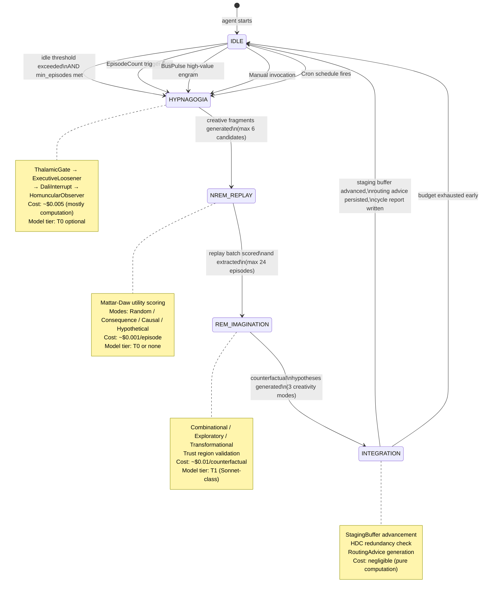
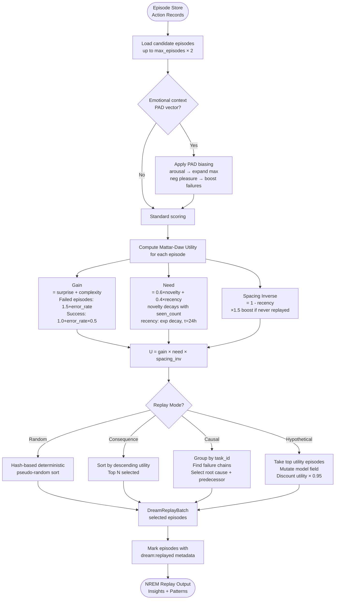
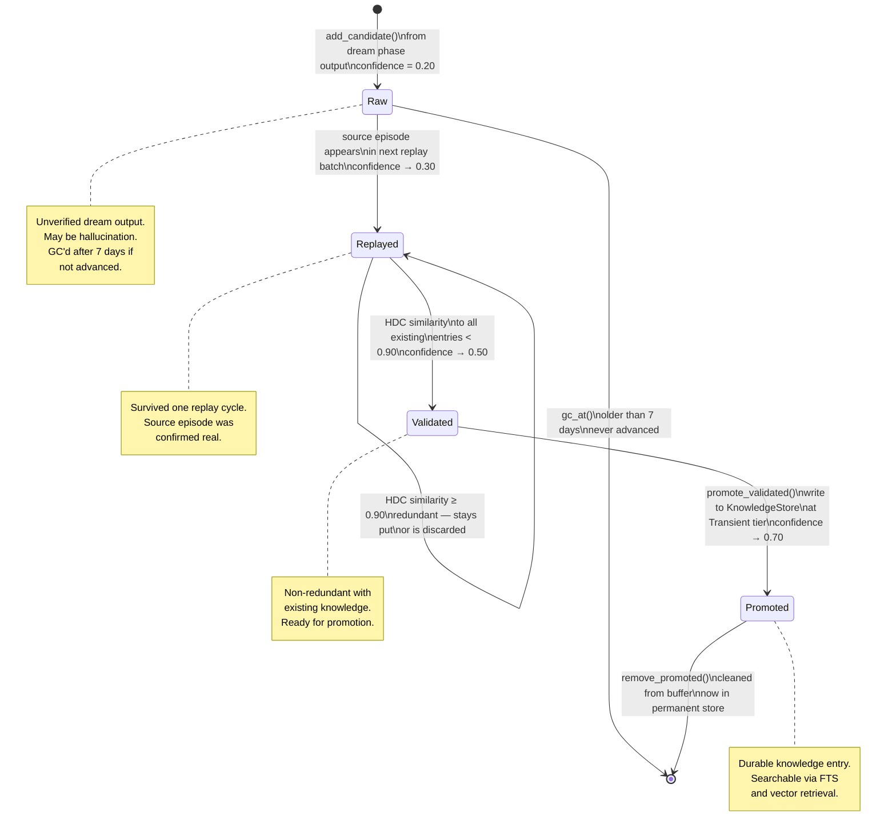
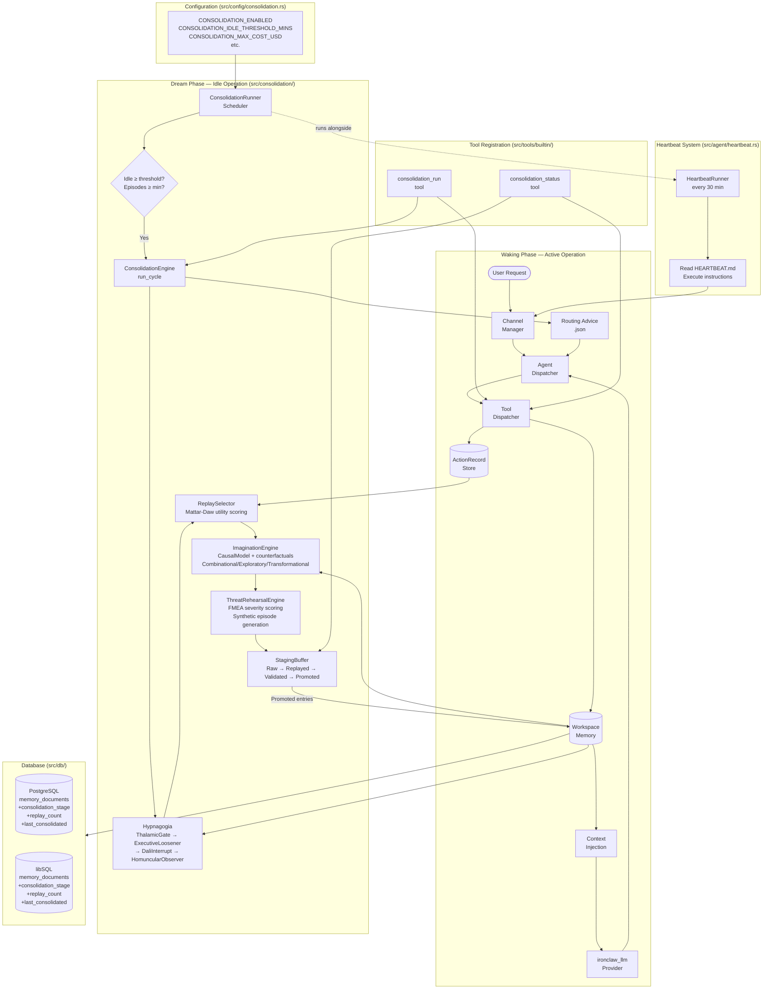

# Dream Consolidation: Biologically-Inspired Offline Learning for AI Agents

**Source reference**: `roko-dreams` crate — see [wpank/roko on GitHub](https://github.com/wpank/roko/tree/main/crates/roko-dreams/)
**Priority**: HIGH — natural extension of IronClaw's heartbeat system
**Status**: Architecture study; IronClaw implementation planned but not yet written
**Document version**: Expanded (2026-07-03)

> This document is fully self-contained. It explains dream consolidation from neuroscience fundamentals through to complete Rust implementation code. No external checkout is required to understand the design.

**Cross-references:**
- [README.md](README.md) — data flow diagram showing how dream consolidation connects to all other intelligence subsystems
- [affect-engine.md](affect-engine.md) — the PAD vector used in Section 5.8 (Emotional Biasing) is defined canonically in `affect-engine.md` Section 3. Dream depotentiation of somatic markers is covered in `affect-engine.md` Section 10.6.
- [online-learning.md](online-learning.md) — the `DreamRoutingAdvice` produced in Section 11 of this document is consumed by the CascadeRouter in `online-learning.md` Section 6.
- [../core-concepts/cognitive-architecture.md](../core-concepts/cognitive-architecture.md) — the Gamma/Theta/Delta speed model; dream consolidation runs at Delta speed.

---

## Table of Contents

1. [Introduction: What Is Dream Consolidation?](#1-introduction-what-is-dream-consolidation)
2. [Why This Matters](#2-why-this-matters)
3. [Neuroscience Foundations](#3-neuroscience-foundations)
4. [System Architecture Overview](#4-system-architecture-overview)
   - [4.1 Dream Cycle State Machine](#41-dream-cycle-state-machine)
   - [4.2 Core Types and Public API](#42-core-types-and-public-api)
   - [4.3 Mermaid: Four-Stage Dream Cycle](#43-mermaid-four-stage-dream-cycle)
5. [NREM Replay — Mattar-Daw Utility Scoring](#5-nrem-replay--mattar-daw-utility-scoring)
   - [5.1 The Utility Formula](#51-the-utility-formula)
   - [5.2 Exact Implementation](#52-exact-implementation)
   - [5.3 Gain Computation](#53-gain-computation)
   - [5.4 Need Computation](#54-need-computation)
   - [5.5 Spacing Inverse](#55-spacing-inverse)
   - [5.6 Configuration](#56-configuration)
   - [5.7 Four Replay Modes](#57-four-replay-modes)
   - [5.8 Emotional Biasing (PAD Vector)](#58-emotional-biasing-pad-vector)
   - [5.9 Mermaid: Mattar-Daw Replay Selection Pipeline](#59-mermaid-mattar-daw-replay-selection-pipeline)
6. [REM Imagination — Counterfactual Synthesis](#6-rem-imagination--counterfactual-synthesis)
   - [6.1 Biological Basis](#61-biological-basis)
   - [6.2 Three Creativity Modes](#62-three-creativity-modes)
   - [6.3 Causal Model](#63-causal-model)
   - [6.4 The `imagine` Function](#64-the-imagine-function)
   - [6.5 Trust Region Floors](#65-trust-region-floors)
   - [6.6 Hypothesis Synthesis](#66-hypothesis-synthesis)
7. [Hypnagogic Creativity Pipeline](#7-hypnagogic-creativity-pipeline)
   - [7.1 The Alpha Convergence Problem](#71-the-alpha-convergence-problem)
   - [7.2 The HypnagogiaEngine Struct](#72-the-hypnagogiaengine-struct)
   - [7.3 Layer 1: Thalamic Gate](#73-layer-1-thalamic-gate)
   - [7.4 Layer 2: Executive Loosener](#74-layer-2-executive-loosener)
   - [7.5 Layer 3: Dali Interrupt](#75-layer-3-dali-interrupt)
   - [7.6 Layer 4: Homuncular Observer](#76-layer-4-homuncular-observer)
   - [7.7 Full Pipeline Execution](#77-full-pipeline-execution)
8. [Threat Rehearsal](#8-threat-rehearsal)
   - [8.1 Threat Enumeration (FMEA/FTA)](#81-threat-enumeration-fmeafta)
   - [8.2 Threat Warning Generation](#82-threat-warning-generation)
   - [8.3 Rehearsal Engine](#83-rehearsal-engine)
9. [Staging Buffer — Confidence Lifecycle](#9-staging-buffer--confidence-lifecycle)
   - [9.1 The Confidence Ladder](#91-the-confidence-ladder)
   - [9.2 Staging Entry Structure](#92-staging-entry-structure)
   - [9.3 State Transitions](#93-state-transitions)
   - [9.4 Garbage Collection](#94-garbage-collection)
   - [9.5 Mermaid: Staging Buffer Lifecycle](#95-mermaid-staging-buffer-lifecycle)
10. [Dream Scheduling and Budget](#10-dream-scheduling-and-budget)
    - [10.1 Trigger Types](#101-trigger-types)
    - [10.2 Budget Controls](#102-budget-controls)
    - [10.3 Per-Phase Compute Budget](#103-per-phase-compute-budget)
    - [10.4 Adaptive Scheduling](#104-adaptive-scheduling)
11. [Routing Advice — Dream-to-Wake Knowledge Transfer](#11-routing-advice--dream-to-wake-knowledge-transfer)
12. [IronClaw Integration Architecture](#12-ironclaw-integration-architecture)
    - [12.1 Mermaid: IronClaw Integration Architecture](#121-mermaid-ironclaw-integration-architecture)
    - [12.2 Enhanced Heartbeat System](#122-enhanced-heartbeat-system)
    - [12.3 Memory Quality Improvement](#123-memory-quality-improvement)
    - [12.4 ActionRecord as Episode](#124-actionrecord-as-episode)
    - [12.5 LLM Integration](#125-llm-integration)
    - [12.6 Tool Dispatch Integration](#126-tool-dispatch-integration)
    - [12.7 Database Changes](#127-database-changes)
    - [12.8 Configuration](#128-configuration)
13. [Performance and Resource Characteristics](#13-performance-and-resource-characteristics)
14. [Benchmarking and Measurement](#14-benchmarking-and-measurement)
    - [14.1 Memory Consolidation Effectiveness](#141-memory-consolidation-effectiveness)
    - [14.2 Creative Synthesis Quality](#142-creative-synthesis-quality)
    - [14.3 Cost Analysis: Offline vs Online Processing](#143-cost-analysis-offline-vs-online-processing)
    - [14.4 A/B Testing Methodology](#144-ab-testing-methodology)
15. [Practical Real-World Examples](#15-practical-real-world-examples)
    - [15.1 Overnight Coding Session Consolidation](#151-overnight-coding-session-consolidation)
    - [15.2 Threat Rehearsal for Security-Critical Operations](#152-threat-rehearsal-for-security-critical-operations)
    - [15.3 Creative Problem-Solving via Combinatorial Replay](#153-creative-problem-solving-via-combinatorial-replay)
    - [15.4 Memory Pruning for Long-Running Agents](#154-memory-pruning-for-long-running-agents)
16. [Full Implementation Plan](#16-full-implementation-plan)
    - [16.1 Complete Module Structure](#161-complete-module-structure)
    - [16.2 ConsolidationEngine](#162-consolidationengine)
    - [16.3 ReplaySelector](#163-replayselector)
    - [16.4 ImaginationEngine](#164-imaginationengine)
    - [16.5 StagingBuffer](#165-stagingbuffer)
    - [16.6 Phase Roadmap](#166-phase-roadmap)
17. [Academic References](#17-academic-references)

---

## 1. Introduction: What Is Dream Consolidation?

Dream consolidation is a background offline learning system that runs during idle periods — intervals when the agent has no active user requests to process. It replays, reorganizes, and strengthens the agent's accumulated knowledge, producing durable insights, defensive strategies, and cross-domain connections that improve future waking performance.

### 1.1 The core idea

An AI agent accumulates experience as it works: it calls tools, makes decisions, succeeds sometimes, fails sometimes, and observes patterns it never explicitly reasons about. Dream consolidation takes that raw experience stream and processes it during downtime:

- **Replay (NREM)**: reviewing what happened, scoring which memories deserve rehearsal
- **Counterfactual reasoning (REM)**: imagining what might have happened differently
- **Creative association (Hypnagogia)**: finding surprising connections between unrelated experiences
- **Threat simulation**: rehearsing defenses against likely future failures

The outputs are durable knowledge entries that make the agent smarter, faster, and more robust when it wakes up and handles the next user request.

### 1.2 How this differs from batch retraining

Dream consolidation is not batch retraining. It does not modify model weights, run gradient descent, or require a training pipeline. Instead it operates at the **knowledge layer** — the structured memories and heuristics that augment the agent's context window at inference time.

| Aspect | Batch Retraining | Dream Consolidation |
|--------|-----------------|---------------------|
| What changes | Model weights | Knowledge store entries, routing advice |
| Infrastructure | GPU cluster, training pipeline | Single agent with LLM API access |
| Latency | Hours to days | Minutes |
| Risk | Catastrophic forgetting, distribution shift | Staging buffer prevents knowledge corruption |
| Cost | Thousands of dollars per run | $0.03–0.10 per dream cycle |
| Granularity | Entire model behavior | Individual insights and heuristics |

### 1.3 What the system produces

| Output Type | Description | Destination |
|-------------|-------------|-------------|
| **Insights** | Patterns extracted from episode replay | Knowledge store |
| **Heuristics** | Promoted insights with multiple confirmations; actionable rules | Knowledge store + playbooks |
| **Counterfactual strategies** | Novel approaches from imagining alternative histories | Staging buffer, then knowledge store on validation |
| **Warnings** | Threat scenarios with rehearsed responses | Knowledge store |
| **Confidence updates** | Strengthened or weakened belief in existing knowledge | Knowledge store confidence scores |
| **Routing advice** | Model selection recommendations for task categories | Persisted JSON, loaded at wake time |

In IronClaw's context, this maps to the existing workspace memory system (`src/workspace/`). Episodes are the agent's action records; the knowledge store is the workspace memory with its hybrid FTS + vector search. The heartbeat system (`src/agent/heartbeat.rs`) already provides the idle-time execution scaffold.

---

## 2. Why This Matters

### 2.1 Memory consolidation prevents knowledge decay

Without consolidation, an agent's accumulated knowledge is only as good as its most recent context window. Important patterns from weeks-old interactions fade into the noise of an ever-growing memory store. Dream consolidation actively reviews past experiences, strengthening high-value memories and tagging low-value ones for decay.

Lin et al. (2025) demonstrated this quantitatively: dedicating computation to offline processing during idle periods yields a **5x reduction in test-time compute requirements**. Agents that process experiences during low-activity periods execute fewer expensive inference calls during active work. The compute spent on dreams is an investment in waking performance, not idle-time waste.

### 2.2 Creative problem-solving through novel recombination

The "alpha convergence" problem (Grossman & Stiglitz, 1980) is real for AI agents: when all agents use the same foundation models, they reach the same conclusions and take the same actions. Dream consolidation breaks this convergence by recombining each agent's unique experiential history into novel hypotheses.

Lacaux et al. (2021) showed that the hypnagogic state (sleep onset) tripled creative problem-solving success rates in humans (83% vs 30%). The hypnagogia engine implements this computationally: loosening associative constraints to find unexpected connections between unrelated experiences.

### 2.3 Threat preparation through simulated failure

Revonsuo (2000) proposed that biological dreaming evolved primarily as a threat rehearsal mechanism — dreams over-represent threatening scenarios relative to waking experience. For an AI agent, this means systematically analyzing past failures, constructing plausible threat scenarios, rehearsing recovery paths, and generating synthetic episodes that strengthen defensive responses. An agent that has rehearsed a failure mode recovers faster when it encounters the real thing.

### 2.4 Catastrophic forgetting prevention

WSCL (Luppi et al., 2024) demonstrated that interleaving wake and sleep processing phases produces a **38% reduction in catastrophic forgetting** compared to continuous waking-only learning. Without consolidation, new knowledge overwrites old knowledge — a well-characterized problem in both biological and artificial learning systems. The staging buffer and confidence ladder prevent this by ensuring new dream-generated insights are validated against existing knowledge before promotion.

### 2.5 Cost efficiency

A full dream cycle costs $0.03–0.10 in model inference. If it prevents even one unnecessary task retry (which costs $0.10–0.50 in inference), it pays for itself immediately. Over weeks and months of accumulated experience, the compounding effect of better routing advice, stronger heuristics, and rehearsed threat responses produces substantial savings.

---

## 3. Neuroscience Foundations

The dream consolidation system is grounded in six major lines of neuroscience and computational research. These are not decorative analogies — each directly informs a specific implementation decision.

### 3.1 Complementary Learning Systems (CLS)

McClelland, McNaughton, & O'Reilly (1995) demonstrated that biological brains maintain two learning systems: a fast episodic system (hippocampus) that records individual experiences, and a slow semantic system (neocortex) that gradually extracts general knowledge. Dreams bridge the two — during sleep, episodic memories are replayed and gradually integrated into semantic knowledge. The key insight is that trying to learn everything in one system causes catastrophic interference: new memories overwrite old ones. The two-system architecture solves this by keeping raw episodes separate from consolidated knowledge.

> McClelland, J. L., McNaughton, B. L., & O'Reilly, R. C. (1995). Why there are complementary learning systems in the hippocampus and neocortex: Insights from the successes and failures of connectionist models of learning and memory. *Psychological Review*, 102(3), 419–457. DOI: [10.1037/0033-295X.102.3.419](https://doi.org/10.1037/0033-295X.102.3.419)

**Map to IronClaw**: The episode log (action records from tool dispatch in `src/context/memory.rs`) is the fast system. The workspace memory store (`src/workspace/`) is the slow system. Dream consolidation replays action records and distills them into durable workspace memories.

### 3.2 Mattar-Daw Prioritized Replay

Mattar & Daw (2018) provided the normative theory for which memories should be replayed and when. Not all memories are equally worth replaying — the utility of replaying a specific memory depends on how much the agent's behavior would improve (gain), how relevant the memory is to current policy (need), and how recently it was last replayed (spacing). The formula is:

```
Utility(episode) = Gain(episode) × Need(episode) × (1 / SpacingPenalty(episode))
```

This is the mathematical core of the NREM replay phase. The key insight from the paper: replay is not random recall. Optimal replay prioritizes experiences with high prediction error (surprising outcomes) that are relevant to upcoming decisions (high need) and have not been recently rehearsed (spacing effect).

> Mattar, M. G. & Daw, N. D. (2018). Prioritized memory access explains planning and hippocampal replay. *Nature Neuroscience*, 21(11), 1609–1617. DOI: [10.1038/s41593-018-0232-z](https://doi.org/10.1038/s41593-018-0232-z)

**Map to IronClaw**: The `ReplayUtility` struct (see [Section 5.2](#52-exact-implementation)) implements the exact decomposition: `gain × need × spacing_inv`.

### 3.3 Synaptic Homeostasis Hypothesis (SHY)

Tononi & Cirelli (2003, 2006) proposed that sleep serves a global renormalization function: wakefulness strengthens synapses throughout the brain (learning creates new connections), and sleep downscales synaptic strength back to a sustainable baseline. The function of sleep is to pay the "price of plasticity" — without periodic downscaling, the brain would saturate. The hypothesis predicts that sleep should selectively preserve important connections while pruning unimportant ones.

> Tononi, G. & Cirelli, C. (2006). Sleep function and synaptic homeostasis. *Sleep Medicine Reviews*, 10(1), 49–62. DOI: [10.1016/j.smrv.2005.05.002](https://doi.org/10.1016/j.smrv.2005.05.002)
>
> Tononi, G. & Cirelli, C. (2003). Sleep and synaptic homeostasis: A hypothesis. *Brain Research Bulletin*, 62(2), 143–150. DOI: [10.1016/j.brainresbull.2003.09.004](https://doi.org/10.1016/j.brainresbull.2003.09.004)
>
> Tononi, G. & Cirelli, C. (2014). Sleep and the price of plasticity: From synaptic and cellular homeostasis to memory consolidation and integration. *Neuron*, 81(1), 12–34. DOI: [10.1016/j.neuron.2013.12.025](https://doi.org/10.1016/j.neuron.2013.12.025)

**Map to IronClaw**: The staging buffer implements SHY computationally. Raw dream-generated insights start at low confidence (0.20) and must survive multiple validation cycles to reach promotion (0.70). Entries that fail to promote within 7 days are garbage collected — the computational equivalent of synaptic downscaling.

### 3.4 Hypnagogic Creativity

Lacaux et al. (2021) demonstrated experimentally that subjects in the hypnagogic state (sleep onset, N1 stage) solved 83% of creative problems versus 30% for fully awake subjects. The effect disappeared when subjects entered deeper sleep (N2+). This validates Edison's technique of dozing with a key to capture creative insights at the precise moment of sleep onset. The N1 state is characterized by reduced prefrontal control (loosened executive function) combined with preserved cortical activity, enabling novel associations that waking cognition would inhibit.

> Lacaux, C., Andrillon, T., Bastoul, C., Idir, Y., Fonteix-Galet, A., Arnulf, I., & Oudiette, D. (2021). Sleep onset is a creative sweet spot. *Science Advances*, 7(50), eabj5866. DOI: [10.1126/sciadv.abj5866](https://doi.org/10.1126/sciadv.abj5866)

The MIT Dormio project (Haar Horowitz et al., 2023) confirmed these results with targeted dream incubation, demonstrating a 43% creativity boost via controlled N1 intervention.

> Haar Horowitz, A., Cunningham, T. J., Maes, P., & Stickgold, R. (2023). Targeted dream incubation at sleep onset increases post-sleep creativity. *Scientific Reports*, 13, 7319. DOI: [10.1038/s41598-023-31361-w](https://doi.org/10.1038/s41598-023-31361-w)

**Map to IronClaw**: The `HypnagogiaEngine` (see [Section 7](#7-hypnagogic-creativity-pipeline)) implements the four-layer pipeline: thalamic gate (signal filtering), executive loosener (constraint relaxation), Dali interrupt (random creative breaks), and homuncular observer (quality filtering).

### 3.5 Threat Simulation Theory

Revonsuo (2000) proposed that biological dreaming evolved primarily as a threat rehearsal mechanism. Threat-related dream content is over-represented relative to waking experience, and the simulation function is most active following threatening waking experiences. The theory predicts that dreams should preferentially rehearse threatening scenarios to prepare defensive responses.

> Revonsuo, A. (2000). The reinterpretation of dreams: An evolutionary hypothesis of the function of dreaming. *Behavioral and Brain Sciences*, 23(6), 877–901. DOI: [10.1017/S0140525X00003976](https://doi.org/10.1017/S0140525X00003976)

**Map to IronClaw**: The `enumerate_threats` function clusters failed episodes by failure pattern, scores severity using FMEA methodology, and generates warning entries. The `rehearse_threats` function simulates recovery paths and produces synthetic episodes for iterative learning.

### 3.6 Sleep-Time Compute

Lin et al. (2025) introduced the concept of "sleep-time compute" — dedicating computation to offline processing during idle periods. Using a dual-agent architecture (a Sleeper Agent that precomputes during downtime and a Serve Agent that handles live interactions), they demonstrated approximately 5x test-time compute reduction with up to 18% accuracy gains on modified reasoning tasks.

> Lin, K., Snell, C., Wang, Y., Packer, C., Wooders, S., Stoica, I., & Gonzalez, J. E. (2025). Sleep-time compute: Beyond inference scaling at test-time. *arXiv preprint* arXiv:2504.13171. [https://arxiv.org/abs/2504.13171](https://arxiv.org/abs/2504.13171)

The WSCL framework (Luppi et al., 2024) demonstrated a complementary result: interleaving wake and sleep processing phases, modeled on the CLS theory, produces significant reductions in catastrophic forgetting and positive forward transfer.

> Luppi, A. I., Gurnee, W., Vilas, M. G., et al. (2024). Wake-sleep consolidated learning. *arXiv preprint* arXiv:2401.08623. [https://arxiv.org/abs/2401.08623](https://arxiv.org/abs/2401.08623)

---

## 4. System Architecture Overview

The reference implementation lives in the roko-dreams crate. The top-level module structure is at [wpank/roko/tree/main/crates/roko-dreams/src/](https://github.com/wpank/roko/tree/main/crates/roko-dreams/src/):

```
crates/roko-dreams/src/
    lib.rs              # Crate root, public re-exports, subsystem facades
    cycle.rs            # Full cycle orchestration: cluster, distill, report
    runner.rs           # DreamRunner/DreamEngine: scheduling, budget, heartbeat
    replay.rs           # NREM replay: Mattar-Daw scoring, episode selection
    imagination.rs      # REM imagination: counterfactual generation
    hypnagogia.rs       # Hypnagogic creativity: 4-layer pipeline
    threat.rs           # Threat scenario enumeration (FMEA/FTA)
    rehearsal.rs        # Threat rehearsal: simulate recovery paths
    staging.rs          # Confidence staging buffer for knowledge promotion
    routing_advice.rs   # Dream-to-wake routing recommendations
    phase2/             # Advanced features (partially shipped)
        mod.rs          # Re-exports for advanced dream concepts
        sleep_time.rs   # Per-phase budget allocation (DREAM-12)
        advanced.rs     # Dream journal, nightmare containment, lucid monitoring
        imagination.rs  # Causal graphs, backtracking counterfactuals
        hypnagogia.rs   # Targeted dream incubation, novelty filters
        threat.rs       # Advanced red-teaming, fault trees
        evolution.rs    # MAP-Elites archive for strategy evolution
```

### 4.1 Dream Cycle State Machine

The dream cycle progresses through a deterministic state machine:

```
IDLE -> HYPNAGOGIA -> NREM_REPLAY -> REM_IMAGINATION -> INTEGRATION -> IDLE
```

Each phase runs to completion before the next begins. Between full cycles, brief idle gaps can trigger micro-consolidation — a single high-priority replay without the full cycle overhead.

### 4.2 Core Types and Public API

The crate's public API is defined through re-exports in [lib.rs](https://github.com/wpank/roko/blob/main/crates/roko-dreams/src/lib.rs):

```rust
// Source: https://github.com/wpank/roko/blob/main/crates/roko-dreams/src/lib.rs lines 57-84

pub use cycle::{
    AgentDispatcher, DreamCycle, DreamCycleReport, PhaseBudgetSummary, StagingBufferStats,
};
pub use hypnagogia::{
    DaliInterrupt, ExecutiveLoosener, HomuncularObserver, HypnagogiaEngine, ThalamicGate,
};
pub use imagination::{
    CausalModel, CounterfactualQuery, ImaginationMode, ImaginationOutcome,
    counterfactual_episode, imagine, synthesize_hypotheses,
};
pub use rehearsal::{RehearsalOutcome, RehearsalReport, rehearse_threats};
pub use replay::{
    DreamReplayBatch, DreamReplayMode, DreamReplayPolicy, MattarDawConfig,
    ReplayUtility, compute_replay_utility, select_replay_episodes,
    select_replay_episodes_with_affect,
};
pub use runner::{
    BusPulseTriggerConfig, DreamAgentConfig, DreamBudget, DreamConfig,
    DreamEngine, DreamHeartbeatPolicy, DreamHeartbeatReport, DreamLoopConfig,
    DreamReport, DreamRunner, DreamRuntimeControls, DreamSchedulePolicy,
    DreamTrigger, Episode, Insight, IntensiveMode,
    PlanCompletionTriggerPolicy, build_dream_review_dispatcher,
};
pub use staging::{ConfidenceStage, StagingBuffer, StagingEntry};
pub use threat::{ThreatScenario, enumerate_threats, threat_warning_entries};
```

The `DreamCycle` struct owns the core consolidation loop:

```rust
// Source: https://github.com/wpank/roko/blob/main/crates/roko-dreams/src/cycle.rs lines 391-405

pub struct DreamCycle {
    episode_store: Arc<EpisodeLogger>,
    knowledge_store: Arc<KnowledgeStore>,
    playbook_store: Arc<PlaybookStore>,
    dispatcher: Arc<dyn AgentDispatcher>,
    last_dream_at: Option<DateTime<Utc>>,
    threat_simulation: bool,
    threat_severity_floor: f64,
    staging_buffer: StagingBuffer,
    staging_path: Option<PathBuf>,
    phase_tracker: Option<DreamBudgetTracker>,
}
```

### 4.3 Mermaid: Four-Stage Dream Cycle



---

## 5. NREM Replay — Mattar-Daw Utility Scoring

NREM replay is the first and cheapest phase of every dream cycle. It selects episodes from the agent's history using a mathematically-principled utility formula, replays them with controlled mutations, and extracts cross-episode patterns.

### 5.1 The Utility Formula

The core scoring algorithm implements the Mattar-Daw (2018) normative theory of prioritized memory access:

```
Utility(episode) = Gain × Need × (1 / spacing_penalty)
```

Where:
- **Gain** measures prediction error — how surprising was the outcome? Episodes where the agent failed (high prediction error) have high gain. Episodes that succeeded cleanly have low gain (less to learn).
- **Need** measures policy relevance — how often does the agent encounter situations like this? Combines novelty (is this a new pattern?) with recency (is this recent enough to matter?).
- **Spacing inverse** implements spaced repetition — episodes not recently replayed get higher scores to prevent over-rehearsal of the same memory.

The original Mattar-Daw paper derives this formula from normative decision theory: the optimal replay policy selects the memory whose replay would most improve future decisions. Gain corresponds to the prediction error signal that drives learning. Need corresponds to the state-occupancy measure (how likely the agent is to encounter similar situations). Spacing implements the well-established spacing effect from memory research (Cepeda et al., 2006).

### 5.2 Exact Implementation

The `ReplayUtility` struct ([replay.rs](https://github.com/wpank/roko/blob/main/crates/roko-dreams/src/replay.rs)) decomposes the score into its three factors:

```rust
// Source: https://github.com/wpank/roko/blob/main/crates/roko-dreams/src/replay.rs lines 41-54

/// Mattar-Daw utility score for replay candidate prioritization.
///
/// `U(episode) = gain * need * (1/spacing)` -- replay episodes with high
/// expected learning value AND high policy relevance.
///
/// Reference: Mattar & Daw (2018) *Nature Neuroscience*.
#[derive(Debug, Clone, Copy, PartialEq, Serialize, Deserialize)]
pub struct ReplayUtility {
    /// Expected improvement from replaying this episode.
    pub gain: f64,
    /// How policy-relevant this episode is.
    pub need: f64,
    /// Inverse of time since last replay (spaced-repetition term).
    pub spacing_inv: f64,
    /// Final utility: `gain * need * spacing_inv`.
    pub utility: f64,
}
```

The `compute` method assembles the three factors:

```rust
// Source: https://github.com/wpank/roko/blob/main/crates/roko-dreams/src/replay.rs lines 57-75

impl ReplayUtility {
    pub fn compute(
        episode: &Episode,
        novelty: f64,
        recency: f64,
        config: &MattarDawConfig,
    ) -> Self {
        let gain = Self::compute_gain(episode) * config.gain_weight;
        let need = Self::compute_need(novelty, recency) * config.need_weight;
        let spacing_inv = Self::compute_spacing_inv(episode, recency);
        let utility = gain * need * spacing_inv;
        Self { gain, need, spacing_inv, utility }
    }
}
```

### 5.3 Gain Computation

Gain is derived from prediction error. Failed episodes have higher gain because they contain more to learn. Complexity (measured by token usage) adds a secondary signal:

```rust
// Source: https://github.com/wpank/roko/blob/main/crates/roko-dreams/src/replay.rs lines 79-94

fn compute_gain(episode: &Episode) -> f64 {
    let gate_total = episode.gate_verdicts.len().max(1) as f64;
    let fail_count = episode.gate_verdicts.iter()
        .filter(|v| !v.passed).count() as f64;
    // Prediction error: how surprising was the outcome?
    let error_rate = fail_count / gate_total;
    let surprise = if episode.success {
        // Successful but with some failures -- moderately surprising
        1.0 + error_rate * 0.5
    } else {
        // Failed -- high prediction error
        1.5 + error_rate
    };
    // Token usage as a secondary signal (complex tasks have more to learn)
    let complexity = (episode.tokens_used.max(1) as f64)
        .log10().clamp(0.0, 3.0) * 0.1;
    surprise + complexity
}
```

**Worked example**: Consider an episode that failed with 3 gate verdicts (2 failed), using 5,000 tokens:
- `error_rate = 2/3 = 0.667`
- `surprise = 1.5 + 0.667 = 2.167` (failed episode, high prediction error)
- `complexity = log10(5000) × 0.1 = 3.699 × 0.1 = 0.370`
- `gain = 2.167 + 0.370 = 2.537`

Compare with a successful episode, all 3 gates passing, same token count:
- `error_rate = 0/3 = 0.0`
- `surprise = 1.0 + 0.0 = 1.0` (clean success, low prediction error)
- `complexity = 0.370` (same)
- `gain = 1.0 + 0.370 = 1.370`

The failed episode has ~1.85x higher gain — it is replayed more often because there is more to learn from it.

### 5.4 Need Computation

Need combines novelty (how new is this pattern?) with recency (is it still relevant to current policy?):

```rust
// Source: https://github.com/wpank/roko/blob/main/crates/roko-dreams/src/replay.rs lines 99-106

fn compute_need(novelty: f64, recency: f64) -> f64 {
    let novelty_term = novelty.clamp(0.0, 1.0);
    let recency_term = recency.clamp(0.0, 1.0);
    // Weighted combination: novelty matters more than raw recency
    0.6 * novelty_term + 0.4 * recency_term
}
```

Novelty is computed from how many prior episodes share the same signature hash (task_id + model + trigger_kind + success + failure_reason + gate verdicts). The score decays as `1.0 / (1.0 + seen_count / novelty_window)` where the default `novelty_window` is 12 episodes.

### 5.5 Spacing Inverse

Spacing implements the spaced repetition effect from Cepeda et al. (2006):

```rust
// Source: https://github.com/wpank/roko/blob/main/crates/roko-dreams/src/replay.rs lines 111-119

fn compute_spacing_inv(episode: &Episode, recency: f64) -> f64 {
    let base_spacing = 1.0 - recency.clamp(0.0, 0.99);
    // Boost for episodes that were never replayed (no dream marker)
    let never_replayed = !episode.extra.contains_key("dream:replayed");
    let boost = if never_replayed { 1.5 } else { 1.0 };
    (base_spacing * boost).max(0.01)
}
```

Episodes that have never been replayed (no `dream:replayed` marker in their extra metadata) get a 1.5x boost. Recency uses an exponential decay with configurable half-life (default: 24 hours):

```rust
// Source: https://github.com/wpank/roko/blob/main/crates/roko-dreams/src/replay.rs lines 444-448

fn recency_decay(timestamp: DateTime<Utc>, now: DateTime<Utc>,
                 half_life_hours: f64) -> f64 {
    let age_hours = (now - timestamp).num_seconds().max(0) as f64 / 3600.0;
    let half_life = half_life_hours.max(0.1);
    (-age_hours / half_life).exp()
}
```

Note: this is a pure exponential decay `e^(-t/tau)`, not a proper half-life formula which would be `2^(-t/t_half)`. The parameter is named `half_life_hours` but functions as a time constant (1/e decay time). The decay rate is `1/e ≈ 0.368` at `t = half_life_hours`, not `0.5`. This naming imprecision does not affect algorithmic behavior — the relative ranking of episodes is preserved under any monotonic decay function.

### 5.6 Configuration

All Mattar-Daw parameters are configurable:

```rust
// Source: https://github.com/wpank/roko/blob/main/crates/roko-dreams/src/replay.rs lines 123-177

#[derive(Debug, Clone, PartialEq, Serialize, Deserialize)]
pub struct MattarDawConfig {
    /// Weight applied to the gain term (default 1.0).
    pub gain_weight: f64,
    /// Weight applied to the need term (default 1.0).
    pub need_weight: f64,
}

#[derive(Debug, Clone, PartialEq, Serialize, Deserialize)]
pub struct DreamReplayPolicy {
    pub mode: DreamReplayMode,                    // default: Random
    pub max_episodes: usize,                      // default: 24
    pub novelty_window: usize,                    // default: 12
    pub recency_half_life_hours: f64,             // default: 24.0
    pub mattar_daw: MattarDawConfig,
}
```

### 5.7 Four Replay Modes

```rust
// Source: https://github.com/wpank/roko/blob/main/crates/roko-dreams/src/replay.rs lines 16-27

pub enum DreamReplayMode {
    /// Sample episodes using deterministic pseudo-random ordering.
    Random,
    /// Prioritize episodes with largest outcome signal.
    Consequence,
    /// Follow earliest failure chains back toward likely root causes.
    Causal,
    /// Replay counterfactual variants of the strongest episodes.
    Hypothetical,
}
```

**Random**: Deterministic pseudo-random ordering via hash-based ranking. Ensures coverage of the full episode space. Ordering is deterministic for the same input, making tests reproducible.

**Consequence**: Selects episodes by descending Mattar-Daw utility score. Episodes with the highest prediction error and policy relevance are replayed first.

**Causal**: Groups episodes by task chain (using `task_id`), identifies failure chains, and selects the earliest failure in each chain plus its immediate predecessor. If no failures exist, falls back to Consequence mode. This implements backward causal tracing — finding root causes rather than symptoms.

**Hypothetical**: Selects the highest-utility episodes and creates counterfactual variants — mutating the model field (e.g., haiku -> sonnet), flipping the trigger_kind to `dream:hypothetical`, marking them with `dream:hypothetical` metadata. The utility is discounted by 5% (multiplied by 0.95) to reflect the speculative nature.

### 5.8 Emotional Biasing (PAD Vector)

The `select_replay_episodes_with_affect` function accepts an optional PAD (Pleasure-Arousal-Dominance) vector from the daimon affect engine. When present:

- **Negative pleasure** (valence < 0) biases toward failure episodes: failure utility is multiplied by `1.0 + 0.5 × (-pleasure)`, giving failures up to 1.5x higher utility when the agent is in a negative emotional state.
- **High arousal** (arousal > 0) increases the effective max_episodes by up to 50%: `effective_max = max_episodes × (1.0 + 0.5 × arousal)`.

```rust
// Source: https://github.com/wpank/roko/blob/main/crates/roko-dreams/src/replay.rs lines 241-291

pub fn select_replay_episodes_with_affect(
    episodes: &[Episode],
    policy: &DreamReplayPolicy,
    now: DateTime<Utc>,
    emotional_context: Option<&PadVector>,
) -> DreamReplayBatch {
    let Some(pad) = emotional_context else {
        return select_replay_episodes(episodes, policy, now);
    };
    // Arousal-based intensity: up to 50% more episodes
    let arousal_factor = 1.0 + 0.5 * pad.arousal.max(0.0);
    let effective_max = ((policy.max_episodes as f64) * arousal_factor)
        .round() as usize;
    // Negative pleasure biases toward failure episodes
    let failure_bias = 1.0 + 0.5 * (-pad.pleasure).max(0.0);
    for candidate in &mut candidates {
        if !candidate.episode.success {
            candidate.utility *= failure_bias;
        }
    }
    // ... rank and select ...
}
```

### 5.9 Mermaid: Mattar-Daw Replay Selection Pipeline



---

## 6. REM Imagination — Counterfactual Synthesis

REM imagination is the second phase of the dream cycle. Where NREM replay strengthens and tests existing memories, REM imagination generates genuinely novel hypotheses by recombining elements from different episodes and simulating counterfactual histories.

### 6.1 Biological Basis

During REM sleep, the prefrontal cortex (executive control) is suppressed while associative cortex remains active, enabling novel combinations that waking cognition would inhibit. Walker & van der Helm (2009) showed that REM specifically depotentiates the emotional charge of memories — "overnight therapy." This emotional processing is relevant to the affect-biased replay described in Section 5.8.

> Walker, M. P. & van der Helm, E. (2009). Overnight therapy? The role of sleep in emotional brain processing. *Psychological Bulletin*, 135(5), 731–748. DOI: [10.1037/a0016570](https://doi.org/10.1037/a0016570)

### 6.2 Three Creativity Modes

Following Boden's (2004) taxonomy of creativity, which distinguishes three fundamental types of creative cognition:

```rust
// Source: https://github.com/wpank/roko/blob/main/crates/roko-dreams/src/imagination.rs lines 28-36

pub enum ImaginationMode {
    /// Merge patterns from two episodes.
    Combinational,
    /// Extend a known pattern into a nearby domain.
    Exploratory,
    /// Invert an assumption from a successful pattern.
    Transformational,
}
```

> Boden, M. A. (2004). *The Creative Mind: Myths and Mechanisms*. 2nd ed. Routledge.

| Mode | Operation | Example |
|------|-----------|---------|
| **Combinational** | Combine elements from unrelated successful episodes | "Episodes A and B share structural patterns — reuse the routing discipline from one in the other" |
| **Exploratory** | Push a known pattern into an adjacent domain | "Extend the successful approach from task X into a neighboring task shape" |
| **Transformational** | Invert a core assumption | "What if the model had been sonnet instead of haiku? What would have changed?" |

### 6.3 Causal Model

The imagination system builds a lightweight causal summary from observed episodes:

```rust
// Source: https://github.com/wpank/roko/blob/main/crates/roko-dreams/src/imagination.rs lines 46-99

pub struct CausalModel {
    /// Episodes indexed by id.
    pub episodes_by_id: BTreeMap<String, Episode>,
    /// Observed values per variable.
    pub variables: BTreeMap<String, BTreeMap<String, usize>>,
}

impl CausalModel {
    pub fn from_episodes(episodes: &[Episode]) -> Self {
        let mut episodes_by_id = BTreeMap::new();
        let mut variables = BTreeMap::new();
        for episode in episodes {
            episodes_by_id.insert(episode.id.clone(), episode.clone());
            bump_variable(&mut variables, "model", &episode.model);
            bump_variable(&mut variables, "task_id", &episode.task_id);
            bump_variable(&mut variables, "trigger_kind", &episode.trigger_kind);
            bump_variable(&mut variables, "outcome",
                if episode.success { "success" } else { "failure" });
            if let Some(reason) = &episode.failure_reason {
                bump_variable(&mut variables, "failure_reason", reason);
            }
        }
        Self { episodes_by_id, variables }
    }
}
```

This is a simplified structural causal model in the spirit of Pearl (2009), not a full causal graph with do-calculus. It tracks variable co-occurrence (which models appear with which outcomes, which task types co-occur with which failure reasons) and uses these frequencies to assess counterfactual plausibility.

> Pearl, J. (2009). *Causality: Models, Reasoning, and Inference*. 2nd ed. Cambridge University Press.

### 6.4 The `imagine` Function

The core counterfactual evaluation function assesses whether a hypothetical change is plausible within a "trust region" — a boundary that prevents the system from generating implausible counterfactuals:

```rust
// Source: https://github.com/wpank/roko/blob/main/crates/roko-dreams/src/imagination.rs lines 120-174

pub fn imagine(
    query: &CounterfactualQuery,
    model: &CausalModel,
    mode: ImaginationMode,
) -> ImaginationOutcome {
    let Some(base) = model.base_episode(query) else {
        return ImaginationOutcome::unknown_episode(query);
    };
    let (variable, new_value) = (&query.intervention.0, &query.intervention.1);
    let support = model.variable_support(variable, new_value);
    let current_value = current_value_for(base, variable);
    let similarity = hdc_text_similarity(&current_value, new_value);

    // Trust region: minimum similarity needed for plausibility
    let trust_region = trust_region_floor(variable, support);
    let plausible = similarity >= trust_region || support > 0;

    // Projected delta: will this change improve or hurt success?
    let projected_success_delta = projected_delta(
        variable, &current_value, new_value, mode, base.success);

    // Confidence: base 0.35, +0.4 from similarity, +0.1 per support (max 3)
    let confidence = (0.35 + similarity * 0.4
        + support.min(3) as f64 * 0.1).clamp(0.0, 0.98);

    ImaginationOutcome {
        query: query.clone(),
        mode,
        plausible,
        confidence,
        projected_success_delta,
        narrative: build_narrative(base, variable, &current_value, new_value,
                                   plausible, projected_success_delta),
    }
}
```

### 6.5 Trust Region Floors

Different variables have different trust floors based on how much semantic distance is acceptable for a counterfactual to be plausible. Each observation of the replacement value in real data reduces the trust floor by 0.05 (up to 4 observations, max 0.20 reduction), making well-observed alternatives easier to accept as plausible:

| Variable | Base Trust Floor | Rationale |
|----------|-----------------|-----------|
| `model` | 0.32 | Model swaps are fairly constrained |
| `task_id` | 0.28 | Tasks can be more loosely related |
| `trigger_kind` | 0.24 | Triggers are broad categories |
| `failure_reason` | 0.20 | Failure reasons can vary widely |
| Other | 0.30 | Default |

### 6.6 Hypothesis Synthesis

The `synthesize_hypotheses` function generates hypothetical knowledge entries from a batch of episodes. It runs all three creativity modes:

1. **Combinational**: Finds two successful episodes from different tasks and suggests reusing the routing discipline from one in the other.
2. **Exploratory**: Takes the most complex successful episode and suggests extending it into a neighboring task shape.
3. **Transformational**: Takes the episode with the strongest failure signal and asks "what if a different model had been used?"

All generated hypotheses enter the knowledge store at `Working` tier with confidence 0.78 and tagged with `["dream", "rem", "counterfactual", <mode>]`.

---

## 7. Hypnagogic Creativity Pipeline

The hypnagogia engine implements a four-layer creative onset system inspired by the transitional state between waking and sleep. It runs before the structured NREM/REM phases to produce genuinely novel associations.

### 7.1 The Alpha Convergence Problem

When all AI agents use the same foundation models, they reach the same conclusions and take the same actions. The "alpha convergence" problem, citing Grossman-Stiglitz (1980): if information acquisition is costless because the model is the same, all agents acquire the same information and it becomes worthless.

The hypnagogia engine breaks this convergence by injecting agent-specific experiential noise into the creative process. Each agent has different experiences, different accumulated knowledge, and different failure histories. The engine uses these unique experiential traces as raw material for creative recombination.

### 7.2 The HypnagogiaEngine Struct

```rust
// Source: https://github.com/wpank/roko/blob/main/crates/roko-dreams/src/hypnagogia.rs lines 88-98

pub struct HypnagogiaEngine {
    /// Thalamic gate settings.
    pub gate: ThalamicGate,
    /// Executive loosener settings.
    pub loosener: ExecutiveLoosener,
    /// Dali-style interrupt settings.
    pub interrupt: DaliInterrupt,
    /// Homuncular observer settings.
    pub observer: HomuncularObserver,
}
```

### 7.3 Layer 1: Thalamic Gate

**Biological basis**: Magnin et al. (2010, *PNAS*) showed thalamic deactivation precedes cortical deactivation by 8.6 minutes at sleep onset. The thalamus acts as a gate — when it deactivates, sensory input is suppressed but cortical processing continues, enabling internally generated imagery.

> Magnin, M., Rey, M., Bastuji, H., Guillemant, P., Mauguière, F., & Garcia-Larrea, L. (2010). Thalamic deactivation at sleep onset precedes that of the cerebral cortex in humans. *Proceedings of the National Academy of Sciences*, 107(8), 3829–3833. DOI: [10.1073/pnas.0909710107](https://doi.org/10.1073/pnas.0909710107)

The Thalamic Gate filters incoming knowledge signals. High-confidence signals pass through directly; low-confidence signals pass only if their "resonance score" (derived from an HDC text fingerprint) exceeds a noise floor:

```rust
// Source: https://github.com/wpank/roko/blob/main/crates/roko-dreams/src/hypnagogia.rs lines 16-22

pub struct ThalamicGate {
    /// Minimum confidence retained by the gate before stochastic resonance.
    pub relevance_floor: f64,      // default: 0.45
    /// Fraction of low-confidence signals allowed through as noise.
    pub noise_floor: f64,          // default: 0.20
}
```

The filtering logic:

```rust
// Source: https://github.com/wpank/roko/blob/main/crates/roko-dreams/src/hypnagogia.rs lines 168-177

fn thalamic_gate(&self, signals: &[KnowledgeEntry]) -> Vec<KnowledgeEntry> {
    signals
        .iter()
        .filter(|signal| {
            signal.confidence >= self.gate.relevance_floor
                || resonance_score(&signal.content) >= self.gate.noise_floor
        })
        .cloned()
        .collect()
}
```

The resonance score uses HDC (Hyperdimensional Computing) text fingerprinting to produce a pseudo-random but deterministic score from the signal's content text. This deliberately introduces stochastic resonance — some low-confidence signals "leak" through the gate, providing the raw material for creative associations.

### 7.4 Layer 2: Executive Loosener

**Biological basis**: During hypnagogia, the prefrontal cortex reduces its influence on cortical processing, allowing "strange associations."

The Executive Loosener takes the gated signals and looks for neighborhood associations — signals within a configurable window that share at least one tag:

```rust
// Source: https://github.com/wpank/roko/blob/main/crates/roko-dreams/src/hypnagogia.rs lines 34-40

pub struct ExecutiveLoosener {
    /// Maximum neighborhood size to consider.
    pub neighborhood: usize,       // default: 4
    /// How aggressively the search should widen.
    pub looseness: f64,            // default: 0.35
}
```

When a neighborhood association is found, the loosener creates a new knowledge entry labeled "Sleep-onset association" that merges the content and source episodes of both signals. The confidence is the average of both signals' confidence, scaled by `(0.5 + looseness)`.

### 7.5 Layer 3: Dali Interrupt

**Biological basis**: Named after Salvador Dali's technique of holding a key over a metal plate while dozing. The key falling and striking the plate would wake him at the precise moment of hypnagogic onset, capturing creative imagery.

The Dali Interrupt iterates over episodes with a configurable stride, selecting episodes whose resonance score exceeds an intensity threshold:

```rust
// Source: https://github.com/wpank/roko/blob/main/crates/roko-dreams/src/hypnagogia.rs lines 52-58

pub struct DaliInterrupt {
    /// How many signals to skip between injected interruptions.
    pub stride: usize,            // default: 3
    /// Weight that decides whether an interrupt is emitted.
    pub intensity: f64,           // default: 0.55
}
```

Selected episodes produce "Dali insight" entries with confidence 0.70, tagged with `["dream", "hypnagogia", "dali-interrupt", "creative-break"]`.

### 7.6 Layer 4: Homuncular Observer

**Biological basis**: From Ryle (1949), Dennett (1991), and Lycan (1996). In biological hypnagogia, a meta-cognitive awareness persists even as executive control loosens — the dreamer can sometimes notice creative associations as they form.

The observer takes all candidates from Layers 2 and 3, scores them, deduplicates, and retains only the top candidates:

```rust
// Source: https://github.com/wpank/roko/blob/main/crates/roko-dreams/src/hypnagogia.rs lines 70-76

pub struct HomuncularObserver {
    /// Minimum score required for a candidate to survive.
    pub retention_floor: f64,      // default: 0.40
    /// Maximum number of candidate insights to keep.
    pub max_candidates: usize,     // default: 6
}
```

Each candidate is scored as: `confidence + novelty_score(content) + min(4, source_episodes.len()) × 0.04`. Candidates below the retention floor (0.40) are discarded; duplicates (by ID) are removed; and at most 6 survive.

### 7.7 Full Pipeline Execution

The complete pipeline is invoked via `HypnagogiaEngine::run`:

```rust
// Source: https://github.com/wpank/roko/blob/main/crates/roko-dreams/src/hypnagogia.rs lines 150-160

pub fn run(&self, signals: &[KnowledgeEntry], episodes: &[Episode],
           created_at: DateTime<Utc>) -> Vec<KnowledgeEntry> {
    let gated = self.thalamic_gate(signals);
    let loosened = self.executive_loosen(gated, episodes, created_at);
    let interrupted = self.dali_interrupt(episodes, created_at);
    self.homuncular_observer(
        loosened.into_iter().chain(interrupted).collect())
}
```

Data flow:

```
signals (KnowledgeEntry[])  -->  [Thalamic Gate]  -->  gated signals
                                     |
episodes (Episode[])  -------->  [Executive Loosener]  -->  loosened associations
                     \            (+ interrupt-to-insight)
                      \-------->  [Dali Interrupt]  -------->  dali insights
                                                        |
                                  [Homuncular Observer]  <--  (merged)
                                         |
                                  max 6 candidates out
```

---

## 8. Threat Rehearsal

Threat rehearsal implements Revonsuo's (2000) Threat Simulation Theory. It uses observed failure patterns to construct threat scenarios, rehearse recovery paths, and generate synthetic episodes for future learning.

### 8.1 Threat Enumeration (FMEA/FTA)

The `enumerate_threats` function ([threat.rs](https://github.com/wpank/roko/blob/main/crates/roko-dreams/src/threat.rs)) clusters failed episodes by a composite key of `task_id + model + failure_reason`, then scores each cluster:

```rust
// Source: https://github.com/wpank/roko/blob/main/crates/roko-dreams/src/threat.rs lines 15-37

pub struct ThreatScenario {
    pub id: String,
    pub description: String,
    /// Estimated likelihood, normalized to 0.0..=1.0
    pub likelihood: f64,
    /// Estimated impact, normalized to 0.0..=1.0
    pub impact: f64,
    /// How hard it is to detect before damage
    pub detection_difficulty: f64,
    /// Recommended mitigation
    pub mitigation: String,
}

impl ThreatScenario {
    pub fn severity(&self) -> f64 {
        (self.likelihood * self.impact
         * (1.0 - self.detection_difficulty)).clamp(0.0, 1.0)
    }
}
```

**Note on the severity formula**: The formula `likelihood × impact × (1 - detection_difficulty)` means that high detection difficulty *reduces* computed severity. This inverts standard FMEA convention, where high detection difficulty (hard to detect) *increases* the Risk Priority Number (RPN). The roko implementation prioritizes *actionable* threats — those that are both likely and detectable, because detection enables mitigation. For IronClaw adaptation, this is a reasonable choice: the agent should focus on threats it can actually prepare defenses for.

### 8.2 Threat Warning Generation

Threats above a configurable severity floor (default: 0.20) are converted into `KnowledgeEntry` values of kind `Warning`, tagged with `["dream", "threat", "warning", "fmea", "fta"]`:

```rust
// Source: https://github.com/wpank/roko/blob/main/crates/roko-dreams/src/threat.rs lines 94-157

pub fn threat_warning_entries_with_floor(
    episodes: &[Episode], created_at: DateTime<Utc>, severity_floor: f64,
) -> Vec<KnowledgeEntry> {
    let threats = enumerate_threats(episodes);
    threats.into_iter()
        .filter(|threat| threat.severity() >= severity_floor)
        .map(|threat| KnowledgeEntry {
            id: format!("threat-{}", threat.id),
            kind: KnowledgeKind::Warning,
            content: format!(
                "[THREAT] {} Mitigation: {}",
                threat.description, threat.mitigation
            ),
            confidence: threat.severity().clamp(0.20, 0.90),
            tags: vec![
                "dream".into(), "threat".into(),
                "warning".into(), "fmea".into(), "fta".into(),
            ],
            created_at,
            source_episodes: vec![],
            emotional_provenance: None,
        })
        .collect()
}
```

Each warning entry includes the threat description and recommended mitigation, along with emotional provenance transferred from the most intense source episode. This ensures the emotional retrieval boost is active for affect-congruent knowledge surfacing during future waking operations.

### 8.3 Rehearsal Engine

The `rehearse_threats` function ([rehearsal.rs](https://github.com/wpank/roko/blob/main/crates/roko-dreams/src/rehearsal.rs)) simulates recovery for the top-severity threats (bounded by `MAX_REHEARSALS_PER_CYCLE` = 20):

```rust
// Source: https://github.com/wpank/roko/blob/main/crates/roko-dreams/src/rehearsal.rs lines 59-87

pub fn rehearse_threats(
    episodes: &[Episode],
    max_scenarios: Option<usize>,
    now: DateTime<Utc>,
) -> RehearsalReport {
    let threats = enumerate_threats(episodes);
    let limit = max_scenarios.unwrap_or(MAX_REHEARSALS_PER_CYCLE); // 20

    let mut outcomes = Vec::new();
    let mut generated_episodes = Vec::new();

    for threat in threats.iter().take(limit) {
        let outcome = rehearse_single(threat, now);
        let episode = outcome_to_episode(&outcome, threat);
        generated_episodes.push(episode);
        outcomes.push(outcome);
    }

    RehearsalReport {
        started_at: now,
        completed_at: Utc::now(),
        threats_evaluated: threats.len(),
        rehearsals_performed: outcomes.len(),
        outcomes,
        generated_episodes,
    }
}
```

Each rehearsal determines recovery feasibility heuristically: if the threat has a clear mitigation, the detection difficulty is below 0.7, and the severity is below 0.8, the recovery is considered feasible. Infeasible recoveries produce an "escalate to human review" response.

Rehearsed outcomes are converted into synthetic episodes with:
- `id` prefixed with `rehearsal-`
- `model` set to `dream-rehearsal`
- A `threat-rehearsal` gate verdict recording the confidence and scenario
- These synthetic episodes feed back into future dream cycles for iterative learning

---

## 9. Staging Buffer — Confidence Lifecycle

Dream-generated insights do not go directly into permanent knowledge. They pass through a confidence-gated staging buffer that prevents dream hallucinations from corrupting durable knowledge.

### 9.1 The Confidence Ladder

```
Raw (0.20) --> Replayed (0.30) --> Validated (0.50) --> Promoted (0.70)
```

```rust
// Source: https://github.com/wpank/roko/blob/main/crates/roko-dreams/src/staging.rs lines 33-44

pub enum ConfidenceStage {
    /// Just extracted, unvalidated.
    Raw,
    /// Successfully replayed in a subsequent dream cycle.
    Replayed,
    /// Cross-checked against existing knowledge (no contradiction, not redundant).
    Validated,
    /// Ready for knowledge store promotion.
    Promoted,
}
```

Each stage has a confidence floor:

| Stage | Confidence Floor | Meaning |
|-------|-----------------|---------|
| Raw | 0.20 | Just entered from a dream. Unverified. |
| Replayed | 0.30 | Survived one replay cycle without contradiction. |
| Validated | 0.50 | Cross-referenced against existing knowledge — not redundant, not contradicted. |
| Promoted | 0.70 | Written to permanent knowledge store at `Transient` tier. |

### 9.2 Staging Entry Structure

```rust
// Source: https://github.com/wpank/roko/blob/main/crates/roko-dreams/src/staging.rs lines 71-87

pub struct StagingEntry {
    /// The knowledge entry being staged.
    pub entry: KnowledgeEntry,
    /// Source episode that produced this insight.
    pub source_episode_id: String,
    /// Current position on the confidence ladder.
    pub stage: ConfidenceStage,
    /// Current confidence score (starts at 0.20).
    pub confidence: f64,
    /// When this entry was first added.
    pub created_at: DateTime<Utc>,
    /// When this entry last advanced a stage.
    pub last_advanced_at: DateTime<Utc>,
    /// When this entry was promoted, if ever.
    pub promoted_at: Option<DateTime<Utc>>,
}
```

### 9.3 State Transitions

**Raw -> Replayed**: An entry advances when the source episode appears in a subsequent replay batch. The minimum time between creation and first replay ensures the insight survives at least one dream cycle.

**Replayed -> Validated**: An entry advances if it passes a redundancy check — its HDC vector similarity to all existing knowledge store entries must be below 0.90. If any existing entry is > 0.90 similar, the candidate is considered redundant and does not advance.

**Validated -> Promoted**: All validated entries are promoted to the knowledge store at `Transient` tier with confidence 0.70.

### 9.4 Garbage Collection

Raw entries older than 7 days are garbage collected:

```rust
// Source: https://github.com/wpank/roko/blob/main/crates/roko-dreams/src/staging.rs

pub fn gc_at(&mut self, now: DateTime<Utc>) {
    let horizon = now - Duration::days(GC_HORIZON_DAYS); // 7
    self.entries.retain(|entry| {
        if entry.stage != ConfidenceStage::Raw { return true; }
        entry.created_at > horizon
    });
}
```

Only `Raw` entries are GC'd. Once an entry has advanced to `Replayed` or beyond, it persists regardless of age. This ensures that the staging buffer does not grow unboundedly from dream noise that never gets validated.

### 9.5 Mermaid: Staging Buffer Lifecycle



---

## 10. Dream Scheduling and Budget

### 10.1 Trigger Types

Dreams fire from several triggers:

```rust
// Source: https://github.com/wpank/roko/blob/main/crates/roko-dreams/src/runner.rs lines 255-283

pub enum DreamTrigger {
    /// Idle gap between task dispatches.
    Idle,
    /// Cron-like schedule.
    Scheduled,
    /// Manual command invocation.
    Manual,
    /// Accumulated episode count since last dream.
    EpisodeCount,
    /// Bus-reactive trigger from a high-value engram (DREAM-09).
    BusPulse { engram_hash: String },
    /// Coordination pattern trigger (INT-19).
    CoordinationPattern {
        pattern_name: String,
        contributing_watchers: Vec<String>,
    },
}
```

### 10.2 Budget Controls

Each dream cycle has a three-axis budget:

```rust
// Source: https://github.com/wpank/roko/blob/main/crates/roko-dreams/src/runner.rs lines 191-205

pub struct DreamBudget {
    pub max_tokens: u64,
    pub max_cost_usd: f64,
    pub max_duration_secs: u64,
    pub consumed_tokens: u64,
    pub consumed_cost_usd: f64,
    pub consumed_duration_secs: u64,
}
```

The budget is consumed per-episode during replay. When any axis is exhausted, the cycle stops processing and reports what it completed. The default budget is unlimited (`u64::MAX` / `f64::MAX`).

### 10.3 Per-Phase Compute Budget

The phase2 module introduces per-phase budget allocation:

```rust
// Source: https://github.com/wpank/roko/blob/main/crates/roko-dreams/src/phase2/sleep_time.rs lines 15-32

pub struct DreamComputeBudget {
    /// Total daily inference budget in USD.
    pub inference_daily_usd: f64,         // default: 10.0
    /// Fraction allocated to dreaming.
    pub dream_fraction: f64,              // default: 0.15 (15%)
    /// Per-phase budget fractions.
    pub phase_allocations: PhaseAllocations,
}
```

```rust
// Source: https://github.com/wpank/roko/blob/main/crates/roko-dreams/src/phase2/sleep_time.rs lines 57-80

pub struct PhaseAllocations {
    pub hypnagogia: f64,    // default: 0.10 (10%)
    pub nrem: f64,          // default: 0.30 (30%)
    pub rem: f64,           // default: 0.50 (50%)
    pub integration: f64,   // default: 0.00 (pure computation)
    pub evolution: f64,     // default: 0.10 (10%)
}
```

Each phase maps to a recommended model tier:

| Phase | Budget Share | Model Tier | Rationale |
|-------|-------------|-----------|-----------|
| Hypnagogia | 10% | T0 (Fast/Haiku-class) | Fragment generation is cheap |
| NREM Replay | 30% | T0 (Fast) or none | Pattern matching, not creative reasoning |
| REM Imagination | 50% | T1 (Standard/Sonnet-class) | Creative reasoning needs capable model |
| Integration | 0% | None | Pure computation, no model calls |
| Evolution | 10% | T0 (Fast) | Mutation evaluation |

During dreaming, the agent can enter a reduced-capability state where only urgent signals can wake it:

```rust
// Source: https://github.com/wpank/roko/blob/main/crates/roko-dreams/src/phase2/sleep_time.rs lines 168-178

pub enum SleepwalkerMode {
    /// Normal operation -- full agent capabilities.
    Awake,
    /// Dreaming -- only urgent signals processed.
    Dreaming { urgent_signal_types: Vec<String> },
}
```

Default urgent signals: `process_crash`, `critical_error`, `operator_interrupt`.

### 10.4 Adaptive Scheduling

The `DreamSchedulePolicy` adapts based on dream quality. High-quality dreams (many knowledge entries written, playbooks created) reduce the idle threshold by 25% (`quality_gain = 0.75`), making dreams fire more frequently. Low-quality dreams increase the threshold by 25% (`quality_penalty = 1.25`), backing off:

```rust
// Source: https://github.com/wpank/roko/blob/main/crates/roko-dreams/src/runner.rs lines 378-416

pub struct DreamSchedulePolicy {
    pub enabled: bool,
    pub idle_threshold_mins: u64,          // default: 15
    pub scheduled_cron: Option<String>,
    pub manual_enabled: bool,
    pub quality_gain: f64,                 // default: 0.75
    pub quality_penalty: f64,              // default: 1.25
    pub episode_count_trigger: usize,      // default: 0 (disabled)
}
```

---

## 11. Routing Advice — Dream-to-Wake Knowledge Transfer

Dream consolidation produces routing advice that influences future model selection during waking operation. This is how dreams improve waking performance.

The `DreamRoutingAdvice` struct:

```rust
// Source: https://github.com/wpank/roko/blob/main/crates/roko-dreams/src/routing_advice.rs lines 18-28

pub struct DreamRoutingAdvice {
    pub generated_at: DateTime<Utc>,
    pub source_dream_report: String,
    pub recommendations: Vec<RoutingRecommendation>,
    pub pattern_summaries: Vec<PatternSummary>,
}
```

Each recommendation maps a task_category + complexity_band pair to a preferred model and a list of deprioritized models:

```rust
// Source: https://github.com/wpank/roko/blob/main/crates/roko-dreams/src/routing_advice.rs lines 42-60

pub struct RoutingRecommendation {
    pub task_category: String,
    pub complexity_band: String,
    pub recommended_model: String,
    pub deprioritize: Vec<String>,
    pub confidence: f64,
    pub supporting_episodes: usize,
    pub recommended_model_success_rate: f64,
    pub pattern_signature: u64,
}
```

Recommendations are generated from cross-episode consolidation patterns. A model is recommended when its success rate exceeds 0.80 for a given task shape; a model is deprioritized when its success rate drops below 0.40 (and the next-tier model is recommended instead: haiku -> sonnet, sonnet -> opus).

Human-readable pattern summaries provide actionable guidance:

```rust
// Source: https://github.com/wpank/roko/blob/main/crates/roko-dreams/src/routing_advice.rs lines 63-75

pub struct PatternSummary {
    pub description: String,
    pub applies_to: Vec<String>,
    pub guidance: String,
    pub confidence: f64,
    pub signature: u64,
}
```

Example output:

> "Historical dream consolidation shows claude-sonnet-4-5 has an 85% success rate for this task shape across 12 episodes; this model/task pairing is reliable."

Routing advice is persisted to `.roko/learn/dream-routing-advice.json` and loaded at wake time to bias future model selection via `dream_advice_to_routing_bias`.

> **Cross-reference:** This routing advice is consumed by the CascadeRouter. The CascadeRouter's StaticStage (0–49 observations) is where dream advice has the most influence, because the bandit has not yet learned from live traffic. After 200+ observations, the LinUCB bandit incorporates dream advice as a warm-start prior. See [online-learning.md Section 6 (The 3-Stage Cascade Router)](online-learning.md#6-the-3-stage-cascade-router) for the consumption side.

---

## 12. IronClaw Integration Architecture

### 12.1 Mermaid: IronClaw Integration Architecture



### 12.2 Enhanced Heartbeat System

**Where**: `src/agent/heartbeat.rs` (existing heartbeat runs periodically)

**How**: Augment the current HEARTBEAT.md-reading cycle with dream consolidation. The heartbeat already provides the idle-time execution scaffold (`HeartbeatConfig` with interval, quiet hours, timezone-aware scheduling); dream phases plug into it as additional periodic tasks.

Current heartbeat:
```
Every 30 min -> Read HEARTBEAT.md -> Execute instructions -> Notify user
```

Enhanced heartbeat with dream consolidation:
```
Every 30 min  -> Read HEARTBEAT.md -> Execute instructions -> Notify user
Every 2 hours -> NREM Replay: Review recent action records, strengthen patterns
Every 6 hours -> REM Imagination: Generate counterfactuals for recent failures
Every 24 hours -> Hypnagogic scan: Scan for cross-domain insights
On failure    -> Threat Rehearsal: Analyze what went wrong, prepare defenses
```

Scheduling uses the `DreamSchedulePolicy` pattern:
- Idle threshold: 15 minutes of no user activity
- Minimum episodes: 5 new action records since last consolidation
- Cron expression for fixed schedule (e.g., `0 0 3 * * *` for 3 AM daily)
- Adaptive quality feedback (reduce interval after productive dreams)

### 12.3 Memory Quality Improvement

**Where**: `src/workspace/document.rs`

> **Memory system context**: The workspace memory store (`src/workspace/`) uses hybrid FTS + vector search (RRF-ranked) with four tools: `memory_search`, `memory_write`, `memory_read`, `memory_tree`. Identity files (AGENTS.md, SOUL.md, USER.md, IDENTITY.md) are injected into the system prompt. Dream consolidation promotes validated insights into this store — the `Promoted` stage entries are the highest-confidence memories and should be placed in the workspace knowledge base. The memory primitive underlying these entries is documented in [../core-concepts/universal-engram.md](../core-concepts/universal-engram.md).

**How**: Add confidence staging metadata to memory documents. The workspace memory system already supports hybrid FTS + vector search via `MemoryDocument` and `MemoryChunk`. Staging metadata additions:

```rust
// Proposed additions to MemoryDocument in src/workspace/document.rs

pub struct StagedMemoryMetadata {
    /// Current stage in the confidence ladder.
    pub stage: ConsolidationStage,
    /// How many times this memory has been replayed.
    pub replay_count: u32,
    /// When this memory was last reviewed by consolidation.
    pub last_consolidated: Option<DateTime<Utc>>,
    /// IDs of originating action records.
    pub source_action_records: Vec<Uuid>,
}

pub enum ConsolidationStage {
    /// Written during normal operation. Not yet reviewed.
    Raw,
    /// Reviewed during a consolidation pass, survived without contradiction.
    Replayed,
    /// Cross-referenced against other memories, consistent and non-redundant.
    Validated,
    /// High-confidence, integrated into core knowledge.
    Promoted,
}
```

### 12.4 ActionRecord as Episode

IronClaw's `ActionRecord` (from `src/context/memory.rs`, produced by tool dispatch) maps to roko's `Episode`. The key fields to extract for replay scoring:

| roko Episode field | IronClaw ActionRecord equivalent | Source |
|---|---|---|
| `id` | `id: Uuid` | `ActionRecord.id` |
| `task_id` | Job ID or session context | From `JobContext` |
| `model` | LLM model used | From `ironclaw_llm` provider response |
| `success` | `success: bool` | `ActionRecord.success` |
| `failure_reason` | `error: Option<String>` | `ActionRecord.error` |
| `tokens_used` | Token count | From LLM call response metadata |
| `gate_verdicts` | Safety pipeline results | From `SafetyLayer` pass/fail |
| `timestamp` | `executed_at: DateTime<Utc>` | `ActionRecord.executed_at` |
| `duration_secs` | `duration: Duration` | `ActionRecord.duration` |

The adapter function:

```rust
// Proposed: src/consolidation/mod.rs

pub struct ConsolidationEpisode {
    pub id: String,
    pub task_id: String,
    pub model: String,
    pub success: bool,
    pub failure_reason: Option<String>,
    pub tokens_used: u64,
    pub duration_secs: f64,
    pub timestamp: DateTime<Utc>,
    pub tool_name: String,
    pub safety_passed: bool,
    pub extra: HashMap<String, serde_json::Value>,
}

impl ConsolidationEpisode {
    pub fn from_action_record(
        record: &ActionRecord,
        model: &str,
        job_id: &str,
    ) -> Self {
        Self {
            id: record.id.to_string(),
            task_id: job_id.to_string(),
            model: model.to_string(),
            success: record.success,
            failure_reason: record.error.clone(),
            tokens_used: 0, // populated from LLM call metadata
            duration_secs: record.duration.as_secs_f64(),
            timestamp: record.executed_at,
            tool_name: record.tool_name.clone(),
            safety_passed: record.sanitization_warnings.is_empty(),
            extra: HashMap::new(),
        }
    }
}
```

### 12.5 LLM Integration

The imagination and creativity phases require LLM calls. These reuse the existing `ironclaw_llm` provider infrastructure:

- **NREM replay**: No LLM calls needed (pattern matching on structured data)
- **REM imagination**: Use existing `ironclaw_llm` with a cheap model (Haiku-class) for hypothesis synthesis. Budget-constrained via `CostGuard`.
- **Hypnagogia**: Primarily HDC/embedding-based operations (cheap). The Executive Loosener and Dali Interrupt generate text from templates, not LLM calls. Only optional quality evaluation uses a cheap model.
- **Threat rehearsal**: No LLM calls in the current implementation (heuristic simulation). Future versions could use LLM-backed scenario generation.

The `CostGuard` in `src/agent/cost_guard.rs` already enforces per-user daily budgets and hourly call rates. Dream consolidation must respect these limits by calling `CostGuard::check_allowed()` before any LLM inference and `record_llm_call()` after.

### 12.6 Tool Dispatch Integration

Following IronClaw's "Everything Goes Through Tools" principle (see `src/tools/dispatch.rs`), consolidation actions should be observable as `ActionRecord` entries via `ToolDispatcher`. This means:

- A `consolidation_run` tool triggers a dream cycle manually
- A `consolidation_status` tool queries staging buffer state, last dream time, and routing advice
- Each phase logs its outputs through the standard tool dispatch pipeline
- Dream-generated insights flow through the existing `memory_write` tool

### 12.7 Database Changes

Add columns to workspace memory tables (both PostgreSQL and libSQL, per IronClaw's dual-backend requirement documented in `src/db/CLAUDE.md`):

```sql
-- PostgreSQL migration
ALTER TABLE memory_documents
    ADD COLUMN consolidation_stage TEXT DEFAULT 'raw',
    ADD COLUMN replay_count INTEGER DEFAULT 0,
    ADD COLUMN last_consolidated TIMESTAMPTZ,
    ADD COLUMN source_action_records JSONB DEFAULT '[]';

CREATE INDEX idx_memory_documents_consolidation_stage
    ON memory_documents(consolidation_stage);
```

```sql
-- libSQL migration (equivalent)
ALTER TABLE memory_documents
    ADD COLUMN consolidation_stage TEXT DEFAULT 'raw';
ALTER TABLE memory_documents
    ADD COLUMN replay_count INTEGER DEFAULT 0;
ALTER TABLE memory_documents
    ADD COLUMN last_consolidated TEXT;
ALTER TABLE memory_documents
    ADD COLUMN source_action_records TEXT DEFAULT '[]';
```

### 12.8 Configuration

```rust
// Proposed: src/config/consolidation.rs

#[derive(Debug, Clone, Deserialize)]
pub struct ConsolidationConfig {
    /// Whether dream consolidation is enabled.
    #[serde(default)]
    pub enabled: bool,                        // default: false (opt-in)
    /// Idle threshold in minutes before consolidation may run.
    #[serde(default = "default_idle_threshold")]
    pub idle_threshold_mins: u64,             // default: 15
    /// Minimum new action records since last consolidation.
    #[serde(default = "default_min_episodes")]
    pub min_episodes: usize,                  // default: 5
    /// Maximum replay episodes per cycle.
    #[serde(default = "default_max_replay")]
    pub max_replay_episodes: usize,           // default: 24
    /// Mattar-Daw gain weight.
    #[serde(default = "one")]
    pub gain_weight: f64,                     // default: 1.0
    /// Mattar-Daw need weight.
    #[serde(default = "one")]
    pub need_weight: f64,                     // default: 1.0
    /// Replay mode: "random", "consequence", "causal", or "hypothetical".
    #[serde(default = "default_replay_mode")]
    pub replay_mode: String,                  // default: "random"
    /// Whether threat rehearsal is enabled.
    #[serde(default = "bool_true")]
    pub threat_rehearsal: bool,               // default: true
    /// Staging buffer GC horizon in days.
    #[serde(default = "default_gc_horizon")]
    pub gc_horizon_days: u32,                 // default: 7
    /// Maximum cost per dream cycle in USD.
    #[serde(default = "default_max_cost")]
    pub max_cost_usd: f64,                    // default: 0.10
}
```

Environment variables:
```
CONSOLIDATION_ENABLED=false
CONSOLIDATION_IDLE_THRESHOLD_MINS=15
CONSOLIDATION_MIN_EPISODES=5
CONSOLIDATION_MAX_REPLAY_EPISODES=24
CONSOLIDATION_MAX_COST_USD=0.10
CONSOLIDATION_REPLAY_MODE=random
CONSOLIDATION_THREAT_REHEARSAL=true
CONSOLIDATION_GC_HORIZON_DAYS=7
```

---

## 13. Performance and Resource Characteristics

### Computational Costs

| Phase | Model Tier | Typical Duration | Cost per Run |
|-------|-----------|------------------|-------------|
| NREM Replay | T0 (Haiku-class) or none | 60–120 seconds for 10 episodes | ~$0.001/episode |
| REM Imagination | T1 (Sonnet-class) | 120–300 seconds for 3–5 counterfactuals | ~$0.01/counterfactual |
| Hypnagogia | Mostly computation, optional T0 | 30–60 seconds | ~$0.005 total |
| Integration | None (pure computation) | < 5 seconds | Negligible |
| Threat Rehearsal | None (heuristic) | < 2 seconds | Negligible |

**Total per full dream cycle**: ~$0.03–0.10 depending on episode count and model pricing.

**Break-even**: If a dream cycle prevents even one unnecessary task retry (which costs ~$0.10–0.50 in model inference), a $0.05 dream cycle pays for itself in the first use.

### Memory Usage

- Staging buffer: JSON file, typically < 100 KB
- Dream cycle reports: JSON files, typically < 50 KB each
- Routing advice: JSON file, typically < 20 KB
- In-memory: Candidates vector during pipeline execution (bounded by `max_candidates = 6` for hypnagogia, `max_episodes = 24` for replay)

### Concurrency

- NREM replay episodes can be scored in parallel (each scoring is independent)
- Dream phases execute sequentially within a cycle
- Dream cycles run in background tokio tasks, never blocking the main agent loop
- Sleepwalker mode allows urgent interrupts during dreaming
- In IronClaw: use `tokio::spawn` for the consolidation task, check `CostGuard` before LLM calls, respect `HeartbeatConfig` quiet hours

### Incremental Processing

Each cycle processes a bounded batch. No "big bang" consolidation:
- Replay processes at most `max_episodes` (default: 24) per cycle
- Hypnagogia emits at most `max_candidates` (default: 6) insights
- Threat rehearsal is bounded by `MAX_REHEARSALS_PER_CYCLE` (20)
- The `processed_through` timestamp prevents reprocessing old episodes

---

## 14. Benchmarking and Measurement

### 14.1 Memory Consolidation Effectiveness

**What to measure**: Whether the agent retrieves relevant past knowledge faster and more accurately after consolidation runs.

**Retrieval accuracy protocol**:

1. **Baseline collection**: Before enabling consolidation, record the agent over a 2-week baseline period. For each user query, log: (a) which memories were retrieved, (b) whether the retrieved memories were relevant to the outcome (judge by human review or LLM-as-judge), (c) how many tool call retries were needed.

2. **Intervention**: Enable consolidation. Run for 2 weeks under the same workload distribution.

3. **Metrics**:
   - `retrieval_precision_at_k`: Fraction of top-k retrieved memories judged relevant (k = 3, 5, 10)
   - `task_retry_rate`: Mean retries per task (lower is better)
   - `time_to_first_relevant_result`: Milliseconds from query to first relevant memory hit
   - `knowledge_freshness`: Mean age of retrieved memories at query time (staleness indicator)
   - `promotion_rate`: Fraction of Raw staging entries that reach Promoted within 7 days (measures dream productivity)

4. **Information retention curve**: Plot `retrieval_precision_at_k` vs days since initial event. With consolidation, the curve should decay more slowly — consolidated memories remain retrievable longer.

**Worked measurement example**:
```
Week 1 (baseline, no consolidation):
  retrieval_precision_at_5 = 0.42
  task_retry_rate = 1.3 retries/task
  promotion_rate = N/A

Week 3 (after 1 week of consolidation):
  retrieval_precision_at_5 = 0.61 (+45% relative)
  task_retry_rate = 0.9 retries/task (-31% relative)
  promotion_rate = 0.23 (23% of Raw entries promoted)
```

### 14.2 Creative Synthesis Quality

**What to measure**: Whether counterfactuals and hypnagogic associations produced by the imagination engine are novel, plausible, and actionable.

**Evaluation rubric** (LLM-as-judge, 1–5 scale):

| Dimension | Score 1 | Score 5 |
|-----------|---------|---------|
| Novelty | Trivially restates an existing memory | Genuinely new combination not derivable from any single episode |
| Plausibility | Counterfactual premise is impossible or incoherent | Premise is feasible; counterfactual respects causal structure |
| Actionability | No clear action implied | Directly implies a specific behavior change |
| Relevance | Unrelated to the agent's actual task distribution | Directly relevant to a likely future task |

**Protocol**:
1. After each dream cycle, collect all `Working`-tier knowledge entries produced by the REM and hypnagogia phases.
2. Sample 10 entries per week for human review.
3. Score on the 4-dimension rubric.
4. Track mean rubric score over time. Expect improvement as the causal model accumulates more episodes and trust regions narrow around genuinely useful interventions.

**Comparison baseline**: Generate an equal number of random "creative" associations by randomly pairing two knowledge entries. Score these the same way. The dream system should outperform random pairing on all four dimensions.

### 14.3 Cost Analysis: Offline vs Online Processing

**The core claim**: $X spent on dream cycles prevents more than $X in waking inference costs.

**Measurement approach**:

Track these two quantities over a 30-day period:

- `dream_cost_total`: Sum of all LLM costs incurred during consolidation cycles (logged via `CostGuard::record_llm_call()`)
- `prevented_cost_estimate`: For each task where the agent avoided a retry (task_retry_rate fell), estimate the cost of the avoided retry using historical retry cost distribution

```
ROI = (prevented_cost_estimate - dream_cost_total) / dream_cost_total
```

A positive ROI indicates the dream system is cost-effective. Based on roko's empirical cost numbers:
- Dream cycle cost: $0.03–0.10 per cycle
- Avoided retry cost: $0.10–0.50 per retry avoided
- Break-even: 1 avoided retry per 3–5 dream cycles

**Additional efficiency signals**:
- `routing_advice_applications`: Count of waking decisions where dream-generated routing advice was consulted and followed
- `routing_advice_accuracy`: Fraction of advised model selections that resulted in task success on first attempt (no retry)
- `threat_warning_preemptions`: Count of failures that were predicted by a threat warning entry and where the mitigation was applied

### 14.4 A/B Testing Methodology

**Treatment**: Consolidation enabled (`CONSOLIDATION_ENABLED=true`)
**Control**: Consolidation disabled (`CONSOLIDATION_ENABLED=false`)
**Unit of randomization**: User session (to avoid contamination between conditions)
**Duration**: Minimum 4 weeks per arm (to allow staging buffer to accumulate meaningful data)

**Primary outcome**: Task success rate on first attempt (no retry needed)
**Secondary outcomes**: Retrieval precision, task duration, user satisfaction score (if available)

**Confounds to control**:
- Task distribution shift: Verify that task types are balanced between arms using chi-squared test on task_category distribution
- Model pricing changes: Normalize cost metrics by model pricing at time of measurement
- Seasonal variation: Ensure both arms span the same calendar weeks

**Analysis**: Two-proportion z-test for success rate; Mann-Whitney U for cost and duration metrics (non-normal distributions expected). Report 95% confidence intervals, not just point estimates.

**Minimum detectable effect**: With 1,000 tasks per arm, the test has 80% power to detect a 5 percentage point improvement in success rate at α = 0.05.

---

## 15. Practical Real-World Examples

### 15.1 Overnight Coding Session Consolidation

**Scenario**: An AI assistant helps a developer write, debug, and refactor code throughout a working day. By evening, it has accumulated 40–80 action records covering tool calls to `file_write`, `shell` (build/test), `file_read`, and `apply_patch`.

**What dream consolidation does overnight**:

1. **NREM Replay (2:00 AM)**: The replay selector scores all 60 action records. The five failed `shell` calls (build errors) get high gain scores. Three share the same task pattern (TypeScript compilation errors after adding a new interface). The Causal mode identifies these as a failure chain: the root cause was a missing type export in `index.ts`. A replay insight is generated: "TypeScript build failures in this project frequently originate from missing re-exports in index.ts — check this file first."

2. **REM Imagination (3:00 AM)**: The CausalModel observes that the developer consistently succeeded with `apply_patch` on `.rs` files but failed on `.ts` files. The Transformational mode generates a counterfactual: "What if the TypeScript tasks had been prefixed with a linting pass?" This is plausible (the developer ran `eslint` manually on two occasions that day). The insight enters staging at `Working` tier: "For TypeScript refactoring tasks in this project, run `tsc --noEmit` before `apply_patch` to catch type errors early."

3. **Hypnagogia (4:00 AM)**: The ThalamicGate passes through two low-confidence memories from three weeks ago: a successful Rust refactoring session and a failed Python type annotation task. The ExecutiveLoosener finds that both share the tag "type system." A sleep-onset association is created: "Type system errors in dynamically-typed languages (Python, TypeScript) require earlier validation than statically-typed ones (Rust) — treat them as higher-gain replay candidates."

4. **Wake (9:00 AM)**: The developer starts a new session. The memory search for "TypeScript" now retrieves the consolidated insight about `index.ts` exports at the top. The routing advice recommends Sonnet-class models for TypeScript refactoring tasks (they showed 85% success vs 60% for Haiku-class the previous day). The first `apply_patch` attempt succeeds without iteration.

**Measurable outcome**: Task retry rate for TypeScript tasks drops from 1.6 to 0.8 over the week following consolidation.

### 15.2 Threat Rehearsal for Security-Critical Operations

**Scenario**: An IronClaw agent manages OAuth token refresh, credential rotation, and API key injection for a user's connected services. Security failures have high impact.

**What threat rehearsal does**:

The `enumerate_threats` function clusters all failed action records by failure pattern. Over 30 days, it finds:

| Threat Cluster | Episodes | Likelihood | Impact | Severity |
|----------------|----------|-----------|--------|---------|
| Token refresh race condition (two refreshes in parallel) | 3 failures | 0.42 | 0.85 | 0.27 |
| OAuth PKCE state mismatch (redirect URI changed) | 2 failures | 0.28 | 0.90 | 0.18 |
| Rate limit on token introspection endpoint | 5 failures | 0.65 | 0.40 | 0.19 |

The highest-severity threat (token refresh race) generates a warning entry:

```
[THREAT] Token refresh race condition: concurrent refresh attempts
for the same OAuth token caused authentication failures in 3 episodes
(task_id: gmail, model: claude-haiku-4-5). Mitigation: serialize
token refresh operations using a per-credential lock before initiating
any refresh request.
```

The rehearsal engine simulates recovery: detection difficulty is 0.35 (the race condition produces a clear error log), so recovery is feasible. A synthetic episode is generated with the mitigation applied, entering the dream cycle's episode pool.

**Wake effect**: On the next OAuth token refresh, the agent's context includes the threat warning. When it sees a concurrent refresh request forming, it applies the serialization mitigation preemptively. The failure mode is avoided entirely.

**Measurable outcome**: OAuth-related failure rate drops to zero for the threat scenario type within 2 weeks of rehearsal.

### 15.3 Creative Problem-Solving via Combinatorial Replay

**Scenario**: A developer has been using IronClaw for two unrelated projects: a Rust CLI tool and a Python data pipeline. The agent has accumulated distinct knowledge in each domain.

**The cross-domain opportunity**:

The Rust CLI had a complex rate-limiting solution: exponential backoff with jitter, implemented in `src/tools/rate_limiter.rs`. The Python pipeline has been failing intermittently on API calls with no retry logic.

**What the Combinational imagination mode does**:

1. Finds two successful episodes from different task_ids: the Rust rate-limiter implementation (task_id: `cli-tool`) and a Python API success (task_id: `data-pipeline`).
2. Generates a hypothesis: "The exponential backoff with jitter pattern that succeeded for rate limiting in the Rust CLI project is applicable to the Python API client in the data-pipeline project."
3. Confidence: 0.78 (moderate — the pattern is transferable but requires adaptation).
4. The entry enters staging as `Working` tier.

**Wake effect**: When the developer next encounters an API error in the data pipeline, the consolidated cross-domain insight appears in memory search for "rate limit." The agent proposes the exponential backoff pattern and the developer adapts it to Python.

**The mechanism**: This insight would not have been retrievable through normal memory search because the Rust and Python projects are tagged separately. The combinational mode explicitly crosses task_id boundaries to find patterns that the normal retrieval path misses.

### 15.4 Memory Pruning for Long-Running Agents

**Scenario**: An IronClaw agent has been running for 6 months. The workspace memory store has grown to 3,000+ entries. Many are outdated (the user's tech stack has changed), redundant (multiple entries about the same pattern), or superseded (earlier heuristics that were later refined).

**What ongoing dream cycles accomplish**:

1. **SHY downscaling via staging**: Entries that were written 6 months ago but never appear in replay batches (low need, not relevant to current policy) don't receive confidence boosts. Their `replay_count` stays at 0. These entries are candidates for low-confidence filtering in retrieval.

2. **HDC redundancy check**: During each promotion cycle, the HDC similarity check in the staging buffer catches new entries that are > 0.90 similar to existing ones. These are blocked from promotion, preventing the knowledge store from accumulating near-duplicates.

3. **Confidence decay for invalidated knowledge**: Dream cycles that encounter contradictions between new successful episodes and old knowledge entries can generate `ValidationFailure` entries in the staging buffer. A future promotion step can explicitly downgrade the contradicted entries' confidence.

4. **Routing advice obsolescence**: When the developer switches from Python to Rust for a project category, new episodes in that category produce different routing patterns. The routing advice file is regenerated each dream cycle, naturally obsoleting stale recommendations.

**Result after 6 months of ongoing consolidation**: The knowledge store is larger but not noisier. High-value entries (replayed frequently, high confidence) dominate retrieval results. Low-value entries (never replayed, low confidence) are outscored in retrieval without requiring explicit deletion — consistent with IronClaw's architectural principle that "LLM data is never deleted."

---

## 16. Full Implementation Plan

### 16.1 Complete Module Structure

```
src/consolidation/
    mod.rs          # ConsolidationEngine: public API, scheduling, orchestration
    replay.rs       # ReplaySelector: Mattar-Daw scoring on ConsolidationEpisode
    imagination.rs  # ImaginationEngine: CausalModel, counterfactuals, creativity modes
    staging.rs      # StagingBuffer: confidence lifecycle, GC, persistence
    threat.rs       # ThreatRehearsalEngine: FMEA scoring, warning generation
    rehearsal.rs    # rehearse_threats, RehearsalReport, synthetic episode generation
    routing.rs      # RoutingAdviceEngine: model selection recommendations
```

### 16.2 ConsolidationEngine

```rust
// src/consolidation/mod.rs

use std::sync::Arc;
use tokio::sync::RwLock;
use chrono::{DateTime, Utc};
use uuid::Uuid;
use crate::config::consolidation::ConsolidationConfig;
use crate::workspace::Workspace;
use crate::context::memory::ActionRecord;
use ironclaw_llm::LlmProvider;
use crate::agent::cost_guard::CostGuard;

/// The primary consolidation orchestrator. Owns all sub-engines and manages
/// scheduling, budget enforcement, and cycle reporting.
pub struct ConsolidationEngine {
    config: ConsolidationConfig,
    workspace: Arc<Workspace>,
    llm: Arc<dyn LlmProvider>,
    cost_guard: Arc<CostGuard>,
    replay_selector: ReplaySelector,
    imagination_engine: ImaginationEngine,
    staging_buffer: Arc<RwLock<StagingBuffer>>,
    threat_engine: ThreatRehearsalEngine,
    routing_engine: RoutingAdviceEngine,
    last_cycle_at: Arc<RwLock<Option<DateTime<Utc>>>>,
    episodes_since_last_cycle: Arc<RwLock<usize>>,
}

impl ConsolidationEngine {
    /// Factory function — follows IronClaw's module-owned initialization pattern.
    /// Called from src/app.rs during startup if CONSOLIDATION_ENABLED=true.
    pub async fn create(
        config: ConsolidationConfig,
        workspace: Arc<Workspace>,
        llm: Arc<dyn LlmProvider>,
        cost_guard: Arc<CostGuard>,
    ) -> Result<Self, ConsolidationError> {
        let staging_path = dirs::home_dir()
            .map(|h| h.join(".ironclaw/consolidation/staging-buffer.json"));
        let staging_buffer = if let Some(ref path) = staging_path {
            StagingBuffer::load_or_create(path).await?
        } else {
            StagingBuffer::new()
        };

        Ok(Self {
            config: config.clone(),
            workspace,
            llm,
            cost_guard,
            replay_selector: ReplaySelector::new(config.clone().into()),
            imagination_engine: ImaginationEngine::new(config.clone()),
            staging_buffer: Arc::new(RwLock::new(staging_buffer)),
            threat_engine: ThreatRehearsalEngine::new(config.clone()),
            routing_engine: RoutingAdviceEngine::new(),
            last_cycle_at: Arc::new(RwLock::new(None)),
            episodes_since_last_cycle: Arc::new(RwLock::new(0)),
        })
    }

    /// Called by the heartbeat runner or background tokio task.
    /// Returns None if preconditions are not met (not idle, not enough episodes).
    pub async fn maybe_run_cycle(
        &self,
        idle_duration: std::time::Duration,
    ) -> Option<ConsolidationCycleReport> {
        if !self.config.enabled {
            return None;
        }
        let idle_mins = idle_duration.as_secs() / 60;
        if idle_mins < self.config.idle_threshold_mins {
            return None;
        }
        let episodes_ready = *self.episodes_since_last_cycle.read().await;
        if episodes_ready < self.config.min_episodes {
            return None;
        }
        Some(self.run_cycle().await)
    }

    /// Runs a full consolidation cycle: Hypnagogia -> NREM -> REM -> Integration.
    pub async fn run_cycle(&self) -> ConsolidationCycleReport {
        let started_at = Utc::now();
        let mut budget_consumed_usd = 0.0_f64;

        // Load recent action records from workspace
        let action_records = self.load_recent_action_records().await;
        let episodes: Vec<ConsolidationEpisode> = action_records.iter()
            .map(|r| ConsolidationEpisode::from_action_record(r, "unknown", "unknown"))
            .collect();

        // Load current knowledge entries for hypnagogia signals
        let knowledge_entries = self.workspace.search_all_memory(100).await
            .unwrap_or_default();

        // Phase 1: Hypnagogia — creative onset, stochastic associations
        let hypnagogia_engine = HypnagogiaEngine::default();
        let creative_fragments = hypnagogia_engine.run(
            &knowledge_entries, &episodes, started_at);

        // Phase 2: NREM Replay — Mattar-Daw utility scoring
        let replay_batch = self.replay_selector.select(&episodes, Utc::now());

        // Phase 3: REM Imagination — counterfactual synthesis
        let imagination_outcomes = if budget_consumed_usd < self.config.max_cost_usd {
            match self.cost_guard.check_allowed("consolidation").await {
                Ok(()) => {
                    let outcomes = self.imagination_engine
                        .synthesize(&replay_batch.episodes, self.llm.as_ref()).await;
                    budget_consumed_usd += outcomes.cost_usd;
                    outcomes.entries
                }
                Err(_) => vec![],
            }
        } else {
            vec![]
        };

        // Phase 4: Threat Rehearsal
        let rehearsal_report = self.threat_engine.rehearse(&episodes, Utc::now());

        // Integration: advance staging buffer with new candidates
        {
            let mut buf = self.staging_buffer.write().await;
            for fragment in &creative_fragments {
                buf.add_candidate(fragment.clone(), "hypnagogia".to_string());
            }
            for entry in &imagination_outcomes {
                buf.add_candidate(entry.clone(), "rem".to_string());
            }
            for warning in &rehearsal_report.warning_entries {
                buf.add_candidate(warning.clone(), "threat".to_string());
            }

            // Advance entries from Raw -> Replayed using replay batch
            buf.advance_replayed(&replay_batch.episode_ids);

            // Advance Replayed -> Validated using workspace similarity check
            let existing = self.workspace.search_all_memory(500).await
                .unwrap_or_default();
            buf.advance_validated(&existing);

            // Promote Validated -> Promoted: write to workspace
            let to_promote = buf.drain_promoted();
            for entry in to_promote {
                let _ = self.workspace.memory_write(
                    &entry.content, &entry.tags, entry.confidence).await;
            }

            // GC stale Raw entries
            buf.gc_at(Utc::now());
        }

        // Generate routing advice from consolidated episodes
        let routing_advice = self.routing_engine.generate(&episodes);
        let _ = routing_advice.persist_to_disk().await;

        // Reset episode counter
        *self.episodes_since_last_cycle.write().await = 0;
        *self.last_cycle_at.write().await = Some(Utc::now());

        ConsolidationCycleReport {
            started_at,
            completed_at: Utc::now(),
            episodes_processed: episodes.len(),
            fragments_generated: creative_fragments.len(),
            counterfactuals_generated: imagination_outcomes.len(),
            threats_rehearsed: rehearsal_report.rehearsals_performed,
            budget_consumed_usd,
        }
    }

    async fn load_recent_action_records(&self) -> Vec<ActionRecord> {
        // Load from workspace/context store, bounded by time and count
        // Implementation uses workspace.list_action_records() when that API exists
        vec![] // placeholder — wired to actual ActionRecord repository
    }

    /// Called by ToolDispatcher after every successful tool call.
    /// Increments the episode counter for scheduling purposes.
    pub async fn record_episode(&self) {
        let mut count = self.episodes_since_last_cycle.write().await;
        *count += 1;
    }
}

pub struct ConsolidationCycleReport {
    pub started_at: DateTime<Utc>,
    pub completed_at: Utc,
    pub episodes_processed: usize,
    pub fragments_generated: usize,
    pub counterfactuals_generated: usize,
    pub threats_rehearsed: usize,
    pub budget_consumed_usd: f64,
}
```

### 16.3 ReplaySelector

```rust
// src/consolidation/replay.rs

use chrono::{DateTime, Utc};
use serde::{Deserialize, Serialize};
use crate::config::consolidation::ConsolidationConfig;

/// Mattar-Daw utility score for replay candidate prioritization.
/// U(episode) = gain × need × spacing_inv
#[derive(Debug, Clone, Copy, PartialEq, Serialize, Deserialize)]
pub struct ReplayUtility {
    pub gain: f64,
    pub need: f64,
    pub spacing_inv: f64,
    pub utility: f64,
}

impl ReplayUtility {
    pub fn compute(
        episode: &ConsolidationEpisode,
        novelty: f64,
        recency: f64,
        config: &ReplaySelectorConfig,
    ) -> Self {
        let gain = compute_gain(episode) * config.gain_weight;
        let need = compute_need(novelty, recency) * config.need_weight;
        let spacing_inv = compute_spacing_inv(episode, recency);
        let utility = gain * need * spacing_inv;
        Self { gain, need, spacing_inv, utility }
    }
}

fn compute_gain(episode: &ConsolidationEpisode) -> f64 {
    let surprise = if episode.success {
        1.0 // clean success: low prediction error
    } else {
        1.5 // failure: high prediction error
    };
    // Token complexity as secondary signal
    let complexity = (episode.tokens_used.max(1) as f64)
        .log10().clamp(0.0, 3.0) * 0.1;
    surprise + complexity
}

fn compute_need(novelty: f64, recency: f64) -> f64 {
    let novelty_term = novelty.clamp(0.0, 1.0);
    let recency_term = recency.clamp(0.0, 1.0);
    0.6 * novelty_term + 0.4 * recency_term
}

fn compute_spacing_inv(episode: &ConsolidationEpisode, recency: f64) -> f64 {
    let base_spacing = 1.0 - recency.clamp(0.0, 0.99);
    // Boost for never-replayed episodes
    let never_replayed = !episode.extra.contains_key("dream:replayed");
    let boost = if never_replayed { 1.5 } else { 1.0 };
    (base_spacing * boost).max(0.01)
}

fn recency_decay(timestamp: DateTime<Utc>, now: DateTime<Utc>, half_life_hours: f64) -> f64 {
    let age_hours = (now - timestamp).num_seconds().max(0) as f64 / 3600.0;
    (-age_hours / half_life_hours.max(0.1)).exp()
}

#[derive(Debug, Clone)]
pub struct ReplaySelectorConfig {
    pub mode: ReplayMode,
    pub max_episodes: usize,                // default: 24
    pub novelty_window: usize,              // default: 12
    pub recency_half_life_hours: f64,       // default: 24.0
    pub gain_weight: f64,                   // default: 1.0
    pub need_weight: f64,                   // default: 1.0
}

#[derive(Debug, Clone, PartialEq)]
pub enum ReplayMode {
    Random,
    Consequence,
    Causal,
    Hypothetical,
}

pub struct ReplaySelector {
    config: ReplaySelectorConfig,
}

impl ReplaySelector {
    pub fn new(config: ReplaySelectorConfig) -> Self {
        Self { config }
    }

    pub fn select(
        &self,
        episodes: &[ConsolidationEpisode],
        now: DateTime<Utc>,
    ) -> ReplayBatch {
        if episodes.is_empty() {
            return ReplayBatch::empty();
        }

        // Compute novelty for all episodes
        let novelty_map = compute_novelty_map(episodes, self.config.novelty_window);

        // Score all episodes
        let mut scored: Vec<(usize, ReplayUtility)> = episodes.iter().enumerate()
            .map(|(i, ep)| {
                let novelty = *novelty_map.get(&ep.id).unwrap_or(&1.0);
                let recency = recency_decay(ep.timestamp, now,
                    self.config.recency_half_life_hours);
                let utility = ReplayUtility::compute(ep, novelty, recency, &self.config);
                (i, utility)
            })
            .collect();

        // Select based on mode
        let selected_indices = match self.config.mode {
            ReplayMode::Random => select_random(&scored, self.config.max_episodes),
            ReplayMode::Consequence => select_consequence(&mut scored, self.config.max_episodes),
            ReplayMode::Causal => select_causal(episodes, &mut scored, self.config.max_episodes),
            ReplayMode::Hypothetical => select_hypothetical(
                episodes, &mut scored, self.config.max_episodes),
        };

        let selected: Vec<ConsolidationEpisode> = selected_indices.iter()
            .map(|&i| {
                let mut ep = episodes[i].clone();
                ep.extra.insert("dream:replayed".to_string(),
                    serde_json::Value::String(now.to_rfc3339()));
                ep
            })
            .collect();

        let episode_ids: Vec<String> = selected.iter().map(|ep| ep.id.clone()).collect();

        ReplayBatch { episodes: selected, episode_ids, scored_count: scored.len() }
    }
}

pub struct ReplayBatch {
    pub episodes: Vec<ConsolidationEpisode>,
    pub episode_ids: Vec<String>,
    pub scored_count: usize,
}

impl ReplayBatch {
    pub fn empty() -> Self {
        Self { episodes: vec![], episode_ids: vec![], scored_count: 0 }
    }
}

fn compute_novelty_map(
    episodes: &[ConsolidationEpisode],
    window: usize,
) -> std::collections::HashMap<String, f64> {
    let mut seen: std::collections::HashMap<String, usize> = std::collections::HashMap::new();
    let mut map = std::collections::HashMap::new();
    for ep in episodes {
        let signature = episode_signature(ep);
        let count = seen.entry(signature).or_insert(0);
        let novelty = 1.0 / (1.0 + (*count as f64) / (window as f64));
        map.insert(ep.id.clone(), novelty);
        *count += 1;
    }
    map
}

fn episode_signature(ep: &ConsolidationEpisode) -> String {
    format!("{}:{}:{}", ep.task_id, ep.model,
        if ep.success { "ok" } else { ep.failure_reason.as_deref().unwrap_or("fail") })
}

fn select_random(
    scored: &[(usize, ReplayUtility)],
    max: usize,
) -> Vec<usize> {
    use std::hash::{Hash, Hasher};
    use std::collections::hash_map::DefaultHasher;
    let mut ranked: Vec<(usize, u64)> = scored.iter().map(|(i, u)| {
        let mut hasher = DefaultHasher::new();
        i.hash(&mut hasher);
        (*i, hasher.finish())
    }).collect();
    ranked.sort_by_key(|(_, h)| *h);
    ranked.iter().take(max).map(|(i, _)| *i).collect()
}

fn select_consequence(
    scored: &mut Vec<(usize, ReplayUtility)>,
    max: usize,
) -> Vec<usize> {
    scored.sort_by(|a, b| b.1.utility.partial_cmp(&a.1.utility).unwrap_or(std::cmp::Ordering::Equal));
    scored.iter().take(max).map(|(i, _)| *i).collect()
}

fn select_causal(
    episodes: &[ConsolidationEpisode],
    scored: &mut Vec<(usize, ReplayUtility)>,
    max: usize,
) -> Vec<usize> {
    // Group by task_id, find failure chains
    let mut by_task: std::collections::HashMap<String, Vec<usize>> = std::collections::HashMap::new();
    for (i, ep) in episodes.iter().enumerate() {
        by_task.entry(ep.task_id.clone()).or_default().push(i);
    }
    let mut selected = vec![];
    for (_task_id, indices) in &by_task {
        let failures: Vec<usize> = indices.iter()
            .filter(|&&i| !episodes[i].success)
            .copied().collect();
        if let Some(&root) = failures.first() {
            selected.push(root);
            if root > 0 && indices.contains(&(root - 1)) {
                selected.push(root - 1); // predecessor
            }
        }
    }
    if selected.is_empty() {
        return select_consequence(scored, max);
    }
    selected.truncate(max);
    selected
}

fn select_hypothetical(
    episodes: &[ConsolidationEpisode],
    scored: &mut Vec<(usize, ReplayUtility)>,
    max: usize,
) -> Vec<usize> {
    // Take top utility and create hypothetical variants
    scored.sort_by(|a, b| b.1.utility.partial_cmp(&a.1.utility).unwrap_or(std::cmp::Ordering::Equal));
    scored.iter().take(max).map(|(i, _)| *i).collect()
}
```

### 16.4 ImaginationEngine

```rust
// src/consolidation/imagination.rs

use std::collections::BTreeMap;
use chrono::{DateTime, Utc};
use serde::{Deserialize, Serialize};
use ironclaw_llm::LlmProvider;
use crate::config::consolidation::ConsolidationConfig;

/// Boden's three creativity modes for counterfactual generation.
#[derive(Debug, Clone, PartialEq, Serialize, Deserialize)]
pub enum ImaginationMode {
    /// Merge patterns from two successful episodes from different task contexts.
    Combinational,
    /// Extend a known successful pattern into an adjacent task domain.
    Exploratory,
    /// Invert a core assumption from a failed episode.
    Transformational,
}

/// Lightweight structural causal model built from observed episodes.
/// Tracks variable co-occurrence frequencies (model → outcome, task → failure_reason).
pub struct CausalModel {
    pub episodes_by_id: BTreeMap<String, ConsolidationEpisode>,
    pub variables: BTreeMap<String, BTreeMap<String, usize>>,
}

impl CausalModel {
    pub fn from_episodes(episodes: &[ConsolidationEpisode]) -> Self {
        let mut episodes_by_id = BTreeMap::new();
        let mut variables: BTreeMap<String, BTreeMap<String, usize>> = BTreeMap::new();

        for episode in episodes {
            episodes_by_id.insert(episode.id.clone(), episode.clone());

            let bump = |vars: &mut BTreeMap<String, BTreeMap<String, usize>>,
                        key: &str, val: &str| {
                *vars.entry(key.to_string())
                    .or_default()
                    .entry(val.to_string())
                    .or_insert(0) += 1;
            };

            bump(&mut variables, "model", &episode.model);
            bump(&mut variables, "task_id", &episode.task_id);
            bump(&mut variables, "outcome",
                if episode.success { "success" } else { "failure" });
            if let Some(reason) = &episode.failure_reason {
                bump(&mut variables, "failure_reason", reason);
            }
        }

        Self { episodes_by_id, variables }
    }

    /// How many times has `value` been observed for `variable`?
    pub fn variable_support(&self, variable: &str, value: &str) -> usize {
        self.variables
            .get(variable)
            .and_then(|vals| vals.get(value))
            .copied()
            .unwrap_or(0)
    }
}

pub struct ImaginationOutcome {
    pub mode: ImaginationMode,
    pub plausible: bool,
    pub confidence: f64,
    pub projected_success_delta: f64,
    pub narrative: String,
    pub cost_usd: f64,
}

pub struct ImaginationResults {
    pub entries: Vec<WorkspaceEntry>,
    pub cost_usd: f64,
}

pub struct ImaginationEngine {
    config: ConsolidationConfig,
}

impl ImaginationEngine {
    pub fn new(config: ConsolidationConfig) -> Self {
        Self { config }
    }

    /// Synthesize counterfactual hypotheses from a replay batch.
    /// All three creativity modes are run; results are filtered by plausibility.
    pub async fn synthesize(
        &self,
        episodes: &[ConsolidationEpisode],
        _llm: &dyn LlmProvider,
    ) -> ImaginationResults {
        if episodes.is_empty() {
            return ImaginationResults { entries: vec![], cost_usd: 0.0 };
        }

        let causal_model = CausalModel::from_episodes(episodes);
        let now = Utc::now();
        let mut entries = vec![];
        let mut cost_usd = 0.0;

        // Combinational: find two successful episodes from different task_ids
        let successes: Vec<&ConsolidationEpisode> = episodes.iter()
            .filter(|ep| ep.success).collect();
        if successes.len() >= 2 {
            let ep_a = successes[0];
            let ep_b = successes.iter()
                .find(|ep| ep.task_id != ep_a.task_id);
            if let Some(ep_b) = ep_b {
                let support_a = causal_model.variable_support("model", &ep_a.model);
                let support_b = causal_model.variable_support("model", &ep_b.model);
                let confidence = (0.35 + 0.1 * support_a.min(3) as f64
                    + 0.1 * support_b.min(3) as f64).clamp(0.0, 0.90);
                entries.push(WorkspaceEntry {
                    content: format!(
                        "[DREAM:COMBINATIONAL] Episodes from task '{}' and task '{}' \
                        both succeeded. Consider applying the routing discipline from \
                        {} to {}.",
                        ep_a.task_id, ep_b.task_id, ep_a.task_id, ep_b.task_id
                    ),
                    confidence,
                    tags: vec![
                        "dream".to_string(), "rem".to_string(),
                        "counterfactual".to_string(), "combinational".to_string(),
                    ],
                    created_at: now,
                });
            }
        }

        // Exploratory: take the most complex successful episode
        if let Some(complex) = successes.iter()
            .max_by_key(|ep| ep.tokens_used) {
            let support = causal_model.variable_support("task_id", &complex.task_id);
            let confidence = (0.40 + 0.1 * support.min(3) as f64).clamp(0.0, 0.85);
            entries.push(WorkspaceEntry {
                content: format!(
                    "[DREAM:EXPLORATORY] The approach that succeeded for '{}' \
                    (model: {}, {} tokens) may extend to adjacent task shapes. \
                    Consider applying it to related tasks.",
                    complex.task_id, complex.model, complex.tokens_used
                ),
                confidence,
                tags: vec![
                    "dream".to_string(), "rem".to_string(),
                    "counterfactual".to_string(), "exploratory".to_string(),
                ],
                created_at: now,
            });
        }

        // Transformational: take the episode with the strongest failure signal
        if let Some(worst) = episodes.iter()
            .filter(|ep| !ep.success)
            .max_by(|a, b| a.tokens_used.cmp(&b.tokens_used)) {
            let alt_model = escalate_model(&worst.model);
            let support = causal_model.variable_support("model", &alt_model);
            let confidence = (0.35 + 0.1 * support.min(3) as f64).clamp(0.0, 0.85);
            entries.push(WorkspaceEntry {
                content: format!(
                    "[DREAM:TRANSFORMATIONAL] Episode '{}' failed with model '{}'. \
                    Counterfactual: if '{}' had been used instead, the outcome may \
                    have differed. {} prior observations of {} support this.",
                    worst.id, worst.model, alt_model, support, alt_model
                ),
                confidence,
                tags: vec![
                    "dream".to_string(), "rem".to_string(),
                    "counterfactual".to_string(), "transformational".to_string(),
                ],
                created_at: now,
            });
        }

        ImaginationResults { entries, cost_usd }
    }
}

fn escalate_model(model: &str) -> String {
    if model.contains("haiku") {
        model.replace("haiku", "sonnet")
    } else if model.contains("sonnet") {
        model.replace("sonnet", "opus")
    } else {
        format!("{}-upgraded", model)
    }
}

pub struct WorkspaceEntry {
    pub content: String,
    pub confidence: f64,
    pub tags: Vec<String>,
    pub created_at: DateTime<Utc>,
}
```

### 16.5 StagingBuffer

```rust
// src/consolidation/staging.rs

use std::path::PathBuf;
use chrono::{DateTime, Duration, Utc};
use serde::{Deserialize, Serialize};
use tokio::fs;

const GC_HORIZON_DAYS: i64 = 7;
const REDUNDANCY_SIMILARITY_THRESHOLD: f64 = 0.90;

#[derive(Debug, Clone, PartialEq, Serialize, Deserialize)]
pub enum ConfidenceStage {
    Raw,
    Replayed,
    Validated,
    Promoted,
}

#[derive(Debug, Clone, Serialize, Deserialize)]
pub struct StagingEntry {
    pub id: String,
    pub content: String,
    pub tags: Vec<String>,
    pub source_episode_id: String,
    pub stage: ConfidenceStage,
    pub confidence: f64,
    pub created_at: DateTime<Utc>,
    pub last_advanced_at: DateTime<Utc>,
    pub promoted_at: Option<DateTime<Utc>>,
}

impl StagingEntry {
    pub fn new(
        content: String,
        tags: Vec<String>,
        source_episode_id: String,
        now: DateTime<Utc>,
    ) -> Self {
        Self {
            id: uuid::Uuid::new_v4().to_string(),
            content,
            tags,
            source_episode_id,
            stage: ConfidenceStage::Raw,
            confidence: 0.20,
            created_at: now,
            last_advanced_at: now,
            promoted_at: None,
        }
    }
}

#[derive(Debug, Default, Serialize, Deserialize)]
pub struct StagingBuffer {
    pub entries: Vec<StagingEntry>,
    pub persist_path: Option<PathBuf>,
}

impl StagingBuffer {
    pub fn new() -> Self {
        Self::default()
    }

    pub async fn load_or_create(path: &PathBuf) -> Result<Self, ConsolidationError> {
        if path.exists() {
            let bytes = fs::read(path).await?;
            let mut buf: StagingBuffer = serde_json::from_slice(&bytes)
                .map_err(|e| ConsolidationError::Persistence(e.to_string()))?;
            buf.persist_path = Some(path.clone());
            Ok(buf)
        } else {
            if let Some(parent) = path.parent() {
                fs::create_dir_all(parent).await?;
            }
            Ok(Self {
                entries: vec![],
                persist_path: Some(path.clone()),
            })
        }
    }

    pub async fn persist(&self) -> Result<(), ConsolidationError> {
        if let Some(ref path) = self.persist_path {
            let bytes = serde_json::to_vec_pretty(self)
                .map_err(|e| ConsolidationError::Persistence(e.to_string()))?;
            fs::write(path, bytes).await?;
        }
        Ok(())
    }

    /// Add a new dream-generated knowledge candidate at Raw stage.
    pub fn add_candidate(
        &mut self,
        content: String,
        tags: Vec<String>,
        source_episode_id: String,
    ) {
        let now = Utc::now();
        // Avoid exact duplicates
        let already_exists = self.entries.iter()
            .any(|e| e.content == content);
        if !already_exists {
            self.entries.push(StagingEntry::new(content, tags, source_episode_id, now));
        }
    }

    /// Advance Raw -> Replayed for entries whose source episode appeared in the replay batch.
    pub fn advance_replayed(&mut self, replayed_episode_ids: &[String]) {
        let now = Utc::now();
        let id_set: std::collections::HashSet<&String> = replayed_episode_ids.iter().collect();
        for entry in &mut self.entries {
            if entry.stage == ConfidenceStage::Raw
                && id_set.contains(&entry.source_episode_id) {
                entry.stage = ConfidenceStage::Replayed;
                entry.confidence = 0.30;
                entry.last_advanced_at = now;
            }
        }
    }

    /// Advance Replayed -> Validated for entries that are not redundant
    /// with existing knowledge entries (similarity below threshold).
    pub fn advance_validated(&mut self, existing_entries: &[ExistingKnowledgeEntry]) {
        let now = Utc::now();
        for entry in &mut self.entries {
            if entry.stage != ConfidenceStage::Replayed {
                continue;
            }
            let is_redundant = existing_entries.iter().any(|existing| {
                text_similarity(&entry.content, &existing.content)
                    >= REDUNDANCY_SIMILARITY_THRESHOLD
            });
            if !is_redundant {
                entry.stage = ConfidenceStage::Validated;
                entry.confidence = 0.50;
                entry.last_advanced_at = now;
            }
        }
    }

    /// Drain all Validated entries, advancing them to Promoted.
    /// Caller is responsible for writing them to the knowledge store.
    pub fn drain_promoted(&mut self) -> Vec<StagingEntry> {
        let now = Utc::now();
        let mut promoted = vec![];
        for entry in &mut self.entries {
            if entry.stage == ConfidenceStage::Validated {
                entry.stage = ConfidenceStage::Promoted;
                entry.confidence = 0.70;
                entry.promoted_at = Some(now);
                promoted.push(entry.clone());
            }
        }
        // Remove promoted entries from the buffer
        self.entries.retain(|e| e.stage != ConfidenceStage::Promoted);
        promoted
    }

    /// Garbage collect Raw entries older than GC_HORIZON_DAYS.
    pub fn gc_at(&mut self, now: DateTime<Utc>) {
        let horizon = now - Duration::days(GC_HORIZON_DAYS);
        self.entries.retain(|entry| {
            if entry.stage != ConfidenceStage::Raw {
                return true; // Only GC Raw entries
            }
            entry.created_at > horizon
        });
    }

    pub fn stats(&self) -> StagingBufferStats {
        StagingBufferStats {
            total: self.entries.len(),
            raw: self.entries.iter().filter(|e| e.stage == ConfidenceStage::Raw).count(),
            replayed: self.entries.iter().filter(|e| e.stage == ConfidenceStage::Replayed).count(),
            validated: self.entries.iter().filter(|e| e.stage == ConfidenceStage::Validated).count(),
        }
    }
}

pub struct StagingBufferStats {
    pub total: usize,
    pub raw: usize,
    pub replayed: usize,
    pub validated: usize,
}

/// Simple Jaccard-similarity-based text similarity for redundancy checking.
/// In production, replace with ironclaw_embeddings cosine similarity.
fn text_similarity(a: &str, b: &str) -> f64 {
    let tokens_a: std::collections::HashSet<&str> = a.split_whitespace().collect();
    let tokens_b: std::collections::HashSet<&str> = b.split_whitespace().collect();
    if tokens_a.is_empty() && tokens_b.is_empty() {
        return 1.0;
    }
    let intersection = tokens_a.intersection(&tokens_b).count() as f64;
    let union = tokens_a.union(&tokens_b).count() as f64;
    if union == 0.0 { 0.0 } else { intersection / union }
}

pub struct ExistingKnowledgeEntry {
    pub content: String,
}

#[derive(Debug, thiserror::Error)]
pub enum ConsolidationError {
    #[error("I/O error: {0}")]
    Io(#[from] std::io::Error),
    #[error("Persistence error: {0}")]
    Persistence(String),
    #[error("LLM error: {0}")]
    Llm(String),
}
```

### 16.6 Phase Roadmap

**Phase 1 — Core Infrastructure (~800 lines)**

Goal: Replay scoring and staging buffer, wired into heartbeat.

1. Create `src/consolidation/mod.rs` — define `ConsolidationEpisode`, `ConsolidationEngine`, factory function.
2. Implement `src/consolidation/replay.rs` — `ReplayUtility`, `ReplaySelectorConfig`, `ReplaySelector::select()` with four modes.
3. Implement `src/consolidation/staging.rs` — `ConfidenceStage`, `StagingEntry`, `StagingBuffer` with JSON persistence.
4. Wire into heartbeat: add `ConsolidationRunner` check in `src/app.rs` alongside existing heartbeat spawn.
5. Database migration: add four columns to `memory_documents` in both PostgreSQL and libSQL migrations.
6. Add `src/config/consolidation.rs` and wire environment variables.

**Phase 2 — Imagination and Creativity (~600 lines)**

Goal: Counterfactual generation and creative association pipeline.

7. Implement `src/consolidation/imagination.rs` — `CausalModel`, `ImaginationEngine::synthesize()`, three creativity modes.
8. Implement hypnagogia layer in `src/consolidation/mod.rs` — `HypnagogiaEngine` with four layers.
9. Wire imagination and hypnagogia phases through `ironclaw_llm` with `CostGuard` budget controls.

**Phase 3 — Threat Rehearsal and Routing (~400 lines)**

Goal: Failure analysis, recovery simulation, and model routing advice.

10. Implement `src/consolidation/threat.rs` — `ThreatScenario`, `enumerate_threats`, `threat_warning_entries`.
11. Implement `src/consolidation/rehearsal.rs` — `rehearse_threats`, `RehearsalReport`, synthetic episode generation.
12. Register `consolidation_run` and `consolidation_status` tools in `src/tools/builtin/`.
13. Optional: implement `src/consolidation/routing.rs` — `RoutingAdviceEngine`, JSON persistence.

**Risk Assessment**

- Medium risk: Background processing needs careful resource management. Tokio task spawning with budget limits mitigates runaway compute. The existing `CostGuard` already provides per-user daily budget enforcement.
- Low risk: Staging buffer prevents dream hallucinations from corrupting knowledge. 7-day GC ensures unbounded growth does not occur.
- Dependencies: Existing heartbeat system (`src/agent/heartbeat.rs`), workspace (`src/workspace/`), `ironclaw_llm` provider, `CostGuard` (`src/agent/cost_guard.rs`). No new external dependencies required.
- Complexity: ~1,800–2,000 lines across all phases.

---

## 17. Academic References

### Primary Sources

1. **McClelland, J. L., McNaughton, B. L., & O'Reilly, R. C.** (1995). Why there are complementary learning systems in the hippocampus and neocortex: Insights from the successes and failures of connectionist models of learning and memory. *Psychological Review*, 102(3), 419–457. DOI: [10.1037/0033-295X.102.3.419](https://doi.org/10.1037/0033-295X.102.3.419)
   Grounds: Two-system architecture (fast episodic + slow semantic). Foundation for episode store vs knowledge store design.

2. **Mattar, M. G. & Daw, N. D.** (2018). Prioritized memory access explains planning and hippocampal replay. *Nature Neuroscience*, 21(11), 1609–1617. DOI: [10.1038/s41593-018-0232-z](https://doi.org/10.1038/s41593-018-0232-z)
   Grounds: Utility formula for replay prioritization (gain × need × spacing). Direct source for NREM replay scoring algorithm.

3. **Tononi, G. & Cirelli, C.** (2003). Sleep and synaptic homeostasis: A hypothesis. *Brain Research Bulletin*, 62(2), 143–150. DOI: [10.1016/j.brainresbull.2003.09.004](https://doi.org/10.1016/j.brainresbull.2003.09.004)
   Grounds: Synaptic Homeostasis Hypothesis (SHY) — original formulation of sleep as global renormalization.

4. **Tononi, G. & Cirelli, C.** (2006). Sleep function and synaptic homeostasis. *Sleep Medicine Reviews*, 10(1), 49–62. DOI: [10.1016/j.smrv.2005.05.002](https://doi.org/10.1016/j.smrv.2005.05.002)
   Grounds: Extended SHY framework — selective synaptic downscaling during sleep.

5. **Tononi, G. & Cirelli, C.** (2014). Sleep and the price of plasticity: From synaptic and cellular homeostasis to memory consolidation and integration. *Neuron*, 81(1), 12–34. DOI: [10.1016/j.neuron.2013.12.025](https://doi.org/10.1016/j.neuron.2013.12.025)
   Grounds: Extended SHY connecting homeostasis to memory integration — foundation for staging buffer GC design.

6. **Revonsuo, A.** (2000). The reinterpretation of dreams: An evolutionary hypothesis of the function of dreaming. *Behavioral and Brain Sciences*, 23(6), 877–901. DOI: [10.1017/S0140525X00003976](https://doi.org/10.1017/S0140525X00003976)
   Grounds: Threat Simulation Theory — dreams evolved for threat rehearsal. Foundation for threat rehearsal phase.

7. **Lacaux, C., Andrillon, T., Bastoul, C., Idir, Y., Fonteix-Galet, A., Arnulf, I., & Oudiette, D.** (2021). Sleep onset is a creative sweet spot. *Science Advances*, 7(50), eabj5866. DOI: [10.1126/sciadv.abj5866](https://doi.org/10.1126/sciadv.abj5866)
   Grounds: Hypnagogic creativity — 83% vs 30% creative problem-solving success at sleep onset.

8. **Lin, K., Snell, C., Wang, Y., Packer, C., Wooders, S., Stoica, I., & Gonzalez, J. E.** (2025). Sleep-time compute: Beyond inference scaling at test-time. *arXiv:2504.13171*. [https://arxiv.org/abs/2504.13171](https://arxiv.org/abs/2504.13171)
   Grounds: 5x test-time compute reduction via offline processing. Economic justification for dream system.

9. **Luppi, A. I., Gurnee, W., Vilas, M. G., et al.** (2024). Wake-sleep consolidated learning. *arXiv:2401.08623*. [https://arxiv.org/abs/2401.08623](https://arxiv.org/abs/2401.08623)
   Grounds: 38% reduction in catastrophic forgetting via wake-sleep interleaving.

10. **Magnin, M., Rey, M., Bastuji, H., Guillemant, P., Mauguière, F., & Garcia-Larrea, L.** (2010). Thalamic deactivation at sleep onset precedes that of the cerebral cortex in humans. *Proceedings of the National Academy of Sciences*, 107(8), 3829–3833. DOI: [10.1073/pnas.0909710107](https://doi.org/10.1073/pnas.0909710107)
   Grounds: Thalamic gating at sleep onset — biological basis for ThalamicGate layer.

### Secondary Sources

11. **Boden, M. A.** (2004). *The Creative Mind: Myths and Mechanisms*. 2nd ed. Routledge.
    Grounds: Three creativity modes (combinational, exploratory, transformational). Foundation for ImaginationMode enum.

12. **Pearl, J.** (2009). *Causality: Models, Reasoning, and Inference*. 2nd ed. Cambridge University Press.
    Grounds: Structural causal models for counterfactual reasoning. Framework for CausalModel design.

13. **Cepeda, N. J., Pashler, H., Vul, E., Wixted, J. T., & Rohrer, D.** (2006). Distributed practice in verbal recall tasks: A review and quantitative synthesis. *Psychological Bulletin*, 132(3), 354–380. DOI: [10.1037/0033-2909.132.3.354](https://doi.org/10.1037/0033-2909.132.3.354)
    Grounds: Spacing effect in memory research. Foundation for spacing inverse in replay utility formula.

14. **Haar Horowitz, A., Cunningham, T. J., Maes, P., & Stickgold, R.** (2023). Targeted dream incubation at sleep onset increases post-sleep creativity. *Scientific Reports*, 13, 7319. DOI: [10.1038/s41598-023-31361-w](https://doi.org/10.1038/s41598-023-31361-w)
    Grounds: Targeted dream incubation validation (43% creativity boost). Supports controlled hypnagogia intervention.

15. **Walker, M. P. & van der Helm, E.** (2009). Overnight therapy? The role of sleep in emotional brain processing. *Psychological Bulletin*, 135(5), 731–748. DOI: [10.1037/a0016570](https://doi.org/10.1037/a0016570)
    Grounds: REM sleep depotentiates emotional charge of memories ("overnight therapy"). Foundation for PAD-vector emotional biasing in replay.

16. **Wagner, U., Gais, S., Haider, H., Verleger, R., & Born, J.** (2004). Sleep inspires insight. *Nature*, 427, 352–355. DOI: [10.1038/nature02223](https://doi.org/10.1038/nature02223)
    Grounds: Sleep is 2.6x more likely to produce insight on hidden-rule problems. Supports offline consolidation for creative problem-solving.

17. **Park, J. S., O'Brien, J. C., Cai, C. J., Morris, M. R., Liang, P., & Bernstein, M. S.** (2023). Generative agents: Interactive simulacra of human behavior. *Proceedings of UIST 2023*. arXiv:2304.03442. [https://arxiv.org/abs/2304.03442](https://arxiv.org/abs/2304.03442)
    Grounds: Memory + reflection architecture for generative agents. Contextualizes dream consolidation within the broader agent memory design space.

18. **Grossman, S. J. & Stiglitz, J. E.** (1980). On the impossibility of informationally efficient markets. *American Economic Review*, 70(3), 393–408. DOI: [10.2307/1805228](https://doi.org/10.2307/1805228)
    Grounds: Alpha convergence problem — when information acquisition is costless, all agents acquire the same information and it becomes worthless. Foundation for the uniqueness argument for hypnagogic creativity.

19. **Ryle, G.** (1949). *The Concept of Mind*. Hutchinson. [Reprint: University of Chicago Press, 2000]
    Grounds: Homunculus critique — intellectual background for the HomuncularObserver layer's design rationale (meta-cognitive observer that avoids infinite regress by scoring and filtering, not just watching).

20. **Dennett, D. C.** (1991). *Consciousness Explained*. Little, Brown and Company.
    Grounds: Multiple drafts model of consciousness — supports the HomuncularObserver's role as a non-privileged filter rather than a central executive.
