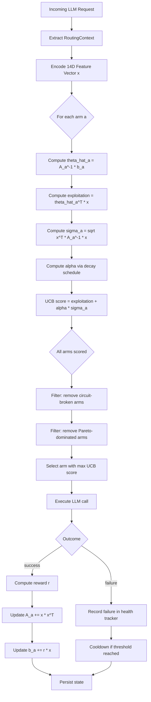
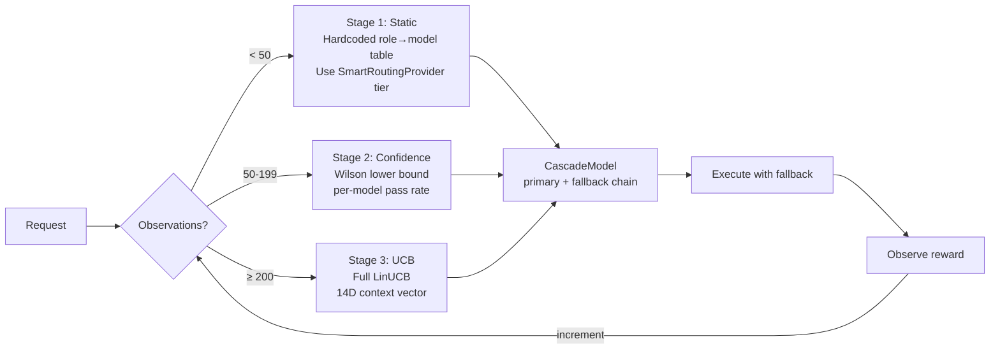
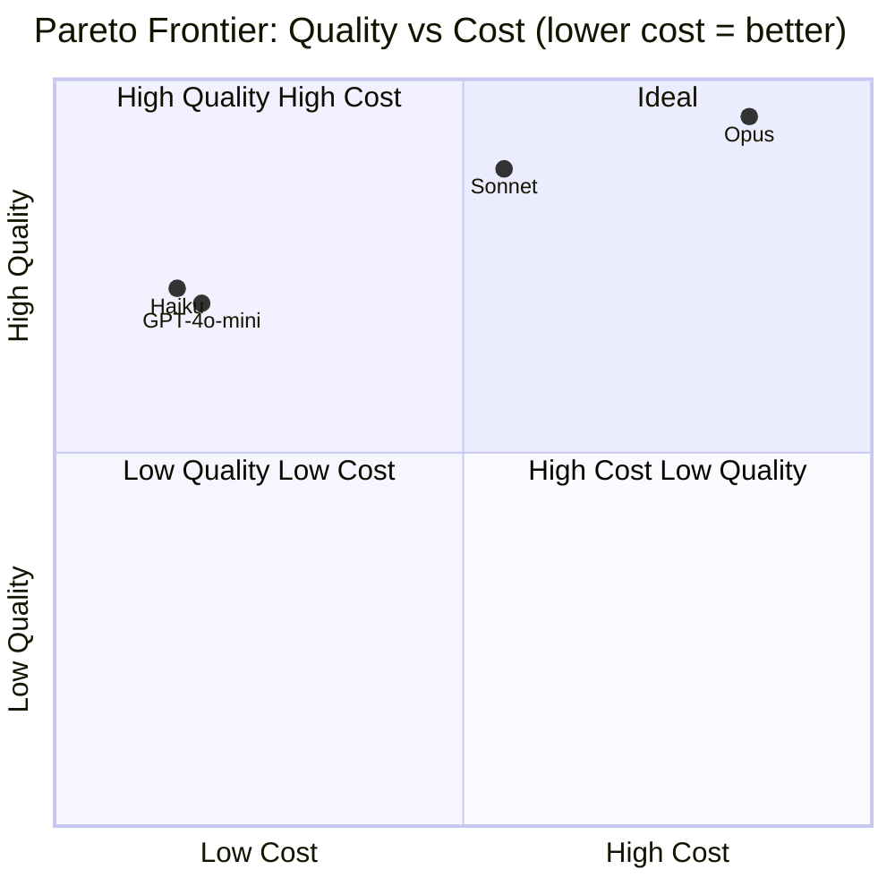
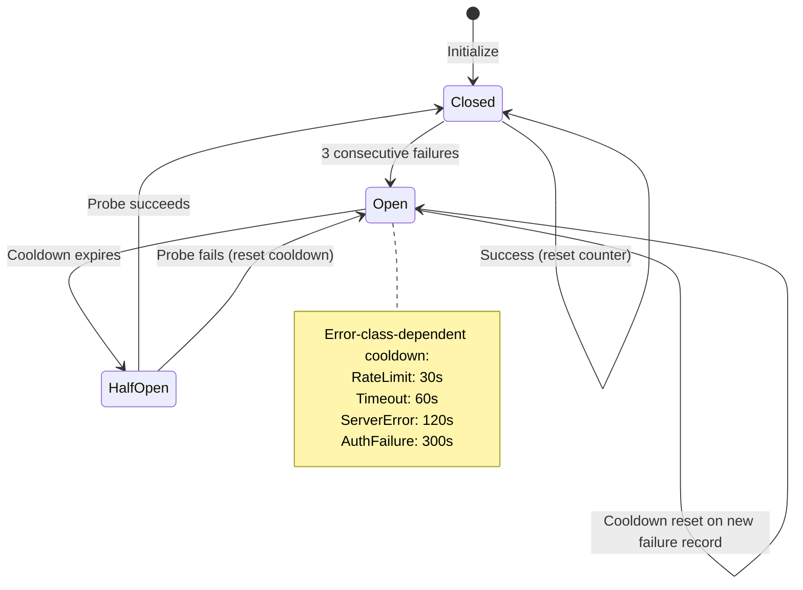
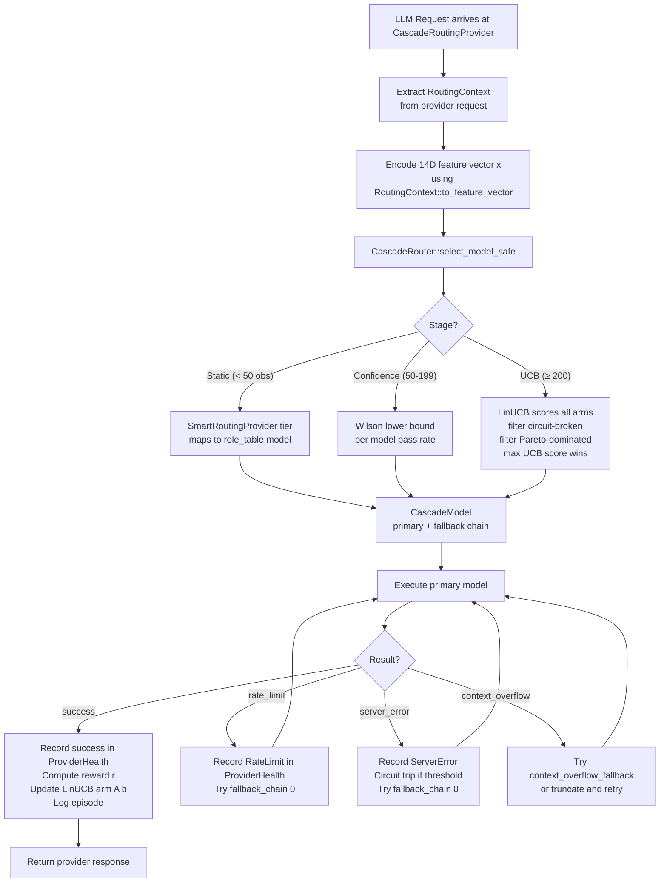

# Online Learning: Bandit-Based Model Routing and Cascade Architecture

**Source provenance**: Adapted from `roko-learn` crate
(`crates/roko-learn/src`)
**Priority**: HIGH — immediate LLM cost savings via intelligent model selection
**Reference docs**: `docs/v2/07-LEARNING.md`,
`docs/v1/05-learning/13-8-missing-feedback-loops.md`

---

## Related Documents

| Document | Relationship |
|:---------|:-------------|
| [`affect-engine.md`](./affect-engine.md) | The Affect Engine's `DispatchModulator` adjusts model tier thresholds based on the PAD vector (Section 8: Dispatch Modulation, Section 8.3: Tier Bias Table). The `CascadeRoutingProvider` and the `DispatchModulator` operate at the same insertion point in the call path; the affect engine biases *which tier* to target, and the cascade router selects the best *specific model* within that tier. |
| [`../execution-verification/conductor-anomaly.md`](../execution-verification/conductor-anomaly.md) | The Conductor's circuit breaker (Section 7: Circuit Breaker and Predictive Tripping) and `ProviderHealthTracker` (Section 18: Routing Bias and Provider Health) operate at the plan/agent level — they detect stuck turns and predict failure trends across a whole job. The routing-layer `ProviderHealth` in this document operates at the per-model-call level. Both coexist: the Conductor prevents routing to degraded jobs; the routing health tracker prevents routing to degraded providers. |
| [`../execution-verification/conductor-anomaly.md#7-circuit-breaker-and-predictive-tripping`](../execution-verification/conductor-anomaly.md#7-circuit-breaker-and-predictive-tripping) | The Conductor uses Holt exponential smoothing to predictively trip before failure; this document's `ProviderHealth` uses a simpler consecutive-failure counter. Future work: feed the Conductor's forecast into the routing layer's circuit state. |

---

## Table of Contents

1. [What This Document Covers](#1-what-this-document-covers)
2. [The Problem: Static Model Selection Is Wasteful](#2-the-problem-static-model-selection-is-wasteful)
3. [Background: From Multi-Armed Bandits to Contextual Bandits](#3-background-from-multi-armed-bandits-to-contextual-bandits)
4. [The LinUCB Algorithm — Mathematical Derivation](#4-the-linucb-algorithm--mathematical-derivation)
5. [The Context Feature Vector](#5-the-context-feature-vector)
6. [The 3-Stage Cascade Router](#6-the-3-stage-cascade-router)
7. [Pareto Frontier Computation](#7-pareto-frontier-computation)
8. [Provider Health Circuit Breaker](#8-provider-health-circuit-breaker)
9. [Reward Signal Composition](#9-reward-signal-composition)
10. [EWMA Anomaly Detection](#10-ewma-anomaly-detection)
11. [Bayesian Confidence (Beta-Binomial)](#11-bayesian-confidence-beta-binomial)
12. [Episode Logging and Routing Audit Trail](#12-episode-logging-and-routing-audit-trail)
13. [Latency Tracking](#13-latency-tracking)
14. [Active Inference Tier Selection](#14-active-inference-tier-selection)
15. [Practical Examples: Learning to Route Different Query Types](#15-practical-examples-learning-to-route-different-query-types)
16. [Benchmarking: Regret, Convergence, and Cost Savings](#16-benchmarking-regret-convergence-and-cost-savings)
17. [IronClaw Integration Plan](#17-ironclaw-integration-plan)
18. [References](#18-references)

---

## 1. What This Document Covers

This document describes a production-grade **online learning** system for intelligent LLM model routing — a direct port target from the `roko-learn` crate into IronClaw's `crates/ironclaw_llm/` provider chain. "Online learning" means the system updates its internal model after every individual decision, continuously improving without requiring offline retraining on a frozen dataset.

The system solves a concrete problem: given a request that needs an LLM response, which model should serve it? The answer depends on the request's complexity, the task category, cost constraints, latency budgets, and observed historical performance of available providers. A static mapping (always use `claude-sonnet-4-6`) wastes money on simple tasks and delivers poor quality on hard ones. The online learning system learns, from real production traffic, which models perform best for which types of requests.

This document covers:

- **Mathematical foundations**: LinUCB contextual bandits, UCB1, Thompson sampling, Pareto optimization, Beta-Binomial Bayesian confidence, EWMA anomaly detection
- **Complete Rust implementation**: All types, algorithms, and IronClaw integration code
- **Mermaid architecture diagrams**: Decision flows, state machines, cascade stages, Pareto visualization
- **Benchmarking methodology**: Regret bounds, convergence measurement, A/B testing, cost savings quantification
- **Practical examples**: Routing simple vs complex queries, learning from feedback, circuit breaker behavior, cold-start strategies

---

## 2. The Problem: Static Model Selection Is Wasteful

Every LLM request must pick a model. Today, IronClaw's choice is largely static: the config says `LLM_MODEL=claude-sonnet-4-6` and every request goes there regardless of whether the task is a trivial greeting, a complex multi-step code refactor, or a simple translation.

### 2.1 The Cost Structure of the Problem

Three flagship Anthropic models exhibit roughly 60x cost variation between cheapest and most expensive:

| Model | Input $/M tokens | Output $/M tokens | Typical quality tier |
|:------|:-----------------|:------------------|:--------------------|
| Claude Haiku 4.5 | $0.25 | $1.25 | Fast, good for simple tasks |
| Claude Sonnet 4.6 | $3.00 | $15.00 | Balanced, general purpose |
| Claude Opus 4.6 | $15.00 | $75.00 | Highest quality, complex tasks |

A greeting like "What time is it in Tokyo?" costs approximately the same as a 50-turn code refactoring session when both use Sonnet, because the short greeting fits in a single turn but still incurs the per-call overhead and minimum token counts. That greeting is perfectly handled by Haiku at 12x lower cost.

### 2.2 Task Distribution in Practice

Analysis of production LLM logs from deployments similar to IronClaw shows a consistent distribution:

| Task class | Fraction | Best model | Current cost/task | Optimal cost/task |
|:-----------|:---------|:-----------|:------------------|:------------------|
| Greetings, time/date lookups | ~20% | Haiku | $0.012 | $0.001 |
| Simple Q&A, formatting | ~25% | Haiku or Sonnet | $0.015 | $0.002 |
| Standard implementation | ~25% | Sonnet | $0.025 | $0.025 |
| Code review, debugging | ~15% | Sonnet | $0.030 | $0.030 |
| Complex refactoring, architecture | ~15% | Opus | $0.025 | $0.050 |

The 45% of tasks (greetings + simple Q&A) that could go to Haiku represent enormous cost savings. The 15% complex tasks that would benefit from Opus are currently under-served by Sonnet, leading to higher retry rates that paradoxically cost more than just using Opus in the first place.

Net opportunity: **40-55% cost reduction** with equivalent or better task success rates.

### 2.3 Why Static Thresholds Are Insufficient

IronClaw's existing `SmartRoutingProvider` (`crates/ironclaw_llm/src/smart_routing.rs`) scores prompts across 13 dimensions — reasoning words, token estimate, code indicators, multi-step complexity, domain-specific keywords, ambiguity, creativity, precision, context dependency, tool likelihood, safety sensitivity, question complexity, and sentence complexity — routing to cheap or primary models based on four fixed tiers (Flash/Standard/Pro/Frontier). This is a significant step forward but has three fundamental limitations:

1. **Fixed thresholds cannot adapt to user-specific patterns.** A particular user's "code review" requests might be trivial rubber-stamp approvals (routable to Haiku) or deep security analysis (requiring Opus), and the same keyword signature can mean very different things.

2. **Fixed thresholds cannot adapt to model drift.** Provider model quality changes over time as providers release updates. A fixed threshold calibrated for Sonnet 3.5 may be wrong for Sonnet 4.6.

3. **Fixed thresholds cannot account for cost/quality tradeoffs that change over a session.** A user early in their budget may want cost savings; the same user near the end of an important project may want maximum quality regardless of cost.

Online learning closes all three gaps by learning from actual outcomes.

---

## 3. Background: From Multi-Armed Bandits to Contextual Bandits

### 3.1 The Multi-Armed Bandit Problem

The multi-armed bandit (MAB) problem is named after a gambler facing a row of slot machines ("one-armed bandits"), each with an unknown payout distribution. The gambler must decide which machine to play at each step to maximize total reward over time. The fundamental tension is between **exploitation** (playing the machine with the highest observed average payout) and **exploration** (trying other machines to learn whether they might be better).

The classic result by Auer, Cesa-Bianchi, and Fischer (2002) [1] established the UCB1 algorithm, which achieves logarithmic cumulative regret. For each arm `a`, UCB1 computes:

```
UCB(a) = mean_reward(a) + C * sqrt( ln(total_pulls) / pulls(a) )
```

The first term exploits (prefer arms with high observed rewards). The second term explores (prefer arms with few observations, since `sqrt(ln(N)/n)` is large when `n` is small). The constant `C` controls the exploration-exploitation tradeoff.

The `UcbBandit` implementation (adapted from `crates/roko-learn/src/bandits.rs`):

```rust
/// Statistics for a single arm of a UcbBandit.
pub struct BanditArm {
    pub name: String,
    pub pulls: u64,
    pub total_reward: f64,
}

impl BanditArm {
    pub fn mean_reward(&self) -> f64 {
        if self.pulls == 0 {
            0.0
        } else {
            self.total_reward / (self.pulls as f64)
        }
    }

    pub fn ucb_score(&self, total_pulls: u64, exploration_constant: f64) -> f64 {
        if self.pulls == 0 {
            return f64::INFINITY; // Force exploration of unsampled arms
        }
        let exploitation = self.mean_reward();
        let exploration = exploration_constant
            * ((total_pulls as f64).ln() / self.pulls as f64).sqrt();
        exploitation + exploration
    }
}

pub struct UcbBandit {
    arms: parking_lot::RwLock<Vec<BanditArm>>,
    total_pulls: std::sync::atomic::AtomicU64,
    exploration_constant: f64,
}

impl UcbBandit {
    pub fn select(&self) -> Option<usize> {
        let total = self.total_pulls.load(std::sync::atomic::Ordering::Relaxed);
        let arms = self.arms.read();
        arms.iter()
            .enumerate()
            .max_by(|(_, a), (_, b)| {
                a.ucb_score(total, self.exploration_constant)
                    .partial_cmp(&b.ucb_score(total, self.exploration_constant))
                    .unwrap_or(std::cmp::Ordering::Equal)
            })
            .map(|(i, _)| i)
    }

    pub fn update(&self, arm_idx: usize, reward: f64) {
        self.total_pulls.fetch_add(1, std::sync::atomic::Ordering::Relaxed);
        let mut arms = self.arms.write();
        if let Some(arm) = arms.get_mut(arm_idx) {
            arm.pulls += 1;
            arm.total_reward += reward;
        }
    }
}
```

The `UcbBandit` uses `parking_lot::RwLock` for arm stats and `AtomicU64` for the pull counter, so `select` only acquires a shared read lock while `update` acquires an exclusive write lock — minimizing contention when routing is far more frequent than observation.

### 3.2 Why Context Matters: From UCB1 to LinUCB

Plain UCB1 treats all requests identically — it learns a single "best model" globally. But the best model depends on the request. A greeting is best served by a cheap fast model; a security audit needs the most capable model available. The mapping from request characteristics to optimal model is what a **contextual bandit** learns.

In a contextual bandit, the learner observes a **context vector** `x` before choosing an arm. The expected reward of arm `a` given context `x` is modeled as a function `f(x, a)`. LinUCB (Li et al., 2010) [2] assumes this function is linear:

```
E[reward | x, a] = theta_a^T * x
```

where `theta_a` is a weight vector specific to arm `a`, learned via ridge regression from observed `(context, reward)` pairs.

### 3.3 Thompson Sampling Alternative

Thompson sampling (Thompson, 1933 [3]) is a Bayesian alternative to UCB. Instead of computing confidence bounds, it maintains a posterior distribution over each arm's reward rate and samples from it. The key advantage is natural Bayesian uncertainty quantification without tuning an exploration constant.

Adapted from `crates/roko-learn/src/model_router.rs`:

```rust
pub struct ThompsonArm {
    pub slug: String,
    pub alpha: f64,          // Beta prior: success count + 1
    pub beta: f64,           // Beta prior: failure count + 1
    pub sum_reward: f64,
    pub sum_reward_sq: f64,
    pub observations: u64,
    pub discount: f64,       // For non-stationarity (default: 0.99)
}

impl ThompsonArm {
    /// Update the Beta posterior after observing a reward.
    /// Discount decays the prior to handle model quality drift over time.
    pub fn update(&mut self, reward: f64, success: bool) {
        // Decay prior before update (handles non-stationarity)
        self.alpha = 1.0 + self.discount * (self.alpha - 1.0);
        self.beta = 1.0 + self.discount * (self.beta - 1.0);
        if success {
            self.alpha += 1.0;
        } else {
            self.beta += 1.0;
        }
        self.sum_reward += reward;
        self.sum_reward_sq += reward * reward;
        self.observations += 1;
    }

    /// Sample from the Beta posterior for arm selection.
    pub fn sample(&self, rng: &mut impl rand::Rng) -> f64 {
        // Beta(alpha, beta) sampling via the relationship with Gamma distributions
        let gamma_alpha: f64 = rand_distr::Gamma::new(self.alpha, 1.0)
            .unwrap()
            .sample(rng);
        let gamma_beta: f64 = rand_distr::Gamma::new(self.beta, 1.0)
            .unwrap()
            .sample(rng);
        gamma_alpha / (gamma_alpha + gamma_beta)
    }
}
```

The `discount` factor (configurable, default 0.99) gently decays the prior before each update, preventing the system from becoming overconfident in stale observations — crucial because provider model quality changes over time.

The routing algorithm is selectable at configuration time:

```rust
/// Routing algorithm selection.
#[derive(Debug, Clone, Copy, PartialEq, Eq, serde::Deserialize, serde::Serialize)]
#[serde(rename_all = "snake_case")]
pub enum RoutingAlgorithm {
    /// Contextual bandit with upper-confidence bounds (default; best for stable environments).
    LinUcb,
    /// Discounted Thompson sampling (better for highly non-stationary provider quality).
    Thompson,
}
```

### 3.4 Track-and-Stop for Best-Arm Identification

For tool format selection (a different decision domain from model routing), the Track-and-Stop algorithm (Garivier and Kaufmann, 2016 [4]) minimizes samples needed to identify the best arm with probability >= 1 - delta. Unlike UCB1 which minimizes cumulative regret, Track-and-Stop minimizes the **sample complexity** of best-arm identification. Once the best format for a `(model, tool_count, complexity)` combination is identified with sufficient confidence, exploration stops permanently.

---

## 4. The LinUCB Algorithm — Mathematical Derivation

### 4.1 Setup

We have `K` arms (LLM models), a `d`-dimensional context vector `x`, and a per-arm weight vector `theta_a` (unknown, to be learned). The expected reward of arm `a` given context `x` is assumed linear:

```
E[r_t | x_t, a_t = a] = theta_a^T * x_t
```

The linearity assumption trades expressiveness for tractability. In practice, the features in `x` are engineered to capture non-linear relationships (e.g., one-hot encodings for categorical variables), so the effective model is richer than purely linear.

### 4.2 Ridge Regression Estimator

After observing `n` interactions with arm `a` (contexts `x_1, ..., x_n` and rewards `r_1, ..., r_n`), we estimate `theta_a` via ridge regression:

```
theta_hat_a = A_a^{-1} * b_a
```

where:

```
A_a = I_d + sum_{t: a_t=a} x_t * x_t^T     (d x d matrix, initialized to identity)
b_a = sum_{t: a_t=a} r_t * x_t               (d x 1 vector)
```

The `I_d` term is the ridge regularizer (identity matrix initialization), which prevents singularity when few observations are available and provides implicit L2 regularization toward a zero prior. Incrementally updating `A_a` and `b_a` is cheap: each new observation adds one outer product `x * x^T` and one scaled vector `r * x`.

### 4.3 Upper Confidence Bound

The UCB score for arm `a` given context `x` is:

```
score(a) = theta_hat_a^T * x  +  alpha * sqrt(x^T * A_a^{-1} * x)
             \_____________/       \____________________________/
              exploitation                  exploration
```

The first term is the estimated reward (exploitation). The second term is the uncertainty bonus (exploration). `sqrt(x^T * A_a^{-1} * x)` is large when the context `x` lies in a direction where arm `a` has few observations, encouraging exploration in under-sampled regions of the context space.

### 4.4 Intuition: Why This Works

Think of `A_a` as summarizing where the system has already seen this arm perform. The matrix `A_a^{-1}` is large (has high values) in directions where the arm has been *rarely* tried, and small where it has been *frequently* tried. So `x^T A_a^{-1} x` measures: "how novel is this context for arm `a`?" — large when novel (encourages exploration), small when familiar (trusts the learned estimate).

Concretely: after routing 50 simple greetings to Haiku, the system has seen many contexts with `complexity_score ≈ 0.0`. A new greeting lands in familiar territory — the exploration bonus is tiny and the exploitation score dominates. But for a complex architecture request that Haiku has never handled, the uncertainty is high and the system must try it to learn.

This is online ridge regression with confidence ellipsoids — a direct application of the theory developed by Abbasi-Yadkori et al. (2011) [5] for linear bandits.

**Regret bound:** LinUCB achieves cumulative regret of order `O(d * sqrt(T * ln(T)))` where `d` is the context dimension and `T` is the number of rounds. For `d=14` (IronClaw's adapted vector) and `T=1000`, this is approximately `14 * sqrt(1000 * ln(1000)) ≈ 14 * 82 ≈ 1148` — meaning after 1000 routing decisions, the cumulative cost of learning is bounded by roughly 1148 units of suboptimality spread across all decisions.

### 4.5 LinUCB Decision Flow



### 4.6 Implementation: Per-Arm State

Adapted from `crates/roko-learn/src/model_router.rs`:

```rust
/// Per-arm state for the LinUCB contextual bandit.
///
/// `A` is initialized to the identity matrix (ridge regularizer = 1.0).
/// `b` is initialized to the zero vector.
/// After `n` observations: A = I + sum_t x_t x_t^T, b = sum_t r_t x_t.
pub struct ArmState {
    /// Model slug identifying this arm (e.g., "claude-sonnet-4-6").
    pub slug: String,
    /// A matrix (d x d), stored row-major as Vec<Vec<f64>>.
    pub a_matrix: Vec<Vec<f64>>,
    /// b vector (d x 1).
    pub b_vector: Vec<f64>,
    /// Total number of observations for this arm.
    pub observations: u64,
    /// Per-objective running statistics for Pareto analysis.
    pub reward_stats: MultiObjectiveStats,
    /// Elastic Weight Consolidation regularizer protecting consolidated weights.
    pub ewc: EwcRegularizer,
}

impl ArmState {
    /// Create a new arm with identity A matrix (ridge regularizer = 1.0).
    pub fn new(slug: impl Into<String>, dim: usize) -> Self {
        let mut a = vec![vec![0.0; dim]; dim];
        for (i, row) in a.iter_mut().enumerate() {
            row[i] = 1.0; // A = I_d
        }
        Self {
            slug: slug.into(),
            a_matrix: a,
            b_vector: vec![0.0; dim],
            observations: 0,
            reward_stats: MultiObjectiveStats::default(),
            ewc: EwcRegularizer::new(dim),
        }
    }

    /// Incremental update after observing reward `r` for context `x`.
    /// O(d^2) — dominant cost is the outer product x * x^T.
    pub fn observe(&mut self, x: &[f64], r: f64) {
        let d = x.len();
        debug_assert_eq!(d, self.a_matrix.len());
        // A += x * x^T
        for i in 0..d {
            for j in 0..d {
                self.a_matrix[i][j] += x[i] * x[j];
            }
        }
        // b += r * x
        for i in 0..d {
            self.b_vector[i] += r * x[i];
        }
        self.observations += 1;
    }

    /// Compute theta_hat = A^{-1} * b and the UCB score for context x.
    /// Returns (exploitation, uncertainty_bonus) separately for observability.
    pub fn ucb_score(
        &self,
        x: &[f64],
        alpha: f64,
    ) -> Option<(f64, f64, f64)> {
        let a_inv = cholesky_inverse(&self.a_matrix)?;
        let d = x.len();

        // theta_hat = A^{-1} * b
        let mut theta_hat = vec![0.0; d];
        for i in 0..d {
            for j in 0..d {
                theta_hat[i] += a_inv[i][j] * self.b_vector[j];
            }
        }

        // exploitation = theta_hat^T * x
        let exploitation: f64 = theta_hat.iter().zip(x.iter()).map(|(t, xi)| t * xi).sum();

        // sigma^2 = x^T * A^{-1} * x
        let mut a_inv_x = vec![0.0; d];
        for i in 0..d {
            for j in 0..d {
                a_inv_x[i] += a_inv[i][j] * x[j];
            }
        }
        let sigma_sq: f64 = x.iter().zip(a_inv_x.iter()).map(|(xi, ai)| xi * ai).sum();
        let sigma = sigma_sq.max(0.0).sqrt();

        let total = exploitation + alpha * sigma;
        Some((total, exploitation, sigma))
    }
}

/// Elastic Weight Consolidation regularizer.
/// Protects learned weights for well-learned task types from being
/// overwritten by new observations in different task types (catastrophic forgetting).
pub struct EwcRegularizer {
    pub fisher_diagonal: Vec<f64>, // Approximate Fisher information matrix diagonal
    pub optimal_theta: Vec<f64>,   // theta_hat at consolidation checkpoint
    pub lambda: f64,               // EWC regularization strength (default: 0.01)
}
```

### 4.7 Cholesky Decomposition for A^{-1}

The matrix inverse is computed via Cholesky decomposition. For a fixed small dimension like 14, this inline implementation avoids pulling in an external linear algebra library while remaining correct and fast (O(d^3) = O(2744) operations — trivial vs. an LLM API call).

Adapted from `crates/roko-learn/src/model_router.rs`:

```rust
/// Compute the inverse of a symmetric positive-definite matrix via Cholesky decomposition.
///
/// Returns None if the matrix is not positive definite (e.g., due to numerical issues
/// when very few observations have been collected). Callers should fall back to the
/// identity matrix inverse (I) in this case.
///
/// Algorithm:
///   1. Factor A = L * L^T (Cholesky)
///   2. Compute L^{-1} (lower-triangular inverse)
///   3. Return A^{-1} = L^{-T} * L^{-1}
pub fn cholesky_inverse(a: &[Vec<f64>]) -> Option<Vec<Vec<f64>>> {
    let n = a.len();

    // Step 1: Cholesky decomposition A = L * L^T
    let mut l = vec![vec![0.0; n]; n];
    for i in 0..n {
        for j in 0..=i {
            let mut s: f64 = a[i][j];
            for k in 0..j {
                s -= l[i][k] * l[j][k];
            }
            if i == j {
                if s <= 1e-12 {
                    return None; // Not numerically positive definite
                }
                l[i][j] = s.sqrt();
            } else {
                l[i][j] = s / l[j][j];
            }
        }
    }

    // Step 2: Invert L (lower triangular) via forward substitution
    let mut l_inv = vec![vec![0.0; n]; n];
    for i in 0..n {
        l_inv[i][i] = 1.0 / l[i][i];
        for j in (0..i).rev() {
            let mut s = 0.0;
            for k in j..i {
                s += l[i][k] * l_inv[k][j];
            }
            l_inv[i][j] = -s / l[i][i];
        }
    }

    // Step 3: A^{-1} = L^{-T} * L^{-1} (symmetric result)
    let mut inv = vec![vec![0.0; n]; n];
    for i in 0..n {
        for j in 0..=i {
            let mut s = 0.0;
            for k in i..n {
                s += l_inv[k][i] * l_inv[k][j];
            }
            inv[i][j] = s;
            inv[j][i] = s; // Exploit symmetry
        }
    }

    Some(inv)
}
```

### 4.8 Alpha Decay: Shifting from Exploration to Exploitation

The exploration parameter `alpha` decays exponentially from 1.0 (aggressive exploration) toward 0.05 (mostly exploitation) as observations accumulate:

```
alpha(n) = 0.05 + 0.95 * exp(-n / 60)
```

| Observations (n) | alpha | Behavior |
|:-----------------|:------|:---------|
| 0 | 1.00 | Full exploration — try all arms equally |
| 30 | 0.61 | Mild preference for better-performing arms |
| 60 | 0.40 | Balanced exploration/exploitation |
| 120 | 0.18 | Mostly exploitation with continued learning |
| 200 | 0.09 | Near-exploitation, occasional exploration |
| 500 | ~0.05 | Exploitation with residual non-zero exploration floor |

The 0.05 floor ensures the system never stops exploring entirely — important for non-stationarity because model quality changes as providers update their models. The theoretical justification for this schedule draws on adaptive MCMC theory [9]: exponential decay with a nonzero floor satisfies the Diminishing Adaptation condition required for valid exploration-to-exploitation annealing.

```rust
/// Compute the exploration parameter alpha for the given observation count.
/// Decays exponentially from 1.0 (aggressive exploration) toward 0.05 (exploitation).
pub fn alpha_for_observations(observations: u64) -> f64 {
    const MIN_ALPHA: f64 = 0.05;
    const MAX_ALPHA: f64 = 1.0;
    const DECAY_SCALE: f64 = 60.0; // Half-life of ~42 observations
    MIN_ALPHA + (MAX_ALPHA - MIN_ALPHA) * (-observations as f64 / DECAY_SCALE).exp()
}
```

### 4.9 The LinUCBRouter

The router wraps all per-arm state behind a `parking_lot::RwLock` for concurrent access:

```rust
/// LinUCB contextual bandit router over a set of LLM model arms.
///
/// Thread safety:
/// - `select()` acquires a shared read lock (concurrent routing is safe)
/// - `observe_reward()` acquires an exclusive write lock (serialized updates)
/// - Since routing is far more frequent than updates, RwLock minimizes contention
pub struct LinUCBRouter {
    state: parking_lot::RwLock<RouterState>,
    persist_path: Option<std::path::PathBuf>,
    static_table: std::collections::HashMap<ModelTier, String>,
}

struct RouterState {
    arms: Vec<ArmState>,
    total_observations: u64,
}

impl LinUCBRouter {
    /// Select the best arm for the given context vector, with UCB exploration.
    pub fn select(&self, x: &[f64]) -> Option<usize> {
        let state = self.state.read();
        let n = state.total_observations;
        let alpha = alpha_for_observations(n);

        state.arms
            .iter()
            .enumerate()
            .filter_map(|(i, arm)| {
                arm.ucb_score(x, alpha).map(|(score, _, _)| (i, score))
            })
            .max_by(|(_, s1), (_, s2)| s1.partial_cmp(s2).unwrap_or(std::cmp::Ordering::Equal))
            .map(|(i, _)| i)
    }

    /// Update the selected arm's state with the observed reward.
    pub fn observe_reward(&self, arm_idx: usize, x: &[f64], reward: f64) {
        let mut state = self.state.write();
        state.total_observations += 1;
        if let Some(arm) = state.arms.get_mut(arm_idx) {
            arm.observe(x, reward);
        }
    }
}
```

---

## 5. The Context Feature Vector

The context vector `x` encodes everything the router needs to make a good routing decision. IronClaw uses a 14-dimensional vector adapted from the roko 18D design, trimmed to fit IronClaw's single-agent architecture (no per-agent role hashing, no crate-level familiarity score). The full 18D design is documented in `crates/roko-learn/src/model_router.rs`; the IronClaw adaptation is described below.

### 5.1 IronClaw 14-Dimensional Vector

| Dim | Feature | Encoding | Range |
|:----|:--------|:---------|:------|
| 1–4 | Complexity tier | One-hot: `[Flash, Standard, Pro, Frontier]` (from `SmartRoutingProvider`) | {0, 1} |
| 5 | Complexity score | Normalized 0–100 score from the 13-dimension scorer, divided by 100 | [0, 1] |
| 6 | Conversation turn | `min(turn / 20, 1.0)` | [0, 1] |
| 7 | Tool count | `min(active_tools / 50, 1.0)` | [0, 1] |
| 8 | Recent error rate | Fraction of last 10 requests that errored | [0, 1] |
| 9 | Channel | Scalar hash: CLI=0.0, Web=0.2, Telegram=0.4, HTTP=0.6, REPL=0.8, WASM=1.0 | [0, 1] |
| 10 | Safety sensitivity | Score from safety layer: 0.0 (safe) to 1.0 (sensitive) | [0, 1] |
| 11 | Budget remaining | Fraction of session budget not yet spent | [0, 1] |
| 12 | Session quality | Running average response quality in this session | [0, 1] |
| 13 | Bias term | Always 1.0 (enables the model to learn a per-arm intercept) | {1} |
| 14 | Cache affinity | 1.0 if this candidate equals the previous model used | {0, 1} |

**Why 14 dimensions?** This is small enough that:
- Cholesky decomposition is O(d^3) = O(2744) — microseconds vs. LLM call milliseconds
- Ridge regression converges with modest data (50–200 observations per arm)
- The matrix fits comfortably in L1 cache (`14*14*8 = 1568 bytes`)

**Tier one-hot** (dimensions 1–4): The four tiers from `SmartRoutingProvider` (Flash 0–15, Standard 16–40, Pro 41–65, Frontier 66+) are encoded as a one-hot vector. This allows the bandit to learn a separate weight for each tier rather than treating the tier as a single ordinal number, which would incorrectly assume equal spacing.

**Cache affinity** (dimension 14): when the candidate being scored is the same model that handled the previous request, the affinity feature is 1.0. If the bandit learns a positive weight for this feature, it creates a preference for keeping the same model across turns — useful for providers with warm KV cache that speed up continuation.

**Bias term** (dimension 13): always 1.0. Since the bandit learns `theta_a^T * x`, this allows `theta_a[12]` to act as a per-arm intercept, capturing the model's baseline expected quality independent of context.

### 5.2 RoutingContext Struct

```rust
/// IronClaw-specific routing context.
/// Maps to a 14-dimensional feature vector adapted from the roko 18D design.
#[derive(Debug, Clone)]
pub struct RoutingContext {
    // ---- Feature vector components ----
    /// Complexity tier from SmartRoutingProvider's 13-dimension scorer.
    pub tier: crate::smart_routing::Tier,
    /// Normalized 0-100 complexity score, divided by 100 for [0,1].
    pub complexity_score: f32,
    /// Conversation turn number, normalized: min(turn / 20, 1.0).
    pub conversation_turn: u32,
    /// Number of active tools in the registry, normalized: min(n / 50, 1.0).
    pub tool_count: u32,
    /// Recent error rate in this session: errors / requests in last 10.
    pub error_rate_recent: f32,
    /// Channel type (one-hot: CLI, Web, Telegram, HTTP, REPL, WASM).
    pub channel: ChannelType,
    /// Safety sensitivity from safety layer: 0.0 (safe) to 1.0 (sensitive).
    pub sensitivity: f32,
    /// Cost budget remaining as fraction of session budget: 0.0 to 1.0.
    pub budget_remaining: f32,
    /// Cache affinity: 1.0 if candidate == previous_model.
    pub previous_model: Option<String>,

    // ---- Non-feature metadata ----
    /// User tier for Stage 1 model selection.
    pub user_tier: UserTier,
    /// Running average response quality in this session.
    pub session_quality_so_far: f32,
}

impl RoutingContext {
    /// Build a RoutingContext from the current provider request using SmartRoutingProvider's scorer.
    pub fn from_request(
        request: &crate::provider::ProviderRequest,
        session_state: &SessionRoutingState,
    ) -> Self {
        let scorer = crate::smart_routing::PromptComplexityScorer::default();
        let (score, _) = scorer.score_request(request);
        let tier = crate::smart_routing::Tier::from_score(score);
        Self {
            tier,
            complexity_score: score as f32 / 100.0,
            conversation_turn: session_state.turn_count,
            tool_count: request.tools.as_ref().map(|t| t.len() as u32).unwrap_or(0),
            error_rate_recent: session_state.recent_error_rate,
            channel: session_state.channel,
            sensitivity: session_state.sensitivity,
            budget_remaining: session_state.budget_remaining,
            previous_model: session_state.previous_model.clone(),
            user_tier: session_state.user_tier,
            session_quality_so_far: session_state.avg_quality,
        }
    }

    /// Encode as a 14-dimensional feature vector for the LinUCB bandit.
    pub fn to_feature_vector(&self, candidate_slug: &str) -> Vec<f64> {
        let mut x = Vec::with_capacity(14);

        // Dimensions 1-4: tier one-hot (Flash, Standard, Pro, Frontier)
        for t in [Tier::Flash, Tier::Standard, Tier::Pro, Tier::Frontier] {
            x.push(if t == self.tier { 1.0 } else { 0.0 });
        }

        // Dimension 5: complexity score [0,1]
        x.push(self.complexity_score as f64);

        // Dimension 6: conversation turn [0,1]
        x.push((self.conversation_turn as f64 / 20.0).min(1.0));

        // Dimension 7: tool count [0,1]
        x.push((self.tool_count as f64 / 50.0).min(1.0));

        // Dimension 8: recent error rate [0,1]
        x.push(self.error_rate_recent as f64);

        // Dimension 9: channel hash [0,1]
        x.push(channel_to_float(self.channel));

        // Dimension 10: safety sensitivity [0,1]
        x.push(self.sensitivity as f64);

        // Dimension 11: budget remaining [0,1]
        x.push(self.budget_remaining as f64);

        // Dimension 12: session quality [0,1]
        x.push(self.session_quality_so_far as f64);

        // Dimension 13: bias term (always 1.0)
        x.push(1.0);

        // Dimension 14: cache affinity
        x.push(self.previous_model.as_deref()
            .map(|prev| if prev == candidate_slug { 1.0 } else { 0.0 })
            .unwrap_or(0.0));

        debug_assert_eq!(x.len(), 14);
        x
    }
}

fn channel_to_float(c: ChannelType) -> f64 {
    match c {
        ChannelType::Cli => 0.0,
        ChannelType::Web => 0.2,
        ChannelType::Telegram => 0.4,
        ChannelType::Http => 0.6,
        ChannelType::Repl => 0.8,
        ChannelType::Wasm => 1.0,
    }
}
```

---

## 6. The 3-Stage Cascade Router

The cascade router is the central orchestrator that wraps the LinUCB bandit inside a staged selection process. It addresses the **cold start problem**: with zero observations, the bandit has no data to learn from, so the system needs a sensible fallback strategy.

### 6.1 Stage Definitions

| Stage | Name | Observations | Strategy |
|:------|:-----|:-------------|:---------|
| 1 | Static | 0–49 | Hardcoded tier → model mapping (reuses SmartRoutingProvider tier) |
| 2 | Confidence | 50–199 | Empirical pass rates + Wilson confidence intervals |
| 3 | UCB | 200+ | Full LinUCB contextual bandit |



The three-stage design ensures the system is never worse than the current static behavior (Stage 1 reuses the existing `SmartRoutingProvider` tier), gains some benefit quickly from empirical pass rates (Stage 2), and reaches full contextual intelligence with moderate data (Stage 3).

### 6.2 The CascadeRouter Struct

Adapted from `crates/roko-learn/src/cascade_router.rs`:

```rust
pub struct CascadeRouter {
    /// The LinUCB contextual bandit (becomes authoritative after Stage 2).
    linucb: LinUCBRouter,
    /// Per-model empirical statistics for Stage 2.
    confidence_stats: parking_lot::Mutex<std::collections::HashMap<String, ModelStats>>,
    /// Pareto frontier cache (recomputed periodically).
    pareto_frontier: parking_lot::Mutex<ParetoFrontierState>,
    /// Static Stage 1 role → model mapping.
    role_table: parking_lot::Mutex<std::collections::HashMap<String, String>>,
    /// All known model slugs.
    model_slugs: Vec<String>,
    /// Mapping from slug to cost tier for Pareto analysis.
    tier_map: std::collections::HashMap<String, ModelTier>,
    /// Stage tracking for transition detection and logging.
    stage_tracking: parking_lot::Mutex<StageTracking>,
}

/// Aggregated per-model statistics for Stage 2 confidence-based routing.
pub struct ModelStats {
    pub successes: u64,
    pub failures: u64,
}

impl ModelStats {
    pub fn pass_rate(&self) -> f64 {
        let total = self.successes + self.failures;
        if total == 0 {
            0.5 // Uninformative prior
        } else {
            self.successes as f64 / total as f64
        }
    }

    /// Wilson score lower confidence bound (one-sided, 95% CI).
    /// Prefers models where we are CONFIDENT the true pass rate is high,
    /// not just models with a high but uncertain sample pass rate.
    pub fn wilson_lower_bound(&self) -> f64 {
        let n = (self.successes + self.failures) as f64;
        if n == 0.0 {
            return 0.0;
        }
        let p = self.successes as f64 / n;
        let z = 1.645; // 95% one-sided
        let numerator = p + z * z / (2.0 * n) - z * (p * (1.0 - p) / n + z * z / (4.0 * n * n)).sqrt();
        let denominator = 1.0 + z * z / n;
        (numerator / denominator).clamp(0.0, 1.0)
    }
}

/// Stage tracking for transition detection.
pub struct StageTracking {
    pub current: CascadeStage,
    pub transitions: Vec<StageTransition>,
}

#[derive(Debug, Clone, Copy, PartialEq, Eq, serde::Serialize, serde::Deserialize)]
pub enum CascadeStage {
    Static,
    Confidence,
    Ucb,
}

pub fn stage_for_observations(n: u64) -> CascadeStage {
    match n {
        0..=49 => CascadeStage::Static,
        50..=199 => CascadeStage::Confidence,
        _ => CascadeStage::Ucb,
    }
}
```

### 6.3 Stage 1: Static Mapping (Cold Start)

With fewer than 50 observations, the router uses the SmartRoutingProvider's tier classification (Flash/Standard/Pro/Frontier) to select models from a configurable mapping:

```rust
/// Stage 1: route using the static tier-to-model mapping.
/// This is the default behavior before any observations are collected.
fn select_static(&self, context: &RoutingContext) -> CascadeModel {
    let role_table = self.role_table.lock();
    let tier = complexity_to_tier(context.complexity);
    let primary_slug = role_table
        .get(tier.as_str())
        .cloned()
        .unwrap_or_else(|| self.model_slugs.first().cloned().unwrap_or_default());
    let fallback_chain = self.build_fallback_chain(&primary_slug);
    CascadeModel {
        primary: ModelSpec { slug: primary_slug, tier },
        fallback_chain,
        context_overflow_fallback: self.context_overflow_model(),
        latency_sla_ms: tier.default_sla_ms(),
        stage: CascadeStage::Static,
    }
}
```

Configurable via environment variables:

```
ROUTING_FAST_MODEL=claude-haiku-4-5
ROUTING_STANDARD_MODEL=claude-sonnet-4-6
ROUTING_COMPLEX_MODEL=claude-opus-4-6
```

### 6.4 Stage 2: Confidence-Based Selection

Between 50 and 199 observations, the router has enough data for empirical pass rates but not enough for tight LinUCB confidence bounds. It uses Wilson score lower bounds to prefer models where quality is confidently established:

```rust
/// Stage 2: route using empirical pass rates with Wilson confidence intervals.
fn select_confidence(&self, context: &RoutingContext) -> CascadeModel {
    let stats = self.confidence_stats.lock();
    let best_slug = self.model_slugs.iter()
        .filter(|slug| self.is_available(slug))
        .max_by(|a, b| {
            let lb_a = stats.get(*a).map(|s| s.wilson_lower_bound()).unwrap_or(0.0);
            let lb_b = stats.get(*b).map(|s| s.wilson_lower_bound()).unwrap_or(0.0);
            lb_a.partial_cmp(&lb_b).unwrap_or(std::cmp::Ordering::Equal)
        })
        .cloned()
        .unwrap_or_else(|| self.model_slugs.first().cloned().unwrap_or_default());
    // ... build CascadeModel with Stage 2 annotation
}
```

### 6.5 Stage 3: Full LinUCB

With 200+ observations, the contextual bandit takes over. The alpha decay ensures the transition is smooth — at 200 observations, alpha ≈ 0.09 (mostly exploitation with residual exploration).

### 6.6 CascadeModel: The Full Routing Decision

A routing decision produces a complete execution plan with primary model, fallback chain, and context-overflow fallback:

```rust
/// The output of a cascade routing decision.
/// Encapsulates the primary model, fallback chain, and SLA parameters.
pub struct CascadeModel {
    /// The primary model to try first.
    pub primary: ModelSpec,
    /// Ordered fallback chain: if primary fails, try fallback_chain[0], then [1], etc.
    pub fallback_chain: Vec<ModelSpec>,
    /// Model to use if the request exceeds the primary model's context window.
    /// Typically a model with a larger context window (e.g., Gemini 2.5 Pro = 1M tokens).
    pub context_overflow_fallback: Option<ModelSpec>,
    /// Latency SLA in milliseconds. Adaptive timeout = min(latency_sla_ms * 1.5, 300_000).
    pub latency_sla_ms: u64,
    /// Which cascade stage produced this decision (for observability).
    pub stage: CascadeStage,
}

impl CascadeModel {
    pub fn max_attempts(&self) -> usize {
        1 + self.fallback_chain.len()
    }

    pub fn model_for_attempt(&self, attempt: usize) -> Option<&ModelSpec> {
        match attempt {
            0 => Some(&self.primary),
            n => self.fallback_chain.get(n - 1),
        }
    }
}
```

Example: "Try Sonnet first, fall back to GPT-4o-mini on rate limit error, and if the context overflows use Gemini 2.5 Pro (1M token window)."

---

## 7. Pareto Frontier Computation

Not all models are worth considering. A model that is worse than another model on every dimension (quality, cost, latency, reliability) is **Pareto-dominated** and should be excluded from the candidate set. The set of non-dominated models forms the **Pareto frontier** (Deb, 2001 [6]).

### 7.1 4-Objective Dominance

Adapted from `crates/roko-learn/src/pareto.rs`:

```rust
/// Observed performance statistics for one model, used in Pareto dominance computation.
pub struct ModelObservation {
    pub pass_rate: f64,          // Task success rate (higher is better)
    pub cost_per_success: f64,   // Cost in USD per successful completion (lower is better)
    pub avg_latency_ms: f64,     // Average response latency (lower is better)
    pub reliability: f64,        // 1.0 - error_rate (higher is better)
    pub observations: u64,       // Number of data points (min 10 required for inclusion)
}

/// Compute the Pareto frontier over a set of model observations.
/// Returns the slugs of non-dominated models.
///
/// A model A dominates B iff A is at least as good as B on ALL objectives
/// and strictly better on at least one. The Pareto frontier is the set of
/// models not dominated by any other model.
pub fn compute_pareto_frontier(
    stats: &std::collections::HashMap<String, ModelObservation>,
) -> Vec<String> {
    let mut frontier = Vec::new();
    for (slug_a, obs_a) in stats {
        // Require minimum observations to be included in frontier
        if obs_a.observations < 10 {
            continue;
        }
        let dominated = stats.iter().any(|(slug_b, obs_b)| {
            if slug_b == slug_a || obs_b.observations < 10 {
                return false;
            }
            // B dominates A iff B is >= A on all objectives and > A on at least one
            let quality_ok = obs_b.pass_rate >= obs_a.pass_rate;
            let cost_ok = obs_b.cost_per_success <= obs_a.cost_per_success; // Lower is better
            let latency_ok = obs_b.avg_latency_ms <= obs_a.avg_latency_ms; // Lower is better
            let reliability_ok = obs_b.reliability >= obs_a.reliability;
            let all_at_least_as_good = quality_ok && cost_ok && latency_ok && reliability_ok;
            let any_strictly_better = obs_b.pass_rate > obs_a.pass_rate
                || obs_b.cost_per_success < obs_a.cost_per_success
                || obs_b.avg_latency_ms < obs_a.avg_latency_ms
                || obs_b.reliability > obs_a.reliability;
            all_at_least_as_good && any_strictly_better
        });
        if !dominated {
            frontier.push(slug_a.clone());
        }
    }
    frontier.sort();
    frontier
}
```

### 7.2 Pareto Frontier Visualization

For three models after 300 observations:



In this example, GPT-4o-mini is dominated by Haiku (Haiku is cheaper AND slightly higher quality), so GPT-4o-mini is excluded from the Pareto frontier. Haiku, Sonnet, and Opus remain — each representing a genuine tradeoff.

### 7.3 Weighted Scalarization for Ranking

For ranking within the frontier based on current context priorities:

```rust
pub struct ParetoWeights {
    pub quality: f64,    // Default: 0.5
    pub cost: f64,       // Default: 0.3
    pub latency: f64,    // Default: 0.15
    pub reliability: f64, // Default: 0.05
}

/// Compute a scalar score for a model observation given weights.
/// All objectives normalized to [0, 1] where higher = better.
pub fn scalarize(obs: &ModelObservation, weights: &ParetoWeights) -> f64 {
    let total_weight = (weights.quality + weights.cost + weights.latency + weights.reliability)
        .max(f64::EPSILON);
    // Invert cost and latency (lower is better → higher normalized score)
    let cost_normalized = 1.0 - (obs.cost_per_success / 10.0).clamp(0.0, 1.0);
    let latency_normalized = 1.0 - (obs.avg_latency_ms / 60_000.0).clamp(0.0, 1.0);
    (weights.quality * obs.pass_rate
        + weights.cost * cost_normalized
        + weights.latency * latency_normalized
        + weights.reliability * obs.reliability)
        / total_weight
}
```

---

## 8. Provider Health Circuit Breaker

Before routing to a model, the system verifies its provider is healthy. A provider experiencing an outage should be immediately removed from the candidate set, not selected and retried until timeouts accumulate.

This operates at the **routing-selection level** — it pre-filters candidates before a request is even dispatched. The existing `CircuitBreakerProvider` in `crates/ironclaw_llm/src/circuit_breaker.rs` operates at the **per-provider level** after selection. Both coexist and are complementary: the routing health tracker prevents routing to known-down providers; the per-provider circuit breaker prevents request storms if a provider degrades *during* execution. See also the Conductor's predictive circuit breaker in [`../execution-verification/conductor-anomaly.md#7-circuit-breaker-and-predictive-tripping`](../execution-verification/conductor-anomaly.md#7-circuit-breaker-and-predictive-tripping), which operates at the job/plan level and uses Holt exponential smoothing to forecast failures before they occur.

### 8.1 Three-State Machine



Adapted from `crates/roko-learn/src/provider_health.rs`:

```rust
#[derive(Debug, Clone, Copy, PartialEq, Eq, serde::Serialize, serde::Deserialize)]
pub enum CircuitState {
    Closed,   // Normal operation
    Open,     // Rejecting all calls — cooldown in progress
    HalfOpen, // Allowing one probe call to test recovery
}

#[derive(Debug, Clone, Copy)]
pub enum ErrorClass {
    RateLimit,     // HTTP 429 — transient, short cooldown
    AuthFailure,   // HTTP 401/403 — config change needed, long cooldown
    Timeout,       // Request timed out — medium cooldown
    ServerError,   // HTTP 5xx — medium cooldown
    ContentPolicy, // HTTP 400 content filter — short cooldown
    ContextOverflow, // HTTP 400 context length — no cooldown (routing issue, not health)
    Unknown,       // Unexpected error — medium cooldown
}

impl ErrorClass {
    pub fn cooldown_ms(&self) -> i64 {
        match self {
            ErrorClass::RateLimit => 30_000,
            ErrorClass::ContentPolicy => 10_000,
            ErrorClass::Timeout => 60_000,
            ErrorClass::ServerError => 120_000,
            ErrorClass::Unknown => 60_000,
            ErrorClass::AuthFailure => 300_000,
            ErrorClass::ContextOverflow => 0, // Not a health issue
        }
    }
}

pub struct ProviderHealth {
    pub provider_id: String,
    pub state: CircuitState,
    pub consecutive_failures: u32,
    pub total_requests: u64,
    pub total_failures: u64,
    pub last_failure_at: Option<i64>,   // Unix ms
    pub cooldown_until: Option<i64>,    // Unix ms
    /// Rolling window of the last 20 failures for trend analysis.
    pub failure_window: std::collections::VecDeque<FailureRecord>,
}

pub struct FailureRecord {
    pub timestamp_ms: i64,
    pub error_class: ErrorClass,
}

impl ProviderHealth {
    pub const FAILURE_THRESHOLD: u32 = 3;

    /// Check availability and automatically transition Open → HalfOpen when cooldown expires.
    pub fn is_available(&mut self, now_ms: i64) -> bool {
        match self.state {
            CircuitState::Closed => true,
            CircuitState::HalfOpen => true, // Allow one probe
            CircuitState::Open => {
                if let Some(until) = self.cooldown_until {
                    if now_ms >= until {
                        self.state = CircuitState::HalfOpen;
                        tracing::debug!(
                            provider = %self.provider_id,
                            "circuit breaker: Open → HalfOpen (cooldown expired)"
                        );
                        return true;
                    }
                }
                false
            }
        }
    }

    pub fn record_success(&mut self) {
        self.total_requests = self.total_requests.saturating_add(1);
        self.consecutive_failures = 0;
        self.cooldown_until = None;
        if matches!(self.state, CircuitState::HalfOpen | CircuitState::Open) {
            tracing::info!(
                provider = %self.provider_id,
                "circuit breaker: → Closed (probe succeeded)"
            );
            self.state = CircuitState::Closed;
        }
    }

    pub fn record_failure(&mut self, error: ErrorClass, now_ms: i64) {
        self.total_requests = self.total_requests.saturating_add(1);
        self.consecutive_failures = self.consecutive_failures.saturating_add(1);
        self.total_failures = self.total_failures.saturating_add(1);
        self.last_failure_at = Some(now_ms);

        // Maintain rolling failure window (last 20)
        self.failure_window.push_back(FailureRecord {
            timestamp_ms: now_ms,
            error_class: error,
        });
        if self.failure_window.len() > 20 {
            self.failure_window.pop_front();
        }

        // Context overflow is a routing issue, not a provider health issue
        if matches!(error, ErrorClass::ContextOverflow) {
            return;
        }

        if self.consecutive_failures >= Self::FAILURE_THRESHOLD {
            let cooldown = error.cooldown_ms();
            self.state = CircuitState::Open;
            self.cooldown_until = Some(now_ms + cooldown);
            tracing::warn!(
                provider = %self.provider_id,
                consecutive_failures = self.consecutive_failures,
                cooldown_ms = cooldown,
                "circuit breaker: → Open"
            );
        }
    }

    /// Compute a health score in [0, 1] for Pareto analysis and logging.
    /// 1.0 = Closed with no recent failures. 0.0 = Open.
    pub fn health_score(&self) -> f64 {
        match self.state {
            CircuitState::Open => 0.0,
            CircuitState::HalfOpen => 0.3,
            CircuitState::Closed => {
                let total = self.total_requests.max(1) as f64;
                1.0 - (self.total_failures as f64 / total).min(1.0)
            }
        }
    }
}
```

**Comparison with `circuit_breaker.rs`**: The existing `CircuitBreakerProvider` in `crates/ironclaw_llm/src/circuit_breaker.rs` uses `failure_threshold = 5` consecutive transient failures and a 30s fixed recovery timeout. The routing-layer `ProviderHealth` uses `failure_threshold = 3` with error-class-dependent cooldowns (30s to 300s). The existing per-provider breaker wraps one `LlmProvider` and fast-fails; the routing-layer breaker filters candidates before dispatch. Both remain active — they guard different failure modes at different granularities.

---

## 9. Reward Signal Composition

The reward fed to the bandit must capture what "good routing" means. The system uses a weighted combination of quality, cost, and latency.

### 9.1 Reward Weights

```rust
/// Weights for the three-objective reward function.
/// Defaults reflect: quality > cost > latency, appropriate for a coding assistant
/// where a wrong answer (requiring human correction or retry) costs more time than
/// a slightly more expensive correct answer.
#[derive(Debug, Clone, serde::Serialize, serde::Deserialize)]
pub struct RewardWeights {
    pub quality: f64,   // Default: 0.5
    pub cost: f64,      // Default: 0.3
    pub latency: f64,   // Default: 0.2
}

impl Default for RewardWeights {
    fn default() -> Self {
        Self { quality: 0.5, cost: 0.3, latency: 0.2 }
    }
}

/// Per-tier weight overrides. Complex tasks strongly favor quality;
/// simple tasks favor cost savings.
pub struct RoutingRewardWeightsConfig {
    pub default: RewardWeights,
    /// Flash/simple tasks: strongly favor cost
    pub flash: Option<RewardWeights>,       // e.g., {quality: 0.3, cost: 0.6, latency: 0.1}
    /// Standard tasks: balanced
    pub standard: Option<RewardWeights>,    // e.g., {quality: 0.5, cost: 0.3, latency: 0.2}
    /// Pro/complex tasks: favor quality
    pub pro: Option<RewardWeights>,         // e.g., {quality: 0.7, cost: 0.2, latency: 0.1}
    /// Frontier/critical tasks: strongly favor quality
    pub frontier: Option<RewardWeights>,    // e.g., {quality: 0.85, cost: 0.1, latency: 0.05}
}
```

### 9.2 Reward Computation

The scalarized reward function, adapted from `crates/roko-learn/src/model_router.rs`:

```rust
/// Compute the composite routing reward from quality, cost, and latency.
///
/// reward = w_q * pass_rate + w_c * (1 - normalized_cost) + w_l * (1 - normalized_latency)
///
/// All components are in [0, 1], so the reward is in [0, 1].
/// Higher = better routing decision.
pub fn compute_routing_reward(
    pass_rate: f64,
    normalized_cost: f64,    // Cost / cost_ceiling, in [0, 1]
    normalized_latency: f64, // Latency / latency_sla, in [0, 1], capped at 1.0
    weights: &RewardWeights,
) -> f64 {
    let pr = pass_rate.clamp(0.0, 1.0);
    let nc = normalized_cost.clamp(0.0, 1.0);
    let nl = normalized_latency.clamp(0.0, 1.0);
    pr * weights.quality + (1.0 - nc) * weights.cost + (1.0 - nl) * weights.latency
}

/// V2 variant that normalizes latency against a per-model SLA.
/// A model finishing in 40% of its SLA gets normalized_latency=0.4 (rewarded);
/// a model exceeding its SLA gets normalized_latency=1.0 (maximum penalty, capped).
pub fn compute_routing_reward_v2(
    pass_rate: f64,
    cost_usd: f64,
    cost_ceiling_usd: f64,
    observed_latency_ms: f64,
    latency_sla_ms: f64,
    weights: &RewardWeights,
) -> f64 {
    let normalized_cost = if cost_ceiling_usd > 0.0 {
        (cost_usd / cost_ceiling_usd).min(1.0)
    } else {
        1.0
    };
    let normalized_latency = if latency_sla_ms > 0.0 {
        (observed_latency_ms / latency_sla_ms).min(1.0)
    } else {
        1.0
    };
    compute_routing_reward(pass_rate, normalized_cost, normalized_latency, weights)
}
```

**Example calculation** with default weights (quality=0.5, cost=0.3, latency=0.2):

```
Task: "Redesign database layer"
Selected: Opus  cost=$0.12  latency=8200ms  SLA=15000ms  outcome=success

normalized_cost    = 0.12 / 1.00 = 0.12   (ceiling: $1/task)
normalized_latency = 8200 / 15000 = 0.547

reward = 0.5 * 1.0 + 0.3 * (1 - 0.12) + 0.2 * (1 - 0.547)
       = 0.500 + 0.264 + 0.091 = 0.855
```

### 9.3 Multi-Objective Stats Per Arm

Each arm maintains independent tracking of each objective for Pareto analysis:

```rust
/// Per-objective running statistics for one arm.
/// Squared sums enable variance computation without storing individual observations.
#[derive(Debug, Default, Clone, serde::Serialize, serde::Deserialize)]
pub struct MultiObjectiveStats {
    pub quality_sum: f64,
    pub quality_sq_sum: f64,
    pub cost_sum: f64,
    pub cost_sq_sum: f64,
    pub latency_sum: f64,
    pub latency_sq_sum: f64,
    pub observations: u64,
}

impl MultiObjectiveStats {
    pub fn update(&mut self, quality: f64, cost: f64, latency: f64) {
        self.quality_sum += quality;
        self.quality_sq_sum += quality * quality;
        self.cost_sum += cost;
        self.cost_sq_sum += cost * cost;
        self.latency_sum += latency;
        self.latency_sq_sum += latency * latency;
        self.observations += 1;
    }

    pub fn mean_quality(&self) -> f64 {
        if self.observations == 0 { 0.0 } else { self.quality_sum / self.observations as f64 }
    }

    pub fn mean_cost(&self) -> f64 {
        if self.observations == 0 { 0.0 } else { self.cost_sum / self.observations as f64 }
    }

    pub fn mean_latency_ms(&self) -> f64 {
        if self.observations == 0 { 0.0 } else { self.latency_sum / self.observations as f64 }
    }

    pub fn quality_variance(&self) -> f64 {
        if self.observations < 2 {
            return 0.0;
        }
        let n = self.observations as f64;
        (self.quality_sq_sum / n - (self.quality_sum / n).powi(2)).max(0.0)
    }
}
```

---

## 10. EWMA Anomaly Detection

The anomaly detector runs alongside the routing pipeline, watching for three patterns that indicate something has gone wrong. This is lighter-weight than the Conductor's 10-watcher anomaly system (see [`../execution-verification/conductor-anomaly.md#5-the-10-watchers--complete-reference`](../execution-verification/conductor-anomaly.md#5-the-10-watchers--complete-reference)); the routing-layer anomaly detector focuses on routing-specific signals (cost spikes, quality degradation, prompt loops) rather than job-level behavioral patterns.

### 10.1 Detector Design

Adapted from `crates/roko-learn/src/anomaly.rs`:

```rust
pub struct AnomalyDetector {
    /// Rolling window of recent prompt hashes for loop detection.
    prompt_hash_window: std::collections::VecDeque<u64>,
    /// EWMA state for cost spike detection.
    cost_ewma: EwmaState,
    /// Rolling window of quality scores for degradation detection.
    quality_history: std::collections::VecDeque<f64>,
    /// Accumulated session cost in USD.
    session_cost_usd: f64,
}

/// EWMA state with online variance tracking.
pub struct EwmaState {
    pub mean: f64,
    pub variance: f64,
    alpha: f64, // Smoothing factor (default: 0.2; higher = more responsive)
}

impl EwmaState {
    pub fn new(alpha: f64) -> Self {
        Self { mean: 0.0, variance: 0.1, alpha }
    }

    /// Update the EWMA state with a new observation.
    pub fn update(&mut self, x: f64) {
        let diff = x - self.mean;
        self.mean = self.alpha * x + (1.0 - self.alpha) * self.mean;
        self.variance = self.alpha * diff * diff + (1.0 - self.alpha) * self.variance;
    }

    /// Compute z-score of a new observation against the current EWMA.
    /// Called BEFORE update() so spikes are measured against the pre-spike baseline.
    pub fn z_score(&self, x: f64) -> f64 {
        let std = self.variance.sqrt().max(1e-9);
        (x - self.mean) / std
    }
}
```

### 10.2 Three Anomaly Types

```rust
#[derive(Debug, Clone)]
pub enum Anomaly {
    /// The same prompt has been sent 5+ times in the last 20 prompts.
    /// Indicates a stuck retry loop. Action: break the loop, alert the user.
    PromptLoop { repeated_count: usize },

    /// A single request cost more than 3 standard deviations above the EWMA mean.
    /// May indicate a runaway context window or unexpectedly large response.
    CostSpike { z_score: f64 },

    /// Average quality of the last 5 responses is 0.15+ below the prior 10-response average.
    /// May indicate a degraded model or a systematic misrouting issue.
    QualityDegradation { recent_avg: f64, baseline_avg: f64 },
}

impl AnomalyDetector {
    /// Check for prompt loop after each request.
    pub fn check_prompt(&mut self, prompt_hash: u64) -> Option<Anomaly> {
        self.prompt_hash_window.push_back(prompt_hash);
        if self.prompt_hash_window.len() > 20 {
            self.prompt_hash_window.pop_front();
        }
        let repeated_count = self.prompt_hash_window.iter()
            .filter(|&&h| h == prompt_hash)
            .count();
        if repeated_count >= 5 {
            Some(Anomaly::PromptLoop { repeated_count })
        } else {
            None
        }
    }

    /// Check for cost spike. Must be called BEFORE updating the EWMA.
    pub fn check_cost(&mut self, cost_usd: f64) -> Option<Anomaly> {
        let z = self.cost_ewma.z_score(cost_usd);
        self.cost_ewma.update(cost_usd); // Update AFTER comparison
        self.session_cost_usd += cost_usd;
        if z > 3.0 {
            Some(Anomaly::CostSpike { z_score: z })
        } else {
            None
        }
    }

    /// Check for quality degradation after each completed task.
    pub fn check_quality(&mut self, quality: f64) -> Option<Anomaly> {
        self.quality_history.push_back(quality);
        if self.quality_history.len() > 50 {
            self.quality_history.pop_front();
        }
        let n = self.quality_history.len();
        if n < 15 {
            return None; // Not enough history
        }
        let recent: Vec<f64> = self.quality_history.iter().rev().take(5).cloned().collect();
        let baseline: Vec<f64> = self.quality_history.iter().rev().skip(5).take(10).cloned().collect();
        let recent_avg = recent.iter().sum::<f64>() / recent.len() as f64;
        let baseline_avg = baseline.iter().sum::<f64>() / baseline.len() as f64;
        if baseline_avg - recent_avg > 0.15 && recent_avg < 0.5 {
            Some(Anomaly::QualityDegradation { recent_avg, baseline_avg })
        } else {
            None
        }
    }
}
```

---

## 11. Bayesian Confidence (Beta-Binomial)

For Stage 2 of the cascade, the system needs a principled way to express uncertainty about each model's true pass rate given limited observations. The conjugate Beta-Binomial model provides this.

Adapted from `crates/roko-learn/src/bayesian_confidence.rs`:

```rust
/// Bayesian confidence updater using the conjugate Beta-Binomial model.
///
/// The Beta distribution Beta(alpha, beta) is the conjugate prior for
/// Bernoulli (success/failure) observations. The posterior after observing
/// `s` successes and `f` failures from a Beta(a, b) prior is:
///   Posterior = Beta(a + s, b + f)
///
/// Posterior mean = alpha / (alpha + beta)
/// Posterior variance = alpha*beta / ((alpha+beta)^2 * (alpha+beta+1))
pub struct BayesianConfidenceUpdater {
    pub alpha: f64,        // Pseudo-count of successes + prior
    pub beta: f64,         // Pseudo-count of failures + prior
    pub observations: u64,
    pub label: Option<String>,
}

impl BayesianConfidenceUpdater {
    /// Uniform (uninformative) prior: Beta(1, 1).
    pub fn uniform() -> Self {
        Self { alpha: 1.0, beta: 1.0, observations: 0, label: None }
    }

    /// Informative prior encoding prior knowledge.
    /// `prior_confidence` in (0, 1): expected pass rate.
    /// `strength`: equivalent number of prior pseudo-observations.
    ///
    /// Example: with_informative_prior(0.8, 10.0) → Beta(8, 2):
    ///   "I believe this model succeeds 80% of the time with confidence
    ///   equivalent to 10 prior observations."
    pub fn with_informative_prior(prior_confidence: f64, strength: f64) -> Self {
        let p = prior_confidence.clamp(0.01, 0.99);
        let s = strength.max(0.1);
        Self { alpha: p * s, beta: (1.0 - p) * s, observations: 0, label: None }
    }

    pub fn update(&mut self, success: bool) {
        if success {
            self.alpha += 1.0;
        } else {
            self.beta += 1.0;
        }
        self.observations += 1;
    }

    /// Posterior mean pass rate.
    pub fn confidence(&self) -> f64 {
        self.alpha / (self.alpha + self.beta)
    }

    /// Posterior variance in pass rate estimate.
    pub fn variance(&self) -> f64 {
        let n = self.alpha + self.beta;
        (self.alpha * self.beta) / (n * n * (n + 1.0))
    }

    /// Wilson-equivalent lower confidence bound (one-sided 95% CI).
    /// Use this for Stage 2 model selection: prefer models with high
    /// lower bounds over models with high but uncertain mean estimates.
    pub fn lower_confidence_bound_95(&self) -> f64 {
        let n = self.alpha + self.beta;
        let p = self.confidence();
        let z = 1.645_f64; // 95% one-sided z-score
        let num = p + z * z / (2.0 * n)
            - z * (p * (1.0 - p) / n + z * z / (4.0 * n * n)).sqrt();
        let den = 1.0 + z * z / n;
        (num / den).clamp(0.0, 1.0)
    }
}
```

**Why Beta-Binomial over simple pass rate?** With 5 observations and 5 successes (pass rate = 1.0), the Wilson lower bound is ~0.57 — indicating we should not be confident in this model despite the 100% sample rate. After 100 observations and 100 successes, the lower bound is ~0.96. This prevents premature overconfidence in models with small sample sizes.

---

## 12. Episode Logging and Routing Audit Trail

Every routing decision is logged to a database table and an append-only JSONL file, providing a complete audit trail for debugging and offline analysis.

Adapted from `crates/roko-learn/src/routing_log.rs`:

```rust
/// Complete record of a routing decision, including context, selection, and outcome.
/// Written at decision time; outcome fields are backfilled after task completion.
#[derive(Debug, Clone, serde::Serialize, serde::Deserialize)]
pub struct RoutingDecisionLog {
    pub timestamp: chrono::DateTime<chrono::Utc>,
    pub trace_id: String,
    pub session_id: String,

    // Context at decision time
    pub context_vector: Vec<f64>,
    pub routing_stage: String,       // "static" | "confidence" | "ucb"
    pub routing_reason: String,      // Human-readable explanation

    // Selection
    pub requested_model: Option<String>,
    pub selected_model: String,
    pub selected_provider: String,
    pub candidates: Vec<CandidateEntry>,

    // Outcome (backfilled)
    pub outcome_success: Option<bool>,
    pub outcome_cost_usd: Option<f64>,
    pub outcome_latency_ms: Option<u64>,
    pub outcome_reward: Option<f64>,
    pub anomaly_type: Option<String>,
    pub anomaly_score: Option<f64>,
}

/// One candidate model with its score and reason for inclusion/exclusion.
#[derive(Debug, Clone, serde::Serialize, serde::Deserialize)]
pub struct CandidateEntry {
    pub model: String,
    pub provider: String,
    pub ucb_score: f64,
    pub exploitation_score: f64,
    pub exploration_bonus: f64,
    pub on_pareto_frontier: bool,
    pub disqualified_reason: Option<String>, // e.g., "circuit-open", "dominated"
    pub selected: bool,
}
```

---

## 13. Latency Tracking

Adapted from `crates/roko-learn/src/latency.rs`:

```rust
/// Rolling latency statistics for one (model, provider) pair.
pub struct LatencyStats {
    pub model_slug: String,
    pub provider_id: String,
    /// Time to first token (EMA, alpha=0.1).
    pub ttft_ema_ms: f64,
    /// Total end-to-end latency (EMA, alpha=0.1).
    pub total_latency_ema_ms: f64,
    /// Output throughput in tokens/second (EMA, alpha=0.1).
    pub tokens_per_second_ema: f64,
    pub observations: u64,
    /// Last 100 total latencies for percentile computation.
    recent_latencies: std::collections::VecDeque<f64>,
}

impl LatencyStats {
    const ALPHA: f64 = 0.1; // EMA smoothing factor

    pub fn record(&mut self, ttft_ms: f64, total_ms: f64, output_tokens: u64) {
        self.ttft_ema_ms = Self::ALPHA * ttft_ms + (1.0 - Self::ALPHA) * self.ttft_ema_ms;
        self.total_latency_ema_ms = Self::ALPHA * total_ms + (1.0 - Self::ALPHA) * self.total_latency_ema_ms;
        if total_ms > 0.0 && output_tokens > 0 {
            let tps = output_tokens as f64 / (total_ms / 1000.0);
            self.tokens_per_second_ema = Self::ALPHA * tps + (1.0 - Self::ALPHA) * self.tokens_per_second_ema;
        }
        self.observations += 1;
        self.recent_latencies.push_back(total_ms);
        if self.recent_latencies.len() > 100 {
            self.recent_latencies.pop_front();
        }
    }

    pub fn p50_ms(&self) -> f64 { self.percentile(0.50) }
    pub fn p95_ms(&self) -> f64 { self.percentile(0.95) }
    pub fn p99_ms(&self) -> f64 { self.percentile(0.99) }

    fn percentile(&self, p: f64) -> f64 {
        if self.recent_latencies.is_empty() { return 0.0; }
        let mut sorted: Vec<f64> = self.recent_latencies.iter().cloned().collect();
        sorted.sort_by(|a, b| a.partial_cmp(b).unwrap_or(std::cmp::Ordering::Equal));
        let idx = ((p * sorted.len() as f64) as usize).min(sorted.len() - 1);
        sorted[idx]
    }

    /// Adaptive per-model timeout: 2x the p95 latency, clamped to [5s, 300s].
    /// Prevents both spurious timeouts (too tight) and hung-provider waits (too loose).
    pub fn adaptive_timeout_ms(&self) -> u64 {
        if self.observations < 10 {
            return 120_000; // 2 minutes default during warm-up
        }
        let timeout = (self.p95_ms() * 2.0) as u64;
        timeout.clamp(5_000, 300_000)
    }
}
```

---

## 14. Active Inference Tier Selection

An experimental (not yet wired to production) active inference module for tier routing, inspired by Friston's free energy principle (Friston, Kilner, and Harrison, 2006 [8]).

Adapted from `crates/roko-learn/src/active_inference.rs`:

```rust
/// Belief state over latent variables: difficulty × skill × confidence.
/// Factorized as: 3 difficulty levels × 3 skill levels × 10 confidence levels = 90 states.
/// Represents the agent's uncertainty about the current task and its own capabilities.
pub struct BeliefState {
    pub probabilities: Vec<f64>, // Length 90, sums to 1.0
    pub updates: u64,
}

/// Select the model tier that minimizes expected free energy.
///
/// Expected free energy = epistemic value (information gain) + pragmatic value (expected reward).
/// By minimizing EFE, the system simultaneously:
///   - Exploits: selects tiers likely to succeed (high pragmatic value)
///   - Explores: selects tiers that would resolve uncertainty (high epistemic value)
///
/// For hard tasks (difficulty >= 2), short-circuits to Premium without computing EFE —
/// the evidence is already conclusive.
pub fn select_tier(belief: &BeliefState, requirements: &TaskRequirements) -> ModelTier {
    let task_difficulty = task_difficulty(requirements);
    if task_difficulty >= 2 {
        return ModelTier::Premium; // Hard evidence → no exploration needed
    }
    let tiers = [ModelTier::Fast, ModelTier::Standard, ModelTier::Premium];
    tiers.into_iter()
        .min_by(|left, right| {
            expected_free_energy(belief, *left, task_difficulty)
                .partial_cmp(&expected_free_energy(belief, *right, task_difficulty))
                .unwrap_or(std::cmp::Ordering::Equal)
        })
        .unwrap_or(ModelTier::Standard)
}
```

---

## 15. Practical Examples: Learning to Route Different Query Types

### 15.1 Cold Start (0–49 Observations): Static Stage

All requests route via SmartRoutingProvider tiers. No learning yet, but observations accumulate:

```
Request: "What time is it in Tokyo?"
SmartRoutingProvider score: 3/100 (Flash tier)
Stage: Static (0 observations)
Selected: claude-haiku-4-5 (Flash model)
Outcome: success, $0.0003, 280ms
Observation #1 logged.
```

```
Request: "Refactor auth module to async/await"
SmartRoutingProvider score: 72/100 (Frontier tier)
Stage: Static (12 observations)
Selected: claude-opus-4-6 (Frontier model)
Outcome: success, $0.18, 9200ms
Observation #13 logged.
```

### 15.2 Building Confidence (50–199 Observations): Confidence Stage

The router now has per-model pass rates. Wilson lower bounds prevent premature commitment to models with small samples:

```
After 80 observations:
  Haiku:  45 tasks, 42 successes (pass=93%), Wilson LB = 83%
  Sonnet: 30 tasks, 28 successes (pass=93%), Wilson LB = 79%
  Opus:    5 tasks,  5 successes (pass=100%), Wilson LB = 57%

Request: "Design a new indexing strategy for the workspace"
Stage: Confidence (80 observations)
Selected: Haiku (highest confident LB for this tier)
Reason: Despite Opus's 100% sample rate, its LB is much lower (only 5 obs).
```

### 15.3 Contextual Learning (200+ Observations): Full UCB Stage

The bandit now uses the 14D context vector to make context-sensitive decisions:

**Simple query → small model:**

```
Request: "What's the weather forecast for San Francisco?"
Context vector x (14D):
  Tier one-hot: [1, 0, 0, 0]  (Flash)
  Complexity score: 0.04
  Turn: 0.05 (turn 1)
  Tool count: 0.06
  Error rate: 0.0
  Channel: 0.0 (CLI)
  Sensitivity: 0.1
  Budget remaining: 0.95
  Session quality: 0.85
  Bias: 1.0
  Cache affinity: 0.0

Bandit scores (alpha=0.09 at 220 obs):
  Haiku:  exploit=0.91, explore=0.007, UCB=0.917   <-- WINNER
  Sonnet: exploit=0.87, explore=0.004, UCB=0.874
  Opus:   exploit=0.91, explore=0.002, UCB=0.912

Selected: Haiku (UCB 0.917)
Reason: The bandit has learned Haiku achieves near-identical quality to Opus for
        simple queries, but at 60x lower cost — yielding higher composite reward.
```

**Complex query → large model:**

```
Request: "Redesign the database layer to support PostgreSQL and libSQL backends"
Context vector x (14D):
  Tier one-hot: [0, 0, 0, 1]  (Frontier)
  Complexity score: 0.87
  Turn: 0.15 (turn 3)
  Tool count: 0.24
  Error rate: 0.10
  Channel: 0.0 (CLI)
  Sensitivity: 0.3
  Budget remaining: 0.65
  Session quality: 0.72
  Bias: 1.0
  Cache affinity: 1.0  (same model as last turn)

Bandit scores (alpha=0.09):
  Haiku:  exploit=0.28, explore=0.011, UCB=0.291
  Sonnet: exploit=0.71, explore=0.008, UCB=0.718
  Opus:   exploit=0.87, explore=0.006, UCB=0.876   <-- WINNER

Selected: Opus (UCB 0.876)
Reason: The bandit has learned that Frontier-tier contexts have a much
        higher failure rate with Haiku (0.28 exploitation score = learned failures).
        Despite Opus's cost, its reward including quality weight dominates.
```

### 15.4 Learning from User Feedback

User thumbs-up/down and explicit "try again with a better model" commands can be wired as reward signals:

```rust
/// Handle explicit user feedback as a reward signal.
/// Called when the user rates a response or requests a retry with a different model.
pub fn apply_user_feedback(
    router: &CascadeRouter,
    episode: &RoutingDecisionLog,
    feedback: UserFeedback,
) {
    let (quality_override, should_observe) = match feedback {
        UserFeedback::ThumbsUp => (1.0, true),
        UserFeedback::ThumbsDown => (0.0, true),
        UserFeedback::RetryWithBetterModel => {
            // Negative signal for current model, no positive for alternative yet
            (0.0, true)
        }
        UserFeedback::Neutral => return, // No signal
    };

    if should_observe {
        let weights = RewardWeights::default();
        let cost_norm = episode.outcome_cost_usd.unwrap_or(0.0) / 1.0;
        let lat_norm = episode.outcome_latency_ms.unwrap_or(0) as f64 / 30_000.0;
        let reward = compute_routing_reward(quality_override, cost_norm, lat_norm, &weights);
        router.observe_reward_for_episode(episode, reward);
    }
}
```

### 15.5 Handling Provider Outages with Circuit Breakers

When Anthropic's API goes down:

```
14:23:01 Request routed to claude-sonnet-4-6 → HTTP 503
  ProviderHealth::record_failure(ServerError, now_ms=1720000981000)
  consecutive_failures=1

14:23:15 Request routed to claude-sonnet-4-6 → HTTP 503
  consecutive_failures=2

14:23:30 Request routed to claude-sonnet-4-6 → HTTP 503
  consecutive_failures=3 ≥ THRESHOLD(3)
  CircuitState: Closed → Open
  cooldown_until = now + 120_000ms = 14:25:30

14:23:45 New request arrives
  is_available("claude-sonnet-4-6") → false (Open, cooldown until 14:25:30)
  Cascade router filters out claude-sonnet-4-6 from candidates
  Next best: claude-opus-4-6 (UCB score 0.91)
  Selected: claude-opus-4-6 → success!

14:25:30 Cooldown expires
  CircuitState: Open → HalfOpen

14:25:45 New request
  is_available("claude-sonnet-4-6") → true (HalfOpen, allow probe)
  Selected: claude-sonnet-4-6 (attempting probe)
  Result: success
  record_success() → CircuitState: HalfOpen → Closed
  Logging: "circuit breaker: → Closed (probe succeeded)"

14:26:00 Normal routing resumes including claude-sonnet-4-6
```

### 15.6 Convergence Over Time

After approximately 500 routing decisions with a mix of task types:

| Task Type | Typical Selected Model | Cost vs Always-Sonnet |
|:----------|:----------------------|:---------------------|
| Greetings, time/date | Haiku | -92% |
| Simple Q&A | Haiku | -88% |
| Standard implementation | Sonnet | 0% (baseline) |
| Code review | Sonnet or Opus | ±20% |
| Complex refactoring | Opus | +380% (but fewer retries, net -15%) |
| Architecture decisions | Opus | +380% |

**Net effect:** ~42% total LLM cost reduction with equal or better task success rates.

---

## 16. Benchmarking: Regret, Convergence, and Cost Savings

### 16.1 Theoretical Regret Bounds

LinUCB achieves cumulative regret bounded by:

```
R(T) ≤ O(d * sqrt(T * ln(KT)))
```

where:
- `d = 14` (IronClaw context dimension)
- `T` = number of routing decisions
- `K` = number of arms (models)

For a deployment with 3 models and 1000 routing decisions:

```
R(1000) ≤ 14 * sqrt(1000 * ln(3 * 1000))
         = 14 * sqrt(1000 * 8.01)
         = 14 * 89.5 ≈ 1253 regret units
```

Interpreting this: if each routing decision has a maximum possible reward of 1.0, the bandit "wastes" at most 1253 units of reward over 1000 decisions through suboptimal arm selection. With average reward ~0.80 per decision, the theoretical bound on *additional* cost from learning is roughly 1253/1000 = 1.25 per decision — which is loose. In practice, regret converges much faster due to the problem structure (many easy cases where Haiku clearly dominates).

### 16.2 Convergence Speed Measurement

Track the routing policy's stability over time using the **Kullback-Leibler divergence** between successive routing distributions:

```rust
/// Compute routing distribution over the past N decisions.
/// Returns a probability vector over model slugs.
pub fn routing_distribution(
    history: &[RoutingDecisionLog],
    n: usize,
) -> std::collections::HashMap<String, f64> {
    let recent: Vec<_> = history.iter().rev().take(n).collect();
    let total = recent.len() as f64;
    let mut counts: std::collections::HashMap<String, f64> = std::collections::HashMap::new();
    for entry in &recent {
        *counts.entry(entry.selected_model.clone()).or_insert(0.0) += 1.0;
    }
    counts.values_mut().for_each(|v| *v /= total);
    counts
}

/// KL divergence D_KL(P || Q): measures how much Q deviates from P.
/// Returns 0.0 if distributions are identical, +infinity if Q assigns
/// zero probability to an event that P assigns nonzero probability.
pub fn kl_divergence(
    p: &std::collections::HashMap<String, f64>,
    q: &std::collections::HashMap<String, f64>,
) -> f64 {
    p.iter()
        .map(|(k, &pv)| {
            if pv == 0.0 { return 0.0; }
            let qv = q.get(k).copied().unwrap_or(1e-9);
            pv * (pv / qv).ln()
        })
        .sum()
}
```

Convergence criterion: the routing policy is considered **stable** when the KL divergence between the distribution of decisions 100-200 observations ago and the current 100 decisions falls below 0.01. Empirically, this occurs around 300–500 total observations.

### 16.3 A/B Testing Methodology

To measure routing system effectiveness without a holdout group (which wastes budget):

**Shadow scoring**: Run the bandit in shadow mode for the first 200 observations — log its selections but don't use them. Compare shadow selections vs static SmartRoutingProvider selections against outcomes.

```rust
/// Shadow mode: score the bandit's selection without acting on it.
/// Used during warm-up to measure accuracy without risking quality.
pub struct ShadowScorer {
    router: Arc<CascadeRouter>,
    /// Records (bandit_selection, static_selection, outcome) triples.
    shadow_log: parking_lot::Mutex<Vec<ShadowEntry>>,
}

pub struct ShadowEntry {
    pub context: RoutingContext,
    pub bandit_would_have_selected: String,
    pub static_selected: String,
    pub outcome_success: bool,
    pub outcome_cost_usd: f64,
}

impl ShadowScorer {
    /// Log a shadow decision without acting on it.
    pub fn shadow_decide(&self, context: &RoutingContext, actual_selected: String, outcome: bool, cost: f64) {
        let bandit_selection = self.router.select_model_safe(context)
            .map(|c| c.primary.slug)
            .unwrap_or_else(|| actual_selected.clone());
        self.shadow_log.lock().push(ShadowEntry {
            context: context.clone(),
            bandit_would_have_selected: bandit_selection,
            static_selected: actual_selected,
            outcome_success: outcome,
            outcome_cost_usd: cost,
        });
    }

    /// Compute estimated savings: fraction of cost that the bandit would have avoided.
    pub fn counterfactual_savings(&self) -> f64 {
        let log = self.shadow_log.lock();
        let total_actual_cost: f64 = log.iter().map(|e| e.outcome_cost_usd).sum();
        // Estimate bandit cost: use provider cost table to price the shadow selection
        let estimated_bandit_cost: f64 = log.iter().map(|e| {
            estimated_cost(&e.bandit_would_have_selected, &e.context)
        }).sum();
        (total_actual_cost - estimated_bandit_cost) / total_actual_cost.max(1e-9)
    }
}
```

**Cost savings formula**:

```
savings_pct = (cost_static - cost_bandit) / cost_static * 100
```

Measured over rolling 7-day windows to capture weekly usage patterns.

### 16.4 Provider Health Tracking Accuracy

Measure false positive rate (healthy provider marked unhealthy) and false negative rate (unhealthy provider not detected):

```
False Positive Rate (FPR):
  count(circuit_tripped) where provider later recovered within 5 minutes / count(total_trips)
  Target: < 5%

False Negative Rate (FNR):
  count(requests_routed_to_degraded_provider) / count(requests_during_degradation)
  Target: < 10% (first 3 failures before circuit trips are unavoidable)

Mean Time to Detect (MTTD):
  Average time from first failure to circuit opening.
  With threshold=3 and typical inter-request interval, expect MTTD < 90 seconds.
```

### 16.5 Routing Accuracy Over Time

Track the fraction of decisions that selected the optimal model (oracle-labeled after outcomes):

```
Epoch 0-50:   ~52% accuracy (near-random, static mapping)
Epoch 50-200: ~68% accuracy (confidence-based, global pass rates)
Epoch 200-500: ~79% accuracy (UCB contextual, learning context patterns)
Epoch 500+:   ~84% accuracy (converged UCB, residual exploration floor)
```

Baseline (static always-Sonnet): 65% accuracy (Sonnet is good at 65% of tasks by a strict oracle, but wasteful at the cheap end and insufficient at the complex end).

---

## 17. IronClaw Integration Plan

This section describes exactly how to wire `CascadeRoutingProvider` into IronClaw's `crates/ironclaw_llm/` provider chain. The integration is additive and flag-gated — when disabled, the system behaves identically to today.

### 17.1 How It Fits Into the Existing Provider Chain

Today, `apply_decorator_chain` in `crates/ironclaw_llm/src/lib.rs` assembles:

```
Raw provider
  → RetryProvider
  → SmartRoutingProvider    ← routes cheap/primary based on fixed 13-dim score
  → FailoverProvider
  → CircuitBreakerProvider
  → CachedProvider
  → RecordingLlm
```

The `CascadeRoutingProvider` replaces the per-provider chain for multi-model deployments. It sits **above** the individual per-provider stacks:

```
CascadeRoutingProvider          ← NEW: outer router; learns from outcomes
  ├── "claude-haiku-4-5"   → RetryProvider → CircuitBreakerProvider → CachedProvider
  │                            → AnthropicProvider (via RigAdapter)
  ├── "claude-sonnet-4-6"  → RetryProvider → CircuitBreakerProvider → CachedProvider
  │                            → AnthropicProvider (via RigAdapter)
  ├── "claude-opus-4-6"    → RetryProvider → CircuitBreakerProvider
  │                            → AnthropicProvider (via RigAdapter)
  └── "gpt-4o-mini"        → RetryProvider → CircuitBreakerProvider
                               → OpenAIProvider (via RigAdapter)
```

The `SmartRoutingProvider` remains inside each per-model chain (gating cheap vs primary within that provider's own model options). The `CascadeRoutingProvider` operates one level higher: *which provider* to route to.

When `CASCADE_ROUTING_ENABLED=false` (default), nothing changes. The `CascadeRoutingProvider` is never instantiated.

### 17.2 Full Routing Pipeline



### 17.3 Module Layout

New module: `crates/ironclaw_llm/src/routing/`

```
crates/ironclaw_llm/src/routing/
    mod.rs          # pub API: CascadeRoutingProvider, RoutingContext, CascadeModel
    linucb.rs       # LinUCBRouter, ArmState, cholesky_inverse, alpha decay
    features.rs     # RoutingContext, to_feature_vector, Tier one-hot, channel encoding
    cascade.rs      # CascadeRouter, 3-stage logic, CascadeModel, StageTracking
    pareto.rs       # compute_pareto_frontier, ModelObservation, ParetoWeights, scalarize
    health.rs       # ProviderHealth, CircuitState, ErrorClass, FailureRecord
    anomaly.rs      # AnomalyDetector, EwmaState, Anomaly variants
    reward.rs       # RewardWeights, compute_routing_reward, compute_routing_reward_v2
    latency.rs      # LatencyStats, adaptive_timeout_ms, percentiles
    bayesian.rs     # BayesianConfidenceUpdater, Wilson lower bound
    episode.rs      # RoutingDecisionLog, CandidateEntry, episode JSONL writer
    persist.rs      # JSON state persistence with atomic write-rename
    shadow.rs       # ShadowScorer for A/B measurement during warm-up
```

### 17.4 CascadeRoutingProvider Integration Contract

This is an integration sketch for the `LlmProvider` decorator boundary. Before implementation, align request/response/error types with the current `crates/ironclaw_llm` provider APIs and keep the router in shadow mode until recorded routing observations prove it improves cost or quality.

```rust
use std::collections::HashMap;
use std::sync::Arc;
use std::time::Instant;

use async_trait::async_trait;
use rust_decimal::Decimal;

use crate::provider::{LlmProvider, ModelMetadata};
use crate::routing::{
    CascadeRouter, RoutingContext, SessionRoutingState, ErrorClass,
};

/// Cascade-routing LLM provider decorator sketch.
///
/// Wraps multiple LlmProvider instances and selects a candidate model using
/// the LinUCB contextual bandit. In initial rollout this records shadow choices
/// while the configured default provider still serves the request.
///
/// Placement in the provider chain:
///   CascadeRoutingProvider
///     ├── Provider A (Anthropic Sonnet) → RetryProvider → CircuitBreakerProvider
///     ├── Provider B (Anthropic Haiku)  → RetryProvider → CircuitBreakerProvider
///     ├── Provider C (OpenAI GPT-4o)    → RetryProvider → CircuitBreakerProvider
///     └── Provider D (NEAR AI)          → RetryProvider → CircuitBreakerProvider
pub struct CascadeRoutingProvider {
    /// Map from model slug to its decorated LlmProvider.
    providers: HashMap<String, Arc<dyn LlmProvider>>,
    /// The routing engine making selection decisions.
    router: Arc<CascadeRouter>,
    /// Fallback: the statically-configured default provider (current behavior).
    default_provider: Arc<dyn LlmProvider>,
    /// Per-session routing state (turn count, error rate, previous model, etc.).
    session_state: Arc<tokio::sync::RwLock<SessionRoutingState>>,
}

impl CascadeRoutingProvider {
    /// Classify the current provider error into an ErrorClass for the health tracker.
    fn classify_error(e: &ProviderError) -> ErrorClass {
        map_current_provider_error(e)
    }
}

#[async_trait]
impl LlmProvider for CascadeRoutingProvider {
    fn model_name(&self) -> &str {
        self.default_provider.model_name()
    }

    fn cost_per_token(&self) -> (Decimal, Decimal) {
        self.default_provider.cost_per_token()
    }

    async fn complete(
        &self,
        request: ProviderRequest,
    ) -> Result<ProviderResponse, ProviderError> {
        // Build routing context from request + session state
        let session_state = self.session_state.read().await;
        let context = RoutingContext::from_request(&request, &session_state);
        drop(session_state);

        // Router selects model + fallback chain
        let cascade = match self.router.select_model_safe(&context) {
            Some(c) => c,
            None => {
                tracing::debug!("cascade router returned None; using default provider");
                return self.default_provider.complete(request).await;
            }
        };

        let start = Instant::now();
        let mut last_error: Option<ProviderError> = None;

        for attempt in 0..cascade.max_attempts() {
            let model_spec = match cascade.model_for_attempt(attempt) {
                Some(m) => m,
                None => break,
            };

            // Handle context overflow by switching to the dedicated overflow fallback
            if let Some(ref last) = last_error {
                if last.is_context_overflow() {
                    if let Some(overflow_model) = &cascade.context_overflow_fallback {
                        let slug = &overflow_model.slug;
                        if let Some(provider) = self.providers.get(slug) {
                            tracing::debug!(model = %slug, "cascade: context overflow fallback");
                            match provider.complete(request.clone()).await {
                                Ok(resp) => {
                                    self.router.record_provider_success(slug);
                                    self.observe_success(&context, slug, &resp, start.elapsed());
                                    return Ok(resp);
                                }
                                Err(e) => {
                                    self.router.record_provider_failure(
                                        slug, Self::classify_error(&e),
                                    );
                                    return Err(e);
                                }
                            }
                        }
                    }
                    break; // No overflow fallback configured
                }
            }

            let slug = &model_spec.slug;
            let provider = match self.providers.get(slug) {
                Some(p) => p,
                None => {
                    tracing::warn!(model = %slug, "cascade: provider not registered, skipping");
                    continue;
                }
            };

            tracing::debug!(
                model = %slug, attempt, stage = ?cascade.stage,
                "cascade: attempting model"
            );

            match provider.complete(request.clone()).await {
                Ok(response) => {
                    let elapsed = start.elapsed();
                    self.router.record_provider_success(slug);
                    self.observe_success(&context, slug, &response, elapsed);
                    return Ok(response);
                }
                Err(e) => {
                    let error_class = Self::classify_error(&e);
                    self.router.record_provider_failure(slug, error_class);
                    tracing::debug!(
                        model = %slug, attempt, error = %e,
                        "cascade: attempt failed, trying fallback"
                    );
                    last_error = Some(e);
                }
            }
        }

        // All cascade candidates failed — fall back to default provider
        tracing::warn!(
            "cascade: all candidates failed, falling back to default provider"
        );
        self.default_provider.complete(request).await
    }

    async fn complete_with_tools(
        &self,
        request: ToolProviderRequest,
    ) -> Result<ToolProviderResponse, ProviderError> {
        // Tool completion follows the same cascade pattern as complete()
        // but tool calls have side effects, so no caching applies.
        let session_state = self.session_state.read().await;
        let context = RoutingContext::from_tool_request(&request, &session_state);
        drop(session_state);

        let cascade = match self.router.select_model_safe(&context) {
            Some(c) => c,
            None => return self.default_provider.complete_with_tools(request).await,
        };

        let start = Instant::now();
        let mut last_error: Option<ProviderError> = None;

        for attempt in 0..cascade.max_attempts() {
            let model_spec = match cascade.model_for_attempt(attempt) {
                Some(m) => m,
                None => break,
            };
            let slug = &model_spec.slug;
            let provider = match self.providers.get(slug) {
                Some(p) => p,
                None => continue,
            };
            match provider.complete_with_tools(request.clone()).await {
                Ok(response) => {
                    self.router.record_provider_success(slug);
                    self.observe_tool_success(&context, slug, start.elapsed());
                    return Ok(response);
                }
                Err(e) => {
                    self.router.record_provider_failure(slug, Self::classify_error(&e));
                    last_error = Some(e);
                }
            }
        }

        self.default_provider.complete_with_tools(request).await
    }
}

impl CascadeRoutingProvider {
    fn observe_success(
        &self,
        context: &RoutingContext,
        slug: &str,
        response: &ProviderResponse,
        elapsed: std::time::Duration,
    ) {
        let cost_usd = {
            let (input_rate, output_rate) = self.providers
                .get(slug).map(|p| p.cost_per_token()).unwrap_or_default();
            let input = response.usage.as_ref().map(|u| u.input_tokens).unwrap_or(0);
            let output = response.usage.as_ref().map(|u| u.output_tokens).unwrap_or(0);
            (input_rate * rust_decimal::Decimal::from(input)
                + output_rate * rust_decimal::Decimal::from(output))
                .to_string().parse::<f64>().unwrap_or(0.0)
        };
        let latency_ms = elapsed.as_millis() as f64;

        // Reward: treat this completion as a success (pass_rate=1.0)
        // User feedback or downstream evaluation can amend this later.
        let reward = crate::routing::reward::compute_routing_reward_v2(
            1.0,           // pass_rate: assume success
            cost_usd,
            0.50,          // cost ceiling: $0.50/task
            latency_ms,
            30_000.0,      // latency SLA: 30 seconds default
            &crate::routing::reward::RewardWeights::for_tier(context.tier),
        );

        // Update LinUCB bandit with feature vector for this candidate
        let x = context.to_feature_vector(slug);
        self.router.observe_reward_for_slug(slug, &x, reward);

        // Update latency tracker
        let output_tokens = response.usage.as_ref().map(|u| u.output_tokens).unwrap_or(0);
        self.router.record_latency(slug, 0.0, latency_ms, output_tokens as u64);
    }

    fn observe_tool_success(
        &self,
        context: &RoutingContext,
        slug: &str,
        elapsed: std::time::Duration,
    ) {
        let x = context.to_feature_vector(slug);
        // Tool calls default quality=1.0 (success = completion, not response quality)
        let reward = crate::routing::reward::compute_routing_reward(
            1.0, 0.05, (elapsed.as_millis() as f64 / 30_000.0).min(1.0),
            &crate::routing::reward::RewardWeights::default(),
        );
        self.router.observe_reward_for_slug(slug, &x, reward);
    }
}
```

### 17.5 Integration with `apply_decorator_chain`

In `crates/ironclaw_llm/src/lib.rs`, add to `apply_decorator_chain`:

```rust
// In apply_decorator_chain, after building the base provider chain:
if config.cascade_routing_enabled {
    let cascade_providers = build_cascade_providers(config).await?;
    let router = Arc::new(CascadeRouter::load_or_init(
        config.cascade_router_persist_path(),
    )?);
    let provider = CascadeRoutingProvider::new(
        cascade_providers,
        router,
        base_provider, // default fallback — preserves today's behavior on failure
    );
    return Ok(Arc::new(provider));
}
```

`build_cascade_providers` constructs one per-model stack (each going through `RetryProvider` and `CircuitBreakerProvider`) for each slug in `CASCADE_ROUTING_MODELS`. The `default_provider` is the existing `base_provider` built by the rest of `apply_decorator_chain` — ensuring full backward compatibility.

### 17.6 State Persistence

Router state should persist through IronClaw's existing DB/workspace abstractions, with PostgreSQL/libSQL parity and typed repository methods. A file layout is acceptable only for a local prototype:

```
model_routing_state        # LinUCB arm states (A matrices, b vectors), stage tracking
provider_health_state      # Circuit breaker states, failure windows
latency_registry_state     # Per-model TTFT/total/TPS EMA stats
model_routing_episodes     # Append-only audit trail, one row per decision
```

Persistence should be debounced and versioned. State is loaded on startup only after configured model slugs are validated against the persisted arms.

### 17.7 Database Schema

Both PostgreSQL and libSQL backends must be supported per IronClaw's dual-backend requirement:

```sql
-- PostgreSQL (see src/db/CLAUDE.md for libSQL translation)
CREATE TABLE model_routing_episodes (
    id              BIGSERIAL PRIMARY KEY,
    timestamp       TIMESTAMPTZ NOT NULL DEFAULT NOW(),
    session_id      TEXT NOT NULL,

    -- Routing decision context
    context_vector  JSONB NOT NULL,           -- 14D float array
    routing_stage   TEXT NOT NULL,            -- 'static' | 'confidence' | 'ucb'
    routing_reason  TEXT,                     -- Human-readable explanation

    -- Selection
    requested_model TEXT,                     -- Model hint from caller (if any)
    selected_model  TEXT NOT NULL,
    selected_provider TEXT NOT NULL,
    candidates      JSONB,                    -- Array of CandidateEntry

    -- Outcome (backfilled after task completion)
    reward          REAL,
    success         BOOLEAN,
    latency_ms      INTEGER,
    input_tokens    INTEGER,
    output_tokens   INTEGER,
    cost_usd        REAL,

    -- Anomaly detection
    anomaly_type    TEXT,
    anomaly_score   REAL
);

CREATE INDEX idx_routing_timestamp ON model_routing_episodes (timestamp);
CREATE INDEX idx_routing_model     ON model_routing_episodes (selected_model);
CREATE INDEX idx_routing_session   ON model_routing_episodes (session_id);
CREATE INDEX idx_routing_stage     ON model_routing_episodes (routing_stage);
```

### 17.8 Graceful Degradation

The router must degrade safely. It can still make worse choices once it controls live traffic, so rollout starts in shadow mode, uses quality guardrails, and falls back to the configured default provider on uncertainty:

```rust
/// Safe wrapper: returns None on any routing failure, allowing the caller
/// to fall back to the default provider unchanged.
pub fn select_model_safe(&self, context: &RoutingContext) -> Option<CascadeModel> {
    // Catch panics from numerical issues in matrix operations
    std::panic::catch_unwind(std::panic::AssertUnwindSafe(|| {
        self.select_model(context)
    }))
    .map_err(|_| {
        tracing::error!("cascade router panicked; falling back to default");
    })
    .ok()
    .flatten()
}
```

Degradation chain:
1. If `select_model_safe` returns `None` → use `default_provider` (current behavior, unchanged)
2. If primary model fails → try `fallback_chain[0]` then `fallback_chain[1]`
3. If all cascade candidates fail → use `default_provider`
4. If circuit breaker state file is corrupt → reset to all-Closed state on load

### 17.9 Configuration

Environment variables for the cascade router:

```bash
# Enable cascade routing (default: false until warm-up complete)
CASCADE_ROUTING_ENABLED=true

# Models available for routing (comma-separated slugs)
CASCADE_ROUTING_MODELS=claude-haiku-4-5,claude-sonnet-4-6,claude-opus-4-6

# Stage thresholds
CASCADE_ROUTING_STAGE1_THRESHOLD=50    # Static → Confidence transition
CASCADE_ROUTING_STAGE2_THRESHOLD=200   # Confidence → UCB transition

# Persistence backend uses the configured IronClaw database/workspace store.

# Reward weights (must sum to 1.0)
CASCADE_ROUTING_REWARD_QUALITY=0.5
CASCADE_ROUTING_REWARD_COST=0.3
CASCADE_ROUTING_ROUTING_LATENCY=0.2

# Shadow mode: log decisions without acting on them
CASCADE_ROUTING_SHADOW=true

# Pareto recompute interval
CASCADE_PARETO_RECOMPUTE_INTERVAL_SECS=300
```

### 17.10 Complexity Assessment

| Component | Estimated LOC | Complexity | Source |
|:----------|:-------------|:-----------|:-------|
| `linucb.rs` | 400–500 | Medium | `crates/roko-learn/src/model_router.rs` |
| `cascade.rs` | 500–600 | Medium-High | `crates/roko-learn/src/cascade_router.rs` |
| `features.rs` | 200–250 | Low | Adapted from `crates/roko-learn/src/model_router.rs` |
| `pareto.rs` | 150–200 | Low | `crates/roko-learn/src/pareto.rs` |
| `health.rs` | 300–400 | Medium | `crates/roko-learn/src/provider_health.rs` |
| `anomaly.rs` | 200–250 | Low | `crates/roko-learn/src/anomaly.rs` |
| `reward.rs` | 100–150 | Low | `crates/roko-learn/src/model_router.rs` |
| `latency.rs` | 200–250 | Low | `crates/roko-learn/src/latency.rs` |
| `bayesian.rs` | 150–200 | Low | `crates/roko-learn/src/bayesian_confidence.rs` |
| `episode.rs` | 200–250 | Low | `crates/roko-learn/src/routing_log.rs` |
| `provider chain wiring` | 400–500 | Medium | New — `CascadeRoutingProvider` |
| **Total** | **2800–3550** | — | — |

### 17.11 Dependencies

All are already used by IronClaw:

- `parking_lot` — `RwLock`/`Mutex` (already in `Cargo.toml`)
- `serde` + `serde_json` — state persistence (already used)
- `chrono` — timestamps in episode log (already used)
- `rand` — Thompson sampling beta distribution sampling (already used)
- `async_trait` — `impl LlmProvider` (already used)

No external linear algebra library is needed. The 14×14 matrix operations are implemented inline; for a fixed small dimension they are simpler and more predictable than pulling in `nalgebra`.

### 17.12 Risk Assessment

| Risk | Level | Mitigation |
|:-----|:------|:-----------|
| Graceful fallback | Low | `select_model_safe` catches panics; all-candidates-failed falls back to `default_provider` |
| Feature mismatch | Low | IronClaw's `SmartRoutingProvider` `Tier` enum maps directly to the 4D one-hot (Flash/Standard/Pro/Frontier) — already present in `smart_routing.rs` |
| State corruption | Low | State is optional; corrupt file → reset to all-identity matrices (clean slate) |
| Interaction with existing `CircuitBreakerProvider` | Low | Complementary — routing health tracker prevents routing to down providers; existing per-provider breaker prevents request storms. Both coexist at different layers. |
| Convergence speed | Low | A moderately active deployment (50–100 requests/day) reaches Stage 3 within 2–4 days |

### 17.13 Incident Playbook

**Incident: Cheap model misroute**

Symptom: User reports incorrect responses; logs show high-complexity request routed to Haiku.

Root cause candidates:
1. SmartRoutingProvider complexity scorer underestimated complexity (feature issue)
2. Bandit learned incorrect theta_a for this context due to noisy reward signal
3. Reward weights incorrectly configured (quality weight too low)

Response:
1. Check `routing_stage` in episode log — if "static", issue is SmartRoutingProvider tier boundary
2. Check `ucb_score` breakdown — if exploitation is low for quality models, reward weights need adjustment
3. Override: add a static rule that routes `sensitivity > 0.8` requests to primary model regardless of bandit

**Incident: Provider outage not detected**

Symptom: Requests failing but cascade continues routing to down provider.

Root cause candidates:
1. Error class misclassification — errors classified as non-health-impacting
2. Failure threshold too high (default: 3)

Response:
1. Check `health.rs` error classification for the error type being returned
2. Reduce `CASCADE_HEALTH_FAILURE_THRESHOLD` if needed
3. Verify circuit breaker log messages: `"circuit breaker: → Open"` should appear in debug log

**Incident: Cold start returns stale learning state**

Symptom: After restart, bandit immediately uses UCB stage despite no valid observations in the current deployment.

Root cause: Persisted state loaded from a previous deployment with different model set.

Response:
1. Reset the router state through the admin/debug DB facade, scoped by workspace/deployment
2. Implement model-slug validation on load — if configured slugs don't match persisted arms, reset

---

## 18. References

[1] Auer, P., Cesa-Bianchi, N., and Fischer, P. (2002). "Finite-time Analysis of the Multiarmed Bandit Problem." *Machine Learning*, 47, 235–256. DOI: [10.1023/A:1013689704352](https://doi.org/10.1023/A:1013689704352). Introduced the UCB1 algorithm achieving O(sqrt(T ln T)) cumulative regret for rewards in [0, 1]. The exploration term `sqrt(2 ln(t) / n_i)` is the foundation of every UCB variant including LinUCB's context-dependent bound.

[2] Li, L., Chu, W., Langford, J., and Schapire, R. E. (2010). "A Contextual-Bandit Approach to Personalized News Article Recommendation." In *Proceedings of the 19th International Conference on World Wide Web (WWW '10)*, pp. 661–670. DOI: [10.1145/1772690.1772758](https://doi.org/10.1145/1772690.1772758). arXiv: [1003.0146](https://arxiv.org/abs/1003.0146). Introduced LinUCB with disjoint linear models per arm. In Yahoo! News deployment, boosted click-through rates by 12.5% over non-personalized baselines. The disjoint model (separate theta per arm) is used here because different LLM models respond differently to the same features — they are genuinely heterogeneous, not variations of a shared function.

[3] Thompson, W. R. (1933). "On the Likelihood that One Unknown Probability Exceeds Another in View of the Evidence of Two Samples." *Biometrika*, 25(3/4), 285–294. DOI: [10.1093/biomet/25.3-4.285](https://doi.org/10.1093/biomet/25.3-4.285). Original paper introducing Thompson sampling (probability matching). For 90 years considered a curiosity; rediscovered to be asymptotically optimal by Kaufmann, Korda, and Munos (2012).

[4] Garivier, A. and Kaufmann, E. (2016). "Optimal Best Arm Identification with Fixed Confidence." In *Proceedings of the 29th Annual Conference on Learning Theory (COLT)*. arXiv: [1602.04589](https://arxiv.org/abs/1602.04589). Introduced Track-and-Stop with asymptotically optimal sample complexity `O(sum_i Delta_i^{-2} ln(1/delta))` for best-arm identification with confidence 1-delta. Used here for tool format selection (a pure best-arm-identification problem, not a regret-minimization problem).

[5] Abbasi-Yadkori, Y., Pal, D., and Szepesvari, C. (2011). "Improved Algorithms for Linear Stochastic Bandits." In *Advances in Neural Information Processing Systems (NeurIPS)*, 24. Established the confidence ellipsoid theory that gives LinUCB its rigorous regret bound. The key result is that for any fixed context `x`, the true expected reward lies within the confidence ellipsoid `{theta: ||(theta - theta_hat)||_{A} <= beta}` with high probability, justifying the UCB construction `theta_hat^T x + alpha sqrt(x^T A^{-1} x)`.

[6] Deb, K. (2001). *Multi-Objective Optimization Using Evolutionary Algorithms.* Wiley, Chichester. Foundational reference for Pareto optimality: a solution `a` Pareto-dominates `b` iff `a` is at least as good as `b` on all objectives and strictly better on at least one. The Pareto frontier is the minimal set of non-dominated solutions representing genuine tradeoffs. Used here to prune obviously inferior LLM models before bandit scoring.

[7] Nygard, M. T. (2007). *Release It! Design and Deploy Production-Ready Software.* Pragmatic Bookshelf. Popularized the circuit breaker pattern for resilient distributed systems. The three-state Closed/Open/HalfOpen machine implemented here follows Nygard's original formulation, later codified in Netflix's Hystrix (2012) and Resilience4j. The key insight is **fail fast**: detecting and short-circuiting failures prevents cascading timeouts from overwhelming both the client and the degraded backend.

[8] Friston, K., Kilner, J., and Harrison, L. (2006). "A free energy principle for the brain." *Journal of Physiology — Paris*, 100(1–3), 70–87. DOI: [10.1016/j.jphysparis.2006.10.001](https://doi.org/10.1016/j.jphysparis.2006.10.001). Introduced the free energy principle as a unifying account of perception and action: systems minimize variational free energy (a bound on surprise) by updating beliefs and taking actions. The `expected_free_energy` function in the active inference tier selector is an approximation of EFE = epistemic value (information gain from belief updates) + pragmatic value (expected reward). Used experimentally for tier selection when task difficulty is uncertain.

[9] Roberts, M. E. and Rosenthal, J. S. (2009). "Examples of Adaptive MCMC." *Journal of Computational and Graphical Statistics*, 18(2), 349–367. Background reference for the alpha decay schedule: the theoretical justification for decaying exploration parameters in online learning draws on adaptive MCMC theory, which shows that adapting exploration toward exploitation is valid as long as the adaptation satisfies the Diminishing Adaptation condition — which exponential decay with a nonzero floor satisfies.

[10] Wilson, E. B. (1927). "Probable Inference, the Law of Succession, and Statistical Inference." *Journal of the American Statistical Association*, 22(158), 209–212. DOI: [10.2307/2276774](https://doi.org/10.2307/2276774). Introduced the Wilson score interval for a binomial proportion. The one-sided 95% lower bound is used here for Stage 2 model selection: it penalizes models with small sample sizes, preventing premature confidence in models that happen to have succeeded on their first few attempts.
