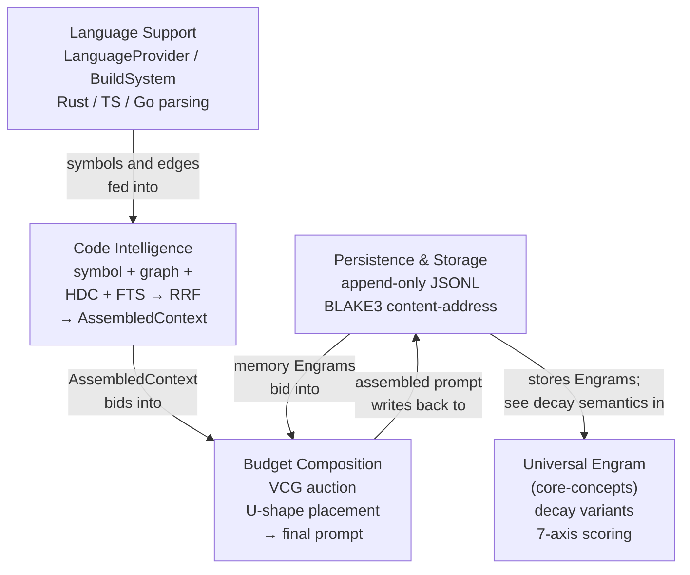

# Context and Memory

This category covers how an agent assembles, searches, and persists its knowledge: budget-constrained prompt composition using auction theory, multi-modal code indexing and hybrid search, append-only storage philosophy, and multi-language source analysis for polyglot codebases.

## Documents

| Document | Summary | Priority |
|----------|---------|----------|
| [Budget-Constrained Composition](budget-composition.md) | VCG auction-based prompt assembly where subsystems (skills, memory, tools, history) bid for context window space. Nine-layer cache-aware prompt builder with strategic U-shaped placement. Thompson Sampling learning bidders, three context tiers (surgical/focused/full), and active inference foraging via the Free Energy Principle. | MEDIUM |
| [Code Intelligence](code-intelligence.md) | Four-mode hybrid code indexing: symbol index, graph index (PageRank-ranked dependency graph), HDC structural fingerprints, and FTS5 full-text search. Results merged via Reciprocal Rank Fusion (RRF). Outputs `AssembledContext` — a ranked, budget-fitted list of code slices that feeds into the prompt auction. Language traits (`LanguageProvider`, `BuildSystem`) are defined in full in [Language Support](language-support.md); code-intelligence references them. | MEDIUM |
| [Language Support](language-support.md) | **Canonical home for `LanguageProvider` and `BuildSystem` traits.** Structural code analysis for Rust, TypeScript, and Go. Dual-mode Rust parser (heuristic regex vs. tree-sitter), TypeScript tsconfig resolution, Go module graph parsing, polyglot project detection, and typed dependency edge classification. | MEDIUM |
| [Persistence and Storage](persistence-storage.md) | Complete analysis of Roko's append-only JSONL storage layer: crash safety by construction, human-readable audit trail, no WAL complexity. Content-addressing (BLAKE3) for deduplication, Ebbinghaus decay semantics, and a comparison with IronClaw's dual-backend (PostgreSQL + libSQL) approach. Decay semantics are summarized here; see [Universal Engram](../core-concepts/universal-engram.md) for the full four-variant decay model. | MEDIUM |

## Boundaries: What Each Document Owns

| Concern | Owner |
|---------|-------|
| `LanguageProvider` trait definition | [Language Support](language-support.md) |
| `BuildSystem` trait definition | [Language Support](language-support.md) |
| Per-language parsing (Rust/TS/Go) | [Language Support](language-support.md) |
| Polyglot detection | [Language Support](language-support.md) |
| Symbol graph, PageRank, HDC, FTS, RRF | [Code Intelligence](code-intelligence.md) |
| `AssembledContext` / `CodeSlice` output | [Code Intelligence](code-intelligence.md) |
| VCG token-budget auction | [Budget Composition](budget-composition.md) |
| U-shaped placement, Thompson Sampling | [Budget Composition](budget-composition.md) |
| Engram storage, JSONL, BLAKE3 | [Persistence and Storage](persistence-storage.md) |
| Engram struct, decay variants, scoring | [core-concepts/universal-engram.md](../core-concepts/universal-engram.md) |

## How These Systems Fit Together

**Complementary roles:**

- **Persistence** is the substrate — it stores everything and defines the durability contract. Decay semantics (Ebbinghaus, HalfLife, TTL) are introduced here and defined fully in [Universal Engram](../core-concepts/universal-engram.md).
- **Language Support** provides the parsing primitives. It defines `LanguageProvider` and `BuildSystem` once; everything downstream imports from there.
- **Code Intelligence** is the read path for code-centric tasks — it imports `LanguageProvider` from Language Support, runs the four-mode index, and emits `AssembledContext`.
- **Budget Composition** is the final assembly step — it runs the VCG token auction across all content sources (memory Engrams, code slices, skills, history) and places sections strategically to exploit the U-shaped attention curve.

## Quick Start

1. Read [Persistence and Storage](persistence-storage.md) to understand the storage philosophy and Engram lifecycle (decay, BLAKE3 identity). Follow the link to [Universal Engram](../core-concepts/universal-engram.md) for the full decay model.

2. Read [Language Support](language-support.md) to understand `LanguageProvider` and `BuildSystem` — the traits that all code-aware analysis depends on.

3. Read [Code Intelligence](code-intelligence.md) next to see how those traits feed the four-mode index and produce `AssembledContext`.

4. Read [Budget Composition](budget-composition.md) last — the VCG auction and U-shaped placement operate on the assembled code context plus all other prompt sections.

## Cross-Folder Links

- Engram decay model: [../core-concepts/universal-engram.md](../core-concepts/universal-engram.md)
- HDC fingerprints used by code-intelligence: [../core-concepts/hyperdimensional-computing/README.md](../core-concepts/hyperdimensional-computing/README.md)
- Gate verification (consumes code intelligence output): [../execution-verification/gate-verification.md](../execution-verification/gate-verification.md)
- Agent intelligence (consumes context budget output): [../agent-intelligence/README.md](../agent-intelligence/README.md)
