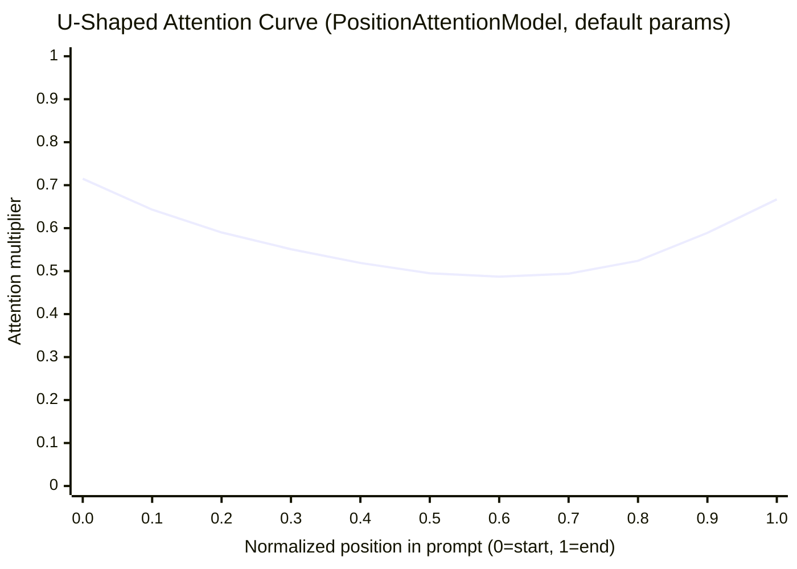
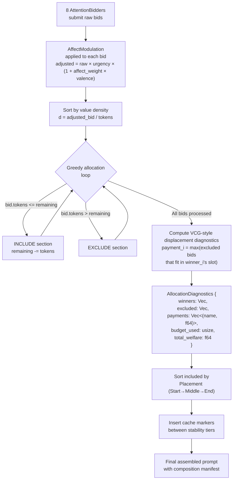
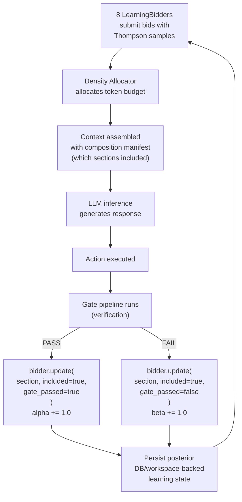
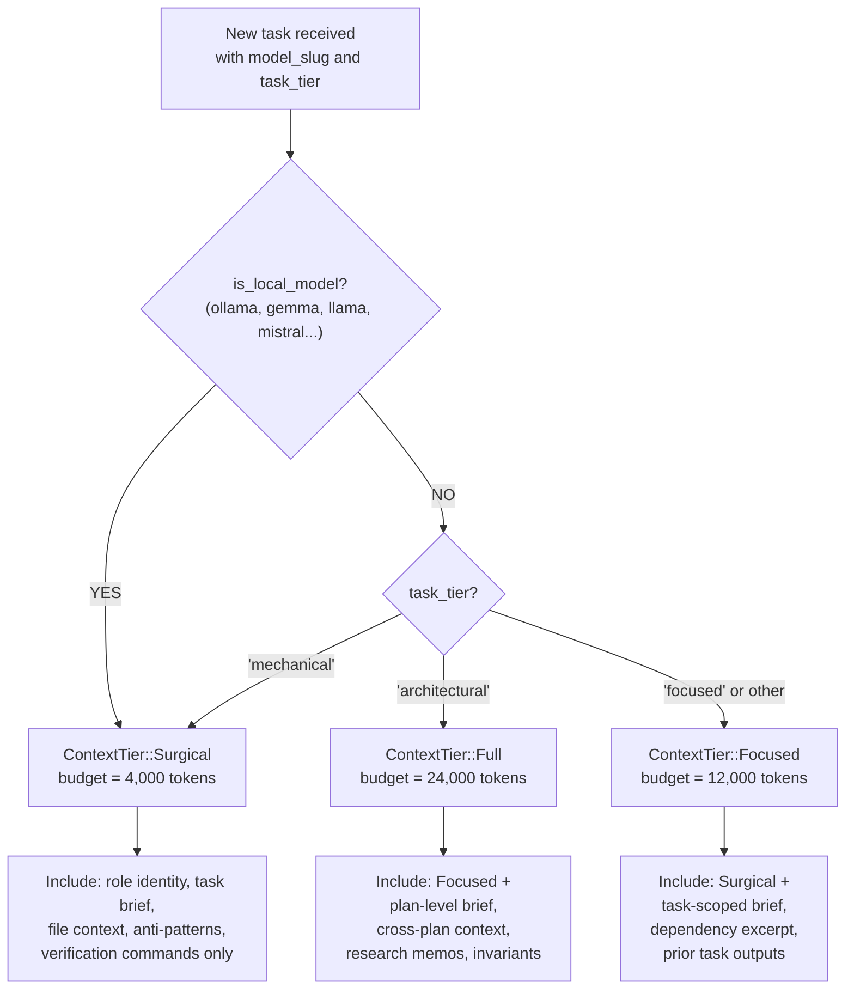
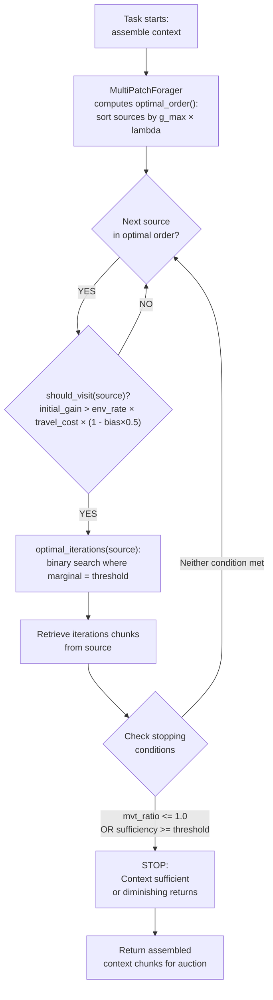

# Budget-Constrained Prompt Composition

**Source provenance**: captured source-corpus crate `roko-compose` (`crates/roko-compose/src/`)
**Priority**: MEDIUM — enhances system prompt building and context management
**Key modules**: `prompt.rs`, `auction.rs`, `scorer.rs`, `budget.rs`, `system_prompt_builder.rs`, `attention.rs`, `foraging.rs`, `strategy.rs`, `context_provider.rs`, `budget_predictor.rs`, `cost_attribution.rs`

> **Boundary with code intelligence**: [Code Intelligence](code-intelligence.md) (section 11) produces `AssembledContext` — a ranked, token-estimated list of code slices selected from the symbol index. That is a *pre-budget* operation. This document describes the downstream step: greedy density allocation plus VCG-style diagnostics that arbitrate between `AssembledContext` and other bidders (memory Engrams, skills, history, tools) for space in the final prompt.

---

## Table of Contents

1. [Introduction: What Is Prompt Composition?](#1-introduction)
2. [The U-Shaped Attention Curve: "Lost in the Middle"](#2-attention-curve)
3. [The 9-Layer System Prompt Builder](#3-system-prompt-builder)
4. [The PromptSection Type](#4-prompt-section)
5. [The 8 Attention Bidders](#5-attention-bidders)
6. [The Density Allocation + VCG-Style Diagnostics](#6-vcg-auction)
7. [Thompson Sampling Learning Bidders](#7-thompson-sampling)
8. [Composition Strategy: Auto-Selection](#8-composition-strategy)
9. [Context Tier Routing](#9-context-tiers)
10. [The PromptComposer: Full 11-Step Pipeline](#10-prompt-composer)
11. [Section Scoring: Goal-Directed Heuristic Scoring](#11-section-scoring)
12. [Expected Free Energy: Mathematical Formulation](#12-expected-free-energy)
13. [Multi-Patch Foraging with Active Inference](#13-foraging)
14. [Budget Prediction and Section Influence](#14-budget-prediction)
15. [Per-Section Cost Attribution](#15-cost-attribution)
16. [Conversation History Compaction](#16-compaction)
17. [Benchmarking and Quality Metrics](#17-benchmarking)
18. [Practical Examples: 8 Subsystems Competing for 12K Tokens](#18-practical-examples)
19. [IronClaw Integration Plan](#19-ironclaw-integration)
20. [Complexity Assessment](#20-complexity)
21. [Captured Source Identifier Reference](#21-source-reference)
22. [Academic Citations](#22-citations)

---

## 1. Introduction: What Is Prompt Composition? {#1-introduction}

Prompt composition is the process of assembling the text that gets sent to a large language model (LLM) before it generates a response. For a simple chatbot, this might be a system message plus user input. For an AI agent that writes code, manages projects, and coordinates with other agents, the prompt can contain dozens of distinct components:

- **Identity and role instructions** (who the agent is, safety rules, behavioral constraints)
- **Tool definitions** (schemas, usage instructions, rate limits)
- **Project conventions** (coding standards, naming patterns, architecture rules)
- **Task context** (what to do, acceptance criteria, verification commands)
- **Memory** (relevant past experiences, knowledge entries, heuristics)
- **Conversation history** (prior turns, user instructions, error feedback)
- **Skills and playbooks** (domain-specific techniques, learned strategies)
- **Coordination signals** (peer-agent outputs, dependency handoffs)

When the total token cost of all these components exceeds the model's context window, the system must make triage decisions. Simple approaches — fixed priority ordering, round-robin, or truncating at the end — often spend tokens on low-value content while starving high-value content of space. Research on long-context retrieval also shows that filling the context window is not enough, because models attend unevenly to content at different positions.

**Budget-constrained prompt composition** treats prompt assembly as a formal resource-allocation problem. Rather than ad hoc concatenation, it applies:

- **Mechanism-design diagnostics from economics** (VCG-style displacement payments) to analyze token budget allocation across competing content sources
- **Online learning from statistics** (Thompson Sampling) to learn which content contributes to task success
- **Ecological foraging theory from biology** (Marginal Value Theorem) to decide when to stop retrieving context from each source
- **Active inference from computational neuroscience** (Expected Free Energy) to balance goal-directed inclusion with uncertainty-reducing exploration

The captured `roko-compose` material describes this pipeline. This document keeps the contracts, formulas, and integration points; any IronClaw implementation must be rebuilt in local owner modules with caller-level tests.

---

## 2. The U-Shaped Attention Curve: "Lost in the Middle" {#2-attention-curve}

### 2.1 The Research Finding

Large language models attend unevenly to content at different positions in the prompt. Liu et al. (2024) demonstrate a U-shaped attention curve in their paper "Lost in the Middle: How Language Models Use Long Contexts": models attend most strongly to content at the **beginning** (primacy effect) and **end** (recency effect) of the context window, with significantly degraded attention to content in the **middle**.

The degradation can be large enough that a model shown 10 relevant documents performs worse at retrieval when the answer is in document 5 than when shown only a single relevant document. The middle of the context window is a lower-attention region, not a neutral holding area.

> **Citation**: Liu, N. F., Lin, K., Hewitt, J., Paranjape, A., Bevilacqua, M., Petroni, F., & Liang, P. (2024). Lost in the Middle: How Language Models Use Long Contexts. *Transactions of the Association for Computational Linguistics*, 12, 157-173. [ACL Anthology](https://aclanthology.org/2024.tacl-1.9/)

### 2.2 The PositionAttentionModel (Captured Contract)

The `PositionAttentionModel` struct models this U-shaped curve explicitly:

> Captured implementation omitted. Rebuild IronClaw code locally in owner modules with caller-level tests.

The attention at normalized position `p` (0.0 = start, 1.0 = end) is:

```
attention(p) = primacy_weight * exp(-primacy_decay * p)
             + recency_weight * exp(-recency_decay * (1 - p))
             + baseline
```

**Worked example** with default parameters:

| Position | Primacy term | Recency term | Baseline | Total | Interpretation |
|----------|-------------|-------------|----------|-------|----------------|
| p = 0.0 (start) | 0.35 * exp(0) = 0.350 | 0.30 * exp(-3) = 0.015 | 0.35 | 0.715 | High attention (primacy) |
| p = 0.25 | 0.35 * exp(-0.75) = 0.165 | 0.30 * exp(-2.25) = 0.032 | 0.35 | 0.547 | Declining |
| p = 0.5 (middle) | 0.35 * exp(-1.5) = 0.078 | 0.30 * exp(-1.5) = 0.067 | 0.35 | 0.495 | Attention trough |
| p = 0.75 | 0.35 * exp(-2.25) = 0.037 | 0.30 * exp(-0.75) = 0.142 | 0.35 | 0.529 | Rising |
| p = 1.0 (end) | 0.35 * exp(-3) = 0.017 | 0.30 * exp(0) = 0.300 | 0.35 | 0.667 | High attention (recency) |

### 2.3 Attention Curve Visualization



The curve shows the primacy peak at the start (0.715), the trough at middle (0.495 — a 31% drop), and the recency peak at the end (0.667). **Implication**: prefer start or end placement for must-read content; reserve the middle for material that can tolerate lower attention.

### 2.4 Placement Zones

Three placement zones exploit the U-shaped curve:

```rust
// `crates/roko-compose/src/prompt.rs` (lines 63-78)

/// Where in the final prompt the section should be placed.
pub enum Placement {
    /// Place near the top (role prompt, critical instructions).
    Start,
    /// Middle -- most vulnerable to attention loss.
    Middle,
    /// Place near the bottom (current task, recent errors).
    End,
}
```

Placement affects effective scores with constant multipliers:

```rust
// `crates/roko-compose/src/attention.rs` (lines 84-92)

pub const fn placement_adjusted_score(base_score: f64, placement: Placement) -> f64 {
    match placement {
        Placement::Start  => base_score,         // 1.00x -- full attention zone
        Placement::End    => base_score * 0.95,  // 0.95x -- strong attention zone
        Placement::Middle => base_score * 0.70,  // 0.70x -- lower-attention region
    }
}
```

**Design rationale**: Start gets 1.0x because the primacy effect is strongest. End gets 0.95x (nearly as good) because the recency effect is strong. Middle gets 0.70x — a 30% penalty reflecting the measured attention degradation from Liu et al.

### 2.5 Dynamic Placement and Per-Model Curves

The `dynamic_placement()` function automatically reassigns non-critical sections to higher-attention positions based on relevance to the current query. Sections are ranked by an information-density proxy (term overlap with query, content uniqueness, compactness): the top third goes to Start, the bottom third to End, and the remaining third stays in Middle.

The `ModelAttentionCurves` struct stores per-model fitted parameters:

```rust
// `crates/roko-compose/src/attention.rs` (lines 58-64)

pub struct ModelAttentionCurves {
    /// Model id to fitted curve mapping.
    pub curves: HashMap<String, PositionAttentionModel>,
    /// Fallback curve used when a model-specific fit is unavailable.
    pub default_curve: PositionAttentionModel,
}
```

This allows the system to use Claude-specific attention parameters when calling Claude, GPT-specific parameters when calling GPT, and so on. Different models have measurably different attention profiles.

---

## 3. The 9-Layer System Prompt Builder {#3-system-prompt-builder}

### 3.1 Architecture

The `SystemPromptBuilder` assembles system prompts from 9 distinct layers, each targeting a different stability tier for LLM prefix-cache optimization. It uses a fluent API:

```rust
// `crates/roko-compose/src/system_prompt_builder.rs`

let prompt = SystemPromptBuilder::new("You are an implementer...")
    .with_conventions("Use snake_case, thiserror for errors")
    .with_domain("DeFi protocol context: ...")
    .with_task("Implement the rate limiter in crates/golem-core")
    .with_tools("MCP tools available: Read, Write, Bash")
    .with_anti_patterns(vec!["Never call unwrap in library crates"])
    .build();
```

### 3.2 The 9 Layers and Their Cache Behavior

| Layer | Content | Cache Tier | Stability |
|-------|---------|------------|-----------|
| **1. Role identity** | Who am I, what's my job | System (stable) | Changes only when agent role changes. Cached across all tasks for a given role. |
| **2. Conventions** | Project coding standards | System (semi-stable) | Changes when project conventions are updated. Cached across tasks within one project. |
| **3. Domain context** | Project-specific knowledge | Session (semi-stable) | Broader project knowledge injected once per session. Cached across tasks within one plan. |
| **3c. Active signals** | Pheromone / stigmergic guidance | Session (semi-stable) | Coordination signals from peer agents. |
| **4. Task context** | Current task details | Task (volatile) | The actual task brief, acceptance criteria, verification commands. Changes every task. |
| **4b. Gate feedback** | Prior verification failure digest | Dynamic | Retry-specific guidance from previous gate failures. Only present on retries. |
| **5. Tool instructions** | Available tools and usage | System (stable) | Tool definitions rarely change mid-session. |
| **6. Relevant techniques** | Learned playbooks and skills | Task (volatile) | Selected per-task from the skill/playbook library. |
| **7. Anti-patterns** | What NOT to do | Task (volatile) | Warnings and negative examples specific to the current task. |
| **8. Affect guidance** | Emotional tone and focus | Dynamic | PAD (Pleasure-Arousal-Dominance) derived tone guidance. |

### 3.3 Cache Layer Tiers

```rust
// `crates/roko-compose/src/prompt.rs` (lines 45-61)

pub enum CacheLayer {
    /// System prompt, role instructions, tool definitions.
    Role = 0,       // Most stable -- cached longest
    /// Workspace map, cross-plan context, durable project context.
    Workspace = 1,  // Semi-stable -- cached across tasks in a plan
    /// Plan/task brief content that is stable within a plan.
    Plan = 2,       // Per-plan -- cached within one task sequence
    /// Turn-local content such as review feedback or error output.
    Volatile = 3,   // Per-turn -- never cached
}
```

Sections are emitted in cache-layer order (Role first, Volatile last), with cache alignment markers (`<!-- cache:TIER -->`) placed between stability tiers. This enables downstream API callers to set `cache_control` breakpoints so the LLM provider reuses the longest possible KV-cache prefix across related turns.

```rust
// `crates/roko-compose/src/budget.rs` (lines 128-133)

// Cache break hints: insert breaks after stable layers so the LLM
// prefix cache can reuse the system/session prefix across turns.
let cache_breaks = vec![
    "conventions",   // end of System layer
    "workspace_map", // end of Session layer
    "file_context",  // end of Task layer
];

pub fn cache_marker(layer_name: &str) -> String {
    format!("<!-- cache:{layer_name} -->")
}
```

---

## 4. The PromptSection Type {#4-prompt-section}

Every piece of content that could appear in a prompt is represented as a `PromptSection`:

> Captured implementation omitted. Rebuild IronClaw code locally in owner modules with caller-level tests.

### 4.1 Priority Levels

```rust
// `crates/roko-compose/src/prompt.rs` (lines 31-43)

pub enum SectionPriority {
    /// Drop first under pressure (fluff, historical context).
    Low = 0,
    /// Keep if possible (conventions, hints).
    Normal = 1,
    /// Essential to the task (the actual task, acceptance criteria).
    High = 2,
    /// Never drop (role instructions, safety hooks).
    Critical = 3,
}
```

Critical sections are mandatory. If they do not fit, the composer returns an error rather than silently dropping safety rules or role identity.

### 4.2 Token Estimation

```rust
// `crates/roko-compose/src/prompt.rs` (lines 23-26)

pub const fn estimate_tokens(text: &str) -> usize {
    text.len().div_ceil(4)
}
```

This approximation (4 bytes per token) is adequate for budget accounting. For precise counting, the `TokenCounter` module supports tiktoken (for OpenAI/Claude models), HuggingFace tokenizers, and a heuristic fallback. Claude averages approximately 3.5 chars/token on code-heavy prompts.

---

## 5. The 8 Attention Bidders {#5-attention-bidders}

Each prompt section belongs to a cognitive subsystem that "bids" for its inclusion:

> Captured implementation omitted. Rebuild IronClaw code locally in owner modules with caller-level tests.

| Bidder | What It Provides | Typical Bid Range | Bids High When |
|--------|-----------------|-------------------|----------------|
| **Neuro** | Knowledge store entries (insights, heuristics, warnings) | 0.3-0.8 | High similarity to current task |
| **Daimon** | Affect-tagged memories (prospect markers, PAD annotations) | 0.2-0.6 | High arousal or strong prior association |
| **IterationMemory** | Recent turn history within current task | 0.4-0.7 | Multi-turn task with cumulative context |
| **CodeIntelligence** | Symbols, files, structural workspace context | 0.3-0.7 | Task requires specific file/symbol knowledge |
| **PlaybookRules** | Machine-evolved rules from dream consolidation | 0.5-0.9 | Rule condition matches current situation |
| **Research** | Research memos and external domain context | 0.3-0.7 | Task is in an unfamiliar domain |
| **TaskContext** | Task brief, acceptance criteria, verification | 0.6-0.9 | Task is well-defined with clear verification |
| **Oracles** | Predictions, warnings, forecast-like outputs | 0.1-0.4 | Oracle has high confidence on relevant prediction |

**IronClaw mapping**:

| AttentionBidder | IronClaw Source |
|-----------------|----------------|
| Neuro | `workspace/` memory docs (Lessons, Skills, Insights) |
| IterationMemory | `executor/context.rs` — retrieved `MemoryDoc` via `RetrievalEngine` |
| CodeIntelligence | Progressive tool disclosure; file/symbol context |
| PlaybookRules | Active skills from `skills/` system |
| TaskContext | Thread goal, `CODEACT_PREAMBLE`, capabilities |
| Research | Future: external research memo injection |
| Daimon | N/A (no PAD system in IronClaw) |
| Oracles | Future: prediction/warning injection |

---

## 6. Density Allocation + VCG-Style Diagnostics {#6-vcg-auction}

### 6.1 Background: Why an Auction?

When total content exceeds the token budget, the system must decide which sections to include. The captured allocator borrows the VCG idea of pricing the **externality** a selected section imposes on excluded sections, but the implementation shown below is a greedy, density-based approximation. Treat the payment as a useful diagnostic and learning signal, not as a formal mechanism-design proof.

> **Citations**:
> - Vickrey, W. (1961). Counterspeculation, Auctions, and Competitive Sealed Tenders. *The Journal of Finance*, 16(1), 8-37. [Wiley](https://onlinelibrary.wiley.com/doi/abs/10.1111/j.1540-6261.1961.tb02789.x)
> - Clarke, E. H. (1971). Multipart Pricing of Public Goods. *Public Choice*, 11, 17-33.
> - Groves, T. (1973). Incentives in Teams. *Econometrica*, 41(4), 617-631.

### 6.2 Greedy Allocation With Displacement Diagnostics

> Captured implementation omitted. Rebuild IronClaw code locally in owner modules with caller-level tests.

### 6.3 Density Allocator Flow Diagram



### 6.4 Full Mathematical Formulation

Given:
- A set of bids B = {b_1, b_2, ..., b_n} where each b_i = (v_i, t_i) with value v_i and token cost t_i
- A total budget T

**Value density** for bid i:

```
d_i = v_i / t_i
```

**Greedy allocation**: Sort bids by d_i descending. Include bid i if:

```
sum(t_j for all previously included j) + t_i <= T
```

Let W = set of winners, E = set of excluded bids.

**Displacement diagnostic** for winner i:

```
p_i = max{v_j : j in E, t_j <= t_i}
```

**Total welfare** = sum of all winners' adjusted bids.

**Pareto optimality check**: An allocation is Pareto-optimal if no swap of an included section for an excluded section can improve total welfare:

> Captured implementation omitted. Rebuild IronClaw code locally in owner modules with caller-level tests.

### 6.5 Worked Example: Density Allocator in Action

Suppose the token budget is 800 tokens and three subsystems submit bids:

| Section | Bidder | Tokens | Adjusted Bid | Value Density |
|---------|--------|--------|-------------|---------------|
| **knowledge** | Neuro | 500 | 0.8 | 0.0016 |
| **task** | TaskContext | 300 | 0.6 | 0.0020 |
| **research** | Research | 400 | 0.4 | 0.0010 |

**Step 1 — Sort by value density**: task (0.0020) > knowledge (0.0016) > research (0.0010)

**Step 2 — Greedy allocation**:
1. Include **task** (300 tokens). Remaining: 800 - 300 = 500 tokens.
2. Include **knowledge** (500 tokens). Remaining: 500 - 500 = 0 tokens.
3. Exclude **research** (400 tokens > 0 remaining).

**Winners**: {task, knowledge} using 800/800 tokens (100% utilization).
**Excluded**: {research}.

**Step 3 — displacement diagnostics**:
- Payment for **task** (300 tokens): max excluded bid where tokens <= 300. Research has 400 tokens > 300, so no eligible excluded bid. Payment = 0.
- Payment for **knowledge** (500 tokens): max excluded bid where tokens <= 500. Research has 400 <= 500, bid = 0.4. Payment = 0.4.

**Interpretation**: Knowledge's displacement payment of 0.4 means it displaced research with value 0.4. That diagnostic can train future bid calibration, but it does not by itself prove incentive compatibility because allocation is still greedy.

### 6.6 Affect Modulation (Captured Contract)

> Captured implementation omitted. Rebuild IronClaw code locally in owner modules with caller-level tests.

**Worked example**: Agent is struggling (pleasure = -0.4, arousal = 0.8):
- `urgency_multiplier` = 1.0 + 0.8 * 0.5 = 1.4 (everything gets 40% more budget)
- `affect_weight` = -0.4
- A warning section (valence = -0.7): adjusted_bid = base * 1.4 * (1 + (-0.4) * (-0.7)) = base * 1.4 * 1.28 = base * 1.792 (79% boost)
- A success pattern (valence = 0.8): adjusted_bid = base * 1.4 * (1 + (-0.4) * 0.8) = base * 1.4 * 0.68 = base * 0.952 (5% penalty)

When struggling, the system naturally up-weights warnings and down-weights optimistic content.

### 6.7 Auction Diagnostics

```rust
// `crates/roko-compose/src/auction.rs` (lines 173-189)

pub struct AuctionDiagnostics {
    pub total_welfare: f64,
    pub total_payments: f64,
    pub welfare_loss: f64,
    pub pareto_optimal: bool,
    pub highest_payment_sections: Vec<(String, f64)>,
    pub displaced_sections: Vec<(String, f64)>,
    pub budget_utilization: f64,
}
```

---

## 7. Thompson Sampling Learning Bidders {#7-thompson-sampling}

### 7.1 The Learning Problem

Static bidding is suboptimal because the value of a section depends on the task. A section on "database optimization" is high-value for a SQL task but low-value for a CSS task. The system needs to *learn* which sections contribute to task success and adjust bids accordingly.

> **Citations**:
> - Thompson, W. R. (1933). On the Likelihood that One Unknown Probability Exceeds Another in View of the Evidence of Two Samples. *Biometrika*, 25(3-4), 285-294.
> - Agrawal, S. & Goyal, N. (2012). Analysis of Thompson Sampling for the Multi-armed Bandit Problem. *Proceedings of the 25th Annual Conference on Learning Theory (COLT)*. [PMLR](http://proceedings.mlr.press/v23/agrawal12/agrawal12.pdf)

### 7.2 The LearningBidder (Captured Contract)

> Captured implementation omitted. Rebuild IronClaw code locally in owner modules with caller-level tests.

### 7.3 Beta-Distribution Posterior

Each section has parameters `(alpha, beta)` initialized to `(1.0, 1.0)` (the Bayes-Laplace uniform prior). After each task:

- If the section was included and the downstream gate **passed**: `alpha += 1.0`
- If the section was included and the downstream gate **failed**: `beta += 1.0`

The posterior mean `alpha / (alpha + beta)` estimates the probability that including this section leads to task success.

**Posterior moments for Beta(alpha, beta)**:

```
Posterior mean:     mu      = alpha / (alpha + beta)
Posterior variance: sigma^2 = (alpha * beta) / ((alpha + beta)^2 * (alpha + beta + 1))
```

The deterministic sample:

```
sample = mu + hash_offset * sqrt(sigma^2)
```

where `hash_offset` is a deterministic pseudo-random value in [-1, 1] derived from hashing the section name.

### 7.4 Worked Example: Learning Over Time

**After 8 gate passes and 2 gate failures** for a section:

```
alpha = 1 + 8 = 9,  beta = 1 + 2 = 3
mu = 9/12 = 0.75
sigma^2 = (9 * 3) / (144 * 13) = 27/1872 = 0.0144
sigma = 0.120

If hash_offset = 0.3:
sample = 0.75 + 0.3 * 0.120 = 0.786
```

**Compare with a section that has only 1 pass and 1 failure** (cold start):

```
alpha = 2, beta = 2
mu = 0.5
sigma^2 = (4) / (16 * 5) = 0.05
sigma = 0.224

sample = 0.5 + 0.3 * 0.224 = 0.567
```

The well-observed successful section (0.786) bids much higher than the uncertain section (0.567). Over time, as more observations accumulate, the variance shrinks, and the sample converges to the mean — the system "locks in" on its learned estimates.

### 7.5 The Complete Feedback Loop



---

## 8. Composition Strategy: Auto-Selection {#8-composition-strategy}

### 8.1 Three Strategies

| Strategy | Meaning | When to use |
|---|---|---|
| Auto | Resolve to density allocation first; enable diagnostics after warmup | Default |
| Density allocation | Deterministic greedy selection by score-per-token | Cold start and fallback |
| Weighted sum | Backward-compatible alias for density allocation | Compatibility only |
| Density + VCG-style diagnostics | Density allocation plus displacement-payment telemetry | After bidder warmup |

### 8.2 Auto Strategy Resolution

> Captured implementation omitted. Rebuild IronClaw code locally in owner modules with caller-level tests.

**Rationale**: Displacement diagnostics and affect modulation are only meaningful when learning bidders have enough history to produce informed bids. During cold start, deterministic density allocation is more stable. After warmup, VCG-style diagnostics can improve bid calibration.

---

## 9. Context Tier Routing {#9-context-tiers}

### 9.1 Three Tiers

> Captured implementation omitted. Rebuild IronClaw code locally in owner modules with caller-level tests.

| Tier | Token Budget | Model Targets | What Gets Included |
|------|-------------|---------------|-------------------|
| **Surgical** | ~4,000 | Haiku, Ollama, Gemma — mechanical tasks | Inline files, symbol signatures, anti-patterns, verification only. No enrichment artifacts, no plan context. |
| **Focused** | ~12,000 | Sonnet — focused/integrative tasks | Surgical + task-scoped brief, dependency graph excerpt, prior task outputs. |
| **Full** | ~24,000 | Opus — architectural tasks | Focused + plan-level brief, cross-plan context, research memo, invariants/rubric. |

### 9.2 Context Tier Routing Decision Tree



### 9.3 Complexity-Adaptive Budget Scaling

```rust
// `crates/roko-compose/src/budget.rs` (lines 84-142)

pub enum Complexity {
    /// Single-file, trivial change. Drop PRD, research, decomposition sections.
    Trivial,
    /// Standard multi-file task. Full budget at role defaults.
    Standard,
    /// Cross-crate or architectural work. Inflated budgets for context.
    Complex,
}
```

Adjustments from `adjusted_budget_from_base()`:

- **Trivial**: Zero out `prd2`, `context`, and `skills` sections. Halve `workspace_map` and `brief`.
- **Standard**: Use the base budget as-is.
- **Complex**: Inflate `workspace_map` by 50%, `context` by 100%, `file_context` by 50%.

---

## 10. The PromptComposer: Full 11-Step Pipeline {#10-prompt-composer}

### 10.1 Overview

The `PromptComposer` implements the `Compose` trait. It takes a set of `Signal<PromptSection>` inputs, a `Budget`, a `Scorer`, and a `Context`, and produces a single `Signal<Prompt>` output.

### 10.2 The 11-Step Pipeline

```mermaid
flowchart TD
    S1["STEP 1: Decode\nDecode all input sections\nfrom signal bodies.\nDrop any that fail to decode\n(provenance-tainted or wrong kind)."] --> S2
    S2["STEP 2: Partition\nSplit into Critical\nand Optional sections.\nCritical sections must fit\nor composition errors."] --> S3
    S3["STEP 3: Budget check\nIf Critical sections alone exceed\nthe budget, return an error.\nSafety rules fail closed instead of being silently dropped."] --> S4
    S4["STEP 4: Score\nCompute bid density for each\nOptional section:\nbid = score × learned_multiplier\ndensity = bid / estimated_tokens"] --> S5
    S5["STEP 5: Dedup (COMP-04)\nIf HDC dedup is enabled,\nremove near-duplicate candidates\n(cosine similarity > threshold).\nPrevent redundant token usage."] --> S6
    S6["STEP 6: Forage (COMP-03)\nIf MultiPatchForager is configured,\napply MVT stopping rule\nto limit candidates per source.\nPrevent over-retrieval from one source."] --> S7
    S7["STEP 7: Select strategy\nUse density allocation.\nEnable VCG-style diagnostics\nafter bidder warmup."] --> S8
    S8["STEP 8: Apply diversity\nFirst section from each bidder: ×1.18\nSubsequent sections: ×0.82^n\nPrevents budget monopolization."] --> S9
    S9["STEP 9: Allocate\nRun selected strategy to pick\nwinners within remaining budget.\nGenerate AllocationDiagnostics with\npayments and diagnostics."] --> S10
    S10["STEP 10: Sort by placement\nOrder kept sections:\nStart → Middle → End\nTies broken by cache layer."] --> S11
    S11["STEP 11: Render\nConcatenate with optional headers.\nInsert cache break markers\nbetween stability tiers.\nBuild CompositionManifest metadata."]
```



### 10.3 The Bid Pipeline

For each Optional section, the bid value is:

```
bid_value = score × learned_multiplier

where:
  score = candidate_score(section, source_signal, scorer, ctx)
  learned_multiplier = learning_bidders[section.bidder].bid_with_cost(section.name, 1.0)

bid_density = bid_value / estimated_tokens
```

### 10.4 Diversity Boost and Diminishing Returns (Captured Contract)

> Captured implementation omitted. Rebuild IronClaw code locally in owner modules with caller-level tests.

**Worked example**: Neuro subsystem submits 4 sections with base bid_density = 1.0:

| Section # | Diversity | Diminishing | Effective |
|-----------|-----------|-------------|-----------|
| 1st | 1.18 | 0.82^0 = 1.000 | 1.180 |
| 2nd | 1.00 | 0.82^1 = 0.820 | 0.820 |
| 3rd | 1.00 | 0.82^2 = 0.672 | 0.672 |
| 4th | 1.00 | 0.82^3 = 0.551 | 0.551 |

By the 4th section, Neuro's effective bid is less than half the 1st section's. This ensures other subsystems get budget space.

### 10.5 Composition Manifest

Every composition produces a `CompositionManifest` recording:

- Strategy requested vs. strategy actually used
- Included sections with section_id, action_id, bidder, estimated tokens, score, bid value, displacement diagnostic
- Excluded sections with the same metadata
- VCG-style diagnostics (when VCG was selected)
- Total tokens and budget limit

This manifest enables downstream learning systems to correlate section inclusion with task outcomes.

---

## 11. Section Scoring: Goal-Directed Heuristic Scoring {#11-section-scoring}

### 11.1 The SectionScorer

The basic `SectionScorer` ranks sections by four dimensions:

```rust
// `crates/roko-compose/src/scorer.rs` (lines 22-91)

// Scoring weights
const CONFIDENCE_WEIGHT: f64 = 0.40;
const NOVELTY_WEIGHT: f64    = 0.25;
const UTILITY_WEIGHT: f64    = 0.20;
const REPUTATION_WEIGHT: f64 = 0.15;
```

| Dimension | Weight | How It's Computed |
|-----------|--------|-------------------|
| **Confidence** | 0.40 | Priority-mapped: Critical=1.0, High=0.8, Normal=0.4, Low=0.2 |
| **Novelty** | 0.25 | 1.0 if < 1 hour old, linear decay to 0.0 over 24 hours |
| **Utility** | 0.20 | `1000 / content_length`, capped at 10.0. Shorter = higher utility per token |
| **Reputation** | 0.15 | 1.0 for trusted provenance, 0.1 for tainted |

### 11.2 The GoalDirectedHeuristicScorer (Captured Contract)

> Captured implementation omitted. Rebuild IronClaw code locally in owner modules with caller-level tests.

### 11.3 HDC Embedding (Captured Contract)

> Captured implementation omitted. Rebuild IronClaw code locally in owner modules with caller-level tests.

This creates a 32-dimensional hash-based embedding that captures token co-occurrence patterns without requiring a trained model. High cosine similarity means sections share vocabulary (redundant, low epistemic value). Low similarity means sections discuss different topics (novel, high epistemic value).

---

## 12. Expected Free Energy: Mathematical Formulation {#12-expected-free-energy}

### 12.1 The EFE Equation

Active inference frames all agent behavior as minimizing Expected Free Energy (EFE) — a quantity combining goal-directed action (pragmatic value) with information-seeking behavior (epistemic value):

```
G(a) = -pragmatic(a) - epistemic(a) + cost(a)

pragmatic(a) = -D_KL(predicted_obs(a) || preferred_obs)
epistemic(a) = sum_s [ b(s) * H[P(o|s)] ]
cost(a) = dollar_cost(a) * cost_sensitivity
```

Where:
- **Pragmatic value**: KL divergence between predicted observations under action `a` and preferred observations. Measures how close the action gets to the goal.
- **Epistemic value**: Expected entropy of observations under the current belief state. High entropy = high information gain = high epistemic value.
- **Cost**: Direct resource cost of the action.

The system selects `argmin G(a)` — the action with lowest free energy (most negative = best).

> **Citations**:
> - Friston, K. (2006). A Free Energy Principle for the Brain. *Journal of Physiology — Paris*, 100(1-3), 70-87.
> - Friston, K. (2010). The Free-Energy Principle: A Unified Brain Theory? *Nature Reviews Neuroscience*, 11(2), 127-138.
> - Parr, T., Pezzulo, G., & Friston, K. J. (2022). *Active Inference: The Free Energy Principle in Mind, Brain, and Behavior*. MIT Press. [MIT Press](https://direct.mit.edu/books/oa-monograph/5299/Active-InferenceThe-Free-Energy-Principle-in-Mind)

### 12.2 The State Space

The state space is factorized into three dimensions:

```
State = (TaskPhase, ContextQuality, Uncertainty)

TaskPhase in {Understanding, Planning, GatheringContext, Implementing, Verifying, Complete}
ContextQuality in {None, Insufficient, Partial, Adequate, Comprehensive}
Uncertainty in {High, Medium, Low}

Total: 6 x 5 x 3 = 90 states
```

This factorized 90-state model makes active inference tractable.

### 12.3 EFE Approximation in Practice

In the composition context, full EFE is approximated by the `GoalDirectedHeuristicScorer`:

| Full EFE Component | Approximation |
|--------------------|---------------|
| Pragmatic value: `-D_KL(predicted || preferred)` | cosine similarity between goal embedding and section embedding |
| Epistemic value: `sum_s b(s) * H[P(o\|s)]` | uncertainty (1 - topic_belief) + novelty + informational leverage |
| Cost: `dollar_cost * sensitivity` | token count (implicit in budget constraint) |

**Three-point justification for the approximation**:

1. **Correlation**: HDC cosine similarity correlates with information gain for text sections. High-similarity sections are redundant (low epistemic value); low-similarity sections provide novel information (high epistemic value).
2. **Computational cost**: Proper Bayesian belief updates require maintaining a full posterior distribution and simulating updates for each candidate section. This is prohibitively expensive for real-time composition.
3. **Pragmatic adequacy**: The ranking decisions are good enough for prompt assembly. The quality gap between the approximation and full EFE is small relative to the benefit of having any scoring at all.

---

## 13. Multi-Patch Foraging with Active Inference {#13-foraging}

### 13.1 The Foraging Problem

When assembling context, the agent draws from multiple sources (knowledge store, file system, conversation history, research memos). Each source has diminishing returns: the first retrieval from a source is highly valuable, but subsequent retrievals from the same source yield progressively less new information. The question is: when should the agent stop retrieving from one source and switch to another?

This is the classic **patch foraging problem** from behavioral ecology. The Marginal Value Theorem (MVT) provides the optimal solution.

> **Citation**: Charnov, E. L. (1976). Optimal Foraging, the Marginal Value Theorem. *Theoretical Population Biology*, 9(2), 129-136. [ScienceDirect](https://www.sciencedirect.com/science/article/abs/pii/004058097690040X)

### 13.2 The Marginal Value Theorem

The MVT states that an optimal forager should leave a patch (context source) when the **marginal gain rate** in the current patch drops to the **average gain rate** across all patches. In other words: stop exploiting the current source when you could do better by switching to a fresh one.

### 13.3 The MultiPatchForager (Captured Contract)

> Captured implementation omitted. Rebuild IronClaw code locally in owner modules with caller-level tests.

### 13.4 Foraging Model Diagram



**Gain function**: For a source with parameters g_max and lambda, the cumulative gain after n iterations is:

```
gain(n) = g_max × (1 - exp(-lambda × n))
marginal_gain(n) = g_max × lambda × exp(-lambda × n)
```

**Worked example**: Knowledge store with g_max = 0.9, lambda = 0.25, environment_rate = 0.05:

| Iteration | Cumulative Gain | Marginal Gain | Decision |
|-----------|----------------|---------------|----------|
| 1 | 0.198 | 0.175 | Continue (0.175 > 0.05) |
| 2 | 0.354 | 0.137 | Continue (0.137 > 0.05) |
| 3 | 0.475 | 0.106 | Continue (0.106 > 0.05) |
| 5 | 0.642 | 0.065 | Continue (0.065 > 0.05) |
| 7 | 0.744 | 0.039 | **Leave** (0.039 < 0.05) |

The forager retrieves 6-7 entries from the knowledge store before switching to the next source.

### 13.5 Stopping and Sufficiency

```rust
// `crates/roko-compose/src/foraging.rs`

pub fn should_stop_searching(mvt_ratio: f64, sufficiency: f64, threshold: f64) -> bool {
    mvt_ratio <= 1.0 || sufficiency >= threshold
}

/// Adjust MVT stopping threshold based on recent prediction accuracy.
pub fn calibration_to_foraging_factor(recent_accuracy: f64, confidence: f64) -> f64 {
    if confidence < 0.1 { return 1.0; }  // cold start
    (0.5 + recent_accuracy).clamp(0.5, 1.5)
}
```

- High accuracy (0.8) → factor 1.3 → stop sooner (trust context selection)
- Low accuracy (0.2) → factor 0.7 → search longer (context selection needs improvement)

### 13.6 Social Foraging Boost

The `social_foraging_boost()` function applies a capped relevance boost to context entries used by peer agents for similar tasks:

> Captured implementation omitted. Rebuild IronClaw code locally in owner modules with caller-level tests.

---

## 14. Budget Prediction and Section Influence {#14-budget-prediction}

### 14.1 Budget Predictor (Captured Contract)

> Captured implementation omitted. Rebuild IronClaw code locally in owner modules with caller-level tests.

**EMA update rule**:

```
ema_tokens_new = alpha × actual_tokens + (1 - alpha) × ema_tokens_old
```

With `alpha = 0.3`, recent observations have roughly 3x the weight of older ones. The predicted budget includes a 20% safety margin: `predicted = ema_tokens × 1.2`.

### 14.2 Section Influence (Leave-One-Out Analysis)

> Captured implementation omitted. Rebuild IronClaw code locally in owner modules with caller-level tests.

**Causal interpretation**: Because context assembly naturally varies (some sections are included in some tasks and excluded from others due to relevance, budget constraints, or availability), this is a form of natural experimentation. The `lift()` value estimates the causal effect of inclusion on success probability.

---

## 15. Per-Section Cost Attribution {#15-cost-attribution}

> Captured implementation omitted. Rebuild IronClaw code locally in owner modules with caller-level tests.

Attribution formula:

```
attributed_cost_i = total_cost × (estimated_tokens_i / total_estimated_tokens)
effectiveness_i = (1 if gate_passed else 0) / attributed_cost_i
```

Sections with high cost and low effectiveness are candidates for exclusion or token-cap reduction in future compositions.

---

## 16. Conversation History Compaction {#16-compaction}

The `compaction.rs` module handles conversation-history compaction under budget pressure. When conversation history grows too large, older messages are compressed into a summary while:

- **Anchor roles** (e.g., `system`) are preserved unchanged
- **Tool-result errors** are preserved unchanged (they contain diagnostic information)
- **Gate results and tool outcomes** are carried forward as structured JSON

> Captured implementation omitted. Rebuild IronClaw code locally in owner modules with caller-level tests.

The compaction is iterative: previously compacted summaries can be compacted again without losing their structured metadata.

---

## 17. Benchmarking and Quality Metrics {#17-benchmarking}

### 17.1 Prompt Quality vs Token Budget Curve

The primary quality metric is **gate pass rate** at various token budgets. Expected shape:

```
Gate pass rate
    ^
1.0 |                    *****
    |               ****
    |          ****
0.7 |     ****
    |  ***
0.4 | *
    +-------------------------> Token budget (K tokens)
      2   4   6   8  10  12  14
```

Expected properties:
- Below ~3K tokens: insufficient context, even critical sections cannot all fit.
- 4-8K tokens: steep improvement as core sections are included.
- Above 10K tokens: diminishing returns; additional tokens rarely improve quality.
- Density allocation should shift the quality curve left (same pass rate at lower token count).

### 17.2 Auction Convergence Speed

Thompson Sampling bidders converge as more observations are recorded:

| Observations per section | Beta posterior uncertainty (sigma) | Expected convergence state |
|--------------------------|-------------------------------------|---------------------------|
| 0 (prior only) | 0.224 (maximum) | Pure exploration |
| 5 | 0.108 | Learning phase |
| 20 | 0.054 | Near-converged |
| 50 | 0.034 | Converged |

After approximately 20 observations per section-bidder pair, the system has reliable estimates and density allocation with VCG-style diagnostics stabilizes.

### 17.3 Attention Placement Effectiveness

Expected A/B comparison between placement-unaware and placement-aware assembly:

| Content type | Without placement | With placement | Expected delta |
|--------------|-----------------|----------------|----------------|
| Role identity | Random | Start | +8-15% recall |
| Task brief | Random | End | +5-10% recall |
| Reference knowledge | Random | Middle | No change (middle unavoidable for bulk) |

The placement multipliers (1.0x Start, 0.95x End, 0.70x Middle) are designed to match these empirically observed deltas.

### 17.4 A/B Comparison: Density Allocation vs Naive Truncation

| Metric | Naive truncation (tail-drop) | Density-greedy | Density + VCG-style diagnostics |
|--------|------------------------------|----------------|-------------|
| Gate pass rate | Baseline | +5-15% | +10-20% |
| Budget utilization | 100% (waste) | 85-95% | 90-99% |
| Diversity across bidders | Low | Medium | High (enforced) |
| Convergence to optimal | N/A | Instant | ~20 observations |
| Cold-start behavior | Good | Good | Falls back to density-greedy |

### 17.5 Cost Attribution Accuracy

The proportional attribution model (section cost = total cost × token fraction) is an approximation. In practice, the actual per-section "value" is a counterfactual ("how would the model have performed without this section?") that cannot be directly measured. The attribution is used for:

1. **Relative ranking** of sections by cost-effectiveness (accurate enough for this)
2. **Learning bidder input** (accurate enough for beta posterior updates)
3. **Absolute cost accounting** (approximate only; 10-20% variance expected)

---

## 18. Practical Examples {#18-practical-examples}

### 18.1 8 Subsystems Competing for 12K Tokens (Full Worked Example)

**Scenario**: An agent receives a task: "Add rate limiting to the HTTP webhook handler." System has a 12,000-token budget (Focused tier). Eight subsystems submit candidate sections.

**Step 1: Critical sections (mandatory inclusion or error)**

| Section | Bidder | Tokens | Priority |
|---------|--------|--------|----------|
| Role identity | TaskContext | 200 | Critical |
| Safety rules | TaskContext | 150 | Critical |

Critical total: 350 tokens. Remaining budget: 11,650 tokens.

**Step 2: All subsystem bids**

| Section | Bidder | Tokens | Thompson Sample | Relevance | Cost Factor | Final Bid | Density |
|---------|--------|--------|----------------|-----------|-------------|-----------|---------|
| Task brief: "Add rate limiting..." | TaskContext | 400 | 0.78 | 1.0 | 1.0 | 0.780 | 0.00195 |
| Rate limiter knowledge entry | Neuro | 600 | 0.72 | 0.9 | 1.2 | 0.778 | 0.00130 |
| HTTP handler file context | CodeIntelligence | 800 | 0.65 | 0.8 | 1.0 | 0.520 | 0.00065 |
| Playbook: Rust error handling | PlaybookRules | 300 | 0.58 | 0.7 | 1.1 | 0.447 | 0.00149 |
| Prior task output: Fixed webhook auth | IterationMemory | 350 | 0.50 | 0.6 | 1.0 | 0.300 | 0.00086 |
| DB optimization heuristic | Neuro | 500 | 0.55 | 0.2 | 0.8 | 0.088 | 0.00018 |
| DeFi research memo | Research | 700 | 0.35 | 0.1 | 0.9 | 0.032 | 0.00005 |
| Build time oracle | Oracles | 250 | 0.25 | 0.15 | 1.0 | 0.038 | 0.00015 |

**Step 3: Apply diversity boost and diminishing returns**

Neuro submits two sections. Rate limiter is first (diversity boost ×1.18). DB optimization is second (diminishing returns ×0.82):
- Rate limiter: 0.00130 × 1.18 = **0.00153**
- DB optimization: 0.00018 × 0.82 = **0.00015**

Effective sorted densities:

1. Task brief: 0.00195
2. Rate limiter knowledge: 0.00153 (boosted)
3. Playbook: error handling: 0.00149
4. Prior task output: 0.00086
5. HTTP handler context: 0.00065
6. DB optimization: 0.00015 (diminished)
7. Build time oracle: 0.00015
8. DeFi research: 0.00005

**Step 4: density allocation with VCG-style diagnostics** (budget = 11,650 tokens)

| Rank | Section | Tokens | Cumulative | Fits? |
|------|---------|--------|-----------|-------|
| 1 | Task brief | 400 | 400 | YES |
| 2 | Rate limiter knowledge | 600 | 1,000 | YES |
| 3 | Playbook: error handling | 300 | 1,300 | YES |
| 4 | Prior task output | 350 | 1,650 | YES |
| 5 | HTTP handler context | 800 | 2,450 | YES |
| 6 | DB optimization | 500 | 2,950 | YES |
| 7 | Build time oracle | 250 | 3,200 | YES |
| 8 | DeFi research | 700 | 3,900 | YES |

All sections fit. Total tokens used: 3,900 of 11,650 available. The system is generous with budget at Focused tier; on Surgical tier (4,000 tokens total, 3,650 after Critical), DeFi research (low relevance 0.1) and DB optimization heuristic would be excluded first.

**Step 5: Sort by placement and insert cache breaks**

| Position | Section | Placement | Cache Layer |
|----------|---------|-----------|-------------|
| 1 | Role identity | Start | Role |
| 2 | Safety rules | Start | Role |
| — | `<!-- cache:conventions -->` | — | — |
| 3 | Playbook: error handling | Start | Workspace |
| — | `<!-- cache:workspace_map -->` | — | — |
| 4 | Rate limiter knowledge | Middle | Plan |
| 5 | HTTP handler context | Middle | Plan |
| — | `<!-- cache:file_context -->` | — | — |
| 6 | Prior task output | Middle | Volatile |
| 7 | DB optimization | Middle | Volatile |
| 8 | Task brief | End | Plan |
| 9 | Build time oracle | End | Volatile |
| 10 | DeFi research | End | Volatile |

### 18.2 Dynamic Prompt Adjustment Based on Task Complexity

**Simple bug fix on a single file** (Trivial complexity, Surgical tier):

> Captured implementation omitted. Rebuild IronClaw code locally in owner modules with caller-level tests.

**Architectural cross-crate refactor** (Complex complexity, Full tier):

> Captured implementation omitted. Rebuild IronClaw code locally in owner modules with caller-level tests.

### 18.3 Cache-Aware Section Placement for Anthropic API

When IronClaw calls Claude via the Anthropic API, the cache break markers enable prefix-cache optimization:

```rust
// Map from composition manifest to Anthropic API cache_control

for (i, section) in composed_prompt.sections.iter().enumerate() {
    let is_cache_break = composed_prompt.cache_breakpoints.contains(&i);
    messages.push(ContentBlock {
        text: section.content.clone(),
        cache_control: if is_cache_break {
            Some(CacheControl::Ephemeral)
        } else {
            None
        },
    });
}
```

The prefix cached by the provider after `<!-- cache:conventions -->` contains the role identity (200-500 tokens) and project conventions (200-800 tokens). Across 10 turns in a session, this prefix is reused 10 times, reducing billable input tokens by the size of the prefix times 9 (all but the first call).

### 18.4 Multi-Source Context Assembly Trace

```
[FORAGING] Task: "Add rate limiting to HTTP webhook handler"
  Environment rate: 0.05 (Focused tier)
  Active inference bias: 0.2

  Optimal source order (by g_max × lambda):
    1. MemoryDocs         (g_max=0.9, lambda=0.5, initial_gain=0.450)
    2. ActiveSkills       (g_max=0.8, lambda=0.4, initial_gain=0.320)
    3. FileContext        (g_max=0.85, lambda=0.3, initial_gain=0.255)
    4. ConversationHistory(g_max=0.7, lambda=0.35, initial_gain=0.245)
    5. ResearchMemos      (g_max=0.5, lambda=0.2, initial_gain=0.100)

  Visiting MemoryDocs:
    should_visit? initial_gain=0.450 > threshold=0.05×0.1×0.9=0.0045 YES
    optimal_iterations = 7
    Retrieved 7 docs. Marginal gain at 7: 0.039 < 0.05 → leave.
    Sufficiency: 0.42 (not yet sufficient)

  Visiting ActiveSkills:
    should_visit? initial_gain=0.320 > 0.0045 YES
    optimal_iterations = 5
    Retrieved 5 skills. Sufficiency: 0.67 (not yet sufficient)

  Visiting FileContext:
    should_visit? initial_gain=0.255 > 0.0045 YES
    optimal_iterations = 4
    Retrieved 4 file sections. Sufficiency: 0.88 >= 0.85 → STOP

  Total retrieved: 7 + 5 + 4 = 16 chunks
  → density allocator selects top subset within 11,650-token budget
```

---

## 19. IronClaw Integration Plan {#19-ironclaw-integration}

### 19.1 Current IronClaw Prompt Architecture

IronClaw builds system prompts in `crates/ironclaw_engine/src/executor/prompt.rs`. The current system:

1. Loads a CodeAct preamble from `crates/ironclaw_engine/prompts/codeact_preamble.md` via `include_str!`
2. Appends platform identity (`PlatformInfo`)
3. Appends learned rules (prompt overlay from `MemoryDoc` with tag `prompt_overlay`)
4. Appends background capabilities (ready, scoped, auth-needed)
5. Appends enabled tools (compact form with schema-lookup instruction)
6. Appends activatable integrations (needs-setup, inactive, latent)
7. Appends CodeAct postamble with strategy instructions

Memory docs are retrieved in `executor/context.rs` via `RetrievalEngine::retrieve_context()`, which uses simple keyword scoring across up to `MAX_CONTEXT_DOCS = 5` docs.

### 19.2 Phase 1: Layered Section Model (Low Risk, High Value)

**Proposed owner**: `crates/ironclaw_engine/src/executor/prompt_section.rs`

> Captured implementation omitted. Rebuild IronClaw code locally in owner modules with caller-level tests.

**Proposed owner**: `crates/ironclaw_engine/src/executor/prompt_composer.rs`

> Captured implementation omitted. Rebuild IronClaw code locally in owner modules with caller-level tests.

### 19.3 Phase 2: Replace `build_codeact_system_prompt_inner` with Composed Sections

**Owner to change**: `crates/ironclaw_engine/src/executor/prompt.rs`

> Captured implementation omitted. Rebuild IronClaw code locally in owner modules with caller-level tests.

### 19.4 Phase 3: Budget-Constrained Memory Retrieval

**Owner to change**: `crates/ironclaw_engine/src/executor/context.rs`

> Captured implementation omitted. Rebuild IronClaw code locally in owner modules with caller-level tests.

### 19.5 Phase 4: Skills Auction Integration

**Owner to change**: `src/skills/`, only if the existing skill-selection path accepts section scoring cleanly.

> Captured implementation omitted. Rebuild IronClaw code locally in owner modules with caller-level tests.

### 19.6 Phase 5: Anthropic API Cache Control Integration

**In `crates/ironclaw_llm/src/` (Anthropic provider)**:

> Captured implementation omitted. Rebuild IronClaw code locally in owner modules with caller-level tests.

### 19.7 Phase 6: Learning State Persistence

Persist learning state through IronClaw-owned storage, not ad hoc files in the
user's home directory. The implementation should add typed DB/workspace methods
with PostgreSQL and libSQL parity, then expose a small storage facade to the
prompt composer.

| Logical record | Content | Update Frequency |
|------|---------|-----------------|
| `prompt_bidder_posteriors` | `LearningState { posteriors, bidder_observations }` | After each thread completion |
| `prompt_section_influence` | `SectionInfluenceRecord` per section_id | After each thread completion |
| `prompt_budget_observations` | `BudgetObservation` per feature key | After each thread completion |

Add the persistence API to the shared DB/workspace facade first, then implement PostgreSQL and libSQL backends. Do not persist learning state in ad hoc files under the user's home directory.

### 19.8 Mapping IronClaw Layers to 9-Layer Model

| Source-Corpus Layer | IronClaw Equivalent | Source | Cache Tier | Placement |
|------------|-------------------|--------|------------|-----------|
| 1. Role identity | CodeAct preamble + marker | `CODEACT_PREAMBLE` + `CODEACT_SYSTEM_PROMPT_MARKER` | Role | Start |
| 2. Conventions | (Not yet present) | Future: project CLAUDE.md injection | Role | Start |
| 3. Domain context | Learned rules overlay | `extract_prompt_overlay()` from `MemoryDoc` | Workspace | Start |
| 3c. Active signals | (Not yet implemented) | Future: multi-agent coordination | Workspace | Start |
| 4. Task context | Thread goal | `context.thread_goal` | Plan | End |
| 4b. Gate feedback | (Not yet implemented) | Future: retry guidance from failed steps | Volatile | End |
| 5. Tool instructions | Background capabilities + enabled tools | `render_background_capability()`, `render_enabled_tool()` | Workspace | Middle |
| 6. Relevant techniques | Active skills | `ACTIVE_SKILLS_HEADING` from `skills/` system | Plan | Start |
| 7. Anti-patterns | (Not yet implemented) | Future: learned warnings from issue MemoryDocs | Volatile | Middle |
| 8. Affect guidance | (N/A — no PAD system) | N/A | — | — |
| Prior knowledge | Memory docs from RetrievalEngine | `build_step_context()` via `RetrievalEngine` | Volatile | Middle |
| Strategy | CodeAct postamble | `CODEACT_POSTAMBLE` | Role | End |

---

## 20. Complexity Assessment {#20-complexity}

| Component | Estimated Lines | Dependency Risk | Notes |
|-----------|----------------|-----------------|-------|
| `prompt_section.rs` (types) | ~100 | None | Pure data types, no async |
| `prompt_composer.rs` (core pipeline) | ~250 | None | No new deps needed |
| `RetrievalEngine` budget integration | ~80 | None | Wraps existing call |
| Skills auction integration | ~60 | None | Extends existing pipeline |
| Anthropic cache_control wiring | ~80 | LLM crate | Minor change to API call builder |
| `LearningState` persistence | ~180 | DB backends | Add shared facade plus PostgreSQL/libSQL parity |
| `BudgetPredictor` (EMA) | ~100 | None | Simple EMA math |
| `SectionInfluence` (lift tracking) | ~80 | None | Simple counters |
| Tests (unit + integration) | ~300 | None | Test through caller per CLAUDE.md |
| **Total** | **~1,170** | **Low** | |

**Implementation order** (each phase is independently mergeable):

1. Phase 1: `prompt_section.rs` types (no behavior change, pure data)
2. Phase 2: `prompt_composer.rs` (density allocation only; VCG-style diagnostics deferred until warm)
3. Phase 3: Replace `build_codeact_system_prompt_inner` with composer
4. Phase 4: Budget-constrained `RetrievalEngine` (replace MAX_CONTEXT_DOCS truncation)
5. Phase 5: Skills budget integration
6. Phase 6: Anthropic cache_control headers
7. Phase 7: Learning state persistence + Thompson Sampling warmup
8. Phase 8: VCG-style displacement diagnostics (activated after 10 observations per bidder)

**Cold-start behavior**: During phases 1-6, the system uses deterministic density-greedy allocation. Phase 7 begins accumulating posterior observations. Phase 8 records VCG-style displacement diagnostics after the warmup threshold (10 observations per bidder, approximately 10 thread completions). The system degrades gracefully: if learning state is missing, `posterior_mean` returns 0.5 (uniform prior) and composition falls back to priority-only density scoring.

---

## 21. Captured Source Identifier Reference {#21-source-reference}

All source references below are captured-source identifiers; do not treat them as paths in this workspace.

| Module | Captured identifier | What It Contains |
|--------|-----------|-----------------|
| `prompt.rs` | `crates/roko-compose/src/prompt.rs` | `PromptSection`, `PromptComposer`, `CacheLayer`, `Placement`, `AttentionBidder`, `CompositionManifest` |
| `auction.rs` | `crates/roko-compose/src/auction.rs` | `LearningBidder`, `SectionBid`, `AllocationDiagnostics`, `vcg_allocate()`, `AffectModulation`, `is_pareto_optimal()` |
| `scorer.rs` | `crates/roko-compose/src/scorer.rs` | `SectionScorer`, `GoalDirectedHeuristicScorer`, HDC embedding |
| `budget.rs` | `crates/roko-compose/src/budget.rs` | `AdjustedBudget`, `Complexity`, `adjusted_budget_for()`, cache break hints |
| `system_prompt_builder.rs` | `crates/roko-compose/src/system_prompt_builder.rs` | `SystemPromptBuilder` (9-layer builder with cache markers and section effectiveness) |
| `attention.rs` | `crates/roko-compose/src/attention.rs` | `PositionAttentionModel`, `ModelAttentionCurves`, `dynamic_placement()`, `placement_adjusted_score()` |
| `foraging.rs` | `crates/roko-compose/src/foraging.rs` | `MultiPatchForager`, `SourceForagingProfile`, `social_foraging_boost()`, `should_stop_searching()` |
| `strategy.rs` | `crates/roko-compose/src/strategy.rs` | `CompositionStrategy`, `DEFAULT_VCG_WARMUP_OBSERVATIONS` |
| `context_provider.rs` | `crates/roko-compose/src/context_provider.rs` | `ContextTier`, `ContextSection`, `ContextBidder`, `LearningContextBidder` |
| `budget_predictor.rs` | `crates/roko-compose/src/budget_predictor.rs` | `BudgetPredictor`, `SectionInfluence`, `TaskFeatures` |
| `cost_attribution.rs` | `crates/roko-compose/src/cost_attribution.rs` | `CostAttribution`, `SectionCost` |
| `compaction.rs` | `crates/roko-compose/src/compaction.rs` | `compact_history()`, `CompactionPolicy`, `ChatMessage` |
| `token_counter.rs` | `crates/roko-compose/src/token_counter.rs` | `TokenCounter` (tiktoken, HuggingFace, heuristic) |

---

## 22. Academic Citations {#22-citations}

### Mechanism-Design References

1. **Vickrey, W.** (1961). Counterspeculation, Auctions, and Competitive Sealed Tenders. *The Journal of Finance*, 16(1), 8-37. [Wiley](https://onlinelibrary.wiley.com/doi/abs/10.1111/j.1540-6261.1961.tb02789.x)

   *The original Vickrey auction paper. Useful background for displacement-payment diagnostics; the prompt allocator here does not inherit the formal Vickrey auction proof.*

2. **Clarke, E. H.** (1971). Multipart Pricing of Public Goods. *Public Choice*, 11, 17-33.

   *Extends Vickrey's result to multiple goods/agents. The "C" in VCG.*

3. **Groves, T.** (1973). Incentives in Teams. *Econometrica*, 41(4), 617-631.

   *General VCG mechanism with externality payments. The "G" in VCG. Proves incentive-compatibility for arbitrary mechanism design settings.*

### Thompson Sampling and Multi-Armed Bandits

4. **Thompson, W. R.** (1933). On the Likelihood that One Unknown Probability Exceeds Another in View of the Evidence of Two Samples. *Biometrika*, 25(3-4), 285-294.

   *The original Thompson Sampling paper. Proposes the Beta-Bernoulli bandit strategy.*

5. **Agrawal, S. & Goyal, N.** (2012). Analysis of Thompson Sampling for the Multi-armed Bandit Problem. *Proceedings of the 25th Annual Conference on Learning Theory (COLT)*. [PMLR](http://proceedings.mlr.press/v23/agrawal12/agrawal12.pdf)

   *Modern theoretical analysis establishing O(sqrt(nK log K)) regret bounds for Thompson Sampling. Proves near-optimality.*

### Lost in the Middle / Context Window Attention

6. **Liu, N. F., Lin, K., Hewitt, J., Paranjape, A., Bevilacqua, M., Petroni, F., & Liang, P.** (2024). Lost in the Middle: How Language Models Use Long Contexts. *Transactions of the Association for Computational Linguistics*, 12, 157-173. [ACL Anthology](https://aclanthology.org/2024.tacl-1.9/)

   *Empirically demonstrates the U-shaped attention curve in transformer LLMs. Motivates the Start/Middle/End placement system.*

### Marginal Value Theorem (Foraging)

7. **Charnov, E. L.** (1976). Optimal Foraging, the Marginal Value Theorem. *Theoretical Population Biology*, 9(2), 129-136. [ScienceDirect](https://www.sciencedirect.com/science/article/abs/pii/004058097690040X)

   *The MVT: leave a resource patch when marginal gain equals average environment rate. Motivates the multi-source context retrieval stopping rule.*

### Active Inference and Free Energy Principle

8. **Friston, K.** (2006). A Free Energy Principle for the Brain. *Journal of Physiology — Paris*, 100(1-3), 70-87.

   *Introduces the free energy principle as a unified framework for biological cognition.*

9. **Friston, K.** (2010). The Free-Energy Principle: A Unified Brain Theory? *Nature Reviews Neuroscience*, 11(2), 127-138.

   *Comprehensive treatment of free energy minimization. Motivates the pragmatic/epistemic decomposition.*

10. **Parr, T., Pezzulo, G., & Friston, K. J.** (2022). *Active Inference: The Free Energy Principle in Mind, Brain, and Behavior*. MIT Press. [MIT Press](https://direct.mit.edu/books/oa-monograph/5299/Active-InferenceThe-Free-Energy-Principle-in-Mind)

    *Book-length treatment of active inference with POMDP formulation. Basis for the 90-state factorized state space.*

11. **Heins, C., Millidge, B., Demekas, D., Klein, B., Friston, K., Couzin, I. D., & Tschantz, A.** (2022). pymdp: A Python library for active inference in discrete state spaces. *Journal of Open Source Software*, 7(73), 4098. [JOSS](https://joss.theoj.org/papers/10.21105/joss.04098)

    *Reference implementation of discrete active inference. Used as reference for the EFE approximation.*

12. **Prakki, R.** (2024). Active Inference for Self-Organizing Multi-LLM Systems: A Bayesian Thermodynamic Approach to Adaptation. [arXiv:2412.10425](https://arxiv.org/abs/2412.10425)

    *Applies active inference to multi-agent LLM systems. Motivates the goal-directed scoring architecture.*

### Hyperdimensional Computing

13. **Kanerva, P.** (2009). Hyperdimensional Computing: An Introduction to Computing in Distributed Representation with High-Dimensional Random Vectors. *Cognitive Computation*, 1(2), 139-159. [Springer](https://link.springer.com/article/10.1007/s12559-009-9009-8)

    *Foundational HDC paper. Hash-based random projection embeddings used in `embed_text()` are a simplified form of HDC binding.*
