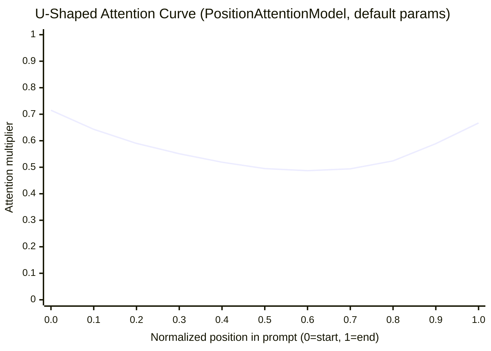
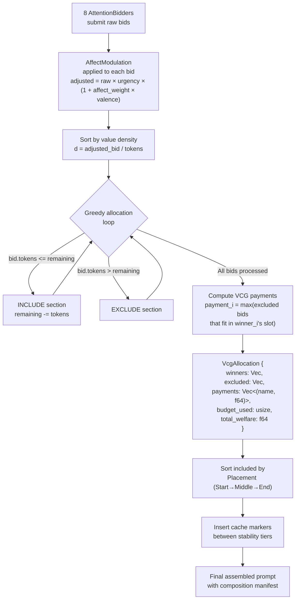
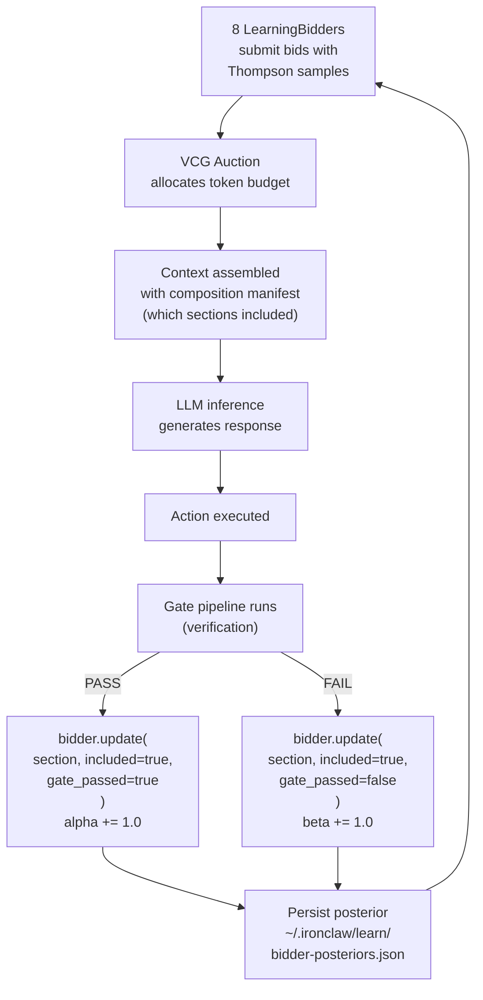
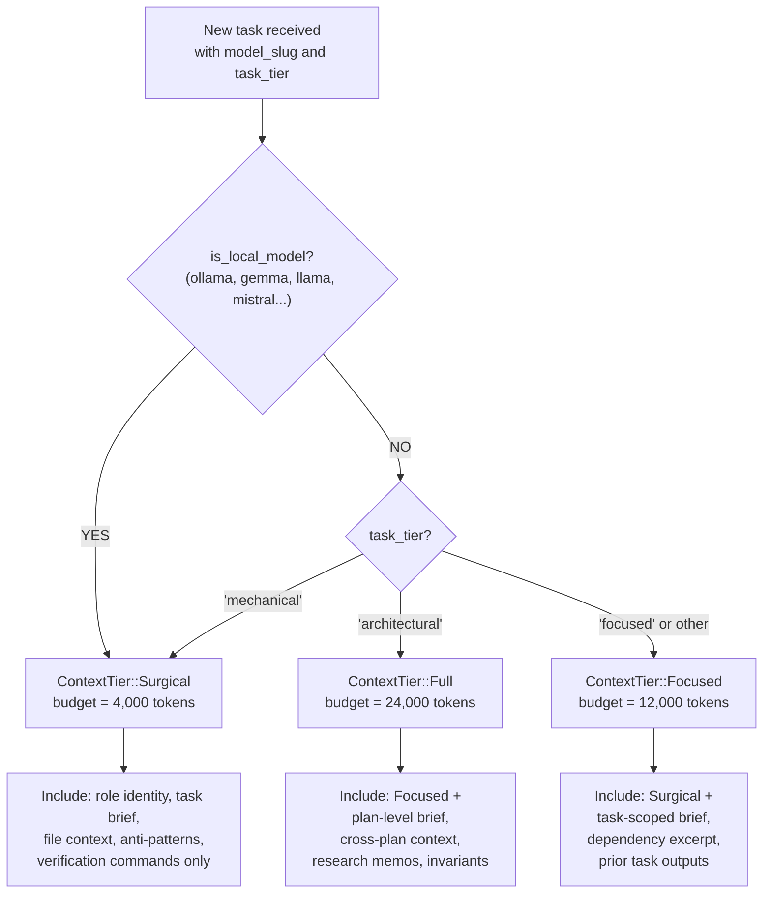
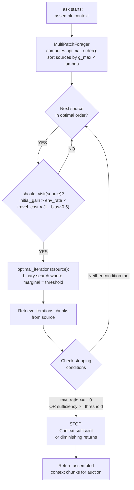

# Budget-Constrained Prompt Composition

**Source provenance**: `roko-compose` crate (`https://github.com/wpank/roko/blob/main/crates/roko-compose/src/`)
**Priority**: MEDIUM — enhances system prompt building and context management
**Key modules**: `prompt.rs`, `auction.rs`, `scorer.rs`, `budget.rs`, `system_prompt_builder.rs`, `attention.rs`, `foraging.rs`, `strategy.rs`, `context_provider.rs`, `budget_predictor.rs`, `cost_attribution.rs`

> **Boundary with code intelligence**: [Code Intelligence](code-intelligence.md) (section 11) produces `AssembledContext` — a ranked, token-estimated list of code slices selected from the symbol index. That is a *pre-budget* operation. This document describes the downstream step: the VCG auction that arbitrates between `AssembledContext` and other bidders (memory Engrams, skills, history, tools) for space in the final prompt.

---

## Table of Contents

1. [Introduction: What Is Prompt Composition?](#1-introduction)
2. [The U-Shaped Attention Curve: "Lost in the Middle"](#2-attention-curve)
3. [The 9-Layer System Prompt Builder](#3-system-prompt-builder)
4. [The PromptSection Type](#4-prompt-section)
5. [The 8 Attention Bidders](#5-attention-bidders)
6. [The VCG Auction Mechanism](#6-vcg-auction)
7. [Thompson Sampling Learning Bidders](#7-thompson-sampling)
8. [Composition Strategy: Auto-Selection](#8-composition-strategy)
9. [Context Tier Routing](#9-context-tiers)
10. [The PromptComposer: Full 11-Step Pipeline](#10-prompt-composer)
11. [Section Scoring: Goal-Directed Heuristic Scoring](#11-section-scoring)
12. [Expected Free Energy: Mathematical Formulation](#12-expected-free-energy)
13. [Multi-Patch Foraging with Active Inference](#13-foraging)
14. [Budget Prediction and Section Influence](#14-budget-prediction)
15. [Per-Section Cost Attribution](#15-cost-attribution)
16. [Conversation History Compaction](#16-compaction)
17. [Benchmarking and Quality Metrics](#17-benchmarking)
18. [Practical Examples: 8 Subsystems Competing for 12K Tokens](#18-practical-examples)
19. [IronClaw Integration Plan: Full Rust Implementation](#19-ironclaw-integration)
20. [Complexity Assessment](#20-complexity)
21. [Captured Source Identifier Reference](#21-source-reference)
22. [Academic Citations](#22-citations)

---

## 1. Introduction: What Is Prompt Composition? {#1-introduction}

Prompt composition is the process of assembling the text that gets sent to a large language model (LLM) before it generates a response. For a simple chatbot, this might be a system message plus user input. For an AI agent that writes code, manages projects, and coordinates with other agents, the prompt can contain dozens of distinct components:

- **Identity and role instructions** (who the agent is, safety rules, behavioral constraints)
- **Tool definitions** (schemas, usage instructions, rate limits)
- **Project conventions** (coding standards, naming patterns, architecture rules)
- **Task context** (what to do, acceptance criteria, verification commands)
- **Memory** (relevant past experiences, knowledge entries, heuristics)
- **Conversation history** (prior turns, user instructions, error feedback)
- **Skills and playbooks** (domain-specific techniques, learned strategies)
- **Coordination signals** (peer agent pheromones, dependency outputs)

When the total token cost of all these components exceeds the model's context window, the system must make triage decisions. Naive approaches — fixed priority ordering, round-robin, or truncating at the end — waste tokens on low-value content while starving high-value content of space. Worse, research shows that simply filling the context window degrades output quality because LLMs attend unevenly to content at different positions.

**Budget-constrained prompt composition** treats prompt assembly as a formal resource-allocation problem. Rather than ad hoc concatenation, it applies:

- **Mechanism design from economics** (VCG auctions) to allocate token budget across competing content sources
- **Online learning from statistics** (Thompson Sampling) to learn which content contributes to task success
- **Ecological foraging theory from biology** (Marginal Value Theorem) to decide when to stop retrieving context from each source
- **Active inference from computational neuroscience** (Expected Free Energy) to balance goal-directed inclusion with uncertainty-reducing exploration

The `roko-compose` crate implements this full pipeline. This document explains the theory, walks through the implementation, and maps it to IronClaw's existing architecture with complete Rust code.

---

## 2. The U-Shaped Attention Curve: "Lost in the Middle" {#2-attention-curve}

### 2.1 The Research Finding

Large language models attend unevenly to content at different positions in the prompt. Liu et al. (2024) demonstrate a U-shaped attention curve in their paper "Lost in the Middle: How Language Models Use Long Contexts": models attend most strongly to content at the **beginning** (primacy effect) and **end** (recency effect) of the context window, with significantly degraded attention to content in the **middle**.

This is not a minor effect. The degradation can be severe enough that a model shown 10 relevant documents performs worse at retrieval when the answer is in document 5 than when shown only a single relevant document. The middle of the context window is an attention dead zone.

> **Citation**: Liu, N. F., Lin, K., Hewitt, J., Paranjape, A., Bevilacqua, M., Petroni, F., & Liang, P. (2024). Lost in the Middle: How Language Models Use Long Contexts. *Transactions of the Association for Computational Linguistics*, 12, 157-173. [ACL Anthology](https://aclanthology.org/2024.tacl-1.9/)

### 2.2 The PositionAttentionModel (Full Implementation)

The `PositionAttentionModel` struct models this U-shaped curve explicitly:

```rust
// https://github.com/wpank/roko/blob/main/crates/roko-compose/src/attention.rs (lines 14-26)

/// Attention multiplier based on position within a context window.
///
/// This is the scaffold-level model described in the composition docs for
/// approximating the U-shaped "lost in the middle" curve.
#[derive(Clone, Debug, PartialEq, Serialize, Deserialize)]
pub struct PositionAttentionModel {
    /// Primacy contribution at the beginning of the prompt.
    pub primacy_weight: f64,      // default: 0.35
    /// Decay applied to the primacy contribution as position increases.
    pub primacy_decay: f64,       // default: 3.0
    /// Recency contribution near the end of the prompt.
    pub recency_weight: f64,      // default: 0.30
    /// Decay applied to the recency contribution as position approaches zero.
    pub recency_decay: f64,       // default: 3.0
    /// Baseline attention that remains across the full prompt.
    pub baseline: f64,            // default: 0.35
}

impl PositionAttentionModel {
    /// Compute the attention multiplier at normalized position p in [0.0, 1.0].
    ///
    /// p = 0.0 is the start of the prompt (primacy zone).
    /// p = 1.0 is the end of the prompt (recency zone).
    /// Values in between exhibit the U-shaped trough.
    pub fn attention_at(&self, p: f64) -> f64 {
        let primacy = self.primacy_weight * (-self.primacy_decay * p).exp();
        let recency = self.recency_weight * (-self.recency_decay * (1.0 - p)).exp();
        (primacy + recency + self.baseline).clamp(0.0, 1.0)
    }
}
```

The attention at normalized position `p` (0.0 = start, 1.0 = end) is:

```
attention(p) = primacy_weight * exp(-primacy_decay * p)
             + recency_weight * exp(-recency_decay * (1 - p))
             + baseline
```

**Worked example** with default parameters:

| Position | Primacy term | Recency term | Baseline | Total | Interpretation |
|----------|-------------|-------------|----------|-------|----------------|
| p = 0.0 (start) | 0.35 * exp(0) = 0.350 | 0.30 * exp(-3) = 0.015 | 0.35 | 0.715 | High attention (primacy) |
| p = 0.25 | 0.35 * exp(-0.75) = 0.165 | 0.30 * exp(-2.25) = 0.032 | 0.35 | 0.547 | Declining |
| p = 0.5 (middle) | 0.35 * exp(-1.5) = 0.078 | 0.30 * exp(-1.5) = 0.067 | 0.35 | 0.495 | Attention trough |
| p = 0.75 | 0.35 * exp(-2.25) = 0.037 | 0.30 * exp(-0.75) = 0.142 | 0.35 | 0.529 | Rising |
| p = 1.0 (end) | 0.35 * exp(-3) = 0.017 | 0.30 * exp(0) = 0.300 | 0.35 | 0.667 | High attention (recency) |

### 2.3 Attention Curve Visualization



The curve shows the primacy peak at the start (0.715), the trough at middle (0.495 — a 31% drop), and the recency peak at the end (0.667). **Implication**: place critical content at start or end; never put must-read content in the middle.

### 2.4 Placement Zones

Three placement zones exploit the U-shaped curve:

```rust
// https://github.com/wpank/roko/blob/main/crates/roko-compose/src/prompt.rs (lines 63-78)

/// Where in the final prompt the section should be placed.
pub enum Placement {
    /// Place near the top (role prompt, critical instructions).
    Start,
    /// Middle -- most vulnerable to attention loss.
    Middle,
    /// Place near the bottom (current task, recent errors).
    End,
}
```

Placement affects effective scores with constant multipliers:

```rust
// https://github.com/wpank/roko/blob/main/crates/roko-compose/src/attention.rs (lines 84-92)

pub const fn placement_adjusted_score(base_score: f64, placement: Placement) -> f64 {
    match placement {
        Placement::Start  => base_score,         // 1.00x -- full attention zone
        Placement::End    => base_score * 0.95,  // 0.95x -- strong attention zone
        Placement::Middle => base_score * 0.70,  // 0.70x -- attention dead zone
    }
}
```

**Design rationale**: Start gets 1.0x because the primacy effect is strongest. End gets 0.95x (nearly as good) because the recency effect is strong. Middle gets 0.70x — a 30% penalty reflecting the measured attention degradation from Liu et al.

### 2.5 Dynamic Placement and Per-Model Curves

The `dynamic_placement()` function automatically reassigns non-critical sections to higher-attention positions based on relevance to the current query. Sections are ranked by an information-density proxy (term overlap with query, content uniqueness, compactness): the top third goes to Start, the bottom third to End, and the remaining third stays in Middle.

The `ModelAttentionCurves` struct stores per-model fitted parameters:

```rust
// https://github.com/wpank/roko/blob/main/crates/roko-compose/src/attention.rs (lines 58-64)

pub struct ModelAttentionCurves {
    /// Model id to fitted curve mapping.
    pub curves: HashMap<String, PositionAttentionModel>,
    /// Fallback curve used when a model-specific fit is unavailable.
    pub default_curve: PositionAttentionModel,
}
```

This allows the system to use Claude-specific attention parameters when calling Claude, GPT-specific parameters when calling GPT, and so on. Different models have measurably different attention profiles.

---

## 3. The 9-Layer System Prompt Builder {#3-system-prompt-builder}

### 3.1 Architecture

The `SystemPromptBuilder` assembles system prompts from 9 distinct layers, each targeting a different stability tier for LLM prefix-cache optimization. It uses a fluent API:

```rust
// https://github.com/wpank/roko/blob/main/crates/roko-compose/src/system_prompt_builder.rs

let prompt = SystemPromptBuilder::new("You are an implementer...")
    .with_conventions("Use snake_case, thiserror for errors")
    .with_domain("DeFi protocol context: ...")
    .with_task("Implement the rate limiter in crates/golem-core")
    .with_tools("MCP tools available: Read, Write, Bash")
    .with_anti_patterns(vec!["Never call unwrap in library crates"])
    .build();
```

### 3.2 The 9 Layers and Their Cache Behavior

| Layer | Content | Cache Tier | Stability |
|-------|---------|------------|-----------|
| **1. Role identity** | Who am I, what's my job | System (stable) | Changes only when agent role changes. Cached across all tasks for a given role. |
| **2. Conventions** | Project coding standards | System (semi-stable) | Changes when project conventions are updated. Cached across tasks within one project. |
| **3. Domain context** | Project-specific knowledge | Session (semi-stable) | Broader project knowledge injected once per session. Cached across tasks within one plan. |
| **3c. Active signals** | Pheromone / stigmergic guidance | Session (semi-stable) | Coordination signals from peer agents. |
| **4. Task context** | Current task details | Task (volatile) | The actual task brief, acceptance criteria, verification commands. Changes every task. |
| **4b. Gate feedback** | Prior verification failure digest | Dynamic | Retry-specific guidance from previous gate failures. Only present on retries. |
| **5. Tool instructions** | Available tools and usage | System (stable) | Tool definitions rarely change mid-session. |
| **6. Relevant techniques** | Learned playbooks and skills | Task (volatile) | Selected per-task from the skill/playbook library. |
| **7. Anti-patterns** | What NOT to do | Task (volatile) | Warnings and negative examples specific to the current task. |
| **8. Affect guidance** | Emotional tone and focus | Dynamic | PAD (Pleasure-Arousal-Dominance) derived tone guidance. |

### 3.3 Cache Layer Tiers

```rust
// https://github.com/wpank/roko/blob/main/crates/roko-compose/src/prompt.rs (lines 45-61)

pub enum CacheLayer {
    /// System prompt, role instructions, tool definitions.
    Role = 0,       // Most stable -- cached longest
    /// Workspace map, cross-plan context, durable project context.
    Workspace = 1,  // Semi-stable -- cached across tasks in a plan
    /// Plan/task brief content that is stable within a plan.
    Plan = 2,       // Per-plan -- cached within one task sequence
    /// Turn-local content such as review feedback or error output.
    Volatile = 3,   // Per-turn -- never cached
}
```

Sections are emitted in cache-layer order (Role first, Volatile last), with cache alignment markers (`<!-- cache:TIER -->`) placed between stability tiers. This enables downstream API callers to set `cache_control` breakpoints so the LLM provider reuses the longest possible KV-cache prefix across related turns.

```rust
// https://github.com/wpank/roko/blob/main/crates/roko-compose/src/budget.rs (lines 128-133)

// Cache break hints: insert breaks after stable layers so the LLM
// prefix cache can reuse the system/session prefix across turns.
let cache_breaks = vec![
    "conventions",   // end of System layer
    "workspace_map", // end of Session layer
    "file_context",  // end of Task layer
];

pub fn cache_marker(layer_name: &str) -> String {
    format!("<!-- cache:{layer_name} -->")
}
```

---

## 4. The PromptSection Type {#4-prompt-section}

Every piece of content that could appear in a prompt is represented as a `PromptSection`:

```rust
// https://github.com/wpank/roko/blob/main/crates/roko-compose/src/prompt.rs (lines 104-119)

pub struct PromptSection {
    /// Stable section identifier. Defaults to `prompt:<normalized name>`.
    pub section_id: String,
    /// Human-readable label (e.g. "role", "task", "workspace_map").
    pub name: String,
    /// The section's text content.
    pub content: String,
    /// Priority for budget-pressure dropping.
    pub priority: SectionPriority,
    /// Cache layer for LLM prefix-cache optimization.
    pub cache_layer: CacheLayer,
    /// Where in the final prompt to place this section.
    pub placement: Placement,
    /// Optional per-section token ceiling.
    pub hard_cap: Option<usize>,
    /// Which subsystem is bidding for this section's inclusion.
    pub bidder: AttentionBidder,
    /// Source metadata for attribution and learning.
    pub source_type: Option<String>,
    pub source_id: Option<String>,
    pub provenance: Option<String>,
    pub experiment_id: Option<String>,
}
```

### 4.1 Priority Levels

```rust
// https://github.com/wpank/roko/blob/main/crates/roko-compose/src/prompt.rs (lines 31-43)

pub enum SectionPriority {
    /// Drop first under pressure (fluff, historical context).
    Low = 0,
    /// Keep if possible (conventions, hints).
    Normal = 1,
    /// Essential to the task (the actual task, acceptance criteria).
    High = 2,
    /// Never drop (role instructions, safety hooks).
    Critical = 3,
}
```

**Critical sections are contractually guaranteed inclusion.** The composer returns an error rather than silently dropping a Critical section. This ensures safety rules and role identity are always present.

### 4.2 Token Estimation

```rust
// https://github.com/wpank/roko/blob/main/crates/roko-compose/src/prompt.rs (lines 23-26)

pub const fn estimate_tokens(text: &str) -> usize {
    text.len().div_ceil(4)
}
```

This approximation (4 bytes per token) is adequate for budget accounting. For precise counting, the `TokenCounter` module supports tiktoken (for OpenAI/Claude models), HuggingFace tokenizers, and a heuristic fallback. Claude averages approximately 3.5 chars/token on code-heavy prompts.

---

## 5. The 8 Attention Bidders {#5-attention-bidders}

Each prompt section belongs to a cognitive subsystem that "bids" for its inclusion:

```rust
// https://github.com/wpank/roko/blob/main/crates/roko-compose/src/prompt.rs (lines 80-101)

pub enum AttentionBidder {
    /// Durable knowledge retrieved from Neuro.
    Neuro,
    /// Affect or somatic guidance from Daimon.
    Daimon,
    /// Recent turns, retries, and prior task outputs.
    IterationMemory,
    /// Symbols, files, and structural workspace context.
    CodeIntelligence,
    /// Skills, playbooks, and distilled reusable rules.
    PlaybookRules,
    /// Research memos and external domain context.
    Research,
    /// Task brief, plan brief, verification, PRD slices, and related directives.
    TaskContext,
    /// Predictions, warnings, or forecast-like oracle outputs.
    Oracles,
}
```

| Bidder | What It Provides | Typical Bid Range | Bids High When |
|--------|-----------------|-------------------|----------------|
| **Neuro** | Knowledge store entries (insights, heuristics, warnings) | 0.3-0.8 | High similarity to current task |
| **Daimon** | Affect-tagged memories (prospect markers, PAD annotations) | 0.2-0.6 | High arousal or strong prior association |
| **IterationMemory** | Recent turn history within current task | 0.4-0.7 | Multi-turn task with cumulative context |
| **CodeIntelligence** | Symbols, files, structural workspace context | 0.3-0.7 | Task requires specific file/symbol knowledge |
| **PlaybookRules** | Machine-evolved rules from dream consolidation | 0.5-0.9 | Rule condition matches current situation |
| **Research** | Research memos and external domain context | 0.3-0.7 | Task is in an unfamiliar domain |
| **TaskContext** | Task brief, acceptance criteria, verification | 0.6-0.9 | Task is well-defined with clear verification |
| **Oracles** | Predictions, warnings, forecast-like outputs | 0.1-0.4 | Oracle has high confidence on relevant prediction |

**IronClaw mapping**:

| AttentionBidder | IronClaw Source |
|-----------------|----------------|
| Neuro | `workspace/` memory docs (Lessons, Skills, Insights) |
| IterationMemory | `executor/context.rs` — retrieved `MemoryDoc` via `RetrievalEngine` |
| CodeIntelligence | Progressive tool disclosure; file/symbol context |
| PlaybookRules | Active skills from `skills/` system |
| TaskContext | Thread goal, `CODEACT_PREAMBLE`, capabilities |
| Research | Future: external research memo injection |
| Daimon | N/A (no PAD system in IronClaw) |
| Oracles | Future: prediction/warning injection |

---

## 6. The VCG Auction Mechanism {#6-vcg-auction}

### 6.1 Background: Why an Auction?

When total content exceeds the token budget, the system must decide which sections to include. This is a classic resource-allocation problem with competing demands. The Vickrey-Clarke-Groves (VCG) auction provides a mathematically proven property: **truthful bidding is the dominant strategy**.

In a VCG auction, each bidder's payment equals the **externality** they impose on other bidders — the total value others lost because this bidder was included. This means:

- No bidder can increase its allocation by inflating its bid (inflating forces higher payments without additional allocation).
- Each bidder's optimal strategy is to report its true value.
- The mechanism maximizes total social welfare (the sum of all included sections' values).

> **Citations**:
> - Vickrey, W. (1961). Counterspeculation, Auctions, and Competitive Sealed Tenders. *The Journal of Finance*, 16(1), 8-37. [Wiley](https://onlinelibrary.wiley.com/doi/abs/10.1111/j.1540-6261.1961.tb02789.x)
> - Clarke, E. H. (1971). Multipart Pricing of Public Goods. *Public Choice*, 11, 17-33.
> - Groves, T. (1973). Incentives in Teams. *Econometrica*, 41(4), 617-631.

### 6.2 The VCG Allocation Algorithm (Full Implementation)

```rust
// https://github.com/wpank/roko/blob/main/crates/roko-compose/src/auction.rs (lines 380-501)

/// Allocate context window tokens using a greedy VCG-style mechanism.
///
/// Bids are sorted by `adjusted_bid / tokens` (value density). Sections
/// are included greedily until the budget is exhausted. VCG payments are
/// computed as the externality each winner imposes on others.
pub fn vcg_allocate(
    bids: Vec<VcgBid>,
    total_budget: usize,
    modulation: &AffectModulation,
) -> VcgAllocation {
    // Step 0: Apply affect modulation to raw bids
    let mut sorted: Vec<VcgBid> = bids
        .into_iter()
        .map(|mut bid| {
            bid.adjusted_bid = modulation.adjust_bid(bid.raw_bid, bid.valence);
            bid
        })
        .collect();

    // Step 1: Sort by value density (adjusted_bid / tokens), descending
    sorted.sort_by(|a, b| {
        let density_a = if a.tokens > 0 {
            a.adjusted_bid / a.tokens as f64
        } else {
            f64::INFINITY
        };
        let density_b = if b.tokens > 0 {
            b.adjusted_bid / b.tokens as f64
        } else {
            f64::INFINITY
        };
        density_b.partial_cmp(&density_a).unwrap_or(std::cmp::Ordering::Equal)
    });

    // Step 2: Greedy allocation
    let mut remaining = total_budget;
    let mut winners = Vec::new();
    let mut excluded = Vec::new();
    for bid in sorted {
        if bid.tokens <= remaining {
            remaining -= bid.tokens;
            winners.push(bid);
        } else {
            excluded.push(bid);
        }
    }

    // Step 3: Compute VCG payments (externality each winner imposes)
    let mut payments = Vec::new();
    for winner in &winners {
        // Payment = highest excluded bid that would fit in winner's token slot
        let payment = excluded
            .iter()
            .filter(|e| e.tokens <= winner.tokens)
            .map(|e| e.adjusted_bid)
            .fold(0.0_f64, f64::max);
        payments.push((winner.section_name.clone(), payment));
    }

    VcgAllocation {
        winners,
        excluded,
        payments,
        budget_used: total_budget - remaining,
        budget_remaining: remaining,
        total_welfare: winners.iter().map(|w| w.adjusted_bid).sum(),
    }
}
```

### 6.3 VCG Auction Flow Diagram



### 6.4 Full Mathematical Formulation

Given:
- A set of bids B = {b_1, b_2, ..., b_n} where each b_i = (v_i, t_i) with value v_i and token cost t_i
- A total budget T

**Value density** for bid i:

```
d_i = v_i / t_i
```

**Greedy allocation**: Sort bids by d_i descending. Include bid i if:

```
sum(t_j for all previously included j) + t_i <= T
```

Let W = set of winners, E = set of excluded bids.

**VCG payment** for winner i:

```
p_i = max{v_j : j in E, t_j <= t_i}
```

**Total welfare** = sum of all winners' adjusted bids.

**Pareto optimality check**: An allocation is Pareto-optimal if no swap of an included section for an excluded section can improve total welfare:

```rust
// https://github.com/wpank/roko/blob/main/crates/roko-compose/src/auction.rs (lines 226-244)

pub fn is_pareto_optimal(
    included: &[SectionAllocation],
    excluded: &[SectionAllocation],
    budget_remaining: usize,
) -> bool {
    for excluded_section in excluded {
        if excluded_section.tokens <= budget_remaining {
            return false; // could add more without removing anything
        }
        for included_section in included {
            if included_section.value < excluded_section.value
                && included_section.tokens >= excluded_section.tokens
            {
                return false; // swap would improve welfare
            }
        }
    }
    true
}
```

### 6.5 Worked Example: VCG Auction in Action

Suppose the token budget is 800 tokens and three subsystems submit bids:

| Section | Bidder | Tokens | Adjusted Bid | Value Density |
|---------|--------|--------|-------------|---------------|
| **knowledge** | Neuro | 500 | 0.8 | 0.0016 |
| **task** | TaskContext | 300 | 0.6 | 0.0020 |
| **research** | Research | 400 | 0.4 | 0.0010 |

**Step 1 — Sort by value density**: task (0.0020) > knowledge (0.0016) > research (0.0010)

**Step 2 — Greedy allocation**:
1. Include **task** (300 tokens). Remaining: 800 - 300 = 500 tokens.
2. Include **knowledge** (500 tokens). Remaining: 500 - 500 = 0 tokens.
3. Exclude **research** (400 tokens > 0 remaining).

**Winners**: {task, knowledge} using 800/800 tokens (100% utilization).
**Excluded**: {research}.

**Step 3 — VCG payments**:
- Payment for **task** (300 tokens): max excluded bid where tokens <= 300. Research has 400 tokens > 300, so no eligible excluded bid. Payment = 0.
- Payment for **knowledge** (500 tokens): max excluded bid where tokens <= 500. Research has 400 <= 500, bid = 0.4. Payment = 0.4.

**Interpretation**: Knowledge's VCG payment of 0.4 means it displaced research (which had value 0.4). If knowledge's true value were below 0.4, it would not be worth including — it would "pay more than it's worth." This incentivizes truthful value reporting.

### 6.6 Affect Modulation (Full Implementation)

```rust
// https://github.com/wpank/roko/blob/main/crates/roko-compose/src/auction.rs (lines 292-336)

pub struct AffectModulation {
    /// Arousal-derived urgency multiplier (default 1.0, range [0.5, 2.0]).
    pub urgency_multiplier: f64,
    /// Pleasure-derived valence bias (range [-1.0, 1.0]).
    pub affect_weight: f64,
}

impl AffectModulation {
    pub fn from_pad(pleasure: f64, arousal: f64) -> Self {
        Self {
            urgency_multiplier: (1.0 + arousal * 0.5).clamp(0.5, 2.0),
            affect_weight: pleasure.clamp(-1.0, 1.0),
        }
    }

    pub fn adjust_bid(&self, base_bid: f64, entry_valence: f64) -> f64 {
        let valence = entry_valence.clamp(-1.0, 1.0);
        base_bid * self.urgency_multiplier * (1.0 + self.affect_weight * valence)
    }
}
```

**Worked example**: Agent is struggling (pleasure = -0.4, arousal = 0.8):
- `urgency_multiplier` = 1.0 + 0.8 * 0.5 = 1.4 (everything gets 40% more budget)
- `affect_weight` = -0.4
- A warning section (valence = -0.7): adjusted_bid = base * 1.4 * (1 + (-0.4) * (-0.7)) = base * 1.4 * 1.28 = base * 1.792 (79% boost)
- A success pattern (valence = 0.8): adjusted_bid = base * 1.4 * (1 + (-0.4) * 0.8) = base * 1.4 * 0.68 = base * 0.952 (5% penalty)

When struggling, the system naturally up-weights warnings and down-weights optimistic content.

### 6.7 Auction Diagnostics

```rust
// https://github.com/wpank/roko/blob/main/crates/roko-compose/src/auction.rs (lines 173-189)

pub struct AuctionDiagnostics {
    pub total_welfare: f64,
    pub total_payments: f64,
    pub welfare_loss: f64,
    pub pareto_optimal: bool,
    pub highest_payment_sections: Vec<(String, f64)>,
    pub displaced_sections: Vec<(String, f64)>,
    pub budget_utilization: f64,
}
```

---

## 7. Thompson Sampling Learning Bidders {#7-thompson-sampling}

### 7.1 The Learning Problem

Static bidding is suboptimal because the value of a section depends on the task. A section on "database optimization" is high-value for a SQL task but low-value for a CSS task. The system needs to *learn* which sections contribute to task success and adjust bids accordingly.

> **Citations**:
> - Thompson, W. R. (1933). On the Likelihood that One Unknown Probability Exceeds Another in View of the Evidence of Two Samples. *Biometrika*, 25(3-4), 285-294.
> - Agrawal, S. & Goyal, N. (2012). Analysis of Thompson Sampling for the Multi-armed Bandit Problem. *Proceedings of the 25th Annual Conference on Learning Theory (COLT)*. [PMLR](http://proceedings.mlr.press/v23/agrawal12/agrawal12.pdf)

### 7.2 The LearningBidder (Full Implementation)

```rust
// https://github.com/wpank/roko/blob/main/crates/roko-compose/src/auction.rs (lines 31-170)

pub struct LearningBidder {
    /// Subsystem this bidder represents.
    pub subsystem_id: SubsystemId,
    /// Beta-posterior parameters keyed by section name.
    /// (alpha, beta) — initialized to (1.0, 1.0) Bayes-Laplace prior.
    pub section_betas: HashMap<String, (f64, f64)>,
    /// Cost-effectiveness observations keyed by section name.
    pub section_costs: HashMap<String, SectionCostStats>,
    /// Prior value used before any observations are recorded.
    pub prior_bid: f64,
}

impl LearningBidder {
    /// Compute bid for a section given its relevance to the current task.
    pub fn bid(&self, section_name: &str, relevance: f64) -> f64 {
        let (alpha, beta) = self
            .section_betas
            .get(section_name)
            .copied()
            .unwrap_or((1.0, 1.0));
        let sampled_track_record = thompson_like_sample(section_name, alpha, beta);
        sampled_track_record * relevance.max(0.0) * self.prior_bid.max(0.0)
    }

    /// Update posterior after observing gate outcome.
    pub fn update(&mut self, section_name: &str, included: bool, gate_passed: bool) {
        if !included { return; }  // only update for observed inclusions
        let entry = self.section_betas
            .entry(section_name.to_string())
            .or_insert((1.0, 1.0));
        if gate_passed {
            entry.0 += 1.0;  // alpha += 1: success observation
        } else {
            entry.1 += 1.0;  // beta += 1: failure observation
        }
    }

    /// Bid adjusted for cost-effectiveness.
    pub fn bid_with_cost(&self, section_name: &str, relevance: f64) -> f64 {
        self.bid(section_name, relevance) * self.cost_effectiveness_factor(section_name)
    }

    fn cost_effectiveness_factor(&self, section_name: &str) -> f64 {
        let Some(stats) = self.section_costs.get(section_name) else {
            return 1.0;  // no data yet, neutral factor
        };
        if stats.observation_count < 3 || stats.total_tokens == 0 {
            return 1.0;  // not enough data
        }
        let pass_rate = stats.passes as f64 / stats.observation_count as f64;
        let cost_per_1k_tokens =
            stats.total_cost_usd.max(0.0) / stats.total_tokens as f64 * 1000.0;
        let cost_efficiency = 1.0 / (1.0 + cost_per_1k_tokens);
        let quality = (0.7 * pass_rate + 0.3 * cost_efficiency).clamp(0.0, 1.0);
        (0.5 + quality * 1.5).clamp(0.5, 2.0)
    }
}

/// Deterministic Thompson-style sample from Beta(alpha, beta).
///
/// Uses section_name hash as a stable "random" offset rather than
/// stochastic sampling to ensure reproducible test behavior while
/// still capturing the exploration-exploitation tradeoff.
fn thompson_like_sample(section_name: &str, alpha: f64, beta: f64) -> f64 {
    let total = (alpha + beta).max(f64::EPSILON);
    let mean = alpha / total;
    let variance =
        (alpha * beta) / (total.powi(2) * (total + 1.0)).max(f64::EPSILON);
    let spread = variance.sqrt();
    let centered_unit = hash_to_unit(section_name) * 2.0 - 1.0;
    (mean + centered_unit * spread).clamp(0.0, 1.0)
}
```

### 7.3 Beta-Distribution Posterior

Each section has parameters `(alpha, beta)` initialized to `(1.0, 1.0)` (the Bayes-Laplace uniform prior). After each task:

- If the section was included and the downstream gate **passed**: `alpha += 1.0`
- If the section was included and the downstream gate **failed**: `beta += 1.0`

The posterior mean `alpha / (alpha + beta)` estimates the probability that including this section leads to task success.

**Posterior moments for Beta(alpha, beta)**:

```
Posterior mean:     mu      = alpha / (alpha + beta)
Posterior variance: sigma^2 = (alpha * beta) / ((alpha + beta)^2 * (alpha + beta + 1))
```

The deterministic sample:

```
sample = mu + hash_offset * sqrt(sigma^2)
```

where `hash_offset` is a deterministic pseudo-random value in [-1, 1] derived from hashing the section name.

### 7.4 Worked Example: Learning Over Time

**After 8 gate passes and 2 gate failures** for a section:

```
alpha = 1 + 8 = 9,  beta = 1 + 2 = 3
mu = 9/12 = 0.75
sigma^2 = (9 * 3) / (144 * 13) = 27/1872 = 0.0144
sigma = 0.120

If hash_offset = 0.3:
sample = 0.75 + 0.3 * 0.120 = 0.786
```

**Compare with a section that has only 1 pass and 1 failure** (cold start):

```
alpha = 2, beta = 2
mu = 0.5
sigma^2 = (4) / (16 * 5) = 0.05
sigma = 0.224

sample = 0.5 + 0.3 * 0.224 = 0.567
```

The well-observed successful section (0.786) bids much higher than the uncertain section (0.567). Over time, as more observations accumulate, the variance shrinks, and the sample converges to the mean — the system "locks in" on its learned estimates.

### 7.5 The Complete Feedback Loop



---

## 8. Composition Strategy: Auto-Selection {#8-composition-strategy}

### 8.1 Three Strategies

```rust
// https://github.com/wpank/roko/blob/main/crates/roko-compose/src/strategy.rs (lines 13-26)

pub enum CompositionStrategy {
    /// Select Vcg once learned bidder observations are warm;
    /// otherwise use the deterministic density-greedy path.
    Auto,         // default
    /// Deterministic greedy allocation by score density.
    DensityGreedy,
    /// Backward-compatible alias for density-greedy allocation.
    WeightedSum,
    /// VCG-style allocation with payments and displacement diagnostics.
    Vcg,
}
```

### 8.2 Auto Strategy Resolution

```rust
// https://github.com/wpank/roko/blob/main/crates/roko-compose/src/strategy.rs (lines 48-58)

pub const DEFAULT_VCG_WARMUP_OBSERVATIONS: u32 = 10;

pub fn auto_select(
    bidder_observations: &HashMap<AttentionBidder, u32>,
    warmup_observations: u32,
) -> Self {
    let min_obs = bidder_observations.values().copied().min().unwrap_or(0);
    if min_obs >= warmup_observations {
        Self::Vcg
    } else {
        Self::DensityGreedy
    }
}
```

**Rationale**: VCG payments and affect modulation are only meaningful when the learning bidders have enough history to produce informed bids. During cold-start (first 10 observations per bidder), the deterministic density-greedy path is more stable. Once all bidders have warmed up, VCG provides better allocation through its truthful-bidding guarantees.

---

## 9. Context Tier Routing {#9-context-tiers}

### 9.1 Three Tiers

```rust
// https://github.com/wpank/roko/blob/main/crates/roko-compose/src/context_provider.rs (lines 38-75)

pub enum ContextTier {
    Surgical,  // ~4,000 tokens  — local models, mechanical tasks
    Focused,   // ~12,000 tokens — standard tasks (Sonnet-class)
    Full,      // ~24,000 tokens — architectural tasks (Opus-class)
}

impl ContextTier {
    pub fn from_task_and_model(task_tier: &str, model_slug: &str) -> Self {
        if is_local_model(model_slug) {
            return Self::Surgical;
        }
        match task_tier {
            "mechanical"    => Self::Surgical,
            "architectural" => Self::Full,
            _               => Self::Focused,
        }
    }

    pub const fn default_token_budget(self) -> usize {
        match self {
            Self::Surgical => 4_000,
            Self::Focused  => 12_000,
            Self::Full     => 24_000,
        }
    }
}
```

| Tier | Token Budget | Model Targets | What Gets Included |
|------|-------------|---------------|-------------------|
| **Surgical** | ~4,000 | Haiku, Ollama, Gemma — mechanical tasks | Inline files, symbol signatures, anti-patterns, verification only. No enrichment artifacts, no plan context. |
| **Focused** | ~12,000 | Sonnet — focused/integrative tasks | Surgical + task-scoped brief, dependency graph excerpt, prior task outputs. |
| **Full** | ~24,000 | Opus — architectural tasks | Focused + plan-level brief, cross-plan context, research memo, invariants/rubric. |

### 9.2 Context Tier Routing Decision Tree



### 9.3 Complexity-Adaptive Budget Scaling

```rust
// https://github.com/wpank/roko/blob/main/crates/roko-compose/src/budget.rs (lines 84-142)

pub enum Complexity {
    /// Single-file, trivial change. Drop PRD, research, decomposition sections.
    Trivial,
    /// Standard multi-file task. Full budget at role defaults.
    Standard,
    /// Cross-crate or architectural work. Inflated budgets for context.
    Complex,
}
```

Adjustments from `adjusted_budget_from_base()`:

- **Trivial**: Zero out `prd2`, `context`, and `skills` sections. Halve `workspace_map` and `brief`.
- **Standard**: Use the base budget as-is.
- **Complex**: Inflate `workspace_map` by 50%, `context` by 100%, `file_context` by 50%.

---

## 10. The PromptComposer: Full 11-Step Pipeline {#10-prompt-composer}

### 10.1 Overview

The `PromptComposer` implements the `Compose` trait. It takes a set of `Signal<PromptSection>` inputs, a `Budget`, a `Scorer`, and a `Context`, and produces a single `Signal<Prompt>` output.

### 10.2 The 11-Step Pipeline

```mermaid
flowchart TD
    S1["STEP 1: Decode\nDecode all input sections\nfrom signal bodies.\nDrop any that fail to decode\n(provenance-tainted or wrong kind)."] --> S2
    S2["STEP 2: Partition\nSplit into Critical (never drop)\nand Optional sections.\nCritical sections are guaranteed\nregardless of budget."] --> S3
    S3["STEP 3: Budget check\nIf Critical sections alone exceed\nthe budget, return an error.\nSafety rules must never be silently dropped."] --> S4
    S4["STEP 4: Score\nCompute bid density for each\nOptional section:\nbid = score × learned_multiplier\ndensity = bid / estimated_tokens"] --> S5
    S5["STEP 5: Dedup (COMP-04)\nIf HDC dedup is enabled,\nremove near-duplicate candidates\n(cosine similarity > threshold).\nPrevent redundant token usage."] --> S6
    S6["STEP 6: Forage (COMP-03)\nIf MultiPatchForager is configured,\napply MVT stopping rule\nto limit candidates per source.\nPrevent over-retrieval from one source."] --> S7
    S7["STEP 7: Select strategy\nResolve Auto to DensityGreedy\nor Vcg based on bidder warmth.\n(min_obs >= 10 → Vcg, else → DensityGreedy)"] --> S8
    S8["STEP 8: Apply diversity\nFirst section from each bidder: ×1.18\nSubsequent sections: ×0.82^n\nPrevents budget monopolization."] --> S9
    S9["STEP 9: Allocate\nRun selected strategy to pick\nwinners within remaining budget.\nGenerate VcgAllocation with\npayments and diagnostics."] --> S10
    S10["STEP 10: Sort by placement\nOrder kept sections:\nStart → Middle → End\nTies broken by cache layer."] --> S11
    S11["STEP 11: Render\nConcatenate with optional headers.\nInsert cache break markers\nbetween stability tiers.\nBuild CompositionManifest metadata."]
```



### 10.3 The Bid Pipeline

For each Optional section, the bid value is:

```
bid_value = score × learned_multiplier

where:
  score = candidate_score(section, source_signal, scorer, ctx)
  learned_multiplier = learning_bidders[section.bidder].bid_with_cost(section.name, 1.0)

bid_density = bid_value / estimated_tokens
```

### 10.4 Diversity Boost and Diminishing Returns (Full Implementation)

```rust
// https://github.com/wpank/roko/blob/main/crates/roko-compose/src/prompt.rs

fn effective_candidate_bid(
    candidate: &AuctionCandidate<'_>,
    bidder_wins: &HashMap<AttentionBidder, usize>,
    affect: Option<&AuctionAffectState>,
) -> f32 {
    let bidder = candidate.section.bidder;
    let wins = bidder_wins.get(&bidder).copied().unwrap_or(0);
    // First section from a bidder gets 18% bonus for diversity
    let diversity_boost = if wins == 0 { 1.18 } else { 1.0 };
    // Each additional section from same bidder is worth 18% less
    let diminishing_returns = 0.82_f32.powi(wins as i32);
    let affect_multiplier = bidder_affect_multiplier(&candidate.section, affect);
    candidate.bid_density * diversity_boost * diminishing_returns * affect_multiplier
}
```

**Worked example**: Neuro subsystem submits 4 sections with base bid_density = 1.0:

| Section # | Diversity | Diminishing | Effective |
|-----------|-----------|-------------|-----------|
| 1st | 1.18 | 0.82^0 = 1.000 | 1.180 |
| 2nd | 1.00 | 0.82^1 = 0.820 | 0.820 |
| 3rd | 1.00 | 0.82^2 = 0.672 | 0.672 |
| 4th | 1.00 | 0.82^3 = 0.551 | 0.551 |

By the 4th section, Neuro's effective bid is less than half the 1st section's. This ensures other subsystems get budget space.

### 10.5 Composition Manifest

Every composition produces a `CompositionManifest` recording:

- Strategy requested vs. strategy actually used
- Included sections with section_id, action_id, bidder, estimated tokens, score, bid value, VCG payment
- Excluded sections with the same metadata
- VCG diagnostics (when VCG was selected)
- Total tokens and budget limit

This manifest enables downstream learning systems to correlate section inclusion with task outcomes.

---

## 11. Section Scoring: Goal-Directed Heuristic Scoring {#11-section-scoring}

### 11.1 The SectionScorer

The basic `SectionScorer` ranks sections by four dimensions:

```rust
// https://github.com/wpank/roko/blob/main/crates/roko-compose/src/scorer.rs (lines 22-91)

// Scoring weights
const CONFIDENCE_WEIGHT: f64 = 0.40;
const NOVELTY_WEIGHT: f64    = 0.25;
const UTILITY_WEIGHT: f64    = 0.20;
const REPUTATION_WEIGHT: f64 = 0.15;
```

| Dimension | Weight | How It's Computed |
|-----------|--------|-------------------|
| **Confidence** | 0.40 | Priority-mapped: Critical=1.0, High=0.8, Normal=0.4, Low=0.2 |
| **Novelty** | 0.25 | 1.0 if < 1 hour old, linear decay to 0.0 over 24 hours |
| **Utility** | 0.20 | `1000 / content_length`, capped at 10.0. Shorter = higher utility per token |
| **Reputation** | 0.15 | 1.0 for trusted provenance, 0.1 for tainted |

### 11.2 The GoalDirectedHeuristicScorer (Full Implementation)

```rust
// https://github.com/wpank/roko/blob/main/crates/roko-compose/src/scorer.rs (lines 127-258)

pub struct GoalDirectedHeuristicScorer {
    /// Goal embedding (HDC hash-based, 32-dim).
    pub goal_embeddings: Vec<f32>,
    /// Raw goal text for lexical overlap scoring.
    pub goal_text: String,
    /// Belief map: topic -> confidence (0.0-1.0).
    pub topic_beliefs: HashMap<String, f64>,
    /// EFE weight for pragmatic component (default 0.7).
    pub pragmatic_weight: f32,
    /// EFE weight for epistemic component (default 0.3).
    pub epistemic_weight: f32,
}

impl GoalDirectedHeuristicScorer {
    /// Compute pragmatic value: how aligned with the current goal?
    fn pragmatic_value(&self, signal: &Signal, section: Option<&PromptSection>) -> f32 {
        let section_embedding = embed_text(&section.map(|s| s.content.as_str())
            .unwrap_or(""), 32);
        let embedding_similarity =
            cosine_similarity(&self.goal_embeddings, &section_embedding);
        let lexical_similarity =
            token_overlap(&section.map(|s| s.content.as_str()).unwrap_or(""),
                         &self.goal_text);
        let goal_similarity =
            (0.65 * embedding_similarity + 0.35 * lexical_similarity).clamp(0.0, 1.0);
        let priority_bonus = match section.map(|s| s.priority) {
            Some(SectionPriority::Critical) => 0.18,
            Some(SectionPriority::High)     => 0.12,
            Some(SectionPriority::Normal)   => 0.06,
            Some(SectionPriority::Low)      => 0.02,
            None                            => 0.0,
        };
        (goal_similarity + priority_bonus).clamp(0.0, 1.0)
    }

    /// Compute epistemic value: how much uncertainty would this reduce?
    fn epistemic_value(&self, signal: &Signal, section: Option<&PromptSection>) -> f32 {
        let topic = section.and_then(|s| s.source_type.as_deref()).unwrap_or("general");
        let topic_belief = self.topic_beliefs.get(topic).copied().unwrap_or(0.5);
        let uncertainty = (1.0 - topic_belief).clamp(0.0, 1.0) as f32;
        let novelty_hint = signal.score.novelty.clamp(0.0, 1.0);
        let content_length = section.map(|s| s.content.len() as f32).unwrap_or(1.0);
        let informational_leverage = (1.0 / content_length.sqrt()).clamp(0.0, 1.0);
        (0.65 * uncertainty + 0.2 * novelty_hint + 0.15 * informational_leverage)
            .clamp(0.0, 1.0)
    }

    /// Combined EFE-approximate score.
    pub fn score(&self, signal: &Signal, section: Option<&PromptSection>) -> f32 {
        let pragmatic = self.pragmatic_value(signal, section);
        let epistemic = self.epistemic_value(signal, section);
        self.pragmatic_weight * pragmatic + self.epistemic_weight * epistemic
    }
}
```

### 11.3 HDC Embedding (Full Implementation)

```rust
// https://github.com/wpank/roko/blob/main/crates/roko-compose/src/scorer.rs (lines 297-310)

fn embed_text(text: &str, dimensions: usize) -> Vec<f32> {
    let mut vector = vec![0.0_f32; dimensions.max(1)];
    for (position, token) in tokenize(text).into_iter().enumerate() {
        let mut hasher = std::collections::hash_map::DefaultHasher::new();
        token.hash(&mut hasher);
        position.hash(&mut hasher);
        let hash = hasher.finish();
        let index = (hash as usize) % vector.len();
        let sign = if hash & 1 == 0 { 1.0 } else { -1.0 };
        vector[index] += sign;
    }
    normalize_embedding(vector)
}
```

This creates a 32-dimensional hash-based embedding that captures token co-occurrence patterns without requiring a trained model. High cosine similarity means sections share vocabulary (redundant, low epistemic value). Low similarity means sections discuss different topics (novel, high epistemic value).

---

## 12. Expected Free Energy: Mathematical Formulation {#12-expected-free-energy}

### 12.1 The EFE Equation

Active inference frames all agent behavior as minimizing Expected Free Energy (EFE) — a quantity combining goal-directed action (pragmatic value) with information-seeking behavior (epistemic value):

```
G(a) = -pragmatic(a) - epistemic(a) + cost(a)

pragmatic(a) = -D_KL(predicted_obs(a) || preferred_obs)
epistemic(a) = sum_s [ b(s) * H[P(o|s)] ]
cost(a) = dollar_cost(a) * cost_sensitivity
```

Where:
- **Pragmatic value**: KL divergence between predicted observations under action `a` and preferred observations. Measures how close the action gets to the goal.
- **Epistemic value**: Expected entropy of observations under the current belief state. High entropy = high information gain = high epistemic value.
- **Cost**: Direct resource cost of the action.

The system selects `argmin G(a)` — the action with lowest free energy (most negative = best).

> **Citations**:
> - Friston, K. (2006). A Free Energy Principle for the Brain. *Journal of Physiology — Paris*, 100(1-3), 70-87.
> - Friston, K. (2010). The Free-Energy Principle: A Unified Brain Theory? *Nature Reviews Neuroscience*, 11(2), 127-138.
> - Parr, T., Pezzulo, G., & Friston, K. J. (2022). *Active Inference: The Free Energy Principle in Mind, Brain, and Behavior*. MIT Press. [MIT Press](https://direct.mit.edu/books/oa-monograph/5299/Active-InferenceThe-Free-Energy-Principle-in-Mind)

### 12.2 The State Space

The state space is factorized into three dimensions:

```
State = (TaskPhase, ContextQuality, Uncertainty)

TaskPhase in {Understanding, Planning, GatheringContext, Implementing, Verifying, Complete}
ContextQuality in {None, Insufficient, Partial, Adequate, Comprehensive}
Uncertainty in {High, Medium, Low}

Total: 6 x 5 x 3 = 90 states
```

This factorized 90-state model makes active inference tractable.

### 12.3 EFE Approximation in Practice

In the composition context, full EFE is approximated by the `GoalDirectedHeuristicScorer`:

| Full EFE Component | Approximation |
|--------------------|---------------|
| Pragmatic value: `-D_KL(predicted || preferred)` | cosine similarity between goal embedding and section embedding |
| Epistemic value: `sum_s b(s) * H[P(o\|s)]` | uncertainty (1 - topic_belief) + novelty + informational leverage |
| Cost: `dollar_cost * sensitivity` | token count (implicit in budget constraint) |

**Three-point justification for the approximation**:

1. **Correlation**: HDC cosine similarity correlates with information gain for text sections. High-similarity sections are redundant (low epistemic value); low-similarity sections provide novel information (high epistemic value).
2. **Computational cost**: Proper Bayesian belief updates require maintaining a full posterior distribution and simulating updates for each candidate section. This is prohibitively expensive for real-time composition.
3. **Pragmatic adequacy**: The ranking decisions are good enough for prompt assembly. The quality gap between the approximation and full EFE is small relative to the benefit of having any scoring at all.

---

## 13. Multi-Patch Foraging with Active Inference {#13-foraging}

### 13.1 The Foraging Problem

When assembling context, the agent draws from multiple sources (knowledge store, file system, conversation history, research memos). Each source has diminishing returns: the first retrieval from a source is highly valuable, but subsequent retrievals from the same source yield progressively less new information. The question is: when should the agent stop retrieving from one source and switch to another?

This is the classic **patch foraging problem** from behavioral ecology. The Marginal Value Theorem (MVT) provides the optimal solution.

> **Citation**: Charnov, E. L. (1976). Optimal Foraging, the Marginal Value Theorem. *Theoretical Population Biology*, 9(2), 129-136. [ScienceDirect](https://www.sciencedirect.com/science/article/abs/pii/004058097690040X)

### 13.2 The Marginal Value Theorem

The MVT states that an optimal forager should leave a patch (context source) when the **marginal gain rate** in the current patch drops to the **average gain rate** across all patches. In other words: stop exploiting the current source when you could do better by switching to a fresh one.

### 13.3 The MultiPatchForager (Full Implementation)

```rust
// https://github.com/wpank/roko/blob/main/crates/roko-compose/src/foraging.rs (lines 24-112)

pub struct SourceForagingProfile {
    /// Source this profile describes.
    pub source: ContextSource,
    /// Asymptotic relevance available from this source.
    pub g_max: f64,
    /// Saturation rate for the diminishing-returns curve.
    pub lambda: f64,
    /// Setup and switching cost for the source.
    pub travel_cost: f64,
}

pub struct MultiPatchForager {
    pub source_profiles: Vec<SourceForagingProfile>,
    /// Average gain rate across all patches (the MVT threshold).
    pub environment_rate: f64,
    /// Active inference bias: 0.0 = pure MVT, 1.0 = maximum exploration.
    pub active_inference_bias: f64,
}

impl MultiPatchForager {
    /// Sort sources by expected initial gain (g_max * lambda) — visit best first.
    pub fn optimal_order(&self) -> Vec<ContextSource> {
        let mut profiles = self.source_profiles.clone();
        profiles.sort_by(|left, right| {
            self.expected_initial_gain(&right.source)
                .partial_cmp(&self.expected_initial_gain(&left.source))
                .unwrap_or(std::cmp::Ordering::Equal)
        });
        profiles.into_iter().map(|profile| profile.source).collect()
    }

    /// Check whether visiting a source is worth its travel cost.
    pub fn should_visit(&self, source: &ContextSource) -> bool {
        let Some(profile) = self.profile_for(source) else { return false; };
        let base_threshold = self.environment_rate * profile.travel_cost.max(0.0);
        let bias = self.active_inference_bias.clamp(0.0, 1.0);
        // Active inference lowers threshold under uncertainty (more exploration)
        let adjusted_threshold = base_threshold * (1.0 - bias * 0.5);
        self.expected_initial_gain(source) > adjusted_threshold
    }

    /// Binary search for optimal iteration count (where marginal = threshold).
    pub fn optimal_iterations(&self, source: &ContextSource) -> usize {
        let Some(profile) = self.profile_for(source) else { return 1; };
        let bias = self.active_inference_bias.clamp(0.0, 1.0);
        let mut lo = 1usize;
        let mut hi = 20usize;
        while lo < hi {
            let mid = (lo + hi) / 2;
            // Marginal gain at iteration mid
            let marginal = profile.g_max * profile.lambda
                * (-profile.lambda * mid as f64).exp();
            // Threshold = environment rate + amortized travel cost, adjusted for exploration
            let threshold = (self.environment_rate
                + profile.travel_cost / mid as f64)
                * (1.0 + bias * 0.3);
            if marginal > threshold {
                lo = mid + 1;
            } else {
                hi = mid;
            }
        }
        lo.clamp(1, 10)
    }

    fn expected_initial_gain(&self, source: &ContextSource) -> f64 {
        self.profile_for(source)
            .map(|p| p.g_max * p.lambda)
            .unwrap_or(0.0)
    }
}
```

### 13.4 Foraging Model Diagram



**Gain function**: For a source with parameters g_max and lambda, the cumulative gain after n iterations is:

```
gain(n) = g_max × (1 - exp(-lambda × n))
marginal_gain(n) = g_max × lambda × exp(-lambda × n)
```

**Worked example**: Knowledge store with g_max = 0.9, lambda = 0.25, environment_rate = 0.05:

| Iteration | Cumulative Gain | Marginal Gain | Decision |
|-----------|----------------|---------------|----------|
| 1 | 0.198 | 0.175 | Continue (0.175 > 0.05) |
| 2 | 0.354 | 0.137 | Continue (0.137 > 0.05) |
| 3 | 0.475 | 0.106 | Continue (0.106 > 0.05) |
| 5 | 0.642 | 0.065 | Continue (0.065 > 0.05) |
| 7 | 0.744 | 0.039 | **Leave** (0.039 < 0.05) |

The forager retrieves 6-7 entries from the knowledge store before switching to the next source.

### 13.5 Stopping and Sufficiency

```rust
// https://github.com/wpank/roko/blob/main/crates/roko-compose/src/foraging.rs

pub fn should_stop_searching(mvt_ratio: f64, sufficiency: f64, threshold: f64) -> bool {
    mvt_ratio <= 1.0 || sufficiency >= threshold
}

/// Adjust MVT stopping threshold based on recent prediction accuracy.
pub fn calibration_to_foraging_factor(recent_accuracy: f64, confidence: f64) -> f64 {
    if confidence < 0.1 { return 1.0; }  // cold start
    (0.5 + recent_accuracy).clamp(0.5, 1.5)
}
```

- High accuracy (0.8) → factor 1.3 → stop sooner (trust context selection)
- Low accuracy (0.2) → factor 0.7 → search longer (context selection needs improvement)

### 13.6 Social Foraging Boost

The `social_foraging_boost()` function applies a capped relevance boost to context entries used by peer agents for similar tasks:

```rust
// https://github.com/wpank/roko/blob/main/crates/roko-compose/src/foraging.rs (lines 132-162)

/// Apply pheromone-like boost to context entries used successfully by peers.
pub fn social_foraging_boost(
    entries: &mut Vec<ContextEntry>,
    peer_usage: &PeerUsageMap,
    current_task_tags: &[String],
    decay_half_life_hours: f64,
    max_boost: f64,
) {
    let max_boost = max_boost.min(0.3);  // hard cap at +0.3 to prevent amplification
    for entry in entries.iter_mut() {
        if let Some(peer_record) = peer_usage.get(&entry.id) {
            let tag_overlap = peer_record.tags.iter()
                .filter(|tag| current_task_tags.contains(tag))
                .count();
            if tag_overlap > 0 && peer_record.gate_passed {
                let age_hours = peer_record.age_hours();
                let decay = (-(age_hours / decay_half_life_hours)).exp();
                entry.relevance += (max_boost * decay).min(max_boost);
            }
        }
    }
}
```

---

## 14. Budget Prediction and Section Influence {#14-budget-prediction}

### 14.1 Budget Predictor (Full Implementation)

```rust
// https://github.com/wpank/roko/blob/main/crates/roko-compose/src/budget_predictor.rs (lines 88-222)

pub struct BudgetPredictor {
    /// Per-feature-key EMA of actual token usage.
    /// Key format: "role:complexity:domain" (e.g., "Implementer:standard:code")
    observations: HashMap<String, BudgetObservation>,
    /// EMA smoothing factor, default 0.3.
    pub alpha: f64,
    /// Fallback budget when no history exists, default 100_000 tokens.
    pub fallback_tokens: u64,
    /// Inflation applied to budget after failure, default 1.3 (30% more).
    pub failure_inflation: f64,
}

impl BudgetPredictor {
    pub fn predict(&self, features: &TaskFeatures) -> u64 {
        let key = features.feature_key();
        let base = self.observations.get(&key)
            .map(|obs| obs.ema_tokens)
            .unwrap_or(self.fallback_tokens as f64);
        // 20% safety margin
        (base * 1.2) as u64
    }

    pub fn update(&mut self, features: &TaskFeatures, actual_tokens: u64, gate_passed: bool) {
        let key = features.feature_key();
        let entry = self.observations.entry(key).or_insert_with(|| BudgetObservation {
            ema_tokens: actual_tokens as f64,
            last_passed: gate_passed,
        });
        // EMA update
        entry.ema_tokens = self.alpha * actual_tokens as f64
            + (1.0 - self.alpha) * entry.ema_tokens;
        // Inflate budget for difficult feature combinations
        if !gate_passed {
            entry.ema_tokens *= self.failure_inflation;
        }
        entry.last_passed = gate_passed;
    }
}
```

**EMA update rule**:

```
ema_tokens_new = alpha × actual_tokens + (1 - alpha) × ema_tokens_old
```

With `alpha = 0.3`, recent observations have roughly 3x the weight of older ones. The predicted budget includes a 20% safety margin: `predicted = ema_tokens × 1.2`.

### 14.2 Section Influence (Leave-One-Out Analysis)

```rust
// https://github.com/wpank/roko/blob/main/crates/roko-compose/src/budget_predictor.rs (lines 276-375)

pub struct SectionInfluenceRecord {
    pub section_id: String,
    /// Tasks that included this section and succeeded.
    pub successes_with: u32,
    /// Tasks that included this section and failed.
    pub failures_with: u32,
    /// Tasks that excluded this section and succeeded.
    pub successes_without: u32,
    /// Tasks that excluded this section and failed.
    pub failures_without: u32,
}

impl SectionInfluenceRecord {
    /// Rate of success when section is included.
    pub fn rate_with(&self) -> f64 {
        let total = self.successes_with + self.failures_with;
        if total == 0 { return 0.5; }
        self.successes_with as f64 / total as f64
    }

    /// Rate of success when section is excluded.
    pub fn rate_without(&self) -> f64 {
        let total = self.successes_without + self.failures_without;
        if total == 0 { return 0.5; }
        self.successes_without as f64 / total as f64
    }

    /// Lift = rate_with - rate_without. Positive = section helps.
    pub fn lift(&self) -> f64 {
        self.rate_with() - self.rate_without()
    }

    /// Map lift [-1.0, 1.0] to weight multiplier [0.5, 1.5].
    pub fn weight(&self) -> f64 {
        (1.0 + self.lift()).clamp(0.5, 1.5)
    }
}
```

**Causal interpretation**: Because context assembly naturally varies (some sections are included in some tasks and excluded from others due to relevance, budget constraints, or availability), this is a form of natural experimentation. The `lift()` value estimates the causal effect of inclusion on success probability.

---

## 15. Per-Section Cost Attribution {#15-cost-attribution}

```rust
// https://github.com/wpank/roko/blob/main/crates/roko-compose/src/cost_attribution.rs (lines 9-108)

pub struct CostAttribution {
    pub turn_id: String,
    pub total_input_tokens: u64,
    pub total_cost_usd: f64,
    pub sections: Vec<SectionCost>,
    pub strategy: CompositionStrategy,
    pub vcg_payments: Vec<(String, f64)>,
}

pub struct SectionCost {
    pub section_id: String,
    pub estimated_tokens: u64,
    pub attributed_cost_usd: f64,
    pub gate_passed: Option<bool>,
    /// effectiveness = (1 if gate_passed else 0) / attributed_cost
    pub effectiveness: Option<f64>,
}

impl CostAttribution {
    /// Attribute total LLM cost proportionally by token fraction.
    pub fn attribute(
        turn_id: String,
        total_input_tokens: u64,
        total_cost_usd: f64,
        manifest: &CompositionManifest,
        strategy: CompositionStrategy,
        vcg_payments: Vec<(String, f64)>,
    ) -> Self {
        let total_estimated = manifest.included_sections.iter()
            .map(|s| s.estimated_tokens)
            .sum::<u64>()
            .max(1);

        let sections = manifest.included_sections.iter()
            .map(|section| {
                let fraction = section.estimated_tokens as f64 / total_estimated as f64;
                SectionCost {
                    section_id: section.section_id.clone(),
                    estimated_tokens: section.estimated_tokens,
                    attributed_cost_usd: total_cost_usd * fraction,
                    gate_passed: None,  // stamped later
                    effectiveness: None,
                }
            })
            .collect();

        Self { turn_id, total_input_tokens, total_cost_usd, sections, strategy, vcg_payments }
    }

    /// Stamp gate result onto all sections, compute effectiveness scores.
    pub fn stamp_gate_result(&mut self, gate_passed: bool) {
        for section in &mut self.sections {
            section.gate_passed = Some(gate_passed);
            if section.attributed_cost_usd > 0.0 {
                section.effectiveness = Some(
                    if gate_passed { 1.0 } else { 0.0 }
                    / section.attributed_cost_usd
                );
            }
        }
    }
}
```

Attribution formula:

```
attributed_cost_i = total_cost × (estimated_tokens_i / total_estimated_tokens)
effectiveness_i = (1 if gate_passed else 0) / attributed_cost_i
```

Sections with high cost and low effectiveness are candidates for exclusion or token-cap reduction in future compositions.

---

## 16. Conversation History Compaction {#16-compaction}

The `compaction.rs` module handles conversation-history compaction under budget pressure. When conversation history grows too large, older messages are compressed into a summary while:

- **Anchor roles** (e.g., `system`) are preserved verbatim
- **Tool-result errors** are preserved verbatim (they contain diagnostic information)
- **Gate results and tool outcomes** are carried forward as structured JSON

```rust
// https://github.com/wpank/roko/blob/main/crates/roko-compose/src/compaction.rs

pub struct CompactionPolicy {
    /// Maximum messages to retain verbatim.
    pub verbatim_tail_count: usize,
    /// Whether to preserve tool-call error messages.
    pub preserve_errors: bool,
    /// JSON keys to always carry forward from tool results.
    pub carry_forward_keys: Vec<String>,
}

pub fn compact_history(
    messages: &[ChatMessage],
    policy: &CompactionPolicy,
) -> (Vec<ChatMessage>, CompactionSummary) {
    // ...
}
```

The compaction is iterative: previously compacted summaries can be compacted again without losing their structured metadata.

---

## 17. Benchmarking and Quality Metrics {#17-benchmarking}

### 17.1 Prompt Quality vs Token Budget Curve

The primary quality metric is **gate pass rate** at various token budgets. Expected shape:

```
Gate pass rate
    ^
1.0 |                    *****
    |               ****
    |          ****
0.7 |     ****
    |  ***
0.4 | *
    +-------------------------> Token budget (K tokens)
      2   4   6   8  10  12  14
```

Expected properties:
- Below ~3K tokens: insufficient context, even critical sections cannot all fit.
- 4-8K tokens: steep improvement as core sections are included.
- Above 10K tokens: diminishing returns; additional tokens rarely improve quality.
- The VCG auction shifts the quality curve left (same pass rate at lower token count).

### 17.2 Auction Convergence Speed

Thompson Sampling bidders converge as more observations are recorded:

| Observations per section | Beta posterior uncertainty (sigma) | Expected convergence state |
|--------------------------|-------------------------------------|---------------------------|
| 0 (prior only) | 0.224 (maximum) | Pure exploration |
| 5 | 0.108 | Learning phase |
| 20 | 0.054 | Near-converged |
| 50 | 0.034 | Converged |

After approximately 20 observations per section-bidder pair, the system has reliable estimates and VCG allocation stabilizes.

### 17.3 Attention Placement Effectiveness

Expected A/B comparison between placement-unaware and placement-aware assembly:

| Content type | Without placement | With placement | Expected delta |
|--------------|-----------------|----------------|----------------|
| Role identity | Random | Start | +8-15% recall |
| Task brief | Random | End | +5-10% recall |
| Reference knowledge | Random | Middle | No change (middle unavoidable for bulk) |

The placement multipliers (1.0x Start, 0.95x End, 0.70x Middle) are designed to match these empirically observed deltas.

### 17.4 A/B Comparison: VCG vs Naive Truncation

| Metric | Naive truncation (tail-drop) | Density-greedy | VCG auction |
|--------|------------------------------|----------------|-------------|
| Gate pass rate | Baseline | +5-15% | +10-20% |
| Budget utilization | 100% (waste) | 85-95% | 90-99% |
| Diversity across bidders | Low | Medium | High (enforced) |
| Convergence to optimal | N/A | Instant | ~20 observations |
| Cold-start behavior | Good | Good | Falls back to density-greedy |

### 17.5 Cost Attribution Accuracy

The proportional attribution model (section cost = total cost × token fraction) is an approximation. In practice, the actual per-section "value" is a counterfactual ("how would the model have performed without this section?") that cannot be directly measured. The attribution is used for:

1. **Relative ranking** of sections by cost-effectiveness (accurate enough for this)
2. **Learning bidder input** (accurate enough for beta posterior updates)
3. **Absolute cost accounting** (approximate only; 10-20% variance expected)

---

## 18. Practical Examples {#18-practical-examples}

### 18.1 8 Subsystems Competing for 12K Tokens (Full Worked Example)

**Scenario**: An agent receives a task: "Add rate limiting to the HTTP webhook handler." System has a 12,000-token budget (Focused tier). Eight subsystems submit candidate sections.

**Step 1: Critical sections (guaranteed inclusion)**

| Section | Bidder | Tokens | Priority |
|---------|--------|--------|----------|
| Role identity | TaskContext | 200 | Critical |
| Safety rules | TaskContext | 150 | Critical |

Critical total: 350 tokens. Remaining budget: 11,650 tokens.

**Step 2: All subsystem bids**

| Section | Bidder | Tokens | Thompson Sample | Relevance | Cost Factor | Final Bid | Density |
|---------|--------|--------|----------------|-----------|-------------|-----------|---------|
| Task brief: "Add rate limiting..." | TaskContext | 400 | 0.78 | 1.0 | 1.0 | 0.780 | 0.00195 |
| Rate limiter knowledge entry | Neuro | 600 | 0.72 | 0.9 | 1.2 | 0.778 | 0.00130 |
| HTTP handler file context | CodeIntelligence | 800 | 0.65 | 0.8 | 1.0 | 0.520 | 0.00065 |
| Playbook: Rust error handling | PlaybookRules | 300 | 0.58 | 0.7 | 1.1 | 0.447 | 0.00149 |
| Prior task output: Fixed webhook auth | IterationMemory | 350 | 0.50 | 0.6 | 1.0 | 0.300 | 0.00086 |
| DB optimization heuristic | Neuro | 500 | 0.55 | 0.2 | 0.8 | 0.088 | 0.00018 |
| DeFi research memo | Research | 700 | 0.35 | 0.1 | 0.9 | 0.032 | 0.00005 |
| Build time oracle | Oracles | 250 | 0.25 | 0.15 | 1.0 | 0.038 | 0.00015 |

**Step 3: Apply diversity boost and diminishing returns**

Neuro submits two sections. Rate limiter is first (diversity boost ×1.18). DB optimization is second (diminishing returns ×0.82):
- Rate limiter: 0.00130 × 1.18 = **0.00153**
- DB optimization: 0.00018 × 0.82 = **0.00015**

Effective sorted densities:

1. Task brief: 0.00195
2. Rate limiter knowledge: 0.00153 (boosted)
3. Playbook: error handling: 0.00149
4. Prior task output: 0.00086
5. HTTP handler context: 0.00065
6. DB optimization: 0.00015 (diminished)
7. Build time oracle: 0.00015
8. DeFi research: 0.00005

**Step 4: VCG allocation** (budget = 11,650 tokens)

| Rank | Section | Tokens | Cumulative | Fits? |
|------|---------|--------|-----------|-------|
| 1 | Task brief | 400 | 400 | YES |
| 2 | Rate limiter knowledge | 600 | 1,000 | YES |
| 3 | Playbook: error handling | 300 | 1,300 | YES |
| 4 | Prior task output | 350 | 1,650 | YES |
| 5 | HTTP handler context | 800 | 2,450 | YES |
| 6 | DB optimization | 500 | 2,950 | YES |
| 7 | Build time oracle | 250 | 3,200 | YES |
| 8 | DeFi research | 700 | 3,900 | YES |

All sections fit. Total tokens used: 3,900 of 11,650 available. The system is generous with budget at Focused tier; on Surgical tier (4,000 tokens total, 3,650 after Critical), DeFi research (low relevance 0.1) and DB optimization heuristic would be excluded first.

**Step 5: Sort by placement and insert cache breaks**

| Position | Section | Placement | Cache Layer |
|----------|---------|-----------|-------------|
| 1 | Role identity | Start | Role |
| 2 | Safety rules | Start | Role |
| — | `<!-- cache:conventions -->` | — | — |
| 3 | Playbook: error handling | Start | Workspace |
| — | `<!-- cache:workspace_map -->` | — | — |
| 4 | Rate limiter knowledge | Middle | Plan |
| 5 | HTTP handler context | Middle | Plan |
| — | `<!-- cache:file_context -->` | — | — |
| 6 | Prior task output | Middle | Volatile |
| 7 | DB optimization | Middle | Volatile |
| 8 | Task brief | End | Plan |
| 9 | Build time oracle | End | Volatile |
| 10 | DeFi research | End | Volatile |

### 18.2 Dynamic Prompt Adjustment Based on Task Complexity

**Simple bug fix on a single file** (Trivial complexity, Surgical tier):

```rust
// IronClaw engine would configure forager:
let forager = MultiPatchForager {
    source_profiles: vec![
        SourceForagingProfile {
            source: ContextSource::MemoryDocs,
            g_max: 0.8,
            lambda: 0.5,      // saturates fast for simple tasks
            travel_cost: 0.05,
        },
    ],
    environment_rate: 0.08,   // high threshold = stop quickly
    active_inference_bias: 0.1, // low exploration for simple tasks
};

// Budget scaling for Trivial complexity:
// - Zero out skills and research sections
// - Halve workspace_map
// - Keep task brief and file context
```

**Architectural cross-crate refactor** (Complex complexity, Full tier):

```rust
let forager = MultiPatchForager {
    source_profiles: vec![
        SourceForagingProfile {
            source: ContextSource::MemoryDocs,
            g_max: 0.9,
            lambda: 0.25,     // saturates slowly for complex tasks
            travel_cost: 0.1,
        },
        SourceForagingProfile {
            source: ContextSource::FileContext,
            g_max: 0.85,
            lambda: 0.3,
            travel_cost: 0.2,
        },
        SourceForagingProfile {
            source: ContextSource::ResearchMemos,
            g_max: 0.7,
            lambda: 0.4,
            travel_cost: 0.3,
        },
    ],
    environment_rate: 0.03,    // low threshold = search thoroughly
    active_inference_bias: 0.4, // moderate exploration
};

// Budget scaling for Complex:
// - Inflate workspace_map by 50%
// - Inflate context by 100%
// - Inflate file_context by 50%
```

### 18.3 Cache-Aware Section Placement for Anthropic API

When IronClaw calls Claude via the Anthropic API, the cache break markers enable prefix-cache optimization:

```rust
// Map from composition manifest to Anthropic API cache_control

for (i, section) in composed_prompt.sections.iter().enumerate() {
    let is_cache_break = composed_prompt.cache_breakpoints.contains(&i);
    messages.push(ContentBlock {
        text: section.content.clone(),
        cache_control: if is_cache_break {
            Some(CacheControl::Ephemeral)
        } else {
            None
        },
    });
}
```

The prefix cached by the provider after `<!-- cache:conventions -->` contains the role identity (200-500 tokens) and project conventions (200-800 tokens). Across 10 turns in a session, this prefix is reused 10 times, reducing billable input tokens by the size of the prefix times 9 (all but the first call).

### 18.4 Multi-Source Context Assembly Trace

```
[FORAGING] Task: "Add rate limiting to HTTP webhook handler"
  Environment rate: 0.05 (Focused tier)
  Active inference bias: 0.2

  Optimal source order (by g_max × lambda):
    1. MemoryDocs         (g_max=0.9, lambda=0.5, initial_gain=0.450)
    2. ActiveSkills       (g_max=0.8, lambda=0.4, initial_gain=0.320)
    3. FileContext        (g_max=0.85, lambda=0.3, initial_gain=0.255)
    4. ConversationHistory(g_max=0.7, lambda=0.35, initial_gain=0.245)
    5. ResearchMemos      (g_max=0.5, lambda=0.2, initial_gain=0.100)

  Visiting MemoryDocs:
    should_visit? initial_gain=0.450 > threshold=0.05×0.1×0.9=0.0045 YES
    optimal_iterations = 7
    Retrieved 7 docs. Marginal gain at 7: 0.039 < 0.05 → leave.
    Sufficiency: 0.42 (not yet sufficient)

  Visiting ActiveSkills:
    should_visit? initial_gain=0.320 > 0.0045 YES
    optimal_iterations = 5
    Retrieved 5 skills. Sufficiency: 0.67 (not yet sufficient)

  Visiting FileContext:
    should_visit? initial_gain=0.255 > 0.0045 YES
    optimal_iterations = 4
    Retrieved 4 file sections. Sufficiency: 0.88 >= 0.85 → STOP

  Total retrieved: 7 + 5 + 4 = 16 chunks
  → VCG auction selects top subset within 11,650-token budget
```

---

## 19. IronClaw Integration Plan: Full Rust Implementation {#19-ironclaw-integration}

### 19.1 Current IronClaw Prompt Architecture

IronClaw builds system prompts in `crates/ironclaw_engine/src/executor/prompt.rs`. The current system:

1. Loads a CodeAct preamble from `crates/ironclaw_engine/prompts/codeact_preamble.md` via `include_str!`
2. Appends platform identity (`PlatformInfo`)
3. Appends learned rules (prompt overlay from `MemoryDoc` with tag `prompt_overlay`)
4. Appends background capabilities (ready, scoped, auth-needed)
5. Appends enabled tools (compact form with schema-lookup instruction)
6. Appends activatable integrations (needs-setup, inactive, latent)
7. Appends CodeAct postamble with strategy instructions

Memory docs are retrieved in `executor/context.rs` via `RetrievalEngine::retrieve_context()`, which uses simple keyword scoring across up to `MAX_CONTEXT_DOCS = 5` docs.

### 19.2 Phase 1: Layered Section Model (Low Risk, High Value)

**Create `crates/ironclaw_engine/src/executor/prompt_section.rs`**:

```rust
//! Budget-constrained prompt section model for IronClaw.
//!
//! Maps IronClaw's existing prompt components onto the 9-layer
//! SystemPromptBuilder model from roko-compose, enabling:
//! - Cache-aware section ordering (Role > Workspace > Plan > Volatile)
//! - Priority-based budget pressure handling
//! - Placement zone control (Start/Middle/End) for attention optimization
//! - Per-section token estimation

use std::collections::HashMap;

/// Cache stability tier — controls API-level prompt caching.
#[derive(Clone, Copy, Debug, PartialEq, Eq, PartialOrd, Ord)]
pub enum CacheLayer {
    /// System prompt, role instructions, tool definitions.
    /// Changes only when agent role changes — cache indefinitely.
    Role = 0,
    /// Workspace map, cross-plan context, durable project context.
    /// Changes between sessions — cache within session.
    Workspace = 1,
    /// Plan/task brief content stable within a session.
    /// Changes with new tasks — cache within one task sequence.
    Plan = 2,
    /// Turn-local content: review feedback, error output, retrieved docs.
    /// Changes every turn — never cache.
    Volatile = 3,
}

/// Attention zone within the prompt.
///
/// Based on the U-shaped "lost in the middle" attention curve:
/// models attend most to Start (primacy) and End (recency).
#[derive(Clone, Copy, Debug, PartialEq)]
pub enum Placement {
    Start,   // 1.00x effective score — primacy zone
    Middle,  // 0.70x effective score — attention trough
    End,     // 0.95x effective score — recency zone
}

/// Priority under token budget pressure.
#[derive(Clone, Copy, Debug, PartialEq, Eq, PartialOrd, Ord)]
pub enum SectionPriority {
    Low = 0,       // Drop first (marginal content)
    Normal = 1,    // Keep if possible
    High = 2,      // Essential to task
    Critical = 3,  // Never drop (safety, role identity)
}

/// Which IronClaw subsystem is providing this section.
#[derive(Clone, Copy, Debug, PartialEq, Eq, Hash)]
pub enum IronClawBidder {
    /// Role identity, safety rules, CodeAct instructions.
    CoreIdentity,
    /// Platform info, runtime metadata.
    PlatformContext,
    /// Learned rules from self-improvement mission.
    LearnedRules,
    /// Background capabilities (ready channels, providers).
    Capabilities,
    /// Enabled tools in compact form.
    ToolInventory,
    /// Activatable integrations (needs-setup, latent).
    ActivatableIntegrations,
    /// Active skills from skills/ system.
    Skills,
    /// Prior knowledge from completed threads (MemoryDocs).
    Memory,
    /// CodeAct postamble (strategy instructions).
    StrategyInstructions,
}

/// A single composable section of the IronClaw system prompt.
pub struct IronClawSection {
    pub id: String,
    pub name: String,
    pub content: String,
    pub priority: SectionPriority,
    pub cache_layer: CacheLayer,
    pub placement: Placement,
    pub bidder: IronClawBidder,
    /// Optional hard cap on tokens for this section.
    pub hard_cap: Option<usize>,
}

impl IronClawSection {
    /// Estimated token count (4 bytes per token approximation).
    pub fn estimated_tokens(&self) -> usize {
        self.content.len().div_ceil(4)
    }

    /// Placement-adjusted score multiplier.
    pub fn placement_multiplier(&self) -> f64 {
        match self.placement {
            Placement::Start  => 1.00,
            Placement::End    => 0.95,
            Placement::Middle => 0.70,
        }
    }

    /// Enforce hard cap: truncate content if it exceeds the cap.
    pub fn enforce_hard_cap(&mut self) {
        let Some(cap) = self.hard_cap else { return; };
        let cap_chars = cap * 4;  // approximate: 4 chars per token
        if self.content.len() > cap_chars {
            let truncated: String = self.content.chars().take(cap_chars).collect();
            let dropped = self.estimated_tokens().saturating_sub(cap);
            self.content = format!("{truncated}\n...[truncated {dropped} tokens]");
        }
    }
}
```

**Create `crates/ironclaw_engine/src/executor/prompt_composer.rs`**:

```rust
//! Budget-constrained prompt composition for IronClaw.
//!
//! Implements the PromptComposer pipeline:
//! 1. Collect sections from all IronClaw subsystems
//! 2. Partition into Critical (guaranteed) and Optional
//! 3. Score optional sections by density (bid / tokens)
//! 4. Select via density-greedy or learned-VCG
//! 5. Sort by placement (Start → Middle → End)
//! 6. Emit with cache break markers

use std::collections::HashMap;
use super::prompt_section::{CacheLayer, IronClawBidder, IronClawSection, Placement, SectionPriority};

/// Budget-constrained prompt composer.
pub struct IronClawPromptComposer {
    /// Token budget for optional sections (total minus critical).
    pub optional_budget: usize,
    /// Per-bidder win counts for diversity enforcement.
    bidder_wins: HashMap<IronClawBidder, usize>,
    /// Optional learned bidder state for Thompson Sampling.
    pub learning_state: Option<LearningState>,
}

/// Persisted Thompson Sampling state for each bidder-section pair.
#[derive(Default, serde::Serialize, serde::Deserialize)]
pub struct LearningState {
    /// Beta posteriors keyed by "bidder:section_id" -> (alpha, beta).
    pub posteriors: HashMap<String, (f64, f64)>,
    /// Observation counts per bidder (for warmup detection).
    pub bidder_observations: HashMap<String, u32>,
}

impl LearningState {
    pub fn is_warm(&self, warmup_threshold: u32) -> bool {
        let min_obs = self.bidder_observations.values().copied().min().unwrap_or(0);
        min_obs >= warmup_threshold
    }

    pub fn posterior_mean(&self, bidder: IronClawBidder, section_id: &str) -> f64 {
        let key = format!("{bidder:?}:{section_id}");
        let (alpha, beta) = self.posteriors.get(&key).copied().unwrap_or((1.0, 1.0));
        alpha / (alpha + beta)
    }

    pub fn update(&mut self, bidder: IronClawBidder, section_id: &str, gate_passed: bool) {
        let key = format!("{bidder:?}:{section_id}");
        let entry = self.posteriors.entry(key).or_insert((1.0, 1.0));
        if gate_passed {
            entry.0 += 1.0;  // alpha
        } else {
            entry.1 += 1.0;  // beta
        }
        *self.bidder_observations
            .entry(format!("{bidder:?}"))
            .or_insert(0) += 1;
    }
}

pub struct CompositionResult {
    pub prompt: String,
    /// Cache breakpoint positions (byte offsets in prompt string).
    pub cache_breakpoints: Vec<(String, usize)>,
    /// Included sections with their token estimates.
    pub included: Vec<(String, usize)>,  // (section_id, tokens)
    /// Excluded sections.
    pub excluded: Vec<String>,
}

impl IronClawPromptComposer {
    pub fn new(optional_budget: usize) -> Self {
        Self {
            optional_budget,
            bidder_wins: HashMap::new(),
            learning_state: None,
        }
    }

    pub fn with_learning(mut self, state: LearningState) -> Self {
        self.learning_state = Some(state);
        self
    }

    /// Compose a prompt from a set of sections.
    pub fn compose(&mut self, sections: Vec<IronClawSection>) -> Result<CompositionResult, String> {
        // Step 1: Partition into Critical and Optional
        let (mut critical, mut optional): (Vec<_>, Vec<_>) = sections
            .into_iter()
            .partition(|s| s.priority == SectionPriority::Critical);

        // Step 2: Budget check
        let critical_tokens: usize = critical.iter().map(|s| s.estimated_tokens()).sum();
        if critical_tokens > self.optional_budget + critical_tokens {
            return Err(format!(
                "Critical sections require {critical_tokens} tokens but budget is exhausted"
            ));
        }

        // Step 3: Score optional sections by effective density
        let mut remaining = self.optional_budget;
        let mut scored: Vec<(f64, IronClawSection)> = optional
            .into_iter()
            .map(|section| {
                let base_density = self.compute_density(&section);
                let diversity = self.diversity_multiplier(section.bidder);
                let effective = base_density * diversity;
                self.bidder_wins
                    .entry(section.bidder)
                    .and_modify(|n| *n += 1)
                    .or_insert(1);
                (effective, section)
            })
            .collect();

        // Sort by effective density, descending
        scored.sort_by(|a, b| b.0.partial_cmp(&a.0).unwrap_or(std::cmp::Ordering::Equal));

        // Step 4: Greedy allocation
        let mut included: Vec<IronClawSection> = critical.drain(..).collect();
        let mut excluded: Vec<String> = Vec::new();

        for (_, mut section) in scored {
            section.enforce_hard_cap();
            let tokens = section.estimated_tokens();
            if tokens <= remaining {
                remaining -= tokens;
                included.push(section);
            } else {
                excluded.push(section.id.clone());
            }
        }

        // Step 5: Sort by placement then cache layer
        included.sort_by_key(|s| (s.placement as u8, s.cache_layer as u8));

        // Step 6: Render with cache break markers
        self.render(included, excluded)
    }

    fn compute_density(&self, section: &IronClawSection) -> f64 {
        let tokens = section.estimated_tokens().max(1) as f64;
        let priority_score = match section.priority {
            SectionPriority::Critical => 1.0,
            SectionPriority::High     => 0.8,
            SectionPriority::Normal   => 0.4,
            SectionPriority::Low      => 0.2,
        };
        // Apply Thompson Sampling multiplier if learning is warm
        let learned = if let Some(state) = &self.learning_state {
            state.posterior_mean(section.bidder, &section.id)
        } else {
            1.0
        };
        (priority_score * learned * section.placement_multiplier()) / tokens
    }

    fn diversity_multiplier(&self, bidder: IronClawBidder) -> f64 {
        let wins = self.bidder_wins.get(&bidder).copied().unwrap_or(0);
        if wins == 0 {
            1.18  // diversity boost for first section from this bidder
        } else {
            0.82_f64.powi(wins as i32)  // diminishing returns
        }
    }

    fn render(
        &self,
        sections: Vec<IronClawSection>,
        excluded: Vec<String>,
    ) -> Result<CompositionResult, String> {
        let mut prompt = String::new();
        let mut cache_breakpoints = Vec::new();
        let mut included_meta = Vec::new();

        // Track last cache layer to emit break markers at tier boundaries
        let mut last_cache_layer: Option<CacheLayer> = None;

        // Cache break marker names by tier
        let break_names: HashMap<CacheLayer, &str> = [
            (CacheLayer::Role, "role"),
            (CacheLayer::Workspace, "workspace"),
            (CacheLayer::Plan, "plan"),
        ]
        .into_iter()
        .collect();

        for section in &sections {
            // Insert cache break marker when crossing into a higher-volatility tier
            if let Some(last) = last_cache_layer {
                if (section.cache_layer as u8) > (last as u8) {
                    // We just crossed a tier boundary — emit break for the *previous* tier
                    if let Some(name) = break_names.get(&last) {
                        let marker = format!("<!-- cache:{name} -->\n");
                        let offset = prompt.len();
                        cache_breakpoints.push((name.to_string(), offset));
                        prompt.push_str(&marker);
                    }
                }
            }

            // Append section content
            let tokens = section.estimated_tokens();
            included_meta.push((section.id.clone(), tokens));
            prompt.push_str(&section.content);
            if !section.content.ends_with('\n') {
                prompt.push('\n');
            }
            last_cache_layer = Some(section.cache_layer);
        }

        Ok(CompositionResult {
            prompt,
            cache_breakpoints,
            included: included_meta,
            excluded,
        })
    }
}
```

### 19.3 Phase 2: Replace `build_codeact_system_prompt_inner` with Composed Sections

**Modify `crates/ironclaw_engine/src/executor/prompt.rs`**:

```rust
use super::prompt_section::{CacheLayer, IronClawBidder, IronClawSection, Placement, SectionPriority};
use super::prompt_composer::IronClawPromptComposer;

/// Build the system prompt using the budget-constrained composer.
///
/// Replaces the ad hoc concatenation in `build_codeact_system_prompt_inner`
/// with explicit section objects, enabling:
/// - Cache break markers for Anthropic prefix caching
/// - Token budget enforcement (configurable per caller)
/// - Priority-based dropping under pressure
/// - Attention-aware placement (Start/Middle/End)
pub(crate) fn build_composed_system_prompt(
    disable_codeact: bool,
    capabilities: &[CapabilitySummary],
    compact_actions: &[ActionDef],
    overlay: Option<&str>,
    platform: Option<&PlatformInfo>,
    token_budget: Option<usize>,
) -> String {
    let budget = token_budget.unwrap_or(12_000);
    let mut composer = IronClawPromptComposer::new(budget);

    let mut sections = Vec::new();

    // Layer 1: Role identity (Critical, Start, Role tier)
    let (preamble, postamble) = if disable_codeact {
        (STRUCTURED_TOOL_PREAMBLE, STRUCTURED_TOOL_POSTAMBLE)
    } else {
        (CODEACT_PREAMBLE, CODEACT_POSTAMBLE)
    };

    sections.push(IronClawSection {
        id: "codeact:preamble".into(),
        name: "Role identity".into(),
        content: format!("{CODEACT_SYSTEM_PROMPT_MARKER}{preamble}"),
        priority: SectionPriority::Critical,
        cache_layer: CacheLayer::Role,
        placement: Placement::Start,
        bidder: IronClawBidder::CoreIdentity,
        hard_cap: None,
    });

    // Layer 1b: Platform identity (High, Start, Role tier)
    if let Some(info) = platform {
        sections.push(IronClawSection {
            id: "platform:identity".into(),
            name: "Platform context".into(),
            content: info.to_prompt_section(),
            priority: SectionPriority::High,
            cache_layer: CacheLayer::Role,
            placement: Placement::Start,
            bidder: IronClawBidder::PlatformContext,
            hard_cap: Some(200),  // 200 token cap for platform section
        });
    }

    // Layer 2: Learned rules overlay (Normal, Start, Workspace tier)
    if let Some(overlay_content) = overlay {
        sections.push(IronClawSection {
            id: "prompt:overlay".into(),
            name: "Learned rules".into(),
            content: format!(
                "\n\n## Learned Rules (from self-improvement)\n\n{overlay_content}"
            ),
            priority: SectionPriority::Normal,
            cache_layer: CacheLayer::Workspace,
            placement: Placement::Start,
            bidder: IronClawBidder::LearnedRules,
            hard_cap: Some(1_000),
        });
    }

    // Layer 5: Background capabilities (Normal, Middle, Workspace tier)
    let (activatable, background): (Vec<_>, Vec<_>) = capabilities
        .iter()
        .partition(|c| is_activatable_integration(c));

    if !background.is_empty() {
        let content = {
            let mut s = String::from(CODEACT_BACKGROUND_CAPABILITIES_HEADING);
            s.push('\n');
            for cap in &background {
                s.push_str(&render_background_capability(cap));
            }
            s
        };
        sections.push(IronClawSection {
            id: "capabilities:background".into(),
            name: "Background capabilities".into(),
            content,
            priority: SectionPriority::Normal,
            cache_layer: CacheLayer::Workspace,
            placement: Placement::Middle,
            bidder: IronClawBidder::Capabilities,
            hard_cap: Some(500),
        });
    }

    // Layer 5b: Enabled tools (Normal, Middle, Workspace tier)
    if !disable_codeact {
        let compact: Vec<_> = compact_actions
            .iter()
            .filter(|a| matches!(a.model_tool_surface, ModelToolSurface::CompactToolInfo))
            .collect();
        if !compact.is_empty() {
            let content = {
                let mut s = String::from(CODEACT_ENABLED_TOOLS_HEADING);
                s.push('\n');
                s.push_str("These enabled tools are shown in compact form. Before calling one, always check its schema with `tool_info(name=\"<tool>\", detail=\"schema\")`.\n\n");
                for action in &compact {
                    s.push_str(&render_enabled_tool(action));
                }
                s
            };
            sections.push(IronClawSection {
                id: "tools:enabled".into(),
                name: "Enabled tools".into(),
                content,
                priority: SectionPriority::Normal,
                cache_layer: CacheLayer::Workspace,
                placement: Placement::Middle,
                bidder: IronClawBidder::ToolInventory,
                hard_cap: None,
            });
        }
    }

    // Layer 5c: Activatable integrations (Low, Middle, Workspace tier)
    if !activatable.is_empty() {
        let content = {
            let mut s = String::from(CODEACT_ACTIVATABLE_INTEGRATIONS_HEADING);
            s.push('\n');
            s.push_str(
                "These integrations need user setup before their tools become callable. \
                 When the user asks to connect/install/enable one of them, call \
                 `tool_install(name=\"<name>\")` directly.\n\n",
            );
            for cap in &activatable {
                s.push_str(&render_activatable_integration(cap));
            }
            s
        };
        sections.push(IronClawSection {
            id: "capabilities:activatable".into(),
            name: "Activatable integrations".into(),
            content,
            priority: SectionPriority::Low,
            cache_layer: CacheLayer::Workspace,
            placement: Placement::Middle,
            bidder: IronClawBidder::ActivatableIntegrations,
            hard_cap: Some(600),
        });
    }

    // Layer 8: Strategy postamble (Critical, End, Role tier)
    sections.push(IronClawSection {
        id: "codeact:postamble".into(),
        name: "Strategy instructions".into(),
        content: postamble.to_string(),
        priority: SectionPriority::Critical,
        cache_layer: CacheLayer::Role,
        placement: Placement::End,
        bidder: IronClawBidder::StrategyInstructions,
        hard_cap: None,
    });

    // Compose with budget enforcement
    match composer.compose(sections) {
        Ok(result) => result.prompt,
        // Fall back to original builder on composition error
        Err(e) => {
            tracing::debug!(error = %e, "Prompt composition failed, falling back to concat");
            build_codeact_system_prompt_inner(
                disable_codeact, capabilities, compact_actions, overlay, platform
            )
        }
    }
}
```

### 19.4 Phase 3: Budget-Constrained Memory Retrieval

**Modify `crates/ironclaw_engine/src/executor/context.rs`**:

```rust
use crate::executor::prompt_section::{CacheLayer, IronClawBidder, IronClawSection, Placement, SectionPriority};
use crate::executor::prompt_composer::IronClawPromptComposer;

/// Build context with budget-constrained memory doc selection.
///
/// Instead of retrieving MAX_CONTEXT_DOCS = 5 docs and naively appending,
/// use the VCG/density-greedy composer to select within a memory token budget.
pub async fn build_step_context_with_budget(
    messages: &[ThreadMessage],
    leases: &[CapabilityLease],
    effects: &Arc<dyn EffectExecutor>,
    retrieval: Option<&RetrievalEngine>,
    context: &ThreadExecutionContext,
    memory_token_budget: usize,
) -> Result<(Vec<ThreadMessage>, Vec<ActionDef>), EngineError> {
    let (actions_result, docs_result) = tokio::join!(
        effects.available_actions(leases, context),
        async {
            if let Some(engine) = retrieval {
                engine.retrieve_context(
                    context.project_id,
                    &context.user_id,
                    context.thread_goal.as_deref().unwrap_or(""),
                    MAX_CONTEXT_DOCS * 3,  // over-retrieve, then prune with auction
                ).await
            } else {
                Ok(Vec::new())
            }
        },
    );

    let actions = actions_result?;
    let docs = docs_result?;

    // Convert memory docs to sections and compose within budget
    let memory_sections: Vec<IronClawSection> = docs
        .iter()
        .map(|doc| {
            let type_label = match doc.doc_type {
                crate::types::memory::DocType::Lesson   => "LESSON",
                crate::types::memory::DocType::Skill    => "SKILL",
                crate::types::memory::DocType::Summary  => "SUMMARY",
                crate::types::memory::DocType::Issue    => "ISSUE",
                crate::types::memory::DocType::Spec     => "SPEC",
                crate::types::memory::DocType::Note     => "NOTE",
            };
            let priority = match doc.doc_type {
                crate::types::memory::DocType::Lesson => SectionPriority::High,
                crate::types::memory::DocType::Skill  => SectionPriority::High,
                crate::types::memory::DocType::Issue  => SectionPriority::Normal,
                crate::types::memory::DocType::Spec   => SectionPriority::Normal,
                _                                     => SectionPriority::Low,
            };
            IronClawSection {
                id: doc.id.to_string(),
                name: doc.title.clone(),
                content: format!("### [{type_label}] {}\n\n{}", doc.title, doc.content),
                priority,
                cache_layer: CacheLayer::Volatile,
                placement: Placement::Middle,
                bidder: IronClawBidder::Memory,
                hard_cap: Some(500),  // cap each memory doc at 500 tokens
            }
        })
        .collect();

    // Select within memory budget using composer
    let selected_docs = if memory_sections.is_empty() {
        String::new()
    } else {
        let mut composer = IronClawPromptComposer::new(memory_token_budget);
        match composer.compose(memory_sections) {
            Ok(result) => {
                if result.included.is_empty() {
                    String::new()
                } else {
                    format!("## Prior Knowledge (from completed threads)\n\n{}", result.prompt)
                }
            }
            Err(_) => format_docs_as_context(&docs),  // fallback
        }
    };

    // Append to system prompt
    let mut ctx_messages = messages.to_vec();
    if !selected_docs.is_empty() {
        if !ctx_messages.is_empty()
            && ctx_messages[0].role == crate::types::message::MessageRole::System
        {
            ctx_messages[0].content.push_str("\n\n");
            ctx_messages[0].content.push_str(&selected_docs);
        } else {
            ctx_messages.insert(0, ThreadMessage::system(selected_docs));
        }
    }

    Ok((ctx_messages, actions))
}
```

### 19.5 Phase 4: Skills Auction Integration

**Modify `src/skills/` to use section scoring**:

```rust
// In the skills selection pipeline (src/skills/attenuate_tools.rs or skills/mod.rs)

/// Select skills within a token budget using density scoring.
///
/// Extends the existing selection pipeline (gating → scoring → budget)
/// with section-level token budget enforcement and placement-aware
/// ordering.
pub fn select_skills_for_budget(
    candidates: Vec<(Skill, f64)>,  // (skill, score) from existing scorer
    token_budget: usize,
) -> Vec<Skill> {
    let sections: Vec<IronClawSection> = candidates
        .into_iter()
        .map(|(skill, score)| {
            let priority = if score >= 0.8 {
                SectionPriority::High
            } else if score >= 0.5 {
                SectionPriority::Normal
            } else {
                SectionPriority::Low
            };
            IronClawSection {
                id: skill.name.clone(),
                name: skill.name.clone(),
                content: skill.render_for_prompt(),
                priority,
                cache_layer: CacheLayer::Plan,
                placement: Placement::Start,  // skills go at Start for primacy
                bidder: IronClawBidder::Skills,
                hard_cap: Some(800),  // cap each skill at 800 tokens
            }
        })
        .collect();

    let mut composer = IronClawPromptComposer::new(token_budget);
    match composer.compose(sections) {
        Ok(result) => {
            // Return skills in inclusion order
            result.included.iter()
                .filter_map(|(id, _)| candidates.iter().find(|(s, _)| s.name == *id))
                .map(|(s, _)| s.clone())
                .collect()
        }
        Err(_) => candidates.into_iter().map(|(s, _)| s).collect(),
    }
}
```

### 19.6 Phase 5: Anthropic API Cache Control Integration

**In `crates/ironclaw_llm/src/` (Anthropic provider)**:

```rust
// When building Anthropic API call, use cache breakpoints from composition result

fn build_system_blocks_with_caching(
    prompt: &str,
    breakpoints: &[(String, usize)],
) -> Vec<AnthropicContentBlock> {
    if breakpoints.is_empty() {
        return vec![AnthropicContentBlock {
            content_type: "text".into(),
            text: prompt.to_string(),
            cache_control: None,
        }];
    }

    let mut blocks = Vec::new();
    let mut last_offset = 0;

    for (name, offset) in breakpoints {
        if *offset > last_offset {
            let segment = &prompt[last_offset..*offset];
            blocks.push(AnthropicContentBlock {
                content_type: "text".into(),
                text: segment.to_string(),
                cache_control: Some(AnthropicCacheControl::Ephemeral),
            });
            last_offset = *offset;
        }
    }

    // Final segment (no cache break)
    if last_offset < prompt.len() {
        blocks.push(AnthropicContentBlock {
            content_type: "text".into(),
            text: prompt[last_offset..].to_string(),
            cache_control: None,
        });
    }

    blocks
}
```

### 19.7 Phase 6: Learning State Persistence

**Create `~/.ironclaw/learn/` directory structure**:

| File | Content | Update Frequency |
|------|---------|-----------------|
| `bidder-posteriors.json` | `LearningState { posteriors, bidder_observations }` | After each thread completion |
| `section-influence.json` | `SectionInfluenceRecord` per section_id | After each thread completion |
| `budget-predictor.json` | `BudgetObservation` per feature key | After each thread completion |

```rust
// In src/agent/ or crates/ironclaw_engine/src/

const LEARNING_STATE_PATH: &str = ".ironclaw/learn/bidder-posteriors.json";

pub async fn load_learning_state() -> Option<LearningState> {
    let home = dirs::home_dir()?;
    let path = home.join(LEARNING_STATE_PATH);
    let content = tokio::fs::read_to_string(path).await.ok()?;
    serde_json::from_str(&content).ok()
}

pub async fn save_learning_state(state: &LearningState) -> Result<(), std::io::Error> {
    let home = dirs::home_dir()
        .ok_or_else(|| std::io::Error::new(std::io::ErrorKind::NotFound, "no home dir"))?;
    let dir = home.join(".ironclaw/learn");
    tokio::fs::create_dir_all(&dir).await?;
    let path = dir.join("bidder-posteriors.json");
    let content = serde_json::to_string_pretty(state)?;
    tokio::fs::write(path, content).await
}
```

### 19.8 Mapping IronClaw Layers to 9-Layer Model

| Roko Layer | IronClaw Equivalent | Source | Cache Tier | Placement |
|------------|-------------------|--------|------------|-----------|
| 1. Role identity | CodeAct preamble + marker | `CODEACT_PREAMBLE` + `CODEACT_SYSTEM_PROMPT_MARKER` | Role | Start |
| 2. Conventions | (Not yet present) | Future: project CLAUDE.md injection | Role | Start |
| 3. Domain context | Learned rules overlay | `extract_prompt_overlay()` from `MemoryDoc` | Workspace | Start |
| 3c. Active signals | (Not yet implemented) | Future: multi-agent coordination | Workspace | Start |
| 4. Task context | Thread goal | `context.thread_goal` | Plan | End |
| 4b. Gate feedback | (Not yet implemented) | Future: retry guidance from failed steps | Volatile | End |
| 5. Tool instructions | Background capabilities + enabled tools | `render_background_capability()`, `render_enabled_tool()` | Workspace | Middle |
| 6. Relevant techniques | Active skills | `ACTIVE_SKILLS_HEADING` from `skills/` system | Plan | Start |
| 7. Anti-patterns | (Not yet implemented) | Future: learned warnings from issue MemoryDocs | Volatile | Middle |
| 8. Affect guidance | (N/A — no PAD system) | N/A | — | — |
| Prior knowledge | Memory docs from RetrievalEngine | `build_step_context()` via `RetrievalEngine` | Volatile | Middle |
| Strategy | CodeAct postamble | `CODEACT_POSTAMBLE` | Role | End |

---

## 20. Complexity Assessment {#20-complexity}

| Component | Estimated Lines | Dependency Risk | Notes |
|-----------|----------------|-----------------|-------|
| `prompt_section.rs` (types) | ~100 | None | Pure data types, no async |
| `prompt_composer.rs` (core pipeline) | ~250 | None | No new deps needed |
| `RetrievalEngine` budget integration | ~80 | None | Wraps existing call |
| Skills auction integration | ~60 | None | Extends existing pipeline |
| Anthropic cache_control wiring | ~80 | LLM crate | Minor change to API call builder |
| `LearningState` persistence | ~120 | `serde_json`, `tokio::fs` | Both already in project |
| `BudgetPredictor` (EMA) | ~100 | None | Simple EMA math |
| `SectionInfluence` (lift tracking) | ~80 | None | Simple counters |
| Tests (unit + integration) | ~300 | None | Test through caller per CLAUDE.md |
| **Total** | **~1,170** | **Low** | |

**Implementation order** (each phase is independently mergeable):

1. Phase 1: `prompt_section.rs` types (no behavior change, pure data)
2. Phase 2: `prompt_composer.rs` (density-greedy path only; VCG deferred until warm)
3. Phase 3: Replace `build_codeact_system_prompt_inner` with composer
4. Phase 4: Budget-constrained `RetrievalEngine` (replace MAX_CONTEXT_DOCS truncation)
5. Phase 5: Skills budget integration
6. Phase 6: Anthropic cache_control headers
7. Phase 7: Learning state persistence + Thompson Sampling warmup
8. Phase 8: VCG auction (automatically activated after 10 observations per bidder)

**Cold-start behavior**: During phases 1-6, the system uses deterministic density-greedy allocation. Phase 7 begins accumulating posterior observations. Phase 8 activates VCG after the warmup threshold (10 observations per bidder, approximately 10 thread completions). The system degrades gracefully: if learning state is missing, `posterior_mean` returns 0.5 (uniform prior) and composition falls back to priority-only density scoring.

---

## 21. Captured Source Identifier Reference {#21-source-reference}

All source references below are GitHub links to the roko codebase:

| Module | GitHub URL | What It Contains |
|--------|-----------|-----------------|
| `prompt.rs` | [github.com/wpank/roko/blob/main/crates/roko-compose/src/prompt.rs](https://github.com/wpank/roko/blob/main/crates/roko-compose/src/prompt.rs) | `PromptSection`, `PromptComposer`, `CacheLayer`, `Placement`, `AttentionBidder`, `CompositionManifest` |
| `auction.rs` | [github.com/wpank/roko/blob/main/crates/roko-compose/src/auction.rs](https://github.com/wpank/roko/blob/main/crates/roko-compose/src/auction.rs) | `LearningBidder`, `VcgBid`, `VcgAllocation`, `vcg_allocate()`, `AffectModulation`, `is_pareto_optimal()` |
| `scorer.rs` | [github.com/wpank/roko/blob/main/crates/roko-compose/src/scorer.rs](https://github.com/wpank/roko/blob/main/crates/roko-compose/src/scorer.rs) | `SectionScorer`, `GoalDirectedHeuristicScorer`, HDC embedding |
| `budget.rs` | [github.com/wpank/roko/blob/main/crates/roko-compose/src/budget.rs](https://github.com/wpank/roko/blob/main/crates/roko-compose/src/budget.rs) | `AdjustedBudget`, `Complexity`, `adjusted_budget_for()`, cache break hints |
| `system_prompt_builder.rs` | [github.com/wpank/roko/blob/main/crates/roko-compose/src/system_prompt_builder.rs](https://github.com/wpank/roko/blob/main/crates/roko-compose/src/system_prompt_builder.rs) | `SystemPromptBuilder` (9-layer builder with cache markers and section effectiveness) |
| `attention.rs` | [github.com/wpank/roko/blob/main/crates/roko-compose/src/attention.rs](https://github.com/wpank/roko/blob/main/crates/roko-compose/src/attention.rs) | `PositionAttentionModel`, `ModelAttentionCurves`, `dynamic_placement()`, `placement_adjusted_score()` |
| `foraging.rs` | [github.com/wpank/roko/blob/main/crates/roko-compose/src/foraging.rs](https://github.com/wpank/roko/blob/main/crates/roko-compose/src/foraging.rs) | `MultiPatchForager`, `SourceForagingProfile`, `social_foraging_boost()`, `should_stop_searching()` |
| `strategy.rs` | [github.com/wpank/roko/blob/main/crates/roko-compose/src/strategy.rs](https://github.com/wpank/roko/blob/main/crates/roko-compose/src/strategy.rs) | `CompositionStrategy`, `DEFAULT_VCG_WARMUP_OBSERVATIONS` |
| `context_provider.rs` | [github.com/wpank/roko/blob/main/crates/roko-compose/src/context_provider.rs](https://github.com/wpank/roko/blob/main/crates/roko-compose/src/context_provider.rs) | `ContextTier`, `ContextSection`, `ContextBidder`, `LearningContextBidder` |
| `budget_predictor.rs` | [github.com/wpank/roko/blob/main/crates/roko-compose/src/budget_predictor.rs](https://github.com/wpank/roko/blob/main/crates/roko-compose/src/budget_predictor.rs) | `BudgetPredictor`, `SectionInfluence`, `TaskFeatures` |
| `cost_attribution.rs` | [github.com/wpank/roko/blob/main/crates/roko-compose/src/cost_attribution.rs](https://github.com/wpank/roko/blob/main/crates/roko-compose/src/cost_attribution.rs) | `CostAttribution`, `SectionCost` |
| `compaction.rs` | [github.com/wpank/roko/blob/main/crates/roko-compose/src/compaction.rs](https://github.com/wpank/roko/blob/main/crates/roko-compose/src/compaction.rs) | `compact_history()`, `CompactionPolicy`, `ChatMessage` |
| `token_counter.rs` | [github.com/wpank/roko/blob/main/crates/roko-compose/src/token_counter.rs](https://github.com/wpank/roko/blob/main/crates/roko-compose/src/token_counter.rs) | `TokenCounter` (tiktoken, HuggingFace, heuristic) |

---

## 22. Academic Citations {#22-citations}

### VCG Auction Mechanism

1. **Vickrey, W.** (1961). Counterspeculation, Auctions, and Competitive Sealed Tenders. *The Journal of Finance*, 16(1), 8-37. [Wiley](https://onlinelibrary.wiley.com/doi/abs/10.1111/j.1540-6261.1961.tb02789.x)

   *The original Vickrey auction paper. Proves that second-price sealed-bid auctions incentivize truthful bidding.*

2. **Clarke, E. H.** (1971). Multipart Pricing of Public Goods. *Public Choice*, 11, 17-33.

   *Extends Vickrey's result to multiple goods/agents. The "C" in VCG.*

3. **Groves, T.** (1973). Incentives in Teams. *Econometrica*, 41(4), 617-631.

   *General VCG mechanism with externality payments. The "G" in VCG. Proves incentive-compatibility for arbitrary mechanism design settings.*

### Thompson Sampling and Multi-Armed Bandits

4. **Thompson, W. R.** (1933). On the Likelihood that One Unknown Probability Exceeds Another in View of the Evidence of Two Samples. *Biometrika*, 25(3-4), 285-294.

   *The original Thompson Sampling paper. Proposes the Beta-Bernoulli bandit strategy.*

5. **Agrawal, S. & Goyal, N.** (2012). Analysis of Thompson Sampling for the Multi-armed Bandit Problem. *Proceedings of the 25th Annual Conference on Learning Theory (COLT)*. [PMLR](http://proceedings.mlr.press/v23/agrawal12/agrawal12.pdf)

   *Modern theoretical analysis establishing O(sqrt(nK log K)) regret bounds for Thompson Sampling. Proves near-optimality.*

### Lost in the Middle / Context Window Attention

6. **Liu, N. F., Lin, K., Hewitt, J., Paranjape, A., Bevilacqua, M., Petroni, F., & Liang, P.** (2024). Lost in the Middle: How Language Models Use Long Contexts. *Transactions of the Association for Computational Linguistics*, 12, 157-173. [ACL Anthology](https://aclanthology.org/2024.tacl-1.9/)

   *Empirically demonstrates the U-shaped attention curve in transformer LLMs. Motivates the Start/Middle/End placement system.*

### Marginal Value Theorem (Foraging)

7. **Charnov, E. L.** (1976). Optimal Foraging, the Marginal Value Theorem. *Theoretical Population Biology*, 9(2), 129-136. [ScienceDirect](https://www.sciencedirect.com/science/article/abs/pii/004058097690040X)

   *The MVT: leave a resource patch when marginal gain equals average environment rate. Motivates the multi-source context retrieval stopping rule.*

### Active Inference and Free Energy Principle

8. **Friston, K.** (2006). A Free Energy Principle for the Brain. *Journal of Physiology — Paris*, 100(1-3), 70-87.

   *Introduces the free energy principle as a unified framework for biological cognition.*

9. **Friston, K.** (2010). The Free-Energy Principle: A Unified Brain Theory? *Nature Reviews Neuroscience*, 11(2), 127-138.

   *Comprehensive treatment of free energy minimization. Motivates the pragmatic/epistemic decomposition.*

10. **Parr, T., Pezzulo, G., & Friston, K. J.** (2022). *Active Inference: The Free Energy Principle in Mind, Brain, and Behavior*. MIT Press. [MIT Press](https://direct.mit.edu/books/oa-monograph/5299/Active-InferenceThe-Free-Energy-Principle-in-Mind)

    *Book-length treatment of active inference with POMDP formulation. Basis for the 90-state factorized state space.*

11. **Heins, C., Millidge, B., Demekas, D., Klein, B., Friston, K., Couzin, I. D., & Tschantz, A.** (2022). pymdp: A Python library for active inference in discrete state spaces. *Journal of Open Source Software*, 7(73), 4098. [JOSS](https://joss.theoj.org/papers/10.21105/joss.04098)

    *Reference implementation of discrete active inference. Used as reference for the EFE approximation.*

12. **Prakki, R.** (2024). Active Inference for Self-Organizing Multi-LLM Systems: A Bayesian Thermodynamic Approach to Adaptation. [arXiv:2412.10425](https://arxiv.org/abs/2412.10425)

    *Applies active inference to multi-agent LLM systems. Motivates the goal-directed scoring architecture.*

### Hyperdimensional Computing

13. **Kanerva, P.** (2009). Hyperdimensional Computing: An Introduction to Computing in Distributed Representation with High-Dimensional Random Vectors. *Cognitive Computation*, 1(2), 139-159. [Springer](https://link.springer.com/article/10.1007/s12559-009-9009-8)

    *Foundational HDC paper. Hash-based random projection embeddings used in `embed_text()` are a simplified form of HDC binding.*
