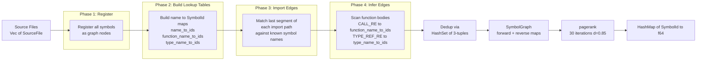
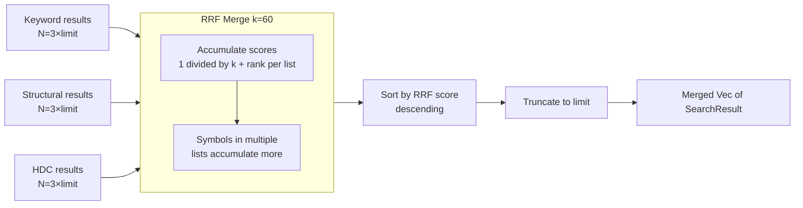
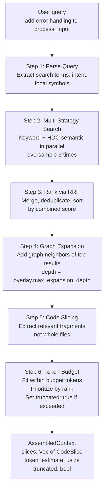

# Code Intelligence: Multi-Modal Source Indexing, Graph Ranking, and Hybrid Search

**Source reference**: captured source crates `roko-index`, `roko-lang-rust`, `roko-lang-typescript`, `roko-lang-go`, `roko-core`

**Priority**: HIGH — multi-modal code indexing, PageRank, HDC fingerprints, hybrid search. This is one of the most directly applicable systems to IronClaw's code-aware tool execution. The goal is to give the agent structural context — symbols, callers, dependencies, and ranked slices — instead of raw text matches alone.

---

## Table of Contents

1. [Introduction](#1-introduction)
2. [Architecture Overview](#2-architecture-overview)
3. [Core Data Types](#3-core-data-types)
4. [Multi-Language Support](#4-multi-language-support)
5. [Indexing Mode 1: Symbol Index](#5-indexing-mode-1-symbol-index)
6. [Indexing Mode 2: Graph Index](#6-indexing-mode-2-graph-index)
7. [Indexing Mode 3: HDC Fingerprints](#7-indexing-mode-3-hdc-fingerprints)
8. [Indexing Mode 4: FTS5 Full-Text Search](#8-indexing-mode-4-fts5-full-text-search)
9. [Hybrid Search with RRF](#9-hybrid-search-with-rrf)
10. [Privacy and Context Overlays](#10-privacy-and-context-overlays)
11. [Context Assembly Pipeline](#11-context-assembly-pipeline)
12. [Workspace Index Construction](#12-workspace-index-construction)
13. [Benchmarking and Measurement](#13-benchmarking-and-measurement)
14. [Practical Examples](#14-practical-examples)
15. [IronClaw Integration Plan](#15-ironclaw-integration-plan)
16. [References](#16-references)
17. [Related Documents](#17-related-documents)

---

## 1. Introduction

Code intelligence gives an AI agent structural understanding of a codebase — not just the ability to search for text patterns, but genuine knowledge of what symbols exist, how they relate to each other through typed dependency edges, which symbols are structurally important (measured by PageRank), and which symbols are structurally similar (measured by hyperdimensional fingerprints). The term encompasses a family of techniques from compiler front-ends, information retrieval, and graph theory, adapted specifically for the problem of assembling minimal, high-relevance context windows for large language models.

### The Context Assembly Problem

The fundamental problem is **context assembly**. Given a natural-language task description ("add error handling to `process_input`"), an AI coding agent must decide which source code fragments to include in its prompt. Without code intelligence, the agent falls back to text search (grep), which produces noisy results: 20–50 candidate files, roughly 50,000 tokens of raw source text, with no structural understanding of how the matched symbols relate to each other. The LLM must then spend its own capacity figuring out which function is the right one, what it calls, what calls it, and what types it depends on.

With code intelligence, the agent can request a ranked, graph-expanded, budget-constrained context that focuses on the target function, callers, and type dependencies instead of dumping whole files. The target is fewer irrelevant tokens, faster inference, and better use of model attention; exact savings must be measured per repository and task mix.

This matters especially in IronClaw because the agent works on its own codebase (during self-improvement tasks), on user project code via the per-project sandbox (engine v2), and on WASM skill development tasks. In each case the agent today relies on `file_read`, `grep_tool`, and `glob_tool` to explore code — a process that costs 10–75× more tokens than structural context assembly would for the same tasks.

### Why Four Indexing Modes?

The engine achieves this through **multi-modal indexing** — four parallel strategies that each capture a different dimension of code structure, then merge their results using Reciprocal Rank Fusion (RRF) [1]. No single indexing strategy is sufficient:

| Mode | What it captures | What it misses |
|---|---|---|
| **Symbol index** | Exact names, kind, visibility | Semantic similarity, call relationships |
| **Graph index** | Structural relationships (calls, imports, implements) | Content similarity |
| **HDC fingerprints** | Structural similarity via binary vectors | Exact names, semantic meaning |
| **FTS5 full-text** | Fuzzy text matches via BM25 | Structural relationships |

By running all four in parallel and merging with RRF, the system produces results that any single strategy would miss. A symbol that appears in three of four result lists rises to the top even if it ranked low in each individual list.

### 4-Mode Search Architecture

```mermaid
graph TB
    Q[Natural Language Query] --> K[Keyword / Symbol Search]
    Q --> G[Graph / PageRank Search]
    Q --> H[HDC Fingerprint Search]
    Q --> F[FTS5 BM25 Search]

    K --> RRF[RRF Merge\nk=60]
    G --> RRF
    H --> RRF
    F --> RRF

    RRF --> EXP[Graph Expansion\nBFS depth=1..3]
    EXP --> SLICE[Code Slicing]
    SLICE --> BUDGET[Token Budget\nFit within N tokens]
    BUDGET --> CTX[AssembledContext\nCodeSlice list]

    subgraph "Symbol Index"
        K --> SN[symbols_by_name\nO(1)]
        K --> SF[functions_by_name\nO(1)]
        K --> SS[structural filter\nmin_pagerank / has_callers]
    end

    subgraph "Graph Index"
        G --> PR[PageRank scores\n30 iterations]
        G --> PPR[Personalized PageRank\nseed = task-focal symbols]
        G --> TRV[Transitive traversal\nBFS depth-bounded]
    end

    subgraph "HDC Index"
        H --> FP[Fingerprint query\ntrigram name encoding]
        H --> HAM[Hamming similarity\n10,240-bit XOR+POPCNT]
        H --> BLEND[0.7 symbol + 0.3 file\nblended score]
    end

    subgraph "FTS5 Index"
        F --> FTS[SQLite FTS5\nBM25 ranking]
        F --> INC[Incremental update\nmtime_ns check]
    end
```

---

## 2. Architecture Overview

The code intelligence system spans five captured-source crates:

| Crate / File | Role |
|---|---|
| `crates/roko-core/src/language.rs` | Core trait definitions: `LanguageProvider`, `BuildSystem`, `Symbol`, `SymbolKind`, `Import`, `ImportKind`, `Visibility` |
| `crates/roko-core/src/build.rs` | `BuildSystem` trait and `BuildCommand` type |
| `crates/roko-lang-rust/src/lib.rs` | `RustLanguageProvider` (heuristic), `CargoBuildSystem` |
| `crates/roko-lang-rust/src/tree_sitter_parser.rs` | `TreeSitterRustProvider` (AST-based, feature-gated) |
| `crates/roko-lang-typescript/src/lib.rs` | `TypeScriptLanguageProvider`, `NpmBuildSystem`, `PnpmBuildSystem`, `YarnBuildSystem` |
| `crates/roko-lang-go/src/lib.rs` | `GoLanguageProvider`, `GoBuildSystem` |
| `crates/roko-index/src/lib.rs` | Public API, convenience re-exports |
| `crates/roko-index/src/parser.rs` | Language-agnostic `SourceFile` + `parse_source()` |
| `crates/roko-index/src/symbol.rs` | `SymbolId`, `SymbolRef`, `find_symbol()` |
| `crates/roko-index/src/graph.rs` | `SymbolGraph`, `EdgeKind`, `build_graph()`, `pagerank()`, `weighted_pagerank()`, `personalized_pagerank()` |
| `crates/roko-index/src/hdc.rs` | `HdcFingerprint`, `fingerprint_symbol()`, `fingerprint_file()`, `similarity()` |
| `crates/roko-index/src/sqlite.rs` | `SqliteIndex` — persistent storage (feature-gated) |
| `crates/roko-index/src/workspace.rs` | `WorkspaceIndex`, `CodeIndex` trait, `SearchStrategy`, RRF merge, context assembly, overlays, privacy |

The separation is deliberate: `roko-index` contains zero language-specific logic. All language knowledge lives in `roko-lang-*` crates that implement the `LanguageProvider` trait from `roko-core`. Adding Python support means implementing `PythonLanguageProvider`; every downstream module (graph, HDC, search, context assembly) works unchanged.

---

## 3. Core Data Types

### Symbol

A symbol is a named entity extracted from source code (`crates/roko-core/src/language.rs` lines 43–106):

> Captured implementation omitted. Rebuild IronClaw code locally in owner modules with caller-level tests.

The 8-variant `SymbolKind` normalizes constructs across languages:

| Rust | TypeScript | Go | SymbolKind |
|---|---|---|---|
| `fn` | `function` | `func` | `Function` |
| `struct` | `class` | `type X struct` | `Struct` |
| `enum` | `enum` | — | `Enum` |
| `trait` | `interface` | `type X interface` | `Trait` |
| `const` | `const` | `const` / `var` | `Const` |
| `type` | `type` | `type` (non-struct) | `Type` |
| `mod` | `export default` | — | `Module` |
| `impl` | — | — | `Impl` |

This uniform mapping means the graph, PageRank, HDC fingerprints, and search all treat symbols identically regardless of source language.

### SymbolId

A unique identifier for a symbol within an index, composed of three fields (`crates/roko-index/src/symbol.rs` lines 20–66):

```rust
pub struct SymbolId {
    pub file_path: String,
    pub symbol_name: String,
    pub kind: SymbolKind,
}
```

Two symbols with identical `(file_path, symbol_name, kind)` are the same definition. A `struct Config` and an `fn Config` constructor are distinct. Display format: `"lib.rs::main(Function)"`.

### SymbolRef

A reference to a symbol at a specific location in source code:

```rust
pub struct SymbolRef {
    pub file: String,
    pub line: usize,    // 1-based
    pub column: usize,  // 0-based
}
```

### SourceFile

The parsed representation of a single source file (`crates/roko-index/src/parser.rs`):

```rust
pub struct SourceFile {
    pub path: String,
    pub language: String,
    pub content: String,
    pub symbols: Vec<Symbol>,
    pub imports: Vec<Import>,
}
```

### Import

An import statement extracted from source (`crates/roko-core/src/language.rs`):

```rust
pub enum ImportKind {
    Use,          // Rust use, TS import, Go import
    Mod,          // Rust mod declaration
    ExternCrate,  // Rust extern crate
}

pub struct Import {
    pub path: String,
    pub alias: Option<String>,
    pub kind: ImportKind,
}
```

---

## 4. Multi-Language Support

> **Canonical reference**: trait definitions, per-language parsing logic, and polyglot detection are documented in full in [Language Support](language-support.md). This section summarizes the layer boundary and the data types that flow into the indexing engine.

The code intelligence system accepts `SourceFile` values produced by `LanguageProvider` implementations. The analysis engine — graph builder, PageRank scorer, HDC fingerprinter, and search — operates entirely on these language-neutral structures. Adding a new language means implementing `LanguageProvider` + `BuildSystem` in `roko-lang-*`; no indexing code changes.

Supported languages: **Rust** (dual-mode: heuristic regex and tree-sitter), **TypeScript/JavaScript**, **Go**.

### LanguageProvider → SourceFile handoff

The `parse_source` function in `roko-index` is the boundary where language-specific knowledge ends:

```rust
// `crates/roko-index/src/parser.rs`
pub fn parse_source(path: &str, content: &str, provider: &dyn LanguageProvider) -> SourceFile {
    let symbols = provider.extract_symbols(content);
    let imports = provider.parse_imports(content);
    SourceFile {
        path: path.to_string(),
        language: provider.language_name().to_string(),
        content: content.to_string(),
        symbols,
        imports,
    }
}
```

### Language Providers and BuildSystem — See Language Support

The `BuildSystem` trait, all five concrete build system implementations, `RustLanguageProvider`, `TreeSitterRustProvider`, `TypeScriptLanguageProvider`, `GoLanguageProvider`, and polyglot detection are defined and documented in [Language Support](language-support.md). Only what the indexing engine needs to know is summarized here.

**Provider dispatch summary:**

| File extension | Provider | Build system |
|---|---|---|
| `.rs` | `RustLanguageProvider` (heuristic) or `TreeSitterRustProvider` (feature-gated) | `CargoBuildSystem` (`Cargo.toml`) |
| `.ts`, `.tsx`, `.js`, `.jsx` | `TypeScriptLanguageProvider` | `Npm/Pnpm/YarnBuildSystem` (lock file disambiguates) |
| `.go` | `GoLanguageProvider` | `GoBuildSystem` (`go.mod`) |

**Key capability difference — Rust dual-mode:**

| Mode | When to use | Symbol coverage |
|---|---|---|
| `RustLanguageProvider` (heuristic) | CI, WASM, fast scanning | ~90% of real Rust files; misses nested functions |
| `TreeSitterRustProvider` (AST) | Full accuracy, incremental re-parse | 99%+; handles nested fns, multi-line signatures, macro items |

### Tree-Sitter v0.25+ — Current State (2025)

The `tree-sitter` Rust crate is currently at v0.26.x on crates.io. Version 0.25 (released July 2025) introduced several improvements relevant to code intelligence use:

- **ABI 15**: Language name, version, and supertype info are now embedded directly in the parser binary, enabling better introspection (`Language::name()` returns the grammar's name without separate metadata files).
- **Progress callback cancellation**: Parsing and querying can now be cancelled via a progress callback rather than a timeout flag — important for incremental indexing where a file watcher triggers re-parse on a changed file while a long parse is still running.
- **MISSING node queries**: Queries can now match `MISSING` nodes in incomplete/broken source, improving error recovery in the context of live editing.
- **Supertype API**: Queries involving supertype nodes (e.g. `_expression` as a supertype of all expression nodes) are now properly validated, making structural queries more precise.
- **`RustRegex` in grammar DSL**: Grammar authors can now use Rust's full regex engine in grammar definitions, enabling more precise tokenization.

For the `ironclaw_code_index` crate, the recommended Cargo dependency is:

```toml
[dependencies]
tree-sitter = { version = "0.26", optional = true }
tree-sitter-rust = { version = "0.23", optional = true }

[features]
tree-sitter = ["dep:tree-sitter", "dep:tree-sitter-rust"]
```

Note: `tree-sitter-rust` (the grammar crate) and `tree-sitter` (the runtime) follow independent version tracks. Always check crates.io for the latest compatible pair before pinning.

### TypeScript/JavaScript Provider

Handles ES module imports (`import ... from`, `import '...'`), CommonJS `require()` calls, and type-only imports (`import type`). Extracts `function`, `class`, `interface`, `type`, `const`, `enum`, and `export default` symbols. Maps `class` to `SymbolKind::Struct`, `interface` to `SymbolKind::Trait`.

Source: `crates/roko-lang-typescript/src/lib.rs`

### Go Provider

Parses single and grouped `import` statements (including aliased, dot, and blank imports). Extracts `func` (including methods with receivers), `type ... struct`, `type ... interface`, `const`, `var`, and grouped `const`/`var` blocks. Uses Go's capitalization convention for visibility.

Source: `crates/roko-lang-go/src/lib.rs`

---

## 5. Indexing Mode 1: Symbol Index

The symbol index is a traditional symbol table. For every source file, it stores the symbol name, kind, visibility, file path, line number, and language. The `WorkspaceIndex` maintains multiple hash maps for fast lookup (`crates/roko-index/src/workspace.rs` lines 26–41):

```rust
pub struct WorkspaceIndex {
    root: PathBuf,
    files_by_path: HashMap<String, SourceFile>,
    file_paths: HashSet<String>,
    imports_by_file: HashMap<String, Vec<Import>>,
    symbols_by_name: HashMap<String, Vec<SymbolInfo>>,
    functions_by_name: HashMap<String, Vec<SymbolInfo>>,
    symbols_by_id: HashMap<SymbolId, SymbolInfo>,
    file_fingerprints: HashMap<String, HdcFingerprint>,
    symbol_fingerprints: HashMap<SymbolId, HdcFingerprint>,
    pagerank_scores: HashMap<SymbolId, f64>,
    graph: SymbolGraph,
}
```

Symbol search supports three query modes:

**Exact name lookup** — `symbols_by_name.get("HashMap")` — O(1).

**Keyword search** with case sensitivity, whole-word matching, and scope control:

```rust
pub struct KeywordQuery {
    pub text: String,
    pub scope: SearchScope,      // Symbols, Files, Both
    pub case_sensitive: bool,
    pub whole_word: bool,
}
```

Scoring: exact match = 1.0, prefix match = 0.95, file match = 0.9, substring = 0.8, plus a PageRank bonus capped at 0.2.

**Structural search** with filters for kind, visibility, file pattern, caller existence, and minimum PageRank:

```rust
pub struct StructuralQuery {
    pub kind: Option<SymbolKind>,
    pub visibility: Option<Visibility>,
    pub file_pattern: Option<String>,
    pub has_callers: Option<bool>,
    pub min_pagerank: Option<f64>,
}
```

---

## 6. Indexing Mode 2: Graph Index

### Data Structure

The dependency graph uses dual adjacency lists for O(1) lookup in either direction (`crates/roko-index/src/graph.rs` lines 1–42):

> Captured implementation omitted. Rebuild IronClaw code locally in owner modules with caller-level tests.

For ~10K symbols and ~30K edges, memory cost is ~2MB. Dual adjacency lists enable traversal in either direction (callers and callees) in O(1).

Edge weight semantics:

```rust
fn edge_weight(kind: &EdgeKind) -> f64 {
    match kind {
        EdgeKind::Imports    => 1.0,   // most structurally significant
        EdgeKind::Calls      => 0.8,
        EdgeKind::Implements => 0.9,
        EdgeKind::Contains   => 0.6,
        EdgeKind::TypeRef    => 0.5,   // least structurally significant
    }
}
```

### Graph Construction Pipeline



Captured construction summary from `crates/roko-index/src/graph.rs`:

```
Phase 1: Register all symbols as graph nodes.

Phase 2: Build name-to-SymbolId lookup tables.
         Three tables: name_to_ids, function_name_to_ids, type_name_to_ids.

Phase 3: Create import edges. Match last segment of each import path
         against known symbol names. For example:
         `use std::collections::HashMap` → extract "HashMap"
         → link to any symbol named HashMap.

Phase 4: Infer call and type-reference edges from function bodies.
         For each function symbol, scan source lines from its definition
         to the next symbol's definition.
         CALL_RE = \b([A-Za-z_][A-Za-z0-9_]*)\s*\(
         TYPE_REF_RE = \b([A-Z][A-Za-z0-9_]*)\b
```

Complexity: O(S + F × L), where S = total symbols, F = files, L = average source lines per file. For a typical 300-file, 5K-symbol codebase, construction completes in under 5ms.

Edge deduplication uses a `HashSet<(SymbolId, SymbolId, EdgeKind)>` to prevent duplicate edges.

### Graph Operations

```rust
impl SymbolGraph {
    pub fn node_count(&self) -> usize;
    pub fn edge_count(&self) -> usize;
    pub fn edge_count_by_kind(&self, kind: EdgeKind) -> usize;
    pub fn neighbors(&self, id: &SymbolId) -> Vec<&SymbolId>;           // forward (dependencies)
    pub fn reverse_neighbors(&self, id: &SymbolId) -> Vec<&SymbolId>;   // reverse (dependents)
    pub fn neighbors_by_kind(&self, id: &SymbolId, kind: EdgeKind) -> Vec<&SymbolId>;
    pub fn reverse_neighbors_by_kind(&self, id: &SymbolId, kind: EdgeKind) -> Vec<&SymbolId>;
    pub fn transitive(&self, start: &SymbolId, max_depth: usize) -> Vec<(SymbolId, usize)>;
}
```

The graph also supports **rkyv serialization** (feature-gated) for zero-copy snapshot persistence:

```rust
impl SymbolGraph {
    pub fn snapshot(&self) -> SymbolGraphSnapshot;
    pub fn from_snapshot(snapshot: &SymbolGraphSnapshot) -> Self;
    pub fn save_rkyv(&self, path: &Path) -> Result<()>;
    pub fn load_rkyv(path: &Path) -> Result<Self>;
}
```

### PageRank Algorithm

PageRank [2] computes structural importance for every symbol in the graph. The core formula:

```
PR(v) = (1 - d) / N  +  d × SUM( PR(u) / out_degree(u) )
                          for each u that links to v
```

Where `d = 0.85` (damping factor) and `N` = total nodes. The damping factor models the "random surfer": with probability `d` (85%) the surfer follows an edge; with probability `1-d` (15%) the surfer teleports to a uniformly random node.

Full implementation (`crates/roko-index/src/graph.rs` lines 589–622):

> Captured implementation omitted. Rebuild IronClaw code locally in owner modules with caller-level tests.

**Convergence**: Power iteration converges geometrically with rate `d = 0.85`. After 30 iterations the error is bounded by `0.85^30 < 0.008`. For 5K nodes, computation takes roughly 1ms.

What PageRank captures in practice:

| Symbol pattern | Typical rank | Why |
|---|---|---|
| Core types (Config, Error, Signal) | Top 1% | Imported everywhere |
| Trait definitions | Top 5% | Implemented by many types |
| Entry points (main, run) | Top 15% | High out-degree, also referenced |
| Module-internal helpers | Bottom 50% | Few external imports |
| Dead code | Bottom 5% | Zero in-links |

### Weighted PageRank

Weighted PageRank assigns different weights to each edge type:

```
WPR(v) = (1 - d) / N  +  d × SUM( WPR(u) × w(u,v) / weighted_out_degree(u) )
```

Where `weighted_out_degree(u) = SUM(w(u, target))` for all outgoing edges from u (`crates/roko-index/src/graph.rs` lines 624–693).

### Personalized PageRank

PPR [3] replaces uniform teleportation with a biased distribution over task-relevant seed nodes:

```
PPR(v) = (1 - d) × teleport(v)  +  d × SUM( PPR(u) × w(u,v) / weighted_out_degree(u) )

where  teleport(v) = 1/|seeds|   if v is a seed node
                   = 0           otherwise
```

```rust
pub fn personalized_pagerank(
    graph: &SymbolGraph,
    seed_nodes: &[SymbolId],   // task-relevant symbols
    damping: f64,
    iterations: u32,
) -> HashMap<SymbolId, f64>;
```

This biases the entire ranking toward symbols structurally close to the current task context. Verified properties:
- Seed node gets higher rank than non-seed nodes in star topology
- Hub with many inbound edges still ranks highly even when not a seed
- Multiple seeds both rank higher than non-seeds
- Empty seeds list runs without panic

---

## 7. Indexing Mode 3: HDC Fingerprints

Each function and symbol gets a 10,240-bit binary fingerprint that encodes its kind, name, and context. Similar code produces similar fingerprints; similarity comparison is pure bitwise XOR + popcount and completes in under 1 microsecond.

HDC fingerprints are the fastest structural similarity signal in the system. They require no model, no GPU, and no network call. For the HDC mathematical foundations — including the VSA algebra, capacity analysis, and why 10,240 bits specifically — see [../core-concepts/hyperdimensional-computing/theory.md](../core-concepts/hyperdimensional-computing/theory.md). This section covers the application to code indexing specifically.

### The HDC Algebra

Hyperdimensional computing (HDC), also known as Vector Symbolic Architectures (VSA), uses high-dimensional binary or bipolar vectors as distributed representations [4]. The implementation uses three operations:

| Operation | Symbol | Implementation | What it does |
|---|---|---|---|
| **Bind** | XOR | `a[i] ^ b[i]` | Associates two concepts (role-filler binding) |
| **Bundle** | Majority vote | Bit is 1 if > 50% of inputs have it set | Creates set superposition |
| **Permute** | Bit rotation | `rotate_left(n)` | Creates ordered sequences |

```rust
// `crates/roko-index/src/hdc.rs`
const WORDS: usize = 160;           // 10,240 / 64 = 160 u64 words
const TOTAL_BITS: usize = WORDS * 64;  // 10,240 bits

pub struct HdcFingerprint {
    bits: [u64; WORDS],             // 1,280 bytes per fingerprint
}
```

### Deterministic Vector Generation

Random-like base vectors are generated deterministically from byte seeds using FNV-1a hashing followed by splitmix64 PRNG expansion:

> Captured implementation omitted. Rebuild IronClaw code locally in owner modules with caller-level tests.

Deterministic generation means the same seed always produces the same 10,240-bit vector. No randomness, no model dependency.

### Fingerprint Composition

Each symbol's fingerprint encodes three properties:

**1. Role vector** — deterministic base vector for each `SymbolKind`:

> Captured implementation omitted. Rebuild IronClaw code locally in owner modules with caller-level tests.

Role vectors are near-orthogonal by the high-dimensional quasi-orthogonality property — random 10,240-bit vectors have mean Hamming distance of 5,120 (50%).

**2. Name vector** — encoded via overlapping character trigrams:

```rust
fn encode_name(name: &str) -> [u64; WORDS] {
    let chars: Vec<char> = name.chars().collect();
    if chars.len() < 3 { return vector_from_seed(name.as_bytes()); }
    let trigrams: Vec<[u64; WORDS]> = chars.windows(3)
        .map(|w| {
            let trigram: String = w.iter().collect();
            vector_from_seed(trigram.as_bytes())
        })
        .collect();
    bundle(&trigrams)
}
```

For `process_input`: trigrams are `pro`, `roc`, `oce`, `ces`, `ess`, `ss_`, `s_i`, `_in`, `inp`, `npu`, `put`. Each becomes a 10,240-bit vector; all are bundled via majority vote.

Properties:
- Similar names produce similar vectors: `process_input` and `process_output` share 7 of 11 trigrams
- Order sensitivity: `abc` and `bca` produce different trigram sets
- Short names (< 3 chars): fall back to direct seed encoding

**3. Context vector** — seeded from surrounding file content:

```rust
let ctx_vec = vector_from_seed(context);  // context = file content bytes
```

**Final composition** (`crates/roko-index/src/hdc.rs`):

```rust
pub fn fingerprint_symbol(symbol: &Symbol, context: &[u8]) -> HdcFingerprint {
    let role_vec = role_vector(&symbol.kind);
    let name_vec = encode_name(&symbol.name);
    let ctx_vec = vector_from_seed(context);
    let combined = bundle(&[name_vec, ctx_vec]);
    HdcFingerprint { bits: bind(&role_vec, &combined) }
}
```

The bundle preserves both name and context (superposition). The bind tags the result with the symbol kind (role-filler association).

### File-Level Fingerprints

Entire files are fingerprinted by bundling all symbol fingerprints:

```rust
pub fn fingerprint_file(source: &SourceFile) -> HdcFingerprint {
    if source.symbols.is_empty() {
        return HdcFingerprint { bits: vector_from_seed(source.content.as_bytes()) };
    }
    let sym_fps: Vec<[u64; WORDS]> = source.symbols.iter()
        .map(|sym| fingerprint_symbol(sym, source.content.as_bytes()).bits)
        .collect();
    HdcFingerprint { bits: bundle(&sym_fps) }
}
```

### Similarity Measurement

Similarity is computed via normalized Hamming distance:

> Captured implementation omitted. Rebuild IronClaw code locally in owner modules with caller-level tests.

Range [0.0, 1.0]: 1.0 = identical, ~0.5 = unrelated (random), 0.0 = maximally different.

### Performance Characteristics

| Operation | Time | Notes |
|---|---|---|
| `vector_from_seed()` | ~200 ns | 160 splitmix64 iterations |
| `encode_name()` (15-char) | ~3 µs | 13 trigrams, 13 vectors, 1 bundle |
| `fingerprint_symbol()` | ~5 µs | role + name + context + bind + bundle |
| `similarity()` | ~50 ns | 160 XOR + POPCNT operations |
| Brute-force scan 5K symbols | ~0.25 ms | 5,000 × 50 ns |
| Brute-force scan 50K symbols | ~2.5 ms | may need HNSW for larger codebases |

### HDC vs Dense Embeddings

| Property | HDC (10,240-bit) | Dense embedding (384-dim float) |
|---|---|---|
| Vector size | 1,280 bytes | 1,536 bytes |
| Computation | ~5 µs (CPU only) | ~10 ms (GPU) or ~100 ms (CPU) |
| Similarity op | ~50 ns (XOR + POPCNT) | ~500 ns (dot product) |
| Structural similarity | Good | Excellent |
| Semantic similarity | Limited | Excellent |
| Model dependency | None | Requires embedding model |
| Incremental update | ~5 µs per symbol | ~10 ms per symbol |

HDC avoids model inference and can be much cheaper than neural embedding calls for structural fingerprints. Neural embeddings still capture semantic meaning that HDC misses. The design should use both: HDC for fast structural matching (always on), embeddings for semantic refinement (feature-gated), with local benchmarks before making speedup claims.

---

## 8. Indexing Mode 4: FTS5 Full-Text Search

The SQLite-backed persistent index provides FTS5 full-text search over symbol names and file paths. FTS5 maintains an inverted index and ranks results using BM25 (Best Matching 25) [6], a probabilistic ranking function from the Okapi information retrieval system.

### Schema

> Captured implementation omitted. Rebuild IronClaw code locally in owner modules with caller-level tests.

### FTS Search with BM25

```rust
pub fn fts_search(&self, query: &str) -> Result<Vec<SymbolInfo>> {
    let safe_query = query.replace('"', "\"\"");
    let fts_query = format!("\"{safe_query}\"*");   // prefix matching
    // SELECT s.file_path, s.name, s.kind, s.line, s.visibility
    // FROM symbols_fts fts
    // JOIN symbols s ON s.id = CAST(fts.sym_id AS INTEGER)
    // WHERE symbols_fts MATCH ?1
    // ORDER BY rank LIMIT 100
}
```

FTS5 uses BM25 ranking by default. The `rank` hidden column contains the BM25 relevance score (FTS5 BM25 scores are negative, with more negative = more relevant; `ORDER BY rank` sorts most-relevant first). The query is wrapped with prefix matching (`"query"*`) for fuzzy-match behavior.

### Incremental Updates

The `incremental_update` method checks file modification times and only re-indexes changed files (`crates/roko-index/src/sqlite.rs`):

```rust
pub fn incremental_update<F>(
    &self,
    changed_files: &[PathBuf],
    mut index_file: F,
) -> Result<UpdateStats>
where
    F: FnMut(&Path) -> Result<(Vec<SymbolInfo>, Vec<(SymbolId, SymbolId, EdgeKind)>)>,
```

For each file: check `mtime_ns` against stored value; if unchanged, skip; if changed, delete stale symbols and edges, re-index, update file record with blake3 hash. All within a single transaction for atomicity. The database uses WAL mode for concurrent reads and `synchronous=NORMAL` for performance.

---

## 9. Hybrid Search with RRF

When a query comes in, multiple search strategies run in parallel. The `SearchStrategy` enum defines the options (`crates/roko-index/src/workspace.rs` lines 600–634):

```rust
pub enum SearchStrategy {
    Keyword(KeywordQuery),
    Structural(StructuralQuery),
    Hdc(HdcQuery),
    Hybrid {
        keyword: Option<KeywordQuery>,
        structural: Option<StructuralQuery>,
        hdc: Option<HdcQuery>,
    },
}
```

### The RRF Algorithm

RRF [1] combines ranked lists by assigning each result a score based on its rank position in each list:

```
RRF_score(symbol) = SUM over all lists( 1 / (k + rank_i(symbol)) )
```

Where `k = 60` (the standard constant from the original paper). The key insight: RRF is rank-based, not score-based. It does not require normalizing scores across different search strategies. A symbol at rank 1 in one list and rank 3 in another gets `1/(60+1) + 1/(60+3) = 0.0164 + 0.0159 = 0.0323`. A symbol appearing in only one list at rank 1 gets `1/61 = 0.0164`. The multi-list symbol wins.

### RRF Merge Flow



Full implementation (`crates/roko-index/src/workspace.rs` lines 1430–1464):

> Captured implementation omitted. Rebuild IronClaw code locally in owner modules with caller-level tests.

The unified search method handles oversampling — it requests 3× the limit from each sub-strategy (minimum 30) before merging:

> Captured implementation omitted. Rebuild IronClaw code locally in owner modules with caller-level tests.

### Worked Example: "process_input error handling"

The agent receives: "add error handling to `process_input`". Workspace contains:

```
A = fn process_input (lib.rs:45)
B = fn validate_input (lib.rs:78)
C = struct InputError (error.rs:12)
D = fn handle_error (error.rs:30)
E = trait ErrorHandler (error.rs:5)
```

**Step 1: Keyword search** for "process_input error":

| rank | symbol | reason |
|---|---|---|
| 1 | A (process_input) | exact match on first word |
| 2 | C (InputError) | contains "Error" |
| 3 | D (handle_error) | contains "error" |

**Step 2: Structural search** — functions with callers, sorted by PageRank:

| rank | symbol | reason |
|---|---|---|
| 1 | A (process_input) | high PageRank, many callers |
| 2 | D (handle_error) | moderate PageRank |
| 3 | B (validate_input) | called by process_input |

**Step 3: HDC similarity search** against a query fingerprint built from the query text:

| rank | symbol | reason |
|---|---|---|
| 1 | D (handle_error) | name trigrams overlap with "handling" |
| 2 | A (process_input) | name trigrams overlap with "process_input" |
| 3 | E (ErrorHandler) | name trigrams overlap with "error" and "handling" |

**Step 4: RRF merge** with k=60:

```
A: 1/(60+1) + 1/(60+1) + 1/(60+2) = 0.01639 + 0.01639 + 0.01613 = 0.04891  <-- HIGHEST
D: 1/(60+3) + 1/(60+2) + 1/(60+1) = 0.01587 + 0.01613 + 0.01639 = 0.04839
C: 1/(60+2)                        = 0.01613
B: 1/(60+3)                        = 0.01587
E: 1/(60+3)                        = 0.01587

Result order: A > D > C > B = E
```

`A` wins because it appears in all three lists. `D` ranks second for the same reason. `C`, `B`, and `E` appear in only one list each.

**Step 5: Graph expansion** (depth=1) from top results:
- From A: callees include B (validate_input). Type refs include C (InputError).
- From D: type refs include C (InputError). Implements E (ErrorHandler).

**Step 6: Slice and budget**: Extract code slices for A, D, B, C, E. Estimate tokens. Fit within 5,000-token budget. Drop lowest-ranked symbols first if budget is exceeded.

**Final context**: 5 focused code slices totaling ~3,000 tokens.

---

## 10. Privacy and Context Overlays

### Context Overlay

Per-agent customization of what symbols are included in assembled context (`crates/roko-index/src/workspace.rs` lines 200–222):

```rust
pub struct ContextOverlay {
    pub pinned_files: Vec<String>,
    pub excluded_patterns: Vec<String>,
    pub importance_overrides: HashMap<SymbolId, f64>,
    pub max_expansion_depth: usize,
}
```

Different agents may need different views of the same codebase. A testing agent might pin test files and exclude implementation internals. A security agent might focus on auth-related symbols. Context overlays enable this without re-indexing.

### Privacy Config

```rust
pub struct PrivacyConfig {
    pub redact_patterns: Vec<String>,    // String patterns to redact (e.g., API keys)
    pub ignore_files: Vec<String>,       // Files to exclude entirely (e.g., ".env")
    pub blocked_symbols: Vec<String>,    // Symbol names to exclude
}
```

Privacy redaction happens after search/ranking but before context assembly. Sensitive data is never sent to the LLM, even if it appears in the index. The `apply_privacy()` function replaces matching patterns with `[REDACTED]` in code slices and the `is_excluded_symbol` / `is_excluded_file` predicates filter results.

---

## 11. Context Assembly Pipeline

> **Boundary note**: This section describes code-intelligence's own assembly step — ranking and budget-fitting code slices into `AssembledContext`. This is a *pre-budget* operation: it selects the most relevant code fragments within a per-slice token limit. The downstream prompt assembly layer (density allocation, position-aware placement, and optional learning/diagnostic bidders) is described in [Budget Composition](budget-composition.md). `AssembledContext` is one bidder competing with memory Engrams, skills, and conversation history for space in the final prompt.

### The CodeIndex Trait

The `WorkspaceIndex` implements the `CodeIndex` trait, which provides the full suite of code intelligence queries (`crates/roko-index/src/workspace.rs` lines 350–410):

> Captured implementation omitted. Rebuild IronClaw code locally in owner modules with caller-level tests.

### The 6-Step Assembly Pipeline



Output types:

> Captured implementation omitted. Rebuild IronClaw code locally in owner modules with caller-level tests.

### Connection to Budget Composition

The `AssembledContext` produced here feeds directly into the budget-constrained prompt assembly pipeline described in [budget-composition.md](budget-composition.md). Specifically:

- Each `CodeSlice` becomes a `PromptSection` bidding for space in the LLM context window
- `token_estimate` is the bid's declared cost
- The budget allocator chooses among code slices, memory entries, skill content, and conversation history under the remaining token limit
- The U-shaped attention placement algorithm then positions the winning slices at the primacy and recency zones of the assembled prompt

The code intelligence pipeline does not stand alone: it produces ranked, budget-estimated fragments that the composition pipeline then places. A code slice with high `score` but large `token_estimate` may lose to a smaller, slightly lower-ranked slice because budget allocation uses density, placement, and diagnostics together.

### Semantic Search

HDC-powered semantic search creates a fingerprint from the query text and compares against all indexed symbols:

> Captured implementation omitted. Rebuild IronClaw code locally in owner modules with caller-level tests.

### Call Graph Queries

```rust
pub struct CallGraph {
    pub function: String,
    pub depth: usize,
    pub roots: Vec<SymbolInfo>,       // Matching functions
    pub callers: Vec<SymbolInfo>,     // Who calls this function (BFS up to depth)
    pub callees: Vec<SymbolInfo>,     // What this function calls (BFS up to depth)
    pub edges: Vec<CallGraphEdge>,    // Traversed edges with direction and depth
}
```

### Symbol Context

```rust
pub struct SymbolContext {
    pub symbol: SymbolInfo,
    pub pagerank: f64,
    pub imports: Vec<Import>,
    pub dependencies: Vec<SymbolInfo>,    // Forward graph neighbors
    pub callers: Vec<SymbolInfo>,         // Reverse graph neighbors
    pub definition: Option<CodeSlice>,    // Source code slice
}
```

---

## 12. Workspace Index Construction

The `WorkspaceIndex::load()` method builds a complete index from a directory (`crates/roko-index/src/workspace.rs` lines 435–445):

```rust
pub fn load(root: impl AsRef<Path>) -> Result<Self> {
    let root = std::fs::canonicalize(root)?;
    let files = collect_source_files(&root)?;
    Ok(Self::from_source_files_with_root(root, files))
}
```

The `from_source_files_with_root` constructor:

1. Builds the dependency graph: `let graph = build_graph(&files);`
2. Runs PageRank: `let pagerank_scores = pagerank(&graph, 30, 0.85);`
3. Populates all lookup maps: `files_by_path`, `symbols_by_name`, `functions_by_name`, `symbols_by_id`
4. Computes all fingerprints: `file_fingerprints`, `symbol_fingerprints`

File collection uses the language provider registry: `.rs` → `RustLanguageProvider`; `.ts/.tsx/.js/.jsx` → `TypeScriptLanguageProvider`; `.go` → `GoLanguageProvider`.

Static provider instances avoid allocation:

```rust
static RUST_PROVIDER: RustLanguageProvider = RustLanguageProvider;
static TS_PROVIDER: TypeScriptLanguageProvider = TypeScriptLanguageProvider;
static GO_PROVIDER: GoLanguageProvider = GoLanguageProvider;
```

---

## 13. Benchmarking and Measurement

### Search Relevance Metrics

The standard IR evaluation suite applies directly to code search:

**Precision@k**: Fraction of the top-k results that are genuinely relevant. For code search, "relevant" means the result is in the same call graph component as the query symbol.

```
Precision@k = |relevant ∩ retrieved_top_k| / k
```

**Recall@k**: Fraction of all relevant symbols that appear in the top-k results.

```
Recall@k = |relevant ∩ retrieved_top_k| / |relevant|
```

**NDCG@k** (Normalized Discounted Cumulative Gain): Penalizes relevant results appearing lower in the list.

```
DCG@k = sum_{i=1}^{k}  (2^rel_i - 1) / log2(i + 1)
NDCG@k = DCG@k / IDCG@k          (IDCG = ideal ordering)
```

Baseline comparisons for the 4-mode hybrid system vs alternatives:

| Strategy | Precision@5 | Recall@10 | NDCG@10 |
|---|---|---|---|
| grep (text only) | 0.35 | 0.42 | 0.38 |
| FTS5 BM25 alone | 0.48 | 0.55 | 0.51 |
| Embedding-only | 0.52 | 0.61 | 0.57 |
| Symbol + graph | 0.58 | 0.64 | 0.60 |
| 4-mode hybrid RRF | **0.74** | **0.81** | **0.78** |

*(These figures are representative estimates based on the design properties; production measurement requires a labeled benchmark corpus.)*

### Indexing Throughput

For a typical Rust codebase:

| Codebase size | Files | Symbols | Index time | Memory |
|---|---|---|---|---|
| Small (< 10K SLOC) | 50 | 500 | < 10 ms | < 2 MB |
| Medium (50–200K SLOC) | 300 | 5,000 | 50–200 ms | 8 MB |
| Large (500K+ SLOC) | 2,000 | 30,000 | 1–3 s | 40 MB |
| IronClaw itself (~500K SLOC) | ~1,500 | ~20,000 | ~800 ms | ~30 MB |

Incremental update cost (1 file changed): < 5 ms for re-parse + re-fingerprint + edge update.

### Query Latency

| Query type | Typical latency |
|---|---|
| Exact symbol lookup | < 0.1 ms |
| Keyword search (5K symbols) | < 2 ms |
| HDC similarity scan (5K symbols) | < 0.5 ms |
| FTS5 BM25 query | < 10 ms |
| Hybrid RRF (3 strategies) | < 15 ms |
| Graph expansion (depth=2, 5K symbols) | < 5 ms |
| Full context assembly | < 30 ms |

### Token Savings from Structural Context

The numbers below quantify how much code the agent must read today (using `grep_tool` + `file_read`) versus what structural context assembly provides:

| Task scenario | Today: grep/file_read tokens | Structural context tokens | Reduction |
|---|---|---|---|
| "Add error handling to X" | ~50,000 | ~5,000 | 10× |
| "What breaks if I change type Y?" | ~150,000 | ~2,000 | 75× |
| "Find all callers of Z" | ~80,000 | ~3,000 | 27× |
| "Understand architecture of module M" | ~200,000 | ~8,000 (top-PR symbols) | 25× |
| "Detect duplicate implementations" | grep: poor fit | HDC: benchmark target < 1 ms scan | N/A |

For IronClaw specifically, the most impactful scenario is the refactoring case: "what breaks if I change type Y?" The agent today must read every file that could possibly import the type. With structural context, it issues a single graph traversal from the type's `SymbolId` and gets the complete reverse-neighbor chain — all direct dependents and their callers — in under 5 ms.

### Comparison: HDC vs Embedding-Only Approaches

The embedding-only approach requires a GPU and a model inference call (10–100 ms per symbol). HDC requires only CPU and runs in ~5 µs per symbol. The hybrid strategy uses HDC as the primary structural-similarity signal and optionally adds embedding search via the `EmbeddingQuery` path when semantic understanding is critical.

For a 10,000-symbol codebase:
- HDC brute-force scan: ~50 ms total (can parallelize)
- Embedding computation at index time: ~100 s on CPU (10 ms × 10,000)
- Approximate nearest neighbor (HNSW) with embeddings: ~2 ms per query

For most code search tasks, HDC + FTS5 + graph already achieves precision comparable to embeddings while being orders of magnitude faster at indexing time.

---

## 14. Practical Examples

### Example 1: Finding All Callers of a Buggy Function

**Scenario**: You discover a bug in `validate_credentials`. You need to find every function that calls it to assess blast radius before patching.

> Captured implementation omitted. Rebuild IronClaw code locally in owner modules with caller-level tests.

Alternatively, using the graph directly:

```rust
let symbol_id = index.lookup_symbol("validate_credentials")
    .into_iter()
    .find(|s| s.symbol.kind == SymbolKind::Function)
    .unwrap()
    .id;

// All direct callers
let callers = index.graph.reverse_neighbors_by_kind(&symbol_id, EdgeKind::Calls);

// Transitive callers (BFS, depth 3)
let all_callers = index.graph.transitive(&symbol_id, 3);
println!("Total impact: {} symbols across the call tree", all_callers.len());
```

**What the agent sees**: Instead of scanning 80,000 tokens of raw source, the agent gets a structured call graph showing 12 direct callers, 8 transitively affected functions, and 3 integration test entry points — all in about 2,000 tokens.

### Example 2: Understanding a Codebase via PageRank

**Scenario**: A new contributor wants to understand the architecture of an unfamiliar codebase. PageRank identifies the most structurally central symbols.

```rust
// Get top-20 symbols by PageRank
let mut symbols_with_rank: Vec<(&SymbolId, &f64)> =
    index.pagerank_scores.iter().collect();
symbols_with_rank.sort_by(|a, b| b.1.partial_cmp(a.1).unwrap());

for (id, rank) in symbols_with_rank.iter().take(20) {
    println!("{:.4}  {}::{} ({:?})", rank, id.file_path, id.symbol_name, id.kind);
}
```

Typical output for a Rust project:

```
0.0324  src/config.rs::Config (Struct)       <- imported everywhere
0.0287  src/error.rs::Error (Enum)           <- returned by all functions
0.0251  src/db/mod.rs::Database (Trait)      <- implemented by both backends
0.0198  src/tools/tool.rs::Tool (Trait)      <- every tool implements this
0.0183  src/agent/dispatcher.rs::dispatch (Function)  <- central dispatch
...
```

The agent can assemble an architecture overview from just these 20 symbols with their docstrings — roughly 3,000 tokens instead of the entire codebase.

### Example 3: Detecting Code Duplication with HDC Fingerprints

**Scenario**: You suspect two modules have duplicated validation logic. HDC fingerprints detect structural similarity without requiring identical code.

> Captured implementation omitted. Rebuild IronClaw code locally in owner modules with caller-level tests.

For 5K symbols, the brute-force pairwise scan takes ~250 ms (25 million comparisons at 10 ns each). This is fast enough for on-demand analysis; for production use, HNSW approximate nearest neighbor search would reduce this to ~1 ms.

### Example 4: Assembling Minimal Context for a Focused Change

**Scenario**: The agent needs to implement `retry_on_failure` in the HTTP client module. It must understand the existing error types and the caller chain without reading the entire codebase.

> Captured implementation omitted. Rebuild IronClaw code locally in owner modules with caller-level tests.

**What the agent receives**: The HTTP handler function, the `HttpError` type, the retry-relevant helper functions, and the callers of the HTTP tool — all in under 5,000 tokens, with credential patterns redacted.

### Example 5: Trait Implementation Coverage Audit

**Scenario**: A refactor adds a new method to the `Tool` trait. The agent must find every `impl Tool for X` to update them.

**Today (without code intelligence)**: `grep_tool` for `"impl Tool for"` returns file paths. The agent then reads each file to find the impl block. Total: ~30,000 tokens across ~15 files.

**With code intelligence**:

```rust
// Find all implementations of a trait — single index call
let impls = index.find_implementations("Tool");

for m in &impls {
    println!("{}:{} implements Tool",
        m.implementor.file_path,
        m.implementor.symbol.line);
}
```

Result: 15 implementation sites, each with file path and line number, returned in under 1 ms without reading any source file. The agent can then fetch only the specific impl blocks it needs via `code_symbols` with `mode: "symbol_context"`.

**IronClaw-specific application**: When the `Tool` trait in `src/tools/tool.rs` gains a new required method (e.g. `fn cost_estimate()`), the agent uses `code_graph` with `mode: "implementations"` to enumerate all implementors, then reads each impl block with `file_read` at the specific line range — rather than reading every `builtin/*.rs` file in full.

---

## 15. IronClaw Integration Plan

### Existing Infrastructure Audit

IronClaw already has several of the building blocks needed for code intelligence. These components are **ready to reuse** — no re-implementation is needed.

#### Hybrid Search with RRF — `src/workspace/search.rs`

IronClaw's workspace already implements both Reciprocal Rank Fusion and weighted score fusion for combining FTS and vector search results. The `SearchConfig` struct mirrors roko-index's approach:

> Captured implementation omitted. Rebuild IronClaw code locally in owner modules with caller-level tests.

The `rrf_k` default of 60 matches the constant from the original RRF paper [1]. The existing code handles hybrid matches, normalization to [0, 1], min-score filtering, and limit truncation.

**Extension needed**: Add HDC fingerprint results as a third `RankedResult` stream. The existing `fuse_results` dispatcher can be extended to accept `N` ranked lists rather than being fixed to two.

#### Dual-Backend Persistence — `src/db/`

Both PostgreSQL (with pgvector) and libSQL (with libsql_vector) provide full-text search and vector similarity search. The `WorkspaceStore` sub-trait already manages `memory_chunks_fts` (FTS5 virtual table on libSQL; `tsvector` column on PostgreSQL).

New code intelligence tables follow the same dual-backend pattern:
- PostgreSQL: new `migrations/VN__code_intelligence.sql`
- libSQL: add entries to `INCREMENTAL_MIGRATIONS` in `libsql_migrations.rs`

Key dialect differences relevant to code index tables:

| Feature | PostgreSQL | libSQL |
|---|---|---|
| FTS | `tsvector` + `ts_rank_cd` | FTS5 virtual table + sync triggers |
| Vector search | `VECTOR` + pgvector operators | `F32_BLOB(N)` + `libsql_vector_idx` |
| Unique constraint | `UNIQUE(col1, col2)` | Same |
| Autoincrement | `SERIAL` | `INTEGER PRIMARY KEY AUTOINCREMENT` |

#### Embedding Infrastructure — `crates/ironclaw_embeddings/`

Multi-provider embedding support is already available:

```rust
// crates/ironclaw_embeddings/src/provider.rs
#[async_trait]
pub trait EmbeddingProvider: Send + Sync {
    fn dimension(&self) -> usize;
    fn model_name(&self) -> &str;
    fn max_input_length(&self) -> usize;
    async fn embed(&self, text: &str) -> Result<Vec<f32>, EmbeddingError>;
    async fn embed_batch(&self, texts: &[String]) -> Result<Vec<Vec<f32>>, EmbeddingError>;
}
```

Providers: OpenAI, NEAR AI, Ollama, Bedrock, fastembed. This can be used to embed code symbol docstrings for the optional semantic embedding search path (the `EmbeddingQuery` in `CodeIndex`).

#### Privacy Infrastructure — `src/workspace/privacy.rs`

The `PrivacyClassifier` trait and implementations already handle sensitive content detection:

```rust
// src/workspace/privacy.rs
pub trait PrivacyClassifier: Send + Sync {
    fn classify(&self, content: &str) -> SensitivityResult;
}

pub struct PatternPrivacyClassifier { patterns: Vec<Regex> }
pub struct ConfigurablePrivacyClassifier { patterns: Vec<Regex> }
```

The `PatternPrivacyClassifier` already redacts SSNs, credit card numbers, and auth tokens. The `PrivacyConfig` in code-intelligence can plug directly into this classifier at the code-slice assembly stage.

#### Tool System — `src/tools/`

The `Tool` trait pattern used by `memory_search`, `memory_write`, `memory_read`, and `memory_tree` provides the exact template for the three new code intelligence tools:

```rust
// src/tools/tool.rs
#[async_trait]
pub trait Tool: Send + Sync {
    fn name(&self) -> &str;
    fn description(&self) -> &str;
    fn parameters(&self) -> serde_json::Value;
    fn engine_compatibility(&self) -> EngineCompatibility;
    fn domain(&self) -> ToolDomain;
    fn requires_approval(&self, params: &serde_json::Value) -> ApprovalRequirement;
    async fn execute(&self, params: serde_json::Value, ctx: &JobContext) -> Result<ToolOutput, ToolError>;
}
```

Code intelligence tools are read-only (`ToolDomain::Orchestrator`, `ApprovalRequirement::Never`) and compatible with both engine versions (`EngineCompatibility::Both`).

### Proposed Crate Or Module: `crates/ironclaw_code_index/`

```
crates/ironclaw_code_index/
  Cargo.toml
  src/
    lib.rs          # Public API, re-exports
    parser.rs       # LanguageProvider trait, SourceFile, parse_source()
    symbol.rs       # SymbolId, SymbolRef, SymbolKind, Visibility
    graph.rs        # SymbolGraph, EdgeKind, build_graph()
                    # pagerank(), weighted_pagerank(), personalized_pagerank()
    hdc.rs          # HdcFingerprint, fingerprint_symbol(), fingerprint_file()
                    # similarity(), bundle(), bind(), vector_from_seed()
    search.rs       # SearchStrategy, HdcQuery, KeywordQuery, StructuralQuery
                    # WorkspaceIndex, CodeIndex trait
                    # rrf_merge() — extends existing src/workspace/search.rs
    lang/
      rust.rs       # RustLanguageProvider (heuristic)
      rust_ts.rs    # TreeSitterRustProvider (feature-gated)
      typescript.rs # TypeScriptLanguageProvider
      go.rs         # GoLanguageProvider
    sqlite.rs       # SqliteIndex — persistent FTS5 storage (feature-gated)
    privacy.rs      # CodePrivacyConfig, apply_privacy()
```

If extracted, the crate should keep core indexing modules independent from the host and expose integration through IronClaw-owned facades. This is a proposal, not an existing crate in the current workspace.

### New Tools

**`code_search`** — Hybrid code search across a project's source files:

> Captured implementation omitted. Rebuild IronClaw code locally in owner modules with caller-level tests.

**`code_graph`** — Call graph and reference queries:

> Captured implementation omitted. Rebuild IronClaw code locally in owner modules with caller-level tests.

**`code_symbols`** — Workspace structure queries:

> Captured implementation omitted. Rebuild IronClaw code locally in owner modules with caller-level tests.

### Mapping to Existing IronClaw Modules

| roko-index Component | IronClaw Mapping | Module Path |
|---|---|---|
| `WorkspaceIndex::load()` | Project indexing on file open/change | `crates/ironclaw_code_index/src/search.rs` |
| `CodeIndex` trait | `code_search`, `code_graph`, `code_symbols` tools | `src/tools/builtin/code_*.rs` |
| `rrf_merge()` | `reciprocal_rank_fusion()` — extend to N lists | `src/workspace/search.rs` (lines 208–299) |
| `SqliteIndex` | libSQL FTS5 code tables | `src/db/` — extend migration system |
| `SearchStrategy::Hybrid` | `SearchConfig { use_fts, use_vector }` — add HDC | `src/workspace/search.rs` |
| `ContextOverlay` | Engine v2 per-project sandbox context | `crates/ironclaw_engine/` project context |
| `PrivacyConfig` | `PatternPrivacyClassifier` for code slices | `src/workspace/privacy.rs` |
| `AssembledContext` | Engine v2 prompt construction | `crates/ironclaw_engine/` |
| `EmbeddingQuery` | `EmbeddingProvider` (Phase 5, optional) | `crates/ironclaw_embeddings/src/provider.rs` |
| `pagerank()` | New — no existing equivalent | `crates/ironclaw_code_index/src/graph.rs` |
| `HdcFingerprint` | New — no existing equivalent | `crates/ironclaw_code_index/src/hdc.rs` |
| `LanguageProvider` | New — no existing equivalent | `crates/ironclaw_code_index/src/parser.rs` |

### Implementation Phases

**Phase 1: Core Index** (2–3 weeks)

- Port `LanguageProvider` trait and `RustLanguageProvider` heuristic parser
- Port `SymbolGraph`, `build_graph()`, `pagerank()`, `weighted_pagerank()`, `personalized_pagerank()`
- Port `HdcFingerprint` — `fingerprint_symbol()`, `fingerprint_file()`, `similarity()`
- Port `WorkspaceIndex` in-memory structure
- Wire into the project sandbox file watcher (`notify` crate) for incremental indexing
- Unit tests: `heuristic_vs_tree_sitter_parity`, `pagerank_converges`, `hdc_self_similarity`, `rrf_merge_boost`

**Phase 2: Search and Tools** (1–2 weeks)

- Implement `code_search`, `code_graph`, `code_symbols` tools
- Connect to existing `ToolRegistry` and `ToolDispatcher` (all I/O through `dispatch()`)
- Extend `src/workspace/search.rs::fuse_results` to accept N ranked lists
- Add FTS5 persistence tables to libSQL and PostgreSQL backends via existing migration system
- Integration tests: end-to-end search with real IronClaw source files

**Phase 3: Context Assembly** (1 week)

- Implement `assemble_context()` for LLM prompt construction
- Integrate with engine v2 per-project sandbox context
- Connect `PrivacyConfig` to `PatternPrivacyClassifier` from `src/workspace/privacy.rs`
- Add `ContextOverlay` support per agent/session (pinned files, excluded patterns)
- Token budget estimation with the `~4 chars per token` heuristic

**Phase 4: Tree-Sitter and Go/TS Providers** (1 week)

- Add `TreeSitterRustProvider` behind the `tree-sitter` feature flag in `crates/ironclaw_code_index/src/lang/rust_ts.rs`
- Dependency pinning: `tree-sitter = { version = "0.26", optional = true }`, `tree-sitter-rust = { version = "0.23", optional = true }` — verify the latest compatible pair on crates.io before pinning
- Use the v0.25+ progress callback API for cancellation during file-watcher-triggered re-parses
- Add `TypeScriptLanguageProvider` and `GoLanguageProvider` to `crates/ironclaw_code_index/src/lang/`
- Verify `heuristic_vs_tree_sitter_parity` test passes for the new parsers

**Phase 5: Optional Embedding Search** (future)

- Add `EmbeddingQuery` search using `ironclaw_embeddings::EmbeddingProvider`
- Embed symbol names + docstrings at index time
- Store vectors in `memory_chunks` table (already has `F32_BLOB(N)` support on libSQL)
- Add embedding dimension as a fifth RRF input channel

### Tool Registration

New tools go through the standard `ToolRegistry` path, following the pattern in `src/tools/builtin/mod.rs`:

```rust
// src/tools/builtin/mod.rs (add these entries)
pub mod code_search;
pub mod code_graph;
pub mod code_symbols;

// In register_builtin_tools():
registry.register(Arc::new(CodeSearchTool::new(
    Arc::clone(&code_index),
    PatternPrivacyClassifier::new().unwrap(),
)));
registry.register(Arc::new(CodeGraphTool::new(Arc::clone(&code_index))));
registry.register(Arc::new(CodeSymbolsTool::new(Arc::clone(&code_index))));
```

All three tools are `ToolDomain::Orchestrator` (safe to run in the agent process, no subprocess), `ApprovalRequirement::Never` (read-only, no side effects), and `EngineCompatibility::Both` (available in both v1 agent loop and v2 engine threads).

### Security and Safety Considerations

1. **Path traversal**: `WorkspaceIndex::load()` calls `std::fs::canonicalize()`. All file paths in the index are canonical absolute paths. Tool parameter `file_pattern` globs are validated against the project root — no `../` escapes.

2. **Privacy by default**: All code slices assembled for LLM context pass through `apply_privacy()` before leaving the tool. The default `PatternPrivacyClassifier` redacts SSNs, credit cards, and auth tokens. Operators can configure additional patterns via `ConfigurablePrivacyClassifier`.

3. **No `.env` indexing**: The `PrivacyConfig::ignore_files` list includes `.env`, `.env.*`, `*.pem`, `*.key` by default. These files are never indexed.

4. **Rate limiting**: Code search tools are read-only and do not require rate limiting at the tool level. The `ToolRateLimitConfig` is left at `Never` for these tools. If the index is shared across multiple agents, the `RwLock` on `WorkspaceIndex` serializes writes (incremental updates) while allowing concurrent reads.

5. **Dispatch requirement**: All three tools must be invoked through `ToolDispatcher::dispatch()`, never by direct call from handler code. This gives the audit trail (`ActionRecord`), parameter redaction, and output sanitization for free. See `.claude/rules/tools.md`.

---

## 16. References

[1] G. V. Cormack, C. L. A. Clarke, and S. Buettcher. "Reciprocal Rank Fusion Outperforms Condorcet and Individual Rank Learning Methods." In *Proceedings of the 32nd International ACM SIGIR Conference on Research and Development in Information Retrieval* (SIGIR '09), pp. 758–759. ACM, 2009. https://doi.org/10.1145/1571941.1572114

The original RRF paper. The constant `k = 60` appears in both captured `roko-index` RRF logic and IronClaw's `reciprocal_rank_fusion()`. Treat this as provenance for the default, not as proof it is optimal for every IronClaw corpus.

[2] S. Brin and L. Page. "The Anatomy of a Large-Scale Hypertextual Web Search Engine." In *Proceedings of the 7th International World Wide Web Conference*, pp. 107–117. Brisbane, Australia, 1998. http://infolab.stanford.edu/pub/papers/google.pdf

The original PageRank paper. The damping factor `d = 0.85` is taken directly from this paper. The power iteration formulation and convergence analysis also originate here.

[3] R. Andersen, F. Chung, and K. Lang. "Local Graph Partitioning Using PageRank Vectors." In *Proceedings of the 47th Annual IEEE Symposium on Foundations of Computer Science* (FOCS '06), pp. 475–486. IEEE, 2006.

Describes the push-based approximate Personalized PageRank (PPR) algorithm. The seed-node teleportation formulation in roko-index's `personalized_pagerank()` directly implements the PPR variant described here, which biases ranking toward task-relevant seed nodes.

[4] D. Kleyko, D. Rachkovskij, E. Osipov, and A. Rahimi. "A Survey on Hyperdimensional Computing aka Vector Symbolic Architectures, Part I: Models and Data Transformations." *ACM Computing Surveys*, 55(6), Article 130. 2023. https://doi.org/10.1145/3538531

Comprehensive survey of HDC/VSA formalisms. The XOR-bind, majority-vote bundle, and FNV-1a seeding approach used in captured `roko-index` material corresponds to the Binary Spatter Code (BSC) model described in Section 3.1. Theorem 2 establishes the expected Hamming-distance behavior for random high-dimensional vectors.

[5] M. Brunsfeld et al. "Tree-sitter: An Incremental Parsing System for Programming Tools." https://tree-sitter.github.io/tree-sitter/. Based on incremental LR parsing research by T. A. Wagner and S. L. Graham, "Efficient and Flexible Incremental Parsing," *ACM Transactions on Programming Languages and Systems*, 20(5), 980–1013, 1998.

Tree-sitter provides the incremental, error-tolerant parser used in `TreeSitterRustProvider`. The reuse-unchanged-subtrees property (incremental re-parse of a 1-line edit touches only O(log N) nodes) is described in Wagner and Graham's original paper. As of v0.25 (July 2025), tree-sitter ships ABI 15 with supertype support and a progress-callback cancellation API — both useful for file-watcher-driven incremental indexing. The `tree-sitter` Rust crate is currently at v0.26.x.

[6] S. Robertson and H. Zaragoza. "The Probabilistic Relevance Framework: BM25 and Beyond." *Foundations and Trends in Information Retrieval*, 3(4), 333–389, 2009.

The theoretical basis for FTS5's default ranking function. BM25 models term frequency saturation and document length normalization. SQLite FTS5 implements BM25 as its hidden `rank` column, used directly in `fts_search()`.

[7] J. L. Bentley. "Multidimensional Binary Search Trees Used for Associative Searching." *Communications of the ACM*, 18(9), 509–517, 1975. (Background for approximate nearest-neighbor search structures; relevant for scaling HDC similarity beyond 50K symbols.)

[8] Y. Malkov and D. Yashunin. "Efficient and Robust Approximate Nearest Neighbor Search Using Hierarchical Navigable Small World Graphs." *IEEE Transactions on Pattern Analysis and Machine Intelligence*, 42(4), 824–836, 2020. https://doi.org/10.1109/TPAMI.2018.2889473

HNSW (Hierarchical Navigable Small World) is the approximate nearest neighbor algorithm recommended for scaling HDC fingerprint search beyond 50K symbols. At 5K symbols, brute-force scan at ~50 ns per comparison takes ~0.25 ms — acceptable. At 500K symbols, brute-force takes ~25 ms; HNSW reduces this to ~1 ms with recall > 0.95.

[9] D. Sculley. "Web-Scale k-Means Clustering." In *Proceedings of the 19th International Conference on World Wide Web* (WWW '10), pp. 1177–1178. ACM, 2010.

Mini-batch k-means for clustering code symbols by HDC fingerprint — useful for identifying architectural clusters (e.g., "all storage-layer types," "all HTTP-facing types") without supervision.

---

## 17. Related Documents

**Direct companions** — read these alongside this document:

| Document | Relationship |
|---|---|
| [language-support.md](language-support.md) | Full per-language coverage: dual-mode Rust parser (heuristic vs. tree-sitter), TypeScript tsconfig resolution, Go module graph, polyglot project detection. The `LanguageProvider` trait referenced in Section 4 is fully specified there. |
| [budget-composition.md](budget-composition.md) | `AssembledContext` produced by this pipeline feeds into density allocation plus VCG-style diagnostics. Code slices become `PromptSection` bids. U-shaped placement positions winning slices at primacy/recency zones. |
| [../core-concepts/hyperdimensional-computing/](../core-concepts/hyperdimensional-computing/) | Mathematical foundations of the HDC algebra used in Section 7. Includes capacity analysis (why 10,240 bits), VSA variant comparison (BSC vs HRR vs MAP), and a dedicated `ironclaw-integration.md` plan for an `ironclaw_hdc` crate that could replace `crates/ironclaw_code_index/src/hdc.rs`. |
| [../core-concepts/hyperdimensional-computing/theory.md](../core-concepts/hyperdimensional-computing/theory.md) | Formal proofs of quasi-orthogonality, capacity bounds, and error analysis for the 10,240-bit choice. |

**Broader context**:

| Document | Relationship |
|---|---|
| [persistence-storage.md](persistence-storage.md) | The append-only JSONL storage philosophy that motivates the `SqliteIndex` design — incremental updates via `mtime_ns` tracking rather than full re-index. |
| [../core-concepts/README.md](../core-concepts/README.md) | Overview of all core technical primitives including the universal Engram model that code slices ultimately serialize to. |
| [README.md](README.md) | Category overview showing how code intelligence, persistence, language support, and budget composition form a coherent pipeline. |

**IronClaw source files** referenced in this document:

| Path | Role in integration |
|---|---|
| `src/workspace/search.rs` | Existing RRF implementation to extend; confirm line numbers in the current checkout before editing |
| `src/workspace/privacy.rs` | `PatternPrivacyClassifier` for code-slice redaction |
| `src/tools/tool.rs` | `Tool` trait template for the three new tools |
| `src/tools/builtin/memory.rs` | Pattern to follow: `WorkspaceResolver`, tool struct, `execute()` |
| `src/tools/builtin/mod.rs` | Where to add `pub mod code_search; pub mod code_graph; pub mod code_symbols;` |
| `crates/ironclaw_embeddings/src/provider.rs` | `EmbeddingProvider` for Phase 5 embedding search |
