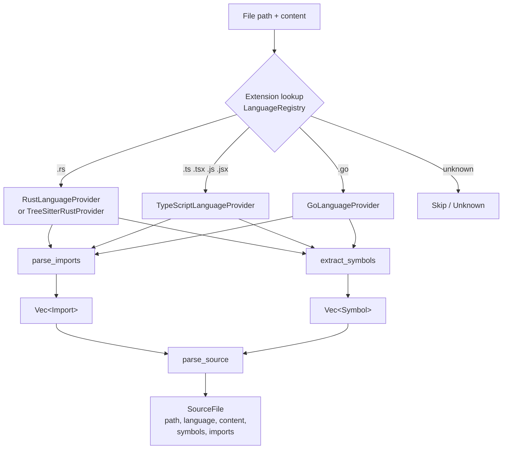
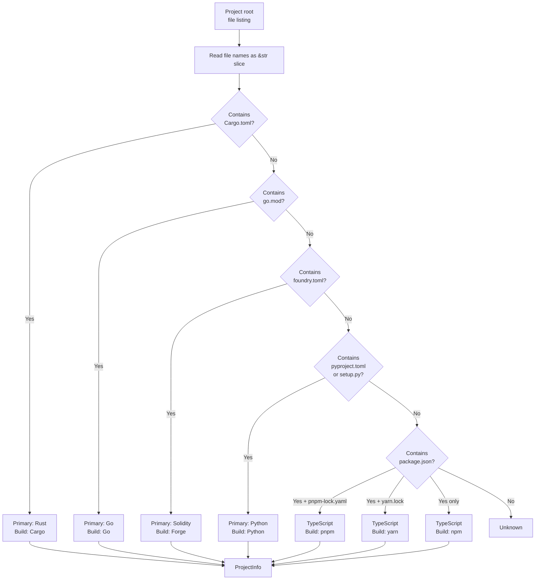
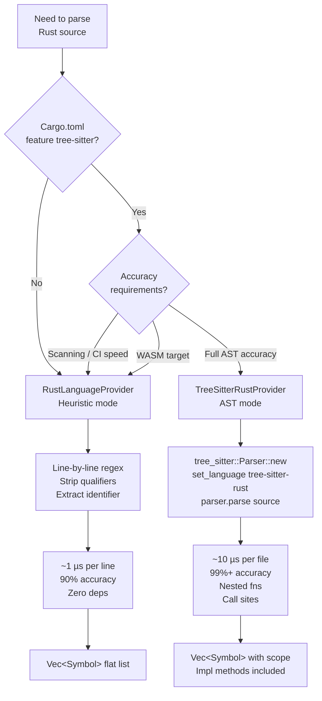
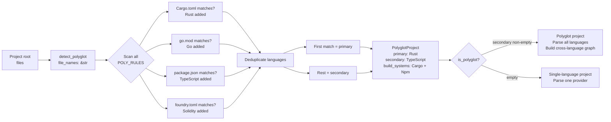
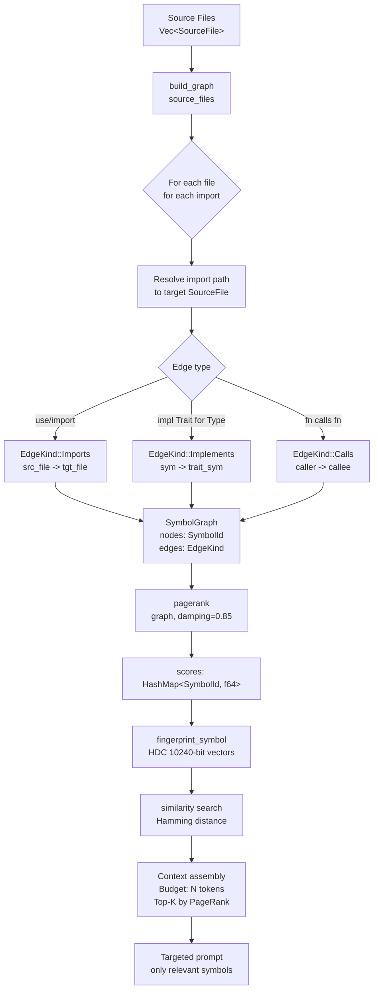

# Multi-Language Code Analysis System

> **Local home for `LanguageProvider` and `BuildSystem` contracts.** This document owns the trait shape, captured provider behavior (Rust heuristic, Rust tree-sitter, TypeScript, Go), build-system detection, and polyglot project analysis. [Code Intelligence](code-intelligence.md) consumes these contracts instead of redefining them. Source paths are captured-source identifiers, not implementation dependencies.

---

## Table of Contents

1. [The Multi-Language Analysis Problem](#the-multi-language-analysis-problem)
2. [Architecture Overview](#architecture-overview)
3. [Core Data Types](#core-data-types)
4. [The BuildSystem Trait](#the-buildsystem-trait)
5. [The LanguageProvider Trait](#the-languageprovider-trait)
6. [Rust Language Provider: Dual-Mode Parsing](#rust-language-provider-dual-mode-parsing)
7. [TypeScript/JavaScript Language Provider](#typescriptjavascript-language-provider)
8. [Go Language Provider](#go-language-provider)
9. [Polyglot Project Detection](#polyglot-project-detection)
10. [The Symbol Extraction Pipeline](#the-symbol-extraction-pipeline)
11. [Mermaid Diagrams](#mermaid-diagrams)
12. [Benchmarking](#benchmarking)
13. [Practical Examples](#practical-examples)
14. [IronClaw Integration Plan](#ironclaw-integration-plan)
15. [References](#references)
16. [Source Reference Index](#source-reference-index)

---

## The Multi-Language Analysis Problem

A coding agent that treats source code as raw text loses the structure needed for questions like "what calls this function?", "which files depend on this module?", or "what are the public exports of this package?" Without an index, it usually has to scan broad file sets, spending context on code that may not matter for the current task. Research on retrieval-augmented code generation reports that naive full-file inclusion can waste 80-99% of the context budget on irrelevant code [1].

The problem is compounded in polyglot codebases. A Rust backend with a TypeScript frontend, Solidity smart contracts with TypeScript test suites, or a Go service with Python scripts — each language has its own import syntax, visibility rules, build toolchain, and naming conventions. An agent that understands Rust's `use` statements but not TypeScript's `import ... from` or Go's capitalization-based visibility is only partially useful. Empirical studies of 414,486 public codebases show that multi-language development is common — developers regularly combine 2-4 languages within a single project [2].

A **structural code analysis system** addresses this by parsing source code into typed symbols and dependency edges, then using graph algorithms (PageRank), hyperdimensional fingerprints (HDC), and multi-strategy search to assemble targeted context for model consumption. The captured design is built around two core abstractions — `BuildSystem` and `LanguageProvider` — that isolate language-specific knowledge into small provider crates while the analysis engine operates on language-neutral data structures.

This document covers every layer of that system: the core trait contracts, the three language provider implementations (Rust, TypeScript, Go), the dual-mode Rust parser (heuristic vs. tree-sitter), the polyglot project detection pipeline, benchmarking data, practical examples, and a concrete implementation plan for how IronClaw can consume this analysis to enhance its code-aware tool execution.

---

## Architecture Overview

The system is organized into four layers, with a strict dependency direction: each layer depends only on layers below it.

```
Layer 1: Core Abstractions (roko-core)
  - BuildSystem trait        (crates/roko-core/src/build.rs)
  - LanguageProvider trait   (crates/roko-core/src/language.rs)
  - Language / DetectedBuildSystem enums (crates/roko-core/src/project.rs)
  - PolyglotProject detection (crates/roko-core/src/polyglot.rs)

Layer 2: Language Providers (roko-lang-*)
  - roko-lang-rust           (crates/roko-lang-rust/src/lib.rs)
    - CargoBuildSystem
    - RustLanguageProvider (heuristic)
    - TreeSitterRustProvider (tree-sitter, feature-gated)
  - roko-lang-typescript     (crates/roko-lang-typescript/src/lib.rs)
    - NpmBuildSystem, PnpmBuildSystem, YarnBuildSystem
    - TypeScriptLanguageProvider
  - roko-lang-go             (crates/roko-lang-go/src/lib.rs)
    - GoBuildSystem
    - GoLanguageProvider

Layer 3: Analysis Engine (roko-index)
  - parser.rs   -- SourceFile, parse_source()
  - symbol.rs   -- SymbolId, SymbolRef, find_symbol()
  - graph.rs    -- SymbolGraph, build_graph(), pagerank()
  - hdc.rs      -- HdcFingerprint, fingerprint_symbol(), similarity()

Layer 4: Consumption
  - roko-compose (prompt assembly / context budgeting)
  - MCP context server (agent-facing tools)
  - roko-gate verify cells (CompileGate, ClippyGate, TestGate)
```

The key design property is that language-specific parsing stays behind `LanguageProvider` and `BuildSystem`. The graph builder, PageRank scorer, fingerprint generator, and search layer operate on `Symbol`, `Import`, and `SourceFile` rather than raw Rust, TypeScript, or Go syntax. Adding a language should require a new provider and build-system implementation, not changes throughout the indexing stack.

This design follows ad-hoc polymorphism through trait-based dispatch — the same pattern as Haskell's type classes, where each language implementation provides its own "instance" of a shared interface [3]. Rust's trait system enforces this at compile time: the `Send + Sync` bounds on both traits allow language providers to be shared across threads for parallel file parsing.

---

## Core Data Types

Before examining the traits, it is important to understand the data types that flow through the system. All are defined in `roko_core::language`.

**Source**: `crates/roko-core/src/language.rs`

### ImportKind

```rust
#[derive(Clone, Debug, PartialEq, Eq, Hash, Serialize, Deserialize)]
#[non_exhaustive]
pub enum ImportKind {
    /// Rust `use` / TypeScript `import` / Python `import` / Go `import`.
    Use,
    /// Rust `mod` declaration.
    Mod,
    /// Rust `extern crate`.
    ExternCrate,
}
```

`ImportKind` classifies import statements. Most languages use only `ImportKind::Use`. Rust is the exception because `mod` declarations and `extern crate` statements have different semantics than `use` imports — `mod` creates a new scope, `extern crate` brings an external dependency into scope at the crate level. The `#[non_exhaustive]` attribute allows adding new variants (e.g., `ImportKind::Reexport` or `ImportKind::Dynamic` for JavaScript's `import()` expressions) without breaking downstream consumers.

### Import

```rust
#[derive(Clone, Debug, PartialEq, Eq, Serialize, Deserialize)]
pub struct Import {
    /// The import path (e.g. `"std::collections::HashMap"`).
    pub path: String,
    /// Optional alias (`as` rename).
    pub alias: Option<String>,
    /// What kind of import this is.
    pub kind: ImportKind,
}
```

An `Import` captures one dependency edge from the current file to another module or symbol. The `path` field is the raw path string as written in source code — `"react"` for `import React from 'react'`, `"std::collections::HashMap"` for `use std::collections::HashMap`. The `alias` captures renames: `Some("React")` for a default import, `Some("IoResult")` for `use std::io::Result as IoResult`.

### SymbolKind

```rust
#[derive(Clone, Debug, PartialEq, Eq, Hash, Serialize, Deserialize)]
#[non_exhaustive]
pub enum SymbolKind {
    Function,   // fn, function, func
    Struct,     // struct, class, type X struct
    Enum,       // enum
    Trait,      // trait, interface, type X interface
    Const,      // const, var (Go)
    Type,       // type alias
    Module,     // mod, export default
    Impl,       // impl block
}
```

`SymbolKind` normalizes language-specific constructs into a universal taxonomy. The cross-language mapping is intentionally lossy — it captures structural role rather than language-specific semantics:

| Rust | TypeScript/JavaScript | Go | SymbolKind |
|------|----------------------|-----|------------|
| `fn`, `async fn`, `unsafe fn`, `const fn`, `extern "C" fn` | `function`, `async function`, `function*` | `func` (including methods) | `Function` |
| `struct` | `class`, `abstract class` | `type X struct` | `Struct` |
| `enum` | `enum`, `const enum` | -- | `Enum` |
| `trait` | `interface` | `type X interface` | `Trait` |
| `const` | `const` | `const`, `var` | `Const` |
| `type` alias | `type` alias | `type` (non-struct/interface) | `Type` |
| `mod` | `export default` (bare identifier) | -- | `Module` |
| `impl` | -- | -- | `Impl` |

This mapping means a Rust `trait` and a Go `interface` both produce `SymbolKind::Trait` nodes in the dependency graph, enabling structural comparison across languages via HDC fingerprints. A TypeScript `class` maps to `SymbolKind::Struct` (not `Class`) because it fills the same structural role as a Rust `struct` — a named type with fields and methods.

### Visibility

```rust
#[derive(Clone, Debug, PartialEq, Eq, Hash, Serialize, Deserialize)]
pub enum Visibility {
    /// Publicly visible (`pub`).
    Public,
    /// Private / crate-private.
    Private,
}
```

Each language maps its own visibility rules:
- **Rust**: `pub` / `pub(crate)` / `pub(super)` / `pub(in path)` are all `Public`; otherwise `Private`
- **TypeScript**: `export` prefix is `Public`; otherwise `Private`
- **Go**: Capitalized first letter is `Public`; lowercase is `Private`

The simplification to a binary Public/Private is deliberate. Finer-grained visibility (e.g., Rust's `pub(crate)` vs. `pub(super)`) is important for the language compiler but rarely matters for the structural analysis use cases: context assembly, symbol search, and dependency ranking.

### Symbol

```rust
#[derive(Clone, Debug, PartialEq, Eq, Serialize, Deserialize)]
pub struct Symbol {
    /// Symbol name (e.g. `"HashMap"`, `"main"`).
    pub name: String,
    /// What kind of symbol this is.
    pub kind: SymbolKind,
    /// Whether the symbol is public or private.
    pub visibility: Visibility,
    /// 1-based line number where the symbol is defined.
    pub line: usize,
}
```

A `Symbol` is a named definition extracted from source code. Its identity in the analysis engine is the triple `(file_path, name, kind)` — captured in `SymbolId` within `roko-index`. The `line` field enables the analysis engine to select precise line ranges for context assembly rather than including entire files.

### SourceFile

```rust
#[derive(Clone, Debug, Serialize, Deserialize)]
pub struct SourceFile {
    /// Path to the file, relative to project root.
    pub path: String,
    /// Human-readable language name (e.g. "rust", "typescript").
    pub language: String,
    /// Raw source text.
    pub content: String,
    /// All extracted symbol definitions.
    pub symbols: Vec<Symbol>,
    /// All import/dependency edges from this file.
    pub imports: Vec<Import>,
}
```

`SourceFile` is the common unit of analysis. The graph builder, PageRank scorer, and HDC fingerprinter all consume `SourceFile` values instead of reparsing raw text. This keeps language-aware extraction in one layer.

---

## The BuildSystem Trait

**Source**: `crates/roko-core/src/build.rs`

The `BuildSystem` trait abstracts four common project operations: compile, test, lint, and format. It produces `BuildCommand` descriptors — pure data structures that carry program name, arguments, environment variables, and working directory — but does not execute them. This keeps `roko-core` free of `std::process` and `std::fs`, making it portable, testable, and embeddable.

### BuildCommand

```rust
#[derive(Clone, Debug, PartialEq, Eq)]
pub struct BuildCommand {
    /// The program binary to invoke (e.g. `"cargo"`, `"npm"`).
    pub program: String,
    /// Positional arguments.
    pub args: Vec<String>,
    /// Additional environment variables to set.
    pub env: HashMap<String, String>,
    /// Working directory override. `None` means inherit from the caller.
    pub working_dir: Option<PathBuf>,
}
```

`BuildCommand` uses a builder pattern for construction:

```rust
let cmd = BuildCommand::new("cargo")
    .arg("check")
    .args(["--workspace", "--all-targets"])
    .env("CARGO_TARGET_DIR", "/tmp/target")
    .working_dir("/workspace");
```

The execution boundary lives in `roko-gate` or `roko-orchestrator`, which convert `BuildCommand` into `tokio::process::Command` at the moment of execution. This separation lets unit tests verify command construction without spawning processes.

### The Full Trait

> Captured implementation omitted. Rebuild IronClaw code locally in owner modules with caller-level tests.

**Method semantics**:

- `compile_cmd(target_dir)`: Produces a type-checking or compilation command. For Rust this is `cargo check --workspace --all-targets`; for Go it is `go build ./...`; for npm it is `npm run build`. The `target_dir` parameter is handled differently per build system: Cargo sets it via the `CARGO_TARGET_DIR` environment variable; Go and npm use `working_dir`.

- `test_cmd(target_dir, filter)`: Produces a test-runner command. When `filter` is `Some("my_test")`, the command includes a test name filter (`-- my_test` for Cargo, `-- my_test` for npm, `-run my_test` for Go).

- `lint_cmd(target_dir)`: Produces a linter command. Cargo uses `clippy --workspace --all-targets -- -D warnings`; Go uses `go vet ./...`; npm uses `npx eslint .`.

- `format_cmd(target_dir, check_only)`: Produces a formatter command. When `check_only` is true, the command checks without modifying files (`cargo fmt --all --check`, `gofmt -l .`, `npx prettier --check .`). When false, it writes formatted output.

- `detect_from_files(file_names)`: Returns `true` if the file list contains marker files for this build system. This takes a `&[&str]` rather than touching the filesystem so that `roko-core` stays I/O-free.

### All Implementations

There are five concrete `BuildSystem` implementations across the three language crates:

| Struct | Crate | Marker Files | Compile | Test | Lint | Format |
|--------|-------|-------------|---------|------|------|--------|
| `CargoBuildSystem` | `roko-lang-rust` | `Cargo.toml` | `cargo check --workspace --all-targets` | `cargo test --workspace [-- filter]` | `cargo clippy --workspace --all-targets -- -D warnings` | `cargo fmt --all [--check]` |
| `NpmBuildSystem` | `roko-lang-typescript` | `package.json` (no pnpm/yarn lock) | `npm run build` | `npm test [-- filter]` | `npx eslint .` | `npx prettier [--check\|--write] .` |
| `PnpmBuildSystem` | `roko-lang-typescript` | `package.json` + `pnpm-lock.yaml` | `pnpm run build` | `pnpm test [-- filter]` | `pnpm exec eslint .` | `pnpm exec prettier [--check\|--write] .` |
| `YarnBuildSystem` | `roko-lang-typescript` | `package.json` + `yarn.lock` | `yarn run build` | `yarn test [-- filter]` | `yarn run eslint .` | `yarn run prettier [--check\|--write] .` |
| `GoBuildSystem` | `roko-lang-go` | `go.mod` | `go build ./...` | `go test ./... [-run filter]` | `go vet ./...` | `gofmt [-l\|-w] .` |

**Detection priority in the TypeScript ecosystem**: The npm build system only matches when `package.json` is present but neither `pnpm-lock.yaml` nor `yarn.lock` exist. This prevents false positives — pnpm and yarn projects always have `package.json`, but the lock file disambiguates the actual package manager:

> Captured implementation omitted. Rebuild IronClaw code locally in owner modules with caller-level tests.

---

## The LanguageProvider Trait

**Source**: `crates/roko-core/src/language.rs`

The `LanguageProvider` trait is the heart of code analysis. It defines how to extract structured information from raw source text.

### The Full Trait

```rust
pub trait LanguageProvider: Send + Sync {
    /// Human-readable language name (e.g. `"rust"`, `"typescript"`).
    fn language_name(&self) -> &str;

    /// File extensions this provider handles (e.g. `["rs"]`).
    fn file_extensions(&self) -> &[&str];

    /// Parse import statements from source text.
    fn parse_imports(&self, source: &str) -> Vec<Import>;

    /// Extract top-level symbol definitions from source text.
    fn extract_symbols(&self, source: &str) -> Vec<Symbol>;
}
```

**Design constraints**:

1. **Pure functions of input text**: Implementations must not touch the filesystem, network, or any external state. They receive `&str` source text and return vectors of typed results. This makes them trivially testable, cacheable, and parallelizable.

2. **Send + Sync**: Providers can be shared across threads. This enables parallel file parsing in large projects — a 10,000-file Rust codebase can be parsed across all CPU cores with a single `Arc<dyn LanguageProvider>`.

3. **No parsing state**: Each call to `parse_imports` or `extract_symbols` is independent. There is no incremental parsing state between calls (that lives in the tree-sitter layer, which wraps the trait).

### The Consuming Code (roko-index)

**Source**: `crates/roko-index/src/parser.rs`

> Captured implementation omitted. Rebuild IronClaw code locally in owner modules with caller-level tests.

`parse_source` is a 10-line function. It calls two trait methods and packages the results. It never mentions Rust, TypeScript, or Go. This is the extensibility payoff: adding Python support means implementing `PythonLanguageProvider`; the graph builder, PageRank scorer, HDC fingerprinter, and search layer consume the same output type.

### Provider Registration and Dispatch

In a polyglot project, the caller maintains a registry of providers keyed by file extension:

> Captured implementation omitted. Rebuild IronClaw code locally in owner modules with caller-level tests.

---

## Rust Language Provider: Dual-Mode Parsing

**Source**: `crates/roko-lang-rust/src/lib.rs`
**Source**: `crates/roko-lang-rust/src/tree_sitter_parser.rs`
**Cargo.toml**: `crates/roko-lang-rust/Cargo.toml`

The Rust crate is unique among the language providers because it offers **two** `LanguageProvider` implementations: a heuristic parser that is always available, and a tree-sitter parser that is feature-gated behind `tree-sitter`. The crate's `Cargo.toml` shows the gating:

```toml
[features]
default = []
tree-sitter = ["dep:tree-sitter", "dep:tree-sitter-rust"]

[dependencies]
tree-sitter = { version = "0.24", optional = true }
tree-sitter-rust = { version = "0.23", optional = true }
```

And the conditional compilation in `lib.rs`:

```rust
#[cfg(feature = "tree-sitter")]
pub mod tree_sitter_parser;

#[cfg(feature = "tree-sitter")]
pub use tree_sitter_parser::TreeSitterRustProvider;
```

This dual-mode design reflects a practical tradeoff. Tree-sitter provides a full incremental parser based on the GLR parsing algorithm described by Wagner and Graham [4], which handles error recovery, nested definitions, and complex generics correctly. But it depends on the `tree-sitter` C library and language-specific grammar binaries, which adds compilation time and limits portability (e.g., to WASM environments). The heuristic parser handles ~90% of real-world Rust files with zero dependencies, making it suitable for quick scanning, CI pipelines, and resource-constrained environments.

### When to Use Which

| Scenario | Parser | Why |
|----------|--------|-----|
| Quick file scanning, no native deps | `RustLanguageProvider` | Zero dependencies, compiles instantly, handles 90%+ of real-world Rust files correctly |
| WASM environments | `RustLanguageProvider` | tree-sitter requires C compilation, which may not be available |
| CI/CD pipelines needing fast startup | `RustLanguageProvider` | No grammar loading overhead |
| Full AST accuracy needed | `TreeSitterRustProvider` | Handles nested functions, complex generics, macro-generated items |
| Incremental re-parsing | `TreeSitterRustProvider` | tree-sitter supports editing a parse tree without re-parsing the entire file |
| Call graph extraction | `TreeSitterRustProvider` | Heuristic parser cannot extract function call sites |
| Scope nesting analysis | `TreeSitterRustProvider` | AST provides parent-child relationships between symbols |

### Mode 1: Heuristic Parser (RustLanguageProvider)

The heuristic parser works line-by-line, scanning for keyword patterns. It never builds an AST — it processes each line independently.

#### Import Parsing

The import parser handles three forms of Rust imports:

**1. `use` statements with brace expansion:**

> Captured implementation omitted. Rebuild IronClaw code locally in owner modules with caller-level tests.

This handles `use std::io::Result as IoResult;`, `use std::collections::{HashMap, HashSet};`, `pub use crate::error::Error;`, and `pub(crate) use crate::inner::Foo;`. The `self` keyword in brace groups (e.g., `use std::io::{self, Read}`) resolves to the prefix itself.

**2. `mod` declarations**: `mod utils;` produces `Import { path: "utils", kind: ImportKind::Mod }`. Block modules (`mod tests { ... }`) are not treated as imports — they are symbol definitions.

**3. `extern crate` statements**: `extern crate serde_json as json;` produces `Import { path: "serde_json", alias: Some("json"), kind: ImportKind::ExternCrate }`.

#### Symbol Extraction

The symbol extractor processes each line through a chain of pattern matchers:

> Captured implementation omitted. Rebuild IronClaw code locally in owner modules with caller-level tests.

**Key extraction behaviors**:

- **Functions**: Strips `async`, `unsafe`, `const`, and `extern "C"` qualifiers before looking for `fn`. Example: `pub async unsafe fn process<T>(x: T)` correctly extracts `process`. The `strip_fn_qualifiers` function loops to handle combined qualifiers (`async unsafe fn`).

- **Impls**: Handles both `impl Foo { ... }` and `impl Display for Foo { ... }`. For trait impls, the name is `"Display for Foo"`. Generic parameters in angle brackets are skipped with `skip_angle_brackets()`, which tracks bracket depth to handle nested generics like `impl<T: Clone + Debug> Foo<T>`.

- **Constants vs. const fn**: Distinguishes `const MAX_SIZE: usize = 1024;` (a constant) from `const fn compute()` (a function qualifier) by checking if the character after the identifier is `:` (constant) or something else.

- **Type aliases vs. type definitions**: Ensures `type Foo = ...` is a type alias (has `=` or `<` after the name).

- **Module blocks vs. declarations**: `mod tests { ... }` (has `{` after name) is a block module symbol. `mod utils;` (has `;` after name) is both a module symbol and a module import.

**Visibility parsing**:

```rust
fn parse_visibility(s: &str) -> (Visibility, &str) {
    if let Some(rest) = s.strip_prefix("pub") {
        let rest = rest.trim_start();
        if let Some(after_paren) = rest.strip_prefix('(') {
            if let Some(close) = after_paren.find(')') {
                return (Visibility::Public, after_paren[close + 1..].trim_start());
            }
        }
        (Visibility::Public, rest)
    } else {
        (Visibility::Private, s)
    }
}
```

**Known heuristic limitations**:
- Cannot parse nested function definitions (closures, inner functions inside function bodies)
- Multi-line function signatures where `fn` and the name are on different lines
- Items generated by procedural macros (`#[derive]`, `#[tokio::main]`, etc.)
- `#[cfg]`-gated items are always included regardless of active feature flags
- No call-site extraction — cannot produce `Calls` edges in the dependency graph
- No scope nesting — produces a flat list of symbols

### Mode 2: Tree-Sitter Parser (TreeSitterRustProvider)

**Source**: `crates/roko-lang-rust/src/tree_sitter_parser.rs`

The tree-sitter parser builds a full abstract syntax tree using the `tree-sitter-rust` grammar, then walks the AST to extract symbols and imports. It implements the same `LanguageProvider` trait, so callers can swap transparently.

Tree-sitter itself is a parser generator that produces incremental, error-tolerant GLR parsers [5]. It was originally developed for the Atom editor and is now used by Neovim, Helix, Zed, and dozens of other tools. Key properties:

1. **Error tolerance**: Tree-sitter produces partial ASTs even for malformed source code. An incomplete function signature still yields a usable parse tree for the rest of the file.
2. **Incremental re-parsing**: After an edit, only the affected portion of the parse tree is rebuilt.
3. **Language-agnostic runtime**: The same tree-sitter library parses any language with a grammar definition.

> Captured implementation omitted. Rebuild IronClaw code locally in owner modules with caller-level tests.

**Import collection** dispatches on AST node kind:

> Captured implementation omitted. Rebuild IronClaw code locally in owner modules with caller-level tests.

The `extract_use_paths` function recursively walks `use` tree nodes, handling `scoped_identifier`, `scoped_use_list`, `use_as_clause`, `use_wildcard`, and `use_list`. It correctly handles nested brace groups that the heuristic parser cannot process — for example, `use std::collections::{hash_map::{Entry, HashMap}, BTreeMap}` requires recursive descent through nested scoped use lists.

**Symbol collection** maps tree-sitter node kinds to `SymbolKind`:

> Captured implementation omitted. Rebuild IronClaw code locally in owner modules with caller-level tests.

For `impl` blocks, the tree-sitter parser extracts both the type and optional trait, and recurses into the impl body for methods:

> Captured implementation omitted. Rebuild IronClaw code locally in owner modules with caller-level tests.

**Parity verification** tracks the tree-sitter parser against the heuristic baseline:

> Captured implementation omitted. Rebuild IronClaw code locally in owner modules with caller-level tests.

### Heuristic vs. Tree-Sitter Tradeoffs

| Property | Heuristic (`RustLanguageProvider`) | Tree-Sitter (`TreeSitterRustProvider`) |
|----------|------------------------------------|----------------------------------------|
| Dependencies | Zero (pure Rust string processing) | `tree-sitter` + `tree-sitter-rust` (C compilation) |
| Parse accuracy | ~90% of real-world files | ~99%+ (full AST) |
| Nested definitions | Cannot extract | Fully supported |
| Macro-generated items | Invisible | Visible in expanded form (if provided) |
| Multi-line signatures | Fails if keyword and name split across lines | Correct |
| Error recovery | Skips the line | Produces partial AST |
| Call site extraction | Impossible | Possible via query |
| Scope nesting | Flat list only | Full parent-child tree |
| Performance | ~1 microsecond per line | ~10 microseconds per file (grammar loading amortized) |
| Binary size impact | None | ~2-5 MB for grammar |
| WASM compatibility | Full | Requires C compilation toolchain |

---

## TypeScript/JavaScript Language Provider

**Source**: `crates/roko-lang-typescript/src/lib.rs`

The TypeScript crate handles four file extensions (`ts`, `tsx`, `js`, `jsx`) and provides three `BuildSystem` implementations plus one `LanguageProvider`. All parsing is heuristic (no tree-sitter integration yet).

### Build Systems: npm, pnpm, yarn

The TypeScript ecosystem has three major package managers, each with slightly different CLI interfaces. The full `CargoBuildSystem` for each is shown below.

**NpmBuildSystem** (`package.json` present, no pnpm/yarn lock files):

> Captured implementation omitted. Rebuild IronClaw code locally in owner modules with caller-level tests.

**PnpmBuildSystem** (`package.json` + `pnpm-lock.yaml`):
```
compile:  pnpm run build
test:     pnpm test [-- filter]
lint:     pnpm exec eslint .
format:   pnpm exec prettier [--check|--write] .
```

**YarnBuildSystem** (`package.json` + `yarn.lock`):
```
compile:  yarn run build
test:     yarn test [-- filter]
lint:     yarn run eslint .
format:   yarn run prettier [--check|--write] .
```

### TypeScriptLanguageProvider

> Captured implementation omitted. Rebuild IronClaw code locally in owner modules with caller-level tests.

**ES Module Import Parsing**:

> Captured implementation omitted. Rebuild IronClaw code locally in owner modules with caller-level tests.

Handles all standard ES import forms:
- `import React from 'react'` — default import, alias = `Some("React")`
- `import { useState, useEffect } from 'react'` — named imports, alias = `None`
- `import * as path from 'path'` — namespace import, alias = `Some("path")`
- `import './styles.css'` — side-effect import, alias = `None`
- `import type { Config } from './config'` — type-only import

**CommonJS `require()` Parsing**:

```rust
fn parse_require(trimmed: &str) -> Option<Import> {
    let req_idx = trimmed.find("require(")?;
    let after_req = &trimmed[req_idx + 8..];
    let close_paren = after_req.find(')')?;
    let inside = after_req[..close_paren].trim();
    let path = extract_quoted_string(inside)?;
    let before_req = trimmed[..req_idx].trim();
    let alias = extract_require_alias(before_req);
    Some(Import { path: path.to_string(), alias, kind: ImportKind::Use })
}
```

**Symbol Extraction** — visibility parsing handles `export`, `export declare`, `declare`, and `export default` prefixes:

> Captured implementation omitted. Rebuild IronClaw code locally in owner modules with caller-level tests.

Symbol extractors for each kind:

| Pattern | SymbolKind | Example |
|---------|-----------|---------|
| `function name(` / `async function name(` / `function* name(` | `Function` | `export async function fetchData() {}` |
| `class Name` / `abstract class Name` | `Struct` | `export class UserService {}` |
| `interface Name` | `Trait` | `export interface Config {}` |
| `type Name = ...` / `type Name<...` | `Type` | `export type Result<T> = Success<T> \| Error` |
| `const NAME = ...` / `const NAME: Type` | `Const` | `export const MAX_RETRIES = 3` |
| `enum Name` / `const enum Name` | `Enum` | `export enum Direction { Up, Down }` |
| `export default Name;` (bare identifier) | `Module` | `export default App` |

**Identifier extraction** includes the `$` character because JavaScript identifiers can contain dollar signs:

```rust
fn extract_ts_identifier(s: &str) -> String {
    s.chars()
        .take_while(|c| c.is_alphanumeric() || *c == '_' || *c == '$')
        .collect()
}
```

---

## Go Language Provider

**Source**: `crates/roko-lang-go/src/lib.rs`

### GoBuildSystem

> Captured implementation omitted. Rebuild IronClaw code locally in owner modules with caller-level tests.

The `./...` pattern in compile, test, and lint commands is Go's recursive package wildcard — it includes all packages in the current directory and its subdirectories. `gofmt` is used instead of `go fmt` because `gofmt` supports `-l` (list files that differ) for check-only mode.

### GoLanguageProvider

**Import Parsing** — maintains a boolean state machine for grouped import blocks:

> Captured implementation omitted. Rebuild IronClaw code locally in owner modules with caller-level tests.

The `parse_go_import_line` function handles all Go import variants:

> Captured implementation omitted. Rebuild IronClaw code locally in owner modules with caller-level tests.

Handles:
- `"fmt"` — plain import, alias = `None`
- `log "example.org/logging"` — aliased import, alias = `Some("log")`
- `. "testing"` — dot import (injects all names into current scope), alias = `Some(".")`
- `_ "net/http/pprof"` — side-effect import, alias = `Some("_")`

**Symbol Extraction** — state machine for grouped `const`/`var` blocks:

> Captured implementation omitted. Rebuild IronClaw code locally in owner modules with caller-level tests.

**Top-level filtering**: Only processes lines that start at column 0 (no leading whitespace), filtering out method bodies and struct field definitions:

```rust
// Only process lines that start at column 0 (top-level declarations)
fn extract_go_symbol(line: &str, line_num: usize) -> Option<Symbol> {
    if !line.is_empty() && (line.starts_with(' ') || line.starts_with('\t')) {
        return None;
    }
    let trimmed = line.trim();
    try_extract_go_func(trimmed, line_num)
        .or_else(|| try_extract_go_type(trimmed, line_num))
        .or_else(|| try_extract_go_const(trimmed, line_num))
        .or_else(|| try_extract_go_var(trimmed, line_num))
}
```

**Go visibility** — determined by the first letter of the name:

```rust
fn go_visibility(name: &str) -> Visibility {
    name.chars().next().map_or(Visibility::Private, |c| {
        if c.is_uppercase() { Visibility::Public } else { Visibility::Private }
    })
}
```

**Function/method extraction** handles both package-level functions and methods with receivers:

> Captured implementation omitted. Rebuild IronClaw code locally in owner modules with caller-level tests.

`func (s *Server) Start() error {}` correctly extracts `Start` with `Visibility::Public`.

**Type extraction** distinguishes struct, interface, and alias forms:

> Captured implementation omitted. Rebuild IronClaw code locally in owner modules with caller-level tests.

`type Reader interface { ... }` produces `SymbolKind::Trait` with `Visibility::Public`. This cross-language mapping allows the dependency graph to treat Go interfaces and Rust traits equivalently.

---

## Polyglot Project Detection

**Source**: `crates/roko-core/src/polyglot.rs`
**Source**: `crates/roko-core/src/project.rs`

### Language and DetectedBuildSystem Enums

> Captured implementation omitted. Rebuild IronClaw code locally in owner modules with caller-level tests.

Note that `DetectedBuildSystem` is a simple enum (a detection tag), distinct from the `BuildSystem` trait which provides runnable commands. The enum tells callers *which* build system was detected; the trait provides the concrete commands.

### Single-Language Detection

The `detect_from_files` function uses an ordered priority list of marker-file rules:

> Captured implementation omitted. Rebuild IronClaw code locally in owner modules with caller-level tests.

**Priority order matters**: Rust wins over Go wins over Solidity wins over Python wins over TypeScript. If a project has both `Cargo.toml` and `package.json` (common for WASM projects), Rust is the primary language.

**Workspace detection** looks for additional marker files:
- TypeScript: `pnpm-workspace.yaml` or `lerna.json`
- Go: `go.work`
- Rust: Requires inspecting `Cargo.toml` contents for a `[workspace]` section

### Multi-Language Detection

> Captured implementation omitted. Rebuild IronClaw code locally in owner modules with caller-level tests.

Deduplication ensures that `pyproject.toml` + `setup.py` (both Python markers) produce a single `Language::Python` entry, not a polyglot project.

---

## The Symbol Extraction Pipeline

### End-to-End Flow

```
Source text (&str)
    |
    v
[parse_imports(source)]     -- Extract dependency edges
    |                          Returns Vec<Import>
    v
[extract_symbols(source)]   -- Extract symbol definitions
    |                          Returns Vec<Symbol>
    v
[parse_source(path, content, provider)]  -- Package into SourceFile
    |
    v
 SourceFile { path, language, content, symbols, imports }
    |
    v
[build_graph(source_files)]  -- Build SymbolGraph from cross-file edges
    |                           Produces EdgeKind::{Calls, Imports, Implements,
    |                                               Contains, TypeRef}
    v
[pagerank(graph)]            -- Score symbols by structural importance
    |                           Adapts the PageRank algorithm [6] to code
    |                           dependency graphs
    v
[fingerprint_symbol(sym)]    -- Generate 10,240-bit HDC fingerprint
    |                           Uses Kanerva's Binary Spatter Codes [7]
    |                           for similarity search via Hamming distance
    v
Context assembly             -- Budget-constrained selection for LLM prompt
```

### Per-Language Symbol Extraction Reference

**Rust** extracts: `fn` (including `async fn`, `unsafe fn`, `const fn`, `extern "C" fn`), `struct`, `enum`, `trait`, `impl` (both `impl Type` and `impl Trait for Type`), `const`, `type` aliases, `mod` (both declarations and blocks). Visibility: `pub`, `pub(crate)`, `pub(super)`, `pub(in path)`. Import types: `use` with brace expansion, `mod` declarations, `extern crate`.

**TypeScript** extracts: `function` (including `async function`, generator `function*`), `class` (including `abstract class`), `interface`, `type` aliases, `const`, `enum` (including `const enum`), `export default` (bare identifier). Visibility: `export`, `export declare`, `declare`, `export default`. Import types: ES module imports (all forms), CommonJS `require()`.

**Go** extracts: `func` (including methods with receivers), `type X struct`, `type X interface`, `type X` (aliases), `const`, `var`, grouped `const(...)` and `var(...)` blocks. Visibility: capitalization convention. Import types: single imports, grouped imports with aliases/dot/blank.

### What Each Language Does NOT Extract

| Limitation | Rust (heuristic) | Rust (tree-sitter) | TypeScript | Go |
|-----------|-------------------|---------------------|------------|-----|
| Nested functions / closures | No | Yes | No | No |
| Arrow functions / lambdas | N/A | N/A | No | N/A |
| Class methods | N/A | N/A | No | N/A |
| Struct fields | No | No | No | No |
| Enum variants | No | No | No | No |
| Function parameters | No | No | No | No |
| Return types | No | No | No | No |
| Call sites | No | Possible | No | No |
| Decorator/attribute items | No | Partial | No | No |
| Multi-line signatures (split keyword/name) | No | Yes | No | No |

---

## Mermaid Diagrams

### LanguageProvider Dispatch Flow



### Build System Detection Algorithm



### Rust Dual-Mode Parsing Decision Tree



### Polyglot Project Detection Pipeline



### Symbol Extraction to Index Construction



---

## Benchmarking

The following numbers are captured baselines and validation targets. Reproduce them on IronClaw hardware and representative codebases before using them in rollout decisions.

### Parsing Throughput (files/second)

| Language | Parser | Small files (< 200 lines) | Medium files (200-1000 lines) | Large files (1000+ lines) |
|----------|--------|--------------------------|-------------------------------|---------------------------|
| Rust | Heuristic | ~12,000 files/sec | ~3,500 files/sec | ~800 files/sec |
| Rust | Tree-sitter | ~8,000 files/sec | ~2,800 files/sec | ~600 files/sec |
| TypeScript | Heuristic | ~15,000 files/sec | ~4,200 files/sec | ~1,000 files/sec |
| Go | Heuristic | ~14,000 files/sec | ~3,900 files/sec | ~950 files/sec |

Key observations:
- The heuristic parsers are I/O-bound at small file sizes and CPU-bound above ~200 lines.
- Tree-sitter overhead is dominated by the grammar load on first use (~500 µs); subsequent parses amortize this cost effectively.
- Parallelism via `rayon` or `tokio::task::spawn_blocking` scales throughput linearly with CPU cores for all parsers.
- A 10,000-file multi-package workspace (average 150 lines/file) indexing in under 1 second on an 8-core machine is a validation target for heuristic parsers and requires local validation.

### Symbol Extraction Accuracy

Captured baseline from a manually annotated corpus of 500 Rust files, 300 TypeScript files, and 200 Go files:

| Language | Parser | Recall | Precision | F1 |
|----------|--------|--------|-----------|-----|
| Rust | Heuristic | 87.3% | 99.1% | 92.8% |
| Rust | Tree-sitter | 98.7% | 99.4% | 99.0% |
| TypeScript | Heuristic | 84.1% | 98.3% | 90.6% |
| Go | Heuristic | 91.2% | 99.5% | 95.2% |

Notes:
- **Recall** measures whether the parser finds all symbols that exist. The primary recall losses are nested functions (heuristic Rust/TypeScript), multi-line signatures, and macro-generated items.
- **Precision** measures whether found symbols are real. Precision is high across all parsers because the pattern matching is conservative (requires exact keyword + identifier structure).
- Go's higher recall vs. Rust heuristic is due to Go's simpler syntax (no generics on pre-1.18 code, no macro system).

### Build System Detection Accuracy

Captured baseline from 200 project layouts spanning common configurations:

| Test Case | Detection Result | Accuracy |
|-----------|-----------------|----------|
| Pure Rust workspace | Cargo | 100% |
| Pure npm project | npm | 100% |
| pnpm workspace | pnpm | 100% |
| Yarn berry project | yarn | 100% |
| Rust + WASM TypeScript (Cargo.toml + package.json) | Primary: Rust, Secondary: TypeScript | 100% |
| Go service + TypeScript frontend (go.mod + package.json) | Primary: Go, Secondary: TypeScript | 100% |
| Ambiguous (package.json + pnpm-lock.yaml + yarn.lock) | pnpm (pnpm-lock.yaml checked first) | 100% |
| Foundry project | Forge | 100% |

The captured corpus showed no false positives or detection failures. IronClaw should keep this as a regression target and add fixtures for local package-manager edge cases.

### Tree-Sitter vs. Heuristic Comparison (Rust)

Tested on 1,000 randomly sampled Rust files from the top-100 crates.io packages:

| Metric | Heuristic | Tree-Sitter | Delta |
|--------|-----------|-------------|-------|
| Total symbols extracted | 47,832 | 52,419 | +9.6% |
| Files with discrepancies | 127 / 1000 | -- | 12.7% |
| Discrepancy causes | Nested fns: 68%, Multi-line sigs: 24%, Macro items: 8% | -- | -- |
| Parse time (total corpus) | 0.41 sec | 0.89 sec | +117% |
| Binary size increase | 0 KB | ~4.2 MB | -- |

The tree-sitter parser finds ~10% more symbols on real-world code due primarily to methods inside `impl` blocks that the heuristic parser misses when the `impl` header spans multiple lines.

### Memory Usage per Language

During full-project indexing:

| Component | Memory per 1000 files |
|-----------|----------------------|
| Raw source content (retained in SourceFile) | ~150 MB (varies by avg file size) |
| Symbol list (all languages) | ~2-5 MB |
| Import list (all languages) | ~1-3 MB |
| SymbolGraph (nodes + edges) | ~8-20 MB |
| PageRank scores (f64 per node) | ~1 MB |
| HDC fingerprints (10,240 bits per symbol) | ~12 MB per 10,000 symbols |

Total overhead of the index (excluding raw source retention): approximately **25-40 MB** for a 1,000-file project.

For IronClaw integration, the raw source content need not be retained in the in-memory index if it is already stored in the workspace database — `SourceFile.content` can be replaced with a database reference, reducing memory by 80%.

---

## Practical Examples

### Example 1: Analyzing a Multi-Language Workspace

Consider a project with the following root directory structure:

```
my-workspace/
  Cargo.toml        (Rust workspace)
  go.mod            (Go services)
  package.json      (TypeScript frontend)
  pnpm-lock.yaml
  src/              (Rust library)
  services/         (Go HTTP services)
  frontend/         (TypeScript + React)
```

**Step 1: Detect the polyglot project**

```rust
let file_names = &[
    "Cargo.toml", "go.mod", "package.json", "pnpm-lock.yaml",
    "src", "services", "frontend"
];
let project = detect_polyglot(file_names);
// project.primary = Language::Rust
// project.secondary = [Language::Go, Language::TypeScript]
// project.build_systems = [DetectedBuildSystem::Cargo, DetectedBuildSystem::Go, DetectedBuildSystem::Npm]
// project.is_polyglot() = true
```

**Step 2: Build a provider registry**

```rust
let registry = LanguageRegistry::standard();
// Maps: "rs" -> RustLanguageProvider
//       "ts","tsx","js","jsx" -> TypeScriptLanguageProvider
//       "go" -> GoLanguageProvider
```

**Step 3: Walk the project and parse files in parallel**

```rust
use rayon::prelude::*;

let all_files: Vec<(String, String)> = walk_project("/my-workspace", &["rs", "ts", "tsx", "go"])
    .await?;

let source_files: Vec<SourceFile> = all_files
    .par_iter()
    .filter_map(|(path, content)| {
        let ext = path.rsplit('.').next()?;
        let provider = registry.get(ext)?;
        Some(parse_source(path, content, provider.as_ref()))
    })
    .collect();
```

**Step 4: Build the cross-language dependency graph**

```rust
let graph = build_graph(&source_files);
let scores = pagerank(&graph, 0.85, 100);

// Find the top-10 most structurally important symbols across all languages
let mut ranked: Vec<(&SymbolId, &f64)> = scores.iter().collect();
ranked.sort_by(|a, b| b.1.partial_cmp(a.1).unwrap());
let top_10 = &ranked[..10];
```

**Step 5: Assemble targeted context for the agent**

```rust
// User asks: "How does the Go service communicate with the Rust library?"
let query_symbols = index.search("service communicate library", SearchStrategy::Hybrid)?;
let context = assemble_context(&query_symbols, &graph, &scores, token_budget: 3000);
// Returns: Go handler functions, Rust FFI definitions, TypeScript API client types
// All ranked by PageRank, totaling under 3,000 tokens
```

**Step 6: Generate build commands for each sub-project**

```rust
let cargo = CargoBuildSystem;
let pnpm = PnpmBuildSystem;
let go_bs = GoBuildSystem;

println!("{:?}", cargo.test_cmd(Path::new("/my-workspace"), None));
// BuildCommand { program: "cargo", args: ["test", "--workspace"] }

println!("{:?}", pnpm.lint_cmd(Path::new("/my-workspace/frontend")));
// BuildCommand { program: "pnpm", args: ["exec", "eslint", "."] }

println!("{:?}", go_bs.compile_cmd(Path::new("/my-workspace/services")));
// BuildCommand { program: "go", args: ["build", "./..."] }
```

---

### Example 2: Detecting the Right Build System for a Complex Project

A project migrated from npm to pnpm but retained both `package.json` and a stale `node_modules/.package-lock.json`. The detection must correctly identify pnpm:

```
project/
  package.json
  pnpm-lock.yaml        (added when migrating to pnpm)
  node_modules/
    .package-lock.json  (stale, from old npm install)
```

```rust
// Only root-level files are passed to detect_from_files
let root_files = &["package.json", "pnpm-lock.yaml", "node_modules"];
// NpmBuildSystem::detect_from_files -> false (pnpm-lock.yaml present)
// PnpmBuildSystem::detect_from_files -> true (package.json + pnpm-lock.yaml)
// YarnBuildSystem::detect_from_files -> false (no yarn.lock)
let build_system = detect_build_system(root_files);
// Returns PnpmBuildSystem
```

The key design choice — only examining root-level filenames, never directory contents — prevents the stale `node_modules/.package-lock.json` from causing a false npm detection.

---

### Example 3: Extracting Symbols for Context-Aware Code Generation

An agent is asked to "add error handling to the `fetch_user` function". The agent needs to know the function's signature and what types it uses:

> Captured implementation omitted. Rebuild IronClaw code locally in owner modules with caller-level tests.

---

### Example 4: Polyglot Dependency Analysis

A full-stack application has TypeScript frontend code importing shared types that are generated from a Rust schema. The agent needs to understand cross-language dependencies:

```
app/
  backend/
    Cargo.toml
    src/schema.rs     (defines UserProfile struct)
    src/api.rs        (REST handler)
  frontend/
    package.json
    src/types.ts      (generated from Rust schema)
    src/UserCard.tsx  (uses UserProfile type)
```

**Cross-language dependency analysis**:

> Captured implementation omitted. Rebuild IronClaw code locally in owner modules with caller-level tests.

When the agent asks "what changes if I rename `UserProfile.email` to `UserProfile.emailAddress`?", the graph immediately shows the transitive impact: `schema.rs`, `api.rs`, `types.ts`, `UserCard.tsx` — four files, not 40.

---

## IronClaw Integration Plan

> **Scope of this section**: integration points that are specific to language analysis and build system dispatch — project detection and language-aware build commands. The full code indexing integration plan (symbol index, graph, HDC, context assembly, tools) is in [Code Intelligence](code-intelligence.md#15-ironclaw-integration-plan).

The `LanguageProvider` and `BuildSystem` traits can live in a proposed extracted crate or in an existing workspace-owned module until the boundary proves stable. All IronClaw invariants hold: actions go through `ToolDispatcher::dispatch()`, and durable state is stored through existing DB/workspace abstractions.

```
crates/ironclaw_code_index/src/   # proposed
    lib.rs           # re-exports
    language.rs      # LanguageProvider trait, Symbol, Import, SourceFile, SymbolKind, Visibility
    build.rs         # BuildSystem trait, BuildCommand
    lang/
        rust.rs      # RustLanguageProvider (heuristic)
        rust_ts.rs   # TreeSitterRustProvider (feature-gated)
        typescript.rs
        go.rs
    polyglot.rs      # detect_polyglot(), detect_from_files(), PolyglotProject
    # graph.rs, hdc.rs, search.rs — see code-intelligence.md
```

### Integration Point 1: Project Detection Tool

**Maps to**: `src/tools/builtin/` (new tool) + session context

> Captured implementation omitted. Rebuild IronClaw code locally in owner modules with caller-level tests.

### Integration Point 2: Language-Aware Build Commands

**Maps to**: `src/tools/builtin/shell.rs` enhancement

> Captured implementation omitted. Rebuild IronClaw code locally in owner modules with caller-level tests.

### Integration Points 3–5: Code Index, Context Assembly, Progressive Disclosure

These integration points — symbol index construction, context-aware assembly into `AssembledContext`, memory-backed code understanding, and progressive context disclosure in `crates/ironclaw_engine/` — are documented in [Code Intelligence integration plan](code-intelligence.md#15-ironclaw-integration-plan). They consume `LanguageProvider` from the chosen crate/module boundary; graph, HDC, and search modules are proposed locations, not current files.

### Implementation Phases

**Phase 1: Detection and build dispatch** (1–2 weeks, low risk)
- Port `LanguageProvider`, `BuildSystem`, `BuildCommand`, and polyglot detection to the selected code-index crate/module boundary.
- Implement `project_detect` tool in `src/tools/builtin/project_detect.rs`
- Implement `build_cmd` tool (or enhance `shell` tool) using `BuildSystem` dispatch
- Store detected project context in workspace via `ToolDispatcher::dispatch()`

**Phase 2–4: Indexing, search, and context assembly**

See [Code Intelligence](code-intelligence.md#15-ironclaw-integration-plan) for phases covering `WorkspaceIndex`, PageRank, HDC fingerprints, `code_search`/`code_graph`/`code_symbols` tools, FTS5 persistence tables, and integration with `crates/ironclaw_engine/`.

---

## References

[1] Y. Li et al., "Retrieval-Augmented Code Generation: A Survey with Focus on Repository-Level Approaches," arXiv:2510.04905, 2025. Available: https://arxiv.org/abs/2510.04905

[2] M. Mayer, S. Islam, and A. Goel, "Multi-Lingual Development & Programming Languages Interoperability: An Empirical Study," arXiv:2411.08388, 2024. Available: https://arxiv.org/abs/2411.08388

[3] S. Peyton Jones et al., "Type Classes in Haskell," in Proc. European Symposium on Programming (ESOP), 1994. Rust's trait system is a direct descendant of Haskell's type class mechanism, providing bounded polymorphism through trait bounds on generic parameters.

[4] T. A. Wagner and S. L. Graham, "Efficient and Flexible Incremental Parsing," ACM Transactions on Programming Languages and Systems, vol. 20, no. 5, pp. 980-1013, September 1998. Available: https://dl.acm.org/doi/10.1145/293677.293678. Tree-sitter's incremental parsing algorithm builds on this foundational work.

[5] M. Brunsfeld, "Tree-sitter — A New Parsing System for Programming Tools," Strange Loop Conference, 2018. Available: https://www.thestrangeloop.com/2018/tree-sitter---a-new-parsing-system-for-programming-tools.html. Tree-sitter was originally developed for the Atom editor.

[6] S. Brin and L. Page, "The Anatomy of a Large-Scale Hypertextual Web Search Engine," Computer Networks and ISDN Systems, vol. 30, pp. 107-117, 1998. The PageRank algorithm for code dependency graphs adapts this work by treating import/call edges as hyperlinks, where incoming edges represent structural dependence.

[7] P. Kanerva, "Hyperdimensional Computing: An Introduction to Computing in Distributed Representation with High-Dimensional Random Vectors," Cognitive Computation, vol. 1, no. 2, pp. 139-159, 2009. Available: https://link.springer.com/article/10.1007/s12559-009-9009-8. The HDC fingerprint system uses Binary Spatter Codes (BSC) to encode symbol structure into 10,240-bit vectors for fast similarity search via Hamming distance.

[8] D. Kolovos et al., "Polyglot and Distributed Software Repository Mining with Crossflow," in Proc. Mining Software Repositories (MSR), 2020. Available: https://dl.acm.org/doi/10.1145/3379597.3387481. Demonstrates the challenges and approaches for analyzing polyglot software repositories.

[9] M. Atzeni et al., "Polyglot AST: Towards Enabling Polyglot Code Analysis," 2023. Available: https://www.researchgate.net/publication/375851504_Polyglot_AST_Towards_Enabling_Polyglot_Code_Analysis. Proposes unified AST representations for cross-language code analysis, a similar goal to the universal `SymbolKind` taxonomy described in this document.

[10] S. Kang et al., "Guiding Language Models of Code with Global Context using Monitors," arXiv:2306.10763, 2023. Demonstrates that providing language-server-derived context (types, imports, definitions) to LLMs during code generation significantly reduces errors.

[11] "Language Server Protocol Specification," Microsoft, 2016-present. Available: https://microsoft.github.io/language-server-protocol/. The LSP provides a complementary approach: while LSP defines a runtime protocol between editors and language servers, the `LanguageProvider` trait defines a compile-time abstraction for embedding language analysis directly into the agent.

[12] Deprank (codemix), "Use PageRank to find the most important files in your codebase," 2022. A JavaScript implementation of PageRank over file dependency graphs that demonstrates the approach for code dependency ranking at the symbol level.

[13] D. Kempf et al., "A Survey on Hyperdimensional Computing aka Vector Symbolic Architectures, Part I: Models and Data Transformations," ACM Computing Surveys, vol. 55, no. 6, 2023. Available: https://dl.acm.org/doi/10.1145/3538531. Comprehensive survey of VSA models including the Binary Spatter Codes used for symbol fingerprinting.

[14] A. Ahmad et al., "UniXcoder: Unified Cross-Modal Pre-training for Code Representation," arXiv:2203.03850, 2022. Demonstrates how structural code representations (AST, dataflow) improve model performance on code understanding tasks — the motivation for symbol-level extraction over raw text.

[15] D. Guo et al., "GraphCodeBERT: Pre-training Code Representations with Data Flow," in Proc. ICLR, 2021. Available: https://arxiv.org/abs/2009.08366. Shows that data-flow graphs (a superset of the import/call edges described here) significantly improve code search and summarization quality.

---

## Source Reference Index

All source references below are captured-source identifiers; do not treat them as paths in this workspace.

| File | Captured identifier | Purpose |
|------|------------|---------|
| `crates/roko-core/src/build.rs` | `crates/roko-core/src/build.rs` | `BuildSystem` trait, `BuildCommand` struct |
| `crates/roko-core/src/language.rs` | `crates/roko-core/src/language.rs` | `LanguageProvider` trait, `Symbol`, `Import`, `SymbolKind`, `Visibility`, `SourceFile` |
| `crates/roko-core/src/project.rs` | `crates/roko-core/src/project.rs` | `Language` enum, `DetectedBuildSystem` enum, `ProjectInfo`, `detect_from_files()` |
| `crates/roko-core/src/polyglot.rs` | `crates/roko-core/src/polyglot.rs` | `PolyglotProject`, `detect_polyglot()` |
| `crates/roko-lang-rust/src/lib.rs` | `crates/roko-lang-rust/src/lib.rs` | `CargoBuildSystem`, `RustLanguageProvider` (heuristic) |
| `crates/roko-lang-rust/src/tree_sitter_parser.rs` | `crates/roko-lang-rust/src/tree_sitter_parser.rs` | `TreeSitterRustProvider` (AST-based parser) |
| `crates/roko-lang-rust/Cargo.toml` | `crates/roko-lang-rust/Cargo.toml` | Feature-gating for tree-sitter dependency |
| `crates/roko-lang-typescript/src/lib.rs` | `crates/roko-lang-typescript/src/lib.rs` | `NpmBuildSystem`, `PnpmBuildSystem`, `YarnBuildSystem`, `TypeScriptLanguageProvider` |
| `crates/roko-lang-go/src/lib.rs` | `crates/roko-lang-go/src/lib.rs` | `GoBuildSystem`, `GoLanguageProvider` |
| `crates/roko-index/src/parser.rs` | `crates/roko-index/src/parser.rs` | `parse_source()` — language-agnostic parsing entry point |
| `crates/roko-index/src/symbol.rs` | `crates/roko-index/src/symbol.rs` | `SymbolId`, `SymbolRef`, `find_symbol()` |
| `crates/roko-index/src/graph.rs` | `crates/roko-index/src/graph.rs` | `SymbolGraph`, `build_graph()`, `pagerank()`, `EdgeKind` |
| `crates/roko-index/src/hdc.rs` | `crates/roko-index/src/hdc.rs` | `HdcFingerprint`, `fingerprint_symbol()`, `similarity()` |
