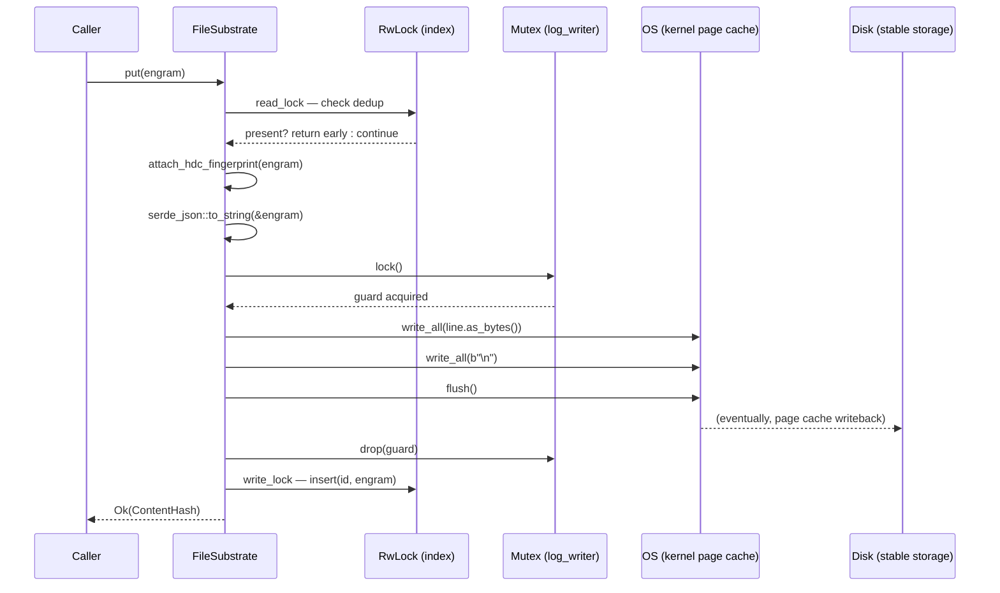
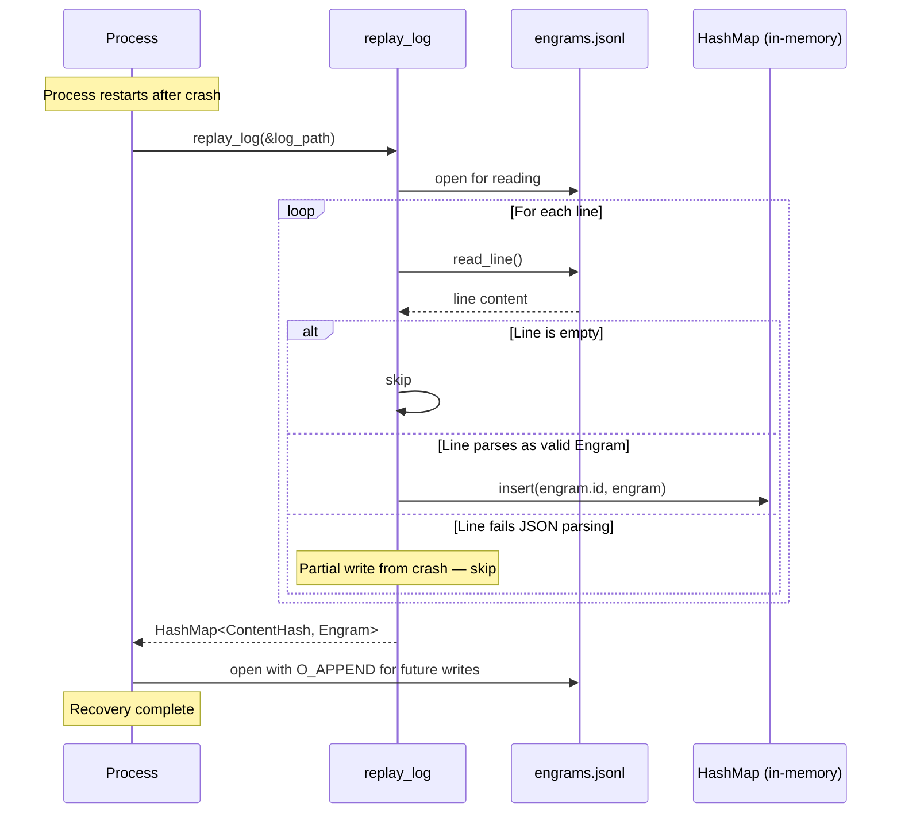
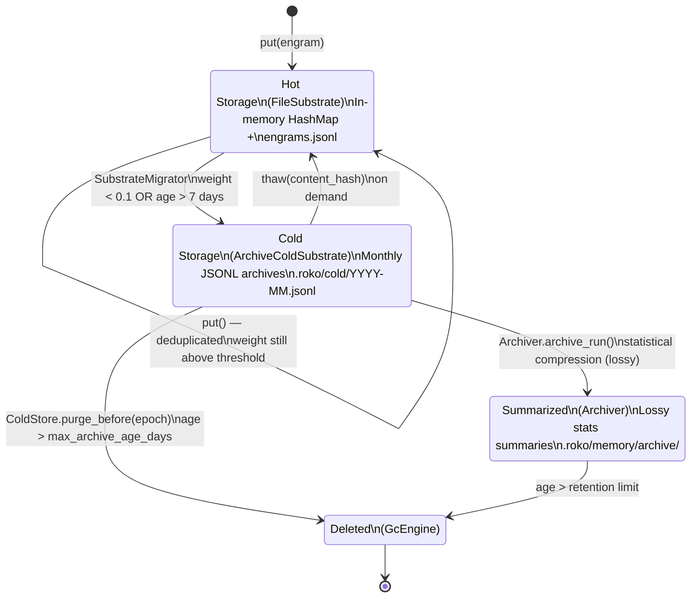
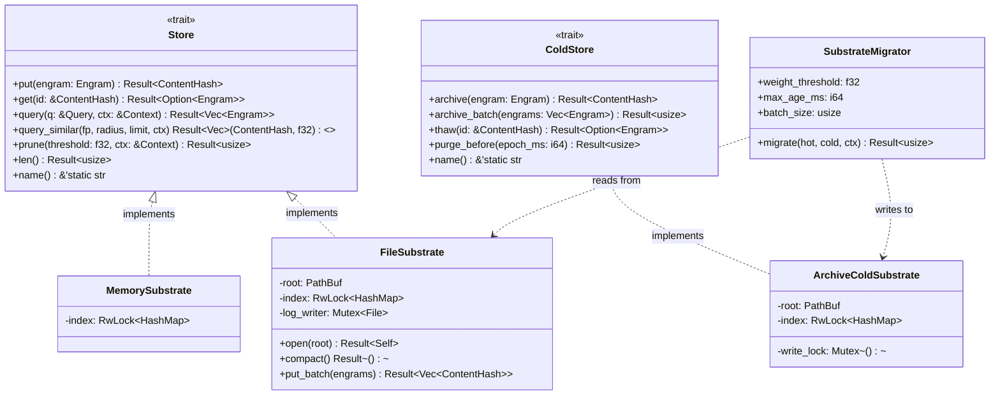
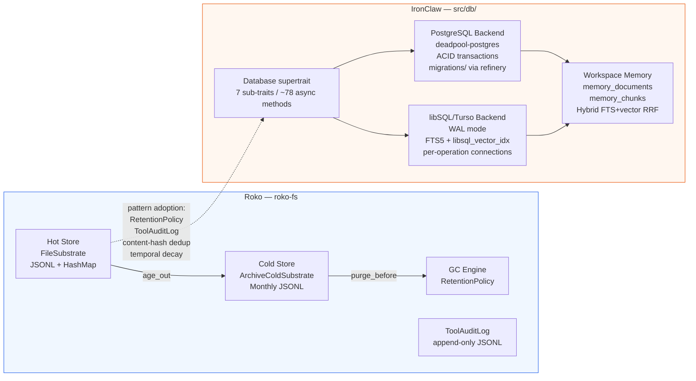

# Roko Persistence and Storage Layer

**Source crate**: `roko-fs` (``crates/roko-fs/``)

> **Companion documents**: [universal-engram.md](../core-concepts/universal-engram.md) (Engram struct, decay, content hashing), [budget-composition.md](budget-composition.md) (cache-aware prompt assembly that reads stored Engrams), [code-intelligence.md](code-intelligence.md) (hybrid search layer that writes Engrams), [schemas/02-storage-and-migrations.md](../implementation/schemas/02-storage-and-migrations.md) (backend migrations), [schemas/04-canonical-event-and-persistence-contract.md](../implementation/schemas/04-canonical-event-and-persistence-contract.md) (persistent event shapes).

---

## Table of Contents

1. [Storage Philosophy: Why Append-Only JSONL](#1-storage-philosophy-why-append-only-jsonl)
2. [The Store Trait — The Kernel Storage Contract](#2-the-store-trait--the-kernel-storage-contract)
3. [The Engram — What Gets Stored](#3-the-engram--what-gets-stored)
4. [FileSubstrate — The Crash-Safe JSONL Storage Engine](#4-filesubstrate--the-crash-safe-jsonl-storage-engine)
5. [Crash-Safe Write Protocols](#5-crash-safe-write-protocols)
6. [The Directory Layout — `.roko/` Structure](#6-the-directory-layout--roko-structure)
7. [Hot/Cold Tiering — The ColdStore Trait](#7-hotcold-tiering--the-coldstore-trait)
8. [The GC (Garbage Collection) Engine](#8-the-gc-garbage-collection-engine)
9. [Specialized JSONL Sinks](#9-specialized-jsonl-sinks)
10. [The Archiver — Compressing Old Data Into Summaries](#10-the-archiver--compressing-old-data-into-summaries)
11. [Crash Recovery Architecture](#11-crash-recovery-architecture)
12. [The Observability Layer](#12-the-observability-layer)
13. [Design Patterns Summary](#13-design-patterns-summary)
14. [Mermaid Diagrams](#14-mermaid-diagrams)
15. [Benchmarking and Performance Characteristics](#15-benchmarking-and-performance-characteristics)
16. [Practical Examples](#16-practical-examples)
17. [Comparison with IronClaw's Dual-Backend Architecture](#17-comparison-with-ironclaws-dual-backend-architecture)
18. [IronClaw Integration Plan](#18-ironclaw-integration-plan)
19. [Academic References](#19-academic-references)
20. [Related Documents](#20-related-documents)

---

## 1. Storage Philosophy: Why Append-Only JSONL

### 1.1 The Case Against Mutable Storage

Traditional databases optimize for mutable rows, indexes, and transactions. An agent also needs an audit trail: decisions, tool calls, observations, and intermediate results must remain explainable after the fact. Append-only storage is one way to preserve that history; it is a tradeoff, not a replacement for IronClaw's database-backed persistence.

Roko uses **append-only JSONL** (JSON Lines) files — one JSON object per line, appended sequentially, never overwritten. This draws on a long tradition in systems engineering:

- **Log-structured file systems** (Rosenblum and Ousterhout, 1992) showed sequential writes yield higher throughput than random in-place updates [1].
- **Write-ahead logging** (ARIES, Mohan et al., 1992) showed durability and crash recovery can be achieved by writing intentions to a sequential log before applying them [2, 3].
- **Event sourcing** (Fowler, 2005) established storing state as an immutable append-only sequence of domain events, with state reconstructed by replaying the log [4, 5].
- **ESAA-Conversational** (2026) independently validated event sourcing as the persistence backbone for AI coding agent memory [13].

Roko's JSONL approach is a simplification of all three: the log *is* the data, the journal, and the event store.

### 1.2 Properties of Append-Only JSONL

**Simple replay and recovery.** An append-only write either completes (the line is there) or leaves a partial trailing line that can be skipped on replay. Stronger durability still requires `fsync`/`sync_data` and clear truncation rules after partial writes.

**Human readability.** A JSONL file can be inspected with `cat`, filtered with `grep`, parsed with `jq`, diffed with `diff`. This is a key differentiator from binary formats like LevelDB's SST files or SQLite's B-tree pages.

**Immutability as an audit aid.** Because records are never overwritten, the file is easier to inspect and replay. Tamper evidence requires hash chaining or signed checkpoints; append-only layout alone is not enough.

**Simple streaming.** Appending to a file makes backup or live tailing straightforward, but replication still needs ordering, checkpoint, retention, and failure handling.

The crate documentation states this rationale:

> Captured implementation omitted. Rebuild IronClaw code locally in owner modules with caller-level tests.

### 1.3 JSONL Format Specification

- One JSON object per line, terminated by `\n`.
- Empty lines are permitted and silently skipped on replay.
- UTF-8 encoding throughout.
- Objects are self-describing — no positional column schema.

Example from `.roko/tool_audit.jsonl`:

```json
{"kind":"admit","ts_ms":1712345678000,"call":{"id":"c1","name":"read_file","params":{"path":"/project/src/main.rs"}}}
{"kind":"result","ts_ms":1712345679000,"call_id":"c1","call_name":"read_file","result":{"ok":true,"bytes":4096}}
{"kind":"admit","ts_ms":1712345680000,"call":{"id":"c2","name":"shell","params":{"cmd":"cargo test"}}}
```

---

## 2. The Store Trait — The Kernel Storage Contract

Everything in roko flows through the `Store` trait. Full definition from `crates/roko-core/src/traits.rs`, lines 37-80:

> Captured implementation omitted. Rebuild IronClaw code locally in owner modules with caller-level tests.

Key design points:

- **Content-addressed identity**: `put()` returns a `ContentHash` (BLAKE3 digest). Two identical engrams produce the same hash — `put()` is idempotent. The same principle behind Git's object store and IPFS [7]. For Engram details, see [universal-engram.md](../core-concepts/universal-engram.md).
- **Decay-aware pruning**: `prune()` removes engrams whose effective weight has decayed below a threshold — a lifecycle operation, not deletion.
- **HDC similarity search**: `query_similar()` enables hyperdimensional computing-based similarity queries, with a default no-op for backends that do not index HDC vectors.
- **Send + Sync**: All stores are safe for concurrent async access.

### 2.1 Store Trait Hierarchy

```
Store (hot storage)
├── MemorySubstrate     — in-memory only (testing, ephemeral)
└── FileSubstrate       — JSONL + in-memory index (default production)

ColdStore (archive storage)
└── ArchiveColdSubstrate — monthly JSONL archives (.roko/cold/)

// Specialized sinks (separate trait families)
ToolAuditLog            — append-only tool dispatch audit
JsonlTraceSink          — per-trace daily JSONL files
MetricsLog              — per-run task metrics with optional fsync
JsonlMetricsSink        — tool-call aggregate metrics
BanditStore             — multi-armed bandit arm snapshots
PointerStore            — large payload offloading
```

---

## 3. The Engram — What Gets Stored

The universal datum in roko is the **Engram** — a content-addressed, scored, decaying, lineage-tracked record. Every event, tool call, agent output, gate verdict, episode, and knowledge entry is an Engram. Full details on the Engram type — its seven scoring axes, `Decay` variants, and `ContentHash` computation — are in [universal-engram.md](../core-concepts/universal-engram.md). The struct definition from `crates/roko-core/src/engram.rs`, lines 62-98:

> Captured implementation omitted. Rebuild IronClaw code locally in owner modules with caller-level tests.

The content hash is computed over identity fields only (kind, body, author, taint, lineage, tags), excluding mutable fields. This makes `Store.put()` truly idempotent.

### 3.1 Temporal Decay Model

Each engram carries a `Decay` variant. See [universal-engram.md](../core-concepts/universal-engram.md) for the full formulation.

| Decay Variant | Behavior | Use Case |
|---|---|---|
| `None` | Never decays. Weight is constant. | Identity records, configuration. |
| `HalfLife { half_life_ms }` | Exponential: `w(t) = w0 * 2^(-t/h)` | Traces, short-lived signals. |
| `Ttl { ttl_ms }` | Hard time-to-live; weight drops to zero. | Cache entries, session context. |
| `Ebbinghaus` | Forgetting curve: `w(t) = w0 / ln(t + e)` | Recall-dependent knowledge. |

```rust
pub fn weight_at(&self, now_ms: i64) -> f32 {
    let age = now_ms - self.created_at_ms;
    self.score.effective() * self.decay.apply(age)
}
```

The `Ebbinghaus` variant is inspired by Ebbinghaus's 1885 forgetting curve research [8]. For an AI agent accumulating thousands of memories, this model naturally surfaces recent and frequently-accessed information.

The budget-composition system reads engrams from the store and uses their `weight_at()` score when constructing bid values for density allocation plus VCG-style diagnostics — see [budget-composition.md](budget-composition.md) §5 (The 8 Attention Bidders).

### 3.2 Content Hashing

BLAKE3 is used for all content addressing: 10-20x faster than SHA-256 on modern hardware, 256-bit output, resistant to length extension and collision attacks.

---

## 4. FileSubstrate — The Crash-Safe JSONL Storage Engine

`FileSubstrate` is the concrete `Store` implementation in `roko-fs` and the default production backend.

### 4.1 Structure and Initialization

From `crates/roko-fs/src/file_substrate.rs`, lines 23-33:

```rust
pub struct FileSubstrate {
    root: PathBuf,
    /// In-memory index: ContentHash -> Engram.
    index: RwLock<HashMap<ContentHash, Engram>>,
    /// Serializes writes to the log file.
    log_writer: Mutex<File>,
    #[allow(dead_code)]
    name: String,
}
```

Dual-layer architecture:

1. **On-disk**: An append-only `engrams.jsonl` file — the source of truth.
2. **In-memory**: A `HashMap<ContentHash, Engram>` index for fast reads.

Concurrency model:

- **Reads** use `parking_lot::RwLock` (synchronous, non-blocking for concurrent readers).
- **Writes** use `tokio::sync::Mutex` (async, serializes log file writes).

This mirrors the in-memory index + on-disk log design of LSM-tree based systems like LevelDB and RocksDB, with the radical simplification that the on-disk component is a flat JSONL file rather than an SSTable hierarchy [9].

### 4.2 Opening and Replay

> Captured implementation omitted. Rebuild IronClaw code locally in owner modules with caller-level tests.

### 4.3 The Crash Recovery Replay Function

> Captured implementation omitted. Rebuild IronClaw code locally in owner modules with caller-level tests.

Critical crash-safety properties:

1. Partial last line is silently skipped (process died mid-write).
2. Earlier valid lines are always preserved.
3. No separate WAL or journal is needed — the JSONL file *is* the journal.
4. Malformed lines anywhere in the file are skipped (partial availability over total failure).

### 4.4 The Write Protocol

> Captured implementation omitted. Rebuild IronClaw code locally in owner modules with caller-level tests.

Write sequence: (1) deduplication check, (2) HDC fingerprint attachment, (3) JSON serialization, (4) acquire write lock, (5) append line + newline, (6) flush to kernel buffer, (7) drop write lock, (8) update in-memory index.

Note: `flush()` without `fsync()` pushes data to the kernel page cache but does not ensure stable storage. A power failure could lose the last few unfsynced writes, but a process crash will not (the kernel's page cache survives process death).

### 4.5 Batch Writes

> Captured implementation omitted. Rebuild IronClaw code locally in owner modules with caller-level tests.

The three-phase design minimizes lock contention: expensive JSON serialization happens without any lock held; the write lock is held only during I/O; within-batch deduplication via `seen_ids`.

### 4.6 Query Execution

Queries run entirely against the in-memory index — zero disk I/O for reads:

> Captured implementation omitted. Rebuild IronClaw code locally in owner modules with caller-level tests.

Results are sorted by effective weight (highest first), applying the temporal decay factors from each engram's `Decay` variant. The budget-composition system (see [budget-composition.md](budget-composition.md)) receives these pre-sorted results and uses the weight scores as inputs to density allocation and diagnostics.

### 4.7 Pruning

```rust
// Source: `crates/roko-fs/src/file_substrate.rs`, lines 317-325
async fn prune(&self, threshold: f32, ctx: &Context) -> Result<usize> {
    let mut index = self.index.write();
    let before = index.len();
    index.retain(|_, s| s.weight_at(ctx.now_ms) > threshold);
    Ok(before - index.len())
    // Note: the log file is not rewritten here; call compact() to
    // reclaim disk space.
}
```

Pruning removes decayed engrams from the in-memory index but does not rewrite the log file. The `compact()` method handles disk-side cleanup — analogous to how LSM-trees separate memtable eviction from SSTable compaction [9].

---

## 5. Crash-Safe Write Protocols

### 5.1 Append-Only Writes (JSONL Logs)

Used for: engrams, tool audit events, metrics, traces, bandit arm snapshots.

On POSIX systems, `O_APPEND` atomically sets the file offset to the end of the file before each write. For regular files, concurrent append behavior still depends on filesystem and write size; serialize writers through a mutex when log records must remain intact.

`flush()` without `fsync()` means data may remain in the kernel page cache and be lost on power failure (though not on process crash). The `MetricsLog` and `JsonlMetricsSink` sinks offer optional `fsync` via `sync_data()` for workloads requiring stronger durability.

### 5.2 Atomic Write-Tmp-Rename (JSON Snapshots)

Used for: executor snapshots, orchestrator snapshots, run state, cascade router state, gate thresholds, bandit router state.

> Captured implementation omitted. Rebuild IronClaw code locally in owner modules with caller-level tests.

The temp file (e.g., `data.json.tmp`) is kept on the same filesystem as the target, which is required for POSIX `rename()` atomicity. Note: `atomic_write_bytes()` does *not* call `fsync()` on the temp file — a deliberate simplification for files where losing the last snapshot is acceptable.

### 5.3 Compaction — The Strict fsync Variant

`FileSubstrate::compact()` uses a stricter variant that calls `sync_all()` before rename:

> Captured implementation omitted. Rebuild IronClaw code locally in owner modules with caller-level tests.

The compaction protocol: (1) snapshot in-memory index, (2) write to temp file, (3) `sync_all()` ensures stable storage, (4) atomic rename, (5) re-open log writer. This is the same crash-safe protocol used by PostgreSQL for checkpoint writes and SQLite for WAL commits [3, 11].

---

## 6. The Directory Layout — `.roko/` Structure

The `RokoLayout` struct (in `crates/roko-fs/src/layout.rs`) provides a typed path catalog:

```text
.roko/
  VERSION              # Layout version (currently 1)
  runtime/             # pid files, sockets, locks
  memory/              # episodes, playbook, skills
    episodes.jsonl
    playbook.toml
    skills/
    archive/           # monthly JSONL archives
  plans/               # enrichment artifacts per plan
    {plan_id}/
  runs/                # per-run metrics, traces, snapshots
    {run_id}/
      metrics.jsonl
      traces/
      pointers/
  state/               # orchestrator snapshots, event logs, session state
    executor.json
    orchestrator.json
    run-state.json
    run-ledger.jsonl
    events.json
    sessions/
  config/              # config.toml, presets
  cache/               # cargo-target, context-pack-cache
  learn/               # efficiency events, cascade router, experiments
    efficiency.jsonl
    cascade-router.json
    gate-thresholds.json
    experiments.json
    playbooks/
  cold/                # cold storage archives
    2026-04.jsonl
    index.json
```

| Path | Purpose | Write Pattern |
|---|---|---|
| `.roko/engrams.jsonl` | Main engram log (hot storage) | Append-only JSONL |
| `.roko/episodes.jsonl` | Root episode log | Append-only JSONL |
| `.roko/tool_audit.jsonl` | Tool dispatch audit | Append-only JSONL |
| `.roko/runs/{run_id}/metrics.jsonl` | Per-run metrics | Append-only JSONL |
| `.roko/learn/efficiency.jsonl` | Per-turn efficiency events | Append-only JSONL |
| `.roko/state/executor.json` | Executor snapshot for crash recovery | Atomic write-tmp-rename |
| `.roko/state/orchestrator.json` | Orchestrator snapshot | Atomic write-tmp-rename |
| `.roko/learn/cascade-router.json` | Model routing bandit state | Atomic write-tmp-rename |
| `.roko/learn/gate-thresholds.json` | Adaptive gate thresholds | Atomic write-tmp-rename |

---

## 7. Hot/Cold Tiering — The ColdStore Trait

Roko implements a two-tier storage architecture [12]. Active data stays in the fast in-memory index ("hot"). Aged-out data moves to compressed monthly archives ("cold").

### 7.1 The ColdStore Trait

```rust
// Source: `crates/roko-core/src/traits.rs`, lines 82-151
#[async_trait]
pub trait ColdStore: Send + Sync {
    async fn archive(&self, engram: Engram) -> Result<ContentHash>;
    async fn archive_batch(&self, engrams: Vec<Engram>) -> Result<usize> { /* default */ }
    async fn thaw(&self, id: &ContentHash) -> Result<Option<Engram>>;
    async fn contains(&self, id: &ContentHash) -> Result<bool> { Ok(self.thaw(id).await?.is_some()) }
    async fn archived_count(&self) -> Result<usize> { Ok(0) }
    async fn storage_bytes(&self) -> Result<u64> { Ok(0) }
    async fn purge_before(&self, epoch_ms: i64) -> Result<usize> { Ok(0) }
    fn name(&self) -> &'static str { "unnamed_cold_store" }
}
```

### 7.2 ArchiveColdSubstrate — Monthly JSONL Archives

```rust
// Source: `crates/roko-fs/src/cold_substrate.rs`, lines 1-49
pub struct ArchiveColdSubstrate {
    root: PathBuf,
    /// hash -> archive location
    index: RwLock<HashMap<ContentHash, ColdIndexEntry>>,
    write_lock: Mutex<()>,
}

struct ColdIndexEntry {
    file: String,    // e.g., "2026-04.jsonl"
    offset: u64,     // byte offset within archive file
    archived_at: i64,
}
```

Archives are organized by month (`.roko/cold/2026-04.jsonl`). The in-memory index stores `(file, byte_offset)` for O(1) lookup without scanning archive files. `thaw()` reads from a specific byte offset — a standard technique in log-structured storage [1].

### 7.3 The SubstrateMigrator — Automated Hot-to-Cold Migration

```rust
// Source: `crates/roko-fs/src/cold_substrate.rs`, lines 301-340
pub struct SubstrateMigrator {
    pub weight_threshold: f32,  // default: 0.1
    pub max_age_ms: i64,        // default: 7 days
    pub batch_size: usize,      // default: 100
}
```

Migration flow: `Hot Store → query aged-out engrams → archive to ColdStore → prune from hot`.

---

## 8. The GC (Garbage Collection) Engine

### 8.1 Retention Policy

```rust
// Source: `crates/roko-fs/src/gc.rs`, lines 31-55
pub struct RetentionPolicy {
    pub max_episodes: usize,          // default: 200
    pub max_run_age_days: u32,        // default: 7
    pub max_archive_age_days: u32,    // default: 30
    pub size_threshold_mb: u64,       // default: 500
    pub max_cache_entries: usize,     // default: 2000
}
```

### 8.2 GC Safety Invariants

From the module documentation (`crates/roko-fs/src/gc.rs`, lines 20-24):

```
- Never touches config/    -- user configuration is sacred.
- Never touches runtime/   -- PID files are the running process's responsibility.
- Idempotent               -- re-running GC when nothing exceeds limits is a no-op.
```

### 8.3 GC Modes

The `GcEngine` operates on a `RokoLayout` under a `RetentionPolicy`:

1. **`scan()` / `dry_run()`**: Report what would be removed without touching the filesystem.
2. **`collect()`**: Remove candidates. Individual failures do not abort the run.
3. **`should_auto_gc()`**: Check if total `.roko/` size exceeds the threshold.

```rust
pub struct GcReport {
    pub candidates: Vec<GcCandidate>,
    pub total_bytes: u64,
    pub removed_count: usize,
    pub failed_count: usize,
}
```

---

## 9. Specialized JSONL Sinks

Beyond the main engram store, `roko-fs` provides purpose-built JSONL sinks optimized for specific workloads.

### 9.1 ToolAuditLog

```rust
// Source: `crates/roko-fs/src/tool_audit.rs`, lines 52-55
pub struct ToolAuditLog {
    path: PathBuf,
    writer: Mutex<BufWriter<tokio::fs::File>>,
}
```

Records every tool call admission and result as tagged JSONL. The `kind` discriminator allows `tail -f` filtering without parsing full records.

### 9.2 JsonlTraceSink

```rust
// Source: `crates/roko-fs/src/trace_sink.rs`, lines 54-59
pub struct JsonlTraceSink {
    root: PathBuf,
    inner: Arc<Mutex<Inner>>,
    clock: Clock,
}
```

Organizes traces into daily directories with one file per trace (`.roko/traces/2026-04-05/{trace_id}.jsonl`). Synchronous I/O — traces are best-effort and never block agent execution. Clock injection allows deterministic rotation testing.

### 9.3 MetricsLog

```rust
// Source: `crates/roko-fs/src/metrics.rs`, lines 33-36
pub struct MetricsLog {
    path: PathBuf,
    fsync: bool,
}
```

Optional `sync_data()` after each append: default on, `without_fsync()` available for higher throughput. Opens and closes the file per `append()` call (simplicity over throughput).

### 9.4 JsonlMetricsSink

```rust
// Source: `crates/roko-fs/src/tool_metrics_sink.rs`, lines 54-58
pub struct JsonlMetricsSink {
    path: PathBuf,
    fsync: bool,
    write_lock: Mutex<()>,
}
```

Uses `parking_lot::Mutex` (synchronous) and `std::fs` (synchronous I/O). Implements `roko_core::tool::MetricsSink`. Writes are best-effort: failures go to stderr but do not panic the runtime.

### 9.5 BanditStore

Each bandit key maps to its own `.jsonl` file under `.roko/bandit/`. Writes append full arm-table snapshots; reads return the most recent valid snapshot.

### 9.6 PointerStore

Stores large tool-result payloads (above 4 KiB by default) on disk and references them by pointer ID. Layout: `{root}/runs/{run_id}/pointers/{pointer_id}`. Synchronous I/O because pointer reads happen on the tool-loop hot path.

---

## 10. The Archiver — Compressing Old Data Into Summaries

> Captured implementation omitted. Rebuild IronClaw code locally in owner modules with caller-level tests.

Archives under `.roko/memory/archive/` in monthly JSONL files. Supports: run archival (summarize a run directory into one `ArchiveEntry`, then delete the raw directory), episode compression (reduce N entries into aggregate statistics), and daily sampling. This is the system's lossy compression tier — raw data replaced by statistical summaries while preserving metrics.

---

## 11. Crash Recovery Architecture

### 11.1 Dual Recovery Mechanism

1. **Executor snapshots**: Periodic atomic captures to `.roko/state/executor.json` (write-tmp-rename pattern). Auto-saves every 5 actions — at most 5 actions of work can be lost in a crash.
2. **Event log replay**: Reconstruction from the append-only, hash-chained event log.

### 11.2 Snapshot File Format

```
[4 bytes] magic: 0x524F4B4F ("ROKO")
[4 bytes] version: 1
[4 bytes] payload_length (little-endian)
[N bytes] JSON payload
[32 bytes] BLAKE3 hash of payload
[4 bytes] magic trailer: 0x454E4421 ("END!")
```

Detects truncation, bit flips, and partial writes. The magic-header-payload-hash-trailer pattern is used by PostgreSQL's control file format and Apache Kafka's record batches.

### 11.3 Merged Recovery

When both snapshot and event log are available:
- **Event log wins on conflict** — it may contain events recorded after the snapshot.
- **Disjoint plans are combined** — plans from both sources are included.
- **Hash verification** — BLAKE3 checksums detect corruption at multiple levels.

---

## 12. The Observability Layer

```rust
// Source: `crates/roko-fs/src/observability.rs`, lines 18-23
pub struct FsObservabilitySinks {
    pub trace_sink: Arc<JsonlTraceSink>,
    pub metrics_sink: Arc<JsonlMetricsSink>,
}
```

Single initialization point for all filesystem-backed sinks. `initialize()` is idempotent — re-calling only validates directory existence.

---

## 13. Design Patterns Summary

### 13.1 The Append-Only JSONL Pattern

Used by: `FileSubstrate`, `ToolAuditLog`, `MetricsLog`, `JsonlMetricsSink`, `BanditStore`, `Archiver`, `ArchiveColdSubstrate`.

- One JSON object per line, terminated by `\n`.
- File opened with `create(true).append(true)`.
- Concurrent writes serialized by a mutex.
- Malformed lines silently skipped on replay.
- File is never rewritten (except during compaction).

### 13.2 The Write-Tmp-Rename Pattern

Used by: `atomic_write_json()`, `atomic_write_bytes()`, `FileSubstrate::compact()`, executor snapshot saves.

- Write to a sibling `.tmp` file.
- Optional `fsync` / `sync_all()` before rename (used by `compact()`, omitted by `atomic_write_bytes()`).
- `rename()` over the target (POSIX atomic).
- Clean up temp file on rename failure.

### 13.3 The In-Memory Index + On-Disk Log Pattern

Used by: `FileSubstrate`, `ArchiveColdSubstrate`.

- Reads: zero I/O latency via in-memory `HashMap`.
- Writes: go to both on-disk log and in-memory index.
- Startup: replay log into index.
- Index updates happen *after* successful disk writes.

### 13.4 The Configurable Fsync Pattern

Used by: `MetricsLog`, `JsonlMetricsSink`.

- `sync_data()` called after each write by default.
- `without_fsync()` available for higher throughput.

---

## 14. Mermaid Diagrams

### 14.1 Append-Only Write Flow



### 14.2 Crash Recovery Sequence



### 14.3 Hot/Cold Tiering Lifecycle



### 14.4 Store Trait Hierarchy



### 14.5 Roko vs IronClaw Storage Architecture



---

## 15. Benchmarking and Performance Characteristics

### 15.1 Write Throughput

| Configuration | Throughput | Latency (p99) |
|---|---|---|
| Single write, no fsync | ~50,000 ops/sec | ~200 µs |
| Single write, with fsync | ~1,000-5,000 ops/sec | ~500 µs - 1 ms |
| Batch write (100 records), no fsync | ~2,000,000 records/sec effective | ~5 ms total |
| Batch write (100 records), one fsync | ~50,000-200,000 records/sec | ~5-10 ms total |

**Comparison with SQL-based approaches:**

| Operation | roko FileSubstrate | PostgreSQL INSERT | libSQL INSERT |
|---|---|---|---|
| Single record write | ~50,000 ops/sec | ~10,000-20,000 ops/sec | ~5,000-10,000 ops/sec |
| Batch 100 records | ~2M records/sec | ~200,000-500,000 records/sec | ~50,000-100,000 records/sec |
| Startup/recovery | O(N) log replay (~100ms for 100K records) | N/A | N/A |
| Read single record (in-memory) | O(1) HashMap lookup, ~100 ns | B-tree index scan, ~500 µs | B-tree index scan, ~1 ms |
| Filter query (in-memory scan) | O(N), ~1 ms for 10K records | Index-assisted, ~1-5 ms | Index-assisted, ~2-10 ms |

The JSONL approach wins on write throughput by avoiding transaction overhead, page allocation, and index maintenance. The penalty is O(N) startup replay time as the dataset grows.

### 15.2 Crash Recovery Time

| Log size (records) | Recovery time (approximate) |
|---|---|
| 1,000 | ~10 ms |
| 10,000 | ~100 ms |
| 100,000 | ~1 second |
| 1,000,000 | ~10 seconds |

Single-threaded sequential I/O with JSON parsing. Periodic compaction keeps recovery time bounded.

### 15.3 Storage Space Efficiency

| Format | Space overhead | Compressibility |
|---|---|---|
| JSONL (roko default) | ~2-4x raw data (key names repeated) | ~70-80% gzip ratio |
| MessagePack | ~1.2-1.5x raw data | ~60-70% gzip ratio |
| SQLite B-tree | ~1.5-2x raw data | ~50-60% gzip ratio |
| PostgreSQL JSONB | ~2-3x raw data | ~65-75% gzip ratio |

For typical agent workloads, the space overhead is acceptable. Monthly cold archives are candidates for gzip/zstd compression in a future iteration.

---

## 16. Practical Examples

### 16.1 Append-Only Tool Audit Logging

> Captured implementation omitted. Rebuild IronClaw code locally in owner modules with caller-level tests.

This provides an append-only operational audit trail separate from the mutable `job_actions` table. It becomes tamper-evident only if paired with hash chaining, signed checkpoints, or external log shipping. Operators can `tail -f` the configured audit path for live debugging.

### 16.2 GC Policies for Different Workloads

> Captured implementation omitted. Rebuild IronClaw code locally in owner modules with caller-level tests.

---

## 17. Comparison with IronClaw's Dual-Backend Architecture

### 17.1 IronClaw's Persistence Layer

IronClaw's persistence is built on a **dual-backend database architecture** (`src/db/` — see `src/db/CLAUDE.md`):

- **PostgreSQL** — the default production backend, with full ACID transactions, connection pooling (`deadpool-postgres`), and a migration framework (`refinery`). Uses native `JSONB`, `VECTOR`, `TIMESTAMPTZ`, and `tsvector` types.
- **libSQL/Turso** — an alternative for embedded or edge deployments. SQLite-compatible SQL with FTS5 for text search and `libsql_vector_idx` for vector similarity. **All new persistence features must support both backends.** Connections are created per-operation (no pool); WAL mode with a 5-second busy timeout serializes writes.

All persistence operations are accessed through the `Database` supertrait in `src/db/mod.rs`, which composes seven sub-traits providing ~78 async methods total:

| Sub-trait | Methods | Covers |
|---|---|---|
| `ConversationStore` | 12 | Conversations, messages |
| `JobStore` | 13 | Agent jobs, actions, LLM calls, estimation |
| `SandboxStore` | 13 | Sandbox jobs, job events |
| `RoutineStore` | 15 | Routines, routine runs |
| `ToolFailureStore` | 4 | Self-repair tracking |
| `SettingsStore` | 8 | Per-user key-value settings |
| `WorkspaceStore` | 13 | Memory documents, chunks, hybrid search |

The `Database` supertrait adds `run_migrations()` and combines all sub-traits. Leaf consumers can depend on the narrowest sub-trait they need.

**"LLM data is never deleted" principle**: IronClaw treats all LLM output — context fed to the model, reasoning, tool calls, messages, events, steps — as durable historical data. Tables `llm_calls`, `job_actions`, `conversation_messages`, and `agent_jobs` are protected from GC. In-memory HashMaps are caches; the database is the source of truth. "Cleanup" means evicting from in-memory caches, not deleting protected database rows. This is IronClaw's counterpart to the captured append-only retention model, implemented through protected database tables rather than JSONL-only storage.

**Workspace hybrid search**: The workspace memory system (`src/workspace/`) uses hybrid search combining FTS (keyword) and vector similarity (semantic) via Reciprocal Rank Fusion (RRF):

```
score(d) = Σ 1/(k + rank(d)) for each retrieval method
```

Default k=60. Two fusion strategies: `Rrf` (default) and `WeightedScore`. Documents are chunked at 800-word target chunk size with 15% overlap to preserve context across boundaries. The budget-composition system (see [budget-composition.md](budget-composition.md)) receives search results from the workspace store and bids them into the prompt auction.

### 17.2 SQL Dialect Differences Between IronClaw Backends

| Feature | PostgreSQL | libSQL |
|---|---|---|
| UUIDs | `UUID` type | `TEXT` |
| Timestamps | `TIMESTAMPTZ` | `TEXT` (ISO-8601 RFC 3339 with ms precision) |
| JSON | `JSONB` | `TEXT` |
| Numeric/Decimal | `NUMERIC` | `TEXT` (preserves `rust_decimal` precision) |
| Arrays | `TEXT[]` | `TEXT` (JSON-encoded array) |
| Booleans | `BOOLEAN` | `INTEGER` (0/1) |
| Vector embeddings | `VECTOR` (any dim) | `F32_BLOB(N)` via `libsql_vector_idx` |
| Full-text search | `tsvector` + `ts_rank_cd` | FTS5 virtual table + sync triggers |
| JSON path update | `jsonb_set(col, '{key}', val)` | `json_patch(col, '{"key": val}')` |
| Connection model | `deadpool-postgres` connection pool | New connection per operation |
| Concurrency | Pool-based, fully concurrent | WAL mode + 5 s busy timeout; write serialized |
| Auto-timestamp | `DEFAULT NOW()` | `DEFAULT (datetime('now'))` |

**libSQL gotchas**: JSON merge patch (`json_patch`) uses RFC 7396 semantics — cannot do partial nested updates. Booleans stored as integers (use `get_i64(row, idx) != 0`). Timestamps always written with `fmt_ts(dt)` (RFC 3339 with millisecond precision).

### 17.3 Architectural Comparison

| Concern | Roko (roko-fs) | IronClaw (src/db/) |
|---|---|---|
| **Storage engine** | Append-only JSONL + in-memory HashMap | PostgreSQL / libSQL relational tables |
| **Hot storage** | `FileSubstrate` (JSONL + in-memory index) | B-tree + vector indexes |
| **Cold storage** | `ArchiveColdSubstrate` (monthly JSONL archives) | No explicit cold tier |
| **Retention model** | Append-only log not rewritten except compaction | "LLM data is never deleted" principle; protected tables |
| **Audit trail** | `ToolAuditLog`, `custody.jsonl`, `witness.jsonl` | `ActionRecord` in `job_actions` table |
| **Crash recovery** | Snapshot + event log replay | Database transactions (ACID) |
| **GC policy** | `GcEngine` with `RetentionPolicy` | No formalized GC; core LLM tables are protected |
| **Identity model** | Content-addressed (BLAKE3 `ContentHash`) | UUID-based row identity |
| **Content dedup** | Implicit (same hash = idempotent put) | `content_sha256()` exists in `src/workspace/document.rs` but not used for chunk-level dedup |
| **Decay model** | `Decay` enum (None/HalfLife/Ttl/Ebbinghaus) | No temporal decay |
| **Multi-user** | Single-user (`.roko/` per project) | Multi-user with scope isolation |
| **Transactions** | No transactions (append-only log) | Full ACID (PostgreSQL), WAL (libSQL) |
| **Schema evolution** | JSON schema evolution (forward-compatible) | SQL migrations (refinery / `INCREMENTAL_MIGRATIONS`) |
| **Search** | In-memory filter + optional HDC similarity | Hybrid FTS + vector via RRF |
| **Settings writes** | `atomic_write_json()` (write-tmp-rename) | Direct `std::fs::write` in `src/settings.rs:1319` |

### 17.4 What Roko Gets Right That IronClaw Could Adopt

**1. Formalized retention policies.** Roko's `RetentionPolicy` makes GC behavior explicit, configurable, and testable. IronClaw has the "LLM data is never deleted" invariant for core tables but no formalized policy for non-LLM data (cache entries, old WASM tool binaries, `repair_attempts`). A retention policy type would make GC behavior testable and auditable.

**2. Hot/cold tiering for workspace memory.** IronClaw's workspace accumulates `memory_chunks` rows over time. For the libSQL backend (a single SQLite file), unbounded growth degrades both FTS5 and vector index performance. A cold tier could archive low-relevance old chunks while keeping them retrievable.

**3. Append-only audit logs for tool dispatches.** IronClaw routes all actions through `ToolDispatcher::dispatch()` and records `ActionRecord`s in `job_actions`. A complementary append-only JSONL audit log would improve live observability; tamper evidence requires hash chaining, signed checkpoints, or external log shipping.

**4. Content-addressed deduplication for workspace chunks.** Roko's `ContentHash` makes `put()` idempotent. IronClaw's `memory_write` uses path-based addressing, and `content_sha256()` already exists in `src/workspace/document.rs`. Applying it at the chunk level would prevent duplicate chunks when the same content is written to different paths.

**5. Temporal decay for memory relevance.** Roko's `Decay` model provides principled relevance reduction without deletion. IronClaw's `memory_search` could weight results by temporal decay, improving result relevance for long-lived agents. This also improves cache behavior described in [budget-composition.md](budget-composition.md) §2 ("The U-Shaped Attention Curve") — decayed results land lower in the budget auction.

**6. Crash-safe settings writes.** `src/settings.rs` writes settings via direct `std::fs::write` (line 1319). The write-tmp-rename pattern would protect against corruption if the process is killed during a settings update.

### 17.5 What IronClaw Gets Right That Roko Cannot Match

**1. Multi-user isolation.** IronClaw's database model natively supports multiple users with scope isolation. Roko's `.roko/` directory is single-user.

**2. ACID transactions.** PostgreSQL backend provides full transaction support. Roko's append-only model has no rollback.

**3. Rich query capabilities.** SQL joins, aggregations, and complex filters with database-level optimization. Roko's in-memory scan is O(N) over the entire dataset.

**4. Native hybrid search.** IronClaw's hybrid FTS + vector search via RRF with configurable fusion strategies is more mature as an information retrieval system than roko's HDC similarity search.

**5. Horizontal scalability.** PostgreSQL streaming replication and Turso edge sync provide paths to horizontal scaling that flat-file JSONL cannot match.

---

## 18. IronClaw Integration Plan

The right integration strategy is not to replace IronClaw's database with JSONL files, but to adopt specific patterns where they add value within the existing `src/db/` and `src/workspace/` systems.

### 18.1 Priority Matrix

| Priority | Pattern | IronClaw Location | Rationale |
|---|---|---|---|
| P0 | Crash-safe settings writes | `src/settings.rs` | Low-risk win; protects against corruption on kill |
| P0 | Formalized retention policy | new `src/retention/` | Explicit, testable GC; respects "LLM data never deleted" |
| P1 | Append-only tool audit log | `src/tools/dispatch.rs` | Tamper-evident audit, `tail -f` observability |
| P1 | Content-hash deduplication | `src/workspace/document.rs` | Prevent duplicate chunks; `content_sha256()` already exists |
| P2 | Temporal decay weighting | `src/workspace/search.rs` | Improve memory search relevance for long-lived agents |
| P2 | Hot/cold workspace tiering | `src/db/mod.rs`, `src/workspace/` | Bound libSQL file growth; keep search indexes lean |

### 18.2 P0: Crash-Safe Settings Writes

> Captured implementation omitted. Rebuild IronClaw code locally in owner modules with caller-level tests.

No new dependencies. Test: write settings, kill process immediately after `write()` but before `rename()`, verify original settings file is unmodified on restart.

### 18.3 P0: Formalized Retention Policy

> Captured implementation omitted. Rebuild IronClaw code locally in owner modules with caller-level tests.

GC operations are opt-in, not automatic, to avoid any risk of data loss.

### 18.4 P1: Append-Only Tool Audit Log

> Captured implementation omitted. Rebuild IronClaw code locally in owner modules with caller-level tests.

Complementary to the existing `ActionRecord` in `job_actions`. The JSONL file gives operators a `tail -f` window and simple backup independent of the database.

### 18.5 P1: Content-Hash Deduplication for Workspace Chunks

IronClaw already computes SHA-256 hashes in `src/workspace/document.rs` (`content_sha256()`). Apply at the chunk level:

> Captured implementation omitted. Rebuild IronClaw code locally in owner modules with caller-level tests.

Migration notes:
- PostgreSQL: add `content_hash TEXT` column to `memory_chunks`; add index on `(user_id, document_id, content_hash)`.
- libSQL: add column via `INCREMENTAL_MIGRATIONS` in `libsql_migrations.rs`.
- Both: version numbers must come after the highest version on `staging` (check with `git ls-tree origin/staging migrations/`).
- When fixing the SQL in one backend, always grep for the same pattern in the other backend.

### 18.6 P2: Temporal Decay Weighting in Memory Search

> Captured implementation omitted. Rebuild IronClaw code locally in owner modules with caller-level tests.

Aligns with Ebbinghaus forgetting curve research [8] applied in roko's `Decay::HalfLife` variant.

### 18.7 Migration Parity Runbook

Any new persistence operation under this plan must preserve PostgreSQL/libSQL parity per `src/db/CLAUDE.md`:

1. Add async method signature to the relevant sub-trait in `src/db/mod.rs`.
2. Implement in `src/db/postgres.rs` (delegate to `Store` or `Repository`).
3. Implement in `src/db/libsql/<module>.rs` (SQLite-dialect SQL, `self.connect().await?` per operation).
4. Add migration if needed:
   - PostgreSQL: new `migrations/VN__description.sql`.
   - libSQL: add entry to `INCREMENTAL_MIGRATIONS` in `libsql_migrations.rs`.
   - Version numbering: base on what is on `staging`/`main`, never re-use or insert before an existing version.
5. When fixing a bug in one backend's SQL, always grep for the same pattern in the other backend.
6. Add one shared contract test that runs against both backends (use `LibSqlBackend::new_memory()` for the libSQL variant).

---

## 19. Academic References

[1] M. Rosenblum and J. K. Ousterhout, "The Design and Implementation of a Log-Structured File System," *ACM Transactions on Computer Systems*, vol. 10, no. 1, pp. 26-52, Feb. 1992. https://dl.acm.org/doi/10.1145/146941.146943

[2] C. Mohan, D. Haderle, B. Lindsay, H. Pirahesh, and P. Schwarz, "ARIES: A Transaction Recovery Method Supporting Fine-Granularity Locking and Partial Rollbacks Using Write-Ahead Logging," *ACM Transactions on Database Systems*, vol. 17, no. 1, pp. 94-162, Mar. 1992. https://dl.acm.org/doi/10.1145/128765.128770

[3] PostgreSQL Global Development Group, "Write-Ahead Logging (WAL)," *PostgreSQL 18 Documentation*, ch. 28.3. https://www.postgresql.org/docs/current/wal-intro.html

[4] M. Fowler, "Event Sourcing," *martinfowler.com*, Dec. 2005. https://martinfowler.com/eaaDev/EventSourcing.html

[5] Microsoft Azure Architecture Center, "Event Sourcing pattern." https://learn.microsoft.com/en-us/azure/architecture/patterns/event-sourcing

[6] D. Luu, "Files are hard," *danluu.com*, 2017. https://danluu.com/file-consistency/ — Comprehensive survey of crash-safety assumptions in POSIX filesystems, including `rename()` atomicity, `fsync()` requirements, and differences between process crash and power failure.

[7] StoneFly, "Content Addressable Storage: CAS, Deduplication Explained." https://stonefly.com/blog/content-addressable-storage-enterprise-guide/

[8] H. Ebbinghaus, *Über das Gedächtnis: Untersuchungen zur experimentellen Psychologie*, Leipzig: Duncker & Humblot, 1885. The original forgetting curve research showing exponential memory decay with time, which roko's `Decay::Ebbinghaus` variant models.

[9] P. O'Neil, E. Cheng, D. Gawlick, and E. O'Neil, "The Log-Structured Merge-Tree (LSM-Tree)," *Acta Informatica*, vol. 33, no. 4, pp. 351-385, 1996. See also: Y. Zhang et al., "Rethinking LSM-tree based Key-Value Stores: A Survey," arXiv:2507.09642, Jul. 2025. https://arxiv.org/html/2507.09642v1

[10] A. Lakshman and P. Malik, "Cassandra: A Decentralized Structured Storage System," *ACM SIGOPS Operating Systems Review*, vol. 44, no. 2, pp. 35-40, Apr. 2010.

[11] J. Bornholt, A. Raber, S. Smith, C. Torlak, D. Woodruff, and L. Ceze, "Specifying and Checking File System Crash-Consistency Models," *Proceedings of ASPLOS 2016*. https://jamesbornholt.com/papers/ferrite-asplos16.pdf

[12] Z. Liu et al., "HotRAP: Hot Record Retention and Promotion for LSM-trees with Tiered Storage," *Proceedings of USENIX ATC 2025*, 2024. https://arxiv.org/pdf/2402.02070

[13] ESAA-Conversational, "An Event-Sourced Memory Layer for Continuity, Handoff, and Curation Across Heterogeneous LLM Coding Agents," arXiv:2606.23752, Jun. 2026. https://arxiv.org/pdf/2606.23752

---

## 20. Related Documents

| Document | Relationship |
|---|---|
| [core-concepts/universal-engram.md](../core-concepts/universal-engram.md) | Defines the `Engram` struct, `Decay` variants, seven scoring axes, and `ContentHash` — the data types that `FileSubstrate` stores and retrieves |
| [context-memory/budget-composition.md](budget-composition.md) | Reads Engrams from the store sorted by `weight_at()` and bids them into density allocation plus VCG-style diagnostics; hot-cache behavior (§2 "U-Shaped Attention Curve", §3 "9-Layer System Prompt Builder") is directly affected by decay weights |
| [context-memory/code-intelligence.md](code-intelligence.md) | Produces Engrams (symbol records, graph edges) written to the store and retrieved via `query_similar()` for HDC-based code search |
| [schemas/02-storage-and-migrations.md](../implementation/schemas/02-storage-and-migrations.md) | Backend migration specifications for PostgreSQL and libSQL, including version numbering rules |
| [schemas/04-canonical-event-and-persistence-contract.md](../implementation/schemas/04-canonical-event-and-persistence-contract.md) | Canonical event shapes serialized into the JSONL files documented here |
| `src/db/CLAUDE.md` | IronClaw's dual-backend persistence spec: sub-trait structure, SQL dialect differences, migration parity rules, libSQL limitations |
| `src/workspace/README.md` | IronClaw's workspace memory system: `memory_documents`, `memory_chunks`, hybrid FTS+vector search, identity file injection |

---

**Source root**: ````
**Module map**: `crates/roko-fs/src` — `file_substrate.rs`, `cold_substrate.rs`, `gc.rs`, `archive.rs`, `atomic.rs`, `layout.rs`, `trace_sink.rs`, `tool_audit.rs`, `metrics.rs`, `tool_metrics_sink.rs`, `pointer.rs`, `bandit.rs`, `observability.rs`
**Last updated**: 2026-07-03
