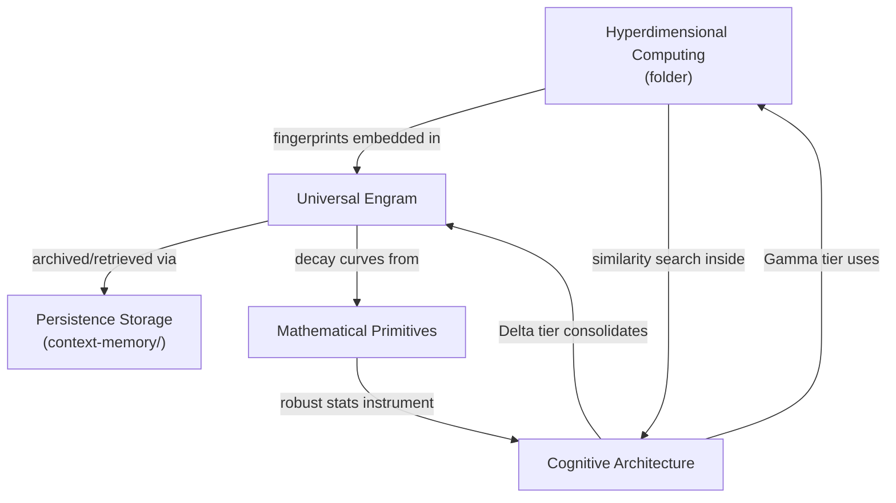

# Core Concepts

This category covers the foundational building blocks that underpin Roko's intelligence: a universal data representation, a fast similarity engine, the mathematical toolkit those systems rest on, and the architectural framework that ties them together. Everything else in this collection builds on the vocabulary established here.

## Documents

| Document | Summary | Priority |
|----------|---------|----------|
| [Hyperdimensional Computing](./hyperdimensional-computing/README.md) | 10,240-bit binary vectors for sub-millisecond semantic similarity via bitwise XOR, majority-vote, and rotation. Powers memory search, skill matching, code fingerprinting, and admission control. ~13 ns per similarity; 100K vectors scanned in ~1.3 ms. | HIGH |
| [Universal Engram](./universal-engram.md) | Content-addressed (BLAKE3) universal data record with 7-axis scoring, four decay variants including the Ebbinghaus forgetting curve, lineage DAG, taint propagation, and Ed25519 attestation. The common currency for all knowledge in the system. | HIGH |
| [Mathematical Primitives](./mathematical-primitives.md) | Five analytical frameworks: topological data analysis (TDA), cellular sheaves for multi-source consistency checking, Riemannian geometry for cost-manifold navigation, tropical algebra for decision-boundary analysis, and robust statistics (trimmed mean, MAD, Hodges-Lehmann) for outlier-resistant metrics. | LOW |
| [Cognitive Architecture](./cognitive-architecture.md) | Three cognitive speeds (Gamma/reactive, Theta/reflective, Delta/consolidation), a five-layer dependency model, stigmergic coordination via digital pheromones, morphogenetic agent specialization, and the C-factor collective intelligence metric. The structural framework that determines how all other subsystems relate. | HIGH |

## How These Concepts Relate

**Reading order within this category:**
1. Engram first — it establishes the universal data type every other concept produces or consumes.
2. HDC — the fast similarity layer that indexes Engrams without model inference.
3. Cognitive Architecture — the framework that explains why HDC and Engrams exist as distinct tiers.
4. Mathematical Primitives — only needed when implementing robust statistics or the advanced analytics concepts.

## Related Categories

- **[context-memory/persistence-storage.md](../context-memory/persistence-storage.md)** — Store/ColdStore trait implementations and database backends that persist Engrams.
- **[agent-intelligence/](../agent-intelligence/)** — how the cognitive architecture layers integrate with the agent loop.
- **[benchmarking/](../implementation/benchmarking/)** — measurement plans for HDC similarity throughput and Engram store performance.

## Quick Start

Read [Universal Engram](./universal-engram.md) first. It defines the data type that every subsystem in this collection reads and writes. Once you understand what an Engram (Signal) is — content-addressed, scored, decaying, tainted, attested — the purpose of HDC (fast indexing), the math primitives (instrumentation), and the cognitive architecture (structural placement) will follow naturally.
