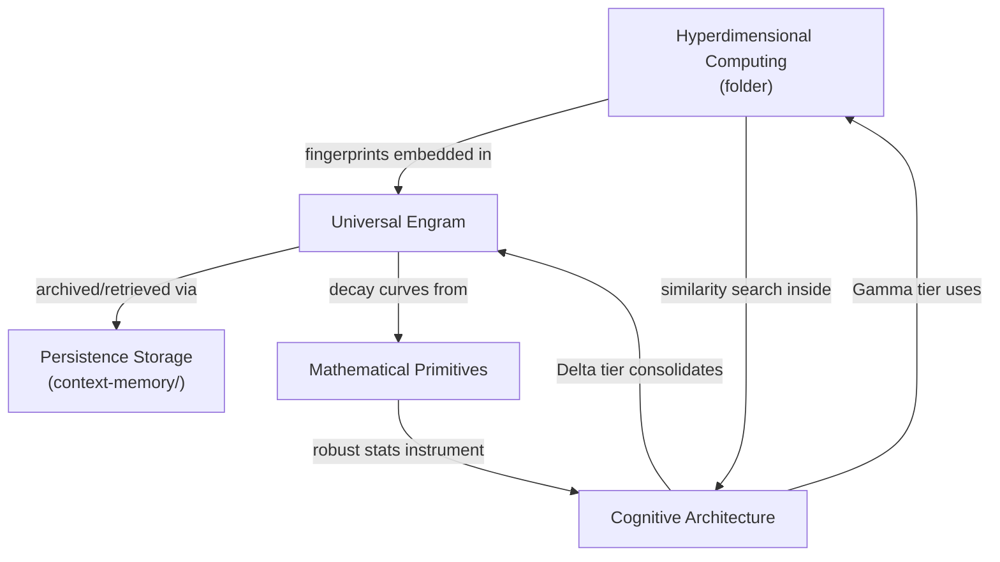

# Core Concepts

This category covers foundational concepts from the captured source corpus and translates them into IronClaw-native design options: a universal data representation, a fast similarity engine, supporting mathematical tools, and the architectural framework that ties them together. Captured `roko-*` paths are provenance labels only, not required implementation inputs.

## Documents

| Document | Summary | Priority |
|----------|---------|----------|
| [Hyperdimensional Computing](./hyperdimensional-computing/README.md) | 10,240-bit binary vectors for fixed-width structural fingerprints. The IronClaw proposal uses HDC as an optional memory/search/tool signal; throughput and false-positive thresholds must be validated in `benchmarking.md`. | HIGH |
| [Universal Engram](./universal-engram.md) | Content-addressed memory record with quality scores, decay metadata, lineage, taint, and optional attestation. For IronClaw, start as a metadata overlay on `MemoryDocument`; schema changes come later. | HIGH |
| [Mathematical Primitives](./mathematical-primitives.md) | Five analytical frameworks: topological data analysis (TDA), cellular sheaves for multi-source consistency checking, Riemannian geometry for cost-manifold navigation, tropical algebra for decision-boundary analysis, and robust statistics (trimmed mean, MAD, Hodges-Lehmann) for outlier-resistant metrics. | LOW |
| [Cognitive Architecture](./cognitive-architecture.md) | Three cognitive speeds (Gamma/reactive, Theta/reflective, Delta/consolidation), a five-layer dependency model, stigmergic coordination via digital pheromones, morphogenetic agent specialization, and the C-factor collective intelligence metric. The structural framework that determines how all other subsystems relate. | HIGH |

## How These Concepts Relate

**Reading order within this category:**
1. Engram first — it establishes the universal data type every other concept produces or consumes.
2. HDC — the fast similarity layer that indexes Engrams without model inference.
3. Cognitive Architecture — the framework that explains why HDC and Engrams exist as distinct tiers.
4. Mathematical Primitives — only needed when implementing robust statistics or the advanced analytics concepts.

## Related Categories

- **[context-memory/persistence-storage.md](../context-memory/persistence-storage.md)** — Store/ColdStore trait implementations and database backends that persist Engrams.
- **[agent-intelligence/](../agent-intelligence/)** — how the cognitive architecture layers integrate with the agent loop.
- **[benchmarking/](../implementation/benchmarking/)** — measurement plans for HDC similarity throughput and Engram store performance.

## Quick Start

Read [Universal Engram](./universal-engram.md) first. It defines the target memory shape. Then read HDC for fixed-width structural indexing, Cognitive Architecture for tier placement, and Mathematical Primitives only when you need the advanced analytics pieces.
