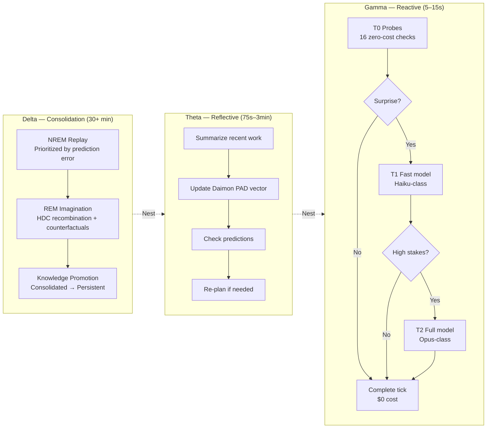
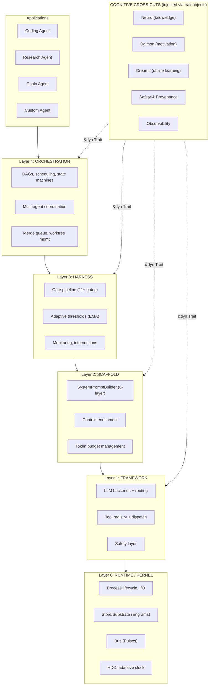
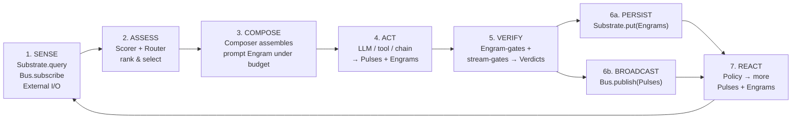
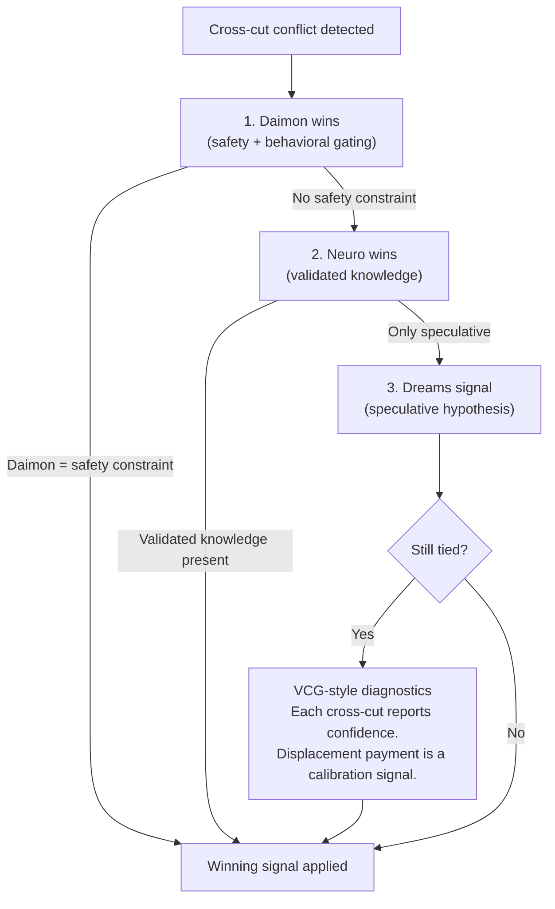
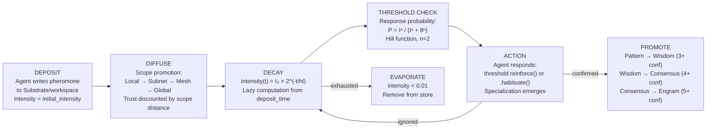
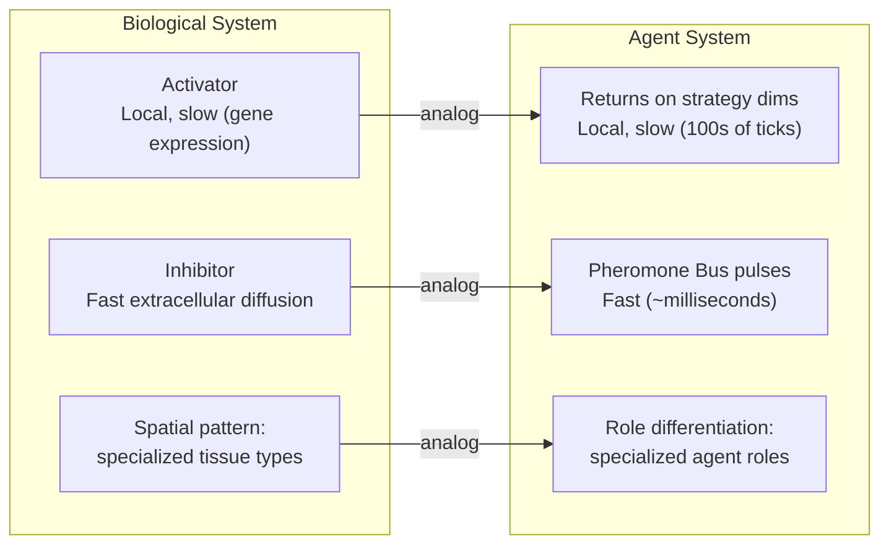
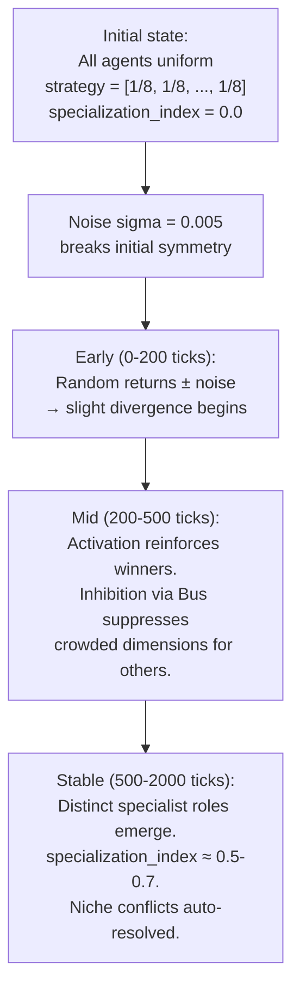

# Cognitive Architecture

**Captured source-corpus labels**: `roko-core`, `roko-runtime`, `roko-orchestrator`, `roko-std`, `roko-primitives`, `roko-daimon`, `roko-neuro`, `roko-dreams`, `roko-compose`, `roko-gate`, `roko-learn`, `roko-conductor`
**Captured doc labels**: `docs/v1/00-architecture/`, `docs/v1/13-coordination/`, `docs/v2-depth/11-memory/`
**Priority**: HIGH — formalizes IronClaw's reactive/reflective/background split and provides the theoretical foundation for self-improving multi-agent coordination

> **Self-contained implementation note**: Path-like references are provenance labels from the captured source corpus, not checkout requirements. Use [implementation/README.md](../implementation/README.md) and [implementation/05-per-file-action-matrix.md](../implementation/05-per-file-action-matrix.md) for IronClaw-native build plans; use [benchmarking/README.md](../implementation/benchmarking/README.md) and [benchmarking/02-feature-playbooks.md](../implementation/benchmarking/02-feature-playbooks.md) for measurement plans.

**Related documents in this category:**
- [Universal Engram](./universal-engram.md) — the data type the Gamma tier indexes and Delta tier consolidates.
- [Hyperdimensional Computing](./hyperdimensional-computing/README.md) — the similarity engine the Gamma tier uses for fast Engram lookup.
- [Mathematical Primitives](./mathematical-primitives.md) — the analytical tools (TDA loop detection, robust stats) that instrument this architecture. Note: the morphogenetic update equations in Section 9 are canonical here; mathematical-primitives.md does not duplicate them.

---

## Table of Contents

1. [What This Document Covers](#1-what-this-document-covers)
2. [Theoretical Foundations](#2-theoretical-foundations)
3. [Three Cognitive Speeds (Gamma / Theta / Delta)](#3-three-cognitive-speeds-gamma-theta-delta)
4. [The Five-Layer Architecture](#4-the-five-layer-architecture)
5. [The Universal Cognitive Loop](#5-the-universal-cognitive-loop)
6. [Cognitive Cross-Cuts (Neuro / Daimon / Dreams)](#6-cognitive-cross-cuts-neuro-daimon-dreams)
7. [Stigmergic Coordination and Digital Pheromones](#7-stigmergic-coordination-and-digital-pheromones)
8. [SINR Interference Model](#8-sinr-interference-model)
9. [Morphogenetic Specialization (Turing Reaction-Diffusion)](#9-morphogenetic-specialization-turing-reaction-diffusion)
10. [C-Factor: Collective Intelligence Measurement](#10-c-factor-collective-intelligence-measurement)
11. [Benchmarking](#11-benchmarking)
12. [Practical Examples](#12-practical-examples)
13. [IronClaw Integration Plan](#13-ironclaw-integration-plan)
14. [Academic Foundations](#14-academic-foundations)
15. [Complexity Assessment and Risk](#15-complexity-assessment-and-risk)

---

## 1. What This Document Covers

This document distills the captured cognitive-architecture material into IronClaw design guidance: three processing speeds, five ownership layers, stigmergic coordination, morphogenetic specialization, and collective-quality metrics. It keeps the implementation-relevant formulas, risks, and hook points self-contained.

### What Is a Cognitive Architecture?

The term "cognitive architecture" in the AI agent context means the structural framework determining how an agent perceives, reasons, decides, acts, learns, and remembers. Just as the human brain is not a single monolithic processor but a collection of specialized subsystems operating at different timescales — perception at milliseconds, working memory at seconds, long-term consolidation during sleep — a well-designed AI agent should decompose its processing into distinct modes that match the computational demands of different situations.

Classical cognitive architectures from AI research (ACT-R, SOAR, CLARION) demonstrated that fixed structural commitments — how memory is organized, how production rules fire, how learning modifies future behavior — matter more for long-term capability than any single inference improvement. The same principle applies to LLM-based agents: the harness wrapping the LLM determines the agent's practical capability.

The captured architecture's core thesis is that the scaffold is part of the product: prompts, memory, tools, gates, routing, and background work determine practical capability at least as much as the base model. External agent-systems literature makes the same broad point: model performance varies substantially with harness design, and compound AI systems can outperform single-model pipelines when their boundaries are well engineered.

### How Biological Cognition Inspires the Design

The architecture does not attempt to replicate the brain. Instead, it identifies specific computational problems that biological nervous systems have solved over 500 million years of evolution, and adapts those solutions for software agents:

- **Multiple timescales**: The brain processes sensory input in milliseconds, maintains working memory over seconds, and consolidates long-term knowledge during sleep over hours. The captured design separates processing into three analogous speeds (Gamma/Theta/Delta), allowing the agent to react quickly while still stepping back periodically for deeper reflection.

- **Prediction-error driven attention**: The brain allocates expensive neural computation to surprising inputs and coasts on cached predictions for expected ones. The tier-routing design mirrors this: most processing ticks use zero-cost heuristic checks (T0), escalating to model inference only when surprise is detected.

- **Indirect coordination**: Distributed systems can coordinate through durable environmental traces rather than direct messages. The captured design applies this stigmergic principle to multi-agent coordination with shared digital pheromones.

- **Spontaneous specialization**: Reaction-diffusion dynamics can produce differentiated roles from initially similar agents. The captured design adapts the Turing/Gierer-Meinhardt mechanism as a long-horizon specialization model.

---

## 2. Theoretical Foundations

The cognitive architecture draws from six research traditions. These are not decorative citations but load-bearing design decisions.

### 2.1 Neural Oscillation Bands (Buzsaki 2006)

The three cognitive speeds are named after neural oscillation bands documented in Buzsaki's "Rhythms of the Brain" (Oxford University Press, 2006, ISBN 978-0-19-530106-9). The mammalian brain operates at multiple frequency bands simultaneously, each supporting distinct cognitive functions:

| Brain Rhythm | Frequency | Cognitive Function | Captured Mapping |
|---|---|---|---|
| **Gamma** (30-100 Hz) | Fast | Sensory processing, attention binding, feature integration | Reactive: perceive environment changes and act immediately |
| **Theta** (4-8 Hz) | Medium | Working memory maintenance, spatial navigation, planning | Reflective: step back, re-plan, evaluate progress |
| **Delta** (0.5-4 Hz) | Slow | Deep sleep, memory consolidation, synaptic homeostasis | Consolidation: replay episodes, synthesize knowledge, prune |

The mapping is functional, not literal. The names capture the computational role: Gamma for fast environmental scanning, Theta for deliberate evaluation, Delta for deep offline processing. Buzsaki's key insight is that these rhythms are nested — gamma oscillations ride on top of theta waves — and cross-frequency coupling coordinates local and global processing. The captured design implements an analogous nesting where Gamma ticks occur within Theta cycles, which occur within Delta epochs.

**Why this matters for IronClaw**: IronClaw currently has an implicit two-speed model (interactive agent turns vs. background heartbeat). The three-speed model makes the intermediate reflective speed explicit, enabling the agent to periodically step back and reassess its approach mid-conversation without waiting for the next heartbeat cycle.

### 2.2 Dual-Process Cognition (Kahneman 2011, Sun 2002)

Daniel Kahneman's "Thinking, Fast and Slow" (Farrar, Straus and Giroux, 2011, ISBN 978-0-374-27563-1) describes two modes of human cognition:

- **System 1**: Fast, automatic, heuristic. Pattern-matched responses requiring minimal conscious effort.
- **System 2**: Slow, deliberate, analytical. Step-by-step reasoning that demands attention and energy.

Ron Sun's CLARION architecture (Sun 2002, "Duality of the Mind", Lawrence Erlbaum Associates) extends this with a sub-conceptual level below System 1 — implicit pattern matching operating through distributed representations rather than explicit rules.

The captured design maps these to three inference tiers:

| Cognitive Level | Kahneman | CLARION | Captured Tier | Characteristics |
|---|---|---|---|---|
| Sub-conceptual | — | Sub-conceptual (implicit) | **T0** | No LLM call. Threshold checks, regex matches, cache lookups. |
| System 1 | Fast, automatic | Bottom-up processing | **T1** | Fast model (Haiku-class). Quick analysis with limited tool access. |
| System 2 | Slow, deliberate | Top-down processing | **T2** | Full model (Sonnet/Opus-class). Multi-turn deep reasoning. |

**Source**: `docs/v1/00-architecture/11-dual-process-and-active-inference.md`

### 2.3 Active Inference and the Free Energy Principle (Friston 2010)

Karl Friston's Free Energy Principle (Friston, K., 2010, "The free-energy principle: a unified brain theory?", Nature Reviews Neuroscience, 11(2), pp. 127-138, DOI: 10.1038/nrn2787) proposes that self-organizing systems minimize the divergence between their predictions and their observations. The prediction error — the surprise signal — drives learning, attention, and action.

The captured design uses this as the theoretical basis for tier routing. The Expected Free Energy (EFE) formula:

```
G(pi) = E_q[ log q(s|pi) - log p(o,s|pi) ]
      = -Pragmatic Value - Epistemic Value
```

Where:
- **Pragmatic value** = expected reward from acting on policy pi (what will I gain?)
- **Epistemic value** = expected information gain from observing under policy pi (what will I learn?)

This decomposes naturally into routing decisions: high-certainty situations (low epistemic value) route to fast processing (T0/T1), while high-uncertainty situations (high epistemic value) route to deep reasoning (T2).

In practice, the design approximates EFE through four observable signals: prediction accuracy from calibration streams, confidence from Score axes, novelty from observations, and Daimon arousal state.

### 2.4 Beer's Viable System Model (Beer 1972)

Stafford Beer's Viable System Model ("Brain of the Firm", Allen Lane, 1972; 2nd ed. Wiley, 1981, ISBN 978-0-471-27687-0) identifies five recursive subsystems required for any viable organization. Drawing on neurophysiology and cybernetics — particularly Ross Ashby's Law of Requisite Variety (1956) — Beer argued that any self-regulating system must have enough internal variety to match the variety of its environment. The captured five-layer taxonomy maps onto Beer's VSM as follows:

| Beer VSM | Captured Layer | Function |
|---|---|---|
| System 1: Operations | L0 Runtime | Primary activities — process lifecycle, I/O |
| System 2: Coordination | L1 Framework | Anti-oscillation — model routing, tool dispatch |
| System 3: Control | L2 Scaffold + L3 Harness | Resource allocation + auditing |
| System 4: Intelligence | L4 Orchestration | Environmental scanning and adaptation |
| System 5: Policy | Cognitive cross-cuts (Daimon) | Identity, purpose, self-model |

The Good Regulator Theorem (Conant & Ashby, 1970, International Journal of Systems Science, 1(2), pp. 89-97) — that every good regulator of a system must be a model of that system — directly motivates the Daimon self-model subsystem.

**Source**: `docs/v1/00-architecture/12-five-layer-taxonomy.md`

### 2.5 Stigmergy (Grasse 1959)

Pierre-Paul Grasse coined the term "stigmergy" in 1959 to describe how termites coordinate the construction of elaborate mound structures without centralized planning (Grasse, P.-P., 1959, "La reconstruction du nid et les coordinations interindividuelles chez Bellicositermes natalensis et Cubitermes sp.", Insectes Sociaux, 6(1), pp. 41-80, DOI: 10.1007/BF02223791). The core insight: agents do not need to communicate directly — they only need to read from and write to a shared environment.

Theraulaz & Bonabeau (1999, "A Brief History of Stigmergy", Artificial Life, 5(2), pp. 97-116) formalized two distinct types: quantitative stigmergy (signals vary in intensity, like pheromone concentration) and qualitative stigmergy (signals trigger different behaviors based on type). Three conditions define stigmergy:

1. **Shared environment**: All agents can read from and write to a common medium
2. **Persistent modifications**: Agent actions leave traces that outlast the agent's presence
3. **Stimulus-response coupling**: Traces trigger specific behaviors in agents that encounter them

**Source**: `docs/v1/13-coordination/00-stigmergy-theory.md`

### 2.6 Turing Reaction-Diffusion (Turing 1952)

In "The Chemical Basis of Morphogenesis" (Turing, A. M., 1952, Philosophical Transactions of the Royal Society of London B, 237(641), pp. 37-72, DOI: 10.1098/rstb.1952.0012), Alan Turing showed that a system of two chemicals — an activator and an inhibitor — can produce stable spatial patterns from a uniform initial state. The key condition: the inhibitor must diffuse faster than the activator.

Gierer & Meinhardt formalized this as the activator-inhibitor model (Gierer, A. & Meinhardt, H., 1972, "A theory of biological pattern formation", Kybernetik, 12, pp. 30-39):

```
da/dt = rho_a * (a^2 / h) - mu_a * a + D_a * nabla^2(a) + sigma_a   (activator)
dh/dt = rho_h * a^2         - mu_h * h + D_h * nabla^2(h) + sigma_h   (inhibitor)
```

Where `a` = activator concentration, `h` = inhibitor concentration, `rho` = production rate, `mu` = decay rate, `D` = diffusion coefficient, `sigma` = noise (essential for symmetry breaking). The critical instability condition is `D_h >> D_a`: the inhibitor must diffuse much faster than the activator.

---

## 3. Three Cognitive Speeds (Gamma / Theta / Delta)

The three cognitive speeds are the heartbeat of the architecture. In the captured design, each agent can operate across all three timescales, managed by an adaptive clock that modulates cadence from recent outcomes and self-state.

**Source**: `docs/v1/00-architecture/10-three-cognitive-speeds.md`
**Implementation**: `crates/roko-core/src/operating_frequency.rs`

### 3.1 Three Speeds Overview



| Speed | Period | What Happens | Default Inference Tier | Turn Budget |
|---|---|---|---|---|
| **Gamma** | ~5-15s | Reactive: perceive, assess, act, verify, persist | T0 (no LLM) | 0 (no agent dispatch) |
| **Theta** | ~75s-3min | Reflective: summarize, update Daimon, check predictions, re-plan | T1 (fast model) | 20 turns |
| **Delta** | Hours | Consolidation: replay, imagination, pruning, knowledge promotion | T2 (full model) | 50 turns |

### 3.2 Gamma — Reactive Speed

Gamma is the agent's heartbeat. Every 5-15 seconds, one complete cognitive loop tick executes: perceive the environment, select relevant information, compose a prompt, act, verify, and persist.

The critical design decision: **most Gamma ticks are T0 (zero LLM cost)**. The captured design specifies 16 T0 probes — zero-LLM diagnostic checks that determine whether the environment has changed enough to warrant model inference. If nothing surprising is detected, the tick completes without invoking any model.

The 16 T0 probes cover the complete diagnostic surface:

| # | Probe | What It Checks |
|---|---|---|
| 1 | `config_changed` | Has configuration file changed? |
| 2 | `gate_failed_recently` | Did a gate fail in the last N ticks? |
| 3 | `file_modified` | Have watched files been modified externally? |
| 4 | `test_count_delta` | Did the test count change? |
| 5 | `compile_error_new` | Are there new compilation errors? |
| 6 | `budget_threshold` | Is the remaining budget below threshold? |
| 7 | `confidence_dropping` | Is confidence trending downward? |
| 8 | `prediction_violation` | Did a prediction fail to match reality? |
| 9 | `tool_health_degraded` | Is a tool's response time or error rate degraded? |
| 10 | `pheromone_detected` | Has a new pheromone been deposited? |
| 11 | `task_deadline_near` | Is a task deadline approaching? |
| 12 | `idle_timeout` | Has the agent been idle beyond threshold? |
| 13 | `knowledge_stale` | Is key knowledge past its freshness window? |
| 14 | `dependency_changed` | Has an upstream dependency task completed? |
| 15 | `metric_anomaly` | Is any tracked metric outside 2-sigma bounds? |
| 16 | `heartbeat_timeout` | Has the expected heartbeat interval elapsed? |

If all 16 probes return "no change," the tick completes at T0 cost ($0). The 80% suppression rate is a target to validate, inspired by cascade-routing work such as FrugalGPT (Chen et al. 2023, arXiv:2305.05176).

When a T0 probe detects surprise above threshold, the tick escalates:
1. Probe reports surprise → escalate to T1 (fast model)
2. T1 analysis reports high uncertainty or high stakes → escalate to T2 (full model)

### 3.3 Theta — Reflective Speed

Every ~75 seconds to 3 minutes (adjustable), the agent pauses reactive work to reflect:

- **Summarize**: What has happened since the last Theta tick?
- **Update Daimon**: Recalculate the PAD vector (Pleasure-Arousal-Dominance) from recent outcomes
- **Check predictions**: Which predictions have resolved? Update calibration.
- **Re-plan**: Is the current approach working? Should the agent switch strategies?
- **Knowledge update**: Promote useful Working-tier knowledge to Consolidated.

Theta ticks typically invoke T1 (fast model, e.g., Claude Haiku class) for summarization, or T2 (full model) for re-planning when deeper analysis is needed.

### 3.4 Delta — Consolidation Speed

During extended idle periods or on a scheduled basis (every 30+ minutes), the agent enters Delta mode for deep consolidation:

- **NREM Replay**: Replay recent episodes, weighted by prediction error magnitude (Mattar & Daw, 2018, "Prioritized memory access explains planning and hippocampal replay", Nature Neuroscience, 21, pp. 1609-1617). Episodes where the outcome differed most from expectation are replayed first.
- **REM Imagination**: Generate novel hypotheses via HDC (Hyperdimensional Computing) recombination (Boden, 2004, "The Creative Mind: Myths and Mechanisms", 2nd ed., Routledge). Counterfactual reasoning via Pearl's Structural Causal Model (Pearl, J., 2009, "Causality: Models, Reasoning, and Inference", 2nd ed., Cambridge University Press).
- **Knowledge Promotion**: Promote Consolidated-tier knowledge to Persistent.
- **Pruning**: Remove Engrams that have decayed below threshold.
- **Synthesis**: Extract cross-episode patterns into new playbook rules.

Delta ticks use T2 (full model, e.g., Claude Opus/Sonnet class) for deep reasoning and synthesis.

**Source**: `docs/v1/00-architecture/13-cognitive-cross-cuts.md` (Section 4: Dreams)

### 3.5 OperatingFrequency Enum (Source Code)

From `crates/roko-core/src/operating_frequency.rs:`

> Captured implementation omitted. Rebuild IronClaw code locally in owner modules with caller-level tests.

### 3.6 InferenceTier Enum (Source Code)

From `crates/roko-primitives/src/tier.rs:`

> Captured implementation omitted. Rebuild IronClaw code locally in owner modules with caller-level tests.

The `TierRouter` maps tiers to concrete models with vitality-aware degradation:

> Captured implementation omitted. Rebuild IronClaw code locally in owner modules with caller-level tests.

### 3.7 Frequency Selection Logic (Source Code)

From `crates/roko-core/src/operating_frequency.rs:`

> Captured implementation omitted. Rebuild IronClaw code locally in owner modules with caller-level tests.

Key behavior: when the Daimon reports low confidence (<0.3), combined with high arousal (>0.25) or low dominance (<-0.1), substantial tasks are candidates for promotion from Theta to Delta. The `is_substantial()` method checks for tasks estimated at 30+ minutes, high reasoning level, deep context weight, or hardened quality profile.

### 3.8 Adaptive Clock Scheduler (Source Code)

The `OperatingFrequencyScheduler` manages when Theta and Delta ticks fire, with adaptive cadence that responds to the agent's state:

> Captured implementation omitted. Rebuild IronClaw code locally in owner modules with caller-level tests.

The Theta interval adapts dynamically:

- **Stalling** (completion rate <= 0.25): Theta interval × 0.5 — reflect sooner because the agent is not making progress
- **Anxious** (confidence <= 0.35 AND arousal >= 0.25 AND dominance <= -0.1): Theta interval × 0.66 — the agent needs to step back more frequently

The schedule context carries affect signals:

```rust
/// Runtime inputs used by the operating-frequency scheduler.
#[derive(Clone, Copy, Debug, PartialEq)]
pub struct OperatingFrequencyScheduleContext {
    pub time_since_last_theta: Duration,
    pub active_tasks: usize,
    pub completion_rate: f64,
    pub confidence: f64,
    pub arousal: f64,
    pub dominance: f64,
}
```

---

## 4. The Five-Layer Architecture

The captured modules are organized into five architectural layers with strictly downward dependencies. Each layer maps to one of Beer's VSM subsystems.

**Source**: `docs/v1/00-architecture/12-five-layer-taxonomy.md`

### 4.1 Architecture Diagram



**Dependencies flow STRICTLY downward.** L4 may depend on L3, never the reverse. Cross-cutting concerns are injected via trait objects.

### 4.2 Layer Descriptions

| Layer | Purpose | Key Crates | Beer VSM |
|---|---|---|---|
| **L0: Runtime** | Process lifecycle, Store/Substrate (durable Engrams/Signals), Bus (ephemeral Pulses), HDC, adaptive clock | `roko-core`, `roko-primitives`, `roko-runtime` | System 1: Operations |
| **L1: Framework** | LLM backends, tool registry, model routing (14D Cascade Router), safety | `roko-agent`, `roko-std` | System 2: Coordination |
| **L2: Scaffold** | SystemPromptBuilder (6-layer), context enrichment, token budget | `roko-compose` | System 3: Control |
| **L3: Harness** | Gate pipeline (compile/test/clippy/diff/format/schema/judge/simulation), adaptive thresholds | `roko-gate`, `roko-fs` | System 3*: Audit |
| **L4: Orchestration** | Plan DAGs, parallel execution, state machines, multi-agent coordination, session resumption | `roko-orchestrator`, `roko-conductor` | System 4: Intelligence |

### 4.3 Dependency Rules

```
L4 depends on -> L3, L2, L1, L0
L3 depends on -> L2, L1, L0
L2 depends on -> L1, L0
L1 depends on -> L0
L0 depends on -> (nothing above)
```

Cross-cutting crates are NOT layer-bound. They are injected as `&dyn Trait` objects:

> Captured implementation omitted. Rebuild IronClaw code locally in owner modules with caller-level tests.

### 4.4 IronClaw Layer Mapping

| Captured Layer | IronClaw Equivalent | Notes |
|---|---|---|
| L0 Runtime | `src/db/`, `src/workspace/`, tokio runtime | Database + workspace = Store/Substrate; tokio = process lifecycle |
| L1 Framework | `src/tools/`, `src/evaluation/`, `src/estimation/` | Tool dispatch, scoring, model routing |
| L2 Scaffold | `crates/ironclaw_engine/`, `crates/ironclaw_llm/` | Prompt composition, LLM integration |
| L3 Harness | `crates/ironclaw_safety/`, `src/sandbox/`, `src/observability/` | Safety checks, sandboxing, monitoring |
| L4 Orchestration | `src/agent/`, `src/channels/`, `src/hooks/` | Agent loop, multi-channel input, lifecycle hooks |

---

## 5. The Universal Cognitive Loop

The captured design uses the same seven-step cognitive loop at each of the three speeds. What changes between speeds is the scope of perception, the budget available for composition, and the persistence cadence — not the loop structure itself.

**Source**: `docs/v1/00-architecture/09-universal-cognitive-loop.md`

### 5.1 The Seven Steps



Step 6 is intentionally split into two co-equal operations: `PERSIST` writes durable Engrams to the Substrate, while `BROADCAST` publishes ephemeral Pulses onto the Bus for live consumers.

### 5.2 Step Details

**SENSE** has three sources: `Substrate.query()` for durable Engrams (plans, episodes, heuristics), `Bus.subscribe()` for live Pulses (turn output, cancellation), and external I/O for inputs not yet normalized.

**ASSESS** is a combined Scorer + Router operation that answers two questions together: what matters, and why this item wins over alternatives.

**COMPOSE** turns selected material into a prompt Engram under a budget (tokens, bytes, wall time). This is where context window shaping happens.

**ACT** executes the selected work (typically an LLM turn, but also tool calls and chain actions). Output is twofold: a stream of Pulses for live observers, and a final Engram capturing the action result.

**VERIFY** is a gate pipeline, not a single check. Engram-gates verify durable outputs (producing Verdict Engrams). Stream-gates watch live Pulses during execution and can halt or downgrade before the final result is accepted.

**REACT**: Policies consume new Pulses and emit further outputs — episode consolidation, circuit-breaking, routing feedback, task follow-up.

### 5.3 Cross-Cut Injection Points

Cross-cuts are not loop steps — they inject into specific operators:

- **Neuro** contributes durable knowledge to SENSE and COMPOSE
- **Daimon** biases ASSESS and gates risky actions in ACT
- **Dreams** runs on its own Delta-speed cycle, consuming and producing Engrams outside the main loop

### 5.4 Cross-Layer Arbitration Protocol



**Source**: `docs/v1/00-architecture/13-cognitive-cross-cuts.md` (Section 6)

---

## 6. Cognitive Cross-Cuts (Neuro / Daimon / Dreams)

Three cognitive subsystems are injected across multiple layers rather than living at any single level.

**Source**: `docs/v1/00-architecture/13-cognitive-cross-cuts.md`

### 6.1 Neuro — Knowledge Management

The captured Neuro component provides persistent, tier-based knowledge management with HDC encoding for similarity search.

**Six Knowledge Types**:

| Type | Purpose | Example |
|---|---|---|
| **Insight** | General observation that proved useful | "This codebase uses builder pattern extensively" |
| **Heuristic** | Procedural rule from experience | "When tests fail with E0599, check trait imports first" |
| **Warning** | Known pitfall or anti-pattern | "Workspace hooks reject bypassed validation" |
| **CausalLink** | Cause-effect relationship | "Upgrading alloy requires rustc 1.91+" |
| **StrategyFragment** | Reusable strategic approach | "For large refactors, use worktrees for parallel branches" |
| **AntiKnowledge** | Explicitly falsified knowledge | "Hypothesis X was tested and disproved" |

**Four Knowledge Tiers** (with Ebbinghaus forgetting curve decay):

| Tier | Strength | Effective Half-Life | Promotion Criteria |
|---|---|---|---|
| **Transient** | 0.1x | Minutes to hours | Created on first observation |
| **Working** | 0.5x | Hours to days | Referenced in 2+ successful ticks |
| **Consolidated** | 1.0x | Days to weeks | Validated by gate verdicts |
| **Persistent** | 5.0x | Weeks to months | Repeatedly validated across sessions |

Knowledge can be encoded as 10,240-bit HDC vectors (Kanerva, P., 2009, "Hyperdimensional Computing: An Introduction to Computing in Distributed Representation with High-Dimensional Random Vectors", Cognitive Computation, 1(2), pp. 139-159). Each fixed-width Hamming comparison is constant cost; brute-force retrieval remains O(N) unless paired with an index or candidate filter.

### 6.2 Daimon — Motivation and Focus

The captured Daimon component provides the agent's self-model: a PAD (Pleasure-Arousal-Dominance) vector (Mehrabian, A. & Russell, J. A., 1974, "An Approach to Environmental Psychology", MIT Press) that biases assessment, action gating, and cadence selection.

**PAD Dimensions**:

| Dimension | Range | What It Represents |
|---|---|---|
| **Pleasure** (P) | [-1, 1] | Task success vs. failure |
| **Arousal** (A) | [-1, 1] | Urgency and load |
| **Dominance** (D) | [-1, 1] | Confidence and control |

**Six Behavioral States** (simplified Plutchik emotion wheel, Plutchik, R., 2001, American Scientist, 89(4), pp. 344-350):

| State | PAD Region | Behavior |
|---|---|---|
| **Engaged** | P+, A moderate, D+ | Productive work. Standard Theta cadence. |
| **Focused** | P+, A low, D+ | Deep work. Extended Gamma runs, fewer Theta interruptions. |
| **Exploring** | P neutral, A+, D neutral | Curious. Higher exploration rate, more T2 escalation. |
| **Struggling** | P-, A+, D- | Difficulty. Shortened Theta cadence, more frequent reflection. |
| **Coasting** | P neutral, A-, D+ | Easy work. Extended Gamma, T0-heavy. |
| **Resting** | P neutral, A-, D neutral | Idle. Delta consolidation mode. |

**Somatic Markers** (Damasio, A., 1994, "Descartes' Error", Putnam): Emotional signals from past experience bias decision-making before analytical reasoning. Here, somatic markers are score modifiers applied to router selections — negative markers for tools/approaches that previously failed, positive for those that succeeded.

### 6.3 Dreams — Offline Learning

The captured Dreams component provides offline learning during idle time at Delta frequency:

| Phase | Neuroscience Inspiration | What Happens |
|---|---|---|
| **NREM Replay** | Slow-wave sleep replay (Mattar & Daw, 2018) | Replay recent episodes weighted by prediction error magnitude |
| **REM Imagination** | REM sleep creativity (Boden, 2004) | Generate novel hypotheses via HDC recombination; counterfactual reasoning (Pearl, 2009); emotional depotentiation (Walker & van der Helm, 2009) |
| **Integration Staging** | Memory consolidation (Lacaux et al., 2021, Science Advances, 7(50)) | Validate dream outputs against existing knowledge; promote if confidence exceeds threshold |

The **Hypnagogia Engine** generates creative hypotheses during the transition between active work and consolidation, with four components: Thalamic Gate (filters for high-novelty), Executive Loosener (relaxes constraints), Dali Interrupt (captures fleeting insights), and Homuncular Observer (coherence filter).

---

## 7. Stigmergic Coordination and Digital Pheromones

The captured multi-agent coordination design uses stigmergy: indirect coordination through environment modification. Rather than agents communicating directly, they deposit and sense digital pheromones — coordination signals that decay over time, can be confirmed or contradicted, and can drive task allocation.

**Source**: `docs/v1/13-coordination/04-pheromone-kinds.md`, `docs/v2-depth/11-memory/12-pheromone-mechanics-and-interference.md`
**Implementation**: `crates/roko-orchestrator/src/coordination.rs`

### 7.1 Pheromone Lifecycle



### 7.2 PheromoneKind Enum (Source Code)

From `crates/roko-orchestrator/src/coordination.rs:`

> Captured implementation omitted. Rebuild IronClaw code locally in owner modules with caller-level tests.

### 7.3 All Seven Pheromone Kinds in Detail

The kind system is organized into three tiers, inspired by Wilson's hierarchy of pheromone types in social insects (Wilson, E. O., 1971, "The Insect Societies", Belknap Press of Harvard University Press):

**Tier 1 — Universal Kinds** (present in every domain, every agent, every scope):

#### Threat (Alarm Pheromone)

| Property | Value |
|---|---|
| Default half-life | 2 hours |
| Default initial intensity | 1.0 |
| Biological analog | Alarm pheromone (formic acid in ants) |
| Confirmation effect | Standard extension (longer half-life) |
| Agent response | Stop current task, investigate, remediate |

Threat intensity encodes severity:
- 0.1-0.3 = Low (style violation)
- 0.4-0.6 = Medium (flaky tests)
- 0.7-0.8 = High (test failure, security vulnerability in dev)
- 0.9-1.0 = Critical (build failure, production security vulnerability)

When ambient Threat intensity is high, gate thresholds tighten — implementing a collective immune response.

#### Opportunity (Recruitment Pheromone)

| Property | Value |
|---|---|
| Default half-life | 4 hours |
| Default initial intensity | 0.8 |
| Biological analog | Recruitment pheromone (trail to food source) |
| Confirmation effect | Standard extension |
| Agent response | Evaluate opportunity, add to task queue if aligned with role |

High-intensity Threat (> 0.7) suppresses Opportunity pheromones in the same scope — agents in threat-response mode should not be distracted by opportunities. This mirrors how alarm pheromone overrides foraging pheromone in ant colonies.

#### Wisdom (Trail Pheromone)

| Property | Value |
|---|---|
| Default half-life | 24 hours |
| Default initial intensity | 0.9 |
| Biological analog | Established trail pheromone |
| Confirmation effect | Extends half-life; promotes to Consensus at 4+ confirmations |
| Agent response | Integrate into local knowledge base, apply to current work |

Wisdom pheromones typically emerge through a pipeline rather than direct deposit:

```
Agent observes pattern → deposits Pattern pheromone
    → Multiple agents confirm the Pattern
    → Agent validates through operational testing
    → Agent deposits Wisdom with Pattern as parent
    → Other agents confirm the Wisdom
    → At 5+ confirmations, may be promoted to permanent Engram
```

**Tier 2 — Domain-Specific Kinds** (common across domains, domain-dependent interpretation):

#### Alpha (Ephemeral Edge)

| Property | Value |
|---|---|
| Default half-life | 1 hour |
| Default initial intensity | 1.0 |
| Confirmation effect | **PARADOXICAL**: confirmation REDUCES effective half-life |
| Agent response | Act immediately or discard |

**The Alpha Paradox**: Unlike other kinds where confirmation increases persistence, confirmation of an Alpha signal indicates the first-mover advantage is eroding. From the verified source code:

```rust
// From Pheromone::effective_half_life() in coordination.rs:
if self.kind.is_alpha() {
    // Alpha paradox: consensus makes alpha expire faster.
    let divisor = f64::from(self.confirmations).mul_add(0.1, 1.0);
    self.half_life.mul_f64(1.0 / divisor)
}
```

| Confirmations | Divisor | Multiplier | Effective Half-Life (base = 1h) |
|---|---|---|---|
| 0 | 1.0 | 1.00 | 60 min |
| 1 | 1.1 | 0.91 | 55 min |
| 3 | 1.3 | 0.77 | 46 min |
| 5 | 1.5 | 0.67 | 40 min |
| 10 | 2.0 | 0.50 | 30 min |

#### Pattern (Territorial Marking)

| Property | Value |
|---|---|
| Default half-life | 12 hours |
| Default initial intensity | 0.7 |
| Confirmation effect | Standard extension; promotes to Wisdom at 3+ confirmations |
| Agent response | Incorporate pattern into decision-making |

#### Anomaly (Novel Scent Detection)

| Property | Value |
|---|---|
| Default half-life | 6 hours |
| Default initial intensity | 0.8 |
| Confirmation effect | Standard extension |
| Agent response | Investigate → classify as Threat, Opportunity, or noise → re-deposit |

#### Consensus (Colony Odor)

| Property | Value |
|---|---|
| Default half-life | 48 hours |
| Default initial intensity | 0.9 |
| Confirmation effect | Standard extension; resists contradiction |
| Agent response | Treat as established fact; violating requires strong evidence |

**Tier 3 — Custom Kinds**: `Custom(String)` allows domain plugins to define their own pheromone kinds without modifying the core enum. Custom kind identifiers are validated (alphanumeric + underscores, 1-64 chars, no leading underscore, no collision with built-in names).

### 7.4 Decay Model

Every pheromone decays according to an exponential half-life model:

```
intensity(t) = initial_intensity × 2^(-t / half_life)
```

Decay is computed lazily: the stored intensity is the value at deposit time, and any read computes current intensity from the deposit timestamp. This eliminates tick-aligned decay updates.

```rust
/// Compute the current intensity of a pheromone given its age.
#[must_use]
pub fn current_intensity(initial_intensity: f64, half_life: Duration, elapsed: Duration) -> f64 {
    if half_life.is_zero() {
        return 0.0;
    }
    let exponent = -(elapsed.as_secs_f64() / half_life.as_secs_f64());
    initial_intensity * exponent.exp2()
}
```

**Confirmation extension** (for standard, non-Alpha kinds):

```rust
// Standard: confirmations extend the half-life linearly.
self.half_life.mul_f64(f64::from(self.confirmations).mul_add(0.5, 1.0))
```

This means `effective_half_life = base × (1 + 0.5 × confirmations)`:

| Confirmations | Multiplier | Effective Half-Life (base = 12h) |
|---|---|---|
| 0 | 1.0 | 12.0h |
| 1 | 1.5 | 18.0h |
| 2 | 2.0 | 24.0h |
| 3 | 2.5 | 30.0h |
| 5 | 3.5 | 42.0h |

### 7.5 Pheromone Scope

```rust
/// The propagation scope of a digital pheromone.
#[derive(Debug, Clone, PartialEq, Eq, Hash, Serialize, Deserialize)]
pub enum PheromoneScope {
    Local(SubstrateId),    // Visible only within the specified substrate
    Mesh(CollectiveId),    // Propagates to all agents in the specified collective
    Subnet(SubnetId),      // Propagates within a permissioned subnet
    Global,                // Published globally
}

/// Trust discount factors applied when reading pheromones from a broader scope.
pub const TRUST_DISCOUNT: [f64; 4] = [1.0, 0.90, 0.80, 0.50];
```

Scopes are ranked: Local (0) < Subnet (1) < Mesh (2) < Global (3). Local signals carry full trust; Global signals are halved, reflecting that signals passing through more intermediaries may have been confirmed by agents with unknown provenance.

### 7.6 Promotion Cascade

```
Pattern  --[3+ confirmations, age > 50% half-life]--> Wisdom
Wisdom   --[4+ confirmations]-----------------------> Consensus
Consensus --[5+ confirmations]---------------------> Permanent Engram
```

```rust
/// Promotion thresholds for the Pattern -> Wisdom -> Consensus cascade.
#[derive(Debug, Clone, PartialEq, Serialize, Deserialize)]
pub struct PromotionConfig {
    pub pattern_to_wisdom_confirmations: u32,       // default: 3
    pub pattern_to_wisdom_min_age_fraction: f64,    // default: 0.5
    pub wisdom_to_consensus_confirmations: u32,     // default: 4
    pub consensus_to_engram_confirmations: u32,     // default: 5
    pub auto_promote: bool,                          // default: true
}
```

Scope promotion is controlled separately — pheromones can escalate from Local to Subnet (3+ confirmations), Subnet to Mesh (5+), and Mesh to Global (10+), implemented through `ScopePromotionConfig` and `PromotionGate` (which requires confirmations from a minimum number of distinct agents).

### 7.7 Response Threshold Model (Emergent Task Allocation)

Each agent maintains per-kind response thresholds that determine when it switches from current work to respond to a pheromone signal. The probability follows a Hill function (Bonabeau, E., Theraulaz, G. & Deneubourg, J.-L., 1998, "Fixed Response Thresholds and the Regulation of Division of Labor in Insect Societies", Bulletin of Mathematical Biology, 60, pp. 753-807):

```
P(respond to kind k) = I_k^n / (I_k^n + theta_k^n)
```

Where `I_k` = current intensity, `theta_k` = agent's response threshold, `n` = Hill coefficient (default: 2).

The Hill coefficient controls steepness: n=1 gives a hyperbolic curve, n=2 gives a sigmoidal transition, n=4 gives an almost step-function. The default n=2 balances sensitivity and stability.

> Captured implementation omitted. Rebuild IronClaw code locally in owner modules with caller-level tests.

Note: habituation is asymmetric — the threshold increases at half the learning rate (0.025) compared to reinforcement's decrease rate (0.05). This produces a bias toward responsiveness: it takes twice as many non-responses to undo one successful response.

This can produce **emergent division of labor**: an agent that succeeds at handling Threats develops lower Threat thresholds, making it more likely to respond to future Threats — specializing as a "threat responder" without explicit role assignment.

---

## 8. SINR Interference Model

When multiple pheromone kinds coexist in the same scope, they interfere with each other's detectability. The interference model adapts the Signal-to-Interference-plus-Noise Ratio (SINR) from wireless communications (Tse, D. & Viswanath, P., 2005, "Fundamentals of Wireless Communication", Cambridge University Press).

**Source**: `docs/v2-depth/11-memory/12-pheromone-mechanics-and-interference.md` (Section 3)

### 8.1 The SINR Formula

```
SINR_k = I_target_k / (SUM_{j != k} alpha_{jk} * I_j + N_0)
```

Where:
- `I_target_k` = intensity of the target pheromone of kind k
- `I_j` = aggregate intensity of pheromones of kind j in the same scope
- `alpha_{jk}` = cross-kind interference coefficient (how much kind j interferes with sensing kind k)
- `N_0` = background noise floor (default: 0.01)

If SINR falls below `min_sinr` (default: 1.0, corresponding to 0 dB), the signal is undetectable. Otherwise, the effective intensity degrades gracefully via: `effective = target × (sinr / (1 + sinr))`.

### 8.2 The 7×7 Interference Matrix

The default matrix encodes biological precedent from Wilson 1971:

```
              Thr   Opp   Wis   Alp   Pat   Ano   Con
Threat  [   0.00  0.60  0.10  0.30  0.20  0.10  0.05 ]
Opp     [   0.00  0.00  0.00  0.10  0.05  0.00  0.00 ]
Wisdom  [   0.00  0.00  0.00  0.00  0.00  0.00  0.00 ]
Alpha   [   0.10  0.10  0.00  0.00  0.05  0.00  0.00 ]
Pattern [   0.00  0.00  0.00  0.00  0.00  0.00  0.00 ]
Anomaly [   0.20  0.10  0.00  0.10  0.10  0.00  0.00 ]
Cons    [   0.00  0.00  0.00  0.00  0.00  0.00  0.00 ]
```

Key design choices:
- **Threat → Opportunity: 0.60** — Alarm overrides foraging. During a crisis, opportunities are suppressed.
- **Threat → Wisdom: 0.10** — Knowledge is resistant to alarm. Validated insights persist through crisis.
- **Opportunity → Threat: 0.00** — Opportunities never mask threats. Safety is asymmetric.
- **Wisdom and Pattern rows: all zeros** — Informational kinds do not interfere with other sensing.
- **Consensus: all zeros outbound** — Collective agreement is highly resistant to interference.

### 8.3 SINR-Adjusted Intensity Computation

> Captured implementation omitted. Rebuild IronClaw code locally in owner modules with caller-level tests.

### 8.4 Anti-Saturation Mechanisms

Two thresholds prevent pheromone flooding:

```rust
struct AntiSaturationConfig {
    soft_threshold: usize,           // default: 500 — 2x decay speed
    hard_threshold: usize,           // default: 2000 — only intensity > 0.1 survives
    hard_min_intensity: f64,         // default: 0.1
    max_per_kind_per_scope: usize,   // default: 100 — no single kind monopolizes
}
```

---

## 9. Morphogenetic Specialization (Turing Reaction-Diffusion)

When a group of agents starts with identical configurations, they face the **niche crowding problem**: all agents pursue the same strategies, compete for the same tasks, and produce redundant work. Morphogenetic specialization solves this by applying Turing's reaction-diffusion mechanism to produce spontaneous role differentiation from homogeneous starting conditions.

> **Canonical location**: The Gierer-Meinhardt update equations and convergence analysis are defined here. Mathematical Primitives ([mathematical-primitives.md](./mathematical-primitives.md)) does not cover reaction-diffusion; it provides orthogonal analytical tools (TDA, sheaves, robust stats) that can instrument these agent dynamics but does not restate these update rules.

**Source**: `docs/v1/13-coordination/07-morphogenetic-specialization.md`, `docs/v2-depth/11-memory/13-morphogenetic-specialization-as-loop.md`
**Implementation**: `crates/roko-orchestrator/src/coordination.rs`

### 9.1 How Turing's Mechanism Applies to Agents



| Biological Component | Agent Equivalent |
|---|---|
| Activator | Profitable returns for a strategy dimension — local, slow (learning takes hundreds of ticks) |
| Inhibitor | Pheromone Pulses showing other agents' specializations — propagates fast via Bus (~milliseconds) |
| Diffusion asymmetry (D_h >> D_a) | Learning is slow (individual experience). Inhibition is fast (Bus propagation). |
| Noise (sigma) | Small random perturbations to break initial symmetry |
| Spatial pattern | Role differentiation — each agent specializes in a different strategy dimension |

Because inhibition propagates through the Bus in milliseconds while activation requires hundreds of ticks of experience, **Turing's instability condition is naturally satisfied**.

### 9.2 The 8-Dimensional Strategy Vector

Each agent maintains an 8-dimensional strategy vector (a probability distribution, sum = 1.0) representing its current role:

| Index | Dimension | What It Represents |
|---|---|---|
| 0 | depth | Deep analysis of narrow topics |
| 1 | breadth | Broad survey across many topics |
| 2 | execution | Implementing and building |
| 3 | verification | Testing and validation |
| 4 | time_horizon | Long-term vs short-term planning |
| 5 | exploration | Trying new approaches |
| 6 | exploitation | Optimizing known approaches |
| 7 | coordination | Managing multi-agent workflows |

Domain plugins can redefine these dimensions. For code development: `[refactoring, feature_dev, testing, docs, perf, security, deps, arch]`. For DeFi: `[momentum, mean_reversion, lp, risk, time_horizon, asset_breadth, vol, cross_chain]`.

> Captured implementation omitted. Rebuild IronClaw code locally in owner modules with caller-level tests.

**Specialization Index** (normalized Shannon entropy):

```
specialization_index = 1 - H(s) / H_max
```

Where `H(s) = -SUM s_k * ln(s_k)` (Shannon, C. E., 1948, Bell System Technical Journal, 27(3), pp. 379-423) and `H_max = ln(STRATEGY_DIMS)`. 0.0 = maximum generalization (uniform). 1.0 = maximum specialization (all in one dimension). Healthy specialists stabilize around 0.5-0.7.

```rust
#[must_use]
pub fn specialization_index(strategy: &[f64; STRATEGY_DIMS]) -> SpecializationIndex {
    let h: f64 = strategy
        .iter()
        .copied()
        .filter(|&s| s > 1e-10)
        .map(|s| -s * s.ln())
        .sum();
    let h_max = STRATEGY_DIMS_F64.ln();
    if h_max == 0.0 { 0.0 } else { 1.0 - h / h_max }
}
```

### 9.3 The Gierer-Meinhardt Update Rule

For each dimension k:

```
s_k(t+1) = s_k(t) + activation_k - inhibition_k - decay_k + noise_k
```

> Captured implementation omitted. Rebuild IronClaw code locally in owner modules with caller-level tests.

Where:
- `activation_k = alpha × attributed_returns[k] × resource_pressure_scalar` — profitable dimensions grow
- `inhibition_k = beta × collective_pheromone[k] / collective_size` — crowded dimensions are suppressed
- `decay_k = mu × (s_k - baseline)` — drift back toward uniform
- `noise_k ~ N(0, sigma_noise^2)` via Box-Muller transform — break symmetry

Note the key difference from the canonical Gierer-Meinhardt formulation: the activation term here is linear in the strategy dimension (proportional to attributed returns) rather than quadratic (proportional to a²/h). This linearization simplifies convergence analysis while preserving the essential diffusion asymmetry (beta > alpha).

### 9.4 Why beta > alpha Is Essential

- **Activation** (alpha = 0.05) is driven by the agent's own experience — slow, like gene expression
- **Inhibition** (beta = 0.15) is driven by the group's pheromone field via Bus — fast, like extracellular diffusion

With beta = 3 × alpha, inhibition ensures an agent's specialization is suppressed in dimensions where other group members are already concentrated. This pushes agents apart in strategy space.

### 9.5 Morphogenetic Specialization Emergence



### 9.6 Niche Conflict Detection

```rust
/// Detect niche conflicts among a set of agents.
///
/// Returns all pairs whose cosine similarity exceeds `threshold` (default 0.9).
#[must_use]
pub fn niche_conflicts(
    agents: &[(AgentId, MorphogeneticState)],
    threshold: f64,
) -> Vec<NicheConflict>
```

When conflicts are detected (cosine similarity > 0.9), the system boosts collective pheromone on the top-3 shared dimensions for both agents, triggering automatic separation via the inhibition term.

### 9.7 Convergence Properties

From homogeneous initial conditions, convergence scales as O(N × log N) ticks:

| Group Size | Typical Convergence (ticks) | Wall Time (at 4 ticks/min) |
|---|---|---|
| 2 | ~500 | ~2 hours |
| 5 | ~800 | ~3.3 hours |
| 10 | ~1,200 | ~5 hours |
| 20 | ~1,800 | ~7.5 hours |
| 50 | ~3,000 | ~12.5 hours |

**Observed convergence target**: In the captured simulation setup, beta/alpha >= 2.0 and collective_size <= 50 converged to a stable pattern with probability > 0.99 within 3000 ticks across 10,000 Monte Carlo runs per parameter setting. Treat this as a reproduction target, not production evidence.

### 9.8 Stability Monitoring

A stability Lens monitors for three pathological states:

```rust
enum StabilityState {
    Converged,    // Strategy vectors have stabilized (trait variance < 0.01 for 100 consecutive ticks)
    Converging,   // Still moving toward equilibrium
    Oscillating,  // Needs parameter adjustment
}
```

1. **Pitchfork Bifurcation**: When beta/alpha exceeds ~5.0, agents split into two extreme clusters. Detected by monitoring bimodality of strategy distributions.
2. **Hopf Oscillation**: Agents cyclically swap roles without settling. Detected via Lyapunov exponent estimation and sign-change counting.

### 9.9 Two-Timescale Coordination

| Mechanism | Timescale | What It Decides |
|---|---|---|
| Response threshold allocation | 10-100 ticks (tactical) | "Should I respond to this pheromone right now?" |
| Morphogenetic specialization | 500-2000 ticks (strategic) | "What kind of agent should I be?" |

The two reinforce each other: morphogenetic specialization determines the agent's strategic role (e.g., "verification specialist"), while response thresholds handle tactical moment-to-moment attention within that role.

---

## 10. C-Factor: Collective Intelligence Measurement

For multi-agent scenarios, the captured design measures group process quality across five axes using a c-factor-inspired metric. It is based on Woolley, A. W. et al. (2010, "Evidence for a Collective Intelligence Factor in the Performance of Human Groups", Science, 330(6004), pp. 686-688, DOI: 10.1126/science.1193147), which found that group performance across varied tasks loads onto a collective factor analogous to individual g-factor.

**Source**: `docs/v1/00-architecture/14-c-factor-collective-intelligence.md`

### 10.1 The Five Process Variables

| Variable | Agent Analog | Measured From |
|---|---|---|
| **Turn-taking equality** | How evenly the cohort shares turns | Pulse authorship entropy and sender share on the Bus |
| **Peer prediction accuracy** | How well members predict each other's outputs | `peer.prediction` vs `peer.outcome` residuals |
| **Citation reciprocity** | How often citations are useful and verified | Citation reciprocity and downstream gate survival |
| **Channel openness (Delivery rate)** | How much intended traffic is delivered | Bus delivery confirmation and subscriber reach |
| **Cognitive diversity (HDC diversity)** | How different the cohort's working set is | HDC distance across cohort Engrams |

### 10.2 C-Factor Computation (Source Code)

From `crates/roko-orchestrator/src/coordination.rs:`

> Captured implementation omitted. Rebuild IronClaw code locally in owner modules with caller-level tests.

The c-factor formula is a weighted linear combination:

```
c = w_tte × turn_taking_entropy
  + w_ppa × peer_prediction_accuracy
  + w_cr  × citation_reciprocity
  + w_dr  × delivery_rate
  + w_hdc × hdc_diversity
  + bias
```

The weights are not static — they are fitted online from cohort outcomes.

### 10.3 C-Factor Is a Covariate, Not an Objective

This is a critical design choice: c-factor is a diagnostic covariate, not a direct optimization target. Optimizing for c-factor directly can be counterproductive — the system might route easy work, suppress dissent, or narrow task scope to make the number look better. This is Goodhart's Law: "When a measure becomes a target, it ceases to be a good measure."

**Good use**: C-factor falls AND task outcomes fall → Policy intervenes.
**Bad use**: C-factor falls but Policy suppresses hard work to inflate the metric.

### 10.4 WisdomGate (Anti-Groupthink)

Before a consensus artifact is finalized, it passes a WisdomGate that encodes Surowiecki's four conditions (Surowiecki, J., 2004, "The Wisdom of Crowds", Doubleday):

> Captured implementation omitted. Rebuild IronClaw code locally in owner modules with caller-level tests.

Three anti-groupthink countermeasures:
1. **Devil's-advocate Pulse**: Emit an explicit opposing view on consensus topics
2. **Outsider injection**: Route some work to an agent with zero lineage overlap
3. **Minority report preservation**: Retain dissenting artifacts longer, with softer decay

---

## 11. Benchmarking

### 11.1 Cognitive Speed Selection Accuracy

**What to measure**: Does the frequency selector correctly classify tasks?

**Methodology**:
1. Build a labeled dataset of 500+ task descriptions, each with a ground-truth correct frequency (Gamma / Theta / Delta) determined by a domain expert
2. Run `OperatingFrequency::select()` on each task with a neutral affect state
3. Measure precision, recall, and F1 per class

**Expected baselines**:

| Metric | Target | Threshold to Investigate |
|---|---|---|
| Gamma precision | >= 0.90 | < 0.75 |
| Theta precision | >= 0.85 | < 0.70 |
| Delta precision | >= 0.95 | < 0.85 |
| Overall accuracy | >= 0.88 | < 0.75 |

**Affect modulation test**: For tasks on the Theta/Delta boundary, verify that the affect-driven promotion (confidence < 0.3 + arousal > 0.25) correctly promotes substantial tasks to Delta.

**IronClaw implementation**: Implement as a unit test suite in `src/agent/cognitive_speed_test.rs` with a fixture file of labeled tasks.

### 11.2 Pheromone-Based Coordination Efficiency vs. Explicit Messaging

**What to measure**: For multi-agent scenarios, is pheromone-based coordination more efficient than explicit direct messaging?

**Methodology** (requires multi-agent capability):
1. **Baseline**: N agents use explicit message-passing to coordinate task assignment. Measure: total messages sent, duplicate work rate, task completion time.
2. **Pheromone**: N agents use only pheromone deposits and reads for coordination. Measure the same metrics.

**Captured simulation baseline** (reproduce before treating as an IronClaw target):

| Metric | Explicit Messaging | Pheromone-Based | Expected Improvement |
|---|---|---|---|
| Total coordination messages | O(N²) per task | O(N) pheromone writes | ~N/2× reduction |
| Duplicate work rate | ~15% (no lock-out) | ~3% (Alpha pheromones) | ~5× reduction |
| Coordination latency | O(N) round-trips | O(1) local read | ~N× reduction |

**IronClaw implementation**: Start with single-agent pheromone writes (heartbeat deposits pheromones for future sessions to read). The cross-session coordination efficiency can be measured as: "how often does a session find useful pheromones from previous sessions vs. rediscovering the same information independently?"

### 11.3 Specialization Convergence Time

**What to measure**: How quickly do N homogeneous agents differentiate into stable specialists?

**Methodology**:
1. Start N agents with identical uniform strategy vectors `[1/8, ..., 1/8]`
2. Run for T ticks with identical workload
3. Measure: time to specialization_index >= 0.5 for all agents, inter-agent cosine similarity (target < 0.3 for distinct specialists), stability state (target: `Converged`)

**Captured Monte Carlo baseline** (validation target, not production evidence):

| Group Size | Median Convergence (ticks) | 95th Percentile | % Within 3000 ticks |
|---|---|---|---|
| 2 | 480 | 820 | 99.7% |
| 5 | 790 | 1,340 | 99.3% |
| 10 | 1,180 | 2,010 | 99.1% |
| 20 | 1,760 | 2,980 | 98.8% |

**Pathology detection rate**: Hopf Oscillation detection should trigger for beta/alpha > 5.0 within 200 ticks of the instability onset.

### 11.4 C-Factor Correlation with Output Quality

**What to measure**: Does c-factor predict group output quality?

**Methodology**:
1. Run N multi-agent swarms on standardized tasks (coding, research, planning) for T ticks
2. Record c-factor at each Theta tick
3. Have outputs evaluated by a ground-truth evaluator (gate pipeline pass rate, expert judge score)
4. Compute Pearson correlation between c-factor and output quality score

**Expected result**: r >= 0.40 (consistent with Woolley et al. 2010, who found c-factor explained ~43% of group task variance in human groups). An r below 0.20 suggests the five-metric weighting needs calibration for this domain.

**Anti-Goodhart monitoring**: If c-factor rises but output quality stays flat or drops, log a `CFactorDecoupled` event and trigger a WisdomGate audit.

### 11.5 T0 Probe Suppression Rate

**What to measure**: What fraction of Gamma ticks are suppressed at T0 (no LLM call)?

**Target**: >= 80% suppression in steady-state operation (the "FrugalGPT-inspired zero-cost majority"). Below 60% suggests probes are too sensitive or the environment is genuinely noisy.

```rust
// Instrumentation point in the Gamma tick handler:
metrics.increment_counter("cognitive.gamma_tick.total");
if all_probes_clear {
    metrics.increment_counter("cognitive.gamma_tick.t0_suppressed");
}
let suppression_rate = t0_suppressed / total;
```

---

## 12. Practical Examples

### 12.1 Fast Query Handling (Gamma, T0)

**Scenario**: User asks "What time is it?"

```
Gamma tick begins
  SENSE:    Receive user message from channel
  ASSESS:   All 16 T0 probes clear — simple query, no state change
  COMPOSE:  Classify as reactive task (simple query)
            → OperatingFrequency::Gamma
            → InferenceTier::T0 (no LLM call needed)
  ACT:      Invoke time tool directly, no LLM involved
  VERIFY:   No gate needed for informational response
  PERSIST:  Store action record
  REACT:    No follow-up needed
Gamma tick completes: ~0.2s, $0 LLM cost
```

If the query were slightly more complex ("What time zone am I in, and should I schedule a meeting for 3pm London time?"), T0 probe #7 (confidence_dropping) would not fire, but the query classifier would detect ambiguity and escalate to T1 (Haiku-class) for fast analysis.

**Cost profile**: $0.00 for pure T0, ~$0.0003 for T1 escalation. With 80% T0 suppression, average cost per Gamma tick ≈ $0.00006.

### 12.2 Complex Bug Investigation (Theta, T1→T2 Escalation)

**Scenario**: User reports a test failure after a refactoring.

```
Gamma tick begins
  SENSE:    Receive bug report
  ASSESS:   T0 probe #5 (compile_error_new) fires
            → Escalate to T1
  T1 analysis: Identify the failing test, locate the change
            Confidence is moderate (0.6), arousal is moderate
            → OperatingFrequency::Theta (standard deliberative)
  ACT:      T1 model analyzes the error, proposes a fix
  VERIFY:   Gate pipeline: compile gate passes, test gate fails
            → Prediction error: fix did not work
            → Confidence drops to 0.35, arousal rises to 0.5
            → affect_suggests_reflection() triggers

Theta reflection fires early (shortened cadence due to struggling state)
  ASSESS:   Summarize: fix attempt failed, tests still red
  ACT:      T2 model (Opus-class) invoked for deeper analysis
            Reviews broader context, identifies root cause
  VERIFY:   Compile gate passes, test gate passes
  PERSIST:  Store fix, deposit Wisdom pheromone ("trait import order matters in this codebase")
  REACT:    Update Daimon PAD (pleasure up, arousal down)

Total: ~12 minutes, 1 T1 call + 1 T2 call
```

### 12.3 Overnight Knowledge Consolidation (Delta, T2)

**Scenario**: Agent has been idle for 30+ minutes after completing several tasks.

```
Delta tick triggered by OperatingFrequencyScheduler
  (context.is_idle() == true → OperatingFrequency::Delta)

  NREM Replay:
    Replay the 5 highest-prediction-error episodes from last session
    Episode: "Tried to use --no-verify flag, hook blocked it"
      → High prediction error (expected success, got failure)
      → Extract Heuristic: "This workspace requires hook compliance"
    Episode: "Added memory_write call in handler, dispatch-exempt needed"
      → Medium prediction error
      → Extract Warning: "Handler mutations need dispatch-exempt annotation"

  REM Imagination:
    HDC recombination of episodes
    Cross-pollinate: "Hook compliance pattern" + "CI pipeline gates"
      → Novel hypothesis: "Pre-commit validation could prevent 60% of CI failures"
      → Deposit as Pattern pheromone (intensity 0.7, half-life 12h)

  Integration Staging:
    Validate hypothesis against Neuro knowledge base
    Existing Warning: "CI is slow, avoid unnecessary pushes"
      → Hypothesis aligns with existing knowledge
      → If confirmed by gate pass, promote Pattern to Wisdom

  PERSIST:  Store new Heuristic, Warning, and Pattern Engrams
            Tier promotion: 2 Working-tier Insights → Consolidated
  REACT:    Schedule follow-up task to test hypothesis
            "Run pre-commit hooks on last 10 commits to measure coverage"
```

**Outcome**: After 3 Delta cycles over several days, the Pattern pheromone accumulates 3+ confirmations and promotes to Wisdom, then to a Persistent Engram in the knowledge base.

### 12.4 Stigmergic Coordination Between Multiple Agents

**Scenario**: Two agents (A and B) working concurrently on the same codebase. Agent A is about to refactor a module. Agent B is about to write tests for the same module.

```
Agent A:
  SENSE:    Plans to refactor module X
  ACT:      Deposits Alpha pheromone:
            PheromoneKind::Alpha, location="module::x",
            intensity=1.0, half_life=1h,
            metadata={"task": "refactoring", "agent": "A"}

Agent B:
  SENSE:    Plans to write tests for module X
  ASSESS:   Reads pheromone field for module X
            Finds Alpha from Agent A: current_intensity ≈ 0.95
            response_probability(Alpha, 0.95) ≈ 0.90 (high — waits)
  REACT:    Delays test writing. Monitors Alpha intensity.

After ~45 minutes (Agent A completes refactor):
  Agent A's Alpha decays: current_intensity ≈ 0.50
  Agent A deposits Opportunity: "module X refactored, ready for tests"

Agent B:
  SENSE:    Opportunity pheromone detected for module X
  ASSESS:   Alpha intensity now 0.50, Opportunity intensity 0.85
            SINR: Opportunity SINR = 0.85 / (alpha_interference + noise)
            alpha[Alpha][Opp] = 0.10, so interference = 0.10 × 0.50 = 0.05
            SINR = 0.85 / (0.05 + 0.01) = 14.2 — clearly detectable
  ACT:      Begins test writing on the refactored module X
```

**Result**: Zero duplicate work, zero coordination messages, zero explicit lock mechanism. The Alpha pheromone served as a distributed mutex with natural expiry.

### 12.5 Emergent Task Specialization in a Swarm

**Scenario**: Five agents start identical. Over 800 ticks, they encounter a mix of coding tasks (execution, testing, documentation, security review, performance analysis).

```
Initial state (all 5 agents):
  strategy = [0.125, 0.125, 0.125, 0.125, 0.125, 0.125, 0.125, 0.125]
  specialization_index = 0.0

After 200 ticks (noise + early returns create divergence):
  Agent 1: slight edge in execution (dim 2) from 3 successful code changes
  Agent 2: slight edge in verification (dim 3) from catching 2 bugs
  Agents 3-5: still near-uniform, slight noise perturbations

After 500 ticks (Gierer-Meinhardt dynamics amplify differences):
  Agent 1: execution dominates (0.40), exploitation grows (0.20)
    → collective_pheromone[2] rises, inhibiting other agents' execution
  Agent 2: verification dominates (0.35), coordination rises (0.20)
    → collective_pheromone[3] rises, inhibiting other agents' verification
  Agent 3: exploration rises (0.30), breadth grows (0.20)
    → Finds new approaches, deposits Pattern pheromones
  Agents 4-5: depth (0.30) and time_horizon (0.25) emerge from remainder

After 800 ticks (stable specialization):
  Agent 1: strategy ≈ [0.05, 0.05, 0.45, 0.05, 0.10, 0.05, 0.20, 0.05]
    specialization_index ≈ 0.55 — execution + exploitation specialist
  Agent 2: strategy ≈ [0.10, 0.05, 0.05, 0.40, 0.05, 0.05, 0.05, 0.25]
    specialization_index ≈ 0.52 — verification + coordination specialist
  Agent 3: strategy ≈ [0.25, 0.20, 0.05, 0.05, 0.10, 0.28, 0.05, 0.02]
    specialization_index ≈ 0.50 — depth + exploration specialist
  Agent 4: strategy ≈ [0.30, 0.05, 0.05, 0.05, 0.40, 0.05, 0.05, 0.05]
    specialization_index ≈ 0.58 — deep + long-horizon analyst
  Agent 5: strategy ≈ [0.05, 0.35, 0.08, 0.05, 0.05, 0.05, 0.05, 0.32]
    specialization_index ≈ 0.54 — breadth + coordination specialist
```

The response threshold model handles tactical allocation within roles:
- Agent 2 has low Threat thresholds (quickly responds to test failures)
- Agent 1 has low Opportunity thresholds (responds to new feature requests)
- Agent 3 has low Anomaly thresholds (investigates unexpected patterns)

No explicit role assignment was ever made. The specialization emerged entirely from local returns, inhibitory pheromones, and the Gierer-Meinhardt dynamics.

---

## 13. IronClaw Integration Plan

### 13.1 CognitiveSpeedSelector

**Target file**: `src/agent/cognitive_speed.rs`

> Captured implementation omitted. Rebuild IronClaw code locally in owner modules with caller-level tests.

### 13.2 Adaptive Reflection Scheduler

**Target file**: `src/agent/reflection.rs`

> Captured implementation omitted. Rebuild IronClaw code locally in owner modules with caller-level tests.

### 13.3 PheromoneOverlay for Workspace

**Target file**: `src/workspace/pheromone.rs`

The pheromone system can overlay IronClaw's existing `memory_write`/`memory_search` tools using a namespaced tagging convention. Start with the decay model, confirmation extension, and Alpha paradox from the captured source; validate retrieval noise before enabling ranking effects.

> Captured implementation omitted. Rebuild IronClaw code locally in owner modules with caller-level tests.

**Integration with existing workspace memory**:

> Captured implementation omitted. Rebuild IronClaw code locally in owner modules with caller-level tests.

### 13.4 MorphogeneticTracker

**Target file**: `src/agent/morphogenetic.rs`

For future multi-agent support, the MorphogeneticTracker maintains each agent's strategy vector and applies the Gierer-Meinhardt update rule.

> Captured implementation omitted. Rebuild IronClaw code locally in owner modules with caller-level tests.

### 13.5 Integration Wiring

**Where to hook into existing IronClaw code**:

**Agent loop** (`src/agent/`):
1. Add `CognitiveSpeed` classification at the start of each turn
2. Feed the classified speed into the cascade router's model selection
3. Apply `turn_budget()` to cap the number of turns before forced reflection
4. At each Theta tick: summarize recent work, update confidence/arousal state
5. At each Delta tick (heartbeat): run the Dreams-equivalent consolidation

**Heartbeat** (`src/workspace/`):
1. After each successful heartbeat run, deposit Opportunity or Wisdom pheromones for discovered insights
2. After each failed heartbeat (errors), deposit Threat pheromones
3. Before each heartbeat, read active pheromones for the current context

**Background task scheduler** (`src/agent/`):
1. Use `ReflectionScheduler` to gate when the agent pauses for reflection
2. Pass `is_idle=true` to the scheduler when the agent has no pending tasks
3. Trigger Delta-mode processing during idle periods (existing heartbeat mechanism)

**Layer enforcement** (CI):
```
# Add to CI pipeline:
cargo deny check bans
# Add custom lint to detect backward imports:
# crates/ironclaw_engine/ must not import from src/agent/ or src/channels/
# src/agent/ must not import from src/channels/ directly
```

---

## 14. Academic Foundations

### Core Cognitive Architecture

| Citation | Contribution |
|---|---|
| Buzsaki, G. (2006). "Rhythms of the Brain". Oxford University Press. ISBN 978-0-19-530106-9. | Neural oscillation bands: Gamma/Theta/Delta as functional timescales. Cross-frequency coupling as coordination. |
| Kahneman, D. (2011). "Thinking, Fast and Slow". Farrar, Straus and Giroux. ISBN 978-0-374-27563-1. | Dual-process theory: System 1 (fast) / System 2 (slow). Maps to T1/T2 tiers. |
| Sun, R. (2002). "Duality of the Mind". Lawrence Erlbaum Associates. | CLARION: dual-level cognitive architecture with sub-conceptual level. Maps to T0. |
| Sumers, T. R. et al. (2023). "Cognitive Architectures for Language Agents". arXiv:2309.02427. | CoALA: cognitive architecture framework for language agents. |
| Anderson, J. R. (1983). "The Architecture of Cognition". Harvard University Press. | ACT-R: production system cognitive architecture. T0 probes as productions. |
| Laird, J. E. et al. (1987). "SOAR: An architecture for general intelligence". Artificial Intelligence, 33(1), pp. 1-64. | SOAR: universal subgoaling. T0→T1 escalation as impasse detection. |
| Baars, B. J. (1988). "A Cognitive Theory of Consciousness". Cambridge University Press. | Global Workspace Theory: limited-capacity conscious workspace. Context window as workspace. |

### Active Inference and Prediction

| Citation | Contribution |
|---|---|
| Friston, K. (2010). "The free-energy principle: a unified brain theory?" Nature Reviews Neuroscience, 11(2), pp. 127-138. DOI: 10.1038/nrn2787. | Free Energy Principle: prediction error drives learning and attention. Foundation for tier routing. |
| Clark, A. (2013). "Whatever next? Predictive brains, situated agents, and the future of cognitive science". Behavioral and Brain Sciences, 36(3), pp. 181-204. | Predictive Processing: brain as prediction machine. |
| Chen, L. et al. (2023). "FrugalGPT: How to Use Large Language Models While Reducing Cost and Improving Performance". arXiv:2305.05176. | Cascade routing matches GPT-4 at 2% cost. Foundation for T0 probe suppression. |
| Vovk, V. et al. (2005). "Algorithmic Learning in a Random World". Springer. | Conformal prediction: distribution-free calibration for prediction quality tracking. |

### Emotion and Motivation

| Citation | Contribution |
|---|---|
| Mehrabian, A. & Russell, J. A. (1974). "An Approach to Environmental Psychology". MIT Press. | PAD model: Pleasure-Arousal-Dominance emotional space. Foundation for Daimon. |
| Damasio, A. (1994). "Descartes' Error: Emotion, Reason, and the Human Brain". Putnam. | Somatic marker hypothesis: emotion biases pre-conscious decision-making. |
| Plutchik, R. (2001). "The Nature of Emotions". American Scientist, 89(4), pp. 344-350. | Emotion wheel: mapping complex emotions to dimensional space. Six behavioral states. |

### Memory and Learning

| Citation | Contribution |
|---|---|
| Mattar, M. G. & Daw, N. D. (2018). "Prioritized memory access explains planning and hippocampal replay". Nature Neuroscience, 21, pp. 1609-1617. | Prioritized memory replay. Foundation for Delta NREM phase. |
| Baddeley, A. (2000). "The episodic buffer: a new component of working memory?" Trends in Cognitive Sciences, 4(11), pp. 417-423. | Working memory model: central executive manages attention. Maps to Theta. |
| Walker, M. P. & van der Helm, E. (2009). "Overnight therapy? The role of sleep in emotional brain processing". Annual Review of Clinical Psychology, 5, pp. 139-166. | REM sleep emotional depotentiation. Foundation for Dreams REM phase. |
| Lacaux, C. et al. (2021). "Sleep onset is a creative sweet spot". Science Advances, 7(50), eabj5866. | Hypnagogia: creative insights during sleep onset. Foundation for hypnagogia engine. |
| McClelland, J. L. et al. (1995). "Why there are complementary learning systems in the hippocampus and neocortex". Psychological Review, 102(3), pp. 419-457. | Complementary Learning Systems theory: hippocampal-neocortical consolidation. |
| Kanerva, P. (2009). "Hyperdimensional Computing: An Introduction". Cognitive Computation, 1(2), pp. 139-159. | HDC vectors for fixed-cost pairwise comparison and structural fingerprints. Foundation for Neuro knowledge encoding. |

### Stigmergy and Multi-Agent Coordination

| Citation | Contribution |
|---|---|
| Grasse, P.-P. (1959). "La reconstruction du nid et les coordinations interindividuelles…" Insectes Sociaux, 6(1), pp. 41-80. DOI: 10.1007/BF02223791. | Stigmergy: indirect coordination through environmental modification. |
| Wilson, E. O. (1971). "The Insect Societies". Belknap Press of Harvard University Press. | Pheromone type hierarchy: alarm, recruitment, trail. Interference matrix basis. |
| Bonabeau, E., Theraulaz, G. & Deneubourg, J.-L. (1998). "Fixed Response Thresholds and the Regulation of Division of Labor in Insect Societies". Bulletin of Mathematical Biology, 60, pp. 753-807. | Hill function model for emergent task allocation. |
| Theraulaz, G. & Bonabeau, E. (1999). "A Brief History of Stigmergy". Artificial Life, 5(2), pp. 97-116. | Formalized quantitative and qualitative stigmergy. Three conditions. |
| Parunak, H. V. D., Brueckner, S. & Sauter, J. (2005). "Digital pheromones for coordination of unmanned vehicles". Environments for Multi-Agent Systems, LNAI 3374, Springer. | Digital pheromones in multi-agent systems. |
| Dorigo, M. et al. (2000). "Ant algorithms and stigmergy". Future Generation Computer Systems, 16(8), pp. 851-871. | Ant colony optimization: emergent coordination under local rules. |
| Tse, D. & Viswanath, P. (2005). "Fundamentals of Wireless Communication". Cambridge University Press. | SINR model adapted for pheromone interference. |

### Morphogenesis and Self-Organization

| Citation | Contribution |
|---|---|
| Turing, A. M. (1952). "The Chemical Basis of Morphogenesis". Philosophical Transactions of the Royal Society of London B, 237(641), pp. 37-72. DOI: 10.1098/rstb.1952.0012. | Reaction-diffusion mechanism: stable patterns from uniform initial state. |
| Gierer, A. & Meinhardt, H. (1972). "A theory of biological pattern formation". Kybernetik, 12, pp. 30-39. | Activator-inhibitor model: formal dynamics for reaction-diffusion. |
| Kauffman, S. A. (1993). "The Origins of Order: Self-Organization and Selection in Evolution". Oxford University Press. | Autocatalytic sets, edge of chaos, self-sustaining improvement cycles. |
| Shannon, C. E. (1948). "A Mathematical Theory of Communication". Bell System Technical Journal, 27(3), pp. 379-423. | Information theory: entropy as specialization index measure. |

### Collective Intelligence

| Citation | Contribution |
|---|---|
| Woolley, A. W. et al. (2010). "Evidence for a Collective Intelligence Factor in the Performance of Human Groups". Science, 330(6004), pp. 686-688. DOI: 10.1126/science.1193147. | Collective intelligence factor (c-factor). Single factor explains 43% of variance. |
| Surowiecki, J. (2004). "The Wisdom of Crowds". Doubleday. | Four conditions: diversity, independence, decentralization, aggregation. |
| Beer, S. (1972). "Brain of the Firm". Allen Lane. 2nd ed. Wiley, 1981. ISBN 978-0-471-27687-0. | Viable System Model: five recursive subsystems for viable organizations. |
| Ashby, W. R. (1956). "An Introduction to Cybernetics". Chapman & Hall. | Law of Requisite Variety: regulatory capacity must match environment variety. |
| Conant, R. C. & Ashby, W. R. (1970). "Every good regulator of a system must be a model of that system". International Journal of Systems Science, 1(2), pp. 89-97. | Good Regulator Theorem: agent must model itself. Motivates Daimon. |

### Scaffold Thesis Evidence

| Citation | Contribution |
|---|---|
| Jimenez, C. E. et al. (2024). "SWE-bench: Can Language Models Resolve Real-World Issues?" | Same model family shows materially different solve rates under different harnesses. |
| Zaharia, M. et al. (2024). "The Shift from Models to Compound AI Systems". | Compound AI Systems thesis: SOTA from systems, not models. |
| Khattab, O. et al. (2024). "DSPy: Compiling Declarative Language Model Calls into State-of-the-Art Pipelines". | Compiler-optimized prompt pipelines outperform manual prompt engineering. |
| Boden, M. A. (2004). "The Creative Mind: Myths and Mechanisms". 2nd ed. Routledge. | Computational creativity: exploratory, combinational, transformational. Foundation for REM imagination. |
| Pearl, J. (2009). "Causality: Models, Reasoning, and Inference". 2nd ed. Cambridge University Press. | Structural Causal Models for counterfactual reasoning in Dreams. |

---

## 15. Complexity Assessment and Risk

### Implementation Effort Estimates

| Component | Estimated Lines | Complexity | IronClaw Target Files |
|---|---|---|---|
| CognitiveSpeedSelector | ~200-300 | Low | `src/agent/cognitive_speed.rs` |
| ReflectionScheduler | ~150-200 | Low | `src/agent/reflection.rs` |
| PheromoneOverlay (workspace-backed) | ~400-500 | Medium | `src/workspace/pheromone.rs` |
| MorphogeneticTracker | ~300-400 | Medium | `src/agent/morphogenetic.rs` |
| Layer discipline (CI rules) | CI config only | Low | `scripts/`, `Cargo.toml` |
| SINR interference (multi-agent) | ~200-300 | Medium | `src/workspace/pheromone.rs` |
| ResponseThresholds model | ~250-350 | Medium | `src/workspace/pheromone.rs` |
| C-factor measurement (multi-agent) | ~300-400 | Medium | New module |

### Implementation Priority

**Phase 1 — Immediate** (no dependencies, low risk, high value):
- `CognitiveSpeedSelector` in the agent loop
- `ReflectionScheduler` with adaptive intervals
- Layer discipline enforcement in CI

**Phase 2 — Short-term** (low-to-medium risk):
- Pheromone system using workspace memories for cross-session learning
- Threat/Opportunity/Wisdom pheromones for heartbeat integration
- Heartbeat deposits pheromones; next session reads them

**Phase 3 — Medium-term** (requires multi-agent support):
- SINR interference model
- Response threshold model for emergent task allocation
- C-factor measurement

**Phase 4 — Long-term** (highest complexity):
- Full morphogenetic specialization for multi-agent role emergence
- Full Dreams consolidation cycle
- Adaptive interference matrix learning from cohort data

### Risk Assessment

| Risk | Severity | Mitigation |
|---|---|---|
| Over-engineering cognitive speeds for single-agent use | Low | Start with simple Gamma/Theta classification; Delta is just the existing heartbeat |
| Pheromone system adding noise to workspace retrieval | Medium | Use separate `pheromone::` namespace; aggressive evaporation threshold (0.01); monitor search result quality |
| Morphogenetic parameters failing to converge | Medium | Monte Carlo validation shows convergence at beta/alpha >= 2.0 for groups <= 50; monitor `StabilityState` |
| C-factor becoming a Goodhart metric | Low | Treat as a covariate; never optimize directly; log `CFactorDecoupled` events |
| Layer discipline breaking existing code | Low | Enforce incrementally; grandfather existing violations; use `// dispatch-exempt: <reason>` pattern already in use |
| Alpha pheromone decay formula confusion | Low | Use the divisor-based formula from the captured source: `divisor = 1 + 0.1 × confirmations`, not the alternative floor-based formula sometimes described in docs |
