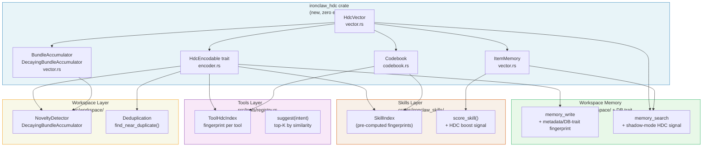

# Hyperdimensional Computing (HDC) — Overview

**Captured source-corpus labels**: `roko-primitives`, `roko-neuro`, and `roko-index`.
**Priority**: HIGH — optional structural similarity signal for memory, skill matching, and tool selection.
**Status**: source-derived design proposal for IronClaw; captured paths are provenance labels only, and performance/quality claims require local validation before rollout.

---

## What Is HDC?

Hyperdimensional Computing (HDC), also known as Vector Symbolic Architectures (VSA), represents information as 10,240-bit binary vectors and manipulates them with four simple algebraic operations. It needs no model inference and uses bitwise CPU operations for comparison. The captured baseline reports very low per-comparison latency; IronClaw should treat those numbers as benchmark targets until measured on its own CI and deployment hardware.

The core insight: **in sufficiently high-dimensional spaces, random vectors are almost certainly near-orthogonal.** Similarity significantly above 0.5 is a candidate structural signal that still needs encoder and corpus validation.

**What HDC is NOT**: HDC is not a neural network. It does not learn weights. It provides a **compositional algebra** for building structured representations from atomic symbols — like how arithmetic lets you compose numbers with +, −, ×.

---

## Table of Contents

| Document | Contents |
|----------|---------|
| [theory.md](./theory.md) | Mathematical foundations, VSA variants, all four operations, capacity analysis, why 10,240 bits |
| [implementation.md](./implementation.md) | Captured-source implementation details — HdcVector, Codebook, Accumulators, ItemMemory, PatternStore |
| [applications.md](./applications.md) | 6 application areas with worked examples and validation targets |
| [benchmarking.md](./benchmarking.md) | Benchmark protocol, false-positive analysis, and A/B comparison methodology |
| [ironclaw-integration.md](./ironclaw-integration.md) | Phased IronClaw integration plan with hook points, gates, and risks |
| [references.md](./references.md) | Selected academic citations and annotations |

---

## Architecture Diagram



---

## Quick Intro

### Key Terminology

| Term | Meaning |
|---|---|
| **Hypervector (HV)** | A vector with 10,240 binary dimensions |
| **Hamming similarity** | 1 - (differing bits / 10,240); ranges 0 (complement) to 1 (identical) |
| **Quasi-orthogonal** | Two random vectors with ~0.5 similarity — functionally independent |
| **Bind (XOR)** | Combines two HVs into a new one quasi-orthogonal to both inputs |
| **Bundle (majority vote)** | Superimposes multiple HVs into one similar to all inputs |
| **Permute (cyclic shift)** | Rotates bits to encode position/sequence order |
| **Codebook** | Dictionary mapping symbolic names to deterministic hypervectors |
| **BSC** | Binary Spatter Codes — the specific HDC variant used here |
| **VSA** | Vector Symbolic Architectures — the broader family |

### The Four Operations at a Glance

```
bind(A, B)          = A XOR B          # associates two concepts; involutory
bundle(A, B, C)     = majority_vote    # superimposes; result similar to all
permute(A, k)       = cyclic_shift(k)  # encodes position; breaks commutativity
similarity(A, B)    = 1 - hamming/D    # [0, 1]; > 0.526 is statistically significant
```

### Similarity Interpretation

| Similarity | Meaning |
|---|---|
| 1.0 | Identical |
| > 0.526 | Candidate structural relationship; target threshold for <1% FP scanning 100K random pairs, subject to corpus validation |
| 0.485–0.515 | Noise band — quasi-orthogonal, no relationship |
| < 0.48 | Meaningful dissimilarity |
| 0.0 | Bitwise complement |

### Performance at a Glance

| Operation | Captured baseline / IronClaw target |
|---|---|
| `similarity()` | ~13 ns baseline; verify with criterion on target hardware |
| `bind()` | ~5 ns baseline; verify locally |
| `permute()` | ~10 ns baseline; verify locally |
| `bundle()` (K=10) | ~800 ns baseline; verify locally |
| Scan 100K entries | ~1.3 ms baseline; O(N) scan over fixed-width fingerprints |

---

## Prerequisites

A reader with no prior HDC knowledge can implement the system from scratch after reading these documents. Helpful background:

- **Linear algebra basics**: vectors, dot products, orthogonality
- **Probability/statistics**: normal distributions, standard deviations
- **Boolean algebra**: XOR, AND, OR, bitwise operations
- **Rust**: `[u64; 160]` fixed-size arrays, traits, generics

**Not required**: machine learning, neural networks, GPU programming, floating-point arithmetic.

---

## Reading Order

1. **Start here** — this README for orientation
2. [theory.md](./theory.md) — understand the math before reading code
3. [implementation.md](./implementation.md) — captured implementation details and adaptation notes
4. [applications.md](./applications.md) — worked examples for each use case
5. [benchmarking.md](./benchmarking.md) — performance data and FP analysis
6. [ironclaw-integration.md](./ironclaw-integration.md) — the IronClaw plan

---

Next: [Theory and Mathematical Foundations](./theory.md)
