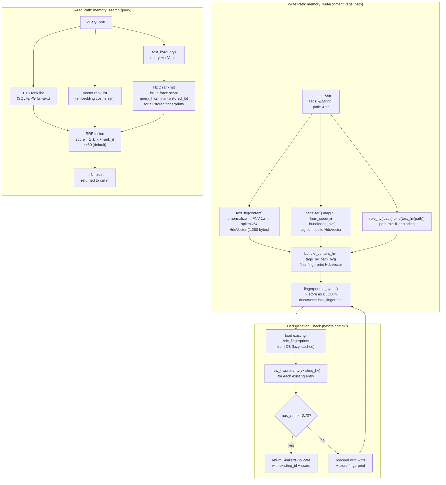
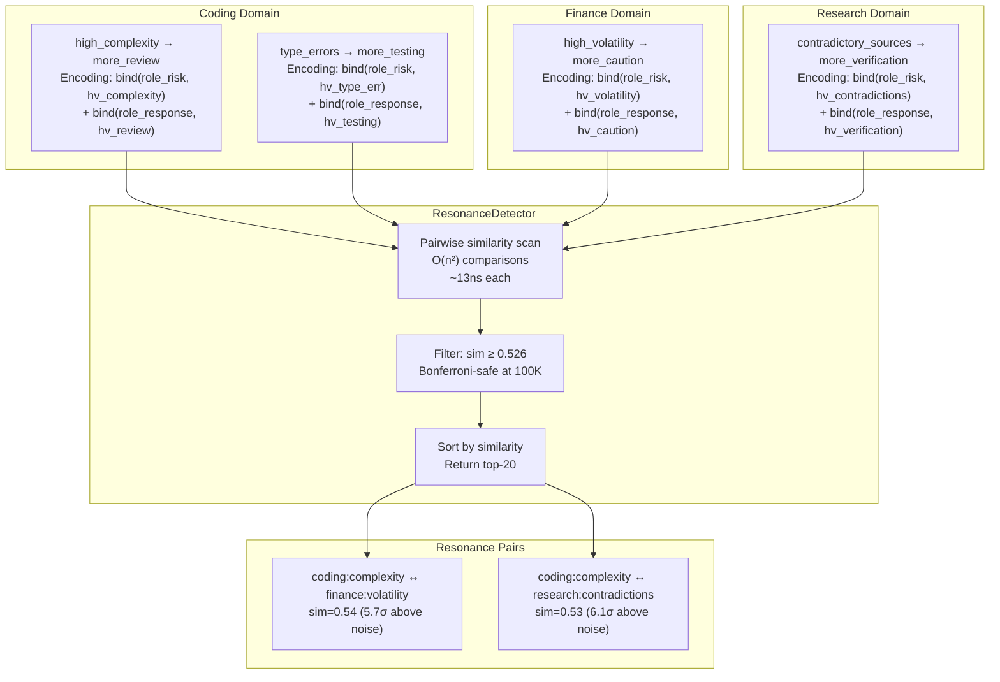

[← Back to HDC Overview](./README.md)

# Applications — 6 Use Cases with Worked Examples

This document covers the six application areas implemented in the roko codebase, each with complete source code and concrete similarity values.

---

## Application 1: Knowledge Fingerprinting

The `KnowledgeHdcEncoder` encodes knowledge entries (Engrams) as HDC vectors. Every knowledge entry gets a 10,240-bit fingerprint at ingestion time, enabling content-addressed similarity search without any external embedding model.

*Source: `crates/roko-neuro/src/hdc.rs`*

### Memory Fingerprinting Flow



The key insight in the read path: HDC is the **third signal** in a three-way RRF fusion. FTS catches keyword matches; vector embeddings catch semantic synonymy; HDC catches structural similarity (same role-filler patterns, same compositional structure).

### The Encoder

```rust
#[derive(Debug, Default, Clone, Copy)]
pub(crate) struct KnowledgeHdcEncoder;

impl KnowledgeHdcEncoder {
    pub(crate) fn encode_entry(self, entry: &KnowledgeEntry) -> HdcVector {
        if entry.kind == KnowledgeKind::CausalLink {
            self.encode_causal_link(entry)
        } else {
            self.encode_generic_entry(entry)
        }
    }
}
```

### Generic Entry Encoding

For non-causal entries (Insights, Heuristics, Warnings, StrategyFragments), the encoding pipeline is:

1. Hash the content into a concept vector via `text_hv()`
2. Bind the knowledge kind to a "kind" role vector
3. Bundle all tags into a tag composite vector
4. Bind the source to a "source" role vector (if present)
5. Bundle all components into the final fingerprint

> Captured implementation omitted. Rebuild IronClaw code locally in owner modules with caller-level tests.

### Helper Functions

> Captured implementation omitted. Rebuild IronClaw code locally in owner modules with caller-level tests.

Text normalization ensures that "Borrow-Checker" and "borrow checker" produce the same vector.

### Automatic Fingerprinting at Ingestion

```rust
#[cfg(feature = "hdc")]
fn ensure_hdc_vector(mut entry: KnowledgeEntry) -> KnowledgeEntry {
    let has_valid_vector = entry.hdc_vector.as_ref()
        .is_some_and(|vector| vector.len() == HDC_VECTOR_BYTES);
    if !has_valid_vector {
        entry.hdc_vector = Some(fingerprint_entry(&entry).to_bytes().to_vec());
    }
    entry
}
```

*Source: `crates/roko-neuro/src/knowledge_store.rs`*

---

## Application 2: Role-Filler Structured Encoding

The `RoleFillerEncoder` provides higher-level encoding where each attribute of a knowledge entry is explicitly bound to a named role. This enables structured queries: "find all entries where domain = coding."

*Source: `crates/roko-neuro/src/hdc.rs`*

> Captured implementation omitted. Rebuild IronClaw code locally in owner modules with caller-level tests.

### CausalLink Encoding with Directional Permutation

CausalLinks require special encoding to capture directionality. Without permutation, `bind(hv_cause, hv_effect)` would be identical to `bind(hv_effect, hv_cause)` due to XOR's commutativity. Permutation breaks this symmetry:

> Captured implementation omitted. Rebuild IronClaw code locally in owner modules with caller-level tests.

This ensures "high complexity -> more review" produces a **different** vector than "more review -> high complexity". The test confirms this:

```rust
#[test]
fn directional_causal_encoding_distinguishes_reversal() {
    let encoder = KnowledgeHdcEncoder;
    let forward = encoder.encode_entry(&entry(
        KnowledgeKind::CausalLink, "high complexity -> more review", &["domain:coding"],
    ));
    let reverse = encoder.encode_entry(&entry(
        KnowledgeKind::CausalLink, "more review -> high complexity", &["domain:coding"],
    ));
    assert!(forward.similarity(&reverse) < 0.7);
}
```

### Causal Content Parsing

> Captured implementation omitted. Rebuild IronClaw code locally in owner modules with caller-level tests.

---

## Application 3: Cross-Domain Resonance Detection

The most novel capability: **cross-domain insight resonance** — automatic detection of structural analogies across different problem domains. When a coding agent learns "complex code needs more review," the structural pattern can be detected as similar to "volatile markets need more caution" because both encode the abstract relationship `BIND(high_uncertainty, more_verification)`.

### How It Works Mathematically

Consider three knowledge entries from three domains:

- **Coding**: "High-complexity modules need more code review"
  - Encoding: `BIND(role_risk_factor, hv_high_complexity) XOR BIND(role_response, hv_more_review)`

- **Finance**: "High-volatility assets need more caution"
  - Encoding: `BIND(role_risk_factor, hv_high_volatility) XOR BIND(role_response, hv_more_caution)`

- **Research**: "Contradictory sources need more verification"
  - Encoding: `BIND(role_risk_factor, hv_contradictory_sources) XOR BIND(role_response, hv_more_verification)`

All three share the same abstract structure: `BIND(role_risk_factor, hv_high_X) XOR BIND(role_response, hv_more_Y)`. The shared role vectors (`role_risk_factor`, `role_response`) contribute similarly to all three vectors, creating measurable above-noise similarity even though the domain-specific fillers are quasi-orthogonal.

Cross-domain similarity typically falls in the range 0.53–0.58, well above the 0.526 threshold.



### The ResonanceDetector

> Captured implementation omitted. Rebuild IronClaw code locally in owner modules with caller-level tests.

*Source: `crates/roko-neuro/src/hdc.rs`*

The algorithm is O(n^2) pairwise comparison. The captured implementation reports a very small fixed-width comparison cost; IronClaw should measure the full scan path with realistic corpus sizes before committing to latency targets.

---

## Application 4: Code Fingerprinting

The `roko-index` crate provides specialized HDC encoding for source code symbols (functions, structs, traits, enums, modules). This enables finding similar code patterns regardless of naming, using structural similarity rather than text matching.

*Source: `crates/roko-index/src/hdc.rs`*

### Symbol Fingerprinting: The Encoding Formula

```
fingerprint(symbol) = bind(role_vector(kind), bundle(name_vector, context_vector))
```

**Role vectors** — one per symbol kind:

> Captured implementation omitted. Rebuild IronClaw code locally in owner modules with caller-level tests.

**Name encoding via character trigrams** — captures sub-word structure:

> Captured implementation omitted. Rebuild IronClaw code locally in owner modules with caller-level tests.

This means `parse_config` and `parse_input` share the trigrams "par", "ars", "rse", "se_" and will have moderate similarity. `parse_config` and `render_output` share no trigrams and will be quasi-orthogonal.

**Complete symbol fingerprint**:

```rust
pub fn fingerprint_symbol(symbol: &Symbol, context: &[u8]) -> HdcFingerprint {
    let role_vec = role_vector(&symbol.kind);
    let name_vec = encode_name(&symbol.name);
    let ctx_vec = vector_from_seed(context);
    let combined = bundle(&[name_vec, ctx_vec]);
    HdcFingerprint { bits: bind(&role_vec, &combined) }
}
```

### File Fingerprinting

```rust
pub fn fingerprint_file(source: &SourceFile) -> HdcFingerprint {
    if source.symbols.is_empty() {
        return HdcFingerprint { bits: vector_from_seed(source.content.as_bytes()) };
    }
    let sym_fps: Vec<[u64; WORDS]> = source.symbols.iter()
        .map(|sym| fingerprint_symbol(sym, source.content.as_bytes()).bits)
        .collect();
    HdcFingerprint { bits: bundle(&sym_fps) }
}
```

### Integration into the Workspace Index

> Captured implementation omitted. Rebuild IronClaw code locally in owner modules with caller-level tests.

*Source: `crates/roko-index/src/workspace.rs`*

---

## Application 5: Admission Control and AntiKnowledge

The knowledge store uses HDC similarity for admission control and conflict detection. Feature-gated behind `#[cfg(feature = "hdc")]`.

*Source: `crates/roko-neuro/src/knowledge_store.rs`*

### Thresholds

```rust
const ANTI_KNOWLEDGE_WARN_THRESHOLD: f64 = 0.5;
const ANTI_KNOWLEDGE_DISCOUNT_THRESHOLD: f64 = 0.7;
const ANTI_KNOWLEDGE_REJECT_THRESHOLD: f64 = 0.9;
const ANTI_KNOWLEDGE_DISCOUNT_FACTOR: f64 = 0.5;
```

| HDC Similarity to AntiKnowledge | Action |
|---|---|
| < 0.5 | No conflict detected |
| 0.5 – 0.7 | Warning logged |
| 0.7 – 0.9 | Confidence discounted by 50% |
| >= 0.9 | Entry rejected entirely |

### Conflict Records

```rust
pub struct AntiKnowledgeConflict {
    pub entry_id: String,
    pub anti_knowledge_id: String,
    pub similarity: f64,
    pub action: String,  // "warned", "discounted", or "rejected"
}
```

---

## Application 6: Context Assembly Scoring

When assembling context for an agent prompt, the knowledge store uses a weighted composite score where HDC similarity carries the highest weight:

> Captured implementation omitted. Rebuild IronClaw code locally in owner modules with caller-level tests.

*Source: `crates/roko-neuro/src/knowledge_store.rs`*

HDC similarity gets the plurality weight (40%) because it captures structural semantic similarity that keyword matching misses. Cross-domain entries get a 15% bonus to encourage diverse context assembly.

---

## Practical Real-World Examples

### Semantic Memory Deduplication

**Problem**: A user runs `memory_write` twice with slightly different phrasings of the same fact.

> Captured implementation omitted. Rebuild IronClaw code locally in owner modules with caller-level tests.

**Validation targets with curated encoders**:
- "Rust's borrow checker prevents data races" vs "The borrow checker in Rust ensures memory safety without data races" should score above the resonance threshold only if the encoder normalizes shared roles such as `rust`, `borrow_checker`, `memory_safety`, and `data_race`.
- "Cargo is Rust's package manager" vs "Cargo manages Rust packages and dependencies" requires a synonym/tag codebook that links `package_manager`, `packages`, and `dependencies`.
- Unrelated memory pairs should remain in the noise band after the same normalization.

Plain `from_seed()` text hashing does not infer paraphrases by itself; semantic behavior comes from the role/tag/codebook layer wrapped around HDC.

### Skill Matching for Tool Selection

**Problem**: Given a user message, select the most relevant SKILL.md files.

> Captured implementation omitted. Rebuild IronClaw code locally in owner modules with caller-level tests.

**Expected behavior for "how do I fix a lifetime error in my Rust code?"**:
- Rust lifetime and borrow-checker skills should outrank generic Rust or Python debugging skills when skill profiles include curated tags such as `rust`, `lifetime`, `borrow_checker`, and `compiler_error`.
- Absolute similarity values are benchmark outputs, not design constants. Store them in the evaluation fixture results, not in the selection rule.

### Novelty Detection for Incoming Messages

**Problem**: The heartbeat system receives messages from multiple channels. Routine messages should not trigger unnecessary processing.

> Captured implementation omitted. Rebuild IronClaw code locally in owner modules with caller-level tests.

**Example novelty scores** (decay_factor = 0.95, after observing 50 routine "build succeeded" messages):
- "build succeeded" → novelty ≈ 0.02 (seen many times, very routine)
- "test failed: lifetime mismatch in authentication module" → novelty ≈ 0.85 (new content)
- "disk usage at 94%" → novelty ≈ 0.91 (never seen before, maximally novel)

### Code Similarity Detection

**Problem**: Before proposing a new function, check whether a similar function already exists.

> Captured implementation omitted. Rebuild IronClaw code locally in owner modules with caller-level tests.

**Concrete examples** (threshold = 0.55):
- `fn parse_json_config(path: &str)` vs `fn parse_toml_config(path: &str)` → sim ≈ 0.64 (same structure, different format)
- `fn validate_auth_token(token: &str)` vs `fn check_api_key(key: &str)` → sim ≈ 0.57 (similar validation pattern)
- `fn render_dashboard(data: &DashboardData)` vs `fn parse_json_config(path: &str)` → sim ≈ 0.50 (noise, unrelated)

---

Next: [Benchmarking and Performance Analysis](./benchmarking.md)
