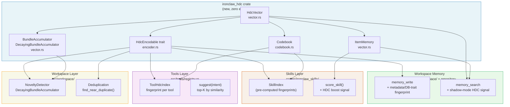

[← Back to HDC Overview](./README.md)

# IronClaw Integration Plan

This document contains a six-phase integration plan for HDC in IronClaw. It keeps implementation contracts, validation gates, and ownership notes; it is not a crate dump and uses captured-source provenance only.

---

## Integration Architecture



The integration should be staged behind feature flags and reviewed at the actual call sites it changes. The first useful milestone is a shadow-mode HDC signal that records fingerprints and retrieval scores without changing user-visible search ranking.

---

## Phase 1 — Week 1: Core Crate (ironclaw_hdc)

**Goal**: Create `crates/ironclaw_hdc/` with zero IronClaw dependencies. Pure library code that can be developed, tested, and reviewed in complete isolation.

**Files to create**:
```
crates/ironclaw_hdc/
  Cargo.toml
  src/
    lib.rs
    vector.rs       # HdcVector, splitmix64, from_seed, bind, bundle, permute, similarity
    codebook.rs     # Codebook, PatternStore, detect_cross_domain_resonance
    accumulator.rs  # BundleAccumulator, DecayingBundleAccumulator
    memory.rs       # ItemMemory
    encoder.rs      # HdcEncodable, text_hv, role_hv, normalize_text
  benches/
    hdc_ops.rs      # criterion benchmarks (bind, bundle, similarity, scan)
  tests/
    fp_rate.rs      # false positive rate validation
    search_quality.rs  # A/B quality harness
```

**Add to workspace `Cargo.toml`**:
```toml
[workspace]
members = [
    # ... existing members ...
    "crates/ironclaw_hdc",
]
```

### Cargo.toml

> Captured implementation omitted. Rebuild IronClaw code locally in owner modules with caller-level tests.

### src/lib.rs

> Captured implementation omitted. Rebuild IronClaw code locally in owner modules with caller-level tests.

### src/vector.rs

> Captured implementation omitted. Rebuild IronClaw code locally in owner modules with caller-level tests.

### src/encoder.rs

> Captured implementation omitted. Rebuild IronClaw code locally in owner modules with caller-level tests.

**Validation gate (Phase 1)**: unit tests pass; criterion captures local baselines for bind/bundle/permute/similarity/scan; FP-rate tests cover the 0.526 threshold candidate against sampled random pairs. Treat captured `<15 ns` similarity as a target, do not make it a merge blocker without local evidence.

---

## Phase 2 — Week 2: Memory Metadata + Write Path

**Goal**: compute an HDC fingerprint for each `MemoryDocument` write and store it without changing retrieval behavior. Prefer a metadata overlay first (`metadata.hdc`) unless the benchmark shows the query path needs a first-class column. Any schema change must be added through the shared DB trait and implemented for both PostgreSQL and libSQL.

### Migration SQL

```sql
-- PostgreSQL
ALTER TABLE memory_documents ADD COLUMN IF NOT EXISTS hdc_fingerprint BYTEA;
CREATE INDEX CONCURRENTLY IF NOT EXISTS idx_memory_documents_hdc_fingerprint
    ON memory_documents (id) WHERE hdc_fingerprint IS NOT NULL;

-- libSQL / SQLite
ALTER TABLE memory_documents ADD COLUMN hdc_fingerprint BLOB;
```

### Write Path Change

> Captured implementation omitted. Rebuild IronClaw code locally in owner modules with caller-level tests.

### Backfill Job

> Captured implementation omitted. Rebuild IronClaw code locally in owner modules with caller-level tests.

**Validation gate (Phase 2)**: all existing memory tests pass; new writes preserve file-like path/content/metadata semantics; PostgreSQL and libSQL implementations behave identically; backfill completes on a 10K-document fixture; chunk metadata and version hashes remain unchanged.

---

## Phase 3 — Week 3: Search Fusion (HDC as Third RRF Signal)

**Goal**: add HDC similarity as an optional third signal to the existing hybrid memory search contract (`MemorySearchRequest` -> `MemorySearchResult`). Keep it disabled by default and run it in shadow mode before it can affect ranking.

### Config Addition

> Captured implementation omitted. Rebuild IronClaw code locally in owner modules with caller-level tests.

### Search Fusion

> Captured implementation omitted. Rebuild IronClaw code locally in owner modules with caller-level tests.

**Validation gate (Phase 3)**: `HDC_SEARCH_ENABLED=true cargo test --features integration` — all integration tests pass. Run the A/B harness and confirm MRR@10 is not degraded versus System B baseline.

---

## Phase 4 — Week 4: Skill Matching

**Goal**: Build `SkillIndex` at skill-load time. Use HDC similarity as a pre-filter and scoring boost in `crates/ironclaw_skills/src/selector.rs`.

> Captured implementation omitted. Rebuild IronClaw code locally in owner modules with caller-level tests.

---

## Phase 5 — Week 5: Tool Selection Index

**Goal**: Build `ToolHdcIndex` in `src/tools/registry.rs` at tool-registration time. Expose a `suggest(intent)` API used by the progressive disclosure system.

> Captured implementation omitted. Rebuild IronClaw code locally in owner modules with caller-level tests.

---

## Phase 6 — Week 6: Novelty Detection + Deduplication

**Goal**: Add `NoveltyDetector` to the heartbeat system and a deduplication guard to `memory_write`.

### Novelty Detection in the Heartbeat

> Captured implementation omitted. Rebuild IronClaw code locally in owner modules with caller-level tests.

### Deduplication Guard in memory_write

> Captured implementation omitted. Rebuild IronClaw code locally in owner modules with caller-level tests.

---

## Week-by-Week Summary

| Week | Phase | Deliverable | Validation |
|---|---|---|---|
| 1 | Core crate/module | HDC vector operations, unit tests, criterion benchmarks | All tests pass; benchmark captured as local baseline |
| 2 | Metadata + write | Fingerprint on memory writes; metadata overlay or DB-trait-backed column; backfill job | Dual-backend tests pass; chunk metadata and existing hashes unchanged |
| 3 | Search fusion | Shadow-mode HDC as third RRF signal; `HDC_SEARCH_ENABLED` flag | Caller-level search tests and A/B show no regression vs baseline |
| 4 | Skill matching | `SkillHdcIndex` at startup; scoring boost | Manual test: relevant skills surface for 10 test messages |
| 5 | Tool selection | `ToolHdcIndex`; `suggest(intent)` API | Manual test: correct tools surface for 5 intent strings |
| 6 | Novelty + dedup | Heartbeat filter; dedup guard in `memory_write` | FP rate test; dedup catches known-duplicate test cases |

## Risk Register

- **Ranking regression**: any change that affects `memory_search` can reduce answer quality. Keep HDC in shadow mode until caller-level retrieval tests and recorded fixtures show no regression.
- **DB parity**: schema or repository changes must support PostgreSQL and libSQL and preserve config/reload behavior.
- **Memory overhead** (Phase 2+): 1,280 bytes per memory entry × N entries. For 100K entries = 125 MB additional memory if all fingerprints are loaded. Mitigate with cursor-based loading or mmap.
- **Scan latency** (Phase 3): brute-force HDC search is O(N) over fixed-width fingerprints. Use the captured ~1.3 ms / 100K result only as a benchmark target; if local measurements miss it, add a candidate filter before HDC scoring.
- **False merges** (Phase 6): the 0.70 deduplication threshold is conservative. Confirm empirically before enabling by default; start with `DedupResult::Similar` being advisory only.

---

Next: [References](./references.md)
