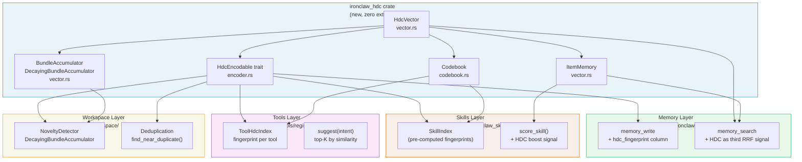

[← Back to HDC Overview](./README.md)

# IronClaw Integration Plan

This document contains the full 6-phase plan for integrating HDC into IronClaw, including the complete `ironclaw_hdc` crate implementation with runnable Rust code, migration SQL, and configuration additions.

---

## Integration Architecture



The integration is **purely additive** at every phase. Existing functionality is never modified, only extended. Each phase can be reviewed and merged independently.

---

## Phase 1 — Week 1: Core Crate (ironclaw_hdc)

**Goal**: Create `crates/ironclaw_hdc/` with zero IronClaw dependencies. Pure library code that can be developed, tested, and reviewed in complete isolation.

**Files to create**:
```
crates/ironclaw_hdc/
  Cargo.toml
  src/
    lib.rs
    vector.rs       # HdcVector, splitmix64, from_seed, bind, bundle, permute, similarity
    codebook.rs     # Codebook, PatternStore, detect_cross_domain_resonance
    accumulator.rs  # BundleAccumulator, DecayingBundleAccumulator
    memory.rs       # ItemMemory
    encoder.rs      # HdcEncodable, text_hv, role_hv, normalize_text
  benches/
    hdc_ops.rs      # criterion benchmarks (bind, bundle, similarity, scan)
  tests/
    fp_rate.rs      # false positive rate validation
    search_quality.rs  # A/B quality harness
```

**Add to workspace `Cargo.toml`**:
```toml
[workspace]
members = [
    # ... existing members ...
    "crates/ironclaw_hdc",
]
```

### Cargo.toml

```toml
[package]
name = "ironclaw_hdc"
version = "0.1.0"
edition = "2021"
description = "Hyperdimensional computing primitives for IronClaw — 10,240-bit BSC vectors with bind, bundle, permute, similarity"

[dependencies]
serde = { version = "1", features = ["derive"] }
serde_json = "1"
uuid = { version = "1", features = ["v4"] }

[dev-dependencies]
criterion = { version = "0.5", features = ["html_reports"] }

[[bench]]
name = "hdc_ops"
harness = false

[features]
# Enable rkyv zero-copy serialization for memory-mapped file access
rkyv = ["dep:rkyv"]

[dependencies.rkyv]
version = "0.7"
features = ["validation"]
optional = true
```

### src/lib.rs

```rust
//! Hyperdimensional Computing (HDC) primitives for IronClaw.
//!
//! Implements Binary Spatter Codes (BSC) with 10,240-bit vectors.
//! All operations are pure bitwise CPU instructions — no floating point,
//! no GPU, no external model inference required.
//!
//! # Quick Start
//!
//! ```rust
//! use ironclaw_hdc::{HdcVector, text_hv, role_hv, RESONANCE_THRESHOLD};
//!
//! // Encode two concepts
//! let hv_rust = text_hv("rust programming language");
//! let hv_async = text_hv("asynchronous programming");
//!
//! // Bind into a structured record: "language=rust, topic=async"
//! let role_lang = role_hv("language");
//! let role_topic = role_hv("topic");
//! let record = HdcVector::bundle(&[
//!     &role_lang.bind(&hv_rust),
//!     &role_topic.bind(&hv_async),
//! ]);
//!
//! // Query: "what language?" — unbind the language role
//! let query_result = record.bind(&role_lang);
//! let sim = query_result.similarity(&hv_rust);
//! assert!(sim > RESONANCE_THRESHOLD, "Should recover 'rust' from the record");
//! ```

pub mod accumulator;
pub mod codebook;
pub mod encoder;
pub mod memory;
pub mod vector;

pub use accumulator::{BundleAccumulator, DecayingBundleAccumulator};
pub use codebook::{Codebook, PatternStore, ResonanceResult, StoredPattern};
pub use encoder::{role_hv, text_hv, HdcEncodable};
pub use memory::ItemMemory;
pub use vector::HdcVector;

/// Number of bits in one HdcVector.
pub const HDC_BITS: usize = 10_240;
/// Number of serialized bytes in one HdcVector.
pub const HDC_BYTES: usize = 1_280;
/// Number of u64 words in one HdcVector.
pub const HDC_WORDS: usize = 160;

/// Recommended similarity threshold for detecting genuine structural relationships.
///
/// At D=10,240, random vectors have similarity in [0.485, 0.515] with 99.7% probability.
/// A threshold of 0.526 corresponds to Z≈5.3, giving:
/// - Per-comparison false positive rate: ~7×10^-8
/// - Overall FP rate when scanning 100K entries (Bonferroni): <1%
pub const RESONANCE_THRESHOLD: f32 = 0.526;

/// Threshold for near-duplicate detection (very high structural overlap).
pub const DUPLICATE_THRESHOLD: f32 = 0.70;

/// Threshold for AntiKnowledge conflict rejection (nearly identical content).
pub const REJECT_THRESHOLD: f32 = 0.90;
```

### src/vector.rs

```rust
//! Core HdcVector type: 10,240-bit BSC hypervector.

use serde::{Deserialize, Serialize};
use uuid::Uuid;

use crate::{HDC_BITS, HDC_WORDS};

/// 10,240-bit binary sparse distributed vector.
///
/// Three core operations: XOR bind, majority-vote bundle, Hamming similarity.
/// All operations are CPU-cache-friendly bit manipulation — no floating point,
/// no matrix multiply, no GPU required.
#[derive(Clone, Copy, Debug, Eq, PartialEq)]
pub struct HdcVector {
    pub(crate) bits: [u64; HDC_WORDS],
}

impl HdcVector {
    pub const fn zeros() -> Self {
        Self { bits: [0; HDC_WORDS] }
    }

    pub fn random() -> Self {
        let seed = Uuid::new_v4().as_u128();
        let mut state = seed as u64 ^ ((seed >> 64) as u64);
        let mut bits = [0u64; HDC_WORDS];
        for word in &mut bits {
            *word = splitmix64(&mut state);
        }
        Self { bits }
    }

    /// Create a deterministic vector from a byte seed.
    /// Uses FNV-1a to hash the seed into a 64-bit state, then splitmix64 to expand.
    /// Identical seeds always produce identical vectors across runs and machines.
    pub fn from_seed(seed: &[u8]) -> Self {
        let mut hash: u64 = 0xcbf2_9ce4_8422_2325;
        for &byte in seed {
            hash ^= u64::from(byte);
            hash = hash.wrapping_mul(0x0100_0000_01b3);
        }
        if hash == 0 {
            hash = 0xA5A5_A5A5_5A5A_5A5A;
        }
        let mut bits = [0u64; HDC_WORDS];
        for word in &mut bits {
            *word = splitmix64(&mut hash);
        }
        Self { bits }
    }

    pub(crate) fn from_bits(bits: [u64; HDC_WORDS]) -> Self { Self { bits } }
    pub(crate) fn bits(&self) -> &[u64; HDC_WORDS] { &self.bits }

    /// Binds two vectors using XOR. Involutory: `bind(bind(a, b), b) == a`.
    pub fn bind(&self, other: &Self) -> Self {
        let mut bits = [0u64; HDC_WORDS];
        for (slot, (left, right)) in bits.iter_mut().zip(self.bits.iter().zip(other.bits.iter())) {
            *slot = left ^ right;
        }
        Self { bits }
    }

    /// Bundles a slice of vectors using majority vote (tie -> 0).
    pub fn bundle(vectors: &[&Self]) -> Self {
        if vectors.is_empty() { return Self::zeros(); }
        let len = vectors.len();
        let mut bits = [0u64; HDC_WORDS];
        for (word_index, slot) in bits.iter_mut().enumerate() {
            let mut word = 0u64;
            for bit_index in 0..64 {
                let mut ones = 0usize;
                for vector in vectors {
                    ones += ((vector.bits[word_index] >> bit_index) & 1) as usize;
                }
                if ones * 2 > len {
                    word |= 1u64 << bit_index;
                }
            }
            *slot = word;
        }
        Self { bits }
    }

    /// Rotates bits left by `n` positions (cyclic permutation for sequence encoding).
    pub fn permute(&self, n: usize) -> Self {
        let bits_len = self.bits.len() * 64;
        let n = n % bits_len;
        if n == 0 { return *self; }
        let word_shift = n / 64;
        let bit_shift = n % 64;
        let mut bits = [0u64; HDC_WORDS];
        for (index, slot) in bits.iter_mut().enumerate() {
            let src0 = (index + HDC_WORDS - word_shift) % HDC_WORDS;
            *slot = if bit_shift == 0 {
                self.bits[src0]
            } else {
                let src1 = (src0 + HDC_WORDS - 1) % HDC_WORDS;
                (self.bits[src0] << bit_shift) | (self.bits[src1] >> (64 - bit_shift))
            };
        }
        Self { bits }
    }

    /// Returns the Hamming similarity in [0.0, 1.0].
    /// 1.0 = identical, 0.5 = quasi-orthogonal (unrelated), 0.0 = bitwise complement.
    pub fn similarity(&self, other: &Self) -> f32 {
        let mut differing_bits = 0u32;
        for (left, right) in self.bits.iter().zip(other.bits.iter()) {
            differing_bits += (left ^ right).count_ones();
        }
        let differing_bits = u16::try_from(differing_bits).unwrap_or(u16::MAX);
        1.0_f32 - (f32::from(differing_bits) / HDC_BITS as f32)
    }

    pub fn to_bytes(&self) -> [u8; 1280] {
        let mut out = [0u8; 1280];
        for (i, word) in self.bits.iter().enumerate() {
            out[i * 8..(i + 1) * 8].copy_from_slice(&word.to_le_bytes());
        }
        out
    }

    pub fn from_bytes(bytes: &[u8; 1280]) -> Self {
        let mut bits = [0u64; HDC_WORDS];
        for (i, word) in bits.iter_mut().enumerate() {
            let mut buf = [0u8; 8];
            buf.copy_from_slice(&bytes[i * 8..(i + 1) * 8]);
            *word = u64::from_le_bytes(buf);
        }
        Self { bits }
    }

    pub fn to_vec(&self) -> Vec<u8> { self.to_bytes().to_vec() }

    pub fn from_slice(bytes: &[u8]) -> Option<Self> {
        let bytes: &[u8; 1280] = bytes.try_into().ok()?;
        Some(Self::from_bytes(bytes))
    }
}

pub(crate) fn splitmix64(state: &mut u64) -> u64 {
    *state = state.wrapping_add(0x9e37_79b9_7f4a_7c15);
    let mut z = *state;
    z = (z ^ (z >> 30)).wrapping_mul(0xbf58_476d_1ce4_e5b9);
    z = (z ^ (z >> 27)).wrapping_mul(0x94d0_49bb_1331_11eb);
    z ^ (z >> 31)
}

impl Serialize for HdcVector {
    fn serialize<S: serde::Serializer>(&self, serializer: S) -> Result<S::Ok, S::Error> {
        serializer.serialize_bytes(&self.to_bytes())
    }
}

impl<'de> Deserialize<'de> for HdcVector {
    fn deserialize<D: serde::Deserializer<'de>>(deserializer: D) -> Result<Self, D::Error> {
        let bytes: Vec<u8> = Vec::deserialize(deserializer)?;
        let bytes: &[u8; 1280] = bytes.as_slice().try_into()
            .map_err(|_| serde::de::Error::custom(
                format!("HdcVector requires exactly 1280 bytes, got {}", bytes.len())
            ))?;
        Ok(Self::from_bytes(bytes))
    }
}
```

### src/encoder.rs

```rust
//! HdcEncodable trait and text normalization helpers.

use crate::{codebook::Codebook, vector::HdcVector};

pub trait HdcEncodable {
    fn to_hdc(&self, codebook: &Codebook) -> HdcVector;
}

/// Encode raw text with normalization (lowercase, strip punctuation, collapse whitespace).
pub fn text_hv(text: &str) -> HdcVector {
    HdcVector::from_seed(normalize_text(text).as_bytes())
}

/// Encode a role name as a deterministic role vector.
/// Uses the prefix "role:" to distinguish role vectors from content vectors.
pub fn role_hv(role: &str) -> HdcVector {
    HdcVector::from_seed(format!("role:{role}").as_bytes())
}

/// Normalize text for consistent HDC encoding.
pub fn normalize_text(text: &str) -> String {
    text.chars()
        .map(|ch| {
            if ch.is_alphanumeric() || ch.is_whitespace() {
                ch.to_ascii_lowercase()
            } else {
                ' '
            }
        })
        .collect::<String>()
        .split_whitespace()
        .collect::<Vec<_>>()
        .join(" ")
}

/// Encode a list of (role, filler) pairs as a structured HDC vector.
pub fn encode_role_fillers(pairs: &[(&str, &str)]) -> HdcVector {
    if pairs.is_empty() { return HdcVector::zeros(); }
    let bound: Vec<HdcVector> = pairs.iter()
        .map(|(role, filler)| role_hv(role).bind(&text_hv(filler)))
        .collect();
    let refs: Vec<&HdcVector> = bound.iter().collect();
    HdcVector::bundle(&refs)
}

/// Extract the filler for a given role from a composite vector.
pub fn extract_role(composite: &HdcVector, role: &str) -> HdcVector {
    composite.bind(&role_hv(role))
}
```

**Validation gate (Phase 1)**: All unit tests pass. Benchmark confirms `similarity()` < 15 ns on the CI machine. FP rate test at threshold 0.526 passes (< 1e-5 across 1M sampled pairs).

---

## Phase 2 — Week 2: Memory Schema + Write Path

**Goal**: Add `hdc_fingerprint` column to the memory documents table and compute fingerprints on every `memory_write`. No search integration yet — pure data collection.

### Migration SQL

```sql
-- PostgreSQL
ALTER TABLE documents ADD COLUMN IF NOT EXISTS hdc_fingerprint BYTEA;
CREATE INDEX CONCURRENTLY IF NOT EXISTS idx_documents_hdc_fingerprint
    ON documents (id) WHERE hdc_fingerprint IS NOT NULL;

-- libSQL / SQLite
ALTER TABLE documents ADD COLUMN hdc_fingerprint BLOB;
```

### Write Path Change

```rust
// In crates/ironclaw_memory/src/store.rs
use ironclaw_hdc::{text_hv, role_hv, HdcVector};

fn compute_document_fingerprint(
    content: &str,
    tags: &[String],
    path: Option<&str>,
) -> Vec<u8> {
    let content_hv = text_hv(content);
    let mut components = vec![content_hv];

    if !tags.is_empty() {
        let tag_hvs: Vec<HdcVector> = tags.iter()
            .map(|t| HdcVector::from_seed(t.as_bytes()))
            .collect();
        let tag_refs: Vec<&HdcVector> = tag_hvs.iter().collect();
        components.push(HdcVector::bundle(&tag_refs));
    }

    if let Some(p) = path {
        components.push(role_hv("path").bind(&text_hv(p)));
    }

    let refs: Vec<&HdcVector> = components.iter().collect();
    HdcVector::bundle(&refs).to_vec()
}
```

### Backfill Job

```rust
/// Backfill HDC fingerprints for all existing documents that lack one.
/// Safe to run while the system is live — uses a cursor-based approach.
pub async fn backfill_hdc_fingerprints(
    db: &dyn Database,
    batch_size: usize,
) -> anyhow::Result<u64> {
    let mut cursor: Option<uuid::Uuid> = None;
    let mut total = 0u64;

    loop {
        let rows = db.fetch_documents_without_fingerprint(cursor, batch_size).await?;
        if rows.is_empty() { break; }

        for row in &rows {
            let fp = compute_document_fingerprint(&row.content, &row.tags, row.path.as_deref());
            db.update_document_fingerprint(row.id, &fp).await?;
            total += 1;
        }

        cursor = rows.last().map(|r| r.id);
        tracing::debug!("Backfilled {total} HDC fingerprints...");
    }

    tracing::info!("HDC fingerprint backfill complete: {total} documents updated");
    Ok(total)
}
```

**Validation gate (Phase 2)**: All existing tests pass. New documents have non-null `hdc_fingerprint`. Backfill completes without errors on a test corpus of 10K documents.

---

## Phase 3 — Week 3: Search Fusion (HDC as Third RRF Signal)

**Goal**: Add HDC similarity as an optional third signal in `fuse_results`. Feature-gated behind the `HDC_SEARCH_ENABLED` environment variable (default: `false`).

### Config Addition

```rust
// In src/config/mod.rs
pub struct HdcConfig {
    pub search_enabled: bool,     // HDC_SEARCH_ENABLED=true
    pub threshold: f32,           // HDC_RESONANCE_THRESHOLD=0.526
    pub rrf_k: f32,               // HDC_RRF_K=60.0
    pub scan_limit: usize,        // HDC_SCAN_LIMIT=100000
}

impl HdcConfig {
    pub fn from_env() -> Self {
        Self {
            search_enabled: std::env::var("HDC_SEARCH_ENABLED")
                .map(|v| v == "true" || v == "1")
                .unwrap_or(false),
            threshold: std::env::var("HDC_RESONANCE_THRESHOLD")
                .ok()
                .and_then(|v| v.parse().ok())
                .unwrap_or(0.526),
            rrf_k: std::env::var("HDC_RRF_K")
                .ok()
                .and_then(|v| v.parse().ok())
                .unwrap_or(60.0),
            scan_limit: std::env::var("HDC_SCAN_LIMIT")
                .ok()
                .and_then(|v| v.parse().ok())
                .unwrap_or(100_000),
        }
    }
}
```

### Search Fusion

```rust
// In crates/ironclaw_memory/src/search.rs
use ironclaw_hdc::{HdcVector, text_hv};

/// HDC similarity search over stored fingerprints.
pub fn hdc_search(
    fingerprints: &[(uuid::Uuid, Vec<u8>)],
    query: &str,
    threshold: f32,
    limit: usize,
) -> Vec<(uuid::Uuid, f32)> {
    let query_hv = text_hv(query);
    let mut results: Vec<(uuid::Uuid, f32)> = fingerprints
        .iter()
        .filter_map(|(id, fp_bytes)| {
            let bytes: &[u8; 1280] = fp_bytes.as_slice().try_into().ok()?;
            let stored_hv = HdcVector::from_bytes(bytes);
            let sim = query_hv.similarity(&stored_hv);
            if sim >= threshold { Some((*id, sim)) } else { None }
        })
        .collect();
    results.sort_by(|a, b| b.1.partial_cmp(&a.1).unwrap_or(std::cmp::Ordering::Equal));
    results.truncate(limit);
    results
}

/// Reciprocal Rank Fusion over two or three result lists.
/// k=60 is the standard choice from the original RRF paper (Cormack et al. 2009).
pub fn rrf_fuse(
    lists: &[Vec<uuid::Uuid>],
    k: f32,
) -> Vec<(uuid::Uuid, f32)> {
    use std::collections::HashMap;
    let mut scores: HashMap<uuid::Uuid, f32> = HashMap::new();

    for list in lists {
        for (rank, id) in list.iter().enumerate() {
            *scores.entry(*id).or_insert(0.0) += 1.0 / (k + rank as f32);
        }
    }

    let mut sorted: Vec<(uuid::Uuid, f32)> = scores.into_iter().collect();
    sorted.sort_by(|a, b| b.1.partial_cmp(&a.1).unwrap_or(std::cmp::Ordering::Equal));
    sorted
}

// In the main search function, gated on config:
//
// if hdc_config.search_enabled {
//     let hdc_fps = db.load_fingerprints_cached().await?;
//     let hdc_ranked: Vec<Uuid> = hdc_search(&hdc_fps, query, hdc_config.threshold, 200)
//         .into_iter().map(|(id, _)| id).collect();
//     let fused = rrf_fuse(&[fts_ranked, emb_ranked, hdc_ranked], hdc_config.rrf_k);
// } else {
//     let fused = rrf_fuse(&[fts_ranked, emb_ranked], 60.0);
// }
```

**Validation gate (Phase 3)**: `HDC_SEARCH_ENABLED=true cargo test --features integration` — all integration tests pass. Run the A/B harness and confirm MRR@10 is not degraded versus System B baseline.

---

## Phase 4 — Week 4: Skill Matching

**Goal**: Build `SkillIndex` at skill-load time. Use HDC similarity as a pre-filter and scoring boost in `crates/ironclaw_skills/src/selector.rs`.

```rust
// In crates/ironclaw_skills/src/selector.rs
use ironclaw_hdc::{text_hv, role_hv, HdcVector};

pub struct SkillHdcIndex {
    entries: Vec<(String, HdcVector)>,
}

impl SkillHdcIndex {
    pub fn build(skills: &[LoadedSkill]) -> Self {
        let entries = skills.iter().map(|skill| {
            let fp = Self::fingerprint(skill);
            (skill.id.clone(), fp)
        }).collect();
        Self { entries }
    }

    fn fingerprint(skill: &LoadedSkill) -> HdcVector {
        let mut components: Vec<HdcVector> = Vec::new();

        // Keywords: each keyword gets its own seed-based vector
        for kw in &skill.manifest.keywords {
            components.push(text_hv(kw));
        }

        // Tags: role-bound so tag:async differs from content:async
        let role_tag = role_hv("skill_tag");
        for tag in &skill.manifest.tags {
            components.push(role_tag.bind(&HdcVector::from_seed(tag.as_bytes())));
        }

        if let Some(desc) = &skill.manifest.description {
            if !desc.is_empty() {
                components.push(text_hv(desc));
            }
        }

        if components.is_empty() {
            return HdcVector::from_seed(skill.id.as_bytes());
        }

        let refs: Vec<&HdcVector> = components.iter().collect();
        HdcVector::bundle(&refs)
    }

    /// Return skill IDs with similarity above threshold, sorted descending.
    pub fn candidates(&self, message: &str, threshold: f32) -> Vec<(&str, f32)> {
        let query = text_hv(message);
        let mut scored: Vec<(&str, f32)> = self.entries.iter()
            .map(|(id, fp)| (id.as_str(), query.similarity(fp)))
            .filter(|(_, sim)| *sim > threshold)
            .collect();
        scored.sort_by(|a, b| b.1.partial_cmp(&a.1).unwrap_or(std::cmp::Ordering::Equal));
        scored
    }

    /// Blend the existing keyword score with an HDC similarity boost.
    pub fn hdc_boost(&self, skill_id: &str, message: &str) -> f32 {
        let query = text_hv(message);
        self.entries.iter()
            .find(|(id, _)| id == skill_id)
            .map(|(_, fp)| {
                let sim = query.similarity(fp);
                if sim > 0.52 { (sim - 0.50) * 2.0 } else { 0.0 }
            })
            .unwrap_or(0.0)
    }
}

// Modified score_skill() call site:
// let base_score = keyword_score + pattern_score;
// let hdc_boost = hdc_index.hdc_boost(&skill.id, message);
// let final_score = base_score * 0.7 + hdc_boost * 0.3;
```

---

## Phase 5 — Week 5: Tool Selection Index

**Goal**: Build `ToolHdcIndex` in `src/tools/registry.rs` at tool-registration time. Expose a `suggest(intent)` API used by the progressive disclosure system.

```rust
// In src/tools/registry.rs
use ironclaw_hdc::{text_hv, role_hv, HdcVector};

pub struct ToolHdcIndex {
    entries: Vec<(String, HdcVector)>,  // (tool_name, fingerprint)
}

impl ToolHdcIndex {
    pub fn build(tools: &[Box<dyn Tool>]) -> Self {
        let entries = tools.iter().map(|tool| {
            let fp = Self::fingerprint(tool.as_ref());
            (tool.name().to_string(), fp)
        }).collect();
        Self { entries }
    }

    fn fingerprint(tool: &dyn Tool) -> HdcVector {
        let name_hv = HdcVector::from_seed(tool.name().as_bytes());
        let desc_hv = text_hv(tool.description());

        // Parameter names with role binding
        let role_param = role_hv("tool_param");
        let param_hvs: Vec<HdcVector> = tool.parameters().iter()
            .map(|p| role_param.bind(&HdcVector::from_seed(p.name.as_bytes())))
            .collect();

        let mut components = vec![name_hv, desc_hv];
        components.extend(param_hvs);

        let refs: Vec<&HdcVector> = components.iter().collect();
        HdcVector::bundle(&refs)
    }

    /// Suggest tool names relevant to an intent description, above threshold 0.52.
    pub fn suggest(&self, intent: &str, top_k: usize) -> Vec<(&str, f32)> {
        let query = text_hv(intent);
        let mut scored: Vec<(&str, f32)> = self.entries.iter()
            .map(|(name, fp)| (name.as_str(), query.similarity(fp)))
            .filter(|(_, sim)| *sim > 0.52)
            .collect();
        scored.sort_by(|a, b| b.1.partial_cmp(&a.1).unwrap_or(std::cmp::Ordering::Equal));
        scored.truncate(top_k);
        scored
    }
}
```

---

## Phase 6 — Week 6: Novelty Detection + Deduplication

**Goal**: Add `NoveltyDetector` to the heartbeat system and a deduplication guard to `memory_write`.

### Novelty Detection in the Heartbeat

```rust
// In src/agent/ heartbeat path
use ironclaw_hdc::{text_hv, DecayingBundleAccumulator, HdcVector};

pub struct HeartbeatNoveltyFilter {
    context: DecayingBundleAccumulator,
    cached_context_fp: Option<HdcVector>,
    dirty: bool,
    pub threshold: f32,
}

impl HeartbeatNoveltyFilter {
    pub fn new(decay_factor: f32, threshold: f32) -> Self {
        Self {
            context: DecayingBundleAccumulator::new(decay_factor),
            cached_context_fp: None,
            dirty: false,
            threshold,
        }
    }

    pub fn observe(&mut self, text: &str) {
        self.context.add(&text_hv(text));
        self.dirty = true;
    }

    pub fn is_novel(&mut self, text: &str) -> bool {
        if self.context.is_empty() { return true; }

        if self.dirty {
            self.cached_context_fp = Some(self.context.finish());
            self.dirty = false;
        }

        let ctx = self.cached_context_fp.as_ref().unwrap();
        let msg_hv = text_hv(text);
        let sim = msg_hv.similarity(ctx);
        let novelty = 1.0 - ((sim - 0.5).max(0.0) * 2.0).min(1.0);
        novelty >= self.threshold
    }
}
```

### Deduplication Guard in memory_write

```rust
// In crates/ironclaw_memory/src/store.rs
pub enum DedupResult {
    Novel,
    Similar { existing_id: uuid::Uuid, similarity: f32 },
    Duplicate { existing_id: uuid::Uuid, similarity: f32 },
}

pub async fn check_before_write(
    db: &dyn Database,
    content: &str,
    tags: &[String],
    path: Option<&str>,
    similar_threshold: f32,    // e.g. 0.70
    duplicate_threshold: f32,  // e.g. 0.90
) -> anyhow::Result<DedupResult> {
    let new_fp = compute_document_fingerprint(content, tags, path);
    let new_hv = HdcVector::from_slice(&new_fp)
        .ok_or_else(|| anyhow::anyhow!("Failed to build fingerprint"))?;

    let existing: Vec<(uuid::Uuid, Vec<u8>)> = db.load_all_fingerprints().await?;

    let mut best: Option<(uuid::Uuid, f32)> = None;
    for (id, fp_bytes) in &existing {
        if let Ok(bytes) = <[u8; 1280]>::try_from(fp_bytes.as_slice()) {
            let existing_hv = HdcVector::from_bytes(&bytes);
            let sim = new_hv.similarity(&existing_hv);
            if sim > best.as_ref().map(|b| b.1).unwrap_or(0.0) {
                best = Some((*id, sim));
            }
        }
    }

    Ok(match best {
        Some((id, sim)) if sim >= duplicate_threshold =>
            DedupResult::Duplicate { existing_id: id, similarity: sim },
        Some((id, sim)) if sim >= similar_threshold =>
            DedupResult::Similar { existing_id: id, similarity: sim },
        _ => DedupResult::Novel,
    })
}
```

---

## Week-by-Week Summary

| Week | Phase | Deliverable | Validation |
|---|---|---|---|
| 1 | Core crate | `crates/ironclaw_hdc/` — all types, unit tests, criterion benchmarks | All tests pass; similarity < 15 ns |
| 2 | Schema + write | `hdc_fingerprint` column; compute on write; backfill job | Integration tests pass; all new docs have fingerprints |
| 3 | Search fusion | HDC as third RRF signal; `HDC_SEARCH_ENABLED` flag | A/B shows no regression vs baseline |
| 4 | Skill matching | `SkillHdcIndex` at startup; scoring boost | Manual test: relevant skills surface for 10 test messages |
| 5 | Tool selection | `ToolHdcIndex`; `suggest(intent)` API | Manual test: correct tools surface for 5 intent strings |
| 6 | Novelty + dedup | Heartbeat filter; dedup guard in `memory_write` | FP rate test; dedup catches known-duplicate test cases |

## Risk Register

- **Zero risk to existing functionality**: every change is additive (new column, new crate, new flag). Existing code paths are unmodified.
- **Memory overhead** (Phase 2+): 1,280 bytes per memory entry × N entries. For 100K entries = 125 MB additional memory if all fingerprints are loaded. Mitigate with cursor-based loading or mmap.
- **Scan latency** (Phase 3): brute-force HDC scan of 100K entries takes ~1.3 ms. Acceptable as a background signal. If corpus grows past 500K, add a tiered filter (see [benchmarking.md](./benchmarking.md)).
- **False merges** (Phase 6): the 0.70 deduplication threshold is conservative. Confirm empirically before enabling by default; start with `DedupResult::Similar` being advisory only.

---

Next: [References](./references.md)
