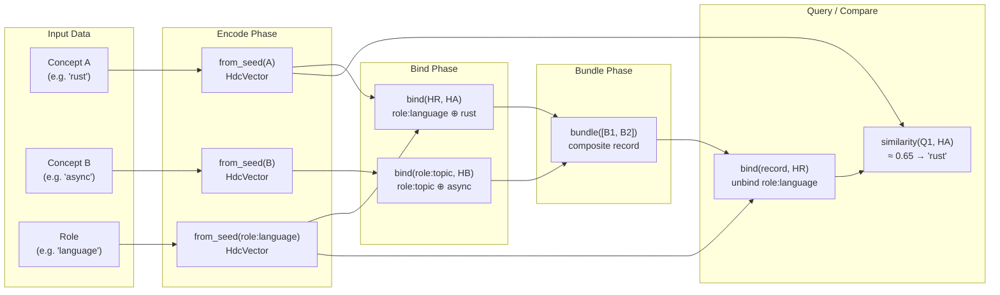

[← Back to HDC Overview](./README.md)

# Theory and Mathematical Foundations

This document covers the intellectual lineage, mathematical foundations, VSA variant comparison, all four algebraic operations, capacity analysis, and the rationale for the 10,240-bit dimensionality choice.

---

## 1. Neuroscience Motivation: Kanerva's Sparse Distributed Memory

The intellectual lineage of HDC begins with Pentti Kanerva's 1988 work on **Sparse Distributed Memory (SDM)** [Kanerva88], motivated by a key property of biological neural systems.

### The Problem SDM Was Solving

The human brain stores vast numbers of memories in a network of ~100 billion neurons, each firing or not — effectively a binary address space of unimaginable scale. Yet memories can be recalled from noisy, partial cues. If you remember a face but not a name, the brain finds the full memory anyway. This is **content-addressable memory**: retrieval by similarity to the query, not by exact address.

Classical computer memory (RAM) is address-addressed: you must know the exact address to retrieve a value. SDM was Kanerva's attempt to model a content-addressable memory system in mathematical terms.

### Kanerva's Key Insight

Kanerva observed that in a binary address space of D bits, the number of possible addresses is 2^D. For D = 1000, this is 10^300. Yet if you choose N random points in this space (N << 2^D), those points will be, with overwhelming probability, roughly equidistant from each other (all near the 50% similarity mark). This is the **concentration of measure phenomenon**.

The consequence: you can assign any two concepts to random addresses and they will almost certainly be well-separated, with no interference between them. SDM exploits this to build a memory system that:

1. Stores items distributed across many locations (robustness to noise)
2. Retrieves items by finding the stored item nearest to the query (content-addressable)
3. Handles noisy queries gracefully — a query with 20% of bits flipped still retrieves the correct item

### From SDM to HDC

HDC takes Kanerva's statistical foundation and adds an **algebraic layer**. Rather than just random storage and retrieval, HDC provides composable operations (bind, bundle, permute) that encode structured relationships into single vectors. The move from SDM to HDC is roughly analogous to the move from an unstructured database to a relational database.

The HDC "brain model" is also biologically motivated: the brain represents concepts as distributed patterns of neural activity — not stored in single neurons ("grandmother cells") but distributed across millions. HDC vectors are a mathematical model of this distributed representation.

---

## 2. What Is Hyperdimensional Computing?

Hyperdimensional Computing (HDC), also known as Vector Symbolic Architectures (VSA), was first explored by Pentti Kanerva in 1988 [Kanerva88], formalized as Binary Spatter Codes (BSC) in 1996 [Kanerva96], and given a systematic treatment in 2009 [Kanerva09]. The term "Vector Symbolic Architectures" was introduced by Ross Gayler in 2003 [Gayler03].

The core insight: **in sufficiently high-dimensional spaces (thousands of bits), random vectors are almost certainly near-orthogonal.** This has profound computational implications:

1. **Capacity**: A space of D-bit vectors can represent an exponential number of distinct concepts without interference.
2. **Composability**: Vectors can be combined with algebraic operations (XOR binding, majority-vote bundling, cyclic-shift permutation) that produce new vectors while preserving the ability to detect component parts.
3. **Robustness**: Similarity is distributed across many bits, so small perturbations do not destroy the overall structure.
4. **Efficiency**: All operations reduce to bitwise CPU instructions (XOR, popcount, shift). No floating-point arithmetic, GPU, or model inference is required for comparison. Captured-source benchmarks report ~13 ns per fixed-width similarity comparison; IronClaw should remeasure this on target hardware.

### The VSA Family

HDC belongs to the family of Vector Symbolic Architectures (VSA):

| VSA Variant | Binding Operation | Vector Type | Key Reference |
|---|---|---|---|
| **Binary Spatter Codes (BSC)** | XOR | Binary {0,1} | Kanerva, 1996 [Kanerva96] |
| Multiply-Add-Permute (MAP) | Element-wise multiplication | Bipolar {-1,+1} | Gayler, 2003 [Gayler03] |
| Holographic Reduced Representations (HRR) | Circular convolution | Real-valued | Plate, 1995 [Plate95] |
| Fourier HRR (FHRR) | Element-wise complex multiply | Complex unit phasors | Plate, 2003 [Plate03] |

BSC is the captured-source variant to adapt first because it offers the best combination of:
- **Simplicity**: binary vectors, XOR binding
- **Performance**: pure bitwise operations on CPU
- **Capacity**: sufficient at 10,240 bits for production knowledge systems

The trade-off is lower representational precision per dimension than real-valued variants like HRR, compensated by using more dimensions (10,240 bits vs. typical HRR at 512–2048 real dimensions).

---

## 3. Mathematical Foundations

### 3.1 The Concentration of Measure Phenomenon

For two independently generated random binary vectors of dimension D, the Hamming similarity follows a binomial distribution that, for large D, is well approximated by a normal distribution:

```
Expected value:     mu = 0.5
Variance:           sigma^2 = 1 / (4D)
Standard deviation: sigma = 1 / (2 * sqrt(D))
```

**Derivation**: Each bit position contributes a Bernoulli random variable: if both vectors have the same bit, the similarity contribution is 1/D; if different, 0. Each position matches with probability 0.5 (both bits are independent fair coin flips). The total similarity is the average of D independent Bernoulli(0.5) variables, so the variance of the mean is (0.5 × 0.5) / D = 1/(4D).

For D = 10,240:

```
sigma = 1 / (2 * sqrt(10240)) = 1 / (2 * 101.19) = 0.00494
```

This means any two random 10,240-bit vectors will have Hamming similarity within the extremely narrow band of 0.5 ± 0.015 (3 sigma) with 99.7% probability. Any similarity significantly above 0.5 is therefore a genuine structural signal, not noise.

**Worked example**: Generate two random 10,240-bit vectors A and B. They will share approximately 5,120 ± 50.6 bits (standard deviation of the count of matching bits is sqrt(D × 0.25) = 50.6). A similarity of 0.53 means 5,427 matching bits — 6.1 standard deviations above the mean, which happens by chance with probability less than 1 in a billion.

### 3.2 The Johnson-Lindenstrauss Connection

The Johnson-Lindenstrauss (JL) lemma [JL84] provides theoretical backing for dimensionality choices. It states that N points in high-dimensional space can be projected into D dimensions while preserving pairwise distances within a factor of (1 ± epsilon), provided D is at least O(log(N) / epsilon^2).

For random binary projections, a practical bound is:

```
D >= C * ln(N) / epsilon^2
```

where C is a constant (typically 4–24 in the literature).

**Important caveat**: The JL lemma applies to continuous random projections and does not directly govern BSC capacity. However, it provides useful intuition: 10,240 dimensions are far more than needed to faithfully embed millions of points at reasonable distortion tolerances.

### 3.3 Bundle Capacity: The Signal-to-Noise Ratio

When K vectors are bundled (superimposed via majority vote), the quality of similarity degrades as K increases, governed by the signal-to-noise ratio:

```
SNR = sqrt(D / K)
```

**Derivation**: After bundling K random vectors, each input vector contributes a signal of 1/K to each bit position, while the noise from the other K−1 vectors contributes a variance of (K−1)/(4K^2) per bit. Aggregating over D bits, the SNR scales as sqrt(D/K). See [Kleyko22] Section 4.2 for the rigorous derivation.

For D = 10,240:

| K (bundled items) | SNR | Retrieval quality |
|---|---|---|
| 10 | 32.0 | Excellent — each component reliably retrievable |
| 50 | 14.3 | Good — components detectable above noise floor |
| 100 | 10.1 | Marginal — useful as pre-filter, not for exact retrieval |
| 1,000 | 3.2 | Poor — only dominant components survive |

The practical limit for reliable component retrieval from a bundle is approximately K < 100 at D = 10,240. See [Thomas21], which establishes K = O(D / log(D)) as the theoretical maximum.

### 3.4 Intuitive Analogies

**Bind is like multiplication in a number system where x² = 1**: XOR is its own inverse (A XOR A = 0, A XOR 0 = A). Just as multiplying by -1 twice returns to +1, XOR-binding a role vector twice recovers the original.

**Bundle is like superimposing transparencies**: Each transparency (vector) adds its pattern. The final image is similar to all overlaid patterns. More transparencies means each individual pattern becomes harder to see, but the aggregate still preserves global structure.

**Permute is like shuffling a deck differently for each position**: Rotating bits by a different amount for each position index breaks XOR's commutativity, so "A then B" encodes differently from "B then A."

**Similarity is like asking "what fraction of your bits agree with mine?"**: 50% agreement = no relationship (random), 55% = some relationship, 70% = strong relationship, 100% = identical.

---

## 4. Why 10,240 Bits?

The choice of 10,240 bits (160 u64 words, 1,280 bytes per vector) is deliberate:

| Dimension D | Bundle capacity (SNR > 10) | Noise band (2-sigma) | Storage per vector | Use case |
|---|---|---|---|---|
| 1,024 | ~10 items | ±3.1% | 128 bytes | Toy / embedded |
| 4,096 | ~40 items | ±1.6% | 512 bytes | Small vocabularies |
| **10,240** | **~100 items** | **±1.0%** | **1,280 bytes** | **Production knowledge systems** |
| 65,536 | ~650 items | ±0.4% | 8,192 bytes | Very large vocabularies |

*"Noise band" is 2 standard deviations (95.4% CI) of the Hamming similarity between random vectors. "Bundle capacity" is the maximum K for bundle SNR > 10.*

The 10,240-bit choice balances three engineering concerns:

1. **Sufficient capacity**: A codebook of ~10,000 deterministic symbols remains cleanly separable. Bundles of up to ~100 items retain reliable component retrieval.

2. **Precision**: ±1.0% noise band (2-sigma) means a similarity threshold of 0.526 (just 2.6% above the 0.5 baseline) is statistically meaningful at p < 10^-7 per comparison, remaining significant even after Bonferroni correction against 100K comparisons.

3. **Performance**: 160 words × 8 bytes = 1,280 bytes per fingerprint. The vector is small enough for cache-friendly scans. XOR + popcount over 160 words is the fixed-cost inner loop. Treat the captured ~13 ns figure as a local benchmark target, not a design guarantee.

The number 10,240 = 160 × 64 is chosen for alignment: it maps cleanly to 160 machine words with no padding or waste.

---

## 5. The Four Operations

HDC provides four algebraic operations that together can encode arbitrarily complex structured data into fixed-size binary vectors.

### 5.1 Bind (XOR)

**Purpose**: Associates two concepts into a new vector that is quasi-orthogonal to both inputs. Encodes a typed relationship: "Rust in the language role."

**Mathematical definition**:
```
bind(A, B) = A XOR B    (componentwise exclusive-or)
```

**Algebraic properties**:

| Property | Formula | Significance |
|---|---|---|
| Self-inverse (involution) | bind(bind(A, B), B) = A | No separate "unbind" needed; XOR is its own inverse |
| Commutative | bind(A, B) = bind(B, A) | Role-filler binding is symmetric unless permute is used |
| Associative | bind(A, bind(B, C)) = bind(bind(A, B), C) | Multi-way binding can be done in any order |
| Distributes over bundle | bind(A, bundle(B, C)) ≈ bundle(bind(A, B), bind(A, C)) | Structured queries work |
| Orthogonality-preserving | sim(bind(A, B), A) ≈ 0.5 | The result is a genuinely new vector |

The self-inverse property enables structured queries. If you encode:
```
record = bundle(bind(role_language, hv_rust), bind(role_topic, hv_async))
```
You can query "what language?" by unbinding the role:
```
answer = bind(record, role_language)
```
The answer will be approximately `hv_rust`.

**Performance**: ~5 ns with scalar code, ~2 ns with AVX-512 auto-vectorization.

### 5.2 Bundle (Majority Vote)

**Purpose**: Superimposes multiple vectors into a single aggregate that is **similar to all inputs**. It is a "set union" in hypervector space.

**Mathematical definition**:
```
bundle(A, B, C)[i] = majority(A[i], B[i], C[i])
```

`majority(bits)` returns 1 if more than half the input bits are 1, and 0 otherwise. Ties (half 1s) break to 0 for determinism.

**Key properties**:

| Property | Details |
|---|---|
| Similarity preservation | sim(bundle(A, B), A) ≈ sim(bundle(A, B), B) > 0.5 |
| Capacity | SNR = sqrt(D/K) for K bundled items; K < 100 for reliable retrieval at D=10,240 |
| NOT associative | bundle(bundle(A, B), C) ≠ bundle(A, bundle(B, C)) |
| Requires accumulator | Incremental bundling requires integer vote counts, not binary operations |

**Performance**: O(D × K). For K = 10: ~800 ns. For K = 100: ~8 µs.

### 5.3 Permute (Cyclic Shift)

**Purpose**: Encodes position or sequence order by rotating bits, breaking the commutativity of bind. Enables "A then B" to differ from "B then A."

**Mathematical definition**:
```
permute(A, k) = cyclic_left_shift(A, k)
```

**Properties**:

| Property | Details |
|---|---|
| Group operation | permute(permute(A, j), k) = permute(A, j+k) |
| Invertible | permute(permute(A, k), D-k) = A |
| Quasi-orthogonality | permute(A, k) is quasi-orthogonal to A for k >= 1 |
| Similarity preservation | sim(permute(A, k), permute(B, k)) = sim(A, B) |

**Performance**: ~10 ns.

### 5.4 Similarity (Hamming Distance)

**Purpose**: Measures the structural relationship between two vectors on a [0, 1] scale. The fraction of matching bits.

**Mathematical definition**:
```
sim(A, B) = 1 - hamming_distance(A, B) / D
```

**Interpretation**:

| Similarity range | Meaning |
|---|---|
| 1.0 | Identical vectors |
| > 0.526 | Candidate relationship; target threshold for <1% random-pair FP rate against 100K comparisons after local validation |
| > 0.52 | Meaningful relationship (single-pair check, p < 3×10^-5) |
| 0.485–0.515 | Noise band (quasi-orthogonal, no relationship, 99.7% of random pairs) |
| < 0.48 | Meaningful dissimilarity (anti-correlated) |
| 0.0 | Bitwise complement |

**Performance**: 160 XOR + POPCNT operations per pair. Treat the captured ~13 ns x86 result as a local benchmark target.

### 5.5 The HDC Pipeline



---

Next: [Implementation — Source Code](./implementation.md)
