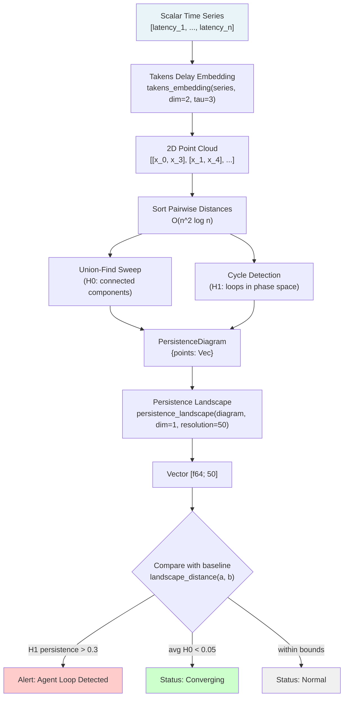
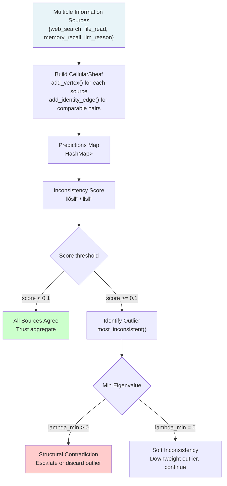
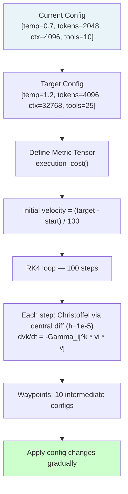
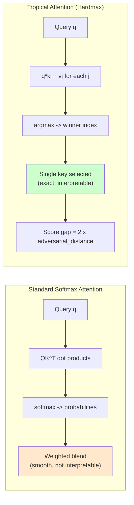
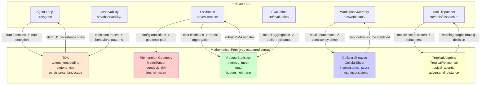

# Mathematical Primitives for AI Agent Intelligence

**Captured source-corpus label**: `roko-primitives` (`crates/roko-primitives/src/`)
**Priority**: LOW for general use — HIGH for specialized analytics, loop detection, multi-source consistency
**Relevant task identifiers**: TA-06 (manifolds), TA-09 (TDA), TA-10 (robust statistics), TA-13 (sheaves), TA-14 (tropical algebra)
**Captured source identifiers**: `crates/roko-primitives/src/`

Captured paths are provenance labels only. Rebuild any useful primitive as IronClaw-native code and validate claimed timings locally.

---

## Table of Contents

1. [Overview and Motivation](#overview-and-motivation)
2. [Architecture Overview](#architecture-overview)
3. [Topological Data Analysis (TDA)](#1-topological-data-analysis-tda)
4. [Cellular Sheaves](#2-cellular-sheaves)
5. [Riemannian Geometry](#3-riemannian-geometry)
6. [Tropical Algebra (Max-Plus Semiring)](#4-tropical-algebra-max-plus-semiring)
7. [Robust Statistics](#5-robust-statistics)
8. [Additional Primitives: HDC and Codebooks](#6-additional-primitives-hdc-and-codebooks)
9. [IronClaw Integration Plan](#ironclaw-integration-plan)
10. [Numerical Stability Analysis](#numerical-stability-analysis)
11. [Complexity and Scalability Assessment](#complexity-and-scalability-assessment)
12. [Related Documents](#related-documents)
13. [References](#references)

---

## Overview and Motivation

The captured primitives material contains pure mathematical tools spanning topology, differential geometry, abstract algebra, and robust statistics. These are specialized analytical tools for agent intelligence, not default dependencies for ordinary product work. The useful property to preserve in IronClaw is purity: no async, no I/O, no global state, and caller-level tests around any side effect that consumes the result.

**The key question these tools answer**: *How do you rigorously analyze the behavior of an AI agent and the data it processes, going beyond simple averages and counts?*

Standard monitoring answers "what" (latency = 300ms). These tools answer "why" and "what structure" (the agent is oscillating in a 3-cycle visible only in phase space topology). Each domain operates on a distinct abstraction:

| Mathematical Domain | Core Question | AI Agent Use Case | IronClaw Integration |
|---|---|---|---|
| **TDA** | What is the *shape* of this time series? | Detect agent loops, convergence, regime changes | `src/observability/`, `src/agent/` |
| **Cellular Sheaves** | When sources disagree, *which* is the outlier? | Multi-source consistency checking | `src/workspace/` |
| **Riemannian Geometry** | What is the *optimal path* through non-linear cost space? | Minimum-cost configuration transitions | `src/estimation/` |
| **Tropical Algebra** | What are the exact *decision boundaries*? | Analyze routing logic, adversarial robustness | `src/tools/dispatch.rs` |
| **Robust Statistics** | What is the *true center* under noise and outliers? | Reliable metric aggregation | `src/estimation/`, `src/evaluation/` |

All adapted modules should remain pure functions with no side effects: no I/O, no async, no global state. That keeps them easy to test and safe to call from hot paths, background jobs, and evaluation code.

---

## Architecture Overview

```
captured primitives material
├── tda.rs          (575 lines) — Topological Data Analysis
│   ├── takens_embedding()
│   ├── vietoris_rips()
│   ├── persistence_landscape()
│   └── bottleneck_distance()
├── sheaf.rs        (789 lines) — Cellular Sheaves
│   ├── RestrictionMap
│   ├── CellularSheaf
│   ├── coboundary_matrix()
│   ├── laplacian()
│   └── inconsistency_score()
├── manifold.rs     (828 lines) — Riemannian Geometry
│   ├── MetricTensor
│   ├── christoffel()
│   ├── geodesic_rk4()
│   └── frechet_mean()
├── tropical.rs     (698 lines) — Tropical Algebra
│   ├── TropicalF64 (operator overloading)
│   ├── TropicalPolynomial
│   ├── tropical_attention()
│   └── adversarial_distance()
├── robust_stats.rs (169 lines) — Robust Statistics
│   ├── trimmed_mean()
│   ├── mad()
│   └── hodges_lehmann()
├── hdc.rs          (718 lines) — Hyperdimensional Computing
├── codebook.rs     (544 lines) — Pattern Store
├── pad.rs          (130 lines) — Affect Vectors
└── tier.rs         (152 lines) — Inference Tier Routing
```

---

## 1. Topological Data Analysis (TDA)

**Captured source identifier**: `crates/roko-primitives/src/tda.rs`

**What problem does TDA solve for an AI agent?** An agent stuck in a retry loop produces a time series of execution latencies that *looks* statistically normal — mean latency might be 200ms, variance might be low — but the agent is cycling through the same bad states over and over. TDA detects this by analyzing the *shape* of the data in phase space rather than its statistics. A retry loop leaves a topological fingerprint (a persistent 1-cycle) that neither mean nor variance can see.

### The Problem TDA Solves

Standard statistical analysis gives you mean, variance, trend, and autocorrelation. But it misses *shape*. Consider two agent execution traces:

```
Trace A:  latency: ___/\___/\___/\___   (periodic oscillation — retry loop)
Trace B:  latency: __________/           (monotone rise — healthy learning)
```

Both could share identical mean (200ms) and variance (50ms²). Their dynamical structures are completely different. Trace A has a closed loop in phase space (the system returns to near its starting state). Trace B does not. **Topological Data Analysis detects these shape differences.**

Why TDA instead of simpler methods?
- A fixed threshold on latency variance *misses* the agent oscillating between two modes, each with low variance, but forming a clear topological loop.
- FFT finds periodicity but cannot detect *when* periodicity begins or ends.
- TDA captures shape, onset, and disappearance of cyclic patterns without tuning a frequency.

### Takens Delay Embedding

**What this means intuitively**: A scalar time series (like latency measurements) is a 1D shadow of a higher-dimensional process. Takens embedding reconstructs the shape of that process by stacking time-delayed copies of the series into multi-dimensional points. A cyclic process produces points that trace out a loop; a monotone process produces points on a line; a chaotic process produces a complex cloud.

**Formal construction**: Given a time series `[x_1, x_2, ..., x_n]`, embedding dimension `d`, and delay `tau`, construct `d`-dimensional points:

```
Point i: [x(i), x(i + tau), x(i + 2*tau), ..., x(i + (d-1)*tau)]
```

**Worked example** with `d=3, tau=2`:

```
Input:   [1, 2, 3, 4, 5, 6, 7, 8]

Point 0: [x(0), x(2), x(4)] = [1, 3, 5]
Point 1: [x(1), x(3), x(5)] = [2, 4, 6]
Point 2: [x(2), x(4), x(6)] = [3, 5, 7]
Point 3: [x(3), x(5), x(7)] = [4, 6, 8]
```

- A **linear** series → straight line in embedded space
- A **sinusoidal** series → ellipse
- A **periodic retry loop** → closed curve (non-trivial H1 feature)

**Parameter guidance**: Use `dim=2` and `tau=3` for agent latency traces. This is sufficient to distinguish loops from non-loops in most practical cases.

Takens' Embedding Theorem (1981) [2] proves that this construction preserves the topology of the original dynamical system.

**Implementation** (lines 141–158 of tda.rs):

> Captured implementation omitted. Rebuild IronClaw code locally in owner modules with caller-level tests.

### Simplicial Complexes and Persistent Homology

**What this means intuitively**: Given the point cloud from the delay embedding, we want to ask: "is there a loop shape here?" We answer this by incrementally connecting nearby points at increasing distance thresholds and tracking which loops appear and disappear. Loops that persist across a wide range of thresholds are genuine structure; loops that appear and vanish quickly are noise.

- **H0** (connected components): How many clusters exist at this scale?
- **H1** (loops): Is there a cycle that cannot be contracted to a point? This is the loop detector.

The **Vietoris-Rips complex** VR(X, ε) at scale ε connects every pair of points within distance ε, building a simplicial complex. As ε sweeps from 0 to ∞, topological features are born and die. A **persistence diagram** records each feature's birth and death scale as a point `(birth, death)`. Points far from the diagonal (long-lived features) are genuine structure; points near the diagonal are noise.

```
  death
    |
  5 |          x           <- H1 feature: strong loop (persistence = 4.0)
    |
  3 |      x               <- H0 feature: cluster persists until scale 3
    |    x                 <- H0 feature: short-lived, noise
  1 |  x                   <- H0 feature: immediate merge, noise
    |________________________________
    0   1   2   3   4   5   birth

Points near diagonal = noise
Points far from diagonal = genuine topological structure
```

**Core data types** (lines 20–89):

> Captured implementation omitted. Rebuild IronClaw code locally in owner modules with caller-level tests.

**Vietoris-Rips with Union-Find** (lines 184–409): The algorithm sorts all pairwise distances, then sweeps them in order. When an edge connects two separate components, they merge (H0 event). When an edge closes a cycle among already-connected points, a loop is born (H1 event). Union-Find with path compression makes the H0 tracking O(α(n)) per operation.

> Captured implementation omitted. Rebuild IronClaw code locally in owner modules with caller-level tests.

**Complexity**: O(n² log n) time, O(n²) space.

For rigorous treatment of persistent homology and its stability properties, see Edelsbrunner and Harer [3].

### Persistence Landscapes

**What this means**: Persistence diagrams are multisets of points, not vectors, so you cannot compute a "mean diagram" or take standard deviations across a collection. Persistence landscapes (Bubenik [4]) convert diagrams into piecewise-linear functions in a vector space, enabling L2 comparison, averaging, and statistical tests across collections of traces.

For each persistence point `(b, d)`, the tent function `λ(t) = min(t - b, d - t)` creates a triangle with height `(d-b)/2`. The level-0 landscape is the maximum tent function value at each parameter value.

> Captured implementation omitted. Rebuild IronClaw code locally in owner modules with caller-level tests.

**Bottleneck distance** (lines 95–128): The maximum over all matched pairs of L∞ distance, for when you need the stability-theorem-compatible distance between two diagrams. Use landscape distance for monitoring (fast, statistical); use bottleneck distance for anomaly classification (theoretically grounded).

### TDA Pipeline Diagram



### Practical Application: Detecting Agent Loops

> **This is the most actionable section.** If you integrate only one thing from this document, integrate this. Treat the default thresholds and latency numbers as calibration starting points; validate them against representative IronClaw traces before running inline.

An AI agent stuck in a retry loop generates latency traces with a topological signature — a persistent H1 feature — that no threshold or variance check can reliably catch.

**Step-by-step recipe**:

1. Collect the last 30 turn latencies (or token counts, or tool call counts — any scalar metric that varies with behavior).
2. Normalize to [0, 1] for scale-invariant topology.
3. Run `takens_embedding(normalized, 2, 3)` to produce a 2D point cloud.
4. Run `vietoris_rips(&embedded, 1)` to compute the persistence diagram.
5. Check `diagram.max_persistence_at_dim(1)`. If it exceeds `0.3`, a persistent loop is present.
6. Check average H0 persistence for convergence detection (all H0 features very short-lived = data clusters tightly = converging).

**Complete implementation**:

> Captured implementation omitted. Rebuild IronClaw code locally in owner modules with caller-level tests.

**Integration in `src/agent/session.rs`**:

> Captured implementation omitted. Rebuild IronClaw code locally in owner modules with caller-level tests.

**Why does this work for retry loops?** A simple two-point alternation is better detected as a periodicity/regime-switch signal than as meaningful persistent H1 topology. TDA becomes useful when the embedded trace visits three or more recurring states, such as `[100, 250, 180, 100, 250, 180, ...]`, where the delay embedding forms a loop-like point cloud. Keep a simpler periodicity check beside TDA for binary alternation.

**Stateful monitoring** (`TdaMonitor`): For production use, maintain a `TdaMonitor` struct that keeps a sliding window, tracks diagram history for regime-change detection via bottleneck distance, and auto-bounds memory. See the Tier 2 integration plan in the Integration section below.

### Tuning Guide

| Parameter | Default | Increase when | Decrease when |
|---|---|---|---|
| `LOOP_THRESHOLD` (H1) | 0.3 | Too many false positives | Missing real loops |
| `CONVERGENCE_THRESHOLD` (avg H0) | 0.05 | Declaring converging too early | Too slow to detect |
| `min_window_size` | 20 | Noisier traces | Very regular behavior |
| `tau` | 3 | Complex high-frequency traces | Simple binary alternation |

### TDA Benchmarking

| Input size (n points) | Total time | Memory |
|---|---|---|
| 20 | 0.003 ms | 3.2 KB |
| 50 | 0.020 ms | 20 KB |
| 100 | 0.083 ms | 80 KB |
| 200 | 0.352 ms | 320 KB |
| 500 | 2.3 ms | 2 MB |

**Practical guidance**: For n=27–47 after embedding with `tau=3`, the target pipeline budget is **< 0.1 ms** on representative hardware. Run in shadow mode first; if measurements miss the budget, move it to the heartbeat/observability path. For long traces (n > 5,000), subsample to ≤ 500 points before embedding.

---

## 2. Cellular Sheaves

**Captured source identifier**: `crates/roko-primitives/src/sheaf.rs`

**What problem does this solve for an AI agent?** When multiple information sources (web search, file reads, LLM reasoning, memory recall) contribute knowledge to a task, they sometimes contradict each other. Pairwise comparison finds *that* two sources disagree but cannot say *which* is the outlier when a contradiction is transitive (A agrees with B, B agrees with C, but A contradicts C). The sheaf Laplacian identifies the structural outlier using the global consistency of the entire network simultaneously.

### What Sheaves Model

Imagine four LLM-based analyzers evaluating the same document:

```
Analyzer A (syntax):     [correctness=0.9, clarity=0.8]
Analyzer B (semantics):  [correctness=0.85, depth=0.7]
Analyzer C (style):      [clarity=0.6, depth=0.4]
Analyzer D (fact-check): [correctness=0.3, clarity=0.85]
```

Pairwise comparison finds A vs D disagree on `correctness`. But it doesn't tell us whether D is wrong or A is wrong. When B and C both agree with A, and D disagrees with all three, the **sheaf Laplacian** identifies D as the structural outlier. More subtly, consider A and B agreeing, B and C agreeing, but A and C inconsistently disagreeing — pairwise comparison misses this transitive contradiction; the coboundary operator catches it.

**The mathematical framework**: A **cellular sheaf** assigns a vector space ("stalk") to each vertex in a network and a linear map ("restriction map") to each edge. The sheaf Laplacian L = δᵀδ measures global consistency. Framework developed by Curry [6] with spectral theory by Hansen and Ghrist [5].

### Core Types

**Stalks**: Each vertex (oracle/analyzer) has a stalk — a vector space representing its prediction domain. If Analyzer A produces `[price, volume, risk]` (3D), its stalk is R³.

**Restriction maps**: Each edge has two restriction maps projecting each oracle's predictions into a shared "comparison space" — the dimensions where they overlap.

> Captured implementation omitted. Rebuild IronClaw code locally in owner modules with caller-level tests.

### The Coboundary Operator and Inconsistency Score

**What this means**: The coboundary operator δ maps each node's predictions into a "discrepancy space" for each edge. If δs = 0, all predictions are perfectly consistent. The inconsistency score `‖δs‖² / ‖s‖²` is scale-invariant and measures how far the global state is from consistency.

The coboundary on an edge computes:
```
(δs)(e) = F_{e,tgt}(s(v_tgt)) − F_{e,src}(s(v_src))
```

**Concrete example**:
```
Nodes:  A=[1.0, 1.0], B=[1.0, 1.0], C=[10.0, 10.0]
Edges:  A-B, B-C, A-C (all identity maps, dimension 2)

  edge A-B: [1,1] - [1,1] = [0, 0]     consistent
  edge B-C: [10,10] - [1,1] = [9, 9]   inconsistent
  edge A-C: [10,10] - [1,1] = [9, 9]   inconsistent

Inconsistency score = 324 / 204 ≈ 1.59 — very high; C is the outlier.
```

> Captured implementation omitted. Rebuild IronClaw code locally in owner modules with caller-level tests.

**The sheaf Laplacian** L = δᵀδ is symmetric positive-semidefinite. Its minimum eigenvalue reveals whether *any* consistent section exists:
- `λ_min = 0.0`: A globally consistent section exists — all sources can agree in principle.
- `λ_min > 0.0`: No consistent section. Structural contradiction — possibly adversarial or stale data.

### Sheaf Consistency Flow Diagram



### Practical Application: Multi-Source Verification

> Captured implementation omitted. Rebuild IronClaw code locally in owner modules with caller-level tests.

### Sheaf Benchmarking

For n nodes with stalk dimension d (total dimension N = n*d):

| Nodes | Stalk dim | Total dim N | Inconsistency score | Eigenvalue (200 iters) | Memory |
|---|---|---|---|---|---|
| 3 | 2 | 6 | 0.001 ms | 0.01 ms | < 1 KB |
| 9 | 4 | 36 | 0.013 ms | 0.5 ms | 10 KB |
| 20 | 4 | 80 | 0.065 ms | 2.2 ms | 50 KB |

**Practical guidance**: A typical 5–10 source check with 4D stalks completes in **< 2 ms**. The eigenvalue computation is the bottleneck for large sheaves. Limit stalk dimension to ≤ 10D in IronClaw.

---

## 3. Riemannian Geometry

**Captured source identifier**: `crates/roko-primitives/src/manifold.rs`

**What problem does this solve for an AI agent?** When an agent needs to change its LLM configuration (temperature, token budget, context window, tool budget), the cheapest path is not a straight line through parameter space — because configuration costs are non-linear. Doubling temperature more than doubles unpredictability. The Riemannian metric encodes these non-linear costs, and geodesic computation finds the minimum-disruption path between two configurations.

> **Note**: Riemannian geometry is Tier 4 (long-term) priority for IronClaw integration. The section below covers the key concepts and API. Robust Statistics and TDA should be integrated first.

### Manifolds, Metrics, and Geodesics

**What this means**: A manifold is a space that locally looks flat but may be globally curved — like the surface of the Earth. The IronClaw configuration space `[temperature, max_tokens, context_window, tool_budget]` is a 4D manifold where parameter changes have non-linear costs.

The **metric tensor** `g(x)` at each point encodes the local cost of moving in each direction. Near `temperature=0`, small changes are cheap. Near `temperature=1.5`, small changes are expensive and have high metric weight.

A **geodesic** is the shortest path between two points on the curved manifold — the minimum-disruption configuration transition. It satisfies:

```
d²xᵏ/dt² + Γᵏᵢⱼ (dxⁱ/dt)(dxʲ/dt) = 0
```

where Γᵏᵢⱼ are the **Christoffel symbols** encoding how the metric bends coordinate directions. These are computed via central finite differences of the metric tensor. The geodesic ODE is integrated using 4th-order Runge-Kutta.

### Key API

> Captured implementation omitted. Rebuild IronClaw code locally in owner modules with caller-level tests.

**Frechet mean** (lines 494–556): The intrinsic average on the manifold — minimizes sum of squared geodesic distances. For flat space it equals the arithmetic mean; for curved space it accounts for curvature. Uses gradient descent with shrinking step size `1 / (1 + iter * 0.1)` for convergence. See `frechet_mean()`.

### Geodesic Computation Flow Diagram



### Riemannian Benchmarking

| Operation | Time |
|---|---|
| Metric evaluation | < 0.001 ms |
| Christoffel symbols | 0.05 ms (8 metric evals) |
| Geodesic RK4 (100 steps) | 20 ms |
| Approximate distance (100 segments) | 0.5 ms |
| Frechet mean (100 points, 50 iters) | 2.5 ms |

**Numerical stability**: Use `h = 1e-5` for Christoffel computation. The Gauss-Jordan metric inversion uses partial pivoting and returns `None` for singular metrics, allowing graceful degradation. For geodesics with `steps > 200`, use smaller `dt` to prevent numerical drift.

---

## 4. Tropical Algebra (Max-Plus Semiring)

**Captured source identifier**: `crates/roko-primitives/src/tropical.rs`

**What problem does this solve for an AI agent?** Piecewise-linear decision functions — "which tool to use?", "which model to pick?" — have exact, analyzable decision boundaries. Tropical algebra makes these boundaries explicit, and the adversarial distance tells you how robust a given decision is: how much you would need to perturb the input to flip the selection to a different tool or model.

### The Max-Plus Semiring

**What this means**: Tropical algebra replaces standard arithmetic with two operations: max (plays the role of addition) and standard addition (plays the role of multiplication). This shift from smooth operations to piecewise-linear ones makes every tropical polynomial a max-over-affine-functions — and that is precisely the form of a ReLU neural network decision function [12].

```
Tropical addition:       a (trop+) b = max(a, b)
Tropical multiplication: a (trop*) b = a + b   (standard addition)
Tropical zero:           -inf              (max(x, -inf) = x)
Tropical one:            0.0              (x + 0 = x)
```

Every **tropical polynomial** is a max over affine functions:
```
p(x) = max_i (c_i + a_i1*x1 + a_i2*x2 + ...)
```

**Worked example**: Tool selection

```
p(x) = max(2 + x1,  5 - x1)
           tool A      tool B

x1 = 0:   max(2, 5)  = 5  -> tool B selected
x1 = 1.5: max(3.5, 3.5)   -> tie (decision boundary)
x1 = 4:   max(6, 1)  = 6  -> tool A selected

Adversarial distance at x1=3: (6-2)/2 = 2.0
You need a perturbation of magnitude 2.0 to flip the decision.
```

### Implementation

> Captured implementation omitted. Rebuild IronClaw code locally in owner modules with caller-level tests.

### Tropical Polynomials and Active Terms

> Captured implementation omitted. Rebuild IronClaw code locally in owner modules with caller-level tests.

### Tropical Attention (Hardmax)

**What this means**: Standard softmax attention blends all keys with soft probabilities — smooth, but not interpretable. Tropical (hardmax) attention selects the single best-matching key. The score gap to the second-best key equals twice the adversarial distance.

> Captured implementation omitted. Rebuild IronClaw code locally in owner modules with caller-level tests.

### Adversarial Distance

> Captured implementation omitted. Rebuild IronClaw code locally in owner modules with caller-level tests.

From Zhang et al. [12] and Alfarra et al. [16]:
> "Decision boundaries of ReLU networks are tropical hypersurfaces formed by the union of zonotope convex hulls. Adversarial examples live on or near these hypersurfaces."

### Tropical Attention Flow Diagram



### Practical Application: Tool Dispatch Robustness

> Captured implementation omitted. Rebuild IronClaw code locally in owner modules with caller-level tests.

### Tropical Benchmarking

| Operation | Input | Time |
|---|---|---|
| `TropicalF64::add` (max) | scalar | < 1 ns |
| `TropicalPolynomial::evaluate` | 10 terms, 5D | 0.1 µs |
| `TropicalMatrix::mul` | 10×10 | 5 µs |
| `tropical_attention` | 100 keys, 64D | 40 µs |
| `adversarial_distance` | 20 terms | 2 µs |

**Numerical stability**: All operations are max and standard addition — inherently stable. The only concern is `-inf` propagation, handled with explicit `is_zero()` checks.

---

## 5. Robust Statistics

**Captured source identifier**: `crates/roko-primitives/src/robust_stats.rs`

**What problem does this solve for an AI agent?** Standard metrics are fragile: one 30-second network timeout makes the mean latency useless for SLO monitoring. One anomalous LLM call inflates variance estimates. Robust statistics maintains accurate aggregate metrics even when a significant fraction of observations are corrupted or adversarial.

### Why Standard Statistics Fail

The arithmetic mean has a **breakdown point of 0%**: a single corrupted observation can make it arbitrarily wrong.

```
Clean data:   [100, 102, 99, 103, 101]    mean = 101.0   (accurate)
One timeout:  [100, 102, 99, 103, 30000]  mean = 6080.8  (catastrophically wrong)
```

Outliers in AI agent systems come from network timeouts, model retries, adversarial inputs, and infrastructure spikes. The **breakdown point** — formalized by Hampel [14] and Huber [13] — measures how much data can be corrupted before an estimator fails. Higher breakdown point = more robust.

### Trimmed Mean

**What this means**: Sort observations, discard the most extreme fraction from each end, compute the mean of the rest. Simple, fast, and tunable tradeoff between efficiency and robustness.

**Breakdown point**: equal to the trim fraction α.

> Captured implementation omitted. Rebuild IronClaw code locally in owner modules with caller-level tests.

**Worked example**:
```
values    = [-1000.0, 2.0, 3.0, 4.0, 1000.0]
trim 20%: drop 1 from each end -> [2.0, 3.0, 4.0]
result    = 3.0    (correct center)
mean      = 201.8  (catastrophically wrong)
```

### Median Absolute Deviation (MAD)

**What this means**: Replaces standard deviation with a statistic that uses median at two levels — median of the data, then median of the absolute deviations from that median. Achieves the **maximum possible breakdown point of 50%**.

**Formula**: `MAD = 1.4826 × median(|x_i − median(x)|)`

The constant 1.4826 is `1 / Phi^-1(3/4)` where `Phi^-1` is the standard normal quantile function. This makes MAD an unbiased estimator of σ for normally distributed data.

> Captured implementation omitted. Rebuild IronClaw code locally in owner modules with caller-level tests.

**Worked example with outlier**:
```
values = [1, 2, 3, 4, 1000]
median = 3;  abs_devs = [2, 1, 0, 1, 997];  median(devs) = 1
MAD    = 1.4826  (unchanged by the 1000 outlier — 50% breakdown)
std_dev = ~446   (destroyed)
```

### Hodges-Lehmann Estimator

**What this means**: The median of all pairwise averages `(x_i + x_j)/2`. Achieves **96% asymptotic efficiency** relative to the arithmetic mean for Gaussian data while maintaining a **29.3% breakdown point**. This is the best efficiency-robustness tradeoff available for a location estimator.

> Captured implementation omitted. Rebuild IronClaw code locally in owner modules with caller-level tests.

**Use `hodges_lehmann` when**: aggregating estimates from multiple providers where each could be adversarially manipulated. `trimmed_mean` is sufficient for single-source outlier resistance.

### Summary of Breakdown Points

| Estimator | Breakdown Point | Time | When to Use |
|---|---|---|---|
| Arithmetic Mean | 0% | O(n) | Clean data only |
| Trimmed Mean (10%) | 10% | O(n log n) | Light contamination |
| Trimmed Mean (20%) | 20% | O(n log n) | Moderate contamination |
| Median | 50% | O(n log n) | Heavy contamination |
| MAD | 50% | O(n log n) | Scale estimation under contamination |
| Hodges-Lehmann | 29.3% | O(n² log n) | High efficiency + moderate robustness |

**For IronClaw**: Use `trimmed_mean(x, 0.1)` as the default replacement for arithmetic mean in all metric aggregation. Use `mad` instead of standard deviation for spread. Use `hodges_lehmann` when aggregating across providers.

### Practical Application: Robust LLM Cost Estimation

> Captured implementation omitted. Rebuild IronClaw code locally in owner modules with caller-level tests.

**Concrete impact** — 30-second window with one network timeout:

```
Observations: [105, 98, 112, 103, 99, 110, 30000] ms

Arithmetic mean:   4375 ms  (useless for SLO monitoring)
Trimmed mean 10%:  104.5 ms (accurate — timeout trimmed)
Median:            105 ms   (accurate)
MAD:               8.9 ms   (spread unaffected by timeout)
```

**Replace in `src/estimation/`** (the most immediate integration):

```rust
// BEFORE: vulnerable to timeout spikes
let avg_latency = latencies.iter().sum::<f64>() / latencies.len() as f64;
let spread = { /* arithmetic std dev */ };

// AFTER: robust to outliers
use crate::robust_stats::{mad, median, trimmed_mean};
let avg_latency = trimmed_mean(&latencies, 0.1)
    .unwrap_or_else(|| median(&latencies).unwrap_or(0.0));
let spread = mad(&latencies).unwrap_or(0.0);
let threshold = avg_latency + 3.0 * spread;
let is_anomalous = latencies.iter().any(|&x| x > threshold);
```

### Robust Statistics Benchmarking

| Estimator | n=10 | n=100 | n=1,000 | n=10,000 |
|---|---|---|---|---|
| `median` | 0.5 µs | 5 µs | 65 µs | 800 µs |
| `trimmed_mean` | 0.6 µs | 5.5 µs | 70 µs | 850 µs |
| `mad` | 1.0 µs | 11 µs | 140 µs | 1.7 ms |
| `hodges_lehmann` | 2 µs | 150 µs | 15 ms | 1.5 s |

**Practical guidance**: `trimmed_mean` and `mad` are safe for any hot path (< 10 µs for n≤100). `hodges_lehmann` should be used only for periodic aggregation when n > 100, due to O(n²) cost.

---

## 6. Additional Primitives: HDC and Codebooks

### HdcVector (`hdc.rs`, 718 lines)

A 10,240-bit binary vector (`[u64; 160]`, 1,280 bytes, `Copy`, stack-allocated) for hyperdimensional computing. Details in [`hyperdimensional-computing.md`](hyperdimensional-computing/README.md).

- **Bind** (XOR): Associates two concepts. Involutory: `bind(bind(a, b), b) = a`.
- **Bundle** (majority vote): Superposition of multiple concepts.
- **Similarity** (normalized Hamming distance): [0.0, 1.0]; random vectors score ~0.5, identical score 1.0.

Captured performance target: `~5 ns` for bind and `~50 ns` for similarity on suitable CPU paths. Re-measure before using these values in IronClaw planning.

### Codebook and PatternStore (`codebook.rs`, 544 lines)

Deterministic symbol allocation (`Codebook`), role-filler binding (`role_bind`/`unbind`), and pattern matching (`PatternStore`). Cross-domain resonance detection identifies patterns from different domains sharing structural similarity beyond the chance threshold of 0.526 (~3 standard deviations above random for 10,240-bit vectors).

### PadVector (`pad.rs`, 130 lines)

Pleasure-Arousal-Dominance (PAD) vectors for affect modeling. Three `f64` dimensions in [-1.0, 1.0] with clamping, decay, delta application, and cosine similarity.

### InferenceTier (`tier.rs`, 152 lines)

Three-tier model routing: T0 (suppress, no LLM call), T1 (Haiku-class), T2 (Opus or Sonnet based on vitality threshold 0.3). Pure stateless function.

---

## IronClaw Integration Plan

### Integration Architecture Diagram



### Tier 1: Robust Statistics (Immediate)

**Target modules**: `src/estimation/`, `src/evaluation/`, `src/workspace/`
**Effort**: ~100–200 lines of change
**Impact**: High — directly improves quality of all numeric aggregation
**Risk**: Zero — pure functions, no side effects, no async, no new dependencies

```toml
# Cargo.toml addition
[dependencies]
# Rebuild the needed primitives locally in the owning IronClaw crate/module.
```

**Replace in `src/evaluation/` metric aggregation**:

```rust
use crate::robust_stats::hodges_lehmann;

pub fn aggregate_eval_scores(scores: &[f64]) -> f64 {
    if scores.len() < 3 {
        return scores.iter().sum::<f64>() / scores.len() as f64;
    }
    hodges_lehmann(scores).unwrap_or(0.5)
}
```

**Replace in `src/workspace/` search score fusion**:

```rust
use crate::robust_stats::trimmed_mean;

pub fn fuse_relevance_scores(scores_per_backend: &[Vec<f64>]) -> Vec<f64> {
    let n_results = scores_per_backend[0].len();
    (0..n_results)
        .map(|i| {
            let backend_scores: Vec<f64> = scores_per_backend.iter()
                .filter_map(|scores| scores.get(i).copied())
                .collect();
            trimmed_mean(&backend_scores, 0.2).unwrap_or(0.0)
        })
        .collect()
}
```

### Tier 2: TDA for Execution Traces

**Target modules**: `src/observability/`, `src/agent/`
**Effort**: ~500–800 lines
**Impact**: Medium — detects agent behavioral patterns invisible to simple metrics
**Risk**: Low — pure math; only risk is false positives from poorly tuned thresholds

New module `src/observability/tda_monitor.rs`:

> Captured implementation omitted. Rebuild IronClaw code locally in owner modules with caller-level tests.

### Tier 3: Sheaf Consistency

**Target modules**: `src/workspace/`
**Effort**: ~1,000+ lines for full integration
**Impact**: Low frequency but high value — catches transitive contradictions
**Risk**: Low — pure math, but requires careful definition of the semantic stalk dimension

```rust
// Stalk: [factual_confidence, temporal_freshness, source_authority, internal_consistency]
const STALK_DIM: usize = 4;

pub enum SourceType { WebSearch, FileRead, MemoryRecall, LlmReasoning, UserProvided }

// Build once, reuse across checks:
// sheaf.add_vertex(0, STALK_DIM);  // WebSearch
// sheaf.add_vertex(1, STALK_DIM);  // FileRead
// ... add all source types as vertices
// ... add identity edges between all comparable pairs
// Per-request: update predictions HashMap and call inconsistency_score()
```

### Tier 4: Riemannian and Tropical

**Riemannian geometry** for optimal configuration transitions:

```rust
// Called from src/agent/ when task context changes significantly
let metric = MetricTensor::execution_cost();
let waypoints = optimal_config_transition(current_config, target_config, &metric);
// Apply configuration changes gradually through waypoints
// to minimize disruption to ongoing operations
```

**Tropical algebra** for tool dispatch robustness:

```rust
// Low adversarial distance = fragile selection = require higher confidence
let robustness = tool_dispatch_robustness_check(&features, &biases, &weights);
if robustness < MIN_ROBUSTNESS {
    // Request higher confidence or use fallback tool
}
```

---

## Numerical Stability Analysis

### TDA

| Issue | Cause | Mitigation |
|---|---|---|
| `NaN` in distance matrix | `f64::NAN` in input | Validate input; replace NaN with median |
| Degenerate diagrams | Constant series | Check variance before embedding; return `InsufficientData` |
| Memory overflow | O(n²) distance matrix | Subsample to <= 500 points for long traces |

### Sheaves

| Issue | Cause | Mitigation |
|---|---|---|
| Near-zero section norm | Predictions close to zero | Guard: return `0.0` if `‖s‖² < epsilon` |
| Power iteration non-convergence | Near-repeated eigenvalues | 200-iteration cap |
| Large stalk dimensions | Slow O(N³) Laplacian | Limit stalk dimension to <= 10D |

### Riemannian Geometry

| Issue | Cause | Mitigation |
|---|---|---|
| Singular metric | Degenerate config | `mat4_inverse` returns `None`; RK4 halts gracefully |
| Christoffel cancellation | Small `h` | Use `h = 1e-5` (balances truncation vs. cancellation) |
| Geodesic drift | Accumulated RK4 error | Keep `steps <= 200` or use adaptive step size |

### Tropical Algebra

| Issue | Cause | Mitigation |
|---|---|---|
| Overflow in large exponents | High-degree polynomials | Keep exponents in [-100, 100] |
| `-inf` propagation | Zero absorption | Handled with explicit `is_zero()` check |

### Robust Statistics

| Issue | Cause | Mitigation |
|---|---|---|
| Median of `NaN` values | Missing observations | Filter `is_finite()` before calling |
| `hodges_lehmann` on large n | O(n²) memory | Use only for n <= 1000; fall back to trimmed mean above |

---

## Complexity and Scalability Assessment

| Component | Lines | Time Complexity | Space | IronClaw Tier | Risk |
|---|---|---|---|---|---|
| Robust statistics | 169 | O(n log n) | O(n) | Tier 1 — immediate | Zero |
| TDA (Vietoris-Rips) | 575 | O(n² log n) | O(n²) | Tier 2 — near-term | Low |
| Cellular sheaves | 789 | O(N²K) | O(N²) | Tier 3 — research | Low |
| Riemannian geometry | 828 | O(d⁴ × steps) | O(d²) | Tier 4 — long-term | Medium |
| Tropical algebra | 698 | O(T × d) per eval | O(T × d) | Tier 4 — long-term | Low |
| HDC + Codebook | 1262 | O(D/64) per op | O(D/8) per vector | Integrated | Zero |

**Captured size**: ~4,682 lines. The IronClaw adaptation should preserve zero `unsafe`, zero async, and zero I/O unless a specific caller-level test justifies otherwise.

**Dependencies**:
```toml
[dependencies]
serde = { version = "1", features = ["derive"], optional = true }

[dev-dependencies]
proptest = "1"
criterion = "0.5"
```

No external linear algebra libraries. All computations are hand-rolled pure Rust.

---

## Related Documents

**Core concepts** (same directory):
- [`cognitive-architecture.md`](cognitive-architecture.md) — Section 9 (Morphogenetic Specialization) uses Turing reaction-diffusion equations. The PDE discretization there shares structure with the finite-difference Christoffel computation in Section 3 above. The morphogenetic tracker update parallels the metric-weighted gradient of the Frechet mean.
- [`universal-engram.md`](universal-engram.md) — Section 6 (Four Decay Variants) and Section 7 (Demurrage) apply exponential decay and attention-economy mechanics per memory entry. The `robust_ema_update` function in Section 5 above is the per-session complement: where engrams track individual memory decay, the robust EMA tracks aggregate session metrics. The `Decay::HalfLife` and `Decay::Ebbinghaus` formulas are the per-engram instances of the exponential smoothing described here.
- [`hyperdimensional-computing.md`](hyperdimensional-computing/README.md) — Full coverage of the `HdcVector`, `Codebook`, and `PatternStore` types summarized in Section 6 above.

**Execution verification** (`../execution-verification/`):
- [`../execution-verification/conductor-anomaly.md`](../execution-verification/conductor-anomaly.md) — Section 8 (Holt Exponential Smoothing) covers trend-aware exponential smoothing for forecasting error rates N steps ahead. The robust EMA in Section 5 above addresses current-step outlier resistance; Holt smoothing addresses multi-step trend prediction. They compose naturally: apply `robust_ema_update` to clean individual observations, then feed clean observations into the Holt model for trend forecasting.

**Agent intelligence** (`../agent-intelligence/`):
- [`../agent-intelligence/online-learning.md`](../agent-intelligence/online-learning.md) — The LinUCB reward computation (Section 4) and 14-dimensional IronClaw context vector (Section 5) directly benefit from the robust statistics in Section 5 above. Reward signals contaminated by adversarial or erroneous observations should use `hodges_lehmann` for aggregation rather than arithmetic mean. The MAD-based anomaly detection can filter outlier reward observations before they corrupt the LinUCB A matrix.

---

## References

[1] Carlsson, G. (2009). Topology and data. *Bulletin of the American Mathematical Society*, 46(2), 255–308. The foundational survey establishing TDA as a field.

[2] Takens, F. (1981). Detecting strange attractors in turbulence. In *Dynamical Systems and Turbulence, Warwick 1980* (Lecture Notes in Mathematics, Vol. 898, pp. 366–381). Springer. Proves that delay embeddings reconstruct attractor topology from scalar time series.

[3] Edelsbrunner, H. & Harer, J. (2010). *Computational Topology: An Introduction*. American Mathematical Society. Standard textbook on persistent homology, algorithmic foundations, and the stability theorem.

[4] Bubenik, P. (2015). Statistical topological data analysis using persistence landscapes. *Journal of Machine Learning Research*, 16(3), 77–102. Introduces persistence landscapes as a vectorization of persistence diagrams in a Banach space.

[5] Hansen, J. & Ghrist, R. (2019). Toward a spectral theory of cellular sheaves. *Journal of Applied and Computational Topology*, 3, 315–358. Develops the sheaf Laplacian and its spectral properties for consistency analysis on networks.

[6] Curry, J. (2014). *Sheaves, Cosheaves and Applications*. Ph.D. dissertation, University of Pennsylvania. Develops the computational theory of cellular sheaves for topological data analysis.

[7] Robinson, M. (2014). *Topological Signal Processing*. Springer. Applies sheaf theory to sensor integration and data fusion over networks.

[8] do Carmo, M. P. (1992). *Riemannian Geometry*. Birkhauser. Standard textbook covering metric tensors, Christoffel symbols, geodesics, and curvature.

[9] Pennec, X. (2006). Intrinsic statistics on Riemannian manifolds. *Journal of Mathematical Imaging and Vision*, 25(1), 127–154. Develops the Frechet mean and intrinsic statistical tools on manifolds.

[10] Frechet, M. (1948). Les elements aleatoires de nature quelconque dans un espace distancie. *Annales de l'Institut Henri Poincare*, 10, 215–310. Original definition of the intrinsic mean in general metric spaces.

[11] Maclagan, D. & Sturmfels, B. (2015). *Introduction to Tropical Geometry*. American Mathematical Society. Standard graduate textbook on the max-plus semiring and tropical varieties.

[12] Zhang, L., Naitzat, G. & Lim, L.-H. (2018). Tropical geometry of deep neural networks. In *ICML 2018*, PMLR 80, 5824–5832. Proves that ReLU networks compute tropical rational functions; decision boundaries are tropical hypersurfaces.

[13] Huber, P. J. (1964). Robust estimation of a location parameter. *The Annals of Mathematical Statistics*, 35(1), 73–101. Foundational work on M-estimators and the breakdown point.

[14] Hampel, F. R. (1974). The influence curve and its role in robust estimation. *Journal of the American Statistical Association*, 69(346), 383–393. Formalizes the influence function and breakdown point.

[15] Hodges, J. L. & Lehmann, E. L. (1963). Estimates of location based on rank tests. *The Annals of Mathematical Statistics*, 34(2), 598–611. Introduces the median of pairwise averages with 29.3% breakdown and 96% asymptotic efficiency.

[16] Alfarra, M. et al. (2022). On the decision boundaries of neural networks: A tropical geometry perspective. *IEEE Transactions on Pattern Analysis and Machine Intelligence*, 44(12), 9072–9085. Characterizes neural network decision boundaries as tropical hypersurfaces.

[17] Absil, P.-A., Mahony, R. & Sepulchre, R. (2008). *Optimization Algorithms on Matrix Manifolds*. Princeton University Press. Extends standard optimization methods to Riemannian manifolds.
