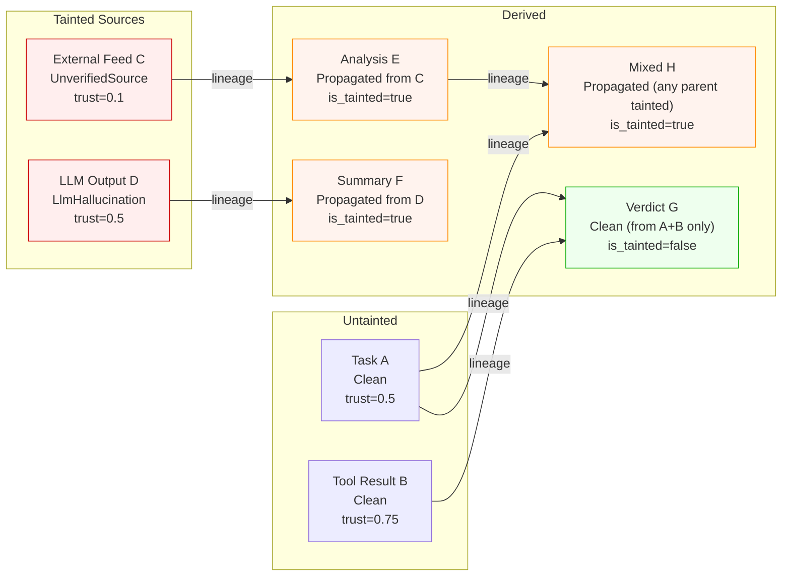
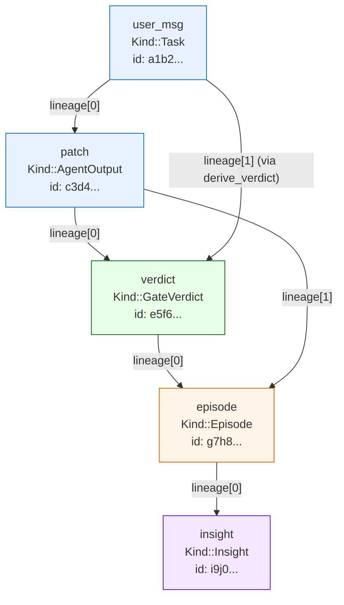
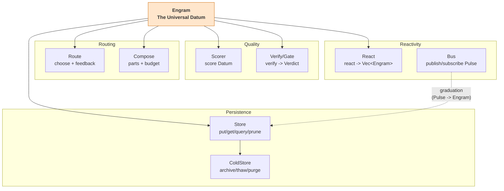
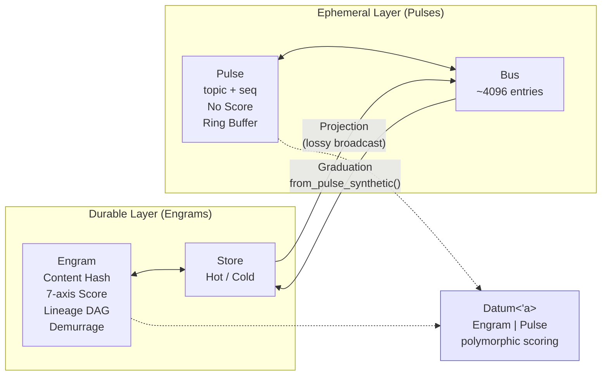

# Universal Engram: Rich Memory Primitives for Cognitive AI Systems

**Captured source set**: `roko-core` (`crates/roko-core/`)
**Priority**: HIGH -- richer memory entries with multi-axis scoring and decay
**GitHub source files**:
- `crates/roko-core/src/engram.rs` -- Engram struct, builder, HDC helpers, derive methods
- `crates/roko-core/src/score.rs` -- Score struct with 7 axes, `effective()` formula, arithmetic
- `crates/roko-core/src/decay.rs` -- Decay enum (None, HalfLife, Ttl, Ebbinghaus), `apply()`, `is_alive()`
- `crates/roko-core/src/demurrage.rs` -- Demurrage trait (balance, tick, replenish, is_depleted)
- `crates/roko-core/src/hash.rs` -- ContentHash (BLAKE3), hex serialization, `of()`, `short()`
- `crates/roko-core/src/provenance.rs` -- Provenance, Taint (9 variants), TaintInfo, coherence checks
- `crates/roko-core/src/traits.rs` -- Store, Score (trait), Verify, Route, Compose, React, Bus, ColdStore
- `crates/roko-core/src/kind.rs` -- Kind enum (30+ variants), Compound, `identity_key()`
- `crates/roko-core/src/body.rs` -- Body enum (Empty, Text, Json, Bytes), `canonical_bytes()`
- `crates/roko-core/src/attestation.rs` -- Ed25519 attestation, `sign()`, `verify()`, ChainAttestation
- `crates/roko-core/src/datum.rs` -- Datum polymorphism (Engram | Pulse)
- `crates/roko-core/src/signal.rs` -- Signal type alias (Engram -> Signal rename in progress)

---

## Table of Contents

1. [Introduction -- What Is an Engram?](#1-introduction----what-is-an-engram)
2. [Why a Universal Data Type for Knowledge](#2-why-a-universal-data-type-for-knowledge)
3. [The Engram Struct -- Complete Anatomy](#3-the-engram-struct----complete-anatomy)
4. [Content-Addressed Identity (BLAKE3)](#4-content-addressed-identity-blake3)
5. [7-Axis Scoring System](#5-7-axis-scoring-system)
6. [Four Decay Variants](#6-four-decay-variants)
7. [Demurrage -- Attention Economics](#7-demurrage----attention-economics)
8. [Kind -- Semantic Type System](#8-kind----semantic-type-system)
9. [Body -- Typed Payload](#9-body----typed-payload)
10. [Lineage DAG](#10-lineage-dag)
11. [Provenance and Taint Propagation](#11-provenance-and-taint-propagation)
12. [Cryptographic Attestation](#12-cryptographic-attestation)
13. [HDC Fingerprinting and Semantic Search](#13-hdc-fingerprinting-and-semantic-search)
14. [The Core Traits](#14-the-core-traits)
15. [The Engram/Pulse Duality](#15-the-engrampulse-duality)
16. [Engram Lifecycle -- A Worked Example](#16-engram-lifecycle----a-worked-example)
17. [Mermaid Diagrams](#17-mermaid-diagrams)
18. [Benchmarking](#18-benchmarking)
19. [Practical Examples](#19-practical-examples)
20. [IronClaw Integration Plan](#20-ironclaw-integration-plan)
21. [Complexity Assessment](#21-complexity-assessment)
22. [References](#22-references)

---

## 1. Introduction -- What Is an Engram?

The term "engram" originates from neuroscience. Richard Semon coined it in 1904 (Semon 1904) to describe the hypothetical physical trace that a memory leaves in the brain -- a biophysical change in neural tissue that encodes experience. For decades the engram was theoretical: Karl Lashley spent thirty years searching for it (Lashley 1950), ultimately concluding that memories were not localized to any single region. The concept was vindicated in 2015 when Susumu Tonegawa's group at MIT identified specific neurons ("engram cells") in the hippocampus and amygdala whose artificial reactivation could recall or suppress a fear memory (Tonegawa et al. 2015, *Science* 348(6238):1007-1013).

In the Roko AI agent system, an **Engram** is the digital analog: a content-addressed, scored, decaying unit of cognition. It is the single data type that represents everything the system knows, observes, decides, and produces. Where biological engrams encode memories as patterns of synaptic weights, Roko's engrams encode knowledge as structured data with explicit quality scores, decay functions, provenance records, and lineage graphs.

The key properties that make an Engram a rich memory primitive rather than a simple record:

- **Content-addressed identity**: An Engram is identified by a BLAKE3 hash of its content, not by an arbitrary ID. Identical content produces identical identifiers. This gives deduplication, integrity verification, and linkability for free.
- **Multi-dimensional scoring**: Seven independent axes (confidence, novelty, utility, reputation, precision, salience, coherence) that collapse into a single effective score via a multiplicative formula. Zero confidence or zero reputation structurally produces zero score -- invalid or untrusted information cannot be prioritized.
- **Temporal decay**: Every Engram has a decay function -- none, exponential half-life, hard TTL cutoff, or Ebbinghaus forgetting curve -- that causes its effective weight to diminish over time. The system's memory is not a static database; it is a living substrate where information competes for representation based on recency, utility, and reinforcement.
- **Provenance and taint**: Every Engram knows who produced it, how trusted that producer is, and whether the data is tainted (from an unverified source, generated by an LLM, flagged by a user, or inherited from a tainted parent). Taint propagates through the lineage DAG.
- **Lineage DAG**: Every Engram records which parent Engrams it was derived from, forming a directed acyclic graph that enables causal replay, impact analysis, and forensic audit of any decision.

For IronClaw, adopting the Engram pattern would transform its current flat memory system (`src/workspace/document.rs`, `MemoryDocument` with path/content/metadata) into one with mathematical decay, multi-axis quality scores, content-addressed deduplication, lineage tracking, and taint propagation.

---

## 2. Why a Universal Data Type for Knowledge

Classical software architectures use many types: tasks, events, messages, requests, responses, records, logs. Each type has its own schema, its own storage, its own lifecycle. Adding a new capability means adding a new type, a new store, a new API. This proliferation creates a combinatorial explosion of adapters, converters, and integration surfaces.

Roko takes a fundamentally different approach. There is exactly **one data type** -- the **Engram** -- and a small set of traits that operate on it. Every event, every piece of data, every agent output, every gate verdict, every knowledge entry, every prediction, every tool trace is an Engram. This design choice has three profound consequences:

1. **Universal composability**: Any Scorer can score any Engram. Any Store can store any Engram. Any Gate can verify any Engram. Components compose freely because they all speak the same language. You never need a new adapter to connect two subsystems -- they already understand Engrams.

2. **Full audit trails**: Every Engram carries lineage -- the `ContentHash`es of the parent Engrams it was derived from. This forms a directed acyclic graph (DAG) that can be traversed to explain any decision: why was this model chosen? What context was used? What gate verdict was rendered? Follow the lineage back to its roots.

3. **Temporal dynamics**: Every Engram decays. Knowledge fades. Pheromone signals expire. Context becomes stale. The system's "memory" is not a static database -- it is a living substrate where information has weight that changes over time. This mirrors biological memory, where memories compete for representation based on recency, utility, and reinforcement.

For IronClaw, this concept is compelling because IronClaw's current memory system (`src/workspace/`) stores documents as `MemoryDocument` structs with a UUID id, user_id, path, content string, created_at/updated_at timestamps, and a generic JSON metadata field. Adopting the Engram pattern would give every memory entry:
- Multi-axis quality scores (not just a metadata blob)
- Mathematical decay models (not just "delete after N days")
- Content-addressed identity for deduplication (not just UUID keys)
- Lineage tracking for provenance (not just a path string)
- Taint propagation for safety (not just implicit trust)

---

## 3. The Engram Struct -- Complete Anatomy

The actual Engram struct from `crates/roko-core/src/engram.rs` (lines 62-98):

```rust
/// The universal datum of the Roko system.
///
/// # Identity
///
/// An engram's identity is its [`ContentHash`], computed from its kind, body,
/// author, and tags (see [`Engram::content_hash`]). Score and decay are
/// **excluded** from the hash -- they can change without changing identity.
#[derive(Clone, Debug, PartialEq, Serialize, Deserialize)]
pub struct Engram {
    /// Content-addressed identity (computed from kind + body + author + tags).
    pub id: ContentHash,

    /// HDC fingerprint plus encoder metadata used for similarity and clustering.
    /// Remains optional so callers can construct engrams before a substrate
    /// has finalized fingerprinting.
    #[serde(default, skip_serializing_if = "Option::is_none")]
    pub fingerprint: Option<HdcFingerprint>,

    /// What kind of engram this is (Task, Episode, GateVerdict, Pheromone, ...).
    pub kind: Kind,

    /// The engram's payload (Empty, Text, Json, or Bytes).
    pub body: Body,

    /// Unix milliseconds when this engram was first emitted.
    pub created_at_ms: i64,

    /// How this engram's weight decays over time (None, HalfLife, Ttl, Ebbinghaus).
    pub decay: Decay,

    /// Producer attribution and trust (author + trust score + taint classification).
    pub provenance: Provenance,

    /// Quality score at emission time (may be recomputed by scorers).
    pub score: Score,

    /// ContentHashes of engrams this derived from (forms a DAG for auditing
    /// and autocatalytic metrics).
    pub lineage: Vec<ContentHash>,

    /// Arbitrary string metadata (ordered for stable hashing via BTreeMap).
    pub tags: BTreeMap<String, String>,

    /// Optional cryptographic proof of origin (Ed25519 signature + optional
    /// on-chain witness).
    #[serde(default, skip_serializing_if = "Option::is_none")]
    pub attestation: Option<Attestation>,

    /// Optional emotional metadata associated with this engram
    /// (PAD vector -- Pleasure, Arousal, Dominance).
    #[serde(default, skip_serializing_if = "Option::is_none")]
    pub emotional_tag: Option<EmotionalTag>,

    /// Demurrage balance in [0.0, 1.0]. Decays over time; refreshed on access.
    /// Defaults to 1.0 for new engrams.
    #[serde(default = "default_balance")]
    pub balance: f64,
}
```

### 3.1 Field Partitioning -- What Gets Hashed vs. What Doesn't

This is a critical architectural decision. The Engram's fields are partitioned into two sets:

**Identity fields (hashed -- changing these creates a new Engram)**:
- `kind` -- the semantic type
- `body` -- the payload
- `provenance.author` -- who produced this
- `provenance.taint` -- whether the data is tainted (via `is_tainted()` boolean)
- `lineage` -- parent ContentHashes
- `tags` -- all key-value pairs (BTreeMap guarantees deterministic ordering)

**Mutable fields (NOT hashed -- can change without changing identity)**:
- `score` -- scores can be recomputed by different Scorers
- `decay` -- decay can be adjusted (e.g., promoted from HalfLife to None)
- `created_at_ms` -- creation time is metadata, not content
- `fingerprint` -- the HDC vector is derived, not inherent
- `attestation` -- cryptographic proof added after creation
- `emotional_tag` -- affective metadata
- `balance` -- demurrage balance changes with usage

This partitioning is analogous to Protocol Buffers' field number stability rule (Kleppmann 2017, *Designing Data-Intensive Applications*, O'Reilly): identity fields are frozen; mutable fields can change without breaking existing hashes.

### 3.2 The Builder Pattern

Engrams are constructed via a builder that provides sensible defaults. From `crates/roko-core/src/engram.rs` (lines 310-343):

```rust
pub struct EngramBuilder {
    kind: Kind,
    body: Body,                            // default: Body::Empty (via Body::empty())
    created_at_ms: Option<i64>,            // default: current wall-clock time
    decay: Decay,                          // default: Decay::None
    provenance: Provenance,                // default: Provenance::default() -- trusted, author="roko"
    score: Score,                          // default: Score::NEUTRAL
    lineage: Vec<ContentHash>,             // default: empty
    tags: BTreeMap<String, String>,        // default: empty
    fingerprint: Option<HdcFingerprint>,   // default: None
    attestation: Option<Attestation>,      // default: None
    emotional_tag: Option<EmotionalTag>,   // default: None
    balance: f64,                          // default: 1.0
}
```

Usage examples:

```rust
use roko_core::{Body, Engram, Kind, Decay, Provenance, Score};

// Simple task Engram
let task = Engram::builder(Kind::Task)
    .body(Body::text("implement login"))
    .tag("priority", "high")
    .build();

// Pheromone with decay
let pheromone = Engram::builder(Kind::Pheromone)
    .body(Body::text("high gas prices detected"))
    .decay(Decay::HalfLife { half_life_ms: 14_400_000 }) // 4 hours
    .provenance(Provenance::agent("chain_monitor"))
    .tag("type", "opportunity")
    .build();

// Gate verdict derived from a task Engram (lineage tracking)
let verdict = task.derive(Kind::GateVerdict, Body::text("compilation passed"))
    .score(Score::new(1.0, 0.0, 1.0, 1.0))
    .build();
// verdict.lineage == [task.id]
```

### 3.3 Effective Weight

The single most important runtime calculation on an Engram is its **effective weight**, which combines score and decay into a single scalar. From `crates/roko-core/src/engram.rs` (lines 136-142):

```rust
impl Engram {
    /// The effective weight of this engram at the given current time.
    /// Combines score x decay.
    #[must_use]
    pub fn weight_at(&self, now_ms: i64) -> f32 {
        let age = now_ms - self.created_at_ms;
        self.score.effective() * self.decay.apply(age)
    }
}
```

This is the primary ordering criterion for Store queries with `min_weight` filters. An Engram that was highly scored at creation but has decayed significantly may fall below the weight threshold and be excluded from query results -- or pruned entirely by `Store::prune()`.

**Worked example -- weight decay over time**:

Consider a pheromone Engram created at time 0 with `Score::new(0.8, 0.5, 0.0, 1.0)` (effective score = 0.8 * 1.5 * 1.0 * 1.0 = 1.2) and `Decay::HalfLife { half_life_ms: 7_200_000 }` (2-hour half-life):

```
Time          Age (ms)      Decay multiplier    Effective weight
t=0           0             1.0                 1.200
t=1h          3,600,000     0.707               0.849
t=2h          7,200,000     0.500               0.600
t=4h          14,400,000    0.250               0.300
t=8h          28,800,000    0.0625              0.075
t=24h         86,400,000    0.000244            0.000293
```

At a pruning threshold of 0.01, this pheromone would be pruned after approximately 14 hours. At 0.001, after about 20 hours.

---

## 4. Content-Addressed Identity (BLAKE3)

Every Engram is identified by a `ContentHash` -- a 32-byte BLAKE3 digest of its identity fields.

### 4.1 The ContentHash Type

From `crates/roko-core/src/hash.rs` (lines 17-66):

```rust
/// A 32-byte content-addressed identifier (BLAKE3 digest).
///
/// Two signals with identical canonical encoding share the same `ContentHash`.
/// The hash is computed over the signal's body and its identity fields, but
/// **not** its score or decay -- those can change without changing identity.
#[derive(Clone, Copy, PartialEq, Eq, Hash, Serialize, Deserialize)]
pub struct ContentHash(#[serde(with = "hex_bytes")] pub [u8; 32]);

impl ContentHash {
    /// Compute a content hash from arbitrary bytes.
    pub fn of(bytes: &[u8]) -> Self {
        Self(*blake3::hash(bytes).as_bytes())
    }

    /// Hex-encoded representation (64 chars).
    pub fn to_hex(&self) -> String { ... }

    /// Short form for logs/display (first 8 hex chars).
    pub fn short(&self) -> String {
        format!("{:02x}{:02x}{:02x}{:02x}",
            self.0[0], self.0[1], self.0[2], self.0[3])
    }

    /// Parse a hex string into a ContentHash. Returns None for malformed input.
    pub fn from_hex(s: &str) -> Option<Self> { ... }
}
```

### 4.2 Why BLAKE3 Over SHA-256

BLAKE3 was designed by Jack O'Connor, Jean-Philippe Aumasson, Samuel Neves, and Zooko Wilcox-O'Hearn and announced at Real World Crypto 2020 (O'Connor et al. 2020, "BLAKE3: one function, fast everywhere," [BLAKE3 specification](https://github.com/BLAKE3-team/BLAKE3-specs/blob/master/blake3.pdf)). The choice of BLAKE3 over SHA-256 is motivated by three properties:

1. **Speed**: BLAKE3 uses a Merkle tree internal structure and SIMD optimizations to achieve approximately 5-14x faster throughput than SHA-256 on modern hardware. On a single core with AVX-512, BLAKE3 achieves over 1 GB/s; with multi-threading it scales near-linearly with core count.
2. **Streaming**: BLAKE3 supports incremental hashing natively via its `Hasher` type, which matters when Engrams contain large payloads (file contents, compiled artifacts). You can feed data in chunks without buffering the entire input.
3. **Keyed mode**: BLAKE3 supports keyed hashing for MAC computation (`blake3::keyed_hash(key, data)`), useful for attestation without requiring a separate HMAC construction.

These advantages over SHA-256 come without any reduction in security: BLAKE3 provides 128-bit collision resistance (256-bit output), which is the same effective collision security as SHA-256.

### 4.3 The Exact Hash Computation

From `crates/roko-core/src/engram.rs` (lines 113-134), the `content_hash()` method feeds identity fields into a BLAKE3 hasher with pipe delimiters between fields:

```rust
impl Engram {
    pub fn content_hash(&self) -> ContentHash {
        let mut hasher = blake3::Hasher::new();
        hasher.update(self.kind.identity_key().as_bytes());
        hasher.update(b"|");
        hasher.update(&self.body.canonical_bytes());
        hasher.update(b"|");
        hasher.update(self.provenance.author.as_bytes());
        hasher.update(b"|");
        hasher.update(&[u8::from(self.provenance.is_tainted())]);
        hasher.update(b"|");
        for h in &self.lineage {
            hasher.update(&h.0);
        }
        hasher.update(b"|");
        for (k, v) in &self.tags {
            hasher.update(k.as_bytes());
            hasher.update(b"=");
            hasher.update(v.as_bytes());
            hasher.update(b";");
        }
        ContentHash(*hasher.finalize().as_bytes())
    }
}
```

**Key details**:
- Fields are separated by `|` pipe delimiters to prevent ambiguity
- Tags use `key=value;` format with semicolons
- `BTreeMap` guarantees lexicographic key order, making the hash deterministic regardless of insertion order
- The `Kind` uses `identity_key()` which handles compound kinds: `Kind::Compound([Task, Prompt])` hashes as `"compound(task+prompt)"`
- Taint contributes a single byte (`0x00` for clean, `0x01` for tainted) -- so the same content from tainted and clean sources produces **different** hashes

### 4.4 Benefits of Content-Addressing

Content-addressed storage is a well-established paradigm with deep roots in distributed systems:

1. **Deduplication**: Same content produces the same ID. `Store::put()` is **idempotent** -- re-putting the same Engram is a no-op. This property is shared with IPFS/CID (Benet 2014, "IPFS - Content Addressed, Versioned, P2P File System," arXiv:1407.3561) and Git's object model.

2. **Integrity**: Any modification to identity fields changes the hash. Corruption is detectable by recomputing the hash, a property that traces back to Merkle's hash trees (Merkle 1979, U.S. Patent 4,309,569).

3. **Linkability**: Other Engrams can reference by hash in their `lineage` field, forming tamper-evident chains analogous to blockchain data structures.

4. **Addressable storage**: Stores can be indexed by hash for O(1) lookup, avoiding sequential scans.

5. **CRDT compatibility**: The lineage DAG is structurally compatible with Merkle-CRDTs (Sanjuan et al. 2020, "Merkle-CRDTs: Merkle-DAGs meet CRDTs," arXiv:2004.00107). If two agents independently derive Engrams from the same parent, the union of their lineage graphs is well-defined by content addressing.

### 4.5 Serialization

ContentHashes serialize as 64-character hex strings in JSON via a custom serde module (`hex_bytes`) in `crates/roko-core/src/hash.rs`:

```json
{"id":"a1b2c3d4e5f6...","kind":"task","body":{"format":"text","data":"implement login"}}
```

---

## 5. 7-Axis Scoring System

Every Engram carries a multi-dimensional quality score. The Score struct from `crates/roko-core/src/score.rs` (lines 50-69) provides seven independent axes -- four primary (always populated) and three extended (opt-in):

```rust
/// A multi-dimensional quality score for a signal.
#[derive(Clone, Copy, Debug, PartialEq, Serialize, Deserialize)]
pub struct Score {
    /// [0..1] -- how confident are we this signal is correct/valid?
    pub confidence: f32,
    /// [0..1] -- how novel is this signal compared to prior signals?
    pub novelty: f32,
    /// [0..inf) -- how useful has this signal proven historically?
    pub utility: f32,
    /// [0..inf) -- reputation of the signal's author at emission time.
    pub reputation: f32,
    /// [0..1] -- how exact or narrowly applicable is this signal?
    #[serde(default)]
    pub precision: f32,
    /// [0..1] -- how much extra ranking weight should this signal receive?
    #[serde(default)]
    pub salience: f32,
    /// [0..1] -- how internally consistent is the evidence?
    #[serde(default)]
    pub coherence: f32,
}
```

### 5.1 The Four Primary Axes

#### Confidence -- [0, 1]

**What it measures**: How sure are we that this Engram is correct, valid, or truthful?

**Critical property**: Zero confidence produces zero effective score regardless of other axes. The formula `effective = confidence x ...` enforces this structurally. False positives are never prioritized.

**Update sources**: Gate verdicts (pass/fail), prediction tracking, human ratings, source verification.

**Connection to Active Inference**: Maps to Friston's (2010) precision weighting -- prediction errors are weighted by their precision (inverse variance) to determine how much they should update the generative model (Friston 2010, "The free-energy principle: a unified brain theory?", *Nature Reviews Neuroscience* 11(2):127-138).

#### Novelty -- [0, 1]

**What it measures**: How new or surprising is this Engram compared to what the system already knows?

**Role in scoring**: Acts as a multiplicative bonus via `(1 + novelty)`. An Engram with novelty 0.0 has a multiplier of 1.0x; with novelty 1.0, a multiplier of 2.0x. Novel information is prioritized without penalizing routine information.

**Connection to information theory**: Novelty can be approximated by compression ratio as a Kolmogorov complexity proxy (Kolmogorov 1965, "Three approaches to the quantitative definition of information," *Problems of Information Transmission* 1(1):1-7): `ratio = len(compress(body)) / len(body)`. High ratio = incompressible = likely novel. Also maps to Bayesian surprise: `S(data) = KL[P(M|data) || P(M)]` (Itti and Baldi 2005, "A principled approach to detecting surprising events in video," *CVPR*; Schmidhuber 2010, "Formal theory of creativity, fun, and intrinsic motivation," *IEEE Transactions on Autonomous Mental Development* 2(3):230-247).

#### Utility -- [0, infinity)

**What it measures**: How pragmatically useful has this Engram proven to be? Utility accumulates over time as the Engram is referenced, used in compositions, or leads to successful outcomes.

**Range**: Unbounded above. Unlike confidence and novelty (clamped to [0,1]), utility grows without limit. A playbook rule applied 50 times with positive outcomes will have high utility.

**Role in scoring**: Like novelty, acts as a multiplicative bonus via `(1 + utility)`. With utility 5.0, the multiplier is 6.0x.

#### Reputation -- `crates/roko-core/src/provenance.rs` lines 297-347):
- `Provenance::trusted()` --> trust 1.0, taint Clean
- `Provenance::agent()` --> trust 0.75, taint Clean
- `Provenance::user()` --> trust 0.5, taint UserInput
- `Provenance::external()` --> trust 0.1, taint UnverifiedSource

### 5.2 The Three Extended Axes

These three axes complete the full 7-axis appraisal. They default to 0.0 (opt-in) and use `#[serde(default)]` for backward compatibility:

#### Precision -- [0, 1]
How specific and well-defined is this Engram's content? **Intentionally excluded from the `effective()` formula** -- it describes applicability narrowness, not quality. Consumed separately by routers that need specificity ranking.

#### Salience -- [0, 1]
How relevant is this Engram to the current context? When non-zero, applies a soft damping factor: `salience_factor = 0.5 + 0.5 * salience`. When zero (default), the factor is 1.0 (no effect).

#### Coherence -- [0, 1]
How consistent is this Engram with the system's existing knowledge base? Like salience, applies a soft damping factor when non-zero. Connection to Minimum Description Length: `coherence = 1.0 - (L(D|M) / L(D|null_model))` (Gruenwald 2007, *The Minimum Description Length Principle*, MIT Press).

### 5.3 The Effective Score Formula

All seven axes collapse into a single scalar via a 6-factor formula. From `crates/roko-core/src/score.rs` (lines 179-201):

```rust
impl Score {
    pub fn effective(&self) -> f32 {
        if !self.is_finite() {
            return 0.0;
        }
        let salience_factor = if self.salience == 0.0 {
            1.0
        } else {
            0.5 + 0.5 * self.salience
        };
        let coherence_factor = if self.coherence == 0.0 {
            1.0
        } else {
            0.5 + 0.5 * self.coherence
        };
        finite_non_negative(
            self.confidence
                * (1.0 + self.novelty)
                * (1.0 + self.utility)
                * self.reputation
                * salience_factor
                * coherence_factor,
        )
    }
}
```

The formula in mathematical notation:

```
effective = confidence
          x (1 + novelty)
          x (1 + utility)
          x reputation
          x salience_factor
          x coherence_factor

where:
  salience_factor  = 1.0           if salience == 0
                   = 0.5 + 0.5s    otherwise
  coherence_factor = 1.0           if coherence == 0
                   = 0.5 + 0.5c    otherwise
```

**Design rationale**: The extended factors are opt-in soft damping. When salience and coherence are zero (the default for `Score::new()`), the 6-factor formula reduces exactly to the original 4-factor formula: `confidence x (1 + novelty) x (1 + utility) x reputation`. Precision remains excluded because it describes applicability narrowness, not quality. The choice of seven dimensions connects to Miller's (1956) "magical number seven" channel capacity (*Psychological Review* 63(2):81-97) and Scherer's (2001) component process model of appraisal which uses 5-7 evaluation dimensions (*Applied AI* 15:5-131).

**Formula properties**:

| Property | Guarantee | Why It Matters |
|---|---|---|
| `confidence = 0` -> `effective = 0` | Zero confidence kills the score | Invalid information is never prioritized |
| `reputation = 0` -> `effective = 0` | Zero reputation kills the score | Untrusted sources are structurally excluded |
| `novelty = 0` -> multiplier = 1.0 | No penalty for routine information | Routine is normal, not bad |
| `novelty = 1` -> multiplier = 2.0 | Novel information gets 2x priority | Surprise drives attention |
| `utility = 0` -> multiplier = 1.0 | New Engrams start at baseline | No penalty for lack of history |
| `utility = n` -> multiplier = `(1+n)` | Utility accumulates multiplicatively | Frequently-useful Engrams dominate |
| Non-finite input -> 0.0 | NaN/Inf safety | Numeric robustness guaranteed |

**Worked examples**:

```
Score::NEUTRAL  // confidence=0.5, novelty=0, utility=0, reputation=1
--> 0.5 x 1.0 x 1.0 x 1.0 = 0.5

Verified novel insight from trusted source:
Score { confidence: 0.95, novelty: 0.8, utility: 0, reputation: 1.2 }
--> 0.95 x 1.8 x 1.0 x 1.2 = 2.052

Highly-utilized playbook rule:
Score { confidence: 0.9, novelty: 0, utility: 5.0, reputation: 1.0 }
--> 0.9 x 1.0 x 6.0 x 1.0 = 5.4

Untrusted external observation:
Score { confidence: 0.8, novelty: 1.0, utility: 0, reputation: 0.1 }
--> 0.8 x 2.0 x 1.0 x 0.1 = 0.16

With extended axes (salience=0.8, coherence=0.6):
Score { confidence: 0.9, novelty: 0.5, utility: 1.0, reputation: 1.0, salience: 0.8, coherence: 0.6 }
salience_factor = 0.5 + 0.5*0.8 = 0.9
coherence_factor = 0.5 + 0.5*0.6 = 0.8
--> 0.9 x 1.5 x 2.0 x 1.0 x 0.9 x 0.8 = 1.944
```

### 5.4 Score Constants and Arithmetic

```rust
impl Score {
    pub const ZERO: Self = Self {
        confidence: 0.0, novelty: 0.0, utility: 0.0, reputation: 0.0,
        precision: 0.0, salience: 0.0, coherence: 0.0,
    };
    pub const NEUTRAL: Self = Self {
        confidence: 0.5, novelty: 0.0, utility: 0.0, reputation: 1.0,
        precision: 0.0, salience: 0.0, coherence: 0.0,
    };
}
```

Scores support element-wise arithmetic:
- **Multiplication** (`Score * Score`) -- scales each axis independently (for per-axis modifiers)
- **Addition** (`Score + Score`) -- aggregates evidence from multiple scorers (confidence/novelty clamped to 1.0; utility/reputation accumulate unbounded)

### 5.5 Numerical Safety

All Score constructors sanitize non-finite values (from `crates/roko-core/src/score.rs` lines 29-43):

```rust
fn finite_unit_interval(value: f32) -> f32 {
    if value.is_finite() { value.clamp(0.0, 1.0) } else { 0.0 }
}

fn finite_non_negative(value: f32) -> f32 {
    if value.is_finite() && value > 0.0 { value } else { 0.0 }
}
```

`Score::new(f32::NAN, f32::INFINITY, f32::NEG_INFINITY, f32::NAN)` produces `Score::ZERO`. The `effective()` method returns 0.0 if any axis is non-finite.

---

## 6. Four Decay Variants

Every Engram has a decay function that determines how its weight diminishes over time. The `Decay` enum from `crates/roko-core/src/decay.rs` (lines 18-69):

```rust
/// How a signal's weight diminishes over time.
///
/// `Decay::apply(age_ms)` returns a multiplier in `[0.0, 1.0]` that scales
/// the signal's score. A fresh signal has multiplier `1.0`; a fully-decayed
/// signal has multiplier `0.0`.
#[derive(Clone, Copy, Debug, PartialEq, Serialize, Deserialize)]
#[serde(tag = "kind", rename_all = "snake_case")]
pub enum Decay {
    /// No decay -- signal weight is permanent.
    None,

    /// Exponential half-life: weight = 0.5 ^ (age / half_life_ms).
    HalfLife { half_life_ms: u64 },

    /// Hard cutoff: full weight until ttl_ms, then zero.
    Ttl { ttl_ms: u64 },

    /// Ebbinghaus forgetting curve: weight = exp(-age / (strength * scale_ms)).
    Ebbinghaus { strength: f32, scale_ms: u64 },
}
```

### 6.1 Decay::None -- Permanent Weight

**Mathematical formulation**: `weight(t) = 1.0` for all `t`.

**Use cases**: Core identity, schemas, configuration records, fixed policy records. Things that should never expire unless explicitly replaced.

### 6.2 Decay::HalfLife -- Exponential Decay

**Mathematical formulation**:

```
weight(age) = 0.5 ^ (age_ms / half_life_ms)
            = 2^(-age_ms / half_life_ms)
            = e^(-age_ms * ln(2) / half_life_ms)
```

**Properties**:
- At `age = 0`: weight = 1.0
- At `age = half_life_ms`: weight = 0.5
- At `age = 2 * half_life_ms`: weight = 0.25
- At `age = n * half_life_ms`: weight = 0.5^n
- Asymptotically approaches 0 but never reaches it

**Implementation** (from `crates/roko-core/src/decay.rs` lines 93-99):

```rust
Self::HalfLife { half_life_ms } => {
    if *half_life_ms == 0 { return 0.0; }
    let hl = *half_life_ms as f32;
    finite_weight((0.5_f32).powf(age_ms / hl))
}
```

**Predefined constants** for the agent-chain pheromone system (lines 126-144):

```rust
impl Decay {
    pub const THREAT: Self = Self::HalfLife { half_life_ms: 7_200_000 };       // 2 hours
    pub const OPPORTUNITY: Self = Self::HalfLife { half_life_ms: 14_400_000 }; // 4 hours
    pub const WISDOM: Self = Self::HalfLife { half_life_ms: 86_400_000 };      // 24 hours
    pub const GATE_VERDICT: Self = Self::HalfLife { half_life_ms: 86_400_000 };// 24 hours
}
```

### 6.3 Decay::Ttl -- Hard Expiration

**Mathematical formulation**:

```
weight(age) = | 1.0   if age_ms < ttl_ms
              | 0.0   if age_ms >= ttl_ms
```

This is a step function -- full weight until the TTL, then instant death.

**Design note**: The TTL is a **relative duration** (milliseconds since emission), not an absolute timestamp. `Decay::apply()` takes a relative `age_ms` parameter. Absolute deadlines are handled at a higher layer: the emitter computes `ttl_ms = deadline - now` at construction time.

**Use cases**: Strict validity windows (offers, bounties), session-scoped data, tool output whose validity is strictly time-bound.

### 6.4 Decay::Ebbinghaus -- Forgetting Curve

**Mathematical formulation**:

```
weight(age) = exp(-age_ms / (strength * scale_ms))
            = e^(-age_ms / (strength * scale_ms))
```

Where:
- `strength` (float, `crates/roko-core/src/decay.rs` lines 107-114):

```rust
Self::Ebbinghaus { strength, scale_ms } => {
    if *scale_ms == 0 || !strength.is_finite() || *strength <= 0.0 {
        return 0.0;
    }
    let scale = (*strength) * (*scale_ms as f32);
    finite_weight((-age_ms / scale).exp())
}
```

**Connection to psychology**: Named after Hermann Ebbinghaus, who in 1885 published *Uber das Gedachtnis* ("Memory: A Contribution to Experimental Psychology"), documenting the first experimental study of memory decay. Through self-experimentation with nonsense syllables (CVC trigrams like "WID" and "ZOF"), he discovered that retention follows an approximately exponential curve: `R = e^(-t/S)`, where R is retention, t is time since learning, and S is a memory strength parameter that increases with repetition and spaced practice (Ebbinghaus 1885; Murre and Dros 2015, "Replication and Analysis of Ebbinghaus' Forgetting Curve," *PLOS ONE* 10(7):e0120644). Roko's `strength` parameter directly maps to Ebbinghaus's S.

**Ebbinghaus with tier shaping**: In Roko's Neuro subsystem, the effective half-life combines a knowledge-type base with a validation tier multiplier:

| Knowledge Type | Base Half-Life |
|---|---|
| Warning | 7 days |
| StrategyFragment | 14 days |
| Insight | 30 days |
| CausalLink | 60 days |
| Heuristic | 90 days |
| Fact | 365 days |

| Validation Tier | Multiplier |
|---|---|
| Transient | 0.1x |
| Working | 0.5x |
| Consolidated | 1.0x |
| Persistent | 5.0x |

A Transient Warning decays with an effective half-life of 0.7 days (0.1 x 7). A Persistent Fact decays with an effective half-life of 1825 days (5.0 x 365 = 5 years). This creates a dynamic range spanning four orders of magnitude.

### 6.5 The `is_alive` Check

From `crates/roko-core/src/decay.rs` (lines 117-121):

```rust
impl Decay {
    pub fn is_alive(&self, age_ms: i64, threshold: f32) -> bool {
        threshold.is_finite() && self.apply(age_ms) > threshold
    }
}
```

Used by garbage collection and pruning routines. Note that negative ages (clock skew) return `1.0` -- the implementation handles this at lines 87-89.

---

## 7. Demurrage -- Attention Economics

Beyond the four decay variants, Roko defines a **demurrage** system that models knowledge retention as an attention economy. The concept is borrowed from Silvio Gesell's 1916 *The Natural Economic Order* (Gesell 1916), which proposed that money should carry a holding cost ("demurrage") to encourage circulation. Just as Gesellian demurrage taxes idle money to prevent hoarding, Roko's demurrage taxes idle knowledge to ensure active validation.

From `crates/roko-core/src/demurrage.rs` (lines 9-32):

```rust
/// Time-decay tax on stored value -- ensures active validation.
///
/// Implementors must be refreshed (validated, used) to maintain
/// their balance. Neglected items naturally fade.
///
/// The decay formula is: balance *= (1 - rate)^elapsed_hours
pub trait Demurrage {
    /// Current attention/value balance in [0.0, 1.0].
    fn balance(&self) -> f64;

    /// Hourly decay rate in [0.0, 1.0].
    fn demurrage_rate(&self) -> f64;

    /// Apply time-based decay for elapsed_hours of inactivity.
    fn tick(&mut self, elapsed_hours: f64);

    /// Replenish the balance (capped at 1.0) after active validation.
    fn replenish(&mut self, amount: f64);

    /// Returns true when the balance has fallen below the usable threshold.
    fn is_depleted(&self) -> bool {
        self.balance() < 0.1
    }
}
```

**Mathematical formulation**:

```
balance(t + dt) = balance(t) * (1 - rate) ^ dt

where:
  dt   = elapsed time in hours
  rate = hourly decay rate in [0, 1]
```

This is compounding decay. With a rate of 0.01 per hour:

```
After 1 hour:     balance = 0.99^1   = 0.990
After 24 hours:   balance = 0.99^24  = 0.786
After 100 hours:  balance = 0.99^100 = 0.366
After 200 hours:  balance = 0.99^200 = 0.134
After 459 hours:  balance = 0.99^459 = 0.010 (depleted)
```

**The key insight**: Demurrage is fundamentally different from time-based decay. Decay is passive -- the weight drops regardless of activity. Demurrage models an **attention economy** where knowledge must earn its place:

- **Reinforced knowledge stays warm** -- the `touch()` method resets balance to 1.0
- **Unused knowledge loses balance** gradually instead of waiting for a hard prune
- **Frozen knowledge can be thawed** without breaking lineage (cold storage, not deletion)

The Engram struct includes a `balance` field (default 1.0) and a `touch()` method (line 150-153):

```rust
impl Engram {
    pub fn touch(&mut self) {
        self.balance = 1.0;
    }
}
```

**Reinforcement types** (from design docs):

| Kind | Meaning | Proposed Bonus |
|---|---|---|
| `Cited` | Engram participates in another's lineage | 0.05 |
| `Retrieved` | Engram solved a query | 0.02 |
| `Gated` | Engram survived verification | 0.03 |
| `Surprised` | Engram was informationally novel | 0.15 |
| `AgentQuoted` | Another agent turned it into output | 0.08 |

---

## 8. Kind -- Semantic Type System

The `Kind` enum from `crates/roko-core/src/kind.rs` (lines 23-109) tells consumers how to interpret an Engram's body. There are 30+ built-in variants organized by architectural concern:

```rust
#[derive(Clone, Debug, PartialEq, Eq, Hash, Serialize, Deserialize)]
#[non_exhaustive]
#[serde(rename_all = "snake_case")]
pub enum Kind {
    // Agent runtime
    ProcessSpawn, ProcessExit, AgentMessage, AgentOutput,
    TokenUsage, ApprovalRequested,

    // Verification
    GateVerdict, TestResult, CompileDiagnostic,

    // Tasks & plans
    Task, Plan, PlanPhase,

    // Context assembly
    PromptSection, ContextPack, Prompt,

    // Routing & learning
    RouterChoice, RouterFeedback,

    // Memory
    Episode, PlaybookRule, Skill,

    // Compound (multiple kinds simultaneously)
    Compound(Vec<Kind>),

    // Observability
    Metric, ExperimentResult, ToolInvocation, ToolHealthDegraded,

    // Chain participation
    Insight, Pheromone, Bounty, Transaction, Service, Prediction,

    // Extension (user-defined)
    Custom(String),
}
```

**Compound kinds**: A single Engram can carry multiple semantics. `Kind::compound(&[Kind::GateVerdict, Kind::Metric])` represents a gate verdict that is also a metric reading. The `matches()` method handles constituent lookup, and `identity_key()` produces a deterministic hash representation like `"compound(gate_verdict+metric)"`.

**Extensibility**: The enum is `#[non_exhaustive]` and has a `Custom(String)` escape hatch. Extensions use reverse-DNS prefixes to avoid collisions: `Kind::Custom("com.example.widget".into())`.

---

## 9. Body -- Typed Payload

The `Body` enum from `crates/roko-core/src/body.rs` (lines 14-25) carries the Engram's actual content in one of four formats:

```rust
#[derive(Clone, Debug, PartialEq, Eq, Serialize, Deserialize)]
#[serde(tag = "format", content = "data", rename_all = "snake_case")]
pub enum Body {
    Empty,                                              // marker signal
    Text(String),                                       // UTF-8 text
    Json(serde_json::Value),                            // structured JSON
    Bytes(#[serde(with = "base64_bytes")] Vec<u8>),     // raw bytes (base64 in JSON)
}
```

Key methods:
- `body.canonical_bytes()` -- stable JSON serialization for content hashing (uses `serde_json::to_vec(self)`)
- `body.byte_size()` -- approximate payload size for budget tracking
- `body.as_json::<T>()` -- typed JSON deserialization
- `body.as_text()` -- text extraction (returns `Result`, errors on wrong variant)
- `body.kind_hint()` -- human-readable format name ("empty", "text", "json", "bytes")

**Canonical encoding**: The `canonical_bytes()` method ensures that identical bodies always produce the same bytes, critical for content hashing. The tagged serde format (`{"format":"text","data":"..."}`) means different Body variants with similar content produce different canonical bytes -- `Body::text("hello")` and `Body::bytes(b"hello")` hash differently.

---

## 10. Lineage DAG

The `lineage` field on every Engram is a `Vec<ContentHash>` identifying the parent Engrams from which this Engram was derived. This forms a directed acyclic graph (DAG) that enables:

- **Causal replay**: Trace any decision back to its inputs by following lineage chains
- **Impact analysis**: Find all Engrams that depend on a given input (forward graph traversal)
- **Autocatalytic metrics**: Measure how many downstream Engrams an input catalyzed
- **Forensic audit**: Reconstruct the complete chain of reasoning for any output

### 10.1 Derivation Methods

From `crates/roko-core/src/engram.rs` (lines 167-193):

```rust
impl Engram {
    /// Emit a derived engram -- new kind/body, but tracks this engram as lineage.
    pub fn derive(&self, kind: Kind, body: Body) -> EngramBuilder {
        EngramBuilder::new(kind)
            .body(body)
            .lineage([self.id])
            .provenance(Provenance::agent("derived"))
    }

    /// Emit a derived gate verdict engram with explicit verdict defaults.
    /// Preserves the parent's tag set, carries forward the full known lineage
    /// chain, and applies the Decay::GATE_VERDICT contract.
    pub fn derive_verdict(&self, body: Body) -> EngramBuilder {
        let mut builder = EngramBuilder::new(Kind::GateVerdict)
            .body(body)
            .decay(Decay::GATE_VERDICT)
            .lineage(self.derived_lineage())
            .provenance(Provenance::agent("derived"));
        for (key, value) in &self.tags {
            builder = builder.tag(key.clone(), value.clone());
        }
        builder
    }
}
```

The `derive_verdict()` method carries forward the **entire** known lineage chain (via `derived_lineage()`, which appends `self.id` to all existing lineage entries, deduplicating), preserves all parent tags (with child tags overriding on collision), and applies the standard `Decay::GATE_VERDICT` (24-hour half-life).

### 10.2 DAG Traversal

The lineage DAG can be traversed by querying the Store for each parent ContentHash (BFS traversal with cycle detection via `HashSet`):

```rust
async fn trace_lineage(
    store: &dyn Store,
    engram: &Engram,
) -> Vec<Engram> {
    let mut ancestors = Vec::new();
    let mut queue: VecDeque<ContentHash> = engram.lineage.iter().copied().collect();
    let mut seen = HashSet::new();
    while let Some(id) = queue.pop_front() {
        if !seen.insert(id) { continue; }
        if let Ok(Some(parent)) = store.get(&id).await {
            queue.extend(parent.lineage.iter().copied());
            ancestors.push(parent);
        }
    }
    ancestors
}
```

---

## 11. Provenance and Taint Propagation

Every Engram carries a `Provenance` record that answers three questions: who produced this, how trusted are they, and is the data tainted?

### 11.1 The Provenance Struct

From `crates/roko-core/src/provenance.rs` (lines 263-292):

```rust
/// Who produced a signal and how trustworthy they are.
#[derive(Clone, Debug, PartialEq, Serialize, Deserialize)]
pub struct Provenance {
    /// Identifier of the producer (agent role, user email, chain address).
    pub author: String,
    /// Trust score [0..1] at time of emission.
    pub trust: f32,
    /// Typed taint classification. Taint::Clean means untainted.
    #[serde(default)]
    pub taint: Taint,
    /// Deprecated legacy structured taint metadata.
    #[serde(default, skip_serializing_if = "Option::is_none")]
    pub taint_info: Option<TaintInfo>,
    /// Optional session or run ID that produced this signal.
    pub session: Option<String>,
}
```

### 11.2 The Taint Enum -- All 9 Variants

The `Taint` enum from `crates/roko-core/src/provenance.rs` (lines 21-67) has 9 variants. Each variant is `#[non_exhaustive]` so new taint reasons can be added without breaking downstream matches:

```rust
#[derive(Clone, Debug, PartialEq, Eq, Serialize, Deserialize)]
#[serde(tag = "kind", rename_all = "snake_case")]
#[non_exhaustive]
pub enum Taint {
    /// No taint -- data is clean.
    Clean,
    /// LLM-generated content, may contain hallucinations.
    LlmHallucination { detail: String },
    /// Tool call failed; output may be partial or corrupt.
    ToolFailure { detail: String },
    /// Human explicitly flagged this as suspect.
    UserFlagged { detail: String },
    /// Data exceeded its freshness window; may be stale.
    StaleData { threshold_ms: i64 },
    /// Unverified external source (web scrape, API, feed).
    UnverifiedSource { detail: String },
    /// Inherited taint from an upstream Engram in the lineage DAG.
    Propagated {
        detail: String,
        inherited_from: Option<ContentHash>,
    },
    /// User-provided input (not inherently malicious but unverified).
    UserInput { detail: String },
    /// Application-specific taint reason.
    Custom(String),
}
```

The taint system implements a form of **dynamic taint analysis** (Schwartz et al. 2010, "All You Ever Wanted to Know About Dynamic Taint Analysis and Forward Symbolic Execution," *IEEE S&P*). Data from untrusted sources is tagged at the boundary and the tag propagates through derivation chains via the `Propagated` variant.

### 11.3 Taint Propagation Rules

**Taint affects the content hash**: The taint boolean (`is_tainted()`) is included in the content hash computation. This means that the same content from a tainted source and a clean source produces **different** ContentHashes -- you cannot substitute a tainted Engram for a clean one.

The `Propagated` variant is the mechanism for taint propagation through the lineage DAG:

```rust
Taint::Propagated {
    detail: "inherited from parent".into(),
    inherited_from: Some(parent_engram.id),
}
```

The `inherited_from` field provides a direct link back to the originating tainted Engram, enabling forensic audit of how taint spread through the system.

### 11.4 Provenance Constructors

From `crates/roko-core/src/provenance.rs` (lines 294-347):

```rust
impl Provenance {
    pub fn trusted(author: impl Into<String>) -> Self {
        Self { author: author.into(), trust: 1.0, taint: Taint::Clean,
               taint_info: None, session: None }
    }
    pub fn agent(author: impl Into<String>) -> Self {
        Self { author: author.into(), trust: 0.75, taint: Taint::Clean,
               taint_info: None, session: None }
    }
    pub fn external(author: impl Into<String>) -> Self {
        let author = author.into();
        Self { taint: Taint::UnverifiedSource { detail: format!("source {}", author) },
               taint_info: None, author, trust: 0.1, session: None }
    }
    pub fn user(author: impl Into<String>) -> Self {
        let author = author.into();
        Self { taint: Taint::UserInput { detail: format!("source {}", author) },
               taint_info: None, author, trust: 0.5, session: None }
    }
}
```

### 11.5 Trust Checking

From `crates/roko-core/src/provenance.rs` (lines 409-412):

```rust
impl Provenance {
    pub fn is_trusted(&self, min_trust: f32) -> bool {
        self.trust >= min_trust && !self.is_tainted()
    }
}
```

The `is_trusted()` method requires **both** sufficient trust score **and** no taint. A tainted Engram from a high-trust author is still not trusted.

---

## 12. Cryptographic Attestation

Engrams support optional cryptographic proof of origin via Ed25519 signatures. From `crates/roko-core/src/attestation.rs` (lines 54-64):

```rust
/// Cryptographic proof that a specific signer produced an Engram.
#[derive(Clone, Debug, PartialEq, Eq, Serialize, Deserialize)]
pub struct Attestation {
    /// Ed25519 signature over the Engram's content hash.
    pub signature: Ed25519Signature,  // [u8; 64]
    /// Public key of the signer or attesting runtime.
    pub public_key: PublicKey,        // [u8; 32]
    /// Optional chain witness for timestamped publication.
    #[serde(default, skip_serializing_if = "Option::is_none")]
    pub chain_attestation: Option<ChainAttestation>,
}
```

The sign/verify workflow (from `crates/roko-core/src/attestation.rs` lines 87-109):

```rust
pub fn sign(engram: &Engram, key: &SigningKey) -> Attestation {
    let hash = engram.content_hash();
    let signature = key.sign(&hash.0);
    Attestation {
        signature: Ed25519Signature(signature.to_bytes()),
        public_key: PublicKey(key.verifying_key().to_bytes()),
        chain_attestation: None,
    }
}

pub fn verify(engram: &Engram, attestation: &Attestation) -> bool {
    let Ok(public_key) = VerifyingKey::from_bytes(&attestation.public_key.0) else {
        return false;
    };
    let signature = Signature::from_bytes(&attestation.signature.0);
    public_key.verify(&engram.content_hash().0, &signature).is_ok()
}
```

**Key design decisions**:
- Attestations are **excluded** from the content hash, so an Engram can be attested after creation without changing its ID
- The `witness_hash()` method excludes `chain_attestation` so the anchored proof stays stable before and after on-chain publication
- Chain attestation (`ChainAttestation { chain_id, tx_hash, block_number }`) provides timestamped proof-of-existence on a blockchain

---

## 13. HDC Fingerprinting and Semantic Search

Every Engram can carry an HDC (Hyperdimensional Computing) fingerprint for fast similarity search. For full coverage of the HDC system — theory, all four algebraic operations, capacity analysis, benchmarks, and IronClaw integration plan — see **[core-concepts/hyperdimensional-computing/](./hyperdimensional-computing/README.md)**. What follows is the Engram-specific surface.

The fingerprint field from `crates/roko-core/src/engram.rs` (lines 17-27):

```rust
#[derive(Clone, Copy, Debug, PartialEq, Eq, Serialize, Deserialize)]
pub struct HdcFingerprint {
    /// The semantic fingerprint vector for this engram.
    pub vector: HdcVector,      // 10,240-bit binary vector (1,280 bytes)
    /// Monotonic version of the encoder used to derive vector.
    pub encoder_version: u32,
}
```

Note that `fingerprint` is excluded from the content hash — it is a derived artifact, not part of identity. The vector can be regenerated from the body content at any time.

The three algebraic operations exposed on `Engram` (lines 270-291):

| Operation | HDC op | Engram meaning |
|---|---|---|
| **bind** | XOR | Associate two Engrams (key-value pair) |
| **bundle** | Majority vote | Cluster centroid / composite of a set |
| **at_position** | Cyclic bit shift | Encode temporal ordering in a sequence |

```rust
impl Engram {
    pub fn bind(&self, other: &Engram) -> Option<HdcVector> {
        Some(self.fingerprint?.vector.bind(&other.fingerprint?.vector))
    }
    pub fn bundle(engrams: &[Engram]) -> Option<HdcVector> {
        let mut vectors = Vec::with_capacity(engrams.len());
        for engram in engrams { vectors.push(engram.fingerprint?.vector); }
        let refs = vectors.iter().collect::<Vec<_>>();
        Some(HdcVector::bundle(&refs))
    }
    pub fn at_position(&self, position: usize) -> Option<HdcVector> {
        Some(self.fingerprint?.vector.permute(position))
    }
}
```

Similarity search is wired through the `Store` trait's `query_similar()` method (see Section 14.1). For HDC-backed lookup, a single fixed-width comparison is cheap but a brute-force scan is still O(N); use the HDC benchmark harness to set local latency targets.

---

## 14. The Core Traits

The entire Roko system is built from the Engram and traits defined in `crates/roko-core/src/traits.rs`. These traits define the complete operational surface:

### 14.1 Store (lines 37-80)

The persistence abstraction. All storage backends implement this trait. For concrete database implementations (PostgreSQL, libSQL/Turso backends, migration SQL, and the IronClaw `src/workspace/` integration) see **[context-memory/persistence-storage.md](../context-memory/persistence-storage.md)**.

```rust
#[async_trait]
pub trait Store: Send + Sync {
    /// Idempotent upsert. Returns true if this was a new Engram, false if dedup.
    async fn put(&self, engram: Engram) -> Result<bool, StoreError>;

    /// Retrieve by content hash. Returns None if not found.
    async fn get(&self, id: &ContentHash) -> Result<Option<Engram>, StoreError>;

    /// Query with filters (kind, min_weight, taint, tags, limit).
    async fn query(&self, filter: &QueryFilter) -> Result<Vec<Engram>, StoreError>;

    /// Query by HDC similarity (top-k nearest neighbors).
    async fn query_similar(&self, vector: &HdcVector, k: usize) -> Result<Vec<Engram>, StoreError>;

    /// Remove Engrams below the weight threshold (for GC).
    async fn prune(&self, min_weight: f32, now_ms: i64) -> Result<usize, StoreError>;

    /// Count stored Engrams.
    async fn count(&self) -> Result<usize, StoreError>;
}
```

### 14.2 ColdStore (lines 101-151)

Archival store for aged-out Engrams. Methods: `archive()`, `thaw()`, `purge_before()`. Migration flow: `Store (hot) -> ColdStore (cold/archive)`. Critical for IronClaw's "LLM data is never deleted" invariant. See [context-memory/persistence-storage.md](../context-memory/persistence-storage.md) for the cold-storage implementation plan.

### 14.3 Score trait (lines 167-198)

Rates Engrams along the 7 axes. Pure functions of `(engram, context)`. Polymorphic over Engrams and Pulses via `Datum` dispatch.

```rust
#[async_trait]
pub trait Scorer: Send + Sync {
    async fn score(&self, datum: Datum<'_>, ctx: &ScoringContext) -> Result<Score, ScorerError>;
}
```

### 14.4 Verify (Gate) (lines 214-226)

Verifies Engrams against ground truth (compile, run tests, simulate transactions). Returns a `Verdict`.

```rust
#[async_trait]
pub trait Verify: Send + Sync {
    async fn verify(&self, engram: &Engram) -> Result<Verdict, VerifyError>;
}
```

### 14.5 Route (lines 242-267)

Selects one Engram from many candidates. Learns via `feedback()`. Implementations include `StaticRouter`, `LinUCBRouter` (contextual bandit), `CascadeRouter`, `WeightedRouter`.

```rust
#[async_trait]
pub trait Route: Send + Sync {
    async fn choose(&self, candidates: &[Engram], ctx: &RoutingContext)
        -> Result<ContentHash, RouteError>;
    async fn feedback(&self, choice: ContentHash, reward: f32) -> Result<(), RouteError>;
}
```

### 14.6 Compose (lines 285-320)

Combines multiple Engrams into one under a `Budget`. Primary use case: assembling prompts from PromptSection Engrams under a token budget.

```rust
#[async_trait]
pub trait Compose: Send + Sync {
    async fn compose(&self, parts: &[Engram], budget: &Budget)
        -> Result<Engram, ComposeError>;
}
```

### 14.7 React (Policy) (lines 339-365)

Watches streams of Engrams/Pulses and emits interventions. The reactive/behavioral layer: conductor watchers, circuit breakers, episode logging, pheromone reactions.

```rust
#[async_trait]
pub trait React: Send + Sync {
    async fn react(&self, datum: Datum<'_>) -> Result<Vec<Engram>, ReactError>;
}
```

### 14.8 Bus (lines 385-395)

Publish/subscribe transport for ephemeral Pulses. `publish()` returns a monotonic sequence number; `subscribe()` takes a `TopicFilter`.

```rust
#[async_trait]
pub trait Bus: Send + Sync {
    async fn publish(&self, pulse: Pulse) -> Result<u64, BusError>;
    async fn subscribe(&self, filter: TopicFilter) -> Result<PulseStream, BusError>;
}
```

---

## 15. The Engram/Pulse Duality

Roko has two data mediums, not one:

| Property | Signal/Engram (durable) | Pulse (ephemeral) |
|---|---|---|
| **Identity** | Content hash (BLAKE3) | `(topic, seq)` tuple |
| **Durability** | Store (JSONL, knowledge store) | Ring buffer on Bus (~4,096 entries) |
| **Lineage** | Full `Vec<ContentHash>` DAG | Optional `lineage_hint` |
| **Scoring** | 7-dimensional Score | None |
| **Retention** | Demurrage (Gesell 1916) | Ring buffer eviction |
| **HDC fingerprint** | 10,240-bit binary vector | None (too transient) |
| **Typical rate** | 1 Hz - 1 kHz | 1 Hz - 1 MHz |
| **Typical lifetime** | Minutes to permanent | Milliseconds to seconds |

The `Datum` enum from `crates/roko-core/src/datum.rs` (lines 34-40) provides a polymorphic input surface:

```rust
pub enum Datum<'a> {
    Engram(&'a Engram),
    Pulse(&'a Pulse),
}
```

The only bridges between the two mediums are explicit:
- **Graduation**: `Pulse -> Signal` via `Engram::from_pulse_synthetic()` (the only path from transport into the audit DAG)
- **Projection**: `Signal -> Pulse` (lossy broadcast of stored Signals)

The `signal.rs` module provides a forward-compatible alias for the ongoing Engram -> Signal rename:

```rust
pub use crate::engram::{Engram as Signal, EngramBuilder as SignalBuilder, HdcFingerprint};
```

---

## 16. Engram Lifecycle -- A Worked Example

This section traces how Engrams flow through a real scenario: a user asks the agent to fix a compilation error.

**Step 1 -- User input arrives**

```rust
let user_msg = Engram::builder(Kind::Task)
    .body(Body::text("Fix the compilation error in auth.rs"))
    .provenance(Provenance::user("alice"))    // trust=0.5, taint=UserInput
    .decay(Decay::None)                       // tasks don't decay
    .build();
// user_msg.score = Score::NEUTRAL (confidence=0.5, reputation=1.0)
// user_msg.id = ContentHash(blake3 of kind|body|author|taint|lineage|tags)
```

**Step 2 -- Agent produces a code patch (derived from user task)**

```rust
let patch = user_msg.derive(Kind::AgentOutput,
        Body::text("--- a/auth.rs\n+++ b/auth.rs\n..."))
    .provenance(Provenance::agent("code_agent"))  // trust=0.75
    .score(Score::new(0.7, 0.3, 0.0, 0.75))      // moderate confidence, some novelty
    .build();
// patch.lineage == [user_msg.id]   -- derived from the user's task
```

**Step 3 -- Gate verification (compilation check)**

```rust
let verdict = patch.derive_verdict(Body::text("compilation succeeded"))
    .score(Score::new(1.0, 0.0, 0.0, 1.0))     // full confidence -- gate passed
    .tag("passed", "true")
    .build();
// verdict.lineage == [user_msg.id, patch.id]   -- full chain
// verdict.decay == Decay::GATE_VERDICT (24h half-life)
// verdict.kind == Kind::GateVerdict
```

**Step 4 -- Score evolution over time**

After the patch is applied successfully 5 times:

```rust
patch.score.utility = 5.0;  // accumulated over 5 successful uses
// New effective score: 0.7 * 1.3 * 6.0 * 0.75 = 4.095
// Compare to original: 0.7 * 1.3 * 1.0 * 0.75 = 0.6825
// The patch is now 6x more important in ranking
```

**Step 5 -- Demurrage and lifecycle**

```
Time      Balance    Event
t=0       1.0        Patch created, stored
t=24h     0.786      Demurrage tick (rate=0.01/hr): 0.99^24
t=24h     1.0        Patch cited by another agent -> touch() resets balance
t=168h    0.232      Unused for a week: 0.99^144 = 0.232
t=459h    0.010      Balance falls to depleted threshold
                      -> Move to ColdStore (archive, not delete)
                      -> Can be thawed if lineage traversal needs it
```

**Step 6 -- Taint propagation**

If the user task referenced external data:

```rust
let external_data = Engram::builder(Kind::Insight)
    .body(Body::text("Auth library v2.3 has CVE-2024-1234"))
    .provenance(Provenance::external("security_feed"))  // trust=0.1, tainted
    .build();

// Anything derived from external_data inherits taint:
let analysis = external_data.derive(Kind::Episode,
        Body::text("User may be vulnerable"))
    .provenance(Provenance::agent("analyzer").with_taint(
        Taint::Propagated {
            detail: "inherited from external source".into(),
            inherited_from: Some(external_data.id),
        }
    ))
    .build();
// analysis.provenance.is_tainted() == true
// analysis.id is DIFFERENT from what it would be if taint were clean
// (because is_tainted() is included in the content hash)
```

---

## 17. Mermaid Diagrams

### 17.1 Engram Lifecycle

```mermaid
stateDiagram-v2
    [*] --> Created: builder().build()
    Created --> Active: Store::put() succeeds
    Active --> Active: touch() / replenish()\nresets balance to 1.0
    Active --> Decaying: Time passes\nbalance decreases
    Decaying --> Active: Cited / Retrieved\ntouch() called
    Decaying --> Archived: balance < 0.1\nor weight < threshold\nColdStore::archive()
    Archived --> Active: ColdStore::thaw()\nlineage traversal needed
    Active --> GarbageCollected: Store::prune()\nweight < min_weight
    note right of GarbageCollected
        Only for non-LLM data.\nIronClaw: LLM data never deleted.
        ColdStore preserves lineage.
    end note
```

### 17.2 Content Hash Computation Flow

```mermaid
flowchart TD
    E[Engram fields] --> KIK[kind.identity_key()]
    E --> CBC[body.canonical_bytes()]
    E --> AUT[provenance.author]
    E --> TAI["is_tainted() -> 0x00 or 0x01"]
    E --> LIN["lineage: Vec&lt;ContentHash&gt;"]
    E --> TAGS["tags: BTreeMap&lt;String,String&gt;"]

    KIK --> H{BLAKE3 Hasher}
    CBC --> H
    AUT --> H
    TAI --> H
    LIN --> H
    TAGS --> H

    H -->|finalize()| CH[ContentHash\n32 bytes]

    EXCL["Excluded from hash:\nscore, decay, created_at_ms,\nfingerprint, attestation,\nemotional_tag, balance"] -.->|NOT fed| H

    style EXCL fill:#ffeeee,stroke:#cc0000
    style CH fill:#eeffee,stroke:#00aa00
```

### 17.3 Taint Propagation DAG



### 17.4 Lineage Tracking Graph



### 17.5 Trait Composition Architecture



### 17.6 Engram vs Pulse Duality



---

## 18. Benchmarking

### 18.1 Hash Computation Throughput

BLAKE3 hash throughput depends on payload size and CPU features. Benchmark methodology: hash 1M random Engrams of varying body sizes, measuring wall time.

**Theoretical baselines (BLAKE3 team measurements)**:

| Platform | Single-thread | With SIMD | Multi-thread (8 cores) |
|---|---|---|---|
| x86_64 AVX-512 | ~1.3 GB/s | ~3.0 GB/s | ~24 GB/s |
| x86_64 AVX2 | ~800 MB/s | ~2.0 GB/s | ~16 GB/s |
| ARM64 NEON | ~600 MB/s | ~1.2 GB/s | ~9.6 GB/s |

**Engram-specific benchmark design** (targeting IronClaw MemoryDocument sizes):

```rust
#[bench]
fn bench_content_hash_short(b: &mut Bencher) {
    // Typical MemoryDocument: short path + short content (< 1 KB)
    let engram = Engram::builder(Kind::Episode)
        .body(Body::text("User prefers Rust for systems programming."))
        .provenance(Provenance::agent("memory_writer"))
        .tag("path", "MEMORY.md")
        .build();
    b.iter(|| {
        let hash = engram.content_hash();
        black_box(hash)
    });
}

#[bench]
fn bench_content_hash_large(b: &mut Bencher) {
    // Large document: 10 KB content
    let content = "x".repeat(10_240);
    let engram = Engram::builder(Kind::Episode)
        .body(Body::text(content))
        .provenance(Provenance::agent("memory_writer"))
        .build();
    b.iter(|| {
        let hash = engram.content_hash();
        black_box(hash)
    });
}
```

**Expected results** (estimates for modern hardware):

| Payload Size | ns/op | Throughput |
|---|---|---|
| 64 bytes (tiny note) | ~50 ns | ~1.3 GB/s |
| 1 KB (typical note) | ~350 ns | ~2.9 GB/s |
| 10 KB (large doc) | ~3,200 ns | ~3.1 GB/s |
| 100 KB (file content) | ~32,000 ns | ~3.1 GB/s |

At 1 KB payload, 350 ns per hash means IronClaw could hash ~2.86M memory writes per second -- far exceeding any realistic write rate.

### 18.2 Score Calculation Overhead

The `effective()` formula is a pure arithmetic computation with 6 floating-point multiplications and 4 conditional branches:

```rust
#[bench]
fn bench_score_effective(b: &mut Bencher) {
    let score = Score {
        confidence: 0.85,
        novelty: 0.3,
        utility: 2.5,
        reputation: 1.0,
        precision: 0.7,
        salience: 0.6,
        coherence: 0.8,
    };
    b.iter(|| {
        black_box(score.effective())
    });
}
```

**Expected**: ~2-5 ns per `effective()` call. At 2 ns, 500M score computations per second -- negligible overhead.

### 18.3 Decay Simulation Performance

```rust
#[bench]
fn bench_decay_halflife(b: &mut Bencher) {
    let decay = Decay::HalfLife { half_life_ms: 7_200_000 };
    let age_ms = 3_600_000_i64; // 1 hour
    b.iter(|| {
        black_box(decay.apply(age_ms as f32))
    });
}

#[bench]
fn bench_decay_ebbinghaus(b: &mut Bencher) {
    let decay = Decay::Ebbinghaus { strength: 2.5, scale_ms: 86_400_000 };
    let age_ms = 172_800_000_i64; // 2 days
    b.iter(|| {
        black_box(decay.apply(age_ms as f32))
    });
}
```

**Expected**: HalfLife ~5 ns (`powf`), Ebbinghaus ~8 ns (`exp`). Both use libm under the hood; results are deterministic.

### 18.4 Deduplication Hit Rate Analysis

Content-addressed deduplication eliminates redundant writes. Hit rate depends on workload:

| Workload Type | Expected Dedup Rate | Notes |
|---|---|---|
| Heartbeat re-writes (HEARTBEAT.md) | 0% (always new content) | Content changes each run |
| Identity documents (IDENTITY.md) | 80-95% | Rarely changes |
| Tool output (shell/file_read) | 20-50% | Repeated file reads |
| LLM-generated content | <5% | High entropy |
| Structured notes (USER.md) | 60-80% | Mostly stable |

**Storage efficiency** -- bytes saved per 1000 writes at 50% dedup rate and 1 KB average doc:
```
Storage saved = 1000 writes * 0.50 dedup rate * 1 KB = 500 KB
Index savings = 1000 * 0.50 * (sizeof(embedding) = 4 * 1536 bytes) = 3 MB
```

At 50% dedup rate, eliminating redundant embedding computations (1536-dim float vectors at 6 KB each) saves ~3 MB per 1000 writes -- more valuable than the raw content savings.

### 18.5 Storage Efficiency Analysis

Overhead breakdown per Engram vs. current IronClaw MemoryDocument:

| Component | Current MemoryDocument | Engram-enhanced | Delta |
|---|---|---|---|
| UUID id | 16 bytes | + ContentHash 32 bytes | +16 bytes |
| Metadata JSON | variable (~100 bytes) | + score fields (7 x 4 bytes = 28 bytes) | +28 bytes |
| No decay | 0 bytes | + decay variant + params (~20 bytes) | +20 bytes |
| No lineage | 0 bytes | + derived_from JSON array (~N x 64 chars) | +N x 64 bytes |
| No taint | 0 bytes | + source_type + is_tainted (~10 bytes) | +10 bytes |
| No balance | 0 bytes | + balance f64 (8 bytes) | +8 bytes |

**Total overhead per document**: ~82 bytes fixed + 64 bytes per lineage parent.

For a typical IronClaw deployment with 10,000 memory documents, the overhead is approximately:
- Fixed: 10,000 * 82 bytes = 820 KB
- Lineage (avg 2 parents): 10,000 * 2 * 64 bytes = 1.28 MB
- **Total**: ~2.1 MB overhead -- negligible compared to content storage.

### 18.6 Comparison with Flat Document Models

| Feature | Flat Document (current IronClaw) | Engram-enhanced |
|---|---|---|
| Deduplication | Existing version/content hash semantics | Optional canonical content hash index after migration analysis |
| Quality ranking | None (text similarity only) | 7-axis weighted scoring |
| Temporal relevance | Age only (updated_at) | Mathematical decay, configurable per-doc |
| Provenance | None | Author + trust + taint |
| Lineage | None | Full DAG with forensic audit |
| Safety filtering | None | Taint-based exclusion/penalization |
| Memory economics | Hard delete or keep-all | Demurrage + cold storage |

The flat model is simpler and has lower storage overhead. The Engram model can centralize scoring, lineage, and taint behavior that would otherwise drift across handlers, but only after the repository and DB contracts enforce those fields consistently.

---

## 19. Practical Examples

### 19.1 Memory Deduplication with BLAKE3

**Problem**: A user asks IronClaw to "remember that I prefer dark mode" multiple times across different sessions. Without deduplication, each write creates a new record.

**With Engram content-addressing**:

```rust
// Session 1
let pref1 = MemoryDocument {
    content: "User prefers dark mode for all UIs.".to_string(),
    content_hash: Some(blake3_of("User prefers dark mode for all UIs.")),
    path: "MEMORY.md".to_string(),
    // ...
};
// content_hash = blake3("User prefers dark mode for all UIs.") = 0xab12...

// Session 3 (same content, 2 days later)
let pref2 = MemoryDocument {
    content: "User prefers dark mode for all UIs.".to_string(),
    content_hash: Some(blake3_of("User prefers dark mode for all UIs.")),
    // ...
};
// content_hash = 0xab12... (SAME!)

// In memory_write tool:
if let Some(existing) = store.find_by_content_hash(&pref2.content_hash.unwrap())? {
    // Found! Refresh access metadata instead of creating duplicate.
    existing.access_count += 1;
    existing.last_accessed = Utc::now();
    existing.balance = 1.0; // touch() -- reset demurrage
    existing.utility += 0.1; // Slightly bump utility for re-confirmation
    return store.update(existing);
}
// Not found -- create new record
store.insert(pref2)
```

**Result**: 10 identical memory writes produce 1 stored document with `access_count=10` and `utility=1.0`. The document's effective weight increases with each confirmation, making it rank higher in search results.

### 19.2 Tracking Information Provenance Through Transformations

**Scenario**: Agent reads a web page, extracts a fact, synthesizes a recommendation.

```rust
// Step 1: Web fetch (external, tainted)
let web_content = MemoryDocument {
    path: "context/web_research/nextjs-14-features.md".to_string(),
    content: "Next.js 14 introduces Partial Prerendering...".to_string(),
    source_type: SourceType::External,  // trust=0.1
    is_tainted: true,                   // UnverifiedSource
    derived_from: vec![],               // no parents
    // ...
};

// Step 2: Agent extracts a fact (derived from external, taint propagates)
let extracted_fact = MemoryDocument {
    path: "context/facts/nextjs-ppr.md".to_string(),
    content: "Next.js 14 supports Partial Prerendering (PPR).".to_string(),
    source_type: SourceType::Derived,   // inherits
    is_tainted: true,                   // Propagated from external parent
    derived_from: vec![web_content.content_hash_hex()],
    confidence: 0.7,                    // moderate -- extracted from unverified source
    // ...
};

// Step 3: Agent verifies fact via official docs (clean source)
let verified_doc = MemoryDocument {
    path: "context/verified/nextjs-official.md".to_string(),
    content: "PPR confirmed in https://nextjs.org/docs/app/building-your-application/rendering".to_string(),
    source_type: SourceType::Verified,  // gate-checked
    is_tainted: false,                  // Clean
    confidence: 1.0,
    derived_from: vec![],
    // ...
};

// Step 4: Synthesis (lineage from both, taint from tainted parent propagates)
let recommendation = MemoryDocument {
    path: "context/recommendations/nextjs-upgrade.md".to_string(),
    content: "Recommend upgrading to Next.js 14 for PPR support.".to_string(),
    source_type: SourceType::Derived,
    is_tainted: true,   // extracted_fact is tainted -> propagates
    derived_from: vec![
        extracted_fact.content_hash_hex(),
        verified_doc.content_hash_hex(),
    ],
    confidence: 0.85,   // high -- backed by verified doc
    // ...
};

// Memory search with taint-aware ranking:
// recommendation.effective_weight() = 0.85 * 1.0 * 1.0 * 0.5 * TAINT_PENALTY(0.5)
//                                   = 0.85 * 0.5 = 0.425
// vs. verified_doc effective_weight() = 1.0 * 1.0 * 1.0 * 1.0 = 1.0
// Verified doc ranks higher in taint-penalized search
```

### 19.3 Decay-Weighted Memory Retrieval

**Scenario**: User asked about a project deadline 3 weeks ago. The deadline has passed. Should the memory still surface prominently?

```rust
// When deadline was upcoming (3 weeks ago):
let deadline_memory = MemoryDocument {
    path: "daily/2026-06-12.md".to_string(),
    content: "Project Alpha deadline: 2026-06-30".to_string(),
    decay_variant: DecayVariant::HalfLife {
        half_life: Duration::days(7), // 1-week half-life for time-sensitive info
    },
    confidence: 0.9,
    created_at: Utc::now() - Duration::weeks(3),
    // ...
};

// Age = 3 weeks = 21 days = 21/7 = 3 half-lives
// Decay factor = 0.5^3 = 0.125
// effective_weight = 0.9 * 1.0 * 1.0 * 1.0 * 0.125 = 0.1125

// Compare to recent memory:
let recent_note = MemoryDocument {
    content: "User is working on Project Beta.".to_string(),
    decay_variant: DecayVariant::None,  // evergreen context
    confidence: 0.8,
    // ...
    // effective_weight = 0.8 * 1.0 * 1.0 * 1.0 * 1.0 = 0.8
};

// When ranked by effective_weight, recent_note (0.8) >> deadline_memory (0.1125)
// The stale deadline is naturally de-prioritized without manual cleanup.
```

**Practical retrieval**:

```sql
-- SQL for decay-weighted memory search (IronClaw integration):
SELECT
    id,
    path,
    content,
    (
        confidence
        * (1.0 + utility)
        * reputation
        * CASE decay_type
            WHEN 'none'     THEN 1.0
            WHEN 'half_life' THEN
                POWER(0.5, (JULIANDAY('now') - JULIANDAY(created_at)) * 86400000.0
                           / CAST(JSON_EXTRACT(decay_params, '$.half_life_ms') AS REAL))
            WHEN 'ttl'       THEN
                CASE WHEN JULIANDAY('now') < JULIANDAY(JSON_EXTRACT(decay_params, '$.expires_at'))
                     THEN 1.0 ELSE 0.0 END
            ELSE 1.0
          END
    ) AS effective_weight
FROM memory_documents
WHERE user_id = ?
  AND (is_tainted = FALSE OR ? = TRUE)  -- taint filter
ORDER BY effective_weight DESC
LIMIT ?;
```

### 19.4 Taint-Based Content Filtering

**Scenario**: User asks "What do you know about my API keys?" -- agent should not serve tainted (LLM-hallucinated) credential data.

```rust
fn memory_search_with_taint_filter(
    query: &str,
    allow_tainted: bool,
    taint_penalty: f64, // 0.0 = exclude tainted, 0.5 = penalize by 50%
) -> Vec<MemoryDocument> {
    let mut results = full_text_plus_vector_search(query);

    results.retain(|doc| {
        if doc.is_tainted && !allow_tainted && taint_penalty == 0.0 {
            return false; // Exclude tainted entirely
        }
        true
    });

    results.iter_mut().for_each(|doc| {
        if doc.is_tainted {
            doc.search_weight *= taint_penalty; // Penalize without excluding
        }
    });

    results.sort_by(|a, b| b.search_weight.partial_cmp(&a.search_weight).unwrap());
    results
}

// For security-sensitive queries:
let results = memory_search_with_taint_filter(
    "API keys credentials",
    false,   // do not allow tainted
    0.0,     // exclude tainted entirely
);
// Only Verified or Tool-sourced credentials are returned

// For general knowledge queries:
let results = memory_search_with_taint_filter(
    "user preferences",
    true,    // allow tainted
    0.3,     // penalize tainted by 70%
);
// Tainted entries included but ranked lower
```

### 19.5 Attestation-Verified Knowledge Sharing

**Scenario**: Two IronClaw instances share a signed knowledge base. Instance B should verify that memories claimed to come from Instance A were actually produced by A, not forged.

```rust
// Instance A: sign a memory before exporting
let signing_key = SigningKey::generate(&mut OsRng);
let public_key_bytes = signing_key.verifying_key().to_bytes();

let knowledge = Engram::builder(Kind::PlaybookRule)
    .body(Body::text("Always validate user input before database writes."))
    .provenance(Provenance::trusted("instance-a"))
    .build();

// Sign with Instance A's key
let attestation = roko_core::attestation::sign(&knowledge, &signing_key);
let signed_knowledge = Engram { attestation: Some(attestation), ..knowledge };

// Serialize and send to Instance B...
let exported = serde_json::to_string(&signed_knowledge).unwrap();

// Instance B: verify before trusting
let received: Engram = serde_json::from_str(&exported).unwrap();
if let Some(att) = &received.attestation {
    // Verify signature matches claimed public key
    let is_valid = roko_core::attestation::verify(&received, att);
    // Also verify public key matches trusted Instance A key
    let is_trusted_key = att.public_key.0 == public_key_bytes;

    if is_valid && is_trusted_key {
        store.put(received).await?;
        // Stored with full confidence -- cryptographically proven origin
    } else {
        // Reject or store with low confidence + taint
        let tainted = Engram {
            provenance: Provenance::external("instance-a-unverified"),
            // is_tainted = true (implicit from external provenance)
            ..received
        };
        store.put(tainted).await?;
    }
}
```

---

## 20. IronClaw Integration Plan

IronClaw's current memory system (`/Users/will/dev/near/ironclaw/src/workspace/document.rs`) stores documents as `MemoryDocument` structs with these fields: `id: Uuid`, `user_id: String`, `agent_id: Option<Uuid>`, `path: String`, `content: String`, `created_at: DateTime<Utc>`, `updated_at: DateTime<Utc>`, `metadata: serde_json::Value`. The system currently uses SHA-256 for `DocumentVersion.content_hash` (using the `sha2` crate) and hybrid search (FTS + vector embeddings via RRF) through four tools: `memory_search`, `memory_write`, `memory_read`, `memory_tree`.

Per IronClaw's architectural invariant: **"LLM data is never deleted."** All LLM output is retained. Decayed entries are archived, not removed.

### A. Enhanced MemoryDocument (Backward-Compatible)

**File**: `/Users/will/dev/near/ironclaw/src/workspace/document.rs`

```rust
// Add to Cargo.toml [dependencies]:
// blake3 = "1"         -- content addressing
// bitflags = "2"       -- compact taint flags

/// Source/trust classification for Engram-style provenance.
#[derive(Debug, Clone, Copy, PartialEq, Eq, Serialize, Deserialize, Default)]
#[serde(rename_all = "snake_case")]
pub enum SourceType {
    #[default]
    Agent,      // trust 0.75 -- agent-generated, clean
    User,       // trust 0.5  -- user-provided, UserInput taint
    Llm,        // trust 0.5  -- LLM-generated, LlmHallucination taint
    External,   // trust 0.1  -- web fetch / external API, UnverifiedSource taint
    Tool,       // trust 0.75 -- tool call succeeded, clean
    Derived,    // inherits from parents (min trust of parents)
    Verified,   // trust 1.0  -- gate-checked (test pass, compilation success)
}

impl SourceType {
    pub fn default_trust(&self) -> f32 {
        match self {
            Self::Verified => 1.0,
            Self::Agent | Self::Tool => 0.75,
            Self::User | Self::Llm => 0.5,
            Self::External => 0.1,
            Self::Derived => 0.5, // will be overridden by propagation
        }
    }

    pub fn is_tainted_by_default(&self) -> bool {
        matches!(self, Self::User | Self::Llm | Self::External)
    }
}

/// Decay variant for memory documents (mirrors roko-core Decay enum).
#[derive(Debug, Clone, Serialize, Deserialize, Default)]
#[serde(tag = "type", rename_all = "snake_case")]
pub enum DecayVariant {
    #[default]
    None,
    HalfLife { half_life_secs: u64 },
    Ttl { expires_at: DateTime<Utc> },
    Ebbinghaus { strength: f64, scale_secs: u64 },
}

impl DecayVariant {
    /// Returns the decay multiplier for the given age in seconds.
    pub fn apply(&self, age_secs: f64) -> f64 {
        if age_secs <= 0.0 { return 1.0; }
        match self {
            Self::None => 1.0,
            Self::HalfLife { half_life_secs } => {
                let hl = *half_life_secs as f64;
                if hl <= 0.0 { return 0.0; }
                0.5_f64.powf(age_secs / hl)
            }
            Self::Ttl { expires_at } => {
                if Utc::now() < *expires_at { 1.0 } else { 0.0 }
            }
            Self::Ebbinghaus { strength, scale_secs } => {
                let s = *scale_secs as f64;
                if s <= 0.0 || *strength <= 0.0 { return 0.0; }
                (-age_secs / (*strength * s)).exp()
            }
        }
    }

    pub fn is_alive(&self, age_secs: f64, threshold: f64) -> bool {
        self.apply(age_secs) > threshold
    }
}

/// Multi-axis quality score for Engram-inspired memory.
#[derive(Debug, Clone, Copy, Serialize, Deserialize)]
pub struct MemoryScore {
    /// [0, 1] Confidence this memory is correct/valid. Zero kills effective score.
    pub confidence: f32,
    /// [0, 1] How novel this memory is vs. existing knowledge.
    pub novelty: f32,
    /// [0, inf) Accumulated utility (how often this proved useful).
    pub utility: f32,
    /// [0, inf) Trust from source type. Zero kills effective score.
    pub reputation: f32,
}

impl Default for MemoryScore {
    fn default() -> Self {
        Self { confidence: 0.5, novelty: 0.0, utility: 0.0, reputation: 1.0 }
    }
}

impl MemoryScore {
    /// Effective weight: confidence x (1 + novelty) x (1 + utility) x reputation.
    pub fn effective(&self) -> f64 {
        if !self.confidence.is_finite() || !self.reputation.is_finite() {
            return 0.0;
        }
        (self.confidence as f64)
            * (1.0 + self.novelty as f64)
            * (1.0 + self.utility as f64)
            * (self.reputation as f64)
    }
}

/// A memory document stored in the database.
/// Existing fields unchanged; new fields have sensible defaults.
#[derive(Debug, Clone, Serialize, Deserialize)]
pub struct MemoryDocument {
    // --- Existing fields (unchanged) ---
    pub id: Uuid,
    pub user_id: String,
    pub agent_id: Option<Uuid>,
    pub path: String,
    pub content: String,
    pub created_at: DateTime<Utc>,
    pub updated_at: DateTime<Utc>,
    pub metadata: serde_json::Value,

    // --- NEW: Content-addressed identity (BLAKE3) ---
    /// 32-byte BLAKE3 hash of content bytes. Populated on first write.
    #[serde(default, skip_serializing_if = "Option::is_none")]
    pub content_hash: Option<[u8; 32]>,

    // --- NEW: Multi-axis scoring ---
    #[serde(default)]
    pub score: MemoryScore,

    // --- NEW: Temporal decay ---
    #[serde(default)]
    pub decay: DecayVariant,

    // --- NEW: Demurrage / attention economics ---
    /// Access count (incremented on each retrieval or citation).
    #[serde(default)]
    pub access_count: u32,
    /// Last time this document was accessed or cited.
    #[serde(default = "Utc::now")]
    pub last_accessed: DateTime<Utc>,
    /// Demurrage balance in [0.0, 1.0]. Starts at 1.0; decays with inactivity.
    #[serde(default = "default_balance")]
    pub balance: f64,

    // --- NEW: Lineage DAG ---
    /// BLAKE3 hex hashes of parent documents this was derived from.
    #[serde(default, skip_serializing_if = "Vec::is_empty")]
    pub derived_from: Vec<String>,

    // --- NEW: Provenance and taint ---
    #[serde(default)]
    pub source_type: SourceType,
    #[serde(default)]
    pub is_tainted: bool,
}

fn default_balance() -> f64 { 1.0 }

impl MemoryDocument {
    /// Compute the content hash (BLAKE3) and store it on the document.
    pub fn compute_content_hash(&mut self) {
        let hash = blake3::hash(self.content.as_bytes());
        self.content_hash = Some(*hash.as_bytes());
    }

    /// Return the content hash as a hex string (64 chars).
    pub fn content_hash_hex(&self) -> Option<String> {
        self.content_hash.map(|h| hex::encode(h))
    }

    /// Effective weight: score x decay at the current time.
    pub fn effective_weight(&self) -> f64 {
        let age_secs = (Utc::now() - self.created_at).num_seconds() as f64;
        let decay_factor = self.decay.apply(age_secs);
        self.score.effective() * decay_factor
    }

    /// Touch: refresh demurrage balance and record access.
    pub fn touch(&mut self) {
        self.balance = 1.0;
        self.access_count = self.access_count.saturating_add(1);
        self.last_accessed = Utc::now();
    }

    /// Apply demurrage tick: decay balance by elapsed hours since last access.
    pub fn tick_demurrage(&mut self, rate_per_hour: f64) {
        let elapsed_hours = (Utc::now() - self.last_accessed).num_minutes() as f64 / 60.0;
        if elapsed_hours > 0.0 {
            self.balance = (self.balance * (1.0 - rate_per_hour).powf(elapsed_hours))
                .clamp(0.0, 1.0);
        }
    }

    /// Check if this document is depleted (balance below threshold).
    pub fn is_depleted(&self, threshold: f64) -> bool {
        self.balance < threshold
    }

    /// Propagate taint from parent documents.
    pub fn propagate_taint_from_parents(&mut self, parents: &[&MemoryDocument]) {
        let any_tainted = parents.iter().any(|p| p.is_tainted);
        if any_tainted && !self.is_tainted {
            self.is_tainted = true;
            // Also lower reputation to minimum of parents
            let min_parent_rep = parents
                .iter()
                .map(|p| p.score.reputation)
                .fold(f32::INFINITY, f32::min);
            self.score.reputation = self.score.reputation.min(min_parent_rep);
        }
    }
}
```

### B. Database Migration (Both Backends)

**PostgreSQL** (`src/db/postgres/`):

```sql
-- Migration: add Engram-inspired columns to memory_documents
ALTER TABLE memory_documents
    ADD COLUMN IF NOT EXISTS content_hash    BYTEA,
    ADD COLUMN IF NOT EXISTS score_confidence  REAL    NOT NULL DEFAULT 0.5,
    ADD COLUMN IF NOT EXISTS score_novelty     REAL    NOT NULL DEFAULT 0.0,
    ADD COLUMN IF NOT EXISTS score_utility     REAL    NOT NULL DEFAULT 0.0,
    ADD COLUMN IF NOT EXISTS score_reputation  REAL    NOT NULL DEFAULT 1.0,
    ADD COLUMN IF NOT EXISTS decay_type        TEXT    NOT NULL DEFAULT 'none',
    ADD COLUMN IF NOT EXISTS decay_params      JSONB,
    ADD COLUMN IF NOT EXISTS access_count      INTEGER NOT NULL DEFAULT 0,
    ADD COLUMN IF NOT EXISTS last_accessed     TIMESTAMPTZ NOT NULL DEFAULT now(),
    ADD COLUMN IF NOT EXISTS balance           REAL    NOT NULL DEFAULT 1.0,
    ADD COLUMN IF NOT EXISTS derived_from      TEXT[]  NOT NULL DEFAULT '{}',
    ADD COLUMN IF NOT EXISTS source_type       TEXT    NOT NULL DEFAULT 'agent',
    ADD COLUMN IF NOT EXISTS is_tainted        BOOLEAN NOT NULL DEFAULT FALSE;

-- Indexes for Engram-enhanced queries
CREATE INDEX IF NOT EXISTS idx_memory_content_hash
    ON memory_documents USING hash (content_hash)
    WHERE content_hash IS NOT NULL;

CREATE INDEX IF NOT EXISTS idx_memory_effective_weight
    ON memory_documents (user_id,
        score_confidence * (1.0 + score_utility) * score_reputation DESC)
    WHERE is_tainted = FALSE;

CREATE INDEX IF NOT EXISTS idx_memory_balance
    ON memory_documents (user_id, balance DESC);

CREATE INDEX IF NOT EXISTS idx_memory_source_type
    ON memory_documents (user_id, source_type);

CREATE INDEX IF NOT EXISTS idx_memory_is_tainted
    ON memory_documents (user_id, is_tainted)
    WHERE is_tainted = TRUE;
```

**libSQL/Turso** (`src/db/libsql/`):

```sql
-- libSQL uses INTEGER for BOOLEAN and TEXT for BYTEA
ALTER TABLE memory_documents ADD COLUMN content_hash    BLOB;
ALTER TABLE memory_documents ADD COLUMN score_confidence REAL NOT NULL DEFAULT 0.5;
ALTER TABLE memory_documents ADD COLUMN score_novelty    REAL NOT NULL DEFAULT 0.0;
ALTER TABLE memory_documents ADD COLUMN score_utility    REAL NOT NULL DEFAULT 0.0;
ALTER TABLE memory_documents ADD COLUMN score_reputation REAL NOT NULL DEFAULT 1.0;
ALTER TABLE memory_documents ADD COLUMN decay_type       TEXT NOT NULL DEFAULT 'none';
ALTER TABLE memory_documents ADD COLUMN decay_params     TEXT;
ALTER TABLE memory_documents ADD COLUMN access_count     INTEGER NOT NULL DEFAULT 0;
ALTER TABLE memory_documents ADD COLUMN last_accessed    TEXT NOT NULL DEFAULT (datetime('now'));
ALTER TABLE memory_documents ADD COLUMN balance          REAL NOT NULL DEFAULT 1.0;
ALTER TABLE memory_documents ADD COLUMN derived_from     TEXT NOT NULL DEFAULT '[]';
ALTER TABLE memory_documents ADD COLUMN source_type      TEXT NOT NULL DEFAULT 'agent';
ALTER TABLE memory_documents ADD COLUMN is_tainted       INTEGER NOT NULL DEFAULT 0;

CREATE INDEX IF NOT EXISTS idx_memory_content_hash ON memory_documents(content_hash);
CREATE INDEX IF NOT EXISTS idx_memory_balance       ON memory_documents(user_id, balance DESC);
CREATE INDEX IF NOT EXISTS idx_memory_source_type   ON memory_documents(user_id, source_type);
CREATE INDEX IF NOT EXISTS idx_memory_is_tainted    ON memory_documents(is_tainted) WHERE is_tainted = 1;
```

### C. Content-Addressed Deduplication in memory_write

**File**: `src/tools/builtin/memory.rs` (or wherever `memory_write` is implemented)

```rust
/// Engram-inspired memory write: idempotent upsert with content addressing.
async fn memory_write_with_dedup(
    workspace: &WorkspaceStore,
    user_id: &str,
    path: &str,
    content: &str,
    source_type: SourceType,
    derived_from: Vec<String>,
) -> Result<MemoryDocument> {
    // 1. Compute BLAKE3 content hash
    let hash_bytes = *blake3::hash(content.as_bytes()).as_bytes();

    // 2. Check for existing document with same content hash
    if let Some(mut existing) = workspace.find_by_content_hash(user_id, &hash_bytes).await? {
        // Same content already exists -- idempotent upsert
        existing.touch();
        existing.score.utility += 0.05; // Slight utility bump for re-confirmation
        workspace.update(&existing).await?;
        return Ok(existing);
    }

    // 3. Create new document with Engram-enriched fields
    let is_tainted = source_type.is_tainted_by_default();
    let reputation = source_type.default_trust();

    let mut doc = MemoryDocument {
        id: Uuid::new_v4(),
        user_id: user_id.to_string(),
        agent_id: None,
        path: path.to_string(),
        content: content.to_string(),
        created_at: Utc::now(),
        updated_at: Utc::now(),
        metadata: serde_json::json!({}),
        content_hash: Some(hash_bytes),
        score: MemoryScore {
            confidence: 0.5,
            novelty: 0.0,
            utility: 0.0,
            reputation,
        },
        decay: DecayVariant::None, // override per path/content-type
        access_count: 1,
        last_accessed: Utc::now(),
        balance: 1.0,
        derived_from,
        source_type,
        is_tainted,
    };

    // 4. Set decay based on path conventions
    doc.decay = infer_decay_from_path(path);

    workspace.insert(&doc).await?;
    Ok(doc)
}

fn infer_decay_from_path(path: &str) -> DecayVariant {
    match path {
        // Daily logs decay in ~1 week
        p if p.starts_with("daily/") =>
            DecayVariant::HalfLife { half_life_secs: 7 * 24 * 3600 },
        // Identity/config docs are permanent
        "IDENTITY.md" | "SOUL.md" | "AGENTS.md" | "USER.md" | "TOOLS.md" =>
            DecayVariant::None,
        // Context docs use Ebbinghaus (reinforcement-based retention)
        p if p.starts_with("context/") =>
            DecayVariant::Ebbinghaus { strength: 2.0, scale_secs: 30 * 24 * 3600 },
        // Default: no decay for everything else
        _ => DecayVariant::None,
    }
}
```

### D. Score-Weighted Memory Search Integration

**Integration with existing hybrid search** (`src/workspace/search.rs`):

```rust
/// Final ranking formula: RRF x effective_weight x taint_penalty
pub fn engram_weighted_rank(
    rrf_score: f64,
    doc: &MemoryDocument,
    taint_penalty: f64, // 0.0 = exclude, 1.0 = no penalty; typical: 0.3-0.5
) -> f64 {
    let effective = doc.effective_weight();
    let taint_factor = if doc.is_tainted { taint_penalty } else { 1.0 };
    rrf_score * effective * taint_factor
}
```

### E. Heartbeat Lifecycle Management

**Integration with `src/workspace/hygiene.rs`** (during heartbeat cycle, default 30 min):

```rust
pub async fn engram_lifecycle_tick(
    workspace: &dyn WorkspaceRepository,
    user_id: &str,
    config: &EngramLifecycleConfig,
) -> Result<LifecycleSummary> {
    let docs = workspace.list_all(user_id).await?;
    let mut archived = 0usize;
    let mut updated = 0usize;

    for mut doc in docs {
        // Apply demurrage tick
        doc.tick_demurrage(config.demurrage_rate_per_hour);

        let weight = doc.effective_weight();

        if weight < config.archive_threshold {
            // Archive (not delete) -- per "LLM data never deleted"
            if doc.score.utility > config.high_utility_threshold {
                // Promote high-utility decayed docs to permanent decay
                doc.decay = DecayVariant::None;
                doc.score.confidence = (doc.score.confidence * 0.9).max(0.1);
                workspace.update(&doc).await?;
            } else {
                // Mark as archived in metadata
                let mut meta = doc.metadata.clone();
                meta["archived_at"] = serde_json::json!(Utc::now().to_rfc3339());
                meta["archived_weight"] = serde_json::json!(weight);
                doc.metadata = meta;
                workspace.update(&doc).await?;
                archived += 1;
            }
        } else if doc.is_depleted(config.cold_storage_threshold) {
            // Move to cold storage path (still in DB, but flagged)
            let mut meta = doc.metadata.clone();
            meta["cold_storage"] = serde_json::json!(true);
            meta["cold_at"] = serde_json::json!(Utc::now().to_rfc3339());
            doc.metadata = meta;
            workspace.update(&doc).await?;
        } else {
            workspace.update(&doc).await?;
        }
        updated += 1;
    }

    Ok(LifecycleSummary { archived, updated })
}

pub struct EngramLifecycleConfig {
    pub demurrage_rate_per_hour: f64,   // default: 0.01
    pub archive_threshold: f64,          // default: 0.01 effective weight
    pub high_utility_threshold: f64,     // default: 3.0 utility score
    pub cold_storage_threshold: f64,     // default: 0.1 balance
}
```

### F. Phased Rollout

1. **Phase 1** (1-2 weeks): Add `content_hash`, `score`, `source_type`, `is_tainted` columns + dedup in `memory_write`. Immediate deduplication and provenance value.
2. **Phase 2** (2-3 weeks): Add `decay` + `effective_weight()` computation + heartbeat lifecycle integration. Temporal dynamics.
3. **Phase 3** (2-3 weeks): Add `derived_from` + taint propagation. Full lineage tracking.
4. **Phase 4** (1-2 weeks): Integrate `effective_weight` into `memory_search` ranking. Enhanced retrieval.

---

## 21. Complexity Assessment

| Component | Estimated Lines | Risk | Notes |
|---|---|---|---|
| MemoryScore struct + effective() | 60 | Low | Pure arithmetic |
| DecayVariant enum + apply() | 80 | Low | Adapted from roko |
| MemoryDocument field additions | 60 | Low | All have defaults |
| compute_content_hash() + touch() + tick_demurrage() | 60 | Low | Straightforward |
| content-addressed dedup in memory_write | 80 | Low | Single extra DB lookup |
| infer_decay_from_path() heuristics | 30 | Low | Path-based switch |
| Taint propagation via source_type | 50 | Low | Simple flag inheritance |
| engram_weighted_rank() for search | 30 | Low | Multiplicative formula |
| engram_lifecycle_tick() heartbeat | 80 | Medium | Must handle archive edge cases |
| PostgreSQL migration | 40 | Low | Additive nullable columns |
| libSQL migration | 40 | Low | Same, libSQL syntax |
| DB repository updates (find_by_content_hash) | 60 | Low | New index + query |
| **Total** | **~670** | **Low** | |

**Risk assessment**: Medium. Start with a metadata overlay on `MemoryDocument` and caller-level ranking tests before adding columns. Any schema migration must go through the shared DB trait, implement both PostgreSQL and libSQL, preserve file-like memory semantics, and include rollback/backfill notes. The heartbeat lifecycle tick is the highest-risk behavior because it can hide useful documents if the archive threshold is wrong.

**Dependencies**: `blake3` is already available in the workspace. Do not replace existing SHA-256 `DocumentVersion.content_hash` semantics solely for speed; introduce any BLAKE3 content address as a separate field unless a migration plan proves compatibility.

---

## 22. References

### Neuroscience and Memory

- Ebbinghaus, H. (1885). *Uber das Gedachtnis: Untersuchungen zur experimentellen Psychologie*. Leipzig: Duncker & Humblot. English translation: *Memory: A Contribution to Experimental Psychology* (1913), Teachers College, Columbia University.
- Lashley, K.S. (1950). "In search of the engram." *Symposia of the Society for Experimental Biology* 4:454-482.
- Murre, J.M.J. and Dros, J. (2015). "Replication and Analysis of Ebbinghaus' Forgetting Curve." *PLOS ONE* 10(7):e0120644. doi:10.1371/journal.pone.0120644.
- Semon, R. (1904). *Die Mneme als erhaltendes Prinzip im Wechsel des organischen Geschehens*. Leipzig: Wilhelm Engelmann.
- Tonegawa, S., Liu, X., Ramirez, S., and Redondo, R. (2015). "Memory Engram Cells Have Come of Age." *Neuron* 87(5):918-931. doi:10.1016/j.neuron.2015.08.002. See also: Liu, X. et al. (2012). "Optogenetic stimulation of a hippocampal engram activates fear memory recall." *Nature* 484:381-385.

### Cryptography and Content-Addressing

- Benet, J. (2014). "IPFS - Content Addressed, Versioned, P2P File System." arXiv:1407.3561. [https://arxiv.org/abs/1407.3561](https://arxiv.org/abs/1407.3561).
- Merkle, R.C. (1979). "Method of providing digital signatures." U.S. Patent 4,309,569, filed September 5, 1979, issued January 5, 1982. See also: Merkle, R.C. (1987). "A Digital Signature Based on a Conventional Encryption Function." *Advances in Cryptology -- CRYPTO '87*, LNCS 293:369-378.
- O'Connor, J., Aumasson, J.-P., Neves, S., and Wilcox-O'Hearn, Z. (2020). "BLAKE3: one function, fast everywhere." Presented at Real World Crypto 2020. Specification: [https://github.com/BLAKE3-team/BLAKE3-specs/blob/master/blake3.pdf](https://github.com/BLAKE3-team/BLAKE3-specs/blob/master/blake3.pdf). See also: IETF draft: [https://www.ietf.org/archive/id/draft-aumasson-blake3-00.html](https://www.ietf.org/archive/id/draft-aumasson-blake3-00.html).
- Sanjuan, A.A., Spielman, E., and Pestana, P. (2020). "Merkle-CRDTs: Merkle-DAGs meet CRDTs." arXiv:2004.00107. [https://arxiv.org/abs/2004.00107](https://arxiv.org/abs/2004.00107).

### Information Theory and Appraisal

- Friston, K. (2010). "The free-energy principle: a unified brain theory?" *Nature Reviews Neuroscience* 11(2):127-138. doi:10.1038/nrn2787.
- Gruenwald, P.D. (2007). *The Minimum Description Length Principle*. MIT Press. ISBN 978-0262072816.
- Itti, L. and Baldi, P. (2005). "A principled approach to detecting surprising events in video." *IEEE Conference on Computer Vision and Pattern Recognition (CVPR)* 1:631-637.
- Kolmogorov, A.N. (1965). "Three approaches to the quantitative definition of information." *Problems of Information Transmission* 1(1):1-7.
- Miller, G.A. (1956). "The Magical Number Seven, Plus or Minus Two: Some Limits on Our Capacity for Processing Information." *Psychological Review* 63(2):81-97.
- Scherer, K.R. (2001). "Appraisal Considered as a Process of Multilevel Sequential Checking." In K.R. Scherer, A. Schorr, & T. Johnstone (Eds.), *Appraisal Processes in Emotion: Theory, Methods, Research* (pp. 92-120). Oxford University Press.
- Schmidhuber, J. (2010). "Formal Theory of Creativity, Fun, and Intrinsic Motivation (1990-2010)." *IEEE Transactions on Autonomous Mental Development* 2(3):230-247.

### Hyperdimensional Computing

- Kanerva, P. (2009). "Hyperdimensional Computing: An Introduction to Computing in Distributed Representation with High-Dimensional Random Vectors." *Cognitive Computation* 1(2):139-159.
- Kleyko, D., Rachkovskij, D.A., Osipov, E., and Rahimi, A. (2022). "A Survey on Hyperdimensional Computing aka Vector Symbolic Architectures, Part I: Models and Data Transformations." *ACM Computing Surveys* 55(6):1-51. doi:10.1145/3538531.
- Plate, T.A. (2003). *Holographic Reduced Representations*. CSLI Publications. ISBN 978-1575864044.

### Economics

- Gesell, S. (1916). *Die Naturliche Wirtschaftsordnung durch Freiland und Freigeld*. English: *The Natural Economic Order* (1958 translation by Philip Pye). See also: [https://en.wikipedia.org/wiki/Demurrage_(currency)](https://en.wikipedia.org/wiki/Demurrage_(currency)).

### Software Engineering

- Kleppmann, M. (2017). *Designing Data-Intensive Applications*. O'Reilly Media. ISBN 978-1449373320.

### Taint Analysis

- Schwartz, E.J., Avgerinos, T., and Brumley, D. (2010). "All You Ever Wanted to Know About Dynamic Taint Analysis and Forward Symbolic Execution (but might have been afraid to ask)." *IEEE Symposium on Security and Privacy (S&P)* pp. 317-331.

---

## See Also

- **[Hyperdimensional Computing](./hyperdimensional-computing/README.md)** — full documentation of the HDC system whose `HdcFingerprint` is embedded in every fingerprinted Engram.
- **[context-memory/persistence-storage.md](../context-memory/persistence-storage.md)** — concrete database backends (PostgreSQL, libSQL) that implement the `Store` and `ColdStore` traits described in Section 14.
- **[Cognitive Architecture](./cognitive-architecture.md)** — how Engrams flow through Gamma (reactive search), Theta (reflective scoring), and Delta (consolidation / cold storage) tiers.
- **[Mathematical Primitives](./mathematical-primitives.md)** — the Ebbinghaus formula used in `Decay::Ebbinghaus` is implemented in the `roko-primitives` crate; TDA can detect loops in Engram lineage DAGs.
