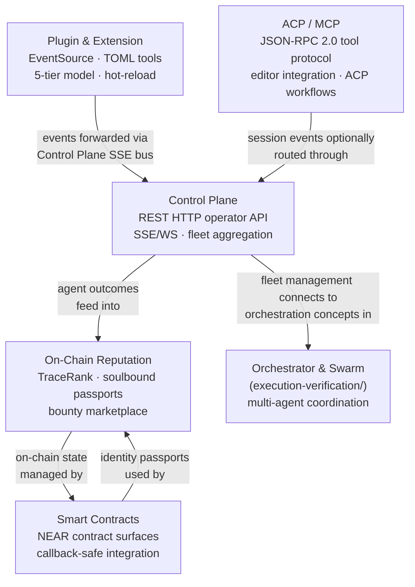

# Ecosystem and Integration

This category covers how the captured ecosystem designs connect an agent runtime to the world outside its core loop: on-chain identity and reputation, plugin and extension triggers, ACP/MCP editor protocols, an HTTP control plane, and NEAR smart-contract patterns for trustable agent economics. These documents are most relevant when building IronClaw's NEAR integration, external tool connectivity, or operator tooling.

**Protocol boundary**: Two documents cover HTTP/streaming patterns with distinct scopes. The Control Plane covers REST HTTP operator APIs, SSE/WebSocket for dashboards, and fleet aggregation. MCP/ACP covers JSON-RPC tool/editor protocols between editors, agents, and tool servers. These are complementary, not overlapping — see [Boundary Clarification](#boundary-clarification) below.

**Tool discovery boundary**: Two documents discuss tool discovery. Plugin/Extension covers local discovery — scanning directories for TOML manifests and WASM binaries. MCP covers remote protocol discovery — the `tools/list` JSON-RPC handshake over HTTP/stdio/socket to external servers. Again complementary; see [Boundary Clarification](#boundary-clarification).

---

## Documents

| Document | Summary | Priority |
|----------|---------|----------|
| [On-Chain Reputation](./chain-reputation/) | Soulbound NFT identity passports (ERC-8004), seven-domain EMA reputation with 30-day half-life decay, TraceRank (PageRank for agent trust) with collusion detection, a bounty marketplace with three hiring models, X402 micropayments, and KORAI demurrage token economics. Relevant for NEAR integration. Split into: passport-system, reputation-scoring, bounty-marketplace, token-economics, near-implementation, benchmarking. | MEDIUM |
| [Plugin and Extension System](./plugin-extension.md) | Event-source pattern for file-watch, cron, webhook, and extension-triggered work; local TOML/WASM discovery; permission declarations; and lifecycle hooks. **Tool discovery here = local catalog + loader path.** | LOW |
| [ACP and MCP Integration](./mcp-editor-integration.md) | MCP JSON-RPC 2.0 tool protocol, IronClaw's MCP tools-client surface over HTTP/stdio/Unix transports, OAuth/session safety, and a server-exposure plan. ACP material is an editor/workflow integration opportunity, not a second agent loop. **Tool discovery here = remote JSON-RPC protocol.** | MEDIUM |
| [Control Plane and API Server](./control-plane.md) | Hub-and-spoke control-plane patterns: HTTP operator API, SSE/WebSocket dashboard streams, event replay, readiness, fleet aggregation, credential isolation, and response-side redaction. **HTTP here = REST operator API, not MCP.** | MEDIUM |
| [Smart Contract Architecture](./smart-contracts/README.md) | NEAR smart contract ports for AI agent economic infrastructure: AgentRegistry, IdentityRegistry (soulbound NEP-171), WorkerRegistry, ReputationRegistry, BountyMarket (programmable escrow), ConsortiumValidator, ValidationRegistry, InsightBoard, FeeDistributor. Split into: [near-contracts](./smart-contracts/near-contracts.md), [ironclaw-integration](./smart-contracts/ironclaw-integration.md), [references](./smart-contracts/references.md). | MEDIUM |

---

## Boundary Clarification

### Control Plane HTTP vs MCP JSON-RPC

These two documents both involve HTTP and structured message passing, but serve completely different purposes:

| | Control Plane | MCP/ACP |
|--|--------------|---------|
| **Protocol** | REST HTTP (axum routes, standard HTTP verbs) | JSON-RPC 2.0 over HTTP/stdio/socket |
| **Audience** | Operators, dashboards, CI scripts | AI editors (VS Code, Zed), agent-to-agent |
| **Purpose** | Manage and observe a fleet of running agents | Discover and call tools exposed by servers |
| **Auth** | API key / bearer token middleware | OAuth 2.1 with PKCE, session tokens |
| **Streaming** | SSE `EventBus<ServerEvent>`, WebSocket | SSE for MCP results, ACP events |
| **IronClaw surface** | `src/channels/web/` (gateway) | `src/tools/mcp/` |

They interact at one point: ACP session events can be routed through the control plane's SSE bus, but this is an aggregation concern — the protocols themselves are independent layers.

### Plugin/TOML Tool Discovery vs MCP Tool Discovery

| | Plugin/Extension | MCP |
|--|-----------------|-----|
| **Discovery mechanism** | Filesystem scan (`discover_plugins()`, glob TOML, WASM loader) | JSON-RPC `tools/list` request over network transport |
| **Where tools live** | Local disk (`~/.ironclaw/plugins/`, `src/tools/wasm/`) | Remote MCP servers (GitHub, Notion, custom) |
| **Registration** | Static at startup / hot-reload via file watcher | Dynamic per-session (server returns current list) |
| **IronClaw surface** | `src/registry/`, `src/tools/wasm/loader.rs` | `src/tools/mcp/client.rs`, `src/tools/registry.rs` |

---

## Ecosystem Map

**Scope note:** Plugin/Extension and Control Plane cover internal Roko extensibility and operations. ACP/MCP covers editor-facing protocols. On-Chain Reputation and Smart Contracts cover the economic trust layer. All five connect at the boundary where IronClaw interacts with external systems (editors, blockchains, operator dashboards).

---

## Cross-References to Other Folders

- **[execution-verification/orchestrator-swarm.md](../execution-verification/orchestrator-swarm.md)** — Fleet management in the control plane (section 6, 7) maps to the orchestrator's multi-agent coordination patterns. Read alongside control-plane.md section 13.8 (Per-Agent Sidecar sketch).
- **[execution-verification/runtime-infrastructure.md](../execution-verification/runtime-infrastructure.md)** — The EventBus, CancellationToken, and StateHub patterns described in control-plane.md originated here. The runtime document covers the underlying primitives.
- **[agent-intelligence/agent-patterns.md](../agent-intelligence/agent-patterns.md)** — Plugin event sources (EventSource trait) connect to agent loop patterns described there.
- **[implementation/README.md](../implementation/README.md)** — IronClaw-native build plans for MCP server exposure and control plane enhancements.

---

## Quick Start

If you are working on **operator tooling or dashboards**: start with [Control Plane](./control-plane.md). It defines the REST HTTP surface and streaming model that all monitoring and control flows through.

If you are working on **NEAR integration or agent identity**: start with [On-Chain Reputation](./chain-reputation/) for the semantic model, then read [Smart Contracts](./smart-contracts/) for the concrete contract walkthrough and NEAR port analysis.

If you are working on **editor integration or MCP server exposure**: start with [ACP and MCP Integration](./mcp-editor-integration.md). IronClaw already has an MCP tools client; the server-mode section covers exposing selected IronClaw tools safely.

If you are working on **push-based events or declarative tools**: start with [Plugin and Extension System](./plugin-extension.md). Sections 3–5 (EventSource, FileWatch, Cron) and section 8 (TOML manifests) are the most IronClaw-relevant.
