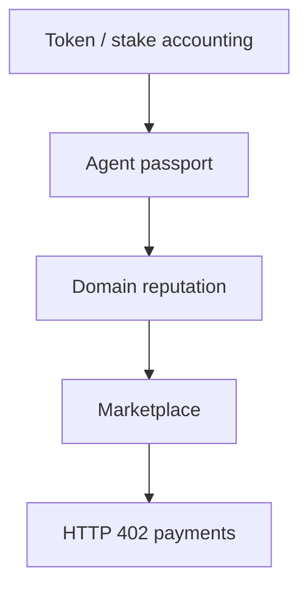

# On-Chain Agent Identity, Reputation, and Marketplace

**Status**: self-contained design notes for an IronClaw-compatible chain reputation layer.
**Priority**: high for NEAR identity exploration, marketplace trust inputs, and future multi-agent delegation.
**Scope**: architecture and validation guidance, not production-ready contract code.

This folder captures source context from a prior chain-reputation exploration, but it must stand on its own without separate code access. Constants, economics, gas numbers, external protocol choices, and security properties are candidate settings or validation targets until measured in IronClaw-owned code and deployed contracts.

## Documents

| File | Purpose |
|------|---------|
| [passport-system.md](./passport-system.md) | Non-transferable agent identity, capabilities, tiers, prompt commitment |
| [reputation-scoring.md](./reputation-scoring.md) | Domain EMA, decay, TraceRank-style graph scoring, collusion dilution |
| [bounty-marketplace.md](./bounty-marketplace.md) | Job lifecycle, hiring models, escrow, disputes |
| [token-economics.md](./token-economics.md) | Optional token policy and HTTP 402-style payment flow |
| [near-implementation.md](./near-implementation.md) | NEAR porting patterns and IronClaw integration boundaries |
| [benchmarking.md](./benchmarking.md) | Measurement methods, assumptions, and acceptance targets |
| [references.md](./references.md) | Academic and protocol references used by the design |

## Problem

Autonomous agents need a portable answer to a simple question: "Should I trust this agent for this task?" Platform-local ratings do not travel across tools, channels, or marketplaces. A chain-backed identity and reputation layer can make trust evidence portable and independently verifiable.

The hard part is not storing a score. The hard parts are:

- preventing cheap reputation resets,
- preserving domain specificity,
- keeping inactive or stale reputation from dominating,
- detecting reputation games without punishing legitimate collaboration,
- settling paid work without giving contract code more authority than necessary.

No single primitive solves Sybil resistance. A non-transferable passport only prevents transferring an identity; it does not stop a person from creating a new account. The design can raise reset cost through one-passport-per-account rules, staking, permanent history, capability gates, and marketplace policy, but those controls need abuse testing before they are treated as effective.

## Architecture

```text
+--------------------------------------------------------------+
| Layer 5: HTTP 402 / Micropayments                             |
| Request pricing, payment authorization, retry after payment    |
+--------------------------------------------------------------+
| Layer 4: Bounty Marketplace                                   |
| Job posting, assignment, escrow, settlement, disputes          |
+--------------------------------------------------------------+
| Layer 3: Reputation                                           |
| Domain EMA, decay, TraceRank, collusion dilution               |
+--------------------------------------------------------------+
| Layer 2: Agent Passport                                       |
| Soulbound identity, capabilities, tier, prompt commitment      |
+--------------------------------------------------------------+
| Layer 1: Token / Stake Accounting                             |
| Optional KORAI-style rewards, deposits, storage coverage       |
+--------------------------------------------------------------+
```



Keep the chain boundary narrow. Contracts should enforce identity, escrow, authorization, and durable event records. Expensive or subjective work - TraceRank, collusion sweeps, quality review, fraud analysis - should run off-chain and submit bounded results with evidence, replay protection, and audit logs.

## IronClaw Fit

Use existing IronClaw ownership boundaries rather than creating a parallel runtime:

| Stage | IronClaw-facing shape | Candidate ownership |
|-------|-----------------------|---------------------|
| Local reputation | Track reliability of tools, extensions, adapters, and delegated agents without chain dependency | `crates/ironclaw_trust`, `src/tools/`, `src/extensions/`, `src/evaluation/` |
| Identity bridge | Bind existing user or agent identities to a chain passport | `crates/ironclaw_reborn_identity`, `src/config/`, `src/agent/` |
| Delegation scoring | Blend local policy, task domain, direct feedback, and graph trust | `src/estimation/`, future multi-agent owner |
| Marketplace/payments | Price tool calls or outsourced tasks; settle through NEAR or an HTTP 402 facilitator | `src/tools/mcp/`, `src/registry/`, `src/skills/` |

The first useful slice is off-chain reputation. It can validate the data model against real IronClaw events before any contract, token, or marketplace economics are introduced.

## Design Rules

- Treat all numeric thresholds as policy defaults until calibrated.
- Use typed domains, capability flags, and lifecycle states; avoid stringly-typed control flow.
- Test caller boundaries, not only helper functions. Reputation updates, escrow release, identity binding, and payment retry logic all gate side effects.
- Keep financial contracts small. Anything involving deposits, refunds, or slashing needs adversarial tests and independent review before mainnet.
- Prefer NEAR async callbacks that explicitly inspect promise results. Do not assume cross-contract calls are atomic.
- Preserve user-controlled secrets and runtime auth. Chain identity must not bypass IronClaw approval, trust, sandbox, or capability-grant systems.
- Keep external references optional. A protocol, registry, token, or hosted facilitator should be replaceable unless IronClaw owns the operational dependency.
