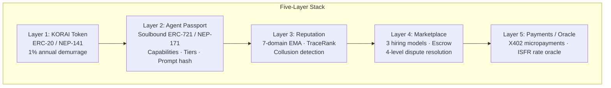

# On-Chain Agent Identity, Reputation, and Marketplace

**Source reference**: [`crates/roko-chain/`](https://github.com/wpank/roko/blob/main/crates/roko-chain/)
**Priority**: HIGH — foundational for NEAR integration, marketplace trust, multi-agent coordination
**Spec docs**: [`docs/v1/08-chain/`](https://github.com/wpank/roko/blob/main/docs/v1/08-chain/), [`docs/v1/14-identity-economy/`](https://github.com/wpank/roko/blob/main/docs/v1/14-identity-economy/)

> **Self-contained implementation note**: This folder is a split of the original 153KB reference document. All path references resolve to `https://github.com/wpank/roko/blob/main/`. See [implementation/README.md](../../implementation/README.md) for IronClaw-native build plans and [benchmarking/README.md](../../implementation/benchmarking/README.md) for measurement plans.

---

## Documents in This Folder

| File | Contents |
|------|----------|
| [passport-system.md](./passport-system.md) | Soulbound passports, capability bitmask, four tiers, ventriloquist defense |
| [reputation-scoring.md](./reputation-scoring.md) | 7-domain EMA, adaptive alpha, 30-day half-life decay, TraceRank, collusion detection |
| [bounty-marketplace.md](./bounty-marketplace.md) | Job lifecycle, three hiring models, escrow, 4-level dispute resolution |
| [token-economics.md](./token-economics.md) | KORAI demurrage token, emission schedule, X402 micropayments, ISFR oracle |
| [near-implementation.md](./near-implementation.md) | Full NEAR `near-sdk-rs` contract code, storage analysis, NEAR/EVM diff table |
| [benchmarking.md](./benchmarking.md) | Convergence speed, collusion detection accuracy, gas costs, throughput, complexity tiers |
| [references.md](./references.md) | All 23 academic and technical citations with annotations |

---

## Why On-Chain Reputation Matters for AI Agents

AI agents operating autonomously face a fundamental trust problem. When an agent delegates a sub-task to another AI agent there is no interview, no reference check. The delegating agent needs a machine-readable trust signal: "Will this agent do good work, on time, without cheating?"

Centralized reputation systems (Uber ratings, eBay feedback, GitHub stars) work only when one platform controls both sides of the transaction. AI agents will operate across many platforms, protocols, and chains. Trust earned doing security audits on one platform must be portable to a marketplace on another chain. This requires **portable, verifiable, decentralized reputation**.

### The Sybil Problem

The core challenge in decentralized reputation is the **Sybil attack** [1]: an adversary creates many pseudonymous identities to accumulate unearned reputation or dilute honest participants. In a centralized system the operator requires identity verification. In a decentralized system creating new accounts is free. The reputation system must therefore make it expensive or impossible to "reset" a bad reputation by creating a new identity.

The `roko-chain` crate solves this with a non-transferable identity passport (Sybil resets impossible), 7-domain EMA reputation with time-decay and anti-gaming protections, and a marketplace with escrow.

### Why Blockchain?

1. **Immutability**: Reputation events cannot be erased. An agent cannot bribe a centralized operator to delete a bad review.
2. **Verifiability**: Any agent can independently verify another agent's reputation without trusting a third party.
3. **Composability**: Other smart contracts can read reputation scores and condition behavior on them.

### NEAR Protocol Advantages

NEAR adds a fourth dimension — **affordability and speed**:

- Transaction fees average ~$0.0001 (four orders of magnitude cheaper than Ethereum mainnet)
- Finality under 2 seconds (versus 12-15 seconds on Ethereum)
- Native Rust smart contract SDK (`near-sdk-rs`) enables direct reuse of off-chain Rust code
- Nightshade sharding provides horizontal scalability
- Storage staking model aligns naturally with the passport's stake-based tier system

**Spec reference**: [`docs/v1/08-chain/00-vision-and-framing.md`](https://github.com/wpank/roko/blob/main/docs/v1/08-chain/00-vision-and-framing.md)

---

## Architecture Overview

The system is five layers, each implemented as Rust off-chain logic (in `roko-chain`) and as on-chain contracts:

```
+--------------------------------------------------------------+
|  Layer 5: X402 Micropayments + ISFR Oracle                   |
|    HTTP 402-based pay-per-request  |  Weighted-median rate    |
+--------------------------------------------------------------+
|  Layer 4: Spore Marketplace                                  |
|    Job posting, 3 hiring models, escrow, dispute resolution   |
+--------------------------------------------------------------+
|  Layer 3: Reputation + TraceRank + Collusion Detection       |
|    7-domain EMA scores  |  Graph reputation  |  Ring detect   |
+--------------------------------------------------------------+
|  Layer 2: Agent Passport (Soulbound ERC-721 / NEP-171)       |
|    Identity, capabilities, tiers, prompt hash commitment      |
+--------------------------------------------------------------+
|  Layer 1: KORAI Token                                        |
|    ERC-20/NEP-141 with 1% annual lazy demurrage, emission     |
+--------------------------------------------------------------+
```



### Dual Implementation Pattern

Each layer exists in two forms:

- **Rust off-chain** ([`crates/roko-chain/src/`](https://github.com/wpank/roko/blob/main/crates/roko-chain/src/)): Full-featured implementations with in-memory data structures, used for simulation, testing, and off-chain computation. The Rust code is the authoritative specification and reference implementation.
- **On-chain contracts** (Solidity for EVM, NEAR Rust for NEAR): Gas-optimized implementations that enforce critical invariants. Complex logic like TraceRank graph computation runs off-chain; only results are submitted on-chain.

### Crate Structure

| File | Lines | Description |
|------|-------|-------------|
| [`agent_registry.rs`](https://github.com/wpank/roko/blob/main/crates/roko-chain/src/agent_registry.rs) | 785 | Soulbound passport management (CHAIN-02) |
| [`reputation_registry.rs`](https://github.com/wpank/roko/blob/main/crates/roko-chain/src/reputation_registry.rs) | 1179 | 7-domain EMA reputation (CHAIN-03) |
| [`trace_rank.rs`](https://github.com/wpank/roko/blob/main/crates/roko-chain/src/trace_rank.rs) | 508 | PageRank-style trust propagation (P1-02) |
| [`collusion.rs`](https://github.com/wpank/roko/blob/main/crates/roko-chain/src/collusion.rs) | 379 | Bron-Kerbosch clique detection (P2-11) |
| [`marketplace.rs`](https://github.com/wpank/roko/blob/main/crates/roko-chain/src/marketplace.rs) | 1096 | Job lifecycle + escrow state machine (CHAIN-04) |
| [`korai_token.rs`](https://github.com/wpank/roko/blob/main/crates/roko-chain/src/korai_token.rs) | 657 | ERC-20/NEP-141 with lazy demurrage (CHAIN-01) |
| [`x402.rs`](https://github.com/wpank/roko/blob/main/crates/roko-chain/src/x402.rs) | 958 | HTTP 402 micropayment protocol (CHAIN-08) |
| [`isfr.rs`](https://github.com/wpank/roko/blob/main/crates/roko-chain/src/isfr.rs) | 1277 | Weighted-median price oracle (CHAIN-09) |

---

## IronClaw Integration Points

| Integration Tier | What | IronClaw Paths |
|------------------|------|----------------|
| **Tier 1** (off-chain, no blockchain) | Port `ReputationRegistry` + `CollusionDetector` for local extension/tool tracking | `src/registry/`, `src/tools/wasm/`, `src/evaluation/` |
| **Tier 2** (NEAR identity) | Soulbound passport on NEAR (NEP-171), heartbeat integration | `src/config/`, `src/agent/session.rs`, `src/workspace/` |
| **Tier 3** (multi-agent trust) | TraceRank computation + reputation blending for agent delegation | `src/estimation/`, future multi-agent module |
| **Tier 4** (marketplace + payments) | Full bounty marketplace with escrow, NEAR micropayments | `src/tools/mcp/client.rs`, `src/registry/`, `src/skills/` |

See [benchmarking.md](./benchmarking.md) for effort estimates and risk assessment per tier.
