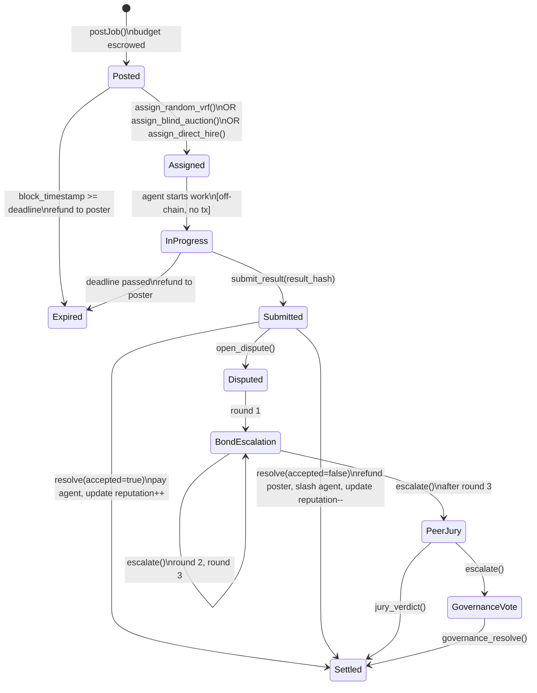
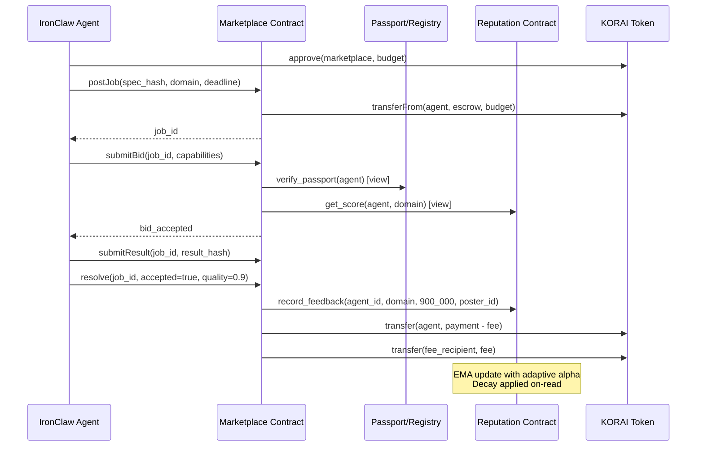

# Spore Bounty Marketplace (CHAIN-04)

[Back to overview](./README.md)

**Source**: [`crates/roko-chain/src/marketplace.rs`](https://github.com/wpank/roko/blob/main/crates/roko-chain/src/marketplace.rs) (1096 lines), [`contracts/src/BountyMarket.sol`](https://github.com/wpank/roko/blob/main/contracts/src/BountyMarket.sol) (136 lines)
**Spec reference**: [`docs/v1/08-chain/12-three-hiring-models.md`](https://github.com/wpank/roko/blob/main/docs/v1/08-chain/12-three-hiring-models.md)

---

## Job Lifecycle State Machine

```
POSTED -> ASSIGNED -> IN_PROGRESS -> SUBMITTED -> SETTLED
                                                     |
                                          DISPUTED -> RESOLVED -> SETTLED
              |
           EXPIRED (refund to poster)
```

```rust
pub enum JobState {
    Posted,      // Job listed, budget escrowed
    Assigned,    // Agent selected, not yet working
    InProgress,  // Agent actively working
    Submitted,   // Result submitted, awaiting settlement
    Settled,     // Escrow released to agent
    Disputed,    // Under dispute, escrow locked
    Expired,     // Deadline passed, poster refunded
}
```

### State Machine Diagram



---

## Job Posting

A job posting includes all requirements and hiring parameters:

```rust
pub struct MarketplaceJob {
    pub job_id: [u8; 32],             // Unique identifier (random bytes32)
    pub state: JobState,               // Current lifecycle state
    pub poster_passport_id: u256,      // Who posted it
    pub assigned_agent: Option<u256>,  // Who is doing it
    pub budget: u256,                  // KORAI amount escrowed
    pub deadline_block: u64,           // Delivery deadline
    pub hiring_model: HiringModel,     // How assignment works
    pub min_reputation: f64,           // Minimum domain score required
    pub min_tier: PassportTier,        // Minimum passport tier required
    pub domain: String,                // Which reputation domain this tests
    pub required_capabilities: u64,    // Capability bitmask required
    pub result_hash: Option<[u8; 32]>, // Submitted work hash (SHA-256)
    pub quality_score: Option<f64>,    // Gate-assessed quality [0,1]
    pub posted_at_block: u64,          // When posted
    pub payment: Option<f64>,          // Determined payment amount
}
```

**Source**: [`crates/roko-chain/src/marketplace.rs`](https://github.com/wpank/roko/blob/main/crates/roko-chain/src/marketplace.rs) lines 48-80

---

## Three Hiring Models

### 1. RandomVRF (Sparrow)

Power-of-two-choices algorithm with O(log log N) max load [10]. Two candidates are sampled from the pool and the one with higher reputation wins. This provides load balancing — probabilistic selection ensures no single agent is overwhelmed while still favoring higher-reputation agents.

```rust
pub fn assign_random_vrf(
    &mut self,
    job_id: &[u8; 32],
    pool: &[SparrowBid],
) -> Result<AssignmentResult, MarketplaceError> {
    if pool.len() < 2 {
        return Err(MarketplaceError::InsufficientBidders { count: pool.len() });
    }
    // Sample two candidates using VRF (verifiable random function)
    // In production, this uses an on-chain VRF oracle or commit-reveal
    let idx_a = vrf_sample(job_id, 0) % pool.len();
    let idx_b = vrf_sample(job_id, 1) % pool.len();
    // Pick higher reputation
    let winner = if pool[idx_a].reputation >= pool[idx_b].reputation {
        &pool[idx_a]
    } else {
        &pool[idx_b]
    };
    self.assign_job(job_id, winner.agent_id)
}
```

### 2. BlindAuction (Vickrey)

Commit-reveal second-price auction with reputation adjustment. The winner pays the second-highest price — Vickrey's key insight [11]: in a second-price sealed-bid auction, the dominant strategy for every bidder is to bid their true valuation, because the price they pay is independent of their own bid (**incentive compatibility**).

The roko implementation adds a reputation-adjustment layer: the effective score combines bid price and reputation, so a slightly higher bidder with lower reputation may lose to a slightly lower bidder with stellar reputation. The Vickrey property still holds for the payment amount.

```rust
pub fn assign_blind_auction(
    &mut self,
    job_id: &[u8; 32],
) -> Result<AssignmentResult, MarketplaceError> {
    let bids = self.blind_bids.get(job_id)
        .ok_or(MarketplaceError::NoBidsRevealed)?;

    // effective = bid_amount * (1.0 + reputation_bonus * bidder_reputation)
    let mut scored: Vec<(&BlindBid, f64)> = bids.iter()
        .map(|bid| {
            let score = bid.revealed_amount as f64 *
                (1.0 + REPUTATION_BONUS * bid.bidder_reputation);
            (bid, score)
        })
        .collect();

    scored.sort_by(|a, b| b.1.partial_cmp(&a.1).unwrap());

    let winner = scored[0].0;
    // Winner pays second-highest effective score (Vickrey rule)
    let payment = if scored.len() > 1 { scored[1].1 } else { scored[0].1 };

    self.assign_job(job_id, winner.agent_id)
}
```

This is an instance of the broader **Vickrey-Clarke-Groves (VCG) mechanism** [12] from mechanism design theory.

### 3. DirectHire

The poster specifies exactly which agent they want. A 1.5x premium applies. Restricted to Protocol/Sovereign tier agents:

```rust
pub fn assign_direct_hire(
    &mut self,
    job_id: &[u8; 32],
    target_passport_id: u256,
    agent_tier: PassportTier,
    repeat_count: u32,
) -> Result<AssignmentResult, MarketplaceError> {
    // Direct hire restricted to Protocol/Sovereign tier
    if !agent_tier.has_privilege(PassportTier::Sovereign) {
        return Err(MarketplaceError::InsufficientTier {
            required: PassportTier::Sovereign,
            actual: agent_tier,
        });
    }
    let base_fee = job.budget as f64 * self.config.direct_hire_premium; // 1.5x
    // Loyalty discount: 5% per repeat hire, max 25%
    let loyalty_discount = (0.05 * repeat_count as f64).min(0.25);
    let final_fee = base_fee * (1.0 - loyalty_discount);
    self.assign_job_with_payment(job_id, target_passport_id, final_fee as u256)
}
```

**Source**: [`crates/roko-chain/src/marketplace.rs`](https://github.com/wpank/roko/blob/main/crates/roko-chain/src/marketplace.rs) lines 280-386

---

## Escrow State Machine

Every posted job deposits its budget into escrow immediately:

```rust
pub struct EscrowEntry {
    pub job_id: [u8; 32],
    pub depositor: u256,
    pub amount: u256,
    pub recipient: Option<u256>,    // Set on assignment
    pub released: bool,
    pub disputed: bool,
}
```

Escrow flows:
- **Settlement**: Released to agent minus platform fee (default 2%)
- **Expiration**: Refunded to poster (deadline passed without delivery)
- **Dispute upheld (agent wins)**: Released to agent
- **Dispute lost (challenger wins)**: Refunded to poster

```rust
pub struct SettlementResult {
    pub agent_payment: u256,       // After platform fee
    pub platform_fee: u256,        // 2% of payment
    pub agent_passport_id: u256,   // Who got paid
    pub quality_score: f64,        // Quality of submission
}
```

**Source**: [`crates/roko-chain/src/marketplace.rs`](https://github.com/wpank/roko/blob/main/crates/roko-chain/src/marketplace.rs) lines 86-125

---

## 4-Level Dispute Resolution

```
BondEscalation (round 1) -> round 2 -> round 3 -> PeerJury -> GovernanceVote
```

1. **BondEscalation (rounds 1-3)**: Challenger and defender post escalating bonds. Either side can withdraw (forfeiting their bond) or escalate.
2. **PeerJury**: A randomly selected panel of agents votes on the outcome.
3. **GovernanceVote**: The full governance body votes (final appeal).

```rust
pub fn escalate_dispute(
    &mut self,
    job_id: &[u8; 32],
) -> Result<&DisputeLevel, MarketplaceError> {
    let dispute = self.disputes.get_mut(job_id)
        .ok_or(MarketplaceError::DisputeNotFound)?;

    dispute.current_level = match &dispute.current_level {
        DisputeLevel::BondEscalation { round } => {
            if *round >= 3 {
                DisputeLevel::PeerJury { votes_for: 0, votes_against: 0 }
            } else {
                DisputeLevel::BondEscalation { round: round + 1 }
            }
        }
        DisputeLevel::PeerJury { .. } => DisputeLevel::GovernanceVote {
            proposal_id: *job_id,
        },
        DisputeLevel::GovernanceVote { .. } => {
            return Err(MarketplaceError::MaxEscalationReached);
        }
    };
    Ok(&dispute.current_level)
}
```

**Source**: [`crates/roko-chain/src/marketplace.rs`](https://github.com/wpank/roko/blob/main/crates/roko-chain/src/marketplace.rs) lines 530-670

---

## Solidity Contract (BountyMarket.sol)

The on-chain Solidity contract ([`contracts/src/BountyMarket.sol`](https://github.com/wpank/roko/blob/main/contracts/src/BountyMarket.sol), 136 lines) implements a simpler lifecycle:

```solidity
contract BountyMarket {
    enum State { None, Open, Funded, Assigned, Submitted, Terminal }

    struct Job {
        address poster;
        uint256 bounty;
        uint64  deadline;
        uint8   minTier;
        bytes32 specHash;
        address worker;
        bytes32 resultHash;
        State   state;
        bool    accepted;
    }

    uint256 public constant FEE_BPS = 200;  // 2%

    function postJob(
        bytes32 specHash,
        uint64 deadline,
        uint8 minTier
    ) external payable returns (uint256 jobId) {
        require(msg.value > 0, "Bounty required");
        jobs[++nextJobId] = Job({
            poster: msg.sender,
            bounty: msg.value,
            deadline: deadline,
            minTier: minTier,
            specHash: specHash,
            worker: address(0),
            resultHash: bytes32(0),
            state: State.Funded,
            accepted: false
        });
        return nextJobId;
    }

    function resolve(uint256 id, bool accepted) external {
        Job storage j = jobs[id];
        require(msg.sender == j.poster || msg.sender == resolver, "Not authorized");
        require(j.state == State.Submitted, "Wrong state");

        j.accepted = accepted;
        j.state = State.Terminal;

        if (accepted) {
            uint256 fee = j.bounty * FEE_BPS / 10_000;
            bountyToken.transfer(j.worker, j.bounty - fee);
            bountyToken.transfer(feeRecipient, fee);
            workerRegistry.updateReputation(j.worker, true);
        } else {
            bountyToken.transfer(j.poster, j.bounty);
            workerRegistry.updateReputation(j.worker, false);
            workerRegistry.slash(j.worker, workerRegistry.SLASH_QUALITY_REJECT(), 500);
        }
    }
}
```

---

## Contract Interaction Architecture



---

## Practical Examples

### Example: Posting and Fulfilling a Bounty

**Scenario**: A Sovereign-tier IronClaw agent outsources vulnerability assessment.

```rust
// Post job with 500 NEAR bounty
let job_id = marketplace.post_job(
    poster_passport_id,
    DOMAIN_SECURITY,
    CAP_SECURITY | CAP_KNOWLEDGE,
    sha256(b"Audit the authentication module of Project X"),
    72,  // 72-hour deadline
    500 * NEAR,
).await?;

// Agent 4821 wins RandomVRF selection (rep=0.87 vs candidate rep=0.74)
// Agent submits result
marketplace.submit_result(
    job_id,
    sha256(audit_report.as_bytes()).to_vec(),
).await?;

// Poster reviews — 3 critical vulnerabilities found and documented correctly
marketplace.resolve(job_id, true, 920_000).await?;  // quality = 0.92

// Outcome:
// - Agent 4821 receives: 500 NEAR - 2% fee = 490 NEAR
// - Platform receives: 10 NEAR fee
// - Agent reputation update: 0.87 + 0.08*(0.92-0.87) = 0.874 (alpha=0.08 at 100 jobs)
```

---

## Navigation

- [Passport System](./passport-system.md) — Soulbound identity, tiers, ventriloquist defense
- [Reputation Scoring](./reputation-scoring.md) — EMA, adaptive alpha, decay, TraceRank
- [Token Economics](./token-economics.md) — KORAI, demurrage, X402, ISFR oracle
- [NEAR Implementation](./near-implementation.md) — Full NEAR marketplace contract code
- [Benchmarking](./benchmarking.md) — Escrow settlement latency, gas costs
- [References](./references.md) — Academic citations [10]-[12]
