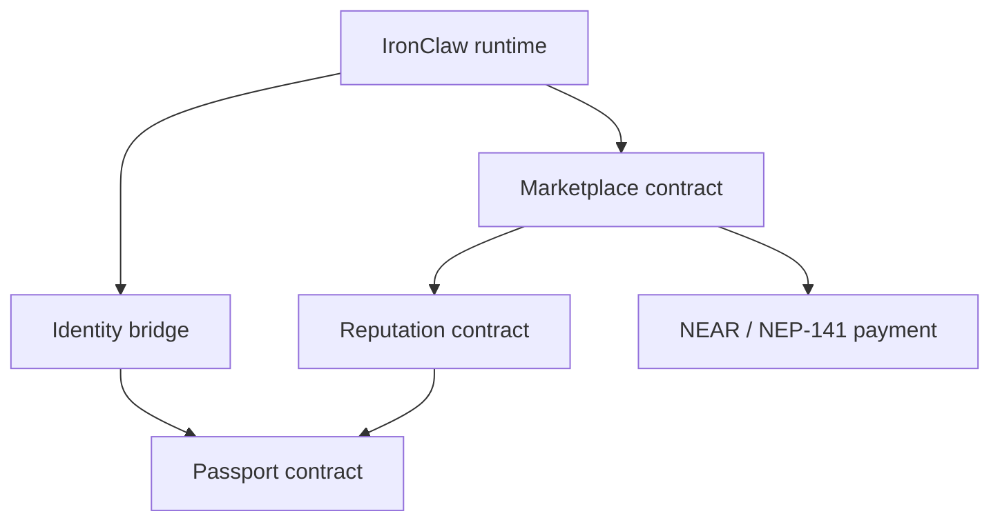

# NEAR Implementation Blueprint

[Back to overview](./README.md)

This is a porting blueprint, not copy-paste contract code. The goal is to keep NEAR contracts small, make async behavior explicit, and preserve IronClaw's existing identity, trust, approval, and sandbox boundaries.

## EVM-to-NEAR Differences That Matter

| Concern | EVM habit | NEAR habit |
|---------|-----------|------------|
| Time | seconds | `env::block_timestamp()` returns nanoseconds |
| Calls | synchronous, atomic transaction frame | asynchronous promises and callbacks |
| Storage | gas paid per write | storage staking paid by account |
| Assets | ERC-20/ERC-721 | NEP-141/NEP-171 or native NEAR |
| Authorization | `msg.sender`, modifiers | predecessor/current account plus access keys |
| Failure handling | revert rolls back the call frame | callback must inspect promise result |

The most important rule: do not model a multi-contract NEAR settlement as a single atomic Solidity transaction. Store pending state, call out, then finalize or compensate in callbacks.

## Contract Boundaries



Suggested split:

- `passport`: one active passport per account, capability bits, tier, prompt hash, slash history.
- `reputation`: fixed-point domain tracks and feedback-weight dilution.
- `marketplace`: job state, escrow, assignment, settlement callbacks.
- `payment`: native NEAR, NEP-141 token, or facilitator integration. Keep this swappable.

## Passport Pattern

```rust
pub struct PassportRecord {
    pub owner: AccountId,
    pub capabilities: u64,
    pub tier: u8,
    pub system_prompt_hash: [u8; 32],
    pub total_stake_yocto: u128,
    pub slash_count: u32,
}

#[payable]
pub fn register(&mut self, capabilities: u64, prompt_hash: [u8; 32]) -> PassportId {
    let caller = env::predecessor_account_id();
    assert!(!self.owner_to_passport.contains_key(&caller), "passport exists");

    let storage_before = env::storage_usage();
    let id = self.next_passport_id();
    self.passports.insert(&id, &PassportRecord {
        owner: caller.clone(),
        capabilities,
        tier: EDGE_TIER,
        system_prompt_hash: prompt_hash,
        total_stake_yocto: 0,
        slash_count: 0,
    });
    self.owner_to_passport.insert(&caller, &id);
    self.refund_excess_storage_deposit(storage_before);
    id
}
```

Production requirements:

- charge and refund storage accurately,
- reject all transfer and approval methods,
- emit structured events,
- separate admin slash authority from normal marketplace callers,
- provide migration/recovery policy before launch.

## Reputation Pattern

Use fixed-point math on-chain. Keep floating point in off-chain simulation only.

```rust
const SCALE: u64 = 1_000_000;
const NEUTRAL: u64 = 500_000;
const HALF_LIFE_NS: u64 = 30 * 24 * 60 * 60 * 1_000_000_000;

pub struct DomainTrack {
    pub score: u64,
    pub job_count: u64,
    pub last_update_ns: u64,
}

pub fn adaptive_alpha(job_count: u64) -> u64 {
    match job_count {
        0..=10 => 300_000,
        11..=50 => 150_000,
        51..=200 => 80_000,
        _ => 40_000,
    }
}
```

For decay, avoid unbounded exponentiation. A first contract can use whole-half-life steps with a capped loop, then improve precision after benchmarking:

```rust
pub fn decayed_score(mut score: u64, elapsed_ns: u64) -> u64 {
    let halvings = (elapsed_ns / HALF_LIFE_NS).min(64);
    for _ in 0..halvings {
        if score >= NEUTRAL {
            score = NEUTRAL + (score - NEUTRAL) / 2;
        } else {
            score = NEUTRAL - (NEUTRAL - score) / 2;
        }
    }
    score
}
```

This approximation should be documented and tested against the off-chain model. If smooth decay matters, implement fixed-point exponentiation and measure gas.

## Marketplace Settlement Pattern

A safe settlement records intent, performs the external call, then finalizes in a private callback:

```rust
pub fn accept_submission(&mut self, job_id: u64, quality: u64) -> Promise {
    let job = self.load_submitted_job(job_id);
    self.mark_settlement_pending(job_id);

    ext_reputation::ext(self.reputation_contract.clone())
        .with_static_gas(GAS_FOR_REPUTATION)
        .record_feedback(job.agent_passport, job.domain, quality, job.poster_passport)
        .then(
            Self::ext(env::current_account_id())
                .with_static_gas(GAS_FOR_CALLBACK)
                .on_reputation_recorded(job_id)
        )
}

#[private]
pub fn on_reputation_recorded(&mut self, job_id: u64) -> Promise {
    assert_eq!(env::promise_results_count(), 1, "expected one promise");
    match env::promise_result(0) {
        PromiseResult::Successful(_) => self.release_escrow(job_id),
        _ => self.mark_settlement_failed(job_id),
    }
}
```

Do not release escrow before the callback validates the reputation update outcome unless the product deliberately accepts that failure mode.

## Storage Costing

NEAR storage cost is a protocol parameter, so docs should not hardcode USD estimates. Compute it from contract storage usage:

```rust
fn required_deposit_yocto(bytes: u64, storage_byte_cost_yocto: u128) -> u128 {
    storage_byte_cost_yocto * bytes as u128
}
```

Benchmark each record type:

| Record | Measurement method |
|--------|--------------------|
| Passport | storage before/after register |
| Reputation track | before/after first domain feedback |
| Job | before/after post and settlement |
| Slash/dispute record | before/after append |
| Payment nonce | before/after quote verification |

Refund excess deposit and define who pays for records created by callbacks.

## IronClaw Boundary

Chain identity is evidence consumed by IronClaw, not a replacement for host policy.

Recommended flow:

1. Resolve the local user or agent through `crates/ironclaw_reborn_identity`.
2. Verify the linked chain passport.
3. Feed passport tier, capabilities, and reputation into `crates/ironclaw_trust` or a runtime-owned policy layer as inputs.
4. Continue to require explicit capability grants, approvals, and sandbox checks for tool execution.
5. Record chain events in workspace or observability systems for audit and replay.

## Validation Before Mainnet

- Localnet tests for every state transition and callback failure.
- Testnet measurements for storage deltas, gas, finality, and retry behavior.
- Property tests for accounting invariants: escrow conservation, no double payout, no replayed nonce.
- Contract review for all value-moving methods.
- Caller-level integration tests from IronClaw request handling through payment/reputation side effects.

## Navigation

- [Passport System](./passport-system.md)
- [Reputation Scoring](./reputation-scoring.md)
- [Bounty Marketplace](./bounty-marketplace.md)
- [Token Economics](./token-economics.md)
- [Benchmarking](./benchmarking.md)
- [References](./references.md)
