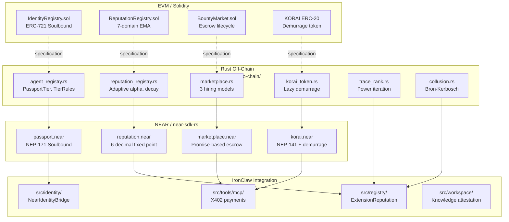

# NEAR Smart Contract Implementation

[Back to overview](./README.md)

This document provides actual NEAR Rust smart contract code (`near-sdk-rs`) for the three core contracts: passport, reputation registry, and marketplace. These are implementation blueprints for porting the EVM contracts to NEAR Protocol.

**Spec reference**: [`docs/v1/08-chain/`](https://github.com/wpank/roko/blob/main/docs/v1/08-chain/)
**NEAR standards**: NEP-171 [18], NEP-141 [19]

---

## EVM vs NEAR Differences

| Aspect | Solidity (EVM) | NEAR Rust (near-sdk-rs) |
|--------|---------------|------------------------|
| Storage | `mapping(uint => Struct)` | `LookupMap<K, V>`, `UnorderedMap<K, V>` |
| Time | `block.timestamp` (seconds) | `env::block_timestamp()` (nanoseconds) |
| Cross-contract calls | Synchronous (`STATICCALL`) | Async Promises (`ext_contract!`) |
| Token standard | ERC-20, ERC-721 | NEP-141 (FT), NEP-171 (NFT) |
| Gas model | Per-opcode gas | TGas (Terra-gas), prepaid |
| Storage costs | Paid per write | Storage staking (1 NEAR/100KB) |
| Events | `emit Event(...)` | `env::log_str(...)` |
| Error handling | `revert("msg")` | `env::panic_str("msg")` |
| Access control | `onlyOwner` modifier | `assert_eq!(env::predecessor_account_id(), ...)` |
| NFT transfer restriction | `revert Soulbound()` | `env::panic_str("Soulbound")` |

### Mapping EVM Constants to NEAR

```rust
// Solidity: uint64 public constant PROMPT_UPDATE_DELAY = 1 days; // seconds
// NEAR equivalent:
const PROMPT_UPDATE_DELAY_NS: u64 = 24 * 3600 * 1_000_000_000; // nanoseconds

// Solidity: uint256 public constant WORKER_STAKE_THRESHOLD = 5_000 ether;
// NEAR equivalent (using NEAR tokens):
const WORKER_STAKE_THRESHOLD: Balance = 5_000 * 10u128.pow(24); // yoctoNEAR

// Solidity: uint256 public constant DECAY_PERIOD = 30 days; // seconds
// NEAR equivalent:
const HALF_LIFE_NS: u64 = 30 * 24 * 3600 * 1_000_000_000u64; // nanoseconds
```

### Cross-Contract Call Pattern

The most significant architectural difference is NEAR's async cross-contract call model:

```rust
// Solidity pattern (synchronous):
workerRegistry.updateReputation(j.worker, true);
bountyToken.transfer(j.worker, j.bounty - fee);

// NEAR pattern (async Promise chaining):
ext_reputation::ext(self.reputation_contract.clone())
    .with_static_gas(GAS_FOR_REPUTATION_UPDATE)
    .record_feedback(agent_passport, domain_id, 900_000, poster_passport)
    .then(
        Promise::new(agent_account).transfer(payment)
    )
```

The NEAR Promise model guarantees that `reputation.record_feedback` completes before the transfer executes, but if the reputation call fails, the transfer is still attempted (unlike synchronous Solidity calls which revert atomically). Production implementations should use `.then()` with explicit success/failure handling via `#[private]` callback methods.

---

## Passport Contract (NEAR Rust)

```rust
// near-contracts/src/passport.rs
use near_sdk::borsh::{self, BorshDeserialize, BorshSerialize};
use near_sdk::collections::{LookupMap, UnorderedMap, Vector};
use near_sdk::{env, near_bindgen, AccountId, Balance, PanicOnDefault, Promise};
use near_sdk::json_types::U128;

const WORKER_STAKE_THRESHOLD: Balance = 5_000 * 10u128.pow(24);
const SOVEREIGN_STAKE_THRESHOLD: Balance = 25_000 * 10u128.pow(24);
const PROTOCOL_STAKE_THRESHOLD: Balance = 100_000 * 10u128.pow(24);
const PROMPT_UPDATE_DELAY_NS: u64 = 24 * 3600 * 1_000_000_000;

#[derive(BorshDeserialize, BorshSerialize, Clone, PartialEq)]
pub enum PassportTier {
    Edge = 0,
    Worker = 1,
    Sovereign = 2,
    Protocol = 3,
}

#[derive(BorshDeserialize, BorshSerialize)]
pub struct Passport {
    pub token_id: u64,
    pub owner: AccountId,
    pub capability_list: u64,
    pub tier: PassportTier,
    pub system_prompt_hash: [u8; 32],
    pub pending_prompt_hash: Option<[u8; 32]>,
    pub pending_prompt_update_at: Option<u64>,  // nanoseconds
    pub tee_attestation: Option<[u8; 32]>,
    pub tee_expiry: Option<u64>,
    pub registered_at: u64,
    pub agent_card_uri: String,
    pub slash_count: u32,
    pub total_domain_stake: Balance,
}

#[near_bindgen]
#[derive(BorshDeserialize, BorshSerialize, PanicOnDefault)]
pub struct PassportContract {
    passports: UnorderedMap<u64, Passport>,
    owner_to_token: LookupMap<AccountId, u64>,
    next_token_id: u64,
    domain_stakes: LookupMap<u64, LookupMap<u8, Balance>>,
    slash_history: LookupMap<u64, Vector<SlashRecord>>,
    owner_account: AccountId,
}

#[near_bindgen]
impl PassportContract {
    #[init]
    pub fn new(owner: AccountId) -> Self {
        Self {
            passports: UnorderedMap::new(b"p"),
            owner_to_token: LookupMap::new(b"o"),
            next_token_id: 1,
            domain_stakes: LookupMap::new(b"d"),
            slash_history: LookupMap::new(b"s"),
            owner_account: owner,
        }
    }

    /// Register a new agent passport. One passport per account.
    /// Requires attached deposit for storage staking.
    #[payable]
    pub fn register(
        &mut self,
        capability_list: u64,
        system_prompt_hash: Vec<u8>,
        agent_card_uri: String,
    ) -> u64 {
        let caller = env::predecessor_account_id();

        // Enforce one-passport-per-account (soulbound semantics)
        assert!(
            !self.owner_to_token.contains_key(&caller),
            "Account already has a passport"
        );

        let prompt_hash: [u8; 32] = system_prompt_hash.try_into()
            .expect("system_prompt_hash must be 32 bytes");

        let token_id = self.next_token_id;
        self.next_token_id += 1;

        let passport = Passport {
            token_id,
            owner: caller.clone(),
            capability_list,
            tier: PassportTier::Edge,
            system_prompt_hash: prompt_hash,
            pending_prompt_hash: None,
            pending_prompt_update_at: None,
            tee_attestation: None,
            tee_expiry: None,
            registered_at: env::block_timestamp(),
            agent_card_uri,
            slash_count: 0,
            total_domain_stake: 0,
        };

        self.passports.insert(&token_id, &passport);
        self.owner_to_token.insert(&caller, &token_id);

        env::log_str(&format!("PassportMinted: id={}, owner={}", token_id, caller));
        token_id
    }

    /// NEP-171: nft_transfer always panics — soulbound enforcement.
    pub fn nft_transfer(
        &mut self,
        _receiver_id: AccountId,
        _token_id: String,
        _approval_id: Option<u64>,
        _memo: Option<String>,
    ) {
        env::panic_str("Passport is soulbound and cannot be transferred");
    }

    /// NEP-171: nft_transfer_call always panics — soulbound enforcement.
    pub fn nft_transfer_call(
        &mut self,
        _receiver_id: AccountId,
        _token_id: String,
        _approval_id: Option<u64>,
        _memo: Option<String>,
        _msg: String,
    ) -> bool {
        env::panic_str("Passport is soulbound and cannot be transferred");
    }

    /// Schedule a prompt hash update (24-hour timelock).
    pub fn schedule_prompt_update(&mut self, new_hash: Vec<u8>) {
        let caller = env::predecessor_account_id();
        let token_id = self.get_token_id_for_caller(&caller);
        let mut passport = self.passports.get(&token_id).expect("Passport not found");

        assert!(
            passport.pending_prompt_hash.is_none(),
            "A prompt update is already pending"
        );

        let new_hash_bytes: [u8; 32] = new_hash.try_into()
            .expect("new_hash must be 32 bytes");

        passport.pending_prompt_hash = Some(new_hash_bytes);
        passport.pending_prompt_update_at = Some(env::block_timestamp() + PROMPT_UPDATE_DELAY_NS);
        self.passports.insert(&token_id, &passport);

        env::log_str(&format!("PromptHashUpdateScheduled: id={}", token_id));
    }

    /// Finalize a scheduled prompt update (must wait 24 hours).
    pub fn finalize_prompt_update(&mut self) {
        let caller = env::predecessor_account_id();
        let token_id = self.get_token_id_for_caller(&caller);
        let mut passport = self.passports.get(&token_id).expect("Passport not found");

        let ready_at = passport.pending_prompt_update_at
            .expect("No pending prompt update");

        assert!(
            env::block_timestamp() >= ready_at,
            "Prompt update timelock has not elapsed (24 hours required)"
        );

        let new_hash = passport.pending_prompt_hash.expect("No pending hash");
        passport.system_prompt_hash = new_hash;
        passport.pending_prompt_hash = None;
        passport.pending_prompt_update_at = None;
        self.passports.insert(&token_id, &passport);

        env::log_str(&format!("PromptHashUpdated: id={}", token_id));
    }

    /// Stake NEAR into a reputation domain.
    #[payable]
    pub fn stake_into_domain(&mut self, domain_id: u8) {
        let caller = env::predecessor_account_id();
        let token_id = self.get_token_id_for_caller(&caller);
        let amount = env::attached_deposit();
        assert!(amount > 0, "Must attach deposit to stake");

        let mut domain_map = self.domain_stakes.get(&token_id)
            .unwrap_or_else(|| LookupMap::new(format!("dk{}", token_id).as_bytes()));

        let current = domain_map.get(&domain_id).unwrap_or(0);
        domain_map.insert(&domain_id, &(current + amount));
        self.domain_stakes.insert(&token_id, &domain_map);

        let mut passport = self.passports.get(&token_id).unwrap();
        passport.total_domain_stake += amount;
        self.sync_tier(&mut passport);
        self.passports.insert(&token_id, &passport);
    }

    fn sync_tier(&self, passport: &mut Passport) {
        let new_tier = if passport.total_domain_stake >= PROTOCOL_STAKE_THRESHOLD {
            PassportTier::Protocol
        } else if passport.total_domain_stake >= SOVEREIGN_STAKE_THRESHOLD {
            PassportTier::Sovereign
        } else if passport.total_domain_stake >= WORKER_STAKE_THRESHOLD {
            PassportTier::Worker
        } else {
            PassportTier::Edge
        };
        passport.tier = new_tier;
    }

    /// Append a slash record (only callable by authorized contracts).
    pub fn slash(&mut self, token_id: u64, reason: u8, bps: u32) {
        self.assert_authorized_slasher();
        let mut passport = self.passports.get(&token_id).expect("Passport not found");
        passport.slash_count += 1;
        self.passports.insert(&token_id, &passport);

        let mut history = self.slash_history.get(&token_id)
            .unwrap_or_else(|| Vector::new(format!("sh{}", token_id).as_bytes()));
        history.push(&SlashRecord {
            reason,
            slash_bps: bps,
            timestamp: env::block_timestamp(),
        });
        self.slash_history.insert(&token_id, &history);

        env::log_str(&format!("Slashed: id={}, reason={}, bps={}", token_id, reason, bps));
    }

    /// View: get passport data.
    pub fn get_passport(&self, token_id: u64) -> Option<PassportView> {
        self.passports.get(&token_id).map(|p| PassportView {
            token_id: p.token_id,
            owner: p.owner,
            capability_list: p.capability_list,
            tier: p.tier as u8,
            agent_card_uri: p.agent_card_uri,
            slash_count: p.slash_count,
            total_domain_stake: U128(p.total_domain_stake),
            registered_at: p.registered_at,
        })
    }

    fn get_token_id_for_caller(&self, caller: &AccountId) -> u64 {
        self.owner_to_token.get(caller)
            .expect("Caller does not have a passport")
    }

    fn assert_authorized_slasher(&self) {
        let predecessor = env::predecessor_account_id();
        assert!(
            predecessor == self.owner_account,
            "Only authorized slashers can slash passports"
        );
    }
}

#[derive(BorshDeserialize, BorshSerialize)]
pub struct SlashRecord {
    pub reason: u8,
    pub slash_bps: u32,
    pub timestamp: u64,
}

#[derive(serde::Serialize)]
pub struct PassportView {
    pub token_id: u64,
    pub owner: AccountId,
    pub capability_list: u64,
    pub tier: u8,
    pub agent_card_uri: String,
    pub slash_count: u32,
    pub total_domain_stake: U128,
    pub registered_at: u64,
}
```

---

## Reputation Registry Contract (NEAR Rust)

```rust
// near-contracts/src/reputation.rs
use near_sdk::borsh::{self, BorshDeserialize, BorshSerialize};
use near_sdk::collections::LookupMap;
use near_sdk::{env, near_bindgen, AccountId, PanicOnDefault};

const HALF_LIFE_NS: u64 = 30 * 24 * 3600 * 1_000_000_000u64;
const NEUTRAL_SCORE: u64 = 500_000;   // 0.5 in 6-decimal fixed point
const SCALE: u64 = 1_000_000;

pub const DOMAIN_CODING: u8 = 0;
pub const DOMAIN_SECURITY: u8 = 1;
pub const DOMAIN_RESEARCH: u8 = 2;
pub const DOMAIN_CHAIN: u8 = 3;
pub const DOMAIN_KNOWLEDGE: u8 = 4;
pub const DOMAIN_OPERATIONS: u8 = 5;
pub const DOMAIN_STRATEGY: u8 = 6;

#[derive(BorshDeserialize, BorshSerialize, Clone)]
pub struct DomainTrack {
    pub score: u64,
    pub job_count: u64,
    pub last_update_ns: u64,
}

impl DomainTrack {
    pub fn new_neutral(now: u64) -> Self {
        Self { score: NEUTRAL_SCORE, job_count: 0, last_update_ns: now }
    }

    /// Compute effective score with 30-day half-life decay.
    /// Uses integer arithmetic with bit-shifting for gas efficiency.
    pub fn effective_score(&self, now: u64) -> u64 {
        if now <= self.last_update_ns {
            return self.score;
        }
        let elapsed_ns = now - self.last_update_ns;
        let halvings = (elapsed_ns / HALF_LIFE_NS).min(64);

        let mut score = self.score;
        for _ in 0..halvings {
            if score > NEUTRAL_SCORE {
                score = NEUTRAL_SCORE + (score - NEUTRAL_SCORE) / 2;
            } else {
                score = NEUTRAL_SCORE - (NEUTRAL_SCORE - score) / 2;
            }
        }
        score
    }

    /// Adaptive alpha based on job count (in SCALE units).
    pub fn adaptive_alpha(&self) -> u64 {
        match self.job_count {
            0..=10   => 300_000,  // 0.30
            11..=50  => 150_000,  // 0.15
            51..=200 => 80_000,   // 0.08
            _        => 40_000,   // 0.04
        }
    }

    /// Apply EMA update: new_score = alpha * observation + (1 - alpha) * current
    pub fn update(&mut self, observation_scaled: u64, feedback_weight: u64, now: u64) {
        let effective = self.effective_score(now);
        let alpha = self.adaptive_alpha() * feedback_weight / SCALE;
        let new_score = (alpha * observation_scaled + (SCALE - alpha) * effective) / SCALE;
        self.score = new_score.clamp(0, SCALE);
        self.job_count += 1;
        self.last_update_ns = now;
    }
}

#[near_bindgen]
#[derive(BorshDeserialize, BorshSerialize, PanicOnDefault)]
pub struct ReputationRegistry {
    tracks: LookupMap<u64, LookupMap<u8, DomainTrack>>,
    feedback_weights: LookupMap<u64, u64>,
    authorized_callers: LookupMap<AccountId, bool>,
    owner: AccountId,
}

#[near_bindgen]
impl ReputationRegistry {
    #[init]
    pub fn new(owner: AccountId) -> Self {
        Self {
            tracks: LookupMap::new(b"t"),
            feedback_weights: LookupMap::new(b"w"),
            authorized_callers: LookupMap::new(b"a"),
            owner,
        }
    }

    /// Record feedback for an agent in a domain.
    /// observation_scaled: quality score in SCALE units (0 to 1_000_000)
    pub fn record_feedback(
        &mut self,
        agent_passport_id: u64,
        domain_id: u8,
        observation_scaled: u64,
        rater_passport_id: u64,
    ) {
        self.assert_authorized();
        assert!(domain_id <= 6, "Invalid domain_id (0-6)");
        assert!(observation_scaled <= SCALE, "observation_scaled must be <= 1_000_000");

        let now = env::block_timestamp();

        // Look up rater's feedback weight (1.0 unless colluding)
        let feedback_weight = self.feedback_weights
            .get(&rater_passport_id)
            .unwrap_or(SCALE);

        let mut agent_tracks = self.tracks.get(&agent_passport_id)
            .unwrap_or_else(|| LookupMap::new(format!("t{}", agent_passport_id).as_bytes()));

        let mut track = agent_tracks.get(&domain_id)
            .unwrap_or_else(|| DomainTrack::new_neutral(now));

        track.update(observation_scaled, feedback_weight, now);
        agent_tracks.insert(&domain_id, &track);
        self.tracks.insert(&agent_passport_id, &agent_tracks);

        env::log_str(&format!(
            "FeedbackRecorded: agent={}, domain={}, obs={}, weight={}, new_score={}",
            agent_passport_id, domain_id, observation_scaled, feedback_weight, track.score
        ));
    }

    /// Apply collusion dilution: reduce feedback weight to 50%.
    /// A production implementation would track expiry timestamp.
    pub fn apply_collusion_dilution(&mut self, passport_id: u64) {
        self.assert_authorized();
        let current_weight = self.feedback_weights.get(&passport_id).unwrap_or(SCALE);
        let new_weight = current_weight / 2;
        self.feedback_weights.insert(&passport_id, &new_weight);
        env::log_str(&format!(
            "CollusionDilution: id={}, weight={}->{}",
            passport_id, current_weight, new_weight
        ));
    }

    /// View: get effective score for agent in domain.
    pub fn get_score(&self, passport_id: u64, domain_id: u8) -> u64 {
        let now = env::block_timestamp();
        self.tracks
            .get(&passport_id)
            .and_then(|tracks| tracks.get(&domain_id))
            .map(|track| track.effective_score(now))
            .unwrap_or(NEUTRAL_SCORE)
    }

    /// View: get all domain scores for an agent.
    pub fn get_all_scores(&self, passport_id: u64) -> Vec<(u8, u64)> {
        let now = env::block_timestamp();
        let tracks = match self.tracks.get(&passport_id) {
            Some(t) => t,
            None => return vec![],
        };
        (0..=6u8)
            .filter_map(|d| tracks.get(&d).map(|t| (d, t.effective_score(now))))
            .collect()
    }

    fn assert_authorized(&self) {
        let caller = env::predecessor_account_id();
        assert!(
            caller == self.owner || self.authorized_callers.get(&caller).unwrap_or(false),
            "Not authorized"
        );
    }

    pub fn add_authorized_caller(&mut self, caller: AccountId) {
        assert_eq!(env::predecessor_account_id(), self.owner, "Only owner");
        self.authorized_callers.insert(&caller, &true);
    }
}
```

---

## Marketplace Contract (NEAR Rust)

```rust
// near-contracts/src/marketplace.rs
use near_sdk::borsh::{self, BorshDeserialize, BorshSerialize};
use near_sdk::collections::{LookupMap, UnorderedMap};
use near_sdk::{env, ext_contract, near_bindgen, AccountId, Balance, Gas, PanicOnDefault, Promise};
use near_sdk::json_types::U128;

const PLATFORM_FEE_BPS: u128 = 200;  // 2%
const GAS_FOR_REPUTATION_UPDATE: Gas = Gas(5_000_000_000_000);
const GAS_FOR_SLASH: Gas = Gas(5_000_000_000_000);

#[ext_contract(ext_reputation)]
pub trait ReputationContract {
    fn record_feedback(
        &mut self,
        agent_passport_id: u64,
        domain_id: u8,
        observation_scaled: u64,
        rater_passport_id: u64,
    );
}

#[ext_contract(ext_passport)]
pub trait PassportContract {
    fn slash(&mut self, token_id: u64, reason: u8, bps: u32);
}

#[derive(BorshDeserialize, BorshSerialize, Clone, PartialEq)]
pub enum JobState {
    Posted, Assigned, InProgress, Submitted, Settled, Disputed, Expired,
}

#[derive(BorshDeserialize, BorshSerialize)]
pub struct Job {
    pub job_id: u64,
    pub state: JobState,
    pub poster_passport_id: u64,
    pub poster_account: AccountId,
    pub assigned_agent_passport: Option<u64>,
    pub assigned_agent_account: Option<AccountId>,
    pub budget: Balance,
    pub deadline_ns: u64,
    pub domain_id: u8,
    pub required_capabilities: u64,
    pub spec_hash: [u8; 32],
    pub result_hash: Option<[u8; 32]>,
    pub posted_at_ns: u64,
}

#[near_bindgen]
#[derive(BorshDeserialize, BorshSerialize, PanicOnDefault)]
pub struct Marketplace {
    jobs: UnorderedMap<u64, Job>,
    next_job_id: u64,
    reputation_contract: AccountId,
    passport_contract: AccountId,
    owner: AccountId,
    escrow: LookupMap<u64, Balance>,
}

#[near_bindgen]
impl Marketplace {
    #[init]
    pub fn new(
        owner: AccountId,
        reputation_contract: AccountId,
        passport_contract: AccountId,
    ) -> Self {
        Self {
            jobs: UnorderedMap::new(b"j"),
            next_job_id: 1,
            reputation_contract,
            passport_contract,
            owner,
            escrow: LookupMap::new(b"e"),
        }
    }

    /// Post a job with NEAR attached as the bounty.
    #[payable]
    pub fn post_job(
        &mut self,
        poster_passport_id: u64,
        domain_id: u8,
        required_capabilities: u64,
        spec_hash: Vec<u8>,
        deadline_hours: u64,
    ) -> u64 {
        let budget = env::attached_deposit();
        assert!(budget > 0, "Must attach NEAR as bounty");
        assert!(domain_id <= 6, "Invalid domain_id");

        let spec_hash_bytes: [u8; 32] = spec_hash.try_into()
            .expect("spec_hash must be 32 bytes");

        let job_id = self.next_job_id;
        self.next_job_id += 1;

        let now = env::block_timestamp();
        let deadline_ns = now + deadline_hours * 3600 * 1_000_000_000;

        let job = Job {
            job_id,
            state: JobState::Posted,
            poster_passport_id,
            poster_account: env::predecessor_account_id(),
            assigned_agent_passport: None,
            assigned_agent_account: None,
            budget,
            deadline_ns,
            domain_id,
            required_capabilities,
            spec_hash: spec_hash_bytes,
            result_hash: None,
            posted_at_ns: now,
        };

        self.jobs.insert(&job_id, &job);
        self.escrow.insert(&job_id, &budget);

        env::log_str(&format!(
            "JobPosted: id={}, budget={}, deadline_ns={}",
            job_id, budget, deadline_ns
        ));
        job_id
    }

    /// Assign a job to an agent (simple direct assignment).
    pub fn assign_job(
        &mut self,
        job_id: u64,
        agent_passport_id: u64,
        agent_account: AccountId,
    ) {
        let mut job = self.jobs.get(&job_id).expect("Job not found");
        assert_eq!(job.state, JobState::Posted, "Job not in Posted state");
        assert!(env::block_timestamp() < job.deadline_ns, "Job has expired");

        job.assigned_agent_passport = Some(agent_passport_id);
        job.assigned_agent_account = Some(agent_account);
        job.state = JobState::Assigned;
        self.jobs.insert(&job_id, &job);

        env::log_str(&format!("JobAssigned: id={}, agent={}", job_id, agent_passport_id));
    }

    /// Agent submits result hash.
    pub fn submit_result(&mut self, job_id: u64, result_hash: Vec<u8>) {
        let caller = env::predecessor_account_id();
        let mut job = self.jobs.get(&job_id).expect("Job not found");

        assert_eq!(job.state, JobState::InProgress, "Job not in InProgress state");
        assert_eq!(
            job.assigned_agent_account.as_ref().expect("No assigned agent"),
            &caller,
            "Only assigned agent can submit"
        );

        let hash_bytes: [u8; 32] = result_hash.try_into()
            .expect("result_hash must be 32 bytes");

        job.result_hash = Some(hash_bytes);
        job.state = JobState::Submitted;
        self.jobs.insert(&job_id, &job);

        env::log_str(&format!("ResultSubmitted: id={}", job_id));
    }

    /// Poster resolves the job: accept or reject.
    pub fn resolve(
        &mut self,
        job_id: u64,
        accepted: bool,
        quality_score_scaled: u64,
    ) -> Promise {
        let caller = env::predecessor_account_id();
        let job = self.jobs.get(&job_id).expect("Job not found");

        assert_eq!(job.state, JobState::Submitted, "Job not in Submitted state");
        assert_eq!(job.poster_account, caller, "Only poster can resolve");

        let escrow = self.escrow.get(&job_id).expect("No escrow for job");
        let agent_account = job.assigned_agent_account.clone().expect("No assigned agent");
        let agent_passport = job.assigned_agent_passport.expect("No assigned agent passport");

        let mut job = job;
        job.state = JobState::Settled;
        self.jobs.insert(&job_id, &job);
        self.escrow.remove(&job_id);

        if accepted {
            let fee = escrow * PLATFORM_FEE_BPS / 10_000;
            let agent_payment = escrow - fee;

            ext_reputation::ext(self.reputation_contract.clone())
                .with_static_gas(GAS_FOR_REPUTATION_UPDATE)
                .record_feedback(
                    agent_passport,
                    job.domain_id,
                    quality_score_scaled,
                    job.poster_passport_id,
                )
                .then(Promise::new(agent_account).transfer(agent_payment))
        } else {
            ext_reputation::ext(self.reputation_contract.clone())
                .with_static_gas(GAS_FOR_REPUTATION_UPDATE)
                .record_feedback(agent_passport, job.domain_id, 0, job.poster_passport_id)
                .then(
                    ext_passport::ext(self.passport_contract.clone())
                        .with_static_gas(GAS_FOR_SLASH)
                        .slash(agent_passport, 2, 500) // SLASH_QUALITY_REJECT, 5% of bond
                )
                .then(Promise::new(job.poster_account).transfer(escrow))
        }
    }

    /// Expire a job past its deadline — refund to poster.
    pub fn expire_job(&mut self, job_id: u64) -> Promise {
        let job = self.jobs.get(&job_id).expect("Job not found");
        assert!(env::block_timestamp() >= job.deadline_ns, "Job has not yet expired");
        assert!(
            job.state == JobState::Posted || job.state == JobState::Assigned,
            "Job cannot be expired in its current state"
        );

        let escrow = self.escrow.get(&job_id).expect("No escrow");
        let poster = job.poster_account.clone();

        let mut job = job;
        job.state = JobState::Expired;
        self.jobs.insert(&job_id, &job);
        self.escrow.remove(&job_id);

        env::log_str(&format!("JobExpired: id={}", job_id));
        Promise::new(poster).transfer(escrow)
    }
}
```

---

## NEAR Token Contract (NEP-141 with Demurrage)

```rust
// near-contracts/src/korai_token.rs
use near_sdk::borsh::{self, BorshDeserialize, BorshSerialize};
use near_sdk::collections::LookupMap;
use near_sdk::{env, near_bindgen, AccountId, Balance, PanicOnDefault};
use near_sdk::json_types::U128;

const DEMURRAGE_BPS_ANNUAL: u128 = 100;  // 1%
const NS_PER_YEAR: u128 = 365_250 * 24 * 3600 * 1_000_000_000;

#[derive(BorshDeserialize, BorshSerialize)]
pub struct BalanceRecord {
    pub stored_balance: Balance,
    pub last_update_ns: u64,
}

impl BalanceRecord {
    pub fn effective_balance(&self, now: u64) -> Balance {
        if now <= self.last_update_ns || self.stored_balance == 0 {
            return self.stored_balance;
        }
        let elapsed_ns = (now - self.last_update_ns) as u128;
        let full_years = elapsed_ns / NS_PER_YEAR;
        let partial_year_bps = (elapsed_ns % NS_PER_YEAR) * 10_000 / NS_PER_YEAR;

        let mut balance = self.stored_balance as u128;
        for _ in 0..full_years.min(100) {
            balance = balance * (10_000 - DEMURRAGE_BPS_ANNUAL) / 10_000;
        }
        balance = balance * (10_000 - partial_year_bps * DEMURRAGE_BPS_ANNUAL / 10_000) / 10_000;
        balance as Balance
    }

    pub fn materialize(&mut self, now: u64) {
        self.stored_balance = self.effective_balance(now);
        self.last_update_ns = now;
    }
}

#[near_bindgen]
#[derive(BorshDeserialize, BorshSerialize, PanicOnDefault)]
pub struct KoraiToken {
    balances: LookupMap<AccountId, BalanceRecord>,
    total_supply: Balance,
    owner: AccountId,
}

#[near_bindgen]
impl KoraiToken {
    #[init]
    pub fn new(owner: AccountId) -> Self {
        Self {
            balances: LookupMap::new(b"b"),
            total_supply: 0,
            owner,
        }
    }

    /// NEP-141: ft_balance_of — returns effective (post-demurrage) balance.
    pub fn ft_balance_of(&self, account_id: AccountId) -> U128 {
        let now = env::block_timestamp();
        let balance = self.balances
            .get(&account_id)
            .map(|r| r.effective_balance(now))
            .unwrap_or(0);
        U128(balance)
    }

    /// NEP-141: ft_transfer — materialize demurrage before transfer.
    pub fn ft_transfer(&mut self, receiver_id: AccountId, amount: U128, _memo: Option<String>) {
        let now = env::block_timestamp();
        let sender = env::predecessor_account_id();
        let amount = amount.0;

        let mut sender_record = self.balances.get(&sender)
            .expect("Sender has no balance");
        sender_record.materialize(now);
        assert!(sender_record.stored_balance >= amount, "Insufficient balance");
        sender_record.stored_balance -= amount;
        self.balances.insert(&sender, &sender_record);

        let mut receiver_record = self.balances.get(&receiver_id)
            .unwrap_or(BalanceRecord { stored_balance: 0, last_update_ns: now });
        receiver_record.materialize(now);
        receiver_record.stored_balance += amount;
        self.balances.insert(&receiver_id, &receiver_record);

        env::log_str(&format!(
            "Transfer: from={}, to={}, amount={}",
            sender, receiver_id, amount
        ));
    }

    /// Mint new tokens (authorized callers only).
    pub fn mint(&mut self, account_id: AccountId, amount: U128) {
        assert_eq!(env::predecessor_account_id(), self.owner, "Only owner can mint");
        let now = env::block_timestamp();
        let amount = amount.0;

        let mut record = self.balances.get(&account_id)
            .unwrap_or(BalanceRecord { stored_balance: 0, last_update_ns: now });
        record.materialize(now);
        record.stored_balance += amount;
        self.balances.insert(&account_id, &record);
        self.total_supply += amount;
    }
}
```

---

## Storage Cost Analysis

NEAR charges for storage as a staking requirement rather than per-byte gas. The rate is 1 NEAR per 100KB of storage.

| Data Structure | Size per Agent | Cost at 1 NEAR per 100KB |
|----------------|---------------|--------------------------|
| Passport (minimal) | ~500 bytes | ~0.005 NEAR (~$0.01) |
| 7-domain reputation tracks | ~7 * 40 bytes = 280 bytes | ~0.003 NEAR |
| Slash history (10 records) | ~10 * 50 bytes = 500 bytes | ~0.005 NEAR |
| Payment edges (100 jobs) | ~100 * 80 bytes = 8KB | ~0.08 NEAR |
| **Total for active agent** | ~10KB | ~0.10 NEAR (~$0.20) |

Total storage cost for 10,000 agents: approximately 1,000 NEAR staked ($2,000 at $2/NEAR).

### Storage Cost Management

The passport contract must require callers to cover their storage costs:

```rust
#[payable]
pub fn register(&mut self, ...) -> u64 {
    // ~1000 bytes per passport
    let required_deposit = env::storage_byte_cost() * 1000;
    let attached = env::attached_deposit();
    assert!(
        attached >= required_deposit,
        "Insufficient deposit for storage staking (need {} yoctoNEAR)",
        required_deposit
    );
    // Refund excess
    if attached > required_deposit {
        Promise::new(env::predecessor_account_id()).transfer(attached - required_deposit);
    }
    // ... registration logic ...
}
```

---

## NEAR Porting Architecture



---

## Navigation

- [Passport System](./passport-system.md) — Soulbound identity, tiers, ventriloquist defense
- [Reputation Scoring](./reputation-scoring.md) — EMA, adaptive alpha, decay, TraceRank
- [Bounty Marketplace](./bounty-marketplace.md) — Job lifecycle, hiring models, escrow, disputes
- [Token Economics](./token-economics.md) — KORAI demurrage, X402, ISFR oracle
- [Benchmarking](./benchmarking.md) — Storage costs, throughput, complexity tiers
- [References](./references.md) — Academic citations [18]-[19]
