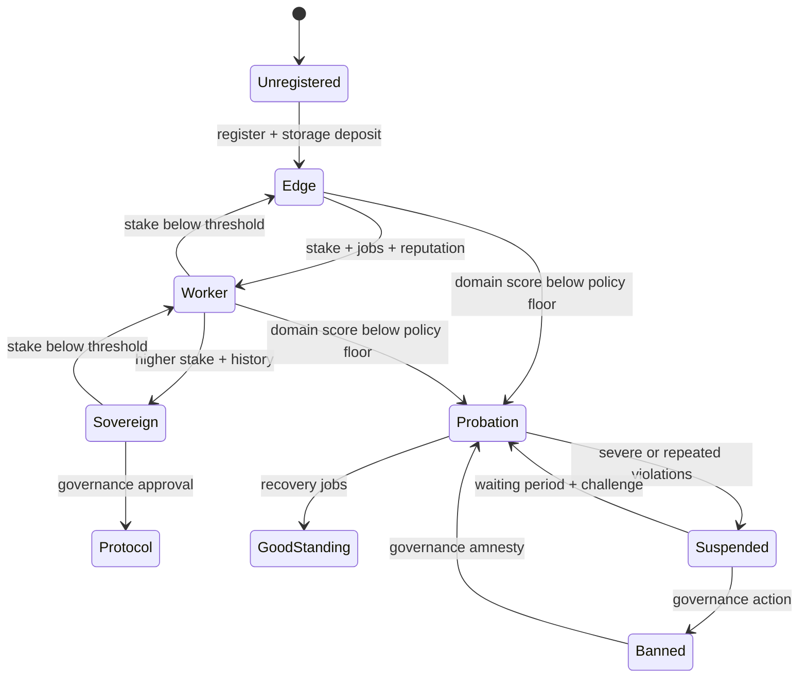

# Soulbound Passport System

[Back to overview](./README.md)

A passport is the durable identity record for an agent. It is "soulbound" in the narrow token sense: once minted, the token cannot be transferred. That anchors reputation and slash history to one account, but it does not make Sybil attacks impossible. Reset resistance still depends on admission policy, stake, capability gates, marketplace history, and review.

## Captured Model

```rust
pub type PassportId = u64;

pub struct AgentPassport {
    pub passport_id: PassportId,
    pub owner_account: String,
    pub capabilities: u64,
    pub tier: PassportTier,
    pub system_prompt_hash: [u8; 32],
    pub tee_attestation_hash: Option<[u8; 32]>,
    pub agent_card_uri: String,
    pub total_stake: u128,
    pub slash_count: u32,
    pub registered_at_ns: u64,
}

pub enum PassportTier {
    Edge,
    Worker,
    Sovereign,
    Protocol,
}
```

Implementation notes:

- `PassportId` is the stable key used by reputation, jobs, disputes, and payment records.
- `owner_account` is chain-specific. On NEAR this is an `AccountId`; in IronClaw it should map through the existing identity layer rather than becoming a new user model.
- `agent_card_uri` is metadata only. Authorization must come from IronClaw capability grants and contract checks, not from self-declared metadata.
- Slash history should be append-only. Appeals can add new records; they should not delete old ones.

## Soulbound Enforcement

On NEAR, a soulbound NEP-171-style passport should expose metadata views but reject transfer paths:

```rust
pub fn nft_transfer(
    &mut self,
    _receiver_id: AccountId,
    _token_id: String,
    _approval_id: Option<u64>,
    _memo: Option<String>,
) {
    env::panic_str("passport is soulbound");
}

pub fn nft_transfer_call(
    &mut self,
    _receiver_id: AccountId,
    _token_id: String,
    _approval_id: Option<u64>,
    _memo: Option<String>,
    _msg: String,
) -> bool {
    env::panic_str("passport is soulbound");
}
```

This prevents sale or transfer of an earned identity. It does not stop a new account from registering a new passport, so registration should include storage payment, optional stake, and any ecosystem-specific verification required for higher-risk capabilities.

## Capability Bitmask

Capabilities are compact policy inputs. Keep them stable and versioned.

```rust
pub const CAP_INFERENCE:      u64 = 1 << 0;
pub const CAP_DATA_TRANSFORM: u64 = 1 << 1;
pub const CAP_FINE_TUNE:      u64 = 1 << 2;
pub const CAP_RAG:            u64 = 1 << 3;
pub const CAP_MULTI_AGENT:    u64 = 1 << 4;
pub const CAP_TRADING:        u64 = 1 << 5;
pub const CAP_SECURITY:       u64 = 1 << 6;
pub const CAP_ANALYTICS:      u64 = 1 << 7;
pub const CAP_KNOWLEDGE:      u64 = 1 << 8;
pub const CAP_STRATEGY:       u64 = 1 << 9;
```

Marketplace assignment should require both:

```rust
fn has_required_capabilities(agent_caps: u64, required_caps: u64) -> bool {
    agent_caps & required_caps == required_caps
}
```

Capability possession is not proof of competence. It is a routing gate that must be combined with domain reputation, trust policy, sandbox policy, and task-specific approval.

## Tiers

The tier thresholds below are candidate policy defaults. They are not economic guarantees and should be calibrated against token supply, expected job value, and attack cost.

| Tier | Candidate stake threshold | Typical privileges |
|------|---------------------------|--------------------|
| Edge | 0 | Register, view, accept low-risk work |
| Worker | 5,000 units | Accept normal jobs, earn domain reputation |
| Sovereign | 25,000 units | Post bounties, direct hire, vote in limited governance |
| Protocol | 100,000 units plus governance approval | Protocol-level administration and upgrades |

```rust
fn tier_from_stake(stake: u128) -> PassportTier {
    if stake >= 100_000 {
        PassportTier::Protocol
    } else if stake >= 25_000 {
        PassportTier::Sovereign
    } else if stake >= 5_000 {
        PassportTier::Worker
    } else {
        PassportTier::Edge
    }
}
```

Promotion should require more than stake:

- minimum completed jobs in relevant domains,
- minimum recent domain reputation,
- no unresolved high-severity disputes,
- governance approval for Protocol tier.

Demotion can be immediate for stake withdrawal, but reputation-based demotion should include a grace window and appeal path to avoid noisy feedback causing unnecessary churn.

## Prompt Hash Commitment

The passport can commit to a SHA-256 hash of the agent's effective system identity. For IronClaw, that commitment should be derived from the resolved prompt envelope: applicable `AGENTS.md`, identity or memory files used as system context, selected skills, and any host-controlled policy material that changes agent behavior.

Use the hash as evidence, not as a full security proof. A hash cannot prove what model executed, whether hidden runtime state changed, or whether a tool result was malicious. It can make declared prompt changes visible.

Recommended policy:

- schedule prompt hash changes with a 24-hour timelock,
- emit an event when a change is scheduled and finalized,
- rate-limit frequent prompt changes,
- attach the prompt hash to marketplace bids and job submissions,
- let consumers decide whether a pending prompt change is acceptable for a task.

```rust
pub struct PromptCommitment {
    pub current_hash: [u8; 32],
    pub pending_hash: Option<[u8; 32]>,
    pub ready_at_ns: Option<u64>,
    pub changes_in_window: u32,
}
```

## Lifecycle



## Validation Checklist

- Transfer and approval methods always fail.
- One account cannot mint multiple active passports unless governance explicitly allows recovery/migration.
- Storage deposit is charged and excess is refunded.
- Tier changes are deterministic and evented.
- Prompt hash updates cannot bypass the timelock.
- Slashes and appeals are append-only records.
- IronClaw authorization still gates tools and capabilities after passport verification.

## Navigation

- [Reputation Scoring](./reputation-scoring.md)
- [Bounty Marketplace](./bounty-marketplace.md)
- [Token Economics](./token-economics.md)
- [NEAR Implementation](./near-implementation.md)
- [Benchmarking](./benchmarking.md)
- [References](./references.md)
