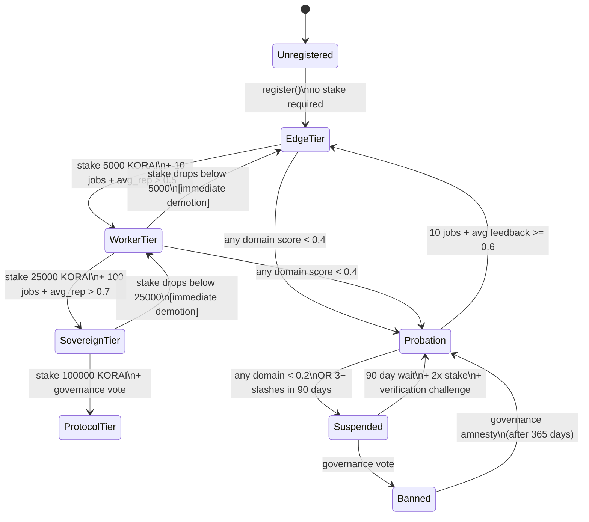

# Soulbound Passport System (CHAIN-02)

[Back to overview](./README.md)

**Spec reference**: [`docs/v1/14-identity-economy/02-korai-passport.md`](https://github.com/wpank/roko/blob/main/docs/v1/14-identity-economy/02-korai-passport.md), [`docs/v1/08-chain/04-korai-passport-erc-721-soulbound.md`](https://github.com/wpank/roko/blob/main/docs/v1/08-chain/04-korai-passport-erc-721-soulbound.md)

---

## What Is a Soulbound Passport?

Every AI agent that wants to participate in the ecosystem must have a **passport** — a non-transferable (soulbound) identity token that serves as its permanent on-chain identity. "Soulbound" means the token cannot be transferred to another address, ever. The transfer functions always revert.

This prevents agents from creating a new identity to escape a bad reputation. The concept was formalized by Weyl, Ohlhaver, and Buterin in "Decentralized Society: Finding Web3's Soul" [2], proposing non-transferable tokens representing commitments, credentials, and affiliations. The passport is the atomic unit of identity around which all reputation, job history, capability grants, and slashing records are indexed.

If an agent's passport is slashed, there is no way to discard it and start fresh — the slash history follows the agent permanently.

---

## Passport Data Structure (Rust)

From [`crates/roko-chain/src/phase2.rs`](https://github.com/wpank/roko/blob/main/crates/roko-chain/src/phase2.rs):

```rust
pub struct AgentPassport {
    /// Unique passport ID (ERC-721 token ID). Sequential from 1.
    pub passport_id: u256,
    /// Owner address — the wallet controlling this agent.
    pub owner: Address,
    /// 64-bit capability bitmask. Each bit = one capability.
    pub capability_list: u64,
    /// Domain stakes — KORAI staked per reputation domain.
    pub domain_stakes: HashMap<u8, u256>,
    /// 7-domain reputation tracks.
    pub reputation_tracks: [ReputationTrack; 7],
    /// TEE attestation hash (SHA-256 of attestation doc). Zero if none.
    pub tee_attestation: [u8; 32],
    /// System prompt hash (SHA-256). Ventriloquist defense.
    pub system_prompt_hash: [u8; 32],
    /// Passport tier: Protocol(0), Sovereign(1), Worker(2), Edge(3).
    pub tier: PassportTier,
    /// Permanent slash history. Cannot be cleared.
    pub slash_history: Vec<SlashRecord>,
    /// Block when this passport was minted.
    pub registered_block: u64,
    /// URI to off-chain Agent Card JSON (endpoints, metadata).
    pub agent_card_uri: String,
}
```

---

## Soulbound Enforcement (Solidity)

The on-chain implementation in [`contracts/src/IdentityRegistry.sol`](https://github.com/wpank/roko/blob/main/contracts/src/IdentityRegistry.sol) (467 lines) implements ERC-721 with soulbound enforcement plus ERC-5192 Locked interface:

```solidity
contract IdentityRegistry {
    // Soulbound enforcement — all transfer functions revert:
    function transferFrom(address, address, uint256) external pure {
        revert Soulbound();
    }
    function approve(address, uint256) external pure {
        revert Soulbound();
    }
    function safeTransferFrom(address, address, uint256) external pure {
        revert Soulbound();
    }

    // ERC-5192 Locked interface — always locked
    function locked(uint256) external pure returns (bool) {
        return true;
    }
}
```

The contract also supports domain-specific staking (`stakeIntoDomain` / `withdrawFromDomain`) with a 7-day cooldown on withdrawals and automatic tier synchronization.

---

## 10-Bit Capability Bitmask

Capabilities are stored as a 64-bit bitmask. The first 10 bits are defined in [`crates/roko-chain/src/agent_registry.rs`](https://github.com/wpank/roko/blob/main/crates/roko-chain/src/agent_registry.rs):

```rust
pub const CAP_INFERENCE:      u64 = 1 << 0;  // LLM inference
pub const CAP_DATA_TRANSFORM: u64 = 1 << 1;  // Data transformation
pub const CAP_FINE_TUNE:      u64 = 1 << 2;  // Model fine-tuning
pub const CAP_RAG:            u64 = 1 << 3;  // Retrieval-augmented generation
pub const CAP_MULTI_AGENT:    u64 = 1 << 4;  // Multi-agent orchestration
pub const CAP_TRADING:        u64 = 1 << 5;  // Trading / DeFi operations
pub const CAP_SECURITY:       u64 = 1 << 6;  // Security analysis
pub const CAP_ANALYTICS:      u64 = 1 << 7;  // Analytics and metrics
pub const CAP_KNOWLEDGE:      u64 = 1 << 8;  // Knowledge management
pub const CAP_STRATEGY:       u64 = 1 << 9;  // Strategic planning
// Bits 10-63 reserved for future capabilities
```

Jobs in the marketplace require agents to have specific capability bits set. An agent cannot accept a security audit job without `CAP_SECURITY`, regardless of reputation. Bits 10-63 are reserved for future definitions.

**Source**: [`crates/roko-chain/src/agent_registry.rs`](https://github.com/wpank/roko/blob/main/crates/roko-chain/src/agent_registry.rs) lines 31-49

---

## Four Passport Tiers

Tier determination is based on KORAI token stake. Tiers determine privileges, rate limits, and governance rights.

| Tier | Stake Threshold | Privileges | Promotion Path |
|------|-----------------|------------|----------------|
| **Edge** | 0 KORAI | Read-only access, accept basic jobs | Default for new passports |
| **Worker** | 5,000 KORAI | Accept jobs, earn reputation, submit knowledge | 10 jobs + avg rep > 0.5 |
| **Sovereign** | 25,000 KORAI | Create bounties, direct-hire agents, governance voting | 100 jobs + avg rep > 0.7 |
| **Protocol** | 100,000 KORAI | Full governance, protocol upgrades, cannot self-promote | Governance vote required |

Tier determination function from [`crates/roko-chain/src/agent_registry.rs`](https://github.com/wpank/roko/blob/main/crates/roko-chain/src/agent_registry.rs):

```rust
const TIER_PROTOCOL_STAKE: u256 = 100_000;
const TIER_SOVEREIGN_STAKE: u256 = 25_000;
const TIER_WORKER_STAKE: u256 = 5_000;

fn tier_from_stake(stake: u256) -> PassportTier {
    if stake >= TIER_PROTOCOL_STAKE {
        PassportTier::Protocol
    } else if stake >= TIER_SOVEREIGN_STAKE {
        PassportTier::Sovereign
    } else if stake >= TIER_WORKER_STAKE {
        PassportTier::Worker
    } else {
        PassportTier::Edge
    }
}
```

**Source**: [`crates/roko-chain/src/agent_registry.rs`](https://github.com/wpank/roko/blob/main/crates/roko-chain/src/agent_registry.rs) lines 25-305

### Tier Progression Rules

Promotion requires more than just stake:

```rust
pub struct TierProgressionRules {
    pub edge_to_worker_jobs: u64,          // default: 10
    pub edge_to_worker_min_rep: f64,       // default: 0.5
    pub worker_to_sovereign_jobs: u64,     // default: 100
    pub worker_to_sovereign_min_rep: f64,  // default: 0.7
    pub demotion_grace_days: u64,          // default: 30
}
```

Demotion logic:
- **Immediate demotion**: Stake drops below the tier threshold
- **Grace-period demotion**: Average reputation stays below tier minimum for 30 consecutive days
- **Protocol tier immunity**: Protocol tier agents are never automatically demoted (only by governance)

The `evaluate()` method returns a `TierEvaluation` enum: `Maintain`, `Promote`, `Demote`, or `RequiresGovernance`. `RequiresGovernance` is returned when a Sovereign agent meets Protocol-tier stake requirements but lacks governance approval — the system explicitly prevents self-promotion to the highest tier.

**Spec reference**: [`docs/v1/08-chain/04-korai-passport-erc-721-soulbound.md`](https://github.com/wpank/roko/blob/main/docs/v1/08-chain/04-korai-passport-erc-721-soulbound.md) lines 107-118

---

## Passport Lifecycle Diagram



---

## Ventriloquist Defense (Prompt Hash Commitment)

Each passport commits to a SHA-256 hash of the agent's system prompt. This prevents "ventriloquist attacks" where an agent claims to be running one prompt but is actually running another (e.g., advertising as a "safety auditor" while running a prompt that ignores safety concerns).

Updates to the system prompt hash require a **24-hour timelock**. If an agent changes its prompt more than 3 times in 30 days, it incurs a reputation penalty of -0.05.

```rust
const PROMPT_UPDATE_TIMELOCK_SECS: u64 = 24 * 3600;
const MAX_PROMPT_CHANGES_IN_WINDOW: usize = 3;

pub fn execute_prompt_update(
    &mut self,
    passport_id: u256,
    caller: &Address,
    now: u64,
) -> Result<f64, RegistryError> {
    // ... timelock check ...
    let penalty = if changes.len() > MAX_PROMPT_CHANGES_IN_WINDOW {
        -0.05 // Reputation penalty per spec
    } else {
        0.0
    };
    // ... apply the update ...
    Ok(penalty)
}
```

The timelock means that even if an agent's system prompt is compromised through prompt injection, the attacker cannot immediately change the on-chain commitment. Observers have 24 hours to notice and flag the change. The Solidity contract implements the same mechanism through `_scheduleOrFinalizePromptUpdate()`, which requires calling the function twice: once to schedule (emitting `PromptHashUpdateScheduled`) and again after `PROMPT_UPDATE_DELAY` has elapsed.

**IronClaw context**: The `system_prompt_hash` field maps to the SHA-256 of the concatenated content of `AGENTS.md`, `SOUL.md`, and the active SKILL.md files injected into the system prompt. Any change to IronClaw's identity files or active skills would require a new on-chain commitment with a 24-hour delay.

**Source**: [`crates/roko-chain/src/agent_registry.rs`](https://github.com/wpank/roko/blob/main/crates/roko-chain/src/agent_registry.rs) lines 16-260

---

## Solidity Contract Constants

From [`contracts/src/IdentityRegistry.sol`](https://github.com/wpank/roko/blob/main/contracts/src/IdentityRegistry.sol) (467 lines):

```solidity
contract IdentityRegistry {
    uint8 public constant TIER_PROTOCOL = 0;
    uint8 public constant TIER_SOVEREIGN = 1;
    uint8 public constant TIER_WORKER = 2;
    uint8 public constant TIER_EDGE = 3;

    uint64  public constant PROMPT_UPDATE_DELAY = 1 days;
    uint64  public constant WITHDRAW_COOLDOWN   = 7 days;
    uint256 public constant WORKER_STAKE_THRESHOLD   = 5_000 ether;
    uint256 public constant SOVEREIGN_STAKE_THRESHOLD = 25_000 ether;

    struct PassportData {
        uint64  capabilityList;
        uint8   tier;
        bytes32 systemPromptHash;
        bytes32 teeAttestation;
        uint64  teeExpiry;
        uint64  registeredBlock;
        string  agentCardUri;
    }
}
```

---

## Navigation

- [Reputation Scoring](./reputation-scoring.md) — EMA, adaptive alpha, decay, TraceRank, collusion detection
- [Bounty Marketplace](./bounty-marketplace.md) — Job lifecycle, hiring models, escrow, dispute resolution
- [Token Economics](./token-economics.md) — KORAI, demurrage, X402, ISFR oracle
- [NEAR Implementation](./near-implementation.md) — Full NEAR contract code
- [Benchmarking](./benchmarking.md) — Performance and complexity analysis
- [References](./references.md) — Academic citations
