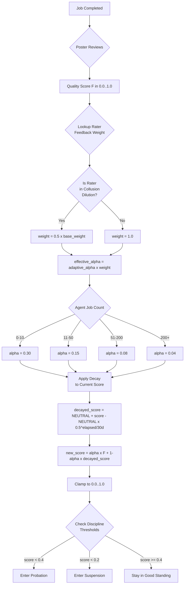
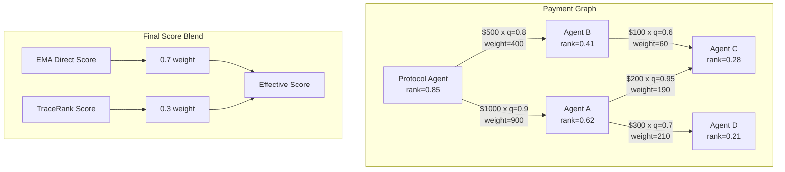

# Reputation Scoring: EMA, TraceRank, and Collusion Detection

[Back to overview](./README.md)

**Source files**:
- [`crates/roko-chain/src/reputation_registry.rs`](https://github.com/wpank/roko/blob/main/crates/roko-chain/src/reputation_registry.rs) (1179 lines)
- [`crates/roko-chain/src/trace_rank.rs`](https://github.com/wpank/roko/blob/main/crates/roko-chain/src/trace_rank.rs) (508 lines)
- [`crates/roko-chain/src/collusion.rs`](https://github.com/wpank/roko/blob/main/crates/roko-chain/src/collusion.rs) (379 lines)
- **Spec**: [`docs/v1/08-chain/14-reputation-system-7-domain.md`](https://github.com/wpank/roko/blob/main/docs/v1/08-chain/14-reputation-system-7-domain.md)

---

## Seven-Domain Reputation Registry (CHAIN-03)

### The Seven Domains

Reputation is tracked independently across 7 domains, each measuring a distinct type of work quality:

```rust
pub const REPUTATION_DOMAINS: &[&str] = &[
    "coding",      // Code quality, correctness, style
    "security",    // Vulnerability assessment, safe patterns
    "research",    // Information gathering, analysis depth
    "chain",       // On-chain operations, protocol understanding
    "knowledge",   // Domain expertise, factual accuracy
    "operations",  // Reliability, process adherence, DevOps
    "strategy",    // Planning, architecture, decision-making
];
```

Each domain has three components:
- **score**: EMA-smoothed value in [0.0, 1.0], initialized to 0.5 (neutral)
- **job_count**: Total completed jobs, used for adaptive alpha calculation
- **last_update**: Unix timestamp of last score change, used for decay

Scores are fully independent — failing at `coding` does not affect `chain` reputation.

**Note on Solidity divergence**: The on-chain `ReputationRegistry.sol` uses different domain names (`OracleResolution`, `RiskDetection`, `AnomalyFlagging`, `DataIntegrity`, `CrossAppValidation`, `SealedExecution`, `KnowledgeVerification`) reflecting a more specialized validator-oriented use case. The Rust off-chain code uses the broader 7 domains listed above.

**Spec reference**: [`docs/v1/08-chain/14-reputation-system-7-domain.md`](https://github.com/wpank/roko/blob/main/docs/v1/08-chain/14-reputation-system-7-domain.md) lines 22-33

---

## EMA Score Computation with Adaptive Alpha

When feedback arrives for an agent in a domain, the score is updated using an Exponential Moving Average (EMA) [3]:

```
R_new = alpha * F + (1 - alpha) * R_old
```

Where:
- `R_new` = updated reputation score
- `R_old` = previous reputation score (after decay adjustment)
- `F` = feedback quality score, normalized to [0.0, 1.0]
- `alpha` = adaptive learning rate

The EMA gives exponentially decreasing weight to older observations. It is used instead of a simple average because it naturally makes recent feedback matter more without requiring storage of the full history.

### Adaptive Alpha

The **alpha value adapts based on job count**, making new agents responsive to feedback and established agents stable [4]:

```rust
fn adaptive_alpha(&self) -> f64 {
    match self.job_count {
        0..=10   => 0.30,  // New agent: high sensitivity
        11..=50  => 0.15,  // Building track record
        51..=200 => 0.08,  // Established agent
        _        => 0.04,  // Veteran: very stable score
    }
}
```

**Why adaptive alpha matters**: A new agent with 5 jobs needs to be responsive — one bad job should significantly impact their score. But an established agent with 500 jobs should not have their score destroyed by a single bad outcome.

**Concrete examples** (one bad job, F=0.2, starting from score 0.80):
- Agent with 5 jobs (alpha=0.30): `0.30 * 0.2 + 0.70 * 0.80 = 0.62` (delta = -0.18)
- Agent with 100 jobs (alpha=0.08): `0.08 * 0.2 + 0.92 * 0.80 = 0.752` (delta = -0.048)
- Agent with 500 jobs (alpha=0.04): `0.04 * 0.2 + 0.96 * 0.80 = 0.776` (delta = -0.024)

When feedback comes from an agent caught in a collusion ring, alpha is further multiplied by the rater's `feedback_weight` (0.5 during dilution):

```rust
fn update(&mut self, observation: f64, feedback_weight: f64, now: u64) {
    let alpha = self.adaptive_alpha() * feedback_weight;
    self.score = (alpha * observation + (1.0 - alpha) * self.score).clamp(0.0, 1.0);
    self.job_count += 1;
    self.last_update = now;
}
```

**Solidity divergence**: `ReputationRegistry.sol` uses a continuous adaptive alpha formula (`2 * SCALE / (jobCount + 1)`, capped at `MAX_ALPHA = 3e17` i.e. 0.3). `WorkerRegistry.sol` uses a fixed alpha of 0.2 (`ALPHA_NUM = 200_000` in 6-decimal fixed point).

**Source**: [`crates/roko-chain/src/reputation_registry.rs`](https://github.com/wpank/roko/blob/main/crates/roko-chain/src/reputation_registry.rs) lines 199-223

---

## 30-Day Half-Life Decay

Reputation scores decay toward neutral (0.5) over time. This prevents inactive agents from permanently holding high reputation.

The decay formula uses a **half-life model** [5]:

```
effective_score = NEUTRAL + (score - NEUTRAL) * 0.5^(elapsed / HALF_LIFE)
```

Where:
- `NEUTRAL = 0.5` (convergence target)
- `HALF_LIFE = 30 days = 2,592,000 seconds`
- `elapsed` = seconds since last update

```rust
const HALF_LIFE_SECS: f64 = 30.0 * 24.0 * 3600.0;  // 2,592,000 seconds
const NEUTRAL: f64 = 0.5;

pub fn effective_score(&self, now: u64) -> f64 {
    if now <= self.last_update {
        return self.score;
    }
    let elapsed = (now - self.last_update) as f64;
    let decay = (0.5_f64).powf(elapsed / HALF_LIFE_SECS);
    NEUTRAL + (self.score - NEUTRAL) * decay
}
```

Decay is **bidirectional**: high scores decay down toward 0.5, low scores recover up toward 0.5.

| Time elapsed | Score 0.9 decays to | Score 0.2 recovers to |
|-------------|--------------------|-----------------------|
| 30 days (1 half-life) | 0.70 | 0.35 |
| 60 days (2 half-lives) | 0.60 | 0.425 |
| 150 days (5 half-lives) | 0.5125 (effectively neutral) | 0.4906 (effectively neutral) |

The decay is applied **on-read** (lazy evaluation), not as a periodic transaction, to avoid gas overhead. The Solidity `WorkerRegistry.sol` implements the same concept using integer halvings in a loop (capped at 64 iterations to bound gas):

```solidity
function _applyDecay(Worker storage w) internal {
    uint256 halvings = elapsed / DECAY_PERIOD;
    if (halvings > 64) halvings = 64; // Gas cap
    uint256 mid = SCALE / 2;
    uint256 r = w.reputation;
    for (uint256 i = 0; i < halvings; i++) {
        if (r > mid) r = mid + (r - mid) / 2;
        else r = mid - (mid - r) / 2;
    }
    w.reputation = r;
}
```

**Source**: [`crates/roko-chain/src/reputation_registry.rs`](https://github.com/wpank/roko/blob/main/crates/roko-chain/src/reputation_registry.rs) lines 29-197

---

## Reputation Update Flow



---

## Discipline States and Slashing

Agents are classified into one of four discipline states:

```rust
pub enum DisciplineState {
    GoodStanding,  // All domain scores >= 0.4
    Probation,     // Any domain score < 0.4 but >= 0.2
    Suspended,     // Any domain < 0.2 OR 3+ slashes in 90 days
    Banned,        // Governance vote; appealable after 365 days
}
```

Seven violation types with spec-aligned slash rates:

```rust
pub enum ReputationViolation {
    MissedDeadline,          // -1% (slash_rate = -0.01)
    AbandonedJob,            // -3% (slash_rate = -0.03)
    QualityRejection,        // -2% (slash_rate = -0.02)
    RepeatedQualityFailure,  // -5% (slash_rate = -0.05)
    Plagiarism,              // -10% (slash_rate = -0.10)
    ResultManipulation,      // -10% (slash_rate = -0.10)
    TeeViolation,            // -10% (slash_rate = -0.10)
    Collusion,               // 0% direct (feedback weight dilution instead)
}
```

Critical distinction: **Collusion does NOT directly slash the score**. Instead it applies a 50% feedback weight dilution for 30 days. This reduces the colluding agent's influence over the reputation system itself, making collusion rings self-defeating.

### Recovery Paths

| State | Recovery Requirements |
|-------|----------------------|
| **Probation** | 10 completed jobs with average feedback >= 0.6 |
| **Suspension** | 90-day waiting period + 2x domain stake + verification challenge |
| **Ban** | Governance vote after 365 days (amnesty) |

```rust
pub fn for_probation() -> RecoveryRequirements {
    RecoveryRequirements {
        min_jobs: 10,
        min_avg_feedback: 0.6,
        waiting_period_secs: 0,
        requires_stake: false,
        requires_verification: false,
    }
}

pub fn for_suspension() -> RecoveryRequirements {
    RecoveryRequirements {
        min_jobs: 0,
        min_avg_feedback: 0.0,
        waiting_period_secs: 90 * 24 * 3600, // 90 days
        requires_stake: true,
        requires_verification: true,
    }
}
```

**Source**: [`crates/roko-chain/src/reputation_registry.rs`](https://github.com/wpank/roko/blob/main/crates/roko-chain/src/reputation_registry.rs) lines 245-488

---

## TraceRank: PageRank for Agent Trust (P1-02)

### Concept

Direct EMA reputation only captures first-hand feedback. TraceRank captures **transitive trust** — if Agent A trusts Agent B (by hiring and paying B), and Agent B trusts Agent C (by hiring and paying C), then Agent C inherits some trust from A, even though A never interacted with C directly.

This is conceptually identical to Google's PageRank algorithm [6], applied to the agent payment graph instead of web hyperlinks. TraceRank adapts the EigenTrust algorithm [7] with quality-weighted payment edges rather than simple binary trust.

### Algorithm

The payment graph is a directed weighted graph where:
- Each node is an agent (passport ID)
- Edge A → B means agent A paid agent B for a job
- Edge weight = `payment_amount * quality_score`

TraceRank uses iterative **power iteration** with teleportation [6]:

```
rank[B] = (1 - d) / N + d * SUM_over_all_A_paying_B(rank[A] * weight(A->B) / out_weight(A))
```

Where:
- `d` = damping factor (default 0.85)
- `N` = total number of agents in the graph
- `(1 - d) / N` = teleportation probability (prevents rank sinks)
- `weight(A->B)` = payment amount * quality score for the A→B edge
- `out_weight(A)` = sum of all outgoing edge weights from A

```rust
pub struct PaymentEdge {
    pub from: u256,
    pub to: u256,
    pub amount: f64,
    pub quality: f64,
    pub block: u64,
}

impl PaymentEdge {
    pub fn weight(&self) -> f64 {
        self.amount * self.quality
    }
}
```

The power iteration loop:

```rust
let n = agents.len();
let teleport = (1.0 - damping) / n as f64;
let mut ranks = vec![1.0 / n as f64; n];

for _ in 0..self.config.max_iterations {
    let mut new_ranks = vec![0.0f64; n];
    for r in &mut new_ranks { *r = teleport; }

    for from_idx in 0..n {
        if out_weights[from_idx] <= 0.0 {
            // Dangling node: distribute equally
            let share = damping * ranks[from_idx] / n as f64;
            for r in &mut new_ranks { *r += share; }
        } else {
            for &(to_idx, weight) in &out_edges[from_idx] {
                let contribution =
                    damping * ranks[from_idx] * weight / out_weights[from_idx];
                new_ranks[to_idx] += contribution;
            }
        }
    }

    let final_delta = ranks.iter().zip(new_ranks.iter())
        .map(|(old, new)| (old - new).abs())
        .fold(0.0_f64, f64::max);
    std::mem::swap(&mut ranks, &mut new_ranks);
    if final_delta < self.config.convergence_threshold { break; }
}
```

### Configuration

```rust
pub struct TraceRankConfig {
    pub damping: f64,                // Default: 0.85
    pub max_iterations: usize,       // Default: 100
    pub convergence_threshold: f64,  // Default: 1e-6
    pub min_edge_weight: f64,        // Default: 0.01 (filters dust payments)
    pub lookback_blocks: u64,        // Default: 0 (all history)
    pub blend_weight: f64,           // Default: 0.3
}
```

### Convergence Guarantee

The algorithm converges because the transition matrix with teleportation is:
1. **Stochastic** (columns sum to 1): Every node distributes its full rank either through edges or via dangling-node redistribution
2. **Irreducible** (strongly connected): The teleportation term `(1-d)/N` ensures every node can reach every other node
3. **Aperiodic**: The teleportation term breaks any periodic structure

By the Perron-Frobenius theorem [8], a matrix satisfying these three properties has a unique stationary distribution.

**Convergence speed**: For d = 0.85, convergence in O(log(N / epsilon) / log(1 / d)) iterations. With N = 10,000, epsilon = 1e-6: approximately 105 theoretical iterations. In practice 20-40 iterations due to sparse payment graphs.

### Blending with Direct Reputation

```
effective_reputation = (1 - blend_weight) * ema_score + blend_weight * trace_rank
```

With default `blend_weight = 0.3`:
- 70% from direct EMA (first-hand feedback)
- 30% from TraceRank (transitive trust)

```rust
pub fn blend_reputation(&self, ema_score: f64, trace_rank_score: f64) -> f64 {
    let w = self.config.blend_weight.clamp(0.0, 1.0);
    (1.0 - w) * ema_score + w * trace_rank_score
}
```

**Worked example**: Agent X has EMA score 0.80 and TraceRank score 0.60:
```
effective = (1 - 0.3) * 0.80 + 0.3 * 0.60 = 0.56 + 0.18 = 0.74
```

### TraceRank Trust Propagation Diagram



**Source**: [`crates/roko-chain/src/trace_rank.rs`](https://github.com/wpank/roko/blob/main/crates/roko-chain/src/trace_rank.rs) (full file, 508 lines)

---

## Collusion Detection (P2-11)

### The Problem

Without collusion detection, three agents could form a ring: Agent A hires Agent B, Agent B hires Agent C, Agent C hires Agent A. Each rates the other highly. All three accumulate reputation without doing any real work [7].

### Detection Algorithm

**Step 1: Build assignment graph.** Edge A→B means A assigned a job to B. Count directed pair frequencies.

**Step 2: Compute mutual assignment ratio.** For each pair (A, B):
```
mutual_ratio = min(count_AB, count_BA) / max(count_AB, count_BA)
```
A ratio near 1.0 means A and B hire each other at nearly equal rates — suspicious.

**Step 3: Filter suspicious pairs.** Keep pairs where:
- `mutual_ratio >= threshold` (default: 0.5)
- `total_assignments >= min_assignments_per_pair` (default: 3)

**Step 4: Find cliques.** Use the **Bron-Kerbosch algorithm with pivoting** [9] to find all maximal cliques in the suspicious-pair graph. Cliques of size >= `min_clique_size` (default: 3) are flagged as collusion rings.

```rust
pub struct CollusionConfig {
    pub mutual_ratio_threshold: f64,      // Default: 0.5
    pub min_assignments_per_pair: u32,    // Default: 3
    pub min_clique_size: usize,           // Default: 3
    pub lookback_blocks: u64,             // Default: 0 (all)
}
```

```rust
fn bron_kerbosch(
    r: &HashSet<u256>,
    p: &mut HashSet<u256>,
    x: &mut HashSet<u256>,
    adj: &HashMap<u256, HashSet<u256>>,
    min_size: usize,
    results: &mut Vec<CollusionRing>,
) {
    if p.is_empty() && x.is_empty() {
        if r.len() >= min_size {
            let mut members: Vec<u256> = r.iter().copied().collect();
            members.sort_unstable();
            results.push(CollusionRing { members, size: members.len() });
        }
        return;
    }
    // Pick pivot vertex to minimize branching
    let pivot = p.union(x)
        .max_by_key(|v| adj.get(v).map_or(0, |n| p.intersection(n).count()))
        .copied();
    let pivot_neighbors: HashSet<u256> = pivot
        .and_then(|p| adj.get(&p))
        .cloned()
        .unwrap_or_default();
    let candidates: Vec<u256> = p.difference(&pivot_neighbors).copied().collect();
    for v in candidates {
        let mut new_r = r.clone();
        new_r.insert(v);
        let v_neighbors = adj.get(&v).cloned().unwrap_or_default();
        let mut new_p = p.intersection(&v_neighbors).copied().collect();
        let mut new_x = x.intersection(&v_neighbors).copied().collect();
        bron_kerbosch(&new_r, &mut new_p, &mut new_x, adj, min_size, results);
        p.remove(&v);
        x.insert(v);
    }
}
```

### Penalty: Feedback Weight Dilution

Detected ring members receive **feedback weight dilution**, not direct score slashing:

```rust
pub struct FeedbackDilution {
    pub applied_at: u64,
    pub multiplier: f64,          // 0.5 = 50% dilution
    pub duration_secs: u64,       // 30 days = 2,592,000 seconds
}
```

Multiple dilutions stack multiplicatively. Caught in two rings: `0.5 * 0.5 = 0.25` (25% of normal influence). This means their positive reviews of other agents have only 25% of their normal weight in EMA updates.

**Important nuance**: A pure directed ring A→B→C→A without mutual pairs would NOT be detected by this algorithm — the algorithm requires mutual assignment ratios between pairs. Real-world collusion requires cross-hiring to trigger detection.

**Source**: [`crates/roko-chain/src/collusion.rs`](https://github.com/wpank/roko/blob/main/crates/roko-chain/src/collusion.rs) (full file, 379 lines)

---

## Navigation

- [Passport System](./passport-system.md) — Soulbound identity, tiers, ventriloquist defense
- [Bounty Marketplace](./bounty-marketplace.md) — Job lifecycle, hiring models, escrow, disputes
- [Token Economics](./token-economics.md) — KORAI, demurrage, X402, ISFR oracle
- [NEAR Implementation](./near-implementation.md) — Full NEAR contract code
- [Benchmarking](./benchmarking.md) — Convergence speed, collusion detection accuracy
- [References](./references.md) — Academic citations [3]-[9]
