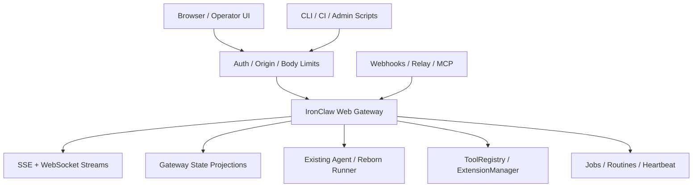
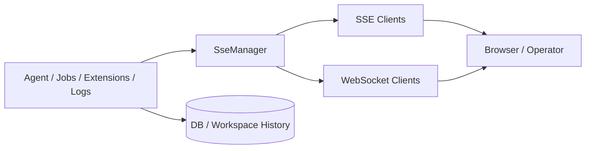

# Control Plane & API Server Architecture

> Operator APIs, streaming status, fleet projection, webhook ingress, and scoped
> credential boundaries around IronClaw's existing agent execution path.

> **Self-contained implementation note**: captured Roko path-like references are
> provenance labels only. Prefer IronClaw-native modules and companion artifacts
> when designing changes.

> **Companion artifacts**: See
> [reference/examples/operator-debugging-runbooks.md](../reference/examples/operator-debugging-runbooks.md),
> [implementation/schemas/04-canonical-event-and-persistence-contract.md](../implementation/schemas/04-canonical-event-and-persistence-contract.md),
> and [implementation/rollout/04-feature-threat-models.md](../implementation/rollout/04-feature-threat-models.md).

## Related Documents

- [../execution-verification/orchestrator-swarm.md](../execution-verification/orchestrator-swarm.md) — process supervision and fleet lifecycle concepts.
- [mcp-editor-integration.md](mcp-editor-integration.md) — JSON-RPC/session/streaming protocol boundaries.
- [plugin-extension.md](plugin-extension.md) — extension lifecycle, event ingress, and capability manifests.

---

## Table of Contents

1. [Why AI Agent Systems Need a Control Plane](#1-why-ai-agent-systems-need-a-control-plane)
2. [Architecture Overview](#2-architecture-overview)
3. [The Control Plane: roko-serve](#3-the-control-plane-roko-serve)
4. [HTTP API Routes](#4-http-api-routes)
5. [Real-Time Streaming](#5-real-time-streaming)
6. [Fleet Aggregation](#6-fleet-aggregation)
7. [Per-Agent Sidecar: roko-agent-server](#7-per-agent-sidecar-roko-agent-server)
8. [Heartbeat / Health Monitoring](#8-heartbeat-health-monitoring)
9. [Relay Bridge](#9-relay-bridge)
10. [Authentication & Security](#10-authentication-security)
11. [Webhook Dispatch Loop](#11-webhook-dispatch-loop)
12. [Inference Gateway (Scoped-Credential Agents)](#12-inference-gateway-scoped-credential-agents)
13. [Comparison with IronClaw](#13-comparison-with-ironclaw)
14. [Key Architectural Insights](#14-key-architectural-insights)
15. [Summary](#15-summary)
16. [References](#16-references)

---

## 1. Why AI Agent Systems Need a Control Plane

A control plane makes agent execution observable and controllable without
forking the agent loop. In IronClaw, browser/operator concerns belong around
`src/channels/web/`, routines, jobs, and extension lifecycle. Planning,
execution, approvals, checkpointing, retries, and completion remain in the
existing agent/Reborn paths.

Actionable responsibilities:

- Publish runtime state and events for humans and dashboards.
- Accept authenticated operator commands.
- Project session, job, routine, extension, and gateway status.
- Enforce auth, origin, body-limit, rate-limit, and scrubbing controls.
- Bridge external ingress into untrusted channel or trigger boundaries.

---

## 2. Architecture Overview



Captured control-plane/sidecar names are useful decomposition hints, not crate
names IronClaw should adopt by default.

---

## 3. The Control Plane: roko-serve

Map captured `roko-serve` ideas onto IronClaw's web gateway. Keep platform
concerns in `src/channels/web/platform/` and feature handlers in
`src/channels/web/features/` or the transitional handler tree.

### 3.1 AppState — The Shared Kernel

IronClaw equivalent: `GatewayState` plus manager slots and feature-specific
dependencies. Add shared control-plane state only when it is truly cross-cutting
and cannot live in the owning module.

Rules:

- Router composition may know feature handlers; other platform modules should
  stay handler-agnostic.
- Keep lock scope short and avoid network calls while holding locks.
- Store operator-facing snapshots as projections, not duplicate sources of
  truth.

### 3.2 Event Types — The ServerEvent Enum

IronClaw source of truth for gateway events is `src/channels/web/types.rs`.
Extend it when the browser/operator contract needs a new event. Avoid parallel
event enums that must be manually synchronized.

Event payloads should be:

- Typed.
- Redacted.
- Stable enough for UI clients.
- Correlated by thread/job/routine/extension IDs where relevant.

### 3.3 EventBus

IronClaw already has `SseManager` and WebSocket plumbing. Add a replay ring only
if reconnect gaps need server-side event recovery beyond existing history APIs.

Replay requirements:

- Process-scoped IDs or durable cursors, explicitly documented.
- Bounded memory.
- Auth applied before replay.
- No secret-bearing payloads in retained envelopes.

### 3.4 StateHub — The Projection Engine

Use projections for dashboard views that would otherwise poll multiple routes:
jobs, routines, extension readiness, gateway health, and cost/status summaries.
Projection state should derive from existing DB/runtime state and events.

---

## 4. HTTP API Routes

Operator routes should remain authenticated unless they are intentionally public
health/static assets. Route ownership should follow the gateway module map in
`src/channels/web/CLAUDE.md`.

### 4.1 Route Categories

Use categories, not a monolithic route file:

| Category | IronClaw home |
|----------|---------------|
| Chat and gates | `features/chat/` |
| Extensions and setup | `features/extensions/` |
| Jobs and sandbox files | `features/jobs/` |
| Routines and heartbeat controls | `features/routines/` |
| Logs and status | `features/logs/`, `features/status/` |
| OAuth/pairing | `features/oauth/`, `features/pairing/` |
| Transitional surfaces | `handlers/` |

### 4.2 Public Routes (No Auth)

Keep public routes minimal: liveness/static assets and explicitly public OAuth
callback surfaces. Do not add unauthenticated operator, file, memory, tool,
extension, or job routes.

---

## 5. Real-Time Streaming

Use the gateway's existing SSE/WebSocket surfaces before adding new streams.



### 5.1 Server-Sent Events (SSE)

SSE is the default browser-friendly event stream. If a new SSE endpoint is
added, register its auth behavior explicitly and preserve reconnect semantics.

### 5.2 WebSocket Streaming

WebSocket is for bidirectional chat/operator interaction. It must keep bearer
auth and origin validation. Query-string token support, where required by
browser APIs, should be endpoint-scoped and reviewed.

### 5.3 Projection Streaming (CQRS Delta Delivery)

Projection streams should send an initial snapshot followed by deltas. Keep the
snapshot builder and delta reducer testable through the route or manager that
production uses.

### 5.4 Workflow WebSocket

If a workflow-specific socket is needed, it should wrap existing thread/job/gate
state. It must not own workflow execution.

---

## 6. Fleet Aggregation

Fleet aggregation is useful only when IronClaw is supervising multiple local
workers, sidecars, or remote runtimes. Start with read-only health/status
projection; add control verbs later.

Required fields:

- Runtime identity and owner.
- Health/readiness.
- Capability summary.
- Last heartbeat and last error.
- Auth scope used for control actions.

Do not merge tenant state or secrets across runtimes.

---

## 7. Per-Agent Sidecar: roko-agent-server

Sidecars are optional adapters for external workers. They should expose health,
logs, and controlled commands, not an alternate agent implementation.

### 7.1 Why a Sidecar

Use a sidecar when a worker cannot share the in-process gateway but still needs
operator visibility or lifecycle control.

### 7.2 Feature-Gated Routes

Every sidecar route should be behind explicit config and auth. Disabled means no
listener and no route registration.

### 7.3 Sidecar Route Inventory

Useful route classes:

- Health/readiness.
- Capability manifest.
- Redacted logs/events.
- Controlled stop/restart when authorized.

Avoid general-purpose command execution endpoints.

### 7.4 Capabilities Manifest

A sidecar manifest should describe capabilities, versions, resource limits, and
allowed control verbs. It should not carry secrets.

### 7.5 Agent Registration (ERC-8004)

If registration with a reputation or chain system is added, keep it outside the
gateway hot path. Registration metadata must not become authorization.

---

## 8. Heartbeat / Health Monitoring

IronClaw already has heartbeat/routine concepts. Control-plane health should
consume those signals rather than creating an independent scheduler.

Health states should distinguish:

```text
live | ready | degraded | shutting_down | failed
```

Readiness should fail during shutdown or when required dependencies are not
usable. Health output should avoid fingerprinting and secret leakage.

---

## 9. Relay Bridge

Relay/webhook ingress must enter as untrusted input unless it goes through the
private trigger-worker-owned trusted path. Product adapters, product workflow,
first-party capabilities, and host-runtime handlers must not mint
`TrustedInboundTurnRequest`.

Bridge requirements:

- Verify sender auth before parsing high-cost payloads.
- Apply body limits and rate limits.
- Normalize into typed incoming messages or routine events.
- Redact before logs and SSE.
- Preserve correlation IDs for audit.

---

## 10. Authentication & Security

Security invariants from `src/channels/web/CLAUDE.md` and
`src/NETWORK_SECURITY.md` apply to any control-plane addition.

### 10.1 Auth Layers

- Bearer auth for protected HTTP routes.
- Endpoint-scoped query-token fallback only for browser APIs that cannot set
  headers.
- Origin validation for browser WebSocket upgrades.
- OIDC/DB-token paths only through existing gateway auth extractors.

### 10.2 Secret Scrubbing

Scrub responses, logs, SSE events, WebSocket frames, and error messages that may
contain secrets. Raw provider tokens, session IDs, webhook secrets, and MCP
session IDs must not reach clients.

### 10.3 Rate Limiting and Body Cap

Apply route-appropriate request limits before expensive parsing or downstream
calls. Large attachment/file routes need explicit budgets and tests.

### 10.4 Lock Acquisition Ordering

Document lock order when new shared state is introduced. Avoid holding gateway
state locks while awaiting DB, network, LLM, MCP, or process operations.

---

## 11. Webhook Dispatch Loop

Webhook handling should be narrow and auditable:

1. Authenticate sender.
2. Enforce body/content limits.
3. Parse into a typed request.
4. Deduplicate if the provider supplies an event ID.
5. Dispatch through channel/routine/trigger boundaries.
6. Return a bounded response.

Webhook code must not bypass submission parsing, approvals, or cost guardrails.
If a webhook starts agent work, it should look like any other external channel
ingress to the agent.

---

## 12. Inference Gateway (Scoped-Credential Agents)

An inference gateway can keep provider keys out of untrusted workers, but it is
high risk because it centralizes model access and cost.

Minimum requirements:

- Per-worker scoped token or grant.
- Cost guard before provider calls.
- Request/response redaction.
- Model allowlist per scope.
- Audit by worker, job, model, and caller.
- Revocation on worker cleanup.

Do not expose raw provider API keys to containers or sidecars when a scoped
proxy is available.

---

## 13. Comparison with IronClaw

### 13.1 What IronClaw Has Today

IronClaw has the main pieces needed for a local-first control plane:

- Browser gateway with auth, SSE, and WebSocket paths.
- Feature routes for chat, jobs, routines, extensions, logs, status, OAuth, and
  pairing.
- Shared agentic loop, approvals, tool safety, and scheduler/routine concepts.
- Extension lifecycle and tool registry surfaces.

Verify exact route lists in `src/channels/web/CLAUDE.md` and source before
implementation.

### 13.2 Feature Gap Analysis

Potential gaps worth considering:

- Durable replay or projection streams for operator dashboards.
- Unified lifecycle events across jobs, routines, extensions, and MCP servers.
- Read-only fleet health if multiple runtimes are supervised.
- Scoped inference proxy for untrusted workers.

Avoid adopting captured control-plane pieces that duplicate gateway/platform
logic.

### 13.3 Integration Sketch: EventBus Replay Ring

```rust
struct EventEnvelope<T> {
    id: EventCursor,
    payload: T,
}
```

Add only if clients cannot rebuild state from history/snapshots. Keep the ring
bounded and process/durability semantics explicit.

### 13.4 Integration Sketch: Output-Side Secret Scrubbing

Scrubbing should sit at shared output boundaries:

```text
handler/tool/process output -> scrubber -> log/SSE/HTTP response
```

Tests should drive a real handler or manager, not only the scrubber helper.

### 13.5 Integration Sketch: Readiness Probe

Readiness should report whether the gateway can accept meaningful work. It may
check shutdown state, required stores, and critical manager availability. Keep
liveness cheap.

### 13.6 Integration Sketch: Projection Streaming

Projection stream shape:

```json
{ "type": "state", "projection": "extensions", "data": {} }
{ "type": "delta", "projection": "extensions", "data": {} }
```

Route tests should cover auth, initial snapshot, delta emission, disconnect, and
redaction.

### 13.7 Integration Sketch: Per-Agent Sidecar (Future)

Start with a read-only sidecar contract. Control verbs require stronger auth,
auditing, and rollback behavior.

### 13.8 Prioritized Enhancement Roadmap

1. Tighten gateway event contracts and scrubbing.
2. Add projection snapshots where polling hurts UX.
3. Add bounded replay only for streams that need it.
4. Add fleet health before fleet control.
5. Add sidecars or inference proxy only with concrete worker needs.

### 13.9 Security Rollout Checklist

- Auth path reviewed.
- Origin/CORS behavior reviewed.
- Body and stream limits set.
- Rate limits set where abuse is plausible.
- Secrets redacted in logs/events/responses.
- Caller-level tests added.
- Rollback behavior documented for high-risk routes.

---

## 14. Key Architectural Insights

- The control plane observes and commands; it does not plan or execute agent
  work itself.
- Gateway platform modules own auth, streaming, static assets, and shared state.
- Feature modules own product behavior.
- Projections are derived read models, not new sources of truth.
- Sidecars and relays are untrusted unless explicitly authenticated and scoped.
- Scoped credentials reduce blast radius but require strong audit and revocation.

---

## 15. Summary

Selective adoption is the right posture. IronClaw should strengthen its existing
web gateway with better projections, event contracts, and scoped worker
boundaries before introducing a separate control-plane service. Any new
operator surface must preserve auth, origin checks, body limits, rate limits,
secret scrubbing, and the single existing agent execution path.

---

## 16. References

Local references to keep aligned:

- [mcp-editor-integration.md](mcp-editor-integration.md)
- [plugin-extension.md](plugin-extension.md)
- [../execution-verification/orchestrator-swarm.md](../execution-verification/orchestrator-swarm.md)
- [../reference/examples/operator-debugging-runbooks.md](../reference/examples/operator-debugging-runbooks.md)
- [../implementation/schemas/04-canonical-event-and-persistence-contract.md](../implementation/schemas/04-canonical-event-and-persistence-contract.md)
- [../implementation/rollout/04-feature-threat-models.md](../implementation/rollout/04-feature-threat-models.md)
- `src/channels/web/CLAUDE.md`
- `src/agent/CLAUDE.md`
- `src/NETWORK_SECURITY.md`
