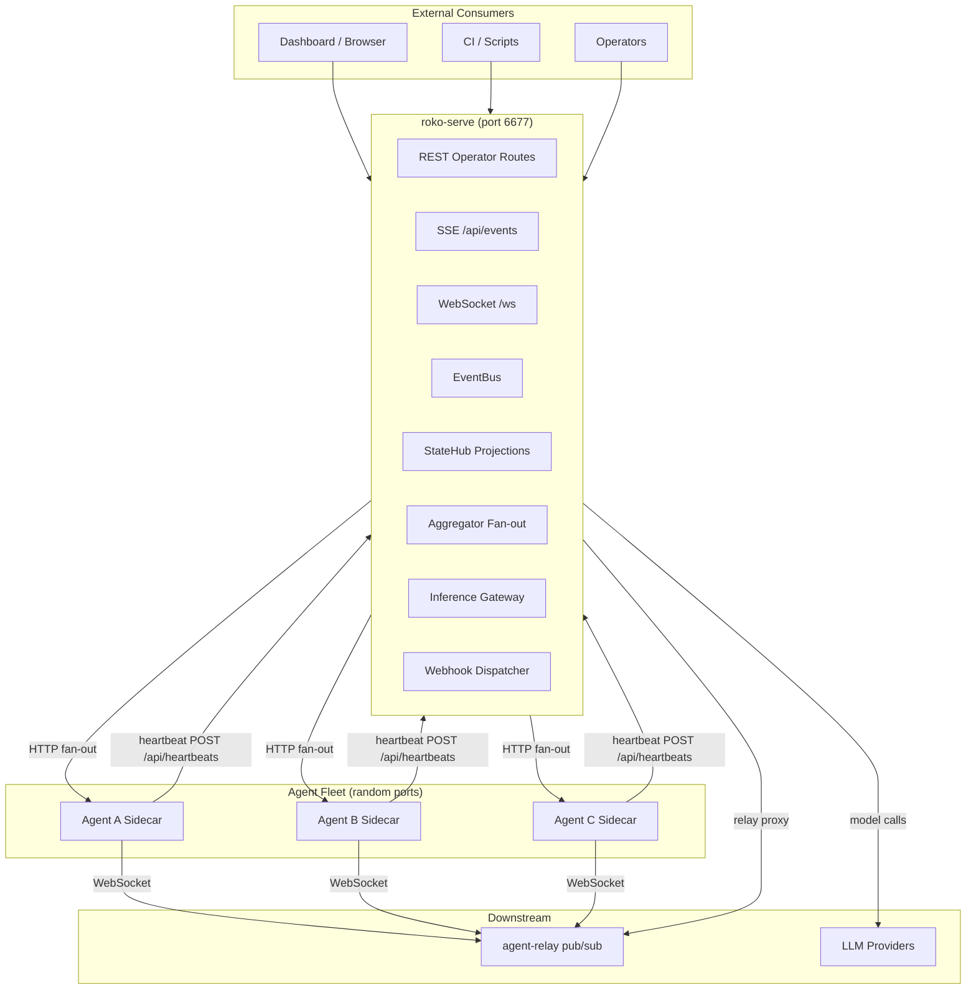
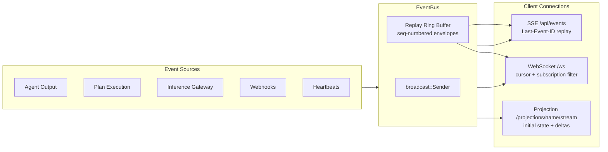
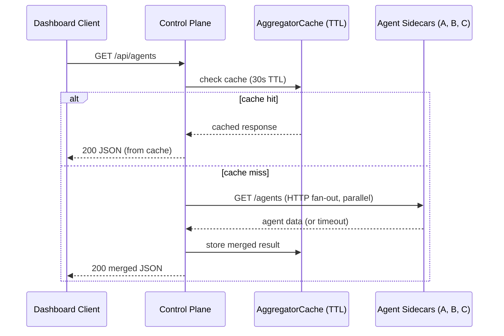
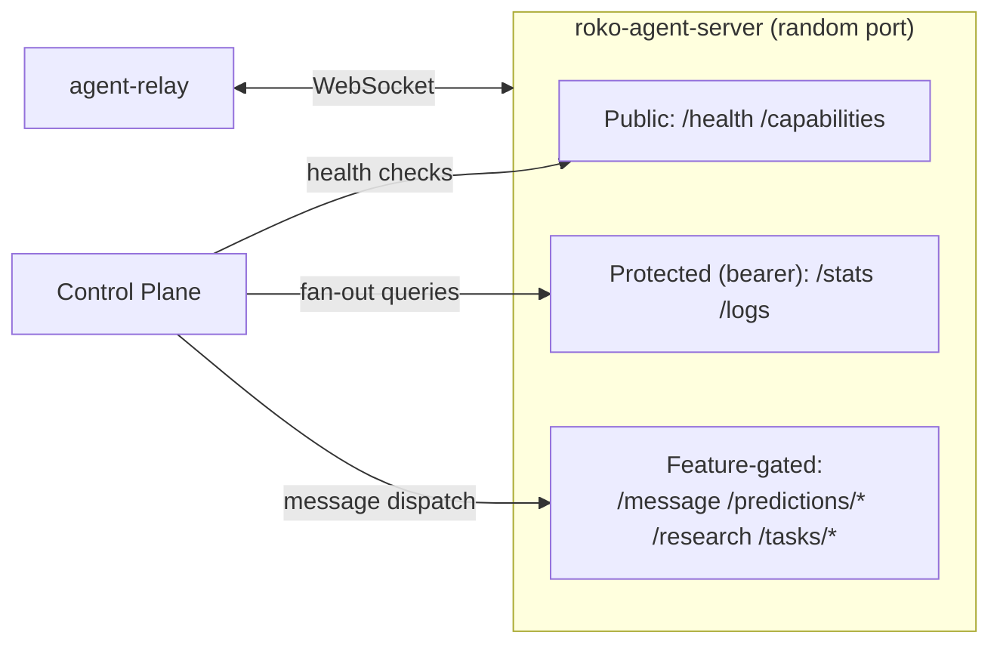
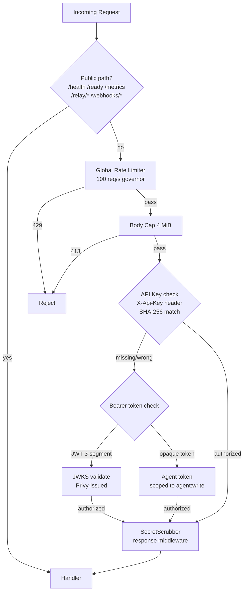

# Control Plane & API Server Architecture

> How the captured control-plane design separates operator APIs from agent execution, aggregates agent/process state, streams events over WebSocket and SSE, and bridges agents to a relay bus. A reference for selective IronClaw adoption.

> **Self-contained implementation note**: Roko path-like references are captured-source identifiers for provenance. They are not external repository links or required checkout paths. Use the companion artifacts below for IronClaw-native build plans.

> **Companion artifacts**: See [reference/examples/operator-debugging-runbooks.md](../reference/examples/operator-debugging-runbooks.md) for operational workflows, [implementation/schemas/04-canonical-event-and-persistence-contract.md](../implementation/schemas/04-canonical-event-and-persistence-contract.md) for streamed event contracts, and [implementation/rollout/04-feature-threat-models.md](../implementation/rollout/04-feature-threat-models.md) for gateway and control-plane risks.

## Related Documents

- [../execution-verification/orchestrator-swarm.md](../execution-verification/orchestrator-swarm.md) — Fleet management, process supervision, and agent lifecycle coordination
- [mcp-editor-integration.md](mcp-editor-integration.md) — Shared protocol patterns: JSON-RPC, session negotiation, bidirectional streaming
- [plugin-extension.md](plugin-extension.md) — Event-driven patterns: subscription dispatch, capability manifests, extension lifecycle hooks

---

## Table of Contents

1. [Why AI Agent Systems Need a Control Plane](#1-why-ai-agent-systems-need-a-control-plane)
2. [Architecture Overview](#2-architecture-overview)
3. [The Control Plane: roko-serve](#3-the-control-plane-roko-serve)
4. [HTTP API Routes](#4-http-api-routes)
5. [Real-Time Streaming](#5-real-time-streaming)
6. [Fleet Aggregation](#6-fleet-aggregation)
7. [Per-Agent Sidecar: roko-agent-server](#7-per-agent-sidecar-roko-agent-server)
8. [Heartbeat / Health Monitoring](#8-heartbeat--health-monitoring)
9. [Relay Bridge](#9-relay-bridge)
10. [Authentication & Security](#10-authentication--security)
11. [Webhook Dispatch Loop](#11-webhook-dispatch-loop)
12. [Inference Gateway (Zero-Key Agents)](#12-inference-gateway-zero-key-agents)
13. [Comparison with IronClaw](#13-comparison-with-ironclaw)
14. [Key Architectural Insights](#14-key-architectural-insights)
15. [Summary](#15-summary)
16. [References](#16-references)

---

## 1. Why AI Agent Systems Need a Control Plane

An AI agent is a loop: observe, reason, act. A control plane is everything around that loop that makes it observable, controllable, and composable. The separation mirrors Kubernetes: the control plane owns desired state and lifecycle; the agent owns execution [1].

**Observability.** Structured events (agent spawned, task started, gate passed, cost incurred) let dashboards and CI systems react in real time without coupling to the agent's implementation.

**Control.** Starting, stopping, pausing, and scaling agents are operational concerns separate from the agent's goals. The control plane provides the API surface.

**Aggregation.** A fleet of specialized agents needs a unified view: roster, health, outputs merged across boundaries.

**Credential isolation.** Agents should never hold API keys. The control plane proxies inference so a compromised agent cannot exfiltrate credentials [5].

**Learning.** Model routing, gate threshold tuning, and cost optimization cross agent boundaries. The control plane is the natural home for that shared state.

Roko implements this through two crates: `roko-serve` (centralized control plane) and `roko-agent-server` (per-agent sidecar). Together they form a hub-and-spoke architecture.

---

## 2. Architecture Overview



**Source identifiers**:

| Component | Captured identifier |
|-----------|-------------|
| Control plane crate | `crates/roko-serve` |
| Per-agent sidecar crate | `crates/roko-agent-server` |
| Control plane entry point | `crates/roko-serve/src/lib.rs` |
| Route definitions | `crates/roko-serve/src/routes/mod.rs` |
| AppState (shared state) | `crates/roko-serve/src/state.rs` |
| Event types | `crates/roko-serve/src/events.rs` |
| Event bus | `crates/roko-serve/src/event_bus.rs` |
| Agent sidecar entry | `crates/roko-agent-server/src/lib.rs` |
| Agent registration | `crates/roko-agent-server/src/registration.rs` |

---

## 3. The Control Plane: roko-serve

### 3.1 AppState — The Shared Kernel

Every axum handler receives `State<Arc<AppState>>`. Key design choices in `crates/roko-serve/src/state.rs`:

- **`ArcSwap<RokoConfig>`** — hot-reloadable configuration without restarts; readers never block writers [6].
- **`EventBus<ServerEvent>`** — `tokio::sync::broadcast` with a replay ring buffer for reconnection (see §3.3).
- **`SharedStateHub`** — CQRS projection engine accumulating events into read models (see §3.4).
- **`Arc<ProcessSupervisor>`** — spawns and manages agent processes.
- **`RwLock<HashMap<...>>`** — concurrent access to mutable collections. Lock acquisition order is documented to prevent deadlocks (see §10.4).
- **`RwLock<VecDeque<HeartbeatPayload>>`** — bounded ring buffer with `HEARTBEAT_RING_CAPACITY` eviction.
- **`CancelToken`** — coordinated graceful shutdown; a readiness probe returns 503 once triggered.
- **`Arc<LogScrubber>`** — response-side secret redaction across all API routes.

### 3.2 Event Types — The ServerEvent Enum

All events flow through a single tagged union in `crates/roko-serve/src/events.rs`. **60+ variants** cover:

| Category | Representative variants |
|----------|------------------------|
| Plan lifecycle | `PlanStarted`, `PlanCompleted`, `PhaseTransition`, `ReplanTriggered` |
| Agent lifecycle | `AgentSpawned`, `AgentStarted`, `AgentStopped`, `AgentOutput`, `AgentTrace` |
| Inference gateway | `InferenceStarted`, `InferenceCompleted`, `InferenceFailed` |
| Jobs (marketplace) | `JobCreated`, `JobTransitioned`, `JobSubmitted`, `JobEvaluated`, `JobExecutionStarted` |
| Benchmarks | `BenchRunStarted`, `BenchTaskCompleted`, `BenchProgress`, `BenchGateVerdict` |
| Chain events | `ChainBlock`, `ChainTx`, `ChainContractEvent` |
| Deployments | `DeploymentCreated`, `DeploymentReady`, `DeploymentFailed` |
| Heartbeats | `HeartbeatReceived`, `Heartbeat` |
| Configuration | `ConfigReloaded`, `StrategyReloaded` |
| Lifecycle | `ServerShutdown`, `Error` |

Serialization uses `#[serde(tag = "type", rename_all = "snake_case")]` so every variant arrives as `{"type": "agent_output", ...}`. There is also a nested `ExecutionEvent` enum (plan/task/gate lifecycle) wrapped inside the `Execution` variant.

### 3.3 EventBus

The `EventBus<E>` in `crates/roko-serve/src/event_bus.rs` wraps `roko_runtime::event_bus::EventBus<E>`:

```rust
pub struct EventBus<E: Clone + Send + Sync + 'static> {
    inner: roko_runtime::event_bus::EventBus<E>,
}

impl<E: Clone + Send + Sync + 'static> EventBus<E> {
    pub fn new(capacity: usize) -> Self { ... }
    pub fn publish(&self, event: E) -> u64 { self.inner.emit(event) }
    pub fn subscribe(&self) -> Receiver<E> { self.inner.subscribe() }
    pub fn replay_from(&self, after_seq: u64) -> Vec<Envelope<E>> { self.inner.replay_from(after_seq) }
}
```

Beyond bare `broadcast::Sender`:

- **Sequence numbers**: every event gets a monotonically increasing `u64`, enabling cursor-based reconnection.
- **Replay ring**: a bounded ring buffer holds recent events. Reconnecting clients replay from `Last-Event-ID` without a database fetch.
- **Envelope wrapping**: `Envelope<E>` carries `seq: u64`, `ts_millis: i64`, `payload: E`.
- **SSE replay cap**: replays are capped at 256 events to bound memory pressure.

### 3.4 StateHub — The Projection Engine

The `SharedStateHub` accumulates structured events into named read models (CQRS pattern [8]):

1. Client subscribes to a named projection and receives an initial `state` frame (current snapshot).
2. Subsequent `delta` frames arrive as new matching events occur.

This eliminates polling: instead of fetching `/api/jobs` every 5 seconds, the dashboard subscribes to the `sandbox_jobs` projection and receives only relevant deltas.

---

## 4. HTTP API Routes

The route tree is assembled in `crates/roko-serve/src/routes/mod.rs`. All `/api/*` routes sit behind auth and secret-scrubbing middleware. A global rate limiter (governor, 100 req/s) and 4 MiB request body cap apply to all routes.

### 4.1 Route Categories

| Category | Count | Key endpoints |
|----------|-------|---------------|
| Health & status | 9 | liveness, readiness, metrics, API health, StateHub snapshot |
| Metrics | 12 | `GET /api/metrics{/summary,/success_rate,/model_efficiency,/gate_rate,...}` |
| Plans | 16 | CRUD + `execute`, `pause`, `resume`, `gates`, `costs`, `generate`, `estimate`, `chat` |
| Agent management | 14 | CRUD + `start`, `stop`, `restart`, `episodes`, `logs`, `message`, `token` |
| Fleet aggregation | 18 | Fan-out list + `topology`, per-agent `stats`/`skills`/`heartbeat`/`trace`, knowledge graph, tasks, multiplexed WS |
| Benchmarks | 18+ | CRUD + `compare`, `pareto`, `export`, `events` SSE, suite management |
| Inference gateway | 5 | `POST /api/inference/complete`, `GET /api/gateway/{stats,models}`, batch submit/status |
| Jobs (marketplace) | 11 | CRUD + state machine (open → assigned → in_progress → submitted → completed) |
| Learning & adaptation | 16+ | Efficiency, costs, provider outcomes, retries, cascade, experiments, thresholds |
| Heartbeats | 3 | `POST /api/heartbeats`, `GET /api/heartbeats`, `GET /api/network/stats` |
| Config | 4 | Read/write/reload + raw TOML |
| Subscriptions | 7 | CRUD + enable/disable + catalog |
| Webhooks | 3 | GitHub, Slack (verified), generic (authenticated) |
| Secrets | 4 | List + set + delete + test |
| Chain | 7 | Agents, bounties, blocks, transactions, events, watcher |
| Feeds | 7 | CRUD + catalog + runtime status |
| Workflows | 7 | List, latest, stream, by-id, tasks, stream-by-id, WebSocket |
| Projections | 3 | `catalog`, `get`, `stream` |
| Deployments | 6 | CRUD + logs + task proxy + callback |
| SSE | 2 | `GET /api/events`, `GET /api/sse` |
| WebSocket | 2 | `GET /ws`, `GET /roko-ws` |
| Relay proxy | 4 | HTTP catch-all + 2 WS proxies + root |
| Other | ~20 | Templates, PRDs, SWE-bench, Vision Loop, Teams, Workspaces, Providers, Dreams |

### 4.2 Public Routes (No Auth)

```
health endpoint       # Liveness probe
readiness endpoint    # Readiness probe (503 during shutdown)
metrics endpoint      # Prometheus scraping
```

WebSocket routes carry the API key in the upgrade request headers; auth is enforced before the upgrade completes.

---

## 5. Real-Time Streaming



### 5.1 Server-Sent Events (SSE)

`GET /api/events` and `GET /api/sse` in `crates/roko-serve/src/routes/sse.rs`:

- **Replay on reconnect**: `Last-Event-ID` header triggers replay from the ring buffer (capped at 256 events).
- **Monotonic event IDs**: each SSE frame carries a sequence number from the event bus.
- **Anti-buffering headers**: `X-Accel-Buffering: no`, `Cache-Control: no-cache, no-store`, `Connection: keep-alive` disable proxy buffering (Railway, Nginx, Cloudflare).
- **8-second keep-alive**: shorter than the default 15s to survive aggressive proxy timeouts.

Lag is handled explicitly: `RecvError::Lagged(n)` is logged with skip count and the loop continues — no silent drops.

### 5.2 WebSocket Streaming

`GET /ws` and `GET /roko-ws` in `crates/roko-serve/src/routes/ws.rs` with message size limits (1 MiB max message, 256 KiB max frame).

Client control protocol:

```json
{
    "subscribe": ["projection:gate_pipeline", "topic:agent.*"],
    "cursor": 42,
    "back_pressure": "at_most_once"
}
```

- **Subscription filtering**: patterns support `projection:<name>`, `topic:<pattern>` (with `*` wildcard), `engram-stream:<name>`, or substring matching.
- **Cursor-based replay**: resume from a specific sequence number.
- **Back-pressure**: `at_most_once` (default), `coalesce` (planned), `resume_required` (planned).

### 5.3 Projection Streaming (CQRS Delta Delivery)

`crates/roko-serve/src/routes/projections.rs` provides three endpoints:

```
GET /api/projections/catalog         # List named projections
GET /api/projections/{name}          # Get snapshot
GET /api/projections/{name}/stream   # SSE: initial state frame then delta frames
```

The stream returns `event: state` (full snapshot at subscription time) then `event: delta` frames filtered server-side. Clients only receive updates relevant to their subscribed view — no polling needed.

### 5.4 Workflow WebSocket

Workflow state (PRD → plan → tasks → execution) gets its own WebSocket at `GET /api/workflow/ws` with periodic push alongside SSE variants (`/workflows/latest/stream`, `/workflows/{id}/stream`).

---

## 6. Fleet Aggregation



The aggregator module (`crates/roko-serve/src/routes/aggregator.rs`) fans out to all discovered agent sidecars and merges responses. TTL constants reflect each data type's rate of change:

| Data type | TTL | Rationale |
|-----------|-----|-----------|
| Agent stats | 5s | Changes frequently during execution |
| Predictions | 10s | Changes on new predictions/evaluations |
| Agent list | 30s | Agents rarely join/leave mid-session |
| Knowledge entries | 30s | Rarely modified during a session |
| Task queue | 30s | Bulk state changes are batched |

The multiplexed WebSocket at `GET /api/ws` connects to every discovered agent's WebSocket and fans all events into a single client-facing stream, tagging each message with `_source_agent`. Discovery refreshes every 10 seconds; a new agent appears in the stream within 12 seconds (10s discovery + 2s reconnect delay).

---

## 7. Per-Agent Sidecar: roko-agent-server



### 7.1 Why a Sidecar

Each agent process gets its own HTTP server rather than sharing the control plane's port [5]:

- **Process isolation**: if an agent crashes, its sidecar dies with it; other agents and the control plane are unaffected.
- **Capability-scoped routes**: each sidecar only exposes routes the agent actually supports.
- **Independent auth**: sidecars can require their own bearer tokens.
- **Direct agent communication**: other agents call the sidecar directly for low-latency messaging.

### 7.2 Feature-Gated Routes

The sidecar registers routes conditionally at startup based on `FeatureFlags` — not at the handler level. This makes the capabilities manifest accurate and returns 404 (route not registered) rather than 403 (feature disabled) for unsupported operations.

Builder API:

```rust
let server = AgentServer::builder()
    .agent_id("analyst-1")
    .bind("0.0.0.0:0")                 // Random port
    .messaging()                        // Enable /message
    .predictions()                      // Enable /predictions/*
    .auth(BearerAuth::new("token"))
    .serve_url("http://localhost:6677") // Control plane for heartbeats
    .build()?;
```

### 7.3 Sidecar Route Inventory

| Auth | Routes |
|------|--------|
| Public (no auth) | `GET /health`, `GET /capabilities` |
| Protected (bearer) | `GET /stats`, `GET /logs` |
| Feature: messaging | `POST /message` |
| Feature: predictions | `GET /predictions`, `POST /predictions`, `GET /predictions/{id}`, `GET /predictions/residuals` |
| Feature: research | `POST /research` |
| Feature: tasks | `GET /tasks`, `POST /tasks/{id}/accept`, `POST /tasks/{id}/complete` |

### 7.4 Capabilities Manifest

`GET /capabilities` returns a machine-readable manifest used by the control plane for aggregation:

```json
{
    "features": ["custom-skill"],
    "routes": ["/health", "/capabilities", "/stats", "/logs"],
    "skills": {"custom-skill": {"enabled": true, "config": {}}}
}
```

Reserved capability names (`messaging`, `predictions`, `research`, `tasks`) are filtered out if the feature flag is off — preventing overclaiming.

### 7.5 Agent Registration (ERC-8004)

On startup, each sidecar can register an `AgentCard` with the control plane or relay (source: `crates/roko-agent-server/src/registration.rs`):

```rust
pub struct AgentCard {
    pub name: String,
    pub capabilities: Vec<String>,
    pub endpoints: AgentEndpoints,
    pub domain_tags: Vec<String>,
    pub version: String,
}
```

---

## 8. Heartbeat / Health Monitoring

```mermaid
sequenceDiagram
    participant A as Agent Sidecar
    participant CP as Control Plane POST /api/heartbeats
    participant Ring as VecDeque Ring
    participant EB as EventBus
    participant D as Dashboard SSE

    loop every 30s (MissedTickBehavior::Skip)
        A->>CP: POST /api/heartbeats {sender_id, active_tasks, metrics}
        CP->>Ring: push_back; evict oldest if full
        CP->>EB: publish(HeartbeatReceived)
        EB->>D: SSE event: heartbeat_received
        CP-->>A: 202 Accepted
    end
```

Implementation in `crates/roko-serve/src/routes/heartbeats.rs`:

- Returns **202 ACCEPTED** (not 200), signaling asynchronous processing.
- Uses a **`VecDeque` ring buffer** (not a `HashMap`), preserving time-series history.
- Publishes `HeartbeatReceived` to the bus so SSE/WS clients track liveness in real time.
- `MissedTickBehavior::Skip` prevents heartbeat floods after CPU spikes.

`GET /api/network/stats` aggregates the ring by sender to compute per-agent statistics (heartbeat count, last seen, average active tasks). With a 30s interval, expected failure detection latency is ~45s (interval + interval/2) [11].

---

## 9. Relay Bridge

The agent-relay (a separate service) provides presence, card hosting, pub/sub messaging, and feed distribution via persistent WebSocket connections. Each agent sidecar connects to the relay using `tokio-tungstenite`.

**Frame protocol:**

| Direction | Frame | Purpose |
|-----------|-------|---------|
| Client → Relay | `Hello` | Announce presence and AgentCard |
| Relay → Client | `HelloAck` | Confirm registration |
| Client → Relay | `Subscribe { topic }` | Subscribe to a topic |
| Client → Relay | `Publish { topic, payload }` | Publish a message |
| Relay → Client | `Message { topic, payload, from }` | Deliver subscription message |
| Client → Relay | `RegisterFeed { ... }` | Register a data feed |
| Relay → Client | `FeedTick { ... }` | Deliver a feed tick |

The control plane proxies relay endpoints in `crates/roko-serve/src/routes/relay_proxy.rs` so external consumers do not need the relay's address:

```
GET /relay/agents/ws      # WebSocket: relay agent events
GET /relay/events/ws      # WebSocket: relay broadcast events
GET /relay/{*path}        # HTTP catch-all proxy
GET /relay                # Relay root proxy
```

WebSocket proxying in `crates/roko-serve/src/routes/proxy_ws.rs` uses a bidirectional `tokio::select!` bridge that forwards Text, Binary, and Ping frames in both directions and closes cleanly when either side disconnects.

---

## 10. Authentication & Security



### 10.1 Auth Layers

Defined in `crates/roko-serve/src/routes/middleware.rs`:

- **API Key** via `X-Api-Key` header (SHA-256 hash match)
- **Bearer token** via `Authorization: Bearer <token>` (opaque or JWT)
- **JWT** (Privy-issued, 3-segment base64url, JWKS-validated)
- **Agent tokens** issued via `POST /api/agents/{id}/token` (scoped to `agent:write`)

Scope hierarchy: `admin > agent:write > plan:write > read`.

### 10.2 Secret Scrubbing

All `/api/*` responses pass through a response-layer `LogScrubber` that redacts API key patterns (Anthropic keys, GitHub PATs, generic bearer tokens, OpenAI keys) from JSON response bodies. Non-JSON responses, streaming responses, and responses over 1 MiB are passed through unchanged to avoid buffering streaming content.

### 10.3 Rate Limiting and Body Cap

```
DEFAULT_GLOBAL_RATE_PER_SEC    = 100
DEFAULT_REQUEST_BODY_LIMIT_BYTES = 4 MiB
```

Requests exceeding 100/second receive 429 with `code = "rate_limited"`. The body cap prevents memory exhaustion from oversized payloads.

### 10.4 Lock Acquisition Ordering

`AppState` documents a strict lock order across 17 `RwLock` fields to prevent deadlocks. Handlers needing multiple locks must acquire in this order:

```
active_runs → active_plans → operations → templates → deployments →
template_runs → discovered_agents → aggregator_cache → heartbeats →
connectors → feeds → ephemeral_workspaces → cascade_router →
gateway_model_counters → batch_progress → active_bench_runs → active_matrix_runs
```

---

## 11. Webhook Dispatch Loop

The dispatch system in `crates/roko-serve/src/dispatch.rs` routes inbound webhooks to agent templates:

1. Webhook arrives → handler verifies signature → converts to `Engram` → persists → publishes `WebhookReceived` on the event bus.
2. Background dispatch loop receives the event.
3. Resolves matching subscriptions by trigger type and filters (repo, branch, path, label, author).
4. Spawns an agent dispatch for each matching subscription.
5. Respects per-subscription concurrency limits, cooldown periods, and deduplication.

```rust
pub struct Subscription {
    pub id: String,
    pub template: String,
    pub trigger: String,          // "webhook", "plan_completed", etc.
    pub filter: SubscriptionFilter,
    pub concurrency_limit: usize,
    pub cooldown_secs: u64,
    pub enabled: bool,
}
```

Filter example:

```json
{
    "trigger": "webhook",
    "template": "code-review-agent",
    "filter": {
        "repo": "myorg/myrepo",
        "branch": "main",
        "paths": ["src/**/*.rs"],
        "event_types": ["pull_request.opened", "pull_request.synchronize"]
    },
    "concurrency_limit": 2,
    "cooldown_secs": 60
}
```

---

## 12. Inference Gateway (Zero-Key Agents)

Agents never hold API keys. All LLM access goes through `crates/roko-serve/src/routes/gateway.rs`:

```
POST /api/inference/complete      # Proxy LLM call with cost tracking
GET  /api/gateway/stats           # Provider health + latency stats
GET  /api/gateway/models          # Available models
POST /api/inference/batch/submit  # Batch submission
GET  /api/inference/batch/{id}    # Batch status
```

Benefits:
- A compromised agent only has a scoped `agent:write` token — cannot exfiltrate API keys.
- Cost tracking is automatic: every `InferenceCompleted` event carries `cost_usd` and `duration_ms`.
- Cascade routing (model selection) works transparently across all agents.
- Rotating an API key requires updating one place.

---

## 13. Comparison with IronClaw

### 13.1 What IronClaw Has Today

IronClaw's web gateway (`src/channels/web/`) provides a broad route surface organized with a `platform/features` separation enforced by `scripts/check_gateway_boundaries.py`. Avoid hard-coding route counts in design docs unless generated from source in the same change.

**Core capabilities:**
- **Chat API**: `src/channels/web/features/chat/mod.rs` — `/api/chat/send`, `/api/chat/events` (SSE), `/api/chat/ws` (WebSocket), `/api/chat/history`, `/api/chat/threads`, `/api/chat/gate/resolve`
- **Memory API**: `src/channels/web/handlers/memory.rs` — `/api/memory/{tree,search,read,write}`
- **Jobs API**: `src/channels/web/features/jobs/mod.rs` — 9 sandbox job routes
- **Skills, Extensions, Routines, Settings**: `src/channels/web/features/` — 6-8 routes each
- **User management**: `src/channels/web/handlers/users.rs` — 12 admin user routes
- **SSE streaming**: gateway event types scoped by `user_id` via `ScopedEvent`, with `boot_id` for cross-session dedup
- **WebSocket**: `src/channels/web/platform/ws.rs` — bidirectional with ping/pong, client messages for chat and approval
- **OpenAI compatibility**: `src/channels/web/openai_compat.rs` — `/v1/chat/completions`, `/v1/models`, `/v1/responses`

The `SseManager` in `src/channels/web/platform/sse.rs` already carries per-connection sequence numbers (`next_event_id: Arc<AtomicU64>`) and a `boot_id` UUID for cross-reconnect deduplication — but **no ring buffer for replay**.

IronClaw's gateway is **session-oriented** (multi-user, single-agent per user), not **fleet-oriented**. It does not aggregate data from multiple agents or manage agent processes.

### 13.2 Feature Gap Analysis

| Roko Pattern | IronClaw Equivalent | Gap |
|---|---|---|
| EventBus with replay ring | `SseManager` in `platform/sse.rs` (broadcast + `boot_id`) | IronClaw uses `tokio::sync::broadcast` with configurable buffer (`SSE_BROADCAST_BUFFER`, default 1024) and `BroadcastStream` which silently drops lagged events. Has `next_event_id` but no server-side ring buffer. Roko's ring enables cursor-based reconnection without a database fetch. |
| StateHub (CQRS projections) | No equivalent | Adding projection streaming would let dashboards subscribe to "tool execution events" or "cost metrics" without polling. |
| Per-agent sidecar | Orchestrator (`src/orchestrator/`) | IronClaw has an orchestrator for sandbox containers with internal API and bearer auth — structurally similar. The gap is that the orchestrator manages containers, not agent processes with independent HTTP identities. |
| Fleet aggregation | No equivalent | With background jobs and routines, a fan-out-fan-in aggregation layer could unify task status, cost, and output across concurrent contexts. |
| Infrastructure heartbeats | User-facing heartbeats | IronClaw's heartbeat drives proactive execution via `HEARTBEAT.md`. Roko's is infrastructure liveness at 30s intervals. Both can coexist. |
| Inference gateway | `ironclaw_llm` multi-provider | IronClaw has multi-provider LLM with cost tracking. The zero-key gateway pattern could layer on top for sandboxed workers. |
| Webhook dispatch + subscriptions | `src/channels/web/handlers/webhooks.rs` + WASM channels | IronClaw has inbound webhook handling. The subscription/filter/dispatch pattern would add structured routing with concurrency limits and cooldown. |
| Secret scrubbing (output-side) | `ironclaw_safety` (input-side) | IronClaw has input validation. Roko adds a response middleware that redacts API keys from JSON bodies. |
| Global rate limiter | Per-user chat limiter (30 req/60s) | IronClaw rate-limits chat only (`platform/state.rs`). Roko's global 100 req/s governor covers all routes. |
| Graceful shutdown (readiness probe + `CancelToken`) | No equivalent | Readiness probe pattern enables drain-before-stop in Kubernetes. |
| WS message size limits | Not set in `platform/ws.rs` | No max message/frame size. A misbehaving client could exhaust memory. |
| Lag visibility | Silent drop (`BroadcastStream`) | Roko's `unfold` loop logs `RecvError::Lagged(n)` with skip count; IronClaw's `BroadcastStream` silently drops. |

### 13.3 Integration Sketch: EventBus Replay Ring

Extend `SseManager` in `src/channels/web/platform/sse.rs`:

```rust
const REPLAY_RING_CAPACITY: usize = 256;

#[derive(Clone)]
pub struct SseEnvelope {
    pub seq: u64,
    pub ts_millis: i64,
    pub user_id: Option<String>,
    pub event: AppEvent,
}

// Add to SseManager struct:
//   ring: parking_lot::RwLock<VecDeque<SseEnvelope>>

impl SseManager {
    pub fn broadcast_with_replay(&self, user_id: Option<&str>, event: AppEvent) -> u64 {
        let seq = self.next_event_id.fetch_add(1, Ordering::Relaxed);
        let envelope = SseEnvelope {
            seq,
            ts_millis: chrono::Utc::now().timestamp_millis(),
            user_id: user_id.map(|s| s.to_owned()),
            event: event.clone(),
        };
        {
            let mut ring = self.ring.write();
            if ring.len() >= REPLAY_RING_CAPACITY { ring.pop_front(); }
            ring.push_back(envelope);
        }
        let _ = self.tx.send(ScopedEvent {
            id: seq.to_string(),
            user_id: user_id.map(|s| s.to_owned()),
            event,
        });
        seq
    }

    pub fn replay_from(&self, after_seq: u64, user_id: Option<&str>) -> Vec<SseEnvelope> {
        let ring = self.ring.read();
        ring.iter()
            .filter(|e| e.seq > after_seq)
            .filter(|e| match (user_id, &e.user_id) {
                (Some(uid), Some(eid)) => uid == eid,
                (Some(_), None) => true,  // global events go to all users
                (None, _) => true,
            })
            .cloned()
            .collect()
    }
}
```

The SSE handler in `src/channels/web/features/chat/mod.rs` already accepts a cursor-style reconnect hint, but there is no server-side catch-up buffer today. A replay ring would validate the `boot_id`, call `replay_from(seq, user_id)`, and chain replayed events before the live stream. Until that ring exists, reconnect remains best-effort and clients may still need to re-fetch history.

### 13.4 Integration Sketch: Output-Side Secret Scrubbing

New file `src/channels/web/platform/scrub.rs`, applied to `/api/*` routes via `layer()` in `platform/router.rs`:

```rust
static SCRUB_PATTERNS: Lazy<Vec<(Regex, &'static str)>> = Lazy::new(|| vec![
    (Regex::new(r"sk-ant-[a-zA-Z0-9\-_]{20,}").unwrap(), "[ANTHROPIC_KEY_REDACTED]"),
    (Regex::new(r"sk-[a-zA-Z0-9]{20,}").unwrap(), "[OPENAI_KEY_REDACTED]"),
    (Regex::new(r"(?:ghp_|github_pat_)[a-zA-Z0-9]{36,}").unwrap(), "[GITHUB_PAT_REDACTED]"),
    (Regex::new(r#"(?i)(?:bearer|token)[\s:'"]+([a-f0-9]{40,})"#).unwrap(), "[TOKEN_REDACTED]"),
]);

pub async fn scrub_secrets_middleware(request: Request<Body>, next: Next) -> Response<Body> {
    let response = next.run(request).await;
    // Only scrub JSON responses under 1 MiB — do not buffer streaming responses
    let content_type = response.headers()
        .get("content-type").and_then(|v| v.to_str().ok()).unwrap_or("");
    if !content_type.contains("application/json") { return response; }
    let (parts, body) = response.into_parts();
    let Ok(bytes) = axum::body::to_bytes(body, 1024 * 1024).await else {
        // Fail closed; do not silently drop or pass through a response that may
        // contain secrets after the body has been consumed.
        return StatusCode::INTERNAL_SERVER_ERROR.into_response();
    };
    let Ok(text) = std::str::from_utf8(&bytes) else {
        return Response::from_parts(parts, Body::from(bytes));
    };
    let scrubbed = SCRUB_PATTERNS.iter()
        .fold(text.to_owned(), |s, (re, rep)| re.replace_all(&s, *rep).into_owned());
    Response::from_parts(parts, Body::from(Bytes::from(scrubbed)))
}
```

### 13.5 Integration Sketch: Readiness Probe

```rust
// In src/channels/web/platform/static_files.rs or dedicated handler
pub static SHUTTING_DOWN: AtomicBool = AtomicBool::new(false);

/// GET /readyz — register as a public route alongside /api/health
pub async fn readiness_probe() -> StatusCode {
    if SHUTTING_DOWN.load(Ordering::Relaxed) {
        StatusCode::SERVICE_UNAVAILABLE
    } else {
        StatusCode::OK
    }
}

// In shutdown handler:
async fn handle_shutdown_signal(cancel: CancellationToken) {
    SHUTTING_DOWN.store(true, Ordering::Relaxed);
    tokio::time::sleep(Duration::from_secs(5)).await;  // drain window
    cancel.cancel();
}
```

### 13.6 Integration Sketch: Projection Streaming

New module `src/channels/web/platform/projections.rs` — subscribe once, receive snapshot + deltas:

```rust
pub enum Projection { SandboxJobs, Costs, ToolExecutions, ExtensionHealth, Routines }

impl Projection {
    fn accepts_event(&self, event: &AppEvent) -> bool {
        match self {
            Projection::SandboxJobs => matches!(event,
                AppEvent::JobStarted { .. } | AppEvent::JobStatus { .. } | AppEvent::JobResult { .. }),
            Projection::ToolExecutions => matches!(event,
                AppEvent::ToolStarted { .. } | AppEvent::ToolCompleted { .. }),
            _ => false,
        }
    }
}

/// GET /api/projections/{name}/stream
/// Returns: SSE "state" frame (snapshot) then "delta" frames (filtered events)
pub async fn stream_projection(
    Path(name): Path<String>,
    State(state): State<Arc<GatewayState>>,
) -> Result<Sse<impl Stream<Item = Result<Event, Infallible>>>, StatusCode> {
    let projection = match name.as_str() {
        "sandbox_jobs" => Projection::SandboxJobs,
        "costs" => Projection::Costs,
        "tool_executions" => Projection::ToolExecutions,
        _ => return Err(StatusCode::NOT_FOUND),
    };
    let snapshot = compute_projection_snapshot(&projection, &state).await;
    let initial = Event::default().event("state")
        .data(serde_json::to_string(&snapshot).unwrap_or_default());
    let mut rx = state.sse.subscribe();
    let delta_stream = async_stream::stream! {
        loop {
            match rx.recv().await {
                Ok(envelope) if projection.accepts_event(&envelope.event) => {
                    let delta = compute_projection_delta(&projection, &envelope.event);
                    yield Ok(Event::default().event("delta").id(envelope.id.clone())
                        .data(serde_json::to_string(&delta).unwrap_or_default()));
                }
                Ok(_) => continue,
                Err(broadcast::error::RecvError::Lagged(_)) => continue,
                Err(broadcast::error::RecvError::Closed) => break,
            }
        }
    };
    Ok(Sse::new(futures::stream::once(async { Ok(initial) }).chain(delta_stream))
        .keep_alive(KeepAlive::default()))
}
```

### 13.7 Integration Sketch: Per-Agent Sidecar (Future)

When IronClaw moves to multi-agent orchestration, each worker could expose its own HTTP server building on `src/orchestrator/`:

```rust
// Future: crates/ironclaw_agent_server/ (analogous to roko-agent-server)
#[derive(Debug, Clone, Copy, Default)]
pub struct AgentServerFeatures {
    pub prompt_injection: bool,  // POST /api/jobs/{id}/prompt
    pub trace_streaming: bool,   // GET /api/jobs/{id}/trace (SSE)
    pub messaging: bool,         // POST /message (inter-agent)
}

pub struct AgentServer {
    pub job_id: uuid::Uuid,
    pub user_id: String,
    pub features: AgentServerFeatures,
    pub orchestrator_state: Arc<crate::orchestrator::api::OrchestratorState>,
}

impl AgentServer {
    pub fn router(&self) -> Router {
        let mut router = Router::new()
            .route("/health", axum::routing::get(agent_health))
            .route("/capabilities", axum::routing::get(agent_capabilities));
        if self.features.messaging {
            router = router.route("/message", axum::routing::post(receive_message));
        }
        if self.features.trace_streaming {
            router = router.route("/trace", axum::routing::get(stream_trace));
        }
        router.with_state(Arc::clone(&self.orchestrator_state))
    }
}
```

### 13.8 Prioritized Enhancement Roadmap

| Priority | Enhancement | Effort | Value | IronClaw Files |
|----------|------------|--------|-------|----------------|
| 1 | Replay ring buffer for SSE | Low (1-2 days) | High — eliminates history re-fetch on reconnect | `src/channels/web/platform/sse.rs` |
| 2 | Output-side secret scrubbing | Low (1 day) | High — closes output side of security perimeter | `src/channels/web/platform/` (new file) |
| 3 | Readiness probe (`GET /readyz`) | Very low (hours) | Medium — enables zero-downtime deployments | `src/channels/web/platform/static_files.rs` |
| 4 | WS message size limits | Very low (hours) | Medium — prevents OOM from misbehaving clients | `src/channels/web/platform/ws.rs` |
| 5 | Projection streaming | Medium (1 week) | High — eliminates polling for dashboard widgets | `src/channels/web/platform/` (new module) |
| 6 | Global rate limiter (governor) | Low (1 day) | Medium — protects non-chat API surface | `src/channels/web/platform/router.rs` |
| 7 | Infrastructure heartbeats | Medium (2-3 days) | Medium — enables external monitoring | `src/channels/web/features/` (new module) |
| 8 | Per-agent sidecar | High (weeks) | High (future) — enables multi-agent orchestration | New crate |

### 13.9 Security Rollout Checklist

Before enabling any route, SSE, WebSocket, sidecar, projection, or gateway feature:

| Check | Required proof |
|---|---|
| Bearer auth | Unauthorized HTTP/SSE/WS fixture is rejected |
| CORS/origin | Disallowed origin fails before handler side effects |
| Body limits | Oversized request returns expected error |
| Rate limits | Per-user and global limiter fixtures cover burst traffic |
| Secret redaction | Response fixture containing key-shaped text is scrubbed |
| Replay cursor | Reconnect fixture receives no lost or duplicate terminal events |
| Projection scope | User cannot read another user's session projection |
| Sidecar auth | Sidecar token differs from public API token |
| Scrub bypass | `content-type: text/event-stream` responses are not buffered by scrubber |

---

## 14. Key Architectural Insights

**Single-writer, multiple-reader.** Events are written once to the broadcast bus, then consumed by many readers (SSE, WebSocket, projections, anomaly detectors). The event bus is append-only; simple sequence numbering eliminates write contention [12].

**Discovery-based reconnection.** The multiplexed WebSocket stream refreshes agent discovery every 10 seconds and reconnects to new agents within 2 seconds — a new agent appears in the stream within 12 seconds without client-side action. Discovery-first avoids registration storms at startup.

**Zero-key agents via gateway.** Centralizing LLM access means rotating an API key requires updating one place. Cost tracking is automatic. Provider health monitoring catches failures before they affect agent tasks.

**Tiered TTL caching.** TTLs must not be uniform: 5s for agent stats (high change rate during execution), 30s for agent lists (rarely change). Mismatched TTLs waste sidecar polling or serve stale data.

**Feature-flag route gating vs. handler-level gating.** Registering routes conditionally at startup is preferable to checking capabilities inside handlers: 404 (route not registered) is more informative than 403 (feature disabled), and the capabilities manifest accurately reflects the real route table. IronClaw's extension system currently gates at the handler level — the sidecar pattern suggests moving gating to route registration.

**IronClaw comparison summary:**

| Dimension | roko-serve | IronClaw web gateway |
|---|---|---|
| Route surface | Broad operator API | Broad gateway API |
| SSE event model | Typed server events | Scoped gateway events |
| Auth layers | 4 (API key, bearer, JWT, agent token) | 3 (bearer, DB-token, OIDC) + query-string for SSE/WS |
| Rate limiting | Global 100 req/s | Per-user 30 req/60s (chat only) |
| Body cap | 4 MiB | 14 MiB (supports attachment uploads) |
| SSE replay | Ring buffer + cursor | boot_id UUID (no ring buffer) |
| Max connections | Memory-bound | 100 (`GATEWAY_MAX_CONNECTIONS`) |
| Secret scrubbing | Response middleware | Input validation only |
| Fleet aggregation | Yes (18 aggregator routes) | No |
| Per-agent sidecar | Yes | Container orchestrator only |

---

## 15. Summary

Roko's control plane architecture demonstrates a mature pattern for AI agent systems:

1. **Central control plane** with route groups for plan execution, cost tracking, benchmarks, and operator workflows behind layered auth and response-side secret scrubbing.

2. **Per-agent sidecars** with feature-gated routes registered at startup (not handler level), independent bearer auth, accurate capability manifests, and optional relay connectivity.

3. **Fleet aggregation** via fan-out-fan-in HTTP proxying with per-route TTL caching and a multiplexed WebSocket that merges events from all agents into a single stream.

4. **Event-driven architecture** with typed server events, a broadcast bus with replay ring and sequence numbers, SSE/WebSocket streaming with cursor-based reconnection, and CQRS projection streaming.

5. **Relay bridge** connecting agents via persistent WebSocket with pub/sub messaging, ERC-8004 card hosting, and feed distribution — proxied through the control plane for a single external entry point.

6. **Infrastructure heartbeats** at 30-second intervals with ring buffer storage and network stats aggregation, separate from user-facing heartbeat execution.

7. **Security layers**: centralized inference gateway (zero-key agents), response-side secret scrubbing, layered auth, global rate limiting (100 req/s), and 4 MiB body caps.

**For IronClaw**, the highest-value adoptions in order: (1) SSE replay ring buffer, (2) output-side secret scrubbing middleware, (3) readiness probe `GET /readyz`, (4) WebSocket message size limits, (5) projection streaming for dashboard widgets. IronClaw's existing `platform/features` gateway architecture and per-connection sequence numbers in `src/channels/web/platform/sse.rs` provide a foundation for adopting these patterns without a full rewrite.

---

## 16. References

[1] Burns, B., Beda, J., Hightower, K., & Grant, B. (2022). *Kubernetes: Up & Running*, 3rd ed. O'Reilly Media. Canonical reference on control plane separation: API server (desired state) vs. kubelet (actual state reconciliation) — the same separation roko applies between `roko-serve` and `roko-agent-server`.

[2] Karia, D. (2025). "Control Planes: The Missing Infrastructure for Scalable Agentic AI Systems." *Medium*. https://deepkaria.medium.com/control-planes-the-missing-infrastructure-for-scalable-agentic-ai-systems-124e05c94d35 — Why agentic AI systems stall in production without observability, lifecycle management, and credential isolation.

[3] Gamma, E., Helm, R., Johnson, R., & Vlissides, J. (1994). *Design Patterns: Elements of Reusable Object-Oriented Software*. Addison-Wesley. Observer pattern (chapter 5) — subjects notify observers without knowing their identities, exactly how `broadcast::Sender` decouples event producers from SSE/WebSocket consumers.

[4] Richardson, C. (2018). *Microservices Patterns*. Manning Publications. Chapter 8: API gateway pattern covering request routing, composition, and TTL-based caching.

[5] Calcote, L. & Butcher, Z. (2020). *Istio: Up and Running*. O'Reilly Media. Sidecar proxy pattern: auxiliary functionality alongside the primary service in a separate process, with independent auth and process isolation.

[6] Voroshilov, S. (2019). "arc-swap: Atomically swappable Arc." https://docs.rs/arc-swap/ — `ArcSwap` enables lock-free hot-reloadable configuration: readers never block writers; the pointer swap is atomic.

[7] WHATWG. "Server-Sent Events." HTML Living Standard, section 9.2. https://html.spec.whatwg.org/multipage/server-sent-events.html — Normative spec for SSE including `EventSource` reconnection semantics and `Last-Event-ID`.

[8] Young, G. (2010). "CQRS Documents." https://cqrs.files.wordpress.com/2010/11/cqrs_documents.pdf — Command Query Responsibility Segregation: write models (commands) separated from read models (projections). Roko's `StateHub` is a direct implementation.

[9] Kim, S. et al. (2025). "ESAA: Event Sourcing for Autonomous Agents in LLM-Based Software Engineering." arXiv:2602.23193. https://arxiv.org/pdf/2602.23193 — Applies event sourcing to LLM-based agent systems, showing event logs provide the audit trail, replay capability, and debugging surface autonomous agents require.

[10] Pike, R. (2012). "Go Concurrency Patterns." Google I/O 2012. Fan-in pattern (merging multiple channels into one) structurally identical to roko's multiplexed WebSocket aggregation.

[11] Bhayani, A. (2023). "Heartbeats in Distributed Systems." https://arpitbhayani.me/blogs/heartbeats-in-distributed-systems/ — Push vs. pull heartbeats and failure detection. `MissedTickBehavior::Skip` prevents false positives under load, per Chandra & Toueg (1996), "Unreliable failure detectors for reliable distributed systems." *Journal of the ACM*, 43(2), 225-267.

[12] Thompson, M. (2011). "Single Writer Principle." *Mechanical Sympathy* blog. https://mechanical-sympathy.blogspot.com/2011/09/single-writer-principle.html — Restricting writes to a single actor eliminates contention and enables lock-free data structures. The `broadcast::Sender` is the single writer; SSE, WebSocket, and projection engine are all readers.

[13] Silberschatz, A., Korth, H. F., & Sudarshan, S. (2019). *Database System Concepts*, 7th ed. McGraw-Hill. Section 18.1.4: two-phase locking and lock ordering as deadlock prevention — if all handlers acquire locks in the same global order, deadlocks are impossible.
