# MCP and Editor Integration: Practical Technical Reference

This document explains the Model Context Protocol (MCP), the Agent Client Protocol (ACP), and how selected pieces map to IronClaw's existing `src/tools/mcp/` implementation. It focuses on the tool-client surface IronClaw has today, the server-exposure work that would be needed, and protocol areas that should remain compatibility-only or future work.

**Protocol boundary**: This document covers the **MCP JSON-RPC 2.0 tool protocol** between AI editors/agents and tool servers — not the REST HTTP operator API. The REST/SSE/WebSocket operator surface is documented in [control-plane.md](./control-plane.md). Both involve HTTP and SSE but serve different audiences: MCP serves AI editors (VS Code, Zed) and agent-to-agent communication; the control plane serves human operators and dashboards.

**Tool discovery boundary**: Tool discovery here means the JSON-RPC `tools/list` request sent over HTTP/stdio/Unix socket to a remote MCP server. For local filesystem-based tool discovery (TOML manifest scanning, WASM hot-reload), see [plugin-extension.md](./plugin-extension.md) sections 8 and 12. Both mechanisms register discovered tools into IronClaw's `ToolRegistry` (`src/tools/registry.rs`) but through different code paths.

---

## Table of Contents

1. [What Are MCP and ACP, and Why Both Exist](#1-what-are-mcp-and-acp-and-why-both-exist)
2. [Architecture Overview](#2-architecture-overview)
3. [The MCP JSON-RPC 2.0 Protocol](#3-the-mcp-json-rpc-20-protocol)
4. [MCP Wire Types: Complete Reference](#4-mcp-wire-types-complete-reference)
5. [Session Management](#5-session-management)
6. [Transport Layer: Three Implementations](#6-transport-layer-three-implementations)
7. [OAuth 2.1 Authentication](#7-oauth-21-authentication)
8. [The McpClientStore: Multi-Tenant Safety](#8-the-mcpclientstore-multi-tenant-safety)
9. [MCP 2025-11-25 Compatibility Notes](#9-mcp-2025-11-25-compatibility-notes)
10. [MCP 2026-Era Proposals: Stateless Core and Extensions](#10-mcp-2026-era-proposals-stateless-core-and-extensions)
11. [The ACP Protocol: Agent-to-Editor Communication (Zed ACP)](#11-the-acp-protocol-agent-to-editor-communication-zed-acp)
12. [Captured Workflow ACP: Multi-Agent Coordination Layer](#12-captured-workflow-acp-multi-agent-coordination-layer)
13. [ACP Workflow Pipeline State Machine](#13-acp-workflow-pipeline-state-machine)
14. [ACP Streaming Session Updates](#14-acp-streaming-session-updates)
15. [ACP Permission-Based Action Gates](#15-acp-permission-based-action-gates)
16. [Captured MCP Component Set](#16-captured-mcp-component-set)
17. [Builtin Tool System](#17-builtin-tool-system)
18. [Editor Integration: VS Code, Zed, and JetBrains](#18-editor-integration-vs-code-zed-and-jetbrains)
19. [Practical Editor Integration Workflows](#19-practical-editor-integration-workflows)
20. [Exposing IronClaw Tools as an MCP Server](#20-exposing-ironclaw-tools-as-an-mcp-server)
21. [Benchmarking: Protocol Overhead Measurement](#21-benchmarking-protocol-overhead-measurement)
22. [Candidate Implementation Plan for IronClaw](#22-candidate-implementation-plan-for-ironclaw)
23. [ACP vs MCP Comparison](#23-acp-vs-mcp-comparison)
24. [Specification References](#24-specification-references)
25. [Related Documents](#25-related-documents)

---

## 1. What Are MCP and ACP, and Why Both Exist

### The Model Context Protocol (MCP)

MCP is an open standard for connecting AI assistants to external tool servers. Use the versioned specification that matches the server and client under test; this document uses IronClaw's current client surface and versioned examples as reference material.

MCP answers a specific question: how should an LLM discover what external tools exist, and how should it call them? Prior integrations often used bespoke API surfaces, authentication schemes, and error models. MCP standardizes that interaction as a JSON-RPC 2.0 wire protocol that any language can implement.

The protocol version IronClaw implements is `2024-11-05`, defined in `src/tools/mcp/protocol.rs`:

```rust
// src/tools/mcp/protocol.rs
pub const PROTOCOL_VERSION: &str = "2024-11-05";
```

Later MCP revisions and proposals add features beyond IronClaw's current client. Treat Sections 9 and 10 as versioned compatibility notes and verify the live specification before implementation.

### The Agent Client Protocol (ACP)

There are two different protocols with the abbreviation ACP, and they serve different purposes:

**ACP-1: The Agent Client Protocol** is an editor-agent protocol for AI coding agents. Treat transport and client-support details as version-specific: local stdio is the simplest integration path, while remote HTTP/WebSocket support depends on the ACP revision and editor client. Avoid hard-coding editor support claims; check the ACP client registry when implementing.

**ACP-2: The captured workflow communication layer** is the higher-level protocol from the captured source corpus for coordinating multi-agent workflows. Where MCP defines tool discovery and invocation, this layer defines session lifecycle, workflow pipeline orchestration, streaming event delivery, and permission gates between agents and human operators.

This document covers both. The relationship across all three layers:

```
┌──────────────────────────────────────────────────────────────┐
│                 Roko ACP Layer (Workflow)                     │
│  Session lifecycle · Workflow pipelines · Streaming Events   │
│  Permission gates · Multi-agent coordination                 │
├──────────────────────────────────────────────────────────────┤
│               Zed ACP Layer (Editor-Agent)                   │
│  Agent discovery · Bidirectional JSON-RPC over stdio         │
│  Stateful sessions · Streaming responses · MCP passthrough   │
├──────────────────────────────────────────────────────────────┤
│                   MCP Layer                                   │
│  Tool discovery · Tool invocation · Resources · Prompts      │
│  Tools · Resources · Prompts · JSON-RPC 2.0 · OAuth 2.1      │
├──────────────────────────────────────────────────────────────┤
│              Transport Layer                                  │
│  HTTP Streamable · stdio · Unix socket                       │
└──────────────────────────────────────────────────────────────┘
```

IronClaw currently implements an MCP tools-client surface over the supported transports. Full MCP resources, prompts, logging/completion, broad client-feature handling, and MCP server mode are separate work. The ACP layers are integration opportunities described in Sections 11, 12, and 22.

---

## 2. Architecture Overview

### IronClaw's Current MCP Architecture

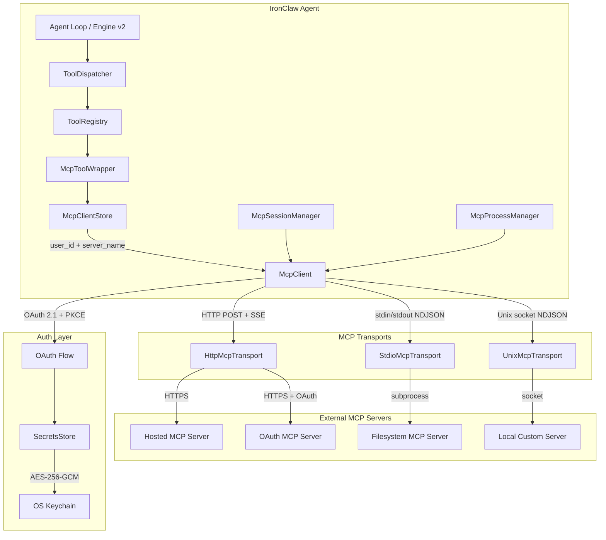
```mermaid
graph TB
    subgraph IronClaw Agent
        AG[Agent Loop / Engine v2] --> TD[ToolDispatcher]
        TD --> TR[ToolRegistry]
        TR --> MW[McpToolWrapper]
        MW --> CS[McpClientStore]
        CS --> |user_id + server_name| MC[McpClient]
        SM[McpSessionManager] --> MC
        PM[McpProcessManager] --> MC
    end

    subgraph MCP Transports
        MC --> |HTTP POST + SSE| HT[HttpMcpTransport]
        MC --> |stdin/stdout NDJSON| ST[StdioMcpTransport]
        MC --> |Unix socket NDJSON| UT[UnixMcpTransport]
    end

    subgraph External MCP Servers
        HT --> |HTTPS| GH[Hosted MCP Server]
        HT --> |HTTPS + OAuth| NO[OAuth MCP Server]
        ST --> |subprocess| FS[Filesystem MCP Server]
        UT --> |socket| LC[Local Custom Server]
    end

    subgraph Auth Layer
        MC --> |OAuth 2.1 + PKCE| OA[OAuth Flow]
        OA --> SE[SecretsStore]
        SE --> |AES-256-GCM| KS[OS Keychain]
    end
```

### Multi-User Session Isolation

Each `(user_id, server_name)` pair maps to its own:
- `McpSession` — holds the `Mcp-Session-Id` header value
- `McpClient` — holds the transport and OAuth state
- Child process (stdio transport) — carries that user's credentials in env

This is a hard tenant-isolation invariant documented in `src/tools/mcp/session.rs`:

```rust
/// Partitioned by (user_id, server_name) — NOT by server name alone.
/// If keyed on server name only, the second user's session ID would
/// overwrite the first user's; the first user's next request would
/// then send the second user's Mcp-Session-Id.
#[derive(Debug, Clone, PartialEq, Eq, Hash)]
pub struct McpSessionKey {
    user_id: String,
    server_name: McpServerName,
}
```

---

## 3. The MCP JSON-RPC 2.0 Protocol

MCP uses JSON-RPC 2.0 (https://www.jsonrpc.org/specification) as its wire encoding. Every interaction is either a request (has an `id`), a response (has the matching `id`), or a notification (no `id`).

### JSON-RPC Framing Rules

**Request frame** (client to server):
```json
{
  "jsonrpc": "2.0",
  "id": 42,
  "method": "tools/list",
  "params": {}
}
```

**Response frame** (server to client — success):
```json
{
  "jsonrpc": "2.0",
  "id": 42,
  "result": {
    "tools": [...]
  }
}
```

**Response frame** (server to client — error):
```json
{
  "jsonrpc": "2.0",
  "id": 42,
  "error": {
    "code": -32601,
    "message": "Method not found"
  }
}
```

**Notification frame** (server to client — no `id`):
```json
{
  "jsonrpc": "2.0",
  "method": "notifications/progress",
  "params": { "progressToken": "abc", "progress": 0.5 }
}
```

**Critical invariant**: Notifications MUST NOT contain an `id` field per the JSON-RPC 2.0 spec. IronClaw enforces this in `McpRequest::initialized_notification()`:

```rust
// src/tools/mcp/protocol.rs
pub fn initialized_notification() -> Self {
    Self {
        jsonrpc: "2.0".to_string(),
        id: None,                             // no id — server will not respond
        method: "notifications/initialized".to_string(),
        params: None,
    }
}
```

And verified in tests:
```rust
#[test]
fn test_notification_serializes_without_id_field() {
    let notif = McpRequest::initialized_notification();
    let json = serde_json::to_value(&notif).expect("serialize notification");
    assert!(
        json.get("id").is_none(),
        "notifications must not contain an 'id' field per JSON-RPC 2.0 spec"
    );
}
```

### MCP Handshake Sequence

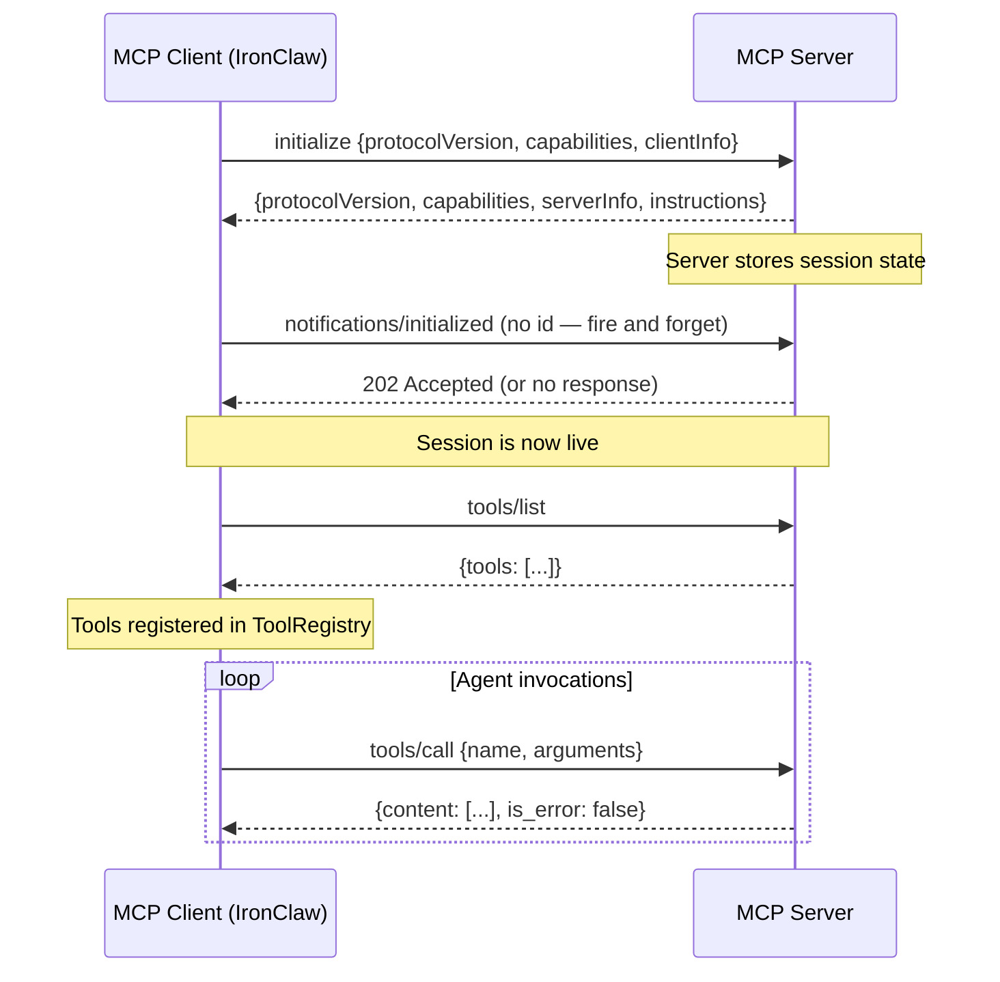
```mermaid
sequenceDiagram
    participant C as MCP Client (IronClaw)
    participant S as MCP Server

    C->>S: initialize {protocolVersion, capabilities, clientInfo}
    S-->>C: {protocolVersion, capabilities, serverInfo, instructions}
    Note over S: Server stores session state
    C->>S: notifications/initialized (no id — fire and forget)
    S-->>C: 202 Accepted (or no response)
    Note over C,S: Session is now live
    C->>S: tools/list
    S-->>C: {tools: [...]}
    Note over C: Tools registered in ToolRegistry
    loop Agent invocations
        C->>S: tools/call {name, arguments}
        S-->>C: {content: [...], is_error: false}
    end
```

### Standard Error Codes

| Code | Name | Meaning |
|------|------|---------|
| -32700 | Parse error | Invalid JSON |
| -32600 | Invalid Request | Not a valid JSON-RPC 2.0 request |
| -32601 | Method not found | Unknown method |
| -32602 | Invalid params | Invalid method parameters |
| -32603 | Internal error | Server-side internal error |
| -32001 | Unauthorized | Auth required (401 semantic) |

---

## 4. MCP Wire Types: Complete Reference

All types are in `src/tools/mcp/protocol.rs`.

### McpRequest

```rust
#[derive(Debug, Clone, Serialize, Deserialize)]
pub struct McpRequest {
    pub jsonrpc: String,
    #[serde(skip_serializing_if = "Option::is_none")]
    pub id: Option<u64>,
    pub method: String,
    #[serde(skip_serializing_if = "Option::is_none")]
    pub params: Option<serde_json::Value>,
}
```

Factory methods:

```rust
// initialize — sent once before any tool calls
McpRequest::initialize(id: u64) -> Self
// protocolVersion: "2024-11-05"
// capabilities: { roots: { listChanged: false }, sampling: {} }
// clientInfo: { name: "ironclaw", version: env!("CARGO_PKG_VERSION") }

// sent after initialize succeeds (notification, no id)
McpRequest::initialized_notification() -> Self

// discover tools
McpRequest::list_tools(id: u64) -> Self

// invoke a tool
McpRequest::call_tool(id: u64, name: &str, arguments: serde_json::Value) -> Self
```

### McpResponse

```rust
#[derive(Debug, Clone, Serialize, Deserialize)]
pub struct McpResponse {
    pub jsonrpc: String,
    #[serde(deserialize_with = "deserialize_flexible_id")]
    pub id: Option<u64>,
    #[serde(skip_serializing_if = "Option::is_none")]
    pub result: Option<serde_json::Value>,
    #[serde(skip_serializing_if = "Option::is_none")]
    pub error: Option<McpError>,
}
```

The `deserialize_flexible_id` function handles real-world MCP servers that return `id` as a string (`"42"`) or null instead of a number:

```rust
fn deserialize_flexible_id<'de, D>(deserializer: D) -> Result<Option<u64>, D::Error>
where D: Deserializer<'de>
{
    let value: Option<serde_json::Value> = Option::deserialize(deserializer)?;
    match value {
        Some(serde_json::Value::Number(n)) => Ok(n.as_u64()),
        Some(serde_json::Value::String(s)) => Ok(s.parse::<u64>().ok()),
        _ => Ok(None),
    }
}
```

### McpError

```rust
#[derive(Debug, Clone, Serialize, Deserialize)]
pub struct McpError {
    pub code: i32,
    pub message: String,
    #[serde(skip_serializing_if = "Option::is_none")]
    pub data: Option<serde_json::Value>,
}
```

### McpTool

```rust
#[derive(Debug, Clone, Serialize, Deserialize)]
pub struct McpTool {
    pub name: String,
    #[serde(default)]
    pub description: String,
    #[serde(
        default = "default_input_schema",
        rename = "inputSchema",
        alias = "input_schema"
    )]
    pub input_schema: serde_json::Value,
    #[serde(default)]
    pub annotations: Option<McpToolAnnotations>,
}

fn default_input_schema() -> serde_json::Value {
    serde_json::json!({"type": "object", "properties": {}})
}
```

The dual `rename`/`alias` is important: the MCP spec uses camelCase `inputSchema` but the alias lets IronClaw also accept snake_case from custom servers.

### McpToolAnnotations

```rust
#[derive(Debug, Clone, Default, Serialize, Deserialize)]
#[serde(rename_all = "camelCase")]
pub struct McpToolAnnotations {
    pub destructive_hint: bool,
    pub side_effects_hint: bool,
    pub read_only_hint: bool,
    pub execution_time_hint: Option<ExecutionTimeHint>,
}
```

The `#[serde(rename_all = "camelCase")]` is critical. Without it, `destructiveHint: true` from the server would silently deserialize as `false`, bypassing approval gates. Verified by test:

```rust
#[test]
fn test_annotations_deserialize_camel_case_from_mcp_spec() {
    let json = serde_json::json!({
        "name": "pods_delete",
        "annotations": {
            "destructiveHint": true,
            "readOnlyHint": false,
            "sideEffectsHint": true
        }
    });
    let tool: McpTool = serde_json::from_value(json).expect("deserialize");
    assert!(tool.requires_approval());
}
```

### McpTool::requires_approval()

```rust
impl McpTool {
    pub fn requires_approval(&self) -> bool {
        self.annotations
            .as_ref()
            .map(|a| a.destructive_hint)
            .unwrap_or(false)
    }
}
```

### ExecutionTimeHint

```rust
#[derive(Debug, Clone, Copy, Serialize, Deserialize, PartialEq, Eq)]
#[serde(rename_all = "snake_case")]
pub enum ExecutionTimeHint {
    Fast,   // < 1 second
    Medium, // 1-10 seconds
    Slow,   // > 10 seconds
}
```

### InitializeResult

```rust
#[derive(Debug, Clone, Default, Serialize, Deserialize)]
pub struct InitializeResult {
    #[serde(rename = "protocolVersion")]
    pub protocol_version: Option<String>,
    #[serde(default)]
    pub capabilities: ServerCapabilities,
    #[serde(rename = "serverInfo")]
    pub server_info: Option<ServerInfo>,
    pub instructions: Option<String>,
}
```

### ServerCapabilities

```rust
#[derive(Debug, Clone, Default, Serialize, Deserialize)]
pub struct ServerCapabilities {
    pub tools: Option<ToolsCapability>,
    pub resources: Option<ResourcesCapability>,
    pub prompts: Option<PromptsCapability>,
    pub logging: Option<serde_json::Value>,
}

pub struct ToolsCapability {
    #[serde(rename = "listChanged", default)]
    pub list_changed: bool,    // whether tools/list can change
}

pub struct ResourcesCapability {
    #[serde(default)]
    pub subscribe: bool,
    #[serde(rename = "listChanged", default)]
    pub list_changed: bool,
}

pub struct PromptsCapability {
    #[serde(rename = "listChanged", default)]
    pub list_changed: bool,
}
```

### ListToolsResult and CallToolResult

```rust
pub struct ListToolsResult {
    pub tools: Vec<McpTool>,
}

pub struct CallToolResult {
    pub content: Vec<ContentBlock>,
    #[serde(default)]
    pub is_error: bool,
}
```

### ContentBlock

```rust
#[derive(Debug, Clone, Serialize, Deserialize)]
#[serde(tag = "type")]
pub enum ContentBlock {
    #[serde(rename = "text")]
    Text { text: String },
    #[serde(rename = "image")]
    Image { data: String, mime_type: String },
    #[serde(rename = "resource")]
    Resource {
        uri: String,
        mime_type: Option<String>,
        text: Option<String>,
    },
}

impl ContentBlock {
    pub fn as_text(&self) -> Option<&str> {
        match self {
            Self::Text { text } => Some(text),
            _ => None,
        }
    }
}
```

---

## 5. Session Management

### McpSession

```rust
// src/tools/mcp/session.rs
#[derive(Debug, Clone)]
pub struct McpSession {
    pub session_id: Option<String>,
    pub last_activity: Instant,
    pub server_url: String,
    pub initialized: bool,
}
```

The session ID comes from the `Mcp-Session-Id` response header. The transport captures it and writes it into the session manager after every successful response.

### McpSessionManager

```rust
pub struct McpSessionManager {
    sessions: RwLock<HashMap<McpSessionKey, McpSession>>,
    max_idle_secs: u64,   // default 1800 (30 minutes)
}
```

Key operations:

```rust
// Get or create a session for (user, server). If stale, creates a fresh one.
pub async fn get_or_create(&self, user_id: &str, server_name: &McpServerName, server_url: &str) -> McpSession

// Update the session ID captured from response header
pub async fn update_session_id(&self, user_id: &str, server_name: &McpServerName, session_id: Option<String>)

// Mark session as having completed the initialize handshake
pub async fn mark_initialized(&self, user_id: &str, server_name: &McpServerName)

// Terminate a session (on error or explicit disconnect)
pub async fn terminate(&self, user_id: &str, server_name: &McpServerName)

// Remove all sessions idle > max_idle_secs; returns count removed
pub async fn cleanup_stale(&self) -> usize
```

### Session Lifecycle

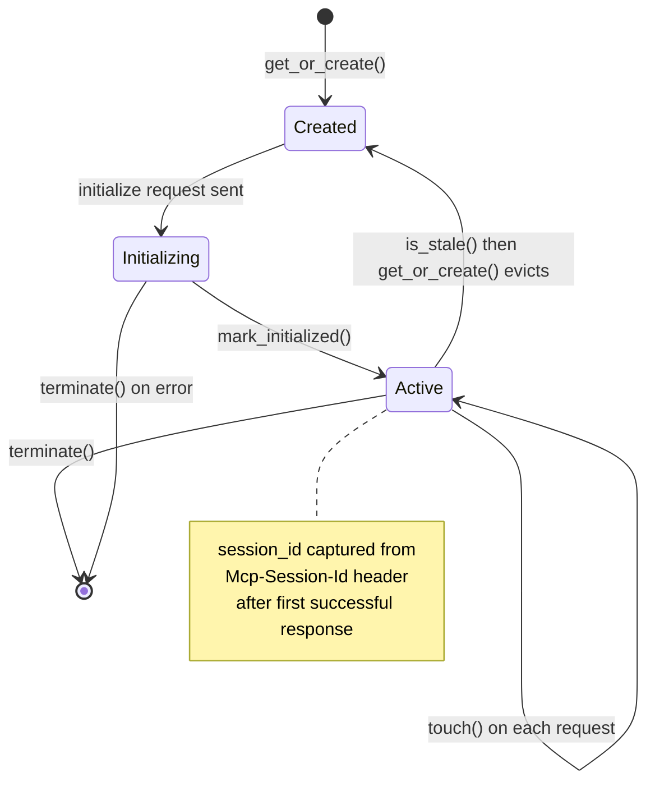
```mermaid
stateDiagram-v2
    [*] --> Created : get_or_create()
    Created --> Initializing : initialize request sent
    Initializing --> Active : mark_initialized()
    Active --> Active : touch() on each request
    Active --> Created : is_stale() then get_or_create() evicts
    Active --> [*] : terminate()
    Initializing --> [*] : terminate() on error

    note right of Active
        session_id captured from
        Mcp-Session-Id header
        after first successful response
    end note
```

### Session ID Security Validation

The transport validates `Mcp-Session-Id` header values before storing them:

```rust
fn is_safe_mcp_session_id(value: &str) -> bool {
    const MAX_MCP_SESSION_ID_BYTES: usize = 1024;
    !value.is_empty()
        && value.len() <= MAX_MCP_SESSION_ID_BYTES
        && value.bytes().all(|byte| matches!(byte, 0x21..=0x7e))
}
```

Only printable ASCII (0x21 = `!` to 0x7e = `~`, excluding space) is allowed, and only from successful HTTP responses:

```rust
// CORRECT in HttpMcpTransport: session capture only after success check
if !response.status().is_success() {
    // ... return error BEFORE reading session headers
}
if let Some(ref session_manager) = self.session_manager ... {
    // Only reached on success responses
}
```

### McpProcessManager: Stdio Process Lifecycle

`McpProcessManager` in `src/tools/mcp/process.rs` manages stdio MCP server child processes. Like `McpSessionManager`, it is keyed by `(user_id, server_name)`:

```rust
#[derive(Debug, Clone, PartialEq, Eq, Hash)]
pub struct McpProcessKey {
    pub user_id: String,
    pub server_name: String,
}

pub struct McpProcessManager {
    transports: RwLock<HashMap<McpProcessKey, Arc<StdioMcpTransport>>>,
    configs: RwLock<HashMap<McpProcessKey, StdioSpawnConfig>>,
}
```

Stdio MCP servers receive credentials via their spawn `env` map. Sharing a single child across users would leak one tenant's credentials to the other's dispatches. Per-user children are required.

---

## 6. Transport Layer: Three Implementations

All three transports implement the same trait:

```rust
// src/tools/mcp/transport.rs
#[async_trait]
pub trait McpTransport: Send + Sync {
    async fn send(
        &self,
        request: &McpRequest,
        headers: &HashMap<String, String>,
    ) -> Result<McpResponse, ToolError>;

    async fn shutdown(&self) -> Result<(), ToolError>;

    fn supports_http_features(&self) -> bool {
        false  // only HttpMcpTransport overrides to true
    }
}
```

### HTTP Transport (Streamable HTTP)

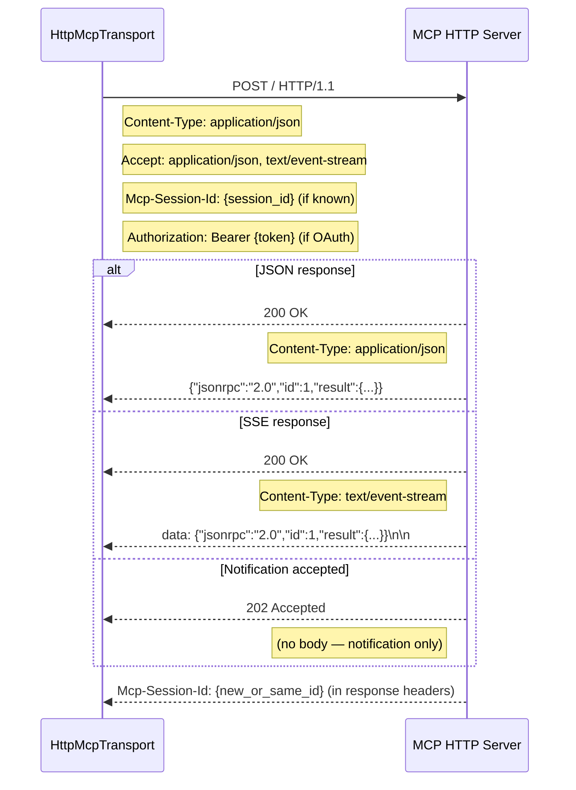
```mermaid
sequenceDiagram
    participant C as HttpMcpTransport
    participant S as MCP HTTP Server

    C->>S: POST / HTTP/1.1
    Note right of C: Content-Type: application/json
    Note right of C: Accept: application/json, text/event-stream
    Note right of C: Mcp-Session-Id: {session_id} (if known)
    Note right of C: Authorization: Bearer {token} (if OAuth)

    alt JSON response
        S-->>C: 200 OK
        Note left of S: Content-Type: application/json
        S-->>C: {"jsonrpc":"2.0","id":1,"result":{...}}
    else SSE response
        S-->>C: 200 OK
        Note left of S: Content-Type: text/event-stream
        S-->>C: data: {"jsonrpc":"2.0","id":1,"result":{...}}\n\n
    else Notification accepted
        S-->>C: 202 Accepted
        Note left of S: (no body — notification only)
    end

    S-->>C: Mcp-Session-Id: {new_or_same_id} (in response headers)
```

Implementation details from `src/tools/mcp/http_transport.rs`:
- Sends `Accept: application/json, text/event-stream` to indicate SSE capability
- Checks HTTP status before reading session headers (prevents session poisoning on errors)
- Handles 202 Accepted for notifications (returns synthetic empty response)
- Parses SSE by scanning for `data: {json}` prefixed lines
- 10 MB SSE buffer limit to prevent memory exhaustion
- 30-second timeout via `reqwest::Client::builder().timeout()`

### Stdio Transport

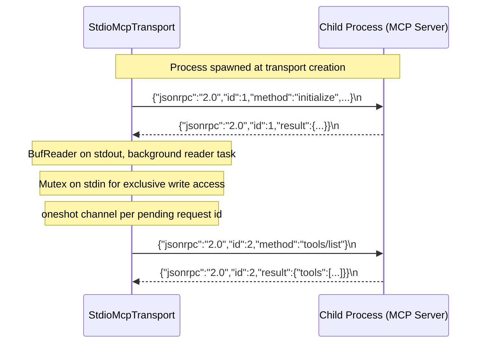
```mermaid
sequenceDiagram
    participant C as StdioMcpTransport
    participant P as Child Process (MCP Server)

    Note over C,P: Process spawned at transport creation
    C->>P: {"jsonrpc":"2.0","id":1,"method":"initialize",...}\n
    P-->>C: {"jsonrpc":"2.0","id":1,"result":{...}}\n
    Note over C: BufReader on stdout, background reader task
    Note over C: Mutex on stdin for exclusive write access
    Note over C: oneshot channel per pending request id
    C->>P: {"jsonrpc":"2.0","id":2,"method":"tools/list"}\n
    P-->>C: {"jsonrpc":"2.0","id":2,"result":{"tools":[...]}}\n
```

Key implementation pattern from `src/tools/mcp/transport.rs` — the shared `stream_transport_send`:

```rust
pub(crate) async fn stream_transport_send<W: AsyncWrite + Unpin>(
    writer: &Mutex<W>,
    pending: &Mutex<HashMap<u64, oneshot::Sender<McpResponse>>>,
    request: &McpRequest,
    server_name: &str,
    timeout_duration: Duration,
) -> Result<McpResponse, ToolError> {
    // Notifications: fire-and-forget (no id, no pending registration)
    if request.id.is_none() {
        let mut w = writer.lock().await;
        write_jsonrpc_line(&mut *w, request).await?;
        return Ok(McpResponse { jsonrpc: "2.0".to_string(), id: None,
                                result: None, error: None });
    }

    let id = request.id.unwrap_or(0);
    let (tx, rx) = oneshot::channel();

    // Register BEFORE writing — prevents missing a fast response
    { let mut map = pending.lock().await; map.insert(id, tx); }

    // Write the request
    {
        let mut w = writer.lock().await;
        if let Err(e) = write_jsonrpc_line(&mut *w, request).await {
            let mut map = pending.lock().await; map.remove(&id);
            return Err(e);
        }
    }

    // Wait with timeout
    match tokio::time::timeout(timeout_duration, rx).await {
        Ok(Ok(response)) => Ok(response),
        Ok(Err(_)) => { /* sender dropped — server closed */ todo!() }
        Err(_) => { /* timeout */ todo!() }
    }
}
```

The background reader task dispatches responses by id:

```rust
pub fn spawn_jsonrpc_reader<R: AsyncBufRead + Unpin + Send + 'static>(
    reader: R,
    pending: Arc<Mutex<HashMap<u64, oneshot::Sender<McpResponse>>>>,
    server_name: String,
) -> JoinHandle<()> {
    tokio::spawn(async move {
        let mut lines = reader.lines();
        while let Ok(Some(line)) = lines.next_line().await {
            let response = match serde_json::from_str::<McpResponse>(&line) {
                Ok(resp) => resp,
                Err(_) => continue,   // skip malformed lines
            };
            let Some(id) = response.id else { continue; }; // skip notifications
            let mut map = pending.lock().await;
            if let Some(tx) = map.remove(&id) {
                let _ = tx.send(response);
            }
        }
    })
}
```

### Unix Socket Transport

Identical protocol to stdio but uses `tokio::net::UnixStream` instead of a child process. Available only on Unix platforms (`#[cfg(unix)]` in `src/tools/mcp/unix_transport.rs`). Used for local MCP servers that expose a socket file rather than spawning from a command.

### Transport Comparison

| Feature | HTTP | Stdio | Unix Socket |
|---------|------|-------|-------------|
| `supports_http_features()` | true | false | false |
| Session ID headers | Yes | No | No |
| OAuth integration | Yes | Via env vars | Via env vars |
| SSE streaming | Yes | No | No |
| Process lifecycle | Stateless | Managed by McpProcessManager | External |
| Platform | Any | Any | Unix only |
| Credential injection | Bearer token | Environment variables | Environment variables |

---

## 7. OAuth 2.1 Authentication

IronClaw's MCP client implements OAuth 2.1 with PKCE as specified at https://modelcontextprotocol.io/specification/2025-11-25/basic/authorization.

### OAuth Flow

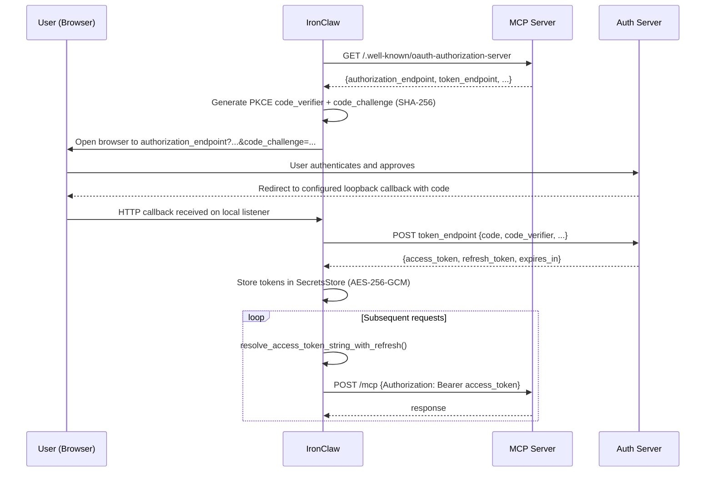
```mermaid
sequenceDiagram
    participant U as User (Browser)
    participant IC as IronClaw
    participant S as MCP Server
    participant AS as Auth Server

    IC->>S: GET /.well-known/oauth-authorization-server
    S-->>IC: {authorization_endpoint, token_endpoint, ...}

    IC->>IC: Generate PKCE code_verifier + code_challenge (SHA-256)
    IC->>U: Open browser to authorization_endpoint?...&code_challenge=...
    U->>AS: User authenticates and approves
    AS-->>U: Redirect to configured loopback callback with code
    U->>IC: HTTP callback received on local listener

    IC->>AS: POST token_endpoint {code, code_verifier, ...}
    AS-->>IC: {access_token, refresh_token, expires_in}

    IC->>IC: Store tokens in SecretsStore (AES-256-GCM)

    loop Subsequent requests
        IC->>IC: resolve_access_token_string_with_refresh()
        IC->>S: POST /mcp {Authorization: Bearer access_token}
        S-->>IC: response
    end
```

### OAuthConfig

```rust
// src/tools/mcp/config.rs
pub struct OAuthConfig {
    pub client_id: String,
    pub scopes: Vec<String>,
    pub token_endpoint: Option<String>,
    pub authorization_endpoint: Option<String>,
    pub registration_endpoint: Option<String>,
}
```

### Secret Key Naming Convention

Tokens are stored under predictable keys in `SecretsStore`:

```
mcp_{server_name}_access_token
mcp_{server_name}_refresh_token
```

For example, a server named `docs` stores:
- `mcp_docs_access_token`
- `mcp_docs_refresh_token`

The factory uses these keys to detect existing tokens:

```rust
// src/tools/mcp/factory.rs
let has_tokens = crate::tools::mcp::is_authenticated(&server, secrets, user_id).await;
if has_tokens || server.requires_auth() {
    return Ok(McpClient::new_authenticated(server, Arc::clone(session_manager), ...));
}
```

### Concurrent Refresh Safety

Multiple simultaneous requests can trigger a concurrent token refresh race. `src/tools/mcp/auth.rs` prevents this with per-`(server_name, user_id)` mutex locks:

```rust
async fn refresh_lock(server_name: &str, user_id: &str) -> Arc<tokio::sync::Mutex<()>> {
    static LOCKS: OnceLock<Mutex<HashMap<RefreshLockKey, Weak<Mutex<()>>>>> = OnceLock::new();
    let registry = LOCKS.get_or_init(|| tokio::sync::Mutex::new(HashMap::new()));
    let mut locks = registry.lock().await;
    locks.retain(|_, lock| lock.strong_count() > 0);  // GC dead weak refs
    // ... return or create Arc<Mutex<()>>
}
```

### Factory Transport Decision Tree

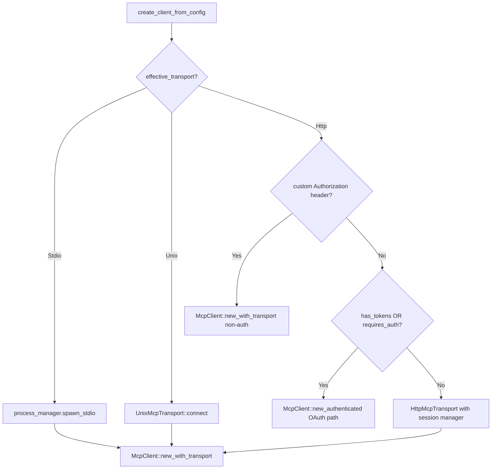
```mermaid
flowchart TD
    A[create_client_from_config] --> B{effective_transport?}
    B -->|Stdio| C[process_manager.spawn_stdio]
    C --> D[McpClient::new_with_transport]
    B -->|Unix| E[UnixMcpTransport::connect]
    E --> D
    B -->|Http| F{custom Authorization header?}
    F -->|Yes| D2[McpClient::new_with_transport non-auth]
    F -->|No| G{has_tokens OR requires_auth?}
    G -->|Yes| H[McpClient::new_authenticated OAuth path]
    G -->|No| I[HttpMcpTransport with session manager]
    I --> D
```

The custom-Authorization-header short-circuit prevents DCR (Dynamic Client Registration) side effects when the user has manually configured a static token. Keep a factory regression test for this path so static-token configuration does not trigger unexpected registration side effects.

---

## 8. The McpClientStore: Multi-Tenant Safety

`McpClientStore` in `src/tools/mcp/client_store.rs` solves a cross-tenant collision problem: `ToolRegistry` is keyed by tool name only, shared across users. If `McpToolWrapper` embedded an `Arc<McpClient>` directly, the second user's activation would silently overwrite the first user's tool wrapper.

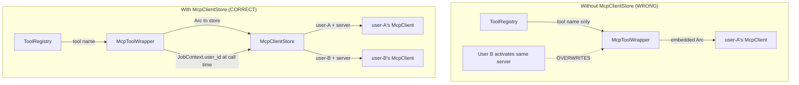
```mermaid
graph TB
    subgraph "Without McpClientStore (WRONG)"
        TR1[ToolRegistry] --> |tool name only| TW1[McpToolWrapper]
        TW1 --> |embedded Arc| C1[user-A's McpClient]
        Note1[User B activates same server] -.->|OVERWRITES| TW1
    end

    subgraph "With McpClientStore (CORRECT)"
        TR2[ToolRegistry] --> |tool name| TW2[McpToolWrapper]
        TW2 --> |Arc to store| CS2[McpClientStore]
        CS2 --> |user-A + server| CA[user-A's McpClient]
        CS2 --> |user-B + server| CB[user-B's McpClient]
        TW2 --> |JobContext.user_id at call time| CS2
    end
```

### Surface Conflict Detection

When two users activate the same server name, `McpClientStore` checks that the server exposes the same tool surface (names, schemas, annotations). If not, it refuses the registration to prevent cross-tenant tool shadowing:

```rust
pub(crate) fn surface_signature(tools: &[McpTool]) -> String {
    // Sort tools by name for order-insensitivity
    let mut sorted = tools.to_vec();
    sorted.sort_by(|a, b| a.name.cmp(&b.name));

    // Hash: name + canonicalized schema + annotations
    let mut hasher = Sha256::new();
    for tool in &sorted {
        hasher.update(tool.name.as_bytes());
        hasher.update(canonicalize_json(&tool.input_schema).as_bytes());
        // ... annotations
    }
    hex::encode(hasher.finalize())
}
```

The canonical JSON serialization sorts object keys recursively so `{"a":1,"b":2}` and `{"b":2,"a":1}` produce the same fingerprint.

---

## 9. MCP 2025-11-25 Compatibility Notes

The 2025-11-25 specification adds several capabilities beyond what IronClaw currently implements. Verify the live spec and server behavior before advertising any capability:

### Client Features (Server-Initiated)

**Elicitation** (new in 2025-11-25): Servers can request additional information from users mid-interaction. The client presents a form to the user and sends the result back to the server. This enables interactive MCP servers that gather input dynamically.

```json
{
  "jsonrpc": "2.0",
  "id": 5,
  "method": "elicitation/create",
  "params": {
    "message": "Please choose the project scope for this tool call",
    "requestedSchema": {
      "type": "object",
      "properties": {
        "project": { "type": "string" }
      }
    }
  }
}
```

**Roots**: Servers can query client filesystem roots in protocol versions that support the feature. IronClaw should not advertise roots unless it serves them correctly and scopes paths to the current workspace/user.

**Sampling**: Servers can ask the client to invoke an LLM in protocol versions that support the feature. Because this crosses the LLM/auth/approval boundary, keep it compatibility-only and do not advertise it until policy, budget, user attribution, and audit behavior are implemented.

### Server Features IronClaw Implements

| Feature | IronClaw support |
|---------|-----------------|
| `tools/list` | Full — `McpRequest::list_tools()` |
| `tools/call` | Full — `McpRequest::call_tool()` |
| `resources/list` | Not implemented |
| `resources/read` | Not implemented |
| `resources/subscribe` | Not implemented |
| `prompts/list` | Not implemented |
| `prompts/get` | Not implemented |
| `logging/setLevel` | Not implemented |
| `completion/complete` | Not implemented |

### Caching Headers (2025-11-25)

The 2025-11-25 spec adds optional caching metadata to `tools/list`, `resources/list`, and `prompts/list` responses:

```json
{
  "tools": [...],
  "_meta": {
    "ttlMs": 300000,
    "cacheScope": "session"
  }
}
```

IronClaw does not currently parse `_meta` but the `serde_json::Value` typed result field means unknown keys are not rejected.

### W3C Trace Context (2025-11-25)

Tool calls can carry `traceparent` and `tracestate` headers for distributed tracing:

```json
{
  "jsonrpc": "2.0",
  "id": 1,
  "method": "tools/call",
  "params": {
    "name": "file_read",
    "arguments": { "path": "/project/src/main.rs" },
    "_meta": {
      "traceparent": "00-4bf92f3577b34da6a3ce929d0e0e4736-00f067aa0ba902b7-01"
    }
  }
}
```

### JSON Schema 2020-12 (2025-11-25)

Tool `inputSchema` now supports JSON Schema 2020-12 features, including `$defs`, `if`/`then`/`else`, and `unevaluatedProperties`. IronClaw's `serde_json::Value` typed `input_schema` field accepts any schema dialect without modification.

---

## 10. MCP 2026-Era Proposals: Stateless Core and Extensions

The captured notes reference 2026-era MCP proposals around stateless core behavior, extensions, tasks, app surfaces, and authorization hardening. Treat this section as compatibility planning until the relevant version is finalized and supported by the servers IronClaw needs to interoperate with.

### Stateless Protocol Core

The proposed change: MCP becomes stateless at the protocol layer. The `initialize` handshake and `Mcp-Session-Id` header used by older servers would be replaced or reduced by per-request metadata. This can simplify horizontal scaling, but IronClaw should negotiate the session model per server version instead of assuming one model globally.

**Impact on IronClaw**: `McpSessionManager` in `src/tools/mcp/session.rs` and the `Mcp-Session-Id` capture logic in `src/tools/mcp/http_transport.rs` become compatibility shims for legacy servers. New servers implementing the 2026 spec will not require them. A version negotiation step during `initialize` should select the appropriate session model.

### Extensions Framework

Extensions now have formal governance with reverse-DNS identifiers, independent versioning, and their own repositories. Extensions are negotiated through an `extensions` map on client and server capabilities:

```json
{
  "jsonrpc": "2.0",
  "id": 1,
  "method": "initialize",
  "params": {
    "protocolVersion": "2026-07-28",
    "capabilities": {
      "extensions": {
        "io.modelcontextprotocol.tasks": "1.0",
        "io.modelcontextprotocol.apps": "1.0"
      }
    }
  }
}
```

**Impact on IronClaw**: The `capabilities` object in `McpRequest::initialize()` in `src/tools/mcp/protocol.rs` needs extension negotiation support. The `ServerCapabilities` struct needs an `extensions` field.

### Tasks Extension (`io.modelcontextprotocol.tasks`)

Servers can return a task handle from `tools/call` instead of an immediate result. The client drives progress:

```json
// Server response from tools/call when task is async:
{
  "jsonrpc": "2.0",
  "id": 1,
  "result": {
    "taskHandle": "task_abc123",
    "status": "running"
  }
}

// Client polls:
{ "jsonrpc": "2.0", "id": 2, "method": "tasks/get", "params": { "taskHandle": "task_abc123" } }
{ "jsonrpc": "2.0", "id": 3, "method": "tasks/cancel", "params": { "taskHandle": "task_abc123" } }

// Server notification on completion:
{ "jsonrpc": "2.0", "method": "notifications/tasks/update", "params": { "taskHandle": "task_abc123", "status": "completed", "result": {...} } }
```

**Impact on IronClaw**: `CallToolResult` in `src/tools/mcp/protocol.rs` needs a `task_handle: Option<String>` field. `McpClient` needs `tasks_get()` and `tasks_cancel()` methods. The agent loop needs polling or notification-driven task completion.

### MCP Apps Extension (`io.modelcontextprotocol.apps`)

Servers can ship interactive HTML interfaces rendered in sandboxed iframes. UI actions flow through the same JSON-RPC base protocol:

```json
// Server declares UI template during initialize:
{
  "apps": [{
    "id": "app_dashboard",
    "title": "IronClaw Memory Browser",
    "url": "https://mcp.example.com/app/dashboard",
    "sandboxPermissions": ["scripts"]
  }]
}
```

**Impact on IronClaw**: The gateway web UI (`crates/ironclaw_gateway/`) could render MCP App iframes for servers that provide them.

### Authorization Hardening

Candidate improvements align MCP with OAuth 2.0 and OpenID Connect:
1. Validate `iss` parameter per RFC 9207
2. Declare `application_type` during Dynamic Client Registration
3. Bind credentials to specific authorization servers
4. Remove server-initiated prompts (security risk)
5. Mandate OAuth 2.1 (removes implicit flow, PKCE required)
6. Deprecate stateful initialization (reduces attack surface)

IronClaw's existing `src/tools/mcp/auth.rs` PKCE implementation is relevant to credential binding and PKCE requirements, but compatibility should be tested against the final spec.

### Features to Treat as Compatibility-Only

The captured proposal treats these features as deprecated or compatibility-only:
- **Roots** — servers querying client filesystem roots
- **Sampling** — servers requesting client-side LLM invocations
- **Logging** — `logging/setLevel` capability

These were rarely implemented and had unclear security boundaries.

---

## 11. The ACP Protocol: Agent-to-Editor Communication (Zed ACP)

**Agent Client Protocol (Zed/Google ACP)** standardizes how AI coding agents communicate with code editors. Released August 2025 by Zed Industries under the Apache License, it is community-governed at https://github.com/agentclientprotocol.

### Architecture

ACP runs JSON-RPC 2.0 over stdin/stdout. The editor spawns the agent as a subprocess and communicates over stdio. This is intentionally simple: agents don't require servers, network ports, or proprietary plugins.

```
+------------------------------------------+
|                  Editor                   |
|  (VS Code / Zed / JetBrains / Neovim)    |
|                                           |
|  +--------------------------------------+ |
|  |        ACP Host Layer                | |
|  |  Session mgmt / Capability nego      | |
|  +------------------+-------------------+ |
|                     | JSON-RPC 2.0 / stdio |
+---------------------+---------------------+
                      |
          +-----------v--------------------------+
          |             AI Agent Process          |
          |  (IronClaw / Claude Code / Gemini CLI)|
          |                                       |
          |  +----------------------------------+ |
          |  |         ACP Agent Layer           | |
          |  |  Tool dispatch / Memory / LLM    | |
          |  +----------------------------------+ |
          +---------------------------------------+
```

### ACP Session Lifecycle

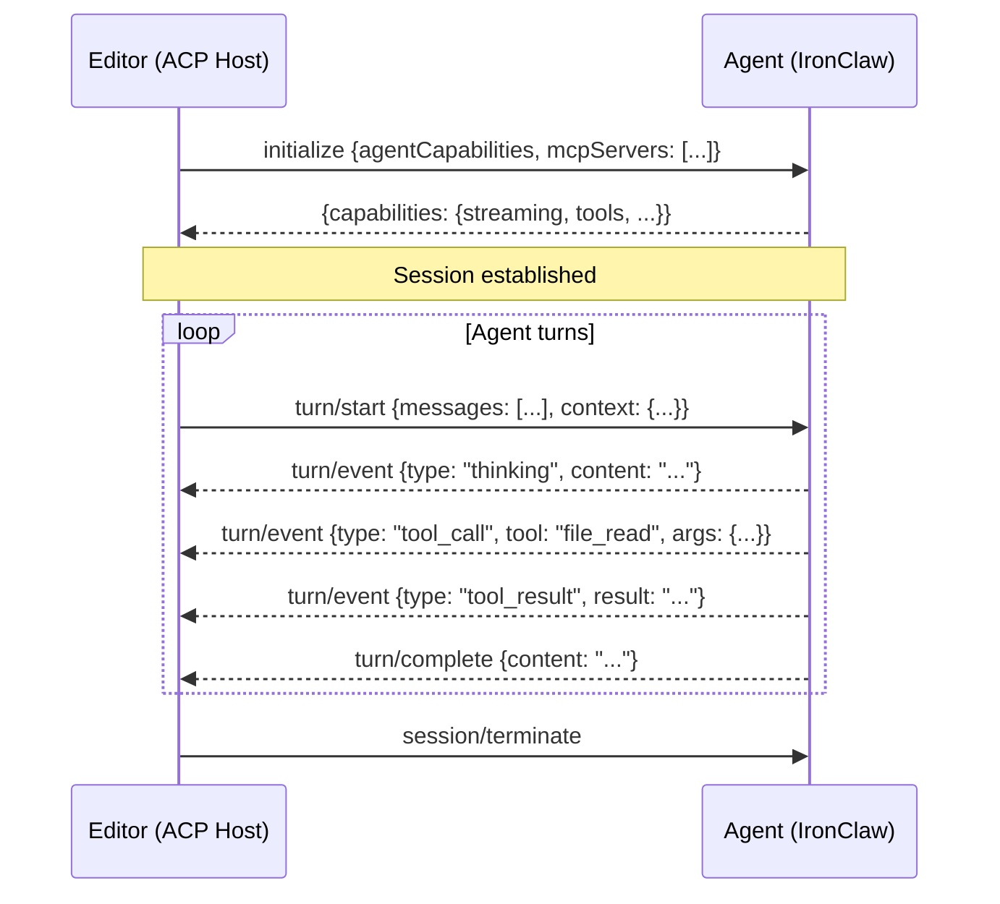
```mermaid
sequenceDiagram
    participant E as Editor (ACP Host)
    participant A as Agent (IronClaw)

    E->>A: initialize {agentCapabilities, mcpServers: [...]}
    A-->>E: {capabilities: {streaming, tools, ...}}
    Note over E,A: Session established

    loop Agent turns
        E->>A: turn/start {messages: [...], context: {...}}
        A-->>E: turn/event {type: "thinking", content: "..."}
        A-->>E: turn/event {type: "tool_call", tool: "file_read", args: {...}}
        A-->>E: turn/event {type: "tool_result", result: "..."}
        A-->>E: turn/complete {content: "..."}
    end

    E->>A: session/terminate
```

### ACP Capabilities

During `initialize`, the agent advertises what it supports:

```json
{
  "jsonrpc": "2.0",
  "id": 1,
  "method": "initialize",
  "params": {
    "agentCapabilities": {
      "streaming": true,
      "tools": ["file_read", "file_write", "shell", "memory_search"],
      "mcpPassthrough": true,
      "sessionPersistence": true
    },
    "clientInfo": { "name": "ironclaw", "version": "0.1.0" }
  }
}
```

The editor passes available MCP server endpoints so the agent can use them without requiring separate configuration:

```json
{
  "mcpServers": [
    {
      "name": "code-hosting",
      "url": "https://mcp.example.invalid",
      "credentialRef": "mcp_code_hosting"
    },
    {
      "name": "filesystem",
      "command": "mcp-filesystem-server",
      "args": ["--root", "/project"]
    }
  ]
}
```

### ACP Wire Types

```json
// Turn start (editor to agent)
{
  "jsonrpc": "2.0",
  "id": 10,
  "method": "turn/start",
  "params": {
    "session_id": "sess-xyz",
    "messages": [{"role": "user", "content": "Review this PR diff"}],
    "context": {
      "workspace_root": "/Users/will/dev/myproject",
      "active_file": "src/main.rs",
      "selection": {"start": {"line": 10, "col": 0}, "end": {"line": 25, "col": 0}}
    }
  }
}

// Streaming event (agent to editor — notification, no id)
{
  "jsonrpc": "2.0",
  "method": "turn/event",
  "params": {
    "session_id": "sess-xyz",
    "type": "tool_call",
    "tool": "file_read",
    "args": {"path": "/Users/will/dev/myproject/src/main.rs"}
  }
}

// Turn complete (agent to editor — response)
{
  "jsonrpc": "2.0",
  "id": 10,
  "result": {
    "content": "I found 3 issues in this PR...",
    "diagnostics": [
      {"file": "src/main.rs", "line": 42, "severity": "warning", "message": "unused variable `x`"}
    ]
  }
}
```

### Ecosystem Adoption

ACP client and adapter support changes quickly. Treat editor and agent support
as an implementation-time compatibility check, not a stable claim in this
design note. For IronClaw, ACP remains a candidate adapter surface described in
Section 22.

---

## 12. Captured Workflow ACP: Multi-Agent Coordination Layer

ACP (Agent Communication Protocol) in the captured workflow source is a higher-level workflow protocol distinct from the editor ACP above. It extends MCP's tool invocation model with session lifecycle, workflow state, streaming events, and permission gates. In IronClaw, this should be an adapter/facade over the existing agent runner and approval path, not a replacement agent loop.

### Captured Workflow ACP Core Concepts

| Concept | Description |
|---------|-------------|
| Session | A persistent connection between a client (editor/UI) and an agent instance |
| Workflow | A directed sequence of pipeline steps the agent executes |
| Gate | A permission checkpoint that pauses execution for human review |
| Event | A streaming update sent over SSE to the client |
| Artifact | A named output produced by a workflow step |

### Captured Workflow ACP Session Lifecycle

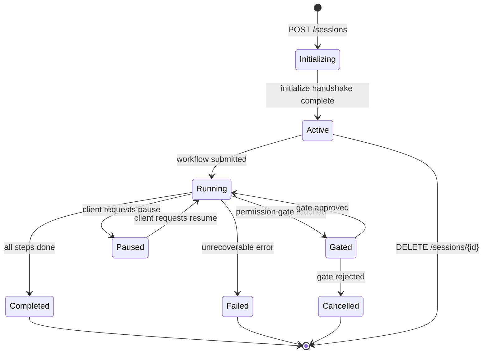
```mermaid
stateDiagram-v2
    [*] --> Initializing : POST /sessions
    Initializing --> Active : initialize handshake complete
    Active --> Running : workflow submitted
    Running --> Gated : permission gate reached
    Gated --> Running : gate approved
    Gated --> Cancelled : gate rejected
    Running --> Paused : client requests pause
    Paused --> Running : client requests resume
    Running --> Completed : all steps done
    Running --> Failed : unrecoverable error
    Completed --> [*]
    Failed --> [*]
    Cancelled --> [*]
    Active --> [*] : DELETE /sessions/{id}
```

### Captured Workflow ACP Wire Types

ACP uses JSON-RPC 2.0 with extended method names:

```json
// Session creation
{"jsonrpc":"2.0","id":1,"method":"session.create","params":{"capabilities":{}}}

// Workflow submission
{"jsonrpc":"2.0","id":2,"method":"workflow.submit","params":{"steps":[...]}}

// Gate resolution
{"jsonrpc":"2.0","id":3,"method":"gate.resolve","params":{"gate_id":"g1","approved":true}}

// Streaming event (SSE notification — no id)
{"jsonrpc":"2.0","method":"session.event","params":{"type":"step_completed","step_id":"s1","artifacts":[...]}}
```

### Captured Workflow ACP JSON-RPC Request Types

```rust
// Roko reference: `crates/roko-acp/src/types.rs`

pub struct AcpRequest {
    pub jsonrpc: String,           // "2.0"
    pub id: Option<RequestId>,
    pub method: AcpMethod,
    pub params: serde_json::Value,
}

pub enum AcpMethod {
    SessionCreate,
    SessionDelete,
    WorkflowSubmit,
    WorkflowStatus,
    StepResult,
    GateResolve,
    EventSubscribe,
    EventUnsubscribe,
}

pub enum AcpErrorCode {
    ParseError       = -32700,
    InvalidRequest   = -32600,
    MethodNotFound   = -32601,
    InvalidParams    = -32602,
    InternalError    = -32603,
    SessionNotFound  = -32000,
    WorkflowFailed   = -32001,
    GateTimeout      = -32002,
    PermissionDenied = -32003,
}
```

---

## 13. ACP Workflow Pipeline State Machine

Captured workflow ACP examples model workflows as directed graphs of steps. In IronClaw, graph execution should submit work through the existing agent/runtime boundary and reuse the existing tool, checkpoint, gate, retry, and completion paths.

### Step Types

```rust
// Roko reference: `crates/roko-acp/src/workflow.rs`

pub enum StepType {
    ToolCall {
        tool_name: String,
        arguments: serde_json::Value,
    },
    LlmInference {
        prompt: String,
        model: Option<String>,
        context_window: Vec<Message>,
    },
    ParallelFork {
        branches: Vec<Vec<Step>>,
        join_strategy: JoinStrategy,
    },
    HumanGate {
        description: String,
        gate_id: String,
        timeout_secs: u64,
    },
    ArtifactEmit {
        name: String,
        content_type: String,
        payload: serde_json::Value,
    },
}

pub enum JoinStrategy {
    WaitAll,          // all branches must complete
    WaitFirst,        // proceed after first completes
    WaitMajority,     // quorum
}
```

### Workflow State Machine

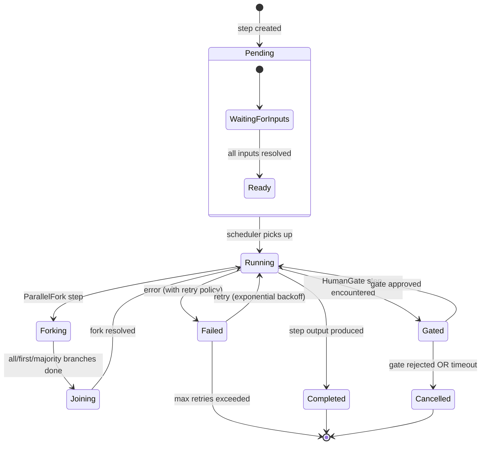
```mermaid
stateDiagram-v2
    [*] --> Pending : step created

    state Pending {
        [*] --> WaitingForInputs
        WaitingForInputs --> Ready : all inputs resolved
    }

    Pending --> Running : scheduler picks up
    Running --> Gated : HumanGate step encountered
    Running --> Forking : ParallelFork step
    Forking --> Joining : all/first/majority branches done
    Joining --> Running : fork resolved
    Running --> Completed : step output produced
    Running --> Failed : error (with retry policy)
    Failed --> Running : retry (exponential backoff)
    Failed --> [*] : max retries exceeded
    Gated --> Running : gate approved
    Gated --> Cancelled : gate rejected OR timeout
    Completed --> [*]
    Cancelled --> [*]
```

### Pipeline Execution Example: Code Review Session

A code review workflow submitted via ACP:

```json
{
  "jsonrpc": "2.0",
  "id": 1,
  "method": "workflow.submit",
  "params": {
    "session_id": "sess-abc123",
    "steps": [
      {
        "id": "s1",
        "type": "tool_call",
        "tool_name": "file_read",
        "arguments": { "path": "/project/src/main.rs" }
      },
      {
        "id": "s2",
        "type": "llm_inference",
        "depends_on": ["s1"],
        "prompt": "Review the following Rust code for issues:\n{s1.output}"
      },
      {
        "id": "s3",
        "type": "human_gate",
        "depends_on": ["s2"],
        "gate_id": "review-approval",
        "description": "Please review the AI analysis and approve or reject",
        "timeout_secs": 300
      },
      {
        "id": "s4",
        "type": "tool_call",
        "depends_on": ["s3"],
        "gate_required": "review-approval",
        "tool_name": "shell",
        "arguments": { "command": "cargo clippy --all -- -D warnings" }
      },
      {
        "id": "s5",
        "type": "artifact_emit",
        "depends_on": ["s4"],
        "name": "review-report",
        "content_type": "text/markdown",
        "payload_from": "s2.output"
      }
    ]
  }
}
```

---

## 14. ACP Streaming Session Updates

The captured workflow ACP uses Server-Sent Events (SSE) for real-time streaming from agent to client. Events are sent on a long-lived GET connection established by the client.

### SSE Event Types

```rust
// Roko reference: `crates/roko-acp/src/events.rs`

pub enum AcpEventType {
    SessionCreated,
    SessionTerminated,
    WorkflowStarted { workflow_id: String },
    StepStarted { step_id: String, step_type: String },
    StepCompleted { step_id: String, artifacts: Vec<Artifact> },
    StepFailed { step_id: String, error: String, retry_count: u32 },
    GateOpened { gate_id: String, description: String, timeout_secs: u64 },
    GateClosed { gate_id: String, approved: bool },
    WorkflowCompleted { workflow_id: String, summary: WorkflowSummary },
    WorkflowFailed { workflow_id: String, reason: String },
    ToolCallStarted { tool_name: String, arguments_preview: String },
    ToolCallCompleted { tool_name: String, output_preview: String },
    TokenBudgetWarning { used: u32, limit: u32 },
    Progress { message: String, percent: Option<f32> },
}
```

### SSE Wire Format

```
GET /sessions/{session_id}/events HTTP/1.1
Accept: text/event-stream

HTTP/1.1 200 OK
Content-Type: text/event-stream
Cache-Control: no-cache

data: {"jsonrpc":"2.0","method":"session.event","params":{"type":"step_started","step_id":"s1"}}\n\n

data: {"jsonrpc":"2.0","method":"session.event","params":{"type":"tool_call_started","tool_name":"file_read","arguments_preview":"{\"path\":\"/project/..."}}\n\n

data: {"jsonrpc":"2.0","method":"session.event","params":{"type":"step_completed","step_id":"s1","artifacts":[{"name":"file_content","bytes":4096}]}}\n\n

data: {"jsonrpc":"2.0","method":"session.event","params":{"type":"gate_opened","gate_id":"review-approval","description":"Review AI analysis","timeout_secs":300}}\n\n
```

### IronClaw's Existing SSE Implementation

IronClaw already has SSE in `src/tools/mcp/http_transport.rs` for receiving tool results. The `parse_sse_response` method can be extended for ACP event streams:

```rust
// Current: parses SSE looking for matching request id
async fn parse_sse_response(&self, response: reqwest::Response, request_id: Option<u64>)
    -> Result<McpResponse, ToolError>

// ACP extension needed: consume all events into a channel
async fn stream_acp_events(&self, session_id: &str)
    -> Result<impl Stream<Item = AcpEvent>, ToolError>
```

---

## 15. ACP Permission-Based Action Gates

Gates are the mechanism by which the captured workflow ACP enforces human-in-the-loop control over sensitive operations. When a workflow step requires a gate, execution pauses at that step and a `gate_opened` event is delivered to the client.

### Gate Classification

```rust
// Roko reference: `crates/roko-acp/src/gates.rs`

pub enum GatePolicy {
    /// Always require human approval
    RequireApproval,
    /// Auto-approve in low-risk contexts, require approval in high-risk
    RiskBased { risk_threshold: RiskLevel },
    /// Auto-approve for trusted tool categories
    TrustBased { trusted_tools: Vec<String> },
    /// No gate — execute immediately
    NoGate,
}

pub struct GateRequirement {
    pub gate_id: String,
    pub policy: GatePolicy,
    pub timeout_secs: u64,
    pub on_timeout: GateTimeoutAction,
}

pub enum GateTimeoutAction {
    AutoApprove,
    AutoReject,
    Escalate { escalation_target: String },
}
```

### Relationship to IronClaw's ApprovalRequirement

IronClaw already has a three-level approval system in `src/tools/tool.rs`:

```rust
pub enum ApprovalRequirement {
    Never,                // No approval needed
    UnlessAutoApproved,   // Session auto-approve can bypass
    Always,               // Always needs explicit approval
}
```

ACP gates map naturally to IronClaw's approval model:

| ACP Gate Policy | IronClaw ApprovalRequirement |
|-----------------|------------------------------|
| `NoGate` | `Never` |
| `TrustBased` | `UnlessAutoApproved` |
| `RequireApproval` | `Always` |
| `RiskBased` | Dynamic: based on `RiskLevel` of the specific call |

IronClaw's tool annotations already carry this information via `McpToolAnnotations::destructive_hint`.

---

## 16. Captured MCP Component Set

The captured MCP implementation is split across these source identifiers. They are provenance labels, not required IronClaw crate boundaries:

### Crate 1: roko-mcp-types

Shared protocol types used across all crates.

Reference: `crates/roko-mcp-types/src/lib.rs`

```rust
// Mirrors IronClaw's protocol.rs but with additional types:
pub struct McpResource {
    pub uri: String,
    pub name: String,
    pub description: Option<String>,
    pub mime_type: Option<String>,
}

pub struct McpPrompt {
    pub name: String,
    pub description: Option<String>,
    pub arguments: Vec<PromptArgument>,
}

pub enum SamplingMessage {
    User { content: ContentBlock },
    Assistant { content: ContentBlock },
}

pub struct CreateMessageRequest {
    pub messages: Vec<SamplingMessage>,
    pub max_tokens: u32,
    pub system_prompt: Option<String>,
}
```

### Crate 2: roko-mcp-client

Full MCP client with automatic retry, connection pooling, and capability negotiation.

Reference: `crates/roko-mcp-client/src/lib.rs`

```rust
pub struct McpClientPool {
    servers: HashMap<String, Arc<McpServerConnection>>,
    config: ClientPoolConfig,
}

pub struct McpServerConnection {
    transport: Box<dyn McpTransport>,
    capabilities: ServerCapabilities,
    tool_cache: RwLock<Vec<McpTool>>,
    health: Arc<AtomicBool>,
}

impl McpClientPool {
    pub async fn discover_all_tools(&self) -> Vec<(String, McpTool)> { ... }
    pub async fn call_tool(&self, server: &str, tool: &str, args: Value) -> Result<CallToolResult> { ... }
    pub async fn health_check_all(&self) -> HashMap<String, bool> { ... }
    pub async fn refresh_tool_cache(&self, server: &str) -> Result<Vec<McpTool>> { ... }
}
```

### Crate 3: roko-mcp-server

MCP server implementation that exposes Roko's tools to external clients.

Reference: `crates/roko-mcp-server/src/lib.rs`

```rust
pub struct McpServer {
    name: String,
    version: String,
    tools: Vec<Box<dyn McpServerTool>>,
    resources: Vec<Box<dyn McpServerResource>>,
    prompts: Vec<Box<dyn McpServerPrompt>>,
    transport: ServerTransport,
}

#[async_trait]
pub trait McpServerTool: Send + Sync {
    fn definition(&self) -> McpTool;
    async fn call(&self, arguments: Value, ctx: &CallContext) -> Result<CallToolResult>;
}

pub enum ServerTransport {
    Stdio,
    Http { bind_addr: SocketAddr },
    Unix { socket_path: PathBuf },
}
```

### Crate 4: roko-acp

The captured Agent Communication Protocol implementation built on top of MCP.
This is source provenance only; IronClaw should not copy the workflow queue as a
separate execution loop.

Reference: `crates/roko-acp/src/lib.rs`

```rust
pub struct AcpServer {
    sessions: Arc<DashMap<SessionId, Arc<AcpSession>>>,
    mcp_pool: Arc<McpClientPool>,
    event_broadcaster: Arc<EventBroadcaster>,
    gate_registry: Arc<GateRegistry>,
}

pub struct AcpSession {
    pub id: SessionId,
    pub state: RwLock<SessionState>,
    pub workflow_queue: Arc<WorkflowQueue>, // captured shape, not an IronClaw runner
    pub event_tx: broadcast::Sender<AcpEvent>,
    pub client_capabilities: ClientCapabilities,
}
```

### Crate 5: roko-editor-bridge

Editor-specific adapters for VS Code Language Server Protocol and Zed extension API.

Reference: `crates/roko-editor-bridge/src/lib.rs`

```rust
pub trait EditorBridge: Send + Sync {
    async fn open_file(&self, path: &Path) -> Result<()>;
    async fn apply_diff(&self, path: &Path, diff: &str) -> Result<()>;
    async fn show_diagnostic(&self, diagnostic: Diagnostic) -> Result<()>;
    async fn request_user_input(&self, prompt: &str) -> Result<String>;
    fn editor_type(&self) -> EditorType;
}

pub enum EditorType { VsCode, Zed, Neovim, Generic }

pub struct VsCodeBridge { lsp_client: LspClient }
pub struct ZedBridge { extension_api: ZedExtensionApi }
```

---

## 17. Builtin Tool System

IronClaw's builtin tools in `src/tools/builtin/` cover:

| Tool | File | Category | Approval |
|------|------|----------|---------|
| `echo` | `echo.rs` | Debug | Never |
| `time` | `time.rs` | Info | Never |
| `json` | `json.rs` | Transform | Never |
| `file_read` | `file.rs` | File I/O | Never |
| `file_write` | `file.rs` | File I/O | UnlessAutoApproved |
| `apply_patch` | `file.rs` | File I/O | UnlessAutoApproved |
| `list_dir` | `file.rs` | File I/O | Never |
| `shell` | `shell.rs` | Execution | Always (High risk) |
| `http` | `http.rs` | Network | UnlessAutoApproved |
| `web_fetch` | `http.rs` | Network | Never |
| `memory_search` | `memory.rs` | Memory | Never |
| `memory_write` | `memory.rs` | Memory | UnlessAutoApproved |
| `memory_read` | `memory.rs` | Memory | Never |
| `memory_tree` | `memory.rs` | Memory | Never |
| `message` | `message.rs` | I/O | Never |
| `create_job` | `job.rs` | Orchestration | UnlessAutoApproved |
| `skill_list` | `skill_tools.rs` | Skills | Never |
| `skill_search` | `skill_tools.rs` | Skills | Never |
| `skill_install` | `skill_tools.rs` | Skills | Always |

The Tool trait in `src/tools/tool.rs`:

```rust
#[async_trait]
pub trait Tool: Send + Sync {
    fn name(&self) -> &str;
    fn description(&self) -> &str;
    fn parameters_schema(&self) -> serde_json::Value;
    async fn call(&self, params: serde_json::Value, ctx: &JobContext) -> Result<ToolOutput, ToolError>;

    fn requires_approval(&self, params: &serde_json::Value) -> ApprovalRequirement {
        ApprovalRequirement::Never
    }
    fn domain(&self) -> ToolDomain { ToolDomain::Orchestrator }
    fn rate_limit_config(&self) -> Option<ToolRateLimitConfig> { None }
    fn engine_compatibility(&self) -> EngineCompatibility { EngineCompatibility::Both }
}
```

---

## 18. Editor Integration: VS Code, Zed, and JetBrains

### VS Code Integration via Language Server Protocol

VS Code can act as an MCP client via a Language Server Protocol (LSP) extension that proxies tool calls to an MCP server. IronClaw can expose itself as an MCP server that VS Code connects to.

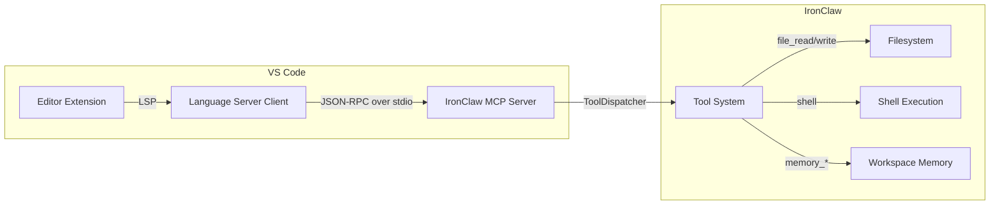
```mermaid
graph LR
    subgraph VS Code
        E[Editor Extension] --> |LSP| LS[Language Server Client]
        LS --> |JSON-RPC over stdio| ICS[IronClaw MCP Server]
    end
    subgraph IronClaw
        ICS --> |ToolDispatcher| TD[Tool System]
        TD --> |file_read/write| FS[Filesystem]
        TD --> |shell| SH[Shell Execution]
        TD --> |memory_*| WS[Workspace Memory]
    end
```

VS Code extension manifest (`package.json`) for MCP integration:

```json
{
  "name": "ironclaw-mcp",
  "contributes": {
    "mcpServers": {
      "ironclaw": {
        "command": "ironclaw",
        "args": ["--mcp-server", "--mode", "stdio"],
        "env": {
          "IRONCLAW_MCP_USER": "${workspaceFolder}"
        }
      }
    }
  },
  "activationEvents": ["onStartupFinished"]
}
```

The MCP server command advertises IronClaw's tools when VS Code sends `tools/list`.

### Zed Integration via Extension API and ACP

Zed has native MCP support via its extension system, plus it built ACP. A Zed extension connects to IronClaw over HTTP or stdio via MCP:

```json
// Zed settings.json — MCP integration (existing protocol)
{
  "context_servers": {
    "ironclaw": {
      "command": {
        "path": "/usr/local/bin/ironclaw",
        "args": ["--mcp-server", "--mode", "stdio"]
      }
    }
  }
}
```

Or for the HTTP transport with an already-running IronClaw daemon:

```json
{
  "context_servers": {
    "ironclaw": {
      "url": "<configured-mcp-http-url>",
      "headers": {
        "Authorization": "Bearer ${IRONCLAW_MCP_TOKEN}"
      }
    }
  }
}
```

For ACP (the richer agent integration), Zed launches IronClaw as an ACP subprocess:

```json
// Zed settings.json — ACP integration (future)
{
  "agents": {
    "ironclaw": {
      "command": "/usr/local/bin/ironclaw",
      "args": ["--acp", "--mode", "stdio"],
      "capabilities": ["streaming", "tools", "memory"]
    }
  }
}
```

### Other Editor Integrations

Any editor integration that supports an ACP-style subprocess can use the same basic launch model. Verify the editor's current ACP support and security model before documenting a product-specific setup:

```json
// .idea/agents.json
{
  "agents": [{
    "id": "ironclaw",
    "name": "IronClaw",
    "command": "/usr/local/bin/ironclaw",
    "args": ["--acp", "--mode", "stdio"],
    "enabled": true
  }]
}
```

---

## 19. Practical Editor Integration Workflows

### Workflow 1: Code Review

A developer triggers "IronClaw: Review" on a file in VS Code. IronClaw reads the file, retrieves the git diff, searches memory for relevant standards, generates a review via LLM, and posts inline diagnostics.

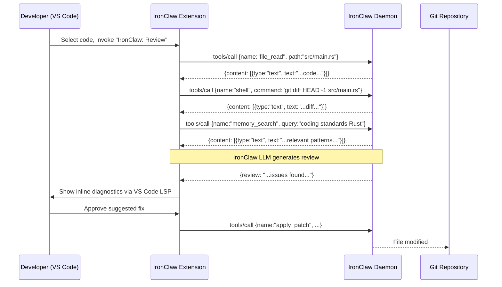
```mermaid
sequenceDiagram
    participant Dev as Developer (VS Code)
    participant Ext as IronClaw Extension
    participant IC as IronClaw Daemon
    participant Git as Git Repository

    Dev->>Ext: Select code, invoke "IronClaw: Review"
    Ext->>IC: tools/call {name:"file_read", path:"src/main.rs"}
    IC-->>Ext: {content: [{type:"text", text:"...code..."}]}

    Ext->>IC: tools/call {name:"shell", command:"git diff HEAD~1 src/main.rs"}
    IC-->>Ext: {content: [{type:"text", text:"...diff..."}]}

    Ext->>IC: tools/call {name:"memory_search", query:"coding standards Rust"}
    IC-->>Ext: {content: [{type:"text", text:"...relevant patterns..."}]}

    Note over Ext,IC: IronClaw LLM generates review
    IC-->>Ext: {review: "...issues found..."}

    Ext->>Dev: Show inline diagnostics via VS Code LSP
    Dev->>Ext: Approve suggested fix
    Ext->>IC: tools/call {name:"apply_patch", ...}
    IC-->>Git: File modified
```

### Workflow 2: Autonomous Refactor with Human Gate

A developer asks IronClaw to refactor a module. IronClaw plans the changes, previews them, waits for approval via an ACP gate, then writes the changes.

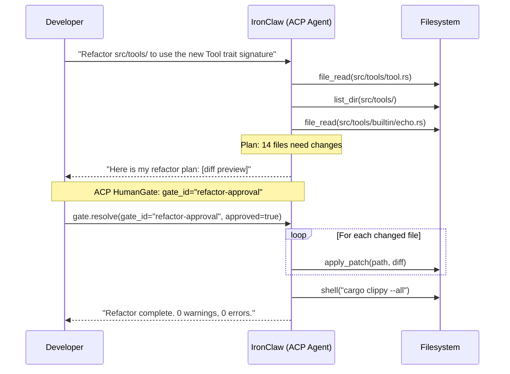
```mermaid
sequenceDiagram
    participant Dev as Developer
    participant IC as IronClaw (ACP Agent)
    participant FS as Filesystem

    Dev->>IC: "Refactor src/tools/ to use the new Tool trait signature"

    IC->>FS: file_read(src/tools/tool.rs)
    IC->>FS: list_dir(src/tools/)
    IC->>FS: file_read(src/tools/builtin/echo.rs)
    Note over IC: Plan: 14 files need changes

    IC-->>Dev: "Here is my refactor plan: [diff preview]"
    Note over IC,Dev: ACP HumanGate: gate_id="refactor-approval"
    Dev->>IC: gate.resolve(gate_id="refactor-approval", approved=true)

    loop For each changed file
        IC->>FS: apply_patch(path, diff)
    end

    IC->>FS: shell("cargo clippy --all")
    IC-->>Dev: "Refactor complete. 0 warnings, 0 errors."
```

### Workflow 3: Memory-Augmented Debugging

A developer encounters a test failure. IronClaw searches its memory for similar past failures, reads the relevant source, runs the test, and suggests a fix.

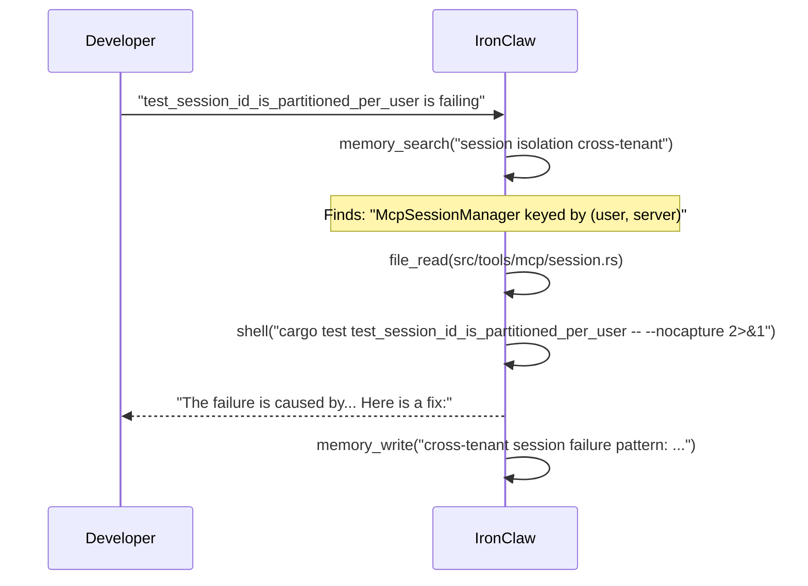
```mermaid
sequenceDiagram
    participant Dev as Developer
    participant IC as IronClaw

    Dev->>IC: "test_session_id_is_partitioned_per_user is failing"

    IC->>IC: memory_search("session isolation cross-tenant")
    Note over IC: Finds: "McpSessionManager keyed by (user, server)"

    IC->>IC: file_read(src/tools/mcp/session.rs)
    IC->>IC: shell("cargo test test_session_id_is_partitioned_per_user -- --nocapture 2>&1")

    IC-->>Dev: "The failure is caused by... Here is a fix:"
    IC->>IC: memory_write("cross-tenant session failure pattern: ...")
```

### Workflow 4: MCP Server Onboarding

A developer adds a new MCP server to IronClaw via the CLI. IronClaw runs OAuth, connects, discovers tools, and stores them.

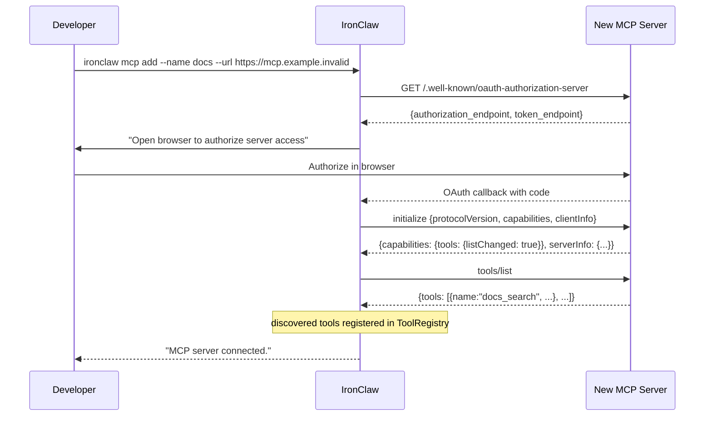
```mermaid
sequenceDiagram
    participant Dev as Developer
    participant IC as IronClaw
    participant MS as New MCP Server

    Dev->>IC: ironclaw mcp add --name docs --url https://mcp.example.invalid

    IC->>MS: GET /.well-known/oauth-authorization-server
    MS-->>IC: {authorization_endpoint, token_endpoint}

    IC->>Dev: "Open browser to authorize server access"
    Dev->>MS: Authorize in browser
    MS-->>IC: OAuth callback with code

    IC->>MS: initialize {protocolVersion, capabilities, clientInfo}
    MS-->>IC: {capabilities: {tools: {listChanged: true}}, serverInfo: {...}}

    IC->>MS: tools/list
    MS-->>IC: {tools: [{name:"docs_search", ...}, ...]}

    Note over IC: discovered tools registered in ToolRegistry
    IC-->>Dev: "MCP server connected."
```

### Workflow 5: Background Heartbeat with Editor Notification

IronClaw's background heartbeat (every 30 minutes) runs, finds relevant context from external MCP servers, and notifies the developer through the editor's notification system.

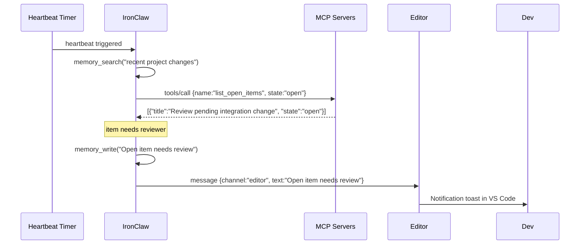
```mermaid
sequenceDiagram
    participant HB as Heartbeat Timer
    participant IC as IronClaw
    participant MS as MCP Servers
    participant Ed as Editor

    HB->>IC: heartbeat triggered
    IC->>IC: memory_search("recent project changes")
    IC->>MS: tools/call {name:"list_open_items", state:"open"}
    MS-->>IC: [{"title":"Review pending integration change", "state":"open"}]

    Note over IC: item needs reviewer
    IC->>IC: memory_write("Open item needs review")

    IC->>Ed: message {channel:"editor", text:"Open item needs review"}
    Ed->>Dev: Notification toast in VS Code
```

---

## 20. Exposing IronClaw Tools as an MCP Server

IronClaw can expose selected tools to MCP-compatible clients by implementing an MCP server endpoint. Every request must authenticate a user/session, enforce tool permissions, preserve approval gates, and delegate to `ToolDispatcher::dispatch()` with the correct `user_id` and dispatch source. Server mode must not bypass the existing audit, sandbox, or approval paths.

### MCP Server Endpoint Design

```rust
// New: src/channels/mcp_server.rs (IronClaw as MCP server)

use axum::{Router, extract::State, routing::post};
use crate::tools::dispatch::ToolDispatcher;
use crate::tools::mcp::protocol::{
    CallToolResult, ContentBlock, InitializeResult, ListToolsResult,
    McpError, McpRequest, McpResponse, McpTool, PROTOCOL_VERSION,
    ServerCapabilities, ServerInfo, ToolsCapability,
};

pub struct McpServerState {
    dispatcher: Arc<ToolDispatcher>,
    tool_registry: Arc<ToolRegistry>,
    auth: Arc<McpServerAuth>,
}

async fn mcp_handler(
    State(state): State<Arc<McpServerState>>,
    auth: McpAuthContext,
    Json(request): Json<McpRequest>,
) -> Result<Json<McpResponse>, McpServerError> {
    let user_id = state.auth.require_user(&auth)?;
    match request.method.as_str() {
        "initialize" => {
            let result = InitializeResult {
                protocol_version: Some(PROTOCOL_VERSION.to_string()),
                capabilities: ServerCapabilities {
                    tools: Some(ToolsCapability { list_changed: false }),
                    ..Default::default()
                },
                server_info: Some(ServerInfo {
                    name: "ironclaw".to_string(),
                    version: Some(env!("CARGO_PKG_VERSION").to_string()),
                }),
                instructions: Some("IronClaw AI assistant tools".to_string()),
            };
            Ok(Json(McpResponse {
                jsonrpc: "2.0".to_string(),
                id: request.id,
                result: Some(to_json_or_error(result)?),
                error: None,
            }))
        }
        "tools/list" => {
            let tools: Vec<McpTool> = state.tool_registry
                .tool_definitions()
                .iter()
                .map(|def| McpTool {
                    name: def.name.clone(),
                    description: def.description.clone(),
                    input_schema: def.parameters.clone(),
                    annotations: None,
                })
                .collect();
            let result = ListToolsResult { tools };
            Ok(Json(McpResponse {
                jsonrpc: "2.0".to_string(),
                id: request.id,
                result: Some(to_json_or_error(result)?),
                error: None,
            }))
        }
        "tools/call" => {
            let Some(params) = request.params else {
                return Ok(Json(invalid_params(request.id, "missing params")));
            };
            let Some(tool_name) = params.get("name").and_then(|v| v.as_str()) else {
                return Ok(Json(invalid_params(request.id, "missing tool name")));
            };
            let arguments = params.get("arguments").cloned().unwrap_or_default();
            let ctx = JobContext::for_user(&user_id);

            // MUST go through ToolDispatcher — never state.workspace or store directly
            match state.dispatcher.dispatch(tool_name, arguments, &ctx).await {
                Ok(output) => {
                    let content = vec![ContentBlock::Text { text: output.content }];
                    let result = CallToolResult { content, is_error: false };
                    Ok(Json(McpResponse {
                        jsonrpc: "2.0".to_string(),
                        id: request.id,
                        result: Some(to_json_or_error(result)?),
                        error: None,
                    }))
                }
                Err(e) => {
                    let content = vec![ContentBlock::Text { text: e.to_string() }];
                    let result = CallToolResult { content, is_error: true };
                    Ok(Json(McpResponse {
                        jsonrpc: "2.0".to_string(),
                        id: request.id,
                        result: Some(to_json_or_error(result)?),
                        error: None,
                    }))
                }
            }
        }
        _ => {
            Ok(Json(McpResponse {
                jsonrpc: "2.0".to_string(),
                id: request.id,
                result: None,
                error: Some(McpError {
                    code: -32601,
                    message: "Method not found".to_string(),
                    data: None,
                }),
            }))
        }
    }
}

pub fn mcp_server_router(state: Arc<McpServerState>) -> Router {
    Router::new()
        .route("/mcp", post(mcp_handler))
        .with_state(state)
}
```

### CLI Flag for MCP Server Mode

```rust
// src/cli/mod.rs addition
#[derive(clap::Args)]
pub struct McpServerArgs {
    /// Transport mode: stdio or http
    #[arg(long, default_value = "stdio")]
    pub mode: McpServerMode,

    /// HTTP bind address (for --mode http). Default should come from config.
    #[arg(long)]
    pub bind: String,
}

pub enum McpServerMode { Stdio, Http }
```

---

## 21. Benchmarking: Protocol Overhead Measurement

### What to Measure

| Metric | Description | Required report fields |
|--------|-------------|------------------------|
| Initialization latency | Time from first `initialize` to `initialized_notification` | transport, server type, p50/p95/p99 |
| Tool discovery time | Time for `tools/list` at representative tool counts | tool count, schema size, p50/p95/p99 |
| Tool invocation RTT | Round-trip for `tools/call` on simple and realistic tools | transport, payload bytes, p50/p95/p99 |
| Session establishment | Time to create a usable MCP session | stateful/stateless model, auth mode |
| SSE event lag | Time from tool completion to event delivery | server flush behavior, proxy path |
| OAuth token refresh | Full refresh path | provider, network, retry behavior |
| Multi-tenant isolation overhead | Delta when multiple users share server config | user count, lock contention, cache hit rate |

### Benchmark Harness

```rust
// tests/benchmarks/mcp_overhead.rs (new)

use criterion::{Criterion, black_box, criterion_group, criterion_main};
use std::sync::Arc;
use tokio::runtime::Runtime;
use crate::tools::mcp::{McpClient, McpSessionManager, McpProcessManager};

fn bench_initialize_handshake(c: &mut Criterion) {
    let rt = Runtime::new().expect("benchmark runtime");
    let server_url = rt.block_on(spawn_echo_mcp_server());

    c.bench_function("mcp_initialize_http", |b| {
        b.iter(|| {
            rt.block_on(async {
                let session_manager = Arc::new(McpSessionManager::new());
                let process_manager = Arc::new(McpProcessManager::new());
                let config = McpServerConfig::new("bench", &server_url);
                let client = create_client_from_config(
                    config, &session_manager, &process_manager, None, "bench-user"
                ).await.expect("benchmark client");
                black_box(client.initialize().await.expect("initialize"));
            });
        });
    });
}

fn bench_multi_tenant_isolation(c: &mut Criterion) {
    let rt = Runtime::new().expect("benchmark runtime");
    let manager = McpSessionManager::new();
    let server_name = McpServerName::new("bench").expect("valid server name");
    let num_users = 100;

    rt.block_on(async {
        for i in 0..num_users {
            manager.get_or_create(
                &format!("user-{}", i), &server_name, "https://mcp.example.invalid"
            ).await;
        }
    });

    c.bench_function("session_lookup_100_users", |b| {
        b.iter(|| {
            rt.block_on(async {
                for i in 0..num_users {
                    black_box(
                        manager.get_session_id(
                            &format!("user-{}", i), &server_name
                        ).await
                    );
                }
            });
        });
    });
}

criterion_group!(benches, bench_initialize_handshake, bench_multi_tenant_isolation);
criterion_main!(benches);
```

### Reporting Guidance

Do not publish expected latency, throughput, or overhead numbers until they are
measured on the target hardware and transport. Report raw samples, p50/p95/p99,
payload sizes, server implementation, authentication mode, and whether the
session model is stateful or stateless. For overhead comparisons, include the
direct-call baseline, JSON-RPC payload bytes, initialization cost, and any
session or authorization headers.

---

## 22. Candidate Implementation Plan for IronClaw

### Phase 1: Enhanced MCP Client (Immediate)

These improvements build on existing code in `src/tools/mcp/`.

#### 1.1 Resources and Prompts Support

Current MCP client only implements `tools/list` and `tools/call`. Adding resources and prompts:

```rust
// src/tools/mcp/protocol.rs additions

pub struct McpResource {
    pub uri: String,
    pub name: String,
    pub description: Option<String>,
    pub mime_type: Option<String>,
}

pub struct ListResourcesResult {
    pub resources: Vec<McpResource>,
}

pub struct ReadResourceResult {
    pub contents: Vec<ResourceContent>,
}

pub enum ResourceContent {
    Text { uri: String, mime_type: Option<String>, text: String },
    Blob { uri: String, mime_type: Option<String>, blob: String }, // base64
}

impl McpRequest {
    pub fn list_resources(id: u64) -> Self {
        Self::new(id, "resources/list", None)
    }

    pub fn read_resource(id: u64, uri: &str) -> Self {
        Self::new(id, "resources/read", Some(serde_json::json!({"uri": uri})))
    }

    pub fn list_prompts(id: u64) -> Self {
        Self::new(id, "prompts/list", None)
    }

    pub fn get_prompt(id: u64, name: &str, arguments: serde_json::Value) -> Self {
        Self::new(id, "prompts/get", Some(serde_json::json!({
            "name": name,
            "arguments": arguments
        })))
    }
}
```

#### 1.2 Tool List Change Notifications

When a server advertises `tools.listChanged: true`, the client should re-fetch on `notifications/tools/list_changed`:

```rust
// src/tools/mcp/client.rs addition
pub async fn handle_notification(&self, notification: &McpRequest) -> Result<(), ToolError> {
    match notification.method.as_str() {
        "notifications/tools/list_changed" => {
            tracing::debug!("[{}] Tool list changed, refreshing", self.server_name);
            self.refresh_tools().await?;
        }
        "notifications/resources/list_changed" => {
            tracing::debug!("[{}] Resource list changed, refreshing", self.server_name);
        }
        _ => {
            tracing::debug!("[{}] Unhandled notification: {}", self.server_name, notification.method);
        }
    }
    Ok(())
}
```

#### 1.3 Sampling / LLM Proxy Compatibility

Some MCP revisions support `sampling/createMessage` — the server requests the client to invoke an LLM. For IronClaw this is not a near-term default because it lets an external server spend model budget and influence prompts. Implement only if a compatibility partner requires it, and only after adding explicit user approval, budget checks, provider attribution, and audit records.

```rust
// src/tools/mcp/client.rs addition
pub async fn handle_sampling_request(
    &self,
    request: &CreateMessageRequest,
    llm: &Arc<dyn LlmProvider>,
) -> Result<CreateMessageResult, ToolError> {
    let messages: Vec<_> = request.messages.iter().map(|m| match m {
        SamplingMessage::User { content } => ChatMessage::user(content.as_text().unwrap_or("")),
        SamplingMessage::Assistant { content } => ChatMessage::assistant(content.as_text().unwrap_or("")),
    }).collect();

    let response = llm.chat(messages, request.max_tokens).await
        .map_err(|e| ToolError::ExternalService(e.to_string()))?;

    Ok(CreateMessageResult {
        role: "assistant".to_string(),
        content: ContentBlock::Text { text: response.content },
        model: response.model_id,
        stop_reason: response.stop_reason,
    })
}
```

Do not advertise `sampling` in `initialize` until the handler exists and all approval/budget/audit checks are enforced.

#### 1.4 Server-Name Newtype Hardening

`McpServerConfig.name` is still a `String`. Converting to `McpServerName` throughout eliminates an entire class of allowlist bypass bugs. The factory already validates through `McpServerName::new`; the remaining work is the final type-safety migration in `src/tools/mcp/factory.rs`:

```rust
// Current (partial migration):
pub struct McpServerConfig {
    pub name: String,  // planned: change to McpServerName
    ...
}

// Target state:
pub struct McpServerConfig {
    pub name: McpServerName,
    ...
}
```

#### 1.5 Per-Server Health Checking

```rust
// src/tools/mcp/client.rs addition
pub async fn health_check(&self) -> bool {
    match self.list_tools().await {
        Ok(_) => true,
        Err(e) => {
            tracing::debug!("[{}] Health check failed: {}", self.server_name, e);
            false
        }
    }
}

// src/tools/mcp/client_store.rs addition
pub async fn health_check_all(&self) -> HashMap<(String, String), bool> {
    let clients = self.clients.read().await;
    let mut results = HashMap::new();
    for (key, client) in clients.iter() {
        let healthy = client.health_check().await;
        results.insert((key.user_id.clone(), key.server_name.to_string()), healthy);
    }
    results
}
```

#### 1.6 MCP 2026 Stateless Protocol Compatibility

Add version negotiation so IronClaw works with both stateful (2025-11-25) and stateless (2026) servers:

```rust
// src/tools/mcp/client.rs addition

#[derive(Debug, Clone, PartialEq)]
pub enum McpSessionModel {
    /// 2024-11-05 / 2025-11-25: Mcp-Session-Id header required
    Stateful,
    /// 2026+: Per-request metadata, no sticky sessions
    Stateless,
}

impl McpClient {
    fn detect_session_model(protocol_version: &str) -> McpSessionModel {
        // 2026-07-28 and later use stateless model
        if protocol_version >= "2026-07-28" {
            McpSessionModel::Stateless
        } else {
            McpSessionModel::Stateful
        }
    }
}
```

### Phase 2: IronClaw as MCP Server (Medium Term)

Expose IronClaw's tools to external editors and agents via an MCP server endpoint. The full server implementation is shown in Section 20.

Key steps:
1. Add `--mcp-server` CLI flag to `src/cli/mod.rs`
2. Implement `src/channels/mcp_server.rs` as shown above
3. Wire into `src/app.rs` when `McpServerArgs::mode == Stdio`, route stdio through the handler
4. Add HTTP route at `/mcp` when `mode == Http`
5. Implement `Mcp-Session-Id` generation and tracking for incoming client sessions
6. Add tool annotations (`destructive_hint`, `read_only_hint`) derived from `ApprovalRequirement`

### Phase 2b: Zed/JetBrains ACP Integration (Medium Term)

Add IronClaw as an ACP-compliant agent that editors can spawn as a subprocess:

1. Add `--acp` CLI flag to `src/cli/mod.rs`
2. Implement `src/channels/acp_agent.rs` with JSON-RPC 2.0 over stdio
3. Handle `initialize` (advertise capabilities), `turn/start` (begin agent loop), `turn/event` (stream progress via notifications), `turn/complete` (return result)
4. Pass through MCP server configurations received during `initialize` into the existing `McpClientStore`
5. Expose diagnostics in the `turn/complete` response for editor inline display

```rust
// src/channels/acp_agent.rs sketch
pub async fn run_acp_stdio_loop(
    engine: Arc<Engine>,
    registry: Arc<ToolRegistry>,
) -> Result<(), AcpError> {
    let stdin = tokio::io::BufReader::new(tokio::io::stdin());
    let stdout = tokio::io::stdout();
    // JSON-RPC 2.0 adapter over stdin/stdout.
    // For each turn/start: submit through the existing IronClaw runtime,
    // stream projected turn/event notifications, then return turn/complete.
    todo!()
}
```

### Phase 3: Captured Workflow ACP Facade (Long Term)

Do not add a second scheduler, planner, executor, or agent loop for captured
workflow ACP. If IronClaw adopts this surface, implement it as a protocol facade
that translates sessions, workflow submissions, stream subscriptions, and gate
resolutions into existing IronClaw/Reborn runtime calls.

Required constraints:

- Session creation authenticates a user and creates protocol state only; it does
  not create a new execution loop.
- Workflow submission becomes an untrusted inbound request or product-workflow
  command routed through the existing runner/driver/executor path.
- Tool calls still go through `ToolDispatcher::dispatch()` and existing
  approval, sandbox, audit, and rate-limit paths.
- Gate resolution maps to the existing approval system; ACP gate state should
  not maintain a separate source of truth.
- Streaming events are projections of existing turn/job/tool events, not a
  parallel event model that can disagree with runtime state.
- Checkpointing, retries, cancellation, and completion are owned by the existing
  runtime path.

Candidate facade endpoints:

```text
POST   /api/acp/sessions
DELETE /api/acp/sessions/{id}
POST   /api/acp/sessions/{id}/workflow
POST   /api/acp/sessions/{id}/gates/{gate_id}
GET    /api/acp/sessions/{id}/events
```

Tests should drive the facade through the real caller boundary and assert that
the underlying runner, dispatcher, approval, and audit calls receive the same
arguments as normal agent-initiated work.

### Phase 4: Server-Side MCP Exposure with Tools/Call Audit Trail

All MCP tool calls through IronClaw's server endpoint must go through `ToolDispatcher::dispatch()` (in `src/tools/dispatch.rs`) to get the same audit trail as agent-initiated calls:

```rust
// src/channels/mcp_server.rs
// All tool invocations MUST go through ToolDispatcher:

async fn handle_tools_call(
    dispatcher: &Arc<ToolDispatcher>,
    tool_name: &str,
    arguments: serde_json::Value,
    ctx: &JobContext,
) -> CallToolResult {
    // MUST NOT: state.workspace.write_memory(...) directly
    // MUST: use dispatcher — gives audit trail, safety pipeline, param validation
    match dispatcher.dispatch(tool_name, arguments, ctx).await {
        Ok(output) => CallToolResult {
            content: vec![ContentBlock::Text { text: output.content }],
            is_error: false,
        },
        Err(e) => CallToolResult {
            content: vec![ContentBlock::Text { text: e.to_string() }],
            is_error: true,
        },
    }
}
```

---

## 23. ACP vs MCP Comparison

```mermaid
graph TB
    subgraph MCP
        M1[Tool Discovery]
        M2[Tool Invocation]
        M3[Resource Access]
        M4[Prompt Templates]
        M5[Sampling Proxy]
        M6[OAuth 2.1]
    end

    subgraph Zed ACP
        Z1[Editor-Agent Subprocess]
        Z2[Bidirectional JSON-RPC / stdio]
        Z3[Streaming Turn Events]
        Z4[MCP Server Passthrough]
        Z5[Editor Context Injection]
    end

    subgraph Captured Workflow ACP
        A1[Session Lifecycle]
        A2[Workflow Pipelines]
        A3[SSE Streaming Events]
        A4[Human Gates]
        A5[Multi-Agent Coordination]
        A6[Editor Bridge]
        A7[Artifact Tracking]
    end

    Zed ACP --> |passes through| MCP
    Captured Workflow ACP --> |may use| MCP
```

| Dimension | MCP | Editor ACP | Captured workflow ACP |
|-----------|-----|---------|----------|
| Scope | Tool discovery and invocation | Editor-to-agent communication | Multi-agent workflow orchestration |
| State | Stateful (2025); Stateless (2026) | Stateful sessions | Stateful sessions and workflow queues |
| Transport | HTTP Streamable, stdio, Unix | stdio JSON-RPC 2.0 | HTTP + SSE, WebSocket |
| Streaming | SSE for tool results | Streaming turn events (notifications) | SSE for ongoing workflow events |
| Human-in-loop | None (approval is client-side) | None specified | First-class permission gates |
| Multi-agent | Not specified | Not specified | Explicit agent-to-agent delegation |
| Editor support | Via compatible MCP clients | Depends on editor ACP support | Requires bridge adapter |
| Standard | Versioned MCP specification | Versioned editor-agent protocol | Captured internal workflow design |
| Auth | OAuth 2.1 with PKCE | Inherited from host editor | Inherits from MCP + session tokens |
| Workflow model | Single request-response | Turn-based conversation | DAG of steps with parallel forks |
| Artifact model | ContentBlock in response | Response content + diagnostics | Named persistent artifacts per step |
| IronClaw status | Client implemented; server exposure is candidate work | Candidate adapter | Candidate facade only; no second agent loop |

---

## 24. Specification References

### Versioned Specifications and References

| Document | URL |
|----------|-----|
| MCP Specification (2025-11-25) | https://modelcontextprotocol.io/specification/2025-11-25 |
| MCP Authorization (OAuth 2.1) | https://modelcontextprotocol.io/specification/2025-11-25/basic/authorization |
| MCP Transports (2025-11-25) | https://modelcontextprotocol.io/specification/2025-11-25/basic/transports |
| MCP 2026-07-28 Release Candidate | https://blog.modelcontextprotocol.io/posts/2026-07-28-release-candidate/ |
| MCP 2026 Roadmap | https://blog.modelcontextprotocol.io/posts/2026-mcp-roadmap/ |
| Agent Client Protocol (Zed ACP) | https://github.com/agentclientprotocol |
| JSON-RPC 2.0 | https://www.jsonrpc.org/specification |
| OAuth 2.1 draft | https://datatracker.ietf.org/doc/draft-ietf-oauth-v2-1/ |
| RFC 7636 (PKCE) | https://datatracker.ietf.org/doc/html/rfc7636 |
| RFC 9207 (iss parameter) | https://datatracker.ietf.org/doc/html/rfc9207 |
| Server-Sent Events | https://html.spec.whatwg.org/multipage/server-sent-events.html |
| RFC 9110 (HTTP Semantics) | https://datatracker.ietf.org/doc/html/rfc9110 |
| W3C Trace Context | https://www.w3.org/TR/trace-context/ |
| JSON Schema 2020-12 | https://json-schema.org/draft/2020-12 |

### IronClaw Source Files

| File | Purpose |
|------|---------|
| `src/tools/mcp/mod.rs` | Module root, public re-exports |
| `src/tools/mcp/protocol.rs` | All MCP wire types with tests |
| `src/tools/mcp/client.rs` | McpClient with OAuth and transport dispatch |
| `src/tools/mcp/client_store.rs` | Per-user client registry with surface conflict detection |
| `src/tools/mcp/session.rs` | McpSessionManager with per-user isolation |
| `src/tools/mcp/factory.rs` | `create_client_from_config` factory with auth path selection |
| `src/tools/mcp/transport.rs` | McpTransport trait, NDJSON framing, reader task |
| `src/tools/mcp/http_transport.rs` | Streamable HTTP transport with SSE |
| `src/tools/mcp/stdio_transport.rs` | Subprocess stdio transport |
| `src/tools/mcp/unix_transport.rs` | Unix domain socket transport (Unix only) |
| `src/tools/mcp/auth.rs` | OAuth 2.1 + PKCE flows, concurrent refresh safety |
| `src/tools/mcp/config.rs` | McpServerConfig with transport variants and OAuthConfig |
| `src/tools/mcp/process.rs` | McpProcessManager for stdio server lifecycle |
| `src/tools/tool.rs` | Tool trait, ApprovalRequirement, ToolDomain |
| `src/tools/dispatch.rs` | ToolDispatcher — all tool calls must go through here |

### Roko Reference Implementation

| Crate | URL |
|-------|-----|
| roko-mcp-types | `crates/roko-mcp-types` |
| roko-mcp-client | `crates/roko-mcp-client` |
| roko-mcp-server | `crates/roko-mcp-server` |
| roko-acp | `crates/roko-acp` |
| roko-editor-bridge | `crates/roko-editor-bridge` |

---

## 25. Related Documents

The following documents in this repository provide context and complementary coverage for the topics in this document.

### In `/tmp/ecosystem/`

| Document | Relevance |
|----------|-----------|
| [`control-plane.md`](control-plane.md) | How the captured control-plane design aggregates data from agent sidecars and bridges agents to a relay bus. IronClaw's `src/channels/web/` gateway is the analogous operator/API surface. The two protocols — MCP tool calls and control-plane operator events — are independent layers that may share HTTP infrastructure. |
| [`plugin-extension.md`](plugin-extension.md) | Roko's plugin SDK (`roko-plugin`) defines push-based event injection and feedback collection for extensions. IronClaw's WASM extension system (`src/channels/wasm/`) is the analogous layer. Declarative TOML tools and the 5-tier extensibility model described there apply to IronClaw MCP server tool registration (Phase 2). Local WASM/TOML tool loading and remote MCP server tool loading both feed into `ToolRegistry` through different code paths. |

### In `/tmp/agent-intelligence/`

| Document | Relevance |
|----------|-----------|
| [`agent-patterns.md`](../agent-intelligence/agent-patterns.md) | Pattern 1 (Translator / Wire Format Abstraction) and Pattern 5 (Harness Adapter) are directly relevant to MCP transport implementation — the `McpTransport` trait in `src/tools/mcp/transport.rs` is an instance of this pattern. Pattern 3 (Resumable Checkpoints) applies to long-running Roko ACP workflow sessions that must survive IronClaw restarts. Pattern 7 (Task Runner and Budget Guardrails) maps directly to the MCP 2026 Tasks extension (`io.modelcontextprotocol.tasks`). |

### In `src/`

| Path | Relevance |
|------|-----------|
| `src/tools/mcp/` | Primary implementation — all files covered exhaustively in this document |
| `src/tools/dispatch.rs` | The `ToolDispatcher` that all MCP-initiated tool calls must route through (see Phase 4) |
| `src/channels/web/` | Existing SSE and WebSocket infrastructure to extend for ACP event streaming in Phase 3 |
| `src/agent/` | The agent loop that ACP workflow orchestration (Phase 3) would sit above |
| `src/secrets/` | The `SecretsStore` where OAuth tokens are persisted under `mcp_{name}_access_token` |
| `crates/ironclaw_llm/` | LLM provider boundary relevant only if compatibility requires `sampling/createMessage` support |
