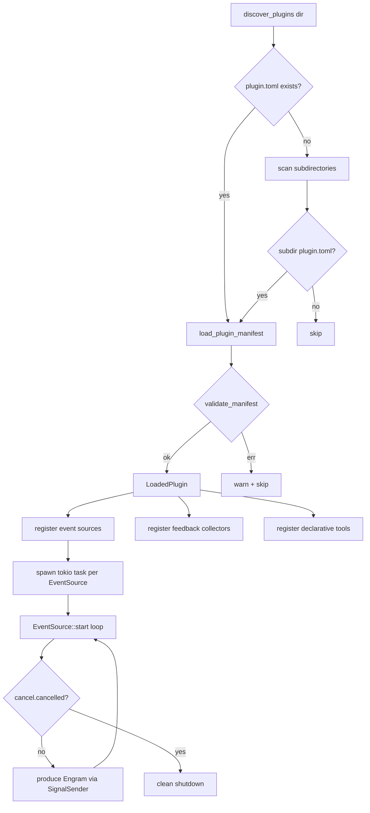
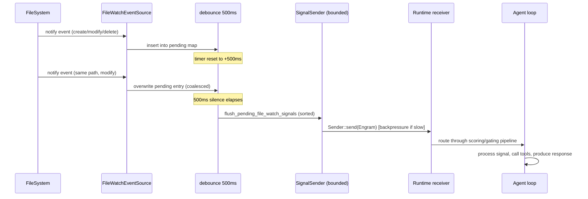
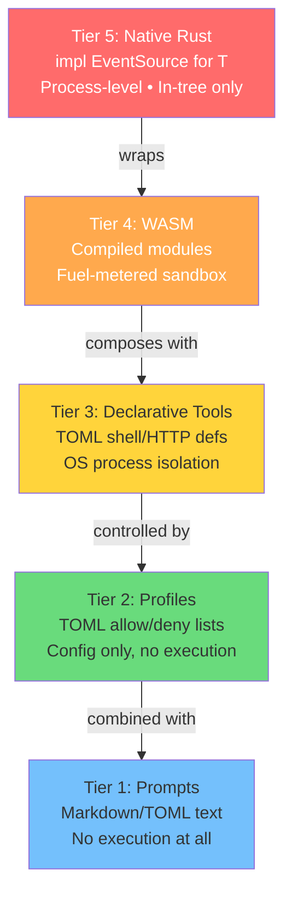
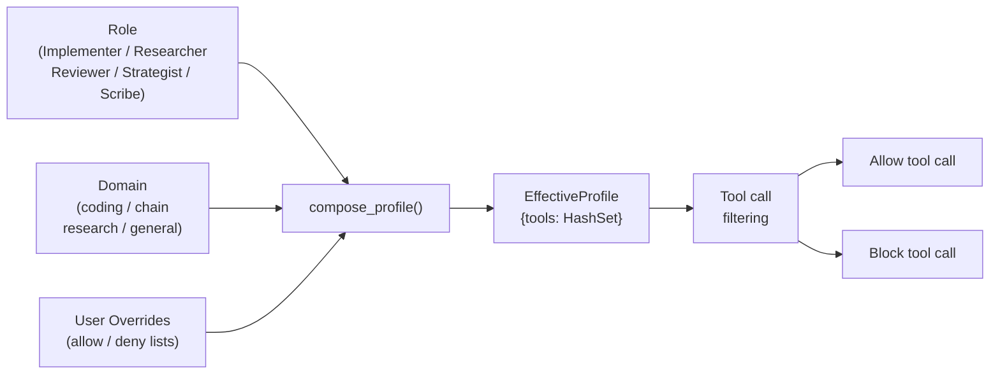
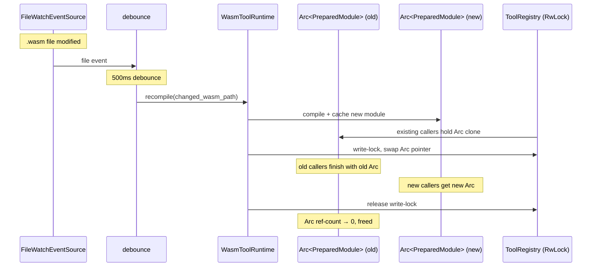
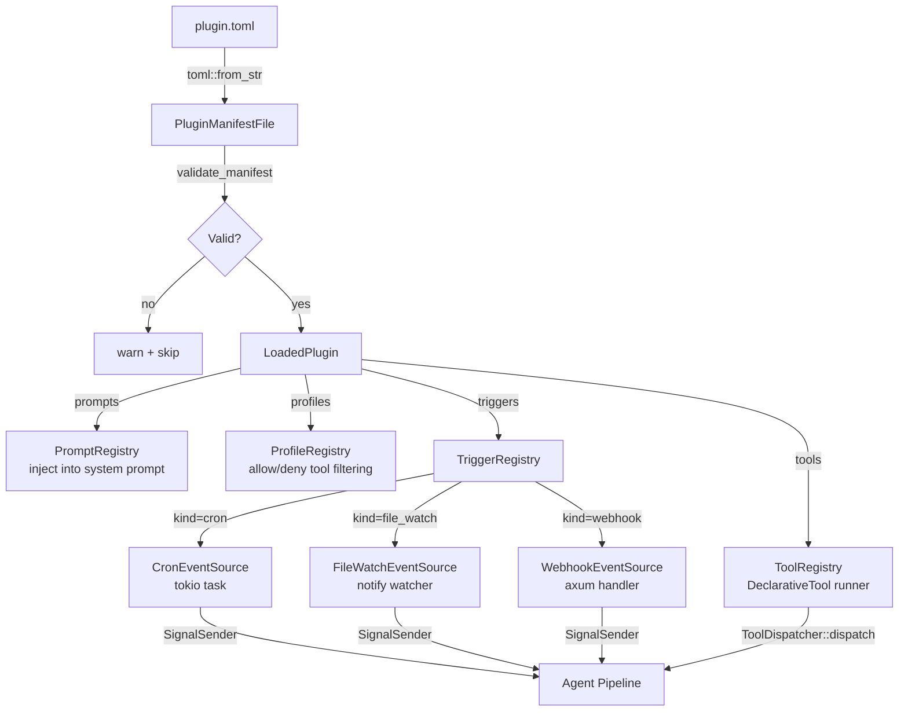

# Plugin & Extension System

**Source provenance**: Roko plugin SDK at
`crates/roko-plugin/src/lib.rs`,
`crates/roko-plugin/src/manifest.rs`,
`crates/roko-std/src/roles.rs`,
`crates/roko-std/src/scorer.rs`,
and design documents `docs/v2/12-EXTENSIONS.md`, `docs/v2/13-TRIGGERS.md`.

**Priority**: LOW — IronClaw already has a solid WASM extension system, but Roko
introduces several concepts with no direct IronClaw equivalent: push-based event
injection, asynchronous outcome feedback, declarative TOML tools, and composable
scorers.

**Tool discovery boundary**: This document covers *local* tool discovery — scanning `~/.ironclaw/plugins/` directories for TOML manifests (`discover_plugins()`) and watching `src/tools/wasm/` for `.wasm` files (hot-reload). For *remote* tool discovery via the MCP JSON-RPC `tools/list` handshake to external servers, see [mcp-editor-integration.md](./mcp-editor-integration.md) section 4. The two mechanisms are additive: local tools load at startup from disk; MCP tools load per-session over the network. In IronClaw both register into `ToolRegistry`, but through different code paths (`src/registry/` vs `src/tools/mcp/client.rs`).

**Related documents**: [mcp-editor-integration.md](./mcp-editor-integration.md) — Roko's hook v2 system (section 13 here, 22 hooks) complements MCP's `tools/call` invocation path; [control-plane.md](./control-plane.md) — plugin events forwarded via the Control Plane's SSE bus.

---

## Table of Contents

1. [Overview and Motivation](#1-overview-and-motivation)
2. [Architectural Context: How Plugins Fit in Roko](#2-architectural-context-how-plugins-fit-in-roko)
3. [The EventSource Trait](#3-the-eventsource-trait)
4. [Built-in EventSource: FileWatchEventSource](#4-built-in-eventsource-filewatcheventsource)
5. [Built-in EventSource: CronEventSource](#5-built-in-eventsource-croneventsource)
6. [The FeedbackCollector Trait](#6-the-feedbackcollector-trait)
7. [PluginManifest and Builder API](#7-pluginmanifest-and-builder-api)
8. [TOML Manifest System](#8-toml-manifest-system)
9. [The 5-Tier Extensibility Model](#9-the-5-tier-extensibility-model)
10. [Role-Based Profiles (roko-std)](#10-role-based-profiles-roko-std)
11. [Composable Scorers (roko-std)](#11-composable-scorers-roko-std)
12. [Filesystem Hot-Reload with Debouncing](#12-filesystem-hot-reload-with-debouncing)
13. [v2 Extension System: 8 Layers, 22 Hooks, 6 Decision Enums](#13-v2-extension-system-8-layers-22-hooks-6-decision-enums)
14. [v2 Trigger System](#14-v2-trigger-system)
15. [Mermaid Diagrams](#15-mermaid-diagrams)
16. [Benchmarking and Performance Analysis](#16-benchmarking-and-performance-analysis)
17. [Practical Examples](#17-practical-examples)
18. [IronClaw Comparison and Gap Analysis](#18-ironclaw-comparison-and-gap-analysis)
19. [IronClaw Integration Plan](#19-ironclaw-integration-plan)
20. [Plugin Failure and Permission Stories](#20-plugin-failure-and-permission-stories)
21. [Complexity Assessment](#21-complexity-assessment)
22. [References](#22-references)

---

## 1. Overview and Motivation

### Why AI Agents Need Plugin Architectures

Plugin architectures have been a cornerstone of extensible software since Eclipse
popularized the pattern in the early 2000s [1][2]. The core proposition is
separation of concerns: a stable core exposes well-defined extension points, and
third-party code adds functionality without modifying the core. WordPress,
Firefox, and VS Code demonstrate the pattern at scale across different domains.

For AI agents, extensibility is more than a convenience — it is an architectural
necessity. An AI agent must perceive its environment (read files, receive
webhooks, monitor services), act on it (call tools, write code, send messages),
and learn from outcomes (was the PR merged? did the deployment succeed?). No
single team can anticipate all the perception sources, action mechanisms, and
feedback channels that users will need. A plugin system lets users extend all
three dimensions without forking the agent.

### Roko's Approach

Roko's plugin system addresses this challenge through a layered SDK split across
two crates:

- **`roko-plugin`** — the runtime plugin SDK. Defines the `EventSource` and
  `FeedbackCollector` traits, concrete implementations for filesystem watching
  and cron scheduling, TOML manifest parsing, and plugin discovery from disk.
  This is the crate that plugin authors depend on.

- **`roko-std`** — the standard library of built-in behaviors. Defines
  role-based tool profiles (Implementer, Researcher, Reviewer, Strategist,
  Scribe), composable scorers (`SumScorer`, `MulScorer`, `ConstScorer`), the
  static tool registry, and NoOp trait implementations.

The design philosophy: **push events in, collect feedback out, declare everything
in TOML where possible, write code only when you must.**

### The Three Missing Dimensions

Most AI agent frameworks treat extensions as tool-call responders: the agent
calls a tool, the tool responds. This pull-based model works for interactive
use but fails in three scenarios:

1. **Push-based event injection** via `EventSource` — extensions push signals
   into the agent loop without waiting to be called. A file watcher detects a
   change and injects an Engram; a cron schedule fires and emits a task signal.

2. **Asynchronous outcome feedback** via `FeedbackCollector` — extensions poll
   external systems for the outcomes of past work and feed those signals back
   into the learning pipeline. Days after the agent creates a PR, the collector
   discovers it was merged and reports `FeedbackOutcome::Merged`.

3. **Declarative tool definition** via TOML manifests — a `[[tools]]` section
   in a TOML file wraps a shell command as an agent-callable tool without any
   compiled code. This covers the large class of CLI-wrapper tools that every
   development workflow needs.

These three capabilities, combined with a tiered manifest system (prompts,
profiles, tools, triggers), create a plugin architecture that covers the full
agent lifecycle: perception (events), action (tools), and learning (feedback).

---

## 2. Architectural Context: How Plugins Fit in Roko

Roko's architecture is built around the concept of **Engrams** — typed signals
that flow through the system. An `Engram` has a `Kind` (Task, Finding, custom
strings) and a `Body` (text, JSON, binary). Everything that happens in Roko —
user messages, tool calls, memory retrievals, scheduled events — is ultimately
an Engram flowing through a processing pipeline.

Plugins interact with this pipeline through the `SignalSender` type:

```rust
// `crates/roko-plugin/src/lib.rs` (line 33)
/// Cloneable bounded sender used by event sources to publish signals into Roko.
pub type SignalSender = Sender<Engram>;
```

This is a `tokio::sync::mpsc::Sender<Engram>` — a bounded, async-safe channel
sender. When an `EventSource` wants to inject a signal, it constructs an
`Engram` and sends it through this channel. The runtime on the other end
receives the Engram and routes it through the standard processing pipeline
(scoring, gating, composition, action).

The `CancellationToken` from `tokio-util` provides cooperative shutdown. When
the runtime wants to stop a plugin, it cancels the token. The plugin's `start()`
method is expected to check this token and exit cleanly.

### Dependency Graph

```
roko-core        (Engram, Kind, Body, Result, config types)
    |
    v
roko-plugin      (EventSource, FeedbackCollector, manifest, file-watch, cron)
    |
    v
roko-std         (roles, scorers, tool registry, NoOp impls)
    |
    v
roko-runtime     (plugin loading, signal routing, feedback scheduling)
```

The plugin crate's full dependency list from
`crates/roko-plugin/Cargo.toml`:

```toml
[dependencies]
async-trait = { workspace = true }
chrono = { workspace = true }
globset = { workspace = true }
serde = { workspace = true, features = ["derive"] }
serde_json = { workspace = true }
toml = { workspace = true }
tracing = { workspace = true }
cron = "0.12"
notify = "8.2.0"
tokio = { workspace = true, features = ["macros", "rt", "sync"] }
tokio-util = { workspace = true }
```

This isolation is deliberate: plugins should compile fast and not pull in the
entire Roko dependency tree. There is no dependency on the runtime, agent, or
any specific LLM provider.

---

## 3. The EventSource Trait

The `EventSource` trait is the core abstraction for push-based event injection.
Any component that can produce a stream of events for the agent to process
implements this trait. This is conceptually similar to the Observer pattern [3],
but adapted for async Rust with cooperative cancellation.

### Full Trait Definition

```rust
// `crates/roko-plugin/src/lib.rs` (lines 134-144)

/// An asynchronous source of signals.
///
/// Implementors are expected to run until `cancel` fires, publishing
/// [`Engram`]s via `sender`. The trait is object-safe, so sources can be
/// stored and driven as `Box<dyn EventSource>`.
#[async_trait]
pub trait EventSource: Send + Sync + 'static {
    /// Human-readable source name.
    fn name(&self) -> &str;

    /// The source kind.
    fn kind(&self) -> EventSourceKind;

    /// Start the source and keep running until cancellation is requested.
    async fn start(&self, sender: SignalSender, cancel: CancellationToken) -> Result<()>;
}
```

### Design Decisions

**Object safety.** The trait is object-safe (`Box<dyn EventSource>` works).
This allows the runtime to store a heterogeneous collection of event sources
without generics or enum wrappers. The test suite explicitly verifies this:

```rust
// `crates/roko-plugin/src/lib.rs` (lines 739-741)
let source: Box<dyn EventSource> = Box::new(DummyEventSource);
assert_eq!(source.name(), "dummy");
assert_eq!(source.kind(), EventSourceKind::Custom("dummy".to_string()));
```

**Long-running start().** The `start()` method is not a fire-and-forget
initializer. It runs for the entire lifetime of the source, blocking on the
`cancel` token. This is the event loop pattern: the method enters a loop,
produces events, and only returns when cancelled. This design means each
EventSource owns its own event loop, which simplifies the runtime (it just
spawns a tokio task per source).

**Bounded sender.** The `SignalSender` is a bounded channel
(`tokio::sync::mpsc::Sender`). If the receiver is slow, the sender will
apply backpressure. This prevents a fast event source (like a file watcher
in a rapidly changing directory) from overwhelming the agent pipeline. This
follows the reactive streams principle of flow control through backpressure [4].

**CancellationToken.** Using `tokio_util::sync::CancellationToken` instead
of a simple boolean flag provides safe async cancellation. The source can
`cancel.cancelled().await` in a `tokio::select!` alongside its event loop,
ensuring clean shutdown without polling.

### EventSourceKind Enum

```rust
// `crates/roko-plugin/src/lib.rs` (lines 67-78)

/// Kinds of event sources supported by the plugin SDK.
#[derive(Debug, Clone, PartialEq, Eq, Hash)]
#[non_exhaustive]
pub enum EventSourceKind {
    /// HTTP webhook source.
    Webhook,
    /// Scheduled source.
    Cron,
    /// Filesystem watcher source.
    FileWatch,
    /// Custom source type provided by a plugin.
    Custom(String),
}
```

The `#[non_exhaustive]` attribute means new variants can be added in future
versions without breaking downstream code. The `Custom(String)` variant is
the escape hatch for plugin authors who need source kinds not covered by the
built-in variants.

### Implementing EventSource: Minimal Example

From the test suite, here is the minimal working implementation:

```rust
// `crates/roko-plugin/src/lib.rs` (lines 689-710)

struct DummyEventSource;

#[async_trait]
impl EventSource for DummyEventSource {
    fn name(&self) -> &str {
        "dummy"
    }

    fn kind(&self) -> EventSourceKind {
        EventSourceKind::Custom("dummy".to_string())
    }

    async fn start(&self, sender: SignalSender, cancel: CancellationToken) -> Result<()> {
        let signal = Engram::builder(Kind::Task)
            .body(Body::text("hello"))
            .build();
        sender.send(signal).await.expect("signal should be sent");
        cancel.cancelled().await;
        Ok(())
    }
}
```

This source emits a single "hello" Engram on startup, then waits for
cancellation. A real source would loop, producing events as they occur.

---

## 4. Built-in EventSource: FileWatchEventSource

The `FileWatchEventSource` is a production-grade filesystem watcher built on
the `notify` crate (v8.2.0). It watches configured directories for file create,
modify, and delete events, applies include/exclude glob filters, debounces rapid
changes, and emits typed Engrams for each event.

### Construction

```rust
// `crates/roko-plugin/src/lib.rs` (lines 82-127)

#[derive(Debug, Clone)]
pub struct FileWatchEventSource {
    paths: Vec<WatcherPathConfig>,
}

impl FileWatchEventSource {
    /// Create a watcher for the given directories.
    pub fn new<I, P>(directories: I) -> Self
    where
        I: IntoIterator<Item = P>,
        P: Into<PathBuf>,
    { /* ... */ }

    /// Create a watcher from fully-specified path configs.
    pub fn from_paths<I>(paths: I) -> Self
    where
        I: IntoIterator<Item = WatcherPathConfig>,
    { /* ... */ }

    /// Create a watcher from config.
    pub fn from_config(config: WatcherConfig) -> Self { /* ... */ }

    /// Get the configured path entries.
    pub fn paths(&self) -> &[WatcherPathConfig] { /* ... */ }
}
```

The `WatcherPathConfig` type (from `roko-core`) specifies a directory, include
globs, and exclude globs:

```rust
// `crates/roko-core/src/config/subscriptions.rs`
pub struct WatcherPathConfig {
    pub directory: PathBuf,
    pub include: Vec<String>,   // glob patterns that opt paths in
    pub exclude: Vec<String>,   // glob patterns that suppress paths
}
```

### Glob Filtering

The file watcher compiles include and exclude patterns into `GlobSet` instances
from the `globset` crate for efficient matching. Default excludes are always
applied to suppress editor temporaries, VCS internals, and OS metadata:

```rust
// `crates/roko-plugin/src/lib.rs` (lines 459-473)

fn default_file_watch_excludes() -> &'static [&'static str] {
    &[
        ".git",
        ".git/**",
        "**/.git",
        "**/.git/**",
        "**/*.swp",
        "**/*.swx",
        "**/*~",
        "**/.#*",
        "**/#*#",
        "**/.DS_Store",
        "**/Thumbs.db",
    ]
}
```

These defaults are merged with any user-specified exclude patterns. The filtering
logic tests both absolute and relative paths against the glob sets:

```rust
// `crates/roko-plugin/src/lib.rs` (lines 479-503)

fn watch_path_is_enabled(
    path: &Path,
    watch_root: &Path,
    filters: &CompiledFileWatchPath,
) -> bool {
    let mut candidates = Vec::with_capacity(2);
    candidates.push(normalize_glob_path(path));

    if let Ok(relative) = path.strip_prefix(watch_root) {
        let relative = normalize_glob_path(relative);
        if !relative.is_empty() {
            candidates.push(relative);
        }
    }

    let included = match &filters.include {
        Some(include) => candidates.iter().any(|candidate| include.is_match(candidate)),
        None => true,
    };
    if !included {
        return false;
    }

    !candidates.iter().any(|candidate| filters.exclude.is_match(candidate))
}
```

### Event Classification

File system events from `notify` are classified into three signal kinds using
constants from `roko-core`:

```rust
// `crates/roko-plugin/src/lib.rs` (lines 514-521)

fn classify_file_watch_event(kind: &EventKind) -> Option<(&'static str, &'static str)> {
    match kind {
        EventKind::Create(_) => Some((FS_CREATED, "created")),
        EventKind::Modify(_) => Some((FS_MODIFIED, "modified")),
        EventKind::Remove(_) => Some((FS_DELETED, "deleted")),
        _ => None,
    }
}
```

The emitted signal contains a JSON body with the affected path and event kind:

```rust
// `crates/roko-plugin/src/lib.rs` (lines 505-512)

fn file_watch_signal(path: &Path, signal_kind: &str, event_kind: &str) -> Engram {
    Engram::builder(Kind::Custom(signal_kind.to_string()))
        .body(Body::Json(serde_json::json!({
            "path": path.to_string_lossy().into_owned(),
            "event_kind": event_kind,
        })))
        .build()
}
```

### Start Lifecycle

When `start()` is called on `FileWatchEventSource`:

1. Compile glob patterns into `GlobSet` instances via `compile_file_watch_paths()`.
2. If no paths configured, wait on cancellation and return.
3. Create an OS-native file watcher via `notify::recommended_watcher()`.
4. Register each configured directory with `RecursiveMode::Recursive`.
5. Enter `drain_file_watch_events()` — the debounced event loop.

```rust
// `crates/roko-plugin/src/lib.rs` (lines 334-372)

#[async_trait]
impl EventSource for FileWatchEventSource {
    fn name(&self) -> &str { "fswatcher" }
    fn kind(&self) -> EventSourceKind { EventSourceKind::FileWatch }

    async fn start(&self, sender: SignalSender, cancel: CancellationToken) -> Result<()> {
        let watched_paths = compile_file_watch_paths(&self.paths)?;
        if watched_paths.is_empty() {
            cancel.cancelled().await;
            return Ok(());
        }

        let (event_tx, event_rx) = tokio::sync::mpsc::unbounded_channel();
        let mut watcher = recommended_watcher(move |result| {
            let _ = event_tx.send(result);
        }).map_err(|err| {
            RokoError::transport(format!("failed to create filesystem watcher: {err}"))
        })?;

        for watched_path in &watched_paths {
            watcher
                .watch(&watched_path.directory, RecursiveMode::Recursive)
                .map_err(|err| {
                    RokoError::config(format!(
                        "failed to watch directory '{}': {err}",
                        watched_path.directory.display()
                    ))
                })?;
        }

        drain_file_watch_events(event_rx, sender, cancel, watched_paths).await
    }
}
```

---

## 5. Built-in EventSource: CronEventSource

The `CronEventSource` provides scheduled event emission using standard cron
expressions. It is backed by the `cron` crate (v0.12) for expression parsing
and schedule computation.

### Construction

```rust
// `crates/roko-plugin/src/lib.rs` (lines 212-219)

impl CronEventSource {
    /// Create a cron event source from config.
    pub fn from_config(config: SchedulerConfig) -> Self {
        Self {
            schedules: config.cron.into_iter().map(CronSchedule::from).collect(),
        }
    }
}
```

The `SchedulerConfig` (from `roko-core`) contains a list of `SchedulerCronConfig`
entries, each specifying a name, cron expression, signal kind, and optional
metadata.

### Schedule Data Structures

```rust
// `crates/roko-plugin/src/lib.rs` (lines 152-177)

pub struct CronScheduleStatus {
    pub name: String,
    pub expression: String,
    pub signal_kind: String,
    pub next_fire: Option<DateTime<Utc>>,
}

struct CronSchedule {
    name: String,
    expression: String,
    signal_kind: String,
    metadata: Value,
}
```

### Event Loop

The cron source compiles all schedule expressions at startup, then enters a
loop that:

1. Checks which schedules are due (their `next_fire` is in the past).
2. If none are due, sleeps until the next fire time using `tokio::time::sleep`.
3. For each due schedule, emits a signal and advances `next_fire`.
4. Cooperatively checks the cancellation token on each iteration.

```rust
// `crates/roko-plugin/src/lib.rs` (lines 271-331)

async fn start(&self, sender: SignalSender, cancel: CancellationToken) -> Result<()> {
    let mut schedules = self.compile_schedules()?;
    if schedules.is_empty() {
        cancel.cancelled().await;
        return Ok(());
    }

    loop {
        if cancel.is_cancelled() { break; }

        let now = Utc::now();
        let mut due = Vec::new();
        let mut next_fire: Option<DateTime<Utc>> = None;

        for (idx, active) in schedules.iter().enumerate() {
            match active.next_fire {
                Some(fire_at) if fire_at <= now => due.push(idx),
                Some(fire_at) => {
                    next_fire = Some(match next_fire {
                        Some(current) => current.min(fire_at),
                        None => fire_at,
                    });
                }
                None => {}
            }
        }

        if due.is_empty() {
            let Some(fire_at) = next_fire else {
                cancel.cancelled().await;
                break;
            };
            let wait = fire_at.signed_duration_since(now).to_std().unwrap_or_default();
            tokio::select! {
                _ = cancel.cancelled() => break,
                _ = tokio::time::sleep(wait) => {}
            }
            continue;
        }

        for idx in due {
            let fired_at = Utc::now();
            let signal = cron_signal(&schedules[idx].schedule, fired_at);
            sender.send(signal).await.map_err(|_| {
                RokoError::cancelled(format!(
                    "cron signal receiver dropped for schedule '{}'",
                    schedules[idx].schedule.name.as_str()
                ))
            })?;
            schedules[idx].next_fire = schedules[idx].parsed.upcoming(Utc).next();
        }
    }
    Ok(())
}
```

### Cron Signal Format

Each cron firing produces an Engram with a custom kind and a JSON body
containing the schedule metadata:

```rust
// `crates/roko-plugin/src/lib.rs` (lines 374-382)

fn cron_signal(schedule: &CronSchedule, fired_at: DateTime<Utc>) -> Engram {
    Engram::builder(Kind::Custom(schedule.signal_kind.clone()))
        .body(Body::Json(serde_json::json!({
            "name": schedule.name.clone(),
            "expression": schedule.expression.clone(),
            "fired_at": fired_at.to_rfc3339(),
        })))
        .build()
}
```

### Error Handling

Invalid cron expressions are caught at compile time (when `start()` is called),
not at construction time. The test suite verifies this:

```rust
// `crates/roko-plugin/src/lib.rs` (lines 783-805)

let source = CronEventSource {
    schedules: vec![CronSchedule {
        name: "broken".to_string(),
        expression: "definitely not cron".to_string(),
        signal_kind: "scheduler:cron:broken".to_string(),
        metadata: json!({ "source": "test" }),
    }],
};
let err = source
    .start(sender, cancel)
    .await
    .expect_err("invalid cron should fail");
assert!(err.to_string().contains("broken"), "error should include schedule name");
```

---

## 6. The FeedbackCollector Trait

While `EventSource` handles incoming events (perception), `FeedbackCollector`
handles outcome evaluation (learning). It is the mechanism by which Roko
discovers whether its past work was good.

### Full Trait Definition

```rust
// `crates/roko-plugin/src/lib.rs` (lines 599-616)

/// Periodically collects outcomes for previously emitted work.
///
/// Collectors poll external systems like GitHub, Slack, or CI at a fixed
/// cadence and return typed feedback for any results found since the last run.
#[async_trait]
pub trait FeedbackCollector: Send + Sync + 'static {
    /// Human-readable collector name.
    fn name(&self) -> &str;

    /// Services this collector talks to, such as `["github", "slack"]`.
    fn services(&self) -> Vec<String>;

    /// Poll interval for this collector.
    fn interval(&self) -> std::time::Duration;

    /// Collect feedback observed since the given timestamp.
    async fn collect(&self, since: DateTime<Utc>) -> Result<Vec<FeedbackSignal>>;
}
```

### Design Decisions

**Polling, not streaming.** Unlike `EventSource` (which is push-based and
long-running), `FeedbackCollector` uses a poll model. The runtime calls
`collect(since)` periodically at the collector's declared `interval()`. This is
deliberate: feedback collection is inherently retrospective (checking what
happened to past work), and many external APIs are request-response (GitHub API,
CI systems, Slack). A poll model is simpler and more reliable than maintaining
persistent connections to every feedback source.

**Multi-service support.** A single collector can talk to multiple services.
The `services()` method returns a list of service names, allowing the runtime
to understand which external systems a collector depends on. This is useful
for diagnostics ("why is feedback missing? Because the GitHub collector can't
reach github.com").

**Since-based collection.** The `collect(since)` method takes a timestamp and
returns all feedback observed since that time. The runtime tracks the last
successful collection time per collector, so feedback is not missed across
process restarts (assuming the runtime persists the timestamp).

### FeedbackSignal and FeedbackOutcome

```rust
// `crates/roko-plugin/src/lib.rs` (lines 36-64)

#[derive(Debug, Clone, Copy, PartialEq, Eq, Serialize, Deserialize)]
#[non_exhaustive]
pub enum FeedbackOutcome {
    /// The original work was accepted.
    Approved,
    /// The original work was rejected.
    Rejected,
    /// The original work received comments but no final verdict.
    Commented,
    /// The collector did not produce a meaningful signal.
    Ignored,
    /// The original work was merged.
    Merged,
}

#[derive(Debug, Clone, PartialEq, Serialize, Deserialize)]
pub struct FeedbackSignal {
    /// Identifier of the original episode being reported on.
    pub original_episode_id: String,
    /// External service the feedback was collected from.
    pub service: String,
    /// Collector outcome for the original episode.
    pub outcome: FeedbackOutcome,
    /// Arbitrary structured metadata supplied by the service.
    pub metadata: Value,
    /// Time the feedback was observed.
    pub timestamp: DateTime<Utc>,
}
```

The `original_episode_id` ties feedback back to the work that produced it.
In Roko, an "episode" is a unit of work (a task, a PR review, a code change).
When the agent produces work, it records an episode ID. When the
FeedbackCollector later discovers that the PR was merged or rejected, it
references that episode ID so the learning system can update its quality
estimates.

The `metadata` field is `serde_json::Value`, allowing each service to include
arbitrary structured data (reviewer name, CI build URL, test results, etc.)
without constraining the schema.

### Implementing FeedbackCollector: Example

```rust
// `crates/roko-plugin/src/lib.rs` (lines 712-735)

struct DummyFeedbackCollector;

#[async_trait]
impl FeedbackCollector for DummyFeedbackCollector {
    fn name(&self) -> &str { "dummy-feedback" }

    fn services(&self) -> Vec<String> {
        vec!["github".to_string(), "slack".to_string()]
    }

    fn interval(&self) -> Duration { Duration::from_secs(60) }

    async fn collect(&self, _since: DateTime<Utc>) -> Result<Vec<FeedbackSignal>> {
        Ok(vec![FeedbackSignal {
            original_episode_id: "episode-123".to_string(),
            service: "github".to_string(),
            outcome: FeedbackOutcome::Approved,
            metadata: json!({ "reviewer": "alice" }),
            timestamp: DateTime::<Utc>::UNIX_EPOCH,
        }])
    }
}
```

A production GitHub feedback collector would call the GitHub API to check PR
status, review comments, and merge state for episodes that produced PRs.

### NoOp Implementations

```rust
// `crates/roko-std/src/noop.rs` (lines 18-26)

pub struct NoOpScorer;
impl ScoreFn for NoOpScorer {
    fn score(&self, _s: &Engram, _ctx: &Context) -> Score {
        Score::NEUTRAL
    }
    fn name(&self) -> &'static str { "noop_scorer" }
}
```

The `roko-std` module also provides `NoOpGate` (always passes), `NoOpRouter`
(picks first candidate), `NoOpComposer` (identity), and `NoOpPolicy` (emits
nothing). These are re-exported from
`crates/roko-std/src/lib.rs`
for convenient access.

---

## 7. PluginManifest and Builder API

The `PluginManifest` type bundles event sources and feedback collectors into a
single named, versioned package. The `PluginBuilder` provides a fluent API for
construction, following the builder pattern common in Rust APIs.

### PluginManifest

```rust
// `crates/roko-plugin/src/lib.rs` (lines 619-628)

pub struct PluginManifest {
    pub name: String,
    pub version: String,
    pub event_sources: Vec<Box<dyn EventSource>>,
    pub feedback_collectors: Vec<Box<dyn FeedbackCollector>>,
}
```

### PluginBuilder

```rust
// `crates/roko-plugin/src/lib.rs` (lines 631-676)

pub struct PluginBuilder {
    name: String,
    version: String,
    event_sources: Vec<Box<dyn EventSource>>,
    feedback_collectors: Vec<Box<dyn FeedbackCollector>>,
}

impl PluginBuilder {
    pub fn new(name: impl Into<String>) -> Self {
        Self {
            name: name.into(),
            version: env!("CARGO_PKG_VERSION").to_string(),
            event_sources: Vec::new(),
            feedback_collectors: Vec::new(),
        }
    }

    pub fn version(mut self, version: impl Into<String>) -> Self {
        self.version = version.into();
        self
    }

    pub fn event_source<T: EventSource>(mut self, source: T) -> Self {
        self.event_sources.push(Box::new(source));
        self
    }

    pub fn feedback_collector<T: FeedbackCollector>(mut self, collector: T) -> Self {
        self.feedback_collectors.push(Box::new(collector));
        self
    }

    pub fn build(self) -> PluginManifest {
        PluginManifest {
            name: self.name,
            version: self.version,
            event_sources: self.event_sources,
            feedback_collectors: self.feedback_collectors,
        }
    }
}
```

The builder defaults the version to `env!("CARGO_PKG_VERSION")`, using the
embedding crate's Cargo version.

### Usage

```rust
// `crates/roko-plugin/src/lib.rs` (lines 1067-1079)

let manifest = PluginBuilder::new("my-plugin")
    .event_source(DummyEventSource)
    .feedback_collector(DummyFeedbackCollector)
    .build();

assert_eq!(manifest.name, "my-plugin");
assert_eq!(manifest.event_sources.len(), 1);
assert_eq!(manifest.feedback_collectors.len(), 1);
```

---

## 8. TOML Manifest System

The TOML manifest system is the declarative side of the plugin SDK. It allows
plugin authors to define prompts, profiles, tools, triggers, and dependencies
without writing Rust code. TOML was chosen over YAML or JSON for its strong
type system, explicit syntax (no implicit type coercion), native comment
support, and established adoption in the Rust ecosystem (Cargo.toml) [5].

### Top-Level Schema

```rust
// `crates/roko-plugin/src/manifest.rs` (lines 61-80)

pub struct PluginManifestFile {
    pub plugin: PluginMeta,
    #[serde(default)]
    pub prompts: Vec<PromptTemplate>,       // Tier 1
    #[serde(default)]
    pub profiles: Vec<ToolProfileBundle>,    // Tier 2
    #[serde(default)]
    pub tools: Vec<DeclarativeTool>,         // Tier 3
    #[serde(default)]
    pub triggers: Vec<TriggerDef>,           // Event source triggers
    #[serde(default)]
    pub dependencies: Vec<PluginDependency>, // Plugin dependencies
}
```

### Plugin Metadata

```rust
// `crates/roko-plugin/src/manifest.rs` (lines 83-98)

pub struct PluginMeta {
    pub name: String,           // required, must not be empty
    pub version: String,        // required, must not be empty
    pub description: Option<String>,
    pub author: Option<String>,
    pub license: Option<String>,
}
```

### Tier 1: Prompt Templates

Prompt templates are the simplest form of plugin extension. They inject
role-specific prompt text into the agent's system prompt without any code.

```rust
// `crates/roko-plugin/src/manifest.rs` (lines 101-113)

pub struct PromptTemplate {
    pub name: String,               // e.g., "pr-review"
    pub role: Option<String>,       // e.g., "reviewer"
    pub template: String,           // prompt text, may contain {{variable}}
    pub description: Option<String>,
}
```

TOML example:

```toml
[[prompts]]
name = "pr-review"
role = "reviewer"
template = "Review the following PR for correctness and style."
description = "Standard PR review prompt"

[[prompts]]
name = "security-review"
role = "reviewer"
template = "Focus on security vulnerabilities in this code."
```

### Tier 2: Tool Profile Bundles

Profiles define which tools an agent can and cannot use. They are the
declarative equivalent of the `RoleToolProfile` type in `roko-std`.

```rust
// `crates/roko-plugin/src/manifest.rs` (lines 116-129)

pub struct ToolProfileBundle {
    pub name: String,               // e.g., "read-only"
    pub allowed_tools: Vec<String>, // empty = allow all not denied
    pub denied_tools: Vec<String>,
    pub description: Option<String>,
}
```

TOML example:

```toml
[[profiles]]
name = "read-only"
allowed_tools = ["read_file", "grep", "glob"]
denied_tools = ["bash", "write_file"]
description = "Read-only access profile"
```

### Tier 3: Declarative Tools

Declarative tools define shell commands that the agent can invoke, without
requiring Rust or WASM code. They are the "no-code" tool definition mechanism.

```rust
// `crates/roko-plugin/src/manifest.rs` (lines 132-149)

pub struct DeclarativeTool {
    pub name: String,
    pub description: String,
    pub tool: String,                            // registered tool id
    pub argv: Vec<String>,                       // validated argv, never raw shell text
    pub timeout_ms: u64,                         // default: 30000
    pub working_dir: Option<String>,             // relative to project root
    pub env: std::collections::HashMap<String, String>,
}
```

The `timeout_ms` field defaults to 30,000 (30 seconds) via `default_timeout()`.

TOML example:

```toml
[[tools]]
name = "lint-check"
description = "Run clippy on the workspace"
tool = "shell"
argv = ["cargo", "clippy", "--workspace", "--", "-D", "warnings"]
timeout_ms = 60000

[[tools]]
name = "test-run"
description = "Run the test suite"
tool = "shell"
argv = ["cargo", "test", "--workspace"]
# timeout_ms defaults to 30000
```

### Trigger Definitions

Triggers specify event sources that activate plugins. They are defined as a
tagged union discriminated by `kind`:

```rust
// `crates/roko-plugin/src/manifest.rs` (lines 156-192)

#[derive(Debug, Clone, PartialEq, Serialize, Deserialize)]
#[serde(tag = "kind", rename_all = "snake_case")]
pub enum TriggerDef {
    Cron {
        expression: String,
        description: Option<String>,
    },
    FileWatch {
        paths: Vec<String>,
        include: Vec<String>,
        exclude: Vec<String>,
        description: Option<String>,
    },
    Webhook {
        path: String,
        secret: Option<String>,
        description: Option<String>,
    },
}
```

TOML examples:

```toml
[[triggers]]
kind = "cron"
expression = "0 */5 * * * *"
description = "Run every 5 minutes"

[[triggers]]
kind = "file_watch"
paths = ["src/", "tests/"]
include = ["*.rs"]

[[triggers]]
kind = "webhook"
path = "/hooks/code-review"
```

### Plugin Dependencies

```rust
// `crates/roko-plugin/src/manifest.rs` (lines 195-202)

pub struct PluginDependency {
    pub name: String,
    pub version: Option<String>,
}
```

### Validation

The manifest loader performs structural validation after parsing:

```rust
// `crates/roko-plugin/src/manifest.rs` (lines 234-282)

fn validate_manifest(manifest: &PluginManifestFile) -> Result<()> {
    if manifest.plugin.name.is_empty() {
        return Err(RokoError::config("plugin name must not be empty"));
    }
    if manifest.plugin.version.is_empty() {
        return Err(RokoError::config("plugin version must not be empty"));
    }

    // Check for duplicate prompt template names
    let mut prompt_names = std::collections::HashSet::new();
    for prompt in &manifest.prompts {
        if !prompt_names.insert(&prompt.name) {
            return Err(RokoError::config(format!(
                "duplicate prompt template name: '{}'",
                prompt.name
            )));
        }
    }

    // Check for duplicate profile names
    let mut profile_names = std::collections::HashSet::new();
    for profile in &manifest.profiles {
        if !profile_names.insert(&profile.name) {
            return Err(RokoError::config(format!(
                "duplicate profile name: '{}'",
                profile.name
            )));
        }
    }

    // Check for duplicate tool names and non-empty commands
    let mut tool_names = std::collections::HashSet::new();
    for tool in &manifest.tools {
        if !tool_names.insert(&tool.name) {
            return Err(RokoError::config(format!(
                "duplicate tool name: '{}'",
                tool.name
            )));
        }
        if tool.command.is_empty() {
            return Err(RokoError::config(format!(
                "tool '{}' has an empty command",
                tool.name
            )));
        }
    }

    Ok(())
}
```

### Plugin Discovery

> **Scope**: This section covers local filesystem discovery of TOML plugin manifests. For remote tool discovery via the MCP JSON-RPC `tools/list` handshake, see [mcp-editor-integration.md](./mcp-editor-integration.md) section 4 (MCP Wire Types). These are independent paths that both end up in `ToolRegistry`.

The `discover_plugins()` function scans a directory for plugin manifests:

```rust
// `crates/roko-plugin/src/manifest.rs` (lines 297-342)

pub fn discover_plugins(dir: &Path) -> Result<Vec<LoadedPlugin>> {
    // 1. Check for plugin.toml directly in the directory
    // 2. Scan subdirectories for plugin.toml files
    // 3. Log warnings for invalid manifests (don't abort)
    let mut plugins = Vec::new();

    let root_manifest = dir.join("plugin.toml");
    if root_manifest.exists() {
        match load_plugin_manifest(&root_manifest) {
            Ok(manifest) => plugins.push(LoadedPlugin { path: root_manifest, manifest }),
            Err(e) => tracing::warn!("invalid root manifest: {e}"),
        }
    }

    for entry in std::fs::read_dir(dir)?.flatten() {
        if entry.file_type().map(|t| t.is_dir()).unwrap_or(false) {
            let manifest_path = entry.path().join("plugin.toml");
            if manifest_path.exists() {
                match load_plugin_manifest(&manifest_path) {
                    Ok(manifest) => plugins.push(LoadedPlugin {
                        path: manifest_path,
                        manifest,
                    }),
                    Err(e) => tracing::warn!(
                        "invalid manifest at {}: {e}",
                        manifest_path.display()
                    ),
                }
            }
        }
    }

    Ok(plugins)
}
```

The discovery pattern supports two layouts:

```
~/.roko/plugins/
  plugin.toml                    # single plugin in root
  my-plugin/
    plugin.toml                  # plugin in subdirectory
  other-plugin/
    plugin.toml                  # another plugin in subdirectory
```

Invalid manifests in subdirectories produce a warning but do not prevent other
plugins from loading. This is important for robustness: one broken plugin
should not take down the entire system.

### Complete TOML Manifest Example

This is the full example from the test suite, demonstrating all features:

```toml
# `crates/roko-plugin/src/manifest.rs` (FULL_MANIFEST test constant)

[plugin]
name = "code-review"
version = "1.0.0"
description = "Automated code review plugin"
author = "Test Author"
license = "MIT"

[[prompts]]
name = "pr-review"
role = "reviewer"
template = "Review the following PR for correctness and style."
description = "Standard PR review prompt"

[[prompts]]
name = "security-review"
role = "reviewer"
template = "Focus on security vulnerabilities in this code."

[[profiles]]
name = "read-only"
allowed_tools = ["read_file", "grep", "glob"]
denied_tools = ["bash", "write_file"]
description = "Read-only access profile"

[[profiles]]
name = "full-access"
allowed_tools = []
denied_tools = []

[[tools]]
name = "lint-check"
description = "Run clippy on the workspace"
tool = "shell"
argv = ["cargo", "clippy", "--workspace", "--", "-D", "warnings"]
timeout_ms = 60000

[[tools]]
name = "test-run"
description = "Run the test suite"
tool = "shell"
argv = ["cargo", "test", "--workspace"]

[[triggers]]
kind = "cron"
expression = "0 */5 * * * *"
description = "Every 5 minutes"

[[triggers]]
kind = "file_watch"
paths = ["src/", "tests/"]
include = ["*.rs"]

[[triggers]]
kind = "webhook"
path = "/hooks/code-review"

[[dependencies]]
name = "base-tools"
version = "0.1.0"
```

---

## 9. The 5-Tier Extensibility Model

Roko organizes extensions into tiers by complexity and capability. The manifest
system (from `roko-plugin`) implements tiers 1-3. Tier 4 (SDK/WASM) requires
compiled code. Tier 5 (native Rust) is for in-tree extensions only. This
graduated model follows the microkernel architecture pattern, where a minimal
core is extended by plugins of increasing capability [1][2].

### Tier Summary

| Tier | Name | Complexity | What You Write | Sandboxing | Distribution |
|------|------|-----------|----------------|------------|--------------|
| **1** | Prompts | Lowest | Markdown/TOML front-matter | None (no execution) | Marketplace |
| **2** | Profiles | Low | TOML allow/deny tool lists | None (config only) | Marketplace |
| **3** | Declarative Tools | Medium | TOML shell/HTTP tool defs | OS-level process isolation | Verified publishers |
| **4** | WASM | High | Compiled WASM modules | WASM sandbox (fuel-metered) | Marketplace |
| **5** | Native Rust | Highest | `impl EventSource for T` | Process-level | In-tree only |

### Tier 1: Prompts

The simplest extension. A prompt template is a text string, optionally scoped
to a role, that gets injected into the agent's system prompt. No code runs.
No sandbox needed. The template may contain `{{variable}}` placeholders for
runtime substitution.

**When to use:** Adding domain-specific instructions, style guides, review
checklists, or behavioral constraints without touching code.

**IronClaw equivalent:** SKILL.md files in `~/.ironclaw/skills/` or project
`skills/` directories. IronClaw's skill system is more sophisticated (it has
gating, scoring, budget fitting, and trust-based attenuation), but the basic
concept is the same: a text file that extends the agent's prompt.

### Tier 2: Profiles

A profile bundles tool allow/deny lists into a named configuration. Profiles
define the agent's "posture" — what it can and cannot do — without requiring
any runtime code.

**When to use:** Creating a "read-only analyst" or "full-access implementer"
configuration. Also useful for compliance scenarios where certain tools must
be blocked. This maps to the Role-Based Access Control (RBAC) model [6],
where roles define permission boundaries.

**IronClaw equivalent:** IronClaw's skill attenuation system (`src/skills/`)
provides trust-based tool ceilings (Trusted skills get full tool access,
Installed skills get read-only tools). Roko's profiles are more explicit
(named allow/deny lists) but less dynamic.

### Tier 3: Declarative Tools

Declarative tools define shell commands or HTTP endpoints that the agent can
call, specified entirely in TOML. No Rust, no WASM, no compilation. The runtime
executes the command in a subprocess with timeout, working directory, and
environment variable support.

**When to use:** Wrapping existing CLI tools (`cargo clippy`, `npm test`,
`kubectl get pods`) as agent-callable tools without writing code.

**IronClaw equivalent:** No direct equivalent. IronClaw requires either Rust
built-in tools (`src/tools/builtin/`) or WASM modules (`src/tools/wasm/`).
There is no TOML-defined tool mechanism. This is a genuine gap.

### Tier 4: WASM

Full compiled plugins running in a WASM sandbox with fuel metering and
capability-based security [7]. WASM plugins can implement EventSource,
FeedbackCollector, or custom tool handlers.

**When to use:** Complex integrations that need custom logic beyond what a
shell command can provide, but that should not have full process access.

**IronClaw equivalent:** IronClaw has a mature WASM tool system at
`src/tools/wasm/` with wasmtime compilation, fuel metering, memory limits,
network allowlisting, credential injection, and rate limiting. This is one
area where IronClaw is ahead.

### Tier 5: Native Rust

Full `impl Extension for MyExt` compiled into the Roko binary. No sandbox
(shares the process). Reserved for built-in extensions and trusted in-tree
plugins.

**When to use:** Built-in system extensions (git, compiler, test-runner,
safety checks) that need full process access and zero overhead.

**IronClaw equivalent:** IronClaw's built-in tools at `src/tools/builtin/`
and hooks at `src/hooks/`.

---

## 10. Role-Based Profiles (roko-std)

The `roko-std` crate provides a comprehensive role-based tool profiling system
that controls which tools different agent roles can access. This is the
runtime complement to the TOML profile bundles from the manifest system.

The key innovation is a three-layer composition model: **role x domain x
override**. Rather than a single flat permission list, Roko computes the
effective tool set by intersecting:

1. What the agent's **role** allows (Implementer, Researcher, Reviewer, etc.)
2. What the **domain** enables (coding, chain, research, general)
3. What the **user** overrides (custom allow/deny lists)

This is conceptually related to attribute-based access control (ABAC) [6],
where multiple attributes (role, domain, context) determine permissions.

### Role Archetypes

```rust
// `crates/roko-std/src/roles.rs` (lines 20-32)

pub enum RoleToolProfileKind {
    Implementer,  // Code-producing role. No extra filtering.
    Researcher,   // Evidence-gathering role. Read-only tools only.
    Reviewer,     // Diff-review role. Read tools plus comment/note tools.
    Strategist,   // Planning role. Read tools plus plan-management tools.
    Scribe,       // Documentation role. Read + write, no execution.
}
```

### Canonical Tool Sets

The module defines named tool sets that form the building blocks for profiles:

```rust
// `crates/roko-std/src/roles.rs` (lines 72-117)

// Read-only tools shared by research, review, and planning profiles
pub const READ_TOOLS: [&str; 5] = [
    read_file::NAME, grep::NAME, glob::NAME, web_search::NAME, web_fetch::NAME,
];

// Comment / note-taking tools for reviewer-style profiles
pub const COMMENT_TOOLS: [&str; 1] = [todo_write::NAME];

// Plan-management tools for strategist-style profiles
pub const PLAN_TOOLS: [&str; 3] = [todo_write::NAME, exit_plan_mode::NAME, task_agent::NAME];

// Tools that mutate code or execute destructive commands
pub const DESTRUCTIVE_TOOLS: [&str; 7] = [
    write_file::NAME, edit_file::NAME, multi_edit::NAME,
    apply_patch::NAME, notebook_edit::NAME, bash::NAME, run_tests::NAME,
];

// Execution-only tools denied to the Scribe role
pub const EXEC_TOOLS: [&str; 2] = [bash::NAME, run_tests::NAME];
```

### Profile Definitions

Each role archetype has a corresponding `const` profile that combines the
tool sets:

```rust
// `crates/roko-std/src/roles.rs` (lines 120-161)

// Implementer: all tools allowed
pub const IMPLEMENTER_TOOL_PROFILE: RoleToolProfile =
    RoleToolProfile::allow_all(RoleToolProfileKind::Implementer);

// Researcher: read-only, with mutation and shell blocked
pub const RESEARCHER_TOOL_PROFILE: RoleToolProfile = RoleToolProfile::allow_deny(
    RoleToolProfileKind::Researcher,
    &READ_TOOLS,
    &[write_file::NAME, edit_file::NAME, bash::NAME],
);

// Reviewer: read tools plus lightweight comment/note tooling
pub const REVIEWER_TOOL_PROFILE: RoleToolProfile = RoleToolProfile::allow_deny(
    RoleToolProfileKind::Reviewer,
    &REVIEWER_TOOLS,
    &[write_file::NAME, edit_file::NAME],
);

// Strategist: read + plan tools, all destructive ops denied
pub const STRATEGIST_TOOL_PROFILE: RoleToolProfile = RoleToolProfile::allow_deny(
    RoleToolProfileKind::Strategist,
    &STRATEGIST_TOOLS,
    &DESTRUCTIVE_TOOLS,
);

// Scribe: read + write tools, but no shell execution
pub const SCRIBE_TOOL_PROFILE: RoleToolProfile =
    RoleToolProfile::allow_deny(RoleToolProfileKind::Scribe, &SCRIBE_TOOLS, &EXEC_TOOLS);
```

### Domain Tool Profiles

Beyond role profiles, `roko-std` defines domain-specific profiles that
control which tools are relevant for a particular domain:

```rust
// `crates/roko-std/src/roles.rs` (lines 173-268)

pub struct DomainToolProfile {
    pub domain: &'static str,
    pub extra_tools: &'static [&'static str],
    pub excluded_tools: &'static [&'static str],
}
```

Four domains are defined:

| Domain | Extra Tools | Excluded Tools |
|--------|------------|----------------|
| `coding` | All 15 builtins | None |
| `chain` | read_file, grep, glob, bash, web_fetch, web_search | write_file, edit_file, multi_edit, apply_patch, notebook_edit |
| `research` | read_file, grep, glob, web_search, web_fetch, todo_write | write_file, edit_file, multi_edit, apply_patch, notebook_edit, bash, run_tests |
| `general` | None | None |

Domain lookup is case-insensitive with aliases:

```rust
// `crates/roko-std/src/roles.rs` (lines 271-278)

pub fn domain_profile(domain: &str) -> &'static DomainToolProfile {
    match domain.to_ascii_lowercase().as_str() {
        "coding" | "code" => &CODING_DOMAIN_PROFILE,
        "chain" | "defi" | "onchain" => &CHAIN_DOMAIN_PROFILE,
        "research" => &RESEARCH_DOMAIN_PROFILE,
        _ => &GENERAL_DOMAIN_PROFILE,
    }
}
```

### Profile Composition

The `compose_profile()` function computes the effective tool set by
intersecting role, domain, and user override profiles:

```rust
// `crates/roko-std/src/roles.rs` (lines 304-350)

/// Compose an effective tool profile by intersecting role, domain, and overrides.
///
/// The composition rule is:
///   effective = (role_allowed ∪ domain_extra) \ (role_denied ∪ domain_excluded ∪ override_deny)
///
/// If `overrides.allow` is set, it further restricts to only those tools.
pub fn compose_profile(
    role: &RoleToolProfile,
    domain: &DomainToolProfile,
    overrides: &ToolOverrides,
) -> EffectiveProfile {
    let mut allowed: std::collections::HashSet<&str> = role
        .allowed_tools()
        .iter()
        .copied()
        .chain(domain.extra_tools.iter().copied())
        .collect();

    let denied: std::collections::HashSet<&str> = role
        .denied_tools()
        .iter()
        .copied()
        .chain(domain.excluded_tools.iter().copied())
        .chain(overrides.deny.iter().map(|s| s.as_str()))
        .collect();

    allowed.retain(|t| !denied.contains(t));

    if let Some(ref allow_list) = overrides.allow {
        let allow_set: std::collections::HashSet<&str> =
            allow_list.iter().map(|s| s.as_str()).collect();
        allowed.retain(|t| allow_set.contains(t));
    }

    EffectiveProfile { tools: allowed.into_iter().collect() }
}
```

### Role Lookup

The `denied_tools_for_role()` function maps string role labels to denied tool
lists, with case-insensitive matching and alias support:

```rust
// `crates/roko-std/src/roles.rs` (lines 361-375)

pub fn denied_tools_for_role(role: &str) -> Option<&'static [&'static str]> {
    let profile = match role.to_ascii_lowercase().as_str() {
        "researcher" => &RESEARCHER_TOOL_PROFILE,
        "reviewer" | "auditor" | "quick-reviewer" | "critic" => &REVIEWER_TOOL_PROFILE,
        "strategist" | "architect" | "pre-planner" => &STRATEGIST_TOOL_PROFILE,
        "scribe" | "doc-verifier" => &SCRIBE_TOOL_PROFILE,
        _ => return None, // Implementer, auto-fixer, refactorer: full access
    };
    Some(profile.denied_tools())
}
```

---

## 11. Composable Scorers (roko-std)

Roko uses a composable scorer system to evaluate the quality, relevance, and
urgency of signals (Engrams) flowing through the system. The `roko-std` crate
provides three scorer primitives that combine algebraically — an application
of Multi-Criteria Decision Analysis (MCDA) [8] where each criterion (relevance,
recency, reputation) is scored independently and then combined via aggregation
functions.

### Score Type

A `Score` in Roko is a 7-dimensional value defined in `roko-core`:

```rust
// `crates/roko-core/src/score.rs` (lines 51-69)

pub struct Score {
    pub confidence: f32,   // [0..1] — how correct/valid
    pub novelty: f32,      // [0..1] — how new/surprising
    pub utility: f32,      // [0..inf) — how historically useful
    pub reputation: f32,   // [0..inf) — author trustworthiness
    pub precision: f32,    // [0..1] — how narrowly applicable (extended axis)
    pub salience: f32,     // [0..1] — ranking weight boost (extended axis)
    pub coherence: f32,    // [0..1] — evidence consistency (extended axis)
}
```

The four primary axes (confidence, novelty, utility, reputation) are always
populated; the three extended axes (precision, salience, coherence) default to
zero and provide extra shaping for downstream consumers. The key property is
that scores support element-wise addition and multiplication, enabling algebraic
composition.

### The Score Trait

```rust
// `crates/roko-core/src/traits.rs` (lines 167-171)

pub trait ScoreFn: Send + Sync {
    fn score(&self, engram: &Engram, ctx: &Context) -> Score;
    fn name(&self) -> &'static str;
}
```

### SumScorer (Additive Composition)

```rust
// `crates/roko-std/src/scorer.rs` (lines 18-55)

/// Sum several scorers element-wise (aggregates evidence).
pub struct SumScorer {
    scorers: Vec<Box<dyn ScoreFn>>,
    name: String,
}

impl SumScorer {
    pub fn new(scorers: Vec<Box<dyn ScoreFn>>) -> Self {
        Self {
            name: "sum_scorer".to_string(),
            scorers,
        }
    }
}

impl ScoreFn for SumScorer {
    fn score(&self, signal: &Engram, ctx: &Context) -> Score {
        self.scorers
            .iter()
            .fold(Score::ZERO, |acc, s| acc + s.score(signal, ctx))
    }
    fn name(&self) -> &'static str { "sum_scorer" }
}
```

**When to use:** Aggregating evidence from multiple independent sources. If a
signal scores high on relevance AND recency, both contribute additively.

### MulScorer (Multiplicative Composition)

```rust
// `crates/roko-std/src/scorer.rs` (lines 57-96)

/// Multiply several scorers element-wise (scales each axis).
pub struct MulScorer {
    scorers: Vec<Box<dyn ScoreFn>>,
    name: String,
}

impl MulScorer {
    pub fn new(scorers: Vec<Box<dyn ScoreFn>>) -> Self {
        Self {
            name: "mul_scorer".to_string(),
            scorers,
        }
    }
}

impl ScoreFn for MulScorer {
    fn score(&self, signal: &Engram, ctx: &Context) -> Score {
        let one = Score::new(1.0, 1.0, 1.0, 1.0);
        self.scorers
            .iter()
            .fold(one, |acc, s| acc * s.score(signal, ctx))
    }
    fn name(&self) -> &'static str { "mul_scorer" }
}
```

**When to use:** Scaling independent axes. "Relevance x Recency x Reputation"
means a signal must score well on ALL axes to rank highly. A zero on any axis
zeros the total. This is analogous to the weighted product model in MCDA [8].

### ConstScorer (Static Weighting)

```rust
// `crates/roko-std/src/scorer.rs` (lines 98-118)

/// Returns a fixed score for every signal. Useful for static weighting.
pub struct ConstScorer {
    value: Score,
}

impl ConstScorer {
    pub fn new(value: Score) -> Self {
        Self { value }
    }
}

impl ScoreFn for ConstScorer {
    fn score(&self, _s: &Engram, _ctx: &Context) -> Score { self.value }
    fn name(&self) -> &'static str { "const_scorer" }
}
```

**When to use:** Setting a fixed weight for a scoring axis, or as a baseline
in a `SumScorer` or `MulScorer` composition.

### Composition Example

From the module's doc comment:

```rust
// `crates/roko-std/src/scorer.rs` (lines 7-13)

// Overall score = relevance * recency * reputation
let scorer = MulScorer::new(vec![
    Box::new(RelevanceScorer::new(query)),
    Box::new(RecencyScorer),
    Box::new(ReputationScorer),
]);
```

This creates a scorer where relevance, recency, and reputation are independent
axes multiplied together. A signal that is highly relevant but very old (low
recency) will score low. A signal from a reputable source that is recent but
irrelevant will also score low. Only signals that score well on all three axes
rank highly.

### Composing Sum and Mul

More complex pipelines can nest scorers:

```rust
// Weighted sum: content_score * 0.6 + recency_score * 0.4
let scorer = SumScorer::new(vec![
    Box::new(MulScorer::new(vec![
        Box::new(ContentScorer::new(query)),
        Box::new(ConstScorer::new(Score::new(0.6, 0.6, 0.6, 0.6))),
    ])),
    Box::new(MulScorer::new(vec![
        Box::new(RecencyScorer),
        Box::new(ConstScorer::new(Score::new(0.4, 0.4, 0.4, 0.4))),
    ])),
]);
```

This mirrors the linear combination formula from MCDA:
`S = w₁·s₁ + w₂·s₂` where `w₁ = 0.6` and `w₂ = 0.4`.

---

## 12. Filesystem Hot-Reload with Debouncing

One of the most technically interesting parts of the plugin system is the file
watcher's debouncing implementation. Filesystem events arrive rapidly (a single
`cargo build` can produce hundreds of events), and without debouncing, each
event would trigger a separate signal emission.

### Debounce Window

```rust
// `crates/roko-plugin/src/lib.rs` (line 210)
const FILE_WATCH_DEBOUNCE_WINDOW: std::time::Duration =
    std::time::Duration::from_millis(500);
```

### Debounce Algorithm

The debounce logic in `drain_file_watch_events()` works as follows:

1. **Pending map**: A `HashMap<PathBuf, PendingFileWatchSignal>` accumulates
   events. The key is the file path; the value is the latest event kind for
   that path.

2. **Timer reset**: Every time a new event arrives, the debounce timer is
   reset to 500ms from now. This means the timer only fires after 500ms of
   silence.

3. **Coalescing**: If a file is created, then modified, then deleted within
   the debounce window, only the final event (deleted) is emitted. The
   `HashMap::insert` overwrites the previous entry for the same path.

4. **Batch flush**: When the debounce timer fires, all pending signals are
   flushed in path-sorted order. The sort ensures deterministic emission
   order regardless of event arrival order.

5. **Cancellation safety**: The main loop uses `tokio::select!` with the
   cancellation token. If cancellation fires mid-debounce, any remaining
   pending signals are flushed before returning. This ensures no events are
   silently dropped on shutdown.

```rust
// `crates/roko-plugin/src/lib.rs` (lines 523-579)

async fn drain_file_watch_events(
    mut event_rx: UnboundedReceiver<notify::Result<Event>>,
    sender: SignalSender,
    cancel: CancellationToken,
    watched_paths: Vec<CompiledFileWatchPath>,
) -> Result<()> {
    let mut pending: HashMap<PathBuf, PendingFileWatchSignal> = HashMap::new();
    let debounce_sleep = tokio::time::sleep(FILE_WATCH_DEBOUNCE_WINDOW);
    tokio::pin!(debounce_sleep);
    let mut debounce_active = false;

    loop {
        tokio::select! {
            _ = cancel.cancelled() => break,
            maybe_result = event_rx.recv() => {
                // Classify event, check glob filters, insert into pending map
                if let Some(Ok(event)) = maybe_result {
                    if let Some((signal_kind, event_kind)) =
                        classify_file_watch_event(&event.kind)
                    {
                        for path in &event.paths {
                            if is_watched(path, &watched_paths) {
                                pending.insert(
                                    path.clone(),
                                    PendingFileWatchSignal { signal_kind, event_kind, path: path.clone() },
                                );
                            }
                        }
                    }
                }
                // Reset debounce timer
                debounce_sleep
                    .as_mut()
                    .reset(tokio::time::Instant::now() + FILE_WATCH_DEBOUNCE_WINDOW);
                debounce_active = true;
            }
            _ = &mut debounce_sleep, if debounce_active => {
                debounce_active = false;
                flush_pending_file_watch_signals(&mut pending, &sender).await?;
            }
        }
    }

    // Flush remaining on shutdown
    if !pending.is_empty() {
        flush_pending_file_watch_signals(&mut pending, &sender).await?;
    }

    Ok(())
}
```

### Test Coverage

The debounce behavior is thoroughly tested:

- **Coalescing test**: Sends create, modify, delete for the same path within
  the debounce window. Asserts only one signal (the final "deleted") is emitted.

- **Filter test**: Sends events for allowed paths (`.md`) and excluded paths
  (`.git/HEAD`, `.swp`). Asserts only the allowed path produces a signal.

- **Full lifecycle test**: Creates a real file on disk, modifies it, deletes
  it, and verifies the correct signal sequence (create, modify, delete) with
  proper debounce gaps between operations. This test is marked `#[ignore]` due
  to OS-level timing sensitivity.

---

## 13. v2 Extension System: 8 Layers, 22 Hooks, 6 Decision Enums

The Roko v2 design docs describe a significantly more ambitious extension
system that goes beyond the plugin SDK. While the `roko-plugin` crate provides
EventSource and FeedbackCollector, the v2 Extension system provides a full
pipeline interception framework.

### What Is a v2 Extension?

An Extension is a Cell (Roko's unit of computation) that intercepts another
Cell's pipeline. It does not replace the target — it hooks into the runtime's
execution path at well-defined points, observing and modifying data as it
flows through. This is the aspect-oriented programming (AOP) pattern applied
to AI agent pipelines.

The key distinction from the plugin SDK:

| System | Relationship | Direction |
|--------|-------------|-----------|
| EventSource (plugin SDK) | Injects new signals | Push into pipeline |
| FeedbackCollector (plugin SDK) | Polls for outcomes | Pull from external |
| Extension (v2) | Intercepts existing signals | Modifies pipeline flow |

### The 8 Layers

Extensions are organized into 8 ordered layers that map to the agent's
9-step pipeline:

```rust
// From: docs/v2/12-EXTENSIONS.md (lines 157-167)

pub enum ExtensionLayer {
    Foundation,   // L0 — Lifecycle setup and teardown
    Perception,   // L1 — Input filtering (Pulse medium)
    Memory,       // L2 — Knowledge access interception (Signal medium)
    Cognition,    // L3 — LLM call modification (Signal medium)
    Action,       // L4 — Tool/action interception (Signal medium)
    Social,       // L5 — Communication interception (Pulse medium)
    Meta,         // L6 — Self-monitoring (Signal medium)
    Recovery,     // L7 — Error handling
}
```

### The 22 Hooks

The Extension trait provides 22 hooks across the 8 layers. All hooks default
to no-ops. An extension only overrides what it needs:

| Layer | Hooks | Count |
|-------|-------|-------|
| L0 Foundation | `on_init`, `on_shutdown` | 2 |
| L1 Perception | `on_observe`, `filter_input` | 2 |
| L2 Memory | `on_retrieve`, `on_store` | 2 |
| L3 Cognition | `pre_inference`, `post_inference`, `on_gate` | 3 |
| L4 Action | `pre_action`, `post_action`, `on_tool_call` | 3 |
| L5 Social | `on_message_send`, `on_message_receive` | 2 |
| L6 Meta | `on_reflect`, `on_cost_update` | 2 |
| L7 Recovery | `on_error`, `on_budget_exceeded` | 2 |
| Cross-cutting | `on_tick_start`, `on_tick_end`, `on_slot_assigned`, `on_slot_completed` | 4 |
| **Total** | | **22** |

### The 6 Decision Enums

Six hooks return decision values that control pipeline behavior:

1. **FilterDecision** (L1) — `Pass`, `Drop`, `Transform(AgentMessage)`
2. **ActionDecision** (L4) — `Proceed`, `Block { reason }`, `Modify(Action)`
3. **ToolDecision** (L4) — `Allow`, `Block { reason }`, `Substitute(ToolCall)`
4. **RecoveryAction** (L7) — `Propagate`, `Retry`, `Ignore`, `Escalate(String)`
5. **BudgetAction** (L7) — `Sleepwalk`, `Stop`, `RequestMore(u64)`
6. **Adjustment** (L6) — `SetGoal(Goal)`, `UpdateBelief(String, f64)`, `ShiftAttention(String)`

### CaMeL IFC Integration

Every data flow through an Extension is tagged with capability provenance via
CaMeL information flow control. The key invariant: **extensions cannot launder
capabilities**. An untrusted input that passes through 3 extensions remains
tagged as untrusted. The provenance chain is intact.

### Fault Isolation

If an extension's hook returns `Err`, the runtime logs the error and continues.
After 5 consecutive failures, the extension is disabled for the session.
Decision hooks use default values on error (e.g., `ActionDecision::Proceed`).

### Hook Timeout

All hooks timeout after 5 seconds by default, configurable per extension:

```toml
[extensions.slow-analyzer]
timeout_ms = 15000
```

---

## 14. v2 Trigger System

The v2 docs describe an event-driven trigger system that is push-based end
to end. It extends the plugin SDK's EventSource concept with persistence,
filtering, concurrency policies, and trigger chaining.

### Seven Trigger Kinds

1. **Cron** — time-based, 6-field cron with timezone support
2. **Webhook** — HTTP endpoints with HMAC-SHA256 verification
3. **FileWatch** — `notify` watcher with glob filtering
4. **Bus** — subscribe to internal Bus topics (trigger chaining)
5. **ChainEvent** — on-chain events with finality requirements
6. **Manual** — explicit CLI/API invocation
7. **SignalPattern** — aggregate pattern matching over stored signals

### Concurrency Policies

```rust
pub enum ConcurrencyPolicy {
    Queue { max_depth: Option<usize> },
    Skip,
    CancelRunning,
    Parallel { max_concurrent: Option<usize> },
}
```

### Trigger Chaining

Triggers compose through Bus: Flow A completes, publishes a Pulse, which
triggers Flow B. This creates event-driven pipelines without explicit wiring,
following the enterprise integration pattern of content-based routing [4].

### Conductor Watchers (10 Rules)

The conductor provides 10 battle-tested detection rules for agent stalls and
loops:

| # | Watcher | Trigger Condition |
|---|---------|-------------------|
| 1 | GhostTurn | No output + fast turn (<5s) |
| 2 | ReviewLoop | 3+ consecutive REVISE verdicts |
| 3 | IterationLoop | Iteration >= 6 + cycling roles |
| 4 | TestFailureBudget | 70%+ tests pass but some fail |
| 5 | SilenceTimeout | No output for 180s |
| 6 | CompileFailThreshold | 3+ consecutive compile failures |
| 7 | TaskStall | Single task blocking for 300s |
| 8 | ContextPressure | Prompt >80% of context window |
| 9 | PhaseTimeout | Phase exceeds 30min |
| 10 | CooldownFilter | Last intervention within 120s |

---

## 15. Mermaid Diagrams

### Plugin Loading Lifecycle



### Event Source to Agent Pipeline



### 5-Tier Extensibility Layers



### Role Composition Architecture



### Hot-Reload Atomic Swap Flow



### TOML Manifest to Runtime Registration



---

## 16. Benchmarking and Performance Analysis

### Plugin Load Time

Plugin loading involves TOML parsing, manifest validation, glob compilation,
and task spawning. Benchmark targets for a typical plugin with 5 tools and
2 triggers:

| Phase | Expected latency | Notes |
|-------|-----------------|-------|
| TOML parse (1KB manifest) | < 1ms | `toml::from_str` on in-memory string |
| Manifest validation | < 0.1ms | HashSet uniqueness checks |
| Glob compilation | 1-5ms per path | `globset::GlobSet::build()` per directory |
| `tokio::task::spawn` per source | ~10μs | Just stack allocation + queue insert |
| **Total per plugin** | **< 10ms** | Dominated by glob compilation |

For IronClaw's WASM extension model comparison:

| Phase | WASM (IronClaw) | Plugin (Roko) | Notes |
|-------|-----------------|---------------|-------|
| Module compilation | 50-500ms | N/A | wasmtime `Module::new()` is expensive |
| Compilation caching | ~1ms (cache hit) | N/A | `PreparedModule` Arc clone |
| Plugin TOML load | N/A | < 10ms | Declarative, no WASM |
| Task spawn | ~10μs | ~10μs | Same (tokio) |

The WASM sandbox imposes a 50-500ms compile penalty per new module but pays it
only once per module. Declarative TOML tools avoid compilation entirely at the
cost of OS-level process isolation instead of WASM sandbox isolation.

### Event Delivery Latency

Event delivery latency from the OS filesystem notification to the agent receiving
the Engram has two phases: raw event → debounce queue, and debounce flush →
channel send.

| Phase | Latency | Bound by |
|-------|---------|----------|
| OS inotify/FSEvents notification | 1-50ms | OS kernel batch interval |
| Debounce accumulation | 0-500ms | `FILE_WATCH_DEBOUNCE_WINDOW` |
| Channel send (bounded mpsc) | < 1μs if not full | tokio mpsc |
| Channel send (backpressure) | depends on consumer | Receiver throughput |
| **Total (no backpressure)** | **1-550ms** | Debounce dominates |

The 500ms debounce window is the dominant factor. For scenarios that need
sub-100ms event delivery (live reload during active editing), the debounce
window would need to be configurable. Roko hardcodes it; an IronClaw port
should accept it as a configuration parameter.

Cron delivery latency is bounded by the scheduler sleep duration and the
resolution of `tokio::time::sleep`:

| Scenario | Latency | Notes |
|----------|---------|-------|
| On-time cron fire | 0-10ms | Sleep precision ~1ms on Linux |
| Late fire (system load) | +OS scheduler jitter | Not real-time |
| Catch-up behavior | No catch-up | Skips missed fires |

### Hot-Reload Swap Time

The atomic swap in the `ToolRegistry` (replacing an `Arc<PreparedModule>`) is
a `RwLock` write-lock operation:

| Phase | Latency |
|-------|---------|
| Write-lock acquisition (uncontended) | ~50ns |
| Arc pointer swap | ~10ns |
| Write-lock release | ~10ns |
| **Total swap** | **< 1μs** |

The expensive part is module compilation (50-500ms for WASM), which happens
before the lock is acquired. Existing tool calls hold their `Arc` clone and
complete with the old module; new calls start with the new module.

### Memory Overhead per Plugin

| Component | Memory overhead |
|-----------|----------------|
| Box<dyn EventSource> per source | 2 words (vtable + data pointer) + source data |
| FileWatchEventSource (1 path) | ~200 bytes (path + two GlobSets) |
| GlobSet per pattern | ~500-2KB (compiled DFA) |
| tokio task stack | 2KB (initial, grows on demand) |
| Pending debounce map | ~100 bytes per distinct path event |
| CronEventSource (3 schedules) | ~600 bytes |
| PluginManifest (5 tools, 2 triggers) | ~2-4KB |
| **Typical plugin total** | **< 50KB** |

Compare to IronClaw's WASM extension:

| Component | Memory overhead |
|-----------|----------------|
| PreparedModule (compiled .wasm) | 1-10MB per module (compiled native code) |
| WasmToolWrapper (per tool) | ~500 bytes + module Arc |
| Wasmtime engine (shared) | ~5MB (JIT compiler state) |
| **Typical WASM tool** | **1-10MB** |

The 200x memory difference reflects the fundamental trade-off: WASM provides
strong sandboxing but at higher memory cost. Declarative TOML tools and
EventSource plugins are far cheaper for simple integrations.

### Comparison with IronClaw's WASM Extension Model

| Metric | EventSource/TOML | WASM (IronClaw) |
|--------|-----------------|-----------------|
| Load time | < 10ms | 50-500ms (compile) |
| Event latency | 1-550ms (debounce) | N/A (pull model) |
| Memory per extension | < 50KB | 1-10MB |
| Sandboxing | OS process (TOML tools) | WASM fuel+memory limits |
| Hot-reload | Built-in (FileWatch) | Not supported (requires restart) |
| Push-based events | Yes (EventSource) | No (pull-only) |
| Network allowlisting | No (TOML tools call OS) | Yes (src/tools/wasm/allowlist.rs) |
| Credential injection | No (env vars only) | Yes (src/tools/wasm/credential_injector.rs) |

---

## 17. Practical Examples

### Example 1: File-Watch Plugin That Triggers Code Analysis on Changes

This example creates a plugin that watches the `src/` directory and emits an
analysis request whenever a `.rs` file changes. In IronClaw terms, this would
feed into the agent as an `IncomingMessage`, triggering the normal agent loop.

**TOML manifest (`~/.ironclaw/plugins/code-watch/plugin.toml`):**

```toml
[plugin]
name = "code-watcher"
version = "1.0.0"
description = "Trigger code analysis on Rust file changes"

[[triggers]]
kind = "file_watch"
paths = ["src/", "tests/"]
include = ["*.rs"]
exclude = ["**/target/**"]
description = "Watch Rust source files"

[[tools]]
name = "quick-lint"
description = "Run clippy and return output"
tool = "shell"
argv = ["cargo", "clippy", "--message-format=json"]
timeout_ms = 30000
```

**Native Rust implementation (Tier 5 equivalent in IronClaw):**

```rust
// Hypothetical: src/events/file_watch.rs in IronClaw

use async_trait::async_trait;
use globset::{GlobSet, GlobSetBuilder};
use notify::{EventKind, RecommendedWatcher, RecursiveMode, Watcher, recommended_watcher};
use std::path::PathBuf;
use tokio::sync::mpsc::Sender;
use tokio_util::sync::CancellationToken;
use crate::channels::IncomingMessage;
use uuid::Uuid;

const DEBOUNCE_WINDOW: std::time::Duration = std::time::Duration::from_millis(500);

pub struct CodeChangeEventSource {
    watch_dirs: Vec<PathBuf>,
    include_patterns: GlobSet,
}

#[async_trait]
impl EventSource for CodeChangeEventSource {
    fn name(&self) -> &str { "code-watcher" }
    fn kind(&self) -> EventSourceKind { EventSourceKind::FileWatch }

    async fn start(
        &self,
        sender: Sender<IncomingMessage>,
        cancel: CancellationToken,
    ) -> Result<(), EventError> {
        let (event_tx, mut event_rx) = tokio::sync::mpsc::unbounded_channel();
        let mut watcher = recommended_watcher(move |result| {
            let _ = event_tx.send(result);
        })
        .map_err(|e| EventError::Io(e.to_string()))?;

        for dir in &self.watch_dirs {
            watcher
                .watch(dir, RecursiveMode::Recursive)
                .map_err(|e| EventError::Io(e.to_string()))?;
        }

        let mut pending: std::collections::HashMap<PathBuf, String> =
            std::collections::HashMap::new();
        let debounce = tokio::time::sleep(DEBOUNCE_WINDOW);
        tokio::pin!(debounce);
        let mut debounce_active = false;

        loop {
            tokio::select! {
                _ = cancel.cancelled() => break,
                maybe_event = event_rx.recv() => {
                    if let Some(Ok(event)) = maybe_event {
                        if matches!(
                            event.kind,
                            EventKind::Create(_) | EventKind::Modify(_) | EventKind::Remove(_)
                        ) {
                            for path in &event.paths {
                                let path_str = path.to_string_lossy();
                                if self.include_patterns.is_match(path_str.as_ref()) {
                                    pending.insert(path.clone(), format!("{:?}", event.kind));
                                }
                            }
                        }
                    }
                    debounce.as_mut().reset(
                        tokio::time::Instant::now() + DEBOUNCE_WINDOW,
                    );
                    debounce_active = true;
                }
                _ = &mut debounce, if debounce_active => {
                    debounce_active = false;
                    if !pending.is_empty() {
                        let paths: Vec<_> = pending.keys().cloned().collect();
                        pending.clear();
                        let content = format!(
                            "Files changed: {}\nPlease review for issues.",
                            paths
                                .iter()
                                .map(|p| p.display().to_string())
                                .collect::<Vec<_>>()
                                .join(", ")
                        );
                        let msg = IncomingMessage {
                            id: Uuid::new_v4(),
                            channel: "file-watcher".to_string(),
                            user_id: "system".to_string(),
                            sender_id: "file-watcher".to_string(),
                            user_name: Some("File Watcher".to_string()),
                            content,
                            structured_submission: None,
                            // ... other fields
                        };
                        if sender.send(msg).await.is_err() {
                            break;
                        }
                    }
                }
            }
        }

        Ok(())
    }
}
```

### Example 2: Cron Plugin for Scheduled Maintenance

A cron-based plugin that runs a daily workspace cleanup and dependency audit:

**TOML manifest (`~/.ironclaw/plugins/maintenance/plugin.toml`):**

```toml
[plugin]
name = "scheduled-maintenance"
version = "1.0.0"
description = "Daily maintenance tasks"

[[triggers]]
kind = "cron"
expression = "0 0 2 * * *"
description = "Run at 2 AM daily"

[[tools]]
name = "check-outdated"
description = "Check for outdated Rust dependencies"
tool = "shell"
argv = ["cargo", "outdated", "--format", "json"]
timeout_ms = 120000

[[tools]]
name = "audit-deps"
description = "Run cargo audit for security vulnerabilities"
tool = "shell"
argv = ["cargo", "audit", "--json"]
timeout_ms = 60000

[[prompts]]
name = "maintenance-context"
role = "researcher"
template = """
You are running scheduled maintenance. Check the output of check-outdated and
audit-deps tools, summarize findings, and write a memory entry with any
critical issues found. Focus on security vulnerabilities first.
"""
```

**Equivalent Rust CronEventSource in IronClaw:**

```rust
// Hypothetical: src/events/cron.rs in IronClaw

use chrono::{DateTime, Utc};
use cron::Schedule;
use std::str::FromStr;

pub struct MaintenanceCronSource {
    schedules: Vec<(String, Schedule)>,
}

impl MaintenanceCronSource {
    pub fn daily_at_2am() -> Self {
        Self {
            schedules: vec![(
                "daily-maintenance".to_string(),
                Schedule::from_str("0 0 2 * * *").expect("valid cron"),
            )],
        }
    }
}

#[async_trait]
impl EventSource for MaintenanceCronSource {
    fn name(&self) -> &str { "maintenance-cron" }
    fn kind(&self) -> EventSourceKind { EventSourceKind::Cron }

    async fn start(
        &self,
        sender: Sender<IncomingMessage>,
        cancel: CancellationToken,
    ) -> Result<(), EventError> {
        let mut next_fires: Vec<Option<DateTime<Utc>>> = self
            .schedules
            .iter()
            .map(|(_, sched)| sched.upcoming(Utc).next())
            .collect();

        loop {
            if cancel.is_cancelled() { break; }

            let now = Utc::now();
            let mut soonest: Option<DateTime<Utc>> = None;

            for (i, (name, sched)) in self.schedules.iter().enumerate() {
                if let Some(fire_at) = next_fires[i] {
                    if fire_at <= now {
                        let msg = IncomingMessage {
                            id: Uuid::new_v4(),
                            channel: "maintenance-cron".to_string(),
                            user_id: "system".to_string(),
                            sender_id: "maintenance-cron".to_string(),
                            user_name: Some("Scheduler".to_string()),
                            content: format!(
                                "Scheduled maintenance task '{}' fired at {}. \
                                 Run check-outdated and audit-deps tools.",
                                name,
                                fire_at.to_rfc3339()
                            ),
                            structured_submission: None,
                        };
                        if sender.send(msg).await.is_err() {
                            return Ok(());
                        }
                        next_fires[i] = sched.upcoming(Utc).next();
                    } else {
                        soonest = Some(match soonest {
                            Some(s) => s.min(fire_at),
                            None => fire_at,
                        });
                    }
                }
            }

            if let Some(fire_at) = soonest {
                let wait = fire_at
                    .signed_duration_since(Utc::now())
                    .to_std()
                    .unwrap_or_default();
                tokio::select! {
                    _ = cancel.cancelled() => break,
                    _ = tokio::time::sleep(wait) => {}
                }
            } else {
                cancel.cancelled().await;
                break;
            }
        }

        Ok(())
    }
}
```

### Example 3: Composing Scorer Chains for Tool Selection

This example uses `SumScorer` and `MulScorer` to rank tool candidates by
combining relevance, recency, and reputation:

```rust
// Hypothetical: src/evaluation/scorer_chain.rs

use crate::tools::tool::Tool;

/// Scorer that ranks tool outputs by query relevance × recency × reputation.
fn build_tool_quality_scorer(query: &str) -> MulScorer {
    MulScorer::new(vec![
        // Semantic relevance to the query (0..1)
        Box::new(EmbeddingRelevanceScorer::new(query.to_string())),
        // Recency: recent outputs score higher (0..1, exponential decay)
        Box::new(RecencyDecayScorer::new(std::time::Duration::from_secs(86400))),
        // Reputation: tools with high success rates score higher (0..inf)
        Box::new(ToolSuccessRateScorer::new()),
    ])
}

/// Scorer chain for aggregating feedback from multiple sources.
fn build_feedback_aggregator() -> SumScorer {
    SumScorer::new(vec![
        // GitHub PR merge rate signals strong approval
        Box::new(MulScorer::new(vec![
            Box::new(GitHubMergeRateScorer),
            Box::new(ConstScorer::new(Score::new(0.5, 0.5, 0.5, 0.5))),
        ])),
        // CI pass rate signals correctness
        Box::new(MulScorer::new(vec![
            Box::new(CiPassRateScorer),
            Box::new(ConstScorer::new(Score::new(0.3, 0.3, 0.3, 0.3))),
        ])),
        // User explicit approval signals satisfaction
        Box::new(MulScorer::new(vec![
            Box::new(UserApprovalScorer),
            Box::new(ConstScorer::new(Score::new(0.2, 0.2, 0.2, 0.2))),
        ])),
    ])
}
```

The composition formula for the feedback aggregator is:

```
S_total = 0.5 * S_github_merge + 0.3 * S_ci_pass + 0.2 * S_user_approval
```

Each component is independently testable, and the weights can be tuned by
swapping `ConstScorer` values without changing any logic.

### Example 4: Hot-Reloading a Plugin Without Agent Restart

This example shows the complete hot-reload flow for an IronClaw WASM tool:

```rust
// Hypothetical: src/tools/wasm/hot_reload.rs

use notify::{RecommendedWatcher, RecursiveMode, Watcher, recommended_watcher};
use std::path::PathBuf;
use std::sync::Arc;
use tokio::sync::RwLock;
use tokio_util::sync::CancellationToken;

const RELOAD_DEBOUNCE: std::time::Duration = std::time::Duration::from_millis(500);

pub struct WasmHotReloader {
    tools_dir: PathBuf,
    registry: Arc<RwLock<ToolRegistry>>,
    runtime: Arc<WasmToolRuntime>,
}

impl WasmHotReloader {
    pub async fn start(&self, cancel: CancellationToken) -> Result<(), WasmLoadError> {
        let (event_tx, mut event_rx) = tokio::sync::mpsc::unbounded_channel();
        let mut watcher = recommended_watcher(move |result| {
            let _ = event_tx.send(result);
        })?;

        watcher.watch(&self.tools_dir, RecursiveMode::NonRecursive)?;

        let mut pending_reloads: std::collections::HashSet<PathBuf> =
            std::collections::HashSet::new();
        let debounce = tokio::time::sleep(RELOAD_DEBOUNCE);
        tokio::pin!(debounce);
        let mut debounce_active = false;

        loop {
            tokio::select! {
                _ = cancel.cancelled() => break,
                maybe_event = event_rx.recv() => {
                    if let Some(Ok(event)) = maybe_event {
                        for path in event.paths {
                            if path.extension().map(|e| e == "wasm").unwrap_or(false) {
                                pending_reloads.insert(path);
                            }
                        }
                    }
                    debounce.as_mut().reset(
                        tokio::time::Instant::now() + RELOAD_DEBOUNCE,
                    );
                    debounce_active = true;
                }
                _ = &mut debounce, if debounce_active => {
                    debounce_active = false;
                    for wasm_path in pending_reloads.drain() {
                        // Step 1: Recompile the module (expensive, outside the lock)
                        match self.runtime.compile(&wasm_path).await {
                            Ok(new_module) => {
                                let tool_name = wasm_path
                                    .file_stem()
                                    .and_then(|s| s.to_str())
                                    .unwrap_or("unknown")
                                    .to_string();
                                // Step 2: Atomic swap inside write-lock (fast)
                                let mut registry = self.registry.write().await;
                                registry.swap_wasm_module(&tool_name, Arc::new(new_module));
                                drop(registry); // release lock immediately
                                tracing::debug!(
                                    "hot-reloaded WASM tool: {}",
                                    tool_name
                                );
                            }
                            Err(e) => {
                                tracing::warn!(
                                    "hot-reload failed for {}: {e}",
                                    wasm_path.display()
                                );
                            }
                        }
                    }
                }
            }
        }

        Ok(())
    }
}
```

The key design points:

1. Compilation happens outside the write-lock (50-500ms but doesn't block calls).
2. The lock is held only for the pointer swap (~1μs).
3. In-flight tool calls hold their `Arc` clone and complete with the old module.
4. The `#[ignore]` on timing-sensitive tests mirrors Roko's test pattern.

---

## 18. IronClaw Comparison and Gap Analysis

IronClaw already has a substantial extension system. This section provides a
detailed feature-by-feature comparison, identifying where IronClaw is ahead,
where Roko is ahead, and where the approaches differ fundamentally.

### What IronClaw Has

| Feature | IronClaw | Location |
|---------|----------|----------|
| **WASM tools** | Full wasmtime sandbox: fuel metering, memory limits, network allowlisting, credential injection, OAuth refresh, rate limiting | `src/tools/wasm/` |
| **SKILL.md** | Prompt extension: gating, scoring, budget fitting, trust-based attenuation | `src/skills/`, `.claude/rules/skills.md` |
| **Extension registry** | JSON manifests (`ExtensionManifest`), SHA-256 installer, embedded + filesystem catalog | `src/registry/` |
| **MCP** | Model Context Protocol: HTTP, stdio, Unix transports, per-server session state | `src/tools/mcp/` |
| **Hooks** | 6-point lifecycle hooks, priority-ordered execution | `src/hooks/` |
| **Channels** | CLI/TUI, REPL, HTTP webhook, Web gateway, WASM channels | `src/channels/` |
| **Routines** | Heartbeat-based periodic execution (default 30min), HEARTBEAT.md reading | `src/workspace/` |
| **Evaluation** | Success evaluators: rule-based and LLM-based | `src/evaluation/` |
| **Secrets** | AES-256-GCM + OS keychain master key | `src/secrets/` |
| **Safety** | Prompt injection detection, validation, leak detection, policy | `crates/ironclaw_safety/` |

### IronClaw's WASM Extension Model: Detailed

IronClaw's WASM system (`src/tools/wasm/`) is significantly more mature than
Roko's planned WASM support:

- **`wrapper.rs`**: Tool trait wrapper using `wasmtime::component::bindgen!()` against
  a `wit/tool.wit` WIT interface. Each execution creates a fresh instance for
  isolation.
- **`runtime.rs`**: Module compilation and caching with epoch-based interrupt ticking.
- **`host.rs`**: Host functions (logging, time, workspace access) exposed to WASM modules.
- **`limits.rs`**: Fuel metering and memory limiting via `WasmResourceLimiter`.
- **`allowlist.rs`**: Network endpoint allowlisting for WASM HTTP calls.
- **`credential_injector.rs`**: Safe credential injection into WASM module HTTP headers.
- **`rate_limiter.rs`**: Per-tool sliding-window rate limiting.
- **`loader.rs`**: WASM tool discovery from filesystem.
- **`storage.rs`**: Linear memory persistence across invocations.

### What Roko Adds That IronClaw Does Not Have

#### 1. Push-Based Event Injection (EventSource)

IronClaw's extensions are **pull-based**: the agent calls a tool, the tool
responds. IronClaw's closest equivalent is the Channel trait (`src/channels/channel.rs`),
which produces a `MessageStream`. But channels are for user-facing communication
(Telegram, CLI, Web), not internal event injection. A file watcher or cron
scheduler does not fit the Channel abstraction because there is no "user" to
respond to.

Roko's EventSource fills this gap: it provides a typed, object-safe,
cancellation-aware trait specifically for internal event injection. The
`SignalSender` is bounded (backpressure) and the `CancellationToken` provides
cooperative shutdown — both patterns IronClaw uses elsewhere but has not unified
into an extensible EventSource trait.

#### 2. Asynchronous Outcome Feedback (FeedbackCollector)

IronClaw has success evaluators (`src/evaluation/`) that assess work quality
at completion time. But there is no mechanism for evaluating outcomes
asynchronously — checking whether a PR was merged days later, whether a
deployed service is healthy, whether CI passed overnight.

Roko's FeedbackCollector polls external systems on a configurable interval
and feeds outcome signals back into the learning pipeline, closing the
perception-action-learning loop [9].

#### 3. Declarative TOML Tools (Tier 3)

IronClaw requires either Rust built-in code or WASM compilation for every
tool. There is no "define a tool in TOML that shells out to a command" path.

Roko's `DeclarativeTool` struct allows defining tools as simple TOML entries
with a command, timeout, working directory, and environment variables. This
covers a large class of tools (CLI wrappers) without any code.

#### 4. Role-Based Tool Profiles with Domain Composition

IronClaw's skill attenuation provides trust-based tool ceilings, but does not
have named role profiles with algebraic composition. Roko's
`compose_profile(role, domain, overrides)` provides a clean three-layer
composition model that produces an effective tool set.

#### 5. Filesystem Hot-Reload with Cancellation-Safe Debouncing

IronClaw's WASM tools require a restart to reload. Roko's `FileWatchEventSource`
provides production-grade hot-reload with 500ms debouncing, event coalescing,
glob filtering, and cancellation-safe shutdown.

#### 6. Composable Scorers

IronClaw's evaluation system is internal and does not expose scorer
composition. Roko's `SumScorer` / `MulScorer` / `ConstScorer` pattern allows
building complex scoring pipelines from simple, independently testable
components.

### Comparison Table

| Capability | IronClaw | Roko | Gap Assessment |
|-----------|----------|------|----------------|
| Push-based events | Channels (user-facing only) | EventSource (generic) | Moderate gap |
| Async feedback | None | FeedbackCollector | Significant gap |
| Declarative tools | Built-in/WASM/MCP tools with approval path | TOML DeclarativeTool | Consider argv-template manifests only if they dispatch through existing tool safety |
| WASM sandbox | wasmtime + fuel + allowlist + credential injection + rate limiting | WASM (v2 planned) | **IronClaw ahead** |
| Prompt extensions | SKILL.md (gated, scored, budget-fitted, attenuated) | PromptTemplate (TOML) | **IronClaw ahead** |
| Hook system | 6 hooks, priority-ordered | 22 hooks, 8 layers (v2 design) | Roko more comprehensive |
| Tool profiles | Trust-based attenuation | Role x Domain x Override composition | Different approach |
| Hot-reload | Restart required | File-watch + debounce | Roko ahead |
| Scorer composition | Internal evaluation | SumScorer / MulScorer / ConstScorer | Roko ahead |
| Extension registry | JSON manifests + SHA-256 installer + embedded catalog | Registry + SHA + CaMeL IFC | Similar core |
| MCP integration | HTTP, stdio, Unix transports | Not implemented | **IronClaw ahead** |
| Secrets management | AES-256-GCM + OS keychain | Not in plugin layer | **IronClaw ahead** |

---

## 19. IronClaw Integration Plan

This section details concrete recommendations for adopting Roko's plugin
concepts within IronClaw's existing architecture. Each recommendation maps to
specific IronClaw modules, identifies the integration surface, and assesses
the effort required.

### A. EventSource Trait

**Where**: Prefer extending routines/triggers, gateway events, or a narrowly scoped extension event module.
**Integration surface**: existing untrusted inbound request paths, routines/triggers, and gateway event streams.
**Effort**: ~300-400 lines
**Risk**: Medium (ingress, auth, scheduling, and approval behavior)

Add an event-source abstraction only if it routes through existing IronClaw boundaries. Extension events must become untrusted inbound work, not trusted trigger submissions, and must not create a second agent loop. This would enable:

- **File change monitoring** — watch project files and trigger agent action
  on save (useful for "fix on save" workflows)
- **Webhook listeners** — ingest GitHub webhooks, CI notifications, deploy
  events (complementing IronClaw's existing HTTP webhook channel)
- **Scheduled events** — beyond IronClaw's existing heartbeat system, allow
  arbitrary cron-like triggers
- **MCP server events** — react to MCP server-sent notifications

Suggested trait design (adapted from Roko to IronClaw's patterns):

```rust
// src/events/mod.rs (new module)

use async_trait::async_trait;
use tokio::sync::mpsc::Sender;
use tokio_util::sync::CancellationToken;
use crate::channels::IncomingMessage;
use crate::error::ChannelError;

pub type EventSender = Sender<UntrustedInboundEvent>;

#[derive(Debug, Clone, PartialEq, Eq)]
#[non_exhaustive]
pub enum EventSourceKind {
    FileWatch,
    Cron,
    Webhook,
    Custom(String),
}

#[derive(Debug, thiserror::Error)]
pub enum EventError {
    #[error("IO error: {0}")]
    Io(String),
    #[error("Configuration error: {0}")]
    Config(String),
    #[error("Cancelled")]
    Cancelled,
}

#[async_trait]
pub trait EventSource: Send + Sync + 'static {
    fn name(&self) -> &str;
    fn kind(&self) -> EventSourceKind;
    async fn start(
        &self,
        sender: EventSender,
        cancel: CancellationToken,
    ) -> Result<(), EventError>;
}
```

The `AgentEvent` would wrap an `IncomingMessage` with `channel = "event-source"`
and `sender_id = self.name()`, feeding naturally into the existing agent pipeline
via `ChannelManager`.

**Integration with existing IronClaw modules:**

- Event sources register with `ChannelManager` alongside existing channels.
- The agent loop in `src/agent/` processes events like any other `IncomingMessage`.
- File watch events could trigger WASM tool hot-reload (see section D).
- The heartbeat system (`src/workspace/`) could be refactored as a
  `CronEventSource` implementation.

### B. FeedbackCollector Trait

**Where**: `src/evaluation/` (extend existing evaluation system)
**Integration surface**: `src/workspace/` (memory for persisting feedback),
`src/db/` (storing episode-feedback mappings)
**Effort**: ~200-300 lines
**Risk**: Low (additive)

```rust
// src/evaluation/feedback.rs (new file)

use async_trait::async_trait;
use chrono::{DateTime, Utc};
use serde::{Deserialize, Serialize};
use serde_json::Value;

#[derive(Debug, Clone, Copy, PartialEq, Eq, Serialize, Deserialize)]
#[non_exhaustive]
pub enum FeedbackOutcome {
    Approved,
    Rejected,
    Commented,
    Ignored,
    Merged,
}

#[derive(Debug, Clone, Serialize, Deserialize)]
pub struct FeedbackSignal {
    /// IronClaw job ID of the original work.
    pub job_id: String,
    pub service: String,
    pub outcome: FeedbackOutcome,
    pub metadata: Value,
    pub timestamp: DateTime<Utc>,
}

#[async_trait]
pub trait FeedbackCollector: Send + Sync + 'static {
    fn name(&self) -> &str;
    fn services(&self) -> Vec<String>;
    fn interval(&self) -> std::time::Duration;
    async fn collect(
        &self,
        since: DateTime<Utc>,
    ) -> Result<Vec<FeedbackSignal>, FeedbackError>;
}
```

**Integration with existing IronClaw modules:**

- Feedback results stored via `Workspace` (persistent memory system).
- `job_id` maps to IronClaw's job IDs from `src/context/` (JobContext).
- Poll scheduler runs as a background task alongside the heartbeat system.
- Results surface in the evaluation pipeline (`src/evaluation/`).

### C. Declarative TOML Tools

**Where**: `src/tools/declarative/` (new module)
**Integration surface**: `src/tools/registry.rs` (ToolRegistry for discovery),
`src/tools/dispatch.rs` (ToolDispatcher for execution)
**Effort**: ~400-500 lines
**Risk**: Low (additive)

```rust
// src/tools/declarative/mod.rs (new module)

use serde::{Deserialize, Serialize};
use std::collections::HashMap;

#[derive(Debug, Clone, Deserialize, Serialize)]
pub struct DeclarativeToolDef {
    pub name: String,
    pub description: String,
    pub command: String,
    #[serde(default = "default_timeout_ms")]
    pub timeout_ms: u64,
    pub working_dir: Option<String>,
    #[serde(default)]
    pub env: HashMap<String, String>,
}

fn default_timeout_ms() -> u64 { 30_000 }

pub struct DeclarativeToolRunner {
    def: DeclarativeToolDef,
}

#[async_trait]
impl Tool for DeclarativeToolRunner {
    fn name(&self) -> &str { &self.def.name }
    fn description(&self) -> &str { &self.def.description }
    // ...

    async fn call(
        &self,
        _params: serde_json::Value,
    ) -> Result<ToolOutput, ToolError> {
        // Do not run arbitrary shell strings from a manifest. Resolve the manifest
        // entry to an approved command template or a registered built-in/WASM/MCP
        // tool, then dispatch through ToolDispatcher so approvals, sandboxing,
        // audit, and user attribution remain intact.
        self.dispatcher.dispatch(
            &self.def.registered_tool,
            validate_params(_params, &self.def.schema)?,
            &self.user_id,
            DispatchSource::Extension { extension_id: self.def.extension_id.clone() },
        ).await
    }
}
```

**Tool definition TOML format for IronClaw:**

```toml
# ~/.ironclaw/tools/my-tools/plugin.toml
[plugin]
name = "dev-tools"
version = "1.0.0"

[[tools]]
name = "check_linting"
description = "Run clippy on the project"
tool = "shell"
argv = ["cargo", "clippy", "--", "-D", "warnings"]
timeout_ms = 60000

[[tools]]
name = "run_tests"
description = "Run the full test suite"
tool = "shell"
argv = ["cargo", "test", "--workspace"]
timeout_ms = 120000

[[tools]]
name = "check_format"
description = "Check code formatting"
tool = "shell"
argv = ["cargo", "fmt", "--check"]
timeout_ms = 30000
```

**Integration with existing IronClaw modules:**

- All execution goes through `ToolDispatcher::dispatch()` per IronClaw's
  "Everything Goes Through Tools" principle.
- The HTTP variant (with `{{secrets.key}}` interpolation) integrates with
  `src/secrets/` for credential injection.
- Shell commands are expressed as argv templates and run only through the registered shell tool, with normal sandbox and approval policy. No manifest field should execute raw shell text.
- Discovery works like WASM tool loading (`src/tools/wasm/loader.rs`).

### D. Hot-Reload for WASM Tools

**Where**: `src/tools/wasm/loader.rs` (extend existing loader)
**Integration surface**: `src/tools/wasm/runtime.rs` (module recompilation),
`src/tools/registry.rs` (atomic tool swap)
**Effort**: ~300 lines
**Risk**: Low (additive, uses `notify` crate)
**New dependency**: `notify = "8.x"`

Watch the WASM tools directory (`~/.ironclaw/tools/`) for changes and reload
modified modules without restarting the process. The implementation follows
Roko's debounce pattern (see Example 4 above).

Key consideration: active tool calls should complete with the old module.
Only subsequent calls should use the new module. IronClaw's existing
`PreparedModule` + `Arc` pattern in `src/tools/wasm/runtime.rs` naturally
supports this — new calls get the new `Arc<PreparedModule>`, existing calls
hold their own `Arc` clone and complete with the old module.

Add the `swap_wasm_module()` method to `ToolRegistry`:

```rust
// Extension to src/tools/registry.rs

impl ToolRegistry {
    /// Hot-swap a WASM module without restarting.
    /// In-flight calls with old Arc complete normally; new calls use new module.
    pub async fn swap_wasm_module(
        &mut self,
        tool_name: &str,
        new_module: Arc<PreparedModule>,
    ) {
        if let Some(tool) = self.wasm_tools.get_mut(tool_name) {
            tool.swap_module(new_module);
            tracing::debug!("hot-swapped WASM module for tool: {tool_name}");
        }
    }
}
```

### E. Role-Based Profiles

**Where**: `src/skills/` (extend skill system) or new `src/profiles/`
**Integration surface**: `src/tools/registry.rs` (tool filtering),
`src/skills/` (attenuation composing with profiles)
**Effort**: ~200-300 lines
**Risk**: Low (additive)

IronClaw's skill system already has trust-based tool attenuation. Adding named
profiles would provide a more explicit, user-facing configuration surface:

```toml
# Stored in ~/.ironclaw/settings.json under "profiles" key

{
  "profiles": {
    "read-only": {
      "allowed_tools": ["memory_search", "memory_read", "memory_tree",
                        "read_file", "grep", "glob"],
      "denied_tools": ["shell", "write_file", "apply_patch"]
    },
    "full-access": {
      "allowed_tools": [],
      "denied_tools": []
    },
    "reviewer": {
      "allowed_tools": ["read_file", "grep", "glob", "memory_search"],
      "denied_tools": ["shell", "write_file", "apply_patch"]
    }
  }
}
```

Profiles compose with the existing skill attenuation:

```
effective_tools = (profile_allowed ∩ skill_attenuated) - profile_denied
```

**Integration with existing IronClaw modules:**

- Profiles stored in `src/settings.rs` (user settings persistence).
- Profile selection per session/job via `src/context/` (JobContext).
- Composition with skill attenuation in `src/skills/` module.

### F. Composable Evaluators

**Where**: `src/evaluation/` (extend existing evaluators)
**Integration surface**: `src/evaluation/` (SuccessEvaluator trait)
**Effort**: ~150-200 lines
**Risk**: Low (additive)

Add `CompositeEvaluator` wrappers that compose existing `SuccessEvaluator`
implementations:

```rust
// src/evaluation/composite.rs (new file)

pub struct CompositeEvaluator {
    evaluators: Vec<Box<dyn SuccessEvaluator>>,
    strategy: CompositionStrategy,
}

pub enum CompositionStrategy {
    /// All evaluators must pass (AND).
    AllMustPass,
    /// Any evaluator passing is sufficient (OR).
    AnyCanPass,
    /// Weighted average of evaluator scores.
    WeightedScore { weights: Vec<f64> },
}

#[async_trait]
impl SuccessEvaluator for CompositeEvaluator {
    async fn evaluate(
        &self,
        job: &Job,
        output: &str,
    ) -> Result<EvaluationResult, EvaluationError> {
        match &self.strategy {
            CompositionStrategy::AllMustPass => {
                for evaluator in &self.evaluators {
                    let result = evaluator.evaluate(job, output).await?;
                    if !result.success {
                        return Ok(result); // short-circuit on first failure
                    }
                }
                Ok(EvaluationResult::success())
            }
            CompositionStrategy::AnyCanPass => {
                for evaluator in &self.evaluators {
                    let result = evaluator.evaluate(job, output).await?;
                    if result.success {
                        return Ok(result); // short-circuit on first success
                    }
                }
                Ok(EvaluationResult::failure("no evaluator passed"))
            }
            CompositionStrategy::WeightedScore { weights } => {
                let mut total = 0.0f64;
                for (evaluator, &weight) in self.evaluators.iter().zip(weights.iter()) {
                    let result = evaluator.evaluate(job, output).await?;
                    total += weight * if result.success { 1.0 } else { 0.0 };
                }
                let score = total / weights.iter().sum::<f64>();
                Ok(EvaluationResult { success: score >= 0.5, score: Some(score) })
            }
        }
    }
}
```

---

## 20. Plugin Failure and Permission Stories

### Story 1: Denied Network Access

**Trigger**: A declarative tool's shell command attempts outbound HTTP to a
domain not in the IronClaw network policy allowlist.

**Expected behavior**: The subprocess launches but the connection is blocked
by IronClaw's sandbox proxy (`src/sandbox/proxy/`). The tool call returns an
error body with the blocked domain. The agent receives a `ToolError::NetworkDenied`
variant and can explain to the user what happened.

**Regression test**:

```rust
#[cfg(feature = "integration")]
#[tokio::test]
async fn test_declarative_tool_network_denied() {
    // Install a declarative tool that calls a non-allowlisted URL
    let tool_def = DeclarativeToolDef {
        name: "bad-fetch".to_string(),
        description: "Fetch from disallowed domain".to_string(),
        command: "curl -s https://not-in-allowlist.example.com/api".to_string(),
        timeout_ms: 5000,
        working_dir: None,
        env: Default::default(),
    };
    let runner = DeclarativeToolRunner::new(tool_def);
    // When network policy blocks the domain, the command should fail with
    // a non-zero exit code or connection refused error
    let result = runner.call(serde_json::json!({})).await;
    assert!(result.is_err() || result.unwrap().content.contains("refused"));
}
```

### Story 2: Hot-Reload Debounce Confusion

**Trigger**: A WASM plugin file changes repeatedly during active development
(e.g., a build system that writes the file multiple times before stabilizing).

**Expected behavior**: Reload happens after the debounce window (500ms) and
emits one compilation attempt, not one per filesystem write. Only the final
file state is compiled.

**Regression test**:

```rust
#[tokio::test]
async fn test_hot_reload_debounce_coalesces_changes() {
    let dir = tempfile::tempdir().unwrap();
    let wasm_path = dir.path().join("test.wasm");
    let (tx, mut rx) = tokio::sync::mpsc::channel(10);
    let counter = Arc::new(std::sync::atomic::AtomicU32::new(0));

    // Write the .wasm file three times within the debounce window
    std::fs::write(&wasm_path, b"version1").unwrap();
    tokio::time::sleep(std::time::Duration::from_millis(100)).await;
    std::fs::write(&wasm_path, b"version2").unwrap();
    tokio::time::sleep(std::time::Duration::from_millis(100)).await;
    std::fs::write(&wasm_path, b"version3").unwrap();

    // Wait for debounce to fire (> 500ms after last write)
    tokio::time::sleep(std::time::Duration::from_millis(700)).await;

    // Assert only one reload was triggered
    assert_eq!(counter.load(std::sync::atomic::Ordering::SeqCst), 1);
}
```

### Story 3: Broken Trigger Loop

**Trigger**: A file-watch trigger's tool writes to the watched directory,
which re-triggers itself.

**Expected behavior**: The concurrency policy (`Skip` or `Queue { max_depth: 1 }`)
prevents unbounded re-triggering. After one active invocation, the next trigger
is skipped or queued to a depth of 1.

**Regression test**: Verify that after one invocation completes, at most one
additional invocation is queued, not one per filesystem event in the chain.

### Story 4: Invalid Cron Expression

**Trigger**: A plugin TOML specifies an invalid cron expression.

**Expected behavior**: `CronEventSource::start()` returns an error containing
the schedule name. The plugin loading system logs a warning but loads other
valid plugins in the same directory.

**Regression test**:

```rust
#[tokio::test]
async fn test_invalid_cron_expression_fails_with_name() {
    let (tx, _rx) = tokio::sync::mpsc::channel(1);
    let cancel = CancellationToken::new();
    let source = CronEventSource {
        schedules: vec![CronSchedule {
            name: "daily-backup".to_string(),
            expression: "not-valid-cron".to_string(),
            signal_kind: "backup:daily".to_string(),
            metadata: serde_json::json!({}),
        }],
    };
    let err = source.start(tx, cancel).await.unwrap_err();
    assert!(
        err.to_string().contains("daily-backup"),
        "error should include schedule name, got: {err}"
    );
}
```

### Story 5: User Revokes Plugin Permission

**Trigger**: User removes filesystem or network permission from an installed plugin.

**Expected behavior**: Future tool calls from that plugin fail with a permission
error. Existing long-running calls observe cancellation if the permission is
critical to their function.

**Regression test**: Revoke permission, then drive the tool call path through
`ToolDispatcher::dispatch()` and assert the error variant is `ToolError::PermissionDenied`.

---

## 21. Complexity Assessment

| Feature | Lines (est.) | Risk | New Dependencies | Priority |
|---------|-------------|------|------------------|----------|
| EventSource trait | 300-400 | Low | `notify`, `tokio_util` | Medium |
| FeedbackCollector trait | 200-300 | Low | None | Low |
| Declarative TOML tools | 400-500 | Low | `toml` (already dep) | Medium |
| Hot-reload for WASM | 300 | Low | `notify` | Low |
| Role-based profiles | 200-300 | Low | None | Low |
| Composable evaluators | 150-200 | Low | None | Low |
| **Total** | **1,550-2,000** | **Low** | **`notify` only new dep** | |

All features are additive (no existing behavior changes). The only new
dependency is `notify` (the `cron` crate is not needed because IronClaw's
existing routine/heartbeat system covers scheduled execution).

### Implementation Order

The recommended implementation order prioritizes features with the highest
impact-to-effort ratio:

1. **Declarative TOML tools** (highest user impact, covers most common extension
   use case — wrapping CLI tools)
2. **EventSource trait** (enables file-watch and webhook event injection,
   foundation for hot-reload)
3. **Hot-reload for WASM** (leverages EventSource, immediate developer experience
   improvement)
4. **FeedbackCollector trait** (closes the learning loop, but requires episode
   tracking infrastructure)
5. **Role-based profiles** (explicit configuration surface, complements existing
   attenuation)
6. **Composable evaluators** (refinement of existing evaluation system)

### What NOT to Adopt

1. **CaMeL IFC** — The v2 extension system's information flow control tagging
   is deeply integrated with Roko's Cell/Engram architecture. It would require
   fundamental changes to IronClaw's data model. IronClaw's existing safety
   pipeline (`crates/ironclaw_safety/`) covers the same trust/taint concerns
   through a different mechanism.

2. **22-hook Extension trait** — The v2 hook system is designed for Roko's
   9-step agent pipeline, which is structurally different from IronClaw's agent
   loop. IronClaw's 6-hook system (`src/hooks/`) is well-matched to its
   architecture. Expanding to 22 hooks would require rearchitecting the agent loop.

3. **Bus-based trigger chaining** — Roko's Bus is a central pub/sub system
   that does not exist in IronClaw. Implementing trigger chaining would
   require building a Bus-equivalent first, which is a significant
   infrastructure investment.

4. **Conductor watchers** — IronClaw's agent loop handles stuck detection
   differently (job state machine with Stuck state, heartbeat system).
   Adopting Roko's 10-rule watcher system would be a parallel implementation
   of existing functionality.

5. **Engram-based signal architecture** — Roko's Engram type is a universal
   signal container that everything flows through. IronClaw uses separate types
   for messages, tool calls, and events. Converging on a single signal type
   would be a fundamental architectural change with no clear benefit given
   IronClaw's existing type safety.

---

## 22. References

[1] M. P. Papazoglou and D. Georgakopoulos, "Service-Oriented Computing,"
*Communications of the ACM*, vol. 46, no. 10, pp. 25-28, 2003. The microkernel
architecture pattern (core + plugin modules) is a direct ancestor of modern
plugin systems.
See also: [Plugin Architecture Design Pattern — A Beginner's Guide to Modularity](https://www.devleader.ca/2023/09/07/plugin-architecture-design-pattern-a-beginners-guide-to-modularity/)

[2] R. Chatley et al., "Plug-In Architecture as Software Extension Mechanism:
An Extensive Study of Eclipse Architecture," *ResearchGate*, 2024. Examines how
Eclipse's plug-in architecture provides quality properties including
extensibility, modularity, and dynamic loading.
See also: [Plug-In Architecture as Software Extension Mechanism](https://www.researchgate.net/publication/379906533_Plug-In_Architecture_as_Software_Extension_Mechanism_An_Extensive_Study_of_Eclipse_Architecture)

[3] E. Gamma, R. Helm, R. Johnson, and J. Vlissides, *Design Patterns:
Elements of Reusable Object-Oriented Software*, Addison-Wesley, 1994. The
Observer pattern (chapter 5.7) is the conceptual basis for EventSource's
push-based event notification model.

[4] G. Hohpe and B. Woolf, *Enterprise Integration Patterns: Designing,
Building, and Deploying Messaging Solutions*, Addison-Wesley, 2003. Defines
the publish-subscribe, content-based routing, and pipes-and-filters patterns
that underpin event-driven architectures for AI agents.
See also: [Enterprise Integration Patterns for Streaming and AI Architectures](https://tacnode.io/post/enterprise-integration-patterns),
[Event-Driven Architecture for AI Agents: Patterns and Benefits](https://atlan.com/know/event-driven-architecture-for-ai-agents/)

[5] T. Preston-Werner, "TOML: Tom's Obvious, Minimal Language," 2013. TOML
provides strong native types (strings, integers, floats, booleans, dates),
avoiding YAML's implicit type coercion problems (the "Norway problem" where
`NO` parses as boolean false). TOML is the standard configuration format for
the Rust ecosystem (Cargo.toml) and Python packaging (pyproject.toml).
See also: [JSON vs YAML vs TOML: Configuration Format Comparison](https://dev.to/jsontoall_tools/json-vs-yaml-vs-toml-which-configuration-format-should-you-use-in-2026-1hlb)

[6] R. Sandhu et al., "Role-Based Access Control Models," *IEEE Computer*,
vol. 29, no. 2, pp. 38-47, 1996. Defines the RBAC model (users, roles,
permissions) that Roko's role-based tool profiles implement. The composition
of role + domain + override profiles extends RBAC toward attribute-based access
control (ABAC).
See also: [Role-Based Access Control — Wikipedia](https://en.wikipedia.org/wiki/Role-based_access_control)

[7] G. Perrone and S. P. Romano, "WebAssembly and Security: A Review," *arXiv*
preprint arXiv:2407.12297, 2024. Reviews WebAssembly's security model including
linear memory isolation, structured control flow, and capability-based access
to system resources. Wasmtime implements WASI APIs following a capability-based
security model.
See also: [Wasmtime Security Documentation](https://docs.wasmtime.dev/security.html),
[Provably-Safe Sandboxing with WebAssembly (CMU)](https://www.cs.cmu.edu/~csd-phd-blog/2023/provably-safe-sandboxing-wasm/)

[8] V. Belton and T. Stewart, *Multiple Criteria Decision Analysis: An
Integrated Approach*, Springer, 2002. Defines aggregation functions (weighted
sum, weighted product) for multi-criteria scoring. Roko's SumScorer and
MulScorer directly implement the weighted sum model and weighted product model
respectively.
See also: [A comparison of various aggregation functions in multi-criteria
decision analysis](https://www.ncbi.nlm.nih.gov/pmc/articles/PMC7612697/)

[9] R. S. Sutton and A. G. Barto, *Reinforcement Learning: An Introduction*,
2nd ed., MIT Press, 2018. The perception-action-learning loop (chapters 1-3)
is the theoretical basis for FeedbackCollector's role in closing the agent
learning cycle. The asynchronous collection model maps to delayed reward signals
in temporal difference learning.
See also: [Reinforcement Learning: An Introduction (online)](http://incompleteideas.net/book/the-book-2nd.html)

---

### Source Citation Index

| Captured identifier | Contents |
|-----------|----------|
| `crates/roko-plugin/src/lib.rs` | EventSource trait, FeedbackCollector trait, FileWatchEventSource, CronEventSource, PluginBuilder, debounce logic |
| `crates/roko-plugin/src/manifest.rs` | TOML manifest schema, PluginManifestFile, DeclarativeTool, TriggerDef, validation, discovery |
| `crates/roko-plugin/Cargo.toml` | Plugin crate dependencies (roko-core, async-trait, notify, cron, globset, chrono, toml) |
| `crates/roko-std/src/roles.rs` | RoleToolProfile, DomainToolProfile, compose_profile(), denied_tools_for_role() |
| `crates/roko-std/src/scorer.rs` | SumScorer, MulScorer, ConstScorer (composable scoring) |
| `crates/roko-std/src/lib.rs` | Re-exports for roles, scorers, tool registry, NoOp impls |
| `crates/roko-std/src/noop.rs` | NoOpScorer, NoOpGate, NoOpRouter, NoOpComposer, NoOpPolicy |
| `crates/roko-core/src/score.rs` | Score struct (7-dimensional: confidence, novelty, utility, reputation, precision, salience, coherence) |
| `crates/roko-core/src/traits.rs` | ScoreFn trait (scorer interface) |
| `crates/roko-core/src/config/subscriptions.rs` | WatcherPathConfig (directory, include, exclude globs) |
