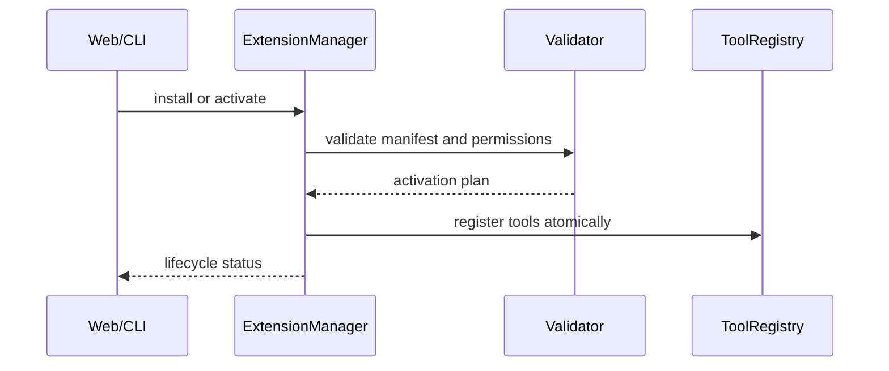
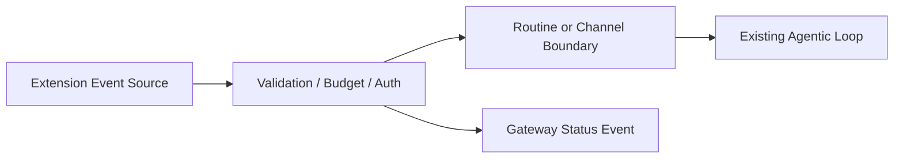
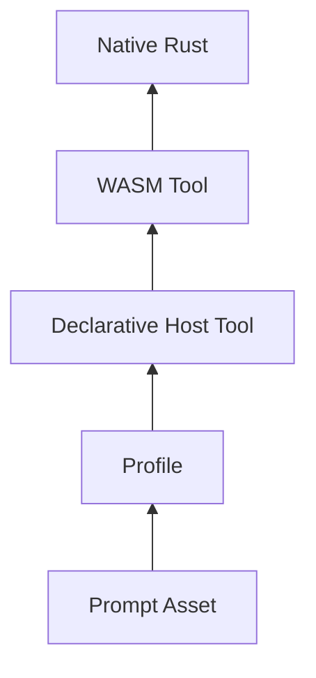
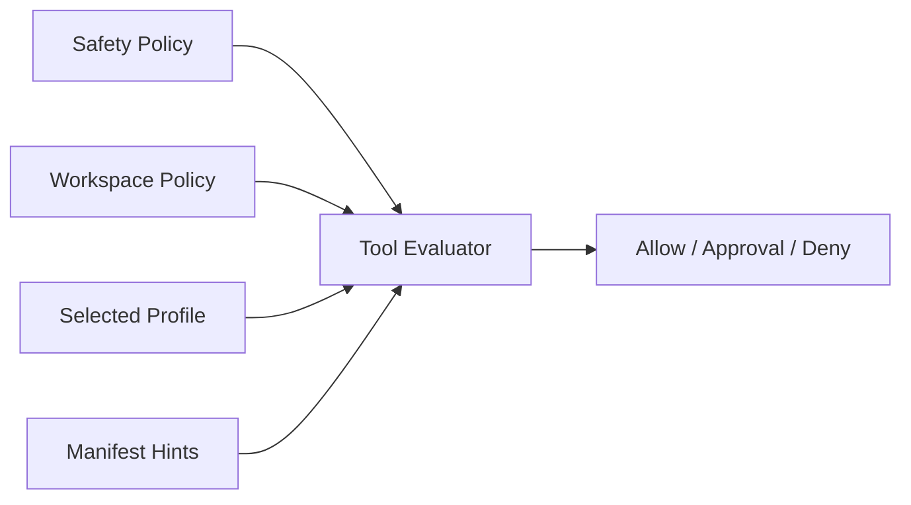
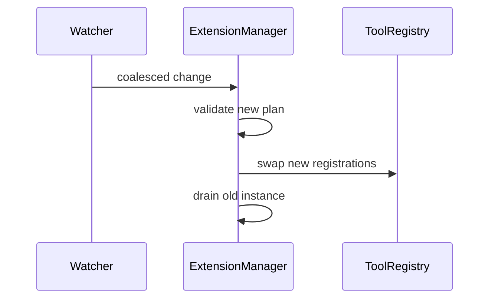
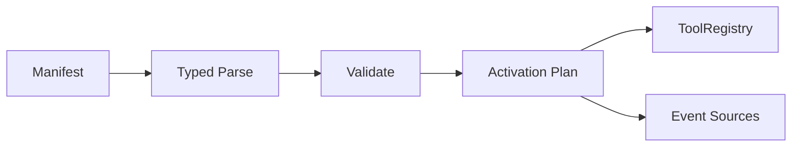

# Plugin & Extension System

**Source provenance**: captured Roko identifiers include
`crates/roko-plugin/src/lib.rs`, `crates/roko-plugin/src/manifest.rs`,
`crates/roko-std/src/roles.rs`, `crates/roko-std/src/scorer.rs`, and design
notes named `docs/v2/12-EXTENSIONS.md` and `docs/v2/13-TRIGGERS.md`. Treat
them as provenance labels only, not required IronClaw implementation inputs.

**Priority**: LOW. IronClaw already has sandboxed WASM tools, MCP server
installation, channel extensions, routines, tool policy, and gateway lifecycle
routes. Adopt only the pieces that make those systems easier to operate:
push-style event adapters, outcome feedback, compact local manifests, and safe
hot reload.

**Tool discovery boundary**: This document covers local discovery from
configured TOML manifests, WASM catalogs, and extension registries. Remote MCP
discovery through JSON-RPC `tools/list` belongs in
[mcp-editor-integration.md](./mcp-editor-integration.md). Both paths can feed
`ToolRegistry`, but they must stay separate in lifecycle, auth, and tenancy.

**Related documents**: [mcp-editor-integration.md](./mcp-editor-integration.md)
for remote tool protocol boundaries; [control-plane.md](./control-plane.md) for
operator streams and dashboards.

---

## Table of Contents

1. [Overview and Motivation](#1-overview-and-motivation)
2. [Architectural Context: How Plugins Fit in Roko](#2-architectural-context-how-plugins-fit-in-roko)
3. [The EventSource Trait](#3-the-eventsource-trait)
4. [Built-in EventSource: FileWatchEventSource](#4-built-in-eventsource-filewatcheventsource)
5. [Built-in EventSource: CronEventSource](#5-built-in-eventsource-croneventsource)
6. [The FeedbackCollector Trait](#6-the-feedbackcollector-trait)
7. [PluginManifest and Builder API](#7-pluginmanifest-and-builder-api)
8. [TOML Manifest System](#8-toml-manifest-system)
9. [Tiered Extensibility Model](#9-tiered-extensibility-model)
10. [Role-Based Profiles (roko-std)](#10-role-based-profiles-roko-std)
11. [Composable Scorers (roko-std)](#11-composable-scorers-roko-std)
12. [Filesystem Hot-Reload with Debouncing](#12-filesystem-hot-reload-with-debouncing)
13. [v2 Extension System: Captured Pipeline Hooks](#13-v2-extension-system-captured-pipeline-hooks)
14. [v2 Trigger System](#14-v2-trigger-system)
15. [Mermaid Diagrams](#15-mermaid-diagrams)
16. [Benchmarking and Performance Analysis](#16-benchmarking-and-performance-analysis)
17. [Practical Examples](#17-practical-examples)
18. [IronClaw Comparison and Gap Analysis](#18-ironclaw-comparison-and-gap-analysis)
19. [IronClaw Integration Plan](#19-ironclaw-integration-plan)
20. [Plugin Failure and Permission Stories](#20-plugin-failure-and-permission-stories)
21. [Complexity Assessment](#21-complexity-assessment)
22. [References](#22-references)

---

## 1. Overview and Motivation

IronClaw should treat plugins as controlled ingress, capability registration,
and lifecycle metadata. The core agent loop must remain the single execution
path for planning, tool execution, approvals, checkpointing, and completion.

### Why AI Agents Need Plugin Architectures

- Keep service-specific integrations outside `src/agent/`.
- Let tools declare permissions, auth, paths, and timeouts near the tool.
- Route external signals through typed channel, routine, or trigger boundaries
  before they affect sessions or threads.

### Roko's Approach

The captured model separates:

- `EventSource`: long-running producers that push signals.
- `FeedbackCollector`: delayed outcome readers.
- Manifest loading: TOML metadata for prompts, profiles, tools, and triggers.
- Scorers/profiles: deterministic selection hints.

For IronClaw, these are design patterns, not crates to port wholesale.

### The Three Missing Dimensions

Adopt only when there is a caller-level use case:

1. Push events: map to routines, channel adapters, or trigger-worker-owned
   submitters. Product adapters must use untrusted inbound requests.
2. Outcome feedback: write explicit feedback events or DB records; do not feed
   opaque external status directly into chat history.
3. Declarative tools: prefer WASM tools with `capabilities.json`; TOML wrappers
   must not shell-interpolate user input.

---

## 2. Architectural Context: How Plugins Fit in Roko

Roko's `Engram` stream maps loosely to IronClaw's `IncomingMessage`, web
`SseEvent`, routine events, and tool registry entries. Do not introduce a second
signal model unless it replaces duplication across existing boundaries.

### Dependency Graph

Captured dependency intent:

```text
core signal types
  -> plugin/event/manifest contracts
  -> standard roles and scoring helpers
  -> runtime loader and dispatcher
```

IronClaw equivalent:

```text
src/extensions/ + src/tools/
  -> ToolRegistry + ExtensionManager + RoutineEngine
  -> shared agentic loop and tool execution safety
  -> src/channels/web/ lifecycle/status routes
```

Keep new extension initialization behind owning modules. Do not move
module-specific startup into `src/main.rs` or `src/app.rs`.

---

## 3. The EventSource Trait

Use an event-source abstraction only for producers that run without an immediate
tool call: file watchers, scheduled checks, relay notifications, or host-owned
system events.

### Full Trait Definition

IronClaw-facing shape:

```rust
#[async_trait::async_trait]
pub trait ExtensionEventSource: Send + Sync + 'static {
    fn name(&self) -> &ExtensionName;
    fn kind(&self) -> ExtensionEventKind;
    async fn run(
        &self,
        sink: ExtensionEventSink,
        shutdown: CancellationToken,
    ) -> anyhow::Result<()>;
}
```

This is an interface sketch, not a required public API. The important contract
is bounded output, cancellation, and typed source identity.

### Design Decisions

- Backpressure: bounded channels only. Drop, coalesce, or rate-limit noisy
  sources before they reach the agent.
- Cancellation: every source must stop on host shutdown and extension
  deactivation.
- Auth: event sources never mint trusted inbound requests. Trusted trigger
  ingress remains trigger-worker-owned.
- Tenancy: include user, workspace, and extension identity in event metadata
  before dispatch.

### EventSourceKind Enum

Use a closed enum for built-in kinds and a validated extension name for custom
kinds:

```rust
enum ExtensionEventKind {
    FileWatch,
    Schedule,
    Relay,
    Webhook,
    Custom(ExtensionName),
}
```

Avoid stringly-typed routing after validation.

### Implementing EventSource: Minimal Example

```rust
async fn publish_file_event(sink: &ExtensionEventSink, path: WorkspacePath) -> Result<()> {
    sink.publish(ExtensionEvent::FileChanged {
        path,
        reason: FileChangeReason::Modified,
    })
    .await
}
```

The sink decides whether this becomes a routine event, a web SSE frame, or a
tool-policy audit record. The producer does not call the LLM.

---

## 4. Built-in EventSource: FileWatchEventSource

File watching is useful for workspace-local automation, but it is also a noisy
and security-sensitive ingress path.

### Construction

Require:

- Workspace-root-scoped paths.
- Canonicalization before watching.
- Explicit include/exclude globs.
- Per-extension event budgets.
- A default ignore set for build output, VCS metadata, and dependency caches.

### Glob Filtering

Compile globs once during activation. Reject patterns that escape the workspace
or match everything without an explicit operator opt-in.

### Event Classification

Classify before dispatch:

| Watcher input | IronClaw event |
|---------------|----------------|
| created/modified | `FileChanged` |
| deleted | `FileDeleted` |
| rename | delete + create unless the backend provides a safe pair |
| overflow/rescan needed | `WatchResyncRequired` |

### Start Lifecycle

Activation flow:

1. Validate manifest and permissions.
2. Build watcher under extension-owned cancellation.
3. Debounce and coalesce events.
4. Publish typed events to the routine/channel boundary.
5. Stop watcher on deactivate, remove, or shutdown.

---

## 5. Built-in EventSource: CronEventSource

Prefer `src/agent/routine.rs` and `src/agent/routine_engine.rs` for scheduled
work. Do not add an independent cron runner for plugins.

### Construction

Manifest schedules should compile into routine triggers or a small adapter that
feeds the routine engine.

### Schedule Data Structures

Persist enough to audit:

- Extension identity.
- Schedule expression and timezone policy.
- Concurrency policy.
- Last run, next eligible run, and last failure.

### Event Loop

The runtime loop must enforce cost guardrails, max run duration, and
per-extension concurrency before dispatching work.

### Cron Signal Format

Use typed payloads:

```json
{
  "type": "scheduled_extension_event",
  "extension": "example",
  "trigger": "nightly-maintenance",
  "scheduled_for": "timestamp-from-runtime"
}
```

Avoid embedding prompts as executable event payloads.

### Error Handling

Invalid schedules fail activation. Runtime misses are recorded as skipped runs,
not retried in a tight loop.

---

## 6. The FeedbackCollector Trait

Feedback collectors read delayed outcomes from systems the agent already acted
on: PR merged, deployment failed, ticket closed, benchmark regressed.

### Full Trait Definition

IronClaw-facing shape:

```rust
#[async_trait::async_trait]
pub trait FeedbackCollector: Send + Sync + 'static {
    fn source(&self) -> &ExtensionName;
    async fn collect(&self, cursor: FeedbackCursor) -> Result<FeedbackBatch>;
}
```

### Design Decisions

- Polling must be rate-limited and cursor-based.
- External IDs must be mapped to IronClaw-owned job, thread, or action IDs.
- Feedback changes policy only through explicit evaluators or settings, never
  by mutating transcript history.
- Store raw external payloads only when redaction and retention are defined.

### FeedbackSignal and FeedbackOutcome

Keep outcomes coarse:

```text
Succeeded | Failed | Cancelled | TimedOut | NeedsHuman | Unknown
```

Attach source-specific details as redacted metadata.

### Implementing FeedbackCollector: Example

```rust
let outcome = FeedbackOutcome::Succeeded;
feedback_store.record_tool_outcome(action_id, outcome, source_id).await?;
```

The collector records evidence; the evaluator decides whether it affects tool
ranking, routing, or user-visible summaries.

### NoOp Implementations

No-op collectors are useful for tests and optional integrations. Do not register
them as live extension capabilities because they create false readiness signals.

---

## 7. PluginManifest and Builder API

Use manifests to describe capabilities and lifecycle needs, not to smuggle
runtime logic into configuration.

### PluginManifest

Minimum fields:

```toml
[plugin]
name = "example"
kind = "wasm_tool"
version = "0.1.0"

[permissions]
workspace_read = ["docs/**/*.md"]
network = []

[[tools]]
name = "summarize_docs"
description = "Summarize selected workspace documentation"
```

### PluginBuilder

A builder is useful only if it centralizes validation:

- Parse extension names through `ExtensionName::new`.
- Resolve paths under configured roots.
- Compile globs and schemas.
- Precompute permission prompts.
- Produce a typed activation plan.

### Usage

Handlers should call `ExtensionManager::ensure_extension_ready(...)` or an
owning-module equivalent. Web routes should not manually sequence auth,
pairing, activation, and tool registration.

---

## 8. TOML Manifest System

TOML is acceptable for local, human-edited manifests. Keep executable behavior
behind WASM, MCP, or built-in Rust tools.

### Top-Level Schema

Recommended groups:

- `[plugin]`: identity and display metadata.
- `[permissions]`: workspace, network, secrets, and rate limits.
- `[[tools]]`: LLM-facing tools.
- `[[events]]`: event sources.
- `[[feedback]]`: outcome collectors.
- `[[profiles]]`: deterministic tool bundles.

### Plugin Metadata

Metadata must not drive trust decisions. Trust comes from install source,
signature/checksum policy if configured, activation approval, and sandbox
capabilities.

### Tier 1: Prompt Templates

Prompt templates are text assets. They should be selected deterministically and
rendered with bounded inputs. Do not let templates bypass system prompts,
approval gates, or tool policy.

### Tier 2: Tool Profile Bundles

Profiles are named allow/prefer sets:

```toml
[[profiles]]
name = "review"
prefer_tools = ["workspace_search", "read_file"]
deny_tools = ["shell_exec"]
```

They are policy inputs, not agent personas.

### Tier 3: Declarative Tools

Avoid arbitrary shell wrappers. A safe local wrapper names an executable tool
owned by IronClaw and passes structured arguments:

```toml
[[tools]]
name = "format_markdown"
runner = "builtin"
builtin = "markdown_format"
timeout_ms = 5000
requires_approval = false
```

If a command runner is added, it must use argv arrays, no shell expansion,
workspace-scoped paths, output limits, and approval policy.

### Trigger Definitions

Triggers should compile to routine triggers or trigger-worker-owned requests:

```toml
[[events]]
name = "docs_changed"
kind = "file_watch"
include = ["docs/**/*.md"]
debounce_ms = 750
```

Product adapters and host runtime handlers must not mint trusted inbound turns.

### Plugin Dependencies

Keep dependency declarations declarative:

```toml
requires = ["workspace_search"]
conflicts = ["legacy_docs_watcher"]
```

Resolve dependencies during activation. Avoid implicit installs.

### Validation

Validate before any side effect:

- Manifest schema and extension name.
- Paths, globs, URLs, and declared secret names.
- Tool schemas and approval flags.
- Unsupported fields as warnings or hard errors by compatibility mode.

### Plugin Discovery

Discovery is local and configured. Do not guess external service domains as an
architectural requirement. Registry search may suggest candidates, but install
and activation must still pass validation and user/operator approval.

### Complete TOML Manifest Example

```toml
[plugin]
name = "docs-helper"
kind = "wasm_tool"
version = "0.1.0"

[permissions]
workspace_read = ["docs/**/*.md"]
network = []

[[tools]]
name = "docs_summary"
description = "Summarize selected documentation files"
schema = "schemas/docs_summary.schema.json"
requires_approval = false

[[events]]
name = "docs_changed"
kind = "file_watch"
include = ["docs/**/*.md"]
debounce_ms = 750
```

---

## 9. Tiered Extensibility Model

Use the lowest-power extension tier that solves the problem.

### Tier Summary

| Tier | Use for | IronClaw home |
|------|---------|---------------|
| Prompt asset | Text guidance | skills/system prompt assets |
| Profile | Deterministic tool policy | settings/tool policy |
| Declarative tool | Small host-owned wrapper | built-in tool adapter |
| WASM | Sandboxed maintained capability | `src/tools/wasm`, `src/extensions/` |
| Native Rust | Core runtime behavior | owning module |

### Tier 1: Prompts

Prompts cannot grant permissions or bypass deterministic skill selection.

### Tier 2: Profiles

Profiles should narrow or prefer tools; they should not auto-install tools or
alter model routing without explicit settings.

### Tier 3: Declarative Tools

Keep this tier small. Once a tool needs credentials, network, complex parsing,
or durable state, move it to WASM, MCP, or native Rust.

### Tier 4: WASM

Default for sensitive or maintained extension capabilities. WASM tools declare
capabilities, run in a sandbox, and let the host inject credentials.

### Tier 5: Native Rust

Use for runtime-coupled capabilities: approvals, session state, tool safety,
storage, gateway auth, and scheduler behavior.

---

## 10. Role-Based Profiles (roko-std)

Role profiles are useful as compact defaults for tool policy, not as autonomous
sub-agents.

### Role Archetypes

Suggested profile names: `implementer`, `reviewer`, `researcher`,
`operator`, `scribe`. They should map to tool preferences and guardrails only.

### Canonical Tool Sets

Keep tool sets explicit and auditable:

```toml
[[profiles]]
name = "reviewer"
prefer_tools = ["read_file", "workspace_search"]
requires_approval = ["write_file", "shell_exec"]
```

### Profile Definitions

Profiles should be stored in user or workspace settings, not hardcoded into the
agent loop.

### Domain Tool Profiles

Domain profiles can layer on top of role profiles, but conflicts must resolve
deterministically.

### Profile Composition

Composition order:

1. Built-in safety policy.
2. Admin/workspace policy.
3. User-selected profile.
4. Extension manifest hints.

More specific layers may narrow access; they should not silently widen it.

### Role Lookup

Lookup by validated profile ID. Missing profile means no profile overlay, not a
fallback to a broad tool set.

---

## 11. Composable Scorers (roko-std)

Use scorers for deterministic ranking and diagnostics. Do not hide policy
decisions inside opaque weights.

### Score Type

Prefer bounded numeric types or enums:

```text
deny | require_approval | allowed | preferred
```

### The Score Trait

A scorer should be pure over declared context: tool metadata, profile, user
settings, workspace policy, and recent failure state.

### SumScorer (Additive Composition)

Use additive scores for soft preferences such as latency, success rate, and
profile match.

### MulScorer (Multiplicative Composition)

Use multiplicative gates sparingly for hard factors, or make them explicit deny
rules.

### ConstScorer (Static Weighting)

Static weights belong in configuration and should appear in diagnostics.

### Composition Example

```text
final = safety_gate(tool)
      + profile_preference(tool, profile)
      + recent_health(tool)
```

Hard denies short-circuit before additive scoring.

### Composing Sum and Mul

Keep the evaluation trace inspectable:

```text
read_file: allowed, +profile, +healthy
shell_exec: requires_approval, -profile
```

---

## 12. Filesystem Hot-Reload with Debouncing

Hot reload is useful for development and local tools, but activation must remain
transactional.

### Debounce Window

Use a configurable debounce per watched root. Defaults should avoid duplicate
reloads during editor save sequences.

### Debounce Algorithm

1. Watch configured manifest/tool roots only.
2. Coalesce events by extension identity.
3. Wait for file stability.
4. Validate into a new activation plan.
5. Swap registry entries atomically.
6. Keep in-flight executions on the old instance until completion or timeout.

### Test Coverage

Add caller-level tests through the manager or gateway route that activates the
extension. Helper-only debounce tests are not enough when registry mutation,
SSE, or auth side effects are involved.

---

## 13. v2 Extension System: Captured Pipeline Hooks

Map captured hooks to existing IronClaw extension, tool, and agent hooks only
when there is a concrete caller.

### What Is a v2 Extension?

In IronClaw terms: a package that can contribute tools, channel behavior,
settings, prompts, or event sources under explicit permissions.

### Captured Layers

Useful layers:

- Install and registry metadata.
- Activation/auth/pairing lifecycle.
- Tool registration.
- Event and feedback adapters.
- Gateway status projection.

### Captured Hooks

Candidate hooks:

- Before tool registration.
- Before event dispatch.
- After tool outcome.
- Before uninstall/deactivate.

Do not add generic hooks into the agent loop unless existing deterministic
hooks cannot express the requirement.

### Decision Enums

Prefer explicit decisions:

```text
Allow | Deny(reason) | RequireApproval(reason) | Defer(reason)
```

### CaMeL IFC Integration

If information-flow control is added, make it a safety layer shared by all tool
execution paths. Do not bolt it only onto plugin tools.

### Fault Isolation

Extension faults should degrade that extension, not the whole agent. Surface
status through lifecycle state and gateway events.

### Hook Timeout

Every async hook needs a timeout and a documented fail-open/fail-closed policy.
Security and approval hooks should fail closed.

---

## 14. v2 Trigger System

Triggers are ingress. Treat them like channels, not helper callbacks.

### Seven Trigger Kinds

Useful categories:

```text
manual | schedule | file | webhook | relay | system | feedback
```

Names are less important than validation, auth, and dispatch ownership.

### Concurrency Policies

Support a small set:

```text
skip_if_running | queue_one | cancel_previous | allow_parallel(limit)
```

### Trigger Chaining

Chaining should go through persisted events or routine state. Avoid recursive
in-memory callbacks.

### Conductor Watchers

Watchers may observe conductor/runtime state, but child planning, execution,
capability calls, checkpointing, retries, gates, and completion must go through
the existing Reborn runner/driver/executor path. No second agent loop.

---

## 15. Mermaid Diagrams

### Plugin Loading Lifecycle



### Event Source to Agent Pipeline



### Tiered Extensibility Layers



### Role Composition Architecture



### Hot-Reload Atomic Swap Flow



### TOML Manifest to Runtime Registration



---

## 16. Benchmarking and Performance Analysis

Measure behavior in the caller that users exercise, not only the helper.

### Plugin Load Time

Track parse, validation, sandbox initialization, auth resolution, and registry
swap separately.

### Event Delivery Latency

Measure from source event to routine/channel dispatch and, when applicable, to
gateway SSE emission.

### Hot-Reload Swap Time

Measure debounce wait, validation time, swap time, and drain time for in-flight
executions.

### Memory Overhead per Plugin

Measure per active extension instance, watcher, process, and client connection.
Avoid publishing fixed counts in docs; keep numbers in benchmark output.

### Comparison with IronClaw's WASM Extension Model

Compare against real extension kinds:

- WASM tool: sandboxed, host-managed credentials.
- WASM channel: activation and pairing lifecycle.
- MCP server: external process or remote endpoint, less sandbox control.
- Native Rust: fastest path, highest maintenance and review cost.

---

## 17. Practical Examples

Examples are intentionally compact and avoid shell execution.

### Example 1: File-Watch Plugin That Triggers Code Analysis on Changes

```toml
[plugin]
name = "code-watch"
kind = "wasm_tool"

[[events]]
name = "source_changed"
kind = "file_watch"
include = ["src/**/*.rs"]
exclude = ["target/**"]
debounce_ms = 1000
```

Runtime action: publish a typed routine event. The routine decides whether to
enqueue analysis, request approval, or ignore the change.

### Example 2: Cron Plugin for Scheduled Maintenance

```toml
[[events]]
name = "weekly_workspace_check"
kind = "schedule"
schedule = "configured-by-operator"
concurrency = "skip_if_running"
```

Do not embed a prompt or command string in the schedule. Store the action as a
routine definition with guardrails.

### Example 3: Composing Scorer Chains for Tool Selection

```text
workspace_search = allowed + profile_preferred + healthy
write_file        = requires_approval + profile_neutral
shell_exec        = denied_by_workspace_policy
```

The UI should be able to show this trace when a tool is hidden or gated.

### Example 4: Hot-Reloading a Plugin Without Agent Restart

Expected behavior:

1. Manifest changes.
2. Watcher debounces.
3. Manager validates a new plan.
4. Registry swaps new tools.
5. Gateway emits extension status.
6. In-flight calls finish on the old instance or time out.

---

## 18. IronClaw Comparison and Gap Analysis

### What IronClaw Has

- WASM tools and channels with explicit capabilities.
- MCP server integration and per-user client storage.
- Extension registry, install, setup, activation, and removal routes.
- Tool safety, approval, and result processing shared by execution paths.
- Routine triggers and event-like scheduling.

### IronClaw's WASM Extension Model: Detailed

WASM remains the preferred default for maintained capabilities, sensitive
credentials, and host-managed permissions. MCP remains useful for existing
external servers and background integrations, but the host cannot sandbox them
the same way.

### What Roko Adds That IronClaw Does Not Have

#### 1. Push-Based Event Injection (EventSource)

Adopt as routine/channel ingress with strict budgets and typed events.

#### 2. Asynchronous Outcome Feedback (FeedbackCollector)

Adopt as explicit outcome records and evaluators.

#### 3. Declarative TOML Tools (Tier 3)

Adopt only for safe host-owned wrappers. Prefer WASM for anything privileged.

#### 4. Role-Based Tool Profiles with Domain Composition

Adopt as deterministic tool-policy overlays.

#### 5. Filesystem Hot-Reload with Cancellation-Safe Debouncing

Adopt for local development and operator-managed catalogs.

#### 6. Composable Scorers

Adopt as inspectable diagnostics, not hidden policy.

### Comparison Table

| Capability | IronClaw direction |
|------------|--------------------|
| Push events | Routine/channel ingress |
| Feedback | Outcome store + evaluator |
| Declarative tools | Narrow safe wrapper tier |
| Profiles | Tool policy overlay |
| Hot reload | ExtensionManager-owned swap |
| Scorers | Transparent ranking trace |

---

## 19. IronClaw Integration Plan

Keep implementation behind owning modules and add caller-level tests for each
side effect.

### A. EventSource Trait

Start with an internal trait under `src/extensions/` only if at least two event
source kinds need the same lifecycle. Otherwise keep adapters concrete.

Acceptance criteria:

- Typed event payloads.
- Bounded queue.
- Cancellation on deactivate and shutdown.
- Gateway status event for failures.
- Tests through activation plus event dispatch.

### B. FeedbackCollector Trait

Add only after a concrete outcome source exists. Store outcomes separately from
chat turns and expose a redacted summary to the UI.

### C. Declarative TOML Tools

Implement as manifest-to-activation-plan parsing. Do not add a generic shell
runner as the first version.

### D. Hot-Reload for WASM Tools

Place watcher ownership in `ExtensionManager` or a sibling module. Ensure
registry swaps are atomic and in-flight calls are not interrupted unsafely.

### E. Role-Based Profiles

Model profiles as settings/tool-policy data. Add diagnostics that explain why a
tool is preferred, gated, or denied.

### F. Composable Evaluators

Centralize evaluation near tool policy. Hard security rules should short-circuit
before soft scoring.

---

## 20. Plugin Failure and Permission Stories

### Story 1: Denied Network Access

Expected behavior: activation or execution fails with a permission error, the
tool is not registered as ready, and the gateway emits redacted status.

### Story 2: Hot-Reload Debounce Confusion

Expected behavior: multiple writes coalesce into one validation attempt. If the
new manifest is invalid, the old registration stays active.

### Story 3: Broken Trigger Loop

Expected behavior: concurrency policy prevents recursive dispatch and records a
skipped or failed run.

### Story 4: Invalid Cron Expression

Expected behavior: activation fails before scheduling any work.

### Story 5: User Revokes Plugin Permission

Expected behavior: active event sources stop, tools unregister or become gated,
credentials are no longer injected, and pending runs fail closed where needed.

---

## 21. Complexity Assessment

Adopt incrementally. Event sources and hot reload touch runtime lifecycle,
security, and UX; declarative tools touch command execution risk.

### Implementation Order

1. Manifest validation and activation-plan diagnostics.
2. Safe profile/evaluator overlays.
3. Hot reload for local manifests.
4. One event-source adapter through routines.
5. Feedback collector for one concrete outcome source.

### What NOT to Adopt

- A second agent loop for plugins or subagents.
- Generic shell execution from TOML.
- Trusted inbound request minting outside trigger-worker-owned code.
- Hardcoded external discovery assumptions.
- Hidden scorer weights that override explicit safety policy.
- Global plugin state that ignores user/workspace tenancy.

---

## 22. References

Local references to keep aligned:

- [mcp-editor-integration.md](./mcp-editor-integration.md)
- [control-plane.md](./control-plane.md)
- `src/tools/README.md`
- `src/channels/web/CLAUDE.md`
- `src/agent/CLAUDE.md`
- `src/NETWORK_SECURITY.md`

### Source Citation Index

Captured Roko identifiers in this document are provenance labels only. For
implementation, inspect IronClaw's owning modules first: `src/extensions/`,
`src/tools/`, `src/agent/routine*.rs`, and `src/channels/web/`.
