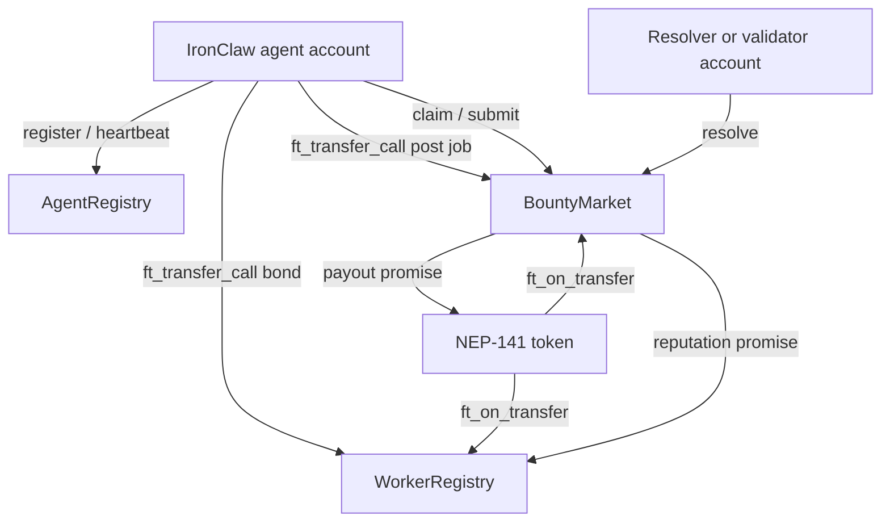

# NEAR Smart Contracts for IronClaw Agent Coordination

Status: design notes and implementation targets. No production contract code is
checked into this folder yet.

This folder describes a NEAR-native contract layer for agent identity,
heartbeats, work escrow, reputation, and optional knowledge curation. The
examples are meant to be practical starting points for `near-sdk-rs`, not a
claim that the contracts already exist in the repository.

## Documents

| Document | Contents |
|----------|----------|
| [near-contracts.md](./near-contracts.md) | NEAR contract surfaces, example snippets, invariants, and benchmark plan |
| [ironclaw-integration.md](./ironclaw-integration.md) | How IronClaw would expose NEAR interactions through tools, config, secrets, and tests |
| [references.md](./references.md) | NEAR, near-sdk, testing, RPC, and security references |

## Scope

In scope:

- NEAR-native Rust contracts using `near-sdk-rs`.
- NEP-141 token flows for bonds, bounties, and payouts.
- NEP-297 event logs for indexer-friendly contract activity.
- `near-workspaces` tests for local sandbox simulation and gas/storage
  measurements.
- IronClaw integration through existing tools, config, secrets, and audit paths.

Out of scope:

- Non-NEAR deployment paths and unavailable source-tree path assumptions.
- Mainnet deployment defaults before testnet contracts have measured costs and
  failure modes.
- Contracts that require unavailable local source files.

## Why NEAR

NEAR gives agent contracts a named account model, storage staking, and
asynchronous cross-contract calls. Those properties are a good fit for agent
workflows where accounts need human-readable identities, token escrow, and
explicit callback handling. Cost claims should come from the benchmark plan,
not from this architecture overview.

Important NEAR constraints:

- A contract is deployed to an account, and account names are part of the trust
  surface. Use documented, environment-specific subaccounts during testnet work
  and avoid baking account names into product logic.
- Storage must be funded. Any registration or post that writes persistent state
  needs an attached deposit or token-standard storage registration.
- Cross-contract calls are asynchronous. Settlement code must handle partial
  failure with private callbacks and retryable repair paths.
- Gas is prepaid. Every benchmark should report gas burnt, attached gas,
  storage delta, and receipt count.

## Proposed Contract Set

| Contract | Status | Purpose | First useful benchmark |
|----------|--------|---------|------------------------|
| `AgentRegistry` | Phase 1 target | Register agent metadata hash and heartbeat liveness | Batch registration, then heartbeat active agents |
| `WorkerRegistry` | Phase 2 target | Hold token bonds, update reputation, derive worker tiers | Bond, update reputation, slash, and withdraw flows |
| `BountyMarket` | Phase 2 target | Hold bounties in escrow and settle accepted/rejected work | Post, assign, submit, resolve, retry failed callback |
| `ReputationRegistry` | Optional Phase 2 | Track domain-specific reputation when worker-level score is insufficient | Domain update and paginated decay batches |
| `InsightBoard` | Optional Phase 3 | Store content hashes/URIs and reward confirmations | Post, confirm, claim, and search/indexer read path |

Keep the first implementation small: `AgentRegistry`, then `WorkerRegistry`,
then `BountyMarket`. Add the optional contracts only after the core lifecycle
has tests and measured costs.

## Reference Flow

## Security Baseline

- Use function-call access keys for IronClaw automation; do not store
  full-access keys for routine agent operations.
- Validate token receiver messages as structured JSON, not delimiter-split
  strings.
- Require storage deposits before writes and return unused NEP-141 tokens from
  `ft_on_transfer`.
- Make admin actions explicit: owner changes, authorized resolver updates,
  pause switches, and emergency withdrawals should emit NEP-297 events.
- Treat promise callbacks as part of the state machine. A payout can succeed
  while reputation update fails, so callbacks need logs and retry metadata.
- Do not use on-chain storage for prompts, secrets, private task content, or
  personally identifying information. Store hashes, content IDs, or short
  descriptors only after reviewing disclosure risk.

## Benchmark Expectations

Each contract PR should include a `near-workspaces` benchmark or integration
test that reports:

- Method name and scenario.
- Gas burnt and attached gas.
- Attached deposit and storage usage delta.
- Number of receipts created by cross-contract calls.
- Success and failure cases, including refund/callback behavior.

The initial goal is not to prove a universal cost claim. The goal is to make
costs reproducible for the exact contract code and network configuration being
proposed.
