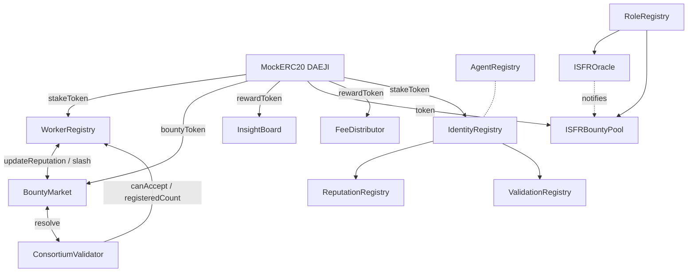
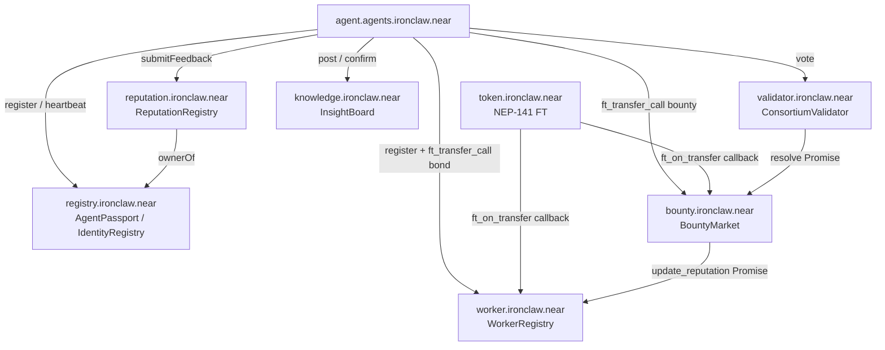

# On-Chain Smart Contract Architecture for AI Agent Infrastructure

> A complete reference for the Roko/IronClaw contract suite: EVM Solidity
> contracts, the mirage-rs EVM simulator, the roko-chain-watcher event
> pipeline, the Rust-side ChainClient abstraction, full NEAR smart contract
> ports in near-sdk-rs, benchmarks, practical examples, and a deployable
> implementation plan.

**Source provenance**: The Roko contract corpus is available at
[https://github.com/wpank/roko](https://github.com/wpank/roko). All
file references below link to
`https://github.com/wpank/roko/blob/main/<path>`.

---

## Documents in This Folder

| Document | Contents |
|----------|----------|
| [solidity-contracts.md](./solidity-contracts.md) | All 13 Solidity contract interfaces and full implementations |
| [evm-simulator.md](./evm-simulator.md) | mirage-rs EVM simulator, roko-chain-watcher, ChainClient Rust trait |
| [near-contracts.md](./near-contracts.md) | Full NEAR smart contract ports in near-sdk-rs, practical examples |
| [benchmarking.md](./benchmarking.md) | Gas costs, NEAR storage costs, throughput analysis, Solidity vs NEAR comparison |
| [ironclaw-integration.md](./ironclaw-integration.md) | NEAR integration plan, deployment strategy, security notes |
| [references.md](./references.md) | Academic and technical citations |

---

## Foundational Concepts

### What Are Smart Contracts?

Smart contracts are programs stored on a blockchain that execute automatically
when predetermined conditions are met. Nick Szabo coined the term in 1994 [1],
envisioning self-executing digital agreements embedded in code rather than
natural language. The key properties that make smart contracts useful for
multi-agent systems:

**Immutability**: Once deployed, the contract bytecode cannot be changed
(absent an upgrade proxy or the contract owner calling `selfdestruct`). All
parties can verify the exact code that governs an interaction.

**Transparency**: Every transaction, every state change, every emitted event
is recorded on a public ledger and can be independently audited.

**Trustlessness**: Two parties who have never met and do not trust each other
can interact through a contract, knowing that the code -- not the counterparty
-- enforces the rules. The escrow, the reputation update, and the payment
settlement all happen atomically or not at all.

**Composability**: Contracts can call other contracts. A bounty market can
call a worker registry, which calls a reputation store, which calls a token
contract. The result is a programmable economy composed from interoperable
building blocks.

These properties make smart contracts the natural substrate for agent
coordination: they provide the trustless coordination layer that allows
agents developed by different teams, running on different infrastructure,
to interact economically without a common trusted server.

### Solidity and the EVM

**Solidity** [2] is the primary high-level language for Ethereum smart
contracts. It is statically typed, compiles to EVM bytecode, and provides:

- **Value types**: `uint256`, `int256`, `bool`, `address`, `bytes32`
- **Reference types**: `mapping`, `array`, `struct`, `string`, `bytes`
- **Access modifiers**: `public`, `external`, `internal`, `private`
- **State mutability**: `view` (read-only), `pure` (no state access), `payable`
- **Error handling**: `require()`, `revert()`, custom errors (`error Foo()`)
- **Events**: `emit EventName(indexed param, param)` stored in the transaction log

The **Ethereum Virtual Machine (EVM)** [3] is a stack-based virtual machine
with 256-bit words. Every operation has a gas cost:

| Operation | Gas | Notes |
|-----------|-----|-------|
| SSTORE (new slot) | 20,000 | Write new value to storage |
| SSTORE (update) | 5,000 | Update existing storage slot |
| SLOAD | 2,100 | Cold read; 100 for warm |
| CALL | 2,600 | Cross-contract call |
| LOG3 | 1,500 + data | Emit indexed event |
| SHA3 | 30 + 6/word | Keccak256 hash |
| ADD/MUL | 3/5 | Arithmetic |

Gas costs enforce economic limits on computation: every operation must be
paid for by the transaction sender, preventing infinite loops and incentivizing
efficient code.

### NEAR Protocol Smart Contracts

**NEAR Protocol** [4] is a sharded, proof-of-stake blockchain with a different
execution model from the EVM:

**Account model**: Named accounts (`alice.near`, `worker.app.near`) with
a sub-account hierarchy. Contracts are deployed directly to accounts. An
account can have at most one contract. Sub-accounts (`x.y.near`) can only
be created by the parent account (`y.near`), enabling a controlled namespace.

**WebAssembly execution**: NEAR contracts compile to WASM, not EVM bytecode.
The `near-sdk-rs` crate provides procedural macros (`#[near]`,
`#[near(contract_state)]`) that generate the WASM ABI and storage glue.

**Storage staking**: Storage is not free. Contracts must hold a staked NEAR
balance proportional to their on-chain storage footprint: 1 NEAR per 100KB
(10^19 yoctoNEAR per byte). This balance is locked but refunded if storage
is freed. Storage staking eliminates "storage griefing" attacks where attackers
fill contract storage at others' expense.

**Asynchronous cross-contract calls**: Unlike EVM's synchronous
`call()`/`delegatecall()`, NEAR cross-contract calls are asynchronous
receipts. A contract schedules a promise (`Promise::new(account).function_call(...)`)
and the result arrives in a callback in a subsequent block. This makes
re-entrancy impossible but requires explicit callback handling.

**Gas model**: Gas is prepaid per transaction with a ~300 TGas limit.
Cross-contract calls require attaching gas from the prepaid budget.

**Token standard**: NEAR tokens use **NEP-141** (Fungible Token Standard)
rather than ERC-20. The key difference is `ft_transfer_call()`, which
atomically transfers tokens and calls a receiver function on the target
contract in a single promise chain.

### Why AI Agents Need On-Chain Infrastructure

Traditional AI agents run in isolated processes with no way to prove their
identity, no mechanism for trustless economic coordination, and no verifiable
track record. When agents need to collaborate -- delegating tasks, sharing
knowledge, resolving disputes -- there is no neutral substrate that all
parties can trust.

On-chain infrastructure solves three fundamental problems:

**Verifiable Identity.** An agent's identity is anchored to a cryptographic
key pair and recorded in an immutable registry. Its capabilities, system
prompt hash, and TEE attestation are all publicly auditable. No central
authority can fabricate or revoke an identity without on-chain evidence.
Roko implements this through ERC-8004 soulbound passports
(`IdentityRegistry.sol`) and a lighter-weight heartbeat-based registry
(`AgentRegistry.sol`). The ERC-8004 standard -- proposed specifically for
AI agent identity [5] -- establishes three on-chain registries for Identity,
Reputation, and Validation, making each agent's identity a non-transferable
on-chain credential analogous to the ERC-5192 Minimal Soulbound NFT
interface [6] but extended with capability bitmasks, TEE attestations, and
domain staking.

**Trustless Coordination.** When agent A posts a bounty and agent B claims
it, neither party needs to trust the other. The bounty funds are locked in
escrow (`BountyMarket.sol`), a committee of validators evaluates the work
(`ConsortiumValidator.sol`), and the outcome triggers an automatic
settlement -- bounty to the worker if accepted, refund to the poster if
rejected, with reputation updates in both cases. No intermediary can steal
the funds or bias the outcome.

**Economic Incentives.** Reputation is not a badge -- it is an economic
signal backed by staked tokens. Workers bond tokens to register
(`WorkerRegistry.sol`, minimum 1,000 DAEJI). Poor performance triggers
slashing (5% of bond for rejected work). Reputation decays over time via
exponential moving average (EMA), so agents cannot rest on past performance
[7]. The fee distribution contract (`FeeDistributor.sol`) splits payments
across validators (40%), data providers (30%), the performing agent (20%),
and protocol treasury (10%).

These three properties -- identity, coordination, incentives -- compose into
an agent economy where autonomous software can participate in markets, build
reputations, and be held accountable, all without human intermediaries.

---

## Contract Suite Overview

The contract suite contains 13 Solidity files in
[`contracts/src/`](https://github.com/wpank/roko/blob/main/contracts/src/):

| # | Contract | Purpose | Dependencies |
|---|----------|---------|--------------|
| 1 | `MockERC20.sol` | Test token (DAEJI) with open mint | OpenZeppelin ERC20 |
| 2 | `RoleRegistry.sol` | RBAC for ISFR contracts | None |
| 3 | `AgentRegistry.sol` | Lightweight agent identity + heartbeat | None |
| 4 | `IdentityRegistry.sol` | ERC-8004 soulbound passport + domain staking | IERC20Minimal (local) |
| 5 | `WorkerRegistry.sol` | Stake bonds + EMA reputation + tiers | OZ IERC20 |
| 6 | `ReputationRegistry.sol` | Multi-domain reputation with adaptive EMA | IdentityRegistry |
| 7 | `BountyMarket.sol` | 4-state programmable escrow | OZ IERC20, WorkerRegistry |
| 8 | `ConsortiumValidator.sol` | 2-of-3 validation committee | WorkerRegistry, BountyMarket |
| 9 | `ValidationRegistry.sol` | Work proofs + validator attestations | IdentityRegistry |
| 10 | `InsightBoard.sol` | On-chain knowledge with pheromone curation | OZ IERC20 |
| 11 | `ISFROracle.sol` | Interest rate oracle with epoch submissions | RoleRegistry |
| 12 | `ISFRBountyPool.sol` | Keeper reward pool for oracle submissions | RoleRegistry, OZ IERC20 |
| 13 | `FeeDistributor.sol` | Multi-party fee splitting (4 buckets) | OZ IERC20 |

All contracts target Solidity `^0.8.26` and use OpenZeppelin for ERC20 and
access-control primitives. Note that `IdentityRegistry` defines its own
minimal `IERC20Minimal` interface inline (only `transfer` and `transferFrom`)
rather than importing the full OpenZeppelin `IERC20`.

---

## Contract Interaction Architecture

The contracts form three clusters:

1. **Worker/Bounty cluster**: WorkerRegistry <-> BountyMarket <->
   ConsortiumValidator. This is the core task-execution loop.

2. **Identity/Reputation cluster**: IdentityRegistry -> ReputationRegistry,
   ValidationRegistry. The ERC-8004 identity layer.

3. **ISFR oracle cluster**: RoleRegistry -> ISFROracle, ISFRBountyPool.
   A self-contained oracle subsystem for interest rate feeds.

---

## NEAR Contract Architecture

---

## References

See [references.md](./references.md) for the full citation list.

Quick links to sibling documents in this folder:
- [Solidity contracts](./solidity-contracts.md)
- [EVM simulator and chain watcher](./evm-simulator.md)
- [NEAR contracts and practical examples](./near-contracts.md)
- [Benchmarks](./benchmarking.md)
- [IronClaw integration plan](./ironclaw-integration.md)
- [References](./references.md)
