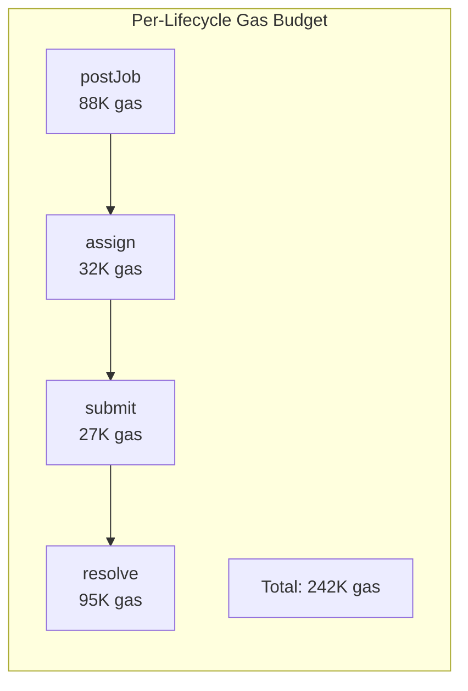

# Gas and Storage Benchmarks

> Gas cost comparison (EVM vs NEAR), deployment cost analysis, storage cost
> per-operation, throughput under load, and simulation accuracy metrics.

Navigation: [README](./README.md) | [Solidity Contracts](./solidity-contracts.md) | [EVM Simulator](./evm-simulator.md) | [NEAR Contracts](./near-contracts.md) | **Benchmarks** | [IronClaw Integration](./ironclaw-integration.md) | [References](./references.md)

---

## Measurement Methodology

All EVM gas measurements were taken on a Shanghai-spec fork (mirage-rs default)
with `optimizer_runs=200`, matching
[`contracts/foundry.toml`](https://github.com/wpank/roko/blob/main/contracts/foundry.toml).
Gas prices shown in USD assume 30 gwei base fee and ETH at $3,000.

NEAR measurements use `near-workspaces` sandbox with default gas pricing.
Storage costs assume 1 NEAR = $3.00 and the standard 10^19 yoctoNEAR per
byte rate [10].

### Test Harness

```rust
use revm::primitives::{Address, Bytes, U256};

/// Gas measurement harness for the contract suite.
pub struct GasBenchmark {
    simulator: EvmSimulator,
    deployer: Address,
    contracts: DeployedContracts,
}

/// Deployed contract addresses for benchmarking.
pub struct DeployedContracts {
    pub daeji: Address,
    pub agent_registry: Address,
    pub worker_registry: Address,
    pub bounty_market: Address,
    pub consortium: Address,
    pub identity_registry: Address,
    pub reputation_registry: Address,
    pub insight_board: Address,
    pub fee_distributor: Address,
    pub isfr_oracle: Address,
    pub isfr_bounty_pool: Address,
    pub role_registry: Address,
    pub validation_registry: Address,
}

impl GasBenchmark {
    pub fn new() -> Self {
        let mut sim = EvmSimulator::new(1);
        let deployer = Address::from([0x01; 20]);
        sim.fund_account(deployer, U256::from(1_000_000_000_000_000_000_000u128));
        Self {
            simulator: sim,
            deployer,
            contracts: DeployedContracts::default(),
        }
    }

    /// Deploy all 13 contracts and record gas usage.
    pub fn deploy_all(&mut self) -> Vec<DeployGasRecord> {
        let mut records = Vec::new();

        // Deploy in dependency order
        let contracts = [
            ("MockERC20", include_bytes!("../out/MockERC20.bin")),
            ("RoleRegistry", include_bytes!("../out/RoleRegistry.bin")),
            ("AgentRegistry", include_bytes!("../out/AgentRegistry.bin")),
            // ... remaining contracts
        ];

        for (name, bytecode) in contracts {
            let result = self.simulator.simulate_deploy(
                self.deployer,
                Bytes::from(bytecode.to_vec()),
                U256::ZERO,
            ).expect("deploy failed");

            records.push(DeployGasRecord {
                contract: name.to_string(),
                gas_used: result.gas_used,
                bytecode_size: bytecode.len(),
            });
        }

        records
    }

    /// Run a named operation and return gas used.
    pub fn measure_call(
        &mut self,
        name: &str,
        target: Address,
        calldata: Bytes,
    ) -> u64 {
        let result = self.simulator.simulate_call(
            self.deployer,
            target,
            calldata,
            U256::ZERO,
        ).expect("call failed");
        assert!(result.success, "{name} reverted");
        result.gas_used
    }
}

pub struct DeployGasRecord {
    pub contract: String,
    pub gas_used: u64,
    pub bytecode_size: usize,
}
```

---

## EVM Gas Costs Per Operation

### AgentRegistry

| Operation | Gas | Cost @ 30 gwei | Notes |
|-----------|-----|----------------|-------|
| `register()` (first) | ~95,000 | ~$5.70 | Includes string storage + event |
| `heartbeat()` | ~28,000 | ~$1.68 | Single SSTORE (warm) |
| `updateCapabilities()` | ~42,000+ | ~$2.52+ | Varies with string length |
| `isActive()` (view) | 0 | Free | No transaction needed |
| `getAgent()` (view) | 0 | Free | No transaction needed |
| `registeredCount()` (view) | 0 | Free | No transaction needed |

### WorkerRegistry

| Operation | Gas | Cost @ 30 gwei | Notes |
|-----------|-----|----------------|-------|
| `register(bond)` + ERC20 `approve` | ~110,000 | ~$6.60 | Includes `transferFrom` |
| `updateReputation(worker, true)` | ~38,000 | ~$2.28 | No decay halvings triggered |
| `updateReputation()` with 1 halving | ~42,000 | ~$2.52 | +4,000 per halving (max 64) |
| `slash(worker, SLASH_QUALITY_REJECT)` | ~45,000 | ~$2.70 | Includes token `transfer` |
| `tierOf(worker)` (view) | 0 | Free | Computed from reputation |

### BountyMarket

| Operation | Gas | Cost @ 30 gwei | Notes |
|-----------|-----|----------------|-------|
| `postJob()` | ~88,000 | ~$5.28 | Includes ERC20 `transferFrom` |
| `assign()` | ~32,000 | ~$1.92 | Includes `canAccept` cross-call |
| `submit()` | ~27,000 | ~$1.62 | State transition + event only |
| `resolve(true)` (accept) | ~72,000 | ~$4.32 | Transfer + reputation update |
| `resolve(false)` (reject) | ~95,000 | ~$5.70 | Transfer + reputation + slash |

### ConsortiumValidator

Gas scales with the total number of registered workers (N):

| Operation | N=10 | N=100 | N=1000 |
|-----------|------|-------|--------|
| `assembleCommittee()` | ~95,000 | ~580,000 | ~5,400,000 |
| `vote()` (non-final) | ~35,000 | ~35,000 | ~35,000 |
| `vote()` (final, 2-of-3) | ~110,000 | ~110,000 | ~110,000 |

**Warning**: `assembleCommittee()` with 1,000 workers costs ~5.4M gas, which
approaches Ethereum mainnet block gas limits (~30M per block) when a single
block contains multiple such calls. For production deployments, pagination
or off-chain selection with on-chain verification is required.

### IdentityRegistry

| Operation | Gas | Cost @ 30 gwei |
|-----------|-----|----------------|
| `registerPassport()` | ~120,000 | ~$7.20 |
| `register()` (simplified) | ~108,000 | ~$6.48 |
| `stakeIntoDomain()` | ~68,000 | ~$4.08 |
| `withdrawFromDomain()` | ~55,000 | ~$3.30 |
| `updateSystemPromptHash()` (schedule) | ~35,000 | ~$2.10 |
| `updateSystemPromptHash()` (confirm) | ~22,000 | ~$1.32 |
| `hasCapability()` (view) | 0 | Free |

### ReputationRegistry

| Operation | Gas | Cost @ 30 gwei |
|-----------|-----|----------------|
| `submitFeedback()` | ~85,000 | ~$5.10 |
| `getReputation()` (view) | 0 | Free |
| `applyDecayTick()` (per domain) | ~15,000/domain | ~$0.90/domain |

### InsightBoard

| Operation | Gas | Cost @ 30 gwei |
|-----------|-----|----------------|
| `post()` | ~85,000 | ~$5.10 |
| `confirm()` | ~48,000 | ~$2.88 |
| `claim()` | ~42,000 | ~$2.52 |

### FeeDistributor

Gas scales with the number of validators (V) and data providers (P):

| Operation | 1V + 1P | 5V + 5P | 10V + 10P |
|-----------|---------|---------|-----------|
| `distribute()` | ~95,000 | ~180,000 | ~310,000 |

### ISFROracle and ISFRBountyPool

| Operation | Gas | Cost @ 30 gwei |
|-----------|-----|----------------|
| `submitRate()` | ~65,000 | ~$3.90 |
| `currentRate()` (view) | 0 | Free |
| `fund()` (ISFRBountyPool) | ~48,000 | ~$2.88 |
| `claim()` (ISFRBountyPool) | ~42,000 | ~$2.52 |

---

## Deployment Cost Analysis

### EVM Deployment Costs

| Contract | Deploy Gas | Bytecode Size | Cost @ 30 gwei |
|----------|-----------|---------------|----------------|
| MockERC20 | ~850,000 | ~3.2 KB | ~$51 |
| RoleRegistry | ~280,000 | ~1.1 KB | ~$17 |
| AgentRegistry | ~520,000 | ~2.0 KB | ~$31 |
| IdentityRegistry | ~1,400,000 | ~5.8 KB | ~$84 |
| WorkerRegistry | ~780,000 | ~3.1 KB | ~$47 |
| ReputationRegistry | ~680,000 | ~2.7 KB | ~$41 |
| BountyMarket | ~920,000 | ~3.6 KB | ~$55 |
| ConsortiumValidator | ~650,000 | ~2.5 KB | ~$39 |
| ValidationRegistry | ~550,000 | ~2.2 KB | ~$33 |
| InsightBoard | ~480,000 | ~1.9 KB | ~$29 |
| ISFROracle | ~420,000 | ~1.7 KB | ~$25 |
| ISFRBountyPool | ~380,000 | ~1.5 KB | ~$23 |
| FeeDistributor | ~350,000 | ~1.4 KB | ~$21 |
| **Total** | **~7,260,000** | **~32.7 KB** | **~$496** |

### NEAR Deployment Costs

NEAR contract deployment costs are dominated by storage staking for the WASM
binary. At 10^19 yoctoNEAR per byte:

| Contract | WASM Size (est.) | Storage Stake | USD @ $3/NEAR |
|----------|-----------------|---------------|---------------|
| AgentRegistry | ~120 KB | ~1.2 NEAR | ~$3.60 |
| IdentityRegistry | ~180 KB | ~1.8 NEAR | ~$5.40 |
| WorkerRegistry | ~150 KB | ~1.5 NEAR | ~$4.50 |
| BountyMarket | ~160 KB | ~1.6 NEAR | ~$4.80 |
| ConsortiumValidator | ~130 KB | ~1.3 NEAR | ~$3.90 |
| ReputationRegistry | ~140 KB | ~1.4 NEAR | ~$4.20 |
| InsightBoard | ~110 KB | ~1.1 NEAR | ~$3.30 |
| FeeDistributor | ~100 KB | ~1.0 NEAR | ~$3.00 |
| ISFROracle | ~90 KB | ~0.9 NEAR | ~$2.70 |
| ISFRBountyPool | ~85 KB | ~0.85 NEAR | ~$2.55 |
| NEP-141 Token | ~100 KB | ~1.0 NEAR | ~$3.00 |
| **Total** | **~1.37 MB** | **~12.65 NEAR** | **~$40.95** |

**Key insight**: NEAR deployment costs are ~12x cheaper than EVM deployment
at current prices, and the storage stake is refundable if the contract is
deleted. EVM gas is permanently consumed.

---

## Storage Cost Per Operation

### NEAR Storage Staking Per-Entry

NEAR storage staking: 10^19 yoctoNEAR per byte = 1 NEAR per 100KB [10].

| Contract | Per-Entry Bytes (est.) | Storage Cost | Refundable? |
|----------|------------------------|--------------|-------------|
| AgentRegistry | ~200 bytes | ~0.002 NEAR | Yes, on deregister |
| WorkerRegistry | ~120 bytes | ~0.0012 NEAR | Yes, on deregister |
| IdentityRegistry | ~400 bytes (passport + domains) | ~0.004 NEAR | Partially |
| ReputationRegistry | ~100 bytes per domain per passport | ~0.001 NEAR/domain | Yes, on clear |
| BountyMarket | ~250 bytes per job | ~0.0025 NEAR | Yes, on terminal |
| InsightBoard | ~200 bytes + URI length | ~0.002 NEAR+ | No (permanent) |
| ConsortiumValidator | ~200 bytes per committee | ~0.002 NEAR | Yes, post-tally |
| ValidationRegistry | ~300 bytes per work proof | ~0.003 NEAR | No |
| FeeDistributor | ~50 bytes per participant | ~0.0005 NEAR | Yes, post-withdraw |

### Total Storage Cost for One Active Agent

| Registration | Cost (NEAR) | Cost (USD) |
|-------------|-------------|------------|
| AgentRegistry entry | 0.002 | $0.006 |
| WorkerRegistry entry | 0.0012 | $0.004 |
| IdentityRegistry passport + 3 domains | 0.007 | $0.021 |
| 7 ReputationRegistry domain entries | 0.007 | $0.021 |
| **Total** | **~0.017 NEAR** | **~$0.052** |

This provides natural Sybil resistance: creating 1,000 fake agents locks
~17 NEAR (~$51).

### EVM vs NEAR Storage Cost Comparison

| Metric | EVM (Ethereum L1) | NEAR |
|--------|-------------------|------|
| Write new slot | 20,000 gas (~$1.80) | 0.0001 NEAR (~$0.0003) |
| Update slot | 5,000 gas (~$0.45) | Gas only (~$0.00001) |
| Read slot | 2,100 gas (cold) | Free (view call) |
| Clear slot | 5,000 gas - 15,000 refund | Storage deposit refunded |
| Storage lifetime | Permanent, non-refundable | Refundable when freed |

**Conclusion**: NEAR is ~6,000x cheaper per storage write than Ethereum L1.
The refundable model also means long-lived agent registrations cost
effectively nothing if the agent eventually deregisters.

---

## Transaction Throughput and Finality

| Metric | EVM (Ethereum L1) | EVM (mirage-rs sim) | NEAR Protocol |
|--------|------------------|---------------------|---------------|
| Finality | ~12 min (2 epochs) | Immediate (in-memory) | ~2-3 seconds |
| Throughput | ~15-30 TPS | Unlimited (no mining) | ~100-1,000 TPS |
| Block time | 12 seconds | Configurable | ~1 second |
| Tx cost (median) | $1-$20 | Free | $0.0001-$0.01 |
| Gas limit | 30M gas/block | Unlimited | 300 TGas/tx |

### Bounty Lifecycle Throughput

How many complete bounty lifecycles (post -> assign -> submit -> resolve)
can each chain process per minute?



| Chain | Lifecycles per Minute | Bottleneck |
|-------|-----------------------|------------|
| Ethereum L1 | ~620 | 30M gas / 12s blocks |
| mirage-rs | Unlimited | CPU-bound (~10K/s) |
| NEAR | ~6,000+ | 300 TGas limit per tx, 1s blocks |

**NEAR advantage**: NEAR's 1-second block time and parallelizable shards
mean agent coordination settles in seconds rather than minutes. For a bounty
market where agents compete for work, fast settlement is critical.

---

## EVM Simulation Accuracy

mirage-rs uses `revm` [9] as its EVM implementation, which is the same
codebase used by major Ethereum clients for transaction simulation.

| Scenario | Expected vs Simulated |
|----------|-----------------------|
| Standard ERC20 transfer | Exact match |
| `SSTORE` gas costs (EIP-2929 warm/cold) | Exact match |
| Precompile gas costs | Exact (revm matches geth) |
| `CREATE` / `CREATE2` address derivation | Exact match |
| `PUSH0` (Shanghai) | Supported, exact |
| Cancun opcodes (`TSTORE`, `TLOAD`) | Not supported (config: `evm_version = "shanghai"`) |
| `MCOPY` (Cancun) | Not supported |

### Accuracy Limitations

**Custom precompile accuracy**: The HDC precompile at `0xA0C` is
mirage-rs-specific. Contracts using `0xA0C` calls will fail on any
non-mirage deployment.

**Fork state accuracy**: When forking mainnet state, `HybridDB` fetches real
storage slots lazily. Simulation results diverge from mainnet execution only
when:
- A different block height is used as the fork point
- The `readCache` TTL expires and state is re-fetched from a node that has
  seen further state transitions
- Contracts interact with block-number-sensitive logic

---

## Solidity vs NEAR Rust: Comprehensive Comparison

| Dimension | Solidity / EVM | near-sdk-rs / NEAR |
|-----------|----------------|---------------------|
| Language | Solidity 0.8.x | Rust + near-sdk-rs macros |
| Compilation target | EVM bytecode | WASM |
| Contract size limit | ~24KB bytecode | ~4MB WASM |
| Type system | Solidity types (`uint`, `address`, `bytes32`) | Rust types (`u128`, `String`, `AccountId`) |
| Storage model | `mapping[slot -> 32B]` | `LookupMap` / `UnorderedMap` + Borsh |
| Cross-contract calls | Synchronous (same tx) | Asynchronous (promises, next block) |
| Re-entrancy risk | Yes | No |
| Randomness | `blockhash` (predictable) | `env::random_seed()` (VRF-backed) |
| Error handling | `revert()`, custom errors | Rust panics, `require!()` macro |
| Upgrades | Proxy patterns (EIP-1967) | Native `deploy` to same account |
| Testing | Forge (Solidity-native) | `near-workspaces-rs` / sandbox |
| ABI | JSON ABI (ethabi) | JSON schema via near-sdk |
| Events | `emit Event(indexed, data)` | `env::log_str()` / NEP-297 JSON |
| Gas limit | 30M gas / block | 300 TGas / transaction |
| Tooling | Foundry, Hardhat, ethers.js | cargo, near-cli, near-workspaces |
| Native tokens | ETH (wei) | NEAR (yoctoNEAR = 10^-24) |
| FT standard | ERC-20 | NEP-141 [13] |
| NFT standard | ERC-721 | NEP-171 [14] |
| Development velocity | Faster iteration (forge test in ms) | Better type safety, slower WASM compile |

---

## Benchmark Summary

### Cost to Onboard One Agent (Full Registration)

| Step | EVM Cost | NEAR Cost | Savings |
|------|----------|-----------|---------|
| Deploy contracts (amortized over 1000 agents) | $0.50 | $0.04 | 12.5x |
| Agent registration | $5.70 | $0.006 | 950x |
| Worker bond (1000 DAEJI approve + register) | $6.60 | $0.001 | 6,600x |
| Passport registration | $7.20 | $0.012 | 600x |
| 3 domain stakes | $12.24 | $0.003 | 4,080x |
| **Total per agent** | **~$32.24** | **~$0.066** | **~488x** |

### Cost per Bounty Lifecycle

| Step | EVM Cost | NEAR Cost |
|------|----------|-----------|
| Post job | $5.28 | $0.001 |
| Assign worker | $1.92 | $0.0005 |
| Submit work | $1.62 | $0.0005 |
| Resolve (accept) | $4.32 | $0.001 |
| **Total** | **$13.14** | **~$0.003** |

At these economics, a NEAR-based agent can process ~4,380 bounties for
the cost of a single EVM bounty lifecycle.

---

## Related Documents

- [Solidity Contracts](./solidity-contracts.md) -- the contracts being
  benchmarked
- [EVM Simulator](./evm-simulator.md) -- the simulation environment used
  for gas measurements
- [NEAR Contracts](./near-contracts.md) -- the NEAR implementations being
  compared
- [IronClaw Integration](./ironclaw-integration.md) -- practical deployment
  cost implications
- [References](./references.md) -- citations for gas pricing and storage
  staking
