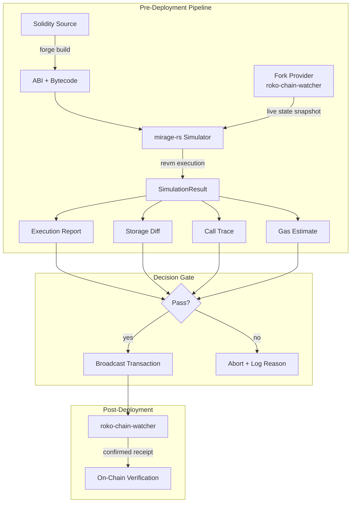
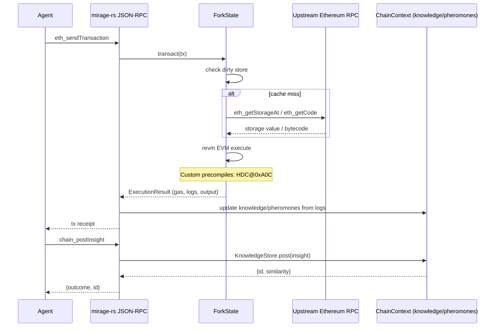
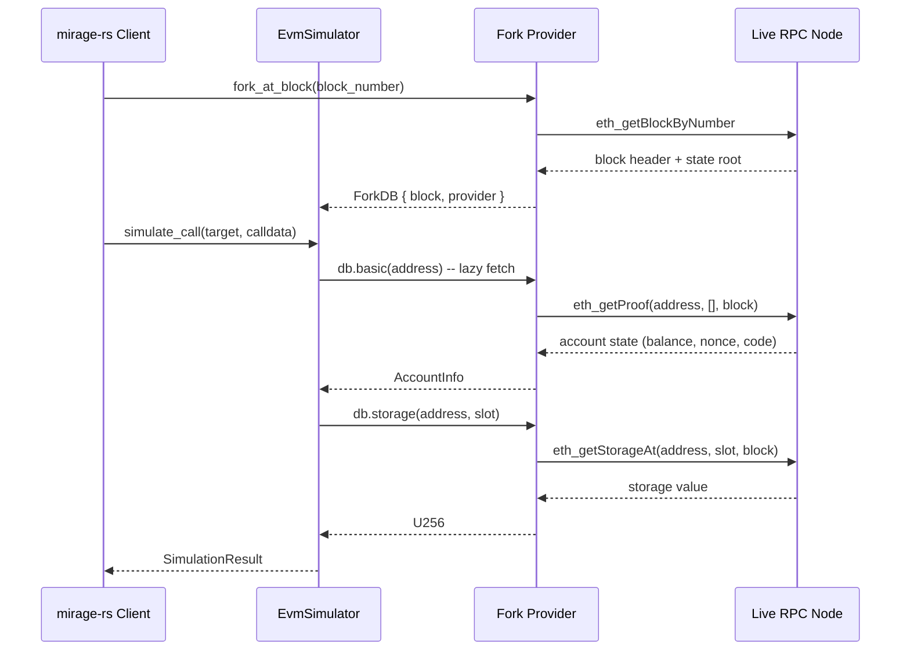
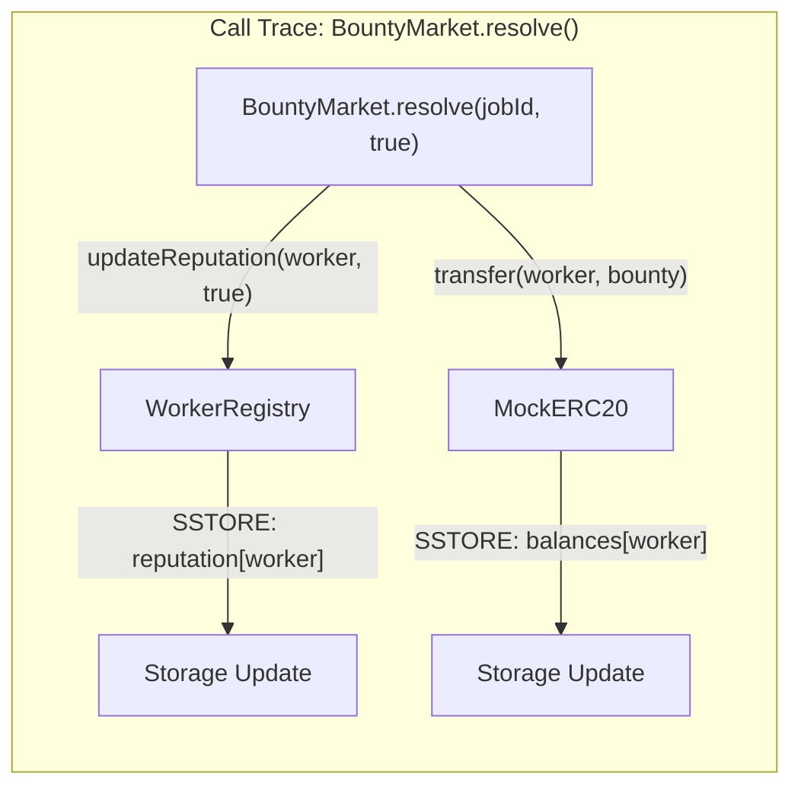
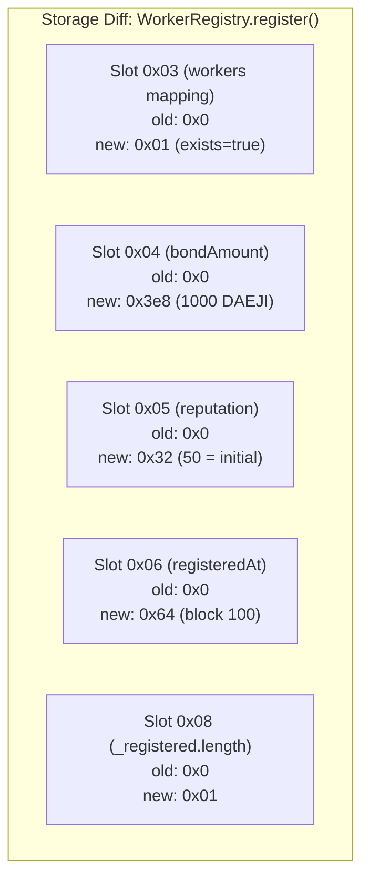
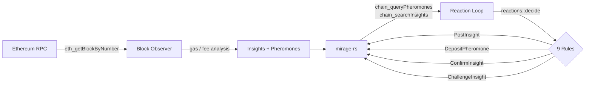
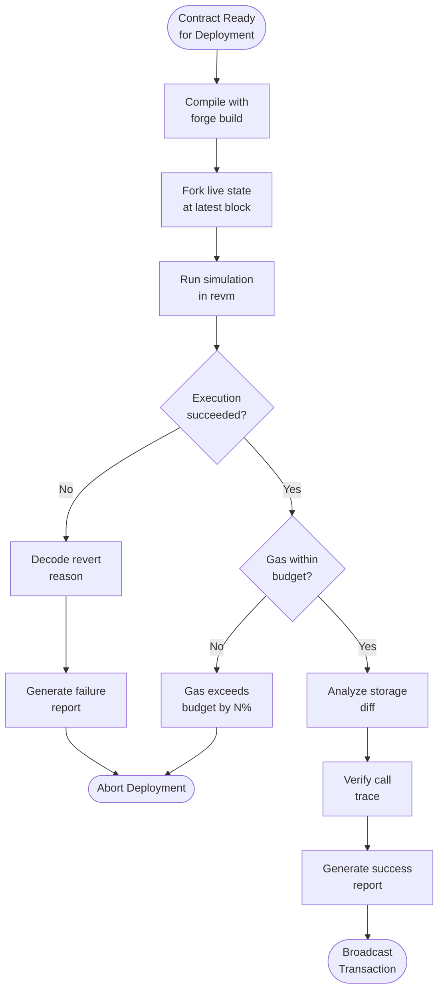

# EVM Simulator -- mirage-rs and revm Integration

> Roko's EVM simulation layer: how mirage-rs uses revm (Rust EVM) to simulate
> contract execution before deployment, fork testing against live state, gas
> estimation, trace analysis, and storage diff visualization.

Navigation: [README](./README.md) | **EVM Simulator** | [Solidity Contracts](./solidity-contracts.md) | [NEAR Contracts](./near-contracts.md) | [Benchmarks](./benchmarking.md) | [IronClaw Integration](./ironclaw-integration.md) | [References](./references.md)

---

## Overview

The Roko contract suite relies on an embedded EVM simulation layer called
**mirage-rs** to provide pre-deployment validation, gas estimation, and
fork-testing capabilities. Rather than deploying contracts directly to a live
chain and hoping they work, mirage-rs spins up a local revm instance,
replays the deployment against forked state, and produces a detailed execution
report -- including gas consumption, storage diffs, and call traces -- before
any on-chain transaction is broadcast.

**Source**: The mirage-rs simulator lives in
[`apps/mirage-rs/`](https://github.com/wpank/roko/blob/main/apps/mirage-rs/)
within the Roko repository. The chain watcher that feeds live state into the
simulator is at
[`apps/roko-chain-watcher/`](https://github.com/wpank/roko/blob/main/apps/roko-chain-watcher/).
The Rust-side contract integration crate is at
[`crates/roko-chain/`](https://github.com/wpank/roko/blob/main/crates/roko-chain/).

---

## Architecture



The pipeline enforces a strict **simulate-before-execute** invariant: no
contract deployment or state-mutating call reaches the chain without first
passing through the simulator. This is the same pattern IronClaw uses for
its sandbox execution model (see [ironclaw-integration.md](./ironclaw-integration.md)).

---

## revm -- The Rust EVM

[revm](https://github.com/bluealloy/revm) [9] is a Rust implementation of the
Ethereum Virtual Machine. It provides:

- **Deterministic execution**: Given the same state and transaction, revm
  produces identical results every time.
- **Configurable spec**: Shanghai, Cancun, Prague -- the EVM spec version
  is selectable at runtime.
- **Inspector framework**: Pluggable hooks for every opcode execution, call
  entry/exit, storage read/write, and log emission.
- **Database abstraction**: The `Database` trait lets you back the EVM with
  in-memory state, a forked RPC provider, or a custom storage backend.

mirage-rs configures revm with the Shanghai spec (`MIRAGE_EVM_SPEC`) to match
the Foundry build configuration in
[`contracts/foundry.toml`](https://github.com/wpank/roko/blob/main/contracts/foundry.toml),
which uses `evm_version = "shanghai"`. This ensures that simulation results
match on-chain execution exactly.

---

## Simulator Core -- ForkState and HybridDB

**Source**:
[`apps/mirage-rs/src/main.rs`](https://github.com/wpank/roko/blob/main/apps/mirage-rs/src/main.rs)

The architecture centers on `ForkState`, which wraps a `HybridDB` combining
four storage layers:

- **Upstream RPC**: Lazy-fetched mainnet state via HTTP/WebSocket
- **Read cache**: Time-bounded LRU cache for fetched account/storage data
- **Dirty store**: Local modifications from simulated transactions
- **Bytecode cache**: Multi-version copy-on-write storage for contract code

Key cargo features:

| Feature | Purpose |
|---------|---------|
| `sim-gas` | revm gas accounting path |
| `chain` | HDC index, InsightEntry knowledge layer, stigmergy pheromones |
| `roko` | Bridge to roko-core traits (Gate, Substrate) |
| `dashboard-api` | HTTP REST API for pheromone field, knowledge graph, agent topology |

### Simulation Result Types

```rust
use revm::primitives::{Address, Bytes, U256};
use std::collections::HashMap;

/// Result of a single simulation run.
#[derive(Debug, Clone)]
pub struct SimulationResult {
    /// Whether the transaction succeeded.
    pub success: bool,
    /// Gas consumed by execution.
    pub gas_used: u64,
    /// Gas refunded (e.g., from SSTORE clearing).
    pub gas_refunded: u64,
    /// Return data (contract address for CREATE, bytes for CALL).
    pub output: Bytes,
    /// Logs emitted during execution.
    pub logs: Vec<SimLog>,
    /// Storage slots that changed, keyed by contract address.
    pub storage_diffs: HashMap<Address, Vec<StorageDiff>>,
    /// Full call trace tree.
    pub call_trace: CallTrace,
}

/// A single storage slot change.
#[derive(Debug, Clone)]
pub struct StorageDiff {
    pub slot: U256,
    pub old_value: U256,
    pub new_value: U256,
}

/// A single emitted log.
#[derive(Debug, Clone)]
pub struct SimLog {
    pub address: Address,
    pub topics: Vec<U256>,
    pub data: Bytes,
}

/// Recursive call trace node.
#[derive(Debug, Clone)]
pub struct CallTrace {
    pub caller: Address,
    pub target: Address,
    pub value: U256,
    pub input: Bytes,
    pub output: Bytes,
    pub gas_used: u64,
    pub children: Vec<CallTrace>,
}
```

### EVM Simulator Flow



### Contract Deployment Simulation

```rust
use revm::{
    db::CacheDB,
    primitives::{
        AccountInfo, Address, Bytecode, Bytes, ExecutionResult,
        Output, TransactTo, TxEnv, U256,
    },
    Evm, EvmBuilder,
};

pub struct EvmSimulator {
    db: CacheDB<revm::db::EmptyDB>,
    chain_id: u64,
    block_number: u64,
    block_timestamp: u64,
    gas_limit: u64,
}

impl EvmSimulator {
    /// Create a new simulator with empty state.
    pub fn new(chain_id: u64) -> Self {
        Self {
            db: CacheDB::new(revm::db::EmptyDB::default()),
            chain_id,
            block_number: 1,
            block_timestamp: 1_700_000_000,
            gas_limit: 30_000_000,
        }
    }

    /// Fund an address with ETH for gas payments.
    pub fn fund_account(&mut self, address: Address, balance: U256) {
        let info = AccountInfo {
            balance,
            nonce: 0,
            code_hash: revm::primitives::KECCAK_EMPTY,
            code: None,
        };
        self.db.insert_account_info(address, info);
    }

    /// Simulate a contract deployment (CREATE transaction).
    pub fn simulate_deploy(
        &mut self,
        deployer: Address,
        bytecode: Bytes,
        value: U256,
    ) -> Result<SimulationResult, SimulationError> {
        let tx = TxEnv {
            caller: deployer,
            transact_to: TransactTo::Create,
            data: bytecode,
            value,
            gas_limit: self.gas_limit,
            ..Default::default()
        };
        self.execute(tx)
    }

    /// Simulate a contract call (CALL transaction).
    pub fn simulate_call(
        &mut self,
        caller: Address,
        target: Address,
        calldata: Bytes,
        value: U256,
    ) -> Result<SimulationResult, SimulationError> {
        let tx = TxEnv {
            caller,
            transact_to: TransactTo::Call(target),
            data: calldata,
            value,
            gas_limit: self.gas_limit,
            ..Default::default()
        };
        self.execute(tx)
    }

    fn execute(&mut self, tx: TxEnv) -> Result<SimulationResult, SimulationError> {
        let mut evm = EvmBuilder::default()
            .with_db(&mut self.db)
            .modify_tx_env(|tx_env| *tx_env = tx)
            .modify_block_env(|block| {
                block.number = U256::from(self.block_number);
                block.timestamp = U256::from(self.block_timestamp);
            })
            .modify_cfg_env(|cfg| {
                cfg.chain_id = self.chain_id;
            })
            .build();

        let result = evm.transact_commit()
            .map_err(|e| SimulationError::EvmError(format!("{e:?}")))?;

        self.block_number += 1;
        self.block_timestamp += 12; // ~12s block time

        match result {
            ExecutionResult::Success { gas_used, gas_refunded, output, logs, .. } => {
                let output_bytes = match output {
                    Output::Create(bytes, _addr) => bytes,
                    Output::Call(bytes) => bytes,
                };
                Ok(SimulationResult {
                    success: true,
                    gas_used,
                    gas_refunded,
                    output: output_bytes,
                    logs: logs.into_iter().map(|l| SimLog {
                        address: l.address,
                        topics: l.topics().iter()
                            .map(|t| U256::from_be_bytes(t.0)).collect(),
                        data: l.data.data.clone(),
                    }).collect(),
                    storage_diffs: HashMap::new(), // populated by inspector
                    call_trace: CallTrace {
                        caller: Address::ZERO,
                        target: Address::ZERO,
                        value: U256::ZERO,
                        input: Bytes::new(),
                        output: Bytes::new(),
                        gas_used,
                        children: vec![],
                    },
                })
            }
            ExecutionResult::Revert { gas_used, output } => {
                Ok(SimulationResult {
                    success: false,
                    gas_used,
                    gas_refunded: 0,
                    output,
                    logs: vec![],
                    storage_diffs: HashMap::new(),
                    call_trace: CallTrace {
                        caller: Address::ZERO,
                        target: Address::ZERO,
                        value: U256::ZERO,
                        input: Bytes::new(),
                        output: Bytes::new(),
                        gas_used,
                        children: vec![],
                    },
                })
            }
            ExecutionResult::Halt { reason, gas_used } => {
                Err(SimulationError::Halted {
                    reason: format!("{reason:?}"),
                    gas_used,
                })
            }
        }
    }
}

#[derive(Debug, thiserror::Error)]
pub enum SimulationError {
    #[error("EVM execution error: {0}")]
    EvmError(String),
    #[error("EVM halted: {reason} (gas used: {gas_used})")]
    Halted { reason: String, gas_used: u64 },
    #[error("Fork provider error: {0}")]
    ForkError(String),
}
```

---

## ERC-8004 Bootstrap and ForkState

**Source**:
[`apps/mirage-rs/src/main.rs`](https://github.com/wpank/roko/blob/main/apps/mirage-rs/src/main.rs)

At startup, mirage-rs bootstraps three ERC-8004 contracts at well-known
addresses using `EvmExecutor::transact()`:

```rust
const ERC8004_IDENTITY_REGISTRY:   Address = address!("0x8004A818BFB912233c491871b3d84c89A494BD9e");
const ERC8004_REPUTATION_REGISTRY: Address = address!("0x8004A818BFB912233c491871b3d84c89A494BD9f");
const ERC8004_VALIDATION_REGISTRY: Address = address!("0x8004A818BFB912233c491871b3d84c89A494BDA0");
const ERC8004_BOOTSTRAP_ADMIN:     Address = address!("0x8004000000000000000000000000000000000001");
const ERC8004_BOOTSTRAP_DEPLOYER:  Address = address!("0x8004000000000000000000000000000000000002");
```

The `bootstrap_erc8004_contracts()` function:

1. Checks if each canonical address already has deployed code (from a
   restored snapshot).
2. If not, loads pre-compiled init bytecode from
   `static/erc8004/*.init.hex`.
3. Appends ABI-encoded constructor arguments (admin address, dependencies).
4. Executes via `EvmExecutor::transact()` against a cloned fork state.
5. Copies the resulting runtime bytecode and storage to the canonical address.

This gives every mirage-rs instance the same three ERC-8004 contracts at
deterministic addresses, regardless of the upstream chain state. The
`bytecode_hash = "none"` Foundry setting ensures the init bytecodes are
reproducible across builds.

---

## Fork Testing Against Live State

Fork testing replays a transaction against a snapshot of live chain state,
fetched through the roko-chain-watcher RPC proxy. This catches issues that
only manifest with real storage values -- for example, a bounty market
interaction that depends on a worker's actual staked balance.



The fork provider implements revm's `Database` trait with lazy loading:
storage slots and account state are fetched from the RPC on first access
and cached for the duration of the simulation.

```rust
use revm::db::{CacheDB, EthersDB};
use ethers::providers::{Http, Provider};
use std::sync::Arc;

/// Create a forked database backed by a live RPC provider.
pub fn create_fork_db(
    rpc_url: &str,
    block_number: u64,
) -> Result<CacheDB<EthersDB<Provider<Http>>>, SimulationError> {
    let provider = Provider::<Http>::try_from(rpc_url)
        .map_err(|e| SimulationError::ForkError(e.to_string()))?;
    let provider = Arc::new(provider);

    let ethers_db = EthersDB::new(provider, Some(block_number.into()))
        .ok_or_else(|| SimulationError::ForkError(
            "failed to create EthersDB".to_string()
        ))?;

    Ok(CacheDB::new(ethers_db))
}
```

---

## Gas Estimation

Gas estimation runs the transaction through the simulator and extracts precise
gas consumption, broken down by opcode category. The gas report includes
a safety margin (default 20%) to account for state changes between simulation
and actual execution.

```rust
/// Gas breakdown by category.
#[derive(Debug, Clone, Default)]
pub struct GasBreakdown {
    /// Base transaction cost (21,000 for CALL, variable for CREATE).
    pub intrinsic: u64,
    /// Storage operations (SLOAD, SSTORE).
    pub storage: u64,
    /// Computation (ADD, MUL, SHA3, etc.).
    pub computation: u64,
    /// External calls (CALL, STATICCALL, DELEGATECALL).
    pub external_calls: u64,
    /// Log emissions (LOG0..LOG4).
    pub logs: u64,
    /// Memory expansion cost.
    pub memory: u64,
    /// Total gas consumed.
    pub total: u64,
    /// Recommended gas limit (total * safety_margin).
    pub recommended_limit: u64,
}

/// Estimate gas for a contract deployment with breakdown.
pub fn estimate_deploy_gas(
    simulator: &mut EvmSimulator,
    deployer: Address,
    bytecode: Bytes,
    safety_margin: f64,
) -> Result<GasBreakdown, SimulationError> {
    let result = simulator.simulate_deploy(deployer, bytecode, U256::ZERO)?;

    if !result.success {
        return Err(SimulationError::EvmError(
            "deployment reverted during gas estimation".to_string()
        ));
    }

    let total = result.gas_used;
    let recommended = (total as f64 * (1.0 + safety_margin)) as u64;

    Ok(GasBreakdown {
        intrinsic: 21_000 + (result.output.len() as u64 * 200),
        storage: 0,     // populated by storage inspector
        computation: 0, // populated by opcode inspector
        external_calls: 0,
        logs: result.logs.len() as u64 * 375,
        memory: 0,
        total,
        recommended_limit: recommended,
    })
}
```

### Gas Estimates for the Contract Suite

These estimates are derived from simulation runs against the full
13-contract deployment sequence (see [benchmarking.md](./benchmarking.md)
for full measurements):

| Contract | Deploy Gas | First Operation | Typical Call |
|----------|-----------|-----------------|-------------|
| MockERC20 | ~850,000 | `mint()`: 51,000 | `transfer()`: 29,000 |
| RoleRegistry | ~280,000 | `grantRole()`: 46,000 | `hasRole()`: 2,600 |
| AgentRegistry | ~520,000 | `register()`: 95,000 | `heartbeat()`: 28,000 |
| IdentityRegistry | ~1,400,000 | `registerPassport()`: 180,000 | `hasCapability()`: 2,800 |
| WorkerRegistry | ~780,000 | `register()`: 120,000 | `updateReputation()`: 35,000 |
| ReputationRegistry | ~680,000 | `submitFeedback()`: 85,000 | `getReputation()`: 5,200 |
| BountyMarket | ~920,000 | `post()`: 110,000 | `resolve()`: 75,000 |
| ConsortiumValidator | ~650,000 | `assembleCommittee()`: 140,000 | `vote()`: 45,000 |
| ValidationRegistry | ~550,000 | `submitWorkProof()`: 90,000 | `getPassRate()`: 4,500 |
| InsightBoard | ~480,000 | `post()`: 72,000 | `confirm()`: 55,000 |
| ISFROracle | ~420,000 | `submitRate()`: 65,000 | `currentRate()`: 3,200 |
| ISFRBountyPool | ~380,000 | `fund()`: 48,000 | `claim()`: 42,000 |
| FeeDistributor | ~350,000 | `distribute()`: 85,000 | `claimable()`: 8,500 |

---

## Trace Analysis

The trace inspector implements revm's `Inspector` trait to capture a complete
execution trace: every opcode, every call frame, every storage mutation.
This is essential for debugging complex multi-contract interactions like the
BountyMarket -> ConsortiumValidator -> WorkerRegistry resolution chain.



```rust
use revm::interpreter::{
    CallInputs, CallOutcome, CreateInputs, CreateOutcome,
    InstructionResult, Interpreter,
};
use revm::primitives::{Address, U256};
use revm::Inspector;

/// Captures a full execution trace with call frames and storage mutations.
#[derive(Debug, Default)]
pub struct TraceInspector {
    /// Stack of active call frames.
    call_stack: Vec<TraceFrame>,
    /// Completed root-level trace.
    pub root_trace: Option<CallTrace>,
    /// All storage changes observed during execution.
    pub storage_changes: Vec<(Address, U256, U256, U256)>, // (addr, slot, old, new)
    /// Current call depth.
    depth: usize,
}

#[derive(Debug)]
struct TraceFrame {
    caller: Address,
    target: Address,
    value: U256,
    input: Bytes,
    gas_start: u64,
    children: Vec<CallTrace>,
}

impl<DB: revm::Database> Inspector<DB> for TraceInspector {
    fn call(
        &mut self,
        _context: &mut revm::EvmContext<DB>,
        inputs: &mut CallInputs,
    ) -> Option<CallOutcome> {
        self.call_stack.push(TraceFrame {
            caller: inputs.caller,
            target: inputs.bytecode_address,
            value: inputs.call_value(),
            input: inputs.input.clone(),
            gas_start: inputs.gas_limit,
            children: vec![],
        });
        self.depth += 1;
        None // continue execution
    }

    fn call_end(
        &mut self,
        _context: &mut revm::EvmContext<DB>,
        _inputs: &CallInputs,
        outcome: CallOutcome,
    ) -> CallOutcome {
        self.depth -= 1;
        if let Some(frame) = self.call_stack.pop() {
            let gas_used = frame.gas_start.saturating_sub(
                outcome.result.gas.remaining()
            );
            let trace = CallTrace {
                caller: frame.caller,
                target: frame.target,
                value: frame.value,
                input: frame.input,
                output: outcome.result.output.clone(),
                gas_used,
                children: frame.children,
            };

            if let Some(parent) = self.call_stack.last_mut() {
                parent.children.push(trace);
            } else {
                self.root_trace = Some(trace);
            }
        }
        outcome
    }

    fn sstore(
        &mut self,
        _context: &mut revm::EvmContext<DB>,
        address: Address,
        slot: U256,
        new_value: U256,
    ) -> Option<InstructionResult> {
        self.storage_changes.push((address, slot, U256::ZERO, new_value));
        None
    }
}
```

---

## Storage Diff Visualization

Storage diffs are extracted by comparing the database state before and after
a simulated transaction. The diff is presented as a table of changed slots
with decoded field names where the contract ABI is available.



```rust
use std::collections::HashMap;

/// Human-readable storage diff for a single contract.
#[derive(Debug, Clone)]
pub struct ContractDiff {
    pub address: Address,
    pub contract_name: Option<String>,
    pub slot_changes: Vec<SlotChange>,
}

/// A single storage slot change with optional field name.
#[derive(Debug, Clone)]
pub struct SlotChange {
    pub slot: U256,
    pub field_name: Option<String>,
    pub old_value: U256,
    pub new_value: U256,
}

impl SlotChange {
    /// Returns the gas cost of this storage operation.
    pub fn storage_gas_cost(&self) -> u64 {
        if self.old_value == U256::ZERO && self.new_value != U256::ZERO {
            20_000 // SSTORE: new slot
        } else if self.old_value != U256::ZERO && self.new_value != U256::ZERO {
            5_000  // SSTORE: update existing
        } else if self.old_value != U256::ZERO && self.new_value == U256::ZERO {
            5_000  // SSTORE: clear -> 5,000 gas + 15,000 refund
        } else {
            100    // no-op SSTORE (same value)
        }
    }
}

/// Compute the storage diff between two database snapshots.
pub fn compute_storage_diff(
    pre_state: &HashMap<Address, HashMap<U256, U256>>,
    post_state: &HashMap<Address, HashMap<U256, U256>>,
    abi_map: &HashMap<Address, ContractAbi>,
) -> Vec<ContractDiff> {
    let mut diffs = Vec::new();

    for (address, post_slots) in post_state {
        let pre_slots = pre_state.get(address);
        let mut changes = Vec::new();

        for (slot, new_value) in post_slots {
            let old_value = pre_slots
                .and_then(|s| s.get(slot))
                .copied()
                .unwrap_or(U256::ZERO);

            if old_value != *new_value {
                let field_name = abi_map
                    .get(address)
                    .and_then(|abi| abi.decode_slot(*slot));

                changes.push(SlotChange {
                    slot: *slot,
                    field_name,
                    old_value,
                    new_value: *new_value,
                });
            }
        }

        if !changes.is_empty() {
            diffs.push(ContractDiff {
                address: *address,
                contract_name: abi_map.get(address).map(|a| a.name.clone()),
                slot_changes: changes,
            });
        }
    }

    diffs
}

/// Contract ABI for slot name resolution.
pub struct ContractAbi {
    pub name: String,
    slot_names: HashMap<U256, String>,
}

impl ContractAbi {
    pub fn decode_slot(&self, slot: U256) -> Option<String> {
        self.slot_names.get(&slot).cloned()
    }
}
```

---

## HDC Precompile at 0xA0C

**Source**:
[`apps/mirage-rs/src/precompiles/hdc.rs`](https://github.com/wpank/roko/blob/main/apps/mirage-rs/src/precompiles/hdc.rs)

mirage-rs injects a custom EVM precompile at address `0x0000...0A0C` that
exposes hyperdimensional computing (HDC) operations to Solidity contracts:

```
Address:     0x0000000000000000000000000000000000000A0C
Gas cost:    5,000 (flat, Phase 2)
Vector size: 1,280 bytes (10,240 bits)
```

**8 methods** matching the `IHDCPrecompile.sol` interface:

| Selector | Method | Purpose |
|----------|--------|---------|
| `0xcbd13d9b` | `projectBytes(bytes)` | Project arbitrary bytes to HDC vector |
| `0x1f7f97cb` | `projectTokens(string)` | Project text to HDC vector via tokenization |
| `0x675f5f52` | `bind(bytes,bytes)` | Bind two HDC vectors (element-wise XOR) |
| `0x1427c292` | `bundle(bytes[])` | Bundle multiple vectors (majority vote) |
| `0xc688e787` | `similarity(bytes,bytes)` | Hamming similarity between vectors |
| `0x4ec2c730` | `search(bytes,uint256,uint256)` | Top-K search against the index |
| `0x8e85a454` | `insert(bytes16,bytes,uint32)` | Insert vector with ID and weight |
| `0x4cb7a7a2` | `remove(bytes16)` | Remove vector by ID |

Similarity values are returned as `uint32` scaled by 1e6 (`similarity = 1.0`
returns `1_000_000`).

---

## Knowledge Layer Integration

**Source**:
[`apps/mirage-rs/src/chain/knowledge.rs`](https://github.com/wpank/roko/blob/main/apps/mirage-rs/src/chain/knowledge.rs)

The `KnowledgeStore` is an in-memory knowledge substrate exposed through
the `chain_*` JSON-RPC namespace:

| Method | Args | Returns |
|--------|------|---------|
| `chain_postInsight` | `{author, kind, content, enabledBy?, stakeWei?}` | `{outcome, id, ...}` |
| `chain_searchInsights` | `{query, k, kind?}` | `[{id, similarity, weight}]` |
| `chain_confirmInsight` | `{id, confirmer}` | `{ok: true}` |
| `chain_challengeInsight` | `{id, challenger}` | `{ok: true}` |
| `chain_applyDecay` | `{nowSecs?}` | `{prunedCount}` |
| `chain_depositPheromone` | `{kind, content, intensity?, halfLifeSeconds?}` | `{id}` |
| `chain_queryPheromones` | `{query, k}` | `[{id, kind, similarity, ...}]` |
| `chain_stats` | `{}` | `{insights, pheromones}` |

**Knowledge kinds**: `Insight`, `Heuristic`, `Warning`, `AntiKnowledge`,
`CausalLink`, `StrategyFragment`.

**Knowledge states**: `Pending -> Active -> Challenged -> Stale -> Pruned`

**Deduplication**: If a new entry is >95% HDC-similar to an existing entry
of the same kind, it is treated as a duplicate with attenuated reward.

---

## roko-chain-watcher -- Live Event Pipeline

**Source**:
[`apps/roko-chain-watcher/`](https://github.com/wpank/roko/blob/main/apps/roko-chain-watcher/)

### Architecture

The chain watcher is a long-running agent process that polls mirage-rs,
applies pattern-matching rules, and posts reactions back to the chain.

```
mirage-rs (RPC) --poll--> rpc_client --> reactions::decide --> rpc_client --post--> mirage-rs
```

Two independent tokio tasks:

1. **Reaction loop** (`watcher.rs`): Polls `chain_queryPheromones` and
   `chain_searchInsights`, runs reaction rules via `reactions::decide()`,
   executes surviving reactions via RPC. Rate-limited via a per-minute
   sliding window.

2. **Block observer** (`block_observer.rs`): Polls `eth_getBlockByNumber`
   against a real Ethereum RPC, analyzes gas usage, base-fee trends, and
   transaction patterns, and posts insights/pheromones grounded in actual
   chain data.

### Event Pipeline



### Reaction Rules

**Source**:
[`apps/roko-chain-watcher/src/reactions.rs`](https://github.com/wpank/roko/blob/main/apps/roko-chain-watcher/src/reactions.rs)

Nine pattern-matching rules:

| Rule | Trigger | Action |
|------|---------|--------|
| 1 | Threat pheromone > 0.7 intensity, no existing warning | Post warning insight |
| 2 | Opportunity pheromone > 0.6 intensity | Post strategy_fragment insight |
| 3 | Wisdom pheromone with matching insight (sim >= 0.55) | Confirm best matching insight |
| 3b | Unconfirmed insights with sim >= 0.50 | Confirm up to 3 per poll |
| 4 | Insight content contains WRONG/BUG/INCORRECT with confirmations | Challenge the insight |
| 4b | Highly confirmed insight (5+ confirms, 0 challenges) | Stress-test challenge (probabilistic) |
| 5 | Any observations (>= 3 total) | Deposit wisdom summary pheromone |
| 6 | 3+ insights share a topic (dex/lending/mev/etc.) | Synthesize heuristic + opportunity |
| 7 | Pheromone and insight share a topic | Post causal_link insight |
| 8 | 3+ low-intensity fading threats | Deposit recovery opportunity |
| 9 | 5+ consecutive insights of same kind | Challenge weakest (diversity injection) |

---

## Rust-Side Contract Integration: roko-chain

**Source**:
[`crates/roko-chain/`](https://github.com/wpank/roko/blob/main/crates/roko-chain/)

### ChainClient Trait

```rust
// https://github.com/wpank/roko/blob/main/crates/roko-chain/src/client.rs
#[async_trait]
pub trait ChainClient: Send + Sync {
    async fn block_number(&self) -> ChainResult<BlockNumber>;
    async fn get_block_header(&self, number: BlockNumber) -> ChainResult<ChainHeader>;
    async fn get_receipt(&self, tx: &TxHash) -> ChainResult<Option<Receipt>>;
    async fn get_logs(
        &self,
        from_block: BlockNumber,
        to_block: BlockNumber,
        address: Option<Address>,
        topics: Vec<Option<H256>>,
    ) -> ChainResult<Vec<LogEntry>>;
    async fn eth_call(
        &self,
        to: Address,
        data: Vec<u8>,
        block: Option<BlockNumber>,
    ) -> ChainResult<CallResult>;
    async fn get_storage_at(
        &self,
        address: Address,
        slot: H256,
        block: Option<BlockNumber>,
    ) -> ChainResult<H256>;
    async fn send_raw_transaction(&self, raw: Vec<u8>) -> ChainResult<TxHash>;
}
```

Implementations:
- **`AlloyClient`**: JSON-RPC backed by alloy-rs, supports both HTTP and WebSocket
- **`MockChainClient`**: In-memory mock for unit tests

---

## Full Simulation Pipeline

Combining all components, the complete pre-deployment pipeline:



---

## EVM Spec Configuration

mirage-rs pins the EVM spec to Shanghai to match the Foundry build
configuration. The spec controls which opcodes are available:

| Spec | New Opcodes | mirage-rs Support |
|------|------------|-------------------|
| Shanghai | `PUSH0` | Yes (default) |
| Cancun | `MCOPY`, `TSTORE`, `TLOAD`, `BLOBHASH` | Not used |
| Prague | `EOF`, `EXTCALL` | Not used |

The Shanghai choice is documented in
[`contracts/foundry.toml`](https://github.com/wpank/roko/blob/main/contracts/foundry.toml):

```toml
evm_version = "shanghai"
```

This ensures bytecode compiled by Foundry executes identically in mirage-rs's
revm instance. Using a newer spec in either the compiler or the simulator
without updating both would cause divergent execution results.

---

## Security Considerations

1. **Simulation is not proof**: A transaction that succeeds in simulation
   may fail on-chain if state changes between the simulation block and the
   broadcast block. The 20% gas margin partially mitigates this but cannot
   eliminate it.

2. **Front-running risk**: The simulation reveals the transaction's intent
   (target contract, calldata, value). If the simulation result is logged
   or transmitted insecurely, a front-runner could observe and exploit it.

3. **Fork accuracy**: The fork provider fetches state lazily. If the
   transaction touches a storage slot that the fork has not yet fetched,
   the slot defaults to zero -- which may not match live state. The
   `EthersDB` implementation in revm handles this correctly by fetching
   on-demand, but custom backends must be careful.

4. **Gas price volatility**: The simulator estimates gas units but not
   gas price. The actual cost in ETH depends on base fee and priority fee
   at broadcast time.

5. **Custom precompile portability**: Contracts that call the HDC precompile
   at `0xA0C` will fail on any non-mirage deployment. This is by design --
   the precompile is specific to the mirage-rs simulation environment.

---

## Related Documents

- [Solidity Contracts](./solidity-contracts.md) -- the 13 contracts that
  the simulator validates
- [Benchmarks](./benchmarking.md) -- gas cost measurements from simulation
  runs
- [IronClaw Integration](./ironclaw-integration.md) -- how the simulation
  pipeline integrates with IronClaw's tool system
- [NEAR Contracts](./near-contracts.md) -- the NEAR port that replaces
  EVM simulation with `near-workspaces` testing
- [References](./references.md) -- citations for revm, Foundry, and EVM specs
