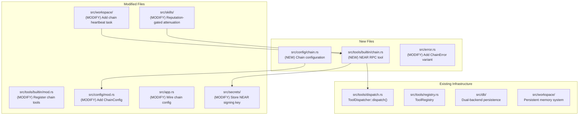
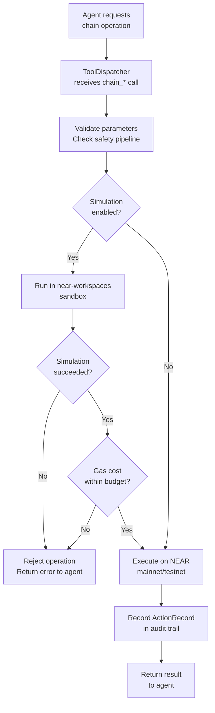
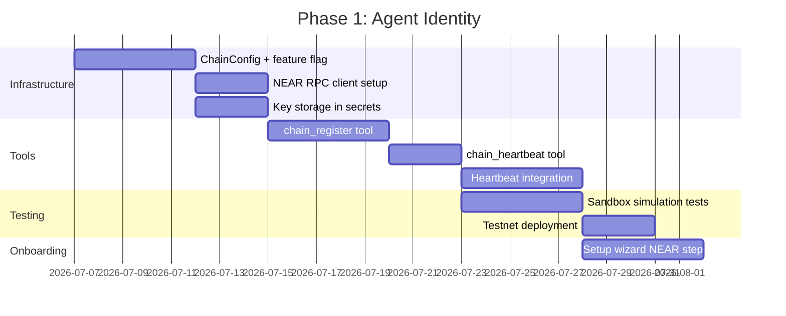
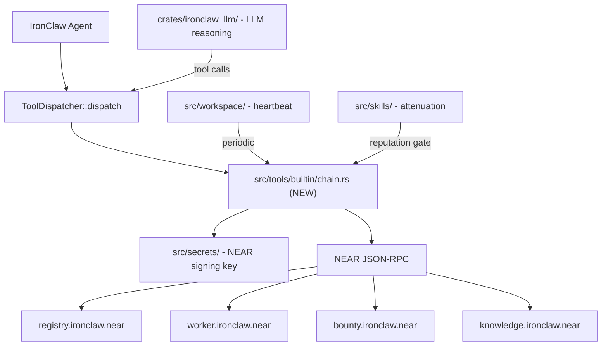

# IronClaw Smart Contract Integration

> How to integrate smart contract capabilities into IronClaw: contract
> deployment as a tool, simulation-before-execution safety pattern, wallet
> integration, NEAR RPC client setup, transaction signing, source file
> mapping, feature flag strategy, and rollout plan.

Navigation: [README](./README.md) | [Solidity Contracts](./solidity-contracts.md) | [EVM Simulator](./evm-simulator.md) | [NEAR Contracts](./near-contracts.md) | [Benchmarks](./benchmarking.md) | **IronClaw Integration** | [References](./references.md)

---

## What IronClaw Needs from On-Chain Infrastructure

IronClaw is a NEAR ecosystem project -- a secure personal AI assistant with
multi-channel access, self-expanding tools, and proactive background execution.
Integrating on-chain agent infrastructure gives IronClaw agents verifiable
identities, economic coordination, and trustless reputation.

IronClaw's current architecture provides:
- Agent identity via local configuration and workspace memory
- Tool dispatch through `ToolDispatcher` (`src/tools/dispatch.rs`) -- all
  actions go through tools
- Multi-channel access (CLI, web, Telegram, HTTP webhooks)
- Background execution via heartbeat system (`src/workspace/`)
- Skill system with trust-based attenuation (`src/skills/`)

On-chain infrastructure adds:
- **Verifiable agent identity**: Other agents can verify an IronClaw agent's
  capabilities and track record without trusting a central server.
- **Cross-instance coordination**: Multiple IronClaw instances can delegate
  tasks, share knowledge, and settle payments via the bounty market.
- **Reputation portability**: An agent's reputation lives on-chain and is
  readable by any party, not locked to a single deployment.
- **Economic primitives**: Agents earn and spend tokens for work, knowledge
  contributions, and validation services.

---

## IronClaw Source File Mapping

The integration touches these IronClaw source files and modules:



### Existing Modules That Enable the Integration

| Module | Role in Chain Integration |
|--------|-------------------------|
| `src/tools/dispatch.rs` | All chain interactions flow through `ToolDispatcher::dispatch()` |
| `src/tools/registry.rs` | Registers the new `chain_*` tools for LLM discovery |
| `src/tools/tool.rs` | `Tool` trait that `ChainTool` implements |
| `src/secrets/` | AES-256-GCM encrypted storage for NEAR signing key |
| `src/config/` | Environment variable configuration for chain settings |
| `src/workspace/` | Heartbeat system that drives periodic on-chain heartbeats |
| `src/skills/` | Trust-based tool attenuation, gated by on-chain reputation |
| `src/db/` | Stores chain transaction history and credential metadata |
| `src/error.rs` | Error types via `thiserror` |

---

## Simulation-Before-Execution Safety Pattern

IronClaw follows a "simulate before execute" pattern for all state-mutating
operations, mirroring the mirage-rs pipeline described in
[evm-simulator.md](./evm-simulator.md). For NEAR, this uses
`near-workspaces` sandbox simulation rather than revm.



### Implementation

```rust
// src/tools/builtin/chain.rs

use near_jsonrpc_client::{JsonRpcClient, methods};
use near_primitives::types::{AccountId, Gas};
use near_crypto::{InMemorySigner, SecretKey};
use crate::tools::tool::{Tool, ToolOutput, ToolError};
use crate::secrets::SecretStore;

/// Maximum gas budget per transaction (default: 100 TGas).
const DEFAULT_GAS_BUDGET: Gas = Gas::from_tgas(100);

/// Chain tool for NEAR blockchain interactions.
pub struct ChainTool {
    rpc_client: JsonRpcClient,
    signer: Option<InMemorySigner>,
    network: NearNetwork,
    simulate_first: bool,
    gas_budget: Gas,
}

#[derive(Clone)]
pub enum NearNetwork {
    Mainnet,
    Testnet,
}

impl NearNetwork {
    pub fn rpc_url(&self) -> &str {
        match self {
            NearNetwork::Mainnet => "https://rpc.mainnet.near.org",
            NearNetwork::Testnet => "https://rpc.testnet.near.org",
        }
    }
}

impl ChainTool {
    /// Create a new ChainTool from configuration.
    pub async fn from_config(
        config: &ChainConfig,
        secrets: &SecretStore,
    ) -> Result<Self, ChainError> {
        let network = match config.near_network.as_str() {
            "mainnet" => NearNetwork::Mainnet,
            "testnet" => NearNetwork::Testnet,
            other => return Err(ChainError::InvalidNetwork(other.to_string())),
        };

        let rpc_client = JsonRpcClient::connect(network.rpc_url());

        // Load signing key from secrets store
        let signer = if let Some(key_json) = secrets.get("near_signing_key").await? {
            let account_id: AccountId = config.near_account_id.parse()
                .map_err(|e| ChainError::Config(format!("invalid account ID: {e}")))?;
            let secret_key: SecretKey = key_json.parse()
                .map_err(|e| ChainError::Config(format!("invalid secret key: {e}")))?;
            Some(InMemorySigner::from_secret_key(account_id, secret_key))
        } else {
            None
        };

        Ok(Self {
            rpc_client,
            signer,
            network,
            simulate_first: config.simulate_before_execute,
            gas_budget: Gas::from_tgas(config.gas_budget_tgas.unwrap_or(100)),
        })
    }
}
```

---

## Chain Tool Definitions

Following IronClaw's "Everything Goes Through Tools" principle, all chain
interactions are exposed as tools that the LLM can invoke via
`ToolDispatcher::dispatch()`.

### Tool Registry

```rust
// Addition to src/tools/builtin/mod.rs

pub fn register_chain_tools(registry: &mut ToolRegistry, config: &ChainConfig) {
    if !config.enabled {
        return; // chain feature disabled
    }

    registry.register(ChainHeartbeat::new());
    registry.register(ChainRegister::new());
    registry.register(ChainBountyPost::new());
    registry.register(ChainBountyClaim::new());
    registry.register(ChainBountySubmit::new());
    registry.register(ChainReputationQuery::new());
    registry.register(ChainKnowledgePost::new());
    registry.register(ChainKnowledgeSearch::new());
}
```

### Tool Definitions

| Tool Name | Parameters | Returns | Phase |
|-----------|-----------|---------|-------|
| `chain_register` | `capabilities: string`, `passport_hash: string` | `{account_id, tx_hash}` | 1 |
| `chain_heartbeat` | (none) | `{block_height, tx_hash}` | 1 |
| `chain_reputation_query` | `account_id: string` | `{reputation, tier, job_count}` | 2 |
| `chain_bounty_post` | `spec_hash: string`, `bounty: u128`, `deadline_ns: u64` | `{job_id, tx_hash}` | 2 |
| `chain_bounty_claim` | `job_id: u64` | `{tx_hash}` | 2 |
| `chain_bounty_submit` | `job_id: u64`, `result_hash: string` | `{tx_hash}` | 2 |
| `chain_knowledge_post` | `uri: string`, `reward: u128` | `{insight_id, tx_hash}` | 3 |
| `chain_knowledge_search` | `query: string`, `limit: u32` | `[{id, similarity, content}]` | 3 |

### Example Tool Implementation

```rust
pub struct ChainHeartbeat {
    chain_tool: Arc<ChainTool>,
}

#[async_trait]
impl Tool for ChainHeartbeat {
    fn name(&self) -> &str {
        "chain_heartbeat"
    }

    fn description(&self) -> &str {
        "Send a heartbeat to the on-chain agent registry to maintain liveness proof"
    }

    fn parameters(&self) -> serde_json::Value {
        serde_json::json!({
            "type": "object",
            "properties": {},
            "required": []
        })
    }

    async fn execute(
        &self,
        _params: serde_json::Value,
        _context: &ToolContext,
    ) -> Result<ToolOutput, ToolError> {
        let signer = self.chain_tool.signer.as_ref()
            .ok_or_else(|| ToolError::Config("NEAR signing key not configured".into()))?;

        let registry_id: AccountId = "registry.ironclaw.near".parse()
            .map_err(|e| ToolError::Config(format!("{e}")))?;

        // Build the function call transaction
        let tx = methods::broadcast_tx_commit::RpcBroadcastTxCommitRequest {
            signed_transaction: create_function_call_tx(
                signer,
                &registry_id,
                "heartbeat",
                b"{}".to_vec(),
                Gas::from_tgas(5),
                NearToken::from_yoctonear(0),
            ).await?,
        };

        let result = self.chain_tool.rpc_client.call(tx).await
            .map_err(|e| ToolError::External(format!("NEAR RPC error: {e}")))?;

        Ok(ToolOutput::text(serde_json::json!({
            "status": "ok",
            "block_height": result.transaction_outcome.block_hash,
            "tx_hash": result.transaction.hash.to_string(),
        }).to_string()))
    }
}
```

---

## Wallet Integration and Transaction Signing

### Key Storage

The NEAR signing key is stored in IronClaw's secrets system
(`src/secrets/`), encrypted with AES-256-GCM and the OS keychain master key.

```rust
// Key storage flow
pub async fn store_near_key(
    secrets: &SecretStore,
    account_id: &str,
    secret_key: &str,
) -> Result<(), SecretError> {
    // Validate the key format before storing
    let _: SecretKey = secret_key.parse()
        .map_err(|e| SecretError::InvalidKey(format!("{e}")))?;
    let _: AccountId = account_id.parse()
        .map_err(|e| SecretError::InvalidKey(format!("{e}")))?;

    secrets.set("near_account_id", account_id).await?;
    secrets.set("near_signing_key", secret_key).await?;
    Ok(())
}
```

### Transaction Construction

```rust
use near_primitives::transaction::{Action, FunctionCallAction, Transaction};
use near_primitives::hash::CryptoHash;

async fn create_function_call_tx(
    signer: &InMemorySigner,
    receiver_id: &AccountId,
    method_name: &str,
    args: Vec<u8>,
    gas: Gas,
    deposit: NearToken,
) -> Result<near_primitives::transaction::SignedTransaction, ChainError> {
    // Get the current nonce and block hash
    let access_key = rpc_client
        .call(methods::query::RpcQueryRequest {
            block_reference: Finality::Final.into(),
            request: near_primitives::views::QueryRequest::ViewAccessKey {
                account_id: signer.account_id.clone(),
                public_key: signer.public_key(),
            },
        })
        .await
        .map_err(|e| ChainError::Rpc(e.to_string()))?;

    let nonce = access_key.nonce + 1;
    let block_hash = access_key.block_hash;

    let transaction = Transaction {
        signer_id: signer.account_id.clone(),
        public_key: signer.public_key(),
        nonce,
        receiver_id: receiver_id.clone(),
        block_hash,
        actions: vec![Action::FunctionCall(Box::new(FunctionCallAction {
            method_name: method_name.to_string(),
            args,
            gas: gas.as_gas(),
            deposit: deposit.as_yoctonear(),
        }))],
    };

    let signed = transaction.sign(&signer);
    Ok(signed)
}
```

---

## NEAR RPC Client Setup

### Configuration

```rust
// src/config/chain.rs

#[derive(Debug, Clone, serde::Deserialize)]
pub struct ChainConfig {
    /// Enable chain integration (default: false).
    #[serde(default)]
    pub enabled: bool,

    /// NEAR network: "mainnet" or "testnet".
    #[serde(default = "default_network")]
    pub near_network: String,

    /// NEAR account ID for this agent.
    pub near_account_id: String,

    /// Path to NEAR key file (alternative to secrets store).
    pub near_key_path: Option<String>,

    /// Enable simulation before execution (default: true).
    #[serde(default = "default_true")]
    pub simulate_before_execute: bool,

    /// Gas budget per transaction in TGas (default: 100).
    pub gas_budget_tgas: Option<u64>,

    /// Registry contract account.
    #[serde(default = "default_registry")]
    pub registry_contract: String,

    /// Bounty market contract account.
    #[serde(default = "default_bounty")]
    pub bounty_contract: String,

    /// Worker registry contract account.
    #[serde(default = "default_worker")]
    pub worker_contract: String,

    /// Knowledge board contract account.
    #[serde(default = "default_knowledge")]
    pub knowledge_contract: String,
}

fn default_network() -> String { "testnet".to_string() }
fn default_true() -> bool { true }
fn default_registry() -> String { "registry.ironclaw.near".to_string() }
fn default_bounty() -> String { "bounty.ironclaw.near".to_string() }
fn default_worker() -> String { "worker.ironclaw.near".to_string() }
fn default_knowledge() -> String { "knowledge.ironclaw.near".to_string() }
```

### Environment Variables

```bash
# .env additions for chain integration
CHAIN_ENABLED=true
NEAR_NETWORK=testnet
NEAR_ACCOUNT_ID=myagent.testnet
NEAR_KEY_PATH=~/.ironclaw/near-key.json
CHAIN_SIMULATE_FIRST=true
CHAIN_GAS_BUDGET_TGAS=100
IRONCLAW_REGISTRY=registry.ironclaw.testnet
IRONCLAW_BOUNTY_MARKET=bounty.ironclaw.testnet
IRONCLAW_WORKER_REGISTRY=worker.ironclaw.testnet
IRONCLAW_KNOWLEDGE_BOARD=knowledge.ironclaw.testnet
```

---

## Feature Flag Strategy

The chain integration uses Cargo feature flags for conditional compilation,
following IronClaw's existing pattern for optional features.

```toml
# Cargo.toml additions

[features]
default = []
chain = [
    "dep:near-jsonrpc-client",
    "dep:near-jsonrpc-primitives",
    "dep:near-primitives",
    "dep:near-crypto",
]

[dependencies]
near-jsonrpc-client = { version = "0.10", optional = true }
near-jsonrpc-primitives = { version = "0.26", optional = true }
near-primitives = { version = "0.26", optional = true }
near-crypto = { version = "0.26", optional = true }
```

### Conditional Compilation

```rust
// src/tools/builtin/mod.rs

#[cfg(feature = "chain")]
pub mod chain;

pub fn register_all_tools(registry: &mut ToolRegistry, config: &Config) {
    // ... existing tool registration ...

    #[cfg(feature = "chain")]
    if config.chain.enabled {
        chain::register_chain_tools(registry, &config.chain);
    }
}
```

### Build Commands

```bash
# Standard build (no chain support)
cargo build

# Build with chain integration
cargo build --features chain

# Run tests including chain integration tests
cargo test --features chain,integration

# Run with chain support and logging
RUST_LOG=ironclaw=debug cargo run --features chain
```

---

## Rollout Plan

### Phase 1: Agent Identity on NEAR (4-6 weeks)

**Goal**: Each IronClaw agent gets a NEAR-based passport with heartbeat
liveness.



**Deliverables**:
- `src/tools/builtin/chain.rs` with `chain_register` and `chain_heartbeat`
- `src/config/chain.rs` with `ChainConfig`
- NEAR key storage in `src/secrets/`
- Heartbeat integration in `src/workspace/`
- Setup wizard NEAR account step in `src/setup/`
- Integration tests with `near-workspaces` sandbox

### Phase 2: Reputation and Work Coordination (6-8 weeks)

**Goal**: IronClaw agents can post and claim bounties, build on-chain
reputation, and gate tool access behind reputation tiers.

**Deliverables**:
- `chain_bounty_post`, `chain_bounty_claim`, `chain_bounty_submit` tools
- `chain_reputation_query` tool
- Reputation-gated tool attenuation in `src/skills/attenuate_tools`
- Worker registration with token bonding
- Integration with `ConsortiumValidator` for bounty resolution

### Phase 3: Knowledge Layer (4-6 weeks)

**Goal**: IronClaw's workspace memory is backed by on-chain knowledge.

**Deliverables**:
- `chain_knowledge_post` and `chain_knowledge_search` tools
- Memory-to-insight bridge: `memory_write` optionally posts to InsightBoard
- `memory_search` queries both local workspace and on-chain knowledge
- Pheromone awareness in heartbeat system

---

## Integration Architecture



---

## Security Considerations

### Key Security

1. **NEAR signing key**: Stored in IronClaw's AES-256-GCM encrypted secrets
   store with OS keychain master key. Never transmitted over the network.
   The key never leaves the local machine.

2. **Transaction signing**: All transactions are signed locally. The private
   key is loaded into memory only for the signing operation and is not
   cached in memory between tool calls.

3. **Access key permissions**: Use NEAR function-call access keys (not
   full-access keys) restricted to the specific contract methods the agent
   needs. This limits blast radius if the key is compromised.

### On-Chain Safety

4. **Simulation-before-execution**: All state-mutating calls run through a
   sandbox simulation first. The agent cannot broadcast a transaction that
   reverts in simulation.

5. **Gas budget**: A configurable maximum gas budget prevents runaway
   transactions. The default 100 TGas limit is sufficient for all single
   contract calls but prevents accidental multi-call chains.

6. **Rate limiting**: Chain tools use IronClaw's existing rate limiter
   (`src/tools/rate_limiter.rs`) to prevent the agent from flooding the
   chain with transactions.

### Reputation System Safety

7. **Reputation oracle**: The agent's on-chain reputation is read-only from
   the agent's perspective. Reputation updates are triggered by the bounty
   market and consortium validator contracts, not by the agent directly.

8. **Tier-gated tools**: High-privilege tools are gated behind on-chain
   reputation tiers. An agent with `Probation` tier cannot access tools
   that require `Expert` or `Elite` status.

9. **Prompt hash timelock**: The 24-hour prompt hash update delay
   (ventriloquist defense) prevents an attacker who compromises the agent's
   key from silently changing the system prompt. Other agents observing
   the registry will see the pending change.

### Cross-Contract Promise Safety

10. **Partial failure handling**: NEAR's async promise model means a
    token transfer can succeed while a reputation update fails. All
    promise chains include `#[private]` callbacks that check
    `PromiseResult` and log warnings for manual retry.

11. **Storage deposit management**: Contracts require attached NEAR for
    storage deposits. The chain tool calculates required deposits before
    signing to avoid failed transactions from insufficient deposits.

---

## Related Documents

- [Solidity Contracts](./solidity-contracts.md) -- the EVM contracts being
  ported to NEAR
- [EVM Simulator](./evm-simulator.md) -- the simulation pipeline that
  inspired the simulate-before-execute pattern
- [NEAR Contracts](./near-contracts.md) -- the NEAR contract implementations
  that IronClaw interacts with
- [Benchmarks](./benchmarking.md) -- cost analysis that justifies NEAR
  over EVM for production deployment
- [References](./references.md) -- citations for NEAR SDK and RPC client
