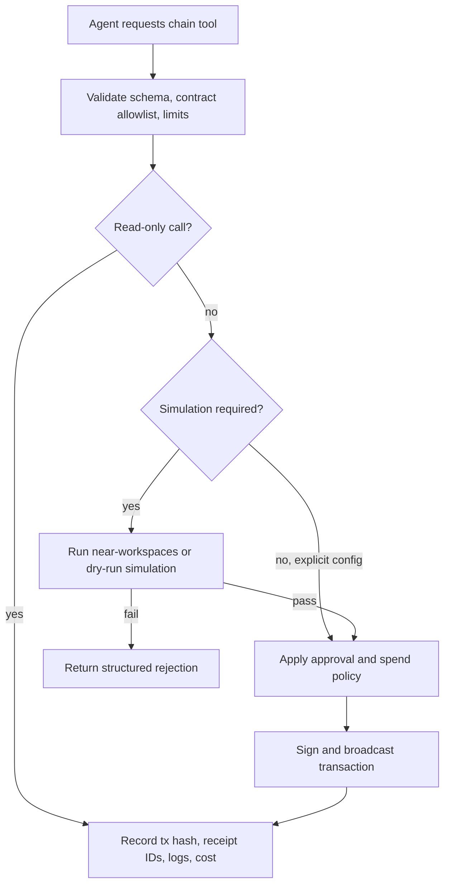

# IronClaw NEAR Integration Plan

Status: proposed integration. This document names concrete IronClaw extension
points, but the NEAR chain tool and contracts are not implemented in this
folder.

Navigation: [README](./README.md) |
[NEAR Contracts](./near-contracts.md) | **IronClaw Integration** |
[References](./references.md)

## Goal

Expose a small NEAR contract surface to IronClaw through normal tool dispatch:
agent registration, heartbeat, reputation lookup, token-funded bounties, and
optional knowledge posts. Chain operations should be auditable, rate-limited,
and simulated before broadcast when they mutate state.

## Existing IronClaw Touchpoints

These paths exist in the repository and are the natural integration points:

| Path | Role |
|------|------|
| `src/tools/dispatch.rs` | Routes agent tool calls through `ToolDispatcher` |
| `src/tools/registry.rs` | Registers built-in and extension tools |
| `src/tools/tool.rs` | Defines the `Tool` trait and tool metadata |
| `src/tools/rate_limiter.rs` | Applies tool call rate limits |
| `src/tools/builtin/mod.rs` | Exposes built-in tools |
| `src/secrets/` | Provides encrypted secret storage via the secrets subsystem |
| `src/config/` | Holds typed runtime configuration |
| `src/db/` | Provides dual-backend persistence abstractions |
| `src/workspace/` | Owns workspace memory and background behavior |
| `src/setup/` | Owns onboarding/setup flows |

Do not describe new files as existing. The first implementation would add a
chain-specific built-in tool module and a config type, then wire them through
the existing registry and app composition paths.

## Proposed Files

| File | Status | Purpose |
|------|--------|---------|
| `src/tools/builtin/near_chain.rs` | New | NEAR RPC client wrapper and chain tools |
| `src/config/chain.rs` | New | Network, contract account, and safety config |
| `src/db/*` changes | New | Optional transaction/audit metadata, added through shared DB traits first |
| `src/setup/*` changes | New | Optional setup step for account, network, and key import |

Any persistence change must support both PostgreSQL and libSQL. Any setup
change should update `src/setup/README.md` in the same branch.

## Tool Surface

| Tool | Phase | Mutates chain | Parameters |
|------|-------|---------------|------------|
| `chain_register_agent` | 1 | yes | `capabilities_json`, `descriptor_uri`, `passport_hash` |
| `chain_heartbeat` | 1 | yes | none |
| `chain_agent_status` | 1 | no | `account_id` |
| `chain_reputation_query` | 2 | no | `account_id`, optional `domain` |
| `chain_bounty_post` | 2 | yes | `spec_hash`, `amount`, `deadline_ns`, `min_tier` |
| `chain_bounty_claim` | 2 | yes | `job_id` |
| `chain_bounty_submit` | 2 | yes | `job_id`, `result_hash` |
| `chain_knowledge_post` | 3 | yes | `uri`, `content_hash`, `reward` |

Default to read-only tools first. Enable mutating tools only when an account,
function-call access key, contract allowlist, and simulation policy are
configured.

## Safety Pipeline



Recommended default: state-mutating tools require simulation. If sandbox or
dry-run support is unavailable, block the mutation unless the user explicitly
configures a narrower testnet-only bypass.

## Configuration

Example shape, not final API:

```rust
#[derive(Debug, Clone, serde::Deserialize)]
pub struct ChainConfig {
    #[serde(default)]
    pub enabled: bool,
    #[serde(default = "default_network")]
    pub near_network: String,
    pub near_account_id: Option<String>,
    #[serde(default)]
    pub simulate_before_execute: bool,
    pub gas_budget_tgas: Option<u64>,
    pub contract_allowlist: Vec<String>,
    pub registry_contract: Option<String>,
    pub worker_contract: Option<String>,
    pub bounty_contract: Option<String>,
    pub knowledge_contract: Option<String>,
}

fn default_network() -> String {
    "testnet".to_string()
}
```

Example environment variables:

```bash
CHAIN_ENABLED=true
NEAR_NETWORK=testnet
NEAR_ACCOUNT_ID=myagent.testnet
CHAIN_SIMULATE_BEFORE_EXECUTE=true
CHAIN_GAS_BUDGET_TGAS=100
IRONCLAW_REGISTRY_CONTRACT=registry.ironclaw.testnet
IRONCLAW_WORKER_CONTRACT=worker.ironclaw.testnet
IRONCLAW_BOUNTY_CONTRACT=bounty.ironclaw.testnet
```

Keep secret material out of config. Store private keys or delegated
function-call keys through the existing secrets subsystem.

## Signing and Key Management

Use NEAR function-call access keys for routine automation. Restrict each key to
the contract account and methods needed by the enabled tools. Avoid full-access
keys in long-running agent processes.

Minimum key-handling requirements:

- Validate account ID, public key, and secret key format before storage.
- Do not put plaintext keys in tool arguments, logs, `ActionRecord`, or error
  text.
- Load key material only for signing and drop it after the broadcast attempt.
- Support key rotation and revocation in setup docs before mainnet use.
- Fail closed when a mutating tool has no signer or uses an unallowlisted
  contract.

## Transaction Construction

The chain tool should hide RPC version details behind a narrow wrapper:

| Operation | Wrapper responsibility |
|-----------|------------------------|
| `view_call` | Query contract state without signing |
| `function_call` | Build, sign, and broadcast one allowed method call |
| `simulate_call` | Run sandbox/dry-run path and return gas/log estimates |
| `tx_status` | Poll transaction/receipt result and normalize errors |

Avoid leaking `near-jsonrpc-client` request types throughout the codebase.
That keeps future RPC method changes contained in `near_chain.rs`.

## Audit Record

Every mutating tool should return and persist enough metadata to debug later:

```json
{
  "network": "testnet",
  "signer_id": "myagent.testnet",
  "receiver_id": "registry.ironclaw.testnet",
  "method_name": "heartbeat",
  "tx_hash": "...",
  "gas_burnt_tgas": "...",
  "tokens_burnt": "...",
  "receipt_ids": ["..."],
  "logs": ["EVENT_JSON:..."],
  "simulation": {
    "required": true,
    "passed": true
  }
}
```

Do not persist private keys, raw prompt text, private task content, or
unredacted receiver messages if they may contain user data.

## Rollout Plan

### Phase 1: Identity and Heartbeat

Status: first useful milestone.

Deliverables:

- `AgentRegistry` testnet contract with `register`, `heartbeat`, and view
  methods.
- `chain_agent_status`, `chain_register_agent`, and `chain_heartbeat` tools.
- Simulation and gas-budget checks for register and heartbeat.
- Setup documentation for account ID and function-call key import.
- Caller-level tests that drive the actual tool execution path.

### Phase 2: Work and Reputation

Status: start after Phase 1 costs and failure modes are measured.

Deliverables:

- `WorkerRegistry` and `BountyMarket` testnet contracts.
- NEP-141 receiver-message tests for bonds and bounties.
- `chain_reputation_query`, `chain_bounty_post`, `chain_bounty_claim`, and
  `chain_bounty_submit` tools.
- Callback failure tests and repair workflow.
- Dual-backend persistence if transaction metadata is stored.

### Phase 3: Knowledge Layer

Status: optional.

Deliverables:

- `InsightBoard` only if the product needs public content hashes or rewards.
- Clear policy for what may be posted on-chain.
- Search/indexer path that does not replace local workspace memory semantics.

## Security Review Checklist

- Contract allowlist is enforced before signing.
- Gas, deposit, and token amount limits are configurable and tested.
- Mutating tools require an explicit signer and fail closed without one.
- Function-call keys are preferred and documented.
- Receiver messages are structured JSON and bounded by byte length.
- Simulation result data is not treated as private.
- Cross-contract callbacks expose partial failure and repair state.
- Admin/resolver account changes emit events and are covered by tests.
- Any new DB operations are added to the shared DB trait and implemented for
  both backends.

## Related Documents

- [NEAR contracts](./near-contracts.md) -- contract surfaces, examples, and
  benchmarks.
- [References](./references.md) -- NEAR SDK, RPC, token standards, and
  testing references.
