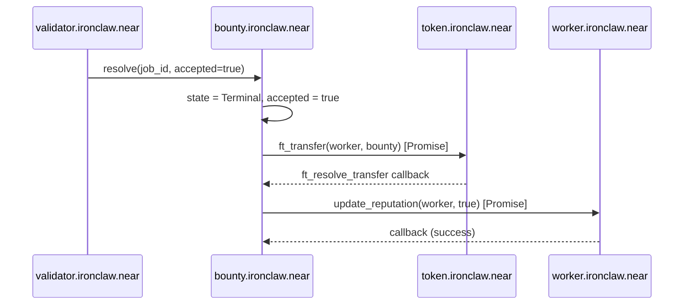
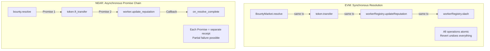
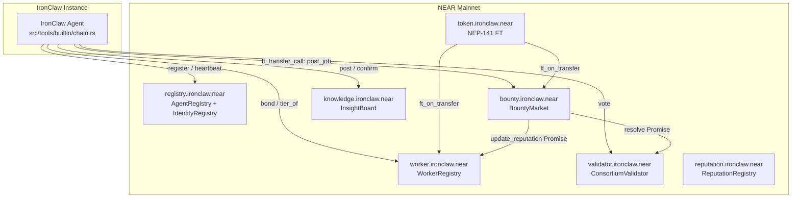

# NEAR Smart Contract Ports

> Systematic comparison of all 13 Solidity contracts with NEAR equivalents,
> storage model differences, cross-contract call patterns, access control
> mapping, events/logs differences, and testing with near-workspaces.

Navigation: [README](./README.md) | [Solidity Contracts](./solidity-contracts.md) | [EVM Simulator](./evm-simulator.md) | **NEAR Contracts** | [Benchmarks](./benchmarking.md) | [IronClaw Integration](./ironclaw-integration.md) | [References](./references.md)

---

## Porting Strategy

### Account Model Differences

The EVM contracts assume address-based identity (20-byte addresses, `msg.sender`).
NEAR uses human-readable account names (`alice.near`, `agent.roko.near`)
with a sub-account hierarchy [4].

| Aspect | EVM (Solidity) | NEAR (near-sdk-rs) |
|--------|--------------|------|
| Identity | 20-byte address | Named accounts (`agent.roko.near`) |
| Storage cost | Gas per SSTORE (20K new, 5K update) | Storage staking (1 NEAR per 100KB) [10] |
| Cross-contract calls | Synchronous | Asynchronous (promises) |
| Token standard | ERC-20 | NEP-141 (`ft_transfer`) [13] |
| NFT standard | ERC-721 | NEP-171 (`nft_transfer`) [14] |
| Access control | `msg.sender` | `env::predecessor_account_id()` |
| Reentrancy | Possible (same-tx callbacks) | Not possible (async receipts) |
| Gas model | Per-opcode, paid by sender | Per-operation + storage staking, ~300 TGas limit |
| Contract size | ~24KB bytecode limit | ~4MB WASM binary limit |
| Upgradability | Proxy patterns (EIP-1967) | Native (`deploy` to same account) |
| Randomness | `blockhash` (predictable) | VRF via `near_sdk::env::random_seed()` |

**Sub-account advantage**: NEAR's sub-account system maps naturally to the
agent hierarchy. A deployment could use:

- `ironclaw.near` -- protocol treasury
- `registry.ironclaw.near` -- identity registry
- `bounty.ironclaw.near` -- bounty market
- `worker.ironclaw.near` -- worker registry
- `oracle.ironclaw.near` -- ISFR oracle
- `alice.agents.ironclaw.near` -- an agent's identity

### Storage Model: EVM Slots vs NEAR Collections

EVM stores all contract state in a flat mapping of 32-byte slots. Solidity
compiles `mapping(address => Struct)` to `keccak256(key . slot)`. Reading
one field of one mapping entry costs a single `SLOAD` (2,100 gas cold).

NEAR uses Borsh-serialized collections with prefix-based key namespacing.
`UnorderedMap<AccountId, Agent>` stores each entry as a separate trie node
under a unique prefix. Reading costs proportional to the serialized size,
not a fixed 32-byte slot.

| Pattern | Solidity | near-sdk-rs |
|---------|----------|-------------|
| Simple key-value | `mapping(address => uint256)` | `LookupMap<AccountId, u128>` |
| Enumerable key-value | `mapping + array` | `UnorderedMap<AccountId, T>` |
| Nested mappings | `mapping(uint256 => mapping(string => T))` | `LookupMap<(u64, String), T>` |
| Sorted iteration | Not native (use array) | `TreeMap<K, V>` |
| Sets | `mapping(address => bool)` + count | `UnorderedSet<AccountId>` |
| Dynamic arrays | `uint256[]` | `Vector<T>` |

**Key difference**: Solidity mappings cannot be iterated (no `keys()` method).
The Roko contracts work around this with parallel `_registered` arrays.
NEAR's `UnorderedMap` provides native iteration via `keys()` and `values()`,
eliminating the dual-structure pattern.

### Access Control: msg.sender vs predecessor_account_id

| Solidity Pattern | NEAR Equivalent |
|-----------------|-----------------|
| `msg.sender` | `env::predecessor_account_id()` |
| `require(msg.sender == owner)` | `assert_eq!(env::predecessor_account_id(), self.owner)` |
| `modifier onlyAdmin()` | `fn assert_admin(&self) { assert_eq!(...) }` |
| `modifier onlyAuthorized()` | `fn assert_authorized(&self) { assert!(self.authorized.contains(...)) }` |
| `tx.origin` | `env::signer_account_id()` (but rarely used) |

### Events and Logs

Solidity events are structured with indexed topics (up to 3) and unindexed
data, stored in the transaction receipt log. NEAR uses `env::log_str()` for
plain text logs and `near_sdk::log!()` for formatted output.

| Solidity | NEAR |
|----------|------|
| `event AgentRegistered(address indexed agent, bytes32 passportHash)` | `env::log_str(&format!("EVENT_JSON:{{\"standard\":\"ironclaw\",\"event\":\"agent_registered\",\"data\":{{\"agent\":\"{}\",\"hash\":\"{}\"}}}}", agent, hex::encode(hash)))` |
| `emit AgentRegistered(msg.sender, hash)` | `env::log_str(...)` (called inline) |
| Indexed topics for filtering | JSON event standard (NEP-297) for indexing |
| 3 indexed params per event | No indexing limit (all in JSON data) |

The NEP-297 event standard provides a JSON-based alternative that indexers
like NEAR Lake can parse:

```rust
/// Emit a NEP-297 structured event.
fn emit_event(standard: &str, event: &str, data: &serde_json::Value) {
    env::log_str(&format!(
        "EVENT_JSON:{}",
        serde_json::json!({
            "standard": standard,
            "version": "1.0.0",
            "event": event,
            "data": [data],
        })
    ));
}
```

---

## Systematic Contract Comparison: All 13 Contracts

### 1. MockERC20 -> NEP-141 Fungible Token

| Aspect | Solidity | NEAR |
|--------|----------|------|
| Standard | ERC-20 | NEP-141 [13] |
| Mint | `mint(address to, uint256 amount)` | `ft_mint(receiver_id, amount)` (custom) |
| Transfer | `transfer(address to, uint256 amount)` | `ft_transfer(receiver_id, amount, memo)` |
| Approve+TransferFrom | Two-step allowance | `ft_transfer_call(receiver_id, amount, msg)` |
| Decimals | `decimals()` returns uint8 | `ft_metadata()` returns `FungibleTokenMetadata` |
| Storage | Inherited OZ ERC20 (balances mapping) | `LookupMap<AccountId, u128>` |
| Deploy gas | ~850,000 EVM gas | ~5 TGas |

The key difference is `ft_transfer_call()`: it atomically transfers tokens
and calls a receiver function in a single promise chain, replacing the
two-step `approve()` + `transferFrom()` pattern. This eliminates the
approval-front-running attack vector present in ERC-20.

### 2. RoleRegistry -> LookupMap RBAC

| Aspect | Solidity | NEAR |
|--------|----------|------|
| Storage | `mapping(bytes32 => mapping(address => bool))` | `LookupMap<(String, AccountId), bool>` |
| Role key | `bytes32` | `String` (human-readable role names) |
| Admin transfer | `transferAdmin(address)` | `transfer_admin(new_admin: AccountId)` |
| Events | `RoleGranted`, `RoleRevoked`, `AdminTransferred` | NEP-297 JSON events |

### 3. AgentRegistry -> UnorderedMap Agent Store

| Aspect | Solidity | NEAR |
|--------|----------|------|
| Identity | `address` | `AccountId` |
| Storage | `mapping(address => Agent)` + `address[]` | `UnorderedMap<AccountId, Agent>` |
| Liveness | `block.number - lastHeartbeat <= 200` | `env::block_height() - last_heartbeat <= window` |
| Enumeration | Manual `_registered` array | Native `agents.keys()` iterator |
| Registration cost | ~95,000 gas | ~5 TGas + 0.002 NEAR storage deposit |

### 4. IdentityRegistry -> Soulbound Passport Store

| Aspect | Solidity | NEAR |
|--------|----------|------|
| Soulbound | `revert Soulbound()` on transfer | No NFT transfer methods exposed |
| Capability bits | `uint64` bitmask (10 defined) | `u64` bitmask (same 10 bits) |
| Tier thresholds | 5,000 / 25,000 DAEJI | Same amounts in token's decimals |
| Prompt timelock | `1 days` (Solidity time unit) | `PROMPT_UPDATE_DELAY_NS` (nanoseconds) |
| Domain staking | `mapping(uint256 => mapping(string => DomainStake))` | `LookupMap<(AccountId, String), DomainStake>` |
| Withdrawal cooldown | `7 days` | `WITHDRAW_COOLDOWN_NS` (7 * 86400 * 1e9) |
| Token interaction | Direct `IERC20Minimal.transferFrom()` | `ft_transfer_call()` promise chain |

### 5. WorkerRegistry -> Bonded Worker Store

| Aspect | Solidity | NEAR |
|--------|----------|------|
| Bond deposit | `IERC20.transferFrom()` in register | `ft_transfer_call()` with `msg = "bond"` |
| Reputation | EMA with `alpha = 200` (scaled by 1000) | Same EMA, `alpha_num = 200, alpha_den = 1000` |
| Decay | Halving-based: `rep >>= 1` per interval | Same halving logic |
| Tiers | 4 tiers (Probation/Trusted/Expert/Elite) | Same 4 tiers, same thresholds |
| Slash | `slash(worker, slashType)` by authorized | Same, behind `assert_authorized()` |
| Enumeration | `_registered` array | `UnorderedMap::keys()` |

### 6. ReputationRegistry -> Multi-Domain Reputation

| Aspect | Solidity | NEAR |
|--------|----------|------|
| Storage | `mapping(uint256 => mapping(string => DomainRep))` | `LookupMap<(AccountId, String), DomainRep>` |
| Adaptive alpha | Increases with successful feedback | Same formula |
| Decay tick | Iterates all domain keys | Paginated: `apply_decay_batch(limit: u32)` |
| Peer feedback | Only passport holders can submit | Same, checked via `assert_has_passport()` |

### 7. BountyMarket -> Job Escrow with Promises

| Aspect | Solidity | NEAR |
|--------|----------|------|
| State machine | `Funded -> Assigned -> Submitted -> Terminal` | Same 4 states |
| Token lock | `IERC20.transferFrom()` in `postJob()` | `ft_transfer_call()` with `msg = "post_job:{spec_hash}:{deadline}"` |
| Resolution | Synchronous: transfer + reputation + slash | Asynchronous: promise chain with callbacks |
| Deadline | `block.timestamp > deadline` | `env::block_timestamp() > deadline_ns` |

**Resolution promise chain on NEAR**:



### 8. ConsortiumValidator -> Committee Voting

| Aspect | Solidity | NEAR |
|--------|----------|------|
| Committee size | Fixed 3 members | Fixed 3 members |
| Selection | Iterate all workers, filter by tier | Paginated or off-chain selection |
| Randomness | `blockhash(block.number - 1)` (predictable) | `env::random_seed()` (VRF-backed) |
| Voting | Synchronous majority check | Same (single-contract, no promises needed) |
| Resolution trigger | Direct call to `market.resolve()` | Promise to `bounty.ironclaw.near` |

**Critical porting note**: The Solidity `assembleCommittee()` iterates all
registered workers via `workerRegistry.registeredCount()` and
`workerRegistry.registeredAt(i)`. With 10,000 workers, this exceeds NEAR's
300 TGas limit. Solution: maintain a pre-filtered `trusted_workers` set
in the WorkerRegistry, updated on tier changes, and pass it via cross-contract
call rather than re-iterating.

### 9. ValidationRegistry -> Work Proof Store

| Aspect | Solidity | NEAR |
|--------|----------|------|
| Storage | `mapping(uint256 => WorkProof[])` | `LookupMap<AccountId, Vector<WorkProof>>` |
| Gate pass rate | Computed from proof history | Same, with pagination for large histories |
| Attestation | Validator signs off-chain | Same pattern |

### 10. InsightBoard -> Knowledge Curation

| Aspect | Solidity | NEAR |
|--------|----------|------|
| Post | `post(uri, rewardPerConfirm)` | `post(uri, reward_per_confirm)` |
| Self-confirm | Blocked (`require(msg.sender != poster)`) | Blocked (`assert_ne!(predecessor, poster)`) |
| Reward claim | `claim()` pulls accumulated rewards | Same, via `ft_transfer` promise |
| Storage | `mapping(uint256 => Insight)` | `UnorderedMap<u64, Insight>` |

### 11. ISFROracle -> Interest Rate Feed

| Aspect | Solidity | NEAR |
|--------|----------|------|
| Role check | `RoleRegistry.hasRole(ORACLE_ROLE, msg.sender)` | `assert!(self.oracles.contains(&predecessor))` |
| Rate storage | Epoch-based mapping | Same, `LookupMap<u64, RateSubmission>` |
| Finalization | Median of submissions | Same algorithm |

### 12. ISFRBountyPool -> Keeper Rewards

| Aspect | Solidity | NEAR |
|--------|----------|------|
| Funding | `IERC20.transferFrom()` | `ft_transfer_call()` to pool contract |
| Reward claim | `claim()` by keepers | Same, via promise chain |
| Role check | Via RoleRegistry | Inline `LookupMap<AccountId, bool>` |

### 13. FeeDistributor -> Multi-Party Split

| Aspect | Solidity | NEAR |
|--------|----------|------|
| Split ratios | 40% validators, 30% providers, 20% agent, 10% treasury | Same |
| Distribution | Push: iterate recipients, transfer to each | Pull: `withdraw()` per participant |
| Dust handling | First `remainder` recipients get +1 wei | Same, with yoctoNEAR |

**NEAR improvement**: The Solidity FeeDistributor uses a push pattern where
a single `distribute()` call iterates all recipients and sends tokens. If any
recipient reverts (e.g., a contract without a fallback), the entire call fails.
The NEAR port uses a pull pattern: `distribute()` records each participant's
share, and each calls `withdraw()` individually. This eliminates the griefing
vector.

---

## Key NEAR Contracts: Full Implementation

### AgentRegistry on NEAR

```rust
// contracts/near/agent-registry/src/lib.rs
use near_sdk::borsh::{BorshDeserialize, BorshSerialize};
use near_sdk::collections::UnorderedMap;
use near_sdk::{
    env, near, AccountId, BlockHeight, NearToken, PanicOnDefault,
};

const STORAGE_DEPOSIT_YOCTO: u128 = 2_000_000_000_000_000_000_000; // 0.002 NEAR

#[derive(BorshDeserialize, BorshSerialize)]
pub struct Agent {
    pub capabilities: String,
    pub passport_hash: [u8; 32],
    pub registered_at: BlockHeight,
    pub last_heartbeat: BlockHeight,
}

#[near(contract_state)]
#[derive(PanicOnDefault)]
pub struct AgentRegistry {
    agents: UnorderedMap<AccountId, Agent>,
    liveness_window: BlockHeight,
}

#[near]
impl AgentRegistry {
    #[init]
    pub fn new(liveness_window: Option<BlockHeight>) -> Self {
        Self {
            agents: UnorderedMap::new(b"a"),
            liveness_window: liveness_window.unwrap_or(200),
        }
    }

    /// Register this account as an agent.
    #[payable]
    pub fn register(&mut self, capabilities: String, passport_hash: Vec<u8>) {
        let account = env::predecessor_account_id();
        assert!(
            self.agents.get(&account).is_none(),
            "Already registered"
        );
        assert!(
            env::attached_deposit().as_yoctonear() >= STORAGE_DEPOSIT_YOCTO,
            "Attach at least 0.002 NEAR for storage"
        );

        let hash: [u8; 32] = passport_hash
            .try_into()
            .expect("passport_hash must be 32 bytes");

        self.agents.insert(
            &account,
            &Agent {
                capabilities,
                passport_hash: hash,
                registered_at: env::block_height(),
                last_heartbeat: env::block_height(),
            },
        );

        env::log_str(&format!("AgentRegistered:{}", account));
    }

    /// Update liveness timestamp.
    pub fn heartbeat(&mut self) {
        let account = env::predecessor_account_id();
        let mut agent = self.agents.get(&account).expect("Not registered");
        agent.last_heartbeat = env::block_height();
        self.agents.insert(&account, &agent);
        env::log_str(&format!("AgentHeartbeat:{}", account));
    }

    pub fn is_active(&self, account: AccountId) -> bool {
        match self.agents.get(&account) {
            None => false,
            Some(a) => {
                env::block_height().saturating_sub(a.last_heartbeat)
                    <= self.liveness_window
            }
        }
    }

    pub fn agent_count(&self) -> u64 {
        self.agents.len()
    }
}
```

### WorkerRegistry on NEAR

```rust
// contracts/near/worker-registry/src/lib.rs
use near_sdk::borsh::{BorshDeserialize, BorshSerialize};
use near_sdk::collections::{LookupMap, UnorderedMap};
use near_sdk::{
    env, near, AccountId, BlockHeight, NearToken, PanicOnDefault,
    Promise,
};

const MIN_BOND: u128 = 1_000 * 10u128.pow(18); // 1,000 tokens
const INITIAL_REP: u128 = 50;
const ALPHA_NUM: u128 = 200;
const ALPHA_DEN: u128 = 1000;
const DECAY_INTERVAL: u64 = 14 * 24 * 60 * 60 * 1_000_000_000; // 14 days in ns
const SLASH_BPS: [u128; 4] = [100, 250, 500, 1000]; // 1%, 2.5%, 5%, 10%

#[derive(BorshDeserialize, BorshSerialize, Clone, Copy, PartialEq, PartialOrd)]
#[repr(u8)]
pub enum Tier {
    Probation = 0,
    Trusted = 1,
    Expert = 2,
    Elite = 3,
}

#[derive(BorshDeserialize, BorshSerialize)]
pub struct Worker {
    pub bond_amount: u128,
    pub reputation: u128,
    pub job_count: u64,
    pub registered_at: BlockHeight,
    pub last_decay: u64, // timestamp in ns
}

#[near(contract_state)]
#[derive(PanicOnDefault)]
pub struct WorkerRegistry {
    owner: AccountId,
    authorized: LookupMap<AccountId, bool>,
    workers: UnorderedMap<AccountId, Worker>,
    stake_token: AccountId,
}

#[near]
impl WorkerRegistry {
    #[init]
    pub fn new(owner: AccountId, stake_token: AccountId) -> Self {
        Self {
            owner,
            authorized: LookupMap::new(b"auth"),
            workers: UnorderedMap::new(b"w"),
            stake_token,
        }
    }

    /// Authorize a contract to call updateReputation / slash.
    pub fn set_authorized(&mut self, account: AccountId, allowed: bool) {
        self.assert_owner();
        self.authorized.insert(&account, &allowed);
    }

    /// NEP-141 ft_on_transfer callback: receives bond deposit.
    pub fn ft_on_transfer(
        &mut self,
        sender_id: AccountId,
        amount: String,
        msg: String,
    ) -> String {
        assert_eq!(
            env::predecessor_account_id(),
            self.stake_token,
            "Only accepts stake token"
        );

        let amount: u128 = amount.parse().expect("Invalid amount");
        assert!(amount >= MIN_BOND, "Bond must be >= 1000 tokens");

        if msg == "bond" {
            assert!(
                self.workers.get(&sender_id).is_none(),
                "Already registered"
            );
            self.workers.insert(
                &sender_id,
                &Worker {
                    bond_amount: amount,
                    reputation: INITIAL_REP,
                    job_count: 0,
                    registered_at: env::block_height(),
                    last_decay: env::block_timestamp(),
                },
            );
            env::log_str(&format!("WorkerRegistered:{}", sender_id));
            "0".to_string() // return unused tokens (none)
        } else {
            amount.to_string() // refund unknown msg
        }
    }

    /// Update reputation using EMA: new_rep = alpha * outcome + (1-alpha) * old_rep
    pub fn update_reputation(&mut self, worker: AccountId, success: bool) {
        self.assert_authorized();
        let mut w = self.workers.get(&worker).expect("Not registered");

        // Apply decay first
        self.apply_decay_for(&mut w);

        // EMA update: alpha = 0.2 (200/1000)
        let outcome: u128 = if success { 100 } else { 0 };
        w.reputation = (ALPHA_NUM * outcome + (ALPHA_DEN - ALPHA_NUM) * w.reputation)
            / ALPHA_DEN;
        w.job_count += 1;

        self.workers.insert(&worker, &w);
    }

    /// Slash a worker's bond.
    pub fn slash(&mut self, worker: AccountId, slash_type: u8) {
        self.assert_authorized();
        let mut w = self.workers.get(&worker).expect("Not registered");
        let bps = SLASH_BPS[slash_type as usize];
        let slash_amount = w.bond_amount * bps / 10_000;
        w.bond_amount = w.bond_amount.saturating_sub(slash_amount);
        self.workers.insert(&worker, &w);

        env::log_str(&format!(
            "WorkerSlashed:{}:{}",
            worker, slash_amount
        ));
    }

    /// Compute tier from reputation + job count.
    pub fn tier_of(&self, worker: AccountId) -> u8 {
        match self.workers.get(&worker) {
            None => Tier::Probation as u8,
            Some(w) => {
                if w.reputation >= 90 && w.job_count >= 50 {
                    Tier::Elite as u8
                } else if w.reputation >= 75 && w.job_count >= 20 {
                    Tier::Expert as u8
                } else if w.reputation >= 60 && w.job_count >= 5 {
                    Tier::Trusted as u8
                } else {
                    Tier::Probation as u8
                }
            }
        }
    }

    fn apply_decay_for(&self, worker: &mut Worker) {
        let now = env::block_timestamp();
        let elapsed = now.saturating_sub(worker.last_decay);
        let halvings = elapsed / DECAY_INTERVAL;
        for _ in 0..halvings.min(64) {
            worker.reputation >>= 1;
        }
        worker.last_decay = now;
    }

    fn assert_owner(&self) {
        assert_eq!(
            env::predecessor_account_id(),
            self.owner,
            "Only owner"
        );
    }

    fn assert_authorized(&self) {
        let caller = env::predecessor_account_id();
        assert!(
            self.authorized.get(&caller).unwrap_or(false)
                || caller == self.owner,
            "Not authorized"
        );
    }
}
```

### BountyMarket on NEAR

```rust
// contracts/near/bounty-market/src/lib.rs
use near_sdk::borsh::{BorshDeserialize, BorshSerialize};
use near_sdk::collections::UnorderedMap;
use near_sdk::{
    env, ext_contract, near, AccountId, Gas, NearToken, PanicOnDefault,
    Promise, PromiseResult,
};

const GAS_FOR_FT_TRANSFER: Gas = Gas::from_tgas(10);
const GAS_FOR_REPUTATION: Gas = Gas::from_tgas(10);
const GAS_FOR_CALLBACK: Gas = Gas::from_tgas(5);

#[derive(BorshDeserialize, BorshSerialize, Clone, Copy, PartialEq)]
#[repr(u8)]
pub enum JobState {
    Funded = 0,
    Assigned = 1,
    Submitted = 2,
    Terminal = 3,
}

#[derive(BorshDeserialize, BorshSerialize)]
pub struct Job {
    pub poster: AccountId,
    pub worker: Option<AccountId>,
    pub spec_hash: [u8; 32],
    pub result_hash: Option<[u8; 32]>,
    pub bounty: u128,
    pub deadline_ns: u64,
    pub min_tier: u8,
    pub state: u8,
    pub accepted: bool,
}

#[near(contract_state)]
#[derive(PanicOnDefault)]
pub struct BountyMarket {
    next_id: u64,
    jobs: UnorderedMap<u64, Job>,
    resolver: AccountId,
    bounty_token: AccountId,
    worker_registry: AccountId,
}

/// Cross-contract call interfaces.
#[ext_contract(ext_ft)]
trait FungibleToken {
    fn ft_transfer(&mut self, receiver_id: AccountId, amount: String, memo: Option<String>);
}

#[ext_contract(ext_worker)]
trait WorkerRegistryExt {
    fn update_reputation(&mut self, worker: AccountId, success: bool);
    fn slash(&mut self, worker: AccountId, slash_type: u8);
}

#[near]
impl BountyMarket {
    #[init]
    pub fn new(
        resolver: AccountId,
        bounty_token: AccountId,
        worker_registry: AccountId,
    ) -> Self {
        Self {
            next_id: 1,
            jobs: UnorderedMap::new(b"j"),
            resolver,
            bounty_token,
            worker_registry,
        }
    }

    /// Called by NEP-141 ft_transfer_call to post a new job.
    pub fn ft_on_transfer(
        &mut self,
        sender_id: AccountId,
        amount: String,
        msg: String,
    ) -> String {
        assert_eq!(
            env::predecessor_account_id(),
            self.bounty_token,
            "Only accepts bounty token"
        );

        let amount: u128 = amount.parse().expect("Invalid amount");
        // msg format: "post_job:{spec_hash_hex}:{deadline_ns}:{min_tier}"
        let parts: Vec<&str> = msg.splitn(4, ':').collect();
        assert_eq!(parts[0], "post_job", "Unknown msg");

        let spec_hash = hex::decode(parts[1]).expect("Invalid hex");
        let deadline_ns: u64 = parts[2].parse().expect("Invalid deadline");
        let min_tier: u8 = parts[3].parse().expect("Invalid tier");

        let id = self.next_id;
        self.next_id += 1;

        let hash: [u8; 32] = spec_hash.try_into().expect("hash must be 32 bytes");
        self.jobs.insert(
            &id,
            &Job {
                poster: sender_id.clone(),
                worker: None,
                spec_hash: hash,
                result_hash: None,
                bounty: amount,
                deadline_ns,
                min_tier,
                state: JobState::Funded as u8,
                accepted: false,
            },
        );

        env::log_str(&format!("JobPosted:{}:{}:{}", id, sender_id, amount));
        "0".to_string() // no refund
    }

    /// Resolve a job (called by the resolver / ConsortiumValidator).
    pub fn resolve(&mut self, job_id: u64, accepted: bool) -> Promise {
        assert_eq!(
            env::predecessor_account_id(),
            self.resolver,
            "Only resolver"
        );

        let mut job = self.jobs.get(&job_id).expect("Job not found");
        assert_eq!(job.state, JobState::Submitted as u8, "Not submitted");

        job.state = JobState::Terminal as u8;
        job.accepted = accepted;
        self.jobs.insert(&job_id, &job);

        let recipient = if accepted {
            job.worker.clone().expect("No worker")
        } else {
            job.poster.clone()
        };
        let worker = job.worker.clone().expect("No worker");

        // Promise chain: transfer tokens, then update reputation
        ext_ft::ext(self.bounty_token.clone())
            .with_attached_deposit(NearToken::from_yoctonear(1))
            .with_static_gas(GAS_FOR_FT_TRANSFER)
            .ft_transfer(recipient, job.bounty.to_string(), None)
            .then(
                ext_worker::ext(self.worker_registry.clone())
                    .with_static_gas(GAS_FOR_REPUTATION)
                    .update_reputation(worker, accepted),
            )
    }
}
```

---

## Cross-Contract Call Patterns

### Synchronous (EVM) vs Asynchronous (NEAR)



**Partial failure handling**: On NEAR, if `ft_transfer` succeeds but
`update_reputation` fails, the tokens are transferred but the reputation is
not updated. The BountyMarket includes a `#[private]` callback that checks
`PromiseResult` and logs a warning if the reputation update failed, allowing
manual retry:

```rust
#[private]
pub fn on_resolve_complete(&mut self, job_id: u64) {
    match env::promise_result(0) {
        PromiseResult::Successful(_) => {
            env::log_str(&format!("JobResolved:{}", job_id));
        }
        PromiseResult::Failed => {
            env::log_str(&format!(
                "WARNING:ReputationUpdateFailed:{}",
                job_id
            ));
            // Job is already terminal; log for manual retry
        }
    }
}
```

---

## The Aurora Shortcut

[Aurora](https://aurora.dev/) is an EVM running as a NEAR smart contract [11].
It provides an alternative porting path: deploy the Solidity contracts
unchanged on Aurora, getting NEAR's finality and low fees without rewriting
to Rust.

**Advantages**:
- Zero code changes to Solidity contracts
- Same tooling (Foundry, Hardhat, ethers.js)
- Rainbow Bridge enables asset transfers between NEAR and Aurora
- Sub-second finality inherited from NEAR

**Disadvantages**:
- EVM execution overhead (~1.5x the equivalent NEAR gas)
- Cannot use NEAR-native features (named accounts, storage staking, VRF)
- Additional bridge complexity for NEAR-native token interactions

**Recommendation**: Use Aurora for rapid prototyping and initial deployment,
then port high-value contracts (IdentityRegistry, WorkerRegistry) to native
NEAR for better economics and tighter IronClaw integration.

---

## Testing with near-workspaces

[near-workspaces-rs](https://github.com/near/near-workspaces-rs) provides
a testing framework that spins up a local NEAR sandbox node for integration
testing. This replaces Foundry's `forge test` for NEAR contracts.

```rust
#[tokio::test]
async fn test_agent_registry_lifecycle() -> anyhow::Result<()> {
    let sandbox = near_workspaces::sandbox().await?;

    // Deploy the contract
    let wasm = near_workspaces::compile_project("./").await?;
    let contract = sandbox.dev_deploy(&wasm).await?;

    // Initialize
    contract
        .call("new")
        .args_json(serde_json::json!({
            "liveness_window": 200
        }))
        .transact()
        .await?
        .into_result()?;

    // Create a test account
    let alice = sandbox.dev_create_account().await?;

    // Register with storage deposit
    let passport_hash = vec![0u8; 32];
    let result = alice
        .call(contract.id(), "register")
        .args_json(serde_json::json!({
            "capabilities": "{\"inference\":true}",
            "passport_hash": passport_hash,
        }))
        .deposit(NearToken::from_millinear(2)) // 0.002 NEAR
        .transact()
        .await?;
    assert!(result.is_success());

    // Check liveness
    let is_active: bool = contract
        .view("is_active")
        .args_json(serde_json::json!({
            "account": alice.id()
        }))
        .await?
        .json()?;
    assert!(is_active);

    // Send heartbeat
    alice
        .call(contract.id(), "heartbeat")
        .transact()
        .await?
        .into_result()?;

    // Verify agent count
    let count: u64 = contract
        .view("agent_count")
        .args_json(serde_json::json!({}))
        .await?
        .json()?;
    assert_eq!(count, 1);

    Ok(())
}

#[tokio::test]
async fn test_bounty_lifecycle() -> anyhow::Result<()> {
    let sandbox = near_workspaces::sandbox().await?;

    // Deploy token, worker registry, and bounty market
    let token_wasm = near_workspaces::compile_project("../token/").await?;
    let token = sandbox.dev_deploy(&token_wasm).await?;

    let worker_wasm = near_workspaces::compile_project("../worker-registry/").await?;
    let worker_reg = sandbox.dev_deploy(&worker_wasm).await?;

    let bounty_wasm = near_workspaces::compile_project("../bounty-market/").await?;
    let bounty = sandbox.dev_deploy(&bounty_wasm).await?;

    // Initialize contracts
    token.call("new")
        .args_json(serde_json::json!({
            "name": "DAEJI",
            "symbol": "DAEJI",
            "total_supply": "1000000000000000000000000000"
        }))
        .transact().await?.into_result()?;

    worker_reg.call("new")
        .args_json(serde_json::json!({
            "owner": worker_reg.id(),
            "stake_token": token.id()
        }))
        .transact().await?.into_result()?;

    bounty.call("new")
        .args_json(serde_json::json!({
            "resolver": bounty.id(), // self-resolve for testing
            "bounty_token": token.id(),
            "worker_registry": worker_reg.id()
        }))
        .transact().await?.into_result()?;

    // Create accounts, mint tokens, post job, assign, submit, resolve
    // ... (full lifecycle test)

    Ok(())
}
```

---

## Deployment Topology



---

## Related Documents

- [Solidity Contracts](./solidity-contracts.md) -- the original 13 EVM
  contracts being ported
- [EVM Simulator](./evm-simulator.md) -- mirage-rs simulation that NEAR's
  near-workspaces testing replaces
- [Benchmarks](./benchmarking.md) -- gas and storage cost comparison
  between EVM and NEAR
- [IronClaw Integration](./ironclaw-integration.md) -- how these NEAR
  contracts integrate with IronClaw
- [References](./references.md) -- citations for NEAR SDK, NEP standards
