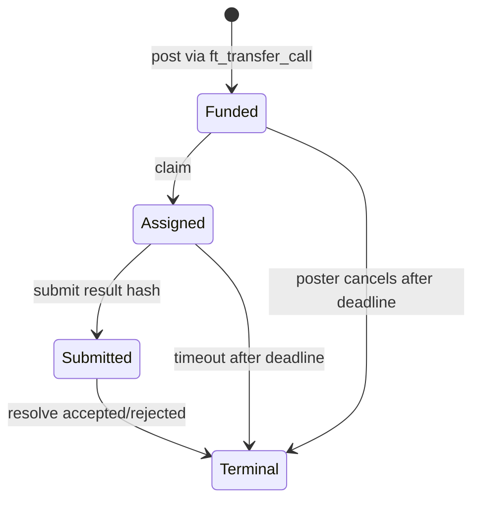

# NEAR Contract Examples and Invariants

Status: reference design. The snippets below are intended to guide a first
`near-sdk-rs` implementation and should be compiled, tested, and benchmarked in
the eventual contract workspace before deployment.

Navigation: [README](./README.md) | **NEAR Contracts** |
[IronClaw Integration](./ironclaw-integration.md) |
[References](./references.md)

## Design Rules

- Prefer NEAR account IDs over opaque addresses in all public interfaces.
- Use `near_sdk::store` collections for persistent contract state.
- Keep token-funded actions behind NEP-141 `ft_transfer_call` and
  `ft_on_transfer`.
- Parse receiver messages as JSON enums. Avoid positional strings such as
  `post_job:hash:deadline`.
- Emit NEP-297 `EVENT_JSON` logs for state changes that indexers or IronClaw
  will consume.
- Paginate every method that can scan user-controlled collections.
- Bound user-provided strings and vectors before storage.
- Add private callbacks for cross-contract promises that mutate economic state.

## Contract Status

| Contract | Status | Required before mainnet |
|----------|--------|-------------------------|
| `AgentRegistry` | Ready for first implementation | Storage refund helper, event tests, heartbeat benchmark |
| `WorkerRegistry` | Design target | NEP-141 receiver tests, withdrawal cooldown, slashing policy review |
| `BountyMarket` | Design target | End-to-end token escrow tests, callback retry path, resolver authorization |
| `ReputationRegistry` | Optional | Domain key limits, paginated decay, caller-level tests |
| `InsightBoard` | Optional | Content policy, URI/hash validation, reward accounting tests |

## Common Event Helper

Use a single helper per contract so event shape is consistent and easy to
index.

```rust
use near_sdk::{env, serde_json::json};

fn emit_event(event: &str, data: near_sdk::serde_json::Value) {
    env::log_str(&format!(
        "EVENT_JSON:{}",
        json!({
            "standard": "ironclaw-agent-contracts",
            "version": "0.1.0",
            "event": event,
            "data": [data]
        })
    ));
}
```

## AgentRegistry

Status: Phase 1 target.

Purpose: record a small, public identity descriptor for an agent account and a
liveness heartbeat. Store hashes and URIs, not private prompt or task content.

Public surface:

| Method | Mutability | Notes |
|--------|------------|-------|
| `new(owner_id, liveness_window_blocks)` | init | Sets owner and heartbeat window |
| `register(capabilities_json, descriptor_uri, passport_hash)` | payable | Writes one agent record |
| `heartbeat()` | mutable | Updates `last_heartbeat_block` for predecessor |
| `is_active(account_id)` | view | Checks block-height window |
| `get_agent(account_id)` | view | Returns bounded public metadata |
| `remove_self()` | mutable | Optional storage cleanup and event |

Reference snippet:

```rust
use near_sdk::borsh::{BorshDeserialize, BorshSerialize};
use near_sdk::serde::{Deserialize, Serialize};
use near_sdk::store::UnorderedMap;
use near_sdk::{
    env, near, AccountId, BorshStorageKey, PanicOnDefault,
};

const MIN_AGENT_STORAGE_DEPOSIT_YOCTO: u128 = 2_000_000_000_000_000_000_000;
const MAX_CAPABILITIES_BYTES: usize = 2_048;
const MAX_DESCRIPTOR_URI_BYTES: usize = 512;

#[derive(BorshSerialize, BorshStorageKey)]
enum StorageKey {
    Agents,
}

#[near(serializers = [borsh])]
#[derive(Clone)]
pub struct Agent {
    pub capabilities_json: String,
    pub descriptor_uri: String,
    pub passport_hash: [u8; 32],
    pub registered_block: u64,
    pub last_heartbeat_block: u64,
}

#[derive(Serialize, Deserialize)]
#[serde(crate = "near_sdk::serde")]
pub struct AgentView {
    pub account_id: AccountId,
    pub capabilities_json: String,
    pub descriptor_uri: String,
    pub passport_hash_hex: String,
    pub registered_block: u64,
    pub last_heartbeat_block: u64,
    pub active: bool,
}

#[near(contract_state)]
#[derive(PanicOnDefault)]
pub struct AgentRegistry {
    owner_id: AccountId,
    liveness_window_blocks: u64,
    agents: UnorderedMap<AccountId, Agent>,
}

#[near]
impl AgentRegistry {
    #[init]
    pub fn new(owner_id: AccountId, liveness_window_blocks: Option<u64>) -> Self {
        Self {
            owner_id,
            liveness_window_blocks: liveness_window_blocks.unwrap_or(200),
            agents: UnorderedMap::new(StorageKey::Agents),
        }
    }

    #[payable]
    pub fn register(
        &mut self,
        capabilities_json: String,
        descriptor_uri: String,
        passport_hash: Vec<u8>,
    ) {
        let account_id = env::predecessor_account_id();
        assert!(
            self.agents.get(&account_id).is_none(),
            "agent already registered"
        );
        assert!(
            env::attached_deposit().as_yoctonear() >= MIN_AGENT_STORAGE_DEPOSIT_YOCTO,
            "attach storage deposit"
        );
        assert!(
            capabilities_json.len() <= MAX_CAPABILITIES_BYTES,
            "capabilities_json too large"
        );
        assert!(
            descriptor_uri.len() <= MAX_DESCRIPTOR_URI_BYTES,
            "descriptor_uri too large"
        );
        assert_eq!(passport_hash.len(), 32, "passport_hash must be 32 bytes");

        let mut hash = [0_u8; 32];
        hash.copy_from_slice(&passport_hash);
        let block = env::block_height();

        self.agents.insert(
            account_id.clone(),
            Agent {
                capabilities_json,
                descriptor_uri,
                passport_hash: hash,
                registered_block: block,
                last_heartbeat_block: block,
            },
        );

        emit_event(
            "agent_registered",
            near_sdk::serde_json::json!({ "account_id": account_id }),
        );
    }

    pub fn heartbeat(&mut self) {
        let account_id = env::predecessor_account_id();
        let Some(agent) = self.agents.get_mut(&account_id) else {
            env::panic_str("agent not registered");
        };

        agent.last_heartbeat_block = env::block_height();
        emit_event(
            "agent_heartbeat",
            near_sdk::serde_json::json!({
                "account_id": account_id,
                "block_height": agent.last_heartbeat_block
            }),
        );
    }

    pub fn is_active(&self, account_id: AccountId) -> bool {
        self.agents.get(&account_id).is_some_and(|agent| {
            env::block_height().saturating_sub(agent.last_heartbeat_block)
                <= self.liveness_window_blocks
        })
    }

    pub fn agent_count(&self) -> u32 {
        self.agents.len()
    }
}
```

Implementation notes:

- Replace the fixed deposit check with a storage accounting helper before
  production. The fixed amount is a conservative placeholder for the example.
- Add `get_agent` and pagination only after deciding the public view shape.
- Test duplicate registration, under-deposit, oversized fields, and heartbeat
  from an unregistered account.

## WorkerRegistry

Status: Phase 2 target.

Purpose: hold token bonds, track worker score, apply bounded slashing, and
derive a tier for bounty eligibility.

Public surface:

| Method | Mutability | Notes |
|--------|------------|-------|
| `new(owner_id, stake_token_id)` | init | Configures token and owner |
| `ft_on_transfer(sender_id, amount, msg)` | mutable | Registers or increases worker bond |
| `set_authorized(account_id, allowed)` | owner | Grants update/slash callers |
| `update_reputation(worker_id, success)` | authorized | Applies EMA-style update |
| `slash(worker_id, basis_points, reason)` | authorized | Caps slash and emits event |
| `request_withdraw(amount)` | worker | Starts cooldown |
| `finish_withdraw()` | worker | Transfers after cooldown |
| `tier_of(worker_id)` | view | Returns `probation`, `trusted`, `expert`, or `elite` |

Use a JSON receiver message:

```json
{ "type": "bond", "metadata": "optional-public-note" }
```

Receiver snippet:

```rust
use near_sdk::json_types::U128;
use near_sdk::serde::Deserialize;
use near_sdk::{env, near, AccountId, PromiseOrValue};

const MIN_BOND: u128 = 1_000_000_000_000_000_000_000;
const MAX_RECEIVER_MSG_BYTES: usize = 512;

#[derive(Deserialize)]
#[serde(crate = "near_sdk::serde", tag = "type", rename_all = "snake_case")]
enum WorkerReceiverMessage {
    Bond { metadata: Option<String> },
}

#[near]
impl WorkerRegistry {
    pub fn ft_on_transfer(
        &mut self,
        sender_id: AccountId,
        amount: U128,
        msg: String,
    ) -> PromiseOrValue<U128> {
        assert_eq!(
            env::predecessor_account_id(),
            self.stake_token_id,
            "unsupported stake token"
        );
        assert!(msg.len() <= MAX_RECEIVER_MSG_BYTES, "receiver msg too large");

        let parsed = match near_sdk::serde_json::from_str::<WorkerReceiverMessage>(&msg) {
            Ok(value) => value,
            Err(_) => return PromiseOrValue::Value(amount),
        };

        match parsed {
            WorkerReceiverMessage::Bond { metadata: _ } => {
                assert!(amount.0 >= MIN_BOND, "bond below minimum");
                self.add_or_increase_bond(sender_id, amount.0);
                PromiseOrValue::Value(U128(0))
            }
        }
    }
}
```

Reputation guardrails:

- Keep the score bounded, for example `0..=100`.
- Use integer arithmetic with explicit numerator/denominator constants.
- Apply decay only when a worker is touched, or expose a paginated batch method.
- Do not let the worker call `update_reputation` or `slash` directly.
- Emit slash events with account, amount, basis points, and public reason code.

## BountyMarket

Status: Phase 2 target.

Purpose: escrow token-funded jobs, let workers claim and submit results, and
resolve through an authorized resolver account or contract.

State machine:



Receiver message:

```json
{
  "type": "post_job",
  "spec_hash": "64 hex chars",
  "deadline_ns": 1790000000000000000,
  "min_tier": "trusted"
}
```

Contract invariants:

- A job can only spend the bounty amount received by `ft_on_transfer`.
- `spec_hash` and `result_hash` are hashes or content IDs, not private task
  content.
- Only the assigned worker can submit.
- Only the configured resolver can resolve.
- Deadline checks use `env::block_timestamp()` in nanoseconds.
- Settlement records the terminal state before scheduling payout promises.
- Callback logs make partial failures observable and retryable.

Promise pattern:

```rust
use near_sdk::{env, ext_contract, near, AccountId, Gas, NearToken, Promise, PromiseResult};

const GAS_FOR_FT_TRANSFER: Gas = Gas::from_tgas(20);
const GAS_FOR_REPUTATION: Gas = Gas::from_tgas(20);
const GAS_FOR_CALLBACK: Gas = Gas::from_tgas(10);

#[ext_contract(ext_ft)]
trait ExtFungibleToken {
    fn ft_transfer(&mut self, receiver_id: AccountId, amount: String, memo: Option<String>);
}

#[ext_contract(ext_worker)]
trait ExtWorkerRegistry {
    fn update_reputation(&mut self, worker_id: AccountId, success: bool);
}

#[near]
impl BountyMarket {
    pub fn resolve(&mut self, job_id: u64, accepted: bool) -> Promise {
        self.assert_resolver();
        let settlement = self.mark_terminal(job_id, accepted);

        ext_ft::ext(self.bounty_token_id.clone())
            .with_attached_deposit(NearToken::from_yoctonear(1))
            .with_static_gas(GAS_FOR_FT_TRANSFER)
            .ft_transfer(
                settlement.payout_account.clone(),
                settlement.amount.to_string(),
                Some(format!("bounty:{job_id}")),
            )
            .then(
                ext_worker::ext(self.worker_registry_id.clone())
                    .with_static_gas(GAS_FOR_REPUTATION)
                    .update_reputation(settlement.worker_id.clone(), accepted),
            )
            .then(
                Self::ext(env::current_account_id())
                    .with_static_gas(GAS_FOR_CALLBACK)
                    .on_resolve_finished(job_id),
            )
    }

    #[private]
    pub fn on_resolve_finished(&mut self, job_id: u64) -> bool {
        match env::promise_result(0) {
            PromiseResult::Successful(_) => {
                emit_event(
                    "bounty_resolve_finished",
                    near_sdk::serde_json::json!({ "job_id": job_id }),
                );
                true
            }
            PromiseResult::Failed => {
                self.mark_needs_repair(job_id);
                emit_event(
                    "bounty_resolve_needs_repair",
                    near_sdk::serde_json::json!({ "job_id": job_id }),
                );
                false
            }
        }
    }
}
```

The callback checks only the final promise in this simplified chain. A full
implementation should distinguish payout failure from reputation failure if it
needs different repair behavior for each receipt.

## Optional Contracts

### ReputationRegistry

Use this only if one global worker tier is too coarse. A practical version
should use `(account_id, domain)` keys, bounded domain strings, and a paginated
decay method:

| Method | Notes |
|--------|-------|
| `update_domain(account_id, domain, outcome)` | Authorized callers only |
| `get_domain(account_id, domain)` | View score, count, last update |
| `apply_decay_batch(from_index, limit)` | Bounded maintenance |

### InsightBoard

Use this only after the local workspace/search path is stable. Store content
hashes, URIs, short labels, and reward balances. Do not store raw memories,
credentials, prompts, or private task outputs.

| Method | Notes |
|--------|-------|
| `post(uri, content_hash, reward_per_confirmation)` | Token-funded |
| `confirm(insight_id, evidence_hash)` | Blocks self-confirmation |
| `claim_rewards()` | Pull payout |
| `list_recent(from_index, limit)` | Paginated read |

## Benchmark Plan

Benchmark through `near-workspaces` so the same tests verify behavior and
record cost. At minimum, capture gas burnt, tokens burnt, storage usage delta,
number of receipts, and emitted logs.

| Scenario | Expected assertion |
|----------|--------------------|
| Agent register | Succeeds with deposit, fails without deposit, event emitted |
| Agent heartbeat | Fails before registration, updates active status after registration |
| Worker bond | Unknown receiver message returns all tokens, valid bond stores worker |
| Worker reputation | Authorized caller updates score, worker self-update fails |
| Bounty post | Valid token transfer creates funded job, malformed message refunds |
| Bounty lifecycle | Post -> claim -> submit -> resolve reaches terminal state |
| Promise failure | Failed reputation callback marks job repairable |
| Pagination | Large collection reads stay below chosen gas budget |

Suggested report format:

```text
contract=AgentRegistry method=register scenario=happy_path
gas_burnt_tgas=...
attached_gas_tgas=...
attached_deposit_near=...
storage_delta_bytes=...
receipt_count=...
logs=[...]
```

## Testnet Deployment Checklist

- Contract WASM is reproducibly built and versioned.
- Owner account and authorized resolver accounts are documented.
- Function-call access keys are limited to required methods.
- Storage deposits are measured under realistic metadata sizes.
- Every state-changing method has success and failure tests.
- Events include enough data for IronClaw to reconstruct state without reading
  private payloads.
- Emergency pause and repair methods are tested before any valuable token is
  used.
