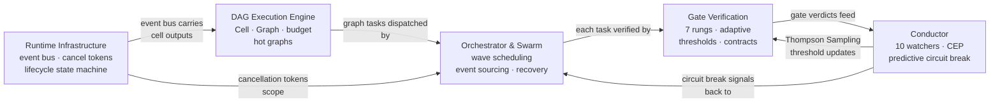

# Execution and Verification

This category covers the machinery that takes a task from declaration to verified completion: a declarative DAG workflow engine, a seven-rung progressive verification pipeline, an ensemble anomaly detector with predictive circuit breaking, a pure-state-machine orchestrator with event sourcing, and the runtime infrastructure primitives all of those depend on.

## Documents

| Document | Summary | Priority |
|----------|---------|----------|
| [DAG Execution Engine](./dag-execution.md) | TOML-defined directed acyclic graph workflows. A Cell is the universal computation unit (LLM call, shell command, gate check, file transform). Conditional edges, budget tracking (tokens + cost + deadline), hot graphs for tick-driven resident execution, and a plan-to-graph conversion pipeline. Replaces linear job chaining with declarative, parallelizable workflows. | HIGH |
| [Gate Verification Pipeline](./gate-verification.md) | Seven-rung progressive verification: compile → lint → test → symbol check → generated tests → property tests → integration tests. Complexity-driven rung selection, adaptive thresholds via CUSUM/EWMA/BOCPD, gate composition operators (parallel/voting/fallback), a process reward model, forensic causal chain reconstruction, and acceptance contracts. | HIGH |
| [Conductor Anomaly Detection](./conductor-anomaly.md) | Ensemble of 10 watchers (GhostTurn, ReviewLoop, IterationLoop, TestFailureBudget, CompileFailRepeat, ContextWindowPressure, SpecDrift, CostOverrun, TimeOverrun, StuckPattern) with predictive circuit breaking via Holt exponential smoothing, compound event pattern detection (CEP), Thompson Sampling for adaptive threshold learning, and a four-level federation hierarchy (turn/task/plan/fleet). | MEDIUM |
| [Orchestrator and Swarm](./orchestrator-swarm.md) | Pure state machine orchestrator with event sourcing. Unified cross-plan task DAG, wave scheduling for parallel execution, three-level recovery (task retry → subgraph replacement → full replan), file-conflict inference for safe parallelism, BLAKE3 hash-linked audit chain, live DAG mutation, and pheromone-based swarm coordination. | MEDIUM |
| [Runtime Infrastructure](./runtime-infrastructure.md) | EventBus with replay ring buffer. Hierarchical cancellation tokens with cascading shutdown. FIPA-informed lifecycle state machine with Kubernetes-style probes. Pure state machine + effect driver separation. Process supervision for OS subprocesses. StateHub dashboard projections. | MEDIUM |

## Execution Pipeline

**Dependency order for implementation:**

Runtime Infrastructure is the foundation — the EventBus and CancellationToken shape every other component's interface. Build it first or reuse IronClaw's equivalent abstractions. The DAG engine and Orchestrator are co-dependent (the orchestrator schedules DAG tasks); build them together. Gates and the Conductor integrate after the execution layer is stable.

## Quick Start

Read [Runtime Infrastructure](./runtime-infrastructure.md) first for the foundational primitives. Then read [DAG Execution Engine](./dag-execution.md) to understand how computation is declared and scheduled. [Gate Verification](./gate-verification.md) is the highest-priority standalone piece — rungs 1–4 (compile, lint, test, symbol check) can be grafted onto IronClaw's existing tool builder without the full DAG engine.
