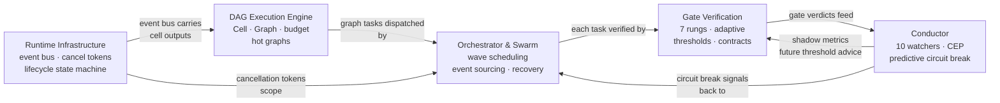

# Execution and Verification

This category covers the machinery that takes a task from declaration to verified completion: a declarative DAG workflow engine, a seven-rung progressive verification pipeline, an ensemble anomaly detector with predictive circuit breaking, a pure-state-machine orchestrator with event sourcing, and the runtime infrastructure primitives all of those depend on.

## Documents

| Document | Summary | Priority |
|----------|---------|----------|
| [DAG Execution Engine](./dag-execution.md) | TOML-defined directed acyclic graph workflows. A Cell is the universal computation unit (LLM call, shell command, gate check, file transform). Conditional edges, budget tracking (tokens + cost + deadline), hot graphs for tick-driven resident execution, and a plan-to-graph conversion pipeline. Replaces linear job chaining with declarative, parallelizable workflows. | HIGH |
| [Gate Verification Pipeline](./gate-verification.md) | Seven-rung progressive verification: compile → lint → test → symbol check → generated tests → property tests → integration tests. First milestone is a thin compile/lint/test/symbol MVP; adaptive thresholds and generated tests stay behind later validation gates. | HIGH |
| [Conductor Anomaly Detection](./conductor-anomaly.md) | Ensemble of watchers for repeated failures, review loops, test budgets, context pressure, cost/time overruns, and stuck patterns. Start as observability over existing LLM/tool failure signals; predictive control and bandit policies are later phases. | MEDIUM |
| [Orchestrator and Swarm](./orchestrator-swarm.md) | Pure state machine orchestrator with event sourcing. Unified cross-plan task DAG, wave scheduling for parallel execution, three-level recovery (task retry → subgraph replacement → full replan), file-conflict inference for safe parallelism, BLAKE3 hash-linked audit chain, live DAG mutation, and pheromone-based swarm coordination. | MEDIUM |
| [Runtime Infrastructure](./runtime-infrastructure.md) | EventBus with replay ring buffer. Hierarchical cancellation tokens with cascading shutdown. FIPA-informed lifecycle state machine with Kubernetes-style probes. Pure state machine + effect driver separation. Process supervision for OS subprocesses. StateHub dashboard projections. | MEDIUM |

## Execution Pipeline

**Implementation order:**

Start with a thin Gate Verification MVP over existing IronClaw tool/code paths:
compile, lint, test, and symbol checks with caller-level tests. Reuse existing
runtime, tool dispatch, DB, and LLM abstractions. DAG execution, orchestrator
event sourcing, and conductor adaptation are later phases after the gate MVP has
measured value.

## Quick Start

Read [Gate Verification](./gate-verification.md) first if you are implementing soon. Rungs 1-4 can be integrated into existing IronClaw callers without the full DAG engine. Read [Runtime Infrastructure](./runtime-infrastructure.md), [DAG Execution Engine](./dag-execution.md), and [Orchestrator and Swarm](./orchestrator-swarm.md) for later architecture work.
