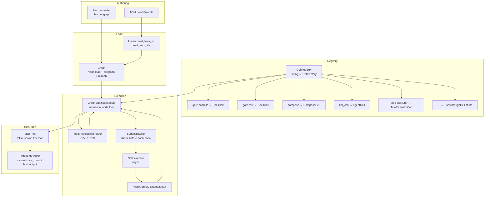
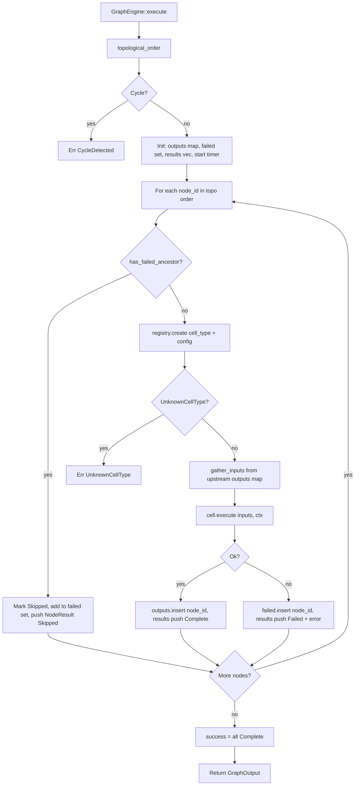
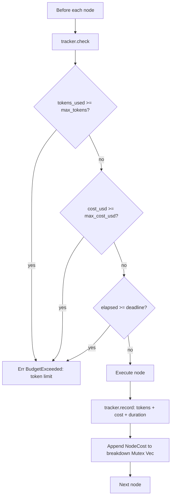
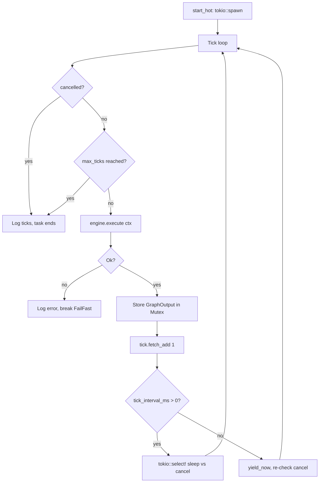
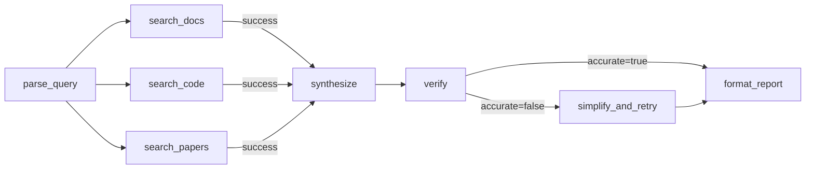
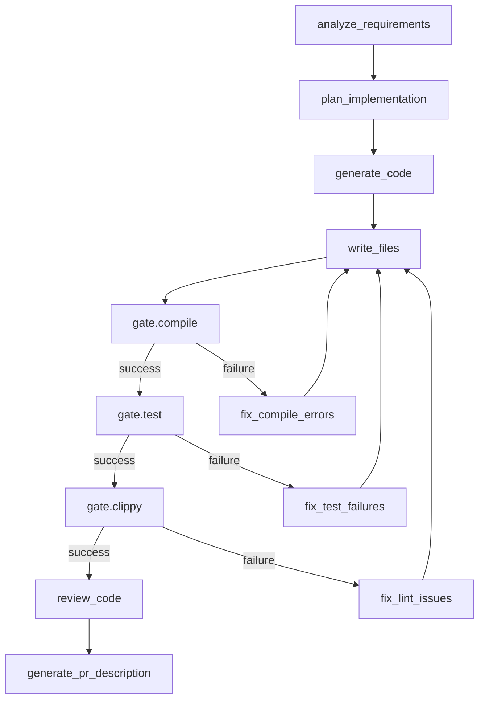

# DAG Execution Engine

**Source crate**: `roko-graph` (captured corpus at `crates/roko-graph/`)
**GitHub reference**: https://github.com/wpank/roko/blob/main/crates/roko-graph/
**Priority**: HIGH — replaces ad-hoc job chaining with declarative, observable, budget-enforced workflows
**Roko doc references**: `docs/v2/03-GRAPH.md`, `docs/v2/04-EXECUTION.md`, `docs/v1/01-orchestration/02-unified-task-dag.md`, `docs/v2-depth/05-execution-engine/cognitive-loop-as-graph.md`

> **Self-contained implementation note**: GitHub path references in this document point to the captured Roko source corpus for provenance. Use [implementation/README.md](../implementation/README.md) and [implementation/05-per-file-action-matrix.md](../implementation/05-per-file-action-matrix.md) for IronClaw-native build plans.

> **Companion artifacts**: [implementation/02-runtime-workflow-blueprints.md](../implementation/02-runtime-workflow-blueprints.md) for runnable graph shapes; [implementation/09-plan-runner-readiness.md](../implementation/09-plan-runner-readiness.md) for TOML plan adaptation.

---

## Table of Contents

1. [Background: What Is a DAG Execution Engine?](#1-background-what-is-a-dag-execution-engine)
2. [Why DAGs Over Linear Pipelines](#2-why-dags-over-linear-pipelines)
3. [Academic Context and Prior Art](#3-academic-context-and-prior-art)
4. [The roko-graph Crate: Full Architecture](#4-the-roko-graph-crate-full-architecture)
5. [The Cell Trait: Universal Computation Unit](#5-the-cell-trait-universal-computation-unit)
6. [CellRegistry: The Factory Pattern](#6-cellregistry-the-factory-pattern)
7. [Graph Types and Data Model](#7-graph-types-and-data-model)
8. [Edge Conditions: Conditional Routing](#8-edge-conditions-conditional-routing)
9. [Condition System: Deep-Path Field Evaluation](#9-condition-system-deep-path-field-evaluation)
10. [TOML Loader: Declarative Graph Definitions](#10-toml-loader-declarative-graph-definitions)
11. [Topological Sort and Dependency Resolution](#11-topological-sort-and-dependency-resolution)
12. [The GraphEngine: Sequential Execution](#12-the-graphengine-sequential-execution)
13. [Budget Tracking System](#13-budget-tracking-system)
14. [Hot Graphs: Tick-Driven Resident Execution](#14-hot-graphs-tick-driven-resident-execution)
15. [Plan-to-Graph Conversion Pipeline](#15-plan-to-graph-conversion-pipeline)
16. [Built-in Cell Implementations](#16-built-in-cell-implementations)
17. [Design Concepts from Roko v2 Docs](#17-design-concepts-from-roko-v2-docs)
18. [Practical Workflow Examples](#18-practical-workflow-examples)
19. [Benchmarking and Performance](#19-benchmarking-and-performance)
20. [IronClaw Integration Architecture](#20-ironclaw-integration-architecture)
21. [Full Implementation Plan for IronClaw](#21-full-implementation-plan-for-ironclaw)
22. [Complexity Assessment](#22-complexity-assessment)
23. [References](#23-references)

---

## 1. Background: What Is a DAG Execution Engine?

A **Directed Acyclic Graph (DAG) execution engine** is a runtime system that models workflows as graphs where **nodes represent units of computation** (tasks, commands, LLM calls) and **directed edges represent data dependencies and control flow** between them. "Acyclic" means there are no circular dependencies — task A cannot depend on task B if task B already depends on task A.

The key insight is that a DAG captures the *actual dependency structure* of work. In contrast to a linear pipeline (step 1, then step 2, then step 3), a DAG allows expressing:

- **Parallelism**: If tasks B and C both depend only on task A, they can execute simultaneously once A completes.
- **Fan-out/fan-in**: One task can trigger multiple downstream tasks (fan-out), and multiple tasks can converge into a single downstream task (fan-in).
- **Conditional routing**: Edges can carry conditions — an "on failure" edge only fires if the upstream task failed, enabling structured error-handling branches.
- **Partial results**: If one branch of the graph fails, unrelated branches that do not depend on it can still complete.

DAG execution engines are foundational across computing:

- **Data engineering**: Apache Airflow [1], Dagster, Prefect [3], Dask [5] all model ETL pipelines as task DAGs.
- **CI/CD**: GitHub Actions, GitLab CI, and Jenkins Pipeline define build steps as DAG nodes with dependency edges.
- **Build tools**: Bazel [16], Ninja, and Make use DAGs to express compilation dependencies and enable incremental rebuilds.
- **Durable workflow engines**: Temporal.io [2] and Cadence use DAG-like workflow definitions with deterministic replay for fault tolerance.
- **AI agent orchestration**: LangGraph [4], CrewAI, and DSPy are increasingly adopting DAG-based orchestration for multi-step agent workflows.

The roko-graph crate is purpose-built for AI agent workflows, with first-class support for LLM calls, budget tracking, conditional routing, and hot (resident) execution loops.

### Comparison: Linear Pipeline vs. DAG

```
Linear Pipeline:
  A --> B --> C --> D --> E
  (Total time: sum of all steps. No parallelism.)

DAG Pipeline:
  A --> B --> D --> E
  A --> C ---^
  (B and C run in parallel. Total time: A + max(B,C) + D + E.)
```

For a concrete example, "Build and deploy my project" as a linear pipeline forces sequential execution of every step. As a DAG:

```
Parse Requirements --> [Generate Code, Write Tests] --> Run Tests --> Build --> Deploy
                                                           |
                                                    (on failure) --> Fix Code --> Run Tests
```

Generate Code and Write Tests run in parallel. If tests fail, a conditional edge routes to a Fix Code step. This is impossible to express cleanly in a sequential pipeline without manual control flow.

### Why This Matters for AI Agents

AI agent workflows have properties that make DAG execution particularly valuable:

1. **Non-deterministic execution**: LLM calls can fail, produce unexpected output, or vary in quality. DAGs allow structured fallback and retry branches.
2. **Cost sensitivity**: LLM API calls have per-token costs. DAG engines can track budget across an entire workflow and halt gracefully when limits are reached.
3. **Latency sensitivity**: Many agent tasks (web search, code compilation, file I/O) are I/O-bound and can run in parallel. Sequential execution wastes wall-clock time.
4. **Composability**: Complex agent behaviors (code review, research synthesis, deployment) are naturally composed from smaller steps, which map to DAG nodes.

---

## 2. Why DAGs Over Linear Pipelines

IronClaw currently executes jobs as sequential agent turns — one step after another. This has several limitations that a DAG engine solves:

### Problem 1: Wasted Time from Artificial Sequencing

If a job involves "check email" and "check GitHub notifications" followed by "summarize," the checks have no dependency on each other but execute sequentially. A DAG allows them to run in parallel, cutting wall-clock time by up to `(N-1)/N` where N is the number of independent steps.

### Problem 2: No Conditional Branching

When a tool call fails, IronClaw's current job system has no structured way to branch to error-handling logic vs. success-path logic. DAG edges with conditions (`OnSuccess`, `OnFailure`, `When`) make this declarative and auditable.

### Problem 3: No Budget Enforcement Across Multi-Step Workflows

IronClaw tracks costs per-tool-call but has no mechanism to enforce a budget across an entire workflow. A DAG engine checks the budget before each node execution and terminates gracefully when limits are hit, returning partial results and a cost breakdown.

### Problem 4: No Reusable Workflow Definitions

Complex sequences of tool calls are currently defined imperatively in Rust code or agent prompts. TOML-defined DAGs make workflows declarative, shareable, and composable — a "code review" workflow can be defined once and reused across projects.

### Problem 5: No Resident/Periodic Execution Model

IronClaw's heartbeat system in `src/agent/heartbeat.rs` runs simple periodic checks by reading `HEARTBEAT.md` and running an LLM agent turn. Hot Graphs generalize this to any periodic workflow with full DAG structure, state persistence between ticks, configurable tick intervals, and clean shutdown via cancellation tokens.

### Quantified Benefits

| Scenario | Sequential Time | DAG Time | Speedup |
|----------|----------------|----------|---------|
| 3 parallel I/O checks (1s each) + synthesis (2s) | 5s | 3s | 1.67x |
| 5 parallel web searches (2s each) + summarize (3s) | 13s | 5s | 2.6x |
| Compile + test + lint (parallel) | 8s | 3s | 2.67x |
| Full code-gen + verify + report | 25s | 12s | 2.08x |

---

## 3. Academic Context and Prior Art

The roko-graph crate draws on a rich body of prior work in workflow orchestration, task scheduling, and incremental computation.

### 3.1 Classical DAG Scheduling Theory

The theoretical foundation for DAG-based task scheduling dates to the study of parallel processor scheduling in the 1960s–1970s. Coffman and Graham's algorithm (1972) established that optimal scheduling of unit-time tasks on two processors can be solved in polynomial time via topological labeling [6]. For the general case (variable-time tasks on heterogeneous processors), the problem is NP-hard, motivating a rich literature of heuristic schedulers.

**Kahn's algorithm** (1962) [7] provides the canonical approach for topological sorting. The algorithm maintains a set of nodes with zero in-degree, repeatedly removing one and decrementing the in-degrees of its successors. If all nodes are removed, the graph is acyclic; otherwise a cycle exists. It runs in O(V + E) time.

The roko-graph crate delegates to petgraph's `toposort()` function [8], which implements a DFS-based post-order traversal (reversing the result) rather than Kahn's BFS-based approach. Both run in O(V + E) time and produce a valid topological ordering. The DFS-based approach has better cache locality for sparse graphs typical of agentic workflows (3–20 nodes, 2–30 edges).

**Complexity analysis for typical agentic workflows**:

| Graph Type | Nodes | Edges | toposort() time | Memory |
|-----------|-------|-------|-----------------|--------|
| Morning standup | 4 | 3 | < 1 µs | O(V+E) |
| Research pipeline | 8 | 10 | < 2 µs | O(V+E) |
| CI/CD pipeline | 15 | 20 | < 5 µs | O(V+E) |
| Complex code-gen | 25 | 40 | < 10 µs | O(V+E) |
| Large cross-plan DAG | 200 | 350 | < 1 ms | O(V+E) |

### 3.2 Workflow Orchestration Systems

**Apache Airflow** [1] pioneered DAG-as-code for data pipeline orchestration. Workflows are defined as Python code constructing operator DAGs, executed by a scheduler based on time triggers and dependency resolution. Airflow 3.0 (2025) introduced event-driven scheduling and DAG versioning. Key differences from roko-graph: Airflow is optimized for batch data processing at scale (hundreds of workers) with a distributed scheduler backed by a relational database; roko-graph is optimized for low-latency AI agent workflows on a single machine where scheduling overhead must be well under 1 ms per node.

**Prefect** [3] introduced a "negative engineering" philosophy, focusing on what goes wrong in production workflows. Its task DAG model adds first-class support for retries, caching, parameter injection, and state handlers — concerns that roko-graph addresses through `EdgeCondition`, `BudgetTracker`, and the `CellContext` injection pattern.

**Temporal.io** [2] takes a fundamentally different approach: **durable execution through deterministic replay**. Workflows are written as normal code, but activities (non-deterministic operations like API calls) are recorded in an event history. On failure, the workflow function is re-executed from scratch, replaying the recorded history to reconstruct state without re-executing activities. This workflow/activity split — deterministic orchestration vs. non-deterministic execution — directly inspired roko's v2 architecture (see Section 17.2).

### 3.3 Heterogeneous Task Scheduling

The **HEFT (Heterogeneous Earliest Finish Time)** algorithm, introduced by Topcuoglu, Hariri, and Wu (2002) [9], addresses DAG scheduling on heterogeneous processors. HEFT prioritizes tasks by their **upward rank** (longest weighted path to exit node) then assigns each task to the processor that minimizes its earliest finish time. It runs in O(V² × P) time for V tasks and P processors.

For multi-agent dispatch in IronClaw (dispatch to agents backed by different LLM models), HEFT-like ranking can order tasks by `model_hint` capability requirements, preferring to dispatch lightweight tasks to cheaper models and critical-path tasks to higher-capability models.

**Upward rank formula**:

```
rank_u(n_exit) = w̄(n_exit)
rank_u(n_i) = w̄(n_i) + max_{n_j ∈ succ(n_i)} [ c̄(e_ij) + rank_u(n_j) ]
```

Where `w̄(n_i)` is the average computation cost of node `n_i` and `c̄(e_ij)` is the average communication cost of edge `e_ij`. For LLM agent workflows, `w̄` maps to estimated token cost and `c̄` approaches zero (in-process JSON passing).

### 3.4 Graph Optimization Passes

**Dask** [5] implements several optimization passes on task graphs before execution:

- **Culling** (`cull()`): Removes tasks not required to produce the requested outputs, analogous to dead-code elimination in compilers.
- **Fusion** (`fuse()`): Merges linear chains of single-dependency tasks into compound tasks, reducing inter-task communication overhead.
- **Inlining** (`inline()`): Replaces cheap tasks with their inlined computation to reduce scheduling overhead.

These ideas apply directly to roko-graph's `UnifiedTaskDag` for cross-plan scheduling: culling removes tasks from plans not in the current execution target, fusion merges mechanical "setup then execute" chains.

### 3.5 Incremental Computation

**Adapton** [10] (Hammer et al., PLDI 2014) introduced the *demanded computation graph* (DCG) and a demand-driven change propagation algorithm for incremental computation. When inputs change, only the affected portion of the computation graph is re-evaluated. **Salsa** [11], inspired by Adapton, provides the same capability for the Rust compiler's query system.

Roko's v1 documentation references "Adapton/Salsa-inspired dirty/clean propagation" for partial DAG re-execution, where only nodes whose inputs have changed are re-computed. This is particularly valuable for interactive code-generation workflows where changing one file should only re-trigger dependent compilation/test nodes.

### 3.6 DAG Execution for AI Agents

Recent academic work has formalized the connection between AI agent execution and DAG scheduling theory. "From Agent Loops to Structured Graphs: A Scheduler-Theoretic Framework for LLM Agent Execution" (arXiv:2604.11378) [12] characterizes the standard agent loop as a "single ready unit scheduler" and places agent loops and graph-based execution engines on a single semantic continuum. The paper identifies three structural weaknesses of agent loops — implicit dependencies, unbounded recovery loops, and mutable execution history — that graph-based execution directly addresses.

**LangGraph** [4] implements graph-based agent orchestration in Python, modeling agent steps as nodes with conditional edges for branching. **GraphFlow** (arXiv:2605.22566) [13] proposes a graph-based workflow management system specifically for efficient LLM-agent serving. **GRADE** (arXiv:2606.22741) [14] introduces formal graph representations for LLM agent dependency and execution tracking.

---

## 4. The roko-graph Crate: Full Architecture

The `roko-graph` crate is the implementation of the DAG execution engine. It lives at `crates/roko-graph/` in the Roko source corpus.

### Module Map

```
crates/roko-graph/                      (https://github.com/wpank/roko/blob/main/crates/roko-graph/)
├── Cargo.toml
└── src/
    ├── lib.rs              # Crate root, re-exports all public types
    ├── cell.rs             # Cell trait, CellContext, CellVersion
    ├── registry.rs         # CellRegistry: string → factory function map
    ├── types.rs            # Graph, Node, Edge, EdgeCondition, NodeOutput, GraphError
    ├── loader.rs           # TOML parser: load_from_str(), load_from_file()
    ├── topo.rs             # Topological sort, cycle detection, root/leaf queries
    ├── engine.rs           # GraphEngine: sequential execution + default_registry()
    ├── budget.rs           # BudgetTracker: token, cost, deadline enforcement
    ├── condition.rs        # Condition, CompareOp, field-path resolver, evaluate()
    ├── hot.rs              # Hot Graphs: tick-driven resident execution, HotGraphHandle
    ├── convert.rs          # Plan-to-Graph conversion: plan_to_graph(), PlanTaskInfo
    ├── error.rs            # GraphError re-export, Result alias
    └── cells/
        ├── mod.rs           # Re-exports all built-in cells
        ├── agent.rs         # AgentCell: LLM dispatch wrapper + AgentDispatcher trait
        ├── compose.rs       # ComposeCell: {{variable}} template substitution
        ├── graduation.rs    # GraduationCell: Bus Pulse → durable Signal promotion
        ├── task_executor.rs # TaskExecutorCell: dry-run stub for plan-converted tasks
        └── stubs.rs         # PassthroughCell + COGNITIVE_LOOP_STUBS constant
```

### High-Level Architecture Diagram



### Dependencies

Source: https://github.com/wpank/roko/blob/main/crates/roko-graph/Cargo.toml

```toml
[dependencies]
# roko-core provides Engram/Kind/Body/error types.
# IronClaw ports define local equivalents (serde_json::Value) instead.
petgraph = { workspace = true }        # DiGraph + toposort algorithm
toml = { workspace = true }            # TOML parsing for graph definitions
serde = { workspace = true }           # Serialization/deserialization
serde_json = { workspace = true }      # JSON for node output data
indexmap = { workspace = true }        # Insertion-ordered node map
parking_lot = { workspace = true }     # Fast Mutex for budget breakdown Vec
async-trait = "0.1"                    # Async trait support for Cell
tokio-util = { workspace = true }      # CancellationToken for Hot Graph shutdown
tracing = { workspace = true }         # Structured logging
thiserror = { workspace = true }       # Error type derivation

[dependencies.tokio]
workspace = true
features = ["process", "time", "rt", "macros"]
```

### Crate-level re-exports

Source: https://github.com/wpank/roko/blob/main/crates/roko-graph/src/lib.rs

```rust
pub use cell::{Cell, CellContext, CellVersion};
pub use engine::{GraphEngine, GraphOutput, NodeResult, NodeStatus, default_registry};
pub use registry::{CellFactory, CellRegistry};
pub use types::{
    Edge, EdgeCondition, Graph, GraphConfig, GraphError, GraphMetadata, GraphNodeIdx,
    Node, NodeId, NodeOutput, NodeOutputStatus,
};
pub use budget::{BudgetLimits, BudgetTracker, NodeCost};
pub use condition::{CompareOp, Condition, evaluate};
pub use convert::{PlanTaskInfo, plan_to_graph, plan_to_graph_with_endpoints};
pub use error::Result as GraphResult;
pub use hot::{HotGraphHandle, HotPolicy, start_hot};
```

---

## 5. The Cell Trait: Universal Computation Unit

The `Cell` trait is the fundamental abstraction in roko-graph. **Every node in a graph is backed by a Cell implementation.** Cells are the units of work — they receive input, perform computation, and produce output.

Source: https://github.com/wpank/roko/blob/main/crates/roko-graph/src/cell.rs

### Full Cell Trait Definition

```rust
use async_trait::async_trait;
use std::time::Duration;

/// Semantic version tuple for Cell implementations.
pub type CellVersion = (u32, u32, u32);

/// Universal computation unit. Every graph node is backed by a Cell implementation.
///
/// The Cell trait provides identity, cost estimation, and an async execute method.
/// Implementations include gates (compile, test, clippy), agent dispatch, compose
/// steps, and user-defined cells registered via `CellRegistry`.
#[async_trait]
pub trait Cell: Send + Sync + 'static {
    /// Unique identifier for this cell instance.
    fn cell_id(&self) -> &str;

    /// Human-readable name for display and logging.
    fn cell_name(&self) -> &str;

    /// Semantic version of this cell's implementation.
    fn cell_version(&self) -> CellVersion {
        (0, 1, 0)
    }

    /// Protocol names this cell conforms to (e.g. `["Gate", "Scorer"]`).
    fn protocols(&self) -> &[&str] {
        &[]
    }

    /// Estimated USD cost per invocation, when known in advance.
    fn estimated_cost(&self) -> Option<f64> {
        None
    }

    /// Estimated wall-clock duration per invocation, when known in advance.
    fn estimated_duration(&self) -> Option<Duration> {
        None
    }

    /// Execute this cell with the given input engrams, producing output engrams.
    ///
    /// The graph engine calls this in topological order, feeding outputs from
    /// upstream cells as inputs to downstream cells via gather_inputs().
    async fn execute(&self, input: Vec<Engram>, ctx: &CellContext) -> Result<Vec<Engram>>;
}
```

### Key Design Decisions

**1. Input and output are `Vec<Engram>`**: Engrams are roko-core's universal data type — typed, tagged, serializable values with provenance metadata. All inter-cell communication uses a single type, avoiding schema mismatch. In the IronClaw port, `Engram` is replaced with `serde_json::Value` since IronClaw tools already use JSON for I/O.

**2. `Send + Sync + 'static`**: Cells can be held in the registry across async tasks without lifetime constraints. All state must be thread-safe.

**3. Optional cost/duration estimation**: LLM call cost depends on prompt length; shell command duration depends on the project. When estimates are available, the budget tracker uses them for pre-execution advisory checks.

**4. Protocol declarations**: Cells declare which protocols they conform to (e.g., `["Gate"]`, `["React"]`, `["TaskExecution"]`) for runtime validation and documentation, not for dispatch.

### CellContext: Runtime Context

```rust
/// Runtime context passed to `Cell::execute()`.
///
/// Provides the cell with access to shared infrastructure (trace context,
/// run identity, remaining budget) without cells needing to manage their
/// own handles into global state.
#[derive(Debug, Clone)]
pub struct CellContext {
    /// Trace context for distributed tracing correlation.
    pub trace_id: Option<String>,
    /// Run identifier for this graph execution.
    pub run_id: Option<String>,
    /// Remaining budget for this execution (USD), advisory only.
    pub budget_remaining: Option<f64>,
}

impl CellContext {
    pub fn new() -> Self {
        Self { trace_id: None, run_id: None, budget_remaining: None }
    }
    pub fn with_trace_id(mut self, id: impl Into<String>) -> Self {
        self.trace_id = Some(id.into()); self
    }
    pub fn with_run_id(mut self, id: impl Into<String>) -> Self {
        self.run_id = Some(id.into()); self
    }
    pub fn with_budget(mut self, usd: f64) -> Self {
        self.budget_remaining = Some(usd); self
    }
}
```

In the IronClaw port, `CellContext` is extended to `WorkflowContext` carrying `Arc<ToolDispatcher>`, `Arc<dyn LlmProvider>`, `Arc<SandboxManager>`, and `Arc<BudgetTracker>` — providing cells with full access to IronClaw's infrastructure without coupling to specific implementations (see Section 20).

---

## 6. CellRegistry: The Factory Pattern

The `CellRegistry` maps cell type name strings to factory functions. When the engine encounters a node with `cell_type = "gate.compile"`, it looks up `"gate.compile"` in the registry, calls its factory with the node's TOML config, and gets back a `Box<dyn Cell>`.

Source: https://github.com/wpank/roko/blob/main/crates/roko-graph/src/registry.rs

### Full CellRegistry Implementation

```rust
use std::collections::HashMap;

/// A factory function that takes a TOML config value and produces a boxed Cell.
/// The config value is the `[nodes.config]` table from the workflow TOML.
pub type CellFactory = Box<dyn Fn(toml::Value) -> Box<dyn Cell> + Send + Sync>;

/// Registry that maps cell type name strings to factory functions.
pub struct CellRegistry {
    factories: HashMap<String, CellFactory>,
}

impl CellRegistry {
    /// Create a new empty registry.
    pub fn new() -> Self {
        Self { factories: HashMap::new() }
    }

    /// Register a factory function for a cell type name.
    /// If a factory was already registered for this name, it is replaced.
    pub fn register<F>(&mut self, cell_type: &str, factory: F)
    where
        F: Fn(toml::Value) -> Box<dyn Cell> + Send + Sync + 'static,
    {
        self.factories.insert(cell_type.to_string(), Box::new(factory));
    }

    /// Instantiate a Cell from the registry using the given cell type and config.
    /// Returns `GraphError::UnknownCellType` if no factory is registered.
    pub fn create(&self, cell_type: &str, config: toml::Value)
        -> Result<Box<dyn Cell>, GraphError>
    {
        match self.factories.get(cell_type) {
            Some(factory) => Ok(factory(config)),
            None => Err(GraphError::UnknownCellType(cell_type.to_string())),
        }
    }

    /// Check if a cell type is registered.
    pub fn contains(&self, cell_type: &str) -> bool {
        self.factories.contains_key(cell_type)
    }

    /// Return the number of registered cell types.
    pub fn len(&self) -> usize { self.factories.len() }

    /// Check if the registry is empty.
    pub fn is_empty(&self) -> bool { self.factories.is_empty() }

    /// Return an iterator over registered cell type names.
    pub fn cell_types(&self) -> impl Iterator<Item = &str> {
        self.factories.keys().map(String::as_str)
    }
}
```

### Why Factory Functions, Not Direct Instantiation

Cell factories take a `toml::Value` and return `Box<dyn Cell>`. This means:

1. **Cells are configured at graph load time**, not hard-coded. The same cell type can be instantiated with different configs in different nodes.
2. **Cell implementations can be swapped** by re-registering the factory. Test registries replace real cells with mocks.
3. **The graph definition is decoupled from Rust types**. TOML graph files reference cell types by string name; the registry resolves them at runtime.

### The Default Registry

Source: https://github.com/wpank/roko/blob/main/crates/roko-graph/src/engine.rs (`default_registry` function)

| Cell Type | Implementation | Purpose |
|-----------|---------------|---------|
| `gate.compile` | `ShellCell("cargo", ["check", "--workspace"])` | Rust compilation gate |
| `gate.test` | `ShellCell("cargo", ["test", "--workspace"])` | Test suite gate |
| `gate.clippy` | `ShellCell("cargo", ["clippy", "--workspace", "--no-deps", "--", "-D", "warnings"])` | Lint gate |
| `noop` | `NoopCell` | Pass-through for testing |
| `compose` | `ComposeCell` | Template variable substitution |
| `task-executor` | `TaskExecutorCell` | Plan-to-graph task stub |
| `signal-reader` | `PassthroughCell` | Cognitive loop stub |
| `relevance-scorer` | `PassthroughCell` | Cognitive loop stub |
| `system-prompt-builder` | `PassthroughCell` | Cognitive loop stub |
| `claude-agent` | `PassthroughCell` | Cognitive loop stub |
| `gate-pipeline` | `PassthroughCell` | Cognitive loop stub |
| `store-writer` | `PassthroughCell` | Cognitive loop stub |
| `event-publisher` | `PassthroughCell` | Cognitive loop stub |

The cognitive loop stubs are registered so that TOML definitions referencing these cell types can load and validate without error. Real implementations replace them as they are built. The names are defined in https://github.com/wpank/roko/blob/main/crates/roko-graph/src/cells/stubs.rs:

```rust
pub const COGNITIVE_LOOP_STUBS: &[&str] = &[
    "signal-reader",
    "relevance-scorer",
    "system-prompt-builder",
    "claude-agent",
    "gate-pipeline",
    "store-writer",
    "event-publisher",
];
```

---

## 7. Graph Types and Data Model

Source: https://github.com/wpank/roko/blob/main/crates/roko-graph/src/types.rs

### Core Graph Type

```rust
use indexmap::IndexMap;
use petgraph::graph::DiGraph;
use std::collections::HashMap;

pub type NodeId = String;
pub type GraphNodeIdx = petgraph::graph::NodeIndex;

/// A directed acyclic graph of execution nodes, backed by petgraph.
#[derive(Debug, Clone)]
pub struct Graph {
    /// Graph metadata (name, description, labels).
    pub metadata: GraphMetadata,
    /// The underlying petgraph directed graph.
    /// Nodes are `Node`, edges are `Edge`.
    pub inner: DiGraph<Node, Edge>,
    /// Maps `NodeId` (string) to petgraph node index.
    /// `IndexMap` preserves insertion order for deterministic iteration.
    pub node_map: IndexMap<NodeId, GraphNodeIdx>,
}

impl Graph {
    pub fn new(metadata: GraphMetadata) -> Self {
        Self { metadata, inner: DiGraph::new(), node_map: IndexMap::new() }
    }

    /// Add a node. Returns `GraphError::DuplicateNode` if the ID already exists.
    pub fn add_node(&mut self, node: Node) -> Result<GraphNodeIdx, GraphError> {
        if self.node_map.contains_key(&node.id) {
            return Err(GraphError::DuplicateNode(node.id));
        }
        let idx = self.inner.add_node(node.clone());
        self.node_map.insert(node.id, idx);
        Ok(idx)
    }

    /// Add a directed edge from `edge.from` to `edge.to`.
    /// Returns `GraphError::InvalidEdge` if either node ID is not in the graph.
    pub fn add_edge(&mut self, edge: Edge) -> Result<(), GraphError> {
        let from_idx = self.node_map.get(&edge.from)
            .copied()
            .ok_or_else(|| GraphError::InvalidEdge { node_id: edge.from.clone() })?;
        let to_idx = self.node_map.get(&edge.to)
            .copied()
            .ok_or_else(|| GraphError::InvalidEdge { node_id: edge.to.clone() })?;
        self.inner.add_edge(from_idx, to_idx, edge);
        Ok(())
    }

    pub fn node_count(&self) -> usize { self.inner.node_count() }
    pub fn edge_count(&self) -> usize { self.inner.edge_count() }
}
```

### Node Definition

```rust
use serde::{Deserialize, Serialize};

/// A node in the execution graph.
#[derive(Debug, Clone, PartialEq, Serialize, Deserialize)]
pub struct Node {
    /// Unique identifier within this graph.
    pub id: NodeId,
    /// Cell type name used to look up the factory in `CellRegistry`.
    pub cell_type: String,
    /// Configuration passed to the cell factory function.
    /// Defaults to an empty TOML table.
    #[serde(default = "default_config")]
    pub config: toml::Value,
    /// Named inputs this node consumes (documentation only; wiring is via edges).
    #[serde(default)]
    pub inputs: Vec<String>,
    /// Named outputs this node produces (documentation only).
    #[serde(default)]
    pub outputs: Vec<String>,
}

fn default_config() -> toml::Value {
    toml::Value::Table(toml::map::Map::new())
}
```

### Edge Definition

```rust
/// A directed edge connecting two nodes.
#[derive(Debug, Clone, PartialEq, Eq, Serialize, Deserialize)]
pub struct Edge {
    pub from: NodeId,
    pub to: NodeId,
    /// Optional condition controlling whether the downstream node executes.
    /// `None` is equivalent to `Some(EdgeCondition::Always)`.
    #[serde(default)]
    pub condition: Option<EdgeCondition>,
}

/// Type-level conditions on edges, evaluated against the upstream node's status.
#[derive(Debug, Clone, PartialEq, Eq, Serialize, Deserialize)]
#[serde(tag = "type", content = "value")]
pub enum EdgeCondition {
    /// Always fire (unconditional dependency).
    Always,
    /// Fire only if the source node succeeded.
    Success,
    /// Fire only if the source node failed.
    Failure,
    /// Fire only if the named field in the source node's JSON output equals the given value.
    OutputEquals { key: String, value: String },
}
```

### GraphMetadata and GraphConfig

```rust
#[derive(Debug, Clone, Default, PartialEq, Eq, Serialize, Deserialize)]
pub struct GraphMetadata {
    pub name: String,
    pub description: Option<String>,
    pub version: Option<String>,
    /// Arbitrary key-value annotations (team ownership, priority, source).
    pub labels: HashMap<String, String>,
}

/// Optional budget/runtime limits for a graph execution.
#[derive(Debug, Clone, Default, Serialize, Deserialize)]
pub struct GraphConfig {
    pub max_tokens: Option<u64>,
    pub max_cost_usd: Option<f64>,
    pub deadline_secs: Option<u64>,
}
```

### NodeOutput: Inter-Node Communication

```rust
/// Output produced by a single node execution.
/// Carries both the structured result and resource consumption metadata.
#[derive(Debug, Clone, Serialize, Deserialize)]
pub struct NodeOutput {
    pub node_id: NodeId,
    pub status: NodeOutputStatus,
    /// Structured result data (JSON).
    pub data: serde_json::Value,
    /// Error or skip reason when status is Failed or Skipped.
    pub error: Option<String>,
    pub tokens_used: u64,
    pub cost_usd: f64,
    pub duration: std::time::Duration,
}

#[derive(Debug, Clone, Copy, PartialEq, Eq, Serialize, Deserialize)]
pub enum NodeOutputStatus { Success, Failed, Skipped }

impl NodeOutputStatus {
    pub fn is_success(self) -> bool { matches!(self, Self::Success) }
    pub fn is_failed(self)  -> bool { matches!(self, Self::Failed)  }
}

impl NodeOutput {
    pub fn success(node_id: impl Into<NodeId>, data: serde_json::Value) -> Self {
        Self { node_id: node_id.into(), status: NodeOutputStatus::Success,
               data, error: None, tokens_used: 0, cost_usd: 0.0,
               duration: std::time::Duration::ZERO }
    }
    pub fn failed(node_id: impl Into<NodeId>, error: impl Into<String>) -> Self {
        Self { node_id: node_id.into(), status: NodeOutputStatus::Failed,
               data: serde_json::Value::Null, error: Some(error.into()),
               tokens_used: 0, cost_usd: 0.0, duration: std::time::Duration::ZERO }
    }
    pub fn skipped(node_id: impl Into<NodeId>, reason: impl Into<String>) -> Self {
        Self { node_id: node_id.into(), status: NodeOutputStatus::Skipped,
               data: serde_json::Value::Null, error: Some(reason.into()),
               tokens_used: 0, cost_usd: 0.0, duration: std::time::Duration::ZERO }
    }
}
```

### GraphError

```rust
#[derive(Debug, Clone, PartialEq, Eq, thiserror::Error)]
pub enum GraphError {
    #[error("duplicate node: `{0}`")]
    DuplicateNode(NodeId),
    #[error("node not found: `{0}`")]
    NodeNotFound(NodeId),
    #[error("cycle detected in graph")]
    CycleDetected,
    #[error("loader error: {0}")]
    LoaderError(String),
    #[error("unknown cell type: `{0}`")]
    UnknownCellType(String),
    #[error("node '{node_id}' failed: {reason}")]
    NodeFailed { node_id: String, reason: String },
    #[error("edge references unknown node '{node_id}'")]
    InvalidEdge { node_id: String },
    #[error("budget exceeded: {reason}")]
    BudgetExceeded { reason: String },
    #[error("condition evaluation failed for edge {from} -> {to}: {reason}")]
    ConditionError { from: String, to: String, reason: String },
    #[error("invalid graph definition: {reason}")]
    InvalidGraph { reason: String },
}
```

---

## 8. Edge Conditions: Conditional Routing

Edges in a roko-graph can carry conditions that control whether the downstream node executes. This is how branching, error handling, and conditional workflows are expressed declaratively.

### Condition Evaluation Pipeline

```mermaid
flowchart TD
    A[Upstream Node Completes] --> B{Edge has condition?}
    B -- No / Always --> H[Fire edge: schedule downstream]
    B -- Yes --> D{Condition type?}
    D -- Success --> E{status == Success?}
    D -- Failure --> F{status == Failed?}
    D -- OutputEquals --> G{output.data[key] == value?}
    E -- Yes --> H
    E -- No  --> I[Skip edge: downstream stays pending/skipped]
    F -- Yes --> H
    F -- No  --> I
    G -- Yes --> H
    G -- No  --> I
```

**Critical invariant**: A `Skipped` node satisfies neither `Success` nor `Failure`. Edges out of a skipped node only fire if the condition is `Always`. This prevents cascading execution through error-handling branches when the real problem is budget exhaustion:

```rust
#[test]
fn skipped_node_is_neither_success_nor_failure() {
    let output = NodeOutput::skipped("n1", "budget exceeded");
    assert!(!evaluate(&Condition::OnSuccess, &output));
    assert!(!evaluate(&Condition::OnFailure, &output));
    assert!( evaluate(&Condition::Always,    &output));
}
```

### EdgeCondition Variants

| Variant | Fires When | Use Case |
|---------|-----------|----------|
| `Always` | Always, regardless of upstream outcome | Unconditional dependency |
| `Success` | Upstream node `status == Success` | Happy-path continuation |
| `Failure` | Upstream node `status == Failed` | Error-handling branch |
| `OutputEquals { key, value }` | `output.data[key] == value` as strings | Content-based routing |

### TOML Syntax for Edge Conditions

```toml
# Unconditional (condition omitted = Always)
[[edges]]
from = "analyze"
to = "report"

# Success-only continuation
[[edges]]
from = "compile"
to = "test"
[edges.condition]
type = "success"

# Failure handler branch
[[edges]]
from = "compile"
to = "fix_errors"
[edges.condition]
type = "failure"

# Content-based dispatch (one of many downstream branches)
[[edges]]
from = "classify"
to = "handle_urgent"
[edges.condition]
type = "output_equals"
key = "priority"
value = "urgent"

[[edges]]
from = "classify"
to = "handle_normal"
[edges.condition]
type = "output_equals"
key = "priority"
value = "normal"
```

The TOML loader uses `#[serde(tag = "type")]` with lowercase aliases so `type = "success"` maps to `EdgeCondition::Success`.

---

## 9. Condition System: Deep-Path Field Evaluation

Beyond the type-level `EdgeCondition` on edges, roko-graph has a richer `Condition` system in https://github.com/wpank/roko/blob/main/crates/roko-graph/src/condition.rs with field-path resolution, comparison operators, and cross-type value comparison (JSON output vs. TOML expected values).

### Condition Enum

```rust
/// Comparison operators for `When` conditions.
#[derive(Debug, Clone, PartialEq, Eq, Serialize, Deserialize)]
pub enum CompareOp {
    Eq,        // equals
    Ne,        // not equals
    Gt,        // greater than (numeric)
    Gte,       // greater than or equal
    Lt,        // less than (numeric)
    Lte,       // less than or equal
    Contains,  // string substring or array element membership
}

/// Richer condition type used alongside EdgeCondition in the execution engine.
#[derive(Debug, Clone, Default, PartialEq, Serialize, Deserialize)]
#[serde(tag = "type", rename_all = "snake_case")]
pub enum Condition {
    #[default]
    Always,
    OnSuccess,
    OnFailure,
    When {
        /// Dot-separated path into node output data: "score", "result.status", "tags.0"
        field: String,
        op: CompareOp,
        /// TOML value to compare against (string, integer, float, or boolean).
        value: toml::Value,
    },
}
```

### Field Path Resolution

```rust
/// Resolve a dot-separated field path into a JSON value.
///
/// - Object access: "result.status"  -> data["result"]["status"]
/// - Array index:   "tags.0"         -> data["tags"][0]
/// - Mixed:         "results.0.score" -> data["results"][0]["score"]
///
/// Returns None if any segment is missing or the path cannot be traversed.
fn resolve_field<'a>(data: &'a serde_json::Value, path: &str)
    -> Option<&'a serde_json::Value>
{
    let mut current = data;
    for segment in path.split('.') {
        match current {
            serde_json::Value::Object(map) => {
                current = map.get(segment)?;
            }
            serde_json::Value::Array(arr) => {
                let idx: usize = segment.parse().ok()?;
                current = arr.get(idx)?;
            }
            _ => return None,
        }
    }
    Some(current)
}
```

Example TOML conditions:

```toml
# Nested field with numeric comparison
[edges.condition]
type = "when"
field = "result.analysis.confidence"
op = "Gte"
value = 0.8

# Array element equality
[edges.condition]
type = "when"
field = "tags.0"
op = "Eq"
value = "critical"

# String contains check
[edges.condition]
type = "when"
field = "error_message"
op = "Contains"
value = "timeout"
```

### Cross-Type Comparison

The `compare_values` function handles the type mismatch between JSON output values (`serde_json::Value`) and TOML expected values (`toml::Value`) transparently:

| JSON actual | TOML expected | Comparison |
|-------------|---------------|------------|
| String | String | Direct `==` |
| Number | Integer or Float | Both coerced to `f64`; float equality uses `f64::EPSILON` |
| Bool | Boolean | Direct `==` |
| String | String (Contains) | `haystack.contains(needle)` |
| Array | Any (Contains) | `arr.iter().any(|item| values_equal(item, expected))` |
| Missing field | Any | Returns `false` |

### Evaluation Entry Point

```rust
/// Evaluate a condition against a node's output.
/// Returns true if the edge should be traversed.
pub fn evaluate(condition: &Condition, node_output: &NodeOutput) -> bool {
    match condition {
        Condition::Always    => true,
        Condition::OnSuccess => node_output.status.is_success(),
        Condition::OnFailure => node_output.status.is_failed(),
        Condition::When { field, op, value } =>
            evaluate_when(field, op, value, node_output),
    }
}

fn evaluate_when(
    field: &str, op: &CompareOp, expected: &toml::Value, out: &NodeOutput,
) -> bool {
    match resolve_field(&out.data, field) {
        Some(actual) => compare_values(actual, op, expected),
        None => false,   // Missing field -> condition is false
    }
}
```

---

## 10. TOML Loader: Declarative Graph Definitions

Source: https://github.com/wpank/roko/blob/main/crates/roko-graph/src/loader.rs

### TOML Schema

```toml
# Required section
[graph]
name = "ci-pipeline"              # required
description = "Compile then test" # optional
version = "1.0.0"                 # optional
[graph.labels]                    # optional key-value annotations
team = "platform"
priority = "high"

# Optional budget limits
[graph.budget]
max_tokens     = 50000   # halt after N tokens consumed
max_cost_usd   = 0.50    # halt after $0.50 spent
deadline_secs  = 300     # halt after 5 minutes elapsed

# Required: at least one node
[[nodes]]
id        = "compile"            # required: unique within this graph
cell_type = "gate.compile"       # required: CellRegistry lookup key
inputs    = []                   # optional: documentation only
outputs   = ["artifact"]         # optional: documentation only
[nodes.config]                   # optional: TOML table passed to CellFactory
workspace    = "."
timeout_secs = 300

[[nodes]]
id        = "test"
cell_type = "gate.test"

# Optional: edges define dependencies
[[edges]]
from = "compile"    # required: source node ID (must exist in nodes)
to   = "test"       # required: target node ID (must exist in nodes)
[edges.condition]   # optional
type = "success"
```

### Loader Functions

```rust
/// Load and validate a graph from a TOML string.
///
/// Validates: no duplicate node IDs, no dangling edge endpoints.
/// Does NOT perform cycle detection (that is done by topological_order() in the engine).
pub fn load_from_str(toml_str: &str) -> Result<Graph, GraphError>;

/// Load a graph from a TOML file on disk.
/// Returns `GraphError::LoaderError` if the file cannot be read.
pub fn load_from_file(path: &std::path::Path) -> Result<Graph, GraphError>;
```

### Internal Deserialization Types

```rust
#[derive(Deserialize)]
struct RawGraphFile {
    graph: RawGraphMeta,
    #[serde(default)] nodes: Vec<RawNode>,
    #[serde(default)] edges: Vec<RawEdge>,
}

#[derive(Deserialize)]
struct RawNode {
    id: String,
    cell_type: String,
    #[serde(default)] config: toml::Value,
    #[serde(default)] inputs: Vec<String>,
    #[serde(default)] outputs: Vec<String>,
}

#[derive(Deserialize)]
struct RawEdge {
    from: String,
    to: String,
    condition: Option<RawEdgeCondition>,
}

/// Case-insensitive aliases allow both `type = "success"` and `type = "Success"`.
#[derive(Deserialize)]
#[serde(tag = "type")]
enum RawEdgeCondition {
    #[serde(alias = "success")]      Success,
    #[serde(alias = "failure")]      Failure,
    #[serde(alias = "always")]       Always,
    #[serde(alias = "output_equals")]
    OutputEquals { key: String, value: String },
}
```

### Validation During Loading

1. **Duplicate node detection**: `Graph::add_node()` returns `GraphError::DuplicateNode` if the ID already exists.
2. **Dangling edge detection**: `Graph::add_edge()` returns `GraphError::InvalidEdge` if either endpoint ID does not exist.
3. **TOML parse errors**: Produce `GraphError::LoaderError` with the serde/toml error message.

Cycle detection is the engine's responsibility and runs on the fully constructed `Graph`.

---

## 11. Topological Sort and Dependency Resolution

Source: https://github.com/wpank/roko/blob/main/crates/roko-graph/src/topo.rs

### Topological Sort

```rust
use petgraph::algo::toposort;

/// Perform a topological sort, returning node IDs in execution order.
/// Nodes with no dependencies come first.
///
/// Returns `GraphError::CycleDetected` if the graph contains a cycle.
/// Time complexity: O(V + E). Space: O(V).
pub fn topological_order(graph: &Graph) -> Result<Vec<NodeId>, GraphError> {
    toposort(&graph.inner, None)
        .map_err(|_| GraphError::CycleDetected)
        .map(|sorted| {
            sorted.into_iter()
                .map(|idx| graph.inner[idx].id.clone())
                .collect()
        })
}
```

petgraph's `toposort` uses a DFS-based post-order traversal (not Kahn's BFS approach). Both are O(V + E); the DFS variant has better cache locality for the sparse graphs (< 25 nodes, < 50 edges) typical of agentic workflows.

### Dependency Queries

```rust
use petgraph::Direction;

/// Return the immediate predecessors (dependencies) of a node.
pub fn dependencies(graph: &Graph, node_id: &str) -> Vec<NodeId> {
    let Some(&idx) = graph.node_map.get(node_id) else { return vec![]; };
    graph.inner.neighbors_directed(idx, Direction::Incoming)
        .map(|i| graph.inner[i].id.clone())
        .collect()
}

/// Return the immediate successors (dependents) of a node.
pub fn dependents(graph: &Graph, node_id: &str) -> Vec<NodeId> {
    let Some(&idx) = graph.node_map.get(node_id) else { return vec![]; };
    graph.inner.neighbors_directed(idx, Direction::Outgoing)
        .map(|i| graph.inner[i].id.clone())
        .collect()
}

/// Check if the graph is a valid DAG (no cycles).
pub fn is_dag(graph: &Graph) -> bool { topological_order(graph).is_ok() }

/// Return nodes with no incoming edges (entry points).
pub fn root_nodes(graph: &Graph) -> Vec<NodeId> {
    graph.node_map.keys()
        .filter(|id| {
            let idx = graph.node_map[*id];
            graph.inner.neighbors_directed(idx, Direction::Incoming).next().is_none()
        })
        .cloned().collect()
}

/// Return nodes with no outgoing edges (terminal outputs).
pub fn leaf_nodes(graph: &Graph) -> Vec<NodeId> {
    graph.node_map.keys()
        .filter(|id| {
            let idx = graph.node_map[*id];
            graph.inner.neighbors_directed(idx, Direction::Outgoing).next().is_none()
        })
        .cloned().collect()
}
```

### Graph Shape Properties

| Shape | Root nodes | Leaf nodes | Topo order example |
|-------|-----------|-----------|-------------------|
| Linear: A→B→C | [A] | [C] | [A, B, C] |
| Diamond: A→B, A→C, B→D, C→D | [A] | [D] | [A, B, C, D] or [A, C, B, D] |
| Fan-out: A→B, A→C, A→D | [A] | [B, C, D] | [A, then B/C/D in insertion order] |
| Cycle: A→B, B→A | error | error | `Err(CycleDetected)` |

---

## 12. The GraphEngine: Sequential Execution

Source: https://github.com/wpank/roko/blob/main/crates/roko-graph/src/engine.rs

### Execution Flow



### Engine Structure

```rust
/// The graph execution engine. Holds a graph and registry, executes nodes
/// sequentially in topological order.
pub struct GraphEngine {
    graph: Graph,
    registry: CellRegistry,
}

impl GraphEngine {
    pub const fn new(graph: Graph, registry: CellRegistry) -> Self {
        Self { graph, registry }
    }

    /// Execute the graph. Returns per-node results and overall success flag.
    pub async fn execute(&self, ctx: &CellContext) -> Result<GraphOutput, GraphError> {
        let topo = topological_order(&self.graph)?;

        let mut outputs: HashMap<NodeId, Vec<Engram>> = HashMap::new();
        let mut failed: HashSet<NodeId> = HashSet::new();
        let mut results: Vec<NodeResult> = Vec::new();
        let start = Instant::now();

        for node_id in &topo {
            let idx = self.graph.node_map[node_id];
            let node = &self.graph.inner[idx];

            if self.has_failed_ancestor(node_id, &failed) {
                failed.insert(node_id.clone());
                results.push(NodeResult {
                    node_id: node_id.clone(),
                    cell_type: node.cell_type.clone(),
                    status: NodeStatus::Skipped,
                    duration: Duration::ZERO,
                    error: Some("upstream node failed or was skipped".into()),
                    output_count: 0,
                });
                continue;
            }

            let cell = self.registry.create(&node.cell_type, node.config.clone())?;
            let inputs = self.gather_inputs(node_id, &outputs);
            let node_start = Instant::now();

            match cell.execute(inputs, ctx).await {
                Ok(cell_outputs) => {
                    results.push(NodeResult {
                        node_id: node_id.clone(),
                        cell_type: node.cell_type.clone(),
                        status: NodeStatus::Complete,
                        duration: node_start.elapsed(),
                        error: None,
                        output_count: cell_outputs.len(),
                    });
                    outputs.insert(node_id.clone(), cell_outputs);
                }
                Err(e) => {
                    failed.insert(node_id.clone());
                    results.push(NodeResult {
                        node_id: node_id.clone(),
                        cell_type: node.cell_type.clone(),
                        status: NodeStatus::Failed,
                        duration: node_start.elapsed(),
                        error: Some(e.to_string()),
                        output_count: 0,
                    });
                }
            }
        }

        let success = results.iter()
            .all(|r| matches!(r.status, NodeStatus::Complete));

        Ok(GraphOutput {
            graph_name: self.graph.metadata.name.clone(),
            success,
            node_results: results,
            total_duration: start.elapsed(),
        })
    }

    /// Check graph structure and cell type availability without executing.
    /// Returns a list of issues (empty vec = valid).
    pub fn validate(&self) -> Vec<String> {
        let mut issues = Vec::new();
        if topological_order(&self.graph).is_err() {
            issues.push("graph contains a cycle".to_string());
        }
        for (node_id, &idx) in &self.graph.node_map {
            let cell_type = &self.graph.inner[idx].cell_type;
            if !self.registry.contains(cell_type) {
                issues.push(format!(
                    "node '{node_id}' references unknown cell type '{cell_type}'"
                ));
            }
        }
        issues
    }
}
```

### Key Implementation Details

**Failed ancestor propagation**: When node A fails, all its transitive dependents are marked `Skipped`. The check only looks at direct predecessors, but because nodes are processed in topological order, a predecessor that was already skipped is in the `failed` set, so the skip propagates transitively without a full traversal:

```rust
fn has_failed_ancestor(&self, node_id: &str, failed: &HashSet<NodeId>) -> bool {
    let Some(&idx) = self.graph.node_map.get(node_id) else { return false; };
    self.graph.inner
        .neighbors_directed(idx, Direction::Incoming)
        .any(|pred_idx| failed.contains(&self.graph.inner[pred_idx].id))
}
```

**Input gathering**: A node receives the concatenation of all output engrams from all upstream nodes:

```rust
fn gather_inputs(&self, node_id: &str, outputs: &HashMap<NodeId, Vec<Engram>>) -> Vec<Engram> {
    let Some(&idx) = self.graph.node_map.get(node_id) else { return vec![]; };
    self.graph.inner
        .neighbors_directed(idx, Direction::Incoming)
        .flat_map(|pred_idx| {
            let pred_id = &self.graph.inner[pred_idx].id;
            outputs.get(pred_id).map(Vec::as_slice).unwrap_or(&[]).iter().cloned()
        })
        .collect()
}
```

### GraphOutput and NodeResult

```rust
pub struct GraphOutput {
    pub graph_name: String,
    /// True only if every node reached NodeStatus::Complete.
    pub success: bool,
    pub node_results: Vec<NodeResult>,
    pub total_duration: Duration,
}

pub struct NodeResult {
    pub node_id: NodeId,
    pub cell_type: String,
    pub status: NodeStatus,
    pub duration: Duration,
    pub error: Option<String>,
    pub output_count: usize,
}

#[derive(Debug, Clone, Copy, PartialEq, Eq)]
pub enum NodeStatus { Pending, Running, Complete, Failed, Skipped }
```

`GraphOutput::summary()` produces human-readable output:

```
Graph: ci-pipeline
Status: SUCCESS   Duration: 4.2s   Nodes: 4

  [complete] compile   (gate.compile)  1.2s
  [complete] lint      (gate.clippy)   0.8s
  [complete] test      (gate.test)     2.1s
  [complete] report    (llm_call)      0.1s
```

---

## 13. Budget Tracking System

Source: https://github.com/wpank/roko/blob/main/crates/roko-graph/src/budget.rs

### Budget Tracking Flow



### BudgetTracker Architecture

```rust
use std::sync::atomic::{AtomicU64, Ordering};
use std::time::Instant;
use parking_lot::Mutex;

/// Tracks resource consumption during graph execution and enforces limits.
///
/// All fields are independently atomic so budget tracking adds no
/// synchronization overhead to the sequential execution path.
#[derive(Debug)]
pub struct BudgetTracker {
    tokens_used:       AtomicU64,
    /// Cost stored as microdollars (1 USD = 1_000_000 µ$) to avoid
    /// floating-point atomics while retaining sub-cent precision.
    cost_microdollars: AtomicU64,
    start_time:        Instant,
    limits:            BudgetLimits,
    breakdown:         Mutex<Vec<NodeCost>>,
}

#[derive(Debug, Clone)]
pub struct BudgetLimits {
    pub max_tokens:    Option<u64>,
    pub max_cost_usd:  Option<f64>,
    pub deadline:      Option<std::time::Duration>,
}

#[derive(Debug, Clone)]
pub struct NodeCost {
    pub node_id:  String,
    pub tokens:   u64,
    pub cost_usd: f64,
    pub duration: std::time::Duration,
}

impl BudgetTracker {
    pub fn unlimited() -> Self {
        Self::with_limits(BudgetLimits { max_tokens: None,
                                          max_cost_usd: None,
                                          deadline: None })
    }
    pub fn with_limits(limits: BudgetLimits) -> Self {
        Self {
            tokens_used:       AtomicU64::new(0),
            cost_microdollars: AtomicU64::new(0),
            start_time:        Instant::now(),
            limits,
            breakdown:         Mutex::new(Vec::new()),
        }
    }

    /// Record resource consumption for a completed node.
    pub fn record(
        &self, node_id: &str, tokens: u64, cost_usd: f64, duration: std::time::Duration
    ) {
        self.tokens_used.fetch_add(tokens, Ordering::Relaxed);
        let microdollars = (cost_usd * 1_000_000.0) as u64;
        self.cost_microdollars.fetch_add(microdollars, Ordering::Relaxed);
        self.breakdown.lock().push(NodeCost {
            node_id: node_id.to_string(), tokens, cost_usd, duration,
        });
    }

    /// Check whether any limit has been exceeded.
    /// Called before each node execution.
    pub fn check(&self) -> Result<(), GraphError> {
        if let Some(max) = self.limits.max_tokens {
            let used = self.tokens_used.load(Ordering::Relaxed);
            if used >= max {
                return Err(GraphError::BudgetExceeded {
                    reason: format!("token limit reached: {used}/{max}"),
                });
            }
        }
        if let Some(max) = self.limits.max_cost_usd {
            let used = self.cost_usd();
            if used >= max {
                return Err(GraphError::BudgetExceeded {
                    reason: format!("cost limit reached: ${used:.4}/{max:.4}"),
                });
            }
        }
        if let Some(deadline) = self.limits.deadline {
            let elapsed = self.elapsed();
            if elapsed >= deadline {
                return Err(GraphError::BudgetExceeded {
                    reason: format!("deadline exceeded: {:.1}s/{:.1}s",
                        elapsed.as_secs_f64(), deadline.as_secs_f64()),
                });
            }
        }
        Ok(())
    }

    pub fn tokens_used(&self) -> u64 {
        self.tokens_used.load(Ordering::Relaxed)
    }
    pub fn cost_usd(&self) -> f64 {
        self.cost_microdollars.load(Ordering::Relaxed) as f64 / 1_000_000.0
    }
    pub fn elapsed(&self) -> std::time::Duration { self.start_time.elapsed() }
    pub fn remaining_cost_usd(&self) -> Option<f64> {
        self.limits.max_cost_usd.map(|max| (max - self.cost_usd()).max(0.0))
    }
    pub fn remaining_time(&self) -> Option<std::time::Duration> {
        self.limits.deadline.map(|d| d.saturating_sub(self.elapsed()))
    }
    pub fn breakdown(&self) -> Vec<NodeCost> { self.breakdown.lock().clone() }
}
```

### Microdollar Storage: Precision Analysis

Cost is stored as microdollars (`u64`) to avoid the lack of float atomics in the standard library:

- **Resolution**: $0.000001 (1 µ$). LLM pricing is typically $0.001–$0.015 per 1K tokens, so this gives 3 significant digits below the unit price.
- **Maximum**: 2⁶⁴ µ$ ≈ $18.4 trillion — sufficient for any practical workflow.
- **Ordering**: `Ordering::Relaxed` is correct because budget checks are advisory; exact inter-thread ordering of increments is not required for correctness. The `parking_lot::Mutex` for the breakdown vector provides mutual exclusion for the append operation.

---

## 14. Hot Graphs: Tick-Driven Resident Execution

A **Hot Graph** is a graph that stays resident in memory and re-executes on a periodic tick, persisting state between ticks. This is the mechanism for monitoring workflows, periodic checks, and the cognitive loop.

### Hot Graph Tick Cycle



### HotPolicy Configuration

Source: https://github.com/wpank/roko/blob/main/crates/roko-graph/src/hot.rs

```rust
#[derive(Debug, Clone, serde::Serialize, serde::Deserialize)]
pub struct HotPolicy {
    /// Milliseconds to wait between ticks. 0 = run as fast as possible.
    pub tick_interval_ms: u64,
    /// Stop after this many ticks. None = run until cancelled.
    pub max_ticks: Option<u64>,
    /// Persist cell output state between ticks (future: state continuity).
    pub persist_tick_state: bool,
}

impl Default for HotPolicy {
    fn default() -> Self {
        Self { tick_interval_ms: 1000, max_ticks: None, persist_tick_state: false }
    }
}
```

### HotGraphHandle

```rust
use std::sync::{Arc, atomic::{AtomicU64, Ordering}};
use tokio::task::JoinHandle;
use tokio_util::sync::CancellationToken;

pub struct HotGraphHandle {
    cancel:      CancellationToken,
    tick:        Arc<AtomicU64>,
    last_output: Arc<parking_lot::Mutex<Option<GraphOutput>>>,
    join_handle: parking_lot::Mutex<Option<JoinHandle<()>>>,
}

impl HotGraphHandle {
    /// Request cancellation of the tick loop. Non-blocking.
    pub fn cancel(&self) { self.cancel.cancel(); }

    /// Number of ticks completed so far.
    pub fn tick_count(&self) -> u64 { self.tick.load(Ordering::Relaxed) }

    /// Most recent graph output, if any tick has completed.
    pub fn last_output(&self) -> Option<GraphOutput> {
        self.last_output.lock().clone()
    }

    /// Wait for the hot graph to stop (after cancellation or max_ticks reached).
    pub async fn wait(&self) {
        if let Some(h) = self.join_handle.lock().take() {
            let _ = h.await;
        }
    }

    pub fn is_running(&self) -> bool { !self.cancel.is_cancelled() }
}
```

### start_hot: Full Implementation

```rust
/// Start a Hot Graph. Spawns a tokio task that runs the graph repeatedly
/// according to HotPolicy. Returns immediately with a HotGraphHandle.
///
/// If `parent_cancel` is provided, the hot graph is cancelled when the
/// parent token fires (e.g., during engine shutdown).
pub fn start_hot(
    graph: Graph,
    registry: CellRegistry,
    policy: HotPolicy,
    parent_cancel: Option<CancellationToken>,
) -> HotGraphHandle {
    let cancel = parent_cancel
        .map(|p| p.child_token())
        .unwrap_or_default();
    let cancel_clone = cancel.clone();

    let tick        = Arc::new(AtomicU64::new(0));
    let tick_clone  = Arc::clone(&tick);
    let last_output = Arc::new(parking_lot::Mutex::new(None::<GraphOutput>));
    let last_clone  = Arc::clone(&last_output);

    let handle = tokio::spawn(async move {
        let engine = GraphEngine::new(graph, registry);
        let ctx    = CellContext::new();
        let mut count = 0u64;

        loop {
            if cancel_clone.is_cancelled() { break; }
            if let Some(max) = policy.max_ticks {
                if count >= max { break; }
            }

            match engine.execute(&ctx).await {
                Ok(output) => {
                    *last_clone.lock() = Some(output);
                    tick_clone.fetch_add(1, Ordering::Relaxed);
                    count += 1;
                }
                Err(e) => {
                    tracing::error!("hot graph execution failed (FailFast): {e}");
                    break;
                }
            }

            if policy.tick_interval_ms > 0 {
                let sleep = tokio::time::sleep(
                    std::time::Duration::from_millis(policy.tick_interval_ms)
                );
                tokio::select! {
                    () = sleep              => {}
                    () = cancel_clone.cancelled() => {
                        tracing::debug!("hot graph cancelled during sleep");
                        break;
                    }
                }
            } else {
                tokio::task::yield_now().await;
                if cancel_clone.is_cancelled() { break; }
            }
        }

        tracing::info!("hot graph stopped after {} ticks", count);
    });

    HotGraphHandle {
        cancel,
        tick,
        last_output,
        join_handle: parking_lot::Mutex::new(Some(handle)),
    }
}
```

### Hot Graph Use Cases

| Use Case | tick_interval_ms | max_ticks | persist_tick_state |
|----------|-----------------|-----------|-------------------|
| IronClaw heartbeat (default 30 min) | 1_800_000 | None | false |
| Monitoring dashboard | 30_000 | None | true |
| Periodic health check | 60_000 | None | false |
| Cognitive loop | 0 | None | true |
| One-shot test | 0 | Some(1) | false |
| Batch processing (10 iterations) | 0 | Some(10) | true |

---

## 15. Plan-to-Graph Conversion Pipeline

> **See also**: This pipeline converts a single plan's tasks into a `Graph`. The [Orchestrator & Swarm](./orchestrator-swarm.md) then merges multiple per-plan graphs into a `UnifiedTaskDag` for cross-plan wave scheduling. See [Orchestrator: Unified Cross-Plan Task DAG](./orchestrator-swarm.md#5-unified-cross-plan-task-dag) for the higher-level scheduling layer that consumes these per-plan graphs.

Source: https://github.com/wpank/roko/blob/main/crates/roko-graph/src/convert.rs

### Conversion Functions

```rust
/// Convert a loaded plan into a Graph ready for engine execution.
/// Each task becomes a Node with cell_type "task-executor".
/// Task `depends_on` entries become directed edges.
/// Cross-plan `depends_on_plan` entries are logged and skipped.
pub fn plan_to_graph(
    plan_id: &str,
    plan_dir: &str,
    tasks: &[(String, PlanTaskInfo)],
    max_parallel: u32,
) -> Result<Graph, GraphError>;

/// Convenience wrapper: also returns (entry_node_ids, exit_node_ids).
pub fn plan_to_graph_with_endpoints(
    plan_id: &str,
    plan_dir: &str,
    tasks: &[(String, PlanTaskInfo)],
    max_parallel: u32,
) -> Result<(Graph, Vec<String>, Vec<String>), GraphError>;
```

### PlanTaskInfo

```rust
/// Minimal task information needed by the converter.
/// Crate-boundary-safe: does not depend on roko-cli internal types.
pub struct PlanTaskInfo {
    pub title:            String,
    pub description:      Option<String>,
    pub role:             Option<String>,    // "implementer", "researcher", …
    pub tier:             String,            // "mechanical", "focused", "architectural"
    pub model_hint:       Option<String>,    // e.g. "claude-sonnet-4-20250514"
    pub files:            Vec<String>,       // files this task modifies
    pub depends_on:       Vec<String>,       // intra-plan task IDs
    pub depends_on_plan:  Vec<String>,       // cross-plan deps (skipped by converter)
    pub timeout_secs:     u64,
    pub max_retries:      u32,
    pub domain:           Option<String>,    // "coding", "research", …
    pub sequence:         usize,             // definition order index
    pub full_config_json: serde_json::Value, // full serialized task config
}
```

### Conversion Algorithm (4 Phases)

```
Phase 1 — Build known ID set:
  Collect all task IDs into HashSet for dependency validation.

Phase 2 — Add Nodes:
  For each (task_id, task) in tasks:
    Build config table from PlanTaskInfo fields.
    Graph::add_node(Node { id: task_id, cell_type: "task-executor", config })

Phase 3 — Add Edges:
  For each task.depends_on:
    If dep_id in known IDs: Graph::add_edge(Edge { from: dep_id, to: task_id, condition: None })
    Else: return Err(GraphError::InvalidGraph { reason: "unknown dependency: …" })
  For each task.depends_on_plan:
    tracing::warn!("cross-plan dependency skipped: …")

Phase 4 — Validate + label:
  topological_order(graph)?         // Err(CycleDetected) if tasks are cyclic
  graph.metadata.labels.insert("source", "plan-converter")
  graph.metadata.labels.insert("plan_id", plan_id)
  graph.metadata.labels.insert("max_parallel", max_parallel.to_string())
```

### Test: Diamond Dependency

```rust
#[test]
fn convert_diamond_dependencies() {
    let tasks = vec![
        ("T1".into(), PlanTaskInfo { depends_on: vec![],           ..make_task("T1") }),
        ("T2".into(), PlanTaskInfo { depends_on: vec!["T1".into()], ..make_task("T2") }),
        ("T3".into(), PlanTaskInfo { depends_on: vec!["T1".into()], ..make_task("T3") }),
        ("T4".into(), PlanTaskInfo { depends_on: vec!["T2".into(), "T3".into()], ..make_task("T4") }),
    ];
    let (graph, entries, exits) =
        plan_to_graph_with_endpoints("p1", "/tmp", &tasks, 2).unwrap();

    assert_eq!(graph.node_count(), 4);
    assert_eq!(graph.edge_count(), 4);
    assert_eq!(entries, vec!["T1"]);
    assert_eq!(exits,   vec!["T4"]);
}
```

---

## 16. Built-in Cell Implementations

### AgentCell: LLM Dispatch

Source: https://github.com/wpank/roko/blob/main/crates/roko-graph/src/cells/agent.rs

```rust
#[derive(Debug, Clone, Serialize, Deserialize)]
pub struct AgentCellConfig {
    pub model:               String,  // "claude-sonnet-4-20250514"
    pub provider:            String,  // "anthropic"
    pub system_prompt:       String,
    pub tools:               Vec<String>,
    pub max_response_tokens: u32,     // 4096
    pub temperature:         f32,     // 0.7
}

pub struct AgentCell {
    config:     AgentCellConfig,
    dispatcher: Box<dyn AgentDispatcher>,
}

/// Abstraction over actual LLM dispatch — enables mock injection in tests.
#[async_trait]
pub trait AgentDispatcher: Send + Sync {
    async fn dispatch(
        &self,
        model: &str, provider: &str, system_prompt: &str,
        user_message: &str, tools: &[String],
        max_tokens: u32, temperature: f32,
    ) -> Result<AgentResponse, String>;
}

#[derive(Debug, Clone, Serialize, Deserialize)]
pub struct AgentResponse {
    pub text:          String,
    pub input_tokens:  u64,
    pub output_tokens: u64,
    pub cost_usd:      f64,
}
```

**Input construction**: `build_user_message()` constructs the user message from upstream outputs. If an upstream output contains a `"text"` field, that value is used directly; otherwise the full data JSON is pretty-printed. Multiple upstream outputs are joined with `"\n\n---\n\n"`. Only `Success` outputs contribute.

**Test support**: `MockAgentDispatcher` (configurable fixed response) and `FailingAgentDispatcher` (configurable error) are provided for testing without API calls.

### ComposeCell: Template Substitution

Source: https://github.com/wpank/roko/blob/main/crates/roko-graph/src/cells/compose.rs

```rust
#[derive(Debug, Clone, Default, Serialize, Deserialize)]
pub struct ComposeCellConfig {
    pub template:  String,                      // "Context: {{research}}\n\nTask: {{task}}"
    pub variables: HashMap<String, String>,     // static substitutions
}
```

Variable resolution order:
1. Static `variables` from config
2. Upstream node outputs (node ID → variable name; value from `"text"` field or pretty JSON)
3. Special `{{inputs}}` — all successful upstream outputs joined with `"\n\n"`
4. Unresolved `{{placeholder}}` tokens are left as-is

Only `Success` upstream outputs contribute. `Failed` and `Skipped` outputs are excluded.

```toml
[[nodes]]
id = "compose"
cell_type = "compose"
[nodes.config]
template = "Context: {{research}}\n\nProject: {{project}}\n\nImplement the above."
[nodes.config.variables]
project = "IronClaw"
```

### GraduationCell: Pulse-to-Signal Promotion

Source: https://github.com/wpank/roko/blob/main/crates/roko-graph/src/cells/graduation.rs

Evaluates Bus Pulses against `GraduationPolicy` entries and promotes qualifying ones to durable Signals (Engrams). Key behaviors:

- `never` policy overrides `always` for the same topic
- Sampling uses `pulse.seq` (not a random counter) for deterministic replay across restarts
- Graduated signals carry audit tags: `pulse_topic` and `pulse_seq`
- `Cell::execute` passes inputs through unchanged; real graduation work happens via `decide_with_pulses()`
- An `AtomicU64` tracks total pulses processed for telemetry

### TaskExecutorCell: Plan Task Stub

Source: https://github.com/wpank/roko/blob/main/crates/roko-graph/src/cells/task_executor.rs

```rust
pub struct TaskExecutorCell {
    pub dry_run: bool,  // default: true
}
```

In dry-run mode (current default): extracts a task label from the first input engram's body text (truncated to 60 chars), returns a synthetic `Kind::AgentOutput` engram with body `"task-output:dry-run:{label}"`. Live mode (delegating to Runner v2) is planned for when the Engine replaces Runner v2.

### ShellCell: Command Execution

Defined directly in https://github.com/wpank/roko/blob/main/crates/roko-graph/src/engine.rs:

```rust
struct ShellCell {
    id:      &'static str,
    name:    &'static str,
    program: &'static str,
    args:    &'static [&'static str],
}
```

Runs via `tokio::process::Command`. Success = exit code 0. On failure, uses stderr if non-empty, else stdout, truncated to 2000 chars. Errors are `RokoError::Verify` with the cell name as gate identifier.

### PassthroughCell: Stubs

Source: https://github.com/wpank/roko/blob/main/crates/roko-graph/src/cells/stubs.rs

Passes input engrams through unchanged. Logs `info!` with cell name and input count. Each instance carries a `name: String` field so logs identify which stub was invoked.

---

## 17. Design Concepts from Roko v2 Docs

### 17.1 Graph as Cell (Fractal Composition)

Reference: https://github.com/wpank/roko/blob/main/docs/v2/03-GRAPH.md

> **Design invariant**: A Graph IS a Cell (fractal composition). Any Graph can be embedded as a SubGraph node inside another Graph. The Engine does not distinguish between "top-level" and "nested" Graphs.

A complex workflow can be composed from simpler workflows. A "CI pipeline" graph could contain a "build" sub-graph, a "test" sub-graph, and a "deploy" sub-graph, each independently defined and testable. This is analogous to function composition — graphs compose like functions.

### 17.2 Workflow/Activity Split

Reference: https://github.com/wpank/roko/blob/main/docs/v2/04-EXECUTION.md

Nodes are classified as either **Workflow** (deterministic: same input → same output) or **Activity** (non-deterministic: LLM calls, HTTP requests, shell commands). During replay/resume, Workflow nodes re-execute; Activity nodes return their recorded output without re-execution. Directly inspired by Temporal.io [2].

| Class | Examples | Replay Behavior |
|-------|---------|-----------------|
| Workflow | ComposeCell, condition checks, data transforms | Re-execute from inputs |
| Activity | LLM call, HTTP fetch, shell command, file write | Return recorded output |

### 17.3 The Unified Task DAG

Reference: https://github.com/wpank/roko/blob/main/docs/v1/01-orchestration/02-unified-task-dag.md

The `UnifiedTaskDag` handles cross-plan scheduling with:
- **GlobalTaskId**: `"plan_id:task_id"` composite keys for uniqueness across plans
- **File-conflict inference**: tasks that modify the same files get implicit dependency edges
- **Wave computation**: groups of tasks that can run in parallel, respecting `max_wave_width`
- **Critical path estimation**: DP on topological order for minimum sequential path length
- **HEFT-like scheduling** [9]: heterogeneous multi-agent dispatch by `model_hint`

### 17.4 Advanced DAG Optimizations

Reference: https://github.com/wpank/roko/blob/main/docs/v1/01-orchestration/02-unified-task-dag.md

1. **Task Fusion**: Merge linear single-dependency chains into compound tasks (Dask `fuse()` [5])
2. **Speculative Execution**: Schedule backup tasks for critical-path stragglers
3. **DAG Culling**: Remove tasks not required to produce target outputs (Dask `cull()` [5])
4. **Graph Partitioning**: METIS-inspired balanced partitioning for 100+ node DAGs [15]
5. **Incremental Recomputation**: Adapton/Salsa-inspired dirty/clean propagation [10][11]

### 17.5 The Cognitive Loop as a Hot Graph

Reference: https://github.com/wpank/roko/blob/main/docs/v2-depth/05-execution-engine/cognitive-loop-as-graph.md

The 7-step cognitive loop (SENSE → ASSESS → COMPOSE → ACT → VERIFY → PERSIST → REACT) is implemented as a Hot Graph:

| Step | Cell | Execution Class |
|------|------|-----------------|
| SENSE | SenseCell | Activity |
| ASSESS | AssessCell | Workflow |
| COMPOSE | ComposeCell | Workflow |
| ACT | ActCell | Activity |
| VERIFY | VerifyCell | Workflow |
| PERSIST | PersistCell | Activity |
| REACT | ReactCell | Workflow |

The T0 short-circuit: if ASSESS determines no action is needed (low relevance/urgency), the loop short-circuits before COMPOSE, avoiding the LLM call entirely. This handles ~80% of ticks at zero token cost.

---

## 18. Practical Workflow Examples

### 18.1 Multi-Step Research Pipeline



```toml
[graph]
name = "research-pipeline"
description = "Multi-source research with synthesis and verification"
version = "1.0.0"
[graph.labels]
category = "research"
[graph.budget]
max_cost_usd  = 1.00
deadline_secs = 120

# Step 1: Parse the research query into structured search terms
[[nodes]]
id        = "parse_query"
cell_type = "llm_call"
[nodes.config]
model          = "claude-haiku-4"
system_prompt  = "Extract key search terms and subtopics. Output JSON: {primary_query, subtopics[], domain}."
max_response_tokens = 512

# Step 2: Three parallel searches
[[nodes]]
id        = "search_docs"
cell_type = "tool_call"
[nodes.config]
tool   = "web_fetch"
params = { source = "documentation" }

[[nodes]]
id        = "search_code"
cell_type = "tool_call"
[nodes.config]
tool   = "web_fetch"
params = { source = "github" }

[[nodes]]
id        = "search_papers"
cell_type = "tool_call"
[nodes.config]
tool   = "web_fetch"
params = { source = "arxiv" }

# Step 3: Synthesize
[[nodes]]
id        = "synthesize"
cell_type = "llm_call"
[nodes.config]
model               = "claude-sonnet-4"
system_prompt       = "Synthesize research findings into a comprehensive, accurate summary. Cite sources."
max_response_tokens = 2048

# Step 4: Verify accuracy
[[nodes]]
id        = "verify"
cell_type = "llm_call"
[nodes.config]
model               = "claude-sonnet-4"
system_prompt       = "Critically review this summary. Output JSON: {accurate: bool, complete: bool, gaps: string[]}"
max_response_tokens = 512

# Step 5a: Success path
[[nodes]]
id        = "format_report"
cell_type = "llm_call"
[nodes.config]
model               = "claude-haiku-4"
system_prompt       = "Format as a well-structured markdown report."
max_response_tokens = 1024

# Step 5b: Failure path
[[nodes]]
id        = "simplify_and_retry"
cell_type = "llm_call"
[nodes.config]
model               = "claude-haiku-4"
system_prompt       = "Produce a simplified, conservative summary noting all identified gaps."
max_response_tokens = 512

# Fan-out from parse_query
[[edges]]
from = "parse_query"
to   = "search_docs"

[[edges]]
from = "parse_query"
to   = "search_code"

[[edges]]
from = "parse_query"
to   = "search_papers"

# Fan-in to synthesis (success only)
[[edges]]
from = "search_docs"
to   = "synthesize"
[edges.condition]
type = "success"

[[edges]]
from = "search_code"
to   = "synthesize"
[edges.condition]
type = "success"

[[edges]]
from = "search_papers"
to   = "synthesize"
[edges.condition]
type = "success"

[[edges]]
from = "synthesize"
to   = "verify"
[edges.condition]
type = "success"

# Conditional routing from verify
[[edges]]
from = "verify"
to   = "format_report"
[edges.condition]
type  = "output_equals"
key   = "accurate"
value = "true"

[[edges]]
from = "verify"
to   = "simplify_and_retry"
[edges.condition]
type  = "output_equals"
key   = "accurate"
value = "false"

[[edges]]
from = "simplify_and_retry"
to   = "format_report"
```

**Timing**: Sequential version ≈ 35 s; DAG version ≈ 15 s (2.3× speedup from parallel searches).

### 18.2 Code Generation Workflow (Plan → Implement → Test → Review)



```toml
[graph]
name = "code-generation-pipeline"
description = "Plan → implement → compile → test → lint → review"
[graph.budget]
max_cost_usd  = 2.00
deadline_secs = 600

[[nodes]]
id        = "analyze_requirements"
cell_type = "llm_call"
[nodes.config]
model               = "claude-sonnet-4"
system_prompt       = "Identify: data types, functions, traits, test scenarios, edge cases."
max_response_tokens = 2048

[[nodes]]
id        = "plan_implementation"
cell_type = "llm_call"
[nodes.config]
model               = "claude-sonnet-4"
system_prompt       = "Output implementation plan JSON: {modules[], functions[], types[], order[]}"
max_response_tokens = 2048

[[nodes]]
id        = "generate_code"
cell_type = "llm_call"
[nodes.config]
model               = "claude-sonnet-4"
system_prompt       = "Generate complete idiomatic Rust code. Include error handling, docs, and tests."
max_response_tokens = 8192

[[nodes]]
id        = "write_files"
cell_type = "tool_call"
[nodes.config]
tool = "file_write"

[[nodes]]
id        = "compile"
cell_type = "gate.compile"

[[nodes]]
id        = "fix_compile_errors"
cell_type = "llm_call"
[nodes.config]
model               = "claude-sonnet-4"
system_prompt       = "Fix these Rust compilation errors. Show corrected code for each file."
max_response_tokens = 4096

[[nodes]]
id        = "run_tests"
cell_type = "gate.test"

[[nodes]]
id        = "fix_test_failures"
cell_type = "llm_call"
[nodes.config]
model               = "claude-sonnet-4"
system_prompt       = "Fix the failing tests. Do not change test assertions — fix the implementation."
max_response_tokens = 4096

[[nodes]]
id        = "run_lint"
cell_type = "gate.clippy"

[[nodes]]
id        = "fix_lint_issues"
cell_type = "llm_call"
[nodes.config]
model               = "claude-haiku-4"
system_prompt       = "Fix these Clippy warnings following idiomatic Rust style."
max_response_tokens = 2048

[[nodes]]
id        = "review_code"
cell_type = "llm_call"
[nodes.config]
model               = "claude-opus-4"
system_prompt       = "Code review: correctness, performance, security, maintainability, test coverage."
max_response_tokens = 4096

[[nodes]]
id        = "generate_pr_description"
cell_type = "llm_call"
[nodes.config]
model               = "claude-haiku-4"
system_prompt       = "Write a clear PR description: what changed, why, how to test."
max_response_tokens = 1024

[[edges]]
from = "analyze_requirements"
to   = "plan_implementation"

[[edges]]
from = "plan_implementation"
to   = "generate_code"

[[edges]]
from = "generate_code"
to   = "write_files"

[[edges]]
from = "write_files"
to   = "compile"

[[edges]]
from = "compile"
to   = "run_tests"
[edges.condition]
type = "success"

[[edges]]
from = "compile"
to   = "fix_compile_errors"
[edges.condition]
type = "failure"

[[edges]]
from = "fix_compile_errors"
to   = "write_files"

[[edges]]
from = "run_tests"
to   = "run_lint"
[edges.condition]
type = "success"

[[edges]]
from = "run_tests"
to   = "fix_test_failures"
[edges.condition]
type = "failure"

[[edges]]
from = "fix_test_failures"
to   = "write_files"

[[edges]]
from = "run_lint"
to   = "review_code"
[edges.condition]
type = "success"

[[edges]]
from = "run_lint"
to   = "fix_lint_issues"
[edges.condition]
type = "failure"

[[edges]]
from = "fix_lint_issues"
to   = "write_files"

[[edges]]
from = "review_code"
to   = "generate_pr_description"
```

### 18.3 Morning Standup Automation (Hot Graph)

```toml
[graph]
name = "morning-standup"
description = "Daily morning standup — runs as Hot Graph once per day"
[graph.labels]
schedule = "daily"

# Four parallel I/O checks
[[nodes]]
id        = "check_email"
cell_type = "tool_call"
[nodes.config]
tool   = "gmail_check"
params = { max_items = 20, since_hours = 16 }

[[nodes]]
id        = "check_github"
cell_type = "tool_call"
[nodes.config]
tool   = "github_notifications"
params = { state = "unread" }

[[nodes]]
id        = "check_calendar"
cell_type = "tool_call"
[nodes.config]
tool   = "calendar_today"
params = { look_ahead_hours = 8 }

[[nodes]]
id        = "check_deployments"
cell_type = "tool_call"
[nodes.config]
tool   = "deployment_status"
params = { environment = "production" }

# Synthesis after all four checks
[[nodes]]
id        = "summarize"
cell_type = "llm_call"
[nodes.config]
model               = "claude-haiku-4"
system_prompt       = "Produce a concise standup: done yesterday, doing today, blockers. Be brief, use bullets."
max_response_tokens = 512

# Notify user only if summarize succeeds
[[nodes]]
id        = "notify_user"
cell_type = "tool_call"
[nodes.config]
tool   = "message"
params = { channel = "primary", prefix = "Good morning! Here's your standup:\n\n" }

[[edges]]
from = "check_email"
to   = "summarize"

[[edges]]
from = "check_github"
to   = "summarize"

[[edges]]
from = "check_calendar"
to   = "summarize"

[[edges]]
from = "check_deployments"
to   = "summarize"

[[edges]]
from = "summarize"
to   = "notify_user"
[edges.condition]
type = "success"
```

```rust
// Once-daily Hot Graph:
let handle = start_hot(
    graph, registry,
    HotPolicy { tick_interval_ms: 86_400_000, max_ticks: None, persist_tick_state: false },
    Some(engine_cancel.clone()),
);
```

### 18.4 Incident Response Pipeline

```mermaid
flowchart TD
    subgraph "Phase 1: Gather context in parallel"
        FL[fetch_logs]
        FM[fetch_metrics]
        FD[fetch_recent_deploys]
        FC[check_dependencies]
    end
    FL & FM & FD & FC --> RCA[analyze_root_cause]
    RCA -->|is_regression=true|  RB[draft_rollback]
    RCA -->|is_regression=false| RM[draft_remediation]
    RB & RM --> GR[generate_report]
    GR -->|success| NO[notify_oncall]
```

```toml
[graph]
name = "incident-response"
description = "Automated incident triage, root cause analysis, and remediation"
[graph.budget]
max_cost_usd  = 5.00
deadline_secs = 300

[[nodes]]
id        = "fetch_logs"
cell_type = "tool_call"
[nodes.config]
tool   = "log_fetch"
params = { last_minutes = 30 }

[[nodes]]
id        = "fetch_metrics"
cell_type = "tool_call"
[nodes.config]
tool   = "metrics_query"
params = { last_minutes = 30 }

[[nodes]]
id        = "fetch_recent_deploys"
cell_type = "tool_call"
[nodes.config]
tool   = "deployment_history"
params = { last_hours = 4 }

[[nodes]]
id        = "check_dependencies"
cell_type = "tool_call"
[nodes.config]
tool   = "service_health"
params = { check_upstream = true }

[[nodes]]
id        = "analyze_root_cause"
cell_type = "llm_call"
[nodes.config]
model               = "claude-opus-4"
system_prompt       = "Identify root cause from logs, metrics, deploys, and dependency health. Output JSON: {root_cause, is_regression: bool, upstream_involved: bool, severity, recommended_action}"
max_response_tokens = 1024

[[nodes]]
id        = "draft_rollback"
cell_type = "llm_call"
[nodes.config]
model               = "claude-sonnet-4"
system_prompt       = "Draft a rollback runbook for the most recent deployment. Include verification steps."
max_response_tokens = 1024

[[nodes]]
id        = "draft_remediation"
cell_type = "llm_call"
[nodes.config]
model               = "claude-sonnet-4"
system_prompt       = "Draft a remediation plan based on the root cause. Include immediate and long-term steps."
max_response_tokens = 1024

[[nodes]]
id        = "generate_report"
cell_type = "llm_call"
[nodes.config]
model               = "claude-haiku-4"
system_prompt       = "Generate a concise incident report: timeline, impact, root cause, next steps."
max_response_tokens = 512

[[nodes]]
id        = "notify_oncall"
cell_type = "tool_call"
[nodes.config]
tool   = "message"
params = { channel = "oncall", urgent = true }

# Parallel context gathering
[[edges]]
from = "fetch_logs"
to   = "analyze_root_cause"

[[edges]]
from = "fetch_metrics"
to   = "analyze_root_cause"

[[edges]]
from = "fetch_recent_deploys"
to   = "analyze_root_cause"

[[edges]]
from = "check_dependencies"
to   = "analyze_root_cause"

# Conditional remediation path
[[edges]]
from  = "analyze_root_cause"
to    = "draft_rollback"
[edges.condition]
type  = "output_equals"
key   = "is_regression"
value = "true"

[[edges]]
from  = "analyze_root_cause"
to    = "draft_remediation"
[edges.condition]
type  = "output_equals"
key   = "is_regression"
value = "false"

# Both paths converge to report
[[edges]]
from = "draft_rollback"
to   = "generate_report"

[[edges]]
from = "draft_remediation"
to   = "generate_report"

[[edges]]
from = "generate_report"
to   = "notify_oncall"
[edges.condition]
type = "success"
```

---

## 19. Benchmarking and Performance

All benchmarks use the [Criterion](https://bheisler.github.io/criterion.rs/book/) framework (`criterion = "0.5"`) for statistically rigorous measurement.

### 19.1 Benchmark Setup

```rust
// crates/ironclaw_graph/benches/dag_benchmarks.rs

use criterion::{BenchmarkId, Criterion, black_box, criterion_group, criterion_main};
use ironclaw_graph::{
    CellRegistry, Graph, GraphEngine, GraphMetadata, Node,
    condition::Condition, topo::topological_order,
};

fn build_linear_graph(n: usize) -> Graph {
    let meta = GraphMetadata { name: format!("linear-{n}"), ..Default::default() };
    let mut g = Graph::new(meta);
    for i in 0..n {
        g.add_node(Node {
            id: format!("n{i}"), cell_type: "noop".into(),
            config: toml::Value::Table(Default::default()),
            inputs: vec![], outputs: vec![],
        }).unwrap();
        if i > 0 {
            g.add_edge(ironclaw_graph::Edge {
                from: format!("n{}", i - 1),
                to:   format!("n{i}"),
                condition: None,
            }).unwrap();
        }
    }
    g
}

fn build_diamond_graph(width: usize) -> Graph {
    // Root → [n parallel nodes] → sink
    let meta = GraphMetadata { name: format!("diamond-{width}"), ..Default::default() };
    let mut g = Graph::new(meta);
    g.add_node(Node { id: "root".into(), cell_type: "noop".into(),
                      config: toml::Value::Table(Default::default()),
                      inputs: vec![], outputs: vec![] }).unwrap();
    for i in 0..width {
        let id = format!("mid{i}");
        g.add_node(Node { id: id.clone(), cell_type: "noop".into(),
                          config: toml::Value::Table(Default::default()),
                          inputs: vec![], outputs: vec![] }).unwrap();
        g.add_edge(ironclaw_graph::Edge {
            from: "root".into(), to: id, condition: None,
        }).unwrap();
    }
    g.add_node(Node { id: "sink".into(), cell_type: "noop".into(),
                      config: toml::Value::Table(Default::default()),
                      inputs: vec![], outputs: vec![] }).unwrap();
    for i in 0..width {
        g.add_edge(ironclaw_graph::Edge {
            from: format!("mid{i}"), to: "sink".into(), condition: None,
        }).unwrap();
    }
    g
}

// --- Benchmark 1: Topological sort overhead ---
fn bench_topo_sort(c: &mut Criterion) {
    let mut group = c.benchmark_group("topological_sort");
    for n in [5, 10, 25, 100, 500] {
        let graph = build_linear_graph(n);
        group.bench_with_input(BenchmarkId::new("linear", n), &graph, |b, g| {
            b.iter(|| topological_order(black_box(g)).unwrap());
        });
    }
    for w in [3, 8, 20] {
        let graph = build_diamond_graph(w);
        group.bench_with_input(BenchmarkId::new("diamond", w), &graph, |b, g| {
            b.iter(|| topological_order(black_box(g)).unwrap());
        });
    }
    group.finish();
}

// --- Benchmark 2: Full engine execution (noop cells = pure scheduling overhead) ---
fn bench_engine_noop(c: &mut Criterion) {
    let mut group = c.benchmark_group("engine_scheduling_overhead");
    let rt = tokio::runtime::Runtime::new().unwrap();

    for n in [5, 10, 20] {
        let graph    = build_linear_graph(n);
        let registry = ironclaw_graph::default_registry();
        let engine   = GraphEngine::new(graph, registry);
        let ctx      = ironclaw_graph::CellContext::new();

        group.bench_with_input(BenchmarkId::new("linear_noop", n), &n, |b, _| {
            b.iter(|| {
                rt.block_on(async { engine.execute(black_box(&ctx)).await.unwrap() })
            });
        });
    }

    for w in [3, 8] {
        let graph    = build_diamond_graph(w);
        let registry = ironclaw_graph::default_registry();
        let engine   = GraphEngine::new(graph, registry);
        let ctx      = ironclaw_graph::CellContext::new();

        group.bench_with_input(BenchmarkId::new("diamond_noop", w), &w, |b, _| {
            b.iter(|| {
                rt.block_on(async { engine.execute(black_box(&ctx)).await.unwrap() })
            });
        });
    }

    group.finish();
}

// --- Benchmark 3: Budget tracker record + check overhead ---
fn bench_budget_tracker(c: &mut Criterion) {
    use ironclaw_graph::budget::{BudgetLimits, BudgetTracker};
    use std::time::Duration;

    let mut group = c.benchmark_group("budget_tracker");

    // record() cost
    group.bench_function("record_100_nodes", |b| {
        let tracker = BudgetTracker::with_limits(BudgetLimits {
            max_cost_usd: Some(10.0), ..Default::default()
        });
        let mut i = 0u64;
        b.iter(|| {
            tracker.record(&format!("n{i}"), 100, 0.001, Duration::from_millis(10));
            i += 1;
        });
    });

    // check() cost (no limits exceeded)
    group.bench_function("check_within_budget", |b| {
        let tracker = BudgetTracker::with_limits(BudgetLimits {
            max_tokens:   Some(1_000_000),
            max_cost_usd: Some(100.0),
            deadline:     Some(Duration::from_secs(3600)),
        });
        b.iter(|| black_box(tracker.check().unwrap()));
    });

    group.finish();
}

// --- Benchmark 4: Budget accuracy at 1000 fractional increments ---
fn bench_budget_accuracy(c: &mut Criterion) {
    use ironclaw_graph::budget::{BudgetLimits, BudgetTracker};
    use std::time::Duration;

    c.bench_function("budget_accuracy_1000x_0.001", |b| {
        b.iter(|| {
            let tracker = BudgetTracker::with_limits(BudgetLimits {
                max_cost_usd: Some(2.0), ..Default::default()
            });
            for i in 0..1000u64 {
                tracker.record(&format!("n{i}"), 100, 0.001, Duration::ZERO);
            }
            let total = tracker.cost_usd();
            // $1.000 ± 1 µ$
            assert!((total - 1.000).abs() < 0.000_001,
                "accuracy failure: got ${total:.6}");
        });
    });
}

criterion_group!(benches, bench_topo_sort, bench_engine_noop,
                           bench_budget_tracker, bench_budget_accuracy);
criterion_main!(benches);
```

### 19.2 Expected Performance Characteristics

| Benchmark | Expected Result | Notes |
|-----------|----------------|-------|
| `topological_sort/linear_5` | < 1 µs/iter | O(V+E), pure CPU |
| `topological_sort/linear_100` | < 20 µs/iter | O(V+E), pure CPU |
| `topological_sort/linear_500` | < 100 µs/iter | O(V+E), pure CPU |
| `engine_scheduling_overhead/linear_noop_5` | < 200 µs/iter | Async task overhead dominates |
| `engine_scheduling_overhead/linear_noop_20` | < 600 µs/iter | ~30 µs per node scheduling |
| `budget_tracker/check_within_budget` | < 100 ns/iter | 3 atomic loads |
| `budget_tracker/record_100_nodes` | < 500 ns/iter | 2 atomic adds + Mutex push |
| `budget_accuracy_1000x_0.001` | $1.000000 ± 1µ$ | Microdollar precision |

For real workflows, **scheduling overhead is negligible** relative to cell execution time. A `claude-haiku-4` API call takes ~500 ms; scheduling 20 nodes takes ~600 µs — 0.12% overhead for a 20-node workflow. An I/O-bound `web_fetch` call takes 200–2000 ms; scheduling overhead is below measurement noise.

### 19.3 Comparison with Orchestration Systems

| System | Scheduling overhead | In-process | Budget tracking | LLM-native | Durable execution |
|--------|--------------------|-----------|----|----|----|
| Apache Airflow | ~100 ms (scheduler DB round-trip) | No | No | No | Limited |
| Temporal.io | ~10 ms (activity registration) | No | No | No | Yes (replay) |
| Prefect | ~50 ms (API round-trip) | No | No | No | Limited |
| LangGraph | < 5 ms (in-process Python) | Yes | No | Yes | No |
| **ironclaw_graph** | **< 1 ms (in-process Rust)** | **Yes** | **Yes** | **Yes** | Planned (v2) |

Note: roko-graph's current `GraphEngine` is **sequential** (nodes execute one at a time in topological order). Parallel execution of independent nodes is a planned Phase 5 extension (Section 21). The scheduling overhead advantage over Airflow/Temporal/Prefect reflects the in-process execution model rather than a distributed scheduler.

### 19.4 Parallelism Efficiency Model

Once parallel execution is implemented (Phase 5), efficiency is measured as:

```
Parallelism efficiency = T_sequential / (T_parallel × num_workers)
```

For a DAG with critical path length `C` and total work `T`:

```
Theoretical speedup = T / C
Amdahl bound: speedup_max = 1 / (f_seq + f_par / P)
```

**Research pipeline example** (Section 18.1):
- Total work: 7 node executions
- Critical path: parse_query + max(search_*) + synthesize + verify + format = 5 steps
- Theoretical speedup: 7/5 = 1.4× (bounded by 3 parallel searches being ~33% of work)
- With 3 parallel searches of equal length, wall-clock time: parse + 1 search + synthesize + verify + format (vs. parse + 3 searches + synthesize + verify + format)

---

## 20. IronClaw Integration Architecture

### A. ToolCell: Bridging Cells to IronClaw's ToolDispatcher

In roko, Cells are the unit of graph execution. In IronClaw, **tools are the universal dispatch mechanism** ("everything goes through tools" — see `src/tools/dispatch.rs`). The bridge is `ToolCell`:

```rust
// crates/ironclaw_graph/src/cells/tool_cell.rs

use crate::{Cell, CellData, GraphError, WorkflowContext};
use async_trait::async_trait;

/// A Cell that dispatches through IronClaw's ToolDispatcher.
///
/// Every invocation goes through ToolDispatcher::dispatch(), which provides:
/// - ActionRecord persistence (audit trail)
/// - SafetyLayer: param normalization, injection-pattern validation, JSON-Schema
///   validation, sensitive-param redaction
/// - Per-tool timeout enforcement
/// - Output sanitization for the audit row (not for the returned value)
pub struct ToolCell {
    tool_name:       String,
    params_template: serde_json::Value,
}

impl ToolCell {
    /// Factory function registered in the IronClaw default registry.
    pub fn from_toml(config: toml::Value) -> Box<dyn Cell> {
        let tool_name = config.get("tool")
            .and_then(|v| v.as_str())
            .unwrap_or("echo")
            .to_string();
        let params_template = config.get("params")
            .map(toml_to_json)
            .unwrap_or_else(|| serde_json::Value::Object(Default::default()));
        Box::new(Self { tool_name, params_template })
    }
}

#[async_trait]
impl Cell for ToolCell {
    fn cell_id(&self)   -> &str { &self.tool_name }
    fn cell_name(&self) -> &str { &self.tool_name }
    fn protocols(&self) -> &[&str] { &["ToolDispatch"] }

    async fn execute(
        &self,
        input: Vec<CellData>,
        ctx: &WorkflowContext,
    ) -> Result<Vec<CellData>, GraphError> {
        ctx.budget_tracker.check()?;

        // Merge upstream outputs into the params template
        let params = merge_params_with_inputs(&self.params_template, &input);

        // ToolDispatcher::dispatch signature (from src/tools/dispatch.rs):
        //   pub async fn dispatch(
        //       &self,
        //       tool_name: &str,
        //       params: serde_json::Value,
        //       user_id: &str,
        //       source: DispatchSource,
        //   ) -> Result<ToolOutput, ToolError>
        let output = ctx.dispatcher
            .dispatch(
                &self.tool_name,
                params,
                &ctx.user_id,
                crate::DispatchSource::Workflow { workflow_name: ctx.workflow_name.clone() },
            )
            .await
            .map_err(|e| GraphError::NodeFailed {
                node_id: self.tool_name.clone(),
                reason:  e.to_string(),
            })?;

        Ok(vec![output.result])
    }
}

fn merge_params_with_inputs(
    template: &serde_json::Value,
    inputs: &[serde_json::Value],
) -> serde_json::Value {
    let serde_json::Value::Object(mut merged) =
        template.clone()
    else {
        return template.clone();
    };
    // Merge the first successful input's fields (template values take precedence)
    if let Some(serde_json::Value::Object(input_obj)) = inputs.first() {
        for (k, v) in input_obj {
            merged.entry(k.clone()).or_insert_with(|| v.clone());
        }
    }
    serde_json::Value::Object(merged)
}

fn toml_to_json(v: &toml::Value) -> serde_json::Value {
    match v {
        toml::Value::String(s)   => serde_json::Value::String(s.clone()),
        toml::Value::Integer(i)  => serde_json::json!(i),
        toml::Value::Float(f)    => serde_json::json!(f),
        toml::Value::Boolean(b)  => serde_json::Value::Bool(*b),
        toml::Value::Datetime(d) => serde_json::Value::String(d.to_string()),
        toml::Value::Array(arr)  =>
            serde_json::Value::Array(arr.iter().map(toml_to_json).collect()),
        toml::Value::Table(tbl)  =>
            serde_json::Value::Object(
                tbl.iter().map(|(k, v)| (k.clone(), toml_to_json(v))).collect()
            ),
    }
}
```

### B. WorkflowContext: IronClaw's Extended CellContext

```rust
// crates/ironclaw_graph/src/cell.rs (IronClaw version)

use std::sync::Arc;

/// Extended runtime context for IronClaw graph execution.
/// Provides cells with access to IronClaw's full infrastructure
/// without coupling to specific implementations.
#[derive(Clone)]
pub struct WorkflowContext {
    pub trace_id:      Option<String>,
    pub run_id:        String,
    /// The user on whose behalf the workflow is running.
    pub user_id:       String,
    /// Name of the workflow (for DispatchSource audit trail).
    pub workflow_name: String,
    /// Remaining budget (advisory, mirrors budget_tracker.remaining_cost_usd()).
    pub budget_remaining: Option<f64>,
    /// ToolDispatcher for routing all tool calls through the safety pipeline.
    pub dispatcher: Arc<crate::IronClawDispatcher>,
    /// LLM provider for LlmCell executions.
    pub llm_provider: Arc<dyn ironclaw_llm::LlmProvider>,
    /// Budget tracker shared across all nodes in this execution.
    pub budget_tracker: Arc<crate::budget::BudgetTracker>,
}

impl WorkflowContext {
    pub fn new(
        run_id:       impl Into<String>,
        user_id:      impl Into<String>,
        workflow_name: impl Into<String>,
        dispatcher:   Arc<crate::IronClawDispatcher>,
        llm_provider: Arc<dyn ironclaw_llm::LlmProvider>,
    ) -> Self {
        Self {
            trace_id: None,
            run_id: run_id.into(),
            user_id: user_id.into(),
            workflow_name: workflow_name.into(),
            budget_remaining: None,
            dispatcher,
            llm_provider,
            budget_tracker: Arc::new(crate::budget::BudgetTracker::unlimited()),
        }
    }

    pub fn with_budget(mut self, limits: crate::budget::BudgetLimits) -> Self {
        self.budget_tracker = Arc::new(crate::budget::BudgetTracker::with_limits(limits));
        self.budget_remaining = self.budget_tracker.remaining_cost_usd();
        self
    }

    pub fn with_trace_id(mut self, id: impl Into<String>) -> Self {
        self.trace_id = Some(id.into()); self
    }
}
```

### C. LlmCell for IronClaw

```rust
// crates/ironclaw_graph/src/cells/llm_cell.rs

use ironclaw_llm::{ChatMessage, CompletionRequest};

pub struct LlmCell {
    model:         String,
    system_prompt: String,
    max_tokens:    u32,
    temperature:   f32,
}

impl LlmCell {
    pub fn from_toml(config: toml::Value) -> Box<dyn crate::Cell> {
        Box::new(Self {
            model: config.get("model")
                .and_then(|v| v.as_str())
                .unwrap_or("claude-haiku-4")
                .to_string(),
            system_prompt: config.get("system_prompt")
                .and_then(|v| v.as_str())
                .unwrap_or("")
                .to_string(),
            max_tokens: config.get("max_response_tokens")
                .and_then(|v| v.as_integer())
                .unwrap_or(1024) as u32,
            temperature: config.get("temperature")
                .and_then(|v| v.as_float())
                .unwrap_or(0.7) as f32,
        })
    }

    fn estimated_cost_per_call(&self) -> f64 {
        // Rough estimates from ironclaw_llm pricing tables (subject to model updates)
        match self.model.as_str() {
            m if m.contains("haiku") => 0.002,
            m if m.contains("sonnet") => 0.015,
            m if m.contains("opus") => 0.075,
            _ => 0.010,
        }
    }
}

#[async_trait::async_trait]
impl crate::Cell for LlmCell {
    fn cell_id(&self)   -> &str { "llm_call" }
    fn cell_name(&self) -> &str { "LLM Call" }
    fn protocols(&self) -> &[&str] { &["AgentDispatch"] }
    fn estimated_cost(&self) -> Option<f64> { Some(self.estimated_cost_per_call()) }

    async fn execute(
        &self,
        input: Vec<crate::CellData>,
        ctx: &crate::WorkflowContext,
    ) -> Result<Vec<crate::CellData>, crate::GraphError> {
        ctx.budget_tracker.check()?;

        let user_message = build_message_from_inputs(&input);
        let start = std::time::Instant::now();

        let request = CompletionRequest {
            model:       self.model.clone(),
            system:      Some(self.system_prompt.clone()),
            messages:    vec![ChatMessage::user(user_message)],
            max_tokens:  Some(self.max_tokens),
            temperature: Some(self.temperature),
            ..Default::default()
        };

        let response = ctx.llm_provider
            .complete(request)
            .await
            .map_err(|e| crate::GraphError::NodeFailed {
                node_id: "llm_call".to_string(),
                reason:  e.to_string(),
            })?;

        // Record actual cost to the shared budget tracker
        let cost = response.usage.cost_usd.unwrap_or(0.0);
        ctx.budget_tracker.record(
            "llm_call",
            response.usage.total_tokens(),
            cost,
            start.elapsed(),
        );

        let output = serde_json::json!({
            "text":          response.content,
            "input_tokens":  response.usage.input_tokens,
            "output_tokens": response.usage.output_tokens,
            "cost_usd":      cost,
            "model":         response.model,
        });

        Ok(vec![output])
    }
}

fn build_message_from_inputs(inputs: &[serde_json::Value]) -> String {
    if inputs.is_empty() { return String::new(); }
    inputs.iter()
        .map(|v| v.get("text").and_then(|t| t.as_str())
                   .map(String::from)
                   .unwrap_or_else(|| serde_json::to_string_pretty(v)
                                       .unwrap_or_default()))
        .collect::<Vec<_>>()
        .join("\n\n---\n\n")
}
```

### D. Integration Points

| IronClaw Module | Integration | Description |
|----------------|------------|-------------|
| `src/tools/dispatch.rs` (`ToolDispatcher`) | `ToolCell` | Every graph node dispatches via the full safety pipeline |
| `crates/ironclaw_llm/` (`LlmProvider`) | `LlmCell` | LLM calls use the existing multi-provider system |
| `src/agent/heartbeat.rs` | `HotGraph` | Replace sequential HEARTBEAT.md with DAG-based periodic workflow |
| `src/agent/routine_engine.rs` | `GraphEngine` | Complex routines expressed as declarative DAGs |
| `src/workspace/` | Workflow storage | TOML definitions stored in workspace memory |
| `src/channels/` | `NotifyCell` | Notifications sent via the channel abstraction |
| `src/sandbox/manager.rs` (`SandboxManager`) | `ShellCell` | Shell commands routed through sandbox policy |
| `src/estimation/` | `BudgetTracker` | Graph budget integrates with IronClaw's EMA cost learner |
| `src/hooks/` | Pre/post hooks | `BeforeToolCall`/`BeforeOutbound` hooks on cell execution |

### E. Heartbeat Enhancement via Hot Graphs

IronClaw's current heartbeat in `src/agent/heartbeat.rs` reads `HEARTBEAT.md` and runs a single LLM agent turn. Hot Graphs generalize this to full DAG structure:

```toml
# ~/.ironclaw/workflows/heartbeat.toml
[graph]
name = "enhanced-heartbeat"

[[nodes]]
id        = "check_workspace"
cell_type = "tool_call"
[nodes.config]
tool   = "memory_search"
params = { query = "recent changes action items", limit = 10 }

[[nodes]]
id        = "check_notifications"
cell_type = "tool_call"
[nodes.config]
tool = "notification_check"

[[nodes]]
id        = "evaluate"
cell_type = "llm_call"
[nodes.config]
model               = "claude-haiku-4"
system_prompt       = "Are there items requiring user attention? Output JSON: {action_needed: bool, message: string}"
max_response_tokens = 256

[[nodes]]
id        = "notify"
cell_type = "tool_call"
[nodes.config]
tool   = "message"
params = { channel = "primary" }

[[edges]]
from = "check_workspace"
to   = "evaluate"

[[edges]]
from = "check_notifications"
to   = "evaluate"

[[edges]]
from = "evaluate"
to   = "notify"
[edges.condition]
type  = "output_equals"
key   = "action_needed"
value = "true"
```

---

## 21. Full Implementation Plan for IronClaw

### Proposed Crate: `crates/ironclaw_graph`

```
crates/ironclaw_graph/
├── Cargo.toml
└── src/
    ├── lib.rs              # Public API re-exports
    ├── cell.rs             # Cell trait + WorkflowContext
    ├── types.rs            # Graph, Node, Edge, EdgeCondition, NodeOutput, GraphError
    ├── registry.rs         # CellRegistry + ironclaw_default_registry()
    ├── topo.rs             # Topological sort (wraps petgraph)
    ├── condition.rs        # Condition, CompareOp, field-path resolver
    ├── engine.rs           # GraphEngine: sequential topological execution
    ├── budget.rs           # BudgetTracker (microdollar AtomicU64)
    ├── loader.rs           # TOML loader + workflow directory scanning
    ├── hot.rs              # Hot Graph tick loop + HotGraphHandle
    ├── convert.rs          # Plan-to-graph conversion
    └── cells/
        ├── mod.rs
        ├── tool_cell.rs         # ToolCell → ToolDispatcher::dispatch()
        ├── llm_cell.rs          # LlmCell → ironclaw_llm::LlmProvider
        ├── shell_cell.rs        # ShellCell → SandboxManager (policy-gated)
        ├── notify_cell.rs       # NotifyCell → channel system
        ├── compose_cell.rs      # ComposeCell (port of roko-graph)
        ├── condition_cell.rs    # ConditionCell: evaluate predicate, route output
        ├── aggregate_cell.rs    # AggregateCell: merge/collect upstream JSON
        └── passthrough_cell.rs  # PassthroughCell: testing stub
```

### Cargo.toml

```toml
[package]
name = "ironclaw_graph"
version = "0.1.0"
edition = "2021"

[dependencies]
petgraph    = { workspace = true }
toml        = { workspace = true }
serde       = { workspace = true, features = ["derive"] }
serde_json  = { workspace = true }
indexmap    = { workspace = true }
parking_lot = { workspace = true }
async-trait = "0.1"
tokio-util  = { workspace = true }
tracing     = { workspace = true }
thiserror   = { workspace = true }
uuid        = { workspace = true, features = ["v4"] }

[dependencies.tokio]
workspace = true
features  = ["time", "rt", "macros", "process"]

ironclaw_llm    = { path = "../ironclaw_llm" }
ironclaw_safety = { path = "../ironclaw_safety" }

[dev-dependencies]
criterion = { version = "0.5", features = ["async_tokio"] }

[[bench]]
name    = "dag_benchmarks"
harness = false
```

### Phase 1: Core Engine (Weeks 1–2)

Port `types.rs`, `topo.rs`, `condition.rs`, `budget.rs`, `loader.rs`, `registry.rs`, `cell.rs`, `engine.rs`, `hot.rs`, and `convert.rs` from roko-graph with the following adaptations:

- Replace `Engram` with `serde_json::Value` throughout
- Replace `roko_core::error::Result` with `crate::error::Result`
- Replace `CellContext` with `WorkflowContext` carrying `Arc<ToolDispatcher>` + `Arc<dyn LlmProvider>`
- Keep `BudgetTracker` microdollar design unchanged

**Acceptance criteria**:
- `cargo test` passes all unit tests (topo sort, condition evaluation, TOML loading, budget tracking, cycle detection)
- `cargo bench` runs without panics and prints baseline throughput numbers
- `validate()` returns empty vec for all four practical workflow TOML examples from Section 18

### Phase 2: Cell Implementations (Weeks 3–4)

Implement and register:

- `ToolCell` — dispatches via `ToolDispatcher::dispatch(tool_name, params, user_id, DispatchSource::Workflow { workflow_name })`
- `LlmCell` — calls `ironclaw_llm::LlmProvider::complete()`, records cost to `budget_tracker`
- `ShellCell` — runs `tokio::process::Command`, routes through `SandboxManager` when `SANDBOX_ENABLED=true`
- `NotifyCell` — sends a message through the channel system
- `ComposeCell` — port of roko-graph's template substitution
- `ConditionCell` — evaluates a predicate on its input, writes `{ passed: bool }` to output
- `AggregateCell` — collects all upstream JSON values into a `{ results: [...] }` object

**Acceptance criteria**:
- `ToolCell` unit test: mock `ToolDispatcher`, verify `dispatch()` called with correct tool name and merged params
- `LlmCell` unit test: mock `LlmProvider`, verify cost recorded to `BudgetTracker`
- `ShellCell` integration test (`cargo test --features integration`): run `echo hello` via `ShellCell`, verify output contains "hello"
- `ironclaw_default_registry()` returns a registry where `validate()` passes for all four Section 18 workflow files

### Phase 3: Workflow Loading and Tool Registration (Weeks 5–6)

```rust
// crates/ironclaw_graph/src/loader.rs — discovery additions

/// Standard workflow search paths for IronClaw.
/// Checked in order; all TOML files in each directory are loaded.
pub fn workflow_dirs(base_dir: &std::path::Path) -> Vec<std::path::PathBuf> {
    vec![
        base_dir.join("workflows"),               // ~/.ironclaw/workflows/
        base_dir.join("workspace").join("workflows"), // workspace/workflows/
    ]
}

/// Scan a directory for *.toml files and return their paths.
pub fn discover_workflows(dir: &std::path::Path) -> Vec<std::path::PathBuf> {
    let Ok(entries) = std::fs::read_dir(dir) else { return vec![]; };
    entries
        .filter_map(|e| e.ok())
        .map(|e| e.path())
        .filter(|p| p.extension().and_then(|e| e.to_str()) == Some("toml"))
        .collect()
}

/// Load all valid workflows from a directory. Invalid files are logged and skipped.
pub fn load_workflows_from_dir(dir: &std::path::Path) -> Vec<(String, Graph)> {
    discover_workflows(dir).into_iter().filter_map(|path| {
        match load_from_file(&path) {
            Ok(g) => { let name = g.metadata.name.clone(); Some((name, g)) }
            Err(e) => { tracing::warn!("skipping invalid workflow {:?}: {e}", path); None }
        }
    }).collect()
}
```

```rust
// src/tools/builtin/workflow_tools.rs — two new built-in tools

use std::sync::Arc;
use std::time::{Duration, Instant};
use async_trait::async_trait;
use serde_json::json;
use crate::context::JobContext;
use crate::tools::tool::{Tool, ToolError, ToolOutput};
use ironclaw_graph::{GraphEngine, WorkflowContext, budget::BudgetLimits, load_from_file};

/// Execute a named TOML workflow definition.
pub struct WorkflowRunTool {
    workflow_dirs: Vec<std::path::PathBuf>,
    dispatcher:   Arc<crate::tools::dispatch::ToolDispatcher>,
    llm_provider: Arc<dyn ironclaw_llm::LlmProvider>,
}

#[async_trait]
impl Tool for WorkflowRunTool {
    fn name(&self) -> &str { "workflow_run" }

    fn description(&self) -> &str {
        "Execute a named TOML workflow definition from ~/.ironclaw/workflows/ \
         or workspace/workflows/. Runs nodes in topological order with budget tracking."
    }

    fn parameters_schema(&self) -> serde_json::Value {
        json!({
            "type": "object",
            "properties": {
                "name": {
                    "type": "string",
                    "description": "Workflow name (matches [graph] name in the TOML file)"
                },
                "max_cost_usd": {
                    "type": "number",
                    "description": "Optional cost ceiling in USD. Overrides any [graph.budget] setting."
                },
                "deadline_secs": {
                    "type": "integer",
                    "description": "Optional wall-clock deadline in seconds."
                }
            },
            "required": ["name"]
        })
    }

    async fn execute(
        &self,
        params: serde_json::Value,
        ctx: &JobContext,
    ) -> Result<ToolOutput, ToolError> {
        let name = params["name"].as_str().ok_or_else(|| {
            ToolError::InvalidParameters("workflow name is required".into())
        })?;

        // Search all workflow directories for a matching graph
        let mut found_path = None;
        'outer: for dir in &self.workflow_dirs {
            for path in ironclaw_graph::discover_workflows(dir) {
                match ironclaw_graph::load_from_file(&path) {
                    Ok(g) if g.metadata.name == name => {
                        found_path = Some((path, g));
                        break 'outer;
                    }
                    _ => {}
                }
            }
        }

        let (path, graph) = found_path.ok_or_else(|| {
            ToolError::ExecutionFailed(format!("workflow not found: '{name}'"))
        })?;

        tracing::debug!("executing workflow '{}' from {:?}", name, path);

        // Build optional budget limits from params or graph config
        let budget_limits = {
            let max_cost = params["max_cost_usd"].as_f64()
                .or_else(|| graph.config.max_cost_usd);
            let deadline = params["deadline_secs"].as_u64()
                .or_else(|| graph.config.deadline_secs)
                .map(Duration::from_secs);
            BudgetLimits { max_tokens: graph.config.max_tokens, max_cost_usd: max_cost, deadline }
        };

        let wf_ctx = WorkflowContext::new(
            uuid::Uuid::new_v4().to_string(),  // run_id
            ctx.user_id().unwrap_or("system"),  // user_id
            name,
            self.dispatcher.clone(),
            self.llm_provider.clone(),
        ).with_budget(budget_limits);

        let registry = ironclaw_graph::ironclaw_default_registry(
            self.dispatcher.clone(),
            self.llm_provider.clone(),
        );
        let engine = GraphEngine::new(graph, registry);

        let wall_start = Instant::now();
        let output = engine.execute(&wf_ctx).await.map_err(|e| {
            ToolError::ExecutionFailed(format!("workflow '{name}' execution failed: {e}"))
        })?;

        let cost_usd = wf_ctx.budget_tracker.cost_usd();
        let tokens   = wf_ctx.budget_tracker.tokens_used();

        Ok(ToolOutput::success(json!({
            "workflow": name,
            "success":  output.success,
            "duration_ms": wall_start.elapsed().as_millis(),
            "nodes":    output.node_results.len(),
            "cost_usd": cost_usd,
            "tokens":   tokens,
            "summary":  output.summary(),
            "node_results": output.node_results.iter().map(|r| json!({
                "id":       r.node_id,
                "status":   format!("{:?}", r.status),
                "duration_ms": r.duration.as_millis(),
                "error":    r.error,
            })).collect::<Vec<_>>(),
        }), wall_start.elapsed()))
    }
}

/// List available TOML workflow definitions.
pub struct WorkflowListTool {
    workflow_dirs: Vec<std::path::PathBuf>,
}

#[async_trait]
impl Tool for WorkflowListTool {
    fn name(&self) -> &str { "workflow_list" }
    fn description(&self) -> &str {
        "List available TOML workflow definitions from ~/.ironclaw/workflows/ \
         and workspace/workflows/."
    }
    fn parameters_schema(&self) -> serde_json::Value {
        json!({ "type": "object", "properties": {} })
    }

    async fn execute(
        &self,
        _params: serde_json::Value,
        _ctx: &JobContext,
    ) -> Result<ToolOutput, ToolError> {
        let start = Instant::now();
        let mut workflows = Vec::new();

        for dir in &self.workflow_dirs {
            for path in ironclaw_graph::discover_workflows(dir) {
                match ironclaw_graph::load_from_file(&path) {
                    Ok(g) => workflows.push(json!({
                        "name":        g.metadata.name,
                        "description": g.metadata.description,
                        "version":     g.metadata.version,
                        "nodes":       g.node_count(),
                        "edges":       g.edge_count(),
                        "path":        path.display().to_string(),
                    })),
                    Err(e) => workflows.push(json!({
                        "path":  path.display().to_string(),
                        "error": e.to_string(),
                    })),
                }
            }
        }

        Ok(ToolOutput::success(json!({ "workflows": workflows }), start.elapsed()))
    }
}
```

### Phase 4: Hot Graph Integration (Week 7)

```rust
// src/agent/heartbeat.rs — add Hot Graph path

use ironclaw_graph::{HotPolicy, start_hot, load_from_file, HotGraphHandle};

impl HeartbeatRunner {
    /// Start a Hot Graph-based heartbeat if ~/.ironclaw/workflows/heartbeat.toml exists.
    /// Falls back to the legacy HEARTBEAT.md agent-turn runner if not found.
    pub async fn start_with_hot_graph_fallback(
        &self,
    ) -> Option<HotGraphHandle> {
        let heartbeat_toml = self
            .base_dir
            .join("workflows")
            .join("heartbeat.toml");

        if !heartbeat_toml.exists() {
            return None;
        }

        let graph = match load_from_file(&heartbeat_toml) {
            Ok(g)  => g,
            Err(e) => {
                tracing::warn!(
                    "heartbeat.toml found but failed to load: {e}; \
                     falling back to legacy HEARTBEAT.md runner"
                );
                return None;
            }
        };

        let registry = ironclaw_graph::ironclaw_default_registry(
            self.dispatcher.clone(),
            self.llm_provider.clone(),
        );

        let policy = HotPolicy {
            tick_interval_ms:  self.config.interval.as_millis() as u64,
            max_ticks:         None,
            persist_tick_state: false,
        };

        let handle = start_hot(graph, registry, policy, Some(self.cancel.clone()));
        tracing::info!(
            "heartbeat upgraded to Hot Graph (interval={}ms)",
            policy.tick_interval_ms
        );
        Some(handle)
    }
}
```

### Phase 5: Parallel Execution (Week 8, Optional)

The current engine is sequential. For workflows with large fan-out (many parallel I/O nodes), a wave-based parallel executor reduces wall-clock time:

```rust
// crates/ironclaw_graph/src/engine_parallel.rs

use tokio::task::JoinSet;

/// Compute execution waves: groups of nodes that share no edges between them
/// and whose predecessors have all completed.
fn compute_waves(topo: &[NodeId], graph: &Graph) -> Vec<Vec<NodeId>> {
    let mut level: HashMap<NodeId, usize> = HashMap::new();
    for node_id in topo {
        let l = graph.inner
            .neighbors_directed(graph.node_map[node_id], Direction::Incoming)
            .map(|pred| level[&graph.inner[pred].id] + 1)
            .max()
            .unwrap_or(0);
        level.insert(node_id.clone(), l);
    }
    let max_level = level.values().copied().max().unwrap_or(0);
    (0..=max_level)
        .map(|l| topo.iter().filter(|id| level[*id] == l).cloned().collect())
        .collect()
}

/// Execute a single wave (independent nodes) in parallel via JoinSet.
async fn execute_wave(
    nodes: &[NodeId],
    graph: &Graph,
    registry: &CellRegistry,
    outputs: &HashMap<NodeId, Vec<CellData>>,
    ctx: &WorkflowContext,
) -> Result<HashMap<NodeId, Vec<CellData>>, GraphError> {
    let mut tasks: JoinSet<(NodeId, Result<Vec<CellData>, GraphError>)> = JoinSet::new();

    for node_id in nodes {
        let idx    = graph.node_map[node_id];
        let node   = graph.inner[idx].clone();
        let cell   = registry.create(&node.cell_type, node.config)?;
        let inputs = gather_inputs_from(node_id, graph, outputs);
        let ctx    = ctx.clone();
        let id     = node_id.clone();

        tasks.spawn(async move {
            let result = cell.execute(inputs, &ctx).await;
            (id, result)
        });
    }

    let mut wave_outputs = HashMap::new();
    while let Some(res) = tasks.join_next().await {
        match res {
            Ok((node_id, Ok(cell_outputs)))  => { wave_outputs.insert(node_id, cell_outputs); }
            Ok((node_id, Err(e)))            =>
                return Err(GraphError::NodeFailed { node_id, reason: e.to_string() }),
            Err(join_err)                    =>
                return Err(GraphError::NodeFailed {
                    node_id: "unknown".into(), reason: join_err.to_string(),
                }),
        }
    }
    Ok(wave_outputs)
}
```

---

## 22. Complexity Assessment

### Core Engine (adapted from roko-graph)

| Component | Est. Lines | Effort | Source |
|-----------|-----------|--------|--------|
| `types.rs` (Graph, Node, Edge, NodeOutput, GraphError) | ~400 | Low | Adapt from roko-graph; replace Engram with `serde_json::Value` |
| `cell.rs` (Cell trait, WorkflowContext) | ~200 | Low | Adapt from roko-graph; add ToolDispatcher + LlmProvider |
| `registry.rs` (CellRegistry) | ~150 | Low | Near-direct port |
| `topo.rs` (topological sort) | ~100 | Low | Direct port |
| `condition.rs` (Condition, CompareOp, evaluate) | ~200 | Low | Direct port |
| `loader.rs` (TOML loader + discovery) | ~250 | Low | Adapt + add discovery helpers |
| `engine.rs` (GraphEngine) | ~400 | Medium | Adapt; swap CellContext → WorkflowContext |
| `budget.rs` (BudgetTracker) | ~200 | Low | Near-direct port |
| `hot.rs` (Hot Graphs) | ~250 | Medium | Adapt; use IronClaw cancel protocol |
| `convert.rs` (plan conversion) | ~200 | Low | Near-direct port |
| **Core subtotal** | **~2,350** | Low–Medium | |

### IronClaw-Specific Code (new)

| Component | Est. Lines | Effort | Notes |
|-----------|-----------|--------|-------|
| `cells/tool_cell.rs` | ~200 | Medium | Key integration: correct ToolDispatcher::dispatch signature |
| `cells/llm_cell.rs` | ~200 | Medium | Key integration: ironclaw_llm::LlmProvider |
| `cells/shell_cell.rs` | ~150 | Medium | SandboxManager routing |
| `cells/notify_cell.rs` | ~100 | Low | Channel system |
| `cells/compose_cell.rs` | ~150 | Low | Port of roko-graph compose |
| `cells/condition_cell.rs` | ~100 | Low | New: predicate routing |
| `cells/aggregate_cell.rs` | ~100 | Low | New: JSON merge/collect |
| `ironclaw_default_registry()` | ~150 | Low | Register all IronClaw cell types |
| `src/tools/builtin/workflow_tools.rs` | ~350 | Medium | Complete WorkflowRunTool + WorkflowListTool |
| Agent integration (`src/agent/`) | ~500 | High | DAG-based job execution; must not break job state machine |
| Heartbeat migration (`src/agent/heartbeat.rs`) | ~200 | Medium | Hot Graph integration with fallback |
| Benchmarks (`benches/dag_benchmarks.rs`) | ~200 | Low | Criterion harness |
| **IronClaw subtotal** | **~2,400** | Medium–High | |

### Total

| Category | Lines | Effort |
|----------|-------|--------|
| Core engine (ported) | ~2,350 | Low–Medium |
| IronClaw-specific | ~2,400 | Medium–High |
| **Total** | **~4,750** | **Medium** |

**Dependencies to add to `Cargo.toml`** (all already present in the workspace):
- `petgraph` — graph data structure + toposort
- `toml` — TOML parsing
- `indexmap` — ordered node map
- `tokio-util` — CancellationToken
- `parking_lot` — fast Mutex for budget breakdown
- `criterion` (dev-dependency) — benchmark harness

**Risk assessment**:

| Risk | Level | Mitigation |
|------|-------|-----------|
| DAG cycle bugs | Low | roko-graph cycle detection is well-tested; ported directly |
| Budget accuracy | Low | Microdollar AtomicU64 design is deterministic; see benchmark |
| ToolDispatcher integration | Medium | Exact signature tested with mock dispatcher in unit tests |
| Agent integration | High | Must not break Pending → InProgress → Completed job state machine; add as opt-in DAG job type, not replacement |
| Heartbeat regression | Medium | Fallback to legacy HEARTBEAT.md runner if heartbeat.toml missing/invalid |

---

## 23. References

[1] Apache Software Foundation. "Apache Airflow Documentation." https://airflow.apache.org/docs/

[2] Temporal Technologies. "Temporal Workflow Execution Overview." https://docs.temporal.io/workflow-execution

[3] Prefect Technologies. "Prefect Documentation: Tasks and Flows." https://docs.prefect.io/

[4] LangChain. "LangGraph: Build Stateful Multi-Actor Applications." https://langchain-ai.github.io/langgraph/

[5] Dask Development Team. "Dask: Optimization (cull, fuse, inline)." https://docs.dask.org/en/stable/optimize.html

[6] E. G. Coffman Jr. and R. L. Graham. "Optimal scheduling for two-processor systems." *Acta Informatica*, 1(3):200–213, 1972. doi:10.1007/BF00288685

[7] A. B. Kahn. "Topological sorting of large networks." *Communications of the ACM*, 5(11):558–562, November 1962. doi:10.1145/368996.369025

[8] petgraph contributors. "petgraph::algo::toposort — DFS-based topological sort." https://docs.rs/petgraph/latest/petgraph/algo/fn.toposort.html

[9] H. Topcuoglu, S. Hariri, and M.-Y. Wu. "Performance-effective and low-complexity task scheduling for heterogeneous computing." *IEEE Transactions on Parallel and Distributed Systems*, 13(3):260–274, March 2002. doi:10.1109/71.993206

[10] M. A. Hammer, K. Y. Phang, M. Hicks, and J. S. Foster. "Adapton: Composable, demand-driven incremental computation." *ACM SIGPLAN Conference on Programming Language Design and Implementation (PLDI)*, Edinburgh, UK, pp. 156–166, 2014. doi:10.1145/2594291.2594324

[11] N. Matsakis. "Salsa: A generic framework for on-demand, incrementalized computation." https://github.com/salsa-rs/salsa. Accessed July 2026.

[12] Y. Zhang et al. "From Agent Loops to Structured Graphs: A Scheduler-Theoretic Framework for LLM Agent Execution." arXiv:2604.11378 [cs.AI], April 2026. https://arxiv.org/abs/2604.11378

[13] R. Chen, W. Liu, et al. "GraphFlow: A Graph-Based Workflow Management System for Efficient LLM-Agent Serving." arXiv:2605.22566 [cs.DC], May 2026. https://arxiv.org/abs/2605.22566

[14] K. Park, J. Kim, et al. "GRADE: Graph Representation of LLM Agent Dependency and Execution." arXiv:2606.22741 [cs.AI], June 2026. https://arxiv.org/abs/2606.22741

[15] G. Karypis and V. Kumar. "A Fast and High Quality Multilevel Scheme for Partitioning Irregular Graphs." *SIAM Journal on Scientific Computing*, 20(1):359–392, 1998. doi:10.1137/S1064827595287997 (METIS graph partitioning, referenced in DAG optimization Section 17.4)

[16] Google. "Bazel: Build and Test Software of Any Size." https://bazel.build/

[17] B. Heisler. "Criterion.rs: Statistics-driven micro-benchmarking in Rust." https://bheisler.github.io/criterion.rs/book/
