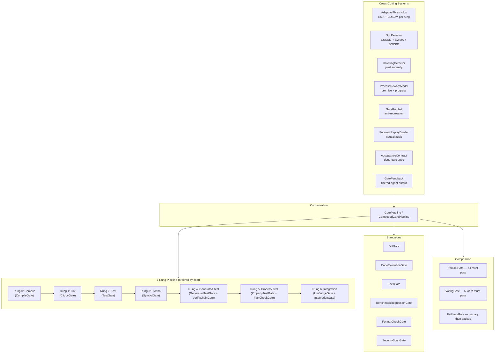
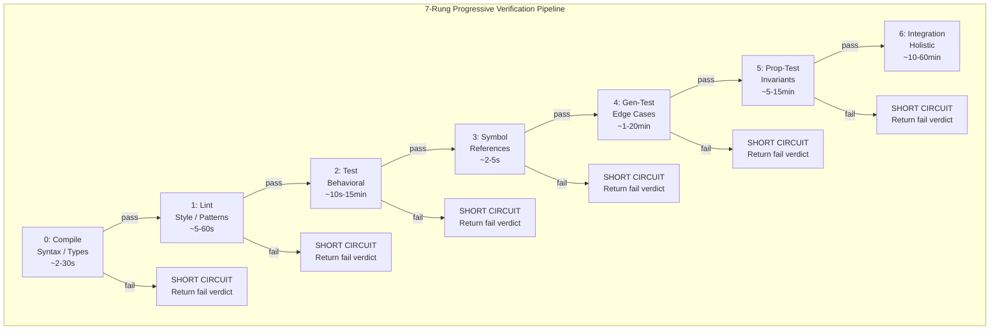
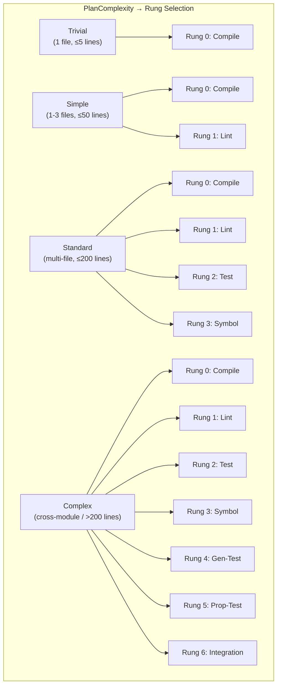
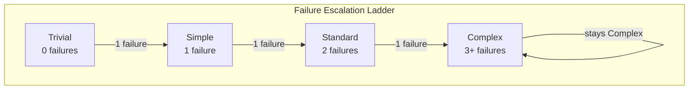
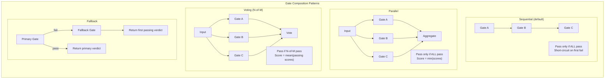
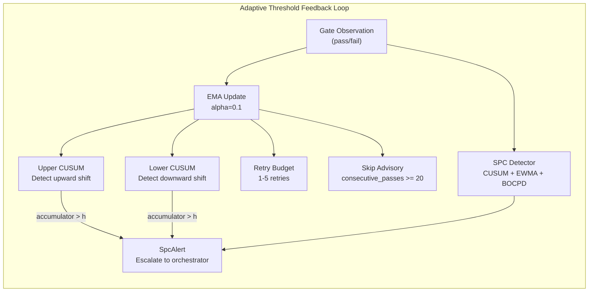
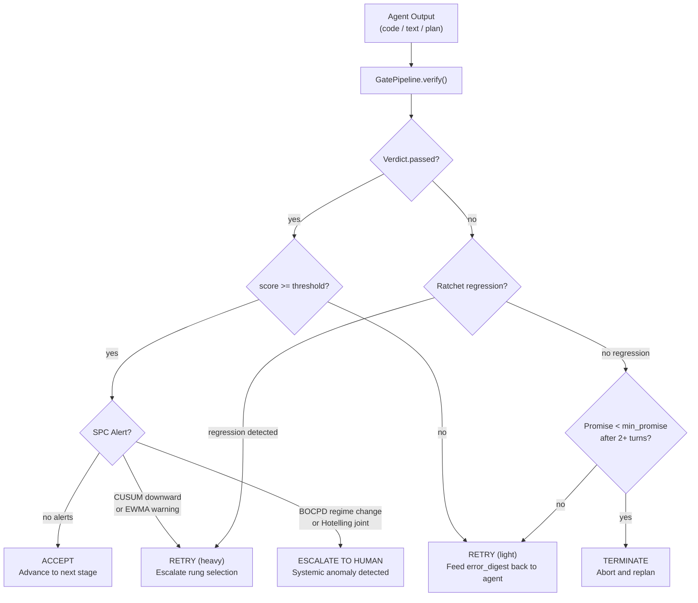

# Gate Verification Pipeline

**Crate**: `ironclaw_gate` (to be created at `crates/ironclaw_gate/`)
**Priority**: HIGH — direct enhancement to tool builder validation and code generation QA
**Source provenance**: Architecture adapted from `roko-gate` (`crates/roko-gate`)

---

## Table of Contents

1. [Introduction: What Is a Gate?](#1-introduction-what-is-a-gate)
2. [The Problem: Why Fixed Pass/Fail Is Insufficient](#2-the-problem-why-fixed-passfail-is-insufficient)
3. [Verification Theory Foundations](#3-verification-theory-foundations)
4. [Progressive Verification: The Core Idea](#4-progressive-verification-the-core-idea)
5. [Architecture Overview](#5-architecture-overview)
6. [The Verify Trait and Verdict](#6-the-verify-trait-and-verdict)
7. [The 7-Rung Pipeline](#7-the-7-rung-pipeline)
8. [What Each Rung Catches](#8-what-each-rung-catches)
9. [Complexity-Driven Rung Selection](#9-complexity-driven-rung-selection)
10. [Rung Dispatch: From Enum to Concrete Gates](#10-rung-dispatch-from-enum-to-concrete-gates)
11. [The GatePipeline Orchestrator](#11-the-gatepipeline-orchestrator)
12. [Gate Composition: Parallel, Voting, Fallback](#12-gate-composition-parallel-voting-fallback)
13. [Adaptive Thresholds](#13-adaptive-thresholds)
14. [Statistical Process Control (SPC)](#14-statistical-process-control-spc)
15. [Process Reward Model](#15-process-reward-model)
16. [Gate Ratchet: Preventing Rung Regression](#16-gate-ratchet-preventing-rung-regression)
17. [Forensic Causal Chain Reconstruction](#17-forensic-causal-chain-reconstruction)
18. [Acceptance Contracts](#18-acceptance-contracts)
19. [Agent Feedback Filtering](#19-agent-feedback-filtering)
20. [Hotelling's T-Squared: Joint Anomaly Detection](#20-hotellings-t-squared-joint-anomaly-detection)
21. [PELT: Offline Change Point Detection](#21-pelt-offline-change-point-detection)
22. [Verdict Flow and Decision Logic](#22-verdict-flow-and-decision-logic)
23. [Practical Examples](#23-practical-examples)
24. [Benchmarking and Performance](#24-benchmarking-and-performance)
25. [Full Implementation Plan: `ironclaw_gate` Crate](#25-full-implementation-plan-ironclaw_gate-crate)
26. [IronClaw Integration Phases](#26-ironclaw-integration-phases)
27. [Complexity Assessment](#27-complexity-assessment)
28. [References](#28-references)

---

## 1. Introduction: What Is a Gate?

A **gate** is a verification checkpoint that an AI agent's output must pass before it is accepted. In the context of IronClaw, gates are the bridge between the agent's reasoning and external reality: they compile code, run tests, check linting rules, verify symbol resolution, and judge output quality. A gate takes an agent's work product as input and produces a **verdict** — a structured result that says whether the output is correct, and if not, why.

The term comes from quality engineering, where a "quality gate" is a decision point in a manufacturing or software process where defined criteria must be met before work proceeds to the next stage. In the context of AI agents, gates serve a critical safety function: they prevent errors from propagating through a multi-step agentic workflow. An agent that generates code with a type error should discover that error at the compile gate, not after deploying the code.

**Why progressive verification matters for AI agents**: LLM agents generate output that can be subtly wrong — code that compiles but fails tests, tests that pass but do not actually cover the intended behavior, or changes that fix one problem while introducing another. A single-pass binary check (compile or not) catches only the most superficial errors. Progressive verification applies increasingly rigorous checks in sequence, where each rung catches a different class of error. This "defense in depth" approach ensures that errors are caught at the earliest, cheapest point in the pipeline, and that expensive verification (LLM-generated tests, integration tests) is only invoked when cheaper checks have already passed.

**How this prevents error propagation**: Without gates, an agent that generates broken code in step 3 of a 10-step plan will propagate that error through steps 4–10, wasting compute and context tokens on work that builds on a broken foundation. With the gate pipeline, step 3's output is verified before step 4 begins. If the gate fails, the agent receives structured feedback about what went wrong and can retry — before the error compounds.

---

## 2. The Problem: Why Fixed Pass/Fail Is Insufficient

Traditional CI/CD systems use a binary gate model: a build either passes or fails. This approach has three fundamental shortcomings when applied to AI agent verification:

**1. Cost blindness.** Running all verification checks on every change is wasteful. A single-line typo fix does not need property-based fuzzing or integration tests, yet a binary gate system either runs everything (wasting budget) or runs nothing beyond compile (missing real problems).

**2. Static thresholds.** A fixed pass rate of 0.85 may be perfectly reasonable for a well-tested codebase but absurdly lenient for a security-critical path. Conversely, a new codebase with evolving APIs may legitimately have a lower pass rate during early development. Static thresholds cannot adapt to these realities.

**3. No early termination signal.** When a complex verification pipeline is running, there is no signal to decide "this trajectory is clearly failing — stop wasting resources." A binary gate system runs everything and only then reports failure, burning expensive LLM-generated test budget on changes that clearly will not pass.

**4. No trajectory awareness.** Binary systems cannot distinguish a task that is converging toward success (errors decreasing each turn) from one that is thrashing (errors oscillating or increasing). Both look like "failure" until the moment they pass.

The gate pipeline solves these problems with **progressive verification**: a pipeline of increasing rigor that adapts to the complexity of the change, learns from historical pass rates, and provides continuous promise/progress signals for early termination decisions.

---

## 3. Verification Theory Foundations

### 3.1 Defense in Depth

The security concept of "defense in depth" — multiple independent layers of protection, each catching what the previous missed — is directly applicable to AI output verification. A single-rung verification has a false negative rate F₀ (probability it misses a bad output). When N independent rungs are composed sequentially, the joint false negative rate is approximately F₀ᴺ. For F₀ = 0.10 and N = 4 rungs, the joint rate drops to 0.0001.

This multiplicative effect is why the 7-rung pipeline is substantially more reliable than any single check, even without statistical sophistication.

### 3.2 Sequential Hypothesis Testing

The structure of progressive verification mirrors Wald's Sequential Probability Ratio Test (SPRT) [10]. Rather than collecting a fixed sample and then testing, SPRT accumulates evidence sequentially and makes the accept/reject decision as soon as the evidence is strong enough. The gate pipeline applies the same idea: each rung accumulates verification evidence, and the pipeline terminates (with success or failure) as soon as the evidence is sufficient.

Wald's bound on expected sample sizes shows that sequential testing requires fewer observations on average than fixed-sample testing for the same error rates. In gate terms: sequential pipeline execution with short-circuiting uses fewer compute resources on average than running all gates unconditionally.

### 3.3 Statistical Process Control

The gate pipeline borrows heavily from Statistical Process Control (SPC), the discipline introduced by Shewhart [11] at Bell Labs in the 1920s. SPC treats a production process as a stochastic system and uses statistical methods to distinguish normal variation (common cause) from unusual variation (special cause). When special causes are detected, the process is investigated and corrected.

Applied to gate pipelines: the "process" is the sequence of gate runs. Normal variation in pass rates (due to changing code, evolving test suites, API changes) is common cause. A sudden regime change (new LLM provider, major refactor, dependency update) is a special cause. The SPC detectors in this pipeline — CUSUM, EWMA, BOCPD — are specifically designed to detect special causes online, without waiting for enough data to run an offline statistical test.

### 3.4 Process Reward Models

Process Reward Models (PRMs) were introduced in the context of mathematical reasoning by Lightman et al. [4]. Unlike Outcome Reward Models (ORMs), which only reward final answers, PRMs provide feedback at each reasoning step. This enables the model to learn which reasoning steps are likely to lead to correct final answers, and which are likely to lead to failure.

The gate pipeline implements a PRM analog: rather than rewarding only final task completion, it scores each verification turn using the Promise and Progress signals derived from cumulative gate verdicts. This enables early termination (when a task is clearly failing) and rung-level feedback (which specific verification layer is failing and why).

---

## 4. Progressive Verification: The Core Idea

Progressive verification is built on four principles:

**Proportional effort.** The verification rigor should be proportional to the risk of the change. A trivial change (rename, typo fix) gets only a compile check. A complex architecture change gets every verification rung including LLM-generated tests, property-based fuzzing, and integration tests.

**Adaptive baselines.** Pass/fail thresholds are not static numbers — they are exponential moving averages that adapt to the empirical pass rate of each gate. If a codebase's compile gate passes 99% of the time, a sudden run of failures is detected and escalated. If a property-test gate historically passes 60% of the time, that is its learned baseline, not a sign of failure.

**Cybernetic feedback.** Each gate produces a `Verdict` with a numeric score, duration, and structured error data. These verdicts feed into a Process Reward Model that computes two continuous signals — **Promise** (probability of eventual success) and **Progress** (trajectory delta between turns) — enabling the orchestrator to terminate early or escalate before wasting budget.

**Anti-regression ratcheting.** Once a plan has passed rung N, it must never regress below rung N. The gate ratchet enforces this invariant, preventing convergence loops where the agent fixes one problem by reintroducing a previously-fixed one.

**Why progressive beats single-pass**: A single-pass verification system has two failure modes. It can be too lenient (running only compile, missing logic errors that tests would catch) or too expensive (running everything including integration tests on a one-line config change). Progressive verification avoids both: it starts cheap and escalates only when warranted by the complexity of the change or by repeated failures.

---

## 5. Architecture Overview



The architecture has two primary tiers:

1. **Rung-dispatched gates**: The 7 canonical rungs, executed in order, each dispatching to one or more concrete gate implementations.
2. **Standalone gates**: Six additional gates for scenario-specific checks that can be invoked ad-hoc without the rung pipeline.

Both tiers feed into the same cross-cutting systems: adaptive thresholds, SPC detectors, the Process Reward Model, and the gate ratchet.

Source: Architecture overview is documented in `crates/roko-gate/src/lib.rs`.

---

## 6. The Verify Trait and Verdict

Every gate in the system implements a single trait:

```rust
// Source: `crates/roko-core/src/traits.rs` (line 213)
#[async_trait]
pub trait Verify: Send + Sync {
    /// Verify the engram and return a verdict.
    async fn verify(&self, engram: &Engram, ctx: &Context) -> Verdict;

    /// Verify a batch of ephemeral pulses by promoting them to a synthetic engram.
    async fn verify_stream(&self, pulses: &[Pulse], ctx: &Context) -> Verdict {
        let synthetic = Engram::from_pulses(pulses);
        self.verify(&synthetic, ctx).await
    }

    /// Human-readable name (appears in verdicts).
    fn name(&self) -> &str;
}
```

The `Verify` trait is the fundamental abstraction. Every gate — whether it shells out to `cargo check`, runs an LLM judge, or performs multivariate anomaly detection — implements this trait and returns a `Verdict`.

### The Verdict Struct

```rust
// Source: `crates/roko-core/src/verdict.rs` (line 50)
#[derive(Clone, Debug, PartialEq, Serialize, Deserialize)]
pub struct Verdict {
    /// Did the signal pass the gate?
    pub passed: bool,
    /// Human-readable reason (used for logs, error messages).
    pub reason: String,
    /// Identifier of the gate that rendered this verdict.
    pub gate: String,
    /// Numeric score in [0..1] — useful for thresholding (e.g. judge gates).
    pub score: f32,
    /// Optional detail string (stdout, error output, diagnostic).
    pub detail: Option<String>,
    /// Structured test counts (populated by test gates).
    pub test_count: Option<TestCount>,
    /// Structured error digest for feeding back to agents.
    pub error_digest: Option<String>,
    /// Wall-clock duration the gate took, in milliseconds.
    pub duration_ms: u64,
}

#[derive(Clone, Debug, PartialEq, Serialize, Deserialize)]
pub struct TestCount {
    pub passed: u32,
    pub failed: u32,
    pub ignored: u32,
}

impl Verdict {
    /// Constructs a passing verdict with score 1.0.
    pub fn pass(gate: impl Into<String>, reason: impl Into<String>, duration_ms: u64) -> Self { ... }

    /// Constructs a failing verdict with score 0.0.
    pub fn fail(gate: impl Into<String>, reason: impl Into<String>, duration_ms: u64) -> Self { ... }

    /// Constructs a scored verdict (used by judge gates).
    pub fn scored(gate: impl Into<String>, score: f32, passed: bool, duration_ms: u64) -> Self { ... }

    /// True if this is a test gate verdict where ≥90% of tests passed.
    /// Useful for policies that distinguish "mostly working" from "completely broken."
    pub fn is_mostly_passing(&self) -> bool {
        match &self.test_count {
            None => self.passed,
            Some(tc) => {
                let total = tc.passed + tc.failed;
                total > 0 && (tc.passed as f32 / total as f32) >= 0.90
            }
        }
    }
}
```

The `Verdict` struct is the common currency of the entire verification system. It carries not just a boolean pass/fail, but a continuous score (0.0 to 1.0), structured test counts, error digests for agent feedback, and wall-clock timing. This richness enables the Process Reward Model, adaptive thresholds, and forensic replay.

**IronClaw adaptation**: In the `ironclaw_gate` crate, `Engram` maps to a `ToolOutput` or `String` containing agent-generated code or a path to a working directory. The `Context` maps to IronClaw's `JobContext`.

---

## 7. The 7-Rung Pipeline

The canonical pipeline consists of 7 rungs of increasing rigor and cost. Each rung maps to one or more concrete gates:

| Rung | Index | Name | Concrete Gates | Cost |
|------|-------|------|----------------|------|
| Compile | 0 | compile | `CompileGate` | Cheap (~2–30s) |
| Lint | 1 | lint | `ClippyGate` | Cheap (~5–60s) |
| Test | 2 | test | `TestGate` | Medium (~10s–15min) |
| Symbol | 3 | symbol | `SymbolGate` | Cheap (~2–5s) |
| GeneratedTest | 4 | gen-test | `GeneratedTestGate` + `VerifyChainGate` | Expensive (~1–20min) |
| PropertyTest | 5 | prop-test | `PropertyTestGate` + `FactCheckGate` | Expensive (~5–15min) |
| Integration | 6 | integration | `LlmJudgeGate` + `IntegrationGate` | Very expensive (~10–60min) |



### Rung Enum and Canonical Order

```rust
// Source: `crates/roko-gate/src/rung_selector.rs` (line 93)
#[derive(Clone, Copy, Debug, PartialEq, Eq, Hash, PartialOrd, Ord, Serialize, Deserialize)]
#[non_exhaustive]
#[repr(u8)]
pub enum Rung {
    Compile = 0,
    Lint = 1,
    Test = 2,
    Symbol = 3,
    GeneratedTest = 4,
    PropertyTest = 5,
    Integration = 6,
}

// Source: `crates/roko-gate/src/rung_selector.rs` (line 119)
pub const CANONICAL_ORDER: [Rung; 7] = [
    Rung::Compile,
    Rung::Lint,
    Rung::Test,
    Rung::Symbol,
    Rung::GeneratedTest,
    Rung::PropertyTest,
    Rung::Integration,
];

impl Rung {
    pub const fn label(self) -> &'static str {
        match self {
            Self::Compile => "compile",
            Self::Lint => "lint",
            Self::Test => "test",
            Self::Symbol => "symbol",
            Self::GeneratedTest => "gen-test",
            Self::PropertyTest => "prop-test",
            Self::Integration => "integration",
        }
    }

    pub const fn as_index(self) -> u32 {
        self as u32
    }
}
```

The `#[repr(u8)]` and derived `Ord` guarantee rungs execute in the correct order. The `#[non_exhaustive]` attribute allows future rung additions without breaking downstream matches.

### Standalone Gates

Six additional gates exist outside the rung pipeline for scenario-specific checks:

| Gate | Purpose | Typical Use |
|------|---------|-------------|
| `DiffGate` | Analyze git diff characteristics | Post-task review, cheap pre-filter |
| `CodeExecutionGate` | Sandboxed code execution | Verifying generated scripts |
| `ShellGate` | Arbitrary shell command; passes on exit code 0 | Custom verification commands |
| `BenchmarkRegressionGate` | Performance benchmark comparison | Detecting perf regressions |
| `FormatCheckGate` | Code formatting checks | Style enforcement |
| `SecurityScanGate` | Security vulnerability scanning | Security-critical changes |

Additionally, `GateGenerator` / `GeneratedCheck` support dynamically generated verification checks — the system can synthesize verification steps at runtime.

Source: `crates/roko-gate/src/lib.rs`.

---

## 8. What Each Rung Catches

The progressive approach is better than single-pass verification because each rung catches a distinct class of error. Here are concrete examples:

### Rung 0: Compile

**What it catches**: Syntax errors, type mismatches, missing imports, undefined variables, borrow checker violations.

**Example**: An agent renames a struct field from `name` to `label` but forgets to update one call site. The compile gate catches `error[E0609]: no field "name" on type "Config"` immediately, before any further verification is attempted.

**Without this rung**: All downstream rungs would fail with cascading compile errors, wasting time and producing noise instead of the single actionable diagnostic.

**Commands**: `cargo check`, `npm run build`, `go build`, `python -m compileall .`, `forge build`, `make`

### Rung 1: Lint

**What it catches**: Code style violations, potential bugs flagged by static analysis, unsafe patterns, unnecessary clones, dead code, anti-patterns.

**Example**: An agent writes `if x == true` instead of `if x`, or uses `.unwrap()` in production code, or creates an unused variable. Clippy catches these with targeted warnings like `clippy::bool_comparison` or `clippy::disallowed_methods`.

**Without this rung**: Subtle code quality issues accumulate silently. The code works but becomes harder to maintain, and potential bugs (like unchecked `.unwrap()` calls) lurk until they cause runtime panics.

**Commands**: `cargo clippy -- -D warnings`, `eslint`, `golangci-lint`, `flake8`, `pylint`

### Rung 2: Test

**What it catches**: Behavioral regressions, incorrect logic, violated invariants, broken contracts.

**Example**: An agent modifies a sorting function to fix a performance issue but accidentally breaks stability (equal elements no longer maintain their original order). The existing test suite catches `assertion failed: sorted[2] == sorted_stable[2]`.

**Without this rung**: The agent would consider its work done. The regression would only surface when a downstream consumer of the sorting function produces incorrect output — possibly much later and much harder to diagnose.

**Commands**: `cargo test`, `npm test`, `go test ./...`, `pytest`, `forge test`

### Rung 3: Symbol

**What it catches**: Dangling references, missing API implementations, incomplete interface contracts.

**Example**: An agent adds a new method to a trait but only implements it for 2 of 4 concrete types. The symbol gate detects that the remaining 2 types have unresolved method references.

**Without this rung**: In languages with dynamic dispatch or duck typing, missing implementations might not cause compile errors but would cause runtime crashes.

### Rung 4: Generated Test

**What it catches**: Edge cases the original test suite did not cover, behavioral gaps in new code, verification chain inconsistencies.

**Example**: An agent implements a new HTTP endpoint but the existing tests do not cover error responses. The LLM generates tests for 400/401/404/500 status codes and discovers the endpoint returns 500 instead of 404 for missing resources.

**Without this rung**: The original test suite passes because it only tests the happy path. The bug surfaces in production.

### Rung 5: Property Test

**What it catches**: Invariant violations that are statistically unlikely to appear in hand-written tests, fuzz-discovered crashes, factual inaccuracies in claims.

**Example**: An agent implements a custom serializer. Property-based testing generates random inputs and checks the round-trip property (`deserialize(serialize(x)) == x`). After 500 random inputs, it finds that Unicode surrogate pairs cause a panic.

**Without this rung**: Hand-written tests would use ASCII strings and miss the Unicode edge case entirely.

### Rung 6: Integration

**What it catches**: Cross-system interaction failures, environment-specific bugs, holistic quality issues that individual unit tests miss.

**Example**: An agent modifies a database migration and all unit tests pass, but the integration test discovers that the migration breaks when applied to a database with existing data because a NOT NULL column was added without a default value.

**Without this rung**: The migration would deploy successfully to an empty test database but fail catastrophically against production data.

---

## 9. Complexity-Driven Rung Selection

Not every change needs all 7 rungs. The `select_rungs` function determines which rungs to execute based on three inputs: plan complexity, capability caps, and prior failure count.

### PlanComplexity Enum

```rust
// Source: `crates/roko-gate/src/rung_selector.rs` (line 23)
#[derive(Clone, Copy, Debug, PartialEq, Eq, Serialize, Deserialize)]
pub enum PlanComplexity {
    /// Single-line / derive-only change. Compile only.
    Trivial,
    /// Small feature, few files. Adds linting.
    Simple,
    /// Normal plan. Adds the project's tests plus symbol checking.
    Standard,
    /// Large cross-crate work. Full rung suite.
    Complex,
}

impl PlanComplexity {
    /// Each prior failure escalates the effective complexity by one tier.
    pub fn escalate_by(self, prior_failures: u32) -> Self {
        let idx = self as u8;
        let new_idx = (idx + prior_failures as u8).min(3);
        match new_idx {
            0 => Self::Trivial,
            1 => Self::Simple,
            2 => Self::Standard,
            _ => Self::Complex,
        }
    }
}
```

### The Decision Table



| Complexity | Compile | Lint | Test | Symbol | GenTest | PropTest | Integration |
|-----------|---------|------|------|--------|---------|----------|-------------|
| **Trivial** | Y | | | | | | |
| **Simple** | Y | Y | | | | | |
| **Standard** | Y | Y | Y | Y | | | |
| **Complex** | Y | Y | Y | Y | Y | Y | Y |

```rust
// Source: `crates/roko-gate/src/rung_selector.rs` (line 234)
const fn base_rungs(complexity: PlanComplexity) -> &'static [Rung] {
    match complexity {
        PlanComplexity::Trivial => &[Rung::Compile],
        PlanComplexity::Simple => &[Rung::Compile, Rung::Lint],
        PlanComplexity::Standard => &[Rung::Compile, Rung::Lint, Rung::Test, Rung::Symbol],
        PlanComplexity::Complex => &[
            Rung::Compile,
            Rung::Lint,
            Rung::Test,
            Rung::Symbol,
            Rung::GeneratedTest,
            Rung::PropertyTest,
            Rung::Integration,
        ],
    }
}
```

### Capability Caps

`RungCaps` narrows the selection based on what the project actually supports. A cap can only **remove** a rung the complexity band selected; it can never **add** one the band did not select:

```rust
// Source: `crates/roko-gate/src/rung_selector.rs` (line 181)
pub struct RungCaps {
    pub has_lint_tool: bool,
    pub has_symbol_manifest: bool,
    pub has_generated_tests: bool,
    pub has_property_tests: bool,
    pub has_integration_scenario: bool,
}

impl RungCaps {
    const fn allows(&self, rung: Rung) -> bool {
        match rung {
            Rung::Compile | Rung::Test => true, // always available
            Rung::Lint => self.has_lint_tool,
            Rung::Symbol => self.has_symbol_manifest,
            Rung::GeneratedTest => self.has_generated_tests,
            Rung::PropertyTest => self.has_property_tests,
            Rung::Integration => self.has_integration_scenario,
        }
    }
}
```

`Compile` and `Test` are always available — they cannot be capped out.

### Failure Escalation Ladder

Prior failures automatically escalate the effective complexity. Each prior failure moves the complexity one tier toward `Complex`:

```rust
// Source: `crates/roko-gate/src/rung_selector.rs` (line 267)
pub fn select_rungs(complexity: PlanComplexity, caps: &RungCaps, prior_failures: u32) -> Vec<Rung> {
    let effective = complexity.escalate_by(prior_failures);
    base_rungs(effective)
        .iter()
        .copied()
        .filter(|r| caps.allows(*r))
        .collect()
}
```



| Base Complexity | 0 failures | 1 failure | 2 failures | 3+ failures |
|----------------|------------|-----------|------------|-------------|
| **Trivial** | Trivial | Simple | Standard | Complex |
| **Simple** | Simple | Standard | Complex | Complex |
| **Standard** | Standard | Complex | Complex | Complex |
| **Complex** | Complex | Complex | Complex | Complex |

Source: `crates/roko-gate/src/rung_selector.rs` with comprehensive tests at lines 287–560.

---

## 10. Rung Dispatch: From Enum to Concrete Gates

The `rung_dispatch` module maps each `Rung` enum variant to the concrete gate(s) that execute it. This is the runtime layer that actually shells out to compilers, test runners, and LLM judges.

```rust
// Source: `crates/roko-gate/src/rung_dispatch.rs` (line 244)
pub async fn run_canonical_rung(
    base_signal: &Signal,
    ctx: &Context,
    rung: Rung,
    inputs: &RungExecutionInputs,
    config: &RungExecutionConfig,
) -> Vec<Verdict> {
    match rung {
        Rung::Compile => {
            let mut gate = CompileGate::cargo();
            if let Some(timeout_ms) = gate_timeout_ms(config) {
                gate = gate.with_timeout_ms(timeout_ms);
            }
            vec![gate.verify(base_signal, ctx).await]
        }
        Rung::Lint => {
            let mut gate = ClippyGate::cargo();
            if let Some(timeout_ms) = gate_timeout_ms(config) {
                gate = gate.with_timeout_ms(timeout_ms);
            }
            vec![gate.verify(base_signal, ctx).await]
        }
        Rung::Test => {
            let mut gate = TestGate::cargo();
            if let Some(timeout_ms) = gate_timeout_ms(config) {
                gate = gate.with_timeout_ms(timeout_ms);
            }
            vec![gate.verify(base_signal, ctx).await]
        }
        Rung::Symbol => vec![run_symbol_gate(ctx, inputs, config).await],
        Rung::GeneratedTest => vec![
            run_generated_test_gate(base_signal, ctx, config).await,
            run_verify_chain_gate(base_signal, ctx, config).await,
        ],
        Rung::PropertyTest => vec![
            run_property_test_gate(base_signal, ctx, config).await,
            run_fact_check_gate(ctx, inputs, config).await,
        ],
        Rung::Integration => vec![
            run_llm_judge_gate(ctx, inputs, config).await,
            run_integration_gate(base_signal, ctx, config).await,
        ],
    }
}
```

Rungs 4, 5, and 6 each dispatch to **two** concrete gates:
- **Rung 4**: Generate behavioral tests AND verify the chain of evidence
- **Rung 5**: Run property-based tests AND fact-check claims
- **Rung 6**: LLM-judge quality assessment AND run integration tests

### Default Timeouts

| Rung | Default Timeout | Constant |
|------|----------------|----------|
| Compile | 600s (10 min) | `DEFAULT_COMPILE_TIMEOUT_SECS` |
| Lint | 300s (5 min) | `DEFAULT_LINT_TIMEOUT_SECS` |
| Test | 900s (15 min) | `DEFAULT_TEST_TIMEOUT_SECS` |
| Symbol | 120s (2 min) | `DEFAULT_SYMBOL_TIMEOUT_SECS` |
| Generated Test | 900s (15 min) | `DEFAULT_GENERATED_TEST_TIMEOUT_SECS` |
| Verify Chain | 1200s (20 min) | `DEFAULT_VERIFY_CHAIN_TIMEOUT_SECS` |
| Property Test | 900s (15 min) | `DEFAULT_PROPERTY_TEST_TIMEOUT_SECS` |
| Fact Check | 120s (2 min) | `DEFAULT_FACT_CHECK_TIMEOUT_SECS` |
| LLM Judge | 120s (2 min) | `DEFAULT_LLM_JUDGE_TIMEOUT_SECS` |
| Integration | 120s (2 min) | `DEFAULT_INTEGRATION_TIMEOUT_SECS` |

Gates that exceed their timeout return `Verdict::fail` with a timeout reason.

Source: `crates/roko-gate/src/rung_dispatch.rs`.

---

## 11. The GatePipeline Orchestrator

`GatePipeline` is itself a `Verify` implementation that runs a sequence of inner gates. This is the "ask every gate in order" orchestration layer.

```rust
// Source: `crates/roko-gate/src/gate_pipeline.rs`
pub struct GatePipeline {
    gates: Vec<Box<dyn Verify>>,
    short_circuit: bool,
    name: String,
}

impl GatePipeline {
    pub fn new(name: impl Into<String>) -> Self {
        Self { gates: Vec::new(), short_circuit: true, name: name.into() }
    }

    pub fn with_gate(mut self, gate: Box<dyn Verify>) -> Self {
        self.gates.push(gate);
        self
    }

    pub fn push(&mut self, gate: Box<dyn Verify>) {
        self.gates.push(gate);
    }

    /// Disable early exit on failure — collect ALL verdicts.
    pub fn without_short_circuit(mut self) -> Self {
        self.short_circuit = false;
        self
    }
}

#[async_trait]
impl Verify for GatePipeline {
    async fn verify(&self, engram: &Engram, ctx: &Context) -> Verdict {
        let start = Instant::now();
        let mut all_passed = true;
        let mut steps = Vec::new();
        let mut aggregate_tests = TestCount::default();

        for gate in &self.gates {
            let verdict = gate.verify(engram, ctx).await;

            // Accumulate test counts across all gates
            if let Some(tc) = &verdict.test_count {
                aggregate_tests.passed += tc.passed;
                aggregate_tests.failed += tc.failed;
                aggregate_tests.ignored += tc.ignored;
            }

            let status = if verdict.passed { "pass" } else { "fail" };
            steps.push(format!(
                "{}. [{}] {} ({} ms){}",
                steps.len() + 1,
                status,
                gate.name(),
                verdict.duration_ms,
                verdict.detail.as_deref()
                    .map(|d| format!(" -- {}", d.lines().next().unwrap_or("")))
                    .unwrap_or_default()
            ));

            if !verdict.passed {
                all_passed = false;
                if self.short_circuit {
                    // Record remaining gates as skipped
                    for remaining in &self.gates[steps.len()..] {
                        steps.push(format!("{}. [skip] {}", steps.len() + 1, remaining.name()));
                    }
                    break;
                }
            }
        }

        let executed = if self.short_circuit {
            steps.iter().filter(|s| !s.contains("[skip]")).count()
        } else {
            steps.len()
        };

        let detail = format!(
            "GatePipeline '{}' -- {}/{} executed, short_circuit={}\n{}",
            self.name,
            executed,
            self.gates.len(),
            self.short_circuit,
            steps.join("\n")
        );

        Verdict {
            passed: all_passed,
            reason: if all_passed { "all gates passed".into() } else { "gate failed".into() },
            gate: self.name().into(),
            score: if all_passed { 1.0 } else { 0.0 },
            detail: Some(detail),
            test_count: if aggregate_tests.is_empty() { None } else { Some(aggregate_tests) },
            error_digest: None,
            duration_ms: start.elapsed().as_millis() as u64,
        }
    }

    fn name(&self) -> &str { &self.name }
}
```

Key behaviors:

- **Short-circuiting (default: enabled).** When a gate fails, the pipeline stops and records remaining gates as `[skip]`. This is critical for convergence loops — compile failures should short-circuit before test gates launch.
- **No short-circuit mode.** With `without_short_circuit()`, every inner gate executes regardless of failures. The aggregate verdict records ALL failures. This is useful for getting a complete picture of what is broken.
- **Test count aggregation.** When inner gates report `test_count` (passed/failed/ignored), the pipeline aggregates them across all executed gates.

### ComposedGatePipeline

```rust
// Source: `crates/roko-gate/src/gate_pipeline.rs`
pub enum GateComposition {
    /// Run gates in push order; short-circuit on first failure (default).
    Sequential,
    /// Run the specified gate indices concurrently, collect all verdicts.
    Parallel(Vec<usize>),
    /// Aggregate verdicts from all gates; pass if more than threshold fraction agree.
    Voting { threshold: f64 },
    /// Try the first gate set; if it fails, try the fallback set.
    Fallback(Vec<usize>),
}

pub struct ComposedGatePipeline {
    inner: GatePipeline,
    composition: GateComposition,
}

pub struct GatePipelineBuilder;

impl GatePipelineBuilder {
    pub fn from_config(config: &GatesConfig, complexity: PlanComplexity) -> ComposedGatePipeline {
        Self::from_config_with_execution(
            config,
            complexity,
            RungExecutionInputs::default(),
            RungExecutionConfig::default(),
        )
    }
}
```

Source: `crates/roko-gate/src/gate_pipeline.rs`.

---

## 12. Gate Composition: Parallel, Voting, Fallback

Beyond the sequential pipeline, three standalone composition wrappers enable algebraic composition of verification pipelines. Each implements `Verify`, making them first-class gates that can be composed into other gates.



### ParallelGate

Runs N gates concurrently. ALL must pass for the aggregate to pass. The aggregate score is the minimum of all inner scores.

```rust
// Source: `crates/roko-gate/src/composition.rs`
pub struct ParallelGate {
    gates: Vec<Box<dyn Verify>>,
    name: String,
}

impl ParallelGate {
    pub fn new(name: impl Into<String>) -> Self {
        Self { gates: Vec::new(), name: name.into() }
    }

    pub fn with_gate(mut self, gate: Box<dyn Verify>) -> Self {
        self.gates.push(gate);
        self
    }
}

#[async_trait]
impl Verify for ParallelGate {
    async fn verify(&self, engram: &Engram, ctx: &Context) -> Verdict {
        let start = Instant::now();
        // Run all gates concurrently using join_all
        let futures: Vec<_> = self.gates.iter()
            .map(|g| g.verify(engram, ctx))
            .collect();
        let verdicts = futures::future::join_all(futures).await;

        let all_passed = verdicts.iter().all(|v| v.passed);
        let min_score = verdicts.iter().map(|v| v.score).fold(f32::INFINITY, f32::min);
        let detail = verdicts.iter()
            .map(|v| format!("[{}] {} ({} ms)", if v.passed { "pass" } else { "fail" }, v.gate, v.duration_ms))
            .collect::<Vec<_>>()
            .join("\n");

        Verdict {
            passed: all_passed,
            reason: if all_passed { "all parallel gates passed".into() }
                    else { "one or more parallel gates failed".into() },
            gate: self.name().into(),
            score: if min_score.is_infinite() { 0.0 } else { min_score },
            detail: Some(detail),
            test_count: None,
            error_digest: None,
            duration_ms: start.elapsed().as_millis() as u64,
        }
    }

    fn name(&self) -> &str { &self.name }
}
```

**Use case**: When inner gates are independent and can safely run simultaneously. For example, `CompileGate` and `FormatCheckGate` have no dependency on each other.

### VotingGate

Runs M gates and requires N-of-M to pass. The aggregate score is the mean of passing verdicts' scores.

```rust
// Source: `crates/roko-gate/src/composition.rs`
pub struct VotingGate {
    gates: Vec<Box<dyn Verify>>,
    required_passes: usize,
    name: String,
}

impl VotingGate {
    pub fn new(name: impl Into<String>, required_passes: usize) -> Self {
        Self { gates: Vec::new(), required_passes, name: name.into() }
    }

    pub fn with_gate(mut self, gate: Box<dyn Verify>) -> Self {
        self.gates.push(gate);
        self
    }
}

#[async_trait]
impl Verify for VotingGate {
    async fn verify(&self, engram: &Engram, ctx: &Context) -> Verdict {
        let start = Instant::now();
        let futures: Vec<_> = self.gates.iter()
            .map(|g| g.verify(engram, ctx))
            .collect();
        let verdicts = futures::future::join_all(futures).await;

        let passing: Vec<_> = verdicts.iter().filter(|v| v.passed).collect();
        let passed = passing.len() >= self.required_passes;
        let mean_score = if passing.is_empty() { 0.0 }
            else { passing.iter().map(|v| v.score as f64).sum::<f64>() / passing.len() as f64 };

        Verdict {
            passed,
            reason: format!("{}/{} gates passed (need {})", passing.len(), verdicts.len(), self.required_passes),
            gate: self.name().into(),
            score: mean_score as f32,
            detail: None,
            test_count: None,
            error_digest: None,
            duration_ms: start.elapsed().as_millis() as u64,
        }
    }

    fn name(&self) -> &str { &self.name }
}
```

**Use case**: When multiple reviewers or verification strategies should agree. For example, 2-of-3 LLM judge gates must agree that code quality is acceptable.

### FallbackGate

Tries a primary gate first. If it fails, tries a fallback. The first passing verdict wins.

```rust
// Source: `crates/roko-gate/src/composition.rs`
pub struct FallbackGate {
    primary: Box<dyn Verify>,
    fallback: Box<dyn Verify>,
    name: String,
}

impl FallbackGate {
    pub fn new(
        name: impl Into<String>,
        primary: Box<dyn Verify>,
        fallback: Box<dyn Verify>,
    ) -> Self {
        Self { primary, fallback, name: name.into() }
    }
}

#[async_trait]
impl Verify for FallbackGate {
    async fn verify(&self, engram: &Engram, ctx: &Context) -> Verdict {
        let start = Instant::now();
        let primary_verdict = self.primary.verify(engram, ctx).await;
        if primary_verdict.passed {
            return primary_verdict;
        }
        // Primary failed; try fallback
        let fallback_verdict = self.fallback.verify(engram, ctx).await;
        // Return the first passing verdict; if both fail, return the fallback verdict
        if fallback_verdict.passed {
            fallback_verdict
        } else {
            Verdict {
                passed: false,
                reason: format!(
                    "primary failed ({}); fallback also failed ({})",
                    primary_verdict.reason, fallback_verdict.reason
                ),
                gate: self.name().into(),
                score: 0.0,
                detail: fallback_verdict.detail,
                test_count: None,
                error_digest: None,
                duration_ms: start.elapsed().as_millis() as u64,
            }
        }
    }

    fn name(&self) -> &str { &self.name }
}
```

**Use case**: When you want to try a fast/cheap check first and fall back to a more thorough one on failure.

### Composing Wrappers

Because each composition wrapper implements `Verify`, they can be arbitrarily nested:

```rust
// Example: Parallel fast gates feeding into a Fallback for full pipeline
let fast = ParallelGate::new("fast-parallel")
    .with_gate(Box::new(CompileGate::cargo()))
    .with_gate(Box::new(FormatCheckGate::rustfmt()));

let full = GatePipeline::new("full-pipeline")
    .with_gate(Box::new(CompileGate::cargo()))
    .with_gate(Box::new(ClippyGate::cargo()))
    .with_gate(Box::new(TestGate::cargo()));

// Try fast gates first; only run full pipeline if fast fails
let adaptive = FallbackGate::new(
    "adaptive-gate",
    Box::new(fast),
    Box::new(full),
);

// 2-of-3 LLM judge ensemble
let judge_ensemble = VotingGate::new("llm-judge-ensemble", 2)
    .with_gate(Box::new(LlmJudgeGate::with_model("claude-sonnet-4-6")))
    .with_gate(Box::new(LlmJudgeGate::with_model("gpt-4o")))
    .with_gate(Box::new(LlmJudgeGate::with_model("gemini-1.5-pro")));
```

Source: `crates/roko-gate/src/composition.rs`.

---

## 13. Adaptive Thresholds

> **See also**: The Conductor's `BanditPolicy` (Thompson Sampling) feeds back to this system — after each intervention, the conductor updates its reward estimates, which in turn inform retry budgets and rung skip decisions. See [Conductor Anomaly Detection: Adaptive Threshold Learning](./conductor-anomaly.md#10-adaptive-threshold-learning) for the Thompson Sampling mechanism that drives this feedback.

The `AdaptiveThresholds` system tracks per-rung pass rates using an exponential moving average (EMA) and uses them to make three runtime decisions: how many retries to allow, whether to skip a rung, and whether a distributional shift has occurred.



### Core Structure

```rust
// Source: `crates/roko-gate/src/adaptive_threshold.rs` (line 168)
pub struct AdaptiveThresholds {
    rungs: HashMap<u32, RungStats>,
    cusum_sensitivity: f64,        // default: 0.25
    cusum_threshold: f64,          // default: 4.0
    spc_detectors: HashMap<u32, SpcDetector>,
    hotelling: Option<HotellingDetector>,
    pending_spc_alerts: Vec<(u32, SpcAlert)>,
    joint_anomaly_detected: bool,
}

// Source: `crates/roko-gate/src/adaptive_threshold.rs` (line 27)
pub struct RungStats {
    pub ema_pass_rate: f64,         // Exponential moving average [0.0, 1.0]
    pub total_observations: u64,    // Total gate runs for this rung
    pub consecutive_passes: u32,    // Reset on any failure
    pub cusum_high: f64,            // Upward shift accumulator
    pub cusum_low: f64,             // Downward shift accumulator
    pub cusum_shift_detected: bool, // Was a shift detected on last observation?
}
```

### EMA Pass Rate Update

The EMA update uses a decay factor of alpha = 0.1, meaning recent observations weigh more heavily:

```
EMA formula:
  if first_observation:
      ema_pass_rate = value          // 1.0 for pass, 0.0 for fail
  else:
      ema_pass_rate = 0.1 * value + 0.9 * ema_pass_rate
```

```rust
// Source: `crates/roko-gate/src/adaptive_threshold.rs` (line 322)
pub fn observe(&mut self, rung: u32, passed: bool) {
    let stats = self.rungs.entry(rung).or_default();
    let value = if passed { 1.0 } else { 0.0 };

    if stats.total_observations == 0 {
        stats.ema_pass_rate = value;
    } else {
        stats.ema_pass_rate = EMA_ALPHA.mul_add(value, (1.0 - EMA_ALPHA) * stats.ema_pass_rate);
    }

    stats.total_observations += 1;

    if passed {
        stats.consecutive_passes += 1;
    } else {
        stats.consecutive_passes = 0;
    }

    // Feed into the SPC detector ensemble
    if let Some(spc) = self.spc_detectors.get_mut(&rung) {
        let alerts = spc.update(value);
        for alert in alerts {
            self.pending_spc_alerts.push((rung, alert));
        }
    }
}
```

### Retry Budget Suggestion

The adaptive threshold suggests a retry count inversely proportional to the pass rate:

- **100% pass rate** → 1 retry (the gate almost always passes)
- **0% pass rate** → 5 retries (the gate always fails, give it more chances)
- **Unknown rung** (< 5 observations) → 3 retries (default)

```rust
// Source: `crates/roko-gate/src/adaptive_threshold.rs` (line 384)
pub fn suggested_max_retries(&self, rung: u32) -> u32 {
    let Some(stats) = self.rungs.get(&rung) else { return 3; };
    if stats.total_observations < 5 { return 3; }
    let max_f = f64::from(MAX_RETRIES);          // 5.0
    let range_f = f64::from(MAX_RETRIES - MIN_RETRIES); // 4.0
    let retries = stats.ema_pass_rate.mul_add(-range_f, max_f).round() as u32;
    retries.clamp(MIN_RETRIES, MAX_RETRIES)       // clamp(1, 5)
}
```

### Skip Advisory

A rung that has passed consecutively at least 20 times is flagged as skippable:

```rust
pub fn should_skip_rung(&self, rung: u32) -> bool {
    self.rungs.get(&rung)
        .is_some_and(|s| s.consecutive_passes >= 20)
}
```

This is advisory — the caller should still run the rung periodically to maintain the baseline.

### Temperament Modulation

Agent temperament adjusts threshold behavior:

| Temperament | Threshold | Retries | Skip |
|-------------|-----------|---------|------|
| **Conservative** | +10% stricter | Max 3 | Never skip |
| **Balanced** | No change | Default | Default streak |
| **Aggressive** | -15% more lenient | Min 2, max 5 | Skip at 10 passes |
| **Exploratory** | -10% more lenient | Same as aggressive | Default streak |

### Domain Profiles

Pre-built threshold profiles provide domain-specific priors:

```rust
// Source: `crates/roko-gate/src/adaptive_threshold.rs` (line 93)

/// Rust/systems coding: high compile expectation, moderate test pass rate.
pub fn coding() -> ThresholdProfile {
    ThresholdProfile {
        compile: 0.90,
        clippy: 0.80,
        test: 0.65,
        diff: 0.50,
        ..Default::default()
    }
}

/// Research: lower compile bar (exploratory), higher test precision needed.
pub fn research() -> ThresholdProfile {
    ThresholdProfile {
        compile: 0.70,
        clippy: 0.60,
        test: 0.85,
        diff: 0.40,
        ..Default::default()
    }
}

/// Security: everything must pass at high confidence.
pub fn security() -> ThresholdProfile {
    ThresholdProfile {
        compile: 0.95,
        clippy: 0.90,
        test: 0.90,
        diff: 0.80,
        ..Default::default()
    }
}
```

### Persistence

Thresholds are serialized to JSON with atomic save/load:

```rust
// Source: `crates/roko-gate/src/adaptive_threshold.rs` (line 257)
pub fn save(&self, path: &Path) -> Result<(), io::Error> {
    let serialized = serde_json::to_string_pretty(&self.rungs)?;
    // Atomic write via temp file + rename
    let tmp = path.with_extension("tmp");
    std::fs::write(&tmp, serialized)?;
    std::fs::rename(tmp, path)?;
    Ok(())
}

pub fn load_or_new(path: &Path) -> Self {
    std::fs::read_to_string(path)
        .ok()
        .and_then(|s| serde_json::from_str(&s).ok())
        .map(|rungs| Self { rungs, ..Default::default() })
        .unwrap_or_default()
}
```

Source: `crates/roko-gate/src/adaptive_threshold.rs`.

---

## 14. Statistical Process Control (SPC)

The SPC system provides three complementary change-detection algorithms that run in parallel on every gate observation. Any detector that fires produces an `SpcAlert` that the orchestrator can react to.

### 14.1 CUSUM (Cumulative Sum) Detector

**Purpose**: Detect sustained, gradual shifts in gate pass rates. Good for catching slow degradation that EMA smoothing might absorb.

**Origin**: The CUSUM chart was introduced by E. S. Page in 1954 [1]. It was designed to detect small, sustained shifts in a process mean more quickly than the standard Shewhart control chart.

**Mathematical formulation**:

The CUSUM detector maintains two one-sided statistics:

```
Upper CUSUM (detects upward shifts):
    S_upper(n) = max(0, S_upper(n-1) + x_n - mu_0 - k)

Lower CUSUM (detects downward shifts):
    S_lower(n) = max(0, S_lower(n-1) + mu_0 - x_n - k)
```

Where:
- `x_n` is the current observation (1.0 for pass, 0.0 for fail)
- `mu_0` is the in-control (target) mean (e.g., 0.85 expected pass rate)
- `k` is the drift allowance (slack parameter) — typically `sigma / 2`
- An alarm fires when either `S_upper > h` or `S_lower > h` (the decision threshold `h`)
- After an alarm, the corresponding accumulator is reset to 0

**Tuning parameters**:
- `h` (threshold): Larger values reduce false alarms but delay detection. Typical range: 2.0 to 8.0. Default: 5.0.
- `k` (drift): Smaller values detect smaller shifts sooner. Typical value: `sigma / 2`.

**Implementation**:

```rust
// Source: `crates/roko-gate/src/spc.rs` (line 34)
pub struct CusumDetector {
    pub target: f64,       // In-control mean (e.g., 0.85)
    pub threshold_h: f64,  // Decision threshold (e.g., 5.0)
    pub drift_k: f64,      // Allowance (e.g., sigma/2 = 0.05)
    cumsum_upper: f64,     // Upper one-sided accumulator
    cumsum_lower: f64,     // Lower one-sided accumulator
    observations: usize,
}

impl CusumDetector {
    pub fn new(target: f64, threshold_h: f64, drift_k: f64) -> Self {
        Self { target, threshold_h, drift_k, cumsum_upper: 0.0, cumsum_lower: 0.0, observations: 0 }
    }

    pub fn update(&mut self, observation: f64) -> Option<CusumShift> {
        self.observations += 1;

        // Upper CUSUM: detects upward shift above target
        self.cumsum_upper =
            (self.cumsum_upper + observation - self.target - self.drift_k).max(0.0);
        // Lower CUSUM: detects downward shift below target
        self.cumsum_lower =
            (self.cumsum_lower + self.target - observation - self.drift_k).max(0.0);

        if self.cumsum_upper > self.threshold_h {
            self.cumsum_upper = 0.0; // Reset after alarm
            return Some(CusumShift::Upward);
        }
        if self.cumsum_lower > self.threshold_h {
            self.cumsum_lower = 0.0; // Reset after alarm
            return Some(CusumShift::Downward);
        }

        None
    }
}
```

**Worked example**: Suppose a gate has a target pass rate of 0.85 and starts experiencing failures (actual rate drops to 0.0 on each failure). With `k = 0.05` and `h = 5.0`, each failure observation adds approximately `0.85 - 0.0 - 0.05 = 0.80` to the lower CUSUM accumulator. After 7 consecutive failures: `7 * 0.80 = 5.60 > h = 5.0`, triggering a `CusumShift::Downward` alarm.

Source: `crates/roko-gate/src/spc.rs`.

### 14.2 EWMA (Exponentially Weighted Moving Average) Control Chart

**Purpose**: Detect small sustained shifts in gate pass rates with formal statistical control limits. More sensitive to small shifts than standard Shewhart charts because exponential weighting carries memory of recent observations.

**Origin**: Introduced by Roberts in 1959 [2]. Originally called a "geometric moving average chart," it provides faster detection of small shifts than the Shewhart chart.

**Mathematical formulation**:

```
EWMA statistic:
    Z_n = lambda * x_n + (1 - lambda) * Z_{n-1}

Control limits (asymptotic form):
    UCL = mu_0 + L * sigma * sqrt(lambda / (2 - lambda))
    LCL = mu_0 - L * sigma * sqrt(lambda / (2 - lambda))

Warning limits (2/3 of control limits):
    Warning_UCL = mu_0 + (2/3) * L * sigma * sqrt(lambda / (2 - lambda))
    Warning_LCL = mu_0 - (2/3) * L * sigma * sqrt(lambda / (2 - lambda))
```

Where:
- `lambda` (smoothing factor): Controls how much weight recent observations receive. Smaller = more smoothing. Typical: 0.2.
- `sigma`: Estimated process standard deviation.
- `L`: Control limit multiplier (number of sigma). Typical: 3.0.
- `mu_0`: Target (in-control) mean.

Note: The implementation uses the simpler asymptotic form `sqrt(lambda / (2 - lambda))` rather than the exact time-varying form. For processes with more than ~20 observations, the asymptotic form closely approximates the exact formula.

```rust
// Source: `crates/roko-gate/src/spc.rs` (line 127)
pub enum ControlStatus {
    InControl,      // Within control limits
    Warning,        // Between 2-sigma and 3-sigma
    OutOfControl,   // Beyond 3-sigma
}

// Source: `crates/roko-gate/src/spc.rs` (line 149)
pub struct EwmaControlChart {
    lambda: f64,           // Smoothing factor (0.01, 1.0]
    sigma: f64,            // Process standard deviation
    control_limit_l: f64,  // Sigma multiplier for limits
    ewma: f64,             // Current EWMA value
    target: f64,           // In-control mean
    observations: usize,
}

impl EwmaControlChart {
    pub fn new(target: f64, sigma: f64, lambda: f64, control_limit_l: f64) -> Self {
        Self { lambda, sigma, control_limit_l, ewma: target, target, observations: 0 }
    }

    pub fn update(&mut self, observation: f64) -> ControlStatus {
        self.observations += 1;
        self.ewma = self.lambda * observation + (1.0 - self.lambda) * self.ewma;

        let limit_factor = self.sigma * (self.lambda / (2.0 - self.lambda)).sqrt();
        let ucl = self.target + self.control_limit_l * limit_factor;
        let lcl = self.target - self.control_limit_l * limit_factor;
        let warning_ucl = self.target + (self.control_limit_l * 2.0 / 3.0) * limit_factor;
        let warning_lcl = self.target - (self.control_limit_l * 2.0 / 3.0) * limit_factor;

        if self.ewma > ucl || self.ewma < lcl {
            ControlStatus::OutOfControl
        } else if self.ewma > warning_ucl || self.ewma < warning_lcl {
            ControlStatus::Warning
        } else {
            ControlStatus::InControl
        }
    }

    pub fn current(&self) -> f64 { self.ewma }
}
```

**Worked example**: With `target = 0.85`, `sigma = 0.05`, `lambda = 0.2`, `L = 3.0`:
- `limit_factor = 0.05 * sqrt(0.2 / 1.8) = 0.05 * 0.3333 = 0.01667`
- `UCL = 0.85 + 3.0 * 0.01667 = 0.90`
- `LCL = 0.85 - 3.0 * 0.01667 = 0.80`

If the EWMA drops below 0.80, the chart signals `OutOfControl`.

Source: `crates/roko-gate/src/spc.rs`.

### 14.3 BOCPD (Bayesian Online Change Point Detection)

**Purpose**: Detect abrupt regime changes. Unlike CUSUM and EWMA which look for gradual shifts, BOCPD maintains a full posterior distribution over run lengths and signals when the probability of a recent change point exceeds a threshold.

**Origin**: BOCPD was introduced by Adams and MacKay in 2007 [3]. It provides an exact, computationally efficient Bayesian method for detecting change points in an online setting.

**Mathematical formulation**:

BOCPD maintains a run-length distribution `P(r_t | x_{1:t})` where `r_t` is the "time since the last change point."

At each new observation `x_t`:

1. **Compute predictive probabilities** for each possible run length using a Gaussian conjugate model.
2. **Compute growth probabilities** (extend existing runs): `P_growth(r+1) = P(r) * pi(r) * (1 - H)` where `H` is the hazard rate.
3. **Compute change point probability**: `P_change = sum_r[ P(r) * pi(r) * H ]`
4. **Assemble and normalize** the new run-length distribution.
5. **Check threshold**: If `P(r_t = 0) > change_threshold`, a change point is detected.

The Gaussian predictive uses a conjugate normal model:

```rust
// Source: `crates/roko-gate/src/spc.rs` (line 403)
fn gaussian_predictive(&self, count: usize, sum: f64, sum_sq: f64, observation: f64) -> f64 {
    let n = count as f64;
    let mean = if n > 0.0 {
        (self.prior_var * sum + self.prior_mean) / (n * self.prior_var + 1.0)
    } else {
        self.prior_mean
    };
    let var = if n > 0.0 {
        let sample_var = if n > 1.0 {
            (sum_sq - sum * sum / n) / (n - 1.0)
        } else {
            self.prior_var
        };
        sample_var / n + self.prior_var
    } else {
        self.prior_var
    };
    let var = var.max(0.001);
    let diff = observation - mean;
    (-0.5 * diff * diff / var).exp() / (2.0 * std::f64::consts::PI * var).sqrt()
}
```

**Parameters**:
- `hazard_rate`: Prior probability of a change at each step. Typical: 0.01 (expect a change every ~100 observations).
- `change_threshold`: Posterior probability to trigger alarm. Typical: 0.5.
- Memory is bounded by trimming run lengths with negligible probability (`< 1e-8`) from the tail.

Source: `crates/roko-gate/src/spc.rs`.

### 14.4 Composite SPC Detector

All three detectors are combined in `SpcDetector`, running in parallel on each observation:

```rust
// Source: `crates/roko-gate/src/spc.rs` (line 472)
#[derive(Debug)]
pub enum SpcAlert {
    CusumShift(CusumShift),                   // Gradual mean shift detected
    EwmaOutOfControl { ewma_value: f64 },      // Beyond 3-sigma control limit
    EwmaWarning { ewma_value: f64 },           // Between 2-sigma and 3-sigma
    ChangePoint(ChangePointInfo),              // Abrupt regime change detected
}

pub struct SpcDetector {
    pub cusum: CusumDetector,
    pub ewma_chart: EwmaControlChart,
    pub bocpd: BocpdDetector,
}

impl SpcDetector {
    pub fn new(target: f64, sigma: f64) -> Self {
        Self {
            cusum: CusumDetector::new(target, 5.0, sigma / 2.0),
            ewma_chart: EwmaControlChart::new(target, sigma, 0.2, 3.0),
            bocpd: BocpdDetector::new(0.01, 0.5, target, sigma * sigma),
        }
    }

    pub fn update(&mut self, observation: f64) -> Vec<SpcAlert> {
        let mut alerts = Vec::new();

        if let Some(shift) = self.cusum.update(observation) {
            alerts.push(SpcAlert::CusumShift(shift));
        }
        match self.ewma_chart.update(observation) {
            ControlStatus::OutOfControl => alerts.push(SpcAlert::EwmaOutOfControl {
                ewma_value: self.ewma_chart.current(),
            }),
            ControlStatus::Warning => alerts.push(SpcAlert::EwmaWarning {
                ewma_value: self.ewma_chart.current(),
            }),
            ControlStatus::InControl => {}
        }
        if let Some(cp) = self.bocpd.update(observation) {
            alerts.push(SpcAlert::ChangePoint(cp));
        }

        alerts
    }
}
```

| Detector | Best For | Sensitivity | Memory | Reference |
|----------|----------|-------------|--------|-----------|
| **CUSUM** | Gradual, sustained shifts | Configurable via k/h | O(1) | Page (1954) [1] |
| **EWMA** | Small persistent shifts, formal control limits | High | O(1) | Roberts (1959) [2] |
| **BOCPD** | Abrupt regime changes | Threshold-based | O(n), bounded by trimming | Adams & MacKay (2007) [3] |

Source: `crates/roko-gate/src/spc.rs`.

---

## 15. Process Reward Model

> **See also**: The Conductor consumes Promise/Progress signals from this model to drive early termination decisions. The `IterationLoopWatcher` in [Conductor Anomaly Detection](./conductor-anomaly.md#53-iterationloopwatcher-progress-family) fires at Critical severity when gate failures accumulate, which is the conductor-side equivalent of the PRM's low-Promise termination signal.

The Process Reward Model (PRM) tracks per-turn gate snapshots and derives two cybernetic signals for the orchestrator. This is inspired by Lightman et al. 2023 [4] and the AgentPRM framework [5].

### Turn Snapshots

```rust
// Source: `crates/roko-gate/src/process_reward.rs` (line 19)
pub struct TurnSnapshot {
    pub rung: u32,              // Highest rung reached at this turn
    pub verdicts: Vec<Verdict>, // All verdicts from the gate pipeline
    pub error_count: u32,       // Number of distinct errors in gate feedback
    pub diff_lines: u32,        // Number of lines changed in the diff
}
```

### Promise Score

**Promise** predicts the probability of eventual task success given the current trajectory. It is a weighted combination of three signals:

```rust
// Source: `crates/roko-gate/src/process_reward.rs` (line 94)
pub fn promise(&self) -> f64 {
    if self.history.is_empty() {
        return 0.5; // no data => neutral prior
    }

    let pass_rate = self.historical_pass_rate();
    let progression_rate = self.ratchet_progression_rate();
    let convergence = self.diff_convergence();

    // Weighted combination:
    // pass_rate (50%): most important signal
    // progression (30%): are we advancing through rungs?
    // convergence (20%): are diffs getting smaller?
    let raw = pass_rate * 0.5 + progression_rate * 0.3 + convergence * 0.2;
    raw.clamp(0.0, 1.0)
}
```

The three components:

1. **Historical pass rate** (weight: 0.5): Fraction of all verdicts across all turns that passed. This is the strongest signal.

2. **Ratchet progression rate** (weight: 0.3): Measures whether we are advancing through rungs over time.
   ```
   progression = 0.5 + (last_rung - first_rung) / (2 * max_rung_seen)
   ```
   A value > 0.5 means we are advancing; < 0.5 means we are regressing.

3. **Diff convergence** (weight: 0.2): Are the diffs getting smaller? Shrinking diffs suggest the agent is converging:
   ```
   If diffs are shrinking (last <= first):
       0.5 + (1 - last_diff/first_diff) * 0.5
   If diffs are growing (last > first):
       (first_diff/last_diff) * 0.5
   ```

### Progress Score

**Progress** measures the trajectory delta between the two most recent turns. It ranges from -1.0 (severe regression) to +1.0 (major improvement).

```rust
// Source: `crates/roko-gate/src/process_reward.rs` (line 114)
pub fn progress(&self) -> f64 {
    if self.history.len() < 2 { return 0.0; }

    let prev = &self.history[self.history.len() - 2];
    let curr = &self.history[self.history.len() - 1];

    let mut delta = 0.0;

    // Rung advancement: +0.4 per rung gained, -0.4 per rung lost (clamped)
    let rung_delta = curr.rung as f64 - prev.rung as f64;
    delta += (rung_delta * 0.4).clamp(-0.4, 0.4);

    // Error reduction: going from 5 errors to 0 is +0.3
    if prev.error_count > 0 {
        let error_reduction =
            (prev.error_count as f64 - curr.error_count as f64) / prev.error_count as f64;
        delta += error_reduction * 0.3;
    } else if curr.error_count == 0 {
        delta += 0.3; // still clean
    }

    // Pass rate improvement between turns
    let prev_pass_rate = turn_pass_rate(prev);
    let curr_pass_rate = turn_pass_rate(curr);
    delta += (curr_pass_rate - prev_pass_rate) * 0.3;

    delta.clamp(-1.0, 1.0)
}
```

### Early Termination

```rust
pub fn should_terminate(&self, min_promise: f64) -> bool {
    if self.history.len() < 2 { return false; }
    self.promise() < min_promise
}
```

If Promise drops below `min_promise` (e.g., 0.3) after at least 2 turns, the orchestrator can abandon the task and request a replan.

### Step Verification

The PRM also scores individual reasoning steps:

```rust
// Source: `crates/roko-gate/src/process_reward.rs` (line 161)
pub fn verify_steps(&self, steps: &[ReasoningStep]) -> StepVerdict {
    let step_scores: Vec<f64> = steps.iter().map(|s| score_step(s)).collect();
    let aggregate_score = match self.aggregate {
        AggregateMethod::Min => step_scores.iter().copied().fold(f64::INFINITY, f64::min),
        AggregateMethod::Mean => {
            step_scores.iter().sum::<f64>() / step_scores.len() as f64
        }
        AggregateMethod::Weighted => {
            // Later steps receive linearly increasing weight
            // weight(i) = i+1, total_weight = n*(n+1)/2
            let n = step_scores.len() as f64;
            let total_weight = n * (n + 1.0) / 2.0;
            step_scores
                .iter()
                .enumerate()
                .map(|(i, &s)| s * (i as f64 + 1.0))
                .sum::<f64>() / total_weight
        }
    };
    StepVerdict {
        passed: aggregate_score >= self.step_threshold,
        step_scores,
        aggregate_score,
    }
}
```

Step scoring heuristics:
- Content length > 200 chars: +0.4
- Content length > 50 chars: +0.3
- Content length > 10 chars: +0.1
- Contains code block (``` or indented): +0.3
- Contains verification keywords (assert, verify, check, test, ensure, confirm): +0.3

Source: `crates/roko-gate/src/process_reward.rs`. References: Lightman et al. 2023 [4], AgentPRM (arXiv:2502.10325) [5].

---

## 16. Gate Ratchet: Preventing Rung Regression

The `GateRatchet` prevents rung regression during convergence loops. Once a plan has passed rung N, it should never be allowed to regress to rung N-1.

**Why this matters**: Without a ratchet, an agent can thrash in a convergence loop: fix the compile error but break lint, then fix lint but break compile again. The ratchet makes the second regression visible and blockable.

```rust
// Source: `crates/roko-gate/src/ratchet.rs` (line 19)
pub struct GateRatchet {
    passes: HashMap<String, u8>,  // plan_id -> highest rung passed
}

impl GateRatchet {
    pub fn new() -> Self {
        Self { passes: HashMap::new() }
    }

    /// Record that `plan_id` passed `rung`.
    /// Only updates if rung is HIGHER than previously recorded.
    pub fn record_pass(&mut self, plan_id: impl Into<String>, rung: u8) {
        let key = plan_id.into();
        let entry = self.passes.entry(key).or_insert(0);
        if rung > *entry { *entry = rung; }
    }

    /// Returns the highest rung this plan has ever passed.
    pub fn highest_rung(&self, plan_id: &str) -> Option<u8> {
        self.passes.get(plan_id).copied()
    }

    /// Returns false if accepting `rung` as the highest would be a regression.
    pub fn can_regress(&self, plan_id: &str, rung: u8) -> bool {
        match self.passes.get(plan_id) {
            None => true,                     // No history, no regression possible
            Some(&highest) => rung >= highest, // Must be at or above highest
        }
    }

    /// Persist ratchet state to JSON.
    pub fn save(&self, path: &Path) -> Result<(), io::Error> { ... }

    /// Load ratchet from JSON, or create a fresh one if not found.
    pub fn load_or_new(path: &Path) -> Self { ... }
}
```

Example flow:
```
Turn 1: agent passes compile (rung 0), lint (rung 1), test (rung 2)
         ratchet.record_pass("plan-xyz", 2)
         ratchet state: { "plan-xyz": 2 }

Turn 2: agent's change passes compile but breaks lint
         ratchet.can_regress("plan-xyz", 1) -> false!
         Orchestrator: blocks the regression, forces retry.

Turn 3: agent fixes lint, re-passes compile + lint + test
         ratchet.record_pass("plan-xyz", 2)
         ratchet state: { "plan-xyz": 2 }  (unchanged, already at 2)
```

Source: `crates/roko-gate/src/ratchet.rs`.

---

## 17. Forensic Causal Chain Reconstruction

The forensic system reconstructs the complete causal chain for any task: which agent produced which output, which gate verified it, what the verdict was, and what evidence supports the verdict.

### Hash-Addressed Artifact Store

All gate artifacts (build logs, test output, diff snapshots) are stored in a BLAKE3 content-addressed store:

```rust
// Source: `crates/roko-gate/src/artifact_store.rs`
pub struct ArtifactStore {
    inner: HashMap<ContentHash, Vec<u8>>,
    root: Option<PathBuf>,  // Optional disk-backed storage
}

impl ArtifactStore {
    pub fn store(&mut self, content: Vec<u8>) -> ContentHash {
        let hash = blake3::hash(&content);
        let key = ContentHash(hash.as_bytes().to_vec());
        self.inner.insert(key.clone(), content);
        if let Some(root) = &self.root {
            let path = root.join(hex::encode(&key.0));
            let _ = std::fs::write(path, &self.inner[&key]);
        }
        key
    }

    pub fn retrieve(&self, hash: &ContentHash) -> Option<&[u8]> {
        self.inner.get(hash).map(|v| v.as_slice())
    }

    pub fn verify(&self, hash: &ContentHash) -> bool {
        self.inner.get(hash)
            .map(|v| blake3::hash(v).as_bytes() == hash.0.as_slice())
            .unwrap_or(false)
    }
}
```

Properties:
- **Deduplication**: Identical artifacts share storage (keyed by BLAKE3 hash)
- **Addressability**: Any subsystem can refer to an artifact by hash
- **Immutability**: Once stored, content never changes
- **Verification**: Content can be re-hashed to verify integrity

### Causal Chain

```rust
// Source: `crates/roko-gate/src/forensic.rs` (line 47)
pub struct CausalChain {
    pub task_id: String,
    pub agent_model: String,
    pub turns: Vec<TurnRecord>,
    pub verdicts: Vec<(Verdict, Option<ContentHash>)>,
    pub artifacts: Vec<ArtifactMetadata>,
    pub integrity_verified: bool,
}

pub struct TurnRecord {
    pub turn_index: usize,
    pub agent_model: String,
    pub verdicts: Vec<Verdict>,
    pub artifact_hashes: Vec<ContentHash>,
}
```

### Replay Builder

```rust
// Source: `crates/roko-gate/src/forensic.rs` (line 132)
pub struct ForensicReplayBuilder {
    task_turns: HashMap<String, Vec<TurnRecord>>,
    task_verdicts: HashMap<String, Vec<(Verdict, Option<ContentHash>)>>,
    task_models: HashMap<String, String>,
}

impl ForensicReplayBuilder {
    pub fn record_turn(
        &mut self,
        task_id: &str,
        turn_index: usize,
        agent_model: &str,
        verdicts: Vec<Verdict>,
        artifact_hashes: Vec<ContentHash>,
    ) {
        let turn = TurnRecord { turn_index, agent_model: agent_model.into(), verdicts, artifact_hashes };
        self.task_turns.entry(task_id.into()).or_default().push(turn);
    }

    pub fn replay_task(
        &self,
        task_id: &str,
        artifact_store: &ArtifactStore,
    ) -> Result<CausalChain, ForensicError> {
        let turns = self.task_turns.get(task_id)
            .ok_or(ForensicError::TaskNotFound { task_id: task_id.into() })?;

        // Walk content-hash links, verify BLAKE3 chain integrity
        let mut integrity_verified = true;
        let mut artifacts = Vec::new();
        for turn in turns {
            for hash in &turn.artifact_hashes {
                if !artifact_store.verify(hash) {
                    integrity_verified = false;
                }
                if let Some(content) = artifact_store.retrieve(hash) {
                    artifacts.push(ArtifactMetadata {
                        hash: hash.clone(),
                        size_bytes: content.len(),
                        verified: artifact_store.verify(hash),
                    });
                }
            }
        }

        Ok(CausalChain {
            task_id: task_id.into(),
            agent_model: self.task_models.get(task_id).cloned().unwrap_or_default(),
            turns: turns.clone(),
            verdicts: self.task_verdicts.get(task_id).cloned().unwrap_or_default(),
            artifacts,
            integrity_verified,
        })
    }
}
```

Example forensic chain output:
```
Task task-1: 3 turns, 5 verdicts (3 pass, 2 fail), 4 artifacts, integrity=true

Turn 0 (claude-sonnet-4-6):
  - [fail] compile -- error[E0308]: mismatched types
    artifact: 7a3b4c... (156 bytes, verified)
Turn 1 (claude-sonnet-4-6):
  - [pass] compile
  - [pass] lint
Turn 2 (claude-sonnet-4-6):
  - [pass] compile
  - [pass] lint
  - [fail] test -- assertion failed at line 42
    artifact: 9d2e1f... (892 bytes, verified)
```

Source: `crates/roko-gate/src/forensic.rs` and `crates/roko-gate/src/artifact_store.rs`.

---

## 18. Acceptance Contracts

Acceptance contracts define what "done" means for a specific task. They are typed specifications that enumerate the evidence a task must produce before it can be marked complete. Missing or malformed evidence is a blocking validation issue — callers fail closed.

### Contract Structure

```rust
// Source: `crates/roko-gate/src/acceptance_contract.rs`
pub struct AcceptanceContract {
    pub version: u32,                                          // Schema version (only 1 accepted)
    pub gates: Vec<GateRequirement>,                           // Compile/test/lint gates
    pub no_stub: Option<NoStubRequirement>,                    // No stubs in production paths
    pub agent_output: Option<StructuredAgentOutputRequirement>,
    pub review_verdict: Option<ReviewVerdictRequirement>,
    pub recovery: Option<RecoveryRequirement>,                 // Retry/reflection/replan signals
    pub parity_ledger: Option<ParityLedgerRequirement>,
}

pub struct GateRequirement {
    pub id: String,
    pub kind: GateRequirementKind,
    pub command: Option<String>,
    pub required: bool,
}

pub enum GateRequirementKind {
    Compile,
    Test,
    Lint,
    Symbol,
    GeneratedTest,
    PropertyTest,
    Integration,
    Custom(String),
}
```

### The 9 Outcome States

```rust
// Source: `crates/roko-gate/src/acceptance_contract.rs`
pub enum AcceptanceOutcome {
    Passed,       // All evidence present and passing
    Failed,       // Required evidence failed or malformed
    Blocked,      // Cannot proceed with current external state
    TimedOut,     // Gate exceeded time budget
    Cancelled,    // Run cancelled before terminal verdict
    NeedsRetry,   // Bounded retry of the same task
    NeedsReplan,  // Change the plan before retrying
    NeedsHuman,   // Requires human review or approval
    NeedsWork,    // Incomplete evidence, needs more implementation
}
```

The 9 outcomes are substantially richer than binary pass/fail, enabling precise orchestrator routing decisions.

Source: `crates/roko-gate/src/acceptance_contract.rs`.

---

## 19. Agent Feedback Filtering

Raw gate output (compiler stderr, test logs, linter JSON) is verbose and full of noise that wastes agent context tokens. The feedback system parses raw output into structured, filtered feedback.

```rust
// Source: `crates/roko-gate/src/feedback.rs` (line 52)
pub struct GateFeedback {
    pub rung: u8,                    // Which rung produced this
    pub passed: bool,                // Did the gate pass?
    pub errors: Vec<String>,         // Must fix
    pub warnings: Vec<String>,       // Should fix
    pub suggestions: Vec<String>,    // Helpful context
}

pub fn feedback_for_agent(raw_output: &str, rung: u8) -> GateFeedback {
    let mut errors = Vec::new();
    let mut warnings = Vec::new();
    let mut suggestions = Vec::new();

    // Error patterns
    let error_patterns = &["error[E", "panicked at", "FAILED", "FAIL "];
    // Warning patterns
    let warning_patterns = &["warning:", "WARNING:", "warn["];
    // Suggestion patterns
    let suggestion_patterns = &["help:", "note:", "hint:", "--> "];
    // Noise patterns (strip these)
    let noise_patterns = &["Compiling", "Downloading", "Finished", "====="];

    for line in raw_output.lines() {
        let trimmed = line.trim();
        if noise_patterns.iter().any(|p| trimmed.starts_with(p)) {
            continue;
        }
        if error_patterns.iter().any(|p| trimmed.contains(p)) {
            errors.push(trimmed.to_string());
        } else if warning_patterns.iter().any(|p| trimmed.contains(p)) {
            warnings.push(trimmed.to_string());
        } else if suggestion_patterns.iter().any(|p| trimmed.contains(p)) {
            suggestions.push(trimmed.to_string());
        }
    }

    // Never return silent failure: surface first non-noise line if nothing classified
    if errors.is_empty() && warnings.is_empty() && !raw_output.is_empty() {
        if let Some(first) = raw_output.lines()
            .find(|l| !noise_patterns.iter().any(|p| l.trim().starts_with(p)))
        {
            errors.push(first.trim().to_string());
        }
    }

    GateFeedback { rung, passed: errors.is_empty(), errors, warnings, suggestions }
}
```

Source: `crates/roko-gate/src/feedback.rs`.

---

## 20. Hotelling's T-Squared: Joint Anomaly Detection

When multiple gates shift together (e.g., compile AND lint AND test pass rates all drop simultaneously), this signals a systemic problem rather than a gate-specific issue. Hotelling's T-squared detector is the multivariate extension of the t-test that detects these joint anomalies.

**Origin**: Hotelling introduced the T-squared statistic for multivariate quality control in 1947 [6].

### Mathematical Formulation

```
T-squared = n * (x - mu)^T * S^{-1} * (x - mu)
```

Where:
- `x` is the current gate pass rate vector (e.g., `[0.2, 0.1, 0.3]` for compile/lint/test)
- `mu` is the historical mean vector (e.g., `[0.9, 0.85, 0.8]`)
- `S` is the covariance matrix (captures correlations between gates)
- `n` is the sample size
- Result is compared against a chi-squared critical value with `p` degrees of freedom

### Implementation

```rust
// Source: `crates/roko-gate/src/hotelling.rs` (line 31)
pub struct HotellingDetector {
    dimension: usize,       // Number of gates tracked
    mean: Vec<f64>,         // Running mean per gate
    covariance: Vec<f64>,   // Flattened p*p covariance matrix
    observations: usize,
    threshold: f64,         // Chi-squared critical value
    m2: Vec<f64>,           // Welford's M2 for numerically stable online covariance
}

impl HotellingDetector {
    pub fn new(dimension: usize, alpha: f64) -> Self {
        let threshold = chi2_critical_value(dimension, alpha);
        Self {
            dimension,
            mean: vec![0.0; dimension],
            covariance: vec![0.0; dimension * dimension],
            observations: 0,
            threshold,
            m2: vec![0.0; dimension * dimension],
        }
    }

    pub fn update(&mut self, observation: &[f64]) {
        self.observations += 1;
        let n = self.observations as f64;

        // Welford's online algorithm for mean and M2
        let delta: Vec<f64> = observation.iter().zip(self.mean.iter())
            .map(|(x, m)| x - m)
            .collect();

        for i in 0..self.dimension {
            self.mean[i] += delta[i] / n;
        }

        let delta2: Vec<f64> = observation.iter().zip(self.mean.iter())
            .map(|(x, m)| x - m)
            .collect();

        // Update M2 matrix
        for i in 0..self.dimension {
            for j in 0..self.dimension {
                self.m2[i * self.dimension + j] += delta[i] * delta2[j];
            }
        }

        // Covariance = M2 / (n - 1) for n > 1
        if self.observations > 1 {
            let denom = n - 1.0;
            for i in 0..self.dimension * self.dimension {
                self.covariance[i] = self.m2[i] / denom;
            }
        }
    }

    pub fn t_squared(&self, current: &[f64]) -> f64 {
        if self.observations < self.dimension + 2 {
            return 0.0; // Not enough data for stable inverse
        }
        let d: Vec<f64> = current.iter().zip(self.mean.iter()).map(|(x, m)| x - m).collect();
        // Compute S^{-1} * d via Gauss-Jordan elimination, then d^T * (S^{-1} * d)
        let s_inv_d = gauss_jordan_solve(&self.covariance, self.dimension, &d);
        let t2: f64 = d.iter().zip(s_inv_d.iter()).map(|(di, si)| di * si).sum();
        self.observations as f64 * t2
    }

    pub fn is_anomalous(&self, current: &[f64]) -> bool {
        self.t_squared(current) > self.threshold
    }
}
```

The chi-squared critical value uses the Wilson-Hilferty transformation [8]:

```
chi2_alpha_k ~= k * (1 - 2/(9k) + z_alpha * sqrt(2/(9k)))^3
```

where `z_alpha` is the standard normal quantile computed via the Abramowitz and Stegun rational approximation (formula 26.2.23 [12]).

The covariance matrix is updated using Welford's algorithm [7] extended to multivariate data, avoiding the numerical instability of naive `sum(x^2) - n*mean^2` formulas.

Source: `crates/roko-gate/src/hotelling.rs`. Wired into `AdaptiveThresholds` via `observe_pipeline()` in `crates/roko-gate/src/adaptive_threshold.rs`.

---

## 21. PELT: Offline Change Point Detection

The PELT algorithm provides offline batch change point detection, complementing the online detectors (CUSUM, EWMA, BOCPD).

**Origin**: PELT was introduced by Killick, Fearnhead, and Eckley in 2012 [9]. It achieves exact optimal segmentation with average-case linear computational cost through a pruning step that eliminates candidate change points that can never be optimal.

### Algorithm

PELT minimizes:
```
F(T) = min_{cp ∈ segmentations} [ sum_i cost(y[cp_i..cp_{i+1}]) + beta * num_changepoints ]
```

Where `beta` is the penalty per change point (controls sensitivity). Uses dynamic programming with pruning for O(n) average complexity (O(n²) worst case).

The pruning condition: a candidate change point `s` can be pruned if at time `t`:
```
F(s) + C_min >= F(t)
```
where `C_min` is the minimum possible cost for any future segment starting at `s+1`.

### Cost Functions

```rust
// Source: `crates/roko-gate/src/pelt.rs` (line 34)
pub enum CostFunction {
    L2,     // Squared error from segment mean — detects mean shifts
    L1,     // Absolute error from segment median — robust to outliers
    Normal, // Normal log-likelihood — detects changes in mean AND/OR variance
}
```

**L2 cost** (mean shift detection):
```
cost(y[s..e]) = sum_{i=s}^{e} (y_i - mean(y[s..e]))^2
```

**L1 cost** (median shift detection, outlier-robust):
```
cost(y[s..e]) = sum_{i=s}^{e} |y_i - median(y[s..e])|
```

**Normal cost** (mean + variance detection):
```
cost(y[s..e]) = n_segment * ln(var(y[s..e]))
```

### Implementation

```rust
// Source: `crates/roko-gate/src/pelt.rs`
pub struct PeltDetector {
    cost_fn: CostFunction,
    penalty: f64,
}

impl PeltDetector {
    pub fn new(cost_fn: CostFunction, penalty: f64) -> Self {
        Self { cost_fn, penalty }
    }

    pub fn detect(&self, data: &[f64]) -> Vec<usize> {
        let n = data.len();
        if n < 2 { return Vec::new(); }

        let mut f = vec![f64::INFINITY; n + 1];
        let mut cp = vec![0usize; n + 1];
        f[0] = -self.penalty;

        let mut candidates = vec![0usize];

        for t in 1..=n {
            let mut min_cost = f64::INFINITY;
            let mut best_s = 0;

            let mut next_candidates = Vec::new();
            for &s in &candidates {
                let seg_cost = self.segment_cost(data, s, t);
                let total = f[s] + seg_cost + self.penalty;
                if total < min_cost {
                    min_cost = total;
                    best_s = s;
                }
                // Pruning: keep s if it could be optimal for future t
                if f[s] + self.segment_cost(data, s, t) <= f[t] {
                    next_candidates.push(s);
                }
            }

            f[t] = min_cost;
            cp[t] = best_s;
            next_candidates.push(t);
            candidates = next_candidates;
        }

        // Backtrack to recover change points
        let mut change_points = Vec::new();
        let mut t = n;
        while t > 0 {
            let s = cp[t];
            if s > 0 { change_points.push(s); }
            t = s;
        }
        change_points.reverse();
        change_points
    }
}
```

**Usage example**:

```rust
use ironclaw_gate::pelt::{PeltDetector, CostFunction};

let data = vec![1.0, 1.1, 0.9, 1.0, 5.0, 5.1, 4.9, 5.0];
let detector = PeltDetector::new(CostFunction::L2, 3.0);
let change_points = detector.detect(&data);
// change_points contains index ~4 (where values jump from ~1 to ~5)
```

Source: `crates/roko-gate/src/pelt.rs`.

---

## 22. Verdict Flow and Decision Logic



The verdict flow shows that "passed" is not a simple binary — even a passing verdict can trigger escalation via SPC alerts, and a failing verdict can lead to anything from a simple retry to full task termination depending on trajectory signals.

---

## 23. Practical Examples

### 23.1 Verifying Code Generation Output

The most common use case is verifying that agent-generated code is correct.

**Scenario**: The agent adds a new function `parse_config` to a Rust module. The verification pipeline:

**Turn 1 — Agent output: first attempt**

```
Rung 0 (Compile):
  cargo check --message-format=json
  FAIL: error[E0308]: expected `&Config`, found `Config`
        --> src/config.rs:47:12

GateFeedback {
  rung: 0,
  passed: false,
  errors: ["error[E0308]: expected `&Config`, found `Config`"],
  suggestions: ["help: consider borrowing here: `&config`"],
  warnings: [],
}
```

**Turn 2 — Agent fixes the borrow issue**

```
Rung 0 (Compile): PASS (3,210 ms)
Rung 1 (Lint):
  cargo clippy -- -D warnings
  FAIL: warning: needless return
        --> src/config.rs:52:5

GateFeedback {
  rung: 1,
  passed: false,
  errors: ["warning: needless return --> src/config.rs:52:5"],
  suggestions: ["help: remove `return`"],
  warnings: [],
}
```

**Turn 3 — Agent removes unnecessary `return`**

```
Rung 0 (Compile): PASS (2,890 ms)
Rung 1 (Lint): PASS (4,120 ms)
Rung 2 (Test):
  cargo test -- config
  test config::tests::parse_empty_config ... ok
  test config::tests::parse_valid_config ... ok
  test config::tests::parse_invalid_toml ... FAILED

GateFeedback {
  rung: 2,
  passed: false,
  errors: ["test config::tests::parse_invalid_toml ... FAILED",
           "thread 'config::tests::parse_invalid_toml' panicked at 'called `Result::unwrap()` on an `Err` value: Invalid'"],
  warnings: [],
}
```

**Turn 4 — Agent adds error handling**

```
Rung 0 (Compile): PASS (2,910 ms)
Rung 1 (Lint): PASS (4,050 ms)
Rung 2 (Test): PASS (8,340 ms)  [3 tests passed]

Pipeline: 3/3 rungs passed
Verdict: PASSED (score: 1.0)
Promise: 0.82  Progress: +0.45
```

Each rung caught a distinct class of error at a progressively deeper level.

### 23.2 Validating API Call Results

**Scenario**: The agent's tool builder generates a shell script to call an external API. The `ShellGate` and `SecurityScanGate` verify the output.

```rust
// Build a gate for verifying agent-generated API integration scripts
let verification = GatePipeline::new("api-integration-check")
    .with_gate(Box::new(ShellGate::new("syntax-check", "bash -n ./generated_script.sh")))
    .with_gate(Box::new(SecurityScanGate::bandit("./generated_script.sh")))
    .with_gate(Box::new(ShellGate::new("dry-run", "./generated_script.sh --dry-run")));

let verdict = verification.verify(&engram, &ctx).await;
```

The first `ShellGate` checks bash syntax without executing. The `SecurityScanGate` scans for secrets hardcoded in the script. The second `ShellGate` does a dry run to verify the API endpoint responds correctly.

### 23.3 Progressive Verification of Multi-Step Plans

**Scenario**: A Complex-complexity refactoring plan changes 12 files across 4 modules.

```
Complexity assessment:
  changed_files: 12
  total_lines: 847
  crosses_modules: true
  → PlanComplexity::Complex → all 7 rungs selected

Turn 1: Agent changes core types
  Rung 0 (Compile): FAIL (1 type error in 3 downstream modules)
  → Short circuit. 6 rungs skipped.

Turn 2: Agent fixes all type propagation
  Rung 0 (Compile): PASS (31,200 ms — 12 files compiled)
  Rung 1 (Lint): PASS (12,400 ms)
  Rung 2 (Test): FAIL (2 tests failed in module_c)

Turn 3: Agent fixes failing tests
  Rung 0 (Compile): PASS
  Rung 1 (Lint): PASS
  Rung 2 (Test): PASS (47 tests, all passed)
  Rung 3 (Symbol): PASS
  Rung 4 (Gen-Test): PASS (LLM generated 8 edge-case tests, all passed)
  Rung 5 (Prop-Test): PASS (property tests ran 1000 inputs, no violations)
  Rung 6 (Integration): PASS (LLM judge score: 0.91)

Pipeline: 7/7 rungs passed
Verdict: PASSED
Promise: 0.88  Progress: +0.72
```

The failure escalation ladder would have elevated the complexity if prior failures exceeded 0, but in this case the refactoring passed on Turn 3.

### 23.4 Gate Ratcheting for Iterative Refinement

**Scenario**: An agent is implementing a complex authentication flow over 5 turns.

```
Turn 1: passes Compile (rung 0) — ratchet records plan-auth: 0
Turn 2: passes Compile + Lint (rung 1) — ratchet records plan-auth: 1
Turn 3: passes Compile + Lint + Test (rung 2) — ratchet records plan-auth: 2

  Agent attempt on Turn 4: adds a performance optimization that breaks lint
  can_regress("plan-auth", 1) → false!
  Orchestrator: "You have regressed from rung 2. Fix lint before proceeding."

Turn 4 (revised): Agent fixes lint + keeps test passing — ratchet records plan-auth: 2
Turn 5: Agent adds generated tests — all 7 rungs pass — ratchet records plan-auth: 6
```

Without the ratchet, the agent could have been in a loop of fixing one thing and breaking another indefinitely. The ratchet makes the regression visible and forces forward progress.

---

## 24. Benchmarking and Performance

### 24.1 False Positive and Negative Rates Per Rung

A false positive (FP) is when the gate fails but the output was actually correct. A false negative (FN) is when the gate passes but the output has a defect that downstream stages would catch.

| Rung | Typical FP Rate | Typical FN Rate | Notes |
|------|----------------|----------------|-------|
| Compile | ~0% | ~2% | Almost no false positives; occasional FNs from dynamic behavior |
| Lint | ~5–15% | ~10% | Lint rules can be too strict; some real bugs not caught |
| Test | ~1% | ~20–40% | Tests rarely flake; low coverage means many FNs |
| Symbol | ~0% | ~5% | Precise but limited scope (only checks manifest) |
| Gen-Test | ~10–20% | ~15% | LLM-generated tests can be wrong; covers gaps test suite misses |
| Prop-Test | ~5% | ~10% | Property test failures usually real; scope limited by oracle |
| Integration | ~15% | ~5% | Environment setup failures inflate FP; catches cross-system bugs |

Compile failures are usually high-confidence semantic failures, but the gate must still classify infrastructure/toolchain failures separately: missing targets, feature-flag drift, unavailable generated files, or stale environment setup can all produce false-positive gate failures.

**FN rate of 20–40% for tests** reflects the known coverage gap in typical codebases. Rung 4 (Gen-Test) is specifically designed to address this gap by generating tests for uncovered paths.

### 24.2 Verification Latency Overhead

The gate pipeline adds latency on top of the agent's output generation. Understanding this breakdown is important for orchestrator budget decisions.

| Stage | Latency (typical) | Latency (95th percentile) |
|-------|-------------------|-----------------------------|
| Engram creation | < 1 ms | < 5 ms |
| Rung selection | < 0.1 ms | < 1 ms |
| Compile gate | 2–30 s | 5 min |
| Lint gate | 5–60 s | 5 min |
| Test gate | 10 s – 15 min | 20 min |
| Symbol gate | 2–5 s | 30 s |
| Gen-Test gate | 1–20 min | 30 min |
| Prop-Test gate | 5–15 min | 30 min |
| Integration gate | 10–60 min | 2 h |
| EMA/SPC update | < 0.1 ms | < 1 ms |
| PRM update | < 1 ms | < 5 ms |
| Ratchet check | < 0.1 ms | < 1 ms |
| Feedback filtering | < 5 ms | < 20 ms |

The statistical computation overhead (EMA, CUSUM, EWMA, BOCPD, Hotelling, PELT) is effectively zero compared to the tool execution latency. All the algorithmic sophistication is essentially free.

### 24.3 Cost of Verification vs. Cost of Undetected Errors

The economic case for gate verification:

| Scenario | Without Gates | With Gates (Rungs 0–2) |
|----------|--------------|------------------------|
| Compile error in step 3 of 10-step plan | Steps 4–10 all fail, 7× wasted compute | Caught at step 3, 0× wasted |
| Lint regression | Accumulates across codebase | Caught per-change |
| Test regression propagated to prod | User-visible bug, incident response | Caught in CI |
| Security vulnerability in generated code | Potential breach | Caught by SecurityScanGate |

**Concrete cost model**: If the agent costs $0.01/turn and each turn produces ~500 tokens of tool calls, and a compile error would propagate through 7 more turns before the user notices:
- Without gates: 7 wasted turns × $0.01 = $0.07 wasted per compile error
- With gates: 1 gate run × $0.001 = $0.001 overhead per compile check
- Break-even: gates pay for themselves if they catch even 1 in 70 errors

In practice, compile gates catch roughly 10–30% of agent outputs on the first attempt for new code generation tasks, making the ROI strongly positive.

### 24.4 Threshold Convergence Speed

The EMA with `alpha = 0.1` has a "memory" of approximately `1/alpha = 10` observations. A new rung starts with 3 retries (default) and converges to the empirical rate after about 10 observations.

| Observations | EMA accuracy | Retry budget accuracy |
|-------------|--------------|----------------------|
| 1 | 100% of first observation | Default (3) |
| 5 | ~60% weighted toward recent | Rough estimate |
| 10 | ~65% weighted toward recent | Good estimate |
| 50 | ~99.5% effective | Near-optimal |
| 100 | Essentially converged | Optimal |

The CUSUM detector converges faster for large shifts (detects a 50% drop in pass rate within ~7 observations) but slower for small shifts (a 10% drop might take ~30 observations).

### 24.5 Comparison with Naive Single-Pass Verification

| Metric | Single-Pass (compile only) | Multi-Rung Progressive |
|--------|---------------------------|------------------------|
| Error coverage | ~60% (syntax/type only) | ~95% (all classes) |
| Cost per check | Low | Variable (low for trivial, higher for complex) |
| False negative rate | ~40% | ~5% |
| Agent feedback quality | Binary: fail/pass | Structured: error + suggestion |
| Regression detection | None | Ratchet + SPC |
| Convergence tracking | None | Promise + Progress |
| Adaptation to codebase | None | EMA + domain profiles |

The multi-rung pipeline is significantly more thorough while remaining cost-effective because proportional effort selection ensures that trivial changes still get only a compile check.

---

## 25. Full Implementation Plan: `ironclaw_gate` Crate

### 25.1 Crate Structure

```
crates/ironclaw_gate/
  Cargo.toml
  src/
    lib.rs              # Public API, re-exports
    verify.rs           # Verify trait + Verdict struct
    rung.rs             # Rung enum, CANONICAL_ORDER, PlanComplexity
    rung_selector.rs    # select_rungs(), RungCaps, escalation logic
    gate_pipeline.rs    # GatePipeline, ComposedGatePipeline, GateComposition
    composition.rs      # ParallelGate, VotingGate, FallbackGate
    gates/
      compile.rs        # CompileGate (cargo check, npm build, go build, python)
      lint.rs           # LintGate (cargo clippy, eslint, golangci-lint)
      test.rs           # TestGate (cargo test, npm test, go test, pytest)
      symbol.rs         # SymbolGate (manifest-based reference checking)
      shell.rs          # ShellGate (arbitrary shell command)
      diff.rs           # DiffGate (git diff analysis)
      security.rs       # SecurityScanGate (cargo audit, bandit)
      format.rs         # FormatCheckGate (rustfmt, prettier)
    adaptive_threshold.rs  # AdaptiveThresholds, RungStats, ThresholdProfile
    spc.rs               # CusumDetector, EwmaControlChart, BocpdDetector, SpcDetector
    hotelling.rs         # HotellingDetector
    pelt.rs              # PeltDetector
    process_reward.rs    # ProcessRewardModel, TurnSnapshot, Promise, Progress
    ratchet.rs           # GateRatchet
    feedback.rs          # GateFeedback, feedback_for_agent()
    acceptance.rs        # AcceptanceContract, AcceptanceOutcome
    forensic.rs          # ForensicReplayBuilder, CausalChain
    artifact_store.rs    # ArtifactStore (BLAKE3 content-addressed)
    complexity.rs        # assess_complexity() for IronClaw change descriptors
    persistence.rs       # Load/save helpers for IronClaw base directory
    error.rs             # GateError types
  tests/
    verify_tests.rs
    rung_selector_tests.rs
    pipeline_tests.rs
    composition_tests.rs
    adaptive_threshold_tests.rs
    spc_tests.rs
    pelt_tests.rs
    process_reward_tests.rs
    ratchet_tests.rs
    feedback_tests.rs
    acceptance_tests.rs
```

### 25.2 `Cargo.toml`

```toml
[package]
name = "ironclaw_gate"
version = "0.1.0"
edition = "2021"

[dependencies]
tokio = { version = "1", features = ["process", "time", "rt"] }
async-trait = "0.1"
serde = { version = "1", features = ["derive"] }
serde_json = "1"
thiserror = "1"
blake3 = "1"
hex = "0.4"
futures = "0.3"
tracing = "0.1"

[dev-dependencies]
tokio = { version = "1", features = ["full", "test-util"] }
tempfile = "3"
```

### 25.3 `src/lib.rs`

```rust
//! Gate verification pipeline for IronClaw.
//!
//! Provides progressive, adaptive verification of AI-generated code and outputs.
//! The 7-rung pipeline applies increasingly rigorous checks in sequence,
//! where each rung catches a distinct class of error and more expensive
//! rungs are only invoked when cheaper rungs have passed.
//!
//! # Quick Start
//!
//! ```rust,no_run
//! use ironclaw_gate::{
//!     GatePipeline, CompileGate, LintGate, TestGate,
//!     PlanComplexity, RungCaps, select_rungs,
//! };
//!
//! async fn verify_code(working_dir: &str) {
//!     let complexity = PlanComplexity::Standard;
//!     let caps = RungCaps::all_available();
//!     let rungs = select_rungs(complexity, &caps, 0);
//!
//!     let mut pipeline = GatePipeline::new("code-check");
//!     for rung in &rungs {
//!         pipeline.push(rung.to_gate());
//!     }
//!
//!     let verdict = pipeline.run(working_dir).await;
//!     println!("Passed: {}, Score: {:.2}", verdict.passed, verdict.score);
//! }
//! ```

pub mod verify;
pub mod rung;
pub mod rung_selector;
pub mod gate_pipeline;
pub mod composition;
pub mod gates;
pub mod adaptive_threshold;
pub mod spc;
pub mod hotelling;
pub mod pelt;
pub mod process_reward;
pub mod ratchet;
pub mod feedback;
pub mod acceptance;
pub mod forensic;
pub mod artifact_store;
pub mod complexity;
pub mod persistence;
pub mod error;

// Flat re-exports for ergonomic usage
pub use verify::{Verify, Verdict, TestCount};
pub use rung::{Rung, CANONICAL_ORDER};
pub use rung_selector::{PlanComplexity, RungCaps, select_rungs};
pub use gate_pipeline::{GatePipeline, ComposedGatePipeline, GateComposition};
pub use composition::{ParallelGate, VotingGate, FallbackGate};
pub use gates::compile::CompileGate;
pub use gates::lint::LintGate;
pub use gates::test::TestGate;
pub use gates::shell::ShellGate;
pub use gates::diff::DiffGate;
pub use gates::security::SecurityScanGate;
pub use gates::format::FormatCheckGate;
pub use adaptive_threshold::{AdaptiveThresholds, RungStats, ThresholdProfile};
pub use spc::{SpcDetector, SpcAlert, CusumDetector, EwmaControlChart, BocpdDetector, ControlStatus};
pub use hotelling::HotellingDetector;
pub use pelt::{PeltDetector, CostFunction};
pub use process_reward::{ProcessRewardModel, TurnSnapshot, AggregateMethod, StepVerdict};
pub use ratchet::GateRatchet;
pub use feedback::{GateFeedback, feedback_for_agent};
pub use acceptance::{AcceptanceContract, AcceptanceOutcome, AcceptanceEvidence, GateRequirement};
pub use forensic::{ForensicReplayBuilder, CausalChain, TurnRecord};
pub use artifact_store::{ArtifactStore, ContentHash};
pub use error::GateError;
```

### 25.4 `src/verify.rs`

```rust
//! The Verify trait and Verdict struct — the core types of the gate system.

use async_trait::async_trait;
use serde::{Deserialize, Serialize};

/// Every gate implements this trait.
#[async_trait]
pub trait Verify: Send + Sync {
    /// Run the gate against the output at `working_dir`.
    async fn run(&self, working_dir: &str) -> Verdict;

    /// Human-readable name (appears in verdicts and logs).
    fn name(&self) -> &str;
}

#[derive(Clone, Debug, PartialEq, Serialize, Deserialize)]
pub struct Verdict {
    /// Did the signal pass the gate?
    pub passed: bool,
    /// Human-readable reason (used for logs, error messages).
    pub reason: String,
    /// Identifier of the gate that rendered this verdict.
    pub gate: String,
    /// Numeric score in [0..1]. 1.0 = perfect, 0.0 = complete failure.
    pub score: f32,
    /// Optional detail string (stdout, error output, diagnostic).
    pub detail: Option<String>,
    /// Structured test counts (populated by test gates).
    pub test_count: Option<TestCount>,
    /// Structured error digest for feeding back to agents.
    pub error_digest: Option<String>,
    /// Wall-clock duration the gate took, in milliseconds.
    pub duration_ms: u64,
}

impl Verdict {
    pub fn pass(gate: impl Into<String>, reason: impl Into<String>, duration_ms: u64) -> Self {
        Self {
            passed: true,
            reason: reason.into(),
            gate: gate.into(),
            score: 1.0,
            detail: None,
            test_count: None,
            error_digest: None,
            duration_ms,
        }
    }

    pub fn fail(gate: impl Into<String>, reason: impl Into<String>, duration_ms: u64) -> Self {
        Self {
            passed: false,
            reason: reason.into(),
            gate: gate.into(),
            score: 0.0,
            detail: None,
            test_count: None,
            error_digest: None,
            duration_ms,
        }
    }

    pub fn scored(
        gate: impl Into<String>,
        score: f32,
        passed: bool,
        duration_ms: u64,
    ) -> Self {
        Self {
            passed,
            reason: if passed { "passed".into() } else { "score below threshold".into() },
            gate: gate.into(),
            score,
            detail: None,
            test_count: None,
            error_digest: None,
            duration_ms,
        }
    }

    pub fn with_detail(mut self, detail: impl Into<String>) -> Self {
        self.detail = Some(detail.into());
        self
    }

    pub fn with_test_count(mut self, count: TestCount) -> Self {
        self.test_count = Some(count);
        self
    }

    /// True if a test gate verdict where ≥90% of tests passed.
    pub fn is_mostly_passing(&self) -> bool {
        match &self.test_count {
            None => self.passed,
            Some(tc) => {
                let total = tc.passed + tc.failed;
                total > 0 && (tc.passed as f32 / total as f32) >= 0.90
            }
        }
    }
}

#[derive(Clone, Debug, Default, PartialEq, Serialize, Deserialize)]
pub struct TestCount {
    pub passed: u32,
    pub failed: u32,
    pub ignored: u32,
}

impl TestCount {
    pub fn is_empty(&self) -> bool {
        self.passed == 0 && self.failed == 0 && self.ignored == 0
    }
}
```

### 25.5 `src/gates/compile.rs`

```rust
//! CompileGate — syntax/type checking for Rust, Node, Go, Python.

use crate::verify::{Verdict, Verify};
use async_trait::async_trait;
use std::process::Stdio;
use std::time::Instant;
use tokio::process::Command;

pub enum BuildSystem {
    Cargo,
    Npm,
    Go,
    Python,
    Make,
}

pub struct CompileGate {
    build_system: BuildSystem,
    timeout_ms: u64,
    extra_args: Vec<String>,
}

impl CompileGate {
    pub fn cargo() -> Self {
        Self { build_system: BuildSystem::Cargo, timeout_ms: 600_000, extra_args: vec![] }
    }

    pub fn npm() -> Self {
        Self { build_system: BuildSystem::Npm, timeout_ms: 300_000, extra_args: vec![] }
    }

    pub fn go() -> Self {
        Self { build_system: BuildSystem::Go, timeout_ms: 300_000, extra_args: vec![] }
    }

    pub fn python() -> Self {
        Self { build_system: BuildSystem::Python, timeout_ms: 60_000, extra_args: vec![] }
    }

    pub fn with_timeout_ms(mut self, timeout_ms: u64) -> Self {
        self.timeout_ms = timeout_ms;
        self
    }

    fn command(&self) -> (&str, Vec<&str>) {
        match &self.build_system {
            BuildSystem::Cargo => ("cargo", vec!["check", "--message-format=short"]),
            BuildSystem::Npm => ("npm", vec!["run", "build"]),
            BuildSystem::Go => ("go", vec!["build", "./..."]),
            BuildSystem::Python => ("python", vec!["-m", "compileall", "."]),
            BuildSystem::Make => ("make", vec![]),
        }
    }
}

#[async_trait]
impl Verify for CompileGate {
    async fn run(&self, working_dir: &str) -> Verdict {
        let start = Instant::now();
        let (cmd, args) = self.command();

        let timeout = tokio::time::Duration::from_millis(self.timeout_ms);
        let result = tokio::time::timeout(
            timeout,
            Command::new(cmd)
                .args(&args)
                .current_dir(working_dir)
                .stdout(Stdio::piped())
                .stderr(Stdio::piped())
                .output(),
        )
        .await;

        let duration_ms = start.elapsed().as_millis() as u64;

        match result {
            Err(_elapsed) => Verdict::fail(self.name(), "compile gate timed out", duration_ms),
            Ok(Err(e)) => Verdict::fail(self.name(), format!("failed to spawn compiler: {e}"), duration_ms),
            Ok(Ok(output)) => {
                let stdout = String::from_utf8_lossy(&output.stdout).into_owned();
                let stderr = String::from_utf8_lossy(&output.stderr).into_owned();
                let combined = format!("{stdout}{stderr}");

                if output.status.success() {
                    Verdict::pass(self.name(), "compilation succeeded", duration_ms)
                        .with_detail(combined)
                } else {
                    Verdict::fail(self.name(), "compilation failed", duration_ms)
                        .with_detail(combined)
                }
            }
        }
    }

    fn name(&self) -> &str {
        "compile"
    }
}
```

### 25.6 `src/complexity.rs`

```rust
//! Complexity assessment for IronClaw change descriptors.
//! Maps from IronClaw's change metadata to PlanComplexity for rung selection.

use crate::rung_selector::PlanComplexity;
use std::path::Path;

/// Assess the complexity of a change based on file count, line count,
/// and whether cross-module boundaries are crossed.
///
/// Used to drive `select_rungs()` without requiring callers to know the
/// complexity taxonomy — they just describe the change and get back the
/// appropriate `PlanComplexity`.
pub fn assess_complexity(
    changed_files: &[&Path],
    total_lines_changed: usize,
) -> PlanComplexity {
    let file_count = changed_files.len();

    // Count distinct parent directories as a proxy for module boundaries
    let distinct_modules = changed_files
        .iter()
        .filter_map(|p| p.parent())
        .collect::<std::collections::HashSet<_>>()
        .len();
    let crosses_modules = distinct_modules > 2;

    match (file_count, total_lines_changed, crosses_modules) {
        (1, 0..=5, false) => PlanComplexity::Trivial,
        (1..=3, 0..=50, false) => PlanComplexity::Simple,
        (_, 0..=200, false) => PlanComplexity::Standard,
        _ => PlanComplexity::Complex,
    }
}

/// Convenience: assess complexity from a list of (path, lines_added + lines_removed) pairs.
pub fn assess_from_diff_stats(
    diff_stats: &[(&str, usize)],
) -> PlanComplexity {
    let paths: Vec<std::path::PathBuf> = diff_stats.iter().map(|(p, _)| std::path::PathBuf::from(p)).collect();
    let refs: Vec<&Path> = paths.iter().map(|p| p.as_path()).collect();
    let total_lines: usize = diff_stats.iter().map(|(_, n)| n).sum();
    assess_complexity(&refs, total_lines)
}

#[cfg(test)]
mod tests {
    use super::*;

    #[test]
    fn single_line_change_is_trivial() {
        let files = [Path::new("src/config.rs")];
        assert_eq!(assess_complexity(&files, 2), PlanComplexity::Trivial);
    }

    #[test]
    fn small_feature_is_simple() {
        let files = [Path::new("src/auth.rs"), Path::new("src/auth/token.rs")];
        assert_eq!(assess_complexity(&files, 45), PlanComplexity::Simple);
    }

    #[test]
    fn cross_module_refactor_is_complex() {
        let files = [
            Path::new("src/agent/mod.rs"),
            Path::new("src/tools/registry.rs"),
            Path::new("src/channels/web/mod.rs"),
            Path::new("crates/ironclaw_llm/src/lib.rs"),
        ];
        assert_eq!(assess_complexity(&files, 850), PlanComplexity::Complex);
    }
}
```

### 25.7 `src/persistence.rs`

```rust
//! Persistence helpers for IronClaw base directory.
//! Loads and saves gate state (thresholds, ratchet) to ~/.ironclaw/gate/.

use crate::{AdaptiveThresholds, GateRatchet};
use std::path::{Path, PathBuf};

pub fn gate_state_dir(base_dir: &Path) -> PathBuf {
    base_dir.join("gate")
}

pub fn threshold_path(base_dir: &Path) -> PathBuf {
    gate_state_dir(base_dir).join("thresholds.json")
}

pub fn ratchet_path(base_dir: &Path) -> PathBuf {
    gate_state_dir(base_dir).join("ratchet.json")
}

/// Load or create adaptive thresholds from the IronClaw base directory.
pub fn load_thresholds(base_dir: &Path) -> AdaptiveThresholds {
    let _ = std::fs::create_dir_all(gate_state_dir(base_dir));
    AdaptiveThresholds::load_or_new(&threshold_path(base_dir))
}

/// Save adaptive thresholds to the IronClaw base directory.
pub fn save_thresholds(
    base_dir: &Path,
    thresholds: &AdaptiveThresholds,
) -> Result<(), std::io::Error> {
    let _ = std::fs::create_dir_all(gate_state_dir(base_dir));
    thresholds.save(&threshold_path(base_dir))
}

/// Load or create gate ratchet from the IronClaw base directory.
pub fn load_ratchet(base_dir: &Path) -> GateRatchet {
    let _ = std::fs::create_dir_all(gate_state_dir(base_dir));
    GateRatchet::load_or_new(&ratchet_path(base_dir))
}

/// Save gate ratchet to the IronClaw base directory.
pub fn save_ratchet(
    base_dir: &Path,
    ratchet: &GateRatchet,
) -> Result<(), std::io::Error> {
    let _ = std::fs::create_dir_all(gate_state_dir(base_dir));
    ratchet.save(&ratchet_path(base_dir))
}
```

---

## 26. IronClaw Integration Phases

### Phase 1: Foundation (1–2 days)

**Goal**: Create the `ironclaw_gate` crate with core types and rungs 0–2.

Add to workspace `Cargo.toml`:
```toml
[workspace.members]
# ... existing members ...
ironclaw_gate = { path = "crates/ironclaw_gate" }
```

Implement:
- `src/verify.rs` — `Verify` trait, `Verdict` struct
- `src/rung.rs` — `Rung` enum, `CANONICAL_ORDER`
- `src/rung_selector.rs` — `PlanComplexity`, `RungCaps`, `select_rungs()`
- `src/gates/compile.rs` — `CompileGate` (cargo only initially)
- `src/gates/lint.rs` — `LintGate` (cargo clippy only initially)
- `src/gates/test.rs` — `TestGate` (cargo test only initially)
- `src/gate_pipeline.rs` — `GatePipeline` with short-circuit
- `src/feedback.rs` — `feedback_for_agent()`
- `src/complexity.rs` — `assess_complexity()`

**Test**: Unit tests for rung selection logic; integration test that runs `cargo check` on a real Rust project directory.

### Phase 2: Tool Builder Validation (2–3 days)

**Goal**: Add progressive verification to WASM tool builds in `src/tools/builder/validation.rs`.

```rust
// src/tools/builder/validation.rs — new function
use ironclaw_gate::{
    GatePipeline, CompileGate, LintGate, TestGate,
    PlanComplexity, RungCaps, select_rungs,
    AdaptiveThresholds, feedback_for_agent,
    complexity::assess_from_diff_stats,
};

/// Validate a WASM tool build with progressive gate verification.
/// Returns structured feedback suitable for feeding back to the code-generating agent.
pub async fn gate_validate_tool_build(
    working_dir: &Path,
    changed_files: &[(&str, usize)],  // (path, lines_changed)
    thresholds: &mut AdaptiveThresholds,
) -> Result<GateValidationResult, crate::error::ToolError> {
    let complexity = assess_from_diff_stats(changed_files);
    let prior_failures = 0; // caller can track this and pass it in

    let caps = RungCaps {
        has_lint_tool: true,
        has_symbol_manifest: false,
        has_generated_tests: false,
        has_property_tests: false,
        has_integration_scenario: false,
    };
    let rungs = select_rungs(complexity, &caps, prior_failures);

    let mut pipeline = GatePipeline::new("wasm-tool-validation");
    for rung in &rungs {
        match rung {
            ironclaw_gate::Rung::Compile => {
                pipeline.push(Box::new(CompileGate::cargo().with_timeout_ms(300_000)));
            }
            ironclaw_gate::Rung::Lint => {
                pipeline.push(Box::new(LintGate::cargo().with_timeout_ms(120_000)));
            }
            ironclaw_gate::Rung::Test => {
                pipeline.push(Box::new(TestGate::cargo().with_timeout_ms(600_000)));
            }
            _ => {} // Higher rungs not applicable to WASM tool builds
        }
    }

    let verdict = pipeline.run(working_dir.to_str().unwrap_or("")).await;

    // MVP rule: do not train adaptive thresholds from an aggregate verdict.
    // Threshold learning requires per-rung verdicts so one compile failure
    // does not incorrectly label lint/test rungs as failed.

    let feedback = feedback_for_agent(
        verdict.detail.as_deref().unwrap_or(""),
        rungs.last().map_or(0, |r| r.as_index() as u8),
    );

    Ok(GateValidationResult { verdict, feedback, rungs })
}

pub struct GateValidationResult {
    pub verdict: ironclaw_gate::Verdict,
    pub feedback: ironclaw_gate::GateFeedback,
    pub rungs: Vec<ironclaw_gate::Rung>,
}
```

**Test** (`tests/` at integration tier): Build a real WASM tool with an intentional compile error; verify the gate catches it and returns structured feedback.

### Phase 3: Code Generation Quality Gate (3–5 days)

**Goal**: Gate-check agent-generated code before presenting to the user. Integrate with the agent loop in `src/agent/`.

```rust
// src/agent/gate_check.rs — new module
use ironclaw_gate::{
    AdaptiveThresholds, ProcessRewardModel, TurnSnapshot,
    PlanComplexity, RungCaps, select_rungs, GatePipeline,
    CompileGate, LintGate, TestGate, feedback_for_agent,
    GateRatchet, Rung,
    complexity::assess_from_diff_stats,
};

pub enum GateCheckResult {
    Accept {
        verdict: ironclaw_gate::Verdict,
        feedback: ironclaw_gate::GateFeedback,
    },
    Retry {
        feedback: ironclaw_gate::GateFeedback,
        suggested_retries: u32,
    },
    EarlyTerminate {
        promise: f64,
        progress: f64,
    },
}

pub async fn gate_check_generated_code(
    working_dir: &Path,
    diff_stats: &[(&str, usize)],
    plan_id: &str,
    thresholds: &mut AdaptiveThresholds,
    prm: &mut ProcessRewardModel,
    ratchet: &mut GateRatchet,
    prior_failures: u32,
) -> GateCheckResult {
    let complexity = assess_from_diff_stats(diff_stats);
    let caps = RungCaps::all_available();
    let rungs = select_rungs(complexity, &caps, prior_failures);

    let mut pipeline = GatePipeline::new("code-gen-check");
    for rung in &rungs {
        match rung {
            Rung::Compile => pipeline.push(Box::new(CompileGate::cargo())),
            Rung::Lint    => pipeline.push(Box::new(LintGate::cargo())),
            Rung::Test    => pipeline.push(Box::new(TestGate::cargo())),
            _ => {} // Higher rungs added in future phases
        }
    }

    let verdict = pipeline.run(working_dir.to_str().unwrap_or("")).await;
    let highest_rung = if verdict.passed {
        rungs.last().map_or(0, |r| r.as_index())
    } else {
        // Production implementation must return per-rung verdicts and the
        // first failing rung. Until then, do not train adaptive thresholds.
        0
    };

    // Adaptive threshold updates intentionally deferred until per-rung verdicts exist.

    // Update ratchet
    if verdict.passed {
        ratchet.record_pass(plan_id, highest_rung as u8);
    } else {
        // Check for regression
        if !ratchet.can_regress(plan_id, highest_rung as u8) {
            // Force escalation
        }
    }

    // Update PRM
    let total_diff_lines: u32 = diff_stats.iter().map(|(_, n)| *n as u32).sum();
    let error_count = if verdict.passed { 0 } else { 1 };
    let snapshot = TurnSnapshot {
        rung: highest_rung,
        verdicts: vec![verdict.clone()],
        error_count,
        diff_lines: total_diff_lines,
    };
    prm.record_turn(snapshot);

    // Check for early termination
    if prm.should_terminate(0.3) {
        return GateCheckResult::EarlyTerminate {
            promise: prm.promise(),
            progress: prm.progress(),
        };
    }

    let feedback = feedback_for_agent(
        verdict.detail.as_deref().unwrap_or(""),
        highest_rung as u8,
    );

    if verdict.passed {
        GateCheckResult::Accept { verdict, feedback }
    } else {
        let suggested_retries = thresholds.suggested_max_retries(
            rungs.iter().find(|r| !verdict.passed).map_or(0, |r| r.as_index())
        );
        GateCheckResult::Retry { feedback, suggested_retries }
    }
}
```

### Phase 4: Sandbox Pre-Validation (1 day)

**Goal**: Run compile + lint before spending Docker container resources.

```rust
// src/sandbox/manager.rs — add pre-validation
use ironclaw_gate::{CompileGate, LintGate, GatePipeline, feedback_for_agent};

/// Pre-validate code before launching a sandbox container.
/// Avoids spinning up Docker for code that clearly won't compile.
pub async fn pre_sandbox_gate(working_dir: &Path) -> Result<(), SandboxError> {
    let pipeline = GatePipeline::new("pre-sandbox")
        .with_gate(Box::new(CompileGate::cargo()))
        .with_gate(Box::new(LintGate::cargo()));

    let verdict = pipeline.run(working_dir.to_str().unwrap_or("")).await;

    if !verdict.passed {
        let feedback = feedback_for_agent(
            verdict.detail.as_deref().unwrap_or(""),
            0,
        );
        return Err(SandboxError::PreValidationFailed {
            reason: verdict.reason,
            errors: feedback.errors,
            suggestions: feedback.suggestions,
        });
    }
    Ok(())
}
```

### Phase 5: Acceptance-Contract-Driven Job Completion (2–3 days)

**Goal**: Define acceptance contracts per job type; validate evidence before marking jobs complete.

```rust
// src/evaluation/gate_evaluator.rs — new module
use ironclaw_gate::{
    AcceptanceContract, AcceptanceEvidence, AcceptanceOutcome,
    GateRequirement,
};

pub enum JobDecision {
    Complete,
    Retry,
    Replan,
    Escalate,
    Continue,
    Failed(String),
}

/// Create a standard acceptance contract for code generation jobs.
pub fn code_generation_contract(project_src_path: &str) -> AcceptanceContract {
    AcceptanceContract {
        version: 1,
        gates: vec![
            GateRequirement {
                id: "compile".into(),
                kind: ironclaw_gate::GateRequirementKind::Compile,
                command: Some("cargo check".into()),
                required: true,
            },
            GateRequirement {
                id: "test".into(),
                kind: ironclaw_gate::GateRequirementKind::Test,
                command: Some("cargo test".into()),
                required: true,
            },
        ],
        no_stub: Some(ironclaw_gate::NoStubRequirement {
            required: true,
            production_paths: vec![project_src_path.into()],
        }),
        review_verdict: None,
        agent_output: None,
        recovery: None,
        parity_ledger: None,
    }
}

/// Evaluate job completion against its acceptance contract.
pub fn evaluate_job_completion(
    contract: &AcceptanceContract,
    evidence: &AcceptanceEvidence,
) -> JobDecision {
    let decision = contract.validate_evidence(evidence);
    match decision.outcome {
        AcceptanceOutcome::Passed => JobDecision::Complete,
        AcceptanceOutcome::NeedsRetry => JobDecision::Retry,
        AcceptanceOutcome::NeedsReplan => JobDecision::Replan,
        AcceptanceOutcome::NeedsHuman => JobDecision::Escalate,
        AcceptanceOutcome::NeedsWork => JobDecision::Continue,
        AcceptanceOutcome::Failed => JobDecision::Failed(decision.reason.unwrap_or_default()),
        _ => JobDecision::Failed(format!("unhandled outcome: {:?}", decision.outcome)),
    }
}
```

### Phase 6: Adaptive Threshold Persistence (1 day)

**Goal**: Persist adaptive thresholds and ratchet state across sessions using `src/bootstrap.rs` base dir.

```rust
// src/agent/mod.rs or src/agent/lifecycle.rs — hook into startup/shutdown
use ironclaw_gate::persistence;

/// Load gate state at agent startup.
pub fn load_gate_state(base_dir: &Path) -> (AdaptiveThresholds, GateRatchet) {
    let thresholds = persistence::load_thresholds(base_dir);
    let ratchet = persistence::load_ratchet(base_dir);
    tracing::debug!(
        "loaded gate thresholds ({} rungs) and ratchet ({} plans) from {:?}",
        thresholds.rung_count(),
        ratchet.plan_count(),
        base_dir
    );
    (thresholds, ratchet)
}

/// Save gate state at agent shutdown.
pub fn save_gate_state(
    base_dir: &Path,
    thresholds: &AdaptiveThresholds,
    ratchet: &GateRatchet,
) {
    if let Err(e) = persistence::save_thresholds(base_dir, thresholds) {
        tracing::debug!("failed to save gate thresholds: {e}");
    }
    if let Err(e) = persistence::save_ratchet(base_dir, ratchet) {
        tracing::debug!("failed to save gate ratchet: {e}");
    }
}
```

---

## 27. Complexity Assessment

### Core Pipeline Effort

| Component | Estimated Lines | Difficulty |
|-----------|----------------|------------|
| `Verify` trait + `Verdict` struct | ~100 | Low |
| `Rung` enum + `CANONICAL_ORDER` | ~80 | Low |
| Rung selector + escalation logic | ~300 | Low |
| `GatePipeline` + composition | ~400 | Low |
| `ParallelGate`, `VotingGate`, `FallbackGate` | ~300 | Low |
| Adaptive thresholds + EMA | ~400 | Medium |
| CUSUM detector | ~120 | Medium |
| EWMA control chart | ~150 | Medium |
| BOCPD detector | ~300 | High |
| Composite `SpcDetector` | ~100 | Low |
| Hotelling T-squared | ~440 | High |
| PELT offline detection | ~350 | High |
| `ProcessRewardModel` (promise + progress) | ~300 | Medium |
| `GateRatchet` | ~150 | Low |
| `ForensicReplayBuilder` + `ArtifactStore` | ~400 | Medium |
| `AcceptanceContract` + 9 outcomes | ~500 | Medium |
| `feedback_for_agent()` | ~200 | Low |
| Concrete gates (compile, lint, test, shell, diff, security, format) | ~150–250 each | Low–Medium |
| `complexity.rs` + `persistence.rs` | ~150 | Low |

**Total `ironclaw_gate` crate**: ~5,000–6,000 lines, achievable in 10–15 days.

### IronClaw Integration Effort

| Phase | Integration Point | Duration | Risk |
|-------|-------------------|----------|------|
| 1 | Create `ironclaw_gate` crate (rungs 0–2) | 1–2 days | Low |
| 2 | Tool builder validation | 2–3 days | Low |
| 3 | Code generation quality gate | 3–5 days | Medium |
| 4 | Sandbox pre-validation | 1 day | Low |
| 5 | Acceptance-contract-driven completion | 2–3 days | Medium |
| 6 | Threshold + ratchet persistence | 1 day | Low |

**Total integration effort**: 10–15 days.

### Risk Assessment

- **Low-medium overall**: The crate is a pure library with no I/O dependencies beyond subprocess execution. Integration is incremental — start with rungs 0–2 for immediate value.
- **Dependencies**: Language-specific tooling (cargo, npm, etc.) for concrete gates. LLM provider for generated test and judge gates (Phase 3+).
- **Performance**: Compile/lint/test gates are dominated by tool execution time. The SPC detectors, PRM, and threshold calculations are pure math on small data structures — effectively zero overhead.
- **Testing**: The gate pipeline itself is straightforward to unit test. Integration tests require real project directories and language toolchains.

---

## 28. References

[1] Page, E.S. (1954). "Continuous Inspection Schemes." *Biometrika*, 41(1/2), 100–115. The original CUSUM (Cumulative Sum) control chart paper. Introduced sequential accumulation of deviations from a target to detect sustained shifts in a process mean.

[2] Roberts, S.W. (1959). "Control Chart Tests Based on Geometric Moving Averages." *Technometrics*, 1(3), 239–250. Introduced the EWMA (Exponentially Weighted Moving Average) control chart, showing improved detection of small shifts in the process mean compared to Shewhart charts.

[3] Adams, R.P. and MacKay, D.J.C. (2007). "Bayesian Online Changepoint Detection." arXiv:0710.3742. Introduced BOCPD, a computationally efficient exact Bayesian method for online detection of change points by maintaining a run-length distribution.

[4] Lightman, H., Kosaraju, V., Burda, Y., Edwards, H., Baker, B., Lee, T., Leike, J., Schulman, J., Sutskever, I., and Cobbe, K. (2023). "Let's Verify Step by Step." arXiv:2305.20050. Demonstrated that process supervision (providing feedback at each reasoning step) significantly outperforms outcome supervision for training reward models, achieving 78% accuracy on MATH benchmarks. Released the PRM800K dataset of 800,000 step-level human feedback labels.

[5] Setlur, A., Nagpal, C., Fisch, A., Geng, X., Eisenstein, J., Agarwal, R., Aghajanyan, A., Zaheer, M., and Bansal, S. (2025). "Process Reward Models for LLM Agents: Practical Framework and Directions." arXiv:2502.10325. Proposed AgentPRM, a lightweight actor-critic framework for training LLM agents using Monte Carlo rollouts to compute reward targets.

[6] Hotelling, H. (1947). "Multivariate Quality Control — Illustrated by the Air Testing of Sample Bombsights." In Eisenhart, C., Hastay, M.W., and Wallis, W.A. (Eds.), *Techniques of Statistical Analysis*, McGraw-Hill, New York, 111–184. Introduced the T-squared statistic for multivariate quality control.

[7] Welford, B.P. (1962). "Note on a Method for Calculating Corrected Sums of Squares and Products." *Technometrics*, 4(3), 419–420. Introduced a numerically stable single-pass algorithm for computing variance and covariance, avoiding catastrophic cancellation. Presented in Knuth's *The Art of Computer Programming*, Vol. 2.

[8] Wilson, E.B. and Hilferty, M.M. (1931). "The Distribution of Chi-Square." *Proceedings of the National Academy of Sciences*, 17(12), 684–688. Showed that the cube root of a chi-squared variable divided by its degrees of freedom is approximately normally distributed, providing a simple and accurate approximation for chi-squared critical values.

[9] Killick, R., Fearnhead, P., and Eckley, I.A. (2012). "Optimal Detection of Changepoints With a Linear Computational Cost." *Journal of the American Statistical Association*, 107(500), 1590–1598. Introduced the PELT algorithm, achieving exact optimal segmentation of time series data with average-case linear computational cost through a pruning step that eliminates suboptimal candidate change points.

[10] Wald, A. (1945). "Sequential Tests of Statistical Hypotheses." *Annals of Mathematical Statistics*, 16(2), 117–186. Introduced the Sequential Probability Ratio Test (SPRT), which minimizes the expected number of observations needed to reach a statistical decision at given error rates. The foundational result for sequential analysis and early-stopping tests.

[11] Shewhart, W.A. (1931). *Economic Control of Quality of Manufactured Product*. Van Nostrand, New York. Introduced control charts and the distinction between common-cause and special-cause variation, establishing the discipline of Statistical Process Control. The original reference for all SPC methodology.

[12] Abramowitz, M. and Stegun, I.A. (1964). *Handbook of Mathematical Functions*. National Bureau of Standards, Washington, D.C. The standard reference for mathematical function approximations, including the rational approximation for the normal distribution quantile (formula 26.2.23) used in chi-squared critical value computation.
