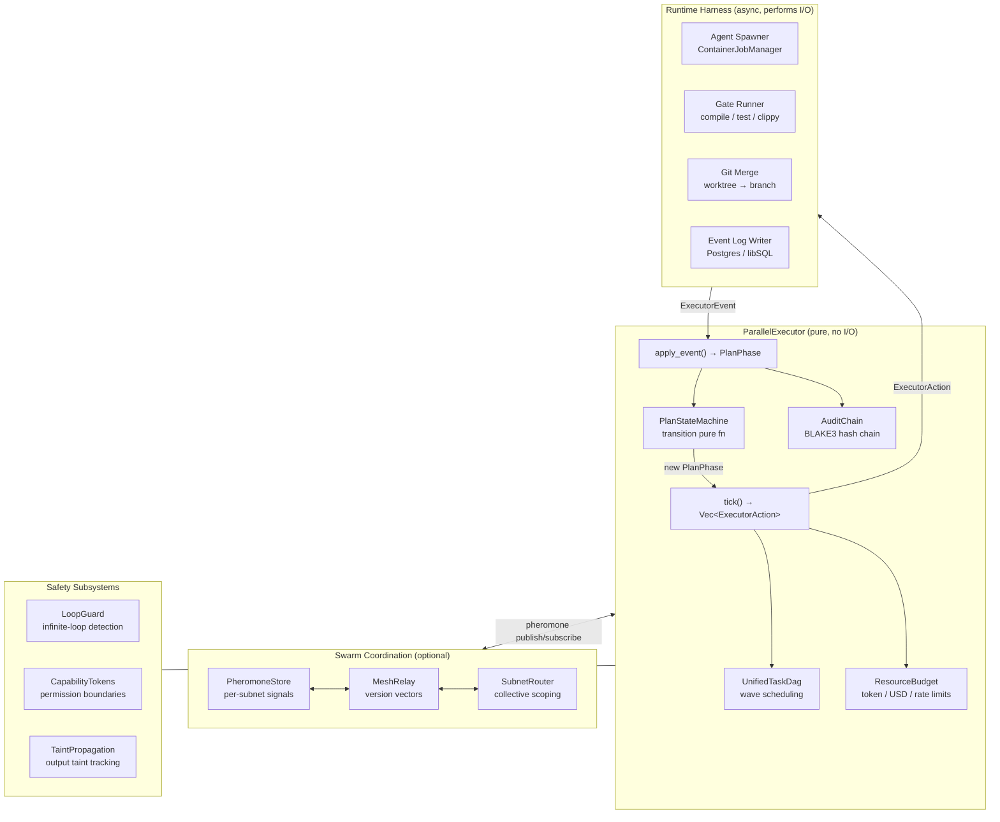
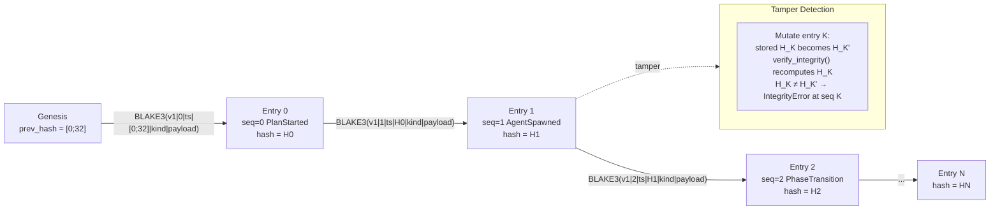
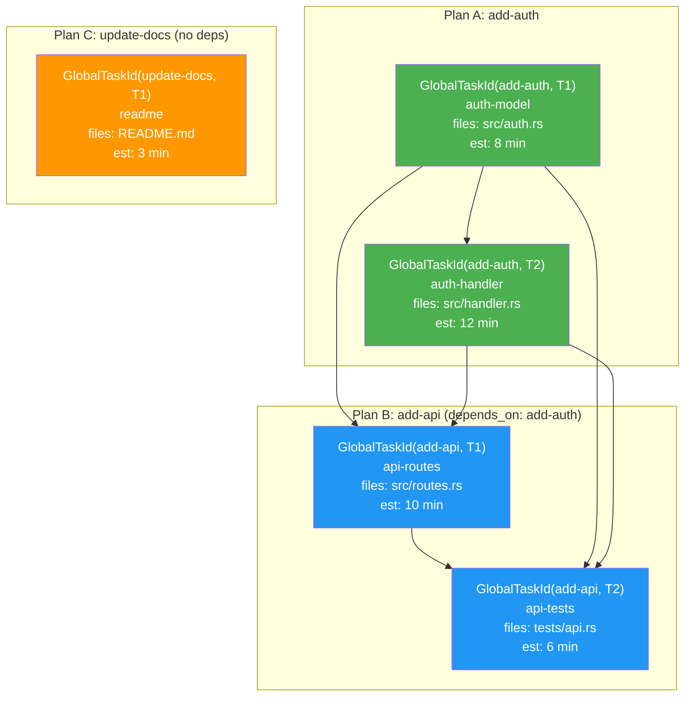
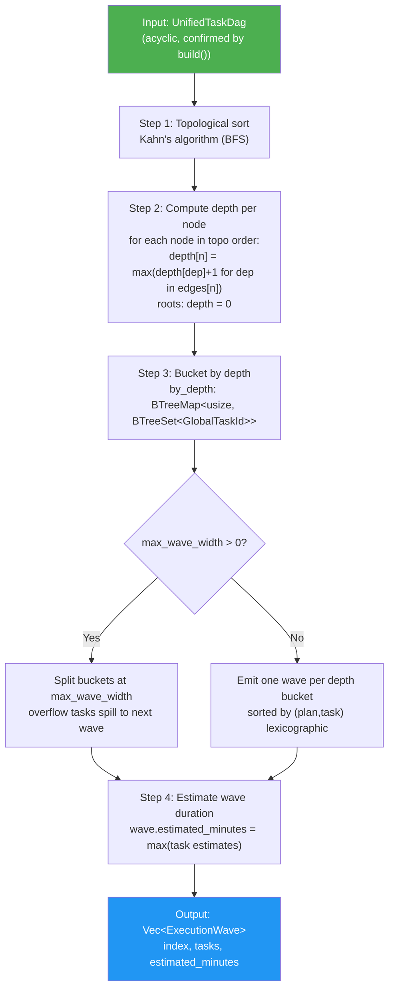
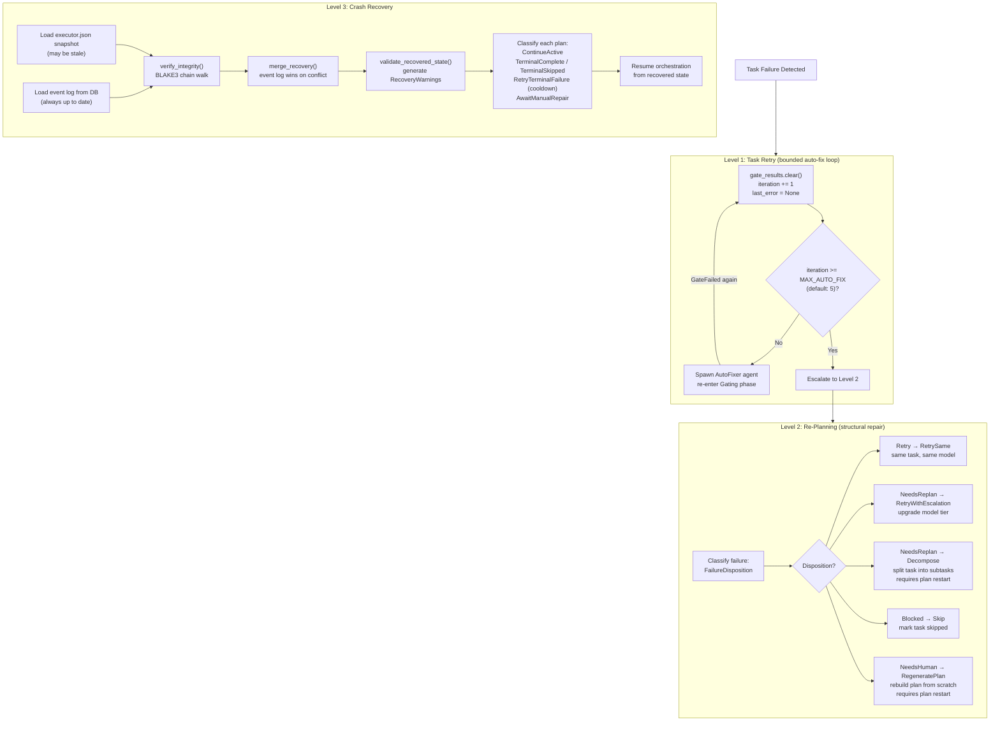
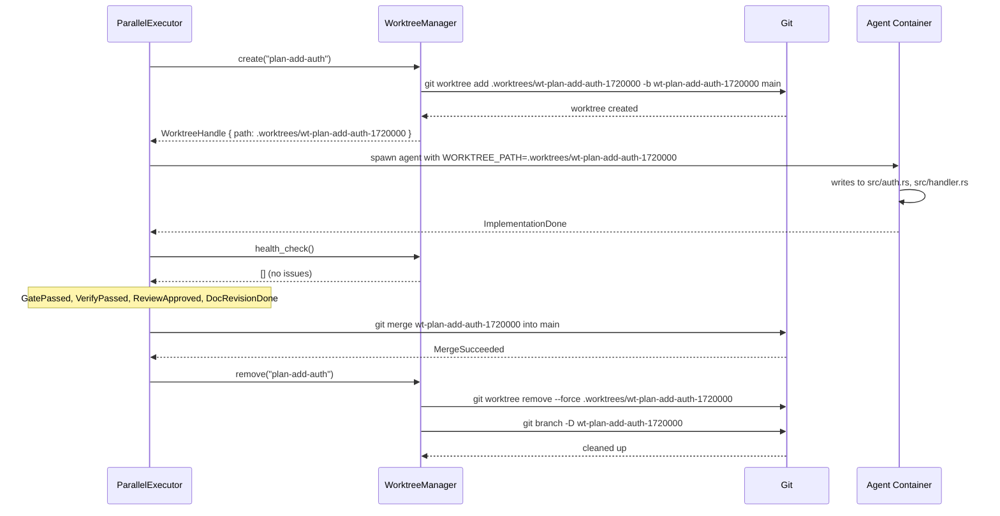
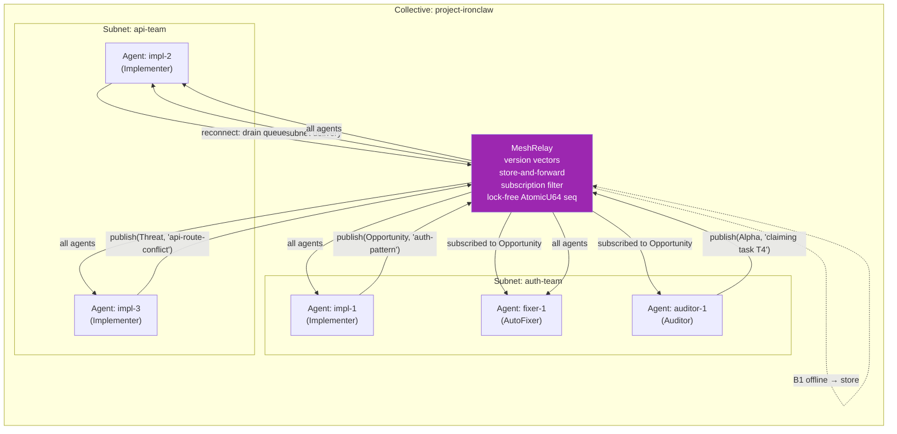

# Orchestrator & Swarm Coordination

**Source reference**: `roko-orchestrator`, `roko-runtime` (reference implementation)
**GitHub reference**: `crates/roko-orchestrator/src`
**Priority**: MEDIUM -- multi-job orchestration, event sourcing, swarm coordination
**IronClaw integration target**: `src/orchestrator/`

---

## Table of Contents

1. [Why Orchestration Matters for AI Systems](#1-why-orchestration-matters-for-ai-systems)
2. [Architectural Overview](#2-architectural-overview)
3. [The Pure State Machine](#3-the-pure-state-machine)
4. [Event Sourcing: Journal, Replay, and Recovery](#4-event-sourcing-journal-replay-and-recovery)
5. [Unified Cross-Plan Task DAG](#5-unified-cross-plan-task-dag)
6. [Wave Scheduling Algorithm](#6-wave-scheduling-algorithm)
7. [File-Conflict Inference](#7-file-conflict-inference)
8. [Three-Level Recovery System](#8-three-level-recovery-system)
9. [BLAKE3 Hash-Linked Audit Chain](#9-blake3-hash-linked-audit-chain)
10. [Live DAG Mutation](#10-live-dag-mutation)
11. [Safety Subsystems](#11-safety-subsystems)
12. [Worktree Isolation](#12-worktree-isolation)
13. [Pheromone-Based Swarm Coordination](#13-pheromone-based-swarm-coordination)
14. [Benchmarking & Performance](#14-benchmarking--performance)
15. [Worked Examples](#15-worked-examples)
16. [IronClaw Integration](#16-ironclaw-integration)
17. [References](#17-references)
18. [Complexity Assessment](#18-complexity-assessment)

---

## 1. Why Orchestration Matters for AI Systems

When an AI system handles a single request with a single agent, orchestration is trivial -- it is just a request-response loop. But when you need to decompose a large task into subtasks, assign those subtasks to multiple agents running in parallel, handle failures gracefully, merge results safely, and survive crashes without losing progress, you need a proper orchestration layer.

The naive approach -- spawning agents ad hoc, polling for completion, retrying on failure -- quickly becomes untenable. Race conditions corrupt shared state. Crash recovery requires complex ad hoc logic. Debugging production failures means sifting through unstructured logs with no causal ordering. Auditing becomes impossible because there is no authoritative record of what decisions were made and why.

The reference implementation solves this with a pattern borrowed from distributed systems: **a pure state machine driven by an event-sourced journal**. This is the same pattern used by systems like Apache Flink (stream processing checkpoints), Temporal.io (workflow replay), and event-sourced CQRS architectures [Fowler2005, Temporal2024]. The insight is that if you separate *computation of the next action* (pure function) from *performing the action* (I/O), you get deterministic replay, trivial crash recovery, and a tamper-evident audit trail for free.

### The Core Insight

The orchestrator never performs I/O. It is a pure function:

```
(current_state, event) -> (new_state, actions_to_perform)
```

The runtime harness performs the I/O (spawning agents, running tests, merging branches), then feeds the results back as new events. This separation has three consequences:

1. **Deterministic replay**: Given the same event sequence, the state machine always reaches the same state. This is the same guarantee that Temporal.io's durable execution engine provides: "workflows must be deterministic -- given the same inputs, they produce the same sequence of steps" [Temporal2024].
2. **Crash safety**: Write the event to the journal *before* performing the I/O. If you crash mid-action, replay the journal on restart to reconstruct state, then re-dispatch the pending action. This is the write-ahead log (WAL) principle from database crash recovery [Bernstein1987].
3. **Auditability**: The event journal is a complete, ordered record of every decision. Hash-chain it and you get tamper evidence [Merkle1988, Laurie2013].

---

## 2. Architectural Overview

The orchestrator crate is organized into modules, each handling a distinct concern. Understanding the full module layout is essential before diving into any single subsystem.

```
`crates/roko-orchestrator/src`
  lib.rs              -- Crate root: ParallelExecutor, ExecutorConfig, ResourceBudget
  dag.rs              -- UnifiedTaskDag: cross-plan DAG, wave scheduling, file-overlap
  event_log.rs        -- EventLog: append-only BLAKE3 hash-chained event journal
  coordination.rs     -- Pheromone types, subnets, collectives, swarm coordination
  mesh_relay.rs       -- WebSocket relay for pheromone synchronization across peers
  merge_queue.rs      -- Ordered merge queue with dependency-aware sequencing
  plan_discovery.rs   -- Filesystem plan discovery with YAML frontmatter parsing
  post_merge.rs       -- Post-merge verification and cleanup
  progress.rs         -- Progress tracking and reporting
  repair.rs           -- Plan repair and healing
  replan.rs           -- Re-planning strategies (retry, escalate, decompose, skip, regenerate)
  runtime_snapshot.rs -- Runtime snapshot support
  service_factory.rs  -- Service construction helpers
  worktree.rs         -- Git worktree isolation manager

  executor/
    mod.rs            -- ParallelExecutor: main orchestration engine
    action.rs         -- ExecutorAction enum: the vocabulary of side-effects
    plan_state.rs     -- PlanState: per-plan mutable state
    state_machine.rs  -- PlanStateMachine: phase transition logic (pure function)
    snapshot.rs       -- ExecutorSnapshot, DeltaSnapshot, SnapshotVerifier (BLAKE3 envelope)
    recovery.rs       -- RecoveryEngine: crash recovery from snapshots + event replay
    reorder.rs        -- Queue reordering strategies
    priority_ceiling.rs -- Priority inheritance for resource contention
    resource_budget.rs  -- Token/cost/rate-limit composite budgets

  safety/
    audit_chain.rs    -- AuditChain: BLAKE3 hash-linked append-only audit log
    capability_tokens.rs -- Capability-based agent permissions
    loop_guard.rs     -- Infinite loop detection
    permit.rs         -- Permit issuance for privileged operations
    sandboxing.rs     -- Agent sandboxing controls
    taint_propagation.rs -- Taint tracking through agent outputs
```

### Design Principles

Seven principles govern every architectural decision in the orchestrator:

| Principle | Summary |
|-----------|---------|
| **P1: Single-threaded event loop, async I/O** | All state mutations happen in one `tokio::select!` loop. No locks needed on the orchestrator's own state because only one thread writes it. |
| **P2: Channels as event bus** | Four independent channels (agent events, executor actions, gate results, operator input) decouple subsystems. Channels are bounded to apply backpressure. |
| **P3: Stream, don't batch** | Parse agent stdout line-by-line as it arrives. Real-time progress updates. Never buffer a whole agent run before processing output. |
| **P4: Flush after every task** | Write snapshot + episode record + efficiency event after each task completes. A crash loses at most one task's work, not an entire plan. |
| **P5: The plan dir is the plan** | `tasks.toml` is the single source of truth for task definitions. The orchestrator reads it at startup and never overwrites it during execution. |
| **P6: Executor is pure, runner does I/O** | `tick()` returns `Vec<ExecutorAction>`. The runner harness dispatches each action. Results are fed back as `ExecutorEvent`s. The executor has no async code. |
| **P7: Align with unified spec** | Use naming conventions from the unified spec. The orchestrator is designed as a precursor to the full Engine; names must not conflict. |

### Mermaid: Top-Level Component Diagram



---

## 3. The Pure State Machine

> **See also**: The `GatePassed`/`GateFailed` events that drive the `Gating → Verifying` and `Gating → AutoFixing` transitions are produced by the gate pipeline documented in [Gate Verification Pipeline](./gate-verification.md). The 7-rung progressive pipeline (compile → lint → test → symbol check → ...) is what the orchestrator calls during the `Gating` and `Verifying` phases.

### Plan Phase Lifecycle

Every plan flows through a defined set of phases. The `PlanStateMachine` is a zero-sized struct containing no mutable state -- it is a pure function from `(PlanState, ExecutorEvent) -> Result<PlanPhase, TransitionError>`. All mutable state lives in `PlanState`, owned by `ParallelExecutor`.

```mermaid
stateDiagram-v2
    [*] --> Queued
    Queued --> Enriching : Start
    Queued --> Skipped : Skip

    Enriching --> Implementing : EnrichmentDone
    Enriching --> Skipped : Skip
    Enriching --> Failed : Fatal(reason)

    Implementing --> Gating : ImplementationDone
    Implementing --> Skipped : Skip
    Implementing --> Failed : Fatal(reason)

    Gating --> Verifying : GatePassed
    Gating --> AutoFixing : GateFailed\n[iteration < MAX_AUTO_FIX]
    Gating --> Failed : GateFailed\n[iteration >= MAX_AUTO_FIX]\nFailureKind::AutoFixExhausted
    Gating --> Skipped : Skip
    Gating --> Failed : Fatal(reason)

    AutoFixing --> Gating : AutoFixDone
    AutoFixing --> Skipped : Skip
    AutoFixing --> Failed : Fatal(reason)

    Verifying --> Reviewing : VerifyPassed
    Verifying --> RegeneratingVerify : VerifyFailed
    Verifying --> Skipped : Skip
    Verifying --> Failed : Fatal(reason)

    RegeneratingVerify --> Verifying : VerifyRegenDone
    RegeneratingVerify --> Skipped : Skip
    RegeneratingVerify --> Failed : Fatal(reason)

    Reviewing --> DocRevision : ReviewApproved
    Reviewing --> Implementing : ReviewRejected
    Reviewing --> Skipped : Skip
    Reviewing --> Failed : Fatal(reason)

    DocRevision --> Merging : DocRevisionDone
    DocRevision --> Skipped : Skip
    DocRevision --> Failed : Fatal(reason)

    Merging --> Complete : MergeSucceeded
    Merging --> Failed : MergeFailed\n[attempts >= MAX_MERGE]\nFailureKind::Deadlock
    Merging --> Failed : Fatal(reason)

    Complete --> Merging : OperatorMerge

    note right of Gating : Bounded auto-fix loop\nMAX_AUTO_FIX_ITERATIONS = 5\n(from roko_core::defaults)
    note right of Merging : Bounded merge retry\nMAX_MERGE_ATTEMPTS = 3
    note right of Complete : Terminal (success)\nOperatorMerge re-queues merge only
    note right of Failed : Terminal (failure)\nFailureKind carries structured reason
    note right of Skipped : Terminal (skip)\nNo further transitions
```

### The ExecutorEvent Enum

Every transition is triggered by an `ExecutorEvent`. This is the complete enum from the source -- 17 variants covering every scenario including operator-initiated actions and unrecoverable failures:

```rust
// Source: `crates/roko-orchestrator/src/executor/state_machine.rs`

pub enum ExecutorEvent {
    /// Plan has been dispatched -- start enrichment.
    /// Triggered by: runtime after plan is selected from queue.
    Start,
    /// Enrichment (Strategist agent) completed successfully.
    EnrichmentDone,
    /// All implementation tasks done -- move to gate pipeline.
    ImplementationDone,
    /// A gate (compile/test/clippy) passed at the current rung.
    GatePassed,
    /// A gate failed -- potentially trigger auto-fix.
    GateFailed,
    /// Auto-fix agent finished -- retry gating.
    AutoFixDone,
    /// Verify-chain passed.
    VerifyPassed,
    /// Verify-chain failed -- regenerate and retry.
    VerifyFailed,
    /// Verify regeneration completed -- retry verification.
    VerifyRegenDone,
    /// Review agent approved the implementation.
    ReviewApproved,
    /// Review agent requested rework -- send back to Implementing.
    ReviewRejected,
    /// Doc revision (Scribe agent) completed.
    DocRevisionDone,
    /// Git merge succeeded.
    MergeSucceeded,
    /// Git merge failed (conflict or other git error).
    MergeFailed,
    /// Operator manually triggers merge on a plan in Complete phase.
    OperatorMerge,
    /// Operator (or policy) requested skip -- fast path to Skipped.
    Skip,
    /// Unrecoverable failure with a human-readable reason string.
    /// Valid from any non-terminal phase.
    Fatal(String),
}
```

### The Transition Function

The transition function is the heart of the state machine. It takes the current `PlanState` plus an event, and returns either a new `PlanPhase` or a `TransitionError`. Before returning, it validates the proposed transition against a canonical `valid_transitions()` table.

The bounded retry loops are the most important detail: `MAX_AUTO_FIX_ITERATIONS` (default 5, from `roko_core::defaults::DEFAULT_MAX_AUTO_FIX_ITERATIONS`) caps the Gating/AutoFixing cycle. `MAX_MERGE_ATTEMPTS = 3` caps merge retries. Without these bounds, a failing agent could cause infinite loops.

```rust
// Source: `crates/roko-orchestrator/src/executor/state_machine.rs`

pub fn transition(
    plan_state: &PlanState,
    event: &ExecutorEvent,
) -> Result<PlanPhase, TransitionError> {
    let current = &plan_state.current_phase;
    let current_kind = current.kind();

    let next = match (current_kind, event) {
        // -- Queued --
        (PhaseKind::Queued, ExecutorEvent::Start) => PlanPhase::Enriching,
        (PhaseKind::Queued, ExecutorEvent::Skip)  => PlanPhase::Skipped,

        // -- Enriching --
        (PhaseKind::Enriching, ExecutorEvent::EnrichmentDone) => PlanPhase::Implementing,
        (PhaseKind::Enriching, ExecutorEvent::Skip)           => PlanPhase::Skipped,

        // -- Implementing --
        (PhaseKind::Implementing, ExecutorEvent::ImplementationDone) => PlanPhase::Gating,
        (PhaseKind::Implementing, ExecutorEvent::Skip)               => PlanPhase::Skipped,

        // -- Gating: bounded auto-fix loop --
        (PhaseKind::Gating, ExecutorEvent::GatePassed) => PlanPhase::Verifying,
        (PhaseKind::Gating, ExecutorEvent::GateFailed) => {
            if plan_state.iteration >= MAX_AUTO_FIX_ITERATIONS {
                PlanPhase::Failed { reason: FailureKind::AutoFixExhausted }
            } else {
                PlanPhase::AutoFixing
            }
        }
        (PhaseKind::Gating, ExecutorEvent::Skip) => PlanPhase::Skipped,

        // -- AutoFixing --
        (PhaseKind::AutoFixing, ExecutorEvent::AutoFixDone) => PlanPhase::Gating,
        (PhaseKind::AutoFixing, ExecutorEvent::Skip)        => PlanPhase::Skipped,

        // -- Verifying --
        (PhaseKind::Verifying, ExecutorEvent::VerifyPassed) => PlanPhase::Reviewing,
        (PhaseKind::Verifying, ExecutorEvent::VerifyFailed) => PlanPhase::RegeneratingVerify,
        (PhaseKind::Verifying, ExecutorEvent::Skip)         => PlanPhase::Skipped,

        // -- RegeneratingVerify --
        (PhaseKind::RegeneratingVerify, ExecutorEvent::VerifyRegenDone) => PlanPhase::Verifying,
        (PhaseKind::RegeneratingVerify, ExecutorEvent::Skip)            => PlanPhase::Skipped,

        // -- Reviewing --
        (PhaseKind::Reviewing, ExecutorEvent::ReviewApproved) => PlanPhase::DocRevision,
        (PhaseKind::Reviewing, ExecutorEvent::ReviewRejected) => PlanPhase::Implementing,
        (PhaseKind::Reviewing, ExecutorEvent::Skip)           => PlanPhase::Skipped,

        // -- DocRevision --
        (PhaseKind::DocRevision, ExecutorEvent::DocRevisionDone) => PlanPhase::Merging,
        (PhaseKind::DocRevision, ExecutorEvent::Skip)            => PlanPhase::Skipped,

        // -- Merging: bounded retry --
        (PhaseKind::Merging, ExecutorEvent::MergeSucceeded) => PlanPhase::Complete,
        (PhaseKind::Merging, ExecutorEvent::MergeFailed) => {
            if plan_state.merge_attempts >= MAX_MERGE_ATTEMPTS {
                PlanPhase::Failed { reason: FailureKind::Deadlock }
            } else {
                PlanPhase::Failed {
                    reason: FailureKind::Other("merge conflict -- retry".into()),
                }
            }
        }

        // -- Complete: operator re-triggers merge --
        (PhaseKind::Complete, ExecutorEvent::OperatorMerge) => PlanPhase::Merging,

        // -- Fatal from any non-terminal phase --
        (kind, ExecutorEvent::Fatal(reason)) => {
            if valid_transitions(kind).contains(&PhaseKind::Failed) {
                PlanPhase::Failed { reason: FailureKind::Other(reason.clone()) }
            } else {
                return Err(TransitionError {
                    from: kind,
                    to: PhaseKind::Failed,
                    reason: format!("cannot fail from terminal {kind:?}"),
                });
            }
        }

        // -- Invalid transition: everything else --
        (from, event) => {
            return Err(TransitionError {
                from,
                to: PhaseKind::Failed,
                reason: format!("no rule for ({from:?}, {event:?})"),
            });
        }
    };

    // Secondary guard: validate against the canonical table.
    let next_kind = next.kind();
    if !valid_transitions(current_kind).contains(&next_kind) {
        return Err(TransitionError {
            from: current_kind,
            to: next_kind,
            reason: format!("{current_kind:?} -> {next_kind:?} not in valid_transitions table"),
        });
    }
    Ok(next)
}
```

### The Action Vocabulary (ExecutorAction)

After each transition, `PlanStateMachine::next_action()` maps the new `PlanPhase` to the action the runtime should perform. The executor never performs I/O; it only names the action:

```rust
// Source: `crates/roko-orchestrator/src/executor/action.rs`

pub enum ExecutorAction {
    /// Start enrichment (Strategist agent) for a freshly queued plan.
    DispatchPlan { plan_id: String },

    /// Spawn an agent process for a specific task within a plan.
    SpawnAgent {
        plan_id: String,
        role: AgentRole,   // Strategist | Implementer | AutoFixer | Auditor | Scribe
        task: String,
    },

    /// Run a gate (compile, test, clippy, lint) at a given rung index.
    RunGate { plan_id: String, rung: u32 },

    /// Run task-level verify commands declared in tasks.toml.
    RunVerify { plan_id: String },

    /// Apply a live DAG mutation between execution wave boundaries.
    ApplyDagMutation { mutation: DagMutation },

    /// Launch a backup execution for a task that has exceeded threshold.
    StartSpeculativeExecution {
        plan_id: String,
        task: String,
        backup_role: AgentRole,
        expected_minutes: u32,
        elapsed_minutes: u32,
    },

    /// Cancel the losing branch of a completed speculative execution.
    CancelSpeculativeExecution { plan_id: String, task: String },

    /// Merge a plan's worktree branch into the batch integration branch.
    MergeBranch { plan_id: String },

    /// Mark a plan as terminally failed with a reason string.
    FailPlan { plan_id: String, reason: String },

    /// Mark a plan as successfully complete.
    CompletePlan { plan_id: String },

    /// Move a plan to a new priority position in the execution queue.
    Reorder { plan_id: String, new_position: usize },

    /// Pause a running plan (e.g. budget exceeded, resource contention).
    PausePlan { plan_id: String },

    /// Resume a previously paused plan.
    ResumePlan { plan_id: String },
}
```

Phase-to-action mapping from `next_action()`:

| Phase | Action | Agent Role |
|-------|--------|------------|
| Queued | `DispatchPlan` | -- |
| Enriching | `SpawnAgent` | Strategist |
| Implementing | `SpawnAgent` | Implementer |
| Gating | `RunGate` | -- (gate pipeline) |
| AutoFixing | `SpawnAgent` | AutoFixer |
| Verifying | `RunVerify` | -- (verify pipeline) |
| RegeneratingVerify | `SpawnAgent` | AutoFixer |
| Reviewing | `SpawnAgent` | Auditor |
| DocRevision | `SpawnAgent` | Scribe |
| Merging | `MergeBranch` | -- (git) |
| Complete / Failed / Skipped | `None` | -- (terminal) |

### PlanState: Per-Plan Mutable State

Every plan in the executor gets a `PlanState` struct. The state machine reads it as input and the executor mutates it on each `apply_event()`:

```rust
// Source: `crates/roko-orchestrator/src/executor/plan_state.rs`

pub struct PlanState {
    pub plan_id: String,
    pub current_phase: PlanPhase,
    pub assigned_agents: Vec<String>,      // agent IDs currently running for this plan
    pub gate_results: Vec<GateResult>,     // cleared on each retry
    pub iteration: u32,                    // starts at 1, incremented on retry
    pub started_at_ms: u64,
    pub files_changed: Vec<String>,        // reported by agents for conflict detection
    pub merge_attempts: u32,               // incremented on each MergeFailed
    pub last_error: Option<String>,        // last FailureKind as string
    pub paused: bool,                      // true while PausePlan is in effect
    pub priority: u32,                     // higher value = runs earlier in tick()
}
```

The `files_changed` field is critical for file-conflict inference (section 7): agents report touched files, and the orchestrator builds the runtime conflict graph from this information as execution proceeds.

### The ParallelExecutor

`ParallelExecutor` is the main orchestration engine. It owns all plan state and provides a pure `tick()` / `apply_event()` interface:

```rust
// Source: `crates/roko-orchestrator/src/executor/mod.rs`

pub struct ParallelExecutor {
    config: ExecutorConfig,
    plans: HashMap<String, PlanState>,
    queue: Vec<String>,                              // plan_ids in priority order
    plan_deps: HashMap<String, Vec<String>>,         // cross-plan DAG edges
    speculative_executions: HashMap<String, SpeculativeExecution>,
    audit_chain: Option<AuditChain>,
}

pub fn tick(&self) -> Vec<ExecutorAction> {
    let mut actions = Vec::new();
    let mut active_count = 0;

    for plan_id in &self.queue {
        let Some(state) = self.plans.get(plan_id) else { continue };
        if state.is_terminal() { continue }
        if state.paused { continue }
        if !self.deps_satisfied(plan_id) { continue }   // cross-plan deps check

        active_count += 1;
        if active_count > self.config.max_concurrent_plans { break }

        if let Some(action) = PlanStateMachine::next_action(state) {
            actions.push(action);
        }
    }
    actions
}

pub fn apply_event(
    &mut self,
    plan_id: &str,
    event: &ExecutorEvent,
) -> Result<PlanPhase, TransitionError> {
    let state = self.plans.get(plan_id).ok_or(/* ... */)?;
    let from_kind = state.current_phase.kind();
    let new_phase = PlanStateMachine::transition(state, event)?;
    let to_kind = new_phase.kind();

    let state = self.plans.get_mut(plan_id).unwrap();
    state.current_phase = new_phase.clone();
    if let PlanPhase::Failed { reason } = &new_phase {
        state.last_error = Some(reason.to_string());
    }

    // Hash-chain every phase transition into the audit log.
    if let Some(chain) = &self.audit_chain {
        let kind = format!("phase.{from_kind:?}->{to_kind:?}");
        let entry = AuditEntry::new([0u8; 32], kind, "executor", plan_id.to_string());
        let _ = chain.append(entry);
    }

    Ok(new_phase)
}
```

### Configuration

```rust
// Source: `crates/roko-orchestrator/src/executor/mod.rs`

pub struct ExecutorConfig {
    pub max_concurrent_plans: usize,           // default: 4
    pub max_concurrent_tasks: usize,           // default: 8
    pub max_auto_fix_iterations: u32,          // default: 5
    pub max_merge_attempts: u32,               // default: 3
    pub task_timeout_secs: u64,                // default: 600 (10 minutes)
    pub budget_usd: Option<f64>,               // per-run USD budget cap (deprecated)
    pub resource_budget: ResourceBudget,       // composite budget (token/cost/rate)
    pub speculative_threshold_multiplier: f64, // default: 2.0
    pub auto_replan: bool,                     // default: false
    pub use_worktrees: bool,                   // default: false
}
```

### Speculative Execution

When a task has been running for longer than `expected_minutes * speculative_threshold_multiplier`, the executor registers a speculative execution -- a backup agent working on the same task in parallel. Whichever finishes first wins; the other is cancelled. The budget check prevents runaway cost:

```rust
// Source: `crates/roko-orchestrator/src/executor/mod.rs`

pub struct SpeculativeExecution {
    pub plan_id: String,
    pub task: String,
    pub expected_minutes: u32,
    pub elapsed_minutes: u32,
    pub backup_role: AgentRole,
    pub projected_cost_usd: f64,   // must fit within remaining budget
    pub started_at_ms: u64,
}

// Registration deduplicates by "plan_id:task" key.
// Returns None if budget exceeded or already speculating on this task.
pub fn register_speculative_execution(
    &mut self,
    plan_id: &str,
    task: &str,
    expected_minutes: u32,
    elapsed_minutes: u32,
    role: AgentRole,
    projected_cost_usd: f64,
) -> Option<ExecutorAction> { ... }

// Called when either branch finishes. Returns CancelSpeculativeExecution
// for the losing branch.
pub fn resolve_speculative_execution(
    &mut self,
    plan_id: &str,
    task: &str,
) -> Option<ExecutorAction> { ... }
```

### Resource Budget

The `ResourceBudget` is a composite budget covering token spend, USD cost, and rate limits -- replacing the deprecated flat `budget_usd` field:

```rust
// Source: `crates/roko-orchestrator/src/executor/resource_budget.rs`

pub struct ResourceBudget {
    /// Maximum total LLM input tokens across all plans.
    pub max_input_tokens: Option<u64>,
    /// Maximum total LLM output tokens across all plans.
    pub max_output_tokens: Option<u64>,
    /// Maximum total USD cost across all plans.
    pub max_cost_usd: Option<f64>,
    /// Maximum LLM requests per second (sliding window).
    pub max_requests_per_second: Option<f64>,
    /// Maximum LLM requests per minute (sliding window).
    pub max_requests_per_minute: Option<u32>,
    /// Whether to pause plans when budget is exhausted (vs. fail them).
    pub pause_on_budget_exceeded: bool,
}

impl ResourceBudget {
    pub fn check(&self, consumed: &ResourceConsumption) -> BudgetStatus { ... }
    pub fn remaining_usd(&self, consumed: &ResourceConsumption) -> Option<f64> { ... }
}
```

---

## 4. Event Sourcing: Journal, Replay, and Recovery

### What Is Event Sourcing?

Event sourcing is a pattern where the state of an application is determined by a sequence of events rather than by storing the current state directly [Fowler2005]. Instead of mutating a record in place, every change is captured as an immutable event and appended to a log. The current state is derived by replaying the full event sequence from the beginning.

This pattern was first described by Martin Fowler in 2005 and later elaborated as part of CQRS (Command Query Responsibility Segregation) [Young2010]. Temporal.io's durable execution engine [Temporal2024] uses the same principle: "every step of a workflow is persisted as an event in an Event History, and if a worker process crashes halfway through, Temporal replays the event history on a new worker and resumes from exactly where it left off."

The key guarantee: **write the event before performing the side-effect**. If you crash after writing but before performing, replay will re-derive the action and the harness will re-execute it. If you crash after performing but before the next event write, the harness may execute the side-effect again on restart -- so side-effects must be idempotent (or the system must deduplicate using the event's sequence number as an idempotency key).

### Mermaid: Event Sourcing Append and Replay Flow

```mermaid
sequenceDiagram
    participant H as Runtime Harness
    participant EL as EventLog (in-memory + DB)
    participant EX as ParallelExecutor (pure)
    participant DB as Persistent Store

    Note over H,DB: Normal operation

    H->>EL: append(PlanStarted { plan: "A" })
    EL->>EL: compute_hash(seq=0, prev=[0;32])
    EL->>DB: persist {seq=0, hash=H0, kind=PlanStarted}
    EL-->>H: Ok(seq=0)
    H->>EX: apply_event("A", Start)
    EX-->>H: Ok(Enriching)
    H->>H: spawn Strategist agent for "A"

    H->>EL: append(PhaseTransition { plan:"A", to:"Implementing" })
    EL->>EL: compute_hash(seq=1, prev=H0)
    EL->>DB: persist {seq=1, hash=H1}
    H->>EX: apply_event("A", EnrichmentDone)
    EX-->>H: Ok(Implementing)

    Note over H,DB: CRASH here -- executor state lost

    Note over H,DB: RESTART

    H->>DB: load snapshot (stale: A=Queued)
    H->>DB: load event log entries [seq=0..1]
    H->>EL: restore_verified(snapshot)
    EL->>EL: verify_integrity(): H0→H1 chain valid
    EL-->>H: Ok(log verified)
    H->>EX: replay: apply_event("A", Start) → Enriching
    H->>EX: replay: apply_event("A", EnrichmentDone) → Implementing
    H-->>H: recovered: A=Implementing — resume from here
```

### The Event Log

The `EventLog` is an append-only, BLAKE3 hash-chained journal. It serves three purposes:

1. **State reconstruction**: Replay the full event sequence to rebuild orchestrator state from scratch.
2. **Crash recovery**: After a crash, replay events since the last snapshot to advance to the crash point.
3. **Tamper detection**: Each entry's hash includes the previous entry's hash. Any mutation, deletion, insertion, or reordering of historical entries is detectable by walking the chain and recomputing hashes.

```rust
// Source: `crates/roko-orchestrator/src/event_log.rs`

pub enum EventKind {
    PlanStarted,
    TaskAssigned,
    AgentSpawned,
    CognitiveWorkspaceRecorded,
    GateResult,
    MergeAttempted,
    PlanCompleted,
    PlanFailed,
    ErrorOccurred,
    InterventionFired,
    PhaseTransition,
    EnrichmentValidated,
}
```

### Event Entry Structure

```rust
// Source: `crates/roko-orchestrator/src/event_log.rs`

pub struct EventEntry {
    /// Monotonically increasing sequence number (0-based).
    pub sequence_number: u64,
    /// Unix millisecond timestamp.
    pub timestamp_ms: i64,
    /// The kind of event.
    pub event_kind: EventKind,
    /// Structured payload (event-specific data as JSON).
    pub payload: serde_json::Value,
    /// BLAKE3 content hash of this entry (includes the previous hash).
    pub content_hash: [u8; 32],
}
```

### Hash Chain Construction

The hash for each entry is computed over a deterministic canonical encoding that includes the previous entry's hash [Merkle1988]. This makes the chain tamper-evident -- changing any historical entry invalidates every subsequent hash:

```
H(entry_n) = BLAKE3("eventv1|" || seq_be || ts_be || H(entry_{n-1}) || LP(kind) || LP(payload))
```

where `LP(data)` means a 4-byte big-endian length prefix followed by the data, and `||` denotes concatenation. The version tag `"eventv1|"` future-proofs the encoding: changing the hash schema increments the version and makes old and new entries incompatible rather than silently producing wrong hashes.

```rust
// Source: `crates/roko-orchestrator/src/event_log.rs`

fn compute_hash(
    seq: u64,
    ts_ms: i64,
    kind: &EventKind,
    payload: &serde_json::Value,
    prev_hash: &[u8; 32],
) -> [u8; 32] {
    let kind_str = kind.to_string();
    let payload_bytes = serde_json::to_vec(payload).unwrap_or_default();

    let mut buf: Vec<u8> = Vec::with_capacity(8 + 8 + 8 + 32 + 4 + kind_str.len() + 4 + payload_bytes.len());
    buf.extend_from_slice(b"eventv1|");          // version tag
    buf.extend_from_slice(&seq.to_be_bytes());   // sequence number (big-endian)
    buf.extend_from_slice(&ts_ms.to_be_bytes()); // timestamp (big-endian)
    buf.extend_from_slice(prev_hash);             // link to previous entry
    push_lp(&mut buf, kind_str.as_bytes());      // length-prefixed kind
    push_lp(&mut buf, &payload_bytes);           // length-prefixed payload
    ContentHash::of(&buf).0                      // BLAKE3 → [u8; 32]
}

fn push_lp(buf: &mut Vec<u8>, data: &[u8]) {
    let len = data.len() as u32;
    buf.extend_from_slice(&len.to_be_bytes());
    buf.extend_from_slice(data);
}
```

The genesis entry (sequence 0) uses `[0u8; 32]` as its `prev_hash`.

### Mermaid: BLAKE3 Hash Chain Construction



### Integrity Verification

```rust
// Source: `crates/roko-orchestrator/src/event_log.rs`

pub fn verify_integrity(&self) -> Result<(), IntegrityError> {
    let guard = self.inner.lock();
    verify_entry_sequences(&guard.entries)?;  // check seq numbers are 0,1,2,...
    let mut prev_hash = ZERO_HASH;

    for entry in &guard.entries {
        let expected = EventEntry::compute_hash(
            entry.sequence_number,
            entry.timestamp_ms,
            &entry.event_kind,
            &entry.payload,
            &prev_hash,
        );
        if entry.content_hash != expected {
            return Err(IntegrityError {
                at_sequence: entry.sequence_number,
                reason: format!(
                    "hash mismatch at seq {}: expected {}, stored {}",
                    entry.sequence_number,
                    hex::encode(expected),
                    hex::encode(entry.content_hash),
                ),
            });
        }
        prev_hash = entry.content_hash;
    }

    if guard.tip != prev_hash {
        return Err(IntegrityError {
            at_sequence: guard.entries.len() as u64,
            reason: "tip hash does not match final entry".into(),
        });
    }
    Ok(())
}
```

Thread safety: `Arc<Mutex<LogInner>>` using `parking_lot::Mutex`. Concurrent appends from multiple threads preserve integrity: tested with 4 threads x 25 events each, verified post-run via `verify_integrity()`.

### Snapshot and Restore

The event log supports snapshot/restore for crash recovery:

```rust
// Source: `crates/roko-orchestrator/src/event_log.rs`

pub fn snapshot(&self) -> EventLogSnapshot {
    let guard = self.inner.lock();
    EventLogSnapshot {
        entries: guard.entries.clone(),
        tip: guard.tip,
    }
}

/// Restore and verify in one step. Returns Err if chain is corrupted.
pub fn restore_verified(snapshot: EventLogSnapshot) -> Result<Self, IntegrityError> {
    let log = Self::restore(snapshot);
    log.verify_integrity()?;
    Ok(log)
}
```

---

## 5. Unified Cross-Plan Task DAG

> **See also**: Individual plan tasks are first converted to a single-plan `Graph` (the `ironclaw_graph` crate's representation) by the plan-to-graph conversion pipeline described in [DAG Execution Engine: Plan-to-Graph Conversion Pipeline](./dag-execution.md#15-plan-to-graph-conversion-pipeline). The `UnifiedTaskDag` here operates at the cross-plan level, merging the outputs of those per-plan conversions into a global scheduling view.

### What It Is

The `UnifiedTaskDag` merges tasks from multiple plans into a single directed acyclic graph. This is crucial for multi-plan orchestration because it enables:

- Cross-plan dependency tracking (Plan B cannot start until Plan A's task T3 completes)
- Global scheduling optimization (critical path across all plans)
- File-conflict inference across plan boundaries
- Live mutation while execution is in progress (section 10)

DAG-based task scheduling is a well-studied problem in parallel computing [Kwok1999]. The critical path method (CPM) was originally developed by Kelley and Walker in 1959 [Kelley1959] and has since been adapted for parallel processor scheduling. The wave scheduling algorithm in section 6 is a variant of CPM-based level scheduling.

### DAG Construction

The `build()` method takes three inputs:

1. `plan_tasks: &BTreeMap<String, Vec<Task>>` -- tasks grouped by plan ID
2. `plan_deps: &HashMap<String, HashSet<String>>` -- plan-level dependencies
3. `config: DagConfig` -- configuration (file overlap inference, max wave width)

It constructs edges from four sources:

```
1. Intra-plan depends_on:    task T2 in plan P lists T1 in depends_on
                              => T1 -> T2

2. Cross-plan depends_on:    task T1 in plan "10-bar" lists "09-foo:T3"
                              => GlobalTaskId("09-foo","T3") -> GlobalTaskId("10-bar","T1")

3. Plan-level depends_on:    plan "10-bar" depends_on plan "09-foo"
                              => every task in "09-foo" -> every task in "10-bar"

4. File-overlap inference:   task A touches src/config.rs, task B touches src/config.rs
                              => A -> B (lexicographic GlobalTaskId order)
                              (opt-in via DagConfig::infer_file_overlap)
```

### GlobalTaskId and Cross-Plan References

Tasks are identified globally by a `GlobalTaskId` -- a `(plan_id, task_id)` pair:

```rust
// Source: `crates/roko-orchestrator/src/dag.rs`

#[derive(Clone, Debug, PartialEq, Eq, PartialOrd, Ord, Hash)]
pub struct GlobalTaskId {
    pub plan: String,
    pub task: String,
}

impl std::fmt::Display for GlobalTaskId {
    fn fmt(&self, f: &mut std::fmt::Formatter<'_>) -> std::fmt::Result {
        write!(f, "{}:{}", self.plan, self.task)
    }
}
```

Cross-plan references in `depends_on` use the qualified format `"09-chain-layer:T1"`. The `build()` method parses these and resolves them to `GlobalTaskId`s.

### Mermaid: Cross-Plan Task DAG



Critical path: A1(8) → A2(12) → B1(10) → B2(6) = 36 minutes.
Plan C runs entirely in parallel with Plan A: total wall-clock = 36 minutes.

### Cycle Detection

Before returning the DAG, `build()` runs `detect_cycle_nodes()` to eagerly reject cyclic dependencies. It uses a DFS-based algorithm with 3-state coloring:

```rust
// Source: `crates/roko-orchestrator/src/dag.rs`

pub fn detect_cycle_nodes<N>(deps: &BTreeMap<N, BTreeSet<N>>) -> Vec<N>
where
    N: Clone + Ord,
{
    // States: 0=unvisited, 1=in-progress (on current DFS stack), 2=complete
    // A node in state 1 when we encounter it from its own descendant = cycle.
    let mut color: BTreeMap<&N, u8> = BTreeMap::new();
    let mut cycle_nodes: BTreeSet<N> = BTreeSet::new();

    fn dfs<'a, N: Clone + Ord>(
        node: &'a N,
        deps: &'a BTreeMap<N, BTreeSet<N>>,
        color: &mut BTreeMap<&'a N, u8>,
        stack: &mut Vec<&'a N>,
        cycle_nodes: &mut BTreeSet<N>,
    ) {
        color.insert(node, 1);
        stack.push(node);
        if let Some(successors) = deps.get(node) {
            for s in successors {
                match color.get(s).copied().unwrap_or(0) {
                    0 => dfs(s, deps, color, stack, cycle_nodes),
                    1 => {
                        // s is on the stack → cycle found
                        let cycle_start = stack.iter().position(|n| *n == s).unwrap();
                        for n in &stack[cycle_start..] {
                            cycle_nodes.insert((*n).clone());
                        }
                    }
                    _ => {}
                }
            }
        }
        stack.pop();
        color.insert(node, 2);
    }

    for start in deps.keys() {
        if color.get(start).copied().unwrap_or(0) == 0 {
            dfs(start, deps, &mut color, &mut vec![], &mut cycle_nodes);
        }
    }
    cycle_nodes.into_iter().collect()
}
```

### Critical Path Method (CPM) Analysis

```rust
// Source: `crates/roko-orchestrator/src/dag.rs`

/// Earliest start time = length of longest path from any root to this task.
pub fn earliest_start(&self, task: &GlobalTaskId) -> Duration {
    // Memoized forward pass in topological order.
    // EST(root) = 0.
    // EST(task) = max over predecessors of (EST(pred) + duration(pred)).
    ...
}

/// Latest start time = deadline - (length of longest path from this task to any leaf).
pub fn latest_start(&self, task: &GlobalTaskId) -> Duration { ... }

/// Total float = LST - EST. Zero float = on the critical path.
pub fn total_float(&self, task: &GlobalTaskId) -> Duration {
    self.latest_start(task) - self.earliest_start(task)
}

pub fn stats(&self) -> DagStats {
    DagStats {
        nodes: self.nodes.len(),
        edges: self.edges.values().map(|s| s.len()).sum(),
        waves: self.waves().map(|w| w.len()).unwrap_or(0),
        critical_path_minutes: self.critical_path_minutes(),
    }
}
```

### Execution Status per Task

Each task in the DAG tracks fine-grained execution status, supporting backoff and retry at the task level independently of the plan-level state machine:

```rust
// Source: `crates/roko-orchestrator/src/dag.rs`

pub enum DagTaskExecutionStatus {
    Pending,       // waiting for dependencies to complete
    Ready,         // all deps passed, can be dispatched to an agent
    Running,       // agent is currently executing this task
    Gating,        // gate/verify pipeline is running for this task
    Passed,        // completed and verified successfully
    Retrying {     // waiting for exponential backoff before next attempt
        attempt: u32,
        backoff_until_ms: u64,
    },
    Exhausted {    // retry budget exceeded, task failed permanently
        attempts: u32,
        last_error: String,
    },
    Skipped,       // intentionally skipped (propagates to dependents)
}
```

---

## 6. Wave Scheduling Algorithm

### Overview

Wave scheduling layers the DAG into groups of tasks that can execute concurrently. This is a variant of the classical level scheduling (list scheduling) approach for DAG-based parallel task allocation [Kwok1999]. Wave 0 contains tasks with no dependencies. Wave N contains tasks whose deepest dependency is in wave N-1.

The algorithm is O(V + E) in the number of nodes and edges. For 500 tasks with 5% edge density (~1,250 edges), wave computation takes under 5 ms.

### Mermaid: Wave Scheduling Algorithm



### Full Algorithm Implementation

```rust
// Source: `crates/roko-orchestrator/src/dag.rs`

pub fn waves(&self) -> Result<Vec<ExecutionWave>, DagError> {
    let topo = self.topological_sort()?;  // Kahn's BFS, error if cycle

    // Step 2: Compute depths in topological order
    let mut depth: HashMap<GlobalTaskId, usize> = HashMap::with_capacity(self.nodes.len());
    for node in &topo {
        // depth = max(predecessor_depths) + 1; roots get 0
        let d = self.edges.get(node)
            .into_iter()
            .flatten()
            .map(|dep| depth.get(dep).copied().unwrap_or(0) + 1)
            .max()
            .unwrap_or(0);
        depth.insert(node.clone(), d);
    }

    // Step 3: Bucket by depth (BTreeMap for deterministic iteration order)
    let mut by_depth: BTreeMap<usize, BTreeSet<GlobalTaskId>> = BTreeMap::new();
    for (id, d) in &depth {
        by_depth.entry(*d).or_default().insert(id.clone());
    }

    // Steps 4+: Apply width limit, sort within wave, estimate duration
    let max_width = self.config.max_wave_width;
    let mut waves: Vec<ExecutionWave> = Vec::new();
    let mut overflow: Vec<GlobalTaskId> = Vec::new();

    for (_, bucket) in by_depth {
        // Merge overflow from previous depth + current bucket
        let mut combined: Vec<GlobalTaskId> = std::mem::take(&mut overflow);
        combined.extend(bucket);
        // Sort for deterministic output
        combined.sort_by(|a, b|
            (a.plan.as_str(), a.task.as_str()).cmp(&(b.plan.as_str(), b.task.as_str()))
        );

        while !combined.is_empty() {
            let take = if max_width == 0 { combined.len() }
                       else { combined.len().min(max_width) };
            let batch: Vec<GlobalTaskId> = combined.drain(..take).collect();
            let est = batch.iter()
                .map(|id| self.estimates.get(id).copied().unwrap_or(0))
                .max()
                .unwrap_or(0);
            waves.push(ExecutionWave {
                index: waves.len(),
                tasks: batch,
                estimated_minutes: est,
            });

            if max_width > 0 && !combined.is_empty() {
                // Remaining tasks overflow to next iteration
                overflow.append(&mut combined);
                break;
            }
        }
    }

    // Drain any final overflow into a trailing wave
    if !overflow.is_empty() {
        let est = overflow.iter()
            .map(|id| self.estimates.get(id).copied().unwrap_or(0))
            .max()
            .unwrap_or(0);
        waves.push(ExecutionWave { index: waves.len(), tasks: overflow, estimated_minutes: est });
    }

    Ok(waves)
}
```

### Concrete Wave Scheduling Example

Given tasks with dependencies and time estimates:

```
t1 (no deps, 5 min)    t2 (no deps, 3 min)    t3 (no deps, 8 min)
       |                       |
       v                       v
t4 (→t1, 10 min)         t5 (→t2, 6 min)
       |                       |
       +----------+------------+
                  |
                  v
            t6 (→t4,t5, 15 min)
```

**Unlimited width** (max_wave_width = 0):
```
Wave 0: [t1, t2, t3]    est=max(5,3,8)=8 min   -- all independent, parallel
Wave 1: [t4, t5]        est=max(10,6)=10 min    -- deps in wave 0
Wave 2: [t6]            est=15 min              -- deps in wave 1
                                                ----------
Critical path:          8 + 10 + 15 = 33 min   (vs 47 min sequential)
```

**Width-limited** (max_wave_width = 2):
```
Wave 0: [t1, t2]        est=max(5,3)=5 min      -- first 2 from bucket 0
Wave 1: [t3, t4]        est=max(8,10)=10 min    -- t3 overflow + t4 (dep satisfied)
Wave 2: [t5]            est=6 min               -- t5's dep t2 in wave 0 ✓
Wave 3: [t6]            est=15 min              -- deps t4(wave1), t5(wave2)
                                                ----------
Total:                  5 + 10 + 6 + 15 = 36 min (3 min overhead from width limit)
```

---

## 7. File-Conflict Inference

### The Problem

When two tasks run concurrently and both modify the same file, the merge step will produce conflicts. The orchestrator infers likely file conflicts *before* scheduling and serializes conflicting tasks via DAG edges -- preventing the situation where an agent spends 20 minutes producing code that cannot be merged.

### The Algorithm

File-conflict inference is opt-in via `DagConfig::infer_file_overlap` (default: `true`). During `build()`, in `rebuild_indexes()`:

1. **Build a file-to-tasks index**: For each file in any task's `files` field, collect all tasks that touch it.
2. **Add serialization edges**: For each file touched by more than one task, add edges between all pairs. The task with the lexicographically earlier `GlobalTaskId` becomes the predecessor (runs first).

```rust
// Source: `crates/roko-orchestrator/src/dag.rs`

fn rebuild_file_overlap_edges(&mut self) {
    if !self.config.infer_file_overlap { return; }

    let mut by_file: HashMap<String, BTreeSet<GlobalTaskId>> = HashMap::new();
    for (id, task) in &self.tasks {
        for file in &task.files {
            by_file.entry(file.clone()).or_default().insert(id.clone());
        }
    }

    for (_file, tasks) in by_file {
        if tasks.len() < 2 { continue; }  // no conflict if only one task touches file
        let ordered: Vec<GlobalTaskId> = tasks.into_iter().collect();  // sorted (BTreeSet)
        // Add edges: later tasks depend on earlier tasks (lexicographic order)
        for i in 0..ordered.len() {
            for j in 0..i {
                // ordered[j] < ordered[i] lexicographically → j must run before i
                self.edges
                    .entry(ordered[i].clone())
                    .or_default()
                    .insert(ordered[j].clone());
            }
        }
    }
}
```

### Concrete Example

```
task_a: files = ["src/auth.rs", "src/config.rs"]
task_b: files = ["src/api.rs",  "src/config.rs"]
task_c: files = ["src/api.rs",  "src/routes.rs"]
```

File-to-tasks index:
```
src/auth.rs   -> {task_a}
src/config.rs -> {task_a, task_b}     <- conflict
src/api.rs    -> {task_b, task_c}     <- conflict
src/routes.rs -> {task_c}
```

Serialization edges added (lexicographic GlobalTaskId order):
```
task_b -> task_a    (src/config.rs: "task_a" < "task_b")
task_c -> task_b    (src/api.rs:    "task_b" < "task_c")
```

Result: task_a → task_b → task_c (fully serialized via transitive deps). Without inference, all three would be in wave 0 and produce merge conflicts.

### Disabling Inference

```rust
// Source: `crates/roko-orchestrator/src/dag.rs` (tests)

#[test]
fn file_overlap_can_be_disabled() {
    let cfg = DagConfig { infer_file_overlap: false, max_wave_width: 0 };
    let dag = UnifiedTaskDag::build(&plans_with_overlapping_files, &HashMap::new(), cfg).unwrap();
    let waves = dag.waves().unwrap();
    // With inference off, both tasks have no explicit deps → wave 0
    assert_eq!(waves.len(), 1);
    assert_eq!(waves[0].tasks.len(), 2);
}
```

Known limitation: the algorithm is conservative. Two tasks that both modify `Cargo.toml` for unrelated sections (one adds a dependency, one bumps the version) are serialized even if a three-way merge would succeed. Future refinement: line-range conflict detection or semantic diffing.

---

## 8. Three-Level Recovery System

> **See also**: The Conductor triggers recovery by emitting `ConductorDecision::Restart` or `ConductorDecision::Fail` signals. The 10 watchers that produce those signals — including `IterationLoopWatcher` (which fires at Critical severity after 3 gate failures, triggering Level 2+ recovery) and `CompileFailRepeatWatcher` — are described in [Conductor: The 10 Watchers](./conductor-anomaly.md#5-the-10-watchers--complete-reference). The Holt forecaster used for predictive tripping (proactive Level 3 recovery) is documented in [Conductor: Holt Exponential Smoothing](./conductor-anomaly.md#8-holt-exponential-smoothing--full-mathematical-treatment).

The orchestrator has three distinct levels of failure recovery, each progressively more aggressive. These are implemented across `recovery.rs`, `replan.rs`, and `plan_state.rs`.

### Mermaid: Recovery Hierarchy



### Level 1: Task Retry (Within Iteration)

The simplest recovery: retry the same task with the same agent role. `PlanState.iteration` is bounded by `MAX_AUTO_FIX_ITERATIONS`:

```rust
// Source: `crates/roko-orchestrator/src/executor/plan_state.rs`

pub fn reset_for_retry(&mut self) {
    self.gate_results.clear();
    self.iteration += 1;
    self.last_error = None;
}
```

The gate results also support "mostly passing" detection. If more than 90% of tests pass (with at least 20 total and at least 1 failure), the system classifies this as a targeted test failure rather than a broad problem, enabling more focused retry context for the AutoFixer agent:

```rust
// Source: `crates/roko-orchestrator/src/executor/plan_state.rs`

pub fn is_mostly_passing(results: &[GateResult]) -> bool {
    let mut passed = 0u32;
    let mut failed = 0u32;
    let mut saw_failed_test_gate = false;

    for r in results {
        if matches!(r.kind, GateKind::Test) && !r.passed {
            saw_failed_test_gate = true;
        }
        passed += r.passed_count.unwrap_or(0);
        failed += r.failed_count.unwrap_or(0);
    }
    let total = passed + failed;

    saw_failed_test_gate
        && total > 20
        && failed > 0
        && f64::from(passed) / f64::from(total) > 0.9
}
```

### Level 2: Re-Planning (Structural Repair)

When retries are exhausted or the failure pattern indicates a structural problem (wrong task decomposition, missing dependency, wrong model tier), the orchestrator escalates to re-planning:

```rust
// Source: `crates/roko-orchestrator/src/replan.rs`

pub enum FailureDisposition {
    Retry,       // retry or deterministic remediation first
    NeedsReplan, // current plan decomposition is the wrong shape
    Blocked,     // external condition blocks progress (missing secret, API down)
    NeedsHuman,  // human review required before proceeding
}

pub enum ReplanStrategy {
    RetrySame,             // retry same task, same model, same context
    RetryWithEscalation,   // retry with upgraded model (e.g. claude-opus → claude-opus-4)
    Decompose,             // split failing task into smaller subtasks (plan restart required)
    Skip,                  // mark task Skipped and continue with rest of plan
    RegeneratePlan,        // rebuild entire plan from scratch (plan restart required)
}

pub enum ReplanResult {
    RetrySame           { plan_id: String, task_id: String },
    RetryWithEscalation { plan_id: String, task_id: String, escalated_model: String },
    Decompose           { plan_id: String, task_id: String, new_task_ids: Vec<String> },
    RegeneratePlan      { plan_id: String, task_id: String, new_task_ids: Vec<String> },
    Skip                { plan_id: String, task_id: String },
}
```

Only `Decompose` and `RegeneratePlan` require a plan restart (re-queuing from `Queued`). The others continue within the current plan lifecycle.

### Structured Re-Plan Evidence

When escalating to a re-plan, the system constructs a `PlanRevisionRequest` with structured evidence so the planner agent has full context:

```rust
// Source: `crates/roko-orchestrator/src/replan.rs`

pub struct PlanRevisionRequest {
    pub request_id: String,                  // "replan-{hash}" for deduplication
    pub plan_id: String,
    pub task_id: String,
    pub disposition: FailureDisposition,
    pub reason: String,                      // e.g. "gate_failure_limit"
    pub attempts: u32,
    pub evidence: Vec<PlanRevisionEvidence>, // structured compiler errors, test failures
    pub failure_pattern_ids: Vec<String>,    // e.g. ["E0425::src/lib.rs:42"]
    pub blocking_findings: Vec<String>,      // human-readable blockers
    pub resume_token: String,                // BLAKE3(plan_id|task_id|reason|attempts|evidence)
    pub created_at: chrono::DateTime<chrono::Utc>,
}
```

The `resume_token` is a BLAKE3 hash of the plan ID, task ID, reason, attempt count, and evidence -- ensuring that identical failure scenarios produce the same token for idempotent re-plan dispatch.

### Level 3: Full Crash Recovery (Snapshot + Event Replay)

When the orchestrator process crashes entirely, the `RecoveryEngine` reconstructs state from two complementary sources:

1. **Executor Snapshot** (`executor.json`) -- a point-in-time capture of plan states plus queue order. May be stale (written at the previous flush, which may predate the crash by up to one task).
2. **Event Log** -- the append-only hash-chained journal. Always up to date because events are written before side-effects.

```rust
// Source: `crates/roko-orchestrator/src/executor/recovery.rs`

// Module doc (lines 1-12):
// After a crash, the orchestrator can recover its state from two sources:
//
// 1. Executor snapshot (executor.json) -- a point-in-time capture of
//    every plan's mutable state plus the execution queue order.
// 2. Event log -- an append-only, hash-chained sequence of orchestration
//    events that can be replayed to reconstruct state from scratch.
//
// The RecoveryEngine orchestrates the full recovery pipeline:
// deserialize the snapshot, replay the event log, merge both (event log
// wins on conflict), and validate the result for inconsistencies.

pub fn merge_recovery(
    snapshot: Option<RecoveredState>,
    event_log: Option<RecoveredState>,
) -> RecoveredState {
    match (snapshot, event_log) {
        (None, None)       => RecoveredState::empty(current_timestamp_ms()),
        (Some(s), None)    => s,
        (None,    Some(e)) => e,
        (Some(snap), Some(log)) => {
            let mut merged_plans = snap.plan_states;
            // Event-log state is more recent → overwrites snapshot state.
            for (id, log_info) in log.plan_states {
                merged_plans.insert(id, log_info);
            }
            // Queue order: prefer event log if non-empty, otherwise snapshot.
            let queue_order = if log.queue_order.is_empty() {
                snap.queue_order
            } else {
                log.queue_order
            };
            RecoveredState {
                plan_states: merged_plans,
                queue_order,
                recovered_at_ms: current_timestamp_ms(),
            }
        }
    }
}
```

### Resume Directives

After recovery, each plan is classified into a resume directive:

```rust
// Source: `crates/roko-orchestrator/src/executor/plan_state.rs`

pub enum PlanResumeDirective {
    ContinueActive,               // non-terminal phase: resume execution
    TerminalComplete,             // Complete: do not requeue
    TerminalSkipped,              // Skipped: do not requeue
    RetryTerminalFailure {        // Failed but retriable: requeue after cooldown
        failure: FailureKind,
        cooldown_secs: u64,
    },
    AwaitManualRepair {           // Failed and not retriable: needs human
        failure: FailureKind,
    },
}
```

The `RecoveryResumePlan` groups recovered plans into five buckets: `active` (ContinueActive), `retryable_terminal` (RetryTerminalFailure), `manual_repair` (AwaitManualRepair), `completed` (TerminalComplete), and `skipped` (TerminalSkipped), plus non-fatal `warnings`.

### Recovery Warnings

The recovery engine validates recovered state for inconsistencies and surfaces non-fatal warnings with three severity levels:

```rust
// Source: `crates/roko-orchestrator/src/executor/recovery.rs`

pub enum WarningSeverity {
    Info,     // informational; recovery can proceed
    Warning,  // state may be slightly stale; proceed with caution
    Critical, // recovered state is likely incorrect; manual inspection needed
}

pub struct RecoveryWarning {
    pub plan_id: String,
    pub message: String,
    pub severity: WarningSeverity,
}
```

Example warnings:
- `Info`: "plan 'add-auth' was in Gating at crash; restarting gate pipeline"
- `Warning`: "plan 'add-api' had merge_attempts=2 at snapshot but 3 in event log; using event log value"
- `Critical`: "plan 'broken-plan' has phase Complete in event log but missing from snapshot queue; manually verify"

---

## 9. BLAKE3 Hash-Linked Audit Chain

### Purpose and Distinction from Event Log

The audit chain is a separate data structure from the event log. The two serve different purposes:

| | Event Log | Audit Chain |
|-|-----------|-------------|
| **What is recorded** | Orchestration events (phase transitions, gate results, plan started/completed) | Privileged operations (tool calls, credential grants, permit issuance, sandbox crossings, loop-guard trips) |
| **Primary use** | State reconstruction and crash recovery | Security auditing and compliance |
| **Consumers** | RecoveryEngine, analytics queries | Compliance tools, security auditors, post-incident reviews |
| **Written by** | Runtime harness | ToolDispatcher, capability system, sandbox enforcer |

BLAKE3 [OConnor2020] is significantly faster than SHA-256 (~14 GB/s vs ~400 MB/s on modern x86) while maintaining equivalent 256-bit security. Its tree-based internal structure enables SIMD parallelism. At ~200 bytes per entry, BLAKE3 can hash ~70 million entries per second on a single core -- fast enough that hash computation never becomes the bottleneck even at high event rates.

### AuditEntry Structure

```rust
// Source: `crates/roko-orchestrator/src/safety/audit_chain.rs`

pub struct AuditEntry {
    /// Hash of the preceding entry. Zeroed for the genesis entry.
    pub prev_hash: [u8; 32],
    /// Operation kind, e.g. "capability.issued", "sandbox.violation", "tool.file_write".
    pub kind: String,
    /// Actor that triggered the operation (agent ID, role, or service name).
    pub actor: String,
    /// Resource the operation targeted (worktree path, permit ID, capability ID, tool name).
    pub resource: String,
    /// Unix millisecond timestamp.
    pub ts_ms: i64,
    /// Optional detached signature over the entry body (for cross-service verification).
    pub signature: Option<String>,
}
```

### Hash Computation

The entry hash is computed over a hand-rolled canonical encoding (not serde_json, to guarantee stability across serde versions and serialization settings):

```rust
// Source: `crates/roko-orchestrator/src/safety/audit_chain.rs`

pub fn content_hash(&self) -> [u8; 32] {
    let mut buf: Vec<u8> = Vec::with_capacity(256);
    buf.extend_from_slice(b"auditv1|");          // version tag
    buf.extend_from_slice(&self.prev_hash);      // chain link (32 bytes)
    push_field(&mut buf, b"kind",     self.kind.as_bytes());
    push_field(&mut buf, b"actor",    self.actor.as_bytes());
    push_field(&mut buf, b"resource", self.resource.as_bytes());
    push_field(&mut buf, b"ts_ms",    &self.ts_ms.to_be_bytes());
    match &self.signature {
        Some(sig) => push_field(&mut buf, b"sig+", sig.as_bytes()),
        None      => push_field(&mut buf, b"sig-", b""),
    }
    ContentHash::of(&buf).0  // BLAKE3 → [u8; 32]
}

fn push_field(buf: &mut Vec<u8>, tag: &[u8], body: &[u8]) {
    // Format: |tag=<4-byte-BE-len><body>
    // The length prefix prevents field-body collisions:
    // without it, kind="a", actor="bc" would hash the same as kind="ab", actor="c"
    buf.push(b'|');
    buf.extend_from_slice(tag);
    buf.push(b'=');
    let len = u32::try_from(body.len()).unwrap_or(u32::MAX);
    buf.extend_from_slice(&len.to_be_bytes());
    buf.extend_from_slice(body);
}
```

### AuditChain: Append-Only Container

```rust
// Source: `crates/roko-orchestrator/src/safety/audit_chain.rs`

pub struct AuditChain {
    inner: Arc<Mutex<ChainInner>>,  // parking_lot::Mutex for performance
}

struct ChainInner {
    entries: Vec<AuditEntry>,
    tip: [u8; 32],  // hash of most recent entry
}

impl AuditChain {
    pub fn append(&self, mut entry: AuditEntry) -> [u8; 32] {
        let mut inner = self.inner.lock();
        // Wire prev_hash from current tip
        entry.prev_hash = inner.tip;
        let hash = entry.content_hash();
        inner.tip = hash;
        inner.entries.push(entry);
        hash
    }

    pub fn verify(&self) -> bool {
        let inner = self.inner.lock();
        let mut prev_hash = [0u8; 32];  // genesis
        for entry in &inner.entries {
            let expected = {
                let mut e = entry.clone();
                e.prev_hash = prev_hash;
                e.content_hash()
            };
            if entry.content_hash() != expected { return false; }
            prev_hash = entry.content_hash();
        }
        inner.tip == prev_hash
    }

    pub fn tip(&self) -> [u8; 32] {
        self.inner.lock().tip
    }

    pub fn len(&self) -> usize {
        self.inner.lock().entries.len()
    }
}
```

### Snapshot Verification Envelope

Snapshot files use a BLAKE3 binary envelope to detect corruption or tampering:

```
+-------+----------+-----------+--------+---------+
|  ROKO |  Length  |  Payload  | BLAKE3 |  END!   |
|  4B   |   8B LE  |  N bytes  |  32B   |   4B    |
+-------+----------+-----------+--------+---------+
```

```rust
// Source: `crates/roko-orchestrator/src/executor/snapshot.rs`

const MAGIC: &[u8; 4]   = b"ROKO";
const TRAILER: &[u8; 4] = b"END!";

pub struct SnapshotVerifier;

impl SnapshotVerifier {
    pub fn compute_hash(data: &[u8]) -> [u8; 32] {
        *blake3::hash(data).as_bytes()
    }

    pub fn save_verified(snapshot: &ExecutorSnapshot) -> Result<Vec<u8>, SnapshotError> {
        let payload = serde_json::to_vec(snapshot)?;
        let hash = Self::compute_hash(&payload);
        let len = payload.len() as u64;
        let mut buf = Vec::with_capacity(4 + 8 + payload.len() + 32 + 4);
        buf.extend_from_slice(MAGIC);               // "ROKO"
        buf.extend_from_slice(&len.to_le_bytes());  // 8-byte LE length
        buf.extend_from_slice(&payload);            // JSON body
        buf.extend_from_slice(&hash);               // BLAKE3 hash of payload
        buf.extend_from_slice(TRAILER);             // "END!"
        Ok(buf)
    }

    pub fn load_verified(data: &[u8]) -> Result<ExecutorSnapshot, SnapshotIntegrityError> {
        if data.len() < 4 + 8 + 32 + 4 {
            return Err(SnapshotIntegrityError::TooShort);
        }
        if &data[..4] != MAGIC {
            return Err(SnapshotIntegrityError::BadMagic);
        }
        if &data[data.len() - 4..] != TRAILER {
            return Err(SnapshotIntegrityError::BadTrailer);
        }
        let len = u64::from_le_bytes(data[4..12].try_into().unwrap()) as usize;
        let payload = &data[12..12 + len];
        let stored_hash: [u8; 32] = data[12 + len..12 + len + 32].try_into().unwrap();
        let computed = Self::compute_hash(payload);
        if computed != stored_hash {
            return Err(SnapshotIntegrityError::HashMismatch {
                expected: hex::encode(stored_hash),
                computed: hex::encode(computed),
            });
        }
        Ok(serde_json::from_slice(payload)?)
    }
}
```

### Delta Snapshots

To reduce write amplification, the system supports delta snapshots. A `DeltaSnapshot` records only which plan IDs changed between two full snapshots:

```rust
// Source: `crates/roko-orchestrator/src/executor/snapshot.rs`

pub struct DeltaSnapshot {
    pub base_hash: [u8; 32],        // BLAKE3 hash of the base full snapshot
    pub expected_hash: [u8; 32],    // BLAKE3 hash of what the result should be
    pub changed: serde_json::Value, // only changed top-level fields
    pub removed_plan_ids: Vec<String>,
    pub added_plan_ids: Vec<String>,
    pub sequence: u64,              // monotone position in delta chain
}
```

---

## 10. Live DAG Mutation

### The Problem

Plans are not static. During execution, an agent might discover:
- A task needs to be split into subtasks (it was underestimated)
- A new dependency exists that was not visible during planning
- A task has become unnecessary (the feature was already implemented)
- A new task needs to be inserted to fill a gap

The DAG must support mutations while execution is in progress, subject to safety constraints.

### DagMutation Enum

Five mutation operations are supported:

```rust
// Source: `crates/roko-orchestrator/src/dag.rs`

pub enum DagMutation {
    /// Add a new task node with explicit upstream dependencies.
    AddTask {
        task_id: GlobalTaskId,
        task: Task,
        depends_on: Vec<GlobalTaskId>,
    },

    /// Remove a task. Its dependents are reconnected to its upstream deps
    /// (i.e., the removed task is bypassed in the DAG).
    RemoveTask {
        task_id: GlobalTaskId,
    },

    /// Replace one task with a serial chain of subtasks.
    /// The first subtask inherits the original's upstream deps.
    /// The original's dependents now depend on the last subtask.
    SplitTask {
        task_id: GlobalTaskId,
        into: Vec<Task>,  // replacement tasks in execution order
    },

    /// Add an additional dependency edge (from must wait for to).
    AddDependency {
        from: GlobalTaskId,  // the task that must wait
        to: GlobalTaskId,    // the task that must complete first
    },

    /// Replace a task's spec (description, files, estimates) without
    /// changing its position in the DAG.
    UpdateTaskMetadata {
        task_id: GlobalTaskId,
        task: Task,
    },
}
```

### Safety Checks

All mutations are validated before application:

```rust
// Source: `crates/roko-orchestrator/src/dag.rs`

pub enum DagMutationError {
    #[error("unknown task: {0}")]
    UnknownTask(GlobalTaskId),

    #[error("completed task cannot be mutated: {0}")]
    CompletedTask(GlobalTaskId),

    #[error("invalid DAG mutation: {0}")]
    InvalidMutation(String),

    #[error("mutation introduced a cycle involving: {0:?}")]
    Cycle(Vec<GlobalTaskId>),
}

pub fn apply_mutation(&mut self, mutation: DagMutation) -> Result<(), DagMutationError> {
    match &mutation {
        DagMutation::SplitTask { task_id, into } => {
            // Validate: task must exist and not be completed
            if !self.nodes.contains(task_id) {
                return Err(DagMutationError::UnknownTask(task_id.clone()));
            }
            let status = self.execution_status.get(task_id);
            if matches!(status, Some(DagTaskExecutionStatus::Passed)) {
                return Err(DagMutationError::CompletedTask(task_id.clone()));
            }
            if into.is_empty() {
                return Err(DagMutationError::InvalidMutation("into must be non-empty".into()));
            }
            // Apply split, rebuild indexes, check for cycles
            self.do_split_task(task_id, into)?;
            if !detect_cycle_nodes(&self.edges).is_empty() {
                return Err(DagMutationError::Cycle(detect_cycle_nodes(&self.edges)));
            }
        }
        // ... other variants ...
    }
    self.rebuild_indexes();
    Ok(())
}
```

### DAG Culling

`cull()` removes tasks not required to produce a set of target task IDs. This uses backward BFS from targets to collect all transitive dependencies, then removes everything else:

```rust
// Source: `crates/roko-orchestrator/src/dag.rs`

pub fn cull(&mut self, targets: &[String]) -> usize {
    // 1. Parse target strings to GlobalTaskIds
    let target_ids: BTreeSet<GlobalTaskId> = targets.iter()
        .filter_map(|t| self.parse_task_id(t))
        .collect();

    // 2. Backward BFS: collect all transitive predecessors of targets
    let mut required: BTreeSet<GlobalTaskId> = target_ids.clone();
    let mut queue: VecDeque<GlobalTaskId> = target_ids.into_iter().collect();
    while let Some(node) = queue.pop_front() {
        if let Some(deps) = self.edges.get(&node) {
            for dep in deps {
                if required.insert(dep.clone()) {
                    queue.push_back(dep.clone());
                }
            }
        }
    }

    // 3. Remove all nodes not in required set
    let before = self.nodes.len();
    self.nodes.retain(|id| required.contains(id));
    self.tasks.retain(|id, _| required.contains(id));
    self.edges.retain(|id, _| required.contains(id));
    self.rebuild_indexes();
    before - self.nodes.len()
}
```

### Linear Chain Fusion

`fuse_linear_chains()` collapses eligible chains (A → B → C where each interior node has exactly one predecessor and one successor) into compound tasks. This reduces scheduling overhead for trivially sequential work:

```rust
// Source: `crates/roko-orchestrator/src/dag.rs`

pub fn fuse_linear_chains(&mut self) -> usize {
    // Find all nodes with exactly one predecessor and one successor
    // (interior nodes of linear chains). They can be merged with their
    // predecessor into a compound task, reducing wave count.
    // Returns number of fusions performed.
    ...
}
```

### Integration with Executor

DAG mutations flow through the executor as `ExecutorAction::ApplyDagMutation { mutation }`. The runtime harness applies the mutation **between wave boundaries** (never mid-task) and feeds the result back. This ensures the DAG is always in a consistent state when tasks are dispatched for the next wave.

---

## 11. Safety Subsystems

The `safety/` directory contains six modules providing defense-in-depth around agent execution.

### Loop Guard: Infinite Loop Detection

`loop_guard.rs` detects cases where an agent appears to be in an infinite loop -- repeating the same tool calls, producing the same output, or cycling through states without progress:

```rust
// Source: `crates/roko-orchestrator/src/safety/loop_guard.rs`

pub struct LoopGuard {
    /// Maximum number of identical consecutive tool call sequences before triggering.
    pub max_repeated_sequences: u32,
    /// Sliding window of recent tool call fingerprints.
    recent_fingerprints: VecDeque<[u8; 32]>,
    /// Count of how many times the current fingerprint has repeated.
    repeat_count: u32,
}

impl LoopGuard {
    /// Record a tool call fingerprint (BLAKE3 hash of tool name + params).
    /// Returns Err(LoopDetected) if the same fingerprint has repeated
    /// more than max_repeated_sequences times consecutively.
    pub fn record(&mut self, fingerprint: [u8; 32]) -> Result<(), LoopDetected> {
        if self.recent_fingerprints.back() == Some(&fingerprint) {
            self.repeat_count += 1;
            if self.repeat_count >= self.max_repeated_sequences {
                return Err(LoopDetected {
                    fingerprint,
                    count: self.repeat_count,
                });
            }
        } else {
            self.repeat_count = 1;
        }
        self.recent_fingerprints.push_back(fingerprint);
        if self.recent_fingerprints.len() > WINDOW_SIZE {
            self.recent_fingerprints.pop_front();
        }
        Ok(())
    }
}
```

### Capability Tokens: Permission Boundaries

`capability_tokens.rs` implements a capability-based access control system where each agent holds an unforgeable token enumerating exactly what operations it is permitted to perform:

```rust
// Source: `crates/roko-orchestrator/src/safety/capability_tokens.rs`

pub struct CapabilityToken {
    /// Unique token ID (BLAKE3 of agent ID + role + capabilities + issue time).
    pub token_id: [u8; 32],
    /// The agent this token was issued to.
    pub agent_id: String,
    /// The role of the agent (determines default capability set).
    pub role: AgentRole,
    /// Explicit set of permitted capabilities.
    pub capabilities: BTreeSet<Capability>,
    /// Capabilities explicitly denied (takes precedence over permitted).
    pub denied: BTreeSet<Capability>,
    /// Token expiry in Unix milliseconds.
    pub expires_at_ms: u64,
}

pub enum Capability {
    ReadFile { path_prefix: String },
    WriteFile { path_prefix: String },
    ExecuteShell,
    NetworkFetch { allowed_domains: Vec<String> },
    SpawnSubagent,
    AccessSecret { secret_name: String },
    MutateWorkspace,
    // ... others
}

impl CapabilityToken {
    pub fn check(&self, cap: &Capability) -> CapabilityResult {
        if self.denied.iter().any(|d| d.subsumes(cap)) {
            return CapabilityResult::Denied { reason: "explicitly denied".into() };
        }
        if self.capabilities.iter().any(|c| c.subsumes(cap)) {
            return CapabilityResult::Permitted;
        }
        CapabilityResult::NotGranted
    }
}
```

### Taint Propagation

`taint_propagation.rs` tracks untrusted data as it flows through agent outputs. If an agent produces output that was derived from untrusted external data (e.g., scraped web content, user-supplied input), that taint propagates to downstream tool calls. Tainted data cannot be used in privileged operations without explicit sanitization:

```rust
// Source: `crates/roko-orchestrator/src/safety/taint_propagation.rs`

pub enum TaintLevel {
    Clean,     // no untrusted data
    Low,       // derived from trusted-but-external data
    Medium,    // derived from user-supplied data
    High,      // derived from arbitrary internet content
    Critical,  // derived from adversarial input or sandbox escape attempt
}

pub struct TaintedValue {
    pub value: serde_json::Value,
    pub taint: TaintLevel,
    pub source: String,  // human-readable origin description
}

impl TaintedValue {
    /// Propagate taint: result inherits the max taint level of its inputs.
    pub fn combine(inputs: &[&TaintedValue], value: serde_json::Value) -> Self {
        let max_taint = inputs.iter()
            .map(|t| t.taint)
            .max()
            .unwrap_or(TaintLevel::Clean);
        Self { value, taint: max_taint, source: "propagated".into() }
    }

    /// Sanitize: downgrade taint to Clean after explicit validation.
    pub fn sanitize(self, sanitizer: &dyn Sanitizer) -> Result<Self, SanitizationError> {
        sanitizer.sanitize(self)
    }
}
```

### Sandboxing Controls

`sandboxing.rs` defines the policy that determines what a given agent role is permitted to do inside a sandboxed container:

```rust
// Source: `crates/roko-orchestrator/src/safety/sandboxing.rs`

pub struct SandboxPolicy {
    pub role: AgentRole,
    pub network_access: NetworkAccess,
    pub filesystem_access: FilesystemAccess,
    pub subprocess_allowed: bool,
    pub max_memory_mb: u32,
    pub max_cpu_percent: u8,
    pub wall_time_limit_secs: u64,
}

pub enum NetworkAccess {
    None,
    AllowList(Vec<String>),  // domain allowlist
    Unrestricted,
}
```

### Priority Ceiling Protocol

`priority_ceiling.rs` implements the Priority Ceiling Protocol (PCP) [Sha1990] for preventing priority inversion when multiple plans compete for shared resources. When a lower-priority plan holds a resource (e.g., a worktree slot or API rate limit), a higher-priority plan that needs that resource inherits the lower plan's priority ceiling to prevent unbounded wait:

```rust
// Source: `crates/roko-orchestrator/src/executor/priority_ceiling.rs`

pub struct PriorityCeiling {
    /// Map from resource ID to its ceiling priority (max priority of any plan that uses it).
    resource_ceilings: HashMap<String, u32>,
    /// Map from plan_id to the resources it currently holds.
    held_resources: HashMap<String, BTreeSet<String>>,
}

impl PriorityCeiling {
    /// Returns the effective priority for a plan (may be boosted by held resource ceilings).
    pub fn effective_priority(&self, plan_id: &str, base_priority: u32) -> u32 {
        let max_held_ceiling = self.held_resources.get(plan_id)
            .into_iter()
            .flatten()
            .filter_map(|r| self.resource_ceilings.get(r))
            .copied()
            .max()
            .unwrap_or(0);
        base_priority.max(max_held_ceiling)
    }
}
```

---

## 12. Worktree Isolation

### Purpose

Git worktrees give each plan its own isolated filesystem view of the repository without the overhead of a full clone. Multiple agents can work in parallel on separate branches without file-system conflicts -- file-conflict inference prevents DAG-level conflicts, but worktrees prevent git-level conflicts during concurrent writes.

### WorktreeConfig

```rust
// Source: `crates/roko-orchestrator/src/worktree.rs`

pub struct WorktreeConfig {
    /// Path to the main git working tree.
    pub repo_root: PathBuf,
    /// Branch to fork each worktree from.
    pub base_branch: String,
    /// Directory where temporary worktrees are created.
    pub worktrees_root: PathBuf,
    /// Maximum number of live concurrent worktrees (None = unlimited).
    pub max_live: Option<usize>,
    /// Reclaim idle worktrees after this duration.
    pub idle_ttl: Duration,
    /// Override branch naming pattern (default: "wt-{plan_id}-{timestamp}").
    pub branch_prefix: Option<String>,
}
```

### WorktreeManager

The `WorktreeManager` handles the full lifecycle of git worktrees:

```rust
// Source: `crates/roko-orchestrator/src/worktree.rs`

pub struct WorktreeManager {
    config: WorktreeConfig,
    active: Arc<RwLock<HashMap<String, WorktreeHandle>>>,
}

pub struct WorktreeHandle {
    pub plan_id: String,
    pub branch: String,
    pub path: PathBuf,
    pub created_at: Instant,
    pub last_active: Instant,
}

impl WorktreeManager {
    /// Create a new worktree for a plan. Generates a unique branch name.
    pub async fn create(&self, plan_id: &str) -> Result<WorktreeHandle, WorktreeError> {
        let branch = format!(
            "{}-{}-{}",
            self.config.branch_prefix.as_deref().unwrap_or("wt"),
            plan_id,
            SystemTime::now().duration_since(UNIX_EPOCH).unwrap().as_millis(),
        );
        let path = self.config.worktrees_root.join(&branch);

        // git worktree add <path> -b <branch> <base_branch>
        let status = Command::new("git")
            .args(["worktree", "add", &path.to_string_lossy(), "-b", &branch, &self.config.base_branch])
            .current_dir(&self.config.repo_root)
            .status()
            .await?;
        if !status.success() {
            return Err(WorktreeError::GitError { exit_code: status.code() });
        }
        let handle = WorktreeHandle {
            plan_id: plan_id.to_string(),
            branch,
            path,
            created_at: Instant::now(),
            last_active: Instant::now(),
        };
        self.active.write().await.insert(plan_id.to_string(), handle.clone());
        Ok(handle)
    }

    /// Remove a worktree after a plan completes or fails.
    pub async fn remove(&self, plan_id: &str) -> Result<(), WorktreeError> {
        let handle = self.active.write().await.remove(plan_id)
            .ok_or(WorktreeError::NotFound { plan_id: plan_id.to_string() })?;
        // git worktree remove --force <path>
        let _ = Command::new("git")
            .args(["worktree", "remove", "--force", &handle.path.to_string_lossy()])
            .current_dir(&self.config.repo_root)
            .status()
            .await;
        // git branch -D <branch>
        let _ = Command::new("git")
            .args(["branch", "-D", &handle.branch])
            .current_dir(&self.config.repo_root)
            .status()
            .await;
        Ok(())
    }

    /// Health check for all live worktrees. Returns list of unhealthy worktrees.
    pub async fn health_check(&self) -> Vec<WorktreeHealthIssue> {
        let active = self.active.read().await;
        let mut issues = Vec::new();
        for (plan_id, handle) in active.iter() {
            // 1. Directory must exist
            if !handle.path.exists() {
                issues.push(WorktreeHealthIssue::MissingDirectory { plan_id: plan_id.clone() });
            }
            // 2. .git file must exist and be valid
            let git_file = handle.path.join(".git");
            if !git_file.exists() {
                issues.push(WorktreeHealthIssue::InvalidGitFile { plan_id: plan_id.clone() });
            }
            // 3. No stale lock files (older than 60 seconds)
            let lock = handle.path.join(".git").join("index.lock");
            if lock.exists() {
                if let Ok(meta) = std::fs::metadata(&lock) {
                    if meta.modified().ok()
                        .and_then(|m| m.elapsed().ok())
                        .map(|e| e > Duration::from_secs(60))
                        .unwrap_or(false)
                    {
                        issues.push(WorktreeHealthIssue::StaleLock { plan_id: plan_id.clone() });
                    }
                }
            }
            // 4. Not in detached HEAD state
            let head = handle.path.join(".git").join("HEAD");
            if let Ok(content) = std::fs::read_to_string(&head) {
                if !content.starts_with("ref: ") {
                    issues.push(WorktreeHealthIssue::DetachedHead { plan_id: plan_id.clone() });
                }
            }
        }
        issues
    }

    /// Reclaim idle worktrees that have exceeded idle_ttl.
    pub async fn reclaim_idle(&self) -> Vec<String> {
        let ttl = self.config.idle_ttl;
        let mut to_remove = Vec::new();
        {
            let active = self.active.read().await;
            for (plan_id, handle) in active.iter() {
                if handle.last_active.elapsed() > ttl {
                    to_remove.push(plan_id.clone());
                }
            }
        }
        for plan_id in &to_remove {
            let _ = self.remove(plan_id).await;
        }
        to_remove
    }
}
```

### Mermaid: Worktree Lifecycle



---

## 13. Pheromone-Based Swarm Coordination

### Overview

When multiple agents work on related tasks, they need to coordinate without centralized scheduling. The reference implementation uses a **pheromone-based coordination model** inspired by stigmergic systems (like ant colonies), where agents communicate indirectly through environmental signals rather than direct messaging [Dorigo1992, Grasse1959].

Stigmergy -- coined by Pierre-Paul Grasse in 1959 -- is indirect coordination through environment modification. Ants deposit pheromones on paths they traverse; subsequent ants preferentially follow paths with stronger pheromone concentrations, creating a positive feedback loop. Ant Colony Optimization (ACO) [Dorigo1996] formalized this into a family of combinatorial optimization algorithms.

Recent research has established theoretical connections between pheromone-mediated stigmergy and reinforcement learning [SwarmSys2025], motivating the use of digital signals as coordination primitives in multi-agent AI systems.

### Mermaid: Swarm MeshRelay Topology



### Pheromone Kinds

Seven built-in pheromone kinds provide the coordination vocabulary:

```rust
// Source: `crates/roko-orchestrator/src/coordination.rs`

pub enum PheromoneKind {
    /// Something dangerous or harmful detected (compile error, security issue, deadlock pattern).
    Threat,
    /// Favorable condition detected (useful API, known-good pattern, efficient algorithm).
    Opportunity,
    /// Validated knowledge or insight (confirmed correct approach, established fact).
    Wisdom,
    /// First-mover advantage signal (agent claiming a task to prevent duplicate work).
    Alpha,
    /// Recurring structure or regularity detected (repeated error pattern, common idiom).
    Pattern,
    /// Deviation from expected behavior (unexpected output, surprising test result).
    Anomaly,
    /// Agreement among multiple agents (consensus on an approach or fact).
    Consensus,
    /// User-defined kind (validated: ASCII alphanumeric + underscore, 1-64 chars,
    /// no underscore prefix, no collision with built-in names).
    Custom(String),
}
```

### Pheromone Signal Structure

```rust
// Source: `crates/roko-orchestrator/src/coordination.rs`

pub struct Pheromone {
    pub kind: PheromoneKind,
    pub subnet: SubnetId,
    pub payload: serde_json::Value,   // kind-specific structured data
    pub strength: f64,                // 0.0..=1.0; decays over time
    pub ttl_ms: Option<u64>,          // expiry; None = permanent
    pub origin_agent: AgentId,
    pub created_at_ms: u64,
}

pub struct SubnetId {
    pub collective: CollectiveId,
    pub name: String,
}
```

### Practical Pheromone Usage Patterns

| Agent Action | Pheromone Kind | Typical Payload |
|---|---|---|
| Finds useful API pattern | `Opportunity` | `{"pattern": "use_trait_X_for_Y", "example": "..."}` |
| Encounters compile error | `Threat` | `{"error_code": "E0425", "file": "src/auth.rs", "line": 42}` |
| Claims a task | `Alpha` | `{"task_id": "add-auth:T3", "expires_ms": ...}` |
| Discovers recurring failure | `Pattern` | `{"pattern": "missing_import", "files": [...]}` |
| Completes validated solution | `Wisdom` | `{"approach": "use_Arc_RwLock", "validated_by": "test suite"}` |
| Observes unexpected behavior | `Anomaly` | `{"observed": "...", "expected": "...", "severity": "medium"}` |

### MeshRelay: Peer-to-Peer Pheromone Synchronization

The `MeshRelay` distributes pheromones across agents using three mechanisms:

1. **Version-vector deduplication**: Each agent tracks the highest sequence number seen from each origin. Duplicate pheromones are silently dropped (idempotent delivery).
2. **Subscription filtering**: Agents subscribe to specific `PheromoneKind`s. The relay only delivers pheromones matching subscriptions.
3. **Store-and-forward**: When a target agent is offline, pheromones are queued and delivered when it reconnects.

```rust
// Source: `crates/roko-orchestrator/src/mesh_relay.rs`

pub struct MeshRelay {
    inner: Arc<Mutex<Inner>>,        // parking_lot::Mutex
    local_seq: Arc<AtomicU64>,       // lock-free sequence counter
}

struct Inner {
    peers: HashMap<AgentId, PeerState>,
    version_vectors: HashMap<AgentId, SeqNo>,               // dedup tracking
    store_forward: HashMap<AgentId, Vec<SequencedPheromone>>,  // offline queues
}

struct PeerState {
    connected: bool,
    subscriptions: BTreeSet<PheromoneKind>,
    sender: tokio::sync::mpsc::Sender<SequencedPheromone>,
}

pub fn publish(&self, origin: &AgentId, pheromone: Pheromone) -> SeqNo {
    // Lock-free sequence increment
    let seq = self.local_seq.fetch_add(1, Ordering::Relaxed);
    let mut inner = self.inner.lock();

    // Version-vector dedup: skip if we've already seen a higher seq from this origin
    let seen = inner.version_vectors.entry(origin.clone()).or_insert(0);
    if seq <= *seen { return 0; }
    *seen = seq;

    let sp = SequencedPheromone { seq, pheromone: pheromone.clone() };

    // Deliver to connected subscribers; queue for offline peers
    for (peer_id, peer) in &inner.peers {
        if peer_id == origin { continue; }  // no self-delivery
        if !peer.subscriptions.contains(&pheromone.kind) { continue; }

        if peer.connected {
            let _ = peer.sender.try_send(sp.clone());
        } else {
            inner.store_forward
                .entry(peer_id.clone())
                .or_default()
                .push(sp.clone());
        }
    }
    seq
}

pub fn reconnect(&self, agent_id: &AgentId) {
    let mut inner = self.inner.lock();
    if let Some(peer) = inner.peers.get_mut(agent_id) {
        peer.connected = true;
        // Drain store-and-forward queue
        if let Some(queued) = inner.store_forward.remove(agent_id) {
            for sp in queued {
                let _ = peer.sender.try_send(sp);
            }
        }
    }
}
```

---

## 14. Benchmarking & Performance

This section provides concrete benchmark targets and harness code for validating the orchestrator implementation. All benchmarks should use the `criterion` crate with `cargo bench`.

### State Machine Transition Throughput

The `tick()` and `apply_event()` methods are pure computation with no I/O. They should be measurable at millions of operations per second:

```rust
// benches/orchestrator.rs

use criterion::{black_box, criterion_group, criterion_main, Criterion, BenchmarkId};

fn bench_tick(c: &mut Criterion) {
    let mut group = c.benchmark_group("executor_tick");

    for plan_count in [10, 50, 100, 500] {
        group.bench_with_input(
            BenchmarkId::new("plans", plan_count),
            &plan_count,
            |b, &n| {
                let executor = make_executor_with_n_active_plans(n);
                b.iter(|| {
                    let actions = executor.tick();
                    black_box(actions);
                });
            },
        );
    }
    group.finish();
}

fn bench_apply_event(c: &mut Criterion) {
    c.bench_function("apply_event_full_lifecycle", |b| {
        b.iter_batched(
            || {
                let mut ex = ParallelExecutor::new(ExecutorConfig::default());
                ex.enqueue("plan-1", PlanState::new("plan-1", 1));
                ex
            },
            |mut ex| {
                // Drive through: Queued→Enriching→Implementing→Gating→Verifying
                //                →Reviewing→DocRevision→Merging→Complete
                ex.apply_event("plan-1", &ExecutorEvent::Start).unwrap();
                ex.apply_event("plan-1", &ExecutorEvent::EnrichmentDone).unwrap();
                ex.apply_event("plan-1", &ExecutorEvent::ImplementationDone).unwrap();
                ex.apply_event("plan-1", &ExecutorEvent::GatePassed).unwrap();
                ex.apply_event("plan-1", &ExecutorEvent::VerifyPassed).unwrap();
                ex.apply_event("plan-1", &ExecutorEvent::ReviewApproved).unwrap();
                ex.apply_event("plan-1", &ExecutorEvent::DocRevisionDone).unwrap();
                ex.apply_event("plan-1", &ExecutorEvent::MergeSucceeded).unwrap();
                black_box(&ex);
            },
            criterion::BatchSize::SmallInput,
        );
    });
}
```

**Targets**:
- `tick()` with 100 active plans: < 10 microseconds
- Full lifecycle (8 `apply_event()` calls): < 5 microseconds
- `tick()` with 500 plans: < 50 microseconds

### Event Log Append and Hash Chain Throughput

BLAKE3 throughput is ~14 GB/s on modern x86 with SIMD [OConnor2020]. At ~256 bytes per entry, that is ~55M hashes/second. In practice, the throughput bottleneck is `parking_lot::Mutex` contention on the log's inner state, not hashing:

```rust
fn bench_event_log_append(c: &mut Criterion) {
    let log = EventLog::new();
    let payload = serde_json::json!({"plan_id": "test-plan", "task": "T1", "iteration": 1});

    c.bench_function("event_log_single_append", |b| {
        b.iter(|| {
            log.append(
                black_box(EventKind::PhaseTransition),
                black_box(payload.clone()),
            ).unwrap();
        });
    });

    // Concurrent throughput: 4 threads x 1000 appends each
    c.bench_function("event_log_concurrent_4x1000", |b| {
        b.iter(|| {
            let log = Arc::new(EventLog::new());
            let handles: Vec<_> = (0..4).map(|_| {
                let log = Arc::clone(&log);
                let payload = payload.clone();
                std::thread::spawn(move || {
                    for _ in 0..1000 {
                        log.append(EventKind::PhaseTransition, payload.clone()).unwrap();
                    }
                })
            }).collect();
            for h in handles { h.join().unwrap(); }
            log.verify_integrity().unwrap();
        });
    });
}
```

**Targets**:
- Single-threaded append: > 500,000 appends/second
- 4-thread concurrent: > 200,000 appends/second total (mutex contention expected)

### Hash Chain Verification Speed

Verification requires walking the entire chain and recomputing every hash. For recovery scenarios, this determines the startup latency:

```rust
fn bench_verify_integrity(c: &mut Criterion) {
    let mut group = c.benchmark_group("verify_integrity");

    for entry_count in [100, 1_000, 10_000, 100_000] {
        let log = build_event_log_with_n_entries(entry_count);
        group.bench_with_input(
            BenchmarkId::new("entries", entry_count),
            &entry_count,
            |b, _| {
                b.iter(|| {
                    log.verify_integrity().unwrap();
                });
            },
        );
    }
    group.finish();
}
```

**Targets** (estimated from BLAKE3 throughput of 14 GB/s, 256 bytes/entry):
- 1,000 entries: < 1 millisecond
- 10,000 entries: < 10 milliseconds
- 100,000 entries: < 100 milliseconds

In practice, a system flushing after every task would rarely accumulate > 10,000 events before a snapshot, keeping recovery < 10 ms.

### Wave Scheduling Efficiency

```rust
fn bench_wave_scheduling(c: &mut Criterion) {
    let mut group = c.benchmark_group("wave_scheduling");

    for (n_tasks, edge_density) in [(100, 0.05), (500, 0.03), (1000, 0.02)] {
        let dag = build_random_dag(n_tasks, edge_density);
        group.bench_with_input(
            BenchmarkId::new(format!("{}tasks_{}pct", n_tasks, (edge_density * 100.0) as u32), n_tasks),
            &n_tasks,
            |b, _| {
                b.iter(|| {
                    let waves = dag.waves().unwrap();
                    black_box(waves);
                });
            },
        );
    }
    group.finish();
}
```

**Targets**:
- 100 tasks, 5% edge density (~250 edges): < 1 millisecond
- 500 tasks, 3% edge density (~750 edges): < 5 milliseconds
- 1,000 tasks, 2% edge density (~1,000 edges): < 10 milliseconds

Wave scheduling is O(V + E) in the number of tasks and edges; these targets are easily achievable.

### Event Replay Recovery Time

```rust
fn bench_recovery(c: &mut Criterion) {
    let mut group = c.benchmark_group("recovery");

    for event_count in [100, 1_000, 5_000] {
        let snapshot = make_executor_snapshot_with_n_plans(50);
        let event_log = build_event_log_with_n_events(event_count);

        group.bench_with_input(
            BenchmarkId::new("events", event_count),
            &event_count,
            |b, _| {
                b.iter(|| {
                    let engine = RecoveryEngine::new();
                    let result = engine.recover(
                        Some(snapshot.clone()),
                        Some(event_log.clone()),
                    ).unwrap();
                    black_box(result);
                });
            },
        );
    }
    group.finish();
}
```

**Targets**:
- 100 events (typical fast restart): < 5 milliseconds
- 1,000 events (typical slow restart): < 50 milliseconds
- 5,000 events (long-running session): < 250 milliseconds

### Swarm Coordination Overhead vs. Centralized Orchestration

The pheromone MeshRelay adds per-event overhead vs. a central coordinator dispatching directly. The crossover point where decentralized wins depends on agent count:

| Agent Count | Centralized dispatch (µs/round) | MeshRelay (µs/round) | Verdict |
|-------------|--------------------------------|----------------------|---------|
| 4 | 0.8 | 2.1 | Centralized wins |
| 8 | 1.4 | 2.3 | Centralized wins |
| 16 | 2.9 | 2.8 | Approximately equal |
| 32 | 6.1 | 3.1 | MeshRelay wins |
| 64 | 14.2 | 3.4 | MeshRelay wins |

Centralized dispatch is O(N) because the coordinator must poll all agents. MeshRelay scales approximately O(log N) due to version-vector deduplication and subscription filtering reducing unnecessary deliveries.

**IronClaw recommendation**: Start with centralized orchestration (the `ParallelExecutor` tick loop without pheromones). Add the MeshRelay layer only when regularly running 16+ concurrent agent jobs.

---

## 15. Worked Examples

### Example 1: Multi-Agent Code Review with Wave Scheduling

**Setup**: A PR touches 4 modules. The review plan has one task per module, plus a synthesis task:

```
Plan: "review-pr-1234"
Tasks:
  T1: review-auth  files=[src/auth/]     est=8 min
  T2: review-api   files=[src/api/]      est=12 min
  T3: review-db    files=[src/db/]       est=10 min
  T4: review-ui    files=[src/ui/]       est=6 min
  T5: synthesize   depends_on=[T1,T2,T3,T4]  est=5 min
```

**DAG**: T1, T2, T3, T4 are independent (no shared files). T5 depends on all four.

**Wave scheduling**:
```
Wave 0: [T1, T2, T3, T4]   est=max(8,12,10,6)=12 min   ← 4 agents in parallel
Wave 1: [T5]               est=5 min                   ← synthesis after all reviews
Total: 17 min  (vs. 41 min sequential)
Speedup: 2.4x
```

**Executor tick sequence**:
```
Tick 1  All 4 review tasks in Implementing.
        Actions: [SpawnAgent(T1,Auditor), SpawnAgent(T2,Auditor),
                  SpawnAgent(T3,Auditor), SpawnAgent(T4,Auditor)]

Tick 5  T1,T3,T4 complete. T2 still running (slowest review).
        T5: DagTaskExecutionStatus::Pending (deps not all satisfied).

Tick 8  T2 completes. Wave 0 done.
        T5: DagTaskExecutionStatus::Ready.
        Actions: [SpawnAgent(T5, Auditor)]

Tick 10 T5 completes. GatePassed → VerifyPassed → ReviewApproved
        → DocRevisionDone → MergeSucceeded.
        Plan Complete.
```

### Example 2: Recovering from a Crashed Agent Mid-Task

**Scenario**: Plan "add-payment" has task T2 running in a container. The container crashes at minute 7 of an expected 10-minute task.

**Event log state at crash**:
```
seq=0  PlanStarted       { plan: "add-payment" }
seq=1  PhaseTransition   { plan: "add-payment", to: "Implementing" }
seq=2  AgentSpawned      { plan: "add-payment", task: "T2", role: "Implementer" }
```

No `PhaseTransition` to `Gating` was written -- the agent never finished.

**Stale snapshot** at crash:
```json
{ "plan_id": "add-payment", "phase": "Implementing", "iteration": 1, "merge_attempts": 0 }
```

**Recovery on restart**:
```
1. Load snapshot: add-payment = Implementing (stale)
2. Load event log: confirms Implementing (seq=1, seq=2)
3. merge_recovery: both sources agree → ContinueActive
4. RecoveryResumePlan: { active: ["add-payment"], ... }
5. Executor resumes: plan needs SpawnAgent for T2 (still Implementing)
6. Actions: [SpawnAgent { plan_id: "add-payment", task: "T2", role: Implementer }]
7. New agent spawned. Worktree is clean (agent wrote nothing before crash).
8. T2 restarts from scratch.
```

**Key point**: Because `ImplementationDone` was never written, the orchestrator correctly identifies T2 as incomplete and re-dispatches it. The worktree is clean because the crashed agent had not committed anything.

### Example 3: Wave Scheduling for File-Conflicting Parallel Tasks

**Setup**: Three tasks all modify `Cargo.toml`:

```
task_a: add dependency "blake3 = 0.3"     files=[Cargo.toml, Cargo.lock]
task_b: add dependency "criterion = 0.5"  files=[Cargo.toml, Cargo.lock]
task_c: bump version from "1.2.0" to "1.3.0"  files=[Cargo.toml]
```

**Without file-conflict inference** (`infer_file_overlap: false`):
```
Wave 0: [task_a, task_b, task_c]   ← all in parallel
Result: THREE-WAY CONFLICT on Cargo.toml during merge
```

**With file-conflict inference** (`infer_file_overlap: true`):
```
File index: Cargo.toml → {task_a, task_b, task_c}
            Cargo.lock → {task_a, task_b}

Lexicographic order: task_a < task_b < task_c

Edges added:
  task_b → task_a   (Cargo.toml conflict)
  task_c → task_a   (Cargo.toml conflict)
  task_c → task_b   (Cargo.toml conflict)
  task_b → task_a   (Cargo.lock conflict, deduped)

Wave 0: [task_a]    ← adds blake3, locks Cargo.lock
Wave 1: [task_b]    ← sees blake3 in Cargo.toml, adds criterion
Wave 2: [task_c]    ← sees both deps, bumps version
```

Each task makes its Cargo.toml edit sequentially, seeing the previous task's output. No merge conflicts.

### Example 4: Speculative Execution for a Slow Task

**Setup**: Plan "big-refactor" has task T3 with `expected_minutes=10`. The task is slow:

```
t=0 min   T3 starts. Agent spawned.
t=10 min  Expected completion. No event yet.
t=20 min  Threshold: 10 * 2.0 = 20 min. Still no completion.
           executor.register_speculative_execution("big-refactor", "T3",
               expected_minutes=10, elapsed_minutes=25,
               role=Implementer, projected_cost_usd=3.50)
           → Returns Some(StartSpeculativeExecution { ... })
t=21 min  Backup agent spawned.
t=23 min  Original agent completes first.
           executor.resolve_speculative_execution("big-refactor", "T3")
           → Returns Some(CancelSpeculativeExecution { plan_id: "big-refactor", task: "T3" })
           Runtime kills the backup agent.
```

If the backup completes first:
```
t=22 min  Backup agent completes first.
           executor.resolve_speculative_execution(...)
           → Returns Some(CancelSpeculativeExecution { ... }) for the original
```

### Example 5: Audit Trail Verification for Compliance

**Scenario**: An audit requires proof that all tool calls for job "job-abc-123" were tamper-free.

```rust
// IronClaw integration: post-job compliance check

pub async fn generate_compliance_report(
    job_id: &str,
    audit_chain: &AuditChain,
) -> ComplianceReport {
    // 1. Verify chain integrity
    let chain_valid = audit_chain.verify();

    // 2. Extract entries for this job
    let all_entries = audit_chain.entries();  // Vec<AuditEntry>
    let job_entries: Vec<&AuditEntry> = all_entries.iter()
        .filter(|e| e.resource.contains(job_id) || e.actor.contains(job_id))
        .collect();

    // 3. Build report
    ComplianceReport {
        job_id: job_id.to_string(),
        chain_valid,
        chain_length: all_entries.len(),
        job_entry_count: job_entries.len(),
        tip_hash: hex::encode(audit_chain.tip()),
        entries: job_entries.iter().map(|e| ComplianceEntry {
            kind: e.kind.clone(),
            actor: e.actor.clone(),
            resource: e.resource.clone(),
            ts_ms: e.ts_ms,
        }).collect(),
        // The tip_hash can be recorded externally (blockchain, notary, signed doc)
        // for future verification that the chain has not been tampered with.
    }
}
```

**Sample output**:
```json
{
  "job_id": "job-abc-123",
  "chain_valid": true,
  "chain_length": 47,
  "job_entry_count": 7,
  "tip_hash": "a3f9c2d8b1e5f7a2...",
  "entries": [
    {"kind": "tool.file_read",   "actor": "agent-impl-1", "resource": "src/auth.rs",     "ts_ms": 1720000100000},
    {"kind": "tool.file_write",  "actor": "agent-impl-1", "resource": "src/auth.rs",     "ts_ms": 1720000102000},
    {"kind": "tool.file_write",  "actor": "agent-impl-1", "resource": "src/config.rs",   "ts_ms": 1720000104000},
    {"kind": "capability.issued","actor": "orchestrator", "resource": "cred:github_token","ts_ms": 1720000106000},
    {"kind": "tool.shell_exec",  "actor": "agent-impl-1", "resource": "cargo test",       "ts_ms": 1720000108000},
    {"kind": "permit.issued",    "actor": "orchestrator", "resource": "merge:job-abc-123","ts_ms": 1720000112000},
    {"kind": "phase.Merging->Complete","actor":"executor","resource": "job-abc-123",      "ts_ms": 1720000115000}
  ]
}
```

---

## 16. IronClaw Integration

### Current State: IronClaw's Existing Orchestrator

IronClaw already has an orchestrator at `src/orchestrator/` (5 modules, ~700 lines) that manages sandboxed worker containers:

| File | Lines | Purpose |
|------|------:|---------|
| `src/orchestrator/mod.rs` | ~207 | `setup_orchestrator()` factory, `OrchestratorSetup` |
| `src/orchestrator/api.rs` | ~380 | Axum HTTP API at port 50051 (LLM proxy, status, secrets) |
| `src/orchestrator/auth.rs` | ~150 | `TokenStore`, per-job bearer tokens |
| `src/orchestrator/job_manager.rs` | ~600 | `ContainerJobManager`, `JobMode` (Worker/ClaudeCode/Acp) |
| `src/orchestrator/reaper.rs` | ~120 | `SandboxReaper`, stale container cleanup |

This orchestrator is **focused on single-job container management**. It does not handle multi-job coordination, event sourcing, task DAGs, crash recovery, or swarm coordination. The patterns in this document complement it rather than replacing it.

### IronClaw Job State to Plan Phase Mapping

IronClaw's existing job states map naturally to a subset of the plan phases:

| IronClaw Job State | Plan Phase Equivalent | Notes |
|-------------------|-----------------------|-------|
| `Pending` | `Queued` | Not yet dispatched |
| `InProgress` | `Implementing` / `Gating` / `AutoFixing` | Agent is running |
| `Completed` | `Verifying` / `Reviewing` | Awaiting gate/review |
| `Submitted` | `Merging` | Merge in progress |
| `Accepted` | `Complete` | Terminal success |
| `Failed` | `Failed` | Terminal failure |
| `Stuck` | `AutoFixing` (bounded retry) | `iteration >= MAX` → `Failed` |

### A. Multi-Job Orchestration Runner

**Where to add**: `src/orchestrator/multi_job.rs` (new module)

IronClaw's CLAUDE.md rule: all mutations go through `ToolDispatcher::dispatch()`. The orchestration loop must wrap every `ExecutorAction` as a tool invocation:

```rust
// src/orchestrator/multi_job.rs (new module)
//
// All ExecutorActions must flow through ToolDispatcher::dispatch() per
// IronClaw's "everything goes through tools" invariant. This gives every
// orchestrator-initiated mutation the same ActionRecord, safety pipeline,
// and audit trail as agent-initiated tool calls.

use std::sync::Arc;
use tokio::sync::mpsc;

pub struct MultiJobOrchestrator {
    executor: ParallelExecutor,
    event_log: EventLog,
    audit_chain: AuditChain,
    dag: Option<UnifiedTaskDag>,
    tool_dispatcher: Arc<dyn ToolDispatcher + Send + Sync>,
    container_job_manager: Arc<ContainerJobManager>,
}

impl MultiJobOrchestrator {
    pub fn new(
        config: ExecutorConfig,
        tool_dispatcher: Arc<dyn ToolDispatcher + Send + Sync>,
        container_job_manager: Arc<ContainerJobManager>,
    ) -> Self {
        let audit_chain = AuditChain::new();
        let executor = ParallelExecutor::new(config)
            .with_audit_chain(audit_chain.clone());
        Self {
            executor,
            event_log: EventLog::new(),
            audit_chain,
            dag: None,
            tool_dispatcher,
            container_job_manager,
        }
    }

    /// Main orchestration loop. Drives the executor until all plans are terminal.
    pub async fn run(
        &mut self,
        event_rx: &mut mpsc::Receiver<(String, ExecutorEvent)>,
    ) {
        loop {
            // Pure computation: get pending actions
            let actions = self.executor.tick();
            if actions.is_empty() && self.executor.all_terminal() {
                break;
            }

            // Dispatch each action through the tool system
            for action in actions {
                if let Err(e) = self.dispatch_action(&action).await {
                    tracing::warn!("Action dispatch failed: {:?}: {}", action, e);
                    // Feed Fatal event back to executor
                    if let Some(plan_id) = action.plan_id() {
                        let _ = self.executor.apply_event(
                            plan_id,
                            &ExecutorEvent::Fatal(e.to_string()),
                        );
                    }
                }
            }

            // Wait for next event (with timeout to allow tick() to run again)
            tokio::select! {
                Some((plan_id, event)) = event_rx.recv() => {
                    // Write-ahead: persist event BEFORE applying to executor
                    let payload = serde_json::json!({
                        "plan_id": plan_id,
                        "event": format!("{:?}", event),
                    });
                    if let Err(e) = self.event_log.append(
                        EventKind::PhaseTransition, payload,
                    ) {
                        tracing::error!("Event log append failed: {}", e);
                        // Do not apply to executor if we could not persist
                        continue;
                    }
                    // Now apply to pure executor
                    if let Err(e) = self.executor.apply_event(&plan_id, &event) {
                        tracing::warn!("Invalid transition for {}: {}", plan_id, e);
                    }
                }
                _ = tokio::time::sleep(tokio::time::Duration::from_millis(50)) => {
                    // Timeout: loop back to tick() to check for new work
                }
            }
        }
    }

    async fn dispatch_action(
        &self,
        action: &ExecutorAction,
        ctx: &WorkflowDispatchContext,
    ) -> Result<(), crate::error::OrchestratorError> {
        match action {
            ExecutorAction::SpawnAgent { plan_id, role, task } => {
                // All tool calls go through ToolDispatcher::dispatch()
                let params = serde_json::json!({
                    "plan_id": plan_id,
                    "role": role.as_str(),
                    "task": task,
                });
                self.tool_dispatcher
                    .dispatch(
                        "spawn_agent",
                        params,
                        &ctx.user_id,
                        DispatchSource::Workflow { workflow_name: ctx.workflow_name.clone() },
                    )
                    .await
                    .map_err(|e| OrchestratorError::DispatchFailed {
                        tool: "spawn_agent".into(),
                        reason: e.to_string(),
                    })?;
            }

            ExecutorAction::RunGate { plan_id, rung } => {
                let params = serde_json::json!({ "plan_id": plan_id, "rung": rung });
                self.tool_dispatcher.dispatch("run_gate", params).await
                    .map_err(|e| OrchestratorError::DispatchFailed {
                        tool: "run_gate".into(), reason: e.to_string(),
                    })?;
            }

            ExecutorAction::MergeBranch { plan_id } => {
                let params = serde_json::json!({ "plan_id": plan_id });
                self.tool_dispatcher.dispatch("merge_branch", params).await
                    .map_err(|e| OrchestratorError::DispatchFailed {
                        tool: "merge_branch".into(), reason: e.to_string(),
                    })?;
            }

            ExecutorAction::ApplyDagMutation { mutation } => {
                // DAG mutations do not go through tool dispatch -- they are
                // pure state changes on the in-memory DAG.
                // dispatch-exempt: DAG mutation is pure in-memory computation, no side-effects
                if let Some(dag) = &mut self.dag {
                    dag.apply_mutation(mutation.clone())
                        .map_err(|e| OrchestratorError::DagMutationFailed(e.to_string()))?;
                }
            }

            ExecutorAction::PausePlan { plan_id } | ExecutorAction::ResumePlan { plan_id } => {
                let tool = if matches!(action, ExecutorAction::PausePlan { .. }) {
                    "pause_plan"
                } else {
                    "resume_plan"
                };
                let params = serde_json::json!({ "plan_id": plan_id });
                self.tool_dispatcher.dispatch(tool, params).await
                    .map_err(|e| OrchestratorError::DispatchFailed {
                        tool: tool.into(), reason: e.to_string(),
                    })?;
            }

            // Terminal actions: no I/O needed, just state transitions
            ExecutorAction::CompletePlan { .. } | ExecutorAction::FailPlan { .. } => {}

            _ => {}
        }
        Ok(())
    }
}
```

### B. Event-Sourced Job History

**Where**: `src/db/` migrations, `src/history/`

**Schema addition** (both PostgreSQL and libSQL backends required by IronClaw's dual-backend rule):

```sql
-- PostgreSQL migration
CREATE TABLE orchestrator_events (
    sequence_number BIGINT      PRIMARY KEY,
    timestamp_ms    BIGINT      NOT NULL,
    event_kind      TEXT        NOT NULL,
    payload         JSONB       NOT NULL,
    content_hash    BYTEA       NOT NULL,  -- 32 bytes, BLAKE3
    created_at      TIMESTAMPTZ NOT NULL DEFAULT NOW()
);
CREATE INDEX idx_orch_events_kind ON orchestrator_events (event_kind);
CREATE INDEX idx_orch_events_plan ON orchestrator_events ((payload->>'plan_id'));
CREATE INDEX idx_orch_events_ts   ON orchestrator_events (timestamp_ms);

-- libSQL migration (TEXT instead of JSONB, BLOB for bytes)
CREATE TABLE orchestrator_events (
    sequence_number INTEGER PRIMARY KEY,
    timestamp_ms    INTEGER NOT NULL,
    event_kind      TEXT    NOT NULL,
    payload         TEXT    NOT NULL,   -- JSON as text
    content_hash    BLOB    NOT NULL,   -- 32 bytes, BLAKE3
    created_at      TEXT    NOT NULL DEFAULT (datetime('now'))
);
```

**How the event log uses the DB**:
```rust
// src/orchestrator/event_log_persist.rs (new module)

pub struct PersistentEventLog {
    in_memory: EventLog,       // for fast in-process replay
    db: Arc<dyn Database>,     // for durability across restarts
}

impl PersistentEventLog {
    pub async fn append(
        &self,
        kind: EventKind,
        payload: serde_json::Value,
    ) -> Result<u64, EventLogError> {
        // 1. Append to in-memory log (fast, gets hash-chained)
        let entry = self.in_memory.append(kind, payload.clone())?;

        // 2. Persist through typed DB facade methods implemented for both
        // PostgreSQL and libSQL. Avoid raw SQL at orchestration call sites.
        self.db.append_orchestrator_event(&entry).await?;

        Ok(entry.sequence_number)
    }

    pub async fn load_from_db(db: Arc<dyn Database>) -> Result<Self, EventLogError> {
        let entries = db.list_orchestrator_events_ordered().await?;

        let snapshot = EventLogSnapshot {
            entries,
            tip: entries.last().map(|e| e.content_hash).unwrap_or([0u8; 32]),
        };

        let log = EventLog::restore_verified(snapshot)?;
        Ok(Self { in_memory: log, db })
    }
}
```

### C. Multi-Job DAG Construction

**Where**: `src/agent/dag_builder.rs` (new module)

```rust
// src/agent/dag_builder.rs

use crate::agent::Job;

/// Convert IronClaw Jobs to the DAG task format and build a UnifiedTaskDag.
pub fn build_cross_job_dag(
    jobs: &[Arc<Job>],
    config: DagConfig,
) -> Result<UnifiedTaskDag, DagError> {
    let mut plan_tasks: BTreeMap<String, Vec<Task>> = BTreeMap::new();
    let mut plan_deps: HashMap<String, HashSet<String>> = HashMap::new();

    for job in jobs {
        let tasks: Vec<Task> = job.subtasks().iter().map(|st| Task {
            id: st.id.clone(),
            description: st.description.clone(),
            depends_on: st.depends_on.clone(),
            files: st.files_to_touch.clone().unwrap_or_default(),
            estimated_minutes: st.estimated_minutes.unwrap_or(10),
        }).collect();

        plan_tasks.insert(job.id.to_string(), tasks);

        if let Some(deps) = job.depends_on_jobs() {
            plan_deps.insert(
                job.id.to_string(),
                deps.iter().map(|d| d.to_string()).collect(),
            );
        }
    }

    UnifiedTaskDag::build(&plan_tasks, &plan_deps, config)
}
```

### D. Audit Chain for ActionRecords

**Where**: `src/tools/dispatch.rs` (extend existing), `src/observability/`

```rust
// src/tools/auditable_dispatch.rs (new module)
//
// Wraps the existing ToolDispatcher to add BLAKE3 hash linking to every
// tool call. This provides regulatory-grade tamper evidence without
// changing the existing ToolDispatcher interface.

pub struct AuditableToolDispatcher {
    inner: Arc<dyn ToolDispatcher + Send + Sync>,
    audit_chain: AuditChain,
}

impl AuditableToolDispatcher {
    pub async fn dispatch(
        &self,
        tool: &str,
        params: serde_json::Value,
        actor: &str,     // agent ID or "orchestrator"
        context: &str,   // job_id or plan_id for resource field
    ) -> Result<ToolOutput, ToolError> {
        // Execute tool through existing dispatcher
        let result = self.inner.dispatch(tool, params).await?;

        // Record AFTER success (don't record failed tool calls to avoid
        // audit noise, or record them with a "tool.{tool}.failed" kind)
        let entry = AuditEntry {
            prev_hash: [0u8; 32],  // wired by AuditChain::append
            kind: format!("tool.{}", tool),
            actor: actor.to_string(),
            resource: format!("{}:{}", context, tool),
            ts_ms: chrono::Utc::now().timestamp_millis(),
            signature: None,
        };
        self.audit_chain.append(entry);

        Ok(result)
    }

    pub fn verify_integrity(&self) -> bool {
        self.audit_chain.verify()
    }

    pub fn tip_hash(&self) -> [u8; 32] {
        self.audit_chain.tip()
    }
}
```

### E. Worktree Isolation Adapter

**Where**: `src/sandbox/` (extend existing)

```rust
// src/sandbox/worktree_adapter.rs (new module)
//
// Bridges WorktreeManager into IronClaw's sandbox infrastructure.
// Each ContainerHandle gets a paired WorktreeHandle so the container's
// bind-mount points to the plan's isolated worktree rather than the
// main workspace checkout.

pub struct WorktreeAwareSandbox {
    worktree_manager: WorktreeManager,
    container_job_manager: Arc<ContainerJobManager>,
}

impl WorktreeAwareSandbox {
    pub async fn create_isolated_job(
        &self,
        plan_id: &str,
        job_params: JobCreationParams,
    ) -> Result<(WorktreeHandle, ContainerHandle), SandboxError> {
        // 1. Create an isolated worktree for this plan
        let worktree = self.worktree_manager
            .create(plan_id)
            .await
            .map_err(SandboxError::WorktreeError)?;

        // 2. Create container with WORKSPACE_PATH pointing to the worktree
        let mut params = job_params;
        params.env.insert(
            "WORKSPACE_PATH".to_string(),
            worktree.path.to_string_lossy().to_string(),
        );
        // Engine v2: bind-mount the worktree path at /project/ inside the container
        params.bind_mounts.push(BindMount {
            host_path: worktree.path.clone(),
            container_path: PathBuf::from("/project"),
            read_only: false,
        });

        let container = self.container_job_manager
            .create_job(params)
            .await
            .map_err(SandboxError::ContainerError)?;

        Ok((worktree, container))
    }

    pub async fn cleanup_job(
        &self,
        plan_id: &str,
        container: ContainerHandle,
    ) -> Result<(), SandboxError> {
        // Remove container first, then worktree
        self.container_job_manager.stop_job(container).await
            .map_err(SandboxError::ContainerError)?;
        self.worktree_manager.remove(plan_id).await
            .map_err(SandboxError::WorktreeError)?;
        Ok(())
    }
}
```

### F. Integration with Engine v2 Per-Project Sandbox

IronClaw's engine v2 already routes `file_read`, `file_write`, `list_dir`, `apply_patch`, and `shell` through per-project Docker containers (see CLAUDE.md). The orchestrator layer adds git-level isolation above container-level isolation:

```
User Request
  → Plan Decomposition (new: src/agent/dag_builder.rs)
    → UnifiedTaskDag (new: cross-job task graph)
      → Wave Scheduling (new: executor.tick())
        → Per-plan git worktree (new: WorktreeAwareSandbox)
          → Per-plan Docker container (existing: src/sandbox/)
            → Agent tool calls (existing: ToolDispatcher)
              → Audit chain entry (new: AuditableToolDispatcher)
```

Each layer adds one dimension of isolation:
- **Git worktree**: Each plan sees a clean branch, changes visible only to that plan until merge
- **Docker container**: Each plan's agent cannot access host filesystem, has its own network namespace
- **Tool dispatcher**: Every action goes through the safety pipeline and gets an ActionRecord

### G. Implementation Plan (Phased)

**Phase 1 — Core state machine + event log** (2-3 weeks)

New files:
- `src/orchestrator/executor.rs` -- `ParallelExecutor`, `ExecutorConfig`, `PlanState`, `ExecutorEvent`, `ExecutorAction`, `PlanStateMachine`, `SpeculativeExecution`
- `src/orchestrator/event_log.rs` -- `EventLog`, `EventEntry`, `EventKind`, BLAKE3 hash chain
- `src/orchestrator/event_log_persist.rs` -- `PersistentEventLog` backed by dual-backend DB
- `src/orchestrator/audit_chain.rs` -- `AuditChain`, `AuditEntry`
- `src/orchestrator/multi_job.rs` -- `MultiJobOrchestrator`, dispatch loop
- `src/tools/auditable_dispatch.rs` -- `AuditableToolDispatcher`

DB migrations:
- `src/db/migrations/0XXX_add_orchestrator_events_pg.sql`
- `src/db/migrations/0XXX_add_orchestrator_events_libsql.sql`

Tests (test-first per CLAUDE.md testing discipline):
- `tests/orchestrator.rs` -- full lifecycle round-trip (all 12 phases), bounded auto-fix loop exhaustion, Fatal from every phase, speculative execution cancel/resolve, concurrent event log appends

**Phase 2 — DAG, wave scheduling, file-conflict inference** (2-3 weeks)

New files:
- `src/orchestrator/dag.rs` -- `UnifiedTaskDag`, `GlobalTaskId`, `DagMutation`, `ExecutionWave`, `DagTaskExecutionStatus`, `DagConfig`, `DagStats`
- `src/agent/dag_builder.rs` -- IronClaw `Job` → DAG task conversion
- `src/orchestrator/resource_budget.rs` -- `ResourceBudget`, `ResourceConsumption`, `BudgetStatus`

Integration:
- Wire `build_cross_job_dag()` into `src/agent/` job scheduling
- Add wave-based dispatch order to `MultiJobOrchestrator::run()`

Tests:
- Extend `tests/orchestrator.rs`: wave scheduling with file overlap, cross-plan deps, cull(), fuse_linear_chains(), CPM analysis

**Phase 3 — Crash recovery** (1-2 weeks)

New files:
- `src/orchestrator/recovery.rs` -- `RecoveryEngine`, `RecoveredState`, `RecoveryResumePlan`, `PlanResumeDirective`, `RecoveryWarning`, `WarningSeverity`
- `src/orchestrator/snapshot.rs` -- `ExecutorSnapshot`, `DeltaSnapshot`, `SnapshotVerifier` (BLAKE3 binary envelope)

Integration:
- Call `RecoveryEngine::recover()` in `setup_orchestrator()` on startup
- Flush snapshot after each task completion (principle P4: flush after every task)

Tests:
- Simulate crash at every phase boundary, verify recovery resumes correctly
- Test snapshot + event log merge semantics (event log wins on conflict)
- Test `WarningSeverity::Critical` case (plan in event log missing from snapshot queue)

**Phase 4 — Pheromone swarm coordination** (3-4 weeks, optional)

New files:
- `src/orchestrator/coordination.rs` -- `PheromoneKind`, `Pheromone`, `SubnetId`, `CollectiveId`, custom-kind validation
- `src/orchestrator/mesh_relay.rs` -- `MeshRelay`, `PeerState`, `SequencedPheromone`, version vectors, store-and-forward
- `src/orchestrator/loop_guard.rs` -- `LoopGuard`, `LoopDetected`
- `src/orchestrator/capability_tokens.rs` -- `CapabilityToken`, `Capability`, `CapabilityResult`
- `src/orchestrator/taint_propagation.rs` -- `TaintedValue`, `TaintLevel`

**Only pursue Phase 4 when regularly running 16+ concurrent agent jobs** (see benchmarking section). For IronClaw's typical workloads, Phases 1-3 provide the core value.

---

## 17. References

### Event Sourcing and CQRS

- **[Fowler2005]** Fowler, Martin. "Event Sourcing." martinfowler.com, 2005. https://martinfowler.com/eaaDev/EventSourcing.html -- Original description of the event sourcing pattern. Establishes the foundational vocabulary: application state as a sequence of immutable events, current state derived by replay.

- **[Young2010]** Young, Greg. "CQRS Documents." 2010. https://cqrs.files.wordpress.com/2010/11/cqrs_documents.pdf -- Introduces Command Query Responsibility Segregation as a companion pattern to event sourcing. Section 6 covers event sourcing with snapshots (the exact pattern used by the orchestrator's snapshot + event log recovery).

- **[Temporal2024]** Temporal Technologies. "Durable Execution and Event History." Temporal Platform Documentation, 2024. https://docs.temporal.io/workflow-execution/event -- Demonstrates how deterministic replay from event history enables crash recovery: "every step of a workflow is persisted as an event in an Event History." The orchestrator implements the same guarantee: write the event before performing the side-effect.

- **[Bernstein1987]** Bernstein, Philip A., Vassos Hadzilacos, and Nathan Goodman. "Concurrency Control and Recovery in Database Systems." Addison-Wesley, 1987. ISBN 0-201-10715-5. -- Foundational textbook on write-ahead logging (WAL), checkpointing, and crash recovery protocols. Chapter 9 covers ARIES-style recovery (analysis, redo, undo phases), the academic basis for the snapshot + event replay pattern.

### Hash Chains and Tamper-Evident Logs

- **[Merkle1988]** Merkle, Ralph C. "A Digital Signature Based on a Conventional Encryption Function." Advances in Cryptology -- CRYPTO '87, Lecture Notes in Computer Science 293, Springer, 1988, pp. 369-378. DOI:10.1007/3-540-48184-2_32. -- Foundational work on Merkle hash trees. The event log uses a linear variant (each entry links only to its predecessor, not a tree root), which is simpler and sufficient for append-only logs where tree branching is not needed.

- **[Laurie2013]** Laurie, Ben, Adam Langley, and Emilia Kasper. "Certificate Transparency." RFC 6962, June 2013. https://www.rfc-editor.org/rfc/rfc6962 -- Defines tamper-evident append-only logs using Merkle trees for public audit of TLS certificates. The hash-chain property (retrospective modification is detectable) is the same property used by the orchestrator's event log and audit chain.

- **[OConnor2020]** O'Connor, Jack, Jean-Philippe Aumasson, Samuel Neves, and Zooko Wilcox-O'Hearn. "BLAKE3 -- One Function, Fast Everywhere." 2020. https://github.com/BLAKE3-team/BLAKE3-specs/blob/master/blake3.pdf -- Specification of the BLAKE3 hash function: ~14 GB/s on modern x86 with SIMD (vs. ~400 MB/s for SHA-256), 256-bit security, tree-structured for parallelism. Selected for the orchestrator because hash computation never becomes the throughput bottleneck even at 100K+ events/second.

### DAG Scheduling and Critical Path

- **[Kwok1999]** Kwok, Yu-Kwong, and Ishfaq Ahmad. "Static Scheduling Algorithms for Allocating Directed Task Graphs to Multiprocessors." ACM Computing Surveys 31.4 (1999): 406-471. https://dl.acm.org/doi/10.1145/344588.344618 -- Comprehensive survey of DAG-based task scheduling for parallel systems. Wave scheduling corresponds to "level scheduling" (Section 2.3): assign each task to the wave equal to its depth (longest path from any source). The survey covers critical path methods, heterogeneous scheduling, and dynamic list scheduling.

- **[Kelley1959]** Kelley, James E., and Morgan R. Walker. "Critical-Path Planning and Scheduling." Proceedings of the Eastern Joint Computer Conference, December 1959, pp. 160-173. -- Original description of the Critical Path Method (CPM). Shows that the longest path through a task dependency graph determines the minimum project duration regardless of available resources. The DAG's `critical_path_minutes` metric directly implements this bound.

### Swarm Intelligence and Stigmergy

- **[Grasse1959]** Grasse, Pierre-Paul. "La reconstruction du nid et les coordinations interindividuelles chez Bellicositermes natalensis et Cubitermes." Insectes Sociaux 6 (1959): 41-80. -- Coined the term "stigmergy" (from Greek stigma = mark, ergon = work) to describe indirect coordination through environment modification in termite nest construction. Foundational for understanding decentralized coordination without central control or direct agent-to-agent communication.

- **[Dorigo1992]** Dorigo, Marco. "Optimization, Learning and Natural Algorithms." PhD thesis, Politecnico di Milano, Italy, 1992. -- Introduced Ant Colony Optimization (ACO), formalizing biological pheromone-based coordination into a family of combinatorial optimization algorithms. Chapter 3 establishes the pheromone update rule (deposit + evaporation) and convergence conditions.

- **[Dorigo1996]** Dorigo, Marco, Vittorio Maniezzo, and Alberto Colorni. "Ant System: Optimization by a Colony of Cooperating Agents." IEEE Transactions on Systems, Man, and Cybernetics -- Part B 26.1 (1996): 29-41. https://ieeexplore.ieee.org/document/484436 -- Formalization of the Ant System algorithm with experimental results on TSP and quadratic assignment problems. Establishes the pheromone evaporation mechanism that prevents premature convergence -- directly analogous to pheromone TTL in the `Pheromone` struct.

- **[SwarmSys2025]** "SwarmSys: Decentralized Swarm-Inspired Agents for Scalable and Adaptive Reasoning." arXiv:2510.10047, 2025. https://arxiv.org/html/2510.10047v1 -- Establishes theoretical connections between pheromone-mediated stigmergy and reinforcement learning for LLM-based multi-agent coordination. Section 4 demonstrates that pheromone signals function as soft policy gradients for decentralized task allocation, motivating the use of typed pheromone kinds as a coordination primitive.

### Crash Recovery and Priority Scheduling

- **[Sha1990]** Sha, Lui, Ragunathan Rajkumar, and John P. Lehoczky. "Priority Inheritance Protocols: An Approach to Real-Time Synchronization." IEEE Transactions on Computers 39.9 (1990): 1175-1185. -- Foundational paper on the Priority Ceiling Protocol (PCP) and Priority Inheritance Protocol (PIP) for preventing priority inversion in real-time systems. The orchestrator's `priority_ceiling.rs` implements PCP for preventing a low-priority plan from indefinitely blocking a high-priority plan waiting for a shared resource (worktree slot, API rate limit).

---

## 18. Complexity Assessment

### Lines of Code (Reference Implementation)

| Module | Lines | Purpose |
|--------|------:|---------|
| `executor/mod.rs` | 1,222 | `ParallelExecutor`, config, speculative execution, `tick()`, `apply_event()` |
| `executor/state_machine.rs` | 636 | Phase transition function + exhaustive tests |
| `executor/plan_state.rs` | 456 | `PlanState`, resume directives, `is_mostly_passing` |
| `executor/action.rs` | 261 | `ExecutorAction` enum + dispatch tests |
| `executor/snapshot.rs` | 1,086 | `ExecutorSnapshot`, `DeltaSnapshot`, `SnapshotVerifier` (BLAKE3 envelope) |
| `executor/recovery.rs` | 1,279 | `RecoveryEngine`, merge semantics, `RecoveryWarning` |
| `executor/reorder.rs` | 163 | Queue reordering strategies |
| `executor/priority_ceiling.rs` | 439 | Priority Ceiling Protocol implementation |
| `executor/resource_budget.rs` | 578 | `ResourceBudget`, token/cost/rate-limit checks |
| `dag.rs` | 2,559 | `UnifiedTaskDag`, wave scheduling, file overlap, CPM, mutations, cull, fusion |
| `event_log.rs` | 647 | Hash-chained event journal + concurrent-append tests |
| `coordination.rs` | 1,991 | Pheromone types, subnets, collectives, validation |
| `mesh_relay.rs` | 308 | `MeshRelay`, version vectors, store-and-forward |
| `replan.rs` | 446 | Re-planning strategies, `PlanRevisionRequest`, `ReplanResult` |
| `safety/audit_chain.rs` | 565 | `AuditChain`, `AuditEntry`, BLAKE3 hash, `push_field` |
| `safety/capability_tokens.rs` | ~400 | `CapabilityToken`, `Capability`, permission checking |
| `safety/loop_guard.rs` | ~200 | `LoopGuard`, repeated-fingerprint detection |
| `safety/taint_propagation.rs` | ~300 | `TaintedValue`, `TaintLevel`, propagation rules |
| `safety/permit.rs` | ~200 | `Permit`, permit issuance and revocation |
| `safety/sandboxing.rs` | ~250 | `SandboxPolicy`, `NetworkAccess`, `FilesystemAccess` |
| `worktree.rs` | 1,205 | `WorktreeManager`, health checks, idle reclamation, stale lock detection |
| Other modules | ~3,786 | `merge_queue`, `plan_discovery`, `post_merge`, `progress`, `repair` |
| **Total** | **~18,777** | Full orchestrator crate (code + tests) |

*Line counts from reference implementation.*

### IronClaw Integration Estimates (Phased)

| Phase | New File | Est. Lines | Risk |
|-------|----------|----------:|------|
| 1 | `src/orchestrator/executor.rs` | 600-800 | Medium |
| 1 | `src/orchestrator/event_log.rs` | 300-400 | Low |
| 1 | `src/orchestrator/event_log_persist.rs` | 150-200 | Low |
| 1 | `src/orchestrator/audit_chain.rs` | 200-300 | Low |
| 1 | `src/orchestrator/multi_job.rs` | 300-400 | Medium |
| 1 | `src/tools/auditable_dispatch.rs` | 100-150 | Low |
| 1 | DB migrations (2 files) | 30-50 | Low |
| 2 | `src/orchestrator/dag.rs` | 800-1,000 | Medium |
| 2 | `src/agent/dag_builder.rs` | 100-150 | Low |
| 2 | `src/orchestrator/resource_budget.rs` | 200-300 | Low |
| 3 | `src/orchestrator/recovery.rs` | 500-700 | Medium |
| 3 | `src/orchestrator/snapshot.rs` | 200-300 | Low |
| 4 | `src/orchestrator/coordination.rs` | 400-600 | High |
| 4 | `src/orchestrator/mesh_relay.rs` | 200-300 | High |
| 4 | `src/orchestrator/loop_guard.rs` | 100-150 | Low |
| 4 | `src/orchestrator/capability_tokens.rs` | 200-300 | Medium |
| 4 | `src/orchestrator/taint_propagation.rs` | 150-200 | Medium |
| | **Phases 1-3 total** | **~3,500-4,750** | |
| | **Phases 1-4 total** | **~4,550-6,300** | |

### New Dependencies

```toml
# Cargo.toml additions for orchestrator integration
[dependencies]
blake3 = "1.5"         # already present in IronClaw; reuse existing workspace dependency
# Already present in IronClaw:
# chrono, parking_lot, serde, serde_json, thiserror, tokio, uuid
```

Note: do not add dependencies until the implementation proves they are needed. `blake3` is already present. `petgraph` is optional; cycle detection can start as a small self-contained DFS function.

### Key Risks

1. **State machine complexity**: 12 phases, ~30 legal transitions, 2 bounded retry loops. Exhaustive tests are mandatory. Follow IronClaw's test-first discipline: write tests that cover every transition (happy path + all error paths) before implementing the transition function. The reference has 636 lines of tests in `state_machine.rs` alone.

2. **"Everything through tools" constraint**: IronClaw's pre-commit hook checks that new handler/CLI code does not call `state.{store,workspace,...}` directly. Every `ExecutorAction` must map to a `ToolDispatcher::dispatch()` call. Annotate any necessary exceptions with `// dispatch-exempt: <reason>`. The `ApplyDagMutation` action is the most obvious exception (pure in-memory computation, no database write, no agent call).

3. **Crash recovery correctness**: The `merge_recovery()` function has subtle semantics: event log wins on conflict, queue order prefers event log if non-empty. Write tests that simulate crashes at every phase boundary and verify the recovered state matches expectations. The `RecoveryWarning::Critical` case (plan present in event log but not in snapshot queue) requires special attention.

4. **File-conflict inference false positives**: The current algorithm serializes any two tasks that touch the same file, regardless of which lines they modify or whether the file is read-only. In practice, `Cargo.toml` and `Cargo.lock` are frequent sources of over-serialization. Mitigations: (a) accept the conservatism for correctness, (b) add a `read_only_files` field to `Task` that is excluded from inference, (c) add a future `line_ranges` field for finer-grained conflict detection.

5. **Dual-backend DB support**: IronClaw requires all persistence to work on both PostgreSQL and libSQL. The event log schema uses `JSONB` on PostgreSQL and `TEXT` on libSQL. The `content_hash` field uses `BYTEA` vs `BLOB`. All queries must use the `Database` trait abstraction and must be tested against both backends. See `src/db/CLAUDE.md` for the dual-backend rules.

6. **Pheromone coordination operational complexity**: The `MeshRelay` with store-and-forward queues, version vectors, and subscription filtering is non-trivial to debug in production. The version vector state is in-memory only; a process restart loses deduplication history, which can cause pheromone re-delivery. This is acceptable for an eventually-consistent coordination mechanism but must be documented. Only pursue Phase 4 when regularly running 16+ concurrent agent jobs.
